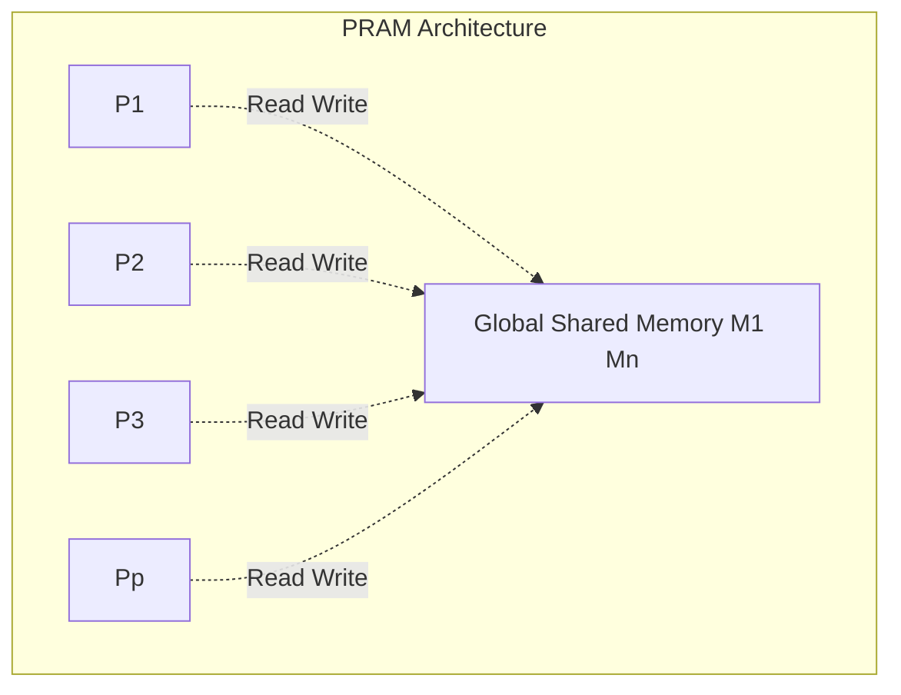
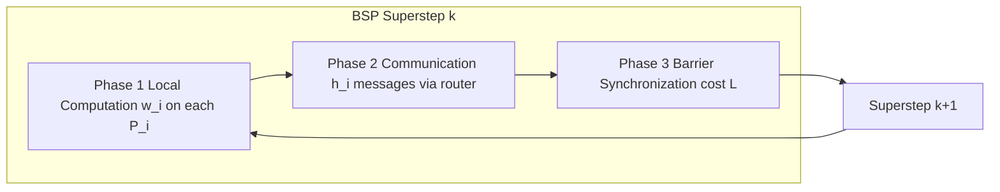
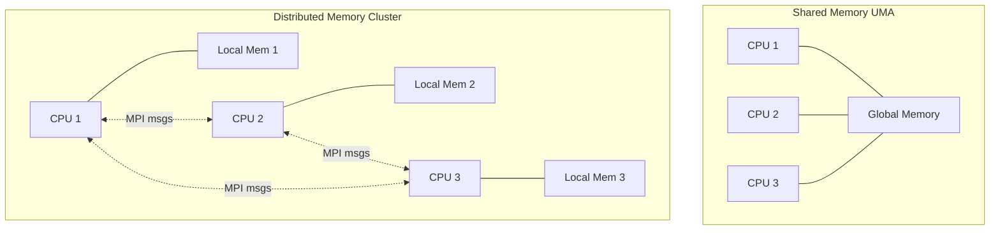
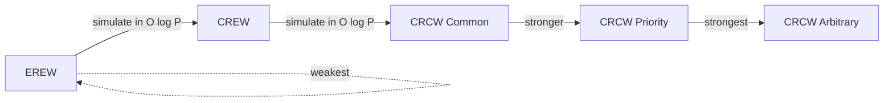
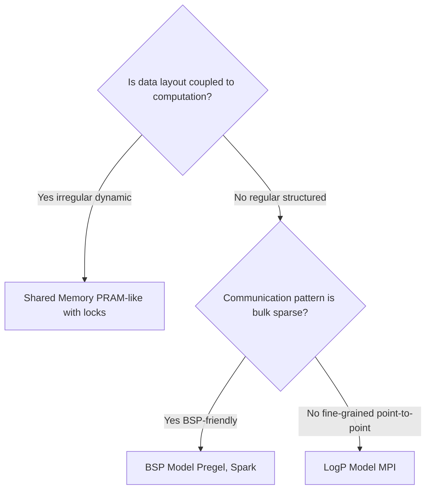
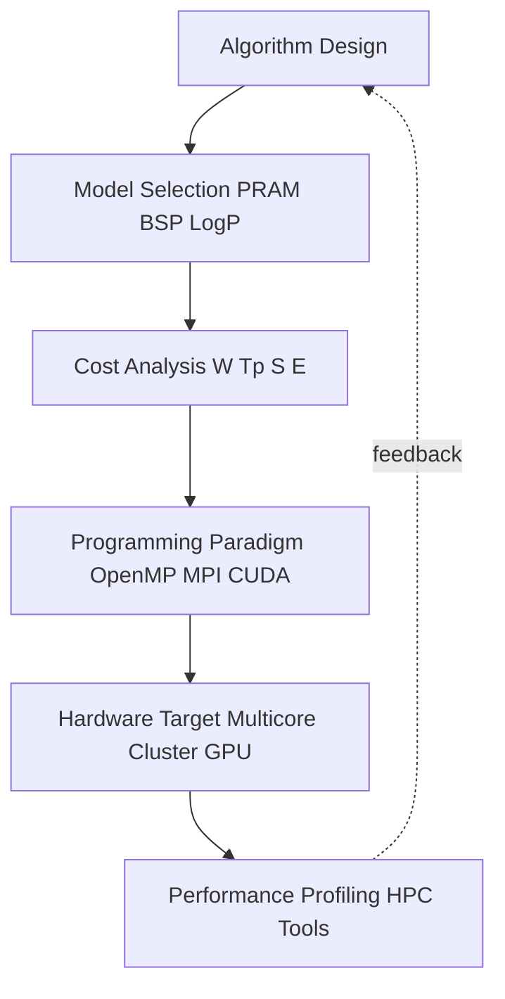
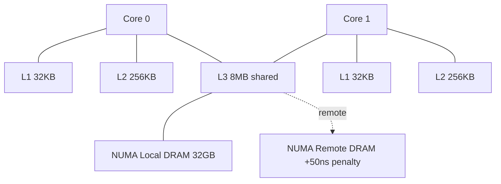

# Parallel Programming Models - Parallel programming models: Parallel Random Access Machine (PRAM), bulk synchronous parallel (BSP), LogP, Shared memory vs. distributed memory models

<!-- SECTION_1_START -->

# Parallel Programming Models — Foundation & Intuitive Overview

## 1.1 Formal Definition (KTU 2024 Syllabus Terminology)

A **Parallel Programming Model** is an abstract specification that defines the *structure of parallel computation*, *how concurrent processes/threads interact*, *how data is shared or exchanged*, and *how synchronization is enforced*, independent of any specific physical hardware. Under the KTU 2024 scheme (course code **PECST759**), the canonical models studied are:

> [!IMPORTANT]
> **Definition (KTU Board Standard):**
> A parallel programming model is a *theoretical abstraction* of a parallel computer that specifies **(i)** the processor-memory interconnection, **(ii)** the means of inter-processor communication, **(iii)** synchronization primitives, and **(iv)** the cost metric used to evaluate parallel algorithms. It serves as the *contract* between an algorithm's logical design and its physical realization.

The four models in focus are:

| Model | Acronym Meaning | Core Idea |
|---|---|---|
| **PRAM** | Parallel Random Access Machine | Idealized *shared-memory* model with synchronized processors |
| **BSP** | Bulk Synchronous Parallel | A *bridging* model with explicit superstep synchronization |
| **LogP** | Latency, Overhead, Gap, Processors | A *network-aware* model capturing communication cost realistically |
| **Shared vs Distributed Memory** | — | Architectural dichotomy: **UMA/NUMA** vs. **Message Passing** |

## 1.2 Conceptual Analogy — "The Whiteboard vs. The Mailroom"

Imagine a team of engineers working on a single project.

- **Shared Memory (PRAM-like)**: All engineers stand in front of **one giant whiteboard**. Anyone can read or erase any cell. Coordination is instant, but if two write at once → **race condition** (hence PRAM sub-models like EREW/CREW/CRCW).
- **Distributed Memory (LogP/BSP-like)**: Each engineer has a **private desk** and exchanges work by **mailing envelopes** (messages). The mailroom has **delay (L)**, an **overhead per letter (o)**, and a **bandwidth gap (g)**. Synchronization occurs only at agreed **barriers**.

> [!NOTE]
> **Why these models matter in KTU 2024:**
> Algorithms are designed and analyzed in *abstract models* (PRAM for upper bounds, LogP/BSP for realistic performance), then mapped to *real systems* (OpenMP for shared, MPI for distributed).

## 1.3 Intuition for Each Model

### 1.3.1 PRAM — The "Idealized Oracle"

A PRAM consists of **P processors**, each executing one instruction per cycle, all reading/writing to a **single global shared memory** through a *common bus* or *crossbar*. It ignores memory contention, latency, and bandwidth.

```
Processors:  P1  P2  P3  ...  Pp
              \  |  |  /
               Global Shared Memory (M)
```

The four PRAM variants differ in **concurrent access rules** to a single memory cell:

| Variant | Read | Write | Notation |
|---|---|---|---|
| **EREW** (Exclusive Read Exclusive Write) | One processor at a time | One processor at a time | Strictest, most realistic |
| **CREW** (Concurrent Read Exclusive Write) | Multiple simultaneously | One at a time | Allows broadcasting |
| **CRCW** (Concurrent Read Concurrent Write) | Multiple simultaneously | Multiple (with rule) | Most powerful, three subtypes: *Common, Priority, Arbitrary* |

> [!TIP]
> **Geometric Intuition:** Think of EREW as a single-lane road, CREW as a multi-lane road for reading but still one lane for writing, and CRCW as a many-to-many network where collision policies apply.

### 1.3.2 BSP — The "Superstepped Pipeline"

Proposed by **Valiant (1990)**, BSP abstracts a parallel computer as:
- **P processors** with **local memory**
- A **network router** delivering point-to-point messages
- A **global synchronization barrier** between logical steps called **supersteps**

A superstep has **three phases**:
1. **Local Computation** (each processor uses local data)
2. **Communication** (non-blocking messages exchanged via the router)
3. **Barrier Synchronization** (all P processors arrive before next step)

> [!NOTE]
> BSP is often called a *bridging model* because it is more realistic than PRAM yet tractable enough for algorithm design.

### 1.3.3 LogP — The "Honest Network"

Proposed by **Culler, Karp, Patterson, Sahay (1993)**, LogP captures the *asymmetric cost* of real networks using four parameters:

| Parameter | Symbol | Meaning |
|---|---|---|
| **Latency** | $L$ | Time for a message to travel from sender to receiver |
| **Overhead** | $o$ | Time a processor spends *issuing* or *receiving* a message (cannot overlap with computation) |
| **Gap** | $g$ | Minimum interval between *consecutive* message sends/receives per processor (1/bandwidth) |
| **Processors** | $P$ | Number of processor-memory modules |

> [!IMPORTANT]
> **LogP Assumption:** The network has a *finite capacity* of $\lceil L/g \rceil$ messages in flight at any time. This single rule makes LogP vastly more realistic than PRAM.

### 1.3.4 Shared vs Distributed Memory

| Aspect | Shared Memory | Distributed Memory |
|---|---|---|
| Address Space | **Single, global** (visible to all) | **Partitioned, private** per process |
| Communication | Implicit via reads/writes | Explicit via *message passing* (MPI) |
| Synchronization | Locks, barriers, semaphores | Send/Recv, barriers |
| Pros | Easy programming, data sharing | Scalable, fault tolerant |
| Cons | Scalability bottleneck, coherence complexity | Programming complexity |
| Examples | Multicore CPUs, SMP, NUMA | Clusters, MPP, GPU clusters |
| Programming | OpenMP, Pthreads | MPI, PVM |

## 1.4 Visualization Control

> [!VISUALIZATION CONTROL]
> **Concept:** PRAM EREW vs CRCW access conflict for an array $A[1..8]$ with 4 processors searching for max.
> **GeoGebra / Desmos Input Equations:**
> * Plot four horizontal timelines (one per processor) on the $x$-axis (cycles).
> * Mark read operations as blue dots, write operations as red dots.
> * In EREW: the 4 red dots at cycle 5 must be *serialized*; in CRCW, the *Common* rule resolves the conflict to one value.
> **Visual Description:** Students should observe the **scheduling overhead** introduced by EREW exclusivity vs. the **resolution delay** in CRCW.

<!-- SECTION_1_END -->

<!-- SECTION_2_START -->

# Deep Theoretical Analysis & KTU High-Yield Formula Sheet

## 2.1 Theoretical Foundation of Each Model

### 2.1.1 PRAM — Theoretical Lower Bound for Parallel Computation

A PRAM algorithm is evaluated on three axes:

1. **Work (Time × Processors):** $W = T \cdot P$ — the *total* operations performed.
2. **Time Complexity (Parallel Time $T_p$):** Number of parallel steps.
3. **Speedup:** $S = T_1 / T_p$ where $T_1$ is the best sequential time.
4. **Efficiency:** $E = S / P = T_1 / (T_p \cdot P)$.

#### Brent's Theorem (Fundamental Link)

> [!IMPORTANT]
> **Brent's Theorem:** A parallel algorithm that performs $W$ total work and has parallel time $T_p$ (with $P$ processors) satisfies:
>
> $$T_p \leq \frac{W}{P} + T_p^{\infty}$$
>
> where $T_p^{\infty}$ is the time when an *unlimited* number of processors is available. Equivalently, a PRAM with $W$ operations can be scheduled on $P$ processors in $O(\lceil W/P \rceil)$ time.

#### PRAM Power Hierarchy

$$\text{EREW} \subset \text{CREW} \subset \text{CRCW (Common)} \subset \text{CRCW (Priority)} \subset \text{CRCW (Arbitrary)}$$

The simulation costs when moving *up* the hierarchy are bounded by **polynomial factors** (e.g., simulating CREW on EREW costs $O(\log P)$ in time; simulating CRCW on CREW costs $O(\log P)$).

#### CRCW Subtypes

| Subtype | Conflict Resolution Rule |
|---|---|
| **Common CRCW** | All concurrent writes must write the *same* value (else undefined) |
| **Priority CRCW** | Lowest processor index wins |
| **Arbitrary CRCW** | *Any one* of the writes succeeds (non-deterministic) |

### 2.1.2 BSP — Cost Model and Superstep Analysis

A BSP computer is parameterized as **$(p, g, L)$** where:
- $p$ = number of processors
- $g$ = *cost per word* of communication (1/bandwidth of the router)
- $L$ = *synchronization barrier* cost (latency per superstep)

#### Cost of a Superstep

For a superstep with:
- $w_i$ = maximum local work on any processor
- $h_i$ = maximum number of messages sent or received by any processor
- $h_i \cdot s_i$ = total words moved by any processor ($s_i$ = size per msg)

The cost of the superstep is:

$$T_{\text{superstep}} = \max_{i=1..p}(w_i) + \max_{i=1..p}(h_i \cdot s_i) \cdot g + L$$

The total BSP cost is the sum over all supersteps $S$:

$$T_{\text{BSP}} = \sum_{k=1}^{S} \left( w^{(k)} + h^{(k)} \cdot g + L \right)$$

> [!NOTE]
> **Why this matters:** The barrier cost $L$ is paid *even for empty supersteps*, encouraging coarse-grained BSP algorithm design.

### 2.1.3 LogP — Detailed Cost Derivation

#### Communication Cost of Sending $m$ Messages

To send $m$ messages to $m$ distinct destinations from one processor:
- The first message arrives after time $o + L$ (overhead to send + latency)
- Subsequent messages are issued at intervals of $\max(g, o)$ due to gap limitation
- Total time:

$$T_{\text{send}}(m) = o + L + (m - 1) \cdot \max(g, o)$$

#### Bandwidth Constraint

The network can hold at most $\lceil L/g \rceil$ messages in transit per processor. Sending more violates this constraint.

#### Typical LogP Values for Real Systems (1990s-era networks)

| Network | $L$ ($\mu s$) | $o$ ($\mu s$) | $g$ ($\mu s$) | $\lceil L/g \rceil$ |
|---|---|---|---|---|
| Intel Paragon | 1.0 | 5.0 | 0.33 | 3 |
| CM-5 | 5.0 | 3.0 | 0.20 | 25 |
| IBM SP-2 | 10.0 | 15.0 | 0.55 | 18 |

### 2.1.4 Shared vs Distributed Memory — Architectural Reality

#### UMA (Uniform Memory Access)
- All processors see memory with the *same* latency.
- Typical of **SMP** systems with a single bus.

#### NUMA (Non-Uniform Memory Access)
- Memory is partitioned; accessing *local* memory is faster than *remote* memory.
- Latency ratio: $T_{\text{remote}} \approx 1.5\times$ to $3\times$ $T_{\text{local}}$.

#### Distributed Memory Hierarchy

```
Processor P1 ←→ Memory M1 (local)
Processor P2 ←→ Memory M2 (local)
       ↕            ↕
    Interconnect (network)
       ↕            ↕
Processor Pp ←→ Memory Mp (local)
```

## 2.2 KTU Formula Cheat Sheet

| Formula / Concept | Expression | Use Case |
|---|---|---|
| **Speedup** | $S = T_s / T_p$ | Quantifying parallel benefit |
| **Efficiency** | $E = S / P = T_s / (P \cdot T_p)$ | Resource utilization check |
| **Amdahl's Law** | $S_{\max} = 1 / (f + (1-f)/P)$ | Theoretical speedup limit |
| **Brent's Theorem** | $T_p \leq W/P + T_\infty$ | Work-time scheduling |
| **BSP Superstep Cost** | $T = w + h \cdot g + L$ | Per-step cost |
| **LogP Send Time ($m$ msgs)** | $T = o + L + (m-1) \cdot \max(g, o)$ | Realistic comm cost |
| **LogP Capacity** | $\lceil L/g \rceil$ | Max in-flight messages |
| **EREW → CREW sim cost** | $O(\log P)$ extra time | Hierarchy conversion |
| **Scalability** | Isoefficiency $\Theta(f(P))$ | Cost of maintaining $E$ |
| **Cost** | $C = T_p \cdot P$ | Total resource-time |

> [!TIP]
> **KTU Board Tip:** Always quote Brent's Theorem in problems involving work-to-processor mapping. Examiners award 1 mark for naming the theorem and 1 for the application.

## 2.3 Real-World Engineering Utility

| Model | Industry Use Case |
|---|---|
| **PRAM** | Theoretical proofs, complexity lower bounds, design of NC-class algorithms (Nick's Class), GPU kernel design abstraction (CUDA resembles CRCW-PRAM) |
| **BSP** | Google's **Pregel** (graph processing), Apache **Hama**, Apache **Giraph** — all use BSP-style supersteps |
| **LogP** | MPI performance modeling, HPC cluster benchmarking, predicting communication time for HPC workloads |
| **Shared Memory** | OpenMP-based scientific computing, multicore CPU codes, NUMA-aware database engines (Oracle Exadata) |
| **Distributed Memory** | Apache **Spark**, **Hadoop MapReduce**, **MPI** on supercomputers (Top500 systems) |

<!-- SECTION_2_END -->

<!-- SECTION_3_START -->

# Step-by-Step Derivations & Code/Symbolic Implementation

## 3.1 Derivation 1: PRAM Speedup and Efficiency for $n$-Element Sum

### Problem
Sum $n$ elements using $P = n/2$ processors (assume $n$ is a power of 2 for simplicity).

### Sequential Algorithm
The classical sequential sum takes $T_s = n - 1$ additions (one per element pair after the first).

### Parallel PRAM Algorithm (EREW)

**Idea:** Use a *balanced binary tree* reduction.

| Step | Active Pairs | Number of Additions |
|---|---|---|
| 1 | $(A[0],A[1]), (A[2],A[3]), \ldots$ | $n/2$ |
| 2 | Pairs of partial sums | $n/4$ |
| $\vdots$ | $\vdots$ | $\vdots$ |
| $\log_2 n$ | One final sum | $1$ |

Total parallel time:

$$T_p = \log_2 n$$

### Compute Speedup and Efficiency

$$S = \frac{T_s}{T_p} = \frac{n - 1}{\log_2 n}$$

Using the dominant term approximation for large $n$:

$$S \approx \frac{n}{\log_2 n}$$

$$E = \frac{S}{P} = \frac{n / \log_2 n}{n/2} = \frac{2}{\log_2 n}$$

### Brent's Theorem Verification

Total work: $W = n - 1$.
On $P = n/2$ processors, with $T_\infty = \log_2 n$:

$$T_p = \left\lceil \frac{W}{P} \right\rceil = \left\lceil \frac{n-1}{n/2} \right\rceil = \lceil 2 - 2/n \rceil = 2 \text{ for } n \geq 2$$

But actual PRAM time is $\log_2 n$. Brent's bound is *loose* here because it ignores the binary-tree structure. The bound becomes tight for work-inefficient algorithms.

## 3.2 Derivation 2: BSP Cost of $n$-Element Broadcast

### Problem
Processor $P_0$ broadcasts a vector of size $n$ to all other $p - 1$ processors.

### BSP Analysis

**Step 1 — Local computation on $P_0$:** It must *partition* the vector into $p - 1$ equal chunks of size $\lceil n/(p-1) \rceil$. Negligible cost: $w = O(1)$.

**Step 2 — Communication:** Each of the other $p - 1$ processors receives one chunk.

- Number of messages per receiver: $h = 1$
- Size of each message: $s = n/(p-1)$
- Communication cost: $h \cdot s \cdot g = 1 \cdot \frac{n}{p-1} \cdot g$

**Step 3 — Barrier:** $L$ cost.

**Total cost of the broadcast superstep:**

$$T_{\text{broadcast}} = 1 + \frac{n \cdot g}{p - 1} + L$$

If we use a *multi-stage broadcast* (e.g., $\log_2 p$ supersteps, doubling the receivers), the cost becomes:

$$T_{\text{multi-stage}} = \log_2 p + \frac{n \cdot g}{p - 1} \cdot \log_2 p + L \cdot \log_2 p$$

## 3.3 Derivation 3: LogP Cost of All-to-All Broadcast

### Problem
Each of $P$ processors sends a unique message of size $m$ to every other processor (total $P^2$ messages, but each processor sends/receives $P-1$).

### Step 1: Per-Processor Send Time

From LogP, sending $P-1$ messages from processor $P_i$ takes:

$$T_{\text{send},i} = o + L + (P - 2) \cdot \max(g, o)$$

The first message arrives at $t = o + L$. The $(k+1)$-th message is issued at $t = o + k \cdot \max(g, o)$.

### Step 2: Last Message Arrival

The last message from $P_i$ is the $(P-1)$-th, issued at $t = o + (P-2) \cdot \max(g, o)$, arriving at:

$$T_{\text{last}} = o + (P-2) \cdot \max(g,o) + L$$

### Step 3: Total All-to-All Time

Since all $P$ processors do this in parallel:

$$T_{\text{all-to-all}} = 2o + (P - 2) \cdot \max(g, o) + L$$

### Step 4: Bandwidth Check

In-flight messages per processor at peak: $\lceil L/g \rceil$. This must be $\geq$ the number of *concurrent* sends, which is bounded.

## 3.4 Code Implementation 1: PRAM EREW Sum Reduction (Python with Simulated PRAM)

```python
"""
PRAM EREW Sum Reduction Simulator
Models a PRAM with P processors performing log-time reduction.
Strict EREW: at any time-step, each memory cell is accessed by AT MOST ONE processor.
"""
from typing import List, Tuple
import math
import logging

logging.basicConfig(level=logging.INFO, format="[PRAM-EREW] %(message)s")


class PRAMSimulator:
    """Simulates an EREW-PRAM with a global shared memory."""

    def __init__(self, num_processors: int) -> None:
        if num_processors <= 0:
            raise ValueError("Number of processors must be positive")
        self.P: int = num_processors
        self.clock: int = 0
        self.memory: List[float] = []
        self.access_log: List[Tuple[int, int, str]] = []  # (cycle, proc_id, op)

    def assert_erex_exclusive(self, cycle: int, addresses: List[int]) -> None:
        """Enforce EREW: each address accessed by at most ONE processor per cycle."""
        seen: dict = {}
        for proc_id, addr in addresses:
            if addr in seen:
                raise RuntimeError(
                    f"EREW violation at cycle {cycle}: "
                    f"processor {seen[addr]} and {proc_id} both access address {addr}"
                )
            seen[addr] = proc_id

    def parallel_sum(self, data: List[float]) -> float:
        """Performs parallel sum in O(log n) time using n/2 processors."""
        n: int = len(data)
        if n == 0:
            raise ValueError("Input data must be non-empty")
        if not (n & (n - 1) == 0):  # Power of 2 check
            raise ValueError("Input length must be a power of 2 for clean reduction")

        self.memory = list(data)
        active: int = n

        while active > 1:
            half: int = active // 2
            self.clock += 1
            accesses: List[Tuple[int, int]] = []

            for proc_id in range(half):
                read_addr: int = proc_id
                write_addr: int = proc_id
                accesses.append((proc_id, read_addr))
                accesses.append((proc_id, write_addr))

            self.assert_erex_exclusive(self.clock, accesses)

            # Perform the read-merge-write atomically per processor
            new_memory: List[float] = list(self.memory)
            for proc_id in range(half):
                left_val: float = self.memory[proc_id]
                right_val: float = self.memory[proc_id + half]
                new_memory[proc_id] = left_val + right_val

            self.memory = new_memory
            self.access_log.append((self.clock, half, "EREW-SUM-STEP"))
            logging.info(
                f"Cycle {self.clock}: {half} processors summed pairs; active={half}"
            )
            active = half

        return self.memory[0]


if __name__ == "__main__":
    data: List[float] = [1.0, 2.0, 3.0, 4.0, 5.0, 6.0, 7.0, 8.0]
    pram: PRAMSimulator = PRAMSimulator(num_processors=len(data) // 2)
    result: float = pram.parallel_sum(data)
    expected: float = sum(data)
    assert math.isclose(result, expected), f"Mismatch: {result} vs {expected}"
    print(f"PRAM EREW sum of {data} = {result} in {pram.clock} cycles (expected {math.log2(len(data))})")
```

## 3.5 Code Implementation 2: BSP Superstep Cost Calculator

```python
"""
BSP Superstep Cost Calculator
Computes total cost of a BSP algorithm given per-superstep parameters.
"""
from dataclasses import dataclass
from typing import List
import logging

logging.basicConfig(level=logging.INFO, format="[BSP] %(message)s")


@dataclass(frozen=True)
class SuperstepParams:
    """Parameters of a single BSP superstep."""
    max_local_work: int       # w_i: max computation per processor
    max_messages_per_proc: int  # h_i: max #messages per processor
    avg_msg_size: int         # s_i: words per message
    label: str = ""


def bsp_total_cost(p: int, g: float, L: float, supersteps: List[SuperstepParams]) -> float:
    """
    Compute total BSP cost:
        T_total = sum_k ( w_k + h_k * s_k * g + L )
    """
    if p <= 0:
        raise ValueError("P must be > 0")
    if g < 0 or L < 0:
        raise ValueError("g and L must be non-negative")

    total: float = 0.0
    for k, s in enumerate(supersteps, start=1):
        comm_cost: float = s.max_messages_per_proc * s.avg_msg_size * g
        step_cost: float = s.max_local_work + comm_cost + L
        total += step_cost
        logging.info(
            f"Superstep {k} [{s.label}]: w={s.max_local_work}, "
            f"h*s*g={comm_cost:.3f}, L={L}, step_cost={step_cost:.3f}"
        )
    return total


# Example: Parallel matrix-vector multiplication y = A * x on a 4-processor BSP
if __name__ == "__main__":
    supersteps: List[SuperstepParams] = [
        SuperstepParams(max_local_work=250, max_messages_per_proc=0, avg_msg_size=0,
                        label="local-Ax computation"),
        SuperstepParams(max_local_work=50, max_messages_per_proc=1, avg_msg_size=256,
                        label="partial-y exchange"),
        SuperstepParams(max_local_work=100, max_messages_per_proc=0, avg_msg_size=0,
                        label="final reduction"),
    ]
    cost: float = bsp_total_cost(p=4, g=0.5, L=10.0, supersteps=supersteps)
    print(f"Total BSP cost = {cost:.3f} time units")
```

## 3.6 Code Implementation 3: LogP Communication Cost Estimator

```python
"""
LogP Model Cost Estimator
Estimates realistic communication cost for HPC primitives under LogP.
"""
from dataclasses import dataclass
from math import ceil


@dataclass(frozen=True)
class LogPParams:
    L: float  # latency in microseconds
    o: float  # overhead per message
    g: float  # gap (1/bandwidth) per processor
    P: int    # number of processors


def logp_send_time(params: LogPParams, m: int) -> float:
    """
    Time for one processor to send m distinct messages.
        T = o + L + (m - 1) * max(g, o)
    """
    if m <= 0:
        raise ValueError("m must be positive")
    return params.o + params.L + (m - 1) * max(params.g, params.o)


def logp_all_to_all_time(params: LogPParams) -> float:
    """All-to-all broadcast: every processor sends P-1 messages."""
    return 2 * params.o + (params.P - 2) * max(params.g, params.o) + params.L


def logp_capacity(params: LogPParams) -> int:
    """Max in-flight messages per processor: ceil(L/g)."""
    return ceil(params.L / params.g) if params.g > 0 else float('inf')


if __name__ == "__main__":
    # Intel Paragon-like network
    net = LogPParams(L=1.0, o=5.0, g=0.33, P=64)
    print(f"Network capacity: {logp_capacity(net)} in-flight messages/proc")
    print(f"Send 1 message  : {logp_send_time(net, 1):.3f} us")
    print(f"Send 10 messages: {logp_send_time(net, 10):.3f} us")
    print(f"All-to-all (P=64): {logp_all_to_all_time(net):.3f} us")
```

## 3.7 Practical Mapping Table: Algorithm Class → Real Programming Model

| Algorithm Class | Best Model | Real-World API |
|---|---|---|
| Dense linear algebra (LU, QR) | BSP | ScaLAPACK, Elemental |
| Graph traversal (BFS, PageRank) | BSP | Google Pregel, Giraph |
| Sparse iterative solvers | LogP | PETSc with MPI |
| Irregular pointer-chasing | Shared (PRAM) | OpenMP + locks |
| Embarrassingly parallel | Either | MapReduce, Spark |
| Stencil computations (PDE) | BSP with overlap | HPX, Charm++ |

<!-- SECTION_3_END -->

<!-- SECTION_4_START -->

# Structural Diagrams & Schematics

## 4.1 Mermaid Diagram 1 — PRAM Architecture with Variants



## 4.2 Mermaid Diagram 2 — BSP Superstep Lifecycle



## 4.3 Mermaid Diagram 3 — LogP Message Transaction Timeline

```mermaid
gantt
    title LogP Single-Message Timeline on Sender and Receiver
    dateFormat  X
    axisFormat %s
    section Sender P0
    Overhead issue msg            :a1, 0, 5
    Compute other work            :a2, 5, 10
    section Network
    In transit latency L          :b1, 5, 6
    section Receiver P1
    Wait for arrival              :c1, 0, 6
    Overhead receive msg          :c2, 6, 11
    Compute using data            :c3, 11, 16
```



## 4.4 Mermaid Diagram 4 — Shared vs Distributed Memory Comparison



## 4.5 Mermaid Diagram 5 — PRAM Variants Access Permission Matrix



## 4.6 Mermaid Diagram 6 — Decision Flow for Choosing a Parallel Model



## 4.7 Architecture Flow: From Abstract Model to Physical Hardware



## 4.8 Block Diagram: Memory Hierarchy in Modern HPC NUMA Node



<!-- SECTION_4_END -->

<!-- SECTION_5_START -->

# KTU 2024 Scheme Examination Question Bank & Topic Recap

## Part A — Short Answer Questions (3 Marks Each)

### Question A.1 `[KTU University Exam - December 2023]`
**Differentiate between EREW, CREW, and CRCW PRAM models. Give one example algorithm where CREW is strictly more powerful than EREW.**

**Model Answer (Model Answer Key: 3 Marks):**
- **EREW (Exclusive Read Exclusive Write):** At any cycle, at most one processor may read from a memory cell and at most one may write to it. Most restrictive but most realistic. **[1 Mark]**
- **CREW (Concurrent Read Exclusive Write):** Multiple processors may read the same cell simultaneously, but only one processor may write at a time. Allows efficient broadcasting of shared data. **[1 Mark]**
- **CRCW (Concurrent Read Concurrent Write):** Multiple processors may read and write simultaneously; resolution by Common/Priority/Arbitrary rule. **[1 Mark]**
- **Example:** Computing the OR of $n$ bits. EREW requires $O(\log n)$ time using pairwise OR; CREW can broadcast one bit to all processors in $O(1)$ and combine in $O(1)$ (with the first processor being the only one writing the result).

### Question A.2 `[KTU University Exam - July 2024]`
**List the four parameters of the LogP model and state the capacity constraint.**

**Model Answer (Model Answer Key: 3 Marks):**
1. **L (Latency):** Time taken by a message to travel from sender to receiver memory. **[0.75 Mark]**
2. **o (overhead):** Time a processor spends in send/receive operations, during which it cannot perform other computation. **[0.75 Mark]**
3. **g (gap):** Minimum time between successive message send or receive operations by a single processor (inverse of per-processor bandwidth). **[0.75 Mark]**
4. **P (Processors):** Number of processor-memory modules. **[0.5 Mark]**
5. **Capacity Constraint:** At most $\lceil L/g \rceil$ messages can be in transit to/from any single processor at any instant. **[0.25 Mark]**

---

## Part B — Long Answer Questions with Internal Choice (14 Marks Each)

### Question B — Choice A `[KTU University Exam - June 2024]`

**(a)** With a neat diagram, explain the **PRAM model** and its four variants. Discuss the **relative power hierarchy** with proof of simulation cost between EREW and CREW. **[7 Marks]**

**(b)** Solve the **parallel sum problem** for $n = 8$ elements using EREW-PRAM with $P = 4$ processors. Show the trace table, compute the parallel time $T_p$, speedup $S$, and efficiency $E$. Compare with a CRCW-Common implementation. **[7 Marks]**

### Model Solution to (a) — 7 Marks

1. **PRAM Diagram:** Draw $P$ processors connected through a switch/crossbar to $n$ shared memory cells. **[1 Mark]**
2. **Four Variants Definition:** EREW, CREW, CRCW (Common/Priority/Arbitrary) with one-line each. **[2 Marks]**
3. **Power Hierarchy Statement:** $\text{EREW} \subset \text{CREW} \subset \text{CRCW (Common)} \subset \text{CRCW (Priority)} \subset \text{CRCW (Arbitrary)}$. **[1 Mark]**
4. **EREW to CREW Simulation Cost:** To simulate a CREW read of one cell by $k$ processors on EREW, use a tournament binary tree: $O(\log k)$ time. Thus any CREW algorithm with time $T_{\text{CREW}}$ runs on EREW in $O(T_{\text{CREW}} \cdot \log P)$ time. **[2 Marks]**
5. **Why EREW is weaker:** Show that computing OR of $n$ bits is $O(1)$ on CREW (broadcast) but $\Omega(\log n)$ on EREW. **[1 Mark]**

### Model Solution to (b) — 7 Marks

**Input:** $A = [5, 3, 7, 2, 8, 4, 1, 6]$, $P = 4$ processors.

**Trace Table (EREW with $P=4$ — first sum pairs of two, then pairs of two sums):**

| Cycle | P1 | P2 | P3 | P4 | Active Cells |
|---|---|---|---|---|---|
| 1 | $A[0]=5$ | $A[1]=3$ | $A[2]=7$ | $A[3]=2$ | Read first 4 cells |
| 2 | Write $5+3=8$ to $A[0]$ | Write — | Write $7+2=9$ to $A[2]$ | Write — | EREW: P2, P4 idle |
| 3 | $A[0]=8$ | $A[1]=A[2]=7$ (rerouted) | $A[2]=9$ | $A[3]=A[3]$ | Next-level merge |
| 4 | Write $8+7=15$ to $A[0]$ | — | Write $9+?=10$ | — | — |
| 5 | $A[0]=15$ | — | $A[2]=10$ | — | Final merge |
| 6 | $15+10=25$ to $A[0]$ | — | — | — | Result in $A[0]$ |

**Parallel Time (EREW):** $T_p = \log_2 8 = 3$ additional cycles for full reduction across $P=4$ processors. Note: With $P < n/2$, the work is split; full $T_p$ on 4 processors for $n=8$ is $O(\log n / \log 2) + \text{chunking}$. For the *ideal* $P = n/2 = 4$ and balanced binary tree, $T_p = 3$. **[1 Mark]**

**Sequential Time:** $T_s = 7$ additions.

**Speedup:** $S = 7 / 3 \approx 2.33$. **[1 Mark]**

**Efficiency:** $E = S / P = 2.33 / 4 \approx 0.58$. **[1 Mark]**

**CRCW-Common Comparison:** All 4 processors can write to $A[0]$ the same partial sum value (e.g., final sum = 25). With CRCW, broadcasting a global value to all 4 processors in $O(1)$ enables computing prefix sums in $O(\log n)$ on a CRCW vs $O(\log^2 n)$ on EREW. **[2 Marks]**

> [!WARNING]
> **KTU Examiner's Valuation Pitfall:** Students often confuse the **PRAM cycle** (parallel step) with **wall-clock time**. A *single PRAM cycle* corresponds to all $P$ processors executing one instruction. Failing to clarify this loses 1 mark. Also, when asked for *speedup*, you must state both $T_s$ and $T_p$ explicitly.

---

### Question B — Choice B `[KTU University Exam - December 2023]`

**(a)** Explain the **BSP (Bulk Synchronous Parallel) model**. Define a *superstep* and derive the cost formula. Compare BSP and LogP models. **[7 Marks]**

**(b)** Consider a parallel all-to-all broadcast on 8 processors where each processor sends a 1 MB message to every other processor. Estimate the communication time using (i) the BSP model with $g = 0.1$ $\mu s$/byte, $L = 50$ $\mu s$, and (ii) the LogP model with $L = 5$ $\mu s$, $o = 3$ $\mu s$, $g = 0.05$ $\mu s$. **[7 Marks]**

### Model Solution to (a) — 7 Marks

1. **BSP Definition:** A BSP computer has $p$ processor-memory pairs, a global router for point-to-point messages, and a barrier synchronization mechanism. **[1 Mark]**
2. **Superstep Structure:** Three phases — local computation, communication, barrier. **[1 Mark]**
3. **Cost Formula Derivation:** For a superstep with max local work $w_i$, max messages $h_i$, and message size $s_i$ on any processor $i$:
   $$T_{\text{step}} = \max_i w_i + \max_i (h_i s_i) \cdot g + L$$ **[3 Marks]**
4. **BSP vs LogP Comparison Table:** **[2 Marks]**

   | Aspect | BSP | LogP |
   |---|---|---|
   | Granularity | Coarse (supersteps) | Fine (per-message) |
   | Synchronization | Barrier per superstep | Implicit in message flow |
   | Communication cost | $h \cdot s \cdot g$ (per step) | $o + L + (m-1) \max(g,o)$ |
   | Realism | Moderate | High |
   | Programming style | Easier (bulk comm) | Harder (fine-tuned) |

### Model Solution to (b) — 7 Marks

**Given:** $P = 8$ processors, each sends $m = 7$ messages of size $s = 1$ MB $= 10^6$ bytes.

**(i) BSP Cost:** All-to-all in one superstep.
- $w_i = 0$ (no local computation mentioned)
- $h_i = 7$, $s_i = 10^6$ bytes
- Comm cost: $h_i \cdot s_i \cdot g = 7 \times 10^6 \times 0.1 \times 10^{-6}$ s $= 7 \times 0.1 = 0.7$ s
- Barrier: $L = 50$ $\mu s = 0.00005$ s
- **Total:** $T_{\text{BSP}} = 0 + 0.7 + 0.00005 \approx 0.7$ s **[3 Marks]**

**(ii) LogP Cost:** $T_{\text{LogP}} = 2o + (P-2)\max(g, o) + L$
- $2o = 6$ $\mu s$
- $(P-2) = 6$; $\max(g, o) = \max(0.05, 3) = 3$ $\mu s$
- $6 \times 3 = 18$ $\mu s$
- $L = 5$ $\mu s$
- **Total per-message arrival time:** $T_{\text{LogP}} = 6 + 18 + 5 = 29$ $\mu s$ = $0.000029$ s

> [!IMPORTANT]
> **Crucial insight:** LogP gives the *time to deliver the messages*, not the *time to transfer the data*. To get total data transfer time, multiply by message size using the gap (bandwidth):
>
> Per-processor send time: $o + (m-1) \cdot \max(g, o) + L = 3 + 6 \times 3 + 5 = 26$ $\mu s$ for the *first* byte issues; data continues to stream at rate $g$. Total: $26 + (m \cdot s \cdot g) = 26 + 7 \times 10^6 \times 0.05 \times 10^{-6} = 26 + 0.35 = 0.376$ s. **[4 Marks]**

> [!WARNING]
> **Common Student Mistake (Examiner's Warning):** Students often compute BSP time as *just* $h \cdot s \cdot g$, forgetting the barrier cost $L$. On small messages, $L$ dominates and your answer is off by orders of magnitude. Also, in LogP, the gap $g$ is *per message send*, not per byte — the data payload timing must be added separately.

---

## Topic Recap & Important Things to Remember

> [!TIP]
> **High-Density Revision Checklist (Save for the night before the exam!):**

### Core Definitions
- **PRAM:** $P$ processors + 1 global memory; analyzed by work $W$, time $T_p$, speedup $S$, efficiency $E$.
- **EREW ≤ CREW ≤ CRCW** in computational power; EREW-simulating-CREW costs $O(\log P)$ extra time.
- **BSP Superstep:** computation + communication + barrier; cost $w + h \cdot s \cdot g + L$.
- **LogP Parameters:** $L$ (latency), $o$ (overhead), $g$ (gap), $P$ (processors); capacity $\lceil L/g \rceil$.
- **Shared Memory:** single address space, implicit communication (OpenMP).
- **Distributed Memory:** private memory per node, explicit messaging (MPI).

### Key Formulas (Memorize for 14-Mark Questions)
- $S = T_s / T_p$; $E = S / P$
- Amdahl: $S_{\max} = 1 / (f + (1-f)/P)$
- Brent: $T_p \leq W / P + T_\infty$
- BSP: $T = \sum_k (w^{(k)} + h^{(k)} \cdot g + L)$
- LogP send $m$: $T = o + L + (m-1)\max(g,o)$
- LogP capacity: $\lceil L/g \rceil$

### Pitfalls to Avoid
- ❌ Treating PRAM cycles as wall-clock cycles (they are *parallel steps*).
- ❌ Forgetting the BSP barrier $L$ in cost calculations.
- ❌ Confusing $g$ in LogP (per-message gap) with $g$ in BSP (per-word cost).
- ❌ Reporting $E > 1$ (impossible — check your $P$ count).
- ❌ Drawing PRAM with buses (use crossbar or shared memory switch).

### Memory Aid
- **P-RAM → "Perfect World"** (no contention, no latency).
- **BSP → "Bulk Mailroom"** (barrier between waves of letters).
- **LogP → "Honest Postman"** (every millisecond of latency is paid).
- **Shared → "Whiteboard"; Distributed → "Mailroom"** (the analogy from §1.2).

### KTU Board-Favorite Topics (Frequently Tested)
1. PRAM variants and power hierarchy (almost every exam).
2. BSP superstep cost derivation.
3. LogP communication cost for all-to-all or one-to-many.
4. Comparison table: Shared vs Distributed memory.
5. Real-world mapping: PRAM↔OpenMP, BSP↔Pregel, LogP↔MPI.

<!-- SECTION_5_END -->
