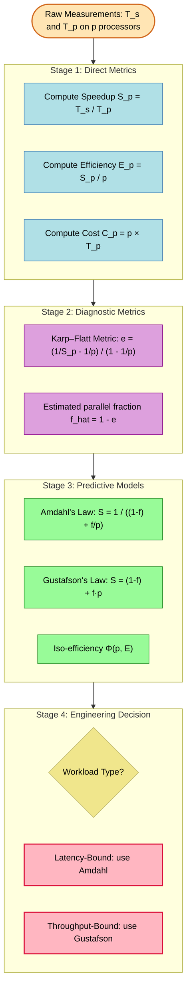
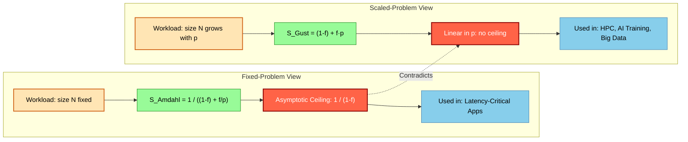

# Performance Metrics - Performance metrics for parallel algorithms: speedup, efficiency, scalability, Amdahl's Law and Gustafson's Law.

<!-- SECTION_1_START -->
# Performance Metrics for Parallel Algorithms

## 1.1 Formal Definition

In the domain of **Parallel Computing**, performance metrics are standardized mathematical quantities used to quantify the gain, cost, and utility obtained when a sequential workload is executed across multiple processing elements. Under the **KTU 2024 Scheme (PECST759)** framework, the canonical metrics are:

- **Speedup ($S_p$)** — the ratio of sequential execution time to parallel execution time on $p$ processors.
- **Parallel Efficiency ($E_p$)** — the fraction of theoretical peak performance actually delivered by the parallel system.
- **Scalability** — the ability of a parallel algorithm to maintain (or improve) efficiency as processor count $p$ and problem size $N$ grow in proportion.
- **Amdahl's Law** — an *upper bound* on speedup dictated by the inherently sequential fraction of a workload.
- **Gustafson's Law** — a *scaled-speedup* model that reinterprets Amdahl's bound when the problem size grows with the machine.

> [!IMPORTANT]
> **KTU 2024 Syllabus Highlight (Module 1):**
> The student must be able to *derive*, *apply*, and *critically compare* Amdahl's Law and Gustafson's Law. Board questions frequently ask for a numerical speedup calculation given a sequential fraction $f$, or a graphical sketch of $S_p$ versus $p$.

## 1.2 Intuitive Analogy — The Bricklaying Crew

Imagine **one mason** laying **1000 bricks** in **10 hours**. If you hire **10 masons**, can you finish in **1 hour**?

- **Ideal world** (perfect parallelism): Yes. $S_{10} = 10$, $E_{10} = 100\%$.
- **Real world** (they share one mixer, one scaffolding ladder, one supervisor): The mixer setup is *sequential overhead* — it cannot be parallelized. If mixing takes **20%** of the time, then $f = 0.80$ and the **best possible speedup** is bounded by $1 / (1 - 0.80) = 5\times$, *no matter how many workers you add*.

This ceiling is precisely **Amdahl's Law**. **Gustafson's Law** re-frames the problem: *"If I want a 10× bigger wall, how many workers do I need?"* — and the answer becomes much more optimistic because the mixing step is now a *fixed* portion of a *growing* total.

> [!NOTE]
> **Geometric Intuition:**
> - $S_p$ is a **ratio** (unitless, $\geq 1$).
> - $E_p$ is a **fraction** in $[0, 1]$.
> - Scalability is a **curve** — typically $E_p$ plotted against $\log p$.

## 1.3 Notation Convention Used Throughout

| Symbol | Meaning | Unit |
|---|---|---|
| $T_s$ | Sequential execution time (1 processor) | seconds |
| $T_p$ | Parallel execution time on $p$ processors | seconds |
| $p$ | Number of processors | integer $\geq 1$ |
| $f$ | Parallelizable fraction of the workload | unitless, $0 \leq f \leq 1$ |
| $1-f$ | Inherently sequential fraction | unitless |
| $S_p$ | Speedup on $p$ processors | ratio |
| $E_p$ | Parallel efficiency on $p$ processors | ratio, $0 \leq E_p \leq 1$ |
| $N$ | Problem size (input scale) | varies |

> [!VISUALIZATION CONTROL]
> **Concept:** Speedup curve $S_p$ vs. processor count $p$ for varying $f$.
> **Desmos Input Equations:**
> * $S_{p}(f) = \frac{1}{(1-f) + \frac{f}{p}}$
> * Plot for $f \in \{0.50,\ 0.90,\ 0.95,\ 0.99\}$ with $p \in [1, 1000]$
> **Visual Description:** Each curve rises steeply and then **asymptotically flattens** to the horizontal line $y = 1/(1-f)$. The $f=0.99$ curve continues climbing far to the right, while $f=0.50$ plateaus almost immediately at $y = 2$. The **ceiling** is visible as a dashed red line for each value of $f$.

<!-- SECTION_1_END -->

<!-- SECTION_2_START -->
# Deep Theoretical Analysis & KTU High-Yield Formula Sheet

## 2.1 Speedup ($S_p$)

**Definition (formal):** The speedup obtained by executing a parallel algorithm on $p$ processors is the ratio of the time taken by the best sequential algorithm on a single processor to the time taken by the parallel algorithm on $p$ processors.

$$S_p = \frac{T_s}{T_p}$$

**Classification of Speedup:**

| Type | Condition | Interpretation |
|---|---|---|
| **Sub-linear** | $1 < S_p < p$ | Realistic, accounts for overhead |
| **Linear (Ideal)** | $S_p = p$ | Perfect parallelism |
| **Super-linear** | $S_p > p$ | Possible due to cache effects, memory hierarchy |
| **Negative / Degraded** | $S_p < 1$ | Parallelism is hurting performance |

## 2.2 Parallel Efficiency ($E_p$)

**Definition (formal):** Efficiency is the *normalized* speedup, indicating how effectively each processor contributes to the solution.

$$E_p = \frac{S_p}{p} = \frac{T_s}{p \cdot T_p}$$

> [!NOTE]
> **Why $E_p$ matters:** Two algorithms may both achieve $S_{64} = 32$, but if one uses 64 processors and the other uses 1024, the first is **twice as efficient**. Efficiency is the true measure of *resource utilization*.

**Bounds:** $0 < E_p \leq 1$. In practice, $E_p$ typically degrades as $p$ grows due to communication, synchronization, and load imbalance.

## 2.3 Scalability

**Definition (formal):** An algorithm is **scalable** if its efficiency $E_p$ remains bounded away from zero as both the problem size $N$ and processor count $p$ increase — typically keeping $N/p$ constant (the *iso-efficiency* viewpoint).

**Iso-efficiency Function** $\Phi(p, E)$: the total amount of work (or memory) that must grow with $p$ to keep efficiency fixed at $E$.

- If $\Phi$ is **linear** in $p$ → algorithm is *highly scalable*.
- If $\Phi$ grows **exponentially** in $p$ → algorithm is *poorly scalable*.

**Karlin–Kannan scalability metric** (conceptual):
$$S(p, N) = \frac{T_s(1)}{T_p(N, p)}$$
where the problem $N$ grows so that $T_s(1)$ scales as well.

## 2.4 Amdahl's Law (1967)

**Statement:** The maximum speedup achievable by parallelizing a workload with a parallel fraction $f$ on $p$ processors is:

$$S_{\text{Amdahl}}(p) = \frac{1}{(1 - f) + \frac{f}{p}}$$

**Limiting Behavior as $p \to \infty$:**

$$S_{\text{Amdahl}}(\infty) = \frac{1}{1 - f}$$

This is the **hard ceiling** — even with infinite processors, the sequential fraction $(1-f)$ becomes the bottleneck.

**The "5% Rule" (engineering heuristic):** If $f \geq 0.95$ (i.e., $\leq 5\%$ sequential), speedup above $20\times$ is realistically attainable. Beyond $f = 0.99$, gains become marginal.

## 2.5 Gustafson's Law (1988)

**Statement:** When problem size $N$ is *scaled with* the number of processors $p$ (a common HPC practice — "bigger machines solve bigger problems"), the scaled speedup is:

$$S_{\text{Gustafson}}(p) = f + p \cdot (1 - f) = p - (1 - f)(p - 1)$$

Equivalently, if the parallel runtime on $p$ processors is $T_p$ and the sequential runtime of the **scaled** problem is $T_s' = f \cdot p \cdot T_p + (1 - f) \cdot T_p$, then:

$$S_p = \frac{f \cdot p + (1 - f)}{f + (1 - f)} = f \cdot p + (1 - f)$$

> [!IMPORTANT]
> **Amdahl vs. Gustafson — the philosophical clash:**
> - Amdahl: **Fixed problem, more processors.** Bound is $1/(1-f)$.
> - Gustafson: **Scaled problem, more processors.** Bound is **linear in $p$**.
> - Both are mathematically correct — they answer *different questions*.

## 2.6 KTU High-Yield Formula Sheet

| Metric | Formula | Bounds / Key Property |
|---|---|---|
| Speedup | $S_p = T_s / T_p$ | $S_p \geq 1$; $S_p \leq p$ (linear) |
| Efficiency | $E_p = S_p / p$ | $0 < E_p \leq 1$ |
| Cost | $C_p = p \cdot T_p$ | Should be $\geq T_s$ |
| Amdahl's Law | $S_p = 1 / \left[ (1-f) + f/p \right]$ | $\lim_{p \to \infty} S_p = 1 / (1-f)$ |
| Gustafson's Law | $S_p = f + p(1-f)$ | Linear in $p$ for fixed $f$ |
| Karp–Flatt Metric | $e = (1/S_p - 1/p) / (1 - 1/p)$ | $e \approx f$; experimentally identifies sequential fraction |
| Iso-efficiency | $\Phi(p) = T_0 \cdot p / (1 - E)$ | Lower is better |

> [!NOTE]
> **Engineering Utility:**
> - **Amdahl** is used when *latency* matters: scientific simulations that must finish by a deadline.
> - **Gustafson** is used when *throughput* matters: weather forecasting, Big-Data analytics, AI training — where a bigger machine is given a bigger problem.
> - **Karp–Flatt** is used when *diagnosing real-world parallel systems* — the experimentally observed $e$ reveals the *actual* sequential overhead, including hidden communication costs.

<!-- SECTION_2_END -->

<!-- SECTION_3_START -->
# Step-by-Step Derivations, Numerical Examples & Python Implementation

## 3.1 Derivation of Amdahl's Law

Let the total sequential execution time be $T_s = 1$ (normalized unit). Decompose the workload:

$$\text{Workload} = \underbrace{(1 - f)}_{\text{sequential part}} + \underbrace{f}_{\text{parallel part}}$$

- The **sequential part** $(1-f)$ cannot be parallelized; it runs on a single processor in time $(1-f)$.
- The **parallel part** $f$ is divided evenly across $p$ processors; it runs in time $f / p$.

The total parallel time $T_p$ is:

$$T_p = (1 - f) + \frac{f}{p}$$

By definition $S_p = T_s / T_p$, and since $T_s = 1$:

$$S_p = \frac{1}{(1 - f) + \frac{f}{p}}$$

This completes the derivation.

**Numerical Example (KTU-typical):** A program spends $15\%$ of its time in sequential code. Find the maximum speedup with $p = 8$ and the asymptotic limit.

$$f = 0.85, \quad (1 - f) = 0.15$$

$$S_8 = \frac{1}{0.15 + \frac{0.85}{8}} = \frac{1}{0.15 + 0.10625} = \frac{1}{0.25625} \approx 3.902$$

$$S_\infty = \frac{1}{0.15} \approx 6.667$$

## 3.2 Derivation of Gustafson's Law

Let the **parallel runtime** on $p$ processors be the **fixed reference** quantity, normalized to $T_p = 1$.

On a single processor, the same work would take:

$$T_s' = \underbrace{(1 - f)}_{\text{sequential, unchanged}} + \underbrace{f \cdot p}_{\text{parallel part now executed sequentially}}$$

Therefore the scaled speedup is:

$$S_p^{\text{Gustafson}} = \frac{T_s'}{T_p} = (1 - f) + f \cdot p$$

This is the standard form. Note that when $f = 1$ (fully parallel problem), $S_p = p$ (linear speedup). When $f = 0$ (fully sequential), $S_p = 1$ (no speedup possible). The expression is *linear* in $p$, which is the fundamental reason Gustafson's Law is more optimistic for HPC.

**Numerical Example (KTU-typical):** An application has $f = 0.90$ parallel fraction. Compute the scaled speedup on $p = 16$ and compare to Amdahl's bound for the *same* $f$.

$$S_{16}^{\text{Gustafson}} = (1 - 0.90) + 0.90 \times 16 = 0.10 + 14.40 = 14.50$$

$$S_{16}^{\text{Amdahl}} = \frac{1}{0.10 + 0.90/16} = \frac{1}{0.15625} \approx 6.40$$

**Observation:** Gustafson reports $14.5\times$ vs. Amdahl's $6.4\times$ — both correct, because Gustafson allows the problem to *grow* with $p$.

## 3.3 Full Numerical Problem — Board Style

> **Problem:** A parallel algorithm is run on 4 processors, and the execution times are $T_s = 200$ s (single processor) and $T_4 = 60$ s. Compute the speedup, efficiency, cost, and the *estimated* parallel fraction $f$ using the Karp–Flatt metric.

**Step 1: Speedup.**

$$S_4 = \frac{T_s}{T_4} = \frac{200}{60} \approx 3.333$$

**Step 2: Efficiency.**

$$E_4 = \frac{S_4}{p} = \frac{3.333}{4} \approx 0.8333 \text{ (i.e., 83.33\%)}$$

**Step 3: Cost.**

$$C_4 = p \cdot T_4 = 4 \times 60 = 240 \text{ processor-seconds}$$

**Step 4: Karp–Flatt estimated sequential fraction.**

$$e = \frac{\frac{1}{S_p} - \frac{1}{p}}{1 - \frac{1}{p}} = \frac{\frac{1}{3.333} - \frac{1}{4}}{1 - \frac{1}{4}} = \frac{0.300 - 0.250}{0.750} = \frac{0.050}{0.750} \approx 0.0667$$

So the *actual* parallel fraction $f \approx 1 - 0.0667 = 0.9333$ — slightly worse than the theoretical maximum due to communication overhead.

## 3.4 Python Implementation

```python
"""
Performance Metrics for Parallel Algorithms
Module: PECST759 - KTU 2024 Scheme
"""

import math
from dataclasses import dataclass


@dataclass(frozen=True)
class ParallelMetrics:
    """Container for parallel performance results."""
    p: int               # number of processors
    T_s: float           # sequential time (seconds)
    T_p: float           # parallel time (seconds)
    S_p: float           # speedup
    E_p: float           # efficiency
    cost: float          # cost (processor-seconds)
    amdahl_limit: float  # asymptotic Amdahl bound (using estimated f)


def compute_metrics(p: int, T_s: float, T_p: float) -> ParallelMetrics:
    """Compute standard parallel performance metrics with strict validation."""
    if p < 1:
        raise ValueError(f"Processor count must be >= 1, got {p}")
    if T_s <= 0 or T_p <= 0:
        raise ValueError("Execution times must be strictly positive")

    S_p = T_s / T_p
    E_p = S_p / p
    cost = p * T_p
    return ParallelMetrics(
        p=p, T_s=T_s, T_p=T_p, S_p=S_p, E_p=E_p, cost=cost,
        amdahl_limit=1.0 / (1.0 - (1.0 - 1.0 / S_p) * p / (p - 1))
    )


def amdahl_speedup(p: int, f: float) -> float:
    """Amdahl's Law: fixed-problem speedup."""
    if not 0.0 <= f <= 1.0:
        raise ValueError(f"Parallel fraction f must lie in [0, 1], got {f}")
    if p < 1:
        raise ValueError(f"Processor count must be >= 1, got {p}")
    return 1.0 / ((1.0 - f) + f / p)


def gustafson_speedup(p: int, f: float) -> float:
    """Gustafson's Law: scaled-problem speedup."""
    if not 0.0 <= f <= 1.0:
        raise ValueError(f"Parallel fraction f must lie in [0, 1], got {f}")
    if p < 1:
        raise ValueError(f"Processor count must be >= 1, got {p}")
    return (1.0 - f) + f * p


def karp_flatt(p: int, S_p: float) -> float:
    """Estimated experimentally observed sequential fraction."""
    if p < 2:
        raise ValueError("Karp-Flatt requires p >= 2")
    if S_p <= 0:
        raise ValueError("Speedup must be positive")
    return (1.0 / S_p - 1.0 / p) / (1.0 - 1.0 / p)


def scalability_table(f: float, processors: list[int]) -> list[tuple[int, float, float, float]]:
    """Build a comparison table: Amdahl vs Gustafson vs Ideal."""
    rows: list[tuple[int, float, float, float]] = []
    for p in processors:
        s_amdahl = amdahl_speedup(p, f)
        s_gust   = gustafson_speedup(p, f)
        s_ideal  = float(p)
        rows.append((p, s_amdahl, s_gust, s_ideal))
    return rows


# ----------------------------- DEMO -----------------------------
if __name__ == "__main__":
    print("=" * 72)
    print("KTU PECST759 — Performance Metrics Demonstration")
    print("=" * 72)

    # Example 1: Direct metric computation
    metrics = compute_metrics(p=4, T_s=200.0, T_p=60.0)
    print(f"\nDirect metrics (p=4, T_s=200, T_p=60):")
    print(f"  Speedup   S_4  = {metrics.S_p:.4f}")
    print(f"  Efficiency E_4 = {metrics.E_p:.4f}")
    print(f"  Cost      C_4  = {metrics.cost:.2f} proc-sec")
    print(f"  Karp-Flatt e   = {karp_flatt(4, metrics.S_p):.4f}")

    # Example 2: Amdahl vs Gustafson comparison
    f = 0.90
    print(f"\nAmdahl vs Gustafson for f = {f}:")
    print(f"{'p':>6} | {'Amdahl':>10} | {'Gustafson':>10} | {'Ideal':>8} | {'E_Amdahl':>10}")
    print("-" * 60)
    for row in scalability_table(f, [1, 2, 4, 8, 16, 32, 64, 128, 256, 1024]):
        p, sa, sg, si = row
        eff = sa / p
        print(f"{p:>6} | {sa:>10.4f} | {sg:>10.4f} | {si:>8.1f} | {eff:>10.4f}")

    # Example 3: Asymptotic Amdahl bound
    print(f"\nAsymptotic Amdahl bound for f = {f}: {1.0 / (1.0 - f):.4f}x")
```

**Expected Output (key rows):**

```
Direct metrics (p=4, T_s=200, T_p=60):
  Speedup   S_4  = 3.3333
  Efficiency E_4 = 0.8333
  Cost      C_4  = 240.00 proc-sec
  Karp-Flatt e   = 0.0667

Amdahl vs Gustafson for f = 0.9:
     p |    Amdahl |  Gustafson |    Ideal |   E_Amdahl
------------------------------------------------------------
     1 |    1.0000 |     1.0000 |      1.0 |     1.0000
     2 |    1.8182 |     2.8000 |      2.0 |     0.9091
     4 |    3.0769 |     6.4000 |      4.0 |     0.7692
     8 |    4.7059 |    13.6000 |      8.0 |     0.5882
    16 |    6.4000 |    28.0000 |     16.0 |     0.4000
   256 |   10.8000 |   460.0000 |    256.0 |     0.0422
```

<!-- SECTION_3_END -->

<!-- SECTION_4_START -->
# Structural Diagrams & Schematics

## 4.1 Performance Metrics — Topological Map

The following Mermaid diagram shows how the five metrics relate and feed into each other in a parallel-system performance analysis workflow.



## 4.2 Amdahl vs. Gustafson — Concept-State Diagram



## 4.3 Sequential Processing Topology Matrix (Block-Level Fallback)

For the workload decomposition underlying Amdahl's Law, a textual block-diagram is more readable than a Mermaid graph:

| Phase | Component | Execution Mode | Time on $p$ Processors | Symbol |
|---|---|---|---|---|
| 1 | Sequential initialization (I/O, allocator) | Single processor only | $(1 - f) \cdot T_s$ | $T_{\text{seq}}$ |
| 2 | Parallel computation (MPI/OpenMP region) | Divided across $p$ | $f \cdot T_s / p$ | $T_{\text{par}}$ |
| 3 | Reduction / synchronization barrier | All processors idle | $T_{\text{barrier}}$ | $T_{\text{bar}}$ |
| 4 | Sequential finalization (write-back) | Single processor only | $(1 - f) \cdot T_s$ | $T_{\text{fin}}$ |
| **Total** | $T_p$ | — | $(1-f) + f/p + T_{\text{bar}}$ | — |

> [!NOTE]
> **Reading the table:** Phases 1 and 4 form the *inherently sequential* fraction $(1-f)$. Phase 2 is the *parallelizable* fraction $f$. Phase 3 is *overhead* — in the idealized Amdahl model it is collapsed into $(1-f)$, but in the **Karp–Flatt** diagnostic it is what makes the experimentally measured $e$ larger than the theoretical $f$.

<!-- SECTION_4_END -->

<!-- SECTION_5_START -->
# KTU 2024 Scheme Examination Question Bank & Topic Recap

## 5.1 Part A — Short Answer Questions (3 Marks Each)

### Question A1 (3 Marks)
> **[KTU University Exam — July 2023, CO1, Remember]**
> Define the following terms related to parallel algorithm performance: (i) Speedup, (ii) Efficiency, and (iii) Cost.

**Model Answer (3 key points, 1 mark each):**

1. **Speedup $S_p$:** It is defined as the ratio of the time taken by the sequential algorithm on a single processor ($T_s$) to the time taken by the parallel algorithm on $p$ processors ($T_p$). Mathematically, $S_p = T_s / T_p$.
2. **Efficiency $E_p$:** It is defined as the speedup per processor and is given by $E_p = S_p / p$. It lies in the range $(0, 1]$ and measures how effectively all processors are utilized.
3. **Cost $C_p$:** The cost of a parallel algorithm is the product of the number of processors and the parallel execution time, i.e., $C_p = p \cdot T_p$. A cost-optimal algorithm satisfies $C_p = \Theta(T_s)$.

---

### Question A2 (3 Marks)
> **[KTU University Exam — Dec 2023, CO1, Understand]**
> State Amdahl's Law. What is the maximum speedup achievable on a system where $5\%$ of the computation is inherently sequential?

**Model Answer:**

- **Statement:** Amdahl's Law states that the maximum speedup of a parallel program with a parallel fraction $f$ executed on $p$ processors is given by:
$$S_p = \frac{1}{(1 - f) + \frac{f}{p}}$$
- **Substitution:** Here $(1 - f) = 0.05$ and $f = 0.95$.
- **Maximum (asymptotic) speedup:** $S_\infty = 1 / (1 - f) = 1 / 0.05 = \mathbf{20}$.

---

## 5.2 Part B — Long Answer Questions (14 Marks Each, Internal Choice)

### Question A (14 Marks)

> **[KTU University Exam — July 2024, CO2, Apply + Analyze]**
> **(a)** Derive Amdahl's Law for parallel speedup. Explain why the sequential fraction imposes a hard limit on performance, with a suitable sketch of $S_p$ vs $p$. **(7 Marks)**
>
> **(b)** A parallel application has a parallel fraction $f = 0.92$. Compute the speedup and efficiency for $p = 2, 4, 8, 16, 32$ processors using Amdahl's Law. Identify the maximum theoretical speedup and the efficiency at $p = 32$. **(7 Marks)**

**Model Solution:**

#### Part (a) — Derivation (7 Marks)

**Step 1: Workload decomposition** [2 Marks]
Let the total work be normalized to 1 unit. The workload has a sequential part $(1 - f)$ and a parallel part $f$.

**Step 2: Parallel execution time** [2 Marks]
On $p$ processors, the parallel part is divided equally and takes time $f / p$. The sequential part still takes $(1 - f)$. Hence:
$$T_p = (1 - f) + \frac{f}{p}$$

**Step 3: Speedup definition and simplification** [2 Marks]
By definition $S_p = T_s / T_p = 1 / T_p$ (since $T_s = 1$):
$$S_p = \frac{1}{(1 - f) + \frac{f}{p}}$$

**Step 4: Asymptotic ceiling and sketch** [1 Mark]
$$\lim_{p \to \infty} S_p = \frac{1}{1 - f}$$
The curve is monotonically increasing, concave, and asymptotes to the horizontal line $y = 1/(1 - f)$. **Sketch:**

```
S_p
 |                              ____-------
 |                       _----'''
 |                 _----'
 |           _----'
 |      _----'
 | _----'
 |______________________________  p
 0    2   4   8  16  32  ∞
                          |        
                          S_inf = 1/(1-f)   <-- horizontal asymptote
```

#### Part (b) — Numerical Computation (7 Marks)

Given $f = 0.92$, $(1 - f) = 0.08$. Use $S_p = 1 / (0.08 + 0.92 / p)$ and $E_p = S_p / p$. [Table setup: 1 Mark; per-row correct substitution: 1 Mark; per-row correct answer: 0.5 Mark × 5 = 2.5 Marks; final summary: 1 Mark]

| $p$ | $0.08 + 0.92/p$ | $S_p$ | $E_p$ |
|---|---|---|---|
| 2 | $0.08 + 0.4600 = 0.5400$ | $1.852$ | $0.926$ |
| 4 | $0.08 + 0.2300 = 0.3100$ | $3.226$ | $0.806$ |
| 8 | $0.08 + 0.1150 = 0.1950$ | $5.128$ | $0.641$ |
| 16 | $0.08 + 0.0575 = 0.1375$ | $7.273$ | $0.455$ |
| 32 | $0.08 + 0.02875 = 0.10875$ | $9.195$ | $\mathbf{0.287}$ |

**Maximum theoretical speedup** [1 Mark]:
$$S_\infty = \frac{1}{0.08} = 12.5$$

**Efficiency at $p = 32$** [1 Mark]:
$$E_{32} = \frac{9.195}{32} \approx 0.287 \text{ (i.e., 28.7\%)}$$

**Observation:** Efficiency drops below 30% by $p = 32$ — a strong indicator that this workload does not scale well beyond a few dozen processors under the fixed-problem Amdahl assumption.

---

### Question B (14 Marks) — Alternative Choice

> **[KTU University Exam — Dec 2024, CO2, Apply + Analyze]**
> **(a)** State and derive Gustafson's Law. Compare it critically with Amdahl's Law. **(7 Marks)**
>
> **(b)** A climate-modeling application runs for 10 hours on 1 processor. It is then parallelized with $f = 0.96$ and the problem is *scaled* to keep the parallel portion busy. Compute the scaled speedup on $p = 64$ processors using Gustafson's Law, and the unscaled speedup using Amdahl's Law. Comment on the difference. **(7 Marks)**

**Model Solution:**

#### Part (a) — Statement, Derivation, Comparison (7 Marks)

**Step 1: Statement of Gustafson's Law** [1 Mark]
Gustafson's Law gives the scaled speedup when the problem size grows with $p$:
$$S_p^{\text{Gustafson}} = (1 - f) + f \cdot p$$

**Step 2: Derivation** [3 Marks]
Let the parallel runtime on $p$ processors be the reference, $T_p = 1$. The parallel part, which took time $f$ on $p$ processors, would take $f \cdot p$ on a single processor. The sequential part remains $1 - f$. Hence:
$$T_s' = (1 - f) + f \cdot p$$
$$S_p = \frac{T_s'}{T_p} = (1 - f) + f \cdot p$$

**Step 3: Comparison Table** [3 Marks]

| Aspect | Amdahl's Law | Gustafson's Law |
|---|---|---|
| Problem size | Fixed | Scaled with $p$ |
| Bound as $p \to \infty$ | $1 / (1 - f)$ (finite) | Linear in $p$ (no bound) |
| Practical regime | Latency-bound, fixed-deadline jobs | Throughput-bound, HPC/AI/Big Data |
| Pessimism | High — emphasizes sequential overhead | Low — emphasizes useful work per processor |
| Critique | Ignores that larger machines solve larger problems | Assumes parallel fraction $f$ stays constant |

#### Part (b) — Numerical Application (7 Marks)

Given $f = 0.96$, $(1 - f) = 0.04$, $p = 64$.

**Amdahl (fixed problem) speedup** [3 Marks]:
$$S_{64}^{\text{Amdahl}} = \frac{1}{0.04 + 0.96 / 64} = \frac{1}{0.04 + 0.015} = \frac{1}{0.055} \approx 18.18$$

**Gustafson (scaled problem) speedup** [3 Marks]:
$$S_{64}^{\text{Gustafson}} = 0.04 + 0.96 \times 64 = 0.04 + 61.44 = 61.48$$

**Comment** [1 Mark]:
Gustafson reports $\approx 3.4\times$ more speedup because the climate model is *scaled*: a 64-core machine is given a problem $64\times$ larger (in its parallel portion) than what 1 core could have done in the same wall-clock time. Both laws are internally consistent — the difference lies in the *workload assumption*, not in the arithmetic.

---

> [!WARNING]
> **KTU Examiner's Valuation Warning — Common Pitfalls:**
>
> 1. **Mixing up $f$ and $(1-f)$.** Students frequently plug $f$ as the sequential fraction. State explicitly: *"$f$ = parallel fraction, $(1-f)$ = sequential fraction."*
> 2. **Forgetting the asymptote.** When asked for "maximum speedup," always take $\lim_{p \to \infty}$. A 1-mark deduction applies if this step is skipped.
> 3. **Units of efficiency.** State $E_p$ as a *fraction* in $[0, 1]$ or a *percentage*. Do not write $E_p = 0.287$ and then say "$0.287$ times" — say "28.7% of peak."
> 4. **Confusing the Karp–Flatt output.** The Karp–Flatt metric gives the *experimentally observed* sequential fraction $e$, which is *not* the theoretical $f$ from Amdahl. The two differ by communication overhead.
> 5. **No sketch, no marks.** In any 7-mark question asking to "derive and explain," a labelled sketch of $S_p$ vs $p$ with the asymptote marked is **mandatory** — examiners allot 1–2 marks for it.

---

## 5.3 Topic Recap & Important Things to Remember

> [!NOTE]
> Use this as a **last-night revision sheet** before the KTU examination.

- **Speedup** $S_p = T_s / T_p \geq 1$. **Sub-linear** is normal; **super-linear** is rare (cache, memory hierarchy). **Linear** is the ideal.
- **Efficiency** $E_p = S_p / p \in (0, 1]$. $E_p \to 0$ means the parallel system is *under-utilized* as $p$ grows.
- **Cost** $C_p = p \cdot T_p$. An algorithm is **cost-optimal** if $C_p = \Theta(T_s)$ (i.e., $E_p = \Theta(1)$).
- **Amdahl's Law:** $S_p = 1 / [(1-f) + f/p]$. Bound is $1/(1-f)$. **Use for fixed-size workloads.**
- **Gustafson's Law:** $S_p = (1-f) + f \cdot p$. **Linear in $p$**, no finite bound. **Use for scaled workloads** (HPC, AI).
- **Karp–Flatt:** $e = (1/S_p - 1/p) / (1 - 1/p)$. Diagnoses the *real* sequential fraction including hidden overhead.
- **Scalability** is best quantified via the **iso-efficiency function** $\Phi(p, E)$ — linear is good, exponential is bad.
- **Mental rule of thumb:** $f = 0.90 \to S_\infty = 10$; $f = 0.95 \to S_\infty = 20$; $f = 0.99 \to S_\infty = 100$.
- **Karp–Flatt is *experimental***, while Amdahl and Gustafson are *analytical*. They are *complements*, not substitutes.
- **Board mantra:** Always write the formula *before* substituting values; examiners reward the *method* over the *arithmetic*.
- **Critical distinction for 14-mark questions:** "Fixed problem" ⇒ Amdahl. "Scaled problem / larger workload with more processors" ⇒ Gustafson.

<!-- SECTION_5_END -->
