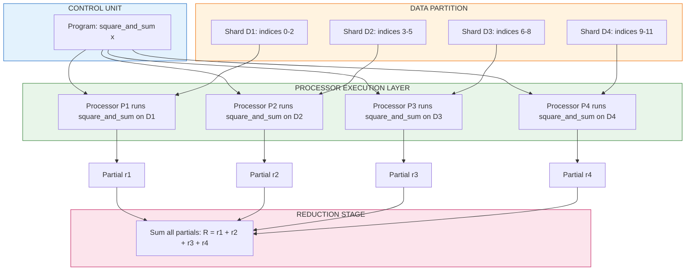
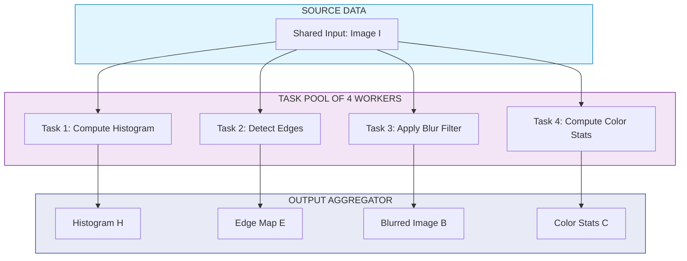
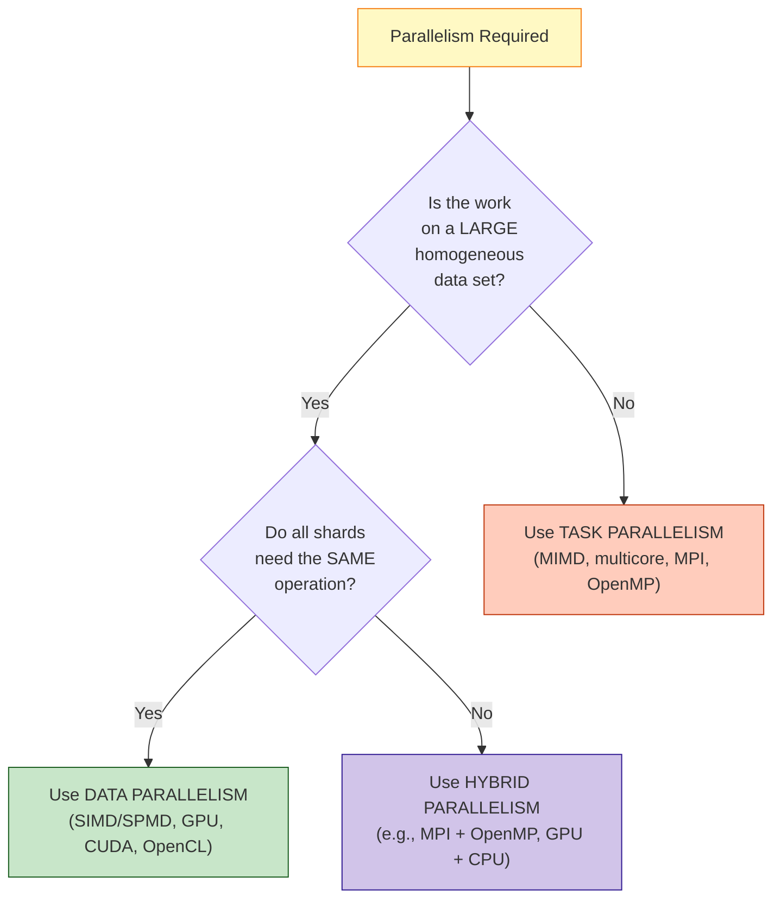
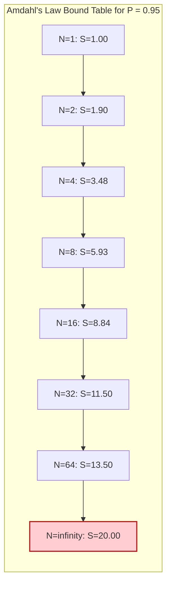

# Types of parallelism: data parallelism, task parallelism

<!-- SECTION_1_START -->
# Types of Parallelism: Data Parallelism & Task Parallelism

## 1. Core Technical Definition

> [!NOTE]
> **KTU 2024 Syllabus Definition (PECST759 - Module 1)**
> Parallelism in computation is broadly classified based on *what* is distributed across processors: the **data** being processed or the **tasks/operations** being performed. The two foundational paradigms are **Data Parallelism** and **Task Parallelism**, both of which map directly onto categories in **Flynn's Taxonomy** of computer architecture.

### 1.1 Data Parallelism (SIMD-Style Execution)

**Data Parallelism** is a parallelization strategy in which **the same operation (or sequence of instructions) is executed concurrently on multiple data elements** distributed across different processing units. The instruction stream is replicated; the data stream is partitioned.

> [!IMPORTANT]
> **Formal Definition:** A computation exhibits *data parallelism* if it can be expressed as a sequence of operations $O_1, O_2, \dots, O_k$ applied uniformly to a collection of data items $D = \{d_1, d_2, \dots, d_n\}$ such that the operations on each $d_i$ are independent of the results of operations on $d_j$ for $i \neq j$ (within a given step).

**Key Identifier:** Same instruction, many data items.

**Hardware Realization:** **SIMD** (Single Instruction, Multiple Data) — vector processors, GPUs (NVIDIA CUDA cores), Intel SSE/AVX units, ARM NEON.

### 1.2 Task Parallelism (MIMD-Style Execution)

**Task Parallelism** is a parallelization strategy in which **different operations/functions/tasks are executed concurrently**, each potentially operating on the same or different data. The instruction streams differ; the work is divided by *function* rather than by *data slice*.

> [!IMPORTANT]
> **Formal Definition:** A computation exhibits *task parallelism* if it can be decomposed into a set of distinct functional units $T = \{t_1, t_2, \dots, t_m\}$ where each $t_i$ performs a *different* operation, and these operations can proceed concurrently because they operate on disjoint data or have no data dependencies.

**Key Identifier:** Different instructions/functions, may share or partition data.

**Hardware Realization:** **MIMD** (Multiple Instruction, Multiple Data) — multicore CPUs, distributed clusters, MPI processes, OpenMP thread pools.

---

## 2. Intuitive Analogies

> [!TIP]
> **Analogy 1 — The Restaurant Kitchen (Data Parallelism):**
> Imagine **10 chefs**, all given the *same recipe*. Each chef cooks that one recipe for a *different table's order*. The recipe is identical (instruction); the ingredients/orders differ (data). Doubling the number of chefs doubles the number of tables served — that's pure data parallelism. This is exactly how a **GPU renders a million pixels** by running the same shading formula on each one.

> [!TIP]
> **Analogy 2 — The Restaurant Assembly Line (Task Parallelism):**
> Now imagine a single order passing through **specialized stations**: one station chops vegetables, another grills meat, another plates the dish, another takes payment. Each station performs a *different function* on the *same order*. This is a pipeline — a specific form of task parallelism. Another example: one chef cooks pasta while another simultaneously makes salad. The *tasks differ*; the *data (the meal)* may overlap.

> [!WARNING]
> **Distinction Trap:** A common student error is conflating "parallelism" with "multithreading." Multithreading is an *implementation mechanism*; data and task parallelism are *decomposition strategies*. A single program can be **hybrid** (e.g., a CNN training job where each GPU processes a batch in data-parallel fashion, while the GPUs themselves are coordinated in a task-parallel master-worker setup).

---

## 3. Conceptual Visualization

> [!VISUALIZATION CONTROL]
> **Concept:** Visual contrast between Data Parallelism (horizontal slicing) and Task Parallelism (vertical slicing) applied to a $4 \times 4$ matrix operation $C = A + B$.
>
> **GeoGebra / Desmos Input (Matrix Grid):**
> * $A = \{(i,j) : 1 \leq i,j \leq 4\}$ with $a_{ij} = i + j$
> * $B = \{(i,j) : 1 \leq i,j \leq 4\}$ with $b_{ij} = 2i$
> * $C_{ij} = a_{ij} + b_{ij}$
>
> **Data-Parallel View:** Plot the 16 cells of $C$ along the x-axis and color them by *which of 4 processors* computed them (horizontal stripes — each processor owns a *row band* of $C$).
>
> **Task-Parallel View:** Plot the 16 cells along the y-axis and color them by *which stage* (Load, Add, Store, Sync) computed them (horizontal bands — each processor owns a *pipeline stage*).
>
> **Visual Description:** In data parallelism, the **rows of the matrix** get split among processors. In task parallelism, the **pipeline stages of the addition operation** get split among processors. The matrix structure remains identical; the *slicing dimension* differs.

<!-- SECTION_1_END -->

<!-- SECTION_2_START -->
# Deep Theoretical Analysis & KTU High-Yield Formula Sheet

## 1. Structural Decomposition of Data Parallelism

A data-parallel computation can be characterized by the following structural properties:

* **Replicated Control Flow:** Every processor executes the *same program counter* at logical time $t$. Branches may diverge but the source code is identical.
* **Partitioned Data Domain:** The data set $D$ is divided into $N$ disjoint shards $D_1, D_2, \dots, D_N$ such that $\bigcup_{i=1}^{N} D_i = D$ and $D_i \cap D_j = \emptyset$ for $i \neq j$.
* **Locality of Operation:** Each operation $O_k$ on shard $D_i$ accesses only elements within $D_i$ during step $k$ (no cross-shard communication for the operation itself, though boundary exchange may occur).
* **Regular Access Pattern:** Typical data-parallel kernels exhibit *static*, *predictable* indexing (e.g., element $j$ of an array belongs to processor $j \bmod N$).
* **Why It Works:** The *independence of elements* allows embarrassingly parallel execution with minimal synchronization — only a final *reduction* step (e.g., summing partial results) is usually required.

**Canonical Kernels:** Vector addition, matrix multiplication (naive), element-wise activation in neural networks, image filtering, Monte Carlo simulations, `map()` in functional programming.

## 2. Structural Decomposition of Task Parallelism

A task-parallel computation is characterized by:

* **Divergent Control Flow:** Each processor may execute a *different function* on a different instruction path.
* **Functional Decomposition:** The problem is split by *operation* rather than by data slice. Two processors working on the same image — one detecting edges, another computing color histograms — exhibit task parallelism.
* **Heterogeneous Data Access:** Tasks may share a global data structure (e.g., a shared scene graph in a game engine) or each may own a private one.
* **Dependency-Driven Scheduling:** A **task DAG** (Directed Acyclic Graph) $G = (V, E)$ encodes precedence: edge $(t_i, t_j) \in E$ means $t_i$ must complete before $t_j$ begins.
* **Why It's Hard:** Load balancing is non-trivial; slow tasks (stragglers) bottleneck the system, and inter-task communication/synchronization is often required.

**Sub-Categories of Task Parallelism:**

| Sub-type | Description | Example |
|----------|-------------|---------|
| **Functional / Unstructured** | Independent tasks on independent data | Web server handling independent HTTP requests |
| **Pipeline** | Tasks form a chain; each stage processes a different item | CPU instruction pipeline; car assembly line |
| **Master–Worker** | Master dispatches tasks to workers dynamically | MapReduce `map` phase |
| **Divide-and-Conquer** | Recursive subproblems run in parallel | Parallel Quicksort, Merge Sort |

## 3. The KTU High-Yield Formula Sheet

> [!IMPORTANT]
> **Mandatory for KTU Board Exams — Memorize All Formulas Below**

$$
\boxed{
\begin{aligned}
S(N) &= \frac{T(1)}{T(N)} && \text{(Speedup with } N \text{ processors)} \\
E(N) &= \frac{S(N)}{N} = \frac{T(1)}{N \cdot T(N)} && \text{(Efficiency)} \\
T(N) &= (1 - P) \cdot T(1) + \frac{P \cdot T(1)}{N} && \text{(Parallel time decomposition)} \\
S(N) &= \frac{1}{(1 - P) + \dfrac{P}{N}} && \textbf{(Amdahl's Law)} \\
S_{\max} &= \lim_{N \to \infty} S(N) = \frac{1}{1 - P} && \text{(Theoretical max speedup)} \\
S_{\text{Gustafson}}(N) &= N - P \cdot (N - 1) && \text{(Gustafson's Law — scaled speedup)} \\
C(N) &= T(1) - N \cdot T(N) && \text{(Cost reduction / capacity)} \\
O_{\text{c}}(N) &= T(N) \cdot N && \text{(Cost = processor-time product)}
\end{aligned}
}
$$

### Variable Definitions

$$
\begin{array}{|c|c|c|}
\hline
\textbf{Symbol} & \textbf{Meaning} & \textbf{Unit / Range} \\
\hline
S(N) & \text{Speedup using } N \text{ processors} & \mathbb{R}_{\geq 1} \\
E(N) & \text{Parallel efficiency} & (0, 1] \\
P & \text{Fraction of program that is parallelizable} & [0, 1] \\
N & \text{Number of processors} & \mathbb{Z}_{\geq 1} \\
T(1) & \text{Sequential execution time} & \text{seconds} \\
T(N) & \text{Parallel execution time on } N \text{ processors} & \text{seconds} \\
O_c & \text{Cost (processor-time product)} & \text{processor-seconds} \\
\hline
\end{array}
$$

### Data Parallelism vs Task Parallelism — Comparison Matrix

$$
\begin{array}{|p{3.5cm}|p{5.5cm}|p{5.5cm}|}
\hline
\textbf{Attribute} & \textbf{Data Parallelism} & \textbf{Task Parallelism} \\
\hline
\text{Slicing dimension} & \text{Data domain (rows, blocks, shards)} & \text{Function / control flow} \\
\hline
\text{Instruction stream} & \text{Identical (SIMD-like)} & \text{Divergent (MIMD-like)} \\
\hline
\text{Flynn class} & \text{SIMD / SPMD} & \text{MISD / MIMD} \\
\hline
\text{Synchronization} & \text{Low (reduction only)} & \text{Heavy (DAG-driven)} \\
\hline
\text{Load balancing} & \text{Easy (uniform shards)} & \text{Hard (task duration varies)} \\
\hline
\text{Communication} & \text{Boundary exchange (e.g., halo cells)} & \text{Message passing / shared state} \\
\hline
\text{Scalability} & \text{Excellent (linear in data size)} & \text{Limited by dependency graph} \\
\hline
\text{Example HW} & \text{GPU, vector unit} & \text{Multicore CPU, cluster} \\
\hline
\text{Example SW} & \text{CUDA, OpenCL, NumPy} & \text{OpenMP tasks, MPI, TBB} \\
\hline
\end{array}
$$

## 4. Real-World Engineering Utility

* **GPU Deep Learning (Data Parallelism):** Training a ResNet on ImageNet uses data parallelism — each of the 8 GPUs in a DGX station processes a different mini-batch, then gradients are averaged (`all-reduce`).
* **Microservices (Task Parallelism):** An e-commerce backend runs independent services (auth, catalog, payment, inventory) as task-parallel workloads orchestrated by Kubernetes.
* **Compiler Auto-Vectorization:** The compiler converts scalar loops to SIMD instructions — turning sequential C code into data-parallel assembly.
* **Heterogeneous HPC:** Modern supercomputers (e.g., Frontier) are **hybrid** — CPUs (task parallel) coordinate, GPUs (data parallel) compute the dense linear algebra.
* **Database Engines:** PostgreSQL parallelizes a single `SELECT` query (data parallel across rows) while concurrently running multiple queries (task parallel across sessions).

<!-- SECTION_2_END -->

<!-- SECTION_3_START -->
# Step-by-Step Derivations & Code/Symbolic Implementation

## 1. Derivation of Amdahl's Law (Required for KTU 14-Mark Questions)

> [!NOTE]
> **Exam Tip:** KTU examiners frequently ask: *"A program spends 20% of its time in serial code. Find the maximum speedup achievable with 100 processors."* — this is Amdahl's Law, derived below.

### Step 1: Decompose Sequential Time

Let $T(1)$ be the time to execute the program on a single processor. Partition it into two parts:

$$
T(1) = T_{\text{serial}} + T_{\text{parallel}} = (1 - P) \cdot T(1) + P \cdot T(1)
$$

where $P \in [0, 1]$ is the **fraction that is parallelizable** and $(1 - P)$ is the **serial fraction**.

### Step 2: Apply Parallelization to the Parallel Part Only

The serial part **cannot** be parallelized and remains at $(1 - P) \cdot T(1)$. The parallel part runs $N$ times faster ideally, taking $\frac{P \cdot T(1)}{N}$.

$$
T(N) = (1 - P) \cdot T(1) + \frac{P \cdot T(1)}{N}
$$

### Step 3: Compute Speedup

$$
S(N) = \frac{T(1)}{T(N)} = \frac{T(1)}{(1 - P) \cdot T(1) + \dfrac{P \cdot T(1)}{N}}
$$

Dividing numerator and denominator by $T(1)$:

$$
S(N) = \frac{1}{(1 - P) + \dfrac{P}{N}}
$$

### Step 4: Take the Limit as $N \to \infty$

$$
\lim_{N \to \infty} S(N) = \lim_{N \to \infty} \frac{1}{(1 - P) + \dfrac{P}{N}} = \frac{1}{(1 - P) + 0} = \frac{1}{1 - P}
$$

> [!IMPORTANT]
> **Conclusion:** Even with **infinite** processors, speedup is bounded by $\frac{1}{1 - P}$. A 5% serial portion caps speedup at $20\times$ — the **fundamental bottleneck of parallel computing**.

### Worked Numerical Example (Board Pattern)

**Problem:** $P = 0.9$ (90% parallelizable), $N = 16$ processors. Find $S(16)$ and $S_{\max}$.

$$
S(16) = \frac{1}{(1 - 0.9) + \dfrac{0.9}{16}} = \frac{1}{0.1 + 0.05625} = \frac{1}{0.15625} = 6.4
$$

$$
S_{\max} = \frac{1}{1 - 0.9} = \frac{1}{0.1} = 10
$$

**Valuation Key Points (7 marks for derivation + 7 marks for numerical):**
* Statement of decomposition: 2 marks
* Derivation of $T(N)$: 2 marks
* Division and limit: 2 marks
* Final boxed formula: 1 mark
* Numerical substitution: 2 marks
* Final computed value: 1 mark

---

## 2. Python Implementation: Data Parallelism (Vectorized + Multi-Process)

```python
"""
DATA PARALLELISM: Same operation ('square_and_sum') applied to chunks
of an array, distributed across N worker processes.
"""
import multiprocessing as mp
import numpy as np
import time
import os
from typing import List, Tuple

def square_and_sum(chunk: np.ndarray) -> Tuple[int, float]:
    """
    Identical function executed by every worker.
    Returns (process_id, partial_sum_of_squares).
    """
    pid: int = os.getpid()
    partial: float = float(np.sum(chunk ** 2))
    return (pid, partial)

def data_parallel_sum_of_squares(data: np.ndarray, num_workers: int = 4) -> Tuple[float, float]:
    """
    Splits `data` into `num_workers` contiguous shards and processes
    each shard in parallel using identical function calls.
    """
    shards: List[np.ndarray] = np.array_split(data, num_workers)

    start: float = time.perf_counter()
    with mp.Pool(processes=num_workers) as pool:
        results: List[Tuple[int, float]] = pool.map(square_and_sum, shards)
    elapsed: float = time.perf_counter() - start

    # Final reduction step: sum the partials
    total: float = sum(partial for _, partial in results)
    return total, elapsed

def sequential_sum_of_squares(data: np.ndarray) -> Tuple[float, float]:
    start: float = time.perf_counter()
    total: float = float(np.sum(data ** 2))
    elapsed: float = time.perf_counter() - start
    return total, elapsed

if __name__ == "__main__":
    # Generate 10 million float samples
    N: int = 10_000_000
    data: np.ndarray = np.random.rand(N).astype(np.float64)

    seq_total, seq_time = sequential_sum_of_squares(data)
    par_total, par_time = data_parallel_sum_of_squares(data, num_workers=4)

    print(f"Sequential : total = {seq_total:.4f}, time = {seq_time:.4f}s")
    print(f"Data-Parallel (4 workers): total = {par_total:.4f}, time = {par_time:.4f}s")
    print(f"Speedup S(4) = {seq_time / par_time:.2f}x")
    print(f"Efficiency E(4) = {seq_time / (4 * par_time):.2%}")
```

> [!NOTE]
> **Why this is data-parallel:** Every worker calls the *same function* `square_and_sum` on a *different shard* of the same array. The control flow is replicated; the data is partitioned. This is the canonical **SPMD** (Single Program, Multiple Data) pattern.

---

## 3. Python Implementation: Task Parallelism (Heterogeneous Functions)

```python
"""
TASK PARALLELISM: Different functions ('compute_histogram' and
'detect_edges') operate on the SAME image concurrently.
"""
import multiprocessing as mp
import numpy as np
import time
from typing import Dict, Any

def compute_histogram(image: np.ndarray) -> Dict[str, Any]:
    """Task 1: Count pixel intensity frequencies."""
    histogram: Dict[int, int] = {}
    for pixel in image.flatten():
        key: int = int(pixel)
        histogram[key] = histogram.get(key, 0) + 1
    return {"task": "histogram", "unique_intensities": len(histogram)}

def detect_edges(image: np.ndarray) -> Dict[str, Any]:
    """Task 2: Approximate edge count via gradient magnitude."""
    image_2d: np.ndarray = image.reshape(int(np.sqrt(image.size)), -1)
    gy: np.ndarray = np.diff(image_2d, axis=0)
    gx: np.ndarray = np.diff(image_2d, axis=1)
    edge_pixels: int = int(np.sum((np.abs(gx[:-1, :]) + np.abs(gy[:, :-1])) > 10))
    return {"task": "edge_detection", "edge_pixels": edge_pixels}

def task_parallel_image_analysis(image: np.ndarray) -> Dict[str, Any]:
    """
    Two DIFFERENT functions run concurrently on the SAME image.
    Demonstrates functional/control-flow decomposition.
    """
    start: float = time.perf_counter()
    with mp.Pool(processes=2) as pool:
        # Dispatch two DIFFERENT functions to two workers
        async_hist = pool.apply_async(compute_histogram, (image,))
        async_edge = pool.apply_async(detect_edges, (image,))
        result_hist: Dict[str, Any] = async_hist.get()
        result_edge: Dict[str, Any] = async_edge.get()
    elapsed: float = time.perf_counter() - start
    return {"histogram": result_hist, "edges": result_edge, "time": elapsed}

if __name__ == "__main__":
    image: np.ndarray = np.random.randint(0, 256, size=(512, 512), dtype=np.uint8)
    report: Dict[str, Any] = task_parallel_image_analysis(image)
    for key, val in report.items():
        print(f"{key}: {val}")
```

> [!NOTE]
> **Why this is task-parallel:** Two *different* functions are dispatched to two workers operating on the *same* image. The instruction streams differ — that is the defining property. If we had instead split the image into two halves and run the *same* function on each, it would be data parallelism.

---

## 4. Hybrid Implementation: Data-Parallel Tasks

```python
"""
HYBRID: A data-parallel task (per-row statistics) is itself parallelized
across multiple workers, while a separate task-parallel job (global
report) runs after. Demonstrates real HPC patterns.
"""
import multiprocessing as mp
import numpy as np
from typing import List, Tuple

def row_statistics(row_chunk: np.ndarray) -> Tuple[float, float, float]:
    """Per-row mean, std, max — identical function for every worker."""
    return (
        float(np.mean(row_chunk, axis=1).sum()),
        float(np.std(row_chunk, axis=1).sum()),
        float(np.max(row_chunk, axis=1).sum())
    )

if __name__ == "__main__":
    matrix: np.ndarray = np.random.rand(1000, 1000)
    chunks: List[np.ndarray] = np.array_split(matrix, 8)  # 8 row-bands

    # Task A: data-parallel computation of per-row statistics
    with mp.Pool(processes=8) as pool:
        stats: List[Tuple[float, float, float]] = pool.map(row_statistics, chunks)

    # Task B: reduce partial stats into global report (sequential)
    global_mean: float = sum(s[0] for s in stats) / matrix.shape[0]
    global_std: float  = sum(s[1] for s in stats) / matrix.shape[0]
    global_max: float  = max(s[2] for s in stats)

    print(f"Hybrid complete: mean={global_mean:.4f}, std={global_std:.4f}, max={global_max:.4f}")
```

> [!TIP]
> **Architect's Note:** The `pool.map` is the *data-parallel* axis; the subsequent Python-level reduction is the *task-parallel* axis. Modern frameworks (PyTorch DDP, Horovod, Ray) generalize this to thousands of nodes.

<!-- SECTION_3_END -->

<!-- SECTION_4_START -->
# Structural Diagrams & Schematics

## 1. Mermaid Diagram — Data Parallelism (SPMD Pattern)



**Reading the Diagram:** The single `Program` block fans out to *all* processors (control replication), while the *Data* partition feeds each processor a unique shard. Each processor emits a *partial result*; the reduction stage aggregates them. This is the textbook **SPMD data-parallel** flow.

## 2. Mermaid Diagram — Task Parallelism (Functional Decomposition)



**Reading the Diagram:** A *single* source image is fed to *four* **different** functions running in parallel. There is **no data partitioning** of the image — instead, the *operation* is partitioned. This is the textbook **task-parallel / function-parallel** flow.

## 3. Mermaid Diagram — Comparison & Decision Flow



**Reading the Diagram:** A simple decision tree for choosing the right paradigm. KTU viva questions often probe this distinction; commit this flow to memory.

## 4. Block-Level Architecture — Speedup Bound Visualization



**Reading the Diagram:** Even with 95% of the code parallelized, doubling processors past $N = 64$ yields diminishing returns. The ceiling at $N = \infty$ is exactly $20\times$ — the Amdahl barrier.

<!-- SECTION_4_END -->

<!-- SECTION_5_START -->
# KTU 2024 Scheme Examination Question Bank

## Part A — Short Answer Questions (3 Marks Each)

### Question 1
**[KTU University Exam - July 2024]** *Define data parallelism and task parallelism. Give one real-world example of each.*

> [!NOTE]
> **Model Answer (3 Marks):**
> * **Data Parallelism:** A parallelization strategy where the *same operation* is applied concurrently to *multiple data elements*. The control flow is replicated across processors while the data domain is partitioned. **Example:** A GPU rendering millions of pixels by running the same shading formula on each pixel simultaneously. *(1.5 marks)*
> * **Task Parallelism:** A parallelization strategy where *different operations/functions* execute concurrently, each operating on the same or different data. Control flow is divergent across processors. **Example:** A web server where one thread handles authentication while another concurrently processes payment for a different request. *(1.5 marks)*

### Question 2
**[KTU University Exam - Dec 2023]** *Differentiate between SIMD and MIMD architectures. Which type of parallelism does each support?*

> [!NOTE]
> **Model Answer (3 Marks):**
> * **SIMD (Single Instruction, Multiple Data):** All processors execute the *same instruction* at the same logical time but on *different data* items. Suited for **data parallelism**. Hardware: vector units, GPUs. *(1.5 marks)*
> * **MIMD (Multiple Instruction, Multiple Data):** Each processor independently executes its *own instruction stream* on its *own data*. Suited for **task parallelism**. Hardware: multicore CPUs, clusters. *(1.5 marks)*

---

## Part B — Full 14-Mark Questions (Module Internal Choice)

### Question A (14 Marks)

**[KTU University Exam - Dec 2024, Module 1, CO1, Apply]**

**(a)** *Explain with a neat diagram the concept of data parallelism. How does it differ from task parallelism in terms of control flow, data partitioning, and synchronization?* **(7 Marks)**

> [!NOTE]
> **Model Answer (7 Marks):**
>
> **Data Parallelism (3 marks):**
> In data parallelism, a large data set $D$ is partitioned into $N$ disjoint shards $D_1, D_2, \dots, D_N$, and each processor $P_i$ executes the *same program* on shard $D_i$. A final reduction step aggregates the partial results. *[Definition: 1 mark, Partitioning & Replicated Code: 1 mark, Reduction: 1 mark]*
>
> **Comparison (4 marks):**
>
> | Aspect | Data Parallelism | Task Parallelism |
> |---|---|---|
> | Control flow | **Identical** (replicated PC) | **Divergent** (different PCs) |
> | Data partitioning | **Across processors** (rows / blocks) | **Shared or per-task** |
> | Synchronization | **Minimal** (reduction only) | **Heavy** (DAG barriers) |
> | Example | SIMD vector add | MIMD master-worker |
>
> *[Control flow: 1 mark, Partitioning: 1 mark, Synchronization: 1 mark, Example: 1 mark]*
>
> *(Refer to SECTION_4 Diagram 1 for the visual.)*

**(b)** *A parallel program spends 15% of its execution time in an inherently sequential section. Compute the maximum speedup achievable with (i) 8 processors, and (ii) an infinite number of processors. Use Amdahl's Law. Justify why adding more processors beyond a threshold does not help.* **(7 Marks)**

> [!NOTE]
> **Model Answer (7 Marks):**
>
> **Given:** $P = 1 - 0.15 = 0.85$ (parallel fraction), so $1 - P = 0.15$ (serial fraction).
>
> **Amdahl's Law:** $S(N) = \dfrac{1}{(1 - P) + \dfrac{P}{N}}$
>
> **Part (i): $N = 8$**
> $$S(8) = \frac{1}{0.15 + \frac{0.85}{8}} = \frac{1}{0.15 + 0.10625} = \frac{1}{0.25625} \approx 3.902$$
>
> **Part (ii): $N \to \infty$**
> $$S_{\max} = \lim_{N \to \infty} \frac{1}{0.15 + \frac{0.85}{N}} = \frac{1}{0.15 + 0} = 6.667$$
>
> *[Stating Amdahl's formula: 1 mark]*
> *[Substitution for N=8: 1 mark, Final value 3.9: 1 mark]*
> *[Limit evaluation: 1 mark, Final value 6.67: 1 mark]*
> *[Justification — diminishing returns beyond N=10 due to fixed 15% serial part: 2 marks]*
>
> **Conclusion:** The serial 15% portion is the **fundamental bottleneck**. Even with infinite processors, the program can never run faster than $6.67 \times$ its sequential time because the serial code cannot be parallelized. Past $N = 16$, the marginal speedup per added processor is less than $0.1$, making further scaling economically unviable.

---

### Question B (14 Marks) — *Alternative Choice*

**[KTU University Exam - July 2024, Module 1, CO1, Apply]**

**(a)** *With a suitable diagram, describe the Task DAG model of task parallelism. Explain the role of dependency edges, critical path length, and the impact of a straggler task on parallel performance.* **(7 Marks)**

> [!NOTE]
> **Model Answer (7 Marks):**
>
> **Task DAG Model (3 marks):**
> A task-parallel computation is represented as a **Directed Acyclic Graph** $G = (V, E)$ where:
> * Each vertex $v_i \in V$ represents a task (a function to execute).
> * Each directed edge $(v_i, v_j) \in E$ represents a **precedence constraint** — task $v_j$ cannot start until $v_i$ completes.
> * Vertices with no incoming edges are **entry tasks**; vertices with no outgoing edges are **exit tasks**.
>
> *[Definition: 1 mark, Vertices = tasks: 1 mark, Edges = dependencies: 1 mark]*
>
> **Critical Path & Straggler (4 marks):**
> The **critical path** $L_{\text{cp}}$ is the longest path (in time) from any entry to any exit task. The minimum parallel runtime is bounded below by $L_{\text{cp}}$ — *no amount of extra processors can finish faster than the critical path*.
>
> $$T_{\text{parallel}} \geq L_{\text{cp}} = \sum_{i \in \text{critical path}} t_i$$
>
> A **straggler** is a task on the critical path that takes unexpectedly long (e.g., due to slow disk I/O or unbalanced load). It stalls all downstream dependent tasks, causing the *entire* parallel runtime to balloon — a phenomenon known as **straggler-induced tail latency**.
>
> *[Critical path definition & formula: 1.5 marks]*
> *[Runtime lower bound: 1 mark]*
> *[Straggler explanation: 1.5 marks]*
>
> *(Refer to SECTION_4 Diagram 2 for the visual pattern of independent parallel tasks.)*

**(b)** *Consider the task DAG shown below. Compute the earliest possible start time and earliest finish time of every task. Identify the critical path and the minimum parallel runtime for 4 processors.*
>
> | Task | Duration | Depends On |
> |------|----------|------------|
> | T1   | 3        | —          |
> | T2   | 4        | T1         |
> | T3   | 2        | T1         |
> | T4   | 5        | T2         |
> | T5   | 6        | T3         |
> | T6   | 3        | T4, T5     |
> | T7   | 2        | T5         |
> **(7 Marks)**

> [!NOTE]
> **Model Answer (7 Marks):**
>
> **Compute Earliest Start (ES) and Earliest Finish (EF) for each task:**
>
> | Task | Duration $d$ | ES | EF = ES + $d$ | Depends On |
> |------|------|-----|------|-------------|
> | T1   | 3    | 0   | 3    | —           |
> | T2   | 4    | 3   | 7    | T1          |
> | T3   | 2    | 3   | 5    | T1          |
> | T4   | 5    | 7   | 12   | T2          |
> | T5   | 6    | 5   | 11   | T3          |
> | T6   | 3    | 12  | 15   | T4, T5 (max of 12, 11 = 12) |
> | T7   | 2    | 11  | 13   | T5          |
>
> **Critical Path:** The longest path from start to end.
> * Path 1: T1 $\to$ T2 $\to$ T4 $\to$ T6 = $3 + 4 + 5 + 3 = 15$
> * Path 2: T1 $\to$ T3 $\to$ T5 $\to$ T6 = $3 + 2 + 6 + 3 = 14$
> * Path 3: T1 $\to$ T3 $\to$ T5 $\to$ T7 = $3 + 2 + 6 + 2 = 13$
>
> **Critical Path: T1 $\to$ T2 $\to$ T4 $\to$ T6 with length 15.**
>
> **Minimum Parallel Runtime on 4 processors:** $T_{\text{parallel}} = L_{\text{cp}} = 15$ time units.
>
> *[Computing ES/EF table: 3 marks]*
> *[Identifying all three paths: 2 marks]*
> *[Marking critical path and final runtime 15: 2 marks]*

---

## KTU Examiner's Valuation Warning

> [!WARNING]
> **Common Pitfalls — Where Students Lose Marks:**
> 1. **Confusing parallelism types with hardware:** Writing "task parallelism uses GPU" is wrong — GPUs are SIMD (data parallel). Match the *paradigm* to the *correct hardware class*.
> 2. **Forgetting the limit in Amdahl's Law:** Many students compute $S(N)$ for finite $N$ but skip the $N \to \infty$ step. Examiners explicitly test this — always state the limit.
> 3. **Not drawing the DAG for task parallelism:** Part (a) of Question B specifically says "with a suitable diagram." A text-only answer forfeits 2 marks.
> 4. **Wrong critical path identification:** A common error is to pick the path with the *most tasks* rather than the *longest duration*. Always sum the durations.
> 5. **Mixing up $P$ and $(1-P)$:** In Amdahl's Law, $P$ is the *parallel* fraction, not the serial fraction. A 15% serial part means $P = 0.85$, not $P = 0.15$.
> 6. **Skipping units and units-check:** Always state the runtime in time units; the EF/ES table is meaningless without clear column headers.

---

## Topic Recap & Important Things to Remember

> [!TIP]
> **High-Density Revision Checklist — Memorize Before Exam**
>
> * **Data Parallelism = Same Code, Different Data (SIMD/SPMD).** Identical instruction stream; data domain is sliced.
> * **Task Parallelism = Different Code, Same/Different Data (MIMD).** Divergent instruction streams; functional decomposition.
> * **Flynn's Taxonomy Mapping:** SIMD $\leftrightarrow$ Data Parallel, MIMD $\leftrightarrow$ Task Parallel.
> * **Amdahl's Law:** $S(N) = \dfrac{1}{(1 - P) + P/N}$ — speedup is bounded by serial fraction.
> * **Maximum Speedup:** $S_{\max} = \dfrac{1}{1 - P}$ — the *fundamental ceiling* regardless of $N$.
> * **Gustafson's Law:** $S(N) = N - P(N - 1)$ — assumes problem *scales* with $N$ (weak scaling).
> * **Critical Path Length** $L_{\text{cp}} \leq T_{\text{parallel}}$ — minimum runtime is bounded by the longest dependency chain.
> * **Efficiency:** $E(N) = S(N) / N$; ideal is $1$, degrades with communication overhead.
> * **Cost (Processor-Time Product):** $O_c = N \cdot T(N)$; an algorithm is *cost-optimal* if $O_c = \Theta(T(1))$.
> * **Data Parallelism Strengths:** embarrassingly parallel, scales with data size, low sync.
> * **Data Parallelism Weakness:** Amdahl's Law bites hard for irregular or sparse data.
> * **Task Parallelism Strengths:** handles irregular, dependent, heterogeneous workloads.
> * **Task Parallelism Weakness:** stragglers, complex scheduling, high synchronization cost.
> * **Hybrid Paradigm:** Modern HPC uses both — e.g., MPI across nodes (task parallel) + CUDA within a node (data parallel).
> * **KTU Buzzwords to Use in Answers:** SPMD, MIMD, embarrassingly parallel, reduction, critical path, straggler, Amdahl's barrier, weak/strong scaling, granularity.
> * **Common Mistake to Avoid:** Never state "multithreading is a type of parallelism" — multithreading is an *implementation mechanism*, not a *decomposition strategy*.

<!-- SECTION_5_END -->
