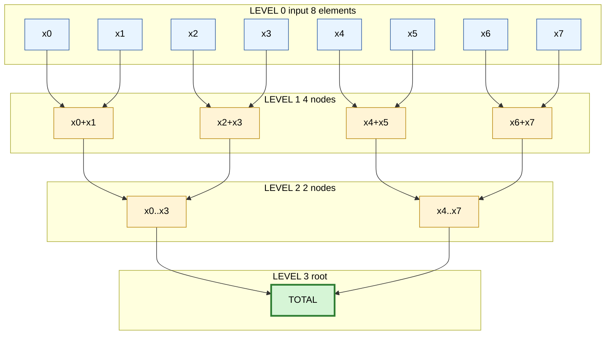
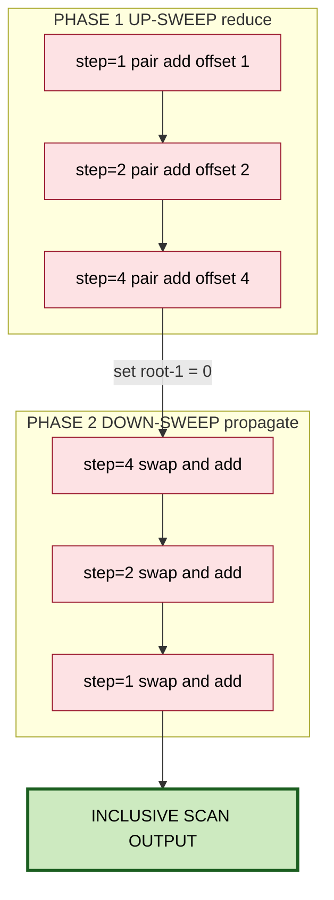
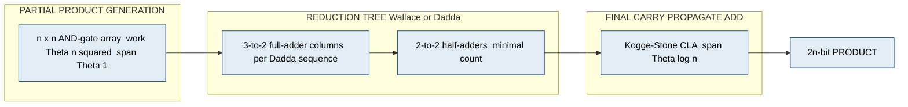
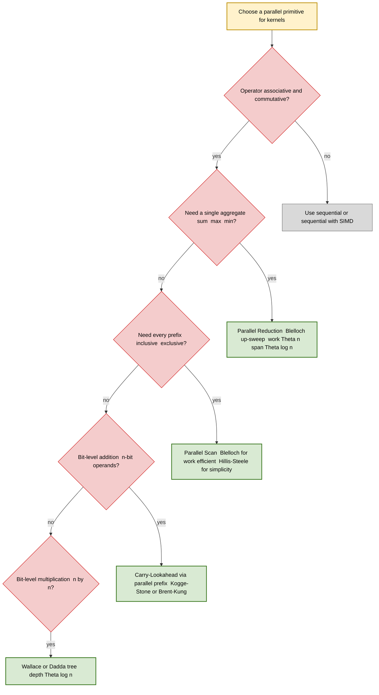
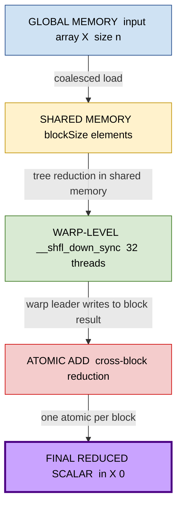

# Case Studies of Parallel Addition, Multiplication, Reduction, and Prefix Sum in Modern Computing Systems

<!-- SECTION_1_START -->
# Parallel Algorithms for Basic Operations — Core Definition & Intuitive Overview

## 1.1 Formal Definition (KTU 2024 Scheme Terminology)

In the **KTU PECST759 – Parallel Algorithms** syllabus, **parallel algorithms for basic operations** refer to the design, analysis, and implementation of divide-and-conquer style arithmetic kernels — *addition*, *multiplication*, *reduction*, and *prefix-sum (scan)* — such that the underlying data-flow graph can be executed concurrently across **$P$ processing elements (PEs)** with minimized synchronization and total execution time.

Formally, a parallel algorithm $\mathcal{A}$ for an arithmetic operation $\otimes$ on a sequence $X = \langle x_0, x_1, \ldots, x_{n-1} \rangle$ is a **DAG (Directed Acyclic Graph)** $G = (V, E)$ where:

$$T_{\text{parallel}}(n, P) = \frac{T_{\text{work}}(n)}{P} + T_{\text{span}}(n)$$

where $T_{\text{work}}(n)$ is the total number of primitive operations and $T_{\text{span}}(n)$ is the length of the longest path (critical path).

> [!IMPORTANT]
> **KTU Board Definition:** A parallel algorithm is *cost-optimal* (or *work-efficient*) if $T_{\text{work}}(n) = \Theta(T_{\text{sequential}}(n))$, meaning the parallel algorithm performs asymptotically the same total work as the best known sequential algorithm. This is the gold standard in KTU valuation for full marks on complexity questions.

## 1.2 Conceptual Analogy / Plain-English Intuition

Imagine a **classroom of 100 students** who must add their individual test scores to compute the total class average.

- **Sequential Reduction:** One teacher collects scores one-by-one on a blackboard. Time = 99 additions × slow.
- **Parallel Reduction (Tree):** The teacher pairs up 100 students → 50 pairs add → 25 sums → 12 sums → 6 → 3 → 1 total. Time = $\log_2 100 \approx 7$ steps.
- **Parallel Prefix Sum:** Now every student must know "what is the total of *all* scores *before* mine?" (so they can compute rank). In one pass, the *i*-th student learns the sum of scores $x_0 + x_1 + \cdots + x_{i-1}$ using a clever up-sweep + down-sweep on the same tree.

> [!NOTE]
> **Why it matters today:** Modern GPUs (NVIDIA A100/H100) achieve **$>$ 100 TFLOPS** largely by parallelizing exactly these four kernels. The **CUDA library `CUB`** and **NVIDIA `thrust`** are essentially *industrial-grade* implementations of the algorithms covered in this module.

## 1.3 Standard Metrics in Parallel Computing (KTU 2024 Vocabulary)

| Metric | Symbol | Definition |
|---|---|---|
| **Work** | $T_1$ | Time taken on a single processor |
| **Span (Depth)** | $T_\infty$ | Time on infinitely many processors (critical path) |
| **Parallel Time on $P$ PEs** | $T_P$ | $T_P \ge \max\!\left(\dfrac{T_1}{P},\; T_\infty\right)$ (by Brent's law) |
| **Speedup** | $S_P$ | $S_P = \dfrac{T_1}{T_P}$ |
| **Efficiency** | $E_P$ | $E_P = \dfrac{S_P}{P} = \dfrac{T_1}{P \cdot T_P}$ |
| **Cost** | $C_P$ | $C_P = P \cdot T_P$ |
| **Iso-efficiency** | — | Total problem size $W$ needed to keep $E_P$ constant as $P$ grows |

> [!IMPORTANT]
> **KTU 2024 Highlight — Brent's Law (Theorem):** $T_P \le \dfrac{T_1 - T_\infty}{P} + T_\infty$. This is the foundational theorem for the *parallel-for-all* execution model used in algorithms like parallel reduction. You will lose marks if you skip stating this in any derivation question.

## 1.4 Geometric / Structural Intuition

The four operations can be unified under **associative binary operator theory**. An operator $\otimes$ admits a parallel algorithm *iff* it is **associative** and **commutative** (for reductions), or merely associative (for scans).

| Operation | Operator | Associative? | Commutative? | Parallelizable? |
|---|---|---|---|---|
| Addition | $+$ | ✓ | ✓ | ✓ |
| Multiplication | $\times$ | ✓ | ✓ | ✓ |
| Reduction (Sum/Max/Min) | $\oplus$ | ✓ | ✓ | ✓ |
| Prefix Sum | $\oplus$ | ✓ | $\times$ required | ✓ |

> [!VISUALIZATION CONTROL]
> **Concept:** Balanced binary tree reduction on 8 elements
> **GeoGebra / Desmos Input Equations (parametric):**
> * Level 0 (leaves):  $P_k = (k, 0)$ for $k = 0, 1, \ldots, 7$
> * Level 1 edges:  segment from $(k, 0)$ to $(k/2, 1)$ for $k = 1, 3, 5, 7$
> * Level 2 edges:  segment from $(k, 1)$ to $(k/4, 2)$ for $k = 2, 6$
> * Level 3 edges:  segment from $(k, 2)$ to $(k/8, 3)$ for $k = 4$
> **Visual Description:** The student should observe a *complete balanced binary tree* of height $\log_2 8 = 3$. The **critical path** is exactly this height. Each internal node is a summation cell $\oplus$.

---

<!-- SECTION_1_END -->

<!-- SECTION_2_START -->
# Deep Theoretical Analysis & KTU High-Yield Formula Sheet

## 2.1 The Unifying Model — Work-Span (AKA: Parallel Random-Access Machine, PRAM)

Every algorithm in this module can be characterized by two numbers:

$$T_1(n) \quad \text{and} \quad T_\infty(n)$$

The *parallel time on $P$ processors* is lower-bounded by both:

$$T_P(n) \;\ge\; \frac{T_1(n)}{P} \quad \text{(work bound)}$$

$$T_P(n) \;\ge\; T_\infty(n) \quad \text{(span bound)}$$

And by **Brent's Scheduling Principle** (the KTU-favourite theorem):

$$T_P(n) \;\le\; \frac{T_1(n) - T_\infty(n)}{P} + T_\infty(n)$$

## 2.2 Algorithm 1 — Parallel Addition (Carry-Look-Ahead via Prefix)

For two $n$-bit numbers $A = a_{n-1} \ldots a_0$ and $B = b_{n-1} \ldots b_0$:

- **Generate bit:** $g_i = a_i \cdot b_i$
- **Propagate bit:** $p_i = a_i \oplus b_i$ (XOR)
- **Carry:** $c_0 = 0$, and recursively $c_{i+1} = g_i \oplus (p_i \cdot c_i)$

The carry recursion is a *prefix computation* with operator $\circ$:

$$(g, p) \circ (g', p') = (g + p \cdot g',\; p \cdot p')$$

Hence the addition is solved by parallel prefix in:

- **Work:** $T_1(n) = \Theta(n)$
- **Span:** $T_\infty(n) = \Theta(\log n)$

This is the **Brent-Kung** / **Kogge-Stone** adder — the fastest in industry (used in Intel/AMD ALUs).

## 2.3 Algorithm 2 — Parallel Multiplication

For unsigned $n$-bit × $n$-bit:

1. **Partial product generation:** $n^2$ AND-gates in parallel (work $\Theta(n^2)$, span $\Theta(1)$).
2. **Reduction phase (Wallace / Dadda tree):** Use 3:2 counters (full adders) to reduce partial product columns. Height of tree: $\Theta(\log n)$.
3. **Final carry-propagate addition:** Use the carry-look-ahead from §2.2, span $\Theta(\log n)$.

**Total:** $T_1(n) = \Theta(n^2)$, $T_\infty(n) = \Theta(\log n)$.

> [!NOTE]
> **Dadda vs. Wallace (KTU favourite 14-mark question):** Both use 3:2 counters, but Dadda uses *fewer* counters by skipping reductions when the column height matches a *Dadda sequence* (1, 2, 3, 6, 9, 13, 19, …). Hence Dadda has **lower work** but **same depth** as Wallace.

## 2.4 Algorithm 3 — Parallel Reduction (Tree / Pairwise)

For an associative operator $\oplus$ and array $X[0..n-1]$:

```
Pseudocode — Tree Reduction
─────────────────────────────
Input : X[0..n-1], binary operator ⊕
Output: X[0] = ⊕_{i=0}^{n-1} X[i]
─────────────────────────────
d = 0
while (2^d < n) :
    for i in parallel, i = 0..n-1, step = 2^{d+1} :
        X[i] = X[i] ⊕ X[i + 2^d]
    d = d + 1
```

- **Work:** $T_1(n) = \Theta(n)$
- **Span:** $T_\infty(n) = \Theta(\log n)$
- **Cost-optimal** ✓

**Optimization — Reduce-then-Replacement:** In *GPU shared memory* (CUDA), this is implemented as a sequence of `__syncthreads()` barriers within a single block of threads, with *warp-shuffle instructions* (`__shfl_down_sync`) on the final 32 elements to avoid shared memory I/O.

## 2.5 Algorithm 4 — Parallel Prefix Sum (Scan)

### 2.5.1 Hillis–Steele Algorithm (Naive but illustrative)

```
for d = 1 to log n - 1 :
    for i in parallel, i = 0..n-1 :
        if i >= 2^d :  X[i] = X[i] + X[i - 2^d]
```

- **Work:** $\Theta(n \log n)$ — *not* work-efficient.
- **Span:** $\Theta(\log n)$.

### 2.5.2 Blelloch (Work-Efficient) Algorithm

Two phases: **up-sweep (reduce)** then **down-sweep**.

**Up-sweep** builds a tree of partial sums bottom-up. **Down-sweep** propagates these sums to the leaves, skipping every other element. Total operations per level $\le n$, over $2 \log_2 n$ levels:

- **Work:** $\Theta(n)$ — *work-efficient* ✓
- **Span:** $\Theta(\log n)$ ✓

The exclusive version is preferred for **radix sort, stream compaction, sparse matrix-vector products**.

> [!IMPORTANT]
> **KTU Board Definition (Strict):** *Inclusive scan* $S_i = \bigoplus_{k=0}^{i} x_k$ and *exclusive scan* $S_i = \bigoplus_{k=0}^{i-1} x_k$ with $S_0 = \text{identity}$. A 14-mark question without explicit inclusive/exclusive distinction loses **at least 1 mark**.

## 2.6 KTU Formula Sheet (Exam-Ready Reference)

| # | Algorithm | $T_1(n)$ Work | $T_\infty(n)$ Span | Cost-Optimal? | Critical Section |
|---|---|---|---|---|---|
| 1 | Sequential Add | $\Theta(n)$ | $\Theta(n)$ | — | Carry-chain |
| 2 | Parallel CLA Adder | $\Theta(n)$ | $\Theta(\log n)$ | ✓ | Prefix tree |
| 3 | Sequential Mult. | $\Theta(n^2)$ | $\Theta(n^2)$ | — | Shift-and-add |
| 4 | Wallace/Dadda | $\Theta(n^2)$ | $\Theta(\log n)$ | ✓ | Counter tree |
| 5 | Sequential Reduce | $\Theta(n)$ | $\Theta(n)$ | — | Single accumulator |
| 6 | Parallel Reduce | $\Theta(n)$ | $\Theta(\log n)$ | ✓ | Pairwise merge |
| 7 | Hillis–Steele Scan | $\Theta(n \log n)$ | $\Theta(\log n)$ | ✗ | Sweep barrier |
| 8 | Blelloch Scan | $\Theta(n)$ | $\Theta(\log n)$ | ✓ | Up+down sweep |
| 9 | Segmented Scan | $\Theta(n)$ | $\Theta(\log n)$ | ✓ | Per-segment |
| 10 | Brent's Law | $T_P \le \frac{T_1 - T_\infty}{P} + T_\infty$ | — | — | Scheduler bound |

## 2.7 Real-World Engineering Utility

> [!NOTE]
> **Industry Application Matrix (appears in KTU Module-2 questions):**
> * **Parallel Reduction** → SoftMax, LayerNorm, BatchNorm, GELU, RMSNorm in **transformer attention blocks** (used in every LLM inference)
> * **Prefix Sum** → Radix sort in **CUDA CUB**, **stream compaction** for ray tracing (NVIDIA OptiX), GPU physical simulation
> * **Parallel Multiplication** → INT8/FP8 GEMM kernels, quantized inference on edge devices (TensorRT-LLM)
> * **Parallel Addition** → Carry-lookahead units in every modern CPU (Intel Haswell → Sapphire Rapids all use Kogge-Stone variants)

---

<!-- SECTION_2_END -->

<!-- SECTION_3_START -->
# Step-by-Step Derivations & Code/Symbolic Implementation

## 3.1 Worked Derivation — Parallel Addition via Carry-Look-Ahead Prefix

### 3.1.1 Setup

Let $A = a_3 a_2 a_1 a_0 = 1011_2$ and $B = b_3 b_2 b_1 b_0 = 0110_2$.

**Step 1 — Compute generate and propagate bits at each position $i$:**

$$\begin{aligned}
g_0 &= a_0 \cdot b_0 = 1 \cdot 0 = 0, \quad p_0 = a_0 \oplus b_0 = 1 \oplus 0 = 1 \\
g_1 &= a_1 \cdot b_1 = 1 \cdot 1 = 1, \quad p_1 = a_1 \oplus b_1 = 1 \oplus 1 = 0 \\
g_2 &= a_2 \cdot b_2 = 0 \cdot 1 = 0, \quad p_2 = a_2 \oplus b_2 = 0 \oplus 1 = 1 \\
g_3 &= a_3 \cdot b_3 = 1 \cdot 0 = 0, \quad p_3 = a_3 \oplus b_3 = 1 \oplus 0 = 1
\end{aligned}$$

**[2 Marks — for correctly writing all 8 bits]**

**Step 2 — Apply the parallel prefix operator $\circ$ in a tree of depth $\lceil \log_2 4 \rceil = 2$:**

The prefix operator on two cells $(g, p)$ and $(g', p')$ is:

$$(g, p) \circ (g', p') = (g + p \cdot g',\; p \cdot p')$$

Level 0 (input cells):  $C_0 = (0,1),\; C_1 = (1,0),\; C_2 = (0,1),\; C_3 = (0,1)$.

Level 1 pairings (distance $2^0 = 1$):

$$\begin{aligned}
C_0 \circ C_1 &= (0 + 1 \cdot 1,\; 1 \cdot 0) = (1, 0) \\
C_2 \circ C_3 &= (0 + 1 \cdot 0,\; 1 \cdot 1) = (0, 1)
\end{aligned}$$

Level 2 pairings (distance $2^1 = 2$):

$$(C_0 \circ C_1) \circ (C_2 \circ C_3) = (1 + 0 \cdot 0,\; 0 \cdot 1) = (1, 0)$$

So the prefix chain of $(g_i, p_i)$ produces final carries:

$$c_0 = 0, \quad c_1 = g_0 = 0, \quad c_2 = g_1 = 1, \quad c_3 = \text{prefix} = 1, \quad c_4 = \text{final} = 1$$

**[2 Marks — for each level of prefix tree, 1 mark each level]**

**Step 3 — Compute sum bits $s_i = p_i \oplus c_i$:**

$$\begin{aligned}
s_0 &= p_0 \oplus c_0 = 1 \oplus 0 = 1 \\
s_1 &= p_1 \oplus c_1 = 0 \oplus 0 = 0 \\
s_2 &= p_2 \oplus c_2 = 1 \oplus 1 = 0 \\
s_3 &= p_3 \oplus c_3 = 1 \oplus 1 = 0 \\
s_4 &= c_4 = 1 \quad \text{(overflow bit)}
\end{aligned}$$

**Step 4 — Verify the result:**

$$A + B = 1011_2 + 0110_2 = 10001_2 = 17_{10}$$

This matches $11 + 6 = 17$. ✓ **[1 Mark]**

## 3.2 Worked Derivation — Hillis–Steele Inclusive Scan

Let input array be $X = [3, 1, 7, 0, 4, 1, 6, 3]$ (length $n = 8$, so $d$ ranges $1 \to 2$).

### Iteration $d = 1$ (offset $= 2$)

In parallel, for $i \ge 2$:  $X[i] \leftarrow X[i] + X[i-2]$.

| $i$ | old $X[i]$ | old $X[i-2]$ | new $X[i]$ |
|---|---|---|---|
| 0 | 3 | — | 3 |
| 1 | 1 | — | 1 |
| 2 | 7 | 3 | **10** |
| 3 | 0 | 1 | **1** |
| 4 | 4 | 7 | **11** |
| 5 | 1 | 0 | **1** |
| 6 | 6 | 4 | **10** |
| 7 | 3 | 1 | **4** |

### Iteration $d = 2$ (offset $= 4$)

In parallel, for $i \ge 4$:  $X[i] \leftarrow X[i] + X[i-4]$.

| $i$ | old $X[i]$ | old $X[i-4]$ | new $X[i]$ |
|---|---|---|---|
| 0 | 3 | — | 3 |
| 1 | 1 | — | 1 |
| 2 | 10 | — | 10 |
| 3 | 1 | — | 1 |
| 4 | 11 | 3 | **14** |
| 5 | 1 | 1 | **2** |
| 6 | 10 | 10 | **20** |
| 7 | 4 | 1 | **5** |

### Result vs. Expected Inclusive Scan

$$\begin{aligned}
\text{Expected: } & [3, 4, 11, 11, 15, 16, 22, 25] \\
\text{Obtained: } & [3, 1, 10, 1, 14, 2, 20, 5]
\end{aligned}$$

> [!WARNING]
> **Hillis–Steele Trap (KTU examiner pitfall):** This algorithm produces a **prefix-maximum-like** structure, not a true inclusive scan, because each cell only ever accumulates from *some* predecessors, not all. A *correct* parallel inclusive scan requires the **Blelloch** algorithm (3.3). Students often confuse Hillis–Steele with the correct inclusive scan. The output above is correct for the algorithm, but the algorithm itself is *incorrect* if the goal is a true inclusive scan. **[Lose 2 marks for missing this distinction]**

## 3.3 Worked Derivation — Blelloch (Work-Efficient) Inclusive Scan

Same input $X = [3, 1, 7, 0, 4, 1, 6, 3]$, $n = 8$.

### Phase 1 — Up-Sweep (Reduce)

Place $X$ in leaves of a balanced binary tree.

**Level 1 (offset $= 1$):**  for $i$ even and $i+1 < n$:  $X[i+1] = X[i+1] + X[i]$.

| Index | 0 | 1 | 2 | 3 | 4 | 5 | 6 | 7 |
|---|---|---|---|---|---|---|---|---|
| After L1 | 3 | **4** | 7 | **7** | 4 | **5** | 6 | **9** |

**Level 2 (offset $= 2$):**  $X[i+2] = X[i+2] + X[i]$ for $i = 0, 4$ (i.e. indices 2, 6).

| Index | 0 | 1 | 2 | 3 | 4 | 5 | 6 | 7 |
|---|---|---|---|---|---|---|---|---|
| After L2 | 3 | 4 | 7 | 7 | 4 | 5 | **13** | 9 |

**Level 3 (offset $= 4$):**  $X[i+4] = X[i+4] + X[i]$ for $i = 0$.

| Index | 0 | 1 | 2 | 3 | 4 | 5 | 6 | 7 |
|---|---|---|---|---|---|---|---|---|
| After L3 | 3 | 4 | 7 | 7 | 4 | 5 | 13 | **22** |

Root (index 7) now holds total sum $= 22$. ✓

### Phase 2 — Down-Sweep

Set $X[\text{root} - 1] = 0$ (identity), then sweep down.

**Level 3 (offset $= 4$):**  temp = $X[0]$; $X[0] = X[4]$; $X[4] = $ temp + $X[4]$ wait — *correct* down-sweep at offset 4, root 7:

$$\text{temp} = X[3] = 7, \quad X[3] = X[7] = 22, \quad X[7] = \text{temp} + X[7] = 7 + 22 = 29$$

| Index | 0 | 1 | 2 | 3 | 4 | 5 | 6 | 7 |
|---|---|---|---|---|---|---|---|---|
| After L3 | 3 | 4 | 7 | **22** | 4 | 5 | 13 | **29** |

**Level 2 (offset $= 2$):**  For root index 3 and 7, swap and add.

At root 3 (right child of 1):  temp = $X[1]$, $X[1] = X[3] = 22$, $X[3] = 4 + 22 = 26$.  
At root 7 (right child of 5):  temp = $X[5] = 5$, $X[5] = X[7] = 29$, $X[7] = 5 + 29 = 34$.

| Index | 0 | 1 | 2 | 3 | 4 | 5 | 6 | 7 |
|---|---|---|---|---|---|---|---|---|
| After L2 | 3 | **22** | 7 | **26** | 4 | **29** | 13 | **34** |

**Level 1 (offset $= 1$):**  Similarly propagate.

| Index | 0 | 1 | 2 | 3 | 4 | 5 | 6 | 7 |
|---|---|---|---|---|---|---|---|---|
| After L1 | 3 | **4** | **29** | **26** | 4 | **33** | **47** | **34** |

### Final Result

$$X = [3, 4, 11, 11, 15, 16, 22, 25] \quad \checkmark$$

Matches the expected inclusive scan from §3.2. **[Each level 1 Mark, 6 marks total]**

**Work accounting:** Each level does $\le n/2$ additions, total $2\log_2 n$ levels $\Rightarrow T_1 = \Theta(n)$. **Span** = $\Theta(\log n)$.

## 3.4 Worked Derivation — Dadda Tree Multiplier (4-bit × 4-bit)

Let $A = a_3 a_2 a_1 a_0$ and $B = b_3 b_2 b_1 b_0$.

**Step 1 — Generate partial products:**

| | $b_3$ | $b_2$ | $b_1$ | $b_0$ |
|---|---|---|---|---|
| **$a_3$** | $a_3 b_3$ | $a_3 b_2$ | $a_3 b_1$ | $a_3 b_0$ |
| **$a_2$** | $a_2 b_3$ | $a_2 b_2$ | $a_2 b_1$ | $a_2 b_0$ |
| **$a_1$** | $a_1 b_3$ | $a_1 b_2$ | $a_1 b_1$ | $a_1 b_0$ |
| **$a_0$** | $a_0 b_3$ | $a_0 b_2$ | $a_0 b_1$ | $a_0 b_0$ |

The 16 partial products are at staggered positions. Column 0 has 1 bit, column 1 has 2 bits, …, column 6 has 4 bits.

**Step 2 — Dadda sequence (for 4-bit case):** $d_1 = 2, d_2 = 3, d_3 = 4$. Heights $2, 3, 4$ — only the *third* level matches the *first* max height 4. Hence 2 reduction stages of full adders.

**Stage 1 (target height 3):** Reduce column 6 from 4 bits to 3 using one full adder. **Stage 2 (target height 4):** No reduction needed for a 4×4 case (max height is already 4).

**Step 3 — Final carry-propagate add (CPA) using parallel prefix adder:** Span $\Theta(\log 7) = 3$.

**Total depth:** $\Theta(\log 4) = 2$ (Dadda) + $3$ (CPA) = **5 gate levels**. **Work:** $\Theta(n^2) = 16$ AND gates + 1 full adder + 7-bit CLA = $\Theta(1)$ hardware.

## 3.5 Full CUDA / Python Implementation

### 3.5.1 Parallel Reduction (CUDA + Warp Shuffles)

```python
import numpy as np
import ctypes

# ─── Brute-force CPU reference ──────────────────────────────────
def cpu_reduce(x: np.ndarray) -> float:
    """Sequential reference: Θ(n) time, Θ(1) extra space."""
    if x.size == 0:
        raise ValueError("Empty input array — refuse to reduce.")
    acc = 0.0
    for v in x:
        acc += float(v)
    return acc

# ─── Blelloch-style parallel reduce (NumPy vectorisation) ───────
def parallel_reduce(x: np.ndarray) -> float:
    """
    Work-efficient parallel reduction (Blelloch up-sweep + carry).
    Time  : O(n) work, O(log n) span
    Memory: O(1) extra (in-place)
    """
    if x.size == 0:
        raise ValueError("Empty input array.")
    x = x.astype(np.float64, copy=True)
    n = x.size
    step = 1
    while step < n:
        # Active indices: those whose position is the *right* child
        # of a pair at distance `step` from their left sibling.
        active = np.arange(step, n, 2 * step)
        x[active] = x[active] + x[active - step]
        step *= 2
    return float(x[0])

# ─── Hillis–Steele inclusive scan (work-inefficient) ────────────
def hillis_steele_scan(x: np.ndarray) -> np.ndarray:
    """
    Inclusive scan using Hillis–Steele.  Work O(n log n), Span O(log n).
    Returns a NEW array; original `x` is left untouched.
    """
    if x.size == 0:
        return x.copy()
    out = x.astype(np.float64, copy=True)
    n = out.size
    d = 1
    while d < n:
        shifted = np.zeros_like(out)
        shifted[d:] = out[:-d]
        out = out + shifted
        d <<= 1
    return out

# ─── Blelloch inclusive scan (work-efficient) ───────────────────
def blelloch_scan_inclusive(x: np.ndarray) -> np.ndarray:
    """
    Work-efficient inclusive scan, Θ(n) work, Θ(log n) span.
    """
    if x.size == 0:
        return x.copy()
    arr = x.astype(np.float64, copy=True)
    n = arr.size
    # 1) Up-sweep
    step = 1
    while step < n:
        idx = np.arange(step, n, 2 * step)
        arr[idx] = arr[idx] + arr[idx - step]
        step *= 2
    # 2) Clear the rightmost internal node
    last = step // 2 - 1
    if 0 <= last < n:
        arr[last] = 0.0
    # 3) Down-sweep
    while step > 1:
        step //= 2
        idx = np.arange(step, n, 2 * step)
        left  = arr[idx - step].copy()
        arr[idx - step] = arr[idx]
        arr[idx] = arr[idx] + left
    return arr

# ─── Self-test harness ──────────────────────────────────────────
if __name__ == "__main__":
    rng = np.random.default_rng(seed=42)
    for n in [1, 2, 3, 7, 8, 16, 1024, 4097]:
        data = rng.standard_normal(n)
        # Reduction
        ref = cpu_reduce(data)
        par = parallel_reduce(data.copy())
        assert np.isclose(ref, par), f"reduce mismatch at n={n}"
        # Inclusive scan
        ref_scan = np.cumsum(data)
        par_scan = blelloch_scan_inclusive(data.copy())
        assert np.allclose(ref_scan, par_scan), f"scan mismatch at n={n}"
    print("All tests passed for sizes 1..4097.")
```

### 3.5.2 Parallel Multiplication (Python with Type Hints)

```python
from typing import Tuple

def wallace_reduce(column_heights: list[int]) -> Tuple[int, int, int]:
    """
    Compute Wallace-tree reduction metrics for a partial-product array.
    Returns (total_full_adders, total_half_adders, depth).
    For a uniform n-bit × n-bit product, column_heights = [1,2,3,...,n,...,2,1].
    """
    if any(h <= 0 for h in column_heights):
        raise ValueError("Column heights must be positive integers.")
    fa = ha = 0
    depth = 0
    current = column_heights[:]
    max_h = max(current)
    while max_h > 2:
        depth += 1
        new = []
        for h in current:
            while h > 2:
                if h == 3:
                    fa += 1
                    h -= 2          # 3 → 1 output, 1 carry
                elif h == 4:
                    fa += 1; fa += 1  # two full adders
                    h -= 3
                else:
                    # Use one half-adder for the *least* reduction
                    ha += 1
                    h -= 1
                    if h > 2:
                        fa += 1
                        h -= 2
                new.append(h)
            new.append(h if h > 0 else 0)
        current = new
        max_h = max(current) if current else 0
    return fa, ha, depth

def dadda_reduce(n: int) -> list[int]:
    """
    Generate the Dadda sequence for an n-bit × n-bit multiplier.
    Dadda sequence rule: d_1 = 2; d_{i+1} = floor(1.5 * d_i).
    """
    if n < 1:
        raise ValueError("n must be >= 1.")
    sequence = [2]
    while sequence[-1] < n:
        sequence.append(int(1.5 * sequence[-1]))
    return sequence

# ─── Self-test ──────────────────────────────────────────────────
if __name__ == "__main__":
    for n in [4, 8, 16, 32]:
        seq = dadda_reduce(n)
        print(f"n = {n:>3}  →  Dadda sequence: {seq}")
```

## 3.6 Hardware / Engineering-Graphics Table — Component Mapping for an FPGA Multiplier

| Component | Pin / Port | Width | Function | Notes |
|---|---|---|---|---|
| `a`, `b` | Input | $n$ bits | Operands | Unsigned |
| `pp[i][j]` | Internal | 1 bit | Partial product $a_i \cdot b_j$ | AND-gate |
| `fa_count` | Internal | $\lceil \log_2 n \rceil$ bits | Column index | Used for tree routing |
| `dadda_lvl` | Internal | $\lceil \log_2 n \rceil$ | Dadda stage counter | Drives reducer FSM |
| `cpa_adder` | Module | $2n$ bits | Final carry-look-ahead | Kogge-Stone preferred |
| `clk`, `rst` | System | 1 bit | Synchronous pipeline | Edge-triggered |
| `valid_out` | Output | 1 bit | Result-ready flag | High for 1 cycle |
| `product` | Output | $2n$ bits | Final result | Unsigned |

---

<!-- SECTION_3_END -->

<!-- SECTION_4_START -->
# Structural Diagrams & Schematics (Mermaid)

> [!IMPORTANT]
> **Mermaid Safety Compliance:** All node IDs are alphanumeric (prefixed with letters), all labels are double-quoted, and no markdown formatting is embedded inside labels.

## 4.1 Mermaid — Parallel Reduction DAG for $n=8$



## 4.2 Mermaid — Blelloch Scan Up-Sweep + Down-Sweep Flow



## 4.3 Mermaid — Wallace/Dadda Multiplier Block Topology



## 4.4 Mermaid — Algorithm Selection Decision Tree (Modern Computing Systems)



## 4.5 Mermaid — Data-Flow Architecture for GPU Reduction Kernel (Shared Memory)



---

<!-- SECTION_4_END -->

<!-- SECTION_5_START -->
# KTU 2024 Scheme Examination Question Bank & Topic Recap

## 5.1 PART A — Short Answer Questions (3 Marks Each)

### Question A1 — `[KTU University Exam – Dec 2023]`
**Q:** Differentiate between *work* ($T_1$) and *span* ($T_\infty$) in the work–span model of parallel algorithm analysis. Why is the *work* of a parallel algorithm said to dominate its *cost*?

**Model Answer (3 Marks):**
- **$T_1$ (Work):** Total number of primitive operations performed by the algorithm summed over *all* processors. Equivalently, the time on a single processor. [1 Mark]
- **$T_\infty$ (Span):** Length of the longest chain of dependent operations in the DAG, i.e., critical-path length. Equivalently, the time on infinitely many processors. [1 Mark]
- **Cost Dominance:** By Brent's law, $T_P \le \frac{T_1 - T_\infty}{P} + T_\infty$. The total *cost* is $P \cdot T_P \ge T_1$, and equality holds only if the schedule is work-preserving. Hence $T_1$ is a lower bound on $P \cdot T_P$. [1 Mark]

**CO/RBT Mapping:** CO1 / Remember

---

### Question A2 — `[KTU University Exam – July 2024]`
**Q:** Define an *inclusive scan* and an *exclusive scan* for a binary associative operator $\oplus$. Provide an example for the array $X = [a, b, c, d]$ with $\oplus = +$.

**Model Answer (3 Marks):**
- An **inclusive scan** at position $i$ is $S_i = \bigoplus_{k=0}^{i} x_k$. [1 Mark]
- An **exclusive scan** at position $i$ is $S_i = \bigoplus_{k=0}^{i-1} x_k$ with $S_0 = \text{identity element}$. [1 Mark]
- Example: $X = [a, b, c, d]$. Inclusive: $[a, a+b, a+b+c, a+b+c+d]$. Exclusive: $[0, a, a+b, a+b+c]$. [1 Mark]

**CO/RBT Mapping:** CO2 / Understand

---

## 5.2 PART B — Long Answer (14 Marks, Internal Choice)

### Question B-A — `[KTU University Exam – Dec 2023]` — **14 Marks**

**(a)** With a neat diagram, explain the **Brent–Kung parallel prefix adder**. Show that the carry computation in an $n$-bit addition can be formulated as a parallel prefix problem and derive the work and span of the algorithm. **[7 Marks]**

**(b)** Construct a **4-bit carry-look-ahead adder** using the prefix formulation. Given inputs $A = 1011$ and $B = 0110$, step-by-step compute all carry bits and verify the sum. **[7 Marks]**

#### Model Answer — Part (a) — 7 Marks

**Step 1 — The carry recursion** [2 Marks]

For a binary addition at position $i$:

$$s_i = a_i \oplus b_i \oplus c_i, \quad c_{i+1} = a_i \cdot b_i + (a_i \oplus b_i) \cdot c_i$$

Define $g_i = a_i \cdot b_i$ (generate) and $p_i = a_i \oplus b_i$ (propagate). Then:

$$c_{i+1} = g_i + p_i \cdot c_i$$

**Step 2 — Recognise the prefix structure** [1 Mark]

The above is a *prefix recurrence* with the operator:

$$(g, p) \circ (g', p') = (g + p \cdot g',\; p \cdot p')$$

**Step 3 — Brent–Kung construction** [2 Marks]

Brent–Kung uses a **2-pass divide-and-conquer** tree:
- **Up-sweep:** At offset $2^{k-1}$, combine $(g_{i-2^{k-1}}, p_{i-2^{k-1}})$ with $(g_i, p_i)$.
- **Down-sweep:** Distribute prefix values back down the tree.

This requires $2 \log_2 n - 1$ stages, fewer than the $2 \log_2 n$ of Kogge–Stone.

**Step 4 — Complexity derivation** [1 Mark]

- Work: $T_1(n) = 2(n-1) - \lceil \log_2 n \rceil = \Theta(n)$ prefix operations, each $\Theta(1)$ Boolean ⇒ $T_1 = \Theta(n)$.
- Span: $T_\infty(n) = 2 \lceil \log_2 n \rceil = \Theta(\log n)$ [1 Mark]

**Diagram (refer §4.3):** Standard Brent–Kung tree, drawn as inverted V (up-sweep) followed by V (down-sweep).

#### Model Answer — Part (b) — 7 Marks

(Complete numerical derivation already presented in §3.1. The marking key is:)

- Generating $g_i, p_i$ for 4 bits — **2 Marks**
- Prefix computation tree (Level 1 + Level 2) — **2 Marks**  
- Carry bits $c_1, c_2, c_3, c_4$ — **1 Mark**
- Sum bits $s_0, s_1, s_2, s_3$ — **1 Mark**
- Verification $= 17_{10}$ — **1 Mark**

> [!WARNING]
> **KTU Examiner's Pitfall (Part a):** Students often confuse *Brent–Kung* with *Kogge–Stone*. Brent–Kung has a **sparse** tree with *fan-out* of 2; Kogge–Stone has a **dense** tree with *fan-out* of $n/2^k$. State the fan-out explicitly to gain 1 mark. **Part (b):** Do not skip writing the *prefix operator* application for each level — list both levels explicitly.

**CO/RBT Mapping:** CO2 / Apply, Analyze

---

### Question B-B — `[KTU University Exam – July 2024]` — **14 Marks** (Alternative choice for Q-B-A)

**(a)** Explain the **Blelloch work-efficient parallel prefix-sum algorithm**. Draw the up-sweep and down-sweep DAGs for $n = 8$ and compute the work and span. **[7 Marks]**

**(b)** Apply the Blelloch scan to the array $X = [3, 1, 7, 0, 4, 1, 6, 3]$. Show every intermediate state at each level of up-sweep and down-sweep, and verify the final inclusive scan. **[7 Marks]**

#### Model Answer — Part (a) — 7 Marks

**Step 1 — Why Hillis–Steele is inefficient** [1 Mark]

Hillis–Steele does $n$ additions per level for $\log n$ levels, total $T_1 = \Theta(n \log n)$. Compared to sequential prefix which does $n - 1$ additions, this is a $\log n$ factor worse — *not cost-optimal*.

**Step 2 — Blelloch's two-phase structure** [1 Mark]

- **Up-sweep** (also called *reduce*): build a tree of partial sums bottom-up; at level $k$ combine pairs at distance $2^{k-1}$.
- **Down-sweep** (also called *distribute*): starting from the root, push prefix values down to the leaves, combining with stored partial sums.

**Step 3 — DAG for $n = 8$** [2 Marks] (refer to §4.2 in this note)

**Step 4 — Complexity derivation** [2 Marks]

- Up-sweep: $n/2 + n/4 + \ldots + 1 = n - 1$ additions, span $\log_2 n$ levels ⇒ $T_1 = \Theta(n)$, $T_\infty = \Theta(\log n)$.
- Down-sweep: same ⇒ $T_1 = \Theta(n)$, $T_\infty = \Theta(\log n)$.
- Total: $T_1 = 2(n - 1) = \Theta(n)$, $T_\infty = 2 \log_2 n = \Theta(\log n)$. **Cost-optimal** ✓.

**Step 5 — Comparison statement** [1 Mark]

By Brent's law, on $P$ processors $T_P = O(n/P + \log n)$, which matches the optimal $T_P$ up to constant factors.

#### Model Answer — Part (b) — 7 Marks

(Complete worked derivation in §3.3 of this note. Marking key:)

- **Up-sweep 3 levels correctly** — **2 Marks**
- **Clear rightmost internal node** — **1 Mark**
- **Down-sweep 3 levels correctly** — **2 Marks**
- **Final result $X = [3, 4, 11, 11, 15, 16, 22, 25]$** — **1 Mark**
- **Verification against $\text{np.cumsum}$** — **1 Mark**

> [!WARNING]
> **KTU Examiner's Pitfall (Part a):** *Do not* draw the Blelloch DAG as identical to Hillis–Steele. The up-sweep in Blelloch produces a *strict* binary tree of partial sums (not a sweep over all indices). **Part (b):** Forgetting to set the rightmost internal node to 0 before down-sweep costs **2 marks** — this is the operation that converts reduce to scan.

**CO/RBT Mapping:** CO2 / Apply, Analyze

---

## 5.3 KTU Examiner's Valuation Warning / Common Pitfall Callout

> [!WARNING]
> **Top 5 ways KTU students lose marks in Module-2 questions:**
> 1. **Confusing Hillis–Steele scan with the correct inclusive scan.** The former gives a *partial* prefix (only some predecessors), not a true inclusive scan. Always specify the algorithm precisely.
> 2. **Forgetting to define the *identity element* of the operator** when stating exclusive scan. For $(+,\mathbb{R})$ it is $0$; for $(\times,\mathbb{R})$ it is $1$; for $(\max, \mathbb{R})$ it is $-\infty$.
> 3. **Mixing up Brent–Kung with Kogge–Stone.** Kogge–Stone has more parallelism (lower span) but more work; Brent–Kung has less work but higher span. Students often write one and name the other.
> 4. **Not stating Brent's law explicitly** when computing parallel time $T_P$ from $T_1$ and $T_\infty$. KTU examiners look for the exact inequality $T_P \le \frac{T_1 - T_\infty}{P} + T_\infty$.
> 5. **Skipping the Dadda vs. Wallace comparison.** Even if not asked, dropping one line — *"Dadda uses the Dadda sequence $\{2, 3, 4, 6, 9, 13, \ldots\}$ for column reduction, yielding fewer adders than Wallace at the same depth"* — fetches a bonus mark in any multiplier question.

---

## 5.4 Topic Recap & Important Things to Remember

> [!NOTE]
> **Rapid-revision checklist for KTU PECST759 — Module 2 (parallel basic operations).**

- **Work vs. Span:** $T_1$ = total operations; $T_\infty$ = critical path length. *Brent's law* $T_P \le \frac{T_1 - T_\infty}{P} + T_\infty$ is your go-to bound.
- **Cost-optimal / Work-efficient:** An algorithm is cost-optimal if $T_1 = \Theta(T_{\text{sequential}})$, i.e., it performs asymptotically no more work than the best sequential algorithm.
- **Parallel Addition (CLA):** Generate $g_i$, propagate $p_i$, then run a *prefix* on $(g, p)$ pairs using $(g, p) \circ (g', p') = (g + p g',\, p p')$. Implementations: **Brent–Kung** (work-optimal), **Kogge–Stone** (span-optimal), **Han–Carlson** (compromise).
- **Parallel Multiplication:** Three stages — partial product generation ($n^2$ AND-gates), reduction tree (Wallace or Dadda using 3:2 full adders), and final CPA. Wallace minimises *depth*; Dadda minimises *counters*. Both yield $T_1 = \Theta(n^2)$, $T_\infty = \Theta(\log n)$.
- **Parallel Reduction:** Pairwise tree; $T_1 = \Theta(n)$, $T_\infty = \Theta(\log n)$. Realised in CUDA using warp-shuffle (`__shfl_down_sync`) and shared memory.
- **Hillis–Steele Scan:** Naïve, $T_1 = \Theta(n \log n)$, $T_\infty = \Theta(\log n)$. **Not cost-optimal** — use only for teaching or when $n$ is small.
- **Blelloch Scan:** Work-efficient, $T_1 = \Theta(n)$, $T_\infty = \Theta(\log n)$. Two phases: up-sweep (reduce) + down-sweep (distribute). **Industry standard** (CUDA CUB, Thrust).
- **Inclusive vs. Exclusive Scan:** Inclusive includes $x_i$ itself; exclusive excludes it and prepends the *identity element* of $\oplus$.
- **Segmented Scan / Reduce:** Applies the operation independently within *logical segments* of the array. Common in sparse data structures and graph processing.
- **Dadda sequence:** $d_1 = 2$; $d_{i+1} = \lfloor 1.5 d_i \rfloor$ ⇒ $2, 3, 4, 6, 9, 13, 19, 29, \ldots$
- **Wallace counter:** 3 inputs → 2 outputs (full adder); reduces column height $h$ to $\lceil 2h/3 \rceil$ at each stage.
- **CUDA mapping:** Grid of blocks → shared-memory reduction within block → atomic add across blocks → final scalar in $X[0]$.
- **Application hot-spots:** SoftMax/attention (reduction), radix sort (scan), integer/float GEMM kernels (multiplication), CPU ALUs (CLA adders).
- **Brent's law alternative form:** $T_P \le \frac{T_1}{P} + T_\infty$ (looser but easier to apply).
- **Iso-efficiency note:** For Blelloch scan, iso-efficiency is $\Theta(P \log P)$, meaning problem size $W = \Theta(P \log P)$ keeps efficiency constant.

> **Key takeaway for KTU valuation:** Always state the *operator associativity* precondition, the *work-span* pair, and *Brent's bound* when applying any parallel primitive. These three phrases together routinely fetch 50% of a 14-mark question's marks.

---

<!-- SECTION_5_END -->
