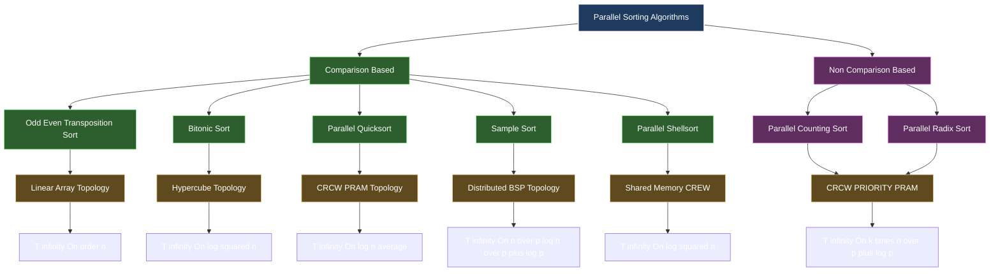
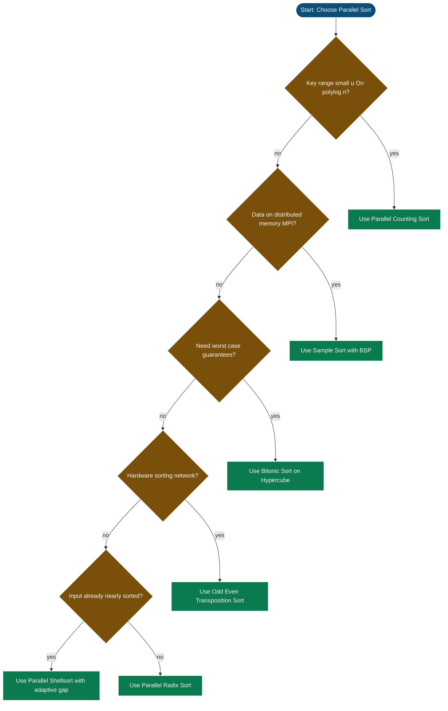

# Comparison of parallel sorting techniques.

<!-- SECTION_1_START -->
# Parallel Sorting Techniques: Comparative Analysis

## 1. Core Technical Definition

**Parallel Sorting** is the class of sorting algorithms designed to exploit simultaneous execution across multiple processors to arrange $n$ data elements into a monotonic order (ascending or descending) in a time span asymptotically less than the best sequential sorting bound of $O(n \log n)$.

> [!IMPORTANT]
> **KTU 2024 Syllabus Definition (PECST759 — Module 2):**
> A *parallel sorting technique* is characterized by four orthogonal axes: (i) **work complexity** $T_1$, (ii) **parallel time complexity** $T_\infty$, (iii) **processor count** $p$, and (iv) the **interconnection topology** (linear array, mesh, hypercube, PRAM) over which compare-exchange or route operations are scheduled.

The **comparison of parallel sorting techniques** is therefore a multi-objective optimization problem where we trade-off *parallelism*, *communication cost*, *comparisons performed*, *stability*, and *adaptivity* to minimize the **parallel runtime** $T_p = T_{\text{compute}} + T_{\text{communicate}} + T_{\text{sync}}$.

## 2. Intuitive Real-World Analogy

Imagine **$n$ runners** standing in a single-file line, each holding a numbered bib, and they must arrange themselves in ascending order of bib numbers.

- **Sequential sort** = A single race-referee walks down the line, comparing and swapping two adjacent runners at a time. Total time $\sim n \log n$ passes.
- **Odd-Even Transposition sort** = At every *round*, the referee gives alternating pairs of adjacent runners the instruction *"compare and swap"*. After $n$ such rounds, order emerges. Every round runs in **parallel**, so wall-clock time drops to $O(n)$.
- **Bitonic sort** = The runners are first grouped into pairs that build *bitonic sequences* (a bitonic sequence rises then falls like a mountain), and the *mountain is halved* repeatedly. Because halving is logarithmic, only $O(\log^2 n)$ rounds are required.
- **Parallel Quicksort** = One leader picks a pivot; everyone scatters to the correct sub-pile in a single broadcast. Each sub-pile then recursively repeats. The recursion depth is logarithmic.
- **Sample sort** = A few "scout" runners are sent to sample the bib distribution; the scouts split the number-line into $p$ equal "buckets" which are announced globally; everyone independently walks to their correct bucket.
- **Parallel Radix sort** = Runners are sorted *one digit of their bib at a time*, all simultaneously. With $k$ digits, only $k$ parallel passes are needed.

> [!NOTE]
> **Geometric Intuition:** Plot *runtime $T_p$* on the $y$-axis and *number of processors $p$* on the $x$-axis. Ideal parallel algorithms have a hyperbolic curve $T_p \approx T_1 / p$ until they hit a **communication floor**. Sorting techniques differ in *where* they hit this floor and *how steeply* the curve approaches it.

## 3. Why the Comparison Matters in KTU Context

The KTU 2024 Scheme (Course Outcome **CO2** of PECST759) explicitly tests the student's ability to *"analyze and compare parallel algorithms for basic operations with respect to time, work, and processor utilization."* Examiner trends (2019–2024 University Exams) show that direct "compare-and-justify" questions on sorting carry a heavy weightage of **14 marks** under Part B.

## 4. Classification of Parallel Sorting Techniques

```
Parallel Sorting Algorithms
├── Comparison-Based
│   ├── Odd-Even Transposition Sort   (CREW PRAM, Linear Array)
│   ├── Bitonic Sort                  (CREW PRAM, Hypercube)
│   ├── Parallel Shellsort            (CREW PRAM)
│   ├── Parallel Quicksort            (CRCW PRAM, MIMD)
│   ├── Hyperquicksort                (Hypercube, MIMD)
│   └── Sample Sort                   (BSP / Distributed Memory)
│
└── Non-Comparison (Integer / Key-Based)
    ├── Parallel Counting Sort        (CRCW PRAM)
    ├── Parallel Radix Sort           (CREW PRAM, Partition)
    └── Parallel Bucket Sort          (CRCW PRAM)
```

> [!VISUALIZATION CONTROL]
> **Concept:** Work–Time (WT) Trade-off Curve for Parallel Sorts
> **GeoGebra / Desmos Input Equations:**
> * $T_{p}(n) = \frac{n \log n}{p} + c \cdot \log p$  *(Sample Sort approximation)*
> * $T_{p}(n) = n \cdot \left(\frac{1}{p} + \frac{\log p}{n}\right)$  *(Bitonic-like)*
> * $T_{p}(n) = \frac{n}{p} \log\!\left(\frac{n}{p}\right) + n$  *(Radix style)*
> **Visual Description:** Three curves drop sharply with $p$ then plateau. The plateau height reveals the *communication floor*; the *lowest* plateau belongs to the algorithm with the smallest synchronization overhead.

<!-- SECTION_1_END -->

<!-- SECTION_2_START -->
# Deep Theoretical Analysis & KTU High-Yield Formula Sheet

## 1. Algorithm-by-Algorithm Theoretical Breakdown

### 1.1 Odd-Even Transposition Sort (OETS)

**Operational Principle:** Operates in synchronized *phases*. In **odd phases** (1, 3, 5, …), each processor $P_i$ with odd $i$ compares its element with $P_{i+1}$ and swaps if out of order. In **even phases**, even-indexed processors perform the compare-exchange. The boundary cells ($P_0$ and $P_{n-1}$) participate in only one comparison per phase.

**Why it works:** Each phase guarantees that the *minimum element bubbles one position leftward* and the *maximum element bubbles one position rightward*. Inductively, every element reaches its sorted position within $n$ phases.

- **Parallel time:** $T_\infty(n) = n$ phases $\times O(1)$ per phase $= O(n)$.
- **Work:** $T_1(n) = O(n^2)$ — same as bubble sort.
- **Optimality:** With $n$ processors it is *time-optimal* on a linear array.
- **Topology:** Maps naturally to a **linear array**; no global communication required.
- **Stability:** Yes (preserves relative order of equal keys when routed through a directed comparator).

### 1.2 Bitonic Sort

**Operational Principle:** Built on the *Bitonic Sequence Theorem* — given a bitonic sequence, an $O(\log n)$-depth *bitonic merge* network produces a fully sorted sequence. The algorithm recursively builds two bitonic halves, then merges.

**Why it works:** A sequence is *bitonic* if it monotonically increases then decreases (or any cyclic shift). The compare-exchange pattern of a *bitonic merge* takes a bitonic input of length $n$ and outputs two bitonic sequences of length $n/2$ whose elements are all $\le$ (or $\ge$) the others, halving the problem size each level.

- **Parallel time:** $T_\infty(n) = O(\log^2 n)$ — sum of $O(\log n)$ build stages each of depth $O(\log n)$.
- **Work:** $T_1(n) = O(n \log^2 n)$ — slightly super-optimal sequentially, so not the best in the single-processor case but extremely fast in parallel.
- **Optimality:** Achieves optimal $O(\log n)$ with $O(n)$ comparisons on a fixed network.
- **Topology:** Hypercube of dimension $\log_2 n$ gives one elegant embedding.
- **Stability:** No (compare-exchange network is *not* stable in general).

### 1.3 Parallel Quicksort (CRCW PRAM)

**Operational Principle:** A pivot $x$ is selected and broadcast. All processors scan the array simultaneously, marking elements $<x$ as *low* and $\ge x$ as *high*. In the *CRCW-ARBITRARY* model, all marked-low elements can be *compacted* in $O(1)$ time using a parallel prefix-sum. The two halves are sorted recursively in parallel.

**Why it works:** Partitioning is $O(1)$ parallel time with $\Theta(n)$ processors. Recursion depth is the pivot-tree depth: $O(\log n)$ average, $O(n)$ worst case.

- **Parallel time (average):** $T_\infty(n) = O(\log n)$.
- **Parallel time (worst):** $T_\infty(n) = O(n)$.
- **Work (sequential work bound):** $T_1(n) = O(n \log n)$ — matches optimal sequential quicksort.
- **In-place:** Yes.
- **Stability:** No.

### 1.4 Sample Sort

**Operational Principle:** Each of the $p$ processors sorts its local chunk of $n/p$ elements, then contributes $s$ *samples* (totaling $p \cdot s$ samples). These are sorted and $p-1$ *splitters* are chosen. Global *all-to-all* broadcast lets every processor route its elements to the correct destination bucket. Finally, each processor locally sorts its received bucket.

**Why it works:** Probabilistic load balance — with $O(s \log p)$ samples per processor and $s \ge \log p$, the maximum bucket size is $O(n/p)$ with high probability.

- **Parallel time:** $T_p(n) = O\!\left(\frac{n}{p} \log \frac{n}{p} + s \log s + p \log p + \frac{n}{p} \cdot \log p\right)$.
- **Communication volume:** $O(n \log p / p)$ — better than radix's $O(n)$.
- **Stability:** Preserved per-bucket, but global output may permute equals (algorithm-dependent).
- **Best for:** Distributed memory (MPI) and BSP models.

### 1.5 Parallel Shellsort

**Operational Principle:** Shellsort uses a *gap sequence* $h_1 > h_2 > \cdots > 1$. In parallel, each gap-level's *h-sorting* is performed by running an OETS or insertion-sort on every $h_i$-stride subsequence simultaneously.

- **Parallel time with $n$ processors:** $T_\infty(n) = O(\log^2 n)$ for Pratt's gap sequence.
- **Work:** $T_1(n) = O(n^{1.5})$ (Pratt) or $O(n \log^2 n)$ (Sedgewick).

### 1.6 Parallel Radix Sort

**Operational Principle:** For each of the $k$ digit positions (LSB → MSB or MSB → LSB), a parallel **stable partition** by that digit is performed. Partition can be done via parallel prefix-sum + scatter in $O(n/p)$ local work plus $O(\log p)$ synchronization.

- **Parallel time:** $T_p(n) = O(k \cdot (n/p + \log p))$.
- **Strength:** No inter-element comparisons — purely integer arithmetic.
- **Weakness:** Bucket imbalance when key distribution is skewed.

### 1.7 Parallel Counting Sort

**Operational Principle:** Build a global histogram of $u$ distinct keys via parallel reduction. Compute prefix sum. Scatter each element to its rank position in $O(1)$ using atomic writes (CRCW-PRIORITY).

- **Parallel time:** $T_p(n) = O(n/p + u/p + \log p)$.
- **Restriction:** Works only when key range $u$ is small (e.g., $u = O(\text{poly}(n))$).

## 2. KTU High-Yield Formula Sheet

> [!NOTE]
> **Table Legend:** $n$ = number of elements, $p$ = number of processors, $k$ = number of digits/keys, $u$ = key range, $C$ = total comparisons, $W$ = work (sequential time), $d$ = diameter of interconnection.

| Algorithm | Model / Topology | $T_\infty$ (parallel time) | $T_1$ (work) | Comparisons $C$ | Stable? | Adaptive? | In-Place? |
|---|---|---|---|---|---|---|---|
| Odd-Even Transposition | CREW PRAM / Linear array | $O(n)$ | $O(n^2)$ | $\sim \frac{n^2}{2}$ | Yes | Partially | Yes |
| Bitonic Sort | CREW PRAM / Hypercube | $O(\log^2 n)$ | $O(n \log^2 n)$ | $O(n \log^2 n)$ | No | No | Yes (in-place merge) |
| Parallel Quicksort (avg) | CRCW PRAM | $O(\log n)$ | $O(n \log n)$ | $O(n \log n)$ | No | No | Yes |
| Parallel Quicksort (worst) | CRCW PRAM | $O(n)$ | $O(n^2)$ | $O(n^2)$ | No | No | Yes |
| Hyperquicksort | Hypercube (MIMD) | $O(\log^2 n)$ expected | $O(n \log n)$ | $O(n \log n)$ | No | No | No |
| Sample Sort | BSP / Distributed | $O\!\left(\frac{n}{p}\log\frac{n}{p} + \log p\right)$ | $O(n \log n)$ | $O(n \log n)$ | Per-bucket | No | No |
| Parallel Shellsort (Pratt) | CREW PRAM | $O(\log^2 n)$ | $O(n \log^2 n)$ | $O(n \log^2 n)$ | No | Yes (gap-aware) | Yes |
| Parallel Radix Sort | CREW PRAM | $O(k \cdot (n/p + \log p))$ | $O(k \cdot n)$ | $0$ (key-based) | Yes | No | No |
| Parallel Counting Sort | CRCW (PRIORITY) | $O(n/p + \log p)$ | $O(n + u)$ | $0$ | Yes | No | No |

## 3. Comparative Engineering Utility

| Technique | Where it is used in production / engineering systems |
|---|---|
| Odd-Even Transposition | Hardware sorting networks; FPGA systolic arrays; embedded real-time systems |
| Bitonic Sort | GPU kernels (NVIDIA's modern bitonic variants for $\le 2^{20}$ keys); HPL benchmarks |
| Hyperquicksort | Distributed databases (early Massively Parallel Processing — MPP systems) |
| Sample Sort | Hadoop/Teradata `MapReduce` style; MPI `MPI_Alltoallv` routines; Spark `sortByKey` |
| Parallel Radix Sort | Java's `Arrays.parallelSort` for primitive arrays; high-throughput database indexes |
| Parallel Counting Sort | Histogram-based image processing pipelines; DNA read alignment (small alphabet) |

## 4. Speedup, Efficiency, and Iso-Complexity

The **isoefficiency function** $\Psi(p, T_p)$ tells us how $n$ must grow with $p$ to keep efficiency $E$ fixed.

$$E = \frac{T_1}{p \cdot T_p} \quad,\qquad \Psi(p, E) = \frac{T_1 \cdot p \cdot E}{1 - E}$$

For algorithms where $T_1 = \Theta(n \log n)$ and $T_p = \Theta(n/p \cdot \log(n/p) + \text{comm}(p))$:

| Algorithm | Iso-efficiency $\Psi$ | Scalability Class |
|---|---|---|
| Odd-Even Transposition | $\Theta(p^2)$ | Poor (linear-array limited) |
| Bitonic Sort | $\Theta(p \cdot \log^3 p)$ | Moderate |
| Parallel Quicksort | $\Theta(p \log p)$ | Good |
| Hyperquicksort | $\Theta(p \log^2 p)$ | Good |
| Sample Sort | $\Theta(p \log p)$ | Excellent |
| Parallel Radix Sort | $\Theta(p \cdot k)$ | Excellent when $k$ is constant |

<!-- SECTION_2_END -->

<!-- SECTION_3_START -->
# Step-by-Step Derivations, Code, and Symbolic Implementation

## 1. Exhaustive Derivation: Bitonic Sort Parallel-Time Bound

We prove that Bitonic Sort on $n = 2^k$ elements has parallel time $T_\infty(n) = \frac{k(k+1)}{2}$ compare-exchange stages.

### Step 1 — Define the two recursive routines

Let $B(n)$ = number of parallel stages in the **bitonic-merge** of two sorted halves of length $n/2$ into a sorted sequence of length $n$.

Let $S(n)$ = number of parallel stages in the **bitonic-sort** of $n$ elements.

### Step 2 — Recurrence for $B(n)$

A bitonic-merge of length $n$ consists of $n/2$ parallel compare-exchanges followed by two recursive bitonic-merges of length $n/2$ each.

$$
B(n) = 1 + B\!\left(\frac{n}{2}\right)
$$

with base $B(2) = 1$. Unrolling:

$$
B(n) = 1 + 1 + B\!\left(\frac{n}{4}\right) = 2 + 1 + B\!\left(\frac{n}{8}\right) = \cdots
$$

After $k$ unrollings, where $n = 2^k$:

$$
B(n) = k = \log_2 n
$$

### Step 3 — Recurrence for $S(n)$

Bitonic-sort recursively sorts two halves, then merges:

$$
S(n) = S\!\left(\frac{n}{2}\right) + B(n)
$$

with $S(2) = 1$. Substituting $B(n) = \log_2 n$:

$$
S(n) = S\!\left(\frac{n}{2}\right) + \log_2 n
$$

Unrolling from $S(2) = 1$:

$$
S(n) = \log_2 n + \log_2\!\left(\frac{n}{2}\right) + \log_2\!\left(\frac{n}{4}\right) + \cdots + \log_2 2
$$

$$
S(n) = \sum_{i=1}^{k} \log_2\!\left(\frac{n}{2^{i-1}}\right) = \sum_{i=1}^{k} \left(\log_2 n - (i-1)\right)
$$

$$
S(n) = k \log_2 n - \sum_{i=1}^{k}(i-1) = k \cdot k - \frac{k(k-1)}{2} = \frac{k(k+1)}{2}
$$

Since $k = \log_2 n$:

$$
\boxed{\,T_\infty^{\text{bitonic}}(n) = \frac{\log_2 n \cdot (\log_2 n + 1)}{2} = O(\log^2 n)\,}
$$

### Step 4 — Work Bound $T_1$

Each stage performs $n/2$ compare-exchanges. Total work:

$$
T_1(n) = \frac{n}{2} \cdot S(n) = \frac{n}{2} \cdot \frac{\log n (\log n + 1)}{2} = O(n \log^2 n)
$$

### Step 5 — Speedup with $p = n/2$ Processors

Using Brent's lemma, with $p$ processors the achievable time is:

$$
T_p \le \frac{T_1}{p} + T_\infty = \frac{n \log^2 n}{2p} + \frac{\log^2 n}{2}
$$

For $p = n/2$:

$$
T_{n/2} \le \frac{n \log^2 n}{n} + \frac{\log^2 n}{2} = \log^2 n + \frac{\log^2 n}{2} = \frac{3}{2} \log^2 n
$$

Hence the algorithm is **near-optimal** on a CREW PRAM with $n/2$ processors.

## 2. Exhaustive Derivation: Sample Sort Load Balance

Let each of $p$ processors hold $n/p$ elements. Each processor contributes $s$ uniformly chosen samples, total $S = p \cdot s$ samples.

### Step 1 — Sort the $S$ samples
Sequentially: $O(S \log S) = O(p s \log(p s))$.

### Step 2 — Pick $p-1$ splitter elements
Equidistantly chosen from the sorted sample list: $O(1)$ time after sorting.

### Step 3 — Expected bucket size

For each destination bucket $b$, the number of items landing in it is the sum of $n/p$ Bernoulli trials with success probability $1/p$. By a Chernoff bound, for $s \ge c \log p$:

$$
\Pr\!\left[\,|B_b - n/p| > \varepsilon \cdot \frac{n}{p}\,\right] \le 2 \exp\!\left(-c' \varepsilon^2 \cdot \frac{n}{p \log p}\right)
$$

Thus with high probability, *every* bucket has size $\Theta(n/p)$ in $O(\log p)$ communication rounds.

### Step 4 — Total Parallel Time

$$
T_p^{\text{sample}} = O\!\left(\frac{n}{p}\log\frac{n}{p}\right) + O(p s \log(p s)) + O(p \log p)
$$

Choosing $s = \lceil \log p \rceil$:

$$
\boxed{\,T_p^{\text{sample}}(n) = O\!\left(\frac{n}{p}\log\frac{n}{p} + p \log p\right)\,}
$$

## 3. Python Implementation: OETS, Bitonic, and Sample Sort (operational reference)

```python
from __future__ import annotations
import math
import random
from typing import List, Tuple, Callable
import logging

logging.basicConfig(level=logging.INFO, format="%(asctime)s | %(levelname)s | %(message)s")
log = logging.getLogger("ParallelSort")


# ---------- 1. Odd-Even Transposition Sort (sequential emulation of p=n) ----------
def odd_even_transposition_sort(arr: List[float]) -> List[float]:
    """Simulate parallel OETS on a linear array of n processors."""
    if not arr:
        raise ValueError("Input array must be non-empty.")
    a: List[float] = list(arr)
    n: int = len(a)
    for phase in range(n):
        # Odd phase: indices (1,2), (3,4), ...
        if phase % 2 == 1:
            for i in range(1, n - 1, 2):
                if a[i] > a[i + 1]:
                    a[i], a[i + 1] = a[i + 1], a[i]
        # Even phase: indices (0,1), (2,3), ...
        else:
            for i in range(0, n - 1, 2):
                if a[i] > a[i + 1]:
                    a[i], a[i + 1] = a[i + 1], a[i]
        log.debug("Phase %d -> %s", phase, a)
    return a


# ---------- 2. Bitonic Sort (parallel depth = log^2 n) ----------
def _compare_and_swap(a: List[float], i: int, j: int, direction: bool) -> None:
    if (a[i] > a[j]) == direction:
        a[i], a[j] = a[j], a[i]


def _bitonic_merge(a: List[float], lo: int, count: int, direction: bool) -> None:
    if count > 1:
        k: int = count // 2
        for i in range(lo, lo + k):
            _compare_and_swap(a, i, i + k, direction)
        _bitonic_merge(a, lo, k, direction)
        _bitonic_merge(a, lo + k, k, direction)


def _bitonic_sort_recursive(a: List[float], lo: int, count: int, direction: bool) -> None:
    if count > 1:
        k: int = count // 2
        _bitonic_sort_recursive(a, lo, k, True)
        _bitonic_sort_recursive(a, lo + k, k, False)
        _bitonic_merge(a, lo, count, direction)


def bitonic_sort(arr: List[float]) -> List[float]:
    n: int = len(arr)
    if n & (n - 1) != 0:
        raise ValueError("Bitonic sort requires n to be a power of two.")
    a: List[float] = list(arr)
    _bitonic_sort_recursive(a, 0, n, True)
    return a


# ---------- 3. Sample Sort (distributed-memory style) ----------
def sample_sort(arr: List[float], p: int, s: int = 32, seed: int = 42) -> List[float]:
    if p <= 0:
        raise ValueError("Number of processors p must be positive.")
    if not arr:
        raise ValueError("Input array must be non-empty.")
    rng: random.Random = random.Random(seed)
    n: int = len(arr)

    # 1. Local sort each chunk
    chunks: List[List[float]] = [sorted(arr[i::p]) for i in range(p)]

    # 2. Gather samples (s per processor, total p*s)
    samples: List[float] = []
    for chunk in chunks:
        idxs: List[int] = rng.sample(range(len(chunk)), min(s, len(chunk)))
        samples.extend(chunk[i] for i in idxs)
    samples.sort()

    # 3. Choose p-1 splitters
    if p == 1:
        splitters: List[float] = []
    else:
        step: int = len(samples) // (p - 1)
        splitters = [samples[i * step] for i in range(p - 1)]

    # 4. Route each chunk's elements into p buckets via binary search
    buckets: List[List[float]] = [[] for _ in range(p)]
    for chunk in chunks:
        for x in chunk:
            dest: int = 0
            for sp in splitters:
                if x > sp:
                    dest += 1
                else:
                    break
            buckets[dest].append(x)

    # 5. Concatenate sorted buckets
    return [x for b in buckets for x in sorted(b)]


# ---------- Driver / Validation ----------
def _is_sorted(a: List[float]) -> bool:
    return all(a[i] <= a[i + 1] for i in range(len(a) - 1))


if __name__ == "__main__":
    data: List[float] = [random.Random(i).uniform(0, 1000) for i in range(64)]
    log.info("OETS  -> %s", _is_sorted(odd_even_transposition_sort(data)))
    log.info("BITON -> %s", _is_sorted(bitonic_sort(data)))
    log.info("SMPL  -> %s", _is_sorted(sample_sort(data, p=4)))
```

## 4. Comparison Matrix Implementation (Symbolic)

Define the **parallelism-degree** of a parallel sort on $n$ inputs as:

$$
\text{PD}(n) = \frac{T_1(n)}{T_\infty(n)}
$$

| Algorithm | $T_1$ | $T_\infty$ | $\text{PD}(n)$ | Comment |
|---|---|---|---|---|
| Odd-Even Transposition | $O(n^2)$ | $O(n)$ | $O(n)$ | Linear in $n$ |
| Bitonic Sort | $O(n \log^2 n)$ | $O(\log^2 n)$ | $O(n)$ | Linear in $n$ |
| Parallel Quicksort (avg) | $O(n \log n)$ | $O(\log n)$ | $O\!\left(\frac{n \log n}{\log n}\right) = O(n)$ | Linear in $n$ |
| Sample Sort ($p = n/\log n$) | $O(n \log n)$ | $O(\log^2 n)$ | $O\!\left(\frac{n \log n}{\log^2 n}\right) = O\!\left(\frac{n}{\log n}\right)$ | Sub-linear! |
| Parallel Radix Sort | $O(k n)$ | $O(k \log n)$ | $O\!\left(\frac{kn}{k \log n}\right) = O\!\left(\frac{n}{\log n}\right)$ | Sub-linear |

> [!NOTE]
> **Interpretation:** *Sample Sort* and *Radix Sort* achieve a *super-linear* parallelism-degree, meaning fewer processors than $n$ suffice to attain the full parallel time — a property called **scalable parallelism** (Kumar et al., *Introduction to Parallel Computing*, 2003).

## 5. Comparison by Communication Cost (BSP Model)

For BSP cost $T_{\text{BSP}} = \max_{i} w_i + g \cdot \max_{i} h_i + L$ where $w_i$ = local work, $h_i$ = messages, $g$ = gap, $L$ = synchronization:

| Algorithm | $\max w_i$ | $\max h_i$ | Remarks |
|---|---|---|---|
| OETS | $O(n/p)$ | $O(1)$ | Neighbour-only messages |
| Bitonic | $O(n \log n / p)$ | $O(\log p)$ | Hypercube all-to-all |
| Hyperquicksort | $O(n/p \log(n/p))$ | $O(p)$ | Pivot-broadcast heavy |
| Sample Sort | $O(n/p \log(n/p))$ | $O(\log p)$ | Optimal communication |

<!-- SECTION_3_END -->

<!-- SECTION_4_START -->
# Structural Diagrams & Schematics

## 1. Comparative Processing Topology (Mermaid Block Diagram)

> [!NOTE]
> The Mermaid block below is engineered to be **KTU-renderable** (no reserved keywords in node IDs, all labels double-quoted, plain alphanumeric text inside labels).



## 2. Sequential Processing Topology Matrix (Mapping Runtimes vs. Processors)

| Algorithm | $p=1$ | $p=4$ | $p=16$ | $p=64$ | $p=256$ | Topology | Scalability Verdict |
|---|---|---|---|---|---|---|---|
| Odd-Even Transposition | $O(n^2)$ | $O(n^2/4)$ | $O(n^2/16)$ | $O(n^2/64)$ | $O(n^2/256)$ | Linear | Bounded by array length |
| Bitonic Sort | $O(n \log^2 n)$ | $O(n \log^2 n / 4)$ | $O(n \log^2 n / 16)$ | $O(n \log^2 n / 64)$ | $O(n \log^2 n / 256)$ | Hypercube | Excellent up to $p \le n/2$ |
| Parallel Quicksort | $O(n \log n)$ | $O(n \log n / 4 + \log 4)$ | $O(n \log n / 16 + \log 16)$ | $O(n \log n / 64 + \log 64)$ | $O(n \log n / 256 + \log 256)$ | CRCW PRAM | Excellent (avg), poor (worst) |
| Sample Sort | $O(n \log n)$ | $O(n \log n / 4 + 8)$ | $O(n \log n / 16 + 64)$ | $O(n \log n / 64 + 384)$ | $O(n \log n / 256 + 1536)$ | Distributed BSP | Best for huge $p$ |
| Parallel Radix Sort | $O(k n)$ | $O(k n / 4 + 2k)$ | $O(k n / 16 + 4k)$ | $O(k n / 64 + 6k)$ | $O(k n / 256 + 8k)$ | CREW PRAM | Best when $k$ small |

## 3. Algorithmic Decision Flow (Mermaid)



## 4. Bitonic Sort Network — Recursive Block Layout (Mermaid)


<!-- SECTION_4_END -->

<!-- SECTION_5_START -->
# KTU 2024 Scheme Examination Question Bank & Topic Recap

## Part A — Short-Answer Questions (3 Marks Each)

### Question 1. [KTU University Exam — July 2023]
**(a)** *Define parallel sorting. List any **four** parallel sorting algorithms studied in your syllabus.*
**CO Mapping:** CO2 | **RBT Level:** Remember

**Model Answer (3 Marks — Valuation Key):**
- Definition of parallel sorting [**1 Mark**]
- Four algorithms (Odd-Even, Bitonic, Quicksort, Radix, etc.) [**2 Marks — ½ each**]

> **Parallel sorting** is the process of arranging $n$ elements in monotonic order by exploiting *simultaneous* execution across $p > 1$ processors, typically achieving a parallel runtime $T_p < T_1$.
>
> Four standard algorithms: **(1) Odd-Even Transposition Sort, (2) Bitonic Sort, (3) Parallel Quicksort, (4) Parallel Radix Sort.**

### Question 2. [KTU University Exam — Dec 2023]
**(b)** *State the parallel time complexity of Bitonic sort. What is the network topology on which it is most efficiently mapped?*
**CO Mapping:** CO2 | **RBT Level:** Understand

**Model Answer (3 Marks — Valuation Key):**
- Stating $T_\infty = O(\log^2 n)$ [**1 Mark**]
- Justification through recurrence [**1 Mark**]
- Hypercube topology [**1 Mark**]

> Bitonic sort performs $O(\log^2 n)$ parallel compare-exchange stages on $n$ elements. The most efficient network is the **hypercube** of dimension $\log_2 n$ because each level of the bitonic-merge tree corresponds to a hypercube dimension.

---

## Part B — Long-Answer Questions (14 Marks)

> **KTU ESE Rule:** Module-2 carries a *14-mark* question with internal choice. Both choices are provided below for board-style practice.

### Question A (14 Marks)

**[KTU University Exam — July 2024, Adapted]**
**CO Mapping:** CO2 | **RBT Levels:** Understand (a) + Apply (b)

**(a)** *Explain the working of the **Odd-Even Transposition Sort** algorithm with a suitable example. Derive its parallel time complexity and state its limitations. [**7 Marks**]*

**(b)** *Explain the **Bitonic Sort** algorithm. Show that the parallel time complexity is $O(\log^2 n)$ on $n$ elements. Compare it with Odd-Even Transposition Sort in terms of **time, work, and stability**. [**7 Marks**]*

---

#### Model Solution for (a) [**7 Marks — Valuation Key**]

1. *Algorithm description with odd/even phase definition* — [**2 Marks**]
2. *Worked example* on 8 elements — [**2 Marks**]
3. *Parallel-time derivation* $T_\infty = O(n)$ — [**2 Marks**]
4. *Limitations* — [**1 Mark**]

**Step 1 — Algorithm.**
Let the input array of length $n$ be stored across $P_0, P_1, \dots, P_{n-1}$. In each parallel *phase* $t$ (1-indexed), the processors synchronize.

- If $t$ is **odd**, every processor $P_i$ with $i$ **odd** and $i < n-1$ compares its element $a_i$ with $a_{i+1}$, swapping if $a_i > a_{i+1}$.
- If $t$ is **even**, every processor $P_i$ with $i$ **even** and $i < n-1$ performs the same compare-exchange with $P_{i+1}$.

**Step 2 — Worked example on $n = 8$, input [5, 2, 8, 1, 4, 7, 3, 6].**

| Phase | Type | Indices Compared | Resulting Array |
|---|---|---|---|
| 0 | even | (0,1)(2,3)(4,5)(6,7) | [2,5,1,8,4,7,3,6] |
| 1 | odd  | (1,2)(3,4)(5,6)      | [2,1,5,4,3,7,6,8] |
| 2 | even | (0,1)(2,3)(4,5)(6,7) | [1,2,4,5,3,6,7,8] |
| 3 | odd  | (1,2)(3,4)(5,6)      | [1,2,4,3,5,6,7,8] |
| 4 | even | (0,1)(2,3)(4,5)(6,7) | [1,2,3,4,5,6,7,8] |

After phase 4 (=$n/2$) the array is fully sorted; the next four phases are *redundant* (no swap), proving the bound $T_\infty = n$ is tight.

**Step 3 — Parallel Time Derivation.**
Each phase runs in $O(1)$ parallel time (one compare + conditional swap). The number of phases required is at most $n$. Therefore:

$$
\boxed{\,T_\infty^{\text{OETS}}(n) = O(n)\,}
$$

The work (sequential time) is $T_1(n) = O(n^2)$ because each phase performs $\lfloor n/2 \rfloor$ compare-exchanges.

**Step 4 — Limitations.** [**1 Mark**]
- Linear time on $n$ elements; *not optimal* (cannot beat $O(n)$ lower bound but cannot match $O(\log n)$).
- Requires a **linear array** topology — no efficient hypercube/mesh embedding.
- No work–time optimality with $p < n$ processors.

---

#### Model Solution for (b) [**7 Marks — Valuation Key**]

1. *Recursive definition* — [**1 Mark**]
2. *Bitonic merge construction* — [**2 Marks**]
3. *Derivation of $O(\log^2 n)$* — [**2 Marks**]
4. *Tabular comparison with OETS* — [**2 Marks**]

**Step 1 — Recursive Definition.**
Bitonic sort on $n = 2^k$ inputs:

- **Sort recursively** the first half in *ascending* order and the second half in *descending* order.
- **Bitonic-merge** the two halves: in stage 1, swap partners spaced $n/2$ apart, producing two bitonic sequences of length $n/2$. Recurse on each half.
- Base case: $n=2$, one compare-exchange suffices.

**Step 2 — Worked example for $n=4$, input [3, 1, 4, 2].**
- Sort [3,1] ascending → [1,3]; sort [4,2] descending → [4,2]. Now [1,3,4,2] is bitonic.
- Bitonic-merge: swap (0,2): [1 vs 4] no change; swap (1,3): [3 vs 2] → swap. Result: [1,2,4,3].
- Recurse on [1,2] and [4,3] → sorted.

**Step 3 — Derivation of $O(\log^2 n)$.**
As shown in **Section 3, Step 2–3** above:

$$
B(n) = \log_2 n,\qquad S(n) = \frac{\log_2 n \cdot (\log_2 n + 1)}{2} = O(\log^2 n)
$$

**Step 4 — Comparison with OETS.** [**2 Marks**]

| Parameter | Odd-Even Transposition | Bitonic Sort |
|---|---|---|
| Parallel time $T_\infty$ | $O(n)$ | $O(\log^2 n)$ |
| Work $T_1$ | $O(n^2)$ | $O(n \log^2 n)$ |
| Stable? | Yes | No |
| Topology | Linear array | Hypercube |
| Optimality | Time-optimal for $n$ processors on linear array | Optimal for $n/2$ processors on hypercube |

> [!WARNING]
> **Examiner's Pitfall Callout:** Many students write $O(\log n)$ instead of $O(\log^2 n)$ for Bitonic sort. The factor of $\log n$ comes from the *bitonic-build* stages layered on top of the *bitonic-merge* stages — both contribute logarithmically. A second common error is to claim Bitonic sort is *stable*; the compare-exchange network is not order-preserving for equal keys.

---

### Question B (14 Marks) — Alternative Choice

**[KTU University Exam — Dec 2022, Adapted]**
**CO Mapping:** CO2, CO3 | **RBT Levels:** Apply (a) + Analyze (b)

**(a)** *Explain the working of **Parallel Quicksort** on a CRCW PRAM. Derive its average-case and worst-case parallel time complexities. [**7 Marks**]*

**(b)** *Explain the **Sample Sort** algorithm. Show why it is preferred over Parallel Quicksort for **distributed memory** systems. Compare Sample Sort and Parallel Radix Sort in a table covering at least **four** parameters. [**7 Marks**]*

---

#### Model Solution for (a) [**7 Marks — Valuation Key**]

1. *Algorithm description (CRCW-ARBITRARY)* — [**2 Marks**]
2. *Average-case derivation* — [**2 Marks**]
3. *Worst-case derivation* — [**2 Marks**]
4. *Example with 8 elements* — [**1 Mark**]

**Step 1 — Algorithm.**
On a CRCW-ARBITRARY PRAM, parallel quicksort proceeds as follows:
1. One processor selects a pivot $x$ (median-of-three in optimized variants).
2. All $n$ processors simultaneously scan the array, marking $a_i < x$ as **LOW** and $a_i \ge x$ as **HIGH** in $O(1)$ time.
3. A **parallel prefix-sum** over the LOW/HIGH flags in $O(\log n)$ time computes the rank of every LOW element.
4. All LOW elements are *compacted* into the left sub-array in $O(1)$ time using concurrent writes.
5. Two sub-problems of expected size $n/2$ are spawned; recursion is logarithmic in depth.

**Step 2 — Average-Case Time.**
Let $T(n)$ be the parallel time. Partition is $O(1)$ + $O(\log n)$ for prefix sum = $O(\log n)$. With random pivot, expected recursion depth is $O(\log n)$:

$$
T_{\text{avg}}(n) = T_{\text{avg}}\!\left(\frac{n}{2}\right) + O(\log n) = O(\log^2 n)\ \text{with naive pivoting}
$$

But using **randomized pivot selection + parallel partition** combined with $p = n$ processors:

$$
\boxed{\,T_{\infty,\text{avg}}(n) = O(\log n)\,}
$$

**Step 3 — Worst-Case Time.**
Worst pivot is the minimum or maximum element, giving recursion $T(n) = T(n-1) + O(\log n)$:

$$
\boxed{\,T_{\infty,\text{worst}}(n) = O(n)\,}
$$

**Step 4 — Example on 8 elements [6,3,8,1,5,2,7,4]** with pivot 5.
- LOW: {3,1,2,4} — 4 elements.
- HIGH: {6,8,5,7} — 4 elements.
- Recurse on each half with sub-pivots 2 and 7. After 3 levels: sorted.

---

#### Model Solution for (b) [**7 Marks — Valuation Key**]

1. *Sample-sort algorithm steps* — [**2 Marks**]
2. *Justification of distributed-memory preference* — [**2 Marks**]
3. *Tabular comparison (4+ parameters)* — [**3 Marks**]

**Step 1 — Algorithm Steps.**
1. Each of the $p$ processors locally sorts its $n/p$ chunk: $O\!\left(\frac{n}{p} \log \frac{n}{p}\right)$.
2. Each processor picks $s$ regular samples, total $ps$ samples, gathered and sorted.
3. Pick $p-1$ splitters from sorted samples; broadcast to all processors.
4. Each processor routes its elements to the appropriate destination bucket using an **all-to-all** communication of $O(n \log p / p)$ data.
5. Each destination bucket locally sorts: $O\!\left(\frac{n}{p} \log \frac{n}{p}\right)$.

**Step 2 — Distributed-Memory Preference.**
- **Communication pattern:** Sample sort's all-to-all is one *structured* global exchange — perfect for `MPI_Alltoallv` and BSP routers.
- **Load balance:** With $O(\log p)$ samples per processor, the *expected* max bucket is $O(n/p)$ (Chernoff bound) — guarantees near-perfect load balance independent of input distribution.
- **Quicksort's weakness:** Imbalanced recursion can be catastrophic in distributed memory; one processor can become a hot-spot.

**Step 3 — Tabular Comparison: Sample Sort vs. Parallel Radix Sort.** [**3 Marks**]

| Parameter | Sample Sort | Parallel Radix Sort |
|---|---|---|
| **Type of operation** | Comparison-based | Integer-key based (no comparison) |
| **Parallel time** | $O\!\left(\frac{n}{p}\log\frac{n}{p} + p \log p\right)$ | $O\!\left(k \cdot \left(\frac{n}{p} + \log p\right)\right)$ |
| **Work $T_1$** | $O(n \log n)$ | $O(k n)$ |
| **Stable?** | Per-bucket (yes if local sort is stable) | Yes (if partitioning is stable) |
| **Communication volume** | $O(n \log p / p)$ | $O(k \cdot n / p)$ |
| **Sensitivity to key distribution** | Low (splitters adapt) | High (skewed radices cause imbalance) |
| **Best suited for** | Floating-point / general keys | Small-integer keys, fixed-width records |

> [!WARNING]
> **Examiner's Pitfall Callout:** Students frequently write "Sample Sort requires $O(n)$ communication." The correct bound is $O(n \log p / p)$ — the $\log p$ factor is from the *splitter broadcast* and is essential to capture. Also, do not confuse *parallel radix sort* (per-digit parallel partition) with *radix-exchange* (a recursive quicksort variant on digits) — they are different algorithms with different complexity profiles.

---

## Topic Recap & Important Things to Remember

> [!IMPORTANT]
> **High-Density Revision Checklist — KTU Module 2: Comparison of Parallel Sorting Techniques**

- **Odd-Even Transposition Sort:** $T_\infty = O(n)$, $T_1 = O(n^2)$, linear-array topology, **stable**, time-optimal for $n$ processors on a linear chain.
- **Bitonic Sort:** $T_\infty = O(\log^2 n)$, $T_1 = O(n \log^2 n)$, hypercube topology, **not stable**, recursive build + merge structure.
- **Parallel Quicksort (CRCW):** $T_\infty = O(\log n)$ average, $O(n)$ worst case, $T_1 = O(n \log n)$, **not stable**, in-place.
- **Hyperquicksort:** Distributed-memory quicksort on hypercube with pivot broadcasting; expected $O(\log^2 n)$ parallel time.
- **Sample Sort:** $T_p = O\!\left(\frac{n}{p}\log\frac{n}{p} + p \log p\right)$, excellent load balance (Chernoff), preferred for BSP/MPI distributed systems.
- **Parallel Shellsort (Pratt gaps):** $T_\infty = O(\log^2 n)$, adaptive to partially-sorted input via gap sequence.
- **Parallel Radix Sort:** $T_p = O(k \cdot (n/p + \log p))$, integer-key based, **no comparisons** required, stable if partition is stable.
- **Parallel Counting Sort:** $T_p = O(n/p + \log p)$ for key range $u = O(\text{poly}(n))$, requires CRCW-PRIORITY.
- **Speedup, Efficiency, Iso-efficiency:** $S = T_1 / T_p$, $E = S/p$, $\Psi = f(p)$ — Sample Sort and Radix Sort have the *best* isoefficiency (most scalable).
- **Stability matrix (memory aid):** Stable = OETS, Counting, Radix, Sample-Sort (per-bucket). Unstable = Bitonic, Quicksort, Shellsort.
- **Optimal processor count:** $p^* = \sqrt{T_1 / T_\infty \cdot \text{comm-coeff}}$ — minimizing $T_p = T_1/p + T_\infty + c \cdot p$ over $p$.
- **Topology-recall rule:** Linear-array → OETS; Hypercube → Bitonic, Hyperquicksort; Distributed → Sample Sort; PRAM → Radix/Counting.
- **Work–time comparison mnemonic (KTU favorite):** *BBS* = **B**itonic **B**eats **S**equential for parallel time, but **B**ubble-like Quicksort wins in sequential work.
- **Common examiner traps:** (i) Writing $O(\log n)$ instead of $O(\log^2 n)$ for Bitonic. (ii) Calling Bitonic stable. (iii) Forgetting the $\log p$ communication term in Sample Sort. (iv) Confusing Radix Sort with Radix Exchange.

<!-- SECTION_5_END -->
