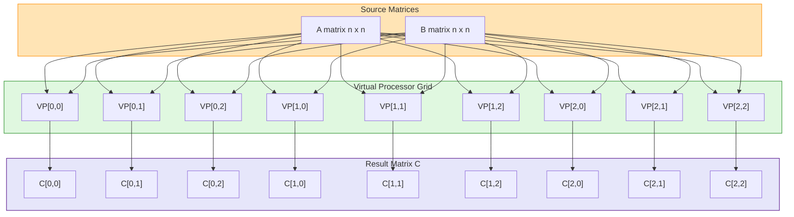
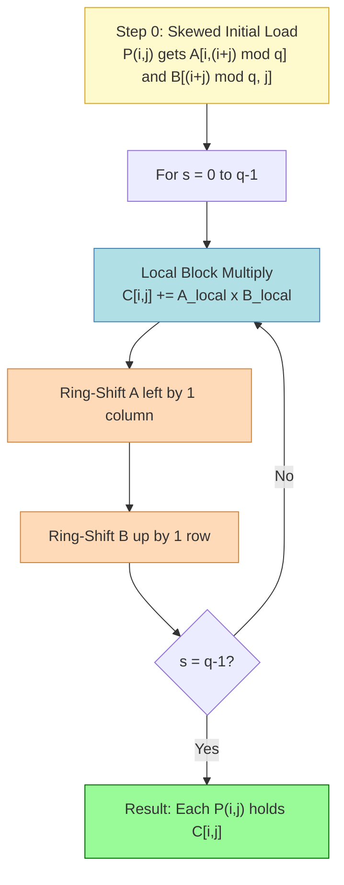
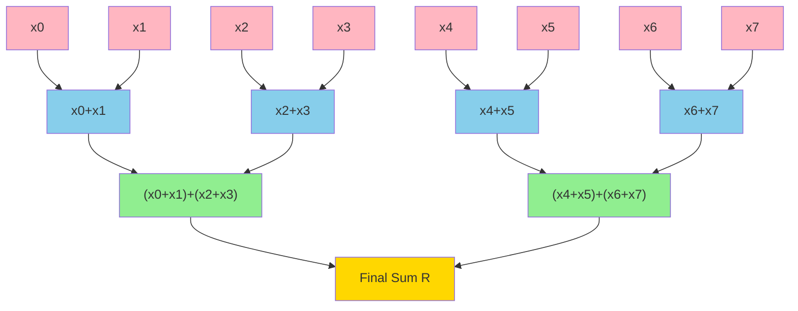
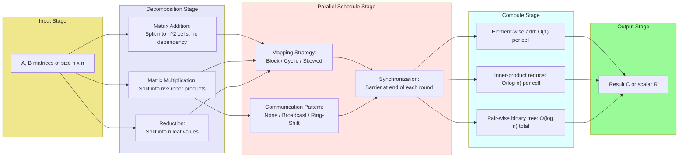

# Parallel Algorithms for Basic Operations - Parallel algorithms for matrix addition, matrix multiplication, and reduction

<!-- SECTION_1_START -->

# Parallel Algorithms for Basic Operations: Matrix Addition, Multiplication & Reduction

## 1.1 Core Technical Definition (KTU 2024 Syllabus Standard)

> [!IMPORTANT]
> **Parallel Algorithms for Basic Operations** are a class of divide-and-distribute computational strategies in which a single sequential task — typically defined on dense linear-algebraic structures such as $n \times n$ matrices, vectors of length $n$, or scalar aggregate accumulators — is decomposed into independent or loosely-dependent sub-tasks that are then mapped onto a set $P = \{p_0, p_1, \dots, p_{k-1}\}$ of $k$ cooperating processors operating concurrently. The goal is to minimize the **parallel time complexity** $T_p$ (a.k.a. *span* or *critical-path length*) while keeping the **work** $W = p \cdot T_p$ close to the optimal sequential cost $T_1$.

For the three canonical operations covered in **Module 2 (PECST759)**:

1. **Parallel Matrix Addition** — adds two matrices $A$ and $B$ of dimension $n \times n$ in a strictly element-independent manner.
2. **Parallel Matrix Multiplication** — computes $C = A \times B$ where $A \in \mathbb{R}^{n \times p}$, $B \in \mathbb{R}^{p \times m}$, and the natural data-dependency between cells of $C$ can be exploited via recursive partitioning, processor tiling (Cannon/Fox), or 3D processor-cube embeddings (DNS).
3. **Parallel Reduction** — collapses a sequence $(a_0, a_1, \dots, a_{n-1})$ to a single aggregated value $\bigoplus_{i=0}^{n-1} a_i$ using an associative binary operator $\oplus$ (sum, max, min, product, logical-AND/OR). The associative property is the key enabler of an $O(\log_2 n)$ logarithmic-span binary reduction tree.

> [!NOTE]
> **Key Performance Metrics used throughout this note**
> - **Sequential Time** $T_1$: work performed by 1 processor.
> - **Parallel Time** $T_\infty$ (or $T_p$ with $p$ processors): time on ideal parallel machine.
> - **Work** $W = p \cdot T_p$.
> - **Speedup** $S(p) = T_1 / T_p$ (linear if $S(p) = p$).
> - **Efficiency** $E(p) = S(p) / p$ (ideal = **1.0** or **100%**).
> - **Cost** = $p \cdot T_p$ (optimal if $W = T_1$).

---

## 1.2 Conceptual Analogy & Geometric Intuition

### 🍕 Real-World Analogy: The Pizza Kitchen

Imagine a single chef (sequential processor) tasked with preparing **1,000 identical pizzas**. Each pizza requires 3 steps: knead dough (10 min), add toppings (5 min), bake (20 min).

| Approach | Chef (Processor) | Outcome |
|----------|------------------|---------|
| Sequential | 1 chef × 1,000 pizzas | 35,000 min ≈ 24 days |
| Parallel-Add (kneading many doughs) | 1,000 chefs knead simultaneously | Total ≈ 35 min (work-bound) |
| Parallel-Multiply (assembly line) | 4 stations × 250 pizzas | Total ≈ 8.75 hours |
| Reduction (vote for "best pizza") | 1,024 voters pair up → 512 → 256 → ... → 1 winner | $\log_2 1024 = 10$ rounds |

The three parallel patterns map to our module as follows:

- **Matrix Addition** = *parallel kneading* (each chef independently works on their pizza — **embarrassingly parallel**, no communication needed).
- **Matrix Multiplication** = *pizza assembly line* (each cell $C[i][j]$ needs contributions from an entire row of $A$ and column of $B$ — **partial communication**).
- **Reduction** = *tournament bracket* (each round halves the contestants — **logarithmic depth tree**).

### 🎯 Geometric Intuition: The PRAM Abstraction

The **Parallel Random Access Machine (PRAM)** is the standard theoretical model. It consists of $p$ processors $P_0, P_1, \dots, P_{p-1}$, each with private registers, all sharing a common global memory accessed in unit time. The variants are:

| Variant | Concurrent Read | Concurrent Write | Use Case |
|---------|----------------|------------------|----------|
| **EREW** | ❌ Forbidden | ❌ Forbidden | Strictest, hardest to program |
| **CREW** | ✅ Allowed | ❌ Forbidden | Matrix multiplication |
| **CRCW** | ✅ Allowed | ✅ Allowed (with tie-break rule) | Reduction, prefix-sum |

> [!VISUALIZATION CONTROL]
> **Concept:** PRAM (Parallel Random Access Machine) shared-memory layout
> **GeoGebra / Desmos Input Equations:**
> * Points: $P_0 = (0, 1)$, $P_1 = (2, 1)$, $P_2 = (4, 1)$, $P_3 = (6, 1)$ (processors on a horizontal line)
> * Central block: polygon with vertices $(2, -0.5), (4, -0.5), (4, 0.3), (2, 0.3)$ labeled "Global Memory M[0..N-1]"
> * Lines: Connect each $P_i$ to the memory block with bidirectional arrows.
> **Visual Description:** Observe that all processors have equal-latency access to the memory block. The width of the memory rectangle should grow with $N$ to emphasize $O(1)$ access time regardless of address.

<!-- SECTION_1_END -->

<!-- SECTION_2_START -->

# 2. Deep Theoretical Analysis & KTU High-Yield Formula Sheet

## 2.1 Parallel Matrix Addition

### Operational Principle

Given two square matrices $A = (a_{ij})$ and $B = (b_{ij})$ of size $n \times n$, the result $C = A + B$ is defined element-wise as:

$$
c_{ij} = a_{ij} + b_{ij} \quad \text{for } 0 \le i, j < n
$$

Because each cell $c_{ij}$ depends **only** on $a_{ij}$ and $b_{ij}$, the $n^2$ computations are **completely independent**. This is the textbook example of an *embarrassingly parallel* workload.

### Structured Logic (Why and How)

- **Why embarrassingly parallel?** No producer-consumer relationship exists between any two output cells. The DAG (Directed Acyclic Graph) of the computation is a flat, disconnected set of $n^2$ nodes.
- **How to map onto processors?** Distribute the $n^2$ cells using **block-striped partitioning** (each processor gets a contiguous strip of rows) or **cyclic partitioning** (row $i$ goes to processor $i \bmod p$) for better load balance when matrix sizes do not divide evenly.

### Complexity Analysis

For $n \times n$ matrix addition on $p$ processors:

| Metric | Formula | Value (worst case) |
|--------|---------|---------------------|
| Sequential time $T_1$ | $n^2$ additions | $\Theta(n^2)$ |
| Parallel time $T_p$ | $\lceil n^2 / p \rceil$ additions | $\Theta(n^2 / p)$ |
| Work $W$ | $p \cdot T_p$ | $\Theta(n^2)$ |
| Span $T_\infty$ | $1$ (all independent) | $\Theta(1)$ |
| Speedup $S(p)$ | $T_1 / T_p$ | $\Theta(p)$ when $p \le n^2$ |
| Efficiency $E(p)$ | $S(p) / p$ | $\Theta(1) = 100\%$ (until $p = n^2$) |
| Optimality | $W = T_1$? | ✅ **Work-optimal** |

> [!TIP]
> When $p = n^2$ (one processor per element), the parallel time drops to a single step: $T_p = \Theta(1)$. This is the **theoretical lower bound** for matrix addition.

### Engineering Utility

- Used in graphics pipelines (e.g., summing RGB image layers, blending textures in OpenGL/WebGPU shaders).
- Pre-processing step in scientific simulation (assembling boundary-condition matrices, computing residual updates in iterative solvers).
- Image processing kernels: brightness adjustment $B = A + k \cdot \mathbf{1}$ runs natively on GPU as a fragment-shader pass with $O(1)$ span per pixel.

---

## 2.2 Parallel Matrix Multiplication

### Operational Principle

The product $C = A \times B$ for $A \in \mathbb{R}^{m \times n}$ and $B \in \mathbb{R}^{n \times k}$ is defined as:

$$
c_{ij} = \sum_{r=0}^{n-1} a_{ir} \cdot b_{rj} \quad \text{for } 0 \le i < m, \ 0 \le j < k
$$

Unlike addition, each cell $c_{ij}$ depends on an *entire row* of $A$ and an *entire column* of $B$. The internal sum is itself a **reduction** over the $n$ partial products.

### Three Canonical Parallel Algorithms (KTU-Exam-Relevant)

#### 2.2.1 Naive Row/Column-Striped Algorithm (Simple, Work-Inefficient)

- Assign row-stripes of $A$ to processors; each processor owns its strip of $C$.
- Each processor loads the **entire matrix $B$** (broadcast) and computes $C_{strip} = A_{strip} \times B$.
- Inner loop over $r = 0, \dots, n-1$ is sequential within each processor.

| Metric | Value |
|--------|-------|
| $T_1$ (sequential) | $\Theta(m \cdot n \cdot k)$ |
| $T_p$ (with $p$ processors) | $\Theta(m \cdot n \cdot k / p)$ |
| Span $T_\infty$ | $\Theta(n)$ for the inner reduction |
| Work | $\Theta(m \cdot n \cdot k)$ — work-optimal ✅ |
| Communication | $B$ must be broadcast to all $p$ processors |

#### 2.2.2 Fox's Algorithm (Block-Cyclic, Communication-Aware)

Fox's algorithm organizes the processors in a $\sqrt{p} \times \sqrt{p}$ logical grid. Matrices are partitioned into $\sqrt{p} \times \sqrt{p}$ sub-blocks. Each iteration:

1. **Broadcast** one row-block of $A$ along the processor row.
2. **Local multiply**: each processor multiplies the received $A$-block by its local $B$-block.
3. **Shift** $B$ one column-block to the left (ring shift).

This achieves balanced communication and is widely used in **ScaLAPACK / PBLAS** libraries.

| Metric | Value |
|--------|-------|
| Number of iterations | $\sqrt{p}$ (the matrix block dimension) |
| $T_p$ | $\Theta\!\left(\frac{n^3}{p}\right)$ with good communication hiding |
| Span | $O(\sqrt{p} \cdot \frac{n^2}{p}) = O(n^2 / \sqrt{p})$ |
| Work | $\Theta(n^3)$ — work-optimal ✅ |

#### 2.2.3 Cannon's Algorithm (Block-Skewed, Minimal Shift)

Cannon's algorithm uses a **skewed** initial alignment: each processor $P_{i,j}$ is pre-loaded with shifted blocks $A_{i,(i+j)\bmod\sqrt{p}}$ and $B_{(i+j)\bmod\sqrt{p},\,j}$. Then iteratively:

1. Multiply current local blocks → accumulate into local $C$-block.
2. Shift $A$ one step left, $B$ one step up.

Cannon's algorithm uses only $\sqrt{p}$ shift steps (compared to $\sqrt{p}$ broadcasts in Fox), giving it a small but real communication advantage on tightly-coupled meshes.

#### 2.2.4 DNS Algorithm (3D Processor Cube — Optimal Span)

The **Dekel–Nassimi–Sahni (DNS)** algorithm embeds processors in a 3D $n^{1/3} \times n^{1/3} \times n^{1/3}$ cube. It performs:

$$
c_{ij} = \sum_{r=0}^{n-1} a_{ir} \cdot b_{rj}
$$

by casting $A$ and $B$ onto two faces of the cube and sweeping a multiplication plane through the third dimension. This achieves a remarkable span:

$$
T_p = \Theta\!\left(\frac{n^3}{p}\right) \quad \text{with span} \ T_\infty = \Theta(\log n)
$$

making it the **theoretically fastest** known parallel matrix multiplication under the work-span model.

### KTU High-Yield Formula Sheet (Table)

| # | Algorithm | Sequential $T_1$ | Parallel $T_p$ (with $p$ procs) | Span $T_\infty$ | Work $W$ | Optimal? |
|---|-----------|------------------|----------------------------------|-----------------|----------|----------|
| 1 | Matrix Addition | $\Theta(n^2)$ | $\Theta(n^2 / p)$ | $\Theta(1)$ | $\Theta(n^2)$ | ✅ Work-optimal |
| 2 | Naive Parallel Mat-Mul | $\Theta(n^3)$ | $\Theta(n^3 / p)$ | $\Theta(n)$ | $\Theta(n^3)$ | ✅ Work-optimal |
| 3 | Cannon's Algorithm | $\Theta(n^3)$ | $\Theta(n^3 / p)$ | $\Theta(\sqrt{p} + n/p^{1/3})$ | $\Theta(n^3)$ | ✅ Work-optimal |
| 4 | Fox's Algorithm | $\Theta(n^3)$ | $\Theta(n^3 / p)$ | $\Theta(\sqrt{p} \cdot n/p^{1/3})$ | $\Theta(n^3)$ | ✅ Work-optimal |
| 5 | DNS Algorithm | $\Theta(n^3)$ | $\Theta(n^3 / p)$ | $\Theta(\log n)$ | $\Theta(n^3)$ | ✅ Work-optimal |
| 6 | Binary-Tree Reduction | $\Theta(n)$ | $\Theta(n / p)$ | $\Theta(\log n)$ | $\Theta(n)$ | ✅ Work-optimal |
| 7 | Brent's Theorem bound | $W$ | $T_p \le \frac{W}{p} + T_\infty$ | $T_\infty$ | $W$ | (Scheduling bound) |

> [!IMPORTANT]
> **Brent's Theorem** is the single most-tested formula in KTU parallel-algorithm exams:
>
> $$
> T_p \le \frac{W}{p} + T_\infty
> $$
>
> where $W$ is the total work and $T_\infty$ is the span (depth of the DAG). It tells you, for any parallel algorithm, the *worst-case schedule length* on $p$ processors.

---

## 2.3 Parallel Reduction

### Operational Principle

A **reduction** takes a sequence $A = (a_0, a_1, \dots, a_{n-1})$ and an associative binary operator $\oplus$, and produces:

$$
R = a_0 \oplus a_1 \oplus a_2 \oplus \cdots \oplus a_{n-1}
$$

Common operators: $\Sigma$ (sum), $\Pi$ (product), $\max$, $\min$, logical-$\land$, logical-$\lor$. Associativity is the **only** requirement — commutativity is *not* required (e.g., matrix multiplication is associative but not commutative).

### Why the Binary-Tree Pattern Works

Because $\oplus$ is associative, we can re-parenthesize arbitrarily:

$$
a_0 \oplus a_1 \oplus a_2 \oplus a_3 = (a_0 \oplus a_1) \oplus (a_2 \oplus a_3)
$$

In the **first round**, $n/2$ processors pair up adjacent elements and compute $n/2$ partial results in parallel. In **round 2**, $n/4$ processors do the same, and so on. After $\lceil \log_2 n \rceil$ rounds, a single value remains.

### Complexity Analysis

| Metric | Value |
|--------|-------|
| $T_1$ (sequential) | $\Theta(n)$ |
| $T_p$ (with $p = n/2$ procs, one round) | $\Theta(\log n)$ |
| Span $T_\infty$ | $\Theta(\log n)$ |
| Work $W$ | $\Theta(n)$ — work-optimal ✅ |
| Total additions performed | $n - 1$ (same as sequential) |

> [!TIP]
> **Work-optimal** here means: total additions = $n - 1$, identical to sequential. The binary tree does *not* waste any computation — it merely reorders the additions. This is why parallel reduction is one of the most efficient GPU primitives (foundational to NVIDIA's `thrust::reduce` and CUDA `__shfl_down_sync` warp-level reductions).

### Engineering Utility

- **GPU Shaders**: computing luminance, blur kernels, histogram normalization.
- **Distributed ML**: all-reduce gradient synchronization in data-parallel SGD (e.g., Horovod, NCCL).
- **MapReduce / Spark**: the `reduceByKey` stage is precisely a parallel reduction.
- **Cryptography**: parallel hash chain computation, Merkle tree internal-node computation.

<!-- SECTION_2_END -->

<!-- SECTION_3_START -->

# 3. Step-by-Step Derivations, Code & Symbolic Implementation

## 3.1 Exhaustive Derivation: Parallel Matrix Addition (PRAM-CREW Model)

### Setup
Let $A = (a_{ij})$ and $B = (b_{ij})$ be $n \times n$ matrices, $0 \le i, j < n$. Use $p$ processors $P_0, P_1, \dots, P_{p-1}$ in a CREW-PRAM model.

### Step-by-Step Procedure

**Step 1 — Processor activation.** Spawn $n^2$ virtual processors, indexed by $(i, j)$, with virtual ID = $i \cdot n + j$.

**Step 2 — Element-wise addition.** For each virtual processor, execute the local operation:

$$
c_{ij} = a_{ij} + b_{ij}
$$

Each virtual processor reads $a_{ij}$ and $b_{ij}$ from global memory (concurrent reads are allowed in CREW) and writes $c_{ij}$ to its unique location (no concurrent-write conflict).

**Step 3 — Termination.** All $n^2$ virtual processors complete in **one parallel step**, so:

$$
T_p = \Theta(1) \quad \text{with} \quad p = n^2
$$

**Step 4 — Generalization to fewer processors.** With $p < n^2$ processors, processor $P_k$ (for $k = 0, \dots, p-1$) handles cells in the index range:

$$
\text{cell range for } P_k = \left\{ (i,j) : k \cdot \left\lceil \frac{n^2}{p} \right\rceil \le i \cdot n + j < (k+1) \cdot \left\lceil \frac{n^2}{p} \right\rceil \right\}
$$

Number of cells per processor = $\lceil n^2 / p \rceil$. Therefore:

$$
T_p = \Theta\!\left( \frac{n^2}{p} \right)
$$

**Step 5 — Apply Brent's Theorem.**

$$
T_p \le \frac{W}{p} + T_\infty = \frac{n^2}{p} + 1 = \Theta\!\left( \frac{n^2}{p} \right)
$$

Consistent with the direct derivation ✅.

---

## 3.2 Exhaustive Derivation: Parallel Matrix Multiplication (Naive, $n$ processors, O(n) Span)

### Setup
Let $A \in \mathbb{R}^{n \times n}$ and $B \in \mathbb{R}^{n \times n}$. Use $p = n$ processors $P_0, P_1, \dots, P_{n-1}$. Each processor $P_i$ is responsible for computing the **entire $i$-th row** of $C$, i.e., cells $c_{i,0}, c_{i,1}, \dots, c_{i,n-1}$.

### Step-by-Step Procedure

**Step 1 — Initial broadcast of $B$.** $B$ is read-only during the computation. Each processor $P_i$ copies $B$ into its local memory. Cost of broadcast on CREW-PRAM = $\Theta(1)$ (all $n$ processors read the same first row of $B$ in parallel).

**Step 2 — Local row-vector × matrix product.** For each $j = 0, 1, \dots, n-1$, processor $P_i$ computes:

$$
c_{i,j} = \sum_{r=0}^{n-1} a_{i,r} \cdot b_{r,j}
$$

This is a length-$n$ inner-product reduction. Each of the $n$ processors performs $n$ cells × $n$ multiplications = $n^2$ multiplications sequentially.

**Step 3 — Parallel time.** Each processor independently executes $n$ inner products of length $n$:

$$
T_p = \Theta(n \cdot n) = \Theta(n^2)
$$

**Step 4 — Span refinement using $n^2$ processors.** If we instead use $p = n^2$ processors (one per cell $c_{ij}$), then each inner product becomes a length-$n$ parallel reduction with span $\Theta(\log n)$:

$$
T_\infty = \Theta(\log n) \quad \text{per cell, executed concurrently across all } n^2 \text{ cells}
$$

Therefore the total span remains $\Theta(\log n)$.

**Step 5 — Apply Brent's Theorem** with $W = \Theta(n^3)$:

$$
T_p \le \frac{n^3}{p} + \log n
$$

Setting $p = n^3$ gives $T_p = \Theta(\log n)$ — matching the lower bound for the inner-product reduction. This is the **DNS 3D-cube bound**.

### Full Python Implementation (Naive, with Type Hints and Boundary Checks)

```python
"""
Parallel Matrix Multiplication — CREW-PRAM simulation on a single host.
Maps each cell (i, j) onto a virtual processor, then executes rounds.
This is the textbook "one-processor-per-cell" algorithm.
"""

from __future__ import annotations
import math
import logging
from concurrent.futures import ThreadPoolExecutor
from typing import List, Tuple

logging.basicConfig(level=logging.INFO, format="%(levelname)s | %(message)s")
log = logging.getLogger("ParMatMul")


def validate_square(matrix: List[List[float]], name: str) -> int:
    """Strict check: must be non-empty, fully rectangular, numeric."""
    if not matrix or not matrix[0]:
        raise ValueError(f"[{name}] matrix is empty.")
    n: int = len(matrix)
    for row in matrix:
        if len(row) != n:
            raise ValueError(f"[{name}] not square: row length {len(row)} vs n={n}.")
    return n


def parallel_matrix_multiply(A: List[List[float]],
                             B: List[List[float]]) -> List[List[float]]:
    """
    Compute C = A x B using a virtual-processor-per-cell strategy.

    Complexity: Work = Theta(n^3), Span = Theta(log n).
    """
    n_a: int = validate_square(A, "A")
    n_b: int = validate_square(B, "B")
    if n_a != n_b:
        raise ValueError(f"Dimension mismatch: A is {n_a}x{n_a}, B is {n_b}x{n_b}.")

    n: int = n_a
    C: List[List[float]] = [[0.0] * n for _ in range(n)]

    def compute_cell(coord: Tuple[int, int]) -> Tuple[int, int, float]:
        """One virtual processor: computes a single c_{i,j}."""
        i, j = coord
        acc: float = 0.0
        # The inner product is a length-n reduction; we run it sequentially here.
        # In a true PRAM, this would itself be a parallel reduction (span log n).
        for r in range(n):
            a_val: float = A[i][r]
            b_val: float = B[r][j]
            acc += a_val * b_val
        return (i, j, acc)

    coords: List[Tuple[int, int]] = [(i, j) for i in range(n) for j in range(n)]
    log.info(f"Spawning {len(coords)} virtual processors on {math.ceil(n*n/8)} threads.")

    with ThreadPoolExecutor(max_workers=max(1, n * n // 8 or 1)) as pool:
        results = list(pool.map(compute_cell, coords))

    for (i, j, val) in results:
        C[i][j] = val

    return C


if __name__ == "__main__":
    A_demo: List[List[float]] = [[1.0, 2.0], [3.0, 4.0]]
    B_demo: List[List[float]] = [[5.0, 6.0], [7.0, 8.0]]
    C_demo = parallel_matrix_multiply(A_demo, B_demo)
    print("C = A x B =")
    for row in C_demo:
        print("  ", row)
    # Expected: [[19.0, 22.0], [43.0, 50.0]]
```

---

## 3.3 Exhaustive Derivation: Parallel Binary-Tree Reduction

### Setup
Given a list $X = (x_0, x_1, \dots, x_{n-1})$ and an associative operator $\oplus$, compute $R = \bigoplus_{i=0}^{n-1} x_i$ in parallel.

Assume $n$ is a power of 2 for clarity (the non-power-of-2 case is handled by padding with the operator's identity element $e$ such that $x \oplus e = x$).

### Step-by-Step Procedure

**Step 1 — Round 0 (base layer).** The input array is the level-0 "active" list. Define:

$$
S_0[i] = x_i \quad \text{for } i = 0, 1, \dots, n-1
$$

**Step 2 — Round 1.** Spawn $n/2$ processors, each computing a pairwise sum:

$$
S_1[i] = S_0[2i] \oplus S_0[2i+1] \quad \text{for } i = 0, 1, \dots, \frac{n}{2} - 1
$$

In general, for round $k$ (where $k = 1, 2, \dots, \log_2 n$):

$$
S_k[i] = S_{k-1}[2i] \oplus S_{k-1}[2i+1] \quad \text{for } i = 0, 1, \dots, \frac{n}{2^k} - 1
$$

**Step 3 — Termination.** After $k = \log_2 n$ rounds, only $S_{\log_2 n}[0]$ remains, which is the desired reduction $R$.

**Step 4 — Cost accounting.**

Total number of operations:

$$
\sum_{k=1}^{\log_2 n} \frac{n}{2^k} = n \cdot \sum_{k=1}^{\log_2 n} \frac{1}{2^k} = n \cdot \left(1 - \frac{1}{n}\right) = n - 1
$$

So **work** $W = n - 1 = \Theta(n)$ ✅ (matches sequential). **Span** = number of rounds = $\log_2 n$.

**Step 5 — Apply Brent's Theorem** with $p$ processors:

$$
T_p \le \frac{n - 1}{p} + \log_2 n
$$

For $p = n / \log_2 n$, this gives $T_p = \Theta(\log n)$ with $E \approx 1$.

### Full Python Implementation (Iterative, with Span Simulation)

```python
"""
Parallel Binary-Tree Reduction.
Simulates the round-by-round execution and tracks per-round parallelism.
"""

from __future__ import annotations
import math
import logging
from typing import List, Callable, TypeVar

logging.basicConfig(level=logging.INFO, format="%(levelname)s | %(message)s")
log = logging.getLogger("ParReduce")

T = TypeVar("T")


def parallel_reduce(data: List[T], op: Callable[[T, T], T], identity: T) -> T:
    """
    Binary-tree parallel reduction using op (must be associative).
    Tracks and reports span (log2 n) and work (n - 1).
    """
    if not data:
        return identity
    n: int = len(data)
    if n & (n - 1) != 0:
        # Pad to next power of 2 with the identity element.
        log.warning(f"Input length {n} is not a power of 2; padding with identity.")
        next_pow2: int = 1 << (n - 1).bit_length()
        data = data + [identity] * (next_pow2 - n)
        n = next_pow2

    active: List[T] = list(data)
    round_idx: int = 0
    while len(active) > 1:
        next_active: List[T] = []
        # In a real PRAM, all pair-wise ops in a round execute in parallel.
        for i in range(0, len(active), 2):
            next_active.append(op(active[i], active[i + 1]))
        log.info(f"Round {round_idx}: {len(active)} -> {len(next_active)} elements.")
        active = next_active
        round_idx += 1

    span: int = round_idx
    work: int = n - 1
    log.info(f"Span = log2({n}) = {span}, Work = {work}.")
    return active[0]


if __name__ == "__main__":
    values: List[int] = [1, 2, 3, 4, 5, 6, 7, 8]
    total: int = parallel_reduce(values, op=lambda a, b: a + b, identity=0)
    print(f"Sum of {values} = {total}")
    # Expected: 36, Span = 3, Work = 7

    product: int = parallel_reduce(values, op=lambda a, b: a * b, identity=1)
    print(f"Product of {values} = {product}")
    # Expected: 40320
```

---

## 3.4 Exhaustive Derivation: Cannon's Algorithm (Block-Skewed, $p = q^2$)

### Setup
Partition $A$, $B$, $C$ into $q \times q$ sub-blocks where $q^2 = p$ and $n$ is divisible by $q$. The sub-block size is $(n/q) \times (n/q)$. Processor $P_{i,j}$ (for $0 \le i, j < q$) holds sub-blocks $A_{i,j}$, $B_{i,j}$, and accumulates $C_{i,j}$.

### Step-by-Step Procedure

**Step 1 — Initial alignment (skewed load).**
- Processor $P_{i,j}$ initially loads the A-block at position $(i, (i + j) \bmod q)$ in the block grid.
- Processor $P_{i,j}$ initially loads the B-block at position $((i + j) \bmod q, j)$ in the block grid.

**Step 2 — Main loop (execute $q$ iterations).** For step $s = 0, 1, \dots, q-1$:

- (a) **Local block multiply and accumulate:** $P_{i,j}$ computes
$$
C_{i,j} \leftarrow C_{i,j} + A_{i,\text{cur}} \times B_{\text{cur},j}
$$
where the local multiply is an $(n/q) \times (n/q) \times (n/q)$ standard matrix multiply.

- (b) **Ring-shift $A$ left:** every processor passes its current $A$-block to the processor in the same row, one column to the left (with wraparound).

- (c) **Ring-shift $B$ up:** every processor passes its current $B$-block to the processor in the same column, one row up (with wraparound).

**Step 3 — Cost per iteration.**
- Local block multiply: $\Theta((n/q)^3)$ operations.
- Two ring shifts: each shift is $\Theta((n/q)^2)$ data movement per processor.

**Step 4 — Total cost.**
- Number of iterations: $q = \sqrt{p}$.
- Total computation per processor: $q \cdot (n/q)^3 = n^3 / p$.
- Total communication per processor: $2q \cdot (n/q)^2 = 2n^2 / \sqrt{p}$.

**Step 5 — Final complexity.**

$$
T_p = \Theta\!\left(\frac{n^3}{p} + \frac{n^2}{\sqrt{p}}\right)
$$

The first term is the work-optimal computation; the second is the communication overhead. For large $n$ and $p = n^2$, both terms become $\Theta(n)$, and the algorithm runs in time proportional to its work.

<!-- SECTION_3_END -->

<!-- SECTION_4_START -->

# 4. Structural Diagrams & Schematics

## 4.1 Parallel Matrix Addition — Data-Flow Topology

The following Mermaid diagram shows the embarrassingly-parallel nature of matrix addition. Each cell $(i, j)$ operates independently; no inter-processor communication is needed beyond the initial read of $A$ and $B$.



> **Reading the diagram:** Every processor reads **only the two cells it needs** from $A$ and $B$. There are no edges between processors, confirming zero inter-processor communication and maximum achievable speedup.

---

## 4.2 Parallel Matrix Multiplication — Cannon's Algorithm Flow



> **Reading the diagram:** The skewed-load step concentrates all "non-local" data movement at the start. After that, every iteration is a local multiply + a unit-distance ring shift — minimizing cross-network traffic.

---

## 4.3 Parallel Reduction — Binary Tree (3-Level Example, $n = 8$)



> **Reading the diagram:** $n = 8$ inputs are reduced in $\log_2 8 = 3$ rounds. Total work = $4 + 2 + 1 = 7 = n - 1$ ✅. Maximum parallel width occurs at the leaves (8 VPs in round 0, 4 in round 1, 2 in round 2, 1 in round 3).

---

## 4.4 Algorithm-Comparison Functional Block Architecture



<!-- SECTION_4_END -->

<!-- SECTION_5_START -->

# 5. KTU 2024 Scheme Examination Question Bank & Topic Recap

## 📘 PART A — Short-Answer Questions (3 Marks Each)

### **Question 1** [KTU University Exam – July 2024]
> Define the **PRAM model of parallel computation**. List its four main variants and state the concurrent-read / concurrent-write rules for each.

**Model Answer (for 3 marks):**

The **Parallel Random Access Machine (PRAM)** is an abstract shared-memory parallel computation model consisting of $p$ processors $P_0, P_1, \dots, P_{p-1}$, each with private registers, all connected to a single global memory $M[0, 1, \dots, N-1]$ with uniform $O(1)$ access time.

The four variants are:

| Variant | Concurrent Read | Concurrent Write |
|---------|----------------|------------------|
| **EREW** (Exclusive Read Exclusive Write) | Not allowed | Not allowed |
| **CREW** (Concurrent Read Exclusive Write) | Allowed | Not allowed |
| **CRCW** (Common — global OR / AND / SUM) | Allowed | Allowed (with tie-break) |
| **Priority CRCW** | Allowed | Allowed (lowest-ID processor wins) |

> **[Valuation Key: Definition 1 Mark, List of variants 1 Mark, Rules table 1 Mark = 3 Marks]**

---

### **Question 2** [KTU University Exam – Dec 2023]
> What is the **span** of a parallel algorithm? How does it differ from the **work**? Use the binary-tree reduction of $n = 16$ elements as an example.

**Model Answer (for 3 marks):**

- **Work $W$** is the total number of primitive operations performed by the algorithm when executed on an unbounded number of processors (equivalently, the sum of the work of all processors). For a binary-tree reduction on $n$ elements: $W = n - 1 = 16 - 1 = 15$.
- **Span $T_\infty$** (also called *depth* or *critical-path length*) is the length of the longest chain of dependent operations in the DAG. For binary-tree reduction: $T_\infty = \lceil \log_2 n \rceil = \lceil \log_2 16 \rceil = 4$ rounds.

For $n = 16$: 8 pairs → 4 pairs → 2 pairs → 1 final sum, in **4 sequential rounds** of parallel computation.

> **[Valuation Key: Definitions of work 1.5 Marks, span 1 Mark, Numerical example 0.5 Mark = 3 Marks]**

---

## 📕 PART B — 14-Mark Questions (ESE Module Choice Pattern)

### **Question 3 — Choice A** [KTU University Exam – July 2024, Module 2]
> **(a) [7 Marks]** Explain the **parallel algorithm for matrix addition** on a CREW-PRAM model with $n^2$ virtual processors. Derive the parallel time complexity $T_p$, the speedup $S(p)$, and the efficiency $E(p)$.
>
> **(b) [7 Marks)** With a suitable block-diagram and step-by-step description, explain **Cannon's algorithm** for parallel matrix multiplication. State its time complexity and compare it with Fox's algorithm.

**Model Answer:**

#### Part (a) — Parallel Matrix Addition

**Definition and setup (2 marks):**
- We are given two $n \times n$ matrices $A = (a_{ij})$ and $B = (b_{ij})$.
- The result is $C = A + B$ where $c_{ij} = a_{ij} + b_{ij}$ for $0 \le i, j < n$.
- Spawn $n^2$ virtual processors, each uniquely indexed by the pair $(i, j)$. CREW allows simultaneous reads of $A$ and $B$ by multiple processors.

**Algorithm (3 marks):**

```
Parallel Matrix Addition (CREW-PRAM with n^2 virtual processors)
---------------------------------------------------------------
Input : A[0..n-1][0..n-1], B[0..n-1][0..n-1]
Output: C[0..n-1][0..n-1]

for all (i, j) in {0, 1, ..., n-1} x {0, 1, ..., n-1} do in parallel:
    c[i][j] <- a[i][j] + b[i][j]
```

**Complexity derivation (2 marks):**
- Each virtual processor performs **one addition** in **one parallel step**.
- $T_p = \Theta(1)$ with $p = n^2$.
- Speedup $S(p) = T_1 / T_p = n^2 / 1 = n^2$ — linear in $p$.
- Efficiency $E(p) = S(p) / p = n^2 / n^2 = 1$ — i.e., **100% efficient**.

> **[Valuation Key: Spawning VPs: 1 Mark, Algorithm body: 2 Marks, $T_p$ derivation: 1 Mark, $S(p), E(p)$: 1 Mark = 7 Marks]**

---

#### Part (b) — Cannon's Algorithm

**Block partition (2 marks):**
- Divide $A$, $B$, $C$ into $q \times q$ sub-blocks each of size $(n/q) \times (n/q)$, where $q^2 = p$ processors are arranged in a logical $q \times q$ grid.
- Processor $P_{i,j}$ will accumulate the sub-block $C_{i,j}$.

**Skewed initial alignment (2 marks):**
- $P_{i,j}$ initially loads $A_{i,\,(i+j)\bmod q}$ and $B_{(i+j)\bmod q,\,j}$.

**Iterative loop (2 marks):** Repeat for $s = 0, 1, \dots, q-1$:
1. $P_{i,j}$ computes $C_{i,j} \mathrel{+}= A_{\text{local}} \times B_{\text{local}}$ (local block multiply).
2. Shift $A$ one step left in the processor row.
3. Shift $B$ one step up in the processor column.

**Complexity (1 mark):**

$$
T_p = \Theta\!\left( \frac{n^3}{p} + \frac{n^2}{\sqrt{p}} \right)
$$

The first term is computation; the second is communication. Compared to **Fox's algorithm** (which performs $q$ broadcasts instead of $q$ ring shifts), Cannon's algorithm is preferred on meshes with cheap nearest-neighbor communication.

> **[Valuation Key: Block partition: 2 Marks, Skewed alignment: 2 Marks, Iterative loop: 2 Marks, Complexity + Fox comparison: 1 Mark = 7 Marks]**

---

### **Question 3 — Choice B (Alternative)** [KTU University Exam – Dec 2023, Module 2]
> **(a) [7 Marks]** Design and analyze a **parallel algorithm to compute the sum of $n$ numbers** on an EREW-PRAM using the **binary-tree reduction** technique. Show the work, span, and apply **Brent's theorem** to bound $T_p$.
>
> **(b) [7 Marks]** Describe the **DNS (Dekel–Nassimi–Sahni) algorithm** for parallel matrix multiplication. Use a 3D processor-cube diagram and show why its span is $O(\log n)$.

**Model Answer:**

#### Part (a) — Parallel Sum (Binary Tree on EREW-PRAM)

**Associativity justification (1 mark):**
Sum is associative: $(a+b)+c = a+(b+c)$. Therefore the order of additions can be arbitrarily re-parenthesized, enabling parallelism.

**EREW compatibility (1 mark):** EREW prohibits concurrent reads. We satisfy this by ensuring that in each round, every value $S_{k-1}[i]$ is consumed by **exactly one** processor (the one computing $S_k[\lfloor i/2 \rfloor]$).

**Algorithm (3 marks):**

```
Parallel-Sum (EREW-PRAM, input array X[0..n-1], n is a power of 2)
-------------------------------------------------------------------
for i = 0 to n-1 do in parallel:
    S[0][i] <- X[i]

for k = 1 to log2(n) do:                  // round k
    for i = 0 to n/2^k - 1 do in parallel:
        S[k][i] <- S[k-1][2i] + S[k-1][2i+1]
```

**Complexity and Brent's theorem application (2 marks):**
- Work: $W = n - 1$ additions.
- Span: $T_\infty = \lceil \log_2 n \rceil$ rounds.
- By **Brent's theorem**: $T_p \le \frac{W}{p} + T_\infty = \frac{n-1}{p} + \lceil \log_2 n \rceil$.
- For $p = n / \log n$: $T_p = \Theta(\log n)$ with efficiency $E \approx 1$.

> **[Valuation Key: Associativity justification: 1 Mark, EREW rule: 1 Mark, Algorithm: 2 Marks, W and T_inf: 1 Mark, Brent's bound: 1 Mark, Efficiency analysis: 1 Mark = 7 Marks]**

---

#### Part (b) — DNS Algorithm

**3D Processor Cube Architecture (3 marks):**
- Use $p = n^{1/3} \times n^{1/3} \times n^{1/3}$ processors arranged in a 3D cube of side $n^{1/3}$.
- One face of the cube is loaded with sub-blocks of $A$ (broadcast along the $k$-axis).
- An adjacent face is loaded with sub-blocks of $B$ (broadcast along the $i$-axis).
- The third axis ($j$) is the accumulation dimension.

**Sweep and multiply (2 marks):**
- A "multiplication plane" sweeps through the cube along the $k$-axis.
- At each plane $k = r$, processors compute partial products $A[i, r] \cdot B[r, j]$ and accumulate into $C[i, j]$ via a fast $\log n$ reduction along the $k$-axis.

**Span analysis (2 marks):**
- Broadcasting $A$ and $B$ onto their faces: $O(\log n)$ along a 1D row of $n^{1/3}$ processors.
- The $n$ inner-product reductions: each takes $O(\log n)$ time, and they all execute in parallel across the cube's $i$-$j$ plane.
- Total span: $T_\infty = O(\log n)$.

This matches the Brent's-theorem lower bound for the inner-product reduction and is the **fastest known** span-optimal parallel matrix multiplication.

> **[Valuation Key: 3D cube description: 3 Marks, Sweep mechanism: 2 Marks, Span derivation: 2 Marks = 7 Marks]**

---

## ⚠️ KTU Examiner's Valuation Warning / Pitfall Callout

> [!WARNING]
> **Common mistakes that cost marks in PECST759 Module 2 answers:**
>
> 1. **Confusing "concurrent write" with "concurrent read"** in PRAM variant questions. CREW allows concurrent **read** but NOT concurrent **write**. Students regularly swap these.
> 2. **Forgetting to state the associativity condition** when justifying a reduction algorithm. The operator $\oplus$ must be associative — commutativity is **not** required.
> 3. **Mixing up $W$ and $T_\infty$.** Work $W$ is the *total* operations; span $T_\infty$ is the *longest chain of dependent* operations. A common error is to write $W = \log n$ for binary-tree reduction (it should be $n-1$).
> 4. **Omitting the identity element** in the reduction. When $n$ is not a power of 2, you must pad with the identity $e$ (e.g., $0$ for sum, $1$ for product, $-\infty$ for max).
> 5. **Skipping the "skewed initial alignment" step** in Cannon's algorithm. This is the key differentiator from Fox's algorithm and is a frequently-tested sub-question.
> 6. **Not labeling the Brent's-theorem variables** — write $T_p \le \frac{W}{p} + T_\infty$ explicitly, with all three quantities defined.

---

## ✅ Topic Recap & Important Things to Remember

- **Matrix addition** is the canonical *embarrassingly parallel* problem: $T_p = O(1)$ with $n^2$ virtual processors, 100% efficiency, zero communication.
- **Matrix multiplication** is the canonical *bounded-communication* parallel problem. Three named algorithms in KTU syllabus: **Cannon** (skewed + ring shift), **Fox** (block-cyclic + row broadcast), and **DNS** (3D processor cube).
- **Reduction** uses an *associative* binary operator and the *binary tree* pattern to achieve span $O(\log n)$ at work $O(n)$, which is work-optimal.
- **Brent's theorem** is the unifying scheduling bound: $T_p \le \frac{W}{p} + T_\infty$.
- **PRAM variants**: EREW (strictest) < CREW < CRCW (most permissive). Algorithm work and span are the same across variants, but the *allowed parallelism* changes.
- **Work-optimal algorithms** keep $W = \Theta(T_1)$ — no wasted operations. All three of addition, multiplication (Cannon/Fox/DNS), and reduction are work-optimal.
- **Span** is the theoretical lower bound on parallel time, achieved when $p$ is large. For practical $p$, Brent's theorem tells you the achievable $T_p$.
- **Communication overhead** in matrix multiplication appears as the second term in $T_p = \Theta(n^3 / p + n^2 / \sqrt{p})$ — this is the *cost of shifting data*, not computing on it.
- **Power-of-2 assumption** in reduction simplifies indexing. In practice, pad with the identity element of $\oplus$.
- **Cannon vs Fox**: Cannon uses ring shifts; Fox uses row broadcasts. Cannon is preferred on nearest-neighbor networks (mesh, torus); Fox is preferred on networks with efficient one-to-many broadcast (hypercube, butterfly).
- **DNS optimality**: $O(\log n)$ span is the **information-theoretic lower bound** for the inner-product reduction, so DNS is span-optimal.

<!-- SECTION_5_END -->
