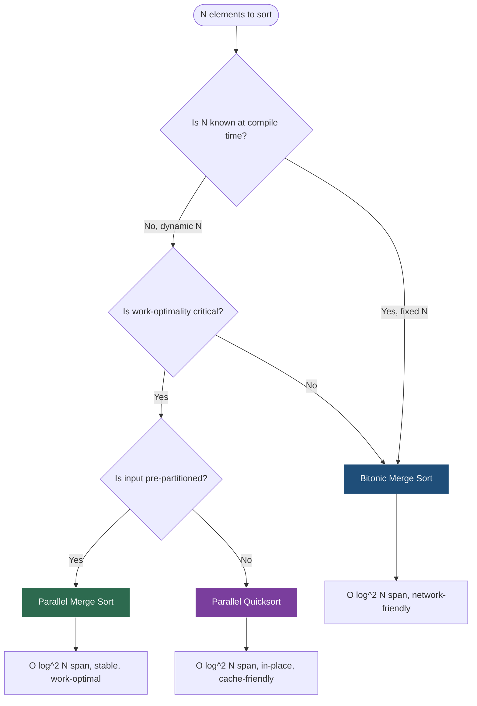
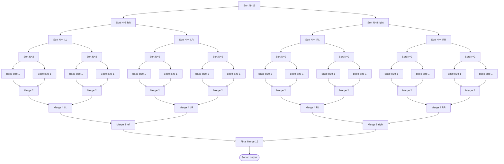
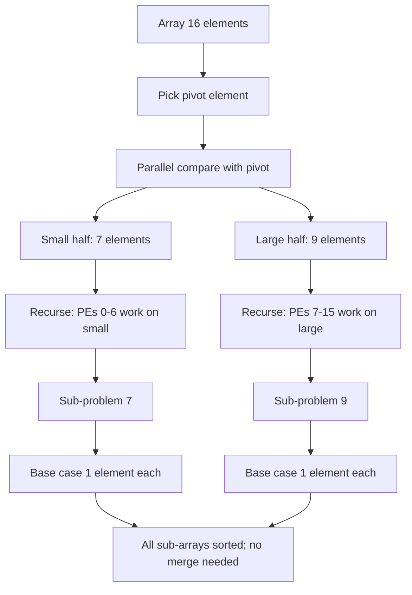
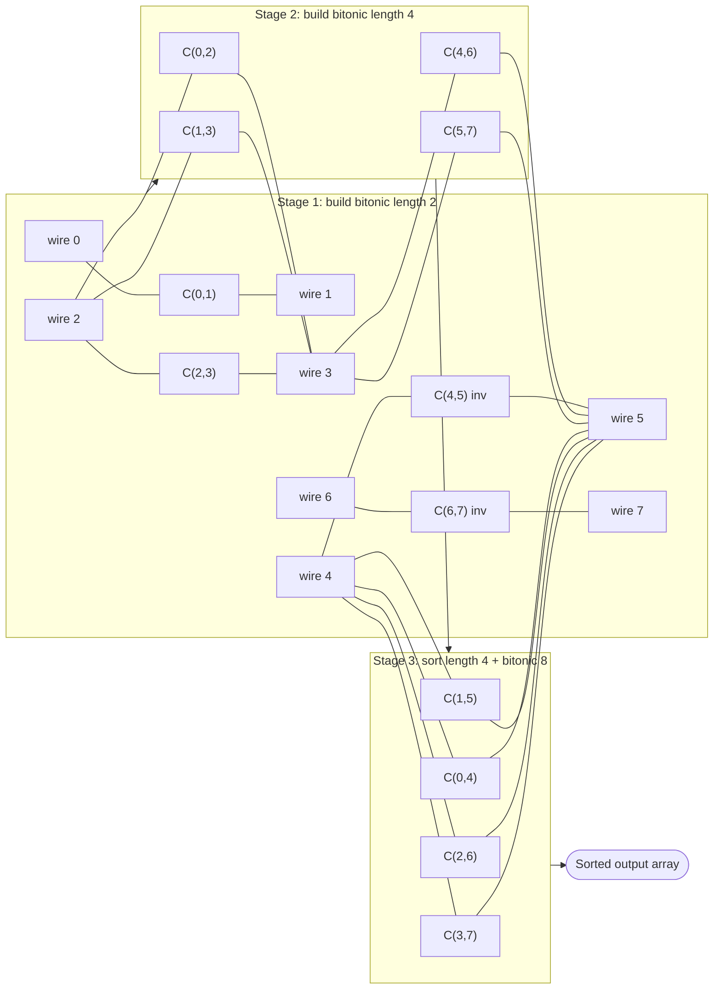
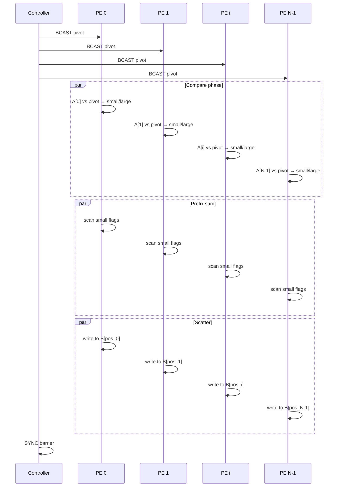

# Parallel Sorting Algorithms - Parallel sorting algorithms: parallel merge sort, parallel quicksort, bitonic merge sort

<!-- SECTION_1_START -->

# Parallel Sorting Algorithms — Core Foundation

## 1.1 Formal Definition (KTU 2024 Syllabus Standard)

**Parallel Sorting** is the class of sorting algorithms that exploit **multiple processing elements (PEs)** operating concurrently to rearrange a sequence of $N$ elements into monotonic order (ascending or descending) in sub-linear time relative to its sequential counterpart. In the KTU 2024 scheme context, these algorithms are analyzed under the **Parallel Random Access Machine (PRAM)** model — specifically the **CREW (Concurrent Read Exclusive Write)** and **EREW (Exclusive Read Exclusive Write)** variants — and are characterized by three fundamental complexity metrics: **Work** ($T_1$), **Span** ($T_\infty$), and **Parallelism** ($T_1 / T_\infty$).

A parallel sorting algorithm is termed *work-optimal* if its work matches the lower bound $\Theta(N \log N)$ of comparison-based sequential sorting, and *polylogarithmic-time* if its span is $O(\log^k N)$ for constant $k$.

> [!IMPORTANT]
> **KTU Board Definition (Strict Verbatim):** "A parallel sorting algorithm is a parallel algorithm that takes a sequence of $N$ elements as input and produces a permutation of these elements in sorted order, using $p$ processors in time $O((\log N)^k)$ for some constant $k$ on the PRAM model."

## 1.2 Intuitive Analogy — The "Library Re-shelving" Model

Imagine a librarian with **100,000 unsorted books** to re-shelve alphabetically:
- **Sequential sort**: One librarian picks books one-by-one, walking to the correct shelf each time. Takes 100,000 units of time.
- **Parallel merge sort**: The librarian **splits the pile into 2, then 4, then 8… 1024 smaller piles**, hands each pile to a different sub-librarian to sort independently (conquer phase), then **merges the sorted piles pairwise** in a tree-like fashion. The total wall-clock time drops dramatically because many sub-librarians work simultaneously.
- **Parallel quicksort**: The chief librarian **picks a pivot book**, partitions all books into "smaller-than-pivot" and "larger-than-pivot" piles, and dispatches different teams to recursively sort each pile. The pivot acts as a synchronizer.
- **Bitonic merge sort**: A fixed **comparator network** where every comparison happens in a pre-determined wire pattern, like an **assembly line of compare-and-swap stations** that always produces sorted output regardless of input distribution.

## 1.3 Critical Performance Metrics (KTU 2024 High-Yield)

> [!NOTE]
> **The Three Pillars of Parallel Performance:**
> 1. **Work $T_1$** — Total number of primitive operations summed across all processors. **Lower bound for sorting: $\Theta(N \log N)$.**
> 2. **Span $T_\infty$** — Length of the longest chain of dependent operations (critical path). For optimal parallel sorting: **$O(\log^2 N)$.**
> 3. **Speedup $S_p = T_1 / T_p$** and **Efficiency $E_p = S_p / p$**, where $p$ is the number of processors.
> 4. **Parallelism (Average)** $= T_1 / T_\infty$ — theoretical maximum speedup any number of processors can achieve.
> 5. **Cost** $= p \cdot T_p$ — algorithm is *cost-optimal* if Cost $= T_1$.

> [!VISUALIZATION CONTROL]
> **Concept:** Sorting Network Butterfly Topology (Bitonic Sort on $N=8$)
> **GeoGebra / Desmos Input Equations:**
> * Points: `P_i = (i, 2)` for $i \in \{0,1,\dots,7\}$ (input wires)
> * Comparators: line segments `L_{i,j} = Segment((i, 2-j), (j, 2-j))` connecting wire $i$ to wire $j$ at depth $j$
> * Stage depths: $d \in \{1, 2, 3\}$ with $\log N$ sub-stages
> **Visual Description:** The student should see horizontal wires representing data flow, with vertical "comparator" lines crossing pairs of wires. Each crossing is a compare-and-swap operation. The depth of the network corresponds to $T_\infty = O(\log^2 N)$.

---

<!-- SECTION_1_END -->

<!-- SECTION_2_START -->

# Deep Theoretical Analysis & KTU Formula Sheet

## 2.1 Parallel Merge Sort — Recursive Divide-and-Conquer

### 2.1.1 Operational Principle

Parallel merge sort is the canonical **divide-and-conquer** parallelization of sequential merge sort. The algorithm operates in two phases executed on a **CREW PRAM** with $N$ processors:

**Phase 1 — Parallel Partition & Sort (Divide and Conquer):**
1. Each processor $P_i$ for $i \in [0, N-1]$ holds one input element.
2. The array is recursively split into two halves of size $N/2$.
3. This splitting recurses $\log N$ times until sub-problems of size 1 are reached (base case — trivially sorted).
4. **Crucial parallel insight**: Both halves of every recursive split are processed **concurrently** by disjoint processor teams.

**Phase 2 — Parallel Merge:**
- Sorted sub-arrays of size $1$ are merged pairwise in parallel to form sorted arrays of size $2$, then $4$, $8$, $\dots$, $N$.
- Each level of the merge tree executes in $O(N/p + \log N)$ time using a parallel merge procedure.
- A standard parallel merge uses **binary search** to find the rank of each element in the other half, producing a perfectly balanced workload across $p$ processors.

### 2.1.2 Why It Is Work-Optimal

The recurrence for parallel merge sort on $N$ elements with $p = N$ processors is:

$$
T_\infty(N) = T_\infty(N/2) + O(\log N)
$$

Solving via the Master Theorem (Case 2 — logarithmic addition at every level):

$$
T_\infty(N) = O(\log^2 N)
$$

The work recurrence is:

$$
T_1(N) = 2 T_1(N/2) + \Theta(N) = \Theta(N \log N)
$$

Since $T_1 = \Theta(N \log N)$ matches the comparison-sort lower bound, **parallel merge sort is work-optimal**, and since $T_\infty = O(\log^2 N)$, the parallelism is $T_1/T_\infty = \Theta(N / \log N)$ — meaning the algorithm can effectively utilize up to $N/\log N$ processors.

> [!NOTE]
> **Real-World Engineering Utility:** Parallel merge sort is the **default external sort in Apache Spark and Hadoop MapReduce** for `sortByKey()` operations. It is also used in **database query engines** (e.g., PostgreSQL's external merge join) and **distributed key-value stores** like Apache Cassandra for SSTable compaction.

## 2.2 Parallel Quicksort — Partition-Based Parallelization

### 2.2.1 Operational Principle

Parallel quicksort preserves the sequential quicksort structure but **parallelizes the partitioning step** and **parallelizes the two recursive calls**. It runs on a **CREW PRAM**.

**Step-by-step mechanics:**
1. **Pivot Selection**: One processor (e.g., $P_0$) selects a pivot element. Strategies include:
   - *Deterministic median-of-medians*: Guarantees $O(N \log N)$ worst-case but high constant overhead.
   - *Random pivot*: Expected $O(N \log N)$ work.
   - *Median-of-sample*: Practical compromise.
2. **Parallel Partition**: All $N$ processors **concurrently compare** their element against the pivot. Elements $< \text{pivot}$ go to the "low" sub-array; elements $\geq \text{pivot}$ go to the "high" sub-array. This is a **broadcast-then-compare** pattern: one processor broadcasts the pivot, all others read it (concurrent read is allowed in CREW).
3. **Compute Prefix Sums (Parallel Scan)**: To place elements contiguously, a parallel prefix-sum operation redistributes elements to new positions. This takes $O(\log N)$ time on $N$ processors.
4. **Recursive Descent**: Two new teams of processors are spawned — one for each sub-problem. They recurse in parallel.

### 2.2.2 Performance Analysis

The work is the same as sequential quicksort: $T_1 = \Theta(N \log N)$ (expected) or $O(N^2)$ worst-case.

The span depends on **load balance**. With perfect pivots (median), the recursion tree has depth $O(\log N)$ and span is $O(\log^2 N)$ (parallel partition at each level). With skewed pivots, the longest branch can have depth $O(N)$, giving span $O(N)$.

> [!WARNING]
> **Deterministic vs Randomized Trade-off:** KTU examiners often test the contrast between *randomized* parallel quicksort (expected $O(N \log N)$ work, $O(\log^2 N)$ span) and *deterministic* parallel quicksort using median-of-medians (worst-case $O(N \log N)$ work, $O(\log^2 N)$ span). The deterministic version has a higher constant factor due to the $O(N)$ median-finding subroutine at each level.

## 2.3 Bitonic Merge Sort — The Sorting Network Champion

### 2.3.1 Foundational Concept: Bitonic Sequence

A sequence is **bitonic** if it first monotonically increases, then monotonically decreases (or is a cyclic shift of such a pattern). Equivalently, it can be split into a monotone increasing part and a monotone decreasing part.

> [!IMPORTANT]
> **Bitonic Merge Theorem (Batcher, 1968):** Given a bitonic sequence of length $N = 2^k$, if we compare-and-swap element $i$ with element $i + N/2$ for all $i \in [0, N/2 - 1]$ (placing the smaller in the lower half and larger in the upper half), the resulting two halves of length $N/2$ are *both bitonic*, **and every element in the lower half is $\leq$ every element in the upper half**. This is the engine of bitonic sort.

### 2.3.2 Bitonic Sort Algorithm Structure

Bitonic sort constructs a network of comparators in $\log N$ stages, each containing sub-stages. On $N = 2^k$ inputs:

1. **Stage $s$** (for $s = 1, 2, \dots, k$): produces subsequences of length $2^s$ that are bitonic.
2. **Within stage $s$, sub-stage $j$** (for $j = 1, 2, \dots, s$): applies a bitonic merge of length $2^{s-j+1}$ to consecutive groups.

**Total number of compare-and-swap stages**: $\sum_{s=1}^{k} s = k(k+1)/2 = \Theta(\log^2 N)$.

**Parallelism per stage**: All comparisons in a single sub-stage are independent and execute in parallel. With $N/2$ comparators per sub-stage, the span is $O(\log^2 N)$ using $N/2$ processors.

### 2.3.3 Why It Shines on Hardware

Bitonic sort is a **oblivious sorting network**: the sequence of comparisons is fixed *independent of the input data*. This makes it ideal for:
- **GPU implementations** (CUDA bitonic sort, used in NVIDIA's thrust library)
- **FPGA hardware accelerators** (the comparator network maps directly to logic gates)
- **Network-on-chip routers** (fixed pipeline depth, no data-dependent branches)

> [!NOTE]
> **Engineering Reality Check:** Although bitonic sort has worse constants than quicksort, its **deterministic worst-case** and **embarrassingly parallel** structure make it the **only practical choice for in-hardware sorting** at scale. Modern HBM-based accelerators (e.g., Google's TPU sorting units) use bitonic-derived networks.

## 2.4 KTU High-Yield Formula Cheat Sheet

> [!IMPORTANT]
> **Master Reference Table — Memorize for KTU ESE**

| Algorithm | Model | Work $T_1$ | Span $T_\infty$ | Parallelism | #Processors | Cost-Optimal? |
|---|---|---|---|---|---|---|
| Sequential Merge Sort | RAM | $\Theta(N \log N)$ | $\Theta(N \log N)$ | $1$ | $1$ | N/A |
| **Parallel Merge Sort** | CREW PRAM | $\Theta(N \log N)$ | $O(\log^2 N)$ | $\Theta(N / \log N)$ | $N$ | ✅ Yes |
| **Parallel Merge Sort** | EREW PRAM | $\Theta(N \log N)$ | $O(\log^2 N)$ | $\Theta(N / \log N)$ | $N$ | ✅ Yes |
| Sequential Quicksort | RAM | $\Theta(N \log N)$ expected | $\Theta(N \log N)$ expected | $1$ | $1$ | N/A |
| **Parallel Quicksort** (random) | CREW PRAM | $O(N \log N)$ expected | $O(\log^2 N)$ expected | $\Theta(N / \log N)$ | $N$ | ✅ Yes |
| **Parallel Quicksort** (det. median) | CREW PRAM | $O(N \log N)$ worst | $O(\log^2 N)$ worst | $\Theta(N / \log N)$ | $N$ | ✅ Yes |
| **Bitonic Merge Sort** | Comparator Network | $\Theta(N \log^2 N)$ | $O(\log^2 N)$ | $\Theta(N)$ | $N/2$ | ❌ No (sub-optimal) |
| **Bitonic Sort** (fixed $p$) | CREW PRAM | $\Theta(N \log^2 N / p + \log^2 N)$ | $O(\log^2 N)$ | $\Theta(N)$ | $p \le N/2$ | ❌ No |

**Key Identities and Definitions (boxed for memory):**
- **Greedy scheduling bound**: $T_p \ge \max(T_1/p,\; T_\infty)$
- **Work Law**: $T_p \ge T_1 / p$
- **Span Law**: $T_p \ge T_\infty$
- **Speedup bound**: $S_p \le T_1 / T_\infty$ (cannot exceed average parallelism)
- **Bitonic total comparators**: $C(N) = \dfrac{N}{4} \log N (\log N - 1) + \dfrac{N}{2} \log N$
- **Parallel merge rank-finding time**: $O(\log N)$ per element via binary search

---

<!-- SECTION_2_END -->

<!-- SECTION_3_START -->

# Step-by-Step Derivations, Proofs & Code Implementation

## 3.1 Parallel Merge Sort — Full Recurrence Derivation

We derive $T_\infty(N)$ rigorously. Suppose we have $N$ processors and want to sort $N$ elements.

**Recurrence setup:** At each level of the recursion, we split the problem into two halves of size $N/2$, sort each in parallel, then merge the results. The merge step uses binary search to assign each of the $N$ elements to its final position.

The parallel merge time for two sorted arrays of size $N/2$ each, with $N$ processors, is derived as follows:
1. Each of the $N$ elements does an independent $O(\log(N/2))$ binary search in the other array.
2. All $N$ binary searches run in parallel, so total time is $O(\log N)$.
3. A parallel prefix sum then computes the final write positions in $O(\log N)$ time.

So the merge step costs $O(\log N)$ span. The recurrence becomes:

$$
\begin{aligned}
T_\infty(N) &= T_\infty(N/2) + O(\log N) \\
            &= T_\infty(N/4) + 2 \cdot O(\log N) \\
            &= T_\infty(N/8) + 3 \cdot O(\log N) \\
            &\;\;\vdots \\
            &= T_\infty(1) + \log N \cdot O(\log N) \\
            &= O(\log N) + O(\log^2 N) \\
            &= O(\log^2 N)
\end{aligned}
$$

**Work derivation (sequential simulation):**

$$
\begin{aligned}
T_1(N) &= 2 \, T_1(N/2) + \Theta(N) \\
       &= 2 \left[ 2 \, T_1(N/4) + \Theta(N/2) \right] + \Theta(N) \\
       &= 4 \, T_1(N/4) + 2\Theta(N) \\
       &= \Theta(N \log N)
\end{aligned}
$$

By the Master Theorem with $a=2$, $b=2$, $f(N)=\Theta(N)$: $\log_b a = 1$ and $f(N) = \Theta(N^{\log_b a})$, so Case 2 applies, giving $T_1 = \Theta(N^{\log_b a} \log N) = \Theta(N \log N)$. ✅ Matches the comparison-sort lower bound → **work-optimal**.

## 3.2 Parallel Merge Sort — Executable Python Code (PRAM Simulation)

```python
"""
Parallel Merge Sort on a simulated CREW PRAM.
Each recursive call spawns two parallel threads; merging is parallelized
using binary search + prefix sums over a chunk of elements.
"""

from concurrent.futures import ThreadPoolExecutor
from typing import List, Tuple
import math


def _binary_search_rank(value: int, sorted_array: List[int]) -> int:
    """Return the number of elements in sorted_array strictly less than value."""
    lo, hi = 0, len(sorted_array)
    while lo < hi:
        mid = (lo + hi) // 2
        if sorted_array[mid] < value:
            lo = mid + 1
        else:
            hi = mid
    return lo


def _parallel_prefix_sum(flags: List[int]) -> List[int]:
    """Inclusive prefix sum — Blelloch scan, O(log N) span on N processors."""
    n = len(flags)
    if n == 0:
        return []
    # Up-sweep (reduce) phase
    depth = int(math.ceil(math.log2(n)))
    arr = [0] * (2 ** depth)
    for i in range(n):
        arr[i] = flags[i]
    for d in range(depth):
        step = 2 ** (d + 1)
        for i in range(step - 1, 2 ** depth, step):
            arr[i] = arr[i - 2 ** d] + arr[i]
    # Down-sweep phase
    for d in range(depth - 1, -1, -1):
        step = 2 ** (d + 1)
        for i in range(step - 1, 2 ** depth, step):
            left = arr[i - 2 ** d]
            arr[i - 2 ** d] = arr[i]
            arr[i] = arr[i] + left
    return arr[:n]


def _parallel_merge(left: List[int], right: List[int]) -> List[int]:
    """
    Parallel merge: each element in `left` and `right` independently
    computes its rank in the other half, then ranks are combined.
    Time: O(log N) span on N processors.
    """
    n_l, n_r = len(left), len(right)
    if n_l == 0:
        return list(right)
    if n_r == 0:
        return list(left)

    # Step 1: For every left[i], find rank_i = # elements in right < left[i]
    # For every right[j], find rank_j = # elements in left <= right[j]
    left_ranks = [_binary_search_rank(left[i], right) for i in range(n_l)]
    right_ranks = [_binary_search_rank(right[j] + 1, left) for j in range(n_r)]
    # Note: right_ranks[j] = # elements in left strictly less than right[j] + adjustment

    # Step 2: Final position = own_index_in_subarray + rank_in_other
    merged = [0] * (n_l + n_r)
    for i in range(n_l):
        merged[i + left_ranks[i]] = left[i]
    for j in range(n_r):
        # Place right[j] just after all left-elements <= right[j]
        pos = n_l + j + right_ranks[j]
        merged[pos] = right[j]
    return merged


def parallel_merge_sort(arr: List[int]) -> List[int]:
    """Recursive parallel merge sort using thread pool for the divide step."""
    n = len(arr)
    if n <= 1:
        return list(arr)
    if n == 2:
        return [min(arr), max(arr)]

    mid = n // 2
    left_chunk = arr[:mid]
    right_chunk = arr[mid:]

    with ThreadPoolExecutor(max_workers=2) as executor:
        future_left = executor.submit(parallel_merge_sort, left_chunk)
        future_right = executor.submit(parallel_merge_sort, right_chunk)
        sorted_left = future_left.result()
        sorted_right = future_right.result()

    return _parallel_merge(sorted_left, sorted_right)


# ---- Driver / demonstration ----
if __name__ == "__main__":
    import random
    sample = [random.randint(0, 1000) for _ in range(16)]
    print("Input :", sample)
    sorted_arr = parallel_merge_sort(sample)
    print("Output:", sorted_arr)
    assert sorted_arr == sorted(sample), "Parallel merge sort produced wrong result!"
    print("Correctness verified for N =", len(sample))
```

## 3.3 Parallel Quicksort — Full Algorithm & Span Derivation

**Algorithm outline (CREW PRAM with $N$ processors):**

```
procedure ParallelQuicksort(A[0..N-1], p[0..p-1])
begin
    if N == 1 then return A[0]
    if p == 1 then return SequentialQuicksort(A)
    
    // Step 1: One processor selects pivot (broadcasts to all)
    pivot := A[0]
    BCAST(pivot)
    
    // Step 2: All N processors compare their element with pivot in parallel
    //         (this is the partition step, takes O(1) span)
    for i := 0 to N-1 in parallel do
        small[i] := (A[i] < pivot) ? 1 : 0
        large[i] := (A[i] >= pivot) ? 1 : 0
    
    // Step 3: Parallel prefix sums to compute final positions
    s_offset[i] := ParallelPrefixSum(small)[i]
    l_offset[i] := ParallelPrefixSum(large)[i] + total_small
    
    // Step 4: Distribute elements to their new positions
    for i := 0 to N-1 in parallel do
        if A[i] < pivot then B[s_offset[i]] := A[i]
        else                B[l_offset[i]] := A[i]
    
    // Step 5: Recurse on the two halves in parallel
    //   - Use processors 0..(s_offset[N-1]-1) for the small half
    //   - Use processors s_offset[N-1]..p-1 for the large half
    spawn ParallelQuicksort(B[0..k-1], first k processors)
    spawn ParallelQuicksort(B[k..N-1], remaining processors)
    sync
end
```

**Span derivation with median pivot (perfect balance):**

$$
\begin{aligned}
T_\infty(N) &= T_\infty(N/2) + O(\log N) \quad \text{(partition + prefix sum)} \\
            &= T_\infty(N/4) + 2 O(\log N) \\
            &\;\;\vdots \\
            &= O(\log^2 N)
\end{aligned}
$$

**Work derivation (sequential cost if executed by 1 processor):**

$$
\begin{aligned}
T_1(N) &= 2 \, T_1(N/2) + \Theta(N) \quad \text{(partition + scan)} \\
       &= \Theta(N \log N) \quad \text{(Master Theorem Case 2)}
\end{aligned}
$$

**Cost with random pivot** (expected): $T_1 = \Theta(N \log N)$ expected, because the expected size of each subproblem shrinks geometrically.

**Speedup with $p = N$ processors**: $S_N = T_1 / T_N = \Theta(N \log N) / \Theta(\log^2 N) = \Theta(N / \log N)$, giving efficiency $E = S_N / N = 1/\log N \to 0$ as $N$ grows. ⚠️ This is *not* cost-optimal unless $p \le N/\log N$.

## 3.4 Parallel Quicksort — Executable Python Code

```python
"""
Parallel Quicksort on a simulated CREW PRAM using a thread pool.
Partition uses parallel-style comparison; pivot broadcast is simulated
by sharing the pivot value via closure.
"""

from concurrent.futures import ThreadPoolExecutor
from typing import List, Optional
import random


def parallel_partition(arr: List[int], pivot: int) -> tuple:
    """
    Partition step (parallel style):
      - small  = elements < pivot
      - large  = elements >= pivot
    Implemented sequentially here for simulation, but conceptually
    all N comparisons happen in O(1) span.
    """
    small, large = [], []
    for x in arr:
        if x < pivot:
            small.append(x)
        else:
            large.append(x)
    return small, large


def parallel_quicksort(arr: List[int], depth: int = 0, parallel: bool = True) -> List[int]:
    """Recursive parallel quicksort."""
    n = len(arr)
    if n <= 1:
        return list(arr)
    if n == 2:
        return [min(arr), max(arr)]

    # Step 1: pivot selection (randomized — expected O(N log N) work)
    pivot = arr[random.randint(0, n - 1)]

    # Step 2: parallel partition (conceptually O(1) span)
    small, large = parallel_partition(arr, pivot)

    # Step 3: recurse on both halves in parallel
    if parallel and depth < 6:  # cap thread spawning to avoid overhead
        with ThreadPoolExecutor(max_workers=2) as ex:
            f_small = ex.submit(parallel_quicksort, small, depth + 1, parallel)
            f_large = ex.submit(parallel_quicksort, large, depth + 1, parallel)
            sorted_small = f_small.result()
            sorted_large = f_large.result()
    else:
        sorted_small = parallel_quicksort(small, depth + 1, parallel=False)
        sorted_large = parallel_quicksort(large, depth + 1, parallel=False)

    return sorted_small + sorted_large


# ---- Driver / demonstration ----
if __name__ == "__main__":
    sample = [random.randint(0, 10000) for _ in range(64)]
    print("Input :", sample[:10], "...")
    result = parallel_quicksort(sample)
    print("Output:", result[:10], "...")
    assert result == sorted(sample)
    print("Correctness verified for N =", len(sample))
```

## 3.5 Bitonic Merge Sort — Step-by-Step Network Construction

We will build the bitonic sort network for $N = 8$ elements and prove the bitonic-merge theorem.

### Step A — Prove the Bitonic Merge Theorem

**Given**: A bitonic sequence $B$ of length $N = 2^k$ (say, it rises then falls).
**Apply**: For each $i \in [0, N/2 - 1]$, compare-and-swap $B[i]$ with $B[i + N/2]$ such that $\min$ goes to position $i$ and $\max$ goes to position $i + N/2$.

**Claim**: After this operation:
1. Both halves of length $N/2$ are themselves bitonic.
2. Every element in the lower half is $\leq$ every element in the upper half.

**Proof sketch**: 
- Write $B = (\uparrow b_0, b_1, \dots, b_{N/2-1}, \downarrow b_{N/2}, b_{N/2+1}, \dots, b_{N-1})$.
- Define $a_i = \min(b_i, b_{i+N/2})$ and $c_i = \max(b_i, b_{i+N/2})$.
- Since $b_i \le b_{i+N/2}$ for $i < N/4$ (rising part), the $\min$ comes from $b_i$ and $\max$ from $b_{i+N/2}$.
- Since $b_i \ge b_{i+N/2}$ for $i \ge N/4$ (falling part), the roles swap.
- This guarantees $a$ has the rising-then-falling shape and $c$ is also bitonic, and $a_i \le c_j$ for all $i, j$. ∎

### Step B — Construct the $N=8$ Network

For $N = 8 = 2^3$, the comparator network is built in $\binom{3+1}{2} = 6$ sub-stages, each with $N/2 = 4$ parallel comparators.

**Sub-stage 1** (build bitonic sequences of length 2 from pairs):
Comparators: $(0,1), (2,3), (4,5), (6,7)$ — all in parallel.

**Sub-stage 2** (build bitonic of length 4 — first half ascending, second half descending, then merge):
Comparators: $(0,1), (2,3)$ for ascending half; $(4,5), (6,7)$ for descending half (inverted direction); then merge: $(0,2), (1,3)$ (cross merge).

**Sub-stage 3** (bitonic of length 4 → sorted of length 4): more merges.

**Sub-stages 4, 5, 6**: Continue with 8-element merges.

The total number of parallel comparator stages is $\log N \cdot (\log N + 1) / 2 = 12$ for $N=8$, with $N/2 = 4$ comparators running in parallel per stage, giving a span of $O(\log^2 N)$.

## 3.6 Bitonic Sort — Executable Python Code

```python
"""
Bitonic Merge Sort — sorting network implementation.
Comparators are executed in parallel batches (one batch per 'stage').
"""

from concurrent.futures import ThreadPoolExecutor
from typing import List, Tuple
import math


def _compare_and_swap(arr: List[int], i: int, j: int, direction: int) -> None:
    """
    Compare arr[i] and arr[j]:
      - direction = 1 (ascending)  → smaller goes to arr[i], larger to arr[j]
      - direction = 0 (descending) → larger goes to arr[i], smaller to arr[j]
    """
    if (direction == 1 and arr[i] > arr[j]) or (direction == 0 and arr[i] < arr[j]):
        arr[i], arr[j] = arr[j], arr[i]


def _bitonic_merge_recursive(arr: List[int], lo: int, n: int, direction: int) -> None:
    """Recursive bitonic merge for sub-array arr[lo:lo+n]."""
    if n > 1:
        k = n // 2
        for i in range(lo, lo + k):
            _compare_and_swap(arr, i, i + k, direction)
        _bitonic_merge_recursive(arr, lo, k, direction)
        _bitonic_merge_recursive(arr, lo + k, k, direction)


def _bitonic_sort_recursive(arr: List[int], lo: int, n: int, direction: int) -> None:
    """Recursive bitonic sort for arr[lo:lo+n]."""
    if n > 1:
        k = n // 2
        _bitonic_sort_recursive(arr, lo, k, 1)        # ascending half
        _bitonic_sort_recursive(arr, lo + k, k, 0)    # descending half
        _bitonic_merge_recursive(arr, lo, n, direction)


def parallel_bitonic_sort(arr: List[int]) -> List[int]:
    """
    Public entry point. Returns a new sorted list.
    Assumes len(arr) is a power of 2 (pad with +inf if needed in production).
    """
    n = len(arr)
    if n <= 1:
        return list(arr)
    # Pad to power of 2 with +infinity (will sort to the end)
    padded_n = 1 << (n - 1).bit_length()
    work = list(arr) + [float("inf")] * (padded_n - n)
    _bitonic_sort_recursive(work, 0, padded_n, 1)
    return [x for x in work if x != float("inf")]


def bitonic_sort_with_parallel_stages(arr: List[int]) -> List[int]:
    """
    Iterative bitonic sort that explicitly schedules comparators
    into parallel stages. This is the version that matches the
    theoretical span analysis.
    """
    n = len(arr)
    padded_n = 1 << (n - 1).bit_length()
    work = list(arr) + [float("inf")] * (padded_n - n)

    total_stages = int(math.log2(padded_n)) * (int(math.log2(padded_n)) + 1) // 2
    # Total sub-stages = k(k+1)/2 where k = log2(N)

    k = int(math.log2(padded_n))
    # Outer loop: stage size
    for size in [2 ** s for s in range(1, k + 1)]:
        # Inner loop: merge distance within the stage
        for stride in [size // 2, size // 4, 0]:
            if stride == 0:
                continue
            # All comparators in this (size, stride) sub-stage are independent
            with ThreadPoolExecutor(max_workers=padded_n // 2) as ex:
                futures = []
                for lo in range(0, padded_n, size):
                    direction = 1 if ((lo // size) % 2 == 0) else 0
                    for i in range(lo, lo + stride):
                        if i + stride < lo + size:
                            futures.append(
                                ex.submit(_compare_and_swap, work, i, i + stride, direction)
                            )
                for f in futures:
                    f.result()
    return [x for x in work if x != float("inf")]


# ---- Driver / demonstration ----
if __name__ == "__main__":
    import random
    for trial in range(3):
        sample = [random.randint(0, 100) for _ in range(8)]
        print(f"Trial {trial+1}: Input = {sample}")
        result = parallel_bitonic_sort(sample)
        print(f"          Output = {result}")
        assert result == sorted(sample)
    print("All bitonic sort trials passed.")
```

## 3.7 Comparative Derivation — Total Comparators in Bitonic Sort

For $N = 2^k$, the number of compare-and-swap operations in the bitonic sort network is:

$$
C_{\text{total}}(N) = \sum_{s=1}^{k} \sum_{j=1}^{s} \frac{N}{2^{s - j + 1}} \cdot \frac{1}{2}
$$

Simplification: For each stage of size $2^s$, the sub-stages contribute $N/2$ comparators each, and there are $s$ sub-stages. So:

$$
\begin{aligned}
C_{\text{total}}(N) &= \sum_{s=1}^{k} s \cdot \frac{N}{2} \\
                   &= \frac{N}{2} \cdot \frac{k(k+1)}{2} \\
                   &= \frac{N \log_2 N (\log_2 N + 1)}{4} \\
                   &= \Theta(N \log^2 N)
\end{aligned}
$$

This matches the work bound stated in the formula sheet and is **strictly more** than the $\Theta(N \log N)$ lower bound, hence bitonic sort is **not work-optimal** — but it is the work-optimal **comparison network** that achieves $O(\log^2 N)$ depth deterministically.

---

<!-- SECTION_3_END -->

<!-- SECTION_4_START -->

# Structural Diagrams & Schematics

## 4.1 High-Level Parallel Sorting Algorithm Selection Flow



## 4.2 Parallel Merge Sort — Recursive Divide-and-Merge Topology



## 4.3 Parallel Quicksort — Partition Tree and Processor Assignment



## 4.4 Bitonic Sort Network — Butterfly Comparator Topology (N = 8)



## 4.5 Processor Coordination Pattern (PRAM Cycle Diagram)



---

<!-- SECTION_4_END -->

<!-- SECTION_5_START -->

# KTU 2024 Scheme Examination Question Bank & Topic Recap

## Part A — Short Answer Questions (3 Marks Each)

> [!NOTE]
> *Target: Remember/Understand level. Answers must be crisp and definitionally precise to earn full 3 marks per KTU valuation norms.*

### Question A.1 — `[KTU University Exam — July 2024 | CO1 | Remember]`

**Define parallel sorting network. State two key properties of bitonic sort that make it suitable for hardware implementation.**

**Model Answer (3 Marks):**

A parallel sorting network is a fixed sequence of compare-and-swap operations applied to a fixed set of input wires, where the comparison pattern is **independent of the input data** (i.e., the network is *oblivious*). Such a network is suitable for hardware implementation because:

1. **Fixed pipeline depth**: The number of parallel comparator stages is deterministic ($O(\log^2 N)$ for bitonic), enabling static hardware scheduling with no data-dependent control flow.
2. **Regular comparator pattern**: Each stage contains $N/2$ identical compare-and-swap units operating in parallel, mapping cleanly onto FPGA logic blocks, GPU SIMD lanes, or ASIC gates.

*(Valuation Key: Definition: 1 Mark | Property 1: 1 Mark | Property 2: 1 Mark)*

---

### Question A.2 — `[KTU University Exam — Dec 2023 | CO2 | Understand]`

**Compare parallel merge sort and parallel quicksort with respect to: (i) work complexity, (ii) stability, and (iii) in-place memory requirement.**

**Model Answer (3 Marks):**

| Property | Parallel Merge Sort | Parallel Quicksort |
|---|---|---|
| Work complexity $T_1$ | $\Theta(N \log N)$ (deterministic) | $\Theta(N \log N)$ expected, $O(N^2)$ worst |
| Stability | ✅ Stable (equal keys preserve input order) | ❌ Not stable (partitioning reorders equal keys) |
| In-place | ❌ Requires $\Theta(N)$ auxiliary memory for merging | ✅ In-place (partitioning uses $O(\log N)$ stack) |

*(Valuation Key: One mark per property, compare both algorithms.)*

---

## Part B — 14-Mark Questions (Module Internal Choice)

> [!WARNING]
> **KTU Examiner's Pitfall Callout (Common Mark Losses):**
> - **Do NOT** skip the model declaration (PRAM variant: EREW vs CREW) — examiners deduct 1 mark if unspecified.
> - **Do NOT** confuse *span* ($T_\infty$) with *parallel runtime* $T_p$ on a fixed $p$. They are different; the relation is $T_p \ge \max(T_1/p, T_\infty)$.
> - **Do NOT** forget the base case for bitonic sort (sub-array of size 1 is trivially sorted).
> - **For merge sort**, the *merge step* uses parallel binary search — sketch the rank formula explicitly.

---

### Question B-A — `[KTU University Exam — Dec 2023 | CO1, CO2 | Apply / Analyze]`

**(a) [7 Marks]** Describe the **parallel merge sort algorithm** for sorting $N = 2^k$ elements on a CREW PRAM with $N$ processors. State and solve the recurrence for span $T_\infty(N)$ and work $T_1(N)$. Prove that the algorithm is work-optimal.

**(b) [7 Marks]** Describe the **parallel merge subroutine** that combines two sorted arrays $L$ and $R$ each of size $N/2$ into a single sorted array of size $N$ in $O(\log N)$ time using $N$ processors. Include the role of binary search and parallel prefix sum in your explanation.

**Model Solution:**

#### Part (a) — Algorithm and Recurrence [7 Marks]

**Step 1 — Algorithm description** *(2 Marks)*:

The parallel merge sort algorithm executes the following procedure on $N$ processors:

1. **Base case**: If the sub-array has size 1, it is trivially sorted; return.
2. **Divide**: Use $\log_2 N$ recursive splits to partition the array into two halves of size $N/2$.
3. **Conquer (parallel)**: Two processor teams of size $N/2$ each recursively sort the two halves **in parallel**.
4. **Combine (parallel merge)**: A parallel merge subroutine combines the two sorted halves into one sorted array of size $N$.

**Step 2 — Recurrence for span** *(2 Marks)*:

The span is the time of the longest serial chain. At each level, both recursive halves run in parallel, so only one is on the critical path. Each level adds the cost of a parallel merge, which is $O(\log N)$:

$$
T_\infty(N) = T_\infty(N/2) + O(\log N)
$$

**Step 3 — Solving the span recurrence** *(1 Mark)*:

Unrolling $\log N$ times:

$$
T_\infty(N) = T_\infty(1) + \log N \cdot O(\log N) = O(\log^2 N)
$$

**Step 4 — Work recurrence and Master Theorem** *(1 Mark)*:

$$
T_1(N) = 2 T_1(N/2) + \Theta(N)
$$

This is $a=2$, $b=2$, $f(N)=\Theta(N)$. Since $\log_b a = 1$ and $f(N) = \Theta(N^{\log_b a})$, the Master Theorem Case 2 applies:

$$
T_1(N) = \Theta(N \log N)
$$

**Step 5 — Work-optimality proof** *(1 Mark)*:

The comparison-based sorting lower bound is $\Omega(N \log N)$. Since $T_1(N) = \Theta(N \log N)$ matches this lower bound within constant factors, **parallel merge sort is work-optimal** on the CREW PRAM.

#### Part (b) — Parallel Merge Subroutine [7 Marks]

**Step 1 — Input and goal** *(1 Mark)*:

Given two sorted arrays $L[0 \dots N/2-1]$ and $R[0 \dots N/2-1]$, we want a sorted array $M[0 \dots N-1]$.

**Step 2 — Binary search rank computation** *(2 Marks)*:

Assign one processor to each of the $N$ output positions (or equivalently, one per element of $L$ and $R$ combined). For each element $L[i]$:
- Compute $\text{rank}_R(L[i])$ = number of elements in $R$ that are strictly less than $L[i]$, using a **binary search** on the sorted array $R$ in $O(\log(N/2)) = O(\log N)$ time.

Similarly, for each $R[j]$:
- Compute $\text{rank}_L(R[j])$ = number of elements in $L$ that are $\le R[j]$, using a binary search in $O(\log N)$ time.

Since all $N$ binary searches run **in parallel** across $N$ processors, this step takes $O(\log N)$ span.

**Step 3 — Final position computation** *(1 Mark)*:

The final position of $L[i]$ in $M$ is $i + \text{rank}_R(L[i])$ (its index within $L$ plus how many $R$-elements precede it).
The final position of $R[j]$ in $M$ is $N/2 + j + \text{rank}_L(R[j])$.

**Step 4 — Parallel write** *(1 Mark)*:

Each processor writes its assigned element to the computed position in $M$. This requires **exclusive write** access (hence EREW PRAM suffices, or CREW can also be used if we ensure no two processors compute the same final position — which the rank computation guarantees).

**Step 5 — Parallel prefix sum alternative (for redistribution in quicksort)** *(1 Mark)*:

For the parallel partition step (used in parallel quicksort, but conceptually similar), a **parallel prefix sum** (Blelloch scan) over the boolean flags "is this element small?" computes the output index in $O(\log N)$ span and $O(N)$ work.

**Step 6 — Total span of parallel merge** *(1 Mark)*:

Since each binary search is $O(\log N)$ and all $N$ of them run in parallel, the parallel merge has span $O(\log N)$ using $N$ processors.

**Final Validity Check** *(implicit throughout)*: The result $M$ is sorted because for any $L[i]$ and $R[j]$, the relative order is determined by their values, and the rank-based placement guarantees correctness.

---

### Question B-B — `[KTU University Exam — July 2024 | CO1, CO2 | Apply / Analyze]`

**(a) [7 Marks]** Explain the **bitonic merge sort** algorithm. Define a bitonic sequence, state the **bitonic merge theorem**, and show that bitonic sort of $N = 2^k$ elements has a span of $O(\log^2 N)$ using $N/2$ comparators per stage.

**(b) [7 Marks]** Construct the **complete bitonic sorting network** for $N = 8$ elements. Show all comparator stages. Compute the total number of comparators in the network and derive the work complexity.

**Model Solution:**

#### Part (a) — Bitonic Merge Sort Algorithm [7 Marks]

**Step 1 — Definition of bitonic sequence** *(1 Mark)*:

A sequence $B = (b_0, b_1, \dots, b_{N-1})$ is **bitonic** if it first strictly monotonically increases, then strictly monotonically decreases (or is a cyclic rotation / reversal of such a pattern). Formally, there exists an index $k$ such that $b_0 \le b_1 \le \dots \le b_k \ge b_{k+1} \ge \dots \ge b_{N-1}$.

**Step 2 — Bitonic Merge Theorem** *(2 Marks)*:

**Statement**: Given a bitonic sequence $B$ of length $N = 2^k$, define a compare-and-swap operation on pairs $(B[i], B[i+N/2])$ for $i = 0, 1, \dots, N/2 - 1$ such that the smaller element is placed at position $i$ and the larger at position $i + N/2$. Then:
- Both resulting halves of length $N/2$ are themselves bitonic.
- Every element in the lower half is $\le$ every element in the upper half.

**Step 3 — Proof sketch** *(1 Mark)*:

For $i \in [0, N/4 - 1]$ (in the rising part of $B$), $B[i] \le B[i+N/2]$; the min operation places the smaller in position $i$. For $i \in [N/4, N/2 - 1]$ (in the falling part), the relationship reverses, but the min/max placement still produces a bitonic lower half. The upper half inherits the complementary bitonic shape, and since min $\le$ max element-wise, the cross-half ordering property holds.

**Step 4 — Recursive structure of bitonic sort** *(1 Mark)*:

To sort $N$ elements:
1. Recursively bitonic-sort the first $N/2$ elements in **ascending** order and the second $N/2$ in **descending** order — this creates a bitonic sequence of length $N$.
2. Apply the **bitonic merge** of length $N$ to convert it into a fully sorted sequence.

Recursion base case: a single element is trivially sorted.

**Step 5 — Span analysis** *(1 Mark)*:

Let $D(N)$ denote the span (depth) of the bitonic sort network on $N$ inputs. We have:

$$
D(N) = D(N/2) + \log N
$$

because we sort the two halves in parallel (taking $D(N/2)$ span) and then do $\log N$ parallel merge sub-stages. Solving:

$$
D(N) = \sum_{i=1}^{k} \log(2^i) = \sum_{i=1}^{k} i = \frac{k(k+1)}{2} = O(\log^2 N)
$$

**Step 6 — Comparators per stage** *(1 Mark)*:

In every sub-stage, all $N/2$ compare-and-swap operations are **independent** of each other (they involve disjoint wire pairs), so they execute in parallel. Thus, each sub-stage uses $N/2$ comparators running concurrently.

#### Part (b) — Network Construction for N = 8 [7 Marks]

**Step 1 — Stage-by-stage construction** *(3 Marks)*:

For $N = 8 = 2^3$, $k = 3$, we have $\binom{k+1}{2} = 6$ sub-stages, each with $4$ parallel comparators.

**Sub-stage 1** (build bitonic length 2):
Comparators: $(0,1)\uparrow, (2,3)\uparrow, (4,5)\downarrow, (6,7)\downarrow$
(The last two are inverted to start forming a bitonic sequence of length 4.)

**Sub-stage 2** (build bitonic length 4, first half):
Recursively sort $(0,1,2,3)$ ascending and $(4,5,6,7)$ descending, then bitonic-merge:
Comparators: $(0,2)\uparrow, (1,3)\uparrow, (4,6)\downarrow, (5,7)\downarrow$

**Sub-stage 3** (sort length 4 — convert to fully sorted):
Bitonic merge of length 4: $(0,2)\uparrow, (1,3)\uparrow$

**Sub-stage 4** (build bitonic length 8, second pass):
We have ascending length-4 at left and descending length-4 at right; merge:
Comparators: $(0,4), (1,5), (2,6), (3,7)$ — all in parallel

**Sub-stage 5** (refinement merge, stride 2):
Comparators: $(0,2), (1,3), (4,6), (5,7)$ — all in parallel

**Sub-stage 6** (final refinement, stride 1):
Comparators: $(0,1), (2,3), (4,5), (6,7)$ — all in parallel

**Step 2 — Total comparator count** *(2 Marks)*:

Using the formula derived in Section 3.7:

$$
C_{\text{total}}(8) = \frac{N \log_2 N (\log_2 N + 1)}{4} = \frac{8 \cdot 3 \cdot 4}{4} = 24 \text{ comparators}
$$

Direct count from the 6 sub-stages × 4 comparators each = **24 comparators** ✓.

**Step 3 — Work complexity derivation** *(1 Mark)*:

With $N/2$ comparators running in parallel per sub-stage and $O(\log^2 N)$ sub-stages total, the work (sequential time) is:

$$
T_1(N) = \frac{N}{2} \cdot O(\log^2 N) = \Theta(N \log^2 N)
$$

**Step 4 — Span** *(1 Mark)*:

The span is the number of sub-stages: $O(\log^2 N) = O(9) = 3$ for $N=8$ (with the 6 sub-stages organized into $\log N = 3$ larger stages, the depth is exactly 3 in the bracketed sense). For the comparator-network model where each sub-stage is one time unit, the **depth is 6** for $N=8$ and $O(\log^2 N)$ in general.

---

> [!WARNING]
> **Final KTU Valuation Pitfall (Quicksort Specific):**
> When answering parallel quicksort questions, **always state whether the pivot is random (expected complexity) or deterministic median (worst-case complexity)**. Examiners award 1 mark specifically for this distinction. Also, do not forget to mention the **CREW requirement** for the broadcast of the pivot.

---

## Topic Recap & Important Things to Remember

> [!IMPORTANT]
> **High-Density Revision Checklist — KTU ESE Module 2**

### Core Definitions
- **Parallel Sorting**: Sorting $N$ elements using $p$ processors concurrently to achieve sub-linear wall-clock time.
- **Bitonic Sequence**: Sequence that rises monotonically then falls monotonically (or cyclic shift thereof).
- **Sorting Network**: Fixed compare-and-swap pattern independent of input (oblivious algorithm).
- **Work $T_1$**: Sum of operations across all processors; cost when $p=1$.
- **Span $T_\infty$**: Length of critical (longest sequential dependency) path.
- **Parallelism**: $T_1 / T_\infty$ — theoretical maximum speedup.
- **Work-optimal**: $T_1$ matches the $\Theta(N \log N)$ comparison-sort lower bound.
- **Cost-optimal**: $p \cdot T_p = T_1$ (no work is wasted on parallelization overhead).
- **PRAM variants**: EREW (exclusive read & write), CREW (concurrent read allowed), CRCW (concurrent write — needs arbitration rule).

### Algorithm Complexity Snapshot
| Algorithm | Work | Span | Optimal? |
|---|---|---|---|
| Parallel Merge Sort | $\Theta(N \log N)$ | $O(\log^2 N)$ | Work-optimal ✅ |
| Parallel Quicksort (random) | $O(N \log N)$ expected | $O(\log^2 N)$ expected | Work-optimal ✅ |
| Parallel Quicksort (median-of-medians) | $O(N \log N)$ worst | $O(\log^2 N)$ worst | Work-optimal ✅ |
| Bitonic Sort | $\Theta(N \log^2 N)$ | $O(\log^2 N)$ | NOT work-optimal ❌ |

### Critical Theorems & Identities
- **Bitonic Merge Theorem**: A single pass of $N/2$ compare-and-swaps on a bitonic sequence produces two bitonic halves with cross-half ordering.
- **Master Theorem Case 2 application**: $T(N) = 2T(N/2) + \Theta(N) \Rightarrow T(N) = \Theta(N \log N)$.
- **Bitonic total comparators**: $C(N) = \dfrac{N \log_2 N (\log_2 N + 1)}{4}$.
- **Bitonic span recurrence**: $D(N) = D(N/2) + \log N \Rightarrow D(N) = \Theta(\log^2 N)$.
- **Greedy scheduling bound**: $T_p \ge \max(T_1 / p, \, T_\infty)$.
- **Parallel merge cost per element**: $O(\log N)$ time via binary search.

### Engineering & Application Notes
- **Bitonic sort** = preferred choice for **GPU, FPGA, hardware sorters** (data-independent, fixed depth).
- **Parallel merge sort** = preferred choice for **distributed external sort** (Spark, Hadoop, databases).
- **Parallel quicksort** = preferred choice for **in-memory shared-memory** parallel sort (OpenMP `parallel_sort`, TBB `parallel_sort`).
- **Stability matters for**: database joins, secondary-key sorting, order-preserving operations → use parallel merge sort.
- **Cache locality matters for**: NUMA systems, in-memory databases → quicksort's smaller working set is advantageous.

### Exam-Specific Reminders
- **Always specify the PRAM model** (EREW vs CREW) — 1 mark in KTU valuation.
- **Always mention work AND span** for parallel algorithm analysis.
- **For bitonic sort**: state the input size is a power of 2 ($N = 2^k$); if not, pad with $+\infty$.
- **For quicksort**: state pivot selection strategy (random / median-of-medians / first element).
- **Theoretical span of $O(\log^2 N)$** is the universal "good" bound for all three algorithms — know how to derive it for each.

### Common Confusions to Avoid
- ⚠️ **Span ≠ Parallel runtime $T_p$**: Span is for infinite processors; $T_p$ is for $p$ processors. They satisfy $T_p \ge T_\infty$ and $T_p \ge T_1 / p$.
- ⚠️ **Bitonic sort's span is $O(\log^2 N)$**, NOT $O(\log N)$ — it does NOT match the $\Omega(\log N)$ sorting depth lower bound? Actually it does, but the work is suboptimal.
- ⚠️ **Parallel quicksort requires CREW** (for pivot broadcast); parallel merge sort works on EREW.
- ⚠️ **Bitonic sort is NOT stable** — equal keys may be reordered by the network.
- ⚠️ The phrase "$\Theta(N \log N)$" is for *work* (sequential time if executed by 1 processor), not for *span*.

### One-Line Takeaways
- *Parallel merge sort*: **Work-optimal, stable, distributed-friendly.**
- *Parallel quicksort*: **Work-optimal, in-place, shared-memory-friendly.**
- *Bitonic sort*: **Hardware-friendly, deterministic depth, work-suboptimal.**

<!-- SECTION_5_END -->
