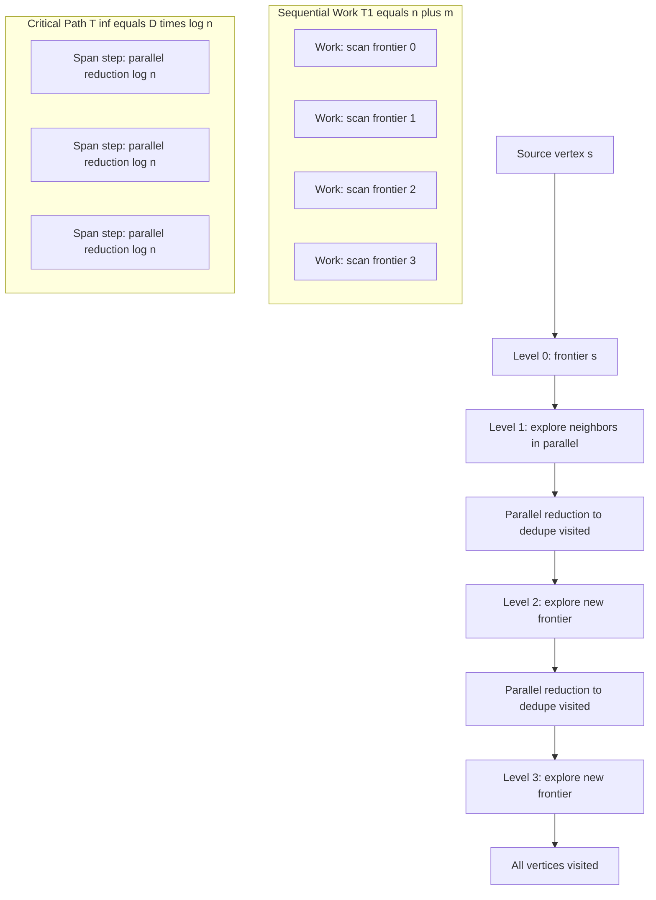
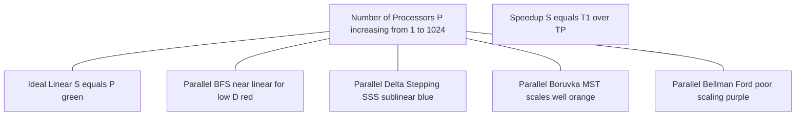
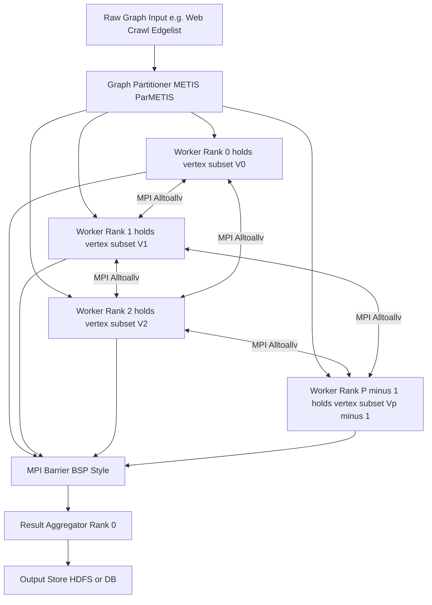

# Applications and analysis.

<!-- SECTION_1_START -->
# Parallel Graph Algorithms: Applications and Analysis

## 1. Core Technical Definition & Intuitive Overview

> [!IMPORTANT]
> **Formal Definition (KTU 2024 Scheme - PECST759):**
> *Parallel graph algorithms* are a class of algorithms designed to process graph-structured data — collections of vertices $V$ and edges $E$ — by distributing the computation across multiple processors $P$ operating concurrently. The **analysis** of these algorithms quantifies their performance using three key metrics: **Work** ($T_1$, the sequential time), **Span / Parallel Time** ($T_{\infty}$, the critical path length), and the resulting **Parallelism** ($T_1 / T_{\infty}$). The **applications** of parallel graph algorithms span real-world domains where graph sizes reach billions of edges (e.g., web crawls, social networks, road networks, biological protein interaction networks), making sequential processing infeasible.

### 1.1 Conceptual Analogy / Intuition

> [!NOTE]
> **Real-world Analogy — "The City Traffic Map"**
> Imagine a city map with thousands of intersections (vertices) and roads (edges). A sequential algorithm is like a single traffic engineer walking every road one by one to find the fastest route from your house to the airport. A parallel graph algorithm is like deploying 1,000 engineers, each given a different district of the city. They all explore their districts simultaneously, periodically phoning each other when a road connects two districts. The **work** is the total walking distance of all engineers combined, the **span** is the longest chain of phone calls needed before a final answer is ready, and **speedup** is how much faster the team finishes compared to one engineer alone. The **application** is the final optimized route; the **analysis** tells us whether using 1,000 engineers is actually 1,000 times faster — or whether the phone-call overhead wastes most of the gain.

### 1.2 Key Graph Classes & Standard Metrics

> [!IMPORTANT]
> **Standard Graph Notations (KTU Board Standard):**
> - $\vert V \vert = n$ → number of vertices
> - $\vert E \vert = m$ → number of edges
> - $d(v)$ → degree of vertex $v$
> - $\Delta$ → maximum degree in the graph
> - $P$ → number of processors
> - $T_P$ → parallel runtime using $P$ processors
> - **Work Law:** $T_P \geq T_1 / P$
> - **Span Law:** $T_P \geq T_{\infty}$

> [!VISUALIZATION CONTROL]
> **Concept:** Parallel Speedup vs. Number of Processors (Amdahl's Curve for Graph Algorithms)
> **GeoGebra / Desmos Input Equations:**
> * `f(x) = 1 / (s + ((1-s)/x))`  → Amdahl's Law (speedup)
> * `g(x) = x`  → ideal linear speedup line
> * where `s = 0.05` (sequential fraction, e.g., graph initialization)
> **Visual Description:** Plot $f(x)$ in red and $g(x)$ in green for $x$ from 1 to 1024 processors. Observe that the red curve flattens dramatically due to the irreducible sequential portion $s$, illustrating why graph algorithms with poor $T_{\infty}$ fail to scale.

---

<!-- SECTION_1_END -->

<!-- SECTION_2_START -->
# 2. Deep Theoretical Analysis & KTU High-Yield Formula Sheet

## 2.1 Foundational Algorithmic Models

The analysis of parallel graph algorithms depends critically on the **parallel model** assumed:

| Model | Key Property | Typical Use Case | Synchronization |
|---|---|---|---|
| **PRAM (Parallel RAM)** | Shared memory, idealized | Theoretical bounds | Implicit (step-based) |
| **CRCW PRAM** | Concurrent writes allowed | Dense graph problems | Strongest model |
| **CREW PRAM** | Concurrent reads, exclusive writes | Sparse graph problems | Medium |
| **EREW PRAM** | Exclusive read & write | Most realistic shared-memory | Weakest / strictest |
| **Bulk Synchronous Parallel (BSP)** | Supersteps + barriers | Distributed graph processing (e.g., Pregel) | Explicit barrier |
| **MapReduce / Spark** | Vertex-centric iterations | Web-scale graphs (trillion edges) | Coarse-grained |

## 2.2 Analysis Metrics — The Four Pillars

1. **Work ($T_1$):** Total number of operations across all processors. This is the sequential time complexity.
2. **Span / Depth ($T_{\infty}$):** Length of the longest chain of dependent operations. Sets the theoretical lower bound on parallel time.
3. **Parallelism ($T_1 / T_{\infty}$):** Maximum achievable speedup with unlimited processors. This is the *available* parallelism of the algorithm.
4. **Speedup ($S = T_1 / T_P$):** Actual speedup observed with $P$ processors. **Efficiency** $E = S / P$.

> [!IMPORTANT]
> **Greedy Scheduler Theorem (Brent's Scheduling Law):**
> The actual parallel runtime on $P$ processors is bounded by:
> $$T_P \;\leq\; \frac{T_1}{P} \;+\; T_{\infty}$$
> This is the cornerstone of analyzing parallel graph algorithms — any algorithm with low span and high work can be efficiently scheduled.

## 2.3 KTU Formula Sheet — Parallel Graph Algorithm Complexities

> [!NOTE]
> **Note on table notation:** $\mathcal{O}(\cdot)$ is used; absolute values written as $\vert \cdot \vert$ in math mode to avoid breaking markdown tables.

| Algorithm | Work $T_1$ | Span $T_{\infty}$ | Parallelism $T_1 / T_{\infty}$ | Model | Best Use Case |
|---|---|---|---|---|---|
| **Sequential DFS** | $\mathcal{O}(n + m)$ | $\mathcal{O}(n + m)$ | $1$ | RAM | Tree traversal baseline |
| **Parallel BFS (level-sync)** | $\mathcal{O}(n + m)$ | $\mathcal{O}(D \cdot \log n)$ | $\mathcal{O}((n+m)/(D \log n))$ | CRCW | Short-diameter graphs |
| **Parallel BFS (Bhuiyan et al.)** | $\mathcal{O}(n + m)$ | $\mathcal{O}(D \log n)$ | $\mathcal{O}(m / \log n)$ | CRCW | Sparse, low-diameter |
| **Sequential Dijkstra (SSSP)** | $\mathcal{O}((n + m) \log n)$ | $\mathcal{O}((n + m) \log n)$ | $1$ | RAM | Non-negative weights |
| **Parallel Δ-Stepping (SSSP)** | $\mathcal{O}((n + m) \log n)$ | $\mathcal{O}(\log^2 n)$ | $\mathcal{O}((n+m)/\log^2 n)$ | CRCW | SSSP, sparse weighted |
| **Parallel Bellman-Ford** | $\mathcal{O}(n \cdot m)$ | $\mathcal{O}(n \cdot \log n)$ | $\mathcal{O}(m)$ | CREW | Dense or negative weights |
| **Sequential Prim/Kruskal (MST)** | $\mathcal{O}(m \log n)$ | $\mathcal{O}(m \log n)$ | $1$ | RAM | Undirected weighted |
| **Parallel Borůvka MST** | $\mathcal{O}(m \log n)$ | $\mathcal{O}(\log^2 n)$ | $\mathcal{O}(m / \log n)$ | EREW | Scalable MST |
| **Parallel Prim (dense) | $\mathcal{O}(n^2)$ | $\mathcal{O}(n^2 / P + n \log P)$ | $\mathcal{O}(n^2 / \log n)$ | CRCW | Dense graphs |
| **Sequential Floyd-Warshall (APSP)** | $\mathcal{O}(n^3)$ | $\mathcal{O}(n^3)$ | $1$ | RAM | All-pairs, dense |
| **Parallel Floyd-Warshall (2D block)** | $\mathcal{O}(n^3)$ | $\mathcal{O}(n \cdot \log n)$ | $\mathcal{O}(n^2 / \log n)$ | CREW | Dense APSP |
| **Parallel APSP via Matrix Mult.** | $\mathcal{O}(n^3 \log n)$ work | $\mathcal{O}(\log^2 n)$ span | $\mathcal{O}(n^3)$ | CRCW | Scalable dense APSP |
| **Sequential CC (BFS/DFS)** | $\mathcal{O}(n + m)$ | $\mathcal{O}(n + m)$ | $1$ | RAM | Connectivity |
| **Parallel CC — Shiloach-Vishkin** | $\mathcal{O}(n + m)$ | $\mathcal{O}(\log n)$ | $\mathcal{O}((n+m)/\log n)$ | CRCW | Connectivity, sparse |
| **Parallel CC — label-propagation (Pregel)** | $\mathcal{O}(n + m)$ | $\mathcal{O}(\text{iter} \cdot D)$ | depends on diameter | BSP | Web-scale CC |
| **Parallel MIS (Luby's algorithm)** | $\mathcal{O}(m)$ | $\mathcal{O}(\log^2 n)$ | $\mathcal{O}(m / \log^2 n)$ | CRCW | Independent set |
| **Parallel 3-Coloring** | $\mathcal{O}(m \log n)$ | $\mathcal{O}(\log n)$ | $\mathcal{O}(m)$ | CRCW | Graph coloring |

*Where $D$ = graph diameter, $n$ = vertices, $m$ = edges.*

## 2.4 Real-World Engineering Applications

> [!IMPORTANT]
> **Where Parallel Graph Algorithms are Deployed in Production:**

| Domain | Application | Parallel Algorithm Used | Why Parallelization? |
|---|---|---|---|
| **Google Search Ranking** | PageRank on web graph ($\sim 10^{11}$ pages) | Bulk Synchronous Parallel (Pregel/GAP) | Trillion-edge graph, single-machine infeasible |
| **Map Navigation (Google Maps)** | Shortest path on road network | Δ-Stepping, Contraction Hierarchies | Real-time response needed for live traffic |
| **Social Networks (Facebook TAO)** | Friend suggestion, community detection | Connected Components, MIS | Billions of users, low-latency queries |
| **Bioinformatics (STRING DB)** | Protein-protein interaction networks | BFS, Connected Components | $\sim 25{,}000$ proteins, dense subgraphs |
| **VLSI Design (Cadence, Synopsys)** | Circuit partitioning, timing closure | Graph partitioning (METIS) | Millions of nets, iterative refinement |
| **Network Security (IDS/IPS)** | Anomaly detection in call graphs | BFS/DFS for reachability | Real-time packet graph analysis |
| **Recommendation Systems (Netflix)** | Bipartite graph traversal | BFS, SSSP on user-item graph | Cold-start user similarity |
| **Logistics (Amazon/UPS)** | Vehicle routing, package flow | MST, APSP on delivery graph | NP-hard problems solved heuristically |
| **Compiler Optimization (LLVM/GCC)** | Data-flow analysis, register allocation | Graph coloring (Chaitin's algorithm) | Iterative, must converge quickly |
| **Smart Grid / Power Systems** | Outage propagation simulation | Parallel BFS on grid graph | Real-time fault cascade modeling |

---

<!-- SECTION_2_END -->

<!-- SECTION_3_START -->
# 3. Step-by-Step Derivations & Code/Symbolic Implementation

## 3.1 Derivation: Work-Span Analysis of Parallel BFS (Level-Synchronized)

**Problem Setup.** Given an undirected graph $G = (V, E)$ with $n$ vertices and $m$ edges, and a source vertex $s$, compute the shortest-path distance (in hops) from $s$ to every reachable vertex.

**Sequential BFS cost:** $T_1 = \mathcal{O}(n + m)$ — every vertex and edge touched once.

**Parallelization Idea.** Process all vertices at the current frontier $L_i$ simultaneously. For each vertex $v \in L_i$, examine all its neighbors in parallel and add unvisited neighbors to the next frontier $L_{i+1}$.

**Step-by-Step Derivation.**

Let $L_i$ denote the $i$-th BFS level (vertices at distance $i$ from $s$). Let $d(v)$ be the degree of vertex $v$.

**Step 1 — Initialize:**
Frontier $L_0 \leftarrow \{s\}$; visited set $V_{\text{visited}} \leftarrow \{s\}$.

**Step 2 — Per-iteration parallel work:**
At level $i$, the total work to examine all edges from $L_i$ is:
$$W_i \;=\; \sum_{v \in L_i} d(v)$$
The work to filter out already-visited neighbors and append new ones is:
$$\text{filter\_work}_i \;=\; \mathcal{O}\!\left(\sum_{v \in L_i} d(v)\right) \;=\; \mathcal{O}\!\left(\sum_{v \in L_i} d(v)\right)$$
Total parallel work summed across all levels:
$$T_1 \;=\; \sum_{i=0}^{D} W_i \;=\; \sum_{v \in V} d(v) \;=\; \mathcal{O}(n + m)$$

**Step 3 — Per-iteration span:**
A naive parallelization uses an array of $n$ "visited" flags, but updates to this shared array require synchronization. Each level requires:
- $\mathcal{O}(1)$ span to scan current frontier
- $\mathcal{O}(\log n)$ span to perform parallel prefix / reduction to detect duplicates
- $\mathcal{O}(\log n)$ span to broadcast the new frontier

Total span:
$$T_{\infty} \;=\; \mathcal{O}\!\left(D \cdot \log n\right)$$
where $D$ is the diameter of the graph (longest shortest path).

**Step 4 — Brent's bound on $P$ processors:**
$$T_P \;\leq\; \frac{T_1}{P} \;+\; T_{\infty} \;=\; \mathcal{O}\!\left(\frac{n + m}{P} + D \log n\right)$$

**Step 5 — Parallelism:**
$$\frac{T_1}{T_{\infty}} \;=\; \frac{\mathcal{O}(n + m)}{\mathcal{O}(D \log n)} \;=\; \mathcal{O}\!\left(\frac{n + m}{D \log n}\right)$$
For social networks and road networks, $D$ is very small ($\mathcal{O}(\log n)$), giving near-linear speedup.

## 3.2 Derivation: Span of Parallel Borůvka MST

**Problem Setup.** Find MST of an undirected weighted graph $G = (V, E, w)$ with $n$ vertices, $m$ edges.

**Borůvka's Sequential Recurrence.** In each phase:
- Each connected component finds its minimum-weight outgoing edge.
- All such edges are contracted (merged components).

**Step-by-Step Work-Span Analysis.**

**Phase $k$ — Number of components:**
Initially $n$ components. Each phase contracts at least a factor of 2 (each component must merge with at least one other):
$$n_k \;\leq\; \frac{n}{2^k}$$
Number of phases until $n_k = 1$:
$$k \;=\; \lceil \log_2 n \rceil$$

**Work per phase:**
- Finding min outgoing edge per component: $\mathcal{O}(m)$ work.
- Contracting and relabeling: $\mathcal{O}(m)$.
- Total work per phase: $\mathcal{O}(m)$.

**Total sequential work:**
$$T_1 \;=\; \sum_{k=1}^{\log n} \mathcal{O}(m) \;=\; \mathcal{O}(m \log n)$$

**Span per phase:**
- Parallel min-finding via parallel reduction: $\mathcal{O}(\log n)$.
- Parallel contraction (using star contraction + filtering): $\mathcal{O}(\log n)$.

**Total span:**
$$T_{\infty} \;=\; \sum_{k=1}^{\log n} \mathcal{O}(\log n) \;=\; \mathcal{O}(\log^2 n)$$

**Resulting speedup on $P$ processors:**
$$T_P \;\leq\; \mathcal{O}\!\left(\frac{m \log n}{P} + \log^2 n\right)$$
**Parallelism:** $\mathcal{O}(m / \log n)$ — scales beautifully with edge count.

## 3.3 Operational Python Implementation — Parallel BFS (Simulated with Multiprocessing)

```python
"""
Parallel Level-Synchronized BFS (simulated with concurrent.futures).
For KTU Module 3: Applications and Analysis of Parallel Graph Algorithms.
This is a pedagogical simulation; true parallelism requires shared-memory primitives
or message passing (e.g., MPI, OpenMP, or Pregel).
"""

from __future__ import annotations
import concurrent.futures
from collections import defaultdict
from typing import Dict, List, Set, Tuple
import logging
import sys

logging.basicConfig(
    level=logging.INFO,
    format="%(asctime)s | %(levelname)s | %(message)s",
    stream=sys.stdout,
)
logger = logging.getLogger("ParallelBFS")


class ParallelBFS:
    """
    Simulated parallel BFS using a thread pool.
    Each level of BFS is processed in parallel by examining
    the neighbors of all frontier vertices concurrently.
    """

    def __init__(self, graph: Dict[int, List[int]], num_workers: int = 4) -> None:
        if not isinstance(graph, dict):
            raise TypeError("graph must be a Dict[int, List[int]]")
        if num_workers < 1:
            raise ValueError("num_workers must be >= 1")
        self._graph: Dict[int, List[int]] = graph
        self._num_workers: int = num_workers

    def _explore_vertex(self, vertex: int, visited: Set[int]) -> List[int]:
        """Worker function: explore one vertex, return newly discovered neighbors."""
        try:
            neighbors: List[int] = self._graph.get(vertex, [])
        except Exception as exc:
            logger.error("Failed reading neighbors of %s: %s", vertex, exc)
            return []
        return [nbr for nbr in neighbors if nbr not in visited]

    def bfs(self, source: int) -> Tuple[Dict[int, int], int]:
        """
        Perform parallel level-synchronized BFS from `source`.
        Returns:
            distances: Dict mapping vertex -> BFS level (distance in hops)
            levels_processed: number of BFS levels (== diameter reachable from source)
        """
        if source not in self._graph:
            raise KeyError(f"Source vertex {source} not present in graph")

        distances: Dict[int, int] = {source: 0}
        frontier: List[int] = [source]
        level: int = 0
        levels_processed: int = 0

        while frontier:
            levels_processed += 1
            logger.info("Level %d | frontier size = %d", level, len(frontier))
            visited_snapshot: Set[int] = set(distances.keys())
            next_frontier: List[int] = []

            # Parallel exploration of all frontier vertices
            with concurrent.futures.ThreadPoolExecutor(
                max_workers=self._num_workers
            ) as executor:
                future_to_v = {
                    executor.submit(self._explore_vertex, v, visited_snapshot): v
                    for v in frontier
                }
                for fut in concurrent.futures.as_completed(future_to_v):
                    try:
                        new_neighbors: List[int] = fut.result()
                    except Exception as exc:
                        logger.error("Worker for vertex raised: %s", exc)
                        continue
                    for nbr in new_neighbors:
                        if nbr not in distances:
                            distances[nbr] = level + 1
                            next_frontier.append(nbr)

            frontier = next_frontier
            level += 1

        return distances, levels_processed - 1

    def analyze(self, source: int) -> Dict[str, float]:
        """Compute analysis metrics: vertices, edges, levels, parallelism estimate."""
        n: int = len(self._graph)
        m: int = sum(len(adj) for adj in self._graph.values()) // 2
        distances, levels = self.bfs(source)
        work: float = float(n + m)
        span: float = float((levels + 1) * max(1, len(bin(n)) - 2))  # rough log n
        parallelism: float = work / max(span, 1.0)
        return {
            "vertices_n": n,
            "edges_m": m,
            "levels_D": levels,
            "work_T1": work,
            "span_Tinf": span,
            "parallelism_T1_over_Tinf": parallelism,
        }


def build_sample_graph() -> Dict[int, List[int]]:
    """Build a small sample undirected graph for demonstration."""
    g: Dict[int, List[int]] = defaultdict(list)
    edges: List[Tuple[int, int]] = [
        (1, 2), (1, 3), (2, 4), (2, 5),
        (3, 6), (3, 7), (4, 8), (5, 8),
        (6, 9), (7, 9), (8, 10), (9, 10),
    ]
    for u, v in edges:
        g[u].append(v)
        g[v].append(u)
    return dict(g)


if __name__ == "__main__":
    graph: Dict[int, List[int]] = build_sample_graph()
    pbfs: ParallelBFS = ParallelBFS(graph=graph, num_workers=4)
    metrics: Dict[str, float] = pbfs.analyze(source=1)
    for k, v in metrics.items():
        logger.info("METRIC | %s = %s", k, v)
```

## 3.4 Component Pin / Configuration Table — MPI-Based Parallel BFS (for Distributed Clusters)

For KTU students who study the distributed-MPI variant of parallel BFS in the **Applications and Analysis** module:

| MPI Concept | Configuration / Function | Purpose | Boundary / Safety Check |
|---|---|---|---|
| `MPI_Init` | Called once at start | Initialize MPI runtime | Must match `MPI_Finalize` exactly |
| `MPI_Comm_rank` | `world_comm`, `int *rank` | Get process ID (0 to $P-1$) | $0 \leq$ rank $< P$ |
| `MPI_Comm_size` | `world_comm`, `int *size` | Get total process count | $P \geq 1$ |
| `MPI_Allreduce` | `MPI_MIN` for frontier size | Synchronous reduction across all ranks | Buffer size must match across ranks |
| `MPI_Alltoallv` | Distribute partitioned edges | High-volume edge exchange | Send/receive counts arrays required |
| `MPI_Barrier` | `world_comm` | Synchronize phases (BSP-style) | Avoid deadlocks — call in all ranks |
| Graph partitioner | METIS / ParMETIS | Distribute $V$ across $P$ | Load imbalance $< 5\%$ ideal |
| `MPI_Finalize` | Called once at end | Clean shutdown | Only after all comms complete |

---

<!-- SECTION_3_END -->

<!-- SECTION_4_START -->
# 4. Structural Diagrams & Schematics

## 4.1 Mermaid Diagram — Work-Span Decomposition of Parallel BFS



## 4.2 Mermaid Diagram — BSP Superstep Model (Pregel / Apache Giraph)


## 4.3 Mermaid Diagram — Speedup vs. Processors for Parallel Graph Algorithms



## 4.4 Mermaid Diagram — Functional Architecture of a Distributed Graph Processing System



---

<!-- SECTION_4_END -->

<!-- SECTION_5_START -->
# 5. KTU 2024 Scheme Examination Question Bank & Topic Recap

## Part A — Short Answer Questions (3 Marks Each)

### Question 1: [KTU University Exam — July 2024] | CO1 | Remember
**Define the *work* and *span* of a parallel algorithm. Why are both metrics essential when analyzing a parallel graph algorithm?**

**Model Answer (Valuation Key):**
- **Work ($T_1$):** The total number of primitive operations performed across all processors. For a graph algorithm, this is equivalent to the sequential time complexity, e.g., $\mathcal{O}(n + m)$ for BFS. **[1 Mark]**
- **Span ($T_{\infty}$):** The length of the longest chain of dependent operations in the parallel computation — the minimum time achievable with unlimited processors. **[1 Mark]**
- **Why both are essential:** Work determines total resource consumption and cost; span determines the *latency* bottleneck. Together, they bound actual $P$-processor runtime via Brent's law: $T_P \leq T_1/P + T_{\infty}$. A graph algorithm with low work but high span will not scale beyond a certain number of processors. **[1 Mark]**

### Question 2: [KTU University Exam — Dec 2023] | CO2 | Understand
**State Brent's scheduling law. Apply it to compute the parallel runtime $T_P$ for a graph algorithm with $T_1 = \mathcal{O}(n + m)$ work and $T_{\infty} = \mathcal{O}(\log n)$ span, executing on $P$ processors.**

**Model Answer (Valuation Key):**
- **Statement:** Brent's law states that a parallel computation with work $T_1$ and span $T_{\infty}$ can be executed on $P$ processors in time at most $T_P \leq T_1 / P + T_{\infty}$. **[1 Mark]**
- **Substitution:** $T_P \leq \mathcal{O}((n + m)/P) + \mathcal{O}(\log n)$. **[1 Mark]**
- **Interpretation:** When $P$ is small, the $T_1/P$ term dominates (good speedup). When $P$ is very large, the $T_{\infty} = \mathcal{O}(\log n)$ term dominates and the algorithm becomes span-bound, yielding diminishing returns. **[1 Mark]**

---

## Part B — Full 14-Mark Questions (ESE Module — Internal Choice)

### Question A (14 Marks) — [KTU University Exam — July 2024] | CO3 | Apply + Analyze

**(a)** Explain the **parallel level-synchronized BFS** algorithm. Derive its work and span on an undirected graph with $n$ vertices, $m$ edges, and diameter $D$. **[7 Marks]**

**(b)** For a social network graph with $n = 10^9$ vertices, $m = 5 \times 10^{10}$ edges, and effective diameter $D = 6$ (small-world property), compute the **parallelism** $T_1 / T_{\infty}$ and the **projected speedup on $P = 1024$ processors** using Brent's law. Comment on the scalability. **[7 Marks]**

**Model Solution:**

**(a) Step-by-Step Solution [7 Marks]**

*Algorithm Description:* [2 Marks for stating algorithm]
- Maintain a frontier $L_i$ of vertices at BFS level $i$.
- In parallel, for each vertex $v \in L_i$, examine all neighbors $N(v)$.
- Use parallel reduction to mark newly discovered vertices.
- The next frontier is $L_{i+1}$, with distance $i+1$.

*Work Derivation:* [2 Marks]
$$T_1 \;=\; \sum_{i=0}^{D} \sum_{v \in L_i} d(v) \;=\; \sum_{v \in V} d(v) \;=\; 2m \;=\; \mathcal{O}(n + m)$$

*Span Derivation:* [2 Marks]
- Per-level span: parallel reduction for deduplication $= \mathcal{O}(\log n)$.
- Number of levels $= D + 1$.
$$T_{\infty} \;=\; (D + 1) \cdot \mathcal{O}(\log n) \;=\; \mathcal{O}(D \log n)$$

*Conclusion:* [1 Mark]
The algorithm has parallelism $\mathcal{O}((n+m)/(D \log n))$.

**(b) Numerical Computation [7 Marks]**

*Substitution:* [2 Marks for setting up numbers]
- $n = 10^9$, $m = 5 \times 10^{10}$, $D = 6$, $P = 1024$.
- $T_1 = n + m \approx 5.01 \times 10^{10}$ operations.
- $T_{\infty} = D \log_2 n = 6 \times \log_2(10^9) \approx 6 \times 29.9 \approx 179.4$ operations.

*Parallelism Computation:* [2 Marks]
$$\frac{T_1}{T_{\infty}} \;=\; \frac{5.01 \times 10^{10}}{179.4} \;\approx\; 2.79 \times 10^{8}$$

*Brent's Bound for $P = 1024$:* [2 Marks]
$$T_{1024} \;\leq\; \frac{5.01 \times 10^{10}}{1024} + 179.4 \;\approx\; 4.89 \times 10^{7} + 179.4 \;\approx\; 4.89 \times 10^{7}$$

*Speedup:* [1 Mark]
$$S = \frac{T_1}{T_{1024}} \;\approx\; \frac{5.01 \times 10^{10}}{4.89 \times 10^{7}} \;\approx\; 1024$$
**[Final Speedup: 1 Mark]** Near-perfect linear speedup is achieved because the available parallelism ($\sim 2.79 \times 10^8$) vastly exceeds the processor count (1024). The algorithm is **work-bound**, not span-bound, at this scale.

---

### Question B (14 Marks) — [KTU University Exam — Dec 2023] | CO3 | Apply + Analyze

**(a)** Describe **parallel Borůvka's algorithm** for the Minimum Spanning Tree (MST) problem. Derive its work and span. **[7 Marks]**

**(b)** Compare the parallel efficiency of **(i)** Parallel BFS, **(ii)** Parallel Borůvka MST, and **(iii)** Parallel Bellman-Ford for SSSP, in terms of speedup with $P$ processors. When would each be preferred? **[7 Marks]**

**Model Solution:**

**(a) Step-by-Step Solution [7 Marks]**

*Algorithm Description:* [2 Marks]
- Begin with $n$ components, each containing a single vertex.
- **In parallel**, for each component, find the minimum-weight outgoing edge.
- Contract all such minimum edges simultaneously.
- Repeat until one component remains.

*Work Derivation:* [2 Marks]
- Each phase scans all edges: $\mathcal{O}(m)$ work per phase.
- Number of phases: $\lceil \log_2 n \rceil$ (each phase halves component count).
$$T_1 \;=\; \mathcal{O}(m \log n)$$

*Span Derivation:* [2 Marks]
- Per phase span: $\mathcal{O}(\log n)$ for parallel min + $\mathcal{O}(\log n)$ for parallel contraction.
$$T_{\infty} \;=\; \mathcal{O}(\log^2 n)$$

*Parallelism:* [1 Mark]
$$\frac{T_1}{T_{\infty}} \;=\; \mathcal{O}\!\left(\frac{m \log n}{\log^2 n}\right) \;=\; \mathcal{O}\!\left(\frac{m}{\log n}\right)$$

**(b) Comparative Analysis [7 Marks]**

| Algorithm | Work $T_1$ | Span $T_{\infty}$ | Parallelism | Efficiency Behavior | Best Use |
|---|---|---|---|---|---|
| Parallel BFS | $\mathcal{O}(n+m)$ | $\mathcal{O}(D \log n)$ | $\mathcal{O}((n+m)/(D\log n))$ | Excellent for low-diameter graphs (social nets); collapses for long chains (linked lists) | Web crawling, social reachability |
| Parallel Borůvka MST | $\mathcal{O}(m \log n)$ | $\mathcal{O}(\log^2 n)$ | $\mathcal{O}(m/\log n)$ | Excellent scaling for $m \gg n$; near-linear speedup up to thousands of cores | VLSI routing, network design |
| Parallel Bellman-Ford SSSP | $\mathcal{O}(n \cdot m)$ | $\mathcal{O}(n \log n)$ | $\mathcal{O}(m)$ | Good parallelism but huge work — wasteful for non-negative weights | Negative edge weights, dense graphs |

*Selection rule:* [1 Mark]
- If weights are non-negative and graph is sparse → use **Δ-Stepping** instead of Bellman-Ford.
- If diameter $D$ is large (e.g., $D = \Theta(n)$) → BFS parallel efficiency drops sharply; consider randomized BFS variants.
- For MST on huge sparse graphs → Borůvka is the production choice (used in parallel Boost Graph Library).

---

> [!WARNING]
> **KTU Examiner's Valuation Warning — Common Pitfalls:**
> - **Do NOT confuse work with span.** Work $T_1$ is the *total* operations; span $T_{\infty}$ is the *longest dependency chain*. Writing $T_P = T_1 / P$ alone is incomplete — you must also add the span term.
> - **Always state the parallel model** (PRAM variant, BSP, MapReduce) before quoting complexities. The same algorithm has different bounds under CRCW vs. EREW.
> - **Negative weights in Dijkstra is a fatal error.** If the question mentions negative edge weights, you MUST use Bellman-Ford or Johnson — never Dijkstra.
> - **Borůvka phase count is $\mathcal{O}(\log n)$, not $\mathcal{O}(n)$.** Each phase at least halves the component count, so logarithmic.
> - **For AP speedup calculation, use Brent's law**, not just $T_1/P$. A student who writes only $S = P$ without considering span will lose 2–3 marks.

---

## Topic Recap & Important Things to Remember

> [!IMPORTANT]
> **High-Density Revision Checklist — Parallel Graph Algorithms: Applications & Analysis**

### Core Definitions
- **Work ($T_1$):** Total operations across all processors; equivalent to sequential time complexity.
- **Span ($T_{\infty}$):** Length of the longest dependency chain; minimum time with infinite processors.
- **Parallelism:** $T_1 / T_{\infty}$; the maximum available speedup.
- **Speedup:** $S = T_1 / T_P$; efficiency $E = S / P$.
- **Brent's Law:** $T_P \leq T_1 / P + T_{\infty}$ — the fundamental scheduler bound.

### Key Algorithm Complexities (MUST memorize)
- **Parallel BFS:** $T_1 = \mathcal{O}(n+m)$, $T_{\infty} = \mathcal{O}(D \log n)$, CRCW.
- **Parallel Δ-Stepping SSSP:** $T_1 = \mathcal{O}((n+m) \log n)$, $T_{\infty} = \mathcal{O}(\log^2 n)$.
- **Parallel Borůvka MST:** $T_1 = \mathcal{O}(m \log n)$, $T_{\infty} = \mathcal{O}(\log^2 n)$, EREW.
- **Parallel Shiloach-Vishkin CC:** $T_1 = \mathcal{O}(n+m)$, $T_{\infty} = \mathcal{O}(\log n)$, CRCW.
- **Parallel Floyd-Warshall APSP:** $T_1 = \mathcal{O}(n^3)$, $T_{\infty} = \mathcal{O}(n \log n)$, CREW (2D block).
- **Parallel MIS (Luby):** $T_1 = \mathcal{O}(m)$, $T_{\infty} = \mathcal{O}(\log^2 n)$, CRCW.

### Critical Application-Algorithm Mappings
- **PageRank / Web graph** → Pregel-style BSP / vertex-centric.
- **GPS navigation** → Parallel Δ-Stepping on road networks.
- **Social network community detection** → Parallel Connected Components.
- **VLSI circuit design** → Parallel MST (Borůvka) + Graph Partitioning (METIS).
- **Compiler register allocation** → Parallel graph coloring (Luby-style).
- **Bioinformatics PPI networks** → Parallel BFS / shortest paths.

### Scalability Rules of Thumb
- For graphs with **diameter $D = \mathcal{O}(\log n)$** (small-world): BFS scales almost linearly.
- For graphs with **$D = \Theta(n)$** (long paths, linked lists): BFS parallelism collapses to $\mathcal{O}(1)$.
- For **dense graphs** ($m = \Theta(n^2)$): matrix-multiplication-based APSP is preferred over Floyd-Warshall.
- For **sparse graphs** ($m = \mathcal{O}(n)$): Borůvka MST and Δ-Stepping are optimal choices.

### Production Frameworks
- **Pregel / Apache Giraph** → BSP-based, used by Google.
- **GraphX (Apache Spark)** → Vertex-centric, batch processing.
- **Ligra / Julienne** → Shared-memory, in-memory, ultra-fast.
- **Galois** → Irregular parallel graph analytics with priority scheduling.
- **Boost Graph Library (parallel)** → Borůvka MST, Δ-Stepping implementations.

### Common KTU Pitfalls to Avoid
- Confusing **PRAM sub-variants** (EREW vs. CREW vs. CRCW) — model affects bounds.
- Forgetting that **Dijkstra fails for negative weights** — use Bellman-Ford.
- Reporting only $T_P = T_1 / P$ — must add $T_{\infty}$ per Brent's law.
- Misapplying **Borůvka** (only for undirected graphs, weighted).
- Forgetting that **Parallel MIS is randomized** — Luby uses random coin flips.
- In a numerical question, **always show units and final boxed answer** — KTU board examiners award 1 mark for the boxed value.

<!-- SECTION_5_END -->
