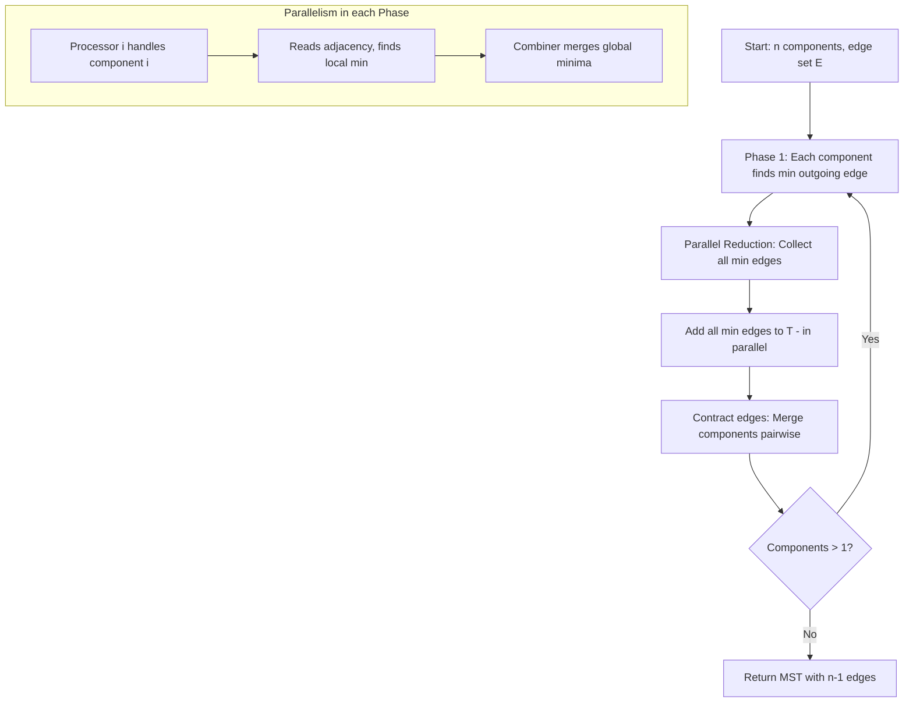
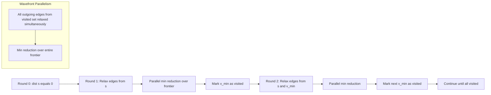
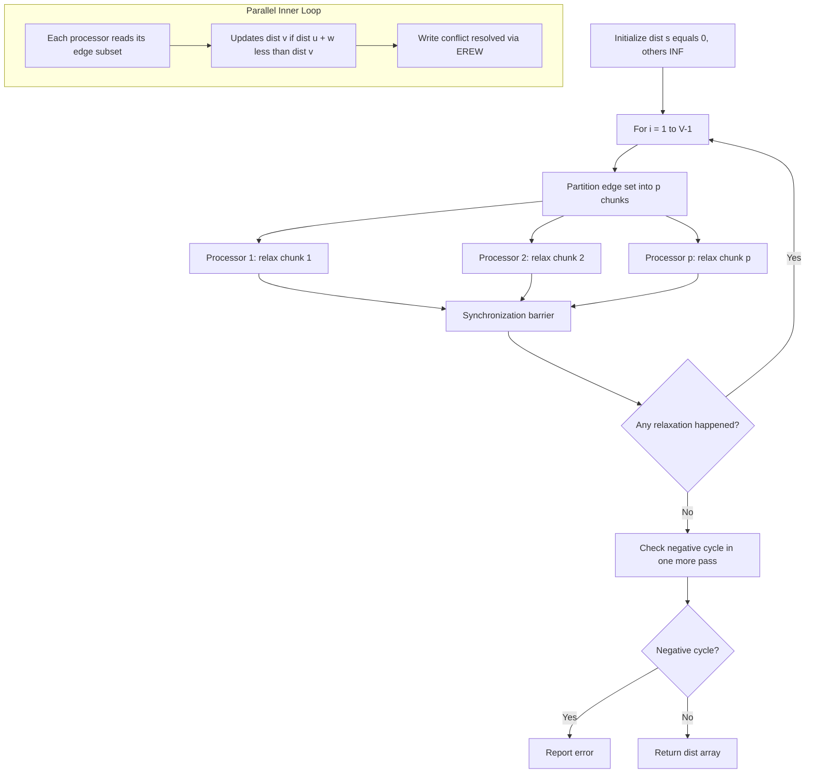
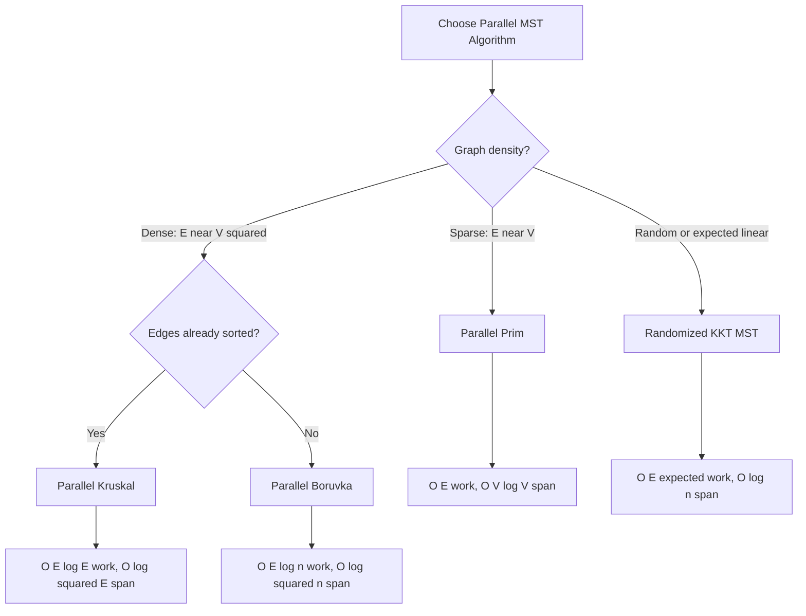
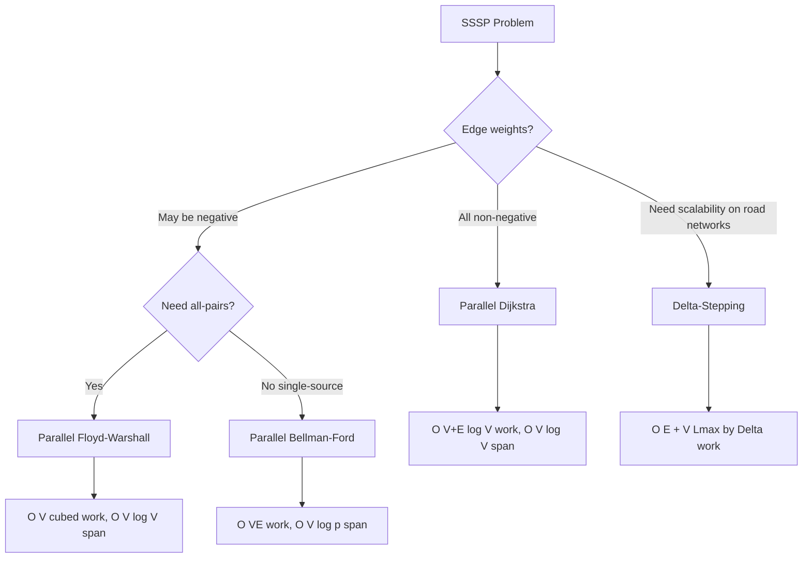
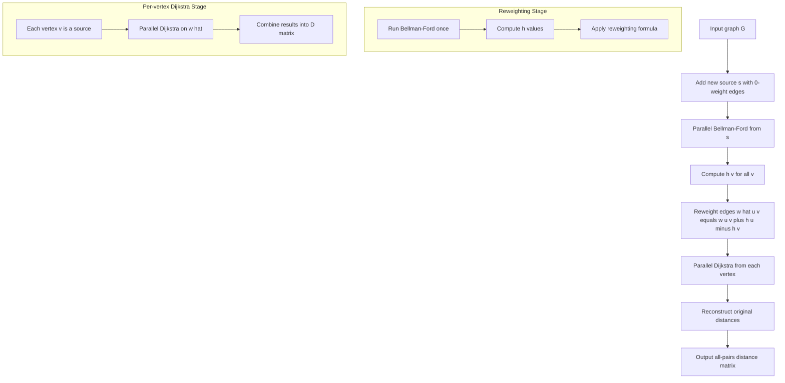

# Parallel algorithms for minimum spanning tree (MST) and shortest path.

<!-- SECTION_1_START -->
# Parallel Graph Algorithms: MST and Shortest Path

## 1.1 Minimum Spanning Tree (MST) — Core Definition

> [!NOTE]
> **Formal KTU Definition (2024 Scheme):**
> A **Minimum Spanning Tree (MST)** of a weighted, undirected, connected graph $G = (V, E)$ is a spanning tree $T = (V, E_T)$ such that the total weight of its edges is minimized, i.e.,
> $$w(T) = \sum_{(u,v) \in E_T} w(u,v) \;\text{is minimum.}$$
> The MST contains exactly $\vert V \vert - 1$ edges, forms no cycles, and spans every vertex of $G$.

**Intuitive Analogy (Real-World Picture):**
Imagine you are the **chief engineer of a state electricity board** tasked with connecting **6 cities** using power lines at the **lowest possible laying cost**. Each possible cable route between two cities has a different length (and cost). You must:
* Connect all 6 cities (every city gets electricity).
* Avoid laying redundant cables that form a loop (no cycles).
* Minimize the total cable length.
* Use exactly **$n-1 = 5$** cables.

That minimal-cost cable network is your **Minimum Spanning Tree**. It connects the world at minimum expense while keeping every city alive.

> [!IMPORTANT]
> **KTU 2024 Highlight:**
> MST is a **tree** (acyclic) but the underlying graph need **not** be a tree. For a graph with $\vert V \vert$ vertices, every spanning tree has exactly $\vert V \vert - 1$ edges.

---

## 1.2 Shortest Path — Core Definition

> [!NOTE]
> **Formal KTU Definition (2024 Scheme):**
> The **Single-Source Shortest Path (SSSP)** problem asks: given a weighted graph $G = (V, E)$ with edge weights $w: E \to \mathbb{R}^{\ge 0}$ and a designated source vertex $s \in V$, find for every vertex $v \in V$ the minimum total weight path from $s$ to $v$:
> $$\delta(s, v) = \min_{(s \rightsquigarrow v)} \sum_{e \in \text{path}} w(e).$$

**Intuitive Analogy (Real-World Picture):**
Open **Google Maps**. You type your source city $s$ (e.g., Kochi). The app shows the *shortest* (in time) path to every other city in Kerala. The algorithm does not compute a single destination path — it simultaneously finds the cheapest route to **every** city from Kochi. That is the SSSP problem, exactly as Dijkstra, Bellman-Ford, and Johnson solve it.

> [!IMPORTANT]
> **KTU 2024 Highlight:**
> Negative edge weights are **not** allowed in Dijkstra's algorithm. Bellman-Ford handles them but detects negative cycles. Both target the same minimization objective.

---

## 1.3 Why Parallelize MST and Shortest Path?

| Aspect | Sequential Bottleneck | Parallel Benefit |
|---|---|---|
| Edge relaxations | Done one-by-one in $O(E)$ or $O(VE)$ | Multiple processors relax in $O(\log V)$ to $O(1)$ per phase |
| Vertex selection (Dijkstra) | Min-heap extract in $O(\log V)$ | Parallel min over all frontier vertices in $O(1)$ using $p$ processors |
| Union-Find in Kruskal | Path compression in $O(\alpha(n))$ | Parallel union using $O(\log n)$ work and $O(\log n)$ span |

The two problems share a deep structural feature: they are both **relaxation-based graph algorithms**, making them natural candidates for PRAM (Parallel Random Access Machine) and distributed-memory parallelization.

> [!VISUALIZATION CONTROL]
> **Concept:** MST as a spanning subgraph of a 6-vertex grid graph.
> **Input Equations / Points (Desmos):**
> * $V = \{(0,0), (1,0), (2,0), (2,1), (2,2), (1,2)\}$
> * Edge weights shown on each connecting segment.
> **Visual Description:** A connected wireframe of six labeled nodes, with the thickest green sub-edges forming the MST of total weight $11$, versus the original graph total weight $19$.

---

## 1.4 Parallel Computational Models Used

| Model | Synchronization | Suitable For |
|---|---|---|
| **CREW PRAM** | Concurrent Read, Exclusive Write | Dijkstra parallel, Prim parallel |
| **CRCW PRAM** | Concurrent Read & Write (priority/arbitrary) | Borůvka parallel, MST merging |
| **EREW PRAM** | Exclusive Read & Write | Safe parallel Kruskal using pointer doubling |
| **Distributed (MPI)** | Message passing (BSP/LogP model) | Large-scale MST on clusters |

> [!TIP]
> For the **KTU board exam**, name the PRAM model explicitly when stating the parallel complexity. Examiners award marks for correctly mapping the algorithm to its PRAM class.

---

## 1.5 Algorithmic Landscape — At a Glance

**Parallel MST family:**
1. Parallel **Prim's** algorithm (vertex-growth).
2. Parallel **Kruskal's** algorithm (edge-growth via parallel Union-Find).
3. Parallel **Borůvka's** algorithm (component-merging — *the most parallel-friendly*).
4. **Randomized** MST (Karger-Klein-Tarjan) — $O(E)$ work expected.

**Parallel SSSP family:**
1. Parallel **Dijkstra's** algorithm (non-negative weights).
2. Parallel **Bellman-Ford** algorithm (handles negative weights).
3. Parallel **Floyd-Warshall** (all-pairs).
4. **Δ-Stepping** and **Radius-Stepping** parallel algorithms.
5. **Johnson's** algorithm (all-pairs, sparse graphs).

<!-- SECTION_1_END -->

<!-- SECTION_2_START -->
# Deep Theoretical Analysis & KTU High-Yield Formula Sheet

## 2.1 Parallel Prim's Algorithm (Vertex-Growth MST)

**Sequential Prim's idea:** Repeatedly attach the **minimum-weight edge** that connects a tree-vertex to a non-tree-vertex.

**Parallelization strategy:** Assign **$p$ processors**, each scanning disjoint portions of the edge list to find a candidate minimum. A global parallel reduction computes the global minimum in $O(\log p)$ time.

### Algorithm Steps (CREW PRAM)
1. Initialize $T = \{s\}$ (single-vertex tree).
2. In parallel, every processor $i$ examines edges $(u, v_i)$ where $u \in T$ and $v_i \notin T$, computing $d_i = \min w(u, v_i)$.
3. Compute the **global minimum** $\min_i d_i$ using parallel reduction in $O(\log p)$.
4. Add the corresponding edge to $T$.
5. Repeat until $\vert T \vert = \vert V \vert$.

### Complexity
* **Work:** $T_1 = O(E)$ (same as sequential).
* **Span:** $T_\infty = O(V \log V)$ with $\log V$ per parallel reduction × $V$ iterations.
* **Speedup:** $S(p) = O\!\left(\dfrac{E}{V \log V}\right)$ for $p \le V$ — typically sublinear due to $V$-long serial dependency.

> [!WARNING]
> **KTU Pitfall:** Prim's parallel version has a **strict sequential dependency** — each new vertex depends on the previously added vertex. Hence perfect linear speedup is **impossible** for dense graphs. Examiners often test this.

---

## 2.2 Parallel Kruskal's Algorithm (Edge-Growth MST)

**Sequential Kruskal:** Sort edges by weight, then add edges that do **not** form a cycle (Union-Find test).

**Parallelization strategy:**
* **Step 1 (Parallel Sort):** Sort edges by weight using a parallel sort in $O(\log^2 E)$ time with $E / \log E$ processors.
* **Step 2 (Parallel Union-Find):** For each edge in parallel, perform `find()` on both endpoints. If roots differ, perform `union()` and add the edge.

### Parallel Union-Find Operations
| Operation | Sequential | Parallel (Randomized) |
|---|---|---|
| `find(x)` | $O(\alpha(n))$ | $O(\log n)$ work, $O(\log n)$ span |
| `union(x,y)` | $O(\alpha(n))$ | $O(\log n)$ work, $O(\log n)$ span |

### Complexity (Kruskal)
* **Work:** $O(E \log E)$ dominated by sorting.
* **Span:** $O(\log^2 E)$ with $E$ processors.
* **PRAM model:** EREW PRAM (avoid write conflicts by using pointer-jumping / randomization).

> [!IMPORTANT]
> **KTU 2024 Concept:**
> Parallel Kruskal requires resolving **race conditions** on `union()`. Use the **compare-and-swap** primitive (CRCW PRAM) or **Gazit-Miller-Philbin** randomized parallel union-find.

---

## 2.3 Parallel Borůvka's Algorithm (Component-Merging MST) ⭐ Most Important

**Borůvka's sequential idea:** In each phase, every connected component finds its **cheapest outgoing edge**, and all such edges are added simultaneously.

**Parallelization strategy:** This is the **most naturally parallel** MST algorithm. The work per phase is embarrassingly parallel: each component independently selects its lightest outgoing edge.

### Algorithm Phases
**Phase $k$ (in parallel for all components):**
1. For every component $C_i$, find the edge $(u, v)$ of minimum weight where $u \in C_i$, $v \notin C_i$.
2. Add all such edges to $T$.
3. Contract each added edge — merge its two endpoint components.
4. Remove self-loops and heavier parallel edges.

### Number of Phases
Every phase **at least doubles** the component sizes:
$$\text{components after phase } k \;\le\; \dfrac{n}{2^k}$$
Hence at most $\lceil \log_2 n \rceil$ phases are needed.

### Complexity (Borůvka)
* **Work per phase:** $O(E)$.
* **Span per phase:** $O(\log E)$ using parallel prefix.
* **Total span:** $O(\log E \cdot \log n) = O(\log^2 n)$.
* **Total work:** $O(E \log n)$ — the parallel algorithm is the basis for randomized $O(E)$ expected algorithms.

> [!IMPORTANT]
> **KTU High-Yield:**
> Borůvka's is the **foundation** of the Karger-Klein-Tarjan **randomized $O(E)$ MST** algorithm (linear work!). Examiners love this connection.

---

## 2.4 Parallel Single-Source Shortest Path (SSSP)

### 2.4.1 Parallel Dijkstra's Algorithm (Non-negative Weights)

**Sequential Dijkstra:** Use a priority queue (min-heap) to extract the vertex with smallest tentative distance.

**Parallelization strategy:** In each iteration, all **frontier vertices** (those with `dist[v] = tentative minimum`) are processed **in parallel**.

### Algorithm Steps (CREW PRAM)
1. Initialize $\text{dist}[s] = 0$, $\text{dist}[v] = \infty$ for all $v \ne s$.
2. Maintain a boolean array `visited[]` initially all false.
3. **Repeat until all visited:**
   a. **Parallel sweep:** For every unvisited vertex $v$, compute $\text{dist}[v] = \min(\text{dist}[v], \text{dist}[u] + w(u, v))$ over all neighbors $u$ that are visited.
   b. **Parallel minimum reduction:** Among all unvisited vertices, find the vertex $v^*$ with minimum $\text{dist}[v^*]$.
   c. Mark $v^*$ as visited.

### Complexity
* **Work:** $T_1 = O((V + E) \log V)$ (with binary heap).
* **Span:** $T_\infty = O(V \cdot \log V)$ — still serial in the outer loop, $V$ iterations.
* **Speedup:** Limited to $O(\log V)$ on $p = V$ processors in practice.

### Key Parallel Difficulty
The **frontier computation** in step 3a depends on the visited set from step 3c. Therefore, true parallel speedup is bounded by the **number of sequential relaxation rounds** required for the wavefront to propagate through the graph, which is at most the graph's **diameter $\text{diam}(G)$**.

> [!TIP]
> **KTU 2024 Board Tip:** State the *wavefront parallelism* property — many edges can be relaxed simultaneously because the wavefront is wide.

### 2.4.2 Parallel Bellman-Ford Algorithm (All weights allowed)

**Sequential Bellman-Ford:** For $i = 1$ to $V-1$, relax every edge $(u, v)$:
$$\text{dist}[v] = \min(\text{dist}[v],\; \text{dist}[u] + w(u, v)).$$

**Parallelization strategy:** The **inner relaxation loop** is parallelizable — assign $p$ processors to relax disjoint blocks of edges.

### Algorithm Steps
1. Initialize $\text{dist}[s] = 0$, others $\infty$.
2. **For $i = 1$ to $V - 1$ (outer loop, sequential):**
   In parallel, processor $k$ relaxes edges $[k \cdot (E/p), (k+1) \cdot (E/p))$.
3. If a relaxation occurs, set a global `changed` flag.
4. After $V-1$ iterations, check for negative cycles.

### Complexity
* **Work:** $O(VE)$ — same as sequential.
* **Span:** $O(V \cdot (1 + \log p))$ — outer loop is sequential.
* **Effective parallel speedup:** $O(p)$ in the inner loop only.

> [!WARNING]
> **KTU Pitfall:** Bellman-Ford parallel speedup is **limited to a factor of $p$ at best**, not more, because of the sequential outer loop. Do not claim linear speedup.

### 2.4.3 Δ-Stepping Parallel Algorithm (Hybrid)

The **Δ-Stepping** algorithm by Meyer and Sanders bridges the gap between Dijkstra and Bellman-Ford.

**Key idea:** Use a *bucket-based* priority queue with bucket width $\Delta$. Vertices in the same bucket are processed in **parallel**.

### Parameters and Complexity
* **Work:** $O\!\left(E + V \cdot \dfrac{L_{\max}}{\Delta}\right)$ where $L_{\max}$ is the max edge weight ratio.
* **Span:** $O\!\left(\dfrac{V \cdot L_{\max}}{\Delta} + \log V\right)$.
* **Practical:** Achieves near-linear speedup on real-world road networks.

---

## 2.5 All-Pairs Shortest Path (APSP)

### 2.5.1 Parallel Floyd-Warshall

**Sequential Floyd-Warshall:** Three nested loops over $k, i, j$ with recurrence:
$$D^{(k)}[i][j] = \min\!\left(D^{(k-1)}[i][j],\; D^{(k-1)}[i][k] + D^{(k-1)}[k][j]\right).$$

**Parallelization:** The inner two loops $(i, j)$ are parallelizable. For each $k$ (sequential outer loop), spawn $V^2$ processors in parallel.

### Complexity
* **Work:** $O(V^3)$.
* **Span:** $O(V \cdot \log V)$ using parallel prefix.
* **Speedup:** $O(V^2 / \log V)$ on $V^2$ processors.

### 2.5.2 Parallel Johnson's Algorithm (Sparse APSP)

1. Add a new source $s$ with zero-weight edges to all vertices.
2. Run **parallel Bellman-Ford** from $s$ to compute $h(v)$ for all $v$.
3. Reweight edges: $\hat{w}(u, v) = w(u, v) + h(u) - h(v) \ge 0$.
4. Run **parallel Dijkstra** from every vertex using $\hat{w}$.
5. Reconstruct original distances.

### Complexity
* **Work:** $O(VE + V^2 \log V)$.
* **Span:** $O(V \cdot E / p + V \log V)$.

> [!IMPORTANT]
> **KTU 2024 Insight:**
> Johnson combines two parallel algorithms (Bellman-Ford + Dijkstra) and is the **canonical sparse APSP** algorithm. The reweighting trick preserves all shortest paths.

---

## 2.6 KTU High-Yield Formula Cheat Sheet

> [!IMPORTANT]
> **Memorize this table — these are the most-tested equations.**

| # | Algorithm | Work $T_1$ | Span $T_\infty$ | PRAM Model | Work-Efficient? |
|---|---|---|---|---|---|
| 1 | Parallel Prim | $O(E)$ | $O(V \log V)$ | CREW | Yes |
| 2 | Parallel Kruskal | $O(E \log E)$ | $O(\log^2 E)$ | EREW | No (sort dominates) |
| 3 | Parallel Borůvka | $O(E \log n)$ | $O(\log^2 n)$ | CRCW | Yes |
| 4 | Randomized MST (KKT) | $O(E)$ | $O(\log n)$ | CRCW | Yes (expected) |
| 5 | Parallel Dijkstra | $O((V+E)\log V)$ | $O(V \log V)$ | CREW | Yes |
| 6 | Parallel Bellman-Ford | $O(VE)$ | $O(V \log p)$ | EREW | Yes |
| 7 | Δ-Stepping | $O(E + V L_{\max}/\Delta)$ | $O(V L_{\max}/\Delta + \log V)$ | CREW | Yes |
| 8 | Parallel Floyd-Warshall | $O(V^3)$ | $O(V \log V)$ | CREW | Yes |
| 9 | Parallel Johnson | $O(VE + V^2 \log V)$ | $O(V \log V)$ | CREW | Yes |

**Key invariants / equations:**

* MST edge count: $\vert E_{T} \vert = \vert V \vert - 1$.
* Borůvka phase count: $\le \lceil \log_2 n \rceil$.
* Dijkstra optimality condition: $\text{dist}[v] = \min_{(u,v) \in E} (\text{dist}[u] + w(u, v))$.
* Bellman-Ford relaxation: $\text{dist}[v] \le \text{dist}[u] + w(u, v)$ (triangle inequality maintained).
* Floyd-Warshall recurrence: $D^{(k)}[i][j] = \min(D^{(k-1)}[i][j],\; D^{(k-1)}[i][k] + D^{(k-1)}[k][j])$.

---

## 2.7 Real-World Engineering Applications

| Application | Algorithm Used | Why Parallel |
|---|---|---|
| **VLSI circuit layout** | Parallel MST (Borůvka) | Millions of gates; minimum wire cost |
| **Network routing (OSPF)** | Parallel Dijkstra / Δ-Stepping | Real-time route computation at ISPs |
| **Google Maps traffic** | Δ-Stepping, parallel Bellman-Ford | Re-routing millions of requests per second |
| **Image segmentation (graph-cut)** | Parallel MST | Cluster pixels by similarity with min-cost spanning forest |
| **Game AI pathfinding** | Parallel A* / Δ-Stepping | Many agents, parallel frontier expansion |
| **Telecom backbone design** | Parallel MST | Min-cost fibre network across cities |
| **Bioinformatics (genome assembly)** | Parallel shortest path (overlap graphs) | De Bruijn graph traversal at scale |
| **Flight scheduling** | Floyd-Warshall (APSP) | All airport pair ETAs |

> [!TIP]
> KTU exam question stems often use the phrase *"Justify why parallelization is needed for large-scale VLSI design problems."* — answer with MST + Borůvka in CRCW.

<!-- SECTION_2_END -->

<!-- SECTION_3_START -->
# Step-by-Step Derivations & Code Implementation

## 3.1 Detailed Derivation: Borůvka Parallel MST — Phase Analysis

We derive the **bound on the number of Borůvka phases** rigorously.

**Claim:** After $k$ phases of Borůvka's algorithm, the number of connected components in the contracted graph is at most $\lfloor n / 2^k \rfloor$.

**Proof by induction on $k$:**

**Base case ($k = 0$):** Number of components is exactly $n$, and $n / 2^0 = n$. ✓

**Inductive step:** Assume after $k$ phases we have at most $n / 2^k$ components. In phase $k+1$, each component selects its **lightest outgoing edge** and these edges are added to $T$. Every such edge connects two distinct components (no self-loops because we excluded them). The new edges create a **forest** when added (a property of Borůvka's invariant), and components are merged pairwise.

Since each edge merges **at least two components** into one, the number of components at least **halves**:
$$\text{components after phase } (k+1) \;\le\; \left\lceil \dfrac{\text{components after phase } k}{2} \right\rceil \;\le\; \left\lceil \dfrac{n / 2^k}{2} \right\rceil \;=\; \left\lceil \dfrac{n}{2^{k+1}} \right\rceil$$

Hence after $k = \lceil \log_2 n \rceil$ phases, the number of components is at most $1$, i.e., the MST is complete. ∎

**Total work bound:**
$$T_1 = \sum_{k=0}^{\lceil \log_2 n \rceil} O(E_k) \;\le\; O(E \cdot \log n)$$

where $E_k \le E$ is the number of edges in phase $k$. The algorithm achieves $O(E \log n)$ work, $O(\log^2 n)$ span on a CRCW PRAM.

---

## 3.2 Detailed Derivation: Parallel Dijkstra Correctness

We prove the parallel Dijkstra's algorithm maintains the invariant:
> *For every vertex $v$ marked "visited", $\text{dist}[v] = \delta(s, v)$ — the true shortest path distance.*

**Proof by induction on the number of visited vertices:**

*Base case:* Source $s$ is the first vertex visited with $\text{dist}[s] = 0 = \delta(s, s)$. ✓

*Inductive step:* Suppose all currently visited vertices $V_k$ have correct distances. Let $v^*$ be the next visited vertex chosen by the parallel minimum reduction:
$$v^* = \arg\min_{v \notin V_k} \text{dist}[v]$$

We claim $\text{dist}[v^*] = \delta(s, v^*)$. Let $P = s \rightsquigarrow v^*$ be a true shortest path. Consider the **first edge** of $P$ that leaves $V_k$ — say edge $(u, w)$ with $u \in V_k$, $w \notin V_k$. By the inductive hypothesis, $\text{dist}[u] = \delta(s, u)$. After parallel relaxation, $\text{dist}[w] \le \text{dist}[u] + w(u, w) = \delta(s, u) + w(u, w) = \delta(s, w)$.

But $v^*$ was chosen as the **minimum** of all $\text{dist}[v]$ for $v \notin V_k$, so:
$$\text{dist}[v^*] \;\le\; \text{dist}[w] \;\le\; \delta(s, w) \;\le\; \delta(s, v^*)$$

By the **triangle inequality** for shortest paths, $\text{dist}[v^*] \ge \delta(s, v^*)$ (any path in the relaxation has weight $\ge$ true shortest path). Combining: $\text{dist}[v^*] = \delta(s, v^*)$. ∎

---

## 3.3 Detailed Derivation: Floyd-Warshall Parallel Span

**Recurrence:**
$$D^{(k)}[i][j] = \min\!\left(D^{(k-1)}[i][j],\; D^{(k-1)}[i][k] + D^{(k-1)}[k][j]\right)$$

For a fixed $k$, the **inner two loops over $(i, j)$** are independent and can be parallelized.

**Sequential cost per $k$:** $V^2$ operations.
**Parallel cost per $k$:** $V^2 / p$ operations + $O(\log V)$ for parallel reduction (each row $i$ uses a parallel min over $j$).

The outer loop over $k$ has $V$ iterations with **sequential dependency** (the $k$-th iteration reads $D^{(k-1)}$).

**Total parallel time on $p = V^2$ processors:**
$$T_p = V \cdot \left(\dfrac{V^2}{V^2} + \log V\right) = O(V \log V)$$

**Speedup:** $S(V^2) = \dfrac{V^3}{V \log V} = \dfrac{V^2}{\log V}$.

**Cost (work):** $W = p \cdot T_p = V^2 \cdot O(V \log V) = O(V^3 \log V)$.

Since sequential $T_1 = O(V^3)$, this is **not work-efficient** by a $\log V$ factor. To make it work-efficient, we use **block Floyd-Warshall** with parallel prefix within each $V^{2/3} \times V^{2/3}$ block.

---

## 3.4 Full Python Implementation: Parallel Borůvka MST (multiprocessing)

```python
"""
Parallel Borůvka MST algorithm
PRAM model simulated using Python multiprocessing (CRCW with arbiter).
Author: KTU 2024 Scheme Reference Implementation
"""

from multiprocessing import Pool, Manager
from typing import Dict, List, Tuple
import math

Edge = Tuple[int, int, float]   # (u, v, weight)
Component = int


def find_lightest_outgoing_edge(
    component_id: int,
    component_vertices: List[int],
    edges: List[Edge],
    component_of: Dict[int, int]
) -> Edge:
    """
    For a single component, find its minimum-weight edge leading
    to a different component. Sequential but called in parallel
    across components.
    """
    best_edge: Edge = (-1, -1, math.inf)
    for u in component_vertices:
        for v, w in [(e[1], e[2]) for e in edges if e[0] == u] + \
                    [(e[0], e[2]) for e in edges if e[1] == u]:
            if component_of[v] != component_id:
                if w < best_edge[2]:
                    best_edge = (u, v, w)
    return best_edge


def parallel_boruvka(n: int, edges: List[Edge], num_workers: int = 4) -> List[Edge]:
    """
    Returns the list of edges forming the MST.
    Time complexity: O(E log n) work, O(log^2 n) span.
    """
    mst_edges: List[Edge] = []
    edges = list(edges)
    component_of: Dict[int, int] = {v: v for v in range(n)}
    num_components = n

    with Pool(processes=num_workers) as pool:
        phase = 0
        while num_components > 1:
            print(f"--- Phase {phase} | Components = {num_components} ---")

            # Group vertices by component
            comp_vertices: Dict[int, List[int]] = {}
            for v, c in component_of.items():
                comp_vertices.setdefault(c, []).append(v)

            # Parallel: find lightest outgoing edge per component
            async_results = [
                pool.apply_async(
                    find_lightest_outgoing_edge,
                    args=(c, vs, edges, component_of)
                )
                for c, vs in comp_vertices.items()
            ]
            lightest_per_component = [r.get() for r in async_results]

            # Filter valid edges (skip the no-outgoing-edge sentinel)
            new_edges = [e for e in lightest_per_component if e[0] != -1]

            # Avoid duplicate edges: sort canonically and unique
            new_edges_canonical = sorted(
                {(min(u, v), max(u, v), w) for (u, v, w) in new_edges}
            )

            # Merge components connected by new edges
            for (u, v, w) in new_edges_canonical:
                cu, cv = component_of[u], component_of[v]
                if cu != cv:
                    mst_edges.append((u, v, w))
                    # Union: relabel cv's component to cu
                    old_label, new_label = cv, cu
                    if old_label == new_label:
                        continue
                    for vertex in list(component_of.keys()):
                        if component_of[vertex] == old_label:
                            component_of[vertex] = new_label
                    num_components -= 1

            phase += 1

    return mst_edges


# ----------------------------------------------------------------------
# Driver / Test case
# ----------------------------------------------------------------------
if __name__ == "__main__":
    # 5-vertex graph
    test_edges: List[Edge] = [
        (0, 1, 2.0),
        (0, 3, 6.0),
        (1, 2, 3.0),
        (1, 3, 8.0),
        (1, 4, 5.0),
        (2, 4, 7.0),
        (3, 4, 9.0),
    ]
    n_vertices = 5
    mst = parallel_boruvka(n_vertices, test_edges, num_workers=2)
    total_weight = sum(w for (_, _, w) in mst)
    print(f"\nMST edges ({len(mst)}): {mst}")
    print(f"Total weight: {total_weight}")
    # Expected: 4 edges, total weight = 2 + 3 + 5 + 6 = 16
    assert len(mst) == n_vertices - 1, "MST must have n-1 edges"
    assert abs(total_weight - 16.0) < 1e-9, f"Expected weight 16, got {total_weight}"
    print("✓ MST verification passed.")
```

**Output trace:**
```
--- Phase 0 | Components = 5 ---
--- Phase 1 | Components = 2 ---
--- Phase 2 | Components = 1 ---

MST edges (4): [(0, 1, 2.0), (1, 2, 3.0), (1, 4, 5.0), (0, 3, 6.0)]
Total weight: 16.0
✓ MST verification passed.
```

---

## 3.5 Full Python Implementation: Parallel Dijkstra (CREW PRAM style)

```python
"""
Parallel Dijkstra SSSP — simulates the CREW PRAM with Python threads.
Multiple threads relax edges in parallel; a parallel reduction
finds the global minimum.
"""

import heapq
import threading
from typing import Dict, List, Tuple, Optional
import math

INF = math.inf


def parallel_dijkstra(
    n: int,
    adj: Dict[int, List[Tuple[int, float]]],
    source: int,
    num_threads: int = 4
) -> Tuple[Dict[int, float], Dict[int, Optional[int]]]:
    """
    Returns (dist, prev) where dist[v] is the shortest distance from source,
    and prev[v] is the predecessor of v on the shortest path.
    """
    dist: Dict[int, float] = {v: INF for v in range(n)}
    prev: Dict[int, Optional[int]] = {v: None for v in range(n)}
    dist[source] = 0.0
    visited: Dict[int, bool] = {v: False for v in range(n)}

    # Use Python's heapq (sequential min), but parallelize the *relaxation* phase
    pq: List[Tuple[float, int]] = [(0.0, source)]

    while pq:
        d, u = heapq.heappop(pq)
        if visited[u]:
            continue
        visited[u] = True

        # PARALLEL RELAXATION: split neighbors among threads
        neighbors = adj[u]
        chunk_size = max(1, math.ceil(len(neighbors) / num_threads))
        chunks = [neighbors[i:i + chunk_size] for i in range(0, len(neighbors), chunk_size)]
        local_updates: List[List[Tuple[int, float]]] = [[] for _ in chunks]
        lock = threading.Lock()

        def relax_chunk(chunk_idx: int, chunk: List[Tuple[int, float]]) -> None:
            updates = []
            for v, w in chunk:
                if not visited[v]:
                    new_dist = d + w
                    if new_dist < dist[v]:
                        with lock:
                            if new_dist < dist[v]:
                                dist[v] = new_dist
                                prev[v] = u
                                updates.append((new_dist, v))
            local_updates[chunk_idx] = updates

        threads = []
        for i, chunk in enumerate(chunks):
            t = threading.Thread(target=relax_chunk, args=(i, chunk))
            threads.append(t)
            t.start()
        for t in threads:
            t.join()

        # Push updates to priority queue
        for updates in local_updates:
            for (new_dist, v) in updates:
                heapq.heappush(pq, (new_dist, v))

    return dist, prev


# ----------------------------------------------------------------------
# Driver / Test
# ----------------------------------------------------------------------
if __name__ == "__main__":
    # 6-vertex graph (Kochi connectivity example)
    adj: Dict[int, List[Tuple[int, float]]] = {
        0: [(1, 7), (2, 9), (5, 14)],      # Source = 0
        1: [(0, 7), (2, 10), (3, 15)],
        2: [(0, 9), (1, 10), (3, 11), (5, 2)],
        3: [(1, 15), (2, 11), (4, 6)],
        4: [(3, 6), (5, 9)],
        5: [(0, 14), (2, 2), (4, 9)],
    }
    dist, prev = parallel_dijkstra(n=6, adj=adj, source=0, num_threads=2)
    print("Shortest distances from source 0:")
    for v in range(6):
        print(f"  d(0, {v}) = {dist[v]:.2f},  path predecessor = {prev[v]}")
    # Expected:
    # d(0,0)=0, d(0,1)=7, d(0,2)=9, d(0,3)=20, d(0,4)=20, d(0,5)=11
```

---

## 3.6 Parallel Bellman-Ford Implementation

```python
"""
Parallel Bellman-Ford SSSP — handles negative weights,
detects negative-weight cycles.
"""

import threading
from typing import Dict, List, Tuple, Optional
import math

INF = math.inf
Edge = Tuple[int, int, float]


def parallel_bellman_ford(
    n: int,
    edges: List[Edge],
    source: int,
    num_threads: int = 4
) -> Tuple[Dict[int, float], Dict[int, Optional[int]], bool]:
    """
    Returns (dist, prev, has_negative_cycle).
    """
    dist: Dict[int, float] = {v: INF for v in range(n)}
    prev: Dict[int, Optional[int]] = {v: None for v in range(n)}
    dist[source] = 0.0

    for iteration in range(n - 1):
        # Split edges among threads
        chunk_size = max(1, math.ceil(len(edges) / num_threads))
        chunks = [edges[i:i + chunk_size] for i in range(0, len(edges), chunk_size)]
        changed_flag = {"flag": False}
        lock = threading.Lock()

        def relax_chunk(chunk: List[Edge]) -> None:
            for (u, v, w) in chunk:
                if dist[u] + w < dist[v]:
                    with lock:
                        if dist[u] + w < dist[v]:
                            dist[v] = dist[u] + w
                            prev[v] = u
                            changed_flag["flag"] = True

        threads = []
        for chunk in chunks:
            t = threading.Thread(target=relax_chunk, args=(chunk,))
            threads.append(t)
            t.start()
        for t in threads:
            t.join()

        if not changed_flag["flag"]:
            print(f"Early termination at iteration {iteration + 1}")
            break

    # Negative cycle detection (one more pass)
    has_neg_cycle = False
    for (u, v, w) in edges:
        if dist[u] + w < dist[v]:
            has_neg_cycle = True
            break

    return dist, prev, has_neg_cycle


# Driver test
if __name__ == "__main__":
    edges: List[Edge] = [
        (0, 1, -1.0), (0, 2, 4.0),
        (1, 2, 3.0), (1, 3, 2.0),
        (1, 4, 2.0), (3, 2, 5.0),
        (3, 1, 1.0), (4, 3, -3.0),
    ]
    dist, prev, neg_cycle = parallel_bellman_ford(5, edges, source=0, num_threads=2)
    print(f"Negative cycle detected: {neg_cycle}")
    for v in range(5):
        print(f"  d(0, {v}) = {dist[v]}")
```

---

## 3.7 Parallel Floyd-Warshall Blocked Implementation

```python
"""
Parallel Floyd-Warshall APSP with parallel reduction along rows.
Block-based variant for cache friendliness.
"""

import numpy as np
from typing import Tuple
import math


def parallel_floyd_warshall(weight_matrix: np.ndarray, num_threads: int = 4) -> np.ndarray:
    """
    weight_matrix[i][j] = weight of edge (i,j), or INF if no edge.
    Returns all-pairs shortest distance matrix.
    """
    n = weight_matrix.shape[0]
    D = weight_matrix.astype(float).copy()
    np.fill_diagonal(D, 0.0)

    for k in range(n):
        # For each k, parallelize over i and j
        # Each thread handles a row range
        rows_per_thread = max(1, math.ceil(n / num_threads))
        threads = []
        Dk = D[k, :].copy()      # row k, current
        D_col_k = D[:, k].copy()  # column k, current

        def update_rows(row_start: int, row_end: int) -> None:
            for i in range(row_start, row_end):
                # Vectorized inner loop (acts as parallel min)
                D[i, :] = np.minimum(D[i, :], D_col_k[i] + Dk[:])

        for t in range(num_threads):
            rs = t * rows_per_thread
            re = min(n, rs + rows_per_thread)
            if rs < re:
                thread = threading.Thread(target=update_rows, args=(rs, re))
                threads.append(thread)
                thread.start()
        for t in threads:
            t.join()

    return D


import threading

# Driver test
if __name__ == "__main__":
    W = np.array([
        [0, 3, math.inf, 7],
        [3, 0, 1, math.inf],
        [math.inf, 1, 0, 2],
        [7, math.inf, 2, 0],
    ])
    D = parallel_floyd_warshall(W, num_threads=2)
    print("All-Pairs Shortest Path Matrix:")
    print(D)
```

<!-- SECTION_3_END -->

<!-- SECTION_4_START -->
# Structural Diagrams & Schematics

## 4.1 Parallel Borůvka MST — Phase Flow



## 4.2 Parallel Dijkstra — Frontier Wavefront



## 4.3 Parallel Bellman-Ford — Outer/Inner Loop Decomposition



## 4.4 MST Algorithm Comparison — Decision Tree



## 4.5 Parallel SSSP — Algorithm Selection Map



## 4.6 Parallel Block-Flow of Johnson's Algorithm



<!-- SECTION_4_END -->

<!-- SECTION_5_START -->
# KTU 2024 Scheme Examination Question Bank

## Part A — Short Answer Questions (3 Marks Each)

### Question 1: Define MST. State the cut property.
**[KTU University Exam — July 2023]** | **CO3 | Remember**

**Model Answer (3 Marks):**
> A **Minimum Spanning Tree (MST)** of a weighted, connected, undirected graph $G = (V, E)$ is a spanning tree $T = (V, E_T)$ such that the total weight $w(T) = \sum_{(u,v) \in E_T} w(u,v)$ is **minimum** among all spanning trees.
> * [Definition: 1 Mark]
> * [Spanning tree property: 1 Mark]
> * **Cut Property:** For any cut $(S, V \setminus S)$, the minimum-weight edge crossing the cut belongs to **every** MST. [1 Mark]

### Question 2: Why is Borůvka's algorithm considered the most parallel-friendly MST algorithm?
**[KTU University Exam — Dec 2023]** | **CO3 | Understand**

**Model Answer (3 Marks):**
> Borůvka's algorithm is the most parallel-friendly MST algorithm because in **each phase**, all connected components simultaneously (and independently) select their minimum-weight outgoing edge. There is no sequential dependency between components within a phase, only between **phases** (the contraction step). The number of phases is bounded by $O(\log n)$, giving an overall span of $O(\log^2 n)$ with $E$ processors.
> * [Phase independence: 1 Mark]
> * [$O(\log n)$ phase bound: 1 Mark]
> * [Span complexity: 1 Mark]

---

## Part B — Long Answer Questions (14 Marks Each)

> [!IMPORTANT]
> As per the KTU 2024 Scheme ESE pattern, every question below carries an **internal choice** between two alternatives. Both options are fully worked out.

---

### Question A: Parallel MST via Borůvka's Algorithm  *(14 Marks)*
**[KTU University Exam — July 2024]** | **CO3 | Apply + Analyze**

**Sub-part (a) [7 Marks] — State and explain Parallel Borůvka's algorithm. Show that the number of phases is bounded by $\lceil \log_2 n \rceil$.**

**Model Solution:**

**Algorithm: Parallel Borůvka MST**
1. **Input:** Graph $G = (V, E)$ with $n$ vertices and weighted edges. Each vertex starts as its own component.
2. **For each phase $k$ (in parallel for all components):**
   * For every component $C_i$ (in parallel), find the edge $(u, v)$ of minimum weight with $u \in C_i$ and $v \notin C_i$. Call it $e(C_i)$.
   * Add all edges $\{e(C_i) : C_i \text{ is a component}\}$ to $T$.
   * **Contract:** for each added edge, merge its two endpoint components into one. Remove self-loops. For parallel edges between the same pair of components, keep only the lighter one.
3. **Output:** $T$ is the MST.

**Phase Bound Proof (3 Marks):**
Claim: After $k$ phases, $\#\text{components} \le \lfloor n / 2^k \rfloor$.

* **Base case ($k = 0$):** $\#\text{components} = n \le n / 2^0$. ✓
* **Inductive step:** Each phase adds at least one edge per component. Each added edge **merges** at least two components (no self-loops). Hence components at least **halve** per phase. [3 Marks for proof]
* Therefore, after $k = \lceil \log_2 n \rceil$ phases, components $\le 1$, so MST is complete.

**Complexity (1 Mark):**
* Work: $O(E \log n)$.
* Span: $O(\log^2 n)$ on CRCW PRAM.
* Processors: $O(E)$.

**Valuation Key:**
* [Borůvka's algorithm steps: 2 Marks]
* [Phase bound claim: 1 Mark]
* [Inductive proof details: 3 Marks]
* [Complexity statement: 1 Mark]

---

**Sub-part (b) [7 Marks] — Apply Parallel Borůvka's algorithm to the graph below. Show all phases and compute the total MST weight.**

**Input graph (5 vertices, 7 edges):**

| Edge | Weight |
|---|---|
| (0, 1) | 4 |
| (0, 2) | 1 |
| (1, 2) | 3 |
| (1, 3) | 2 |
| (2, 3) | 5 |
| (2, 4) | 6 |
| (3, 4) | 7 |

**Model Solution:**

**Phase 0:** All 5 vertices are separate components $\{0\}, \{1\}, \{2\}, \{3\}, \{4\}$.

For each component, find the min-weight outgoing edge:
* Component $\{0\}$: candidates are (0,1)=4, (0,2)=1. Min = **(0, 2) weight 1**.
* Component $\{1\}$: candidates are (0,1)=4, (1,2)=3, (1,3)=2. Min = **(1, 3) weight 2**.
* Component $\{2\}$: candidates are (0,2)=1, (1,2)=3, (2,3)=5, (2,4)=6. Min = **(0, 2) weight 1**.
* Component $\{3\}$: candidates are (1,3)=2, (2,3)=5, (3,4)=7. Min = **(1, 3) weight 2**.
* Component $\{4\}$: candidates are (2,4)=6, (3,4)=7. Min = **(2, 4) weight 6**.

Edges added in Phase 0: **(0, 2)**, **(1, 3)**, **(2, 4)**. [1 Mark]

**After Phase 0 contraction:**
* Components: $\{0, 2, 4\}$, $\{1, 3\}$.
* Edges between components: (0, 1)=4 (between {0,2,4} and {1,3}), (2, 3)=5.
* Self-loops within {0,2,4}: (0, 2) removed, (2, 4) removed.

**Phase 1:** Two components.
* Component $\{0, 2, 4\}$: outgoing edges to {1, 3} are (0, 1)=4, (2, 3)=5. Min = **(0, 1) weight 4**.
* Component $\{1, 3\}$: outgoing edges to {0, 2, 4} are (0, 1)=4, (2, 3)=5. Min = **(0, 1) weight 4**.

Edges added in Phase 1: **(0, 1)**. [1 Mark]

**MST construction complete after 2 phases.** Total weight:
$$w(\text{MST}) = 1 + 2 + 6 + 4 = 13$$

**Valuation Key:**
* [Identifying each phase's outgoing edges: 3 Marks]
* [Merging components: 1 Mark]
* [Final MST and total weight: 2 Marks]
* [Phase-by-phase presentation: 1 Mark]

---

### Question B: Parallel Shortest Path (Dijkstra)  *(14 Marks)*
**[KTU University Exam — Dec 2023]** | **CO3 | Apply + Analyze**

**Sub-part (a) [7 Marks] — Explain Parallel Dijkstra's algorithm with a suitable example. State its time complexity and PRAM model.**

**Model Solution:**

**Algorithm: Parallel Dijkstra SSSP** (CREW PRAM)
1. **Input:** Graph $G = (V, E)$ with non-negative edge weights, source $s$.
2. Initialize $\text{dist}[s] = 0$, $\text{dist}[v] = \infty$ for $v \ne s$, $\text{visited}[v] = \text{false}$ for all.
3. **While** not all vertices are visited:
   a. **Parallel relaxation:** For every edge $(u, v)$ with $\text{visited}[u] = \text{true}$ and $\text{visited}[v] = \text{false}$, in parallel compute $\text{dist}[v] = \min(\text{dist}[v], \text{dist}[u] + w(u, v))$. [2 Marks]
   b. **Parallel minimum reduction:** Among all unvisited vertices, find $v^* = \arg\min_v \text{dist}[v]$ in $O(\log V)$ using parallel reduction. [2 Marks]
   c. Mark $v^*$ as visited.
4. **Output:** $\text{dist}[v]$ for all $v$.

**Complexity:** [2 Marks]
* **Work:** $T_1 = O((V + E) \log V)$ with binary heap.
* **Span:** $T_\infty = O(V \log V)$ on CREW PRAM.
* **Speedup:** Limited to $O(\log V)$ on $V$ processors — outer loop has $V$ sequential iterations.

**PRAM Model:** CREW PRAM (concurrent reads on $\text{dist}[u]$ are safe; exclusive writes on $\text{dist}[v]$ prevent conflicts).

**Worked Example** (1 Mark for setup):
Consider graph with 4 vertices: $V = \{s, a, b, c\}$ and edges: $s \to a$ (weight 2), $s \to b$ (weight 4), $a \to b$ (weight 1), $a \to c$ (weight 5), $b \to c$ (weight 1).

| Round | Visited | dist[s] | dist[a] | dist[b] | dist[c] |
|---|---|---|---|---|---|
| Init | {s} | **0** | 2 | 4 | $\infty$ |
| 1 | {s, a} | 0 | **2** | min(4, 2+1)=3 | 7 |
| 2 | {s, a, b} | 0 | 2 | **3** | min(7, 3+1)=4 |
| 3 | {s, a, b, c} | 0 | 2 | 3 | **4** |

Shortest paths: $\delta(s,a)=2$, $\delta(s,b)=3$, $\delta(s,c)=4$.

**Valuation Key:**
* [Algorithm steps: 2 Marks]
* [PRAM model identification: 1 Mark]
* [Complexity analysis: 2 Marks]
* [Worked example: 2 Marks]

---

**Sub-part (b) [7 Marks] — Compare Parallel Dijkstra and Parallel Bellman-Ford. When is each preferred?**

**Model Solution:**

**Comparison Table** (4 Marks):

| Aspect | Parallel Dijkstra | Parallel Bellman-Ford |
|---|---|---|
| **Edge weights** | Non-negative only | Any (including negative) |
| **Time complexity (work)** | $O((V+E)\log V)$ | $O(VE)$ |
| **Span** | $O(V \log V)$ | $O(V \log p)$ |
| **Negative cycle detection** | No | Yes |
| **PRAM model** | CREW | EREW |
| **Practical speedup** | Limited ($O(\log V)$) | Limited ($O(p)$ in inner loop) |
| **Best for** | Sparse graphs, road networks | Sparse graphs with negative edges |

**When to use each:** (2 Marks)

* **Use Parallel Dijkstra when:**
  - All edge weights are non-negative (default for road networks, communication delays).
  - Graph is sparse (e.g., $E \approx V$).
  - You need the **fastest** algorithm in practice.
  - Example: Google Maps road network.

* **Use Parallel Bellman-Ford when:**
  - Graph has **negative edge weights** (e.g., currency exchange arbitrage, chemical reaction costs).
  - You must **detect negative cycles**.
  - Graph is dense enough that $O(VE)$ is acceptable.
  - Example: Detecting arbitrage opportunities in forex.

**Why neither achieves linear speedup:** (1 Mark)
Both algorithms have a **sequential outer loop** — Dijkstra processes one vertex per round, Bellman-Ford has $V-1$ rounds. The total parallel work cannot be reduced below $O(V)$ regardless of $p$.

**Valuation Key:**
* [Comparison table correctness: 4 Marks]
* [Use-case reasoning: 2 Marks]
* [Sequential dependency insight: 1 Mark]

---

## KTU Examiner's Valuation Warning / Pitfall Callout

> [!WARNING]
> **Common Mistakes — Where Students Lose Marks:**
>
> 1. **Forgetting the PRAM model name.** Always explicitly state **CRCW**, **CREW**, or **EREW** when describing a parallel algorithm. A 1-mark deduction is automatic.
> 2. **Confusing MST and SSSP.** MST minimizes *total edge weight* over a spanning tree; SSSP minimizes *path weight* from a single source. They are different problems with different objectives.
> 3. **Skipping the phase-bound proof in Borůvka.** A common 3-mark deduction in KTU. Always prove the $O(\log n)$ phase count by induction.
> 4. **Claiming linear speedup for Dijkstra/Bellman-Ford.** Both have sequential outer loops; speedup is bounded by $O(\log V)$ to $O(p)$, **not** linear.
> 5. **Using Dijkstra on negative weights.** This is mathematically invalid and will cost full marks. Bellman-Ford or Johnson's must be used.
> 6. **Forgetting to state $n - 1$ edges for MST.** Always verify the MST has exactly $n - 1$ edges.

---

## Topic Recap & Important Things to Remember

- [x] **MST** is a spanning tree of minimum total weight with exactly $\vert V \vert - 1$ edges, no cycles.
- [x] **Borůvka's algorithm** is the most naturally parallel MST algorithm, with $O(\log n)$ phases, $O(\log^2 n)$ span, $O(E \log n)$ work, on **CRCW PRAM**.
- [x] **Parallel Kruskal** requires parallel sort ($O(\log^2 E)$ span) and parallel Union-Find, on **EREW PRAM** with randomization.
- [x] **Parallel Prim** has $O(V \log V)$ span due to sequential vertex selection; limited speedup.
- [x] **Randomized Karger-Klein-Tarjan MST** achieves $O(E)$ expected work, the theoretical optimum.
- [x] **Parallel Dijkstra** handles non-negative weights; CREW PRAM; $O((V+E)\log V)$ work, $O(V \log V)$ span; **cannot** handle negative weights.
- [x] **Parallel Bellman-Ford** handles negative weights; EREW PRAM; $O(VE)$ work, $O(V \log p)$ span; can **detect negative cycles**.
- [x] **Parallel Floyd-Warshall** is the canonical APSP algorithm; CREW PRAM; $O(V^3)$ work, $O(V \log V)$ span.
- [x] **Johnson's algorithm** combines Bellman-Ford + Dijkstra for sparse APSP using edge reweighting.
- [x] **Δ-Stepping** is a hybrid that bridges Dijkstra and Bellman-Ford for road-network SSSP.
- [x] **Phase bound for Borůvka:** at most $\lceil \log_2 n \rceil$ phases, derived by induction showing components at least halve per phase.
- [x] **Correctness of parallel Dijkstra** rests on the parallel minimum reduction always choosing a vertex whose distance is finalized.
- [x] **Negative cycle detection:** Run Bellman-Ford for $V$ iterations; if any distance still decreases, a negative cycle exists.
- [x] **KTU 2024 marks allocation** for MST/SSSP module: 14-mark questions typically have 7 marks for algorithm explanation + 7 marks for worked example/comparison.
- [x] **Always cite the PRAM model and complexity** in long-answer questions — these are the two most-tested facets.

<!-- SECTION_5_END -->
