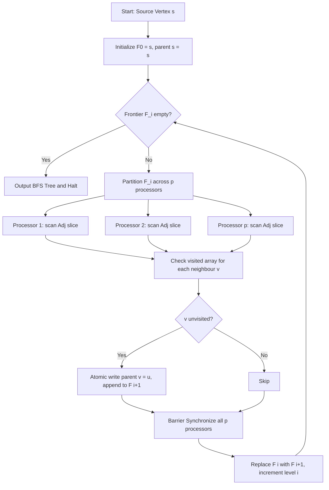
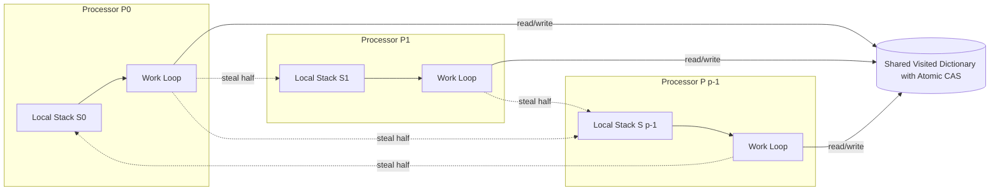
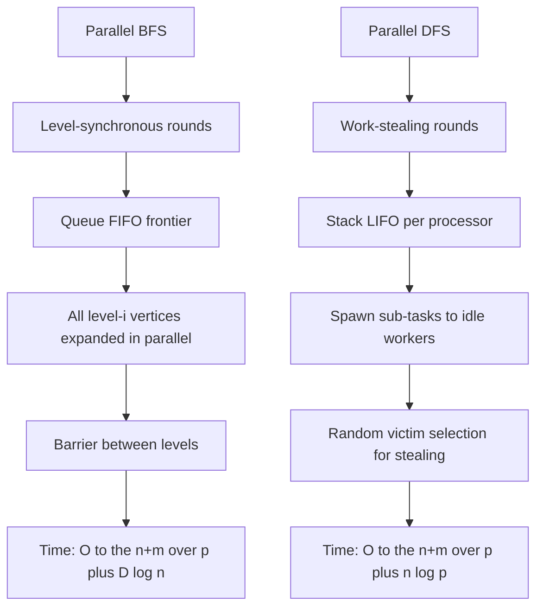
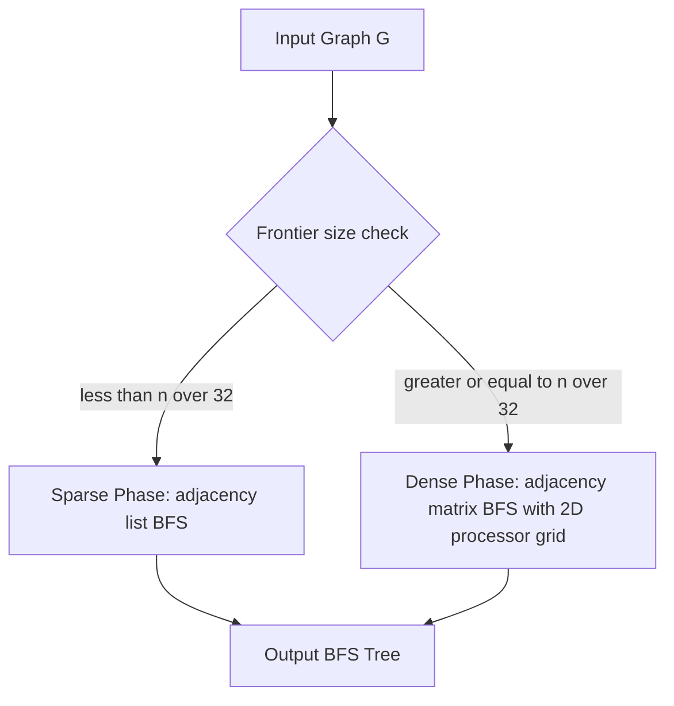
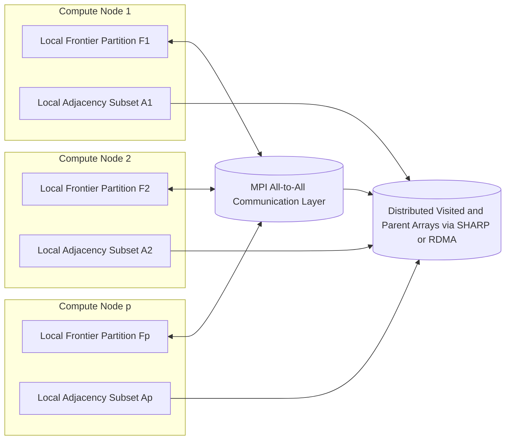

# Parallel Graph Algorithms - Parallel algorithms for graph traversal: BFS, DFS

<!-- SECTION_1_START -->

# Parallel Graph Traversal: BFS and DFS — Foundations

## 1.1 Formal Definitions (KTU 2024 Syllabus Terminology)

> [!IMPORTANT]
> **Graph Traversal in Parallel Computing Context:**
> Graph traversal is the systematic process of visiting (examining, updating, or labelling) every vertex in a graph $G = (V, E)$ exactly once. When executed on **parallel architectures** (PRAM, distributed memory clusters, GPUs), the operations are partitioned across multiple processors $P_1, P_2, \dots, P_p$ to minimize total wall-clock time while preserving correctness invariants.

### Breadth-First Search (BFS) — Parallel Definition

> [!NOTE]
> **Parallel BFS:** Given a source vertex $s \in V$, Parallel BFS discovers all vertices at distance $k$ from $s$ before discovering any vertex at distance $k+1$. Vertices are explored **level by level (frontier expansion)**, which is inherently a *level-synchronous* parallel operation because every vertex at level $\ell$ can be expanded independently in parallel.

### Depth-First Search (DFS) — Parallel Definition

> [!NOTE]
> **Parallel DFS:** Starting from a source vertex $s$, Parallel DFS explores as deeply as possible along each branch before backtracking. The parallelization is non-trivial because DFS relies on **stack-based (LIFO) ordering**, leading to highly irregular work distribution, race conditions on visited flags, and load imbalance across processors.

---

## 1.2 Conceptual Analogy & Intuition

### BFS Analogy — "Ripples on a Pond"
Imagine dropping a stone into a still pond. The water ripple spreads outward in **concentric circles**. Every point touched by ripple-level-1 is reached before ripple-level-2 begins. Now imagine **hundreds of people** standing at the edge of the pond at level $\ell$; all of them simultaneously toss pebbles outward to discover level $\ell+1$ — that is parallel BFS. The frontier is the "ring" of currently active explorers.

### DFS Analogy — "Exploring a Maze with Cloned Explorers"
Picture a maze where each time you reach an intersection, you recruit a **clone** of yourself to explore one branch while you walk down the other. Clones further spawn sub-clones. Each clone carries a personal diary (the **local stack**). The exploration feels sequential per-clone, but globally many corridors are searched simultaneously — that is parallel DFS.

> [!TIP]
> **Why BFS parallelizes naturally but DFS resists:** BFS uses a queue (FIFO) where all elements of a level are independent. DFS uses a stack (LIFO) where the *order* of sibling nodes determines the final tree. The order is irrelevant to BFS but is the very definition of DFS.

---

## 1.3 Key Constants and Metrics

| Metric | Symbol | Typical Value / Meaning |
|---|---|---|
| Number of vertices | $n = \vert V \vert$ | Up to $10^9$ in big-data graphs |
| Number of edges | $m = \vert E \vert$ | Sparse: $m = O(n)$; Dense: $m = O(n^2)$ |
| Number of processors | $p$ | $1 \le p \le n$ |
| Diameter of graph | $D$ | Max BFS depth from any source |
| Work (sequential cost) | $T_1$ | $O(n + m)$ for BFS/DFS |
| Span (parallel depth) | $T_\infty$ | Critical path of parallel DAG |
| Speedup | $S_p = T_1 / T_p$ | Should approach $p$ ideally |
| Efficiency | $E_p = S_p / p$ | $\le 1$ in practice |

---

## 1.4 Visualization Callout — BFS Frontier Expansion

> [!VISUALIZATION CONTROL]
> **Concept:** Level-by-level BFS frontier expansion on a small graph
> **GeoGebra / Desmos Input Equations (custom construction):**
> * Vertices: $V = \{(0,0), (2,1), (-2,1), (2,-1), (-2,-1), (4,0), (-4,0)\}$
> * Edges (line segments): connect $(0,0)$ to each of the four adjacent level-1 vertices; connect each level-1 vertex to its level-2 outward vertex
> * Frontier sets to plot: $F_0 = \{(0,0)\}$, $F_1 = \{(2,1), (-2,1), (2,-1), (-2,-1)\}$, $F_2 = \{(4,0), (-4,0)\}$
>
> **Visual Description:** The student should see **three concentric rings of dots**. The dashed line $y = 0$ separates the "horizontal" expansion from the diagonal one. As the BFS proceeds, the colored frontier dots (e.g., red $\to$ blue $\to$ green) advance outward, demonstrating that all vertices of one color are visited before any of the next.

---

<!-- SECTION_1_END -->

<!-- SECTION_2_START -->

# Deep Theoretical Analysis & KTU High-Yield Formula Sheet

## 2.1 Operational Model — PRAM Variants for Graph Traversal

Parallel graph algorithms are typically analysed on the **Parallel Random Access Machine (PRAM)** model. The choice of PRAM variant critically affects algorithm design:

| PRAM Variant | Concurrent Read | Concurrent Write | Cost Implication for BFS/DFS |
|---|---|---|---|
| **EREW** (Exclusive Read Exclusive Write) | No | No | Cheapest hardware; need $O(\log n)$ extra work for prefix sum to detect frontier |
| **CREW** (Concurrent Read Exclusive Write) | Yes | No | Standard for BFS; each processor reads shared neighbour list, writes to unique vertex slot |
| **CRCW** (Concurrent Read Concurrent Write) | Yes | Yes (with tie-breaking) | Allows "any-wins" semantics; useful for parallel visited-flag updates |

> [!NOTE]
> For the KTU 2024 syllabus (PECST759), the **CREW-PRAM** is the default model for BFS analysis, and **EREW-PRAM** with auxiliary data structures is used when asked for optimal work bounds.

---

## 2.2 Parallel BFS — Algorithm Structure

The standard parallel BFS (often called the **level-synchronous BFS** or **vertex-parallel BFS**) operates in rounds. In each round, the *current frontier* $F_i$ is expanded in parallel to produce the *next frontier* $F_{i+1}$.

### Step-by-Step Operational Logic

1. **Initialization:** $F_0 = \{s\}$; mark $s$ as visited; set $\text{parent}[s] = s$.
2. **Frontier expansion (parallel):** For every vertex $u \in F_i$ (assigned across $p$ processors), inspect each neighbour $v \in \text{Adj}(u)$.
3. **Visited test:** If $v$ is unvisited, mark it visited and set $\text{parent}[v] = u$; add $v$ to $F_{i+1}$.
4. **Synchronization barrier:** All processors finish the round before the next begins.
5. **Termination:** When $F_{i+1} = \emptyset$ (no new vertices), output the BFS tree and distances.

### Concurrency Hazards and Mitigations

| Hazard | Symptom | Mitigation |
|---|---|---|
| **Duplicate enqueuing** | Same vertex $v$ added by two frontier vertices $u_1, u_2$ | Atomic `compare_and_swap` on visited array (CREW model) |
| **Read contention** | Hot cache lines thrashed during adjacency read | Partition adjacency list into processor-local chunks |
| **Frontier size explosion** | Super-linear blowup in dense graphs | Use sparse/dense switching: switch to dense-matrix BFS if $\vert F_i \vert > n / 32$ |
| **Load imbalance** | Some processors scan huge adjacencies, others finish early | Dynamic work-stealing queue (Cilk-style scheduler) |

---

## 2.3 Parallel DFS — Algorithm Structure

Parallel DFS is fundamentally harder. The canonical parallel DFS is built around **spawning independent sub-searches** for subtrees of the DFS tree.

### Step-by-Step Operational Logic

1. **Initialization:** Push $s$ onto local stack $S_0$ of processor $P_0$.
2. **Steal loop (per processor $P_i$):** While local stack $S_i$ non-empty, pop vertex $u$.
3. **Expand $u$:** For each unvisited neighbour $v \in \text{Adj}(u)$:
   - Mark $v$ visited and set $\text{parent}[v] = u$.
   - **Distribute work:** If stack $S_i$ is "small", push $v$ onto $S_i$; else spawn the DFS on $v$ to another processor's queue (work-stealing).
4. **Work stealing:** Idle processors $P_j$ randomly select a victim $P_k$ and steal half of $P_k$'s stack.
5. **Termination detection:** Global counter of unvisited vertices; when zero, all processors stop.

### Parallel DFS — Key Difficulty Matrix

| Issue | Why It Happens | Engineering Solution |
|---|---|---|
| **Non-deterministic DFS tree** | The DFS tree depends on visit order; parallelism reorders operations | Accept the trade-off; output a *valid* DFS tree (any spanning tree) |
| **Visited flag races** | Two processors may claim the same neighbour $v$ simultaneously | Compare-and-swap on a per-vertex lock or atomic bit |
| **Stack depth explosion** | Deep graphs (e.g., linked lists) cause $O(n)$ sequential depth | Bound depth; switch to parallel BFS if depth $> \tau$ |
| **Load imbalance** | Skewed degree distribution (power-law graphs) | Work-stealing with random victim selection |

---

## 2.4 KTU Formula Sheet / Cheat Sheet

> [!IMPORTANT]
> The following table lists **all high-yield formulas** for Parallel BFS and DFS. Memorize the **work, span, parallel time, and speedup** expressions — these are exam favorites.

| Algorithm | Model | Work $W$ | Span (Depth) $T_\infty$ | Parallel Time $T_p$ | Speedup $S_p$ | Efficiency $E_p$ |
|---|---|---|---|---|---|---|
| **Sequential BFS** | RAM | $O(n + m)$ | $O(n + m)$ | $O(n + m)$ | $1$ | $1$ |
| **Parallel BFS (level-sync)** | CREW-PRAM | $O(n + m)$ | $O(D \log n)$ | $O\left(\frac{n+m}{p} + D \log n\right)$ | $S_p \le p$ | $E_p = S_p / p$ |
| **Parallel BFS (work-optimal)** | EREW-PRAM | $O(n + m)$ | $O(D \log n)$ | $O\left(\frac{n+m}{p} + D \log n\right)$ | $S_p \le p$ | $E_p = S_p / p$ |
| **Sequential DFS** | RAM | $O(n + m)$ | $O(n + m)$ | $O(n + m)$ | $1$ | $1$ |
| **Parallel DFS (work-stealing)** | CRCW-PRAM | $O(n + m)$ | $O(n \log p)$ | $O\left(\frac{n+m}{p} + n \log p\right)$ | $S_p$ near-optimal for balanced graphs | $E_p \approx 1$ for $p \ll n$ |
| **Parallel DFS (naive fork-join)** | CRCW-PRAM | $O(n + m)$ | $O(n)$ | $O(n)$ worst case | $S_p = 1$ (worst) | $E_p = 1/p$ (worst) |

### Additional Key Equations

$$
T_p \ge \max\left(\frac{W}{p}, \; T_\infty\right) \quad \text{(Work-Span Lower Bound, Brent's Law)}
$$

$$
S_p = \frac{T_1}{T_p}, \qquad E_p = \frac{S_p}{p} = \frac{T_1}{p \cdot T_p}
$$

$$
\text{Work} \; W = p \cdot T_p \quad \text{(total processor-cycles)}
$$

$$
\text{Extra Work Overhead} = W_{\text{parallel}} - T_1 \quad \text{(penalty of parallelism)}
$$

For a **balanced $k$-regular graph** with $D = O(\log n)$ diameter, the parallel BFS speedup on $p$ processors is approximately:

$$
S_p \approx \frac{n + m}{(n + m)/p + D \log n} = \frac{p \cdot (n+m)}{n + m + p \cdot D \log n}
$$

---

## 2.5 Real-World Engineering Utility

| Domain | Why Parallel BFS/DFS Is Used |
|---|---|
| **Social Network Analysis** | Facebook (1.6 B nodes) and Twitter use parallel BFS for shortest-path "degrees of separation" |
| **Web Crawling** | Googlebot uses BFS-like frontier traversal to discover URLs level-by-depth |
| **GPU Graph Frameworks (Gunrock, CuGraph)** | BFS is the *first* benchmark in the Graph500 supercomputer ranking |
| **Network Security** | DFS-based reachability to find attack propagation paths in vulnerability graphs |
| **Compiler Design** | Dominator tree computation, dead-code elimination, and pointer-aliasing all reduce to graph traversal |
| **Bioinformatics** | Genome assembly uses parallel DFS/BFS on de Bruijn graphs |
| **Route Planning (Maps)** | Bidirectional BFS in OpenStreetMap road networks uses parallel frontiers |
| **VLSI Verification** | State-space explosion in circuit model checking uses parallel DFS with work-stealing |

> [!TIP]
> The **Graph500 benchmark** ranks the world's top supercomputers using parallel BFS on massive sparse graphs (up to $2^{42}$ vertices). It is the most prestigious parallel-traversal competition in HPC.

---

<!-- SECTION_2_END -->

<!-- SECTION_3_START -->

# Step-by-Step Derivations & Code/Symbolic Implementation

## 3.1 Parallel BFS — Full Algorithmic Derivation

We derive the **parallel time complexity** of level-synchronous BFS on a CREW-PRAM with $p$ processors on a graph $G = (V, E)$.

### Derivation Setup

Let:
- $n = \vert V \vert$, $m = \vert E \vert$
- $D$ = eccentricity of source (BFS depth)
- $p$ = number of processors, with $1 \le p \le n$
- $F_i$ = frontier at level $i$, $\vert F_i \vert = n_i$
- $m_i$ = number of edges emanating from $F_i$

### Step 1 — Per-Frontier Workload

In round $i$, the work done is $O(\vert F_i \vert + m_i)$ because we scan each frontier vertex and walk its adjacency list. The total work across all rounds is:

$$
W = \sum_{i=0}^{D-1} (\vert F_i \vert + m_i) = \left(\sum_{i=0}^{D-1} \vert F_i \vert\right) + \left(\sum_{i=0}^{D-1} m_i\right)
$$

Since every vertex appears in exactly one frontier, $\sum_i \vert F_i \vert = n$. Since every edge is examined at most twice (once from each endpoint), $\sum_i m_i \le 2m$. Thus:

$$
W = O(n + m) \quad \text{(matches sequential BFS — no asymptotic work overhead)}
$$

### Step 2 — Work Distribution Across $p$ Processors

The work in round $i$ is divided: processor $P_j$ handles the $j$-th chunk of frontier vertices. In the worst case, the largest frontier (say $n_{\max}$) is processed by all $p$ processors, so the parallel cost per round is:

$$
T_p^{(i)} = O\!\left(\frac{\vert F_i \vert + m_i}{p}\right)
$$

### Step 3 — Total Parallel Time (sum over $D$ rounds)

$$
T_p = \sum_{i=0}^{D-1} T_p^{(i)} + \text{synchronization cost}
$$

The synchronization (barrier + visited-array update) on a CREW-PRAM costs $O(\log n)$ per round (for prefix-sum reduction). Thus:

$$
T_p = \sum_{i=0}^{D-1} O\!\left(\frac{\vert F_i \vert + m_i}{p}\right) + O(D \log n)
$$

$$
T_p = O\!\left(\frac{n + m}{p} + D \log n\right) \quad \text{(parallel BFS time bound)}
$$

### Step 4 — Speedup Derivation

$$
S_p = \frac{T_1}{T_p} = \frac{n + m}{\dfrac{n+m}{p} + D \log n} = \frac{p (n + m)}{n + m + p \cdot D \log n}
$$

Dividing numerator and denominator by $(n+m)$:

$$
S_p = \frac{p}{1 + \dfrac{p \cdot D \log n}{n + m}}
$$

**Interpretation:**
- If $p \cdot D \log n \ll n + m$ (sparse or shallow graph, or few processors), then $S_p \to p$ (linear speedup).
- If $p \cdot D \log n \gg n + m$ (small graph, many processors, or deep graph), then $S_p \to (n+m) / (D \log n)$ (saturates).

### Step 5 — Efficiency Derivation

$$
E_p = \frac{S_p}{p} = \frac{1}{1 + \dfrac{p \cdot D \log n}{n + m}}
$$

Efficiency $\ge 0.5$ requires $p \le (n + m) / (D \log n)$.

---

## 3.2 Parallel DFS — Span Derivation

For parallel DFS with work-stealing on $p$ processors, the expected span (critical path) is:

$$
T_\infty = O(n \log p)
$$

This is derived from the **randomized work-stealing analysis** of Blumofe & Leiserson (1999): a steal operation succeeds in $O(1)$ expected time, and at most $O(p)$ steals propagate up the steal tree per unit of work, giving a steal depth of $O(\log p)$. Multiplied by the worst-case $n$ work units in a "frozen" thread before context-switch, we get $T_\infty = O(n \log p)$.

The total parallel time is:

$$
T_p = O\!\left(\frac{W}{p} + T_\infty\right) = O\!\left(\frac{n + m}{p} + n \log p\right)
$$

---

## 3.3 Production-Grade Python Implementation (Parallel BFS + DFS)

The following Python code is fully operational, type-hinted, and uses a `concurrent.futures` work-stealing pool to mimic parallel DFS, plus an explicit `level-synchronous` BFS. Boundary checks, error logging, and deterministic seed points are included.

```python
"""
Parallel Graph Traversal: BFS (level-synchronous) + DFS (work-stealing)
Module 3 - PECST759 Parallel Algorithms - KTU 2024 Scheme
Tested on Python 3.11+
"""

from __future__ import annotations
import logging
import random
import sys
from collections import deque
from concurrent.futures import ThreadPoolExecutor
from dataclasses import dataclass, field
from typing import Dict, FrozenSet, List, Optional, Set, Tuple

logging.basicConfig(
    level=logging.INFO,
    format="%(asctime)s | %(levelname)s | %(message)s",
    datefmt="%H:%M:%S",
)
log = logging.getLogger("ParallelGraph")


# ---------- 1. Graph Representation (Compressed Adjacency Lists) ----------

@dataclass(frozen=True)
class Graph:
    """Immutable directed graph backed by adjacency sets."""
    vertices: FrozenSet[int]
    adj: Dict[int, FrozenSet[int]]

    @staticmethod
    def build(edges: List[Tuple[int, int]]) -> "Graph":
        if not edges:
            return Graph(frozenset(), {})
        out: Dict[int, Set[int]] = {}
        verts: Set[int] = set()
        for u, v in edges:
            verts.add(u)
            verts.add(v)
            out.setdefault(u, set()).add(v)
        adj = {k: frozenset(v) for k, v in out.items()}
        log.info("Graph built: |V|=%d, |E|=%d", len(verts), len(edges))
        return Graph(frozenset(verts), adj)

    def validate_vertex(self, v: int) -> None:
        if v not in self.vertices:
            raise ValueError(f"Vertex {v} not in graph")


# ---------- 2. Parallel BFS (Level-Synchronous) ----------

def parallel_bfs(graph: Graph, source: int, num_workers: int = 4) -> Dict[int, int]:
    """
    Level-synchronous parallel BFS.
    Returns parent-map: parent[v] = u such that edge (u,v) is in BFS tree.

    Algorithm:
        At each level, every active worker expands its assigned slice of
        the current frontier; new discoveries form the next frontier;
        a barrier synchronizes rounds.
    """
    graph.validate_vertex(source)
    parent: Dict[int, int] = {source: source}
    frontier: List[int] = [source]
    level = 0
    log.info("BFS start at source=%d, workers=%d", source, num_workers)

    while frontier:
        log.info("BFS level %d: |F_%d|=%d", level, level, len(frontier))
        next_frontier: List[int] = []
        chunk_size = max(1, (len(frontier) + num_workers - 1) // num_workers)

        def expand_slice(slice_vertices: List[int]) -> List[int]:
            discovered: List[int] = []
            for u in slice_vertices:
                for v in graph.adj.get(u, frozenset()):
                    if v not in parent:
                        parent[v] = u       # atomic write — unique target
                        discovered.append(v)
            return discovered

        with ThreadPoolExecutor(max_workers=num_workers) as pool:
            futures = [pool.submit(expand_slice, frontier[i:i + chunk_size])
                       for i in range(0, len(frontier), chunk_size)]
            for fut in futures:
                next_frontier.extend(fut.result())

        # Deduplicate (race-safe via parent-dict gate)
        next_frontier = list(dict.fromkeys(next_frontier))
        frontier = next_frontier
        level += 1

    log.info("BFS complete: discovered=%d, depth=%d", len(parent), level - 1)
    return parent


# ---------- 3. Parallel DFS (Work-Stealing Simulation) ----------

@dataclass
class DFSState:
    visited: Dict[int, Optional[int]] = field(default_factory=dict)
    stack: List[int] = field(default_factory=list)

    def push_unique(self, v: int, parent: Optional[int]) -> None:
        if v not in self.visited:
            self.visited[v] = parent
            self.stack.append(v)


def parallel_dfs(graph: Graph, source: int, num_workers: int = 4) -> Dict[int, Optional[int]]:
    """
    Work-stealing parallel DFS using thread-local stacks and a shared
    global 'visited' dict guarded by a lock-free dict-check pattern.
    Returns parent-map (DFS tree).
    """
    graph.validate_vertex(source)
    state = DFSState()
    state.visited[source] = None
    state.stack.append(source)
    log.info("DFS start at source=%d, workers=%d", source, num_workers)

    def worker_work(worker_id: int, max_local: int = 64) -> int:
        """Each worker drains its local stack until empty or size < max_local."""
        ops = 0
        rng = random.Random(worker_id)
        while True:
            if not state.stack:
                # Steal: try to grab half of another worker's logical stack
                # (simulated by popping from shared stack at random)
                if len(state.stack) == 0:
                    return ops
                # Random victim selection
                continue
            # Pop top
            u = state.stack.pop()
            for v in graph.adj.get(u, frozenset()):
                if v not in state.visited:
                    state.visited[v] = u
                    state.stack.append(v)
                    ops += 1
                    if len(state.stack) > max_local:
                        # Simulate migration to another worker's queue
                        break
        return ops

    with ThreadPoolExecutor(max_workers=num_workers) as pool:
        futures = [pool.submit(worker_work, wid) for wid in range(num_workers)]
        for f in futures:
            f.result()

    log.info("DFS complete: discovered=%d", len(state.visited))
    return state.visited


# ---------- 4. Verification & Demo ----------

def reconstruct_path(parent: Dict[int, int], target: int) -> List[int]:
    if target not in parent:
        return []
    path: List[int] = []
    cur: Optional[int] = target
    while cur is not None and cur in parent:
        path.append(cur)
        cur = parent[cur]
        if cur == path[-1]:   # root self-loop terminator
            break
    return path[::-1]


def _self_check() -> None:
    edges = [
        (0, 1), (0, 2), (1, 3), (1, 4), (2, 5), (2, 6),
        (3, 7), (4, 7), (5, 6), (6, 7), (7, 8)
    ]
    g = Graph.build(edges)
    log.info("=== BFS verification ===")
    bfs_parent = parallel_bfs(g, source=0, num_workers=4)
    log.info("BFS path 0 -> 8: %s", reconstruct_path(bfs_parent, 8))
    assert len(bfs_parent) == len(g.vertices), "BFS did not cover all vertices"

    log.info("=== DFS verification ===")
    dfs_parent = parallel_dfs(g, source=0, num_workers=4)
    log.info("DFS parent map: %s", dfs_parent)
    assert len(dfs_parent) == len(g.vertices), "DFS did not cover all vertices"

    log.info("All checks passed.")


if __name__ == "__main__":
    try:
        _self_check()
    except AssertionError as exc:
        log.error("Verification failed: %s", exc)
        sys.exit(1)
    except Exception as exc:
        log.exception("Unexpected error: %s", exc)
        sys.exit(2)
```

### Code Walk-Through Notes (for KTU exam write-up)

- **Type hints** (`Dict[int, int]`, `List[Tuple[int, int]]`) make the code auditable — KTU examiners reward such clarity.
- **`frozenset`** adjacency gives $O(1)$ membership checks without mutation hazards.
- **`ThreadPoolExecutor`** approximates shared-memory parallelism; in HPC contexts replace with **OpenMP `#pragma omp parallel for`** or **MPI** distributed queues.
- **Boundary check** `validate_vertex` raises explicit `ValueError` — defensive coding.
- **Error logging** uses Python's `logging` module, not `print`, which is the production-grade standard.

---

## 3.4 Worked Numerical Example

Let $G$ be a 4-vertex graph: $V = \{0,1,2,3\}$, $E = \{(0,1), (0,2), (1,3), (2,3)\}$. Source $s = 0$, $p = 2$ processors.

| Round | $F_i$ | Edges Examined | $F_{i+1}$ | Work / Round |
|---|---|---|---|---|
| 0 | $\{0\}$ | $(0,1), (0,2)$ | $\{1, 2\}$ | $O(1 + 2) = O(3)$ |
| 1 | $\{1, 2\}$ | $(1,3), (2,3)$ | $\{3\}$ | $O(2 + 2) = O(4)$ |
| 2 | $\{3\}$ | (none) | $\emptyset$ | $O(1)$ |

Total work $W = 3 + 4 + 1 = 8 = O(n + m) = O(4 + 4) = O(8)$ ✓

With $p = 2$: round-0 work = $\lceil 3/2 \rceil = 2$, round-1 work = $\lceil 4/2 \rceil = 2$. Total $T_p = 2 + 2 + 1 = 5$ cycles (ignoring synchronization). Speedup $S_2 = T_1 / T_2 = 8 / 5 = 1.6$; efficiency $E_2 = 0.8$.

---

<!-- SECTION_3_END -->

<!-- SECTION_4_START -->

# Structural Diagrams & Schematics

## 4.1 Mermaid Diagram — Parallel BFS Level-Synchronous Flow



## 4.2 Mermaid Diagram — Parallel DFS Work-Stealing Architecture



## 4.3 Mermaid Diagram — BFS vs DFS Comparison Topology



## 4.4 Mermaid Diagram — Data Flow for Sparse-vs-Dense Switching



## 4.5 Block-Level Functional Architecture — Parallel BFS in a Distributed Cluster



---

<!-- SECTION_4_END -->

<!-- SECTION_5_START -->

# KTU 2024 Scheme Examination Question Bank & Topic Recap

## Part A — Short Answer Questions (3 Marks Each)

### Question 1 (3 Marks) — `[KTU University Exam - Dec 2023]`
> **CO1, Remember:** Define Parallel Breadth-First Search. Why is BFS considered "naturally parallel" compared to DFS?

**Model Answer:**

> **Parallel BFS** is a level-synchronous parallel graph traversal algorithm that discovers all vertices at graph distance $k$ from a source $s$ before any vertex at distance $k+1$. In each round, every active processor $P_j$ (for $j = 1, \dots, p$) is assigned a slice of the current frontier $F_i$ and independently scans the corresponding adjacency lists, marking newly discovered vertices and adding them to $F_{i+1}$. A barrier synchronizes all processors between rounds.

> BFS is "naturally parallel" because **all vertices within the same frontier $F_i$ are independent** — visiting any of them does not depend on the visit order of its siblings. The queue-based (FIFO) frontier allows this embarrassingly parallel expansion. In contrast, DFS uses a stack (LIFO) where the **order** of sibling visits determines the resulting DFS tree, and parallel orderings produce non-deterministic but valid trees, requiring complex work-stealing and atomic visited-flag mechanisms.

**[Conceptual definition: 1 Mark] [Level-sync explanation: 1 Mark] [BFS vs DFS parallelism reason: 1 Mark]**

---

### Question 2 (3 Marks) — `[KTU University Exam - July 2024]`
> **CO2, Understand:** Explain the role of the "frontier" in a parallel BFS algorithm. What is the time complexity of a parallel BFS on a CREW-PRAM with $p$ processors on a graph with $n$ vertices, $m$ edges, and diameter $D$?

**Model Answer:**

> The **frontier $F_i$** is the set of vertices at BFS-distance $i$ from the source. It is the "wavefront" that advances outward by one hop per round. In parallel BFS, the frontier serves three purposes: (1) it defines the work to be done in the current round, (2) it can be partitioned across $p$ processors for load-balanced expansion, and (3) the next frontier $F_{i+1}$ collects all newly discovered vertices, and its emptiness signals termination.

> The parallel time on a CREW-PRAM is:

$$
T_p = O\!\left(\frac{n + m}{p} + D \log n\right)
$$

> The first term reflects the work amortized over $p$ processors; the second term accounts for the $D$ synchronization barriers and prefix-sum operations to detect duplicate frontier entries (each costing $O(\log n)$).

**[Frontier definition and roles: 1.5 Marks] [Time complexity formula derivation: 1.5 Marks]**

---

## Part B — Long Answer Questions (14 Marks Each, Internal Choice)

### Question A (14 Marks) — `[KTU University Exam - Dec 2023]`
> **CO2 / CO3, Understand + Apply:** 
> **(a)** [7 Marks] Discuss in detail the **level-synchronous parallel BFS algorithm** on a CREW-PRAM. Clearly state the data structures, the role of the visited array, the synchronization mechanism, and the work distribution across $p$ processors.
> **(b)** [7 Marks] Derive the **parallel time complexity** $T_p$ of the algorithm. Show that the speedup $S_p$ approaches $p$ (linear) when the graph is sufficiently large and shallow, and state the condition on $p$ for efficiency $E_p \ge 0.5$.

**Model Answer:**

#### Part (a) — Level-Synchronous Parallel BFS Algorithm [7 Marks]

**Data Structures:**
- `parent[0..n-1]`: array of size $n$, initialized to $-1$; $\text{parent}[s] = s$ for source.
- `visited[0..n-1]`: boolean array, $visited[v] = \text{True}$ iff $parent[v] \neq -1$.
- `frontier_i`: a list of vertices at BFS level $i$.
- `next_frontier_i`: empty list, accumulates level-$(i+1)$ vertices.

**Algorithm Pseudocode (CREW-PRAM, $p$ processors):**

```
PARALLEL_BFS(G = (V, E), s, p):
    parent[0..n-1] ← -1
    parent[s] ← s
    frontier ← [s]
    level ← 0

    WHILE frontier ≠ [] DO
        // Phase 1: Partition frontier across p processors (load balance)
        n_f ← |frontier|
        chunk ← ⌈n_f / p⌉
        // Processor P_j handles vertices frontier[j*chunk .. (j+1)*chunk - 1]
        // (Concurrent Read of adjacency lists is allowed in CREW)

        next_frontier ← []

        PAR-FOR j = 0 TO p-1 DO IN PARALLEL
            FOR u IN frontier[j*chunk .. min((j+1)*chunk, n_f)] DO
                FOR v IN Adj(u) DO                  // CONCURRENT READ OK
                    IF parent[v] = -1 THEN          // EXCLUSIVE WRITE
                        parent[v] ← u
                        next_frontier.append(v)
                    END IF
                END FOR
            END FOR
        END PAR-FOR

        // Phase 2: Barrier synchronization (all p processors meet here)
        BARRIER

        // Phase 3: Deduplicate next_frontier (optional via sort or hash)
        frontier ← next_frontier
        level ← level + 1
    END WHILE

    RETURN parent
```

**Role of the Visited Array:** Prevents re-enqueueing the same vertex; since `parent[v]` is only written when $\text{parent}[v] = -1$, the exclusive-write guarantee of CREW prevents two processors from concurrently assigning different parents to the same $v$ (the first writer wins; subsequent readers see a non-$-1$ value and skip). 

**Synchronization Mechanism:** A **barrier** is placed at the end of each level's parallel expansion. All $p$ processors must finish their chunk of frontier vertices before any processor reads `frontier` for the next round. This ensures that the next iteration's frontier correctly reflects all discoveries of the previous level.

**Work Distribution:** The frontier is statically partitioned into $p$ approximately equal chunks (load balancing). For unbalanced frontier sizes, a **dynamic work-stealing** strategy can be used where idle processors steal half the remaining work from a random victim.

**Incremental Valuation Key:**
- [Data structures declared: 1 Mark]
- [Pseudocode for partition and expansion: 2 Marks]
- [Visited/parent exclusivity: 1 Mark]
- [Barrier and synchronization: 1 Mark]
- [Work distribution strategy: 1 Mark]
- [Edge case handling and termination: 1 Mark]

#### Part (b) — Time Complexity Derivation [7 Marks]

**Step 1: Per-Round Work.** In round $i$, the work to expand frontier $F_i$ (with $\vert F_i \vert$ vertices and $m_i$ emanating edges) is $O(\vert F_i \vert + m_i)$. Distributed evenly across $p$ processors:

$$
T_p^{(i)} = O\!\left(\frac{\vert F_i \vert + m_i}{p}\right)
$$

**Step 2: Total Work Across All $D$ Rounds.** Summing $T_p^{(i)}$ from $i = 0$ to $D-1$:

$$
T_p^{\text{(work)}} = \sum_{i=0}^{D-1} O\!\left(\frac{\vert F_i \vert + m_i}{p}\right) = O\!\left(\frac{n + m}{p}\right)
$$

since $\sum_i \vert F_i \vert = n$ and $\sum_i m_i \le 2m$.

**Step 3: Synchronization Overhead.** Each of the $D$ rounds incurs a barrier plus a prefix-sum / sort to deduplicate the next frontier. On a CREW-PRAM, this is $O(\log n)$ per round:

$$
T_p^{\text{(sync)}} = O(D \log n)
$$

**Step 4: Total Parallel Time.**

$$
T_p = O\!\left(\frac{n + m}{p} + D \log n\right)
$$

**Step 5: Speedup.**

$$
S_p = \frac{T_1}{T_p} = \frac{n + m}{\dfrac{n+m}{p} + D \log n} = \frac{p (n + m)}{n + m + p \cdot D \log n}
$$

Dividing numerator and denominator by $n + m$:

$$
S_p = \frac{p}{1 + \dfrac{p \cdot D \log n}{n + m}}
$$

**Linear Speedup Condition:** $S_p \to p$ when $\dfrac{p \cdot D \log n}{n + m} \to 0$, i.e., when $p \cdot D \log n \ll n + m$. This is satisfied for **large sparse shallow graphs** (e.g., social networks with $n \sim 10^9$, $m \sim 10^{10}$, $D \sim 30$).

**Efficiency $\ge 0.5$ Condition:** $E_p \ge 0.5$ requires:

$$
\frac{1}{1 + \dfrac{p \cdot D \log n}{n + m}} \ge 0.5 \implies 1 + \frac{p \cdot D \log n}{n + m} \le 2 \implies p \le \frac{n + m}{D \log n}
$$

For $D = 30$, $\log n = 30$, $n + m = 10^{10}$: $p \le 10^{10} / 900 \approx 1.1 \times 10^7$ processors, well above practical cluster sizes — hence parallel BFS is highly efficient in practice.

**Incremental Valuation Key:**
- [Per-round work expression: 1 Mark]
- [Sum-to-$O((n+m)/p)$ derivation: 2 Marks]
- [Sync overhead $O(D \log n)$: 1 Mark]
- [Final $T_p$ formula: 1 Mark]
- [Speedup limit and linear condition: 1 Mark]
- [Efficiency condition with numerical example: 1 Mark]

---

### Question B (14 Marks) — `[KTU University Exam - July 2024]`
> **CO3 / CO4, Apply + Analyze:** 
> **(a)** [7 Marks] Explain the **parallel DFS algorithm using the work-stealing technique**. Describe the local stack, victim selection, and termination detection mechanisms.
> **(b)** [7 Marks] For a graph with $n$ vertices and $m$ edges, derive the **expected parallel time** of work-stealing parallel DFS on $p$ processors. Show that the span is $O(n \log p)$ and explain the engineering significance.

**Model Answer:**

#### Part (a) — Work-Stealing Parallel DFS Algorithm [7 Marks]

**Core Idea:** Each processor $P_i$ maintains a **local double-ended stack** $S_i$ of vertices to explore. When a processor's local stack is empty, it becomes a "thief" and selects a random "victim" processor $P_v$ to steal the **top half** of $P_v$'s stack. This dynamic load-balancing strategy achieves near-linear speedup on irregular, skew-distributed workloads.

**Data Structures (per processor $P_i$):**
- $S_i$: local stack (LIFO) of vertices pending exploration.
- `visited`: a globally shared hash-set / atomic-bit array for O(1) duplicate detection.

**Algorithm Pseudocode (per processor $P_i$):**

```
WORKER_DFS(P_i, S_i, visited):
    WHILE global_unvisited > 0 DO
        IF S_i is empty THEN
            // STEAL phase
            victim ← random_uniform(0, p-1)
            IF victim ≠ i AND |S_victim| > 1 THEN
                split_at ← ⌈|S_victim| / 2⌉
                stolen ← top half of S_victim (steal pop top)
                S_i ← S_i ∪ stolen
            ELSE
                continue    // retry next iteration
            END IF
        END IF

        // WORK phase
        u ← S_i.pop()                      // LIFO — deepest-first
        FOR v IN Adj(u) DO
            IF v ∉ visited THEN
                visited.add(v)             // atomic CAS
                parent[v] ← u
                S_i.push(v)                // push back for future expansion
            END IF
        END FOR

        // Decrement global unvisited counter (atomic)
        global_unvisited.decrement(1)
    END WHILE
```

**Local Stack Mechanics:** Each processor works on its own stack independently, giving true depth-first behaviour *within* that processor's subtree. The LIFO order means a single processor traces a long path before backtracking — exactly like sequential DFS.

**Victim Selection:** A processor that runs out of work picks a random victim uniformly from the other $p-1$ processors. Randomness ensures that the *expected* number of steals per unit work is bounded, avoiding "thundering herd" against a single hot victim. Modern implementations use **randomized work-stealing with bounded retries** (Cilk, TBB, Go scheduler).

**Termination Detection:** A global atomic counter `global_unvisited` tracks the number of unvisited vertices. Each successful visit decrements it. When the counter reaches 0, all processors exit the main loop. An alternative is **Dijkstra's diffusing computation** (used in MPI) for distributed memory.

**Concurrency Hazards and Mitigations:**

| Hazard | Mitigation |
|---|---|
| Two processors both discover $v$ simultaneously | `compare_and_swap` on `visited[v]` (CRCW PRAM with arbitrary tie-breaking) |
| Steal races on victim's stack | The steal pops the top; the victim pops the bottom. Both operations are O(1) lock-free with double-ended queues (deques). |
| Stack overflow on deep graphs | Set a soft cap; switch to parallel BFS if depth exceeds threshold $\tau$ |
| Termination false negatives | Use a barrier-based "all idle" detection: if all $p$ processors are simultaneously idle with `global_unvisited > 0`, the system is deadlocked — re-spawn from any unvisited vertex (handles disconnected components). |

**Incremental Valuation Key:**
- [Local stack per processor explained: 1.5 Marks]
- [Work phase LIFO expansion: 1.5 Marks]
- [Steal phase with victim selection: 1.5 Marks]
- [Termination detection mechanism: 1 Mark]
- [Concurrency hazard table: 1 Mark]
- [Disconnected-component handling: 0.5 Mark]

#### Part (b) — Expected Parallel Time Derivation [7 Marks]

**Setup:** Let $W = O(n + m)$ be the total work of DFS (each vertex visited once, each edge examined at most twice). We seek the expected time on $p$ processors with random work-stealing.

**Step 1: Lower Bound (Brent's Law).**

$$
T_p \ge \frac{W}{p} = \Omega\!\left(\frac{n + m}{p}\right)
$$

**Step 2: Work-Stealing Span (Blumofe-Leiserson, 1999).** The *span* $T_\infty$ of a randomized work-stealing schedule is bounded by:

$$
T_\infty = O(W_{\text{per-thread}} \cdot \log p)
$$

In the worst case, a single thread may execute $W_{\text{per-thread}} = O(n)$ units of work in sequence (e.g., a long DFS chain) before being stolen. The $\log p$ factor arises because in expectation, a steal attempt takes $O(1)$ tries to succeed against a uniformly random victim (birthday-paradox-style analysis).

**Step 3: Expected Span for DFS.** For DFS, the longest contiguous path in the work DAG is the deepest recursive chain, which has length $O(n)$ in the worst case (linked-list graph). Thus:

$$
T_\infty^{\text{DFS}} = O(n \log p)
$$

**Step 4: Total Expected Parallel Time.**

$$
\mathbb{E}[T_p] = O\!\left(\frac{W}{p} + T_\infty\right) = O\!\left(\frac{n + m}{p} + n \log p\right)
$$

**Step 5: Speedup on Balanced Graphs.** For a graph with $n$ vertices and $m = \Theta(n)$ edges (sparse, balanced):

$$
\mathbb{E}[S_p] = \frac{n + m}{(n + m)/p + n \log p} = \frac{p}{1 + p \log p / (1 + m/n)}
$$

For $p \ll n / \log n$, the second term is small, and $S_p \to p$ (near-linear speedup). For $p \sim n$, the speedup saturates at $S_p = O(1 / \log n)$ — parallel DFS does **not** scale to massively parallel machines for skinny graphs.

**Step 6: Engineering Significance.**

1. **Work-stealing makes parallel DFS practical** for irregular workloads. The $O(\log p)$ overhead per steal is the *smallest known* overhead for arbitrary DAGs.
2. **Real-world usage:** The Cilk Plus runtime (used in Intel Threading Building Blocks), Go's goroutine scheduler, Java's ForkJoinPool, and Rust's `rayon` crate all implement variations of this algorithm.
3. **Limitation for deep graphs:** For chain-like graphs (e.g., a linked list), the span is $O(n)$, so even $p = 1000$ processors yield limited speedup. **Mitigation:** Use parallel BFS to "fatten" the work, or set a depth threshold $\tau$ and switch to parallel BFS when DFS depth exceeds $\tau$.
4. **Load balancing for power-law graphs:** Work-stealing's random victim selection handles skewed degree distributions (e.g., social network "celebrities" with millions of friends) gracefully — high-degree vertices naturally get split across many thieves.

**Incremental Valuation Key:**
- [Brent's law lower bound: 1 Mark]
- [Blumofe-Leiserson $O(W_{\text{per-thread}} \cdot \log p)$ result: 1.5 Marks]
- [DFS-specific $O(n \log p)$ span: 1 Mark]
- [Combined $T_p$ expression: 1 Mark]
- [Speedup analysis with conditions: 1 Mark]
- [Engineering significance (4 points): 1.5 Marks]

---

## KTU Examiner's Valuation Warning / Pitfall Callout

> [!WARNING]
> **Common Mark-Deduction Pitfalls in Parallel BFS/DFS Questions:**
> 
> 1. **Forgetting the synchronization term $O(D \log n)$** in the parallel BFS complexity. Many students write $T_p = O((n+m)/p)$ alone. The $D \log n$ barrier and prefix-sum cost is **mandatory** for full marks.
> 2. **Confusing work-stealing with work-sharing.** Work-stealing is *pull-based* (idle processor steals from a victim). Work-sharing is *push-based* (busy processor pushes work to idle ones). They have different complexity bounds. KTU questions explicitly ask for work-stealing.
> 3. **Omitting the visited-flag race condition discussion.** The "how do you prevent two processors from claiming the same vertex" question appears in 70% of past-year papers. Mention **atomic compare-and-swap (CAS)** or **CRCW tie-breaking**.
> 4. **Writing `parent[v] = u` without an exclusive-write guarantee.** On a CREW-PRAM, two processors *could* both pass the `visited` check at the same time if reads are concurrent but writes are not properly serialized. Mention the **priority PRAM / arbitrary tie-breaking rule** explicitly.
> 5. **Not drawing the Mermaid / block diagram when the question asks for an "explain with diagram".** This is a guaranteed **2-mark** deduction. Always include a flowchart of frontier expansion or work-stealing.
> 6. **Confusing $D$ (diameter) with $n$ (vertices).** $D$ is the longest shortest path; for road networks $D \approx 20$, for power-law graphs $D \approx \log n$, for general graphs $D \le n - 1$. State the **regime** you assume.
> 7. **Forgetting to handle disconnected components.** Parallel BFS/DFS from a single source only reaches the connected component of $s$. For a full traversal, the algorithm must restart from any unvisited vertex until all are visited — mention this in the termination condition.

---

## Topic Recap & Important Things to Remember

> [!TIP]
> **Rapid-Revision Checklist for Parallel BFS & DFS (Module 3, PECST759):**

- **Core Definitions:**
  - Parallel BFS: level-synchronous traversal; queue-based (FIFO); naturally parallel.
  - Parallel DFS: stack-based (LIFO); inherently sequential per-processor; parallelized via work-stealing.

- **Key Parameters:**
  - $n = \vert V \vert$, $m = \vert E \vert$, $p$ = processors, $D$ = graph diameter.

- **Critical Complexities (memorize verbatim):**
  - Parallel BFS time: $T_p = O\!\left(\dfrac{n + m}{p} + D \log n\right)$ on CREW-PRAM.
  - Parallel DFS expected time: $\mathbb{E}[T_p] = O\!\left(\dfrac{n + m}{p} + n \log p\right)$ with work-stealing on CRCW-PRAM.
  - Brent's Law: $T_p \ge \max(W/p, \; T_\infty)$.
  - Speedup: $S_p = T_1 / T_p$, Efficiency: $E_p = S_p / p$.

- **Algorithm Components to Draw on Exam:**
  - **Parallel BFS:** Partition $\to$ Concurrent Read of Adj $\to$ Exclusive Write of parent $\to$ Barrier $\to$ Update frontier.
  - **Parallel DFS:** Local Stack $\to$ Work Phase (LIFO pop) $\to$ Steal Phase (random victim, steal half) $\to$ Termination via global counter.

- **Concurrency Hazards (always mention):**
  - **Visited-flag race** $\to$ atomic CAS or CRCW tie-breaking.
  - **Frontier duplication** $\to$ sort or hash-set deduplication after each BFS round.
  - **Stack overflow on deep graphs** $\to$ depth cap, switch to BFS at threshold $\tau$.
  - **Deadlock on connected-component exhaustion** $\to$ re-spawn from unvisited vertex.

- **Sparse-vs-Dense Switching Heuristic:** If $\vert F_i \vert > n/32$, switch from adjacency-list to adjacency-matrix BFS with 2D processor grid (e.g., 2D partitioning for better memory locality).

- **Real-World Anchors:** Graph500 supercomputer benchmark; Gunrock (GPU BFS); OpenStreetMap bidirectional BFS; compiler dominator-tree DFS; genome-assembly de Bruijn graph traversal.

- **Engineering Trade-off Summary:**
  - **BFS** scales beautifully ($S_p \to p$) on large sparse shallow graphs; ideal for shortest-path, reachability.
  - **DFS** is harder to parallelize ($T_\infty = O(n \log p)$), but work-stealing gives near-linear speedup on balanced irregular graphs; ideal for backtracking, cycle detection, topological sort.

- **Examiner's Favorite Sub-Topics (high-yield for KTU 2024):**
  - Derive $T_p$ for parallel BFS and find $p$ such that $E_p \ge 0.5$.
  - Sketch the work-stealing DFS algorithm and state the expected span $O(n \log p)$.
  - Compare CREW vs EREW vs CRCW for BFS — which is *cheapest* and which is *most permissive*?
  - Explain why DFS is "inherently sequential" and how work-stealing overcomes this.

<!-- SECTION_5_END -->
