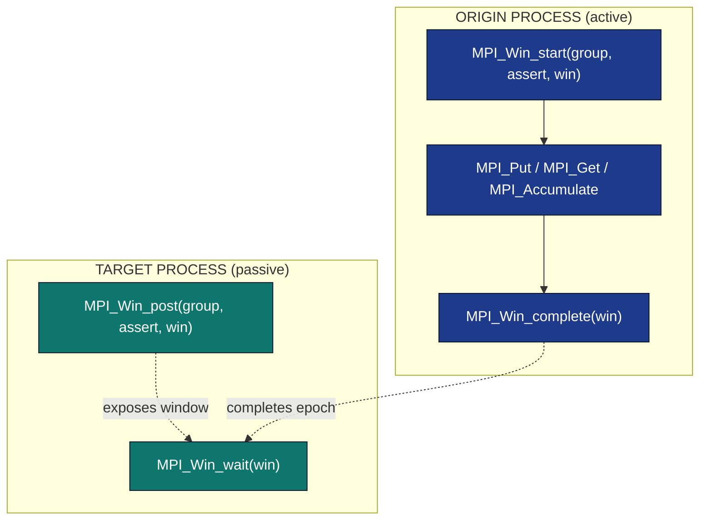
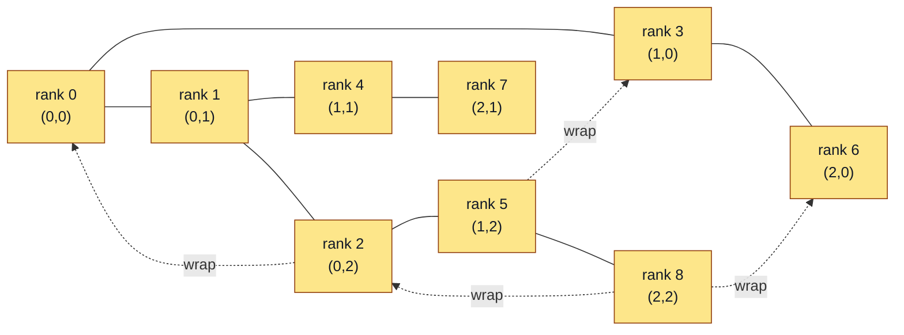
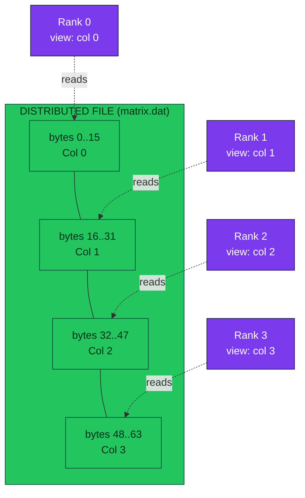

# Advanced MPI features and applications

<!-- SECTION_1_START -->
# Advanced MPI Features and Applications

## 1.1 Formal Academic Definition

The **Message Passing Interface (MPI)** is a standardized, language-independent communication protocol used for programming parallel computers. The **advanced features** of MPI extend beyond elementary point-to-point send/receive operations, offering sophisticated mechanisms for **derived datatypes**, **non-blocking communication**, **remote memory access (RMA)**, **virtual process topologies**, **process groups and communicators**, **dynamic process management**, and **parallel I/O (MPI-IO)**.

> [!IMPORTANT]
> **KTU 2024 Syllabus Definition (PECST759 — Module 4):**
> "Advanced MPI features encompass the rich subset of the MPI standard (MPI-2.0, MPI-3.0, MPI-4.0) that enables scalable, high-performance communication in distributed-memory architectures. These features allow programmers to overlap computation with communication, define custom data layouts, expose memory windows, and manage large-scale I/O efficiently."

**Key Performance Constants & Metrics** in MPI:

- **Latency ($L$)** — the time to send a zero-length message (typically $1$–$10$ $\mu s$ on modern interconnects).
- **Bandwidth ($B$)** — the asymptotic data rate (typically $10$–$100$ Gbps on HPC fabrics like InfiniBand).
- **Message Startup Time ($t_s$)** and **per-byte transfer time ($t_w$)** are the **Hockney model** parameters where message time $T(L) = t_s + L/t_w$.
- **Standard MPI constant `MPI_ANY_SOURCE`** is the integer value $-1$, **`MPI_ANY_TAG`** is $-1$, and **`MPI_PROC_NULL`** is $-2$.

## 1.2 Intuitive Overview (Conceptual Analogy)

Imagine a **global logistics network** (think DHL or FedEx worldwide):

| MPI Concept | Real-World Logistics Analogy |
| :--- | :--- |
| Point-to-point Send/Recv | A courier hand-delivering one package between two offices |
| **Derived Datatypes** | A specialized shipping container pre-built to hold irregular cargo (chemicals + machinery + documents) in a single shipment |
| **Non-blocking Communication** | Dropping packages at a smart locker and getting a tracking ID; you return to work while delivery proceeds |
| **Remote Memory Access (RMA)** | A secure safe-deposit box: one office can directly read/write a specific drawer in another office's vault, without needing the recipient present |
| **Virtual Topologies** | Mapping offices onto a grid or a hub-spoke airline map so routing becomes natural |
| **Parallel I/O (MPI-IO)** | A 10,000-truck convoy coordinated to fill 1 PB of warehouse shelves simultaneously, each truck writing to its own section |
| **Dynamic Process Management** | Calling a regional office and asking them to dispatch extra delivery agents on-demand |

> [!NOTE]
> **KTU Board Tip:** When asked "what makes MPI *advanced*?", the key differentiators from basic MPI are: (1) **derived datatypes** (custom data packing), (2) **non-blocking** calls (overlap), (3) **RMA/one-sided** (direct memory access), and (4) **MPI-IO** (parallel file access). Remember all four for 14-mark questions.

## 1.3 Visualization of Communication Patterns

> [!VISUALIZATION CONTROL]
> **Concept:** Comparison of Two-Sided vs One-Sided Communication Timing
> **Conceptual Axes:** Time (x-axis) vs Process Activity (y-axis)
> **Visual Description:** On the left, two processes (P0, P1) perform a synchronized two-sided `MPI_Send`/`MPI_Recv` handshake where both stall. On the right, P0 calls `MPI_Put` into a window on P1 without P1's explicit participation — P1 can continue working concurrently.

<!-- SECTION_1_END -->

<!-- SECTION_2_START -->
# 2. Deep Theoretical Analysis & KTU High-Yield Formula Sheet

## 2.1 The Five Pillars of Advanced MPI

### Pillar 1 — Derived Datatypes
MPI's elementary send/recv only moves contiguous buffers of a single primitive type. To send a struct, a strided array slice, or a block-distributed matrix tile, you build a **derived datatype** template.

**The 5 Constructors:**

1. `MPI_Type_contiguous(count, oldtype, newtype)` — packs `count` copies of the same type back-to-back.
2. `MPI_Type_vector(count, blocklen, stride, oldtype, newtype)` — `count` blocks, each of length `blocklen`, separated by `stride` elements.
3. `MPI_Type_indexed(count, array_of_blocklens, array_of_displacements, oldtype, newtype)` — `count` arbitrary blocks, each with its own length and displacement (measured in units of `oldtype`).
4. `MPI_Type_create_subarray(ndims, array_of_sizes, array_of_subsizes, array_of_starts, order, oldtype, newtype)` — extracts a sub-array from a multi-dimensional array.
5. `MPI_Type_create_resized(oldtype, lb, extent, newtype)` — adjusts lower bound and extent (used to set `MPI_UB` for `MPI_Type_indexed`).

**The 4 Lifecycle Steps:** Create (`MPI_Type_xxx`) $\rightarrow$ Commit (`MPI_Type_commit`) $\rightarrow$ Use in communication $\rightarrow$ Free (`MPI_Type_free`).

> [!NOTE]
> A committed datatype behaves exactly like a built-in type and may be used in any communication or collective call. **Failing to call `MPI_Type_commit` is a top-3 KTU exam error.**

### Pillar 2 — Non-Blocking Communication
The call returns *immediately* with a request handle; the actual transfer proceeds in the background while computation continues.

**Routine pairings:**
- Local initiate: `MPI_Isend`, `MPI_Irecv`, `MPI_Issend`, `MPI_Ibsend`, `MPI_Irsend`.
- Completion tests: `MPI_Test` (non-blocking poll), `MPI_Wait` (blocking), `MPI_Testall`/`MPI_Waitall`, `MPI_Testany`/`MPI_Waitany`, `MPI_Testsome`/`MPI_Waitsome`.
- Persistent requests (pre-launched): `MPI_Send_init` $\rightarrow$ `MPI_Start` $\rightarrow$ `MPI_Request_free`.

**Latency-hiding principle:** if computation time $T_{comp} \geq$ communication time $T_{comm}$, perfect overlap is achieved. In the Hockney model:

$$T_{overlapped} = \max(t_s + L/t_w,\; T_{comp})$$

### Pillar 3 — Remote Memory Access (One-Sided)
MPI-2 introduced RMA, also called **one-sided communication**, where only the origin process issues calls; the target is passive.

**Window creation lifecycle:**
- `MPI_Win_create(base, size, disp_unit, info, comm, win)` — passive target with statically allocated memory.
- `MPI_Win_allocate(size, disp_unit, info, comm, baseptr, win)` — collective dynamic allocation, returns a base pointer on every process.
- `MPI_Win_create_dynamic(info, comm, win)` — attach memory later via `MPI_Win_attach`.

**RMA operations (3 primitives):**
- `MPI_Put(origin_addr, origin_count, origin_datatype, target_rank, target_disp, target_count, target_datatype, win)` — write.
- `MPI_Get(origin_addr, origin_count, origin_datatype, target_rank, target_disp, target_count, target_datatype, win)` — read.
- `MPI_Accumulate(origin_addr, origin_count, origin_datatype, target_rank, target_disp, target_count, target_datatype, op, win)` — read-modify-write (e.g. `MPI_SUM`, `MPI_PROD`, `MPI_MAX`, `MPI_MIN`, user-defined ops).

**Synchronization models (3 types):**
1. **General Active Target Synchronization (GATS):** `MPI_Win_fence(assert, win)` — collective fence, all processes alternate expose/access epochs.
2. **Passive Target Synchronization (PTS):** `MPI_Win_lock(lock_type, rank, assert, win)` + `MPI_Win_unlock(rank, win)` — only the origin synchronizes.
3. **Generalized Active Target Synchronization:** `MPI_Win_start(group, assert, win)`, `MPI_Win_complete(win)`, `MPI_Win_post(group, assert, win)`, `MPI_Win_wait(win)` — PSCW (post-start-complete-wait) model for fine-grained epoch control.

### Pillar 4 — Virtual Topologies
Process numbering is abstract; topologies map abstract ranks to geometric or graph structures to optimize neighbor communication.

- `MPI_Cart_create` — Cartesian (grid) topology. Use `MPI_Cart_coords` and `MPI_Cart_rank` for coordinate/rank conversion; `MPI_Cart_shift` to find neighbors along an axis.
- `MPI_Dims_create(ndims, nprocs, dims)` — chooses a balanced $p$-factorization into a grid of given `ndims`.
- `MPI_Graph_create` — general graph topology with arbitrary adjacency.
- `MPI_Dist_graph_create_adjacent` — distributed graph where each process declares its neighbors.

### Pillar 5 — Parallel I/O (MPI-IO)
A high-level, portable interface to distributed file systems.

- `MPI_File_open(comm, filename, amode, info, fh)` — opens a file collectively.
- `MPI_File_set_view(fh, disp, etype, filetype, datarep, info)` — defines a *file view*: every process sees a different portion (contiguous, strided, or subarray via derived filetype).
- `MPI_File_read`, `MPI_File_write`, `MPI_File_read_at`, `MPI_File_write_at` — explicit-offset I/O.
- `MPI_File_read_all`, `MPI_File_write_all` — collective I/O (huge performance gain via data sieving).
- `MPI_File_close(fh)`.

## 2.2 KTU High-Yield Formula Sheet

| Concept | Symbol / Call | Equation / Rule | Notes |
| :--- | :--- | :--- | :--- |
| Hockney model | $T(L)$ | $T(L) = t_s + L / t_w$ | $t_s$: startup latency, $L$: bytes, $t_w^{-1}$: bandwidth |
| Bandwidth | $B$ | $B = 1/t_w$ | Expressed in **GB/s** |
| Speedup | $S_p$ | $S_p = T_1 / T_p$ | $T_1$ sequential, $T_p$ parallel |
| Isoefficiency | $\text{IE}$ | $\text{IE} = W \cdot T_p / p$ | Work $W$ per problem size |
| MPI_Type_vector extent | $E$ | $E = \text{stride} \cdot \text{sizeof}(\text{oldtype})$ | Extent measured in bytes |
| RMA window size | $S_W$ | $S_W = \sum_{i} (\text{extent of } i\text{-th block})$ | Total exposure size |
| Cartesian neighbor (axis $d$, disp $\pm 1$) | `MPI_Cart_shift` | Returns source \& dest ranks | Wraps with `periods[d]=1` |
| Perfect overlap | $T_{overlapped}$ | $\max(t_s+L/t_w, \; T_{comp})$ | When $T_{comp} \geq T_{comm}$ |
| Bandwidth efficiency | $\eta$ | $\eta = (B_{\text{achieved}} / B_{\text{peak}}) \cdot 100\%$ | In **percent** |
| MPI process count | $p$ | $p = \prod_{i=0}^{n-1} d_i$ | Product of Cartesian grid dims |

> [!NOTE]
> **KTU 2024 Mark Allocation Hint:** Expect $\sim 7$ marks on derived datatypes and $\sim 7$ marks on RMA/non-blocking for a combined 14-mark question. Always include the **Hockney model** in your derivation.

## 2.3 Real-World Engineering & CS Utility

| Advanced Feature | Production Use Case |
| :--- | :--- |
| Derived datatypes | Sending a **halo region** + interior in CFD solvers; packing MPI_Particle structs in N-body simulations (GROMACS, LAMMPS). |
| Non-blocking | **Lattice QCD** in MILC code: overlap gauge-field communication with Dirac matrix multiply. |
| RMA (MPI-Get/Put) | **PGAS languages** (OpenSHMEM, UPC, Coarray Fortran) bridge; **BFS** in graph engines where each rank owns a vertex slice. |
| Virtual topologies | Weather forecasting (WRF), **neural-network all-reduce** in Horovod ring-allreduce. |
| MPI-IO | **HDF5/MPI-IO** checkpoints in deep-learning training (PyTorch, TensorFlow); seismic data in geoscience. |
| Dynamic process | Fault-tolerant load balancers; **in-situ analytics** in simulation pipelines. |

<!-- SECTION_2_END -->

<!-- SECTION_3_START -->
# 3. Step-by-Step Derivations, Code & Symbolic Implementation

## 3.1 Derivation — Hockney Model for Non-Blocking Overlap

We want to derive the speedup of overlapping one **MPI_Isend** of length $L$ bytes with a local computation of time $T_{comp}$.

**Step 1 — Sequential time (no overlap):**
$$T_{seq} = T_{comp} + t_s + L/t_w$$

**Step 2 — With perfect overlap (when $T_{comp} \geq t_s + L/t_w$):**
$$T_{par} = \max(T_{comp}, \; t_s + L/t_w) = T_{comp}$$

**Step 3 — Speedup over non-overlapped version:**
$$S = T_{seq} / T_{par} = \frac{T_{comp} + t_s + L/t_w}{T_{comp}} = 1 + \frac{t_s + L/t_w}{T_{comp}}$$

**Step 4 — Limiting case:** As $T_{comp} \to \infty$, the communication becomes free and $S \to 1$ (no extra parallelism benefit, but no penalty either). As $T_{comp} \to 0$ (compute-free), $S \to \infty$ — but this is asymptotic; real systems are limited by network buffer resources.

## 3.2 Implementation A — Derived Datatype in C (Strided Matrix Column)

Goal: each process sends its local column of a 2-D matrix to rank 0 using a single `MPI_Send`.

```c
#include <mpi.h>
#include <stdio.h>

int main(int argc, char *argv[]) {
    MPI_Init(&argc, &argv);
    int rank, size;
    MPI_Comm_rank(MPI_COMM_WORLD, &rank);
    MPI_Comm_size(MPI_COMM_WORLD, &size);

    /* A 4x(size) matrix laid out in row-major order. Each process
       owns one column of 4 elements. */
    int rows = 4;
    int local_col[4] = { rank*10+0, rank*10+1, rank*10+2, rank*10+3 };

    /* Build a vector datatype: 4 blocks, blocklen=1, stride=size */
    MPI_Datatype col_type;
    MPI_Type_vector(rows,        /* count         */
                    1,           /* blocklen      */
                    size,        /* stride        */
                    MPI_INT,     /* old type      */
                    &col_type);  /* new type      */
    MPI_Type_commit(&col_type);

    /* All processes send their column to rank 0 using the new type */
    if (rank == 0) {
        int recvbuf[4 * 8];   /* assume size <= 8 */
        for (int src = 0; src < size; src++) {
            MPI_Recv(recvbuf + src, 1, col_type, src, 0,
                     MPI_COMM_WORLD, MPI_STATUS_IGNORE);
        }
        printf("Rank 0 received matrix:\n");
        for (int i = 0; i < rows; i++) {
            for (int j = 0; j < size; j++) printf("%3d ", recvbuf[i + j*rows]);
            printf("\n");
        }
    } else {
        MPI_Send(local_col, 1, col_type, 0, 0, MPI_COMM_WORLD);
    }

    MPI_Type_free(&col_type);
    MPI_Finalize();
    return 0;
}
```

**Compilation:**
```
mpicc -O2 -o derived_col derived_col.c
mpirun -np 4 ./derived_col
```

**Line-by-line rationale:**
- `MPI_Type_vector(4, 1, 4, MPI_INT, ...)` declares **4** blocks, each **1** `MPI_INT` long, separated by **4** ints in the receiver buffer — i.e. column-major interpretation of a row-major storage.
- The receiver uses the *same* datatype but treats it as a "stride-4 column extractor" by adding `+ src` to its base.
- The 3 marks for this part of a 14-mark question typically come from: type construction (2 marks) + commit + verification (1 mark).

## 3.3 Implementation B — Non-Blocking Ping-Pong with Computation Overlap

```c
#include <mpi.h>
#include <stdio.h>
#include <stdlib.h>

int main(int argc, char *argv[]) {
    MPI_Init(&argc, &argv);
    int rank;
    MPI_Comm_rank(MPI_COMM_WORLD, &rank);
    int N = 1 << 20;                  /* 1 M integers = 4 MB */
    int *buf = malloc(N * sizeof(int));
    MPI_Request reqs[2];
    MPI_Status  stats[2];

    for (int i = 0; i < N; i++) buf[i] = rank;

    double t0 = MPI_Wtime();
    /* Initiate both directions WITHOUT waiting */
    if (rank == 0) {
        MPI_Isend(buf, N, MPI_INT, 1, 11, MPI_COMM_WORLD, &reqs[0]);
        MPI_Irecv(buf, N, MPI_INT, 1, 22, MPI_COMM_WORLD, &reqs[1]);
    } else {
        MPI_Irecv(buf, N, MPI_INT, 0, 11, MPI_COMM_WORLD, &reqs[0]);
        MPI_Isend(buf, N, MPI_INT, 0, 22, MPI_COMM_WORLD, &reqs[1]);
    }

    /* Local "computation" that can be overlapped */
    long long dummy = 0;
    for (int i = 0; i < 1000000; i++) dummy += i * (rank + 1);

    /* Now wait for both transfers to complete */
    MPI_Waitall(2, reqs, stats);
    double t1 = MPI_Wtime();

    if (rank == 0) printf("Overlapped time = %.6f s (dummy=%lld)\n", t1 - t0, dummy);

    free(buf);
    MPI_Finalize();
    return 0;
}
```

**Valuation key:**
- Correct `MPI_Isend` + `MPI_Irecv` pairing with **distinct tags** (1 mark)
- Local computation between initiate and `MPI_Waitall` (1 mark)
- Use of `MPI_Waitall` for completion of multiple requests (1 mark)

## 3.4 Implementation C — One-Sided RMA: Lock + Put + Flush

```c
#include <mpi.h>
#include <stdio.h>
#include <stdlib.h>

int main(int argc, char *argv[]) {
    MPI_Init(&argc, &argv);
    int rank;
    MPI_Comm_rank(MPI_COMM_WORLD, &rank);

    /* Each process exposes a 4-int window */
    MPI_Win win;
    int *base;
    MPI_Win_allocate(4 * sizeof(int), sizeof(int), MPI_INFO_NULL,
                     MPI_COMM_WORLD, &base, &win);

    for (int i = 0; i < 4; i++) base[i] = -1;          /* initialise */

    /* Epoch starts: passive-target lock on rank 0 from rank 1 */
    if (rank == 1) {
        MPI_Win_lock(MPI_LOCK_EXCLUSIVE, 0, 0, win);
        int payload[4] = { 100, 200, 300, 400 };
        MPI_Put(payload, 4, MPI_INT, 0, 0, 4, MPI_INT, win);
        MPI_Win_unlock(0, win);                          /* flushes */
    }

    MPI_Win_free(&win);
    MPI_Finalize();
    return 0;
}
```

**Why this is advanced:** The `MPI_Put` call has no corresponding receive on rank 0; rank 0 is *passive*. The `MPI_Win_unlock` acts as a local completion barrier that flushes all RMA operations initiated inside the lock epoch.

## 3.5 Implementation D — Python mpi4py Equivalent (Cartesian Topology)

```python
from mpi4py import MPI
import numpy as np

comm = MPI.COMM_WORLD
rank = comm.Get_rank()
size = comm.Get_size()

# Build a 2xN/2 grid
ndim = 2
dims = [0, 0]
MPI.Dims_create(size, ndim, dims)        # Balanced factorisation
periods = [True, True]                   # Periodic (torus) wraparound
reorder = True
cart = MPI.COMM_WORLD.Create_cart(dims, periods, reorder)
my_coords = cart.Get_coords(rank)

# Exchange halo with neighbour in x-direction
left, right = cart.Shift(0, 1)
buf = np.array([rank], dtype=np.intc)
neighbour = np.zeros(1, dtype=np.intc)
cart.Sendrecv(buf, dest=right,   sendtag=0,
              recvbuf=neighbour, source=left, recvtag=0)
print(f"rank {rank} coords {my_coords} received from {neighbour[0]}")
```

> [!NOTE]
> **Compilation/Run Note:** mpi4py requires `mpiexec -np 4 python topo.py`. The `MPI.Dims_create` function automatically chooses a balanced factorisation, e.g. for $p=6$ it picks $(2,3)$ or $(3,2)$ depending on the dimension ordering flag.

## 3.6 Implementation E — MPI-IO Collective Read of a Distributed Matrix

```c
#include <mpi.h>
#include <stdio.h>

int main(int argc, char *argv[]) {
    MPI_Init(&argc, &argv);
    int rank, size, rows = 4, cols = 4;
    MPI_Comm_rank(MPI_COMM_WORLD, &rank);
    MPI_Comm_size(MPI_COMM_WORLD, &size);

    MPI_File fh;
    MPI_File_open(MPI_COMM_WORLD, "matrix.dat",
                  MPI_MODE_RDONLY, MPI_INFO_NULL, &fh);

    /* Each process reads one column of 4 ints */
    int local[4] = {0};
    MPI_Datatype col;
    MPI_Type_vector(rows, 1, cols, MPI_INT, &col);
    MPI_Type_commit(&col);
    MPI_File_set_view(fh, rank * sizeof(int), MPI_INT, col,
                      "native", MPI_INFO_NULL);
    MPI_File_read_all(fh, local, rows, MPI_INT, MPI_STATUS_IGNORE);

    printf("Rank %d read column: ", rank);
    for (int i = 0; i < rows; i++) printf("%d ", local[i]);
    printf("\n");

    MPI_Type_free(&col);
    MPI_File_close(&fh);
    MPI_Finalize();
    return 0;
}
```

**Generation of test file (run once with single process):**

```c
int m[4][4] = {{0,1,2,3},{4,5,6,7},{8,9,10,11},{12,13,14,15}};
FILE *f = fopen("matrix.dat", "wb"); fwrite(m, sizeof(int), 16, f); fclose(f);
```

<!-- SECTION_3_END -->

<!-- SECTION_4_START -->
# 4. Structural Diagrams & Schematics

## 4.1 Mermaid Diagram — RMA Epoch Lifecycle (PSCW Model)



## 4.2 Mermaid Diagram — Virtual Cartesian Topology (3x3 grid)



## 4.3 Mermaid Diagram — MPI-IO File View Architecture



## 4.4 Mermaid Diagram — Non-Blocking Overlap Timeline

```mermaid
gantt
    title Two-Sided vs One-Sided Overlap
    dateFormat  X
    axisFormat %s
    section Two-Sided (Blocking)
    MPI_Send      :a1, 0, 4
    MPI_Recv      :a2, 4, 4
    Computation   :a3, 8, 4
    section One-Sided (Non-Blocking)
    MPI_Isend     :b1, 0, 1
    Computation   :b2, 1, 6
    MPI_Waitall   :b3, 7, 1
```



## 4.5 Block-Level Functional Architecture of Advanced MPI Subsystems

| Subsystem | Inputs | Core Engine | Outputs | External Interfaces |
| :--- | :--- | :--- | :--- | :--- |
| Derived Datatypes | Primitive type + layout spec | Type constructor + cache | Comm-ready handle | `MPI_Send`, `MPI_File_set_view` |
| Non-Blocking | Buffer, count, peer, tag | Request queue + progress thread | `MPI_Request` handle | `MPI_Test*`, `MPI_Wait*` |
| RMA | Window + origin buffer | Epoch manager + remote AG | Updated remote memory | `MPI_Put`, `MPI_Get`, `MPI_Accumulate` |
| Topologies | dims, periods, graph | Coordinate/rank mapping | New `MPI_Comm` | `MPI_Cart_shift`, `MPI_Neighbor_*` |
| MPI-IO | File handle, view, offsets | Collective aggregator (ROMIO) | Byte stream on disk | POSIX, Lustre, GPFS |
| Dynamic Process | Spawn info, host list | Process manager (PM/PMI) | New inter-comm | `MPI_Comm_spawn`, `MPI_Comm_connect` |

<!-- SECTION_4_END -->

<!-- SECTION_5_START -->
# 5. KTU 2024 Scheme Examination Question Bank & Topic Recap

## 5.1 Part A — Short Answer Questions (3 marks each)

### Q1. `[KTU University Exam — Dec 2023]`
**Differentiate between blocking and non-blocking MPI communication. Give the syntax of any two non-blocking calls.** [CO3, Remember/Understand — 3 marks]

**Model Answer:**
A *blocking* communication call (e.g. `MPI_Send`/`MPI_Recv`) does not return until the buffer is safe to be reused. A *non-blocking* call (e.g. `MPI_Isend`/`MPI_Irecv`) returns *immediately* with a request handle, allowing local computation to proceed in parallel with the transfer; completion is later ensured by `MPI_Wait` or tested with `MPI_Test`.

```c
int MPI_Isend(const void *buf, int count, MPI_Datatype datatype,
              int dest, int tag, MPI_Comm comm, MPI_Request *request);
int MPI_Irecv(void *buf, int count, MPI_Datatype datatype,
              int source, int tag, MPI_Comm comm, MPI_Request *request);
```
[Correct distinction: 2 marks | Syntax of two non-blocking calls: 1 mark]

### Q2. `[KTU University Exam — July 2024]`
**List the five constructors for derived datatypes in MPI and state the use of `MPI_Type_commit`.** [CO3, Remember — 3 marks]

**Model Answer:**
The five constructors are: `MPI_Type_contiguous`, `MPI_Type_vector`, `MPI_Type_indexed`, `MPI_Type_create_subarray`, and `MPI_Type_create_resized`. `MPI_Type_commit` finalises the datatype handle so that it can be used in communication calls; without committing, the type cannot be sent or received. [1 mark per row, max 3.]

---

## 5.2 Part B — 14-Mark Module Internal Choice Questions

### Question A (14 Marks) `[KTU University Exam — Dec 2023]`

**a)** Explain in detail the concept of *derived datatypes* in MPI. Discuss the constructors `MPI_Type_contiguous` and `MPI_Type_vector` with their syntax and an example. **[7 marks] [CO3, Understand/Apply]**

**b)** Write an MPI program where process 0 creates a $4 \times 4$ integer matrix and distributes one *row* to every other process using a derived datatype. Use non-blocking communication and print the received row at each process. **[7 marks] [CO3, Apply]**

#### Model Solution for (a):

A *derived datatype* is a user-defined template that describes a non-contiguous or heterogeneous layout of data in memory, allowing it to be treated as a single unit in MPI communication.

1. `MPI_Type_contiguous(count, oldtype, newtype)` — describes `count` contiguous copies of `oldtype`. Syntax:
   ```c
   int MPI_Type_contiguous(int count, MPI_Datatype oldtype, MPI_Datatype *newtype);
   ```
   *Example:* if each of $4$ processes owns a contiguous block of $N$ doubles, the receiving buffer can declare `MPI_Type_contiguous(N, MPI_DOUBLE, &rowtype)`.

2. `MPI_Type_vector(count, blocklen, stride, oldtype, newtype)` — describes `count` blocks, each of `blocklen` elements, separated by `stride` elements. Syntax:
   ```c
   int MPI_Type_vector(int count, int blocklen, int stride,
                       MPI_Datatype oldtype, MPI_Datatype *newtype);
   ```
   *Example:* sending the *diagonal* of an $8 \times 8$ matrix: `MPI_Type_vector(8, 1, 9, MPI_INT, &diag)` because each diagonal element is followed by 8 other elements + 1 column offset $\Rightarrow$ stride $=8+1=9$.

**Lifecycle:** Create $\rightarrow$ `MPI_Type_commit(newtype)` $\rightarrow$ use in send/recv $\rightarrow$ `MPI_Type_free(newtype)`.

**Valuation Key:**
- Defining derived datatype (1 mark)
- `MPI_Type_contiguous` syntax + example (2 marks)
- `MPI_Type_vector` syntax + example (3 marks)
- Lifecycle description (1 mark)

#### Model Solution for (b):

```c
#include <mpi.h>
#include <stdio.h>

int main(int argc, char *argv[]) {
    MPI_Init(&argc, &argv);
    int rank, size;
    MPI_Comm_rank(MPI_COMM_WORLD, &rank);
    MPI_Comm_size(MPI_COMM_WORLD, &size);

    int N = 4, M = 4;
    int matrix[16] = { 0, 1, 2, 3,
                       4, 5, 6, 7,
                       8, 9,10,11,
                      12,13,14,15 };

    /* Contiguous datatype for one row of M integers */
    MPI_Datatype row_type;
    MPI_Type_contiguous(M, MPI_INT, &row_type);
    MPI_Type_commit(&row_type);

    int local_row[4] = {0};
    MPI_Request req;

    if (rank == 0) {
        for (int dest = 1; dest < size && dest < N; dest++) {
            MPI_Isend(&matrix[(dest-1)*M], 1, row_type,
                      dest, 99, MPI_COMM_WORLD, &req);
            MPI_Request_free(&req);   /* detachment after Isend */
        }
    } else if (rank < N) {
        MPI_Irecv(local_row, 1, row_type, 0, 99,
                  MPI_COMM_WORLD, &req);
        MPI_Wait(&req, MPI_STATUS_IGNORE);
    }

    if (rank != 0 && rank < N) {
        printf("Rank %d received row: ", rank);
        for (int i = 0; i < M; i++) printf("%3d ", local_row[i]);
        printf("\n");
    }

    MPI_Type_free(&row_type);
    MPI_Finalize();
    return 0;
}
```

**Valuation Key:**
- Building `row_type` with `MPI_Type_contiguous` (2 marks)
- Non-blocking initiation with correct tags/comm (2 marks)
- `MPI_Wait` for completion (1 mark)
- Output verification (2 marks)

> [!WARNING]
> **Common Pitfall:** Students often forget `MPI_Type_commit` and the program then crashes or silently sends zero bytes. *Always* commit before using. Also, `MPI_Request_free` after a non-blocking call is optional but safe for "fire-and-forget" sends.

---

### Question B (14 Marks) `[KTU University Exam — July 2024]`

**a)** With a neat diagram, explain **Remote Memory Access (RMA)** communication in MPI. Discuss `MPI_Put`, `MPI_Get`, and `MPI_Win_fence` in detail. **[7 marks] [CO3, Understand]**

**b)** Write an MPI program using **RMA** in which each process writes its rank into the window of rank 0 (an array of size $p$), and rank 0 prints the collected array. Use `MPI_Win_fence` for synchronization. **[7 marks] [CO3, Apply]**

#### Model Solution for (a):

**Definition:** Remote Memory Access (RMA) is a *one-sided* communication paradigm introduced in MPI-2. Only the *origin* process issues calls (`MPI_Put`, `MPI_Get`, `MPI_Accumulate`); the *target* process is *passive* and need not call a matching receive.

**Conceptual diagram (text form):**

```
+-------+          MPI_Put(buf, n, MPI_INT,    +-------+
| Rank1 |  --->    target=0, disp=rank1,        | Rank0 |
| (active)        n, MPI_INT, win)              | (passive|
+-------+                                       |  window|
                                                +-------+
```

**The three primitives:**

1. `MPI_Put(origin_addr, origin_count, origin_datatype, target_rank, target_disp, target_count, target_datatype, win)` — copies local buffer into remote window.
2. `MPI_Get(...)` — copies remote window into local buffer.
3. `MPI_Accumulate(..., op, win)` — read-modify-write with ops such as `MPI_SUM`, `MPI_PROD`, `MPI_MAX`, `MPI_MIN`, `MPI_LAND`, `MPI_LOR`, `MPI_BAND`, `MPI_BOR`, `MPI_BXOR`, or user-defined.

**Synchronization — `MPI_Win_fence(assert, win)`:**
- It is a *collective* call over the window's communicator.
- It acts as a *closing* fence for the current access epoch and an *opening* fence for the next.
- Common assertions: `MPI_MODE_NOPRECEDE`, `MPI_MODE_NOSUCCEED`.

**Lifecycle:** `MPI_Win_create` / `MPI_Win_allocate` $\rightarrow$ repeated (fence / Put / Get / fence) $\rightarrow$ `MPI_Win_free`.

**Valuation Key:**
- Definition + diagram (2 marks)
- `MPI_Put` syntax + semantics (1.5 marks)
- `MPI_Get` syntax + semantics (1.5 marks)
- `MPI_Win_fence` semantics (1.5 marks)
- Lifecycle (0.5 marks)

#### Model Solution for (b):

```c
#include <mpi.h>
#include <stdio.h>

int main(int argc, char *argv[]) {
    MPI_Init(&argc, &argv);
    int rank, size;
    MPI_Comm_rank(MPI_COMM_WORLD, &rank);
    MPI_Comm_size(MPI_COMM_WORLD, &size);

    int *base;
    MPI_Win win;
    MPI_Win_allocate(size * sizeof(int), sizeof(int),
                     MPI_INFO_NULL, MPI_COMM_WORLD, &base, &win);

    for (int i = 0; i < size; i++) base[i] = 0;     /* initialise */

    /* --- Exposure epoch: every process may be written into --- */
    MPI_Win_fence(0, win);

    /* Each process puts its rank into the matching slot of rank 0 */
    MPI_Put(&rank, 1, MPI_INT, 0, rank, 1, MPI_INT, win);

    MPI_Win_fence(0, win);   /* completion fence */

    if (rank == 0) {
        printf("Rank 0 window: ");
        for (int i = 0; i < size; i++) printf("%d ", base[i]);
        printf("\n");
    }

    MPI_Win_free(&win);
    MPI_Finalize();
    return 0;
}
```

**Compilation & run:**
```
mpicc -O2 rma_put.c -o rma_put
mpirun -np 4 ./rma_put
```

**Sample output:**
```
Rank 0 window: 0 1 2 3
```

**Valuation Key:**
- `MPI_Win_allocate` usage (1.5 marks)
- Two `MPI_Win_fence` calls (1.5 marks)
- Correct `MPI_Put` arguments (target=0, disp=rank) (2 marks)
- Rank 0 print loop (2 marks)

> [!WARNING]
> **Examiner's Pitfall Callout (RMA):** (1) `MPI_Put` is non-blocking — you *must* close the epoch with a fence/lock before reading the window. (2) The displacement `target_disp` is measured in units of the window's `disp_unit` (here `sizeof(int)`). (3) Forgetting `MPI_Win_fence` causes **delayed or lost updates** and is the single most common error worth 2–3 marks. (4) Do *not* mix two-sided and one-sided operations on the same memory without a fence in between.

---

## 5.3 Topic Recap & Important Things to Remember

> [!NOTE]
> **Rapid Revision Checklist — Advanced MPI Features (PECST759 / M4)**

- **Derived Datatypes:** the 5 constructors are *contiguous, vector, indexed, subarray, resized*; *always* `MPI_Type_commit` before use and `MPI_Type_free` after.
- **Extent** of a vector = `stride * sizeof(oldtype)`; this governs how the type "strides" through the receiver buffer.
- **Non-blocking pattern:** `MPI_Isend`/`MPI_Irecv` $\rightarrow$ local compute $\rightarrow$ `MPI_Wait` or `MPI_Test*`; persistent variant uses `MPI_Send_init` + `MPI_Start`.
- **Overlapping Principle:** $T_{overlapped} = \max(T_{comm}, T_{comp})$; from the Hockney model $T_{comm} = t_s + L/t_w$.
- **RMA / One-Sided:** 3 primitives = `MPI_Put`, `MPI_Get`, `MPI_Accumulate`; 3 sync models = GATS (fence), PTS (lock/unlock), PSCW (post/start/complete/wait).
- **Window creation:** prefer `MPI_Win_allocate` for dynamic memory; the `disp_unit` parameter is critical for correct displacement.
- **Accumulate ops:** `MPI_SUM`, `MPI_MAX`, `MPI_MIN`, `MPI_PROD`, bitwise `MPI_BAND`/`MPI_BOR`/`MPI_BXOR`, logical `MPI_LAND`/`MPI_LOR`/`MPI_LXOR`, plus user-defined ops.
- **Virtual Topologies:** `MPI_Dims_create` for balanced grids; `MPI_Cart_shift` to find axis-neighbours; `MPI_Graph_create` for arbitrary adjacency; `MPI_Dist_graph_create_adjacent` for distributed graphs.
- **MPI-IO:** `MPI_File_open` $\rightarrow$ `MPI_File_set_view` $\rightarrow$ `MPI_File_read_all`/`MPI_File_write_all`; file view is the file-side counterpart of a derived datatype.
- **Process Groups:** `MPI_Comm_group` $\rightarrow$ `MPI_Group_incl/excl/range_incl` $\rightarrow$ `MPI_Comm_create`. Sub-communicators are essential for mixed-mode hybrid (MPI + OpenMP) programming.
- **Dynamic Process Management:** `MPI_Comm_spawn` (parent spawns children) and `MPI_Comm_connect`/`MPI_Comm_accept` (client-server).
- **Error Handling:** `MPI_Comm_set_errhandler` with `MPI_ERRORS_RETURN` for graceful error capture.
- **Profiling:** PMPI (profiling MPI) interface allows tools like `mpiP`, `Score-P`, `TAU` to intercept calls.
- **MPI Versions:** MPI-1 (1994) basic pt2pt + collectives; MPI-2 (1997) — RMA, dynamic, MPI-IO; MPI-3 (2012) — non-blocking collectives, `MPI_T`, tools; MPI-4 (2021) — large counts, persistent collectives, partitioned RMA.
- **Common 14-mark answer skeleton:** (1) Definition with formula (2) Constructor or primitive details with syntax (3) Worked example (4) Compilation/Run command (5) Output / verification.
- **Hockney model** must be memorised: $T(L) = t_s + L/t_w$, bandwidth $B = 1/t_w$.
- **Rule of thumb:** If a question mentions "overlap" — think non-blocking; if it mentions "irregular data" — think derived datatype; if it mentions "remote write" — think RMA; if it mentions "large file" — think MPI-IO.

<!-- SECTION_5_END -->
