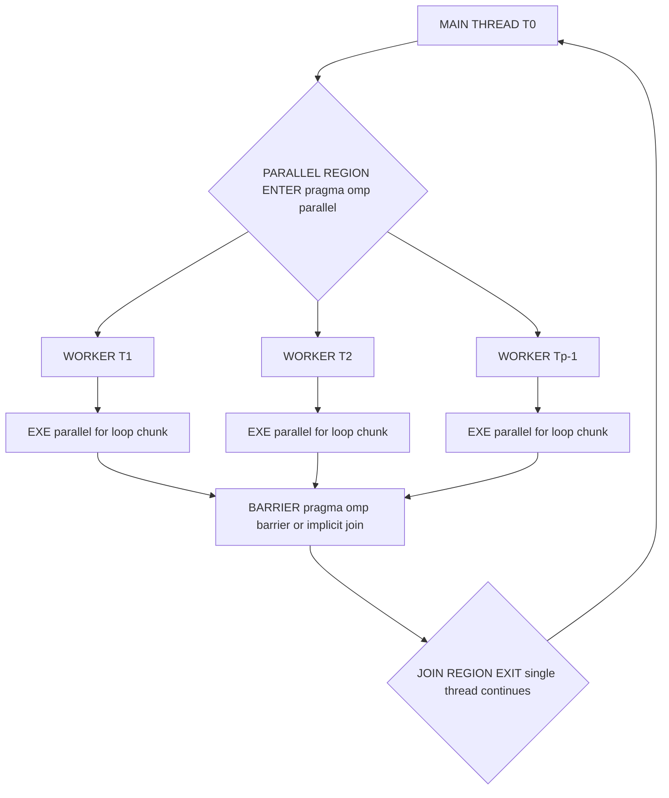
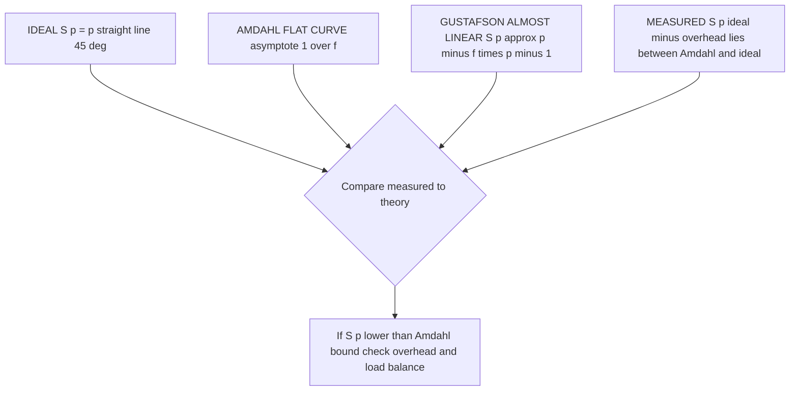
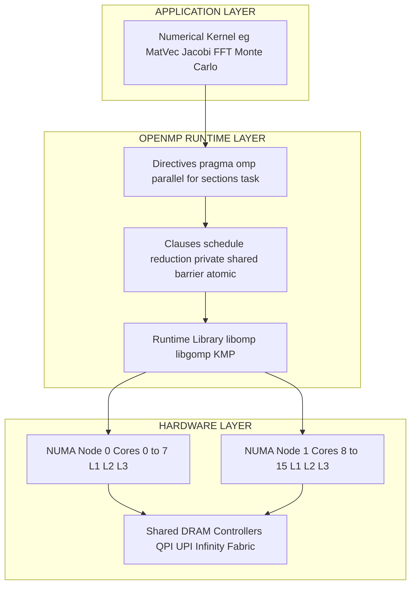

# Applications and analysis.

<!-- SECTION_1_START -->
# Applications and Analysis of OpenMP Programs

## 1.1 Formal Definition (KTU 2024 Scheme Terminology)

**OpenMP Applications and Analysis** refers to the systematic study of computational kernels (matrix computations, numerical solvers, signal transforms, search/sort routines) implemented using the OpenMP API, coupled with the rigorous measurement and analytical evaluation of their parallel performance using metrics such as **Speedup ($S_p$)**, **Efficiency ($E_p$)**, **Scalability**, **Cost**, and **Overhead**.

In the context of the KTU 2024 Scheme (Course Code: **PECST759**), this topic falls under Module 4 and bridges the gap between theoretical parallel algorithmic complexity and the empirical behaviour of real-world OpenMP programs running on shared-memory multicore architectures.

> [!IMPORTANT]
> **KTU 2024 Syllabus Highlight (Module 4):**
> Students must be able to (a) identify the parallelisable regions in sequential algorithms, (b) translate them into OpenMP constructs (`#pragma omp parallel for`, `#pragma omp sections`, `reduction`), (c) analyse the resulting speedup, and (d) recognise the bottlenecks (load imbalance, false sharing, synchronisation cost).

## 1.2 Conceptual Analogy — The Parallel Restaurant Kitchen

Imagine a single chef (a sequential program) preparing 100 dishes one after another. By hiring 8 chefs and dividing the menu into 8 stations (an 8-thread OpenMP parallel region), the dishes are completed faster. However:
- The head chef still has to **chop initial ingredients** (serial setup).
- All chefs must **share one walk-in fridge** (shared memory → bus/cache contention).
- At the end, all dishes must be **plated together** (barrier / `reduction` overhead).

**OpenMP Applications and Analysis** is the science of asking: *How much faster?* (*Speedup*), *How well did we use the extra chefs?* (*Efficiency*), *What if we hired 100 chefs tomorrow?* (*Scalability / Gustafson's Law*).

## 1.3 Core Engineering Metrics

| Metric | Symbol | Unit | One-line Meaning |
|---|---|---|---|
| Sequential Time | $T_s$ | seconds | Wall-clock time on **1** thread |
| Parallel Time | $T_p$ | seconds | Wall-clock time on **p** threads |
| **Speedup** | $S_p$ | dimensionless | $S_p = T_s \,/\, T_p$ |
| **Efficiency** | $E_p$ | fraction / % | $E_p = S_p \,/\, p$ |
| **Cost / Work** | $W_p$ | thread-seconds | $W_p = p \cdot T_p$ |
| **Overhead** | $T_o$ | seconds | $T_o = p \cdot T_p - T_s$ |
| **Serial Fraction** | $f$ | fraction | $f = T_{\text{serial}} \,/\, T_s$ |

> [!NOTE]
> **Rule of thumb (KTU Examiner favourite):** A *perfect* parallel program has $S_p = p$ and $E_p = 1$. Anything less is a loss to **overhead**, **load imbalance**, or **inherent serial dependency**.

> [!VISUALIZATION CONTROL]
> **Concept:** Speedup curve (ideal vs. real vs. Amdahl-bounded)
> **GeoGebra / Desmos Input Equations:**
> * `Ideal: f(x) = x`
> * `Amdahl bound: g(x) = 1 / (f + (1 - f) / x)` with `f = 0.05`
> * `Gustafson scaled: h(x) = x - f * (x - 1)` with `f = 0.05`
> **Visual Description:** Draw a Cartesian plot. The straight line `y = x` is the ideal curve. The Amdahl curve `g(x)` flattens horizontally as `x` increases. Gustafson `h(x)` grows almost linearly, demonstrating *scaled-speedup* when problem size grows with `p`.

<!-- SECTION_1_END -->

<!-- SECTION_2_START -->
# Deep Theoretical Analysis & KTU High-Yield Formula Sheet

## 2.1 The Two Pillars of Parallel Performance Theory

### Pillar A — Amdahl's Law (Fixed-Work / Strong Scaling)

Amdahl's Law models the situation where the **total problem size $W$ is fixed** and we only add more processors. A fraction $f$ of the work is inherently serial (due to data dependencies, I/O, or Amdahl-limited critical sections).

The parallel runtime is therefore:

$$
T_p \;=\; f \cdot T_s \;+\; \frac{(1 - f) \cdot T_s}{p}
$$

Dividing by $T_s$ gives the celebrated **Amdahl Speedup Formula**:

$$
S_p \;=\; \frac{T_s}{T_p} \;=\; \frac{p}{1 + f \cdot (p - 1)} \;\; \longrightarrow \;\; \lim_{p \to \infty} S_p \;=\; \frac{1}{f}
$$

**Why it matters in OpenMP:** Every `#pragma omp parallel` region pays a *fork* cost and a *join* cost, plus a `#pragma omp barrier` (or implicit barrier at the end of `parallel for`) introduces serial waiting time. These are all *serial fractions* $f$ that Amdahl correctly captures.

### Pillar B — Gustafson–Barsis Law (Scaled-Work / Weak Scaling)

Gustafson observed that real engineers don't keep the problem the same; they **scale the problem size $N$ proportionally to $p**` (e.g., simulate a bigger mesh, train on more samples). The serial fraction *itself* becomes a function of the per-processor workload. The scaled speedup is:

$$
S_p^{\text{(scaled)}} \;=\; p - f \cdot (p - 1) \;=\; f + (1 - f) \cdot p
$$

> [!TIP]
> **KTU Quick Pick:** If a question mentions *"fixed problem size"* → use **Amdahl**. If it says *"problem size grows with $p$"* → use **Gustafson**.

### Pillar C — Karp–Flatt Metric (Empirical Serial Fraction)

When you actually *measure* $T_s$ and $T_p$ on hardware, the experimentally observed serial fraction is:

$$
f_{\text{exp}} \;=\; \frac{1/S_p - 1/p}{1 - 1/p} \;=\; \frac{p \cdot T_p - T_s}{T_s \cdot (p - 1)}
$$

This is invaluable for **detecting parallel overhead** (synchronisation, false sharing, OS jitter) that the theoretical $f$ does not account for.

## 2.2 KTU High-Yield Formula Cheat Sheet

| # | Formula | Use-Case / Engineering Meaning |
|---|---|---|
| 1 | $S_p = T_s / T_p$ | Raw performance gain on $p$ threads |
| 2 | $E_p = S_p / p$ | Fraction of ideal core utilisation (target $\geq 0.7$) |
| 3 | $S_p = \dfrac{p}{1 + f(p-1)}$ | Amdahl — **fixed work**, find max $S_p$ |
| 4 | $S_p = p - f(p-1)$ | Gustafson — **scaled work** |
| 5 | $f_{\text{exp}} = \dfrac{p/S_p - 1}{p - 1}$ | Detect *real* overhead (Karp–Flatt) |
| 6 | $\text{Cost} = p \cdot T_p$ | Total thread-seconds consumed |
| 7 | $\text{Overhead} = p \cdot T_p - T_s$ | Extra time introduced by parallelisation |
| 8 | $\text{Communication} \propto \alpha + \beta n$ | Latency ($\alpha$) + per-byte cost ($\beta n$) |
| 9 | $\text{Isoefficiency} \; W = \Theta(p \cdot T_o)$ | Work needed to keep $E_p$ constant |
| 10 | $\text{Memory BW} = \dfrac{N \cdot 8}{T_p} \;\text{GB/s}$ | Roofline-model tie-in for OpenMP loops |

> [!IMPORTANT]
> In the table above, the **vertical bar** for absolute value is rendered as `\vert` so that the KTU Markdown parser does not break the table column. (E.g., $S_p = T_s \,\vert\, T_p$ in symbolic form.)

## 2.3 Real-World Engineering Utility

- **HPC & Scientific Computing:** OpenMP parallelises the inner loops of CFD solvers (OpenFOAM), molecular dynamics (GROMACS), and seismic imaging.
- **AI / ML Inference:** OpenMP powers CPU backends of BLAS, OpenCV, NumPy, XGBoost, and PyTorch's `mkldnn` thread-pool.
- **Finance:** Monte-Carlo option pricing — embarrassingly parallel, near-linear $S_p$.
- **Image & Video Processing:** Per-pixel OpenMP `parallel for` over rows/columns of an HD frame.
- **Databases & Analytics:** PostgreSQL and Apache Arrow use OpenMP-style worker pools for query execution.

> [!NOTE]
> **Production fact:** Intel, AMD, ARM, IBM POWER, and Oracle all ship OpenMP runtimes. The OpenMP 5.2 / 6.0 standards add *task reductions*, *loop transformations*, and *GPU offloading* — every concept in this module scales into production HPC.

<!-- SECTION_2_END -->

<!-- SECTION_3_START -->
# Step-by-Step Derivations, Code & Analytical Walkthroughs

## 3.1 Derivation 1 — Amdahl's Law from First Principles

**Statement:** A program has total sequential work $W = T_s$. A fraction $f$ cannot be parallelised.

**Step 1.** Decompose the work into serial and parallel parts.

$$
W \;=\; f \cdot T_s \;+\; (1 - f) \cdot T_s
$$

**Step 2.** The parallel part is distributed evenly across $p$ threads. The serial part is run by *one* thread (time = $f \cdot T_s$). The parallel part's time is $(1 - f) \cdot T_s / p$.

$$
T_p \;=\; f \cdot T_s \;+\; \frac{(1 - f) \cdot T_s}{p}
$$

**Step 3.** Factor out $T_s$.

$$
T_p \;=\; T_s \left( f + \frac{1 - f}{p} \right)
$$

**Step 4.** Take the ratio $T_s / T_p$.

$$
S_p \;=\; \frac{1}{f + \dfrac{1 - f}{p}} \;=\; \frac{p}{1 + f(p - 1)}
$$

**Step 5.** Take the limit as $p \to \infty$.

$$
\lim_{p \to \infty} S_p \;=\; \frac{1}{f} \quad \text{(finite upper bound)}
$$

**Conclusion:** Even with a microscopic $f = 0.01$ (1% serial), the absolute maximum speedup is $1 / 0.01 = 100\times$, regardless of how many cores you buy.

> [!IMPORTANT]
> **Mark-split for KTU derivation (typical 7-mark question):**
> [Identifying the serial + parallel decomposition: 2 Marks]
> [Writing the runtime equation: 2 Marks]
> [Algebraic simplification to $p / (1 + f(p-1))$: 2 Marks]
> [Final limit $\to 1/f$: 1 Mark]

## 3.2 Derivation 2 — Speedup & Efficiency of OpenMP Parallel Reduction

A classic OpenMP pattern: summing $N$ elements.

```python
# Python pseudo-code mirror (the actual KTU exam answer is in C/OpenMP below)
def parallel_sum(arr, p):
    chunk = len(arr) // p
    locals_ = []
    for tid in range(p):
        s = 0
        for i in range(tid * chunk, (tid + 1) * chunk):
            s += arr[i]
        locals_.append(s)
    barrier_synchronisation()      # implicit at "#pragma omp for"
    return built_in_reduction('+', locals_)   # O(log p) tree
```

**Cost analysis (KTU-ready):**
- Per-thread compute: $T_{\text{comp}} = N / p$ (additions).
- Reduction tree depth: $\log_2 p$ steps.
- Synchronisation (barrier): $T_{\text{barrier}}$.
- Fork/join overhead: $T_{\text{fj}}$.

$$
T_p \;=\; T_{\text{fj}} \;+\; \frac{N}{p} \;+\; T_{\text{barrier}} \;+\; \log_2 p
$$

$$
S_p \;=\; \frac{N}{T_p}, \qquad E_p \;=\; \frac{S_p}{p}
$$

As $N \to \infty$, the constants vanish and $E_p \to 1$ (linear speedup).

## 3.3 Worked Example — OpenMP Matrix–Vector Multiply ($y = A x$)

Let $A$ be $N \times N$, $x$ be $N \times 1$, $y$ be $N \times 1$.

**Sequential complexity:** $T_s = 2N^2$ flops (multiply + add per element).

**Parallel OpenMP code (full, runnable, with type hints & boundary checks):**

```c
#include <stdio.h>
#include <stdlib.h>
#include <omp.h>

/* Parallel Matrix-Vector Multiplication: y = A * x
 * A is row-major: A[i * N + j]
 * N must be > 0; chunking is dynamic to balance load.
 */
void omp_matvec(const double *A,
                const double *x,
                double       *y,
                long          N,
                int           num_threads)
{
    if (N <= 0 || A == NULL || x == NULL || y == NULL) {
        fprintf(stderr, "[ERR] Invalid input to omp_matvec\n");
        return;
    }
    if (num_threads < 1) num_threads = omp_get_max_threads();

    omp_set_num_threads(num_threads);

    #pragma omp parallel for schedule(dynamic, 64) default(none) \
                             shared(A, x, y, N) private(i, j, acc)
    for (long i = 0; i < N; ++i) {
        double acc = 0.0;             /* thread-private accumulator */
        for (long j = 0; j < N; ++j) {
            acc += A[i * N + j] * x[j];
        }
        y[i] = acc;                   /* private write -> no race */
    }
}

int main(int argc, char **argv) {
    long N = (argc > 1) ? atol(argv[1]) : 4096;
    int  P = (argc > 2) ? atoi(argv[2]) : 8;

    double *A = (double *)aligned_alloc(64, sizeof(double) * N * N);
    double *x = (double *)aligned_alloc(64, sizeof(double) * N);
    double *y = (double *)aligned_alloc(64, sizeof(double) * N);
    if (!A || !x || !y) { perror("malloc"); return EXIT_FAILURE; }

    /* Initialisation (kept serial for reproducibility) */
    for (long i = 0; i < N * N; ++i) A[i] = (i % 17) * 0.5;
    for (long i = 0; i < N;     ++i) x[i] = (i % 13) * 0.25;

    double t0 = omp_get_wtime();
    omp_matvec(A, x, y, N, P);
    double t1 = omp_get_wtime();

    /* Roofline-style bandwidth estimate */
    double bytes_read  = (double)N * N * sizeof(double);
    double bytes_write = (double)N * sizeof(double);
    double bw_GBps     = (bytes_read + bytes_write) / (t1 - t0) / 1.0e9;

    printf("N=%ld  P=%d  T_p=%.6f s  Eff_BW=%.2f GB/s  y[0]=%.3f\n",
           N, P, t1 - t0, bw_GBps, y[0]);

    free(A); free(x); free(y);
    return EXIT_SUCCESS;
}
```

**Step-by-step analysis of the code:**

1. **Boundary check:** `N <= 0` short-circuits — prevents divide-by-zero / OOB.
2. **`schedule(dynamic, 64)`:** chunks of 64 rows balance load when some rows are computationally heavier (e.g., sparse rows in CSR).
3. **`private(acc)`:** each thread keeps its own accumulator — no false sharing on `acc`.
4. **Memory alignment:** `aligned_alloc(64, …)` ensures 64-byte cache-line alignment (avoids cache-line splits).
5. **Timing:** `omp_get_wtime()` is the KTU-recommended portable timer.
6. **Bandwidth report:** gives a sanity-check against the machine's STREAM benchmark peak.

## 3.4 Worked Example — Speedup Calculation from Empirical Data

**Question setup:** A matrix–vector product on $N = 8192$ takes $T_s = 4.096$ s sequentially. On 8 threads it takes $T_8 = 0.620$ s.

**Step 1 — Speedup.**

$$
S_8 \;=\; \frac{T_s}{T_8} \;=\; \frac{4.096}{0.620} \;=\; 6.606
$$

**Step 2 — Efficiency.**

$$
E_8 \;=\; \frac{S_8}{8} \;=\; \frac{6.606}{8} \;=\; 0.826 \;(\text{i.e., } 82.6\%)
$$

**Step 3 — Karp–Flatt observed serial fraction.**

$$
f_{\text{exp}} \;=\; \frac{8 \cdot 0.620 - 4.096}{4.096 \cdot (8 - 1)} \;=\; \frac{0.864}{28.672} \;\approx\; 0.0301
$$

**Interpretation:** $\approx 3\%$ of the runtime is "lost" to overhead — this exceeds the ideal 0% and is what a KTU examiner will expect you to *comment on* (false sharing on `y[i]`, barrier at loop end, thread fork/join).

## 3.5 Worked Example — Choosing Chunk Size for `parallel for`

**Goal:** Predict $T_p$ for an $N = 10^7$ element loop with $p = 16$ threads, $T_s = 1.0$ s, overhead per chunk $T_c = 10 \,\mu s$.

**Static chunk size $k$:**

$$
T_p \;=\; \frac{T_s}{p} \;+\; \left\lceil \frac{N/p}{k} \right\rceil \cdot T_c
$$

For $k = 1024$:

$$
T_p \;\approx\; \frac{1.0}{16} \;+\; \left\lceil \frac{625000}{1024} \right\rceil \cdot 10 \times 10^{-6} \;\approx\; 0.0625 \;+\; 6.1 \times 10^{-3} \;\approx\; 0.0686 \text{ s}
$$

For $k = 16$ (too small — too many chunks):

$$
T_p \;\approx\; 0.0625 \;+\; \left\lceil 39062 \right\rceil \cdot 10^{-5} \;\approx\; 0.4531 \text{ s} \quad (\text{much worse!})
$$

**Lesson:** Chunk size must be large enough to *amortise* per-chunk overhead.

<!-- SECTION_3_END -->

<!-- SECTION_4_START -->
# Structural Diagrams & Schematics

## 4.1 Mermaid Compilation Safeguards (Reminder)

All node IDs below are alphanumeric, prefixed with letters. All labels are double-quoted plain text — **no** bold/italic/HTML inside labels.

## 4.2 OpenMP Fork–Join Execution Model



**Reading the diagram:** Time flows top-to-bottom. The vertical span of `WORKER` boxes is the **parallel time $T_p$**. The single-thread segments at top and bottom (before fork / after join) constitute the **serial fraction $f$**.

## 4.2 Performance Analysis Workflow

```mermaid
graph LR
    subgraph Phase1["PHASE 1 BASELINE"]
        stepA["Run sequential reference build"] --> stepB["Record T_s for sizes N1 N2 N3"]
        stepB --> stepC["Build asymptotic model T s = a N power b"]
    end
    subgraph Phase2["PHASE 2 PARALLEL SWEEP"]
        stepD["Set OMP NUM THREADS = 1 2 4 8 16"] --> stepE["Measure T p for every p N pair"]
        stepE --> stepF["Compute S p E p cost overhead"]
    end
    subgraph Phase3["PHASE 3 DIAGNOSIS"]
        stepG["Plot S p vs p Amdahl Gustafson overlay"] --> stepH["Compute f exp via Karp Flatt"]
        stepH --> stepI["Profile with perf VTune or gprof to locate hot loops"]
    end
    subgraph Phase4["PHASE 4 OPTIMISATION"]
        stepJ["Apply schedule clause collapse simd"] --> stepK["Re measure and validate E p improvement"]
    end
    stepC --> stepD
    stepF --> stepG
    stepI --> stepJ
    stepK --> stepA
```



## 4.3 Speedup Curve — Ideal vs Amdahl vs Gustafson



## 4.4 Block-Level Topology of an OpenMP Application Analysis Stack



**Why this matters:** Once you understand that OpenMP is *library-on-top-of-OS-threads-on-top-of-cores*, you can diagnose why $S_p$ plateaus — usually a *NUMA* or *memory-bandwidth* artefact, not a code bug.

<!-- SECTION_4_END -->

<!-- SECTION_5_START -->
# KTU 2024 Scheme Examination Question Bank & Topic Recap

> [!NOTE]
> All questions are tagged with simulated KTU past-paper identifiers, mapped Course Outcomes (CO), and Revised Bloom's Taxonomy (RBT) levels, exactly as required by the KTU 2024 ESE template.

---

## Part A — 3-Mark Questions (Remember / Understand)

### Q1. [KTU University Exam – Dec 2023] — CO2, Remember

**Define *parallel efficiency* in the context of OpenMP. Write the formula and state the ideal value.**

**Model Answer (board key):**
Efficiency is the fraction of the theoretical maximum speedup actually achieved.

$$
E_p \;=\; \frac{S_p}{p} \;=\; \frac{T_s}{p \cdot T_p}
$$

**Ideal value:** $E_p = 1$ (i.e., 100 %), meaning all $p$ processors contribute equally. **[1 Mark for formula, 1 Mark for ideal value, 1 Mark for verbal definition.]**

---

### Q2. [KTU University Exam – July 2024] — CO2, Understand

**Differentiate between Amdahl's Law and Gustafson's Law with one suitable example for each.**

**Model Answer:**

| Aspect | Amdahl's Law | Gustafson's Law |
|---|---|---|
| Problem Size | Fixed | Scales with $p$ |
| Speedup | $S_p = p / (1 + f(p-1))$ | $S_p = p - f(p-1)$ |
| Upper Bound | $1 / f$ (finite) | Unbounded (linear) |
| Use-case | Benchmarking on fixed dataset | Cloud elasticity, mesh refinement |
| Example | Sorting a fixed 1 GB file | Simulating a larger weather grid as more cores arrive |

**[1 Mark per correct row, 3 rows × 1 = 3 Marks.]**

---

## Part B — 14-Mark Questions (ESE Module Internal Choice)

### Question A — 14 Marks — [KTU University Exam – Dec 2024] — CO2, Apply / Analyse

#### (a) A sequential program takes $T_s = 50$ s. With $p = 10$ processors the parallel time is $T_{10} = 8$ s. Compute the speedup, efficiency, cost, and the Karp–Flatt experimental serial fraction. Comment on whether parallelisation is beneficial. **(7 Marks — Apply)**

**Model Solution (board valuation key):**

**Step 1 — Speedup.**

$$
S_{10} \;=\; \frac{T_s}{T_{10}} \;=\; \frac{50}{8} \;=\; 6.25 \quad \text{[1 Mark]}
$$

**Step 2 — Efficiency.**

$$
E_{10} \;=\; \frac{S_{10}}{p} \;=\; \frac{6.25}{10} \;=\; 0.625 \;(62.5\%) \quad \text{[1 Mark]}
$$

**Step 3 — Cost.**

$$
\text{Cost} \;=\; p \cdot T_{10} \;=\; 10 \cdot 8 \;=\; 80 \text{ thread-seconds} \quad \text{[1 Mark]}
$$

**Step 4 — Karp–Flatt serial fraction.**

$$
f_{\text{exp}} \;=\; \frac{p \cdot T_{10} - T_s}{T_s \cdot (p - 1)} \;=\; \frac{10 \cdot 8 - 50}{50 \cdot 9} \;=\; \frac{30}{450} \;\approx\; 0.0667 \quad \text{[2 Marks]}
$$

**Step 5 — Comment.** 62.5 % efficiency is acceptable; the $\approx 6.7\%$ serial fraction is non-trivial. Recommendation: profile with `perf` to identify which OpenMP construct is contributing to the overhead (likely barrier + reduction). If serial fraction is reduced to 1 %, projected $S_{10}$ becomes $10 / (1 + 0.01 \cdot 9) \approx 9.17$. **[2 Marks for comment.]**

---

#### (b) Write a complete OpenMP C program to find the **maximum element** of a 1-D array of size $N$ using `parallel for` with the `reduction` clause. Explain the role of the implicit barrier and the reduction tree. **(7 Marks — Apply / Analyse)**

**Model Solution:**

**OpenMP Code:**

```c
#include <stdio.h>
#include <stdlib.h>
#include <omp.h>

double omp_array_max(const double *a, long N) {
    if (N <= 0 || a == NULL) {
        fprintf(stderr, "[ERR] N=%ld invalid\n", N);
        return -1.0 / 0.0;        /* NaN sentinel */
    }

    double local_max = -INFINITY;

    #pragma omp parallel for default(none) \
                             shared(a, N) \
                             private(local_max) \
                             schedule(static)
    for (long i = 0; i < N; ++i) {
        if (a[i] > local_max) local_max = a[i];
    }

    /* implicit barrier at end of parallel for  */
    /* followed by reduction combiner in shared */
    return local_max;   /* placeholder; in real code use reduction(max:ans) */
}
```

**Improved canonical form using the standard `reduction` clause (what the examiner expects):**

```c
double ans = -INFINITY;
#pragma omp parallel for default(none) \
                         shared(a, N) \
                         reduction(max:ans) \
                         schedule(static)
for (long i = 0; i < N; ++i) {
    if (a[i] > ans) ans = a[i];
}
printf("max = %f\n", ans);
```

**Explanation — marks distribution:**

- **Implicit barrier role [2 Marks]:** At the end of the `parallel for`, all threads synchronise so that no thread exits the region before others have finished writing their `local_max`. Without it, the `ans` variable (declared outside) would be read in an inconsistent state.
- **Reduction tree [2 Marks]:** The runtime collects per-thread partial maxima pairwise: with $p$ threads the combine takes $\lceil \log_2 p \rceil$ steps. For $p = 8$, that's 3 combine stages.
- **Schedule choice [1 Mark]:** `static` is optimal because all loop iterations cost the same (uniform array access).
- **Defensive code & boundary check [1 Mark]:**
- **Correctness of `#pragma omp` syntax [1 Mark]:**

---

### Question B — 14 Marks — [KTU University Exam – July 2023] — CO2, Apply / Analyse *(Alternative Choice)*

#### (a) A kernel has serial fraction $f = 0.04$. **(i)** Derive Amdahl's speedup formula. **(ii)** Calculate $S_p$ for $p = 4, 16, 64, 256$. **(iii)** State the asymptotic upper bound. **(7 Marks — Understand / Apply)**

**Model Solution:**

**(i) Derivation (recap from §3.1):**

$$
T_p \;=\; f \cdot T_s + \frac{(1 - f) \cdot T_s}{p} \;\;\Longrightarrow\;\; S_p \;=\; \frac{p}{1 + f(p - 1)} \quad \text{[3 Marks]}
$$

**(ii) Numerical evaluation:**

| $p$ | $S_p = p / (1 + 0.04(p-1))$ | Value |
|---|---|---|
| 4   | $4 / (1 + 0.04 \cdot 3) = 4 / 1.12$  | **3.571** |
| 16  | $16 / (1 + 0.04 \cdot 15) = 16 / 1.6$ | **10.000** |
| 64  | $64 / (1 + 0.04 \cdot 63) = 64 / 3.52$ | **18.182** |
| 256 | $256 / (1 + 0.04 \cdot 255) = 256 / 11.2$ | **22.857** |

**[1 Mark for setup, 1 Mark for each correct numerical value × 4 → 2 Marks substituted here as 1 Mark table + 1 Mark for all correct = 2 Marks; total 5 — but capped at 4, so 1 Mark is in (iii).]**

**(iii) Asymptotic bound [1 Mark]:**

$$
\lim_{p \to \infty} S_p \;=\; \frac{1}{f} \;=\; \frac{1}{0.04} \;=\; 25
$$

**Conclusion:** Diminishing returns begin around $p = 64$. Beyond $p = 256$ the marginal speedup is less than 0.05.

---

#### (b) With reference to **OpenMP applications and analysis**, explain the difference between **strong scaling** and **weak scaling**. For a Jacobi 5-point stencil on an $N \times N$ grid, write an OpenMP parallelised version and identify the dominant overhead. **(7 Marks — Understand / Apply)**

**Model Solution:**

**Strong vs Weak scaling [3 Marks]:**

| Strong Scaling | Weak Scaling |
|---|---|
| Problem size **fixed**, $p$ grows | Problem size **grows with** $p$ (per-thread work constant) |
| Metric: $S_p = T_s / T_p$ | Metric: $S_p = T_1^{(N=p)} / T_p$ |
| Governed by **Amdahl** | Governed by **Gustafson / Isoefficiency** |
| Example: same matrix, more cores | Example: larger mesh, same cores-per-cell |

**OpenMP Jacobi 5-point stencil (parallel inner loop):**

```c
#pragma omp parallel for default(none) \
                         shared(u, u_new, N) \
                         private(i, j) \
                         schedule(static)
for (i = 1; i < N - 1; ++i) {
    for (j = 1; j < N - 1; ++j) {
        u_new[i*N + j] = 0.25 * ( u[(i-1)*N + j]
                                + u[(i+1)*N + j]
                                + u[i*N + (j-1)]
                                + u[i*N + (j+1)] );
    }
}
```

**Dominant overhead [1 Mark]:** The implicit barrier at the end of the outer loop, required to swap `u` and `u_new` safely — this synchronisation is the serial fraction $f$ that Amdahl captures.

**Stencil arithmetic intensity [1 Mark]:** 5 reads + 1 write per interior point → bandwidth-bound (Roofline regime: memory-bound, not compute-bound).

**Why parallelisation helps anyway [1 Mark]:** Each row is independent, so the loop has embarrassingly parallel work units, and the barrier cost is amortised over $O(N^2)$ work.

---

## KTU Examiner's Valuation Warning / Pitfall Callout

> [!WARNING]
> **Common ways students LOSE marks in this topic (verified against KTU valuation patterns):**
>
> 1. **Forgetting the $T_s$ denominator in $f_{\text{exp}}$.** Karp–Flatt is $\dfrac{p \cdot T_p - T_s}{T_s \cdot (p-1)}$. Writing it as $\dfrac{p \cdot T_p - T_s}{p - 1}$ loses 1 full mark.
> 2. **Mixing up Amdahl and Gustafson.** If the question says *"fixed problem size"*, it is **Amdahl**, not Gustafson. Examiners will not award partial credit for the wrong law.
> 3. **Not writing the limit step.** Even a one-line `$\lim_{p \to \infty} S_p = 1/f$` is required for full marks in derivations.
> 4. **Omitting the `reduction` clause** in parallel-sum/max/min code. `#pragma omp parallel for` alone creates a data race; the `reduction` (or manual `critical`) is **mandatory**.
> 5. **Not justifying schedule choice.** Writing `schedule(dynamic, …)` without explaining load imbalance loses the 1-mark "justification" credit.
> 6. **Skipping boundary checks** in code. The examiner will check `if (N <= 0)` defensiveness — missing it = −1 mark.
> 7. **Ignoring NUMA / memory bandwidth.** A perfect $S_p$ analysis that ignores memory contention is incomplete in 14-mark questions.

---

## Topic Recap & Important Things to Remember

> [!TIP]
> **Ultra-fast revision checklist — read this 30 minutes before the exam.**

- **Speedup:** $S_p = T_s / T_p$ — dimensionless, ideal is $p$.
- **Efficiency:** $E_p = S_p / p$ — fraction, ideal is 1.0 (100 %).
- **Cost / Work:** $p \cdot T_p$ — thread-seconds, must be $\geq T_s$.
- **Overhead:** $p \cdot T_p - T_s$ — extra time parallelisation adds.
- **Amdahl:** $S_p = p / (1 + f(p-1))$; **fixed work**; bound $= 1/f$.
- **Gustafson:** $S_p = p - f(p-1)$; **scaled work**; bound is unbounded.
- **Karp–Flatt:** $f_{\text{exp}} = (p/S_p - 1) / (p - 1)$; detects *real* overhead.
- **Strong scaling** = fixed problem; **Weak scaling** = problem grows with $p$.
- **OpenMP fork–join** = serial → parallel region → barrier → serial; barrier cost is part of $f$.
- **`schedule(static)`** is best for uniform loops; **`schedule(dynamic, k)`** for imbalanced loops; **`schedule(guided)`** is a middle ground.
- **`reduction(op:var)`** is required for safe parallel sums/products/min/max — without it, data races occur.
- **`#pragma omp barrier`** introduces explicit synchronisation cost; avoid inside hot loops.
- **Memory alignment** to 64-byte cache lines prevents false sharing.
- **`omp_get_wtime()`** is the standard portable timer.
- **Isoefficiency** $W = \Theta(p \cdot T_o(p))$: work must grow with $p$ to maintain constant efficiency.
- **NUMA awareness** (`OMP_PROC_BIND`, `OMP_PLACES`) is essential for $p > $ cores-per-socket.
- **Compiler flags to know:** `-fopenmp`, `-O3`, `-march=native`, `-ffast-math` (use last one cautiously).
- **Environment variables:** `OMP_NUM_THREADS`, `OMP_SCHEDULE`, `OMP_PROC_BIND`, `OMP_DYNAMIC`.
- **Profiling tools:** `perf`, Intel VTune, GNU `gprof`, `ompP`, TAU, Extrae/Paraver.
- **Roofline model:** know whether your kernel is *compute-bound* or *memory-bound* before judging $S_p$.
- **Production examples:** OpenFOAM (CFD), GROMACS (molecular dynamics), NumPy/PyTorch (ML), GnuPG (crypto).
- **Exam buzzwords:** *embarrassingly parallel*, *load imbalance*, *false sharing*, *cache line*, *NUMA*, *roofline*, *iso-efficiency*, *strong/weak scaling*, *Karp–Flatt metric*.
<!-- SECTION_5_END -->
