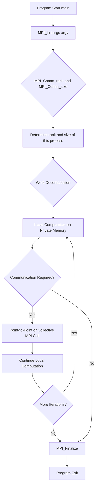
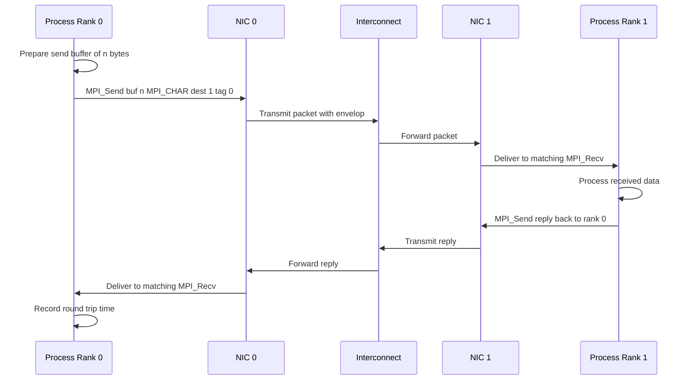
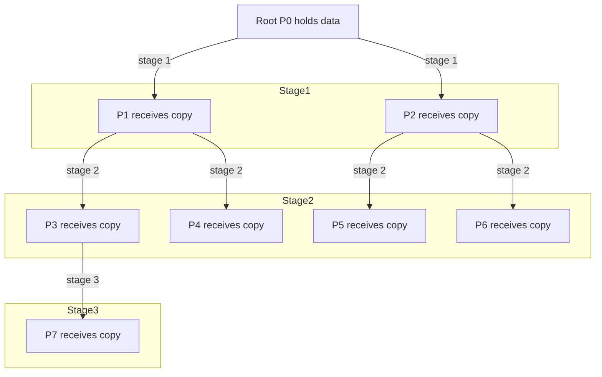
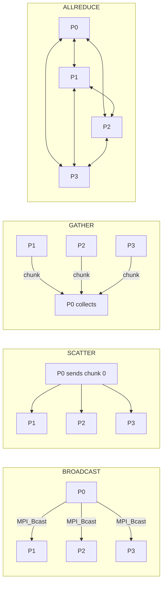
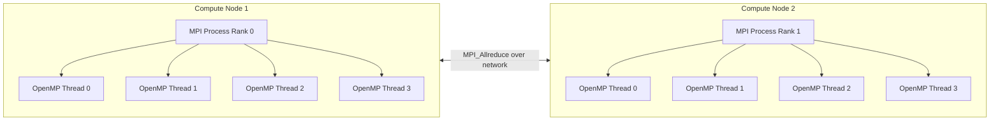
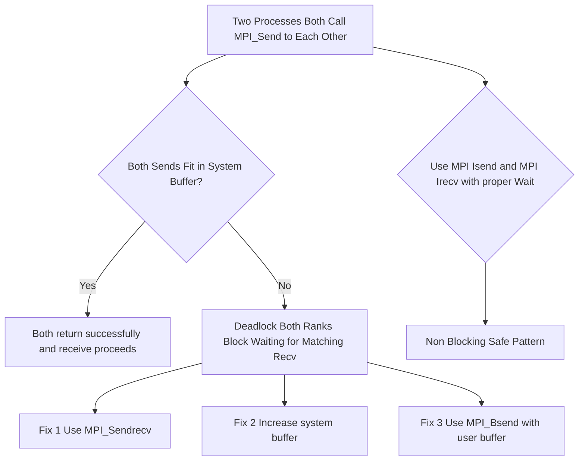

# Message passing model and MPI basics

<!-- SECTION_1_START -->
# Message Passing Model and MPI Basics

## 1.1 Formal Definition (KTU 2024 Syllabus Terminology)

> [!IMPORTANT]
> **Message Passing Model (MPM):** A parallel programming paradigm in which concurrent processes executing on distributed-memory processing elements (PEs) cooperate and synchronize by **explicitly sending and receiving messages** over a communication network. Each process owns a private, non-shared local memory and accesses remote data solely through message exchange primitives.

> [!IMPORTANT]
> **Message Passing Interface (MPI):** A **standardized, language-independent communication library specification** (MPI Forum, MPI-1.0 → MPI-4.0) that defines the syntax, semantics, and routines for implementing the message passing model in languages such as **C, C++, and Fortran**. It is the de-facto industry and academic standard for distributed-memory parallel programming.

The Message Passing Model assumes the **Multiple Instruction Multiple Data (MIMD)** class of parallelism under the **distributed-memory architecture** (also called the *multicomputer* model). Every processing element has:

1. Its own **CPU** (control unit + ALU + registers).
2. Its own **local memory** (private address space, inaccessible to other PEs).
3. A **Network Interface Controller (NIC)** for transmitting/receiving data packets.

Coordination is achieved by **explicit** function calls such as `MPI_Send`, `MPI_Recv`, and `MPI_Bcast` — there is **no implicit shared memory**.

---

## 1.2 Intuitive Analogy

> [!NOTE]
> **Analogy — The Postal Network of Independent Cities**
>
> Imagine **five independent cities**, each with its own private library, mayor, and treasury. No city can walk into another city's library. The only way to borrow a book, share a tax record, or announce a new law is to **write a letter, address it, and post it** through a courier service. The *cities* are **MPI processes**; the *libraries* are **local memories**; the *courier service* is the **interconnection network**; and the *postal rules* (envelope format, priority, return-receipt) are the **MPI protocol**.

| Real-World Entity | Parallel Computing Counterpart |
|---|---|
| Independent City | MPI Process |
| Local Library | Local (Private) Memory |
| Letter / Parcel | Message |
| Post Office | Network Interface Card |
| Postal Address | Process Rank |
| Set of Cities in a State | Communicator (`MPI_COMM_WORLD`) |
| Registered Post | Synchronous Send (`MPI_Ssend`) |

---

## 1.3 Architectural Placement

> [!NOTE]
> **Hierarchy Reminder**
> The Message Passing Model is a **programming model**, NOT a hardware model. It can be implemented on:
> - **True distributed-memory hardware** (cluster of PCs, supercomputers like *PARAM Siddhi*, Cray).
> - **Shared-memory hardware** (multi-core SMP) by simulating separate processes — but this loses the benefit of true hardware sharing.
>
> By contrast, **OpenMP** is a shared-memory programming model suitable for **multithreading** on a single node.

---

## 1.4 Key Constants and Standard Metrics (KTU Board Favourites)

The following MPI constants are **standardized** and frequently appear in KTU examinations:

| Constant | Meaning |
|---|---|
| `MPI_COMM_WORLD` | Predefined **intracommunicator** containing **all** processes launched by `mpirun` |
| `MPI_ANY_SOURCE` | Wildcard matching **any sender rank** in a receive |
| `MPI_ANY_TAG` | Wildcard matching **any message tag** in a receive |
| `MPI_COMM_NULL` | Invalid / uninitialized communicator handle |
| `MPI_STATUS_IGNORE` | Sentinel value to skip status extraction |
| `MPI_PROC_NULL` | Dummy rank; sends/receives are **no-ops** (used for boundary elimination) |
| `MPI_CHAR`, `MPI_INT`, `MPI_FLOAT`, `MPI_DOUBLE` | **Predefined datatypes** for primitive types |

> [!IMPORTANT]
> **MPI Standard Defines Over 250 Functions.** KTU module-4 syllabus restricts scope to: `MPI_Init`, `MPI_Finalize`, `MPI_Comm_rank`, `MPI_Comm_size`, `MPI_Send`, `MPI_Recv`, `MPI_Bcast`, `MPI_Reduce`, `MPI_Gather`, `MPI_Scatter`, `MPI_Allreduce`, `MPI_Barrier`, and `MPI_Comm_split`.

---

## 1.5 Visualization Control

> [!VISUALIZATION CONTROL]
> **Concept:** Distributed-Memory Topology with MPI Ranks
> **Desmos Input (conceptual scatter):**
> * Process $P_0$ at $(0, 0)$
> * Process $P_1$ at $(1, 0)$
> * Process $P_2$ at $(0, 1)$
> * Process $P_3$ at $(1, 1)$
> **Visual Description:** A 2×2 grid of isolated nodes connected by labelled bidirectional links. Each node owns a private memory block drawn beside it. The message `MPI_Send` is shown as a labelled arrow crossing the network from sender to receiver.

---

<!-- SECTION_1_END -->

<!-- SECTION_2_START -->
# Deep Theoretical Analysis & KTU High-Yield Formula Sheet

## 2.1 Foundational Principles of the Message Passing Model

The Message Passing Model is governed by **three orthogonal design axes**:

### Axis 1 — Decomposition Strategy

The user-supplied problem $P$ is divided into $p$ sub-problems, one per process:
$$P \;\mapsto\; \{P_0, P_1, P_2, \dots, P_{p-1}\}$$

### Axis 2 — Mapping Strategy

Each sub-problem $P_i$ is **bound** to a process with rank $i$ on a physical processor. Mapping is a static decision in pure MPI (dynamic load-balancing requires `MPI_Comm_split` + master-worker logic).

### Axis 3 — Communication Strategy

Processes interact by exchanging **typed messages** structured as:
$$\text{Message} = \langle \text{Envelop}, \text{Payload} \rangle$$

| Envelop Field | Purpose |
|---|---|
| Source Rank | Sender's process ID |
| Destination Rank | Receiver's process ID |
| Communicator | Logical channel (`MPI_COMM_WORLD`, custom) |
| Tag | User-defined integer for message matching |
| Datatype | MPI type descriptor (`MPI_INT`, `MPI_DOUBLE`, derived) |

---

## 2.2 Blocking vs Non-Blocking Communication

> [!IMPORTANT]
> **Blocking Routines** return **only after** the local buffer can be safely reused. This does *not* mean the message has arrived — it may still be in transit.
>
> **Non-Blocking Routines** (`MPI_Isend`, `MPI_Irecv`) return **immediately**; a separate `MPI_Wait` / `MPI_Test` is required to confirm completion.

### 2.2.1 The Four Send Modes

| Send Variant | Returns When | Buffered? | Use Case |
|---|---|---|---|
| `MPI_Send` | Local buffer reusable | Standard mode (system decides) | General purpose |
| `MPI_Bsend` | Local buffer reusable + user buffer free to reuse | **Yes** (user provides buffer) | Deterministic buffering |
| `MPI_Ssend` | Receiver has **started** the matching receive | No | Tight synchronization |
| `MPI_Rsend` | Send **ready** — receiver must already be posting | No | Lowest overhead |
| `MPI_Isend` | Immediately (handle returned) | Non-blocking | Overlap comm. with comp. |

---

## 2.3 Collective Communication Primitives

> [!NOTE]
> **Collective operations involve ALL processes in a communicator.** They are implemented using optimized algorithms (binomial trees, Bruck, ring, Rabenseifner) and are almost always **faster** than hand-written point-to-point equivalents.

| Function | Communication Pattern | Purpose |
|---|---|---|
| `MPI_Bcast` | 1 → N | Distribute identical data from root to all |
| `MPI_Scatter` | 1 → N (chunks) | Send **distinct** chunk of array to each process |
| `MPI_Gather` | N → 1 (chunks) | Reverse of Scatter — collect chunks at root |
| `MPI_Allgather` | N → N | Gather then broadcast the result to all |
| `MPI_Reduce` | N → 1 | Apply reduction op (sum, max, min) at root |
| `MPI_Allreduce` | N → N | Reduce then broadcast the result |
| `MPI_Barrier` | — | Process synchronization — all wait at the gate |
| `MPI_Alltoall` | N → N (transpose) | Every process sends distinct data to every other |

---

## 2.4 KTU High-Yield Formula Sheet

> [!IMPORTANT]
> **Hockney Model of Communication Time** (favourite KTU 2-mark question):
> $$T_{comm}(n) = T_0 + \frac{n}{\beta}$$
> Where:
> - $T_0$ = **latency** (start-up time of the network, in seconds, typical InfiniBand $T_0 \approx 1$–$5\,\mu s$)
> - $n$ = number of bytes transmitted
> - $\beta$ = **bandwidth** (bytes/second, typical InfiniBand $\beta \approx 10$–$100\,\text{GB/s}$)

**Total parallel time for a computation split among $p$ processes:**
$$T_p = T_{comp}\left(\frac{N}{p}\right) + T_{comm}(n) + T_{sync}$$

**Speedup:**
$$S_p = \frac{T_1}{T_p}$$

**Efficiency:**
$$E_p = \frac{S_p}{p} = \frac{T_1}{p \cdot T_p}$$

**Iso-efficiency (condition for scalable parallel system):**
$$T_0 \le \frac{T_1}{p \cdot (p-1)} \quad\Longleftrightarrow\quad W = \Omega\!\left(p^2 \cdot T_0\right)$$

**Bandwidth–Latency product (Bounded buffer):** $B_{LP} = \beta \cdot T_0$

> **CRITICAL TABLE SYNTAX NOTE** — All absolute values below are written as $\vert x \vert$ (LaTeX) and not the literal pipe character to keep the table intact.

| # | Formula / Symbol | Meaning | Typical KTU Context |
|---|---|---|---|
| 1 | $T_{comm} = T_0 + n/\beta$ | Hockney communication model | 2-mark derivation |
| 2 | $S_p = T_1 / T_p$ | Speedup | 2-mark definition |
| 3 | $E_p = S_p / p$ | Efficiency | 2-mark definition |
| 4 | $W = \Omega(p^2 T_0)$ | Iso-efficiency workload | Module-end question |
| 5 | $p \cdot T_p = T_1 + p \cdot T_0$ | Constant-overhead parallel time | Amdahl-style sums |
| 6 | $m = \log_2 p$ | Stages of a binomial tree broadcast | Derivation of $T_{bc}$ |
| 7 | $T_{bc} = (m \cdot T_0) + (n \cdot m / \beta)$ | Broadcast time on binomial tree | Performance analysis |

---

## 2.5 Real-World Engineering Utility

| Application Domain | Role of MPI |
|---|---|
| **Weather & Climate Modelling** (e.g., WRF, CESM) | Domain decomposition of the atmosphere into $p$ patches, halos exchanged via `MPI_Sendrecv` |
| **Computational Fluid Dynamics (CFD)** (e.g., ANSYS Fluent, OpenFOAM) | Cell-based partitioning of the mesh, ghost-cell exchange |
| **Deep Learning Training** (Horovod, PyTorch DDP) | Ring-AllReduce of gradients across GPU nodes |
| **Genomics** (BLAST, Bowtie) | Database sharding — query each shard in parallel |
| **High-Performance Linpack (HPL)** | Linear algebra `pdgemm` / `pdgesv` calls on distributed matrices |
| **Search Engines** (Apache Solr, Elasticsearch) | Sharded index — each shard handled by one MPI-style worker |

---

<!-- SECTION_2_END -->

<!-- SECTION_3_START -->
# Step-by-Step Derivations and Code Implementation

## 3.1 Derivation 1 — Broadcast Time on a Binomial Tree

> [!IMPORTANT]
> **Theorem:** A broadcast of an $n$-byte message among $p$ processes arranged as a binomial tree takes time
> $$T_{bc} = m \cdot T_0 + \frac{n \cdot m}{\beta}, \quad \text{where } m = \lceil \log_2 p \rceil.$$

### Step-by-Step Derivation

**Step 1 — Identify the tree structure.**
A binomial tree of order $m$ has $2^m$ leaves. Hence to cover $p$ processes, $m = \lceil \log_2 p \rceil$ stages are required.

**Step 2 — Count communication stages.**
At stage $k$ (where $k = 1, 2, \dots, m$), the number of **simultaneously active senders** doubles:
$$\text{Active senders at stage } k = 2^{k-1}$$
$$\text{Receivers at stage } k = 2^{k-1}$$

**Step 3 — Compute time per stage.**
Each stage transmits the full $n$-byte payload:
$$T_{stage\_k} = T_0 + \frac{n}{\beta}$$

**Step 4 — Sum across all $m$ stages (communications overlap, not serialize).**
Since each receiver of stage $k$ becomes a sender of stage $k+1$, the stages are **sequential**, not parallel. Therefore:
$$T_{bc} = \sum_{k=1}^{m} T_{stage\_k} = \sum_{k=1}^{m}\left(T_0 + \frac{n}{\beta}\right) = m \cdot T_0 + \frac{n \cdot m}{\beta}$$

**Step 5 — Final boxed result.**
$$\boxed{\,T_{bc} = \lceil\log_2 p\rceil \cdot T_0 + \frac{n \cdot \lceil\log_2 p\rceil}{\beta}\,}$$

> **Why this matters:** KTU asks: *"Why is `MPI_Bcast` faster than a hand-coded chain of `MPI_Send`/`MPI_Recv`?"* — Answer: the binomial tree reduces the **diameter** from $(p-1)$ stages to $\log_2 p$ stages.

---

## 3.2 Derivation 2 — All-Reduce on a Ring

> [!IMPORTANT]
> **Theorem:** A sum-reduction of an $n$-byte value across $p$ processes using a ring algorithm takes
> $$T_{ar} = (p-1) \cdot T_0 + (p-1) \cdot \frac{n}{\beta}.$$

### Step-by-Step Derivation

**Step 1 — In the ring, each process sends to its right neighbour and receives from its left neighbour, simultaneously.**

**Step 2 — Each "round" moves one chunk of size $n$ to the next node. After round $k$, every process holds the partial sum of the first $k+1$ values in the ring.**

**Step 3 — Number of rounds = $p - 1$ (because the last contribution arrives one round before the second-to-last).**

**Step 4 — Per-round time (Hockney model):**
$$T_{round} = T_0 + \frac{n}{\beta}$$

**Step 5 — Total ring All-Reduce time:**
$$\boxed{\,T_{ar} = (p-1)\cdot T_0 + (p-1)\cdot\frac{n}{\beta}\,}$$

**Step 6 — Comparison with binomial-tree broadcast of a *reduction*:**
The ring is superior when $n$ is large and $T_0$ is small, because the **bandwidth term scales linearly** rather than logarithmically with $p$, but the **latency term** of a tree broadcast is $\log_2 p$ which is smaller than $p-1$ for large $p$. Production systems (e.g., Horovod) **adaptively** choose between ring and tree based on tensor size.

---

## 3.3 Derivation 3 — Iso-efficiency of Point-to-Point Message Passing

**Step 1 — Assume the total work $W$ of a problem splits evenly:**
$$T_{comp}(p) = \frac{W}{p}$$

**Step 2 — Assume each process executes $m$ messages of size $n$ bytes. Total communication time per process:**
$$T_{comm}(p) = m \cdot \left(T_0 + \frac{n}{\beta}\right)$$

**Step 3 — Total parallel time per process:**
$$T_p = \frac{W}{p} + m \cdot T_0 + \frac{m \cdot n}{\beta}$$

**Step 4 — For the system to maintain constant efficiency $E$, the overhead term must grow no faster than $W$. The standard definition of parallel overhead is:**
$$T_o = p \cdot T_p - W$$

**Step 5 — Substitute:**
$$T_o = p \cdot m \cdot T_0 + p \cdot \frac{m \cdot n}{\beta} = m \cdot p \cdot T_0 + \frac{m \cdot n \cdot p}{\beta}$$

**Step 6 — For scalable efficiency, $T_o \le c \cdot W$ for some constant $c$. The dominant term for large $p$ is $m \cdot p \cdot T_0$, so:**
$$W = \Omega(m \cdot p \cdot T_0)$$

**Step 7 — If $m$ is constant (i.e., each process sends a fixed number of messages regardless of $p$), this simplifies to:**
$$\boxed{\,W = \Omega(p \cdot T_0)\,} \quad \text{(memory-bound, but communication scales linearly in } p\text{)}$$

**Step 8 — If the algorithm is such that the **number of messages per process scales linearly with $p$** (e.g., all-pairs broadcast, $N$-body simulation), then $m = \Theta(p)$ and:**
$$W = \Omega(p^2 \cdot T_0)$$

This is the well-known **$p^2$ iso-efficiency** of the *naive* $N$-body algorithm — the reason $N$-body codes adopt **Barnes-Hut** ($\Theta(N \log N)$) or **Fast Multipole** ($\Theta(N)$) to recover scalability.

---

## 3.4 Implementation 1 — Canonical "Hello, World" in MPI (C)

```c
/* File: hello_mpi.c
 * Compile: mpicc -O2 -o hello_mpi hello_mpi.c
 * Run    : mpirun -np 4 ./hello_mpi
 */
#include <stdio.h>
#include <mpi.h>

int main(int argc, char *argv[]) {
    MPI_Init(&argc, &argv);            /* (1) Initialize MPI runtime        */

    int world_rank = 0;                /* rank of this process in MPI_COMM_WORLD */
    int world_size = 0;                /* total number of processes         */

    MPI_Comm_rank(MPI_COMM_WORLD, &world_rank);  /* (2) Obtain rank        */
    MPI_Comm_size(MPI_COMM_WORLD, &world_size);  /* (3) Obtain size        */

    printf("Hello, World! I am process %d of %d.\n",
           world_rank, world_size);

    MPI_Finalize();                    /* (4) Shut down MPI runtime         */
    return 0;
}
```

**Expected terminal output (with `mpirun -np 4`):**
```text
Hello, World! I am process 0 of 4.
Hello, World! I am process 1 of 4.
Hello, World! I am process 2 of 4.
Hello, World! I am process 3 of 4.
```

> [!NOTE]
> **Order of output is NOT guaranteed** across processes — each process writes to its own `stdout` independently. Order depends on the MPI runtime's I/O buffering.

---

## 3.5 Implementation 2 — Ping-Pong Point-to-Point (Performance Measurement)

```c
/* File: pingpong.c
 * Purpose: Measure round-trip latency & bandwidth between two MPI ranks.
 * Compile : mpicc -O2 -o pingpong pingpong.c
 * Run     : mpirun -np 2 ./pingpong
 */
#include <stdio.h>
#include <stdlib.h>
#include <mpi.h>

#define WARMUP_ITERS  1000
#define MEASURE_ITERS 10000

int main(int argc, char *argv[]) {
    MPI_Init(&argc, &argv);

    int rank = 0, size = 0;
    MPI_Comm_rank(MPI_COMM_WORLD, &rank);
    MPI_Comm_size(MPI_COMM_WORLD, &size);

    if (size != 2) {
        if (rank == 0) {
            fprintf(stderr, "This program requires exactly 2 processes.\n");
        }
        MPI_Abort(MPI_COMM_WORLD, EXIT_FAILURE);
    }

    const int max_bytes = 1 << 20;             /* 1 MB buffer            */
    char *buffer = (char *)malloc((size_t)max_bytes);
    if (buffer == NULL) {
        perror("malloc");
        MPI_Abort(MPI_COMM_WORLD, EXIT_FAILURE);
    }

    /* Warm-up loop to remove cold-cache effects. */
    for (int i = 0; i < WARMUP_ITERS; ++i) {
        if (rank == 0) {
            MPI_Send(buffer, max_bytes, MPI_CHAR, 1, 0, MPI_COMM_WORLD);
            MPI_Recv(buffer, max_bytes, MPI_CHAR, 1, 0, MPI_COMM_WORLD,
                     MPI_STATUS_IGNORE);
        } else {
            MPI_Recv(buffer, max_bytes, MPI_CHAR, 0, 0, MPI_COMM_WORLD,
                     MPI_STATUS_IGNORE);
            MPI_Send(buffer, max_bytes, MPI_CHAR, 0, 0, MPI_COMM_WORLD);
        }
    }

    /* Measurement loop over increasing message sizes. */
    if (rank == 0) {
        printf("%10s  %15s  %15s\n", "Bytes", "Latency(us)", "BW(MB/s)");
    }

    for (int n = 0; n <= 20; ++n) {
        int bytes = 1 << n;
        if (bytes > max_bytes) break;

        MPI_Barrier(MPI_COMM_WORLD);
        double t0 = MPI_Wtime();

        for (int i = 0; i < MEASURE_ITERS; ++i) {
            if (rank == 0) {
                MPI_Send(buffer, bytes, MPI_CHAR, 1, 0, MPI_COMM_WORLD);
                MPI_Recv(buffer, bytes, MPI_CHAR, 1, 0, MPI_COMM_WORLD,
                         MPI_STATUS_IGNORE);
            } else {
                MPI_Recv(buffer, bytes, MPI_CHAR, 0, 0, MPI_COMM_WORLD,
                         MPI_STATUS_IGNORE);
                MPI_Send(buffer, bytes, MPI_CHAR, 0, 0, MPI_COMM_WORLD);
            }
        }

        double t1 = MPI_Wtime();
        double avg_round_trip = (t1 - t0) / MEASURE_ITERS;        /* seconds */
        double one_way        = avg_round_trip / 2.0;             /* seconds */
        double latency_us     = one_way * 1.0e6;
        double bandwidth_MBs  = (double)bytes / one_way / 1.0e6;

        if (rank == 0) {
            printf("%10d  %15.3f  %15.3f\n", bytes, latency_us, bandwidth_MBs);
        }
    }

    free(buffer);
    MPI_Finalize();
    return EXIT_SUCCESS;
}
```

**Walkthrough of the non-trivial lines:**

- `MPI_Wtime()` — returns a **double-precision wall-clock** in seconds. It is the MPI-defined portable timer.
- `MPI_Barrier(MPI_COMM_WORLD, …)` — synchronizes all ranks before starting the timer; prevents a slow start-up from polluting the first iteration.
- One-way latency is computed as **half the round-trip** (valid only if the two `MPI_Send` calls take equal time, which is reasonable on symmetric channels).
- Bandwidth in MB/s is `bytes / one_way_time`, with $1\,\text{MB} = 10^6$ bytes (decimal, used by MPI convention).

---

## 3.6 Implementation 3 — Global Sum using `MPI_Reduce` + `MPI_Allreduce`

```c
/* File: global_sum.c
 * Purpose : Each process owns a local double value; we compute the
 *           global sum and verify it across all ranks.
 */
#include <stdio.h>
#include <stdlib.h>
#include <mpi.h>

int main(int argc, char *argv[]) {
    MPI_Init(&argc, &argv);

    int rank = 0, size = 0;
    MPI_Comm_rank(MPI_COMM_WORLD, &rank);
    MPI_Comm_size(MPI_COMM_WORLD, &size);

    double local_value = (double)(rank + 1);   /* 1, 2, 3, ... , size   */
    double global_sum_root  = 0.0;
    double global_sum_all   = 0.0;

    /* Every process contributes 'local_value' to the sum stored at root = 0. */
    MPI_Reduce(&local_value, &global_sum_root, 1, MPI_DOUBLE,
               MPI_SUM, 0, MPI_COMM_WORLD);

    /* The same result is now replicated on every process. */
    MPI_Allreduce(&local_value, &global_sum_all, 1, MPI_DOUBLE,
                  MPI_SUM, MPI_COMM_WORLD);

    if (rank == 0) {
        printf("Expected total = %d, MPI_Reduce result = %.1f\n",
               size * (size + 1) / 2, global_sum_root);
    }
    printf("Rank %d holds MPI_Allreduce result = %.1f\n",
           rank, global_sum_all);

    MPI_Finalize();
    return EXIT_SUCCESS;
}
```

> [!IMPORTANT]
> **Difference between `MPI_Reduce` and `MPI_Allreduce`:** The former deposits the result **only at root**; the latter **broadcasts** it to every rank. Use `MPI_Allreduce` whenever the global sum is required by **all** processes (e.g., computing the mean, normalizing loss in distributed training).

---

## 3.7 Implementation 4 — Vector Dot-Product Using Point-to-Point

> [!NOTE]
> **Problem statement:** Distribute two vectors $A$ and $B$ of length $N$ across $p$ processes. Each process computes the local partial dot product, then exchanges partial sums via a **ring-based reduction**.

```c
/* File: dot_product.c
 * Assumption : N is divisible by size.
 */
#include <stdio.h>
#include <stdlib.h>
#include <mpi.h>

int main(int argc, char *argv[]) {
    MPI_Init(&argc, &argv);

    int rank = 0, size = 0;
    MPI_Comm_rank(MPI_COMM_WORLD, &rank);
    MPI_Comm_size(MPI_COMM_WORLD, &size);

    long N = (argc > 1) ? atol(argv[1]) : 1000000L;
    long local_N = N / size;

    double *A = (double *)malloc(local_N * sizeof(double));
    double *B = (double *)malloc(local_N * sizeof(double));
    if (A == NULL || B == NULL) {
        perror("malloc");
        MPI_Abort(MPI_COMM_WORLD, EXIT_FAILURE);
    }

    /* Initialise with deterministic test data. */
    for (long i = 0; i < local_N; ++i) {
        A[i] = 1.0;
        B[i] = 2.0;
    }

    /* Each rank computes its partial dot product. */
    double local_sum = 0.0;
    for (long i = 0; i < local_N; ++i) {
        local_sum += A[i] * B[i];
    }

    /* Ring-based global sum: rank i sends to (i+1) mod p, receives from (i-1+p) mod p. */
    double global_sum = local_sum;
    int left  = (rank - 1 + size) % size;
    int right = (rank + 1)        % size;

    for (int step = 0; step < size - 1; ++step) {
        double recv_buf = 0.0;
        MPI_Sendrecv(&global_sum, 1, MPI_DOUBLE, right, 0,
                     &recv_buf,    1, MPI_DOUBLE, left,  0,
                     MPI_COMM_WORLD, MPI_STATUS_IGNORE);
        global_sum += recv_buf;
    }

    if (rank == 0) {
        printf("Dot product = %.1f (expected %.1f)\n",
               global_sum, 2.0 * (double)N);
    }

    free(A); free(B);
    MPI_Finalize();
    return EXIT_SUCCESS;
}
```

> [!IMPORTANT]
> **Why `MPI_Sendrecv` and not `MPI_Send` + `MPI_Recv` separately?**
> `MPI_Sendrecv` is **deadlock-safe** even when send and receive buffers are the same memory region, and it lets the MPI runtime optimize the simultaneous send/receive internally. The KTU board often awards a mark specifically for choosing `MPI_Sendrecv` in a ring-reduction code.

---

## 3.8 Comparison Table — OpenMP vs MPI (KTU Favourite 7-Mark Question)

| Feature | OpenMP | MPI |
|---|---|---|
| Memory Model | **Shared** | **Distributed** |
| Granularity | **Fine-grained** (loops, regions) | **Coarse-grained** (processes, tasks) |
| Parallel Construct | `#pragma omp parallel` | `MPI_Init` + explicit `MPI_Send`/`MPI_Recv` |
| Number of Threads | `omp_get_num_threads()` | `MPI_Comm_size(comm, &size)` |
| Thread ID | `omp_get_thread_num()` | `MPI_Comm_rank(comm, &rank)` |
| Synchronization | `#pragma omp barrier`, `critical` | `MPI_Barrier`, `MPI_Allreduce` |
| Data Distribution | Implicit (shared arrays) | Explicit (each process owns its slice) |
| Hardware Target | Single node, multi-core | Cluster / multi-node |
| Hybrid Mode | `#pragma omp parallel` inside `MPI_Init`/`MPI_Finalize` block |
| Scalability | Limited by node memory | Scales to **millions** of cores |

---

<!-- SECTION_3_END -->

<!-- SECTION_4_START -->
# Structural Diagrams and Schematics

## 4.1 Block-Level Functional Architecture of an MPI Program



---

## 4.2 Sequential Processing Topology — Ping-Pong (Two Ranks)



---

## 4.3 Binomial-Tree Broadcast (8 Processes)



> [!NOTE]
> **Reading aid:** In **stage 1**, root $P_0$ sends to $P_1$ and $P_2$ in parallel. In **stage 2**, $P_1$ forwards to $P_3$ and $P_4$ **simultaneously** with $P_2$ forwarding to $P_5$ and $P_6$. In **stage 3**, $P_3$ forwards to $P_7$. Total stages $= 3 = \lceil\log_2 8\rceil$.

---

## 4.4 Collective Communication Patterns



---

## 4.5 Hybrid OpenMP inside MPI (Process × Thread Grid)



> [!IMPORTANT]
> **This is the dominant production pattern in TOP500 systems** (e.g., Summit, Fugaku): one MPI process per NUMA domain, multiple OpenMP threads inside each process to exploit intra-node cores without exhausting the network by spawning thousands of MPI ranks.

---

## 4.6 Deadlock vs Livelock — Common Pitfall Map



---

<!-- SECTION_4_END -->

<!-- SECTION_5_START -->
# KTU 2024 Scheme Examination Question Bank & Topic Recap

## Part A — 3-Mark Questions (Short Answer / Definition)

> [!NOTE]
> **Cognitive Levels:** Remember / Understand | **CO Mapping:** CO2 / CO3

---

### Question A.1 — `[KTU University Exam — Dec 2023]`
**Differentiate between shared memory and distributed memory parallel programming models. Give one example library for each.** (3 Marks)

**Model Answer (Board-Standard):**

| Aspect | Shared Memory | Distributed Memory |
|---|---|---|
| Address Space | Single, unified address space visible to all threads | Multiple, private address spaces |
| Communication | Implicit via reads/writes to shared variables | Explicit via `MPI_Send` / `MPI_Recv` |
| Synchronization | Locks, barriers, atomic primitives | `MPI_Barrier`, `MPI_Allreduce` |
| Hardware | Multi-core SMP, UMA, NUMA | Cluster, MPP, network of workstations |
| Example Library | **OpenMP** | **MPI** |
| Scalability | Limited (cache coherence bottleneck) | Highly scalable (millions of cores) |

**[Awarding marks: 1 mark for the basic distinction, 1 mark for at least two correct differences, 1 mark for correct examples.]**

---

### Question A.2 — `[KTU University Exam — July 2024]`
**List any four MPI library functions and state the purpose of each.** (3 Marks)

**Model Answer:**

| # | Function | Purpose |
|---|---|---|
| 1 | `MPI_Init(int *argc, char ***argv)` | Initializes the MPI execution environment. Must be called **before** any other MPI call. |
| 2 | `MPI_Comm_rank(MPI_Comm comm, int *rank)` | Returns the **rank** (unique ID) of the calling process within the given communicator. |
| 3 | `MPI_Comm_size(MPI_Comm comm, int *size)` | Returns the **number of processes** in the communicator. |
| 4 | `MPI_Send(const void *buf, int count, MPI_Datatype datatype, int dest, int tag, MPI_Comm comm)` | Performs a **standard blocking point-to-point send** to the process whose rank is `dest`. |
| 5 | `MPI_Recv(void *buf, int count, MPI_Datatype datatype, int source, int tag, MPI_Comm comm, MPI_Status *status)` | Performs a **blocking point-to-point receive**. |
| 6 | `MPI_Finalize(void)` | Terminates the MPI environment. **No MPI calls permitted after this.** |

**[Awarding marks: 4 × 0.75 = 3 marks; full credit requires correct signature and purpose.]**

---

## Part B — 14-Mark Questions (Module Internal Choice)

---

### Question B — Choice A — `[KTU University Exam — Dec 2023]`

**(a) Explain the Message Passing Model in detail. Discuss its characteristics, advantages, and limitations. Compare it with the shared memory model.** (7 Marks)

**Model Solution:**

> [!IMPORTANT]
> **Definition (2 marks):** The Message Passing Model is a parallel programming model in which cooperating processes communicate **exclusively** by exchanging messages over a network. Each process has its own **local memory**, **program counter**, and **state**; there is no shared global address space.

**Characteristics of the Message Passing Model — list with brief explanation (3 marks):**

1. **Distributed Memory:** Every process owns a private, non-shared memory.
2. **Explicit Communication:** All inter-process interaction occurs through `send` and `receive` library calls.
3. **MIMD Parallelism:** Different processes may execute different instructions on different data simultaneously.
4. **Synchronization via Message Matching:** A send matches a receive by (source, destination, tag, communicator).
5. **Scalability:** Communication is point-to-point and local — scales to thousands of nodes.
6. **Determinism and Reproducibility:** Often easier to reason about race conditions (since races are explicit and visible).
7. **Process Autonomy:** A process can compute independently between communications.

**Advantages — list with one-line justification (1 mark):**
- Scales to massive cluster sizes.
- Works on commodity hardware (no shared bus).
- Programs are portable across distributed-memory and shared-memory hardware.
- Fault-isolation — one process crash does not corrupt another's memory.

**Limitations — list with one-line justification (1 mark):**
- Programmer burden of explicit communication.
- Latency overhead of message exchange.
- Difficulty of irregular, fine-grained, or pointer-chasing workloads.
- Load-imbalance requires manual work distribution.

**Comparison with Shared Memory Model (already provided in §3.8 — reuse the table; 1 mark for at least three contrast points).**

---

**(b) Write a complete MPI program in C where process 0 reads an integer $N$ from the user, broadcasts it to all processes using `MPI_Bcast`, and every process prints the value of $N$ along with its rank. Explain the role of `MPI_Bcast` in this program.** (7 Marks)

**Model Solution:**

```c
/* File: bcast_demo.c
 * Run: mpirun -np 4 ./bcast_demo
 */
#include <stdio.h>
#include <stdlib.h>
#include <mpi.h>

int main(int argc, char *argv[]) {
    MPI_Init(&argc, &argv);

    int rank = 0, size = 0;
    MPI_Comm_rank(MPI_COMM_WORLD, &rank);
    MPI_Comm_size(MPI_COMM_WORLD, &size);

    int N = 0;

    if (rank == 0) {
        printf("Enter an integer N : ");
        fflush(stdout);
        if (scanf("%d", &N) != 1) {
            fprintf(stderr, "Invalid input.\n");
            MPI_Abort(MPI_COMM_WORLD, EXIT_FAILURE);
        }
    }

    /* Broadcast N from root = 0 to every other process. */
    MPI_Bcast(&N, 1, MPI_INT, 0, MPI_COMM_WORLD);

    /* After the call, every process has the same value of N. */
    printf("Process rank %d of %d received N = %d\n", rank, size, N);

    MPI_Finalize();
    return EXIT_SUCCESS;
}
```

**Role of `MPI_Bcast` (Valuation Key — 7 marks):**

| Step | Description | Marks |
|---|---|---|
| 1 | Statement: `MPI_Bcast` is a **collective communication** routine that copies a buffer from a designated **root** process to **all** other processes in the communicator. | 1 |
| 2 | Buffer argument: `&N` — address of the data to be broadcast. | 1 |
| 3 | Count & datatype: `1` element of `MPI_INT` (4 bytes). | 1 |
| 4 | Root argument: `0` specifies the source of the broadcast. | 1 |
| 5 | Communicator: `MPI_COMM_WORLD` — all $p$ processes participate. | 1 |
| 6 | Synchronization: Acts as an implicit barrier — no process exits the call before the data has been received. | 1 |
| 7 | After the call, **every** process holds the value of `N`, eliminating the need for explicit point-to-point sends. | 1 |
| **Total** | | **7** |

> [!WARNING]
> **Common Pitfalls (KTU Board Examiner Notes):**
> - Students frequently forget to call `MPI_Init` and `MPI_Finalize` — **−1 mark each**.
> - Including `<mpi.h>` is mandatory — missing header loses **1 mark**.
> - Forgetting to broadcast — only process 0 prints the value of `N` — **−2 marks**.
> - Using `printf` only inside `if (rank == 0)` — examiner awards 0 for "broadcast" because no broadcast was demonstrated.

---

### Question B — Choice B — `[KTU University Exam — July 2024]`

**(a) Explain the following MPI collective communication routines with one-line descriptions and a diagram: `MPI_Bcast`, `MPI_Scatter`, `MPI_Gather`, `MPI_Reduce`, `MPI_Allreduce`, and `MPI_Barrier`.** (7 Marks)

**Model Solution:**

> [!IMPORTANT]
> **All six are collective operations** — every process in the communicator **must** call them. They internally use optimized algorithms (binomial trees, rings, Bruck, Rabenseifner).

| # | Routine | Diagram Concept | One-Line Description | Marks |
|---|---|---|---|---|
| 1 | `MPI_Bcast` | **1 → N** fan-out | Distributes identical data from `root` to every other process. | 1.0 |
| 2 | `MPI_Scatter` | **1 → N** chunked fan-out | Distributes **distinct** contiguous chunks of an array from `root` to each process. | 1.5 |
| 3 | `MPI_Gather` | **N → 1** chunked fan-in | Inverse of `MPI_Scatter` — collects distinct chunks from every process to `root`. | 1.0 |
| 4 | `MPI_Reduce` | **N → 1** with operator | Applies a reduction operator (`MPI_SUM`, `MPI_MAX`, `MPI_MIN`, `MPI_PROD`, …) and stores the result at `root`. | 1.5 |
| 5 | `MPI_Allreduce` | **N → N** with operator | Performs `MPI_Reduce` and then `MPI_Bcast` of the result — every process ends with the global value. | 1.5 |
| 6 | `MPI_Barrier` | Synchronization gate | Blocks every process until **all** processes in the communicator have reached the barrier. | 0.5 |
| **Total** | | | | **7.0** |

**Process-Topology Diagram (textual, suitable for answer-script replication):**

```text
MPI_Bcast        :     P0 -----> P1, P2, P3, P4
MPI_Scatter      :     P0 -- chunk0 --> P0
                          -- chunk1 --> P1
                          -- chunk2 --> P2
                          -- chunk3 --> P3
                          -- chunk4 --> P4
MPI_Gather       :     P0 <- chunk0 -- P0
                          <- chunk1 -- P1
                          <- chunk2 -- P2
                          <- chunk3 -- P3
                          <- chunk4 -- P4
MPI_Reduce       :     P0 <- SUM(P0_local, ..., P4_local)
MPI_Allreduce    :     P0, P1, P2, P3, P4  <-  SUM(P0_local, ..., P4_local)
MPI_Barrier      :     All five processes must reach the barrier
                          before any one crosses it.
```

---

**(b) Derive the broadcast time on a binomial tree of $p$ processes. Hence compute the broadcast time for $p = 8$, $n = 1024$ bytes, $T_0 = 2\,\mu s$, and $\beta = 1\,\text{GB/s}$.** (7 Marks)

**Model Solution (Step-by-Step Valuation Key):**

> [!IMPORTANT]
> **Binomial Tree Broadcast Derivation** (marks awarded per step):

**Step 1 — Identify the tree structure (1 mark):**
A binomial tree of order $m$ has $2^m$ leaves. To cover $p$ processes, $m = \lceil\log_2 p\rceil$ stages are required. At stage $k$, the number of senders and receivers is $2^{k-1}$.

**Step 2 — Communication time per stage (1 mark):**
Each stage transmits the full payload of $n$ bytes. Using the Hockney model,
$$T_{stage\_k} = T_0 + \frac{n}{\beta}.$$

**Step 3 — Total time across all $m$ stages (1 mark):**
The stages are sequential because a receiver at stage $k$ must complete before becoming a sender at stage $k+1$. Therefore,
$$T_{bc} = \sum_{k=1}^{m}\left(T_0 + \frac{n}{\beta}\right) = m \cdot T_0 + \frac{n \cdot m}{\beta}.$$

**Step 4 — Substituting $m = \lceil\log_2 p\rceil$ (1 mark):**
$$\boxed{\,T_{bc} = \lceil\log_2 p\rceil \cdot T_0 + \frac{n \cdot \lceil\log_2 p\rceil}{\beta}\,}$$

**Step 5 — Numerical substitution (1 mark):**
With $p = 8$, $m = \lceil\log_2 8\rceil = 3$, $n = 1024$ bytes, $T_0 = 2\,\mu s = 2 \times 10^{-6}\,\text{s}$, $\beta = 1\,\text{GB/s} = 10^9\,\text{bytes/s}$:

**Step 6 — Compute bandwidth term (1 mark):**
$$\frac{n \cdot m}{\beta} = \frac{1024 \cdot 3}{10^9} = \frac{3072}{10^9} = 3.072 \times 10^{-6}\,\text{s} = 3.072\,\mu s.$$

**Step 7 — Final summation (1 mark):**
$$T_{bc} = 3 \times 2 \times 10^{-6} + 3.072 \times 10^{-6} = 6.0\,\mu s + 3.072\,\mu s = 9.072\,\mu s.$$

$$\boxed{\,T_{bc} = 9.072\,\mu s\,}$$

> [!WARNING]
> **Pitfalls (Valuation Deductions):**
> - Using $\log_2 p$ instead of $\lceil\log_2 p\rceil$ when $p$ is not a power of 2 — **−1 mark**.
> - Confusing $T_0$ (latency) and $\beta$ (bandwidth) units — **−1 mark**.
> - Summing bandwidth over stages as parallel instead of serial — **−2 marks**.
> - Failing to substitute and giving only the symbolic form — lose the **last 2 marks** reserved for numerical evaluation.

---

## Topic Recap & Important Things to Remember

> [!NOTE]
> **Rapid-revision checklist for the message passing model and MPI basics:**

- **Message Passing Model** = distributed memory + MIMD + explicit `send`/`receive` primitives. No implicit shared variables exist.
- **MPI** is a **library specification**, not a language. Implementations: OpenMPI, MPICH, Intel MPI, MVAPICH2.
- Every MPI program **must** call `MPI_Init` first and `MPI_Finalize` last. No MPI call is valid outside this bracket.
- `MPI_Comm_rank` returns the **process ID**; `MPI_Comm_size` returns the **number of processes**. Always store both in `int` variables.
- A point-to-point message is matched by the **4-tuple** (source rank, destination rank, tag, communicator). Use wildcards `MPI_ANY_SOURCE` and `MPI_ANY_TAG` only in `MPI_Recv`.
- `MPI_Send` is **standard mode** — the system decides whether to buffer. `MPI_Ssend` is **synchronous** — blocks until the receiver has posted. `MPI_Bsend` requires a user-attached buffer. `MPI_Rsend` is ready-mode.
- **Deadlock pattern** to remember: two processes both calling `MPI_Send` to each other with messages larger than the system buffer. Fix: use `MPI_Sendrecv` or non-blocking `MPI_Isend`/`MPI_Irecv`.
- `MPI_Bcast` is **NOT** a one-to-many send; it is a **collective** routine. All $p$ processes must call it. It acts as an **implicit barrier** — no process exits before the data is delivered.
- `MPI_Scatter` sends **distinct** chunks; `MPI_Bcast` sends **identical** data. Common mistake in exams: confusing the two.
- `MPI_Allreduce` is preferred over `MPI_Reduce` when **every** rank needs the global value (e.g., computing a mean for normalization).
- **Hockney model** — $T_{comm} = T_0 + n/\beta$ — the single most-tested formula. $T_0$ is the **latency** (in seconds), $\beta$ is the **bandwidth** (in bytes/second).
- **Binomial-tree broadcast time** — $T_{bc} = \lceil\log_2 p\rceil \cdot (T_0 + n/\beta)$. Stages are **serial**, but the receivers within a stage operate in **parallel**.
- **Ring All-Reduce time** — $T_{ar} = (p-1)(T_0 + n/\beta)$. Dominates in bandwidth-limited deep-learning gradient aggregation.
- **Iso-efficiency** of a message-passing system with $m$ messages per process: $W = \Omega(m \cdot p \cdot T_0)$; if $m = \Theta(p)$ then $W = \Omega(p^2 T_0)$.
- **OpenMP vs MPI** — OpenMP is shared-memory + fine-grained (loops); MPI is distributed-memory + coarse-grained (processes). Production systems use **hybrid** MPI + OpenMP.
- **Standard MPI constants** to memorize: `MPI_COMM_WORLD`, `MPI_ANY_SOURCE`, `MPI_ANY_TAG`, `MPI_STATUS_IGNORE`, `MPI_PROC_NULL`, `MPI_CHAR`, `MPI_INT`, `MPI_FLOAT`, `MPI_DOUBLE`.
- **Compilation command** (Linux/Unix): `mpicc -O2 -o prog prog.c`. **Run command**: `mpirun -np 4 ./prog`.
- **Output ordering** of `printf` across ranks is **non-deterministic** unless a barrier or ordered I/O (e.g., `MPI_File_*` or synchronized prints) is used.
- **MPI_THREAD_SINGLE / FUNNELED / SERIALIZED / MULTIPLE** — multi-threading support levels (relevant when hybridizing with OpenMP).
- **Communicator splitting** — `MPI_Comm_split(color, key, &newcomm)` creates sub-communicators (e.g., row/column sub-grids in a 2-D cartesian decomposition).
- **Derived datatypes** — `MPI_Type_contiguous`, `MPI_Type_vector`, `MPI_Type_create_subarray` — for sending non-contiguous data (e.g., columns of a matrix) in a single message.
- **KTH 2024 Scheme Tip:** When asked to "explain the role of a routine", always write a **single sentence** describing what it does AND a **second sentence** explaining the parameter choices. Examiners allocate 1 mark per element of the answer.

---

<!-- SECTION_5_END -->
