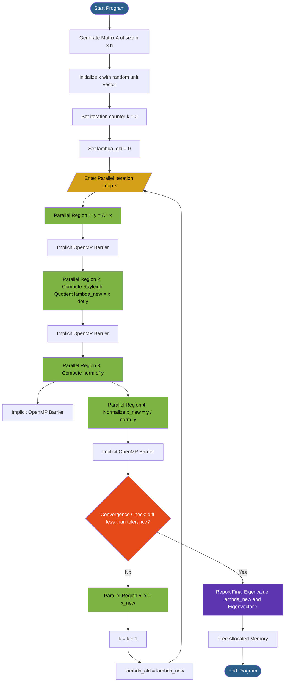
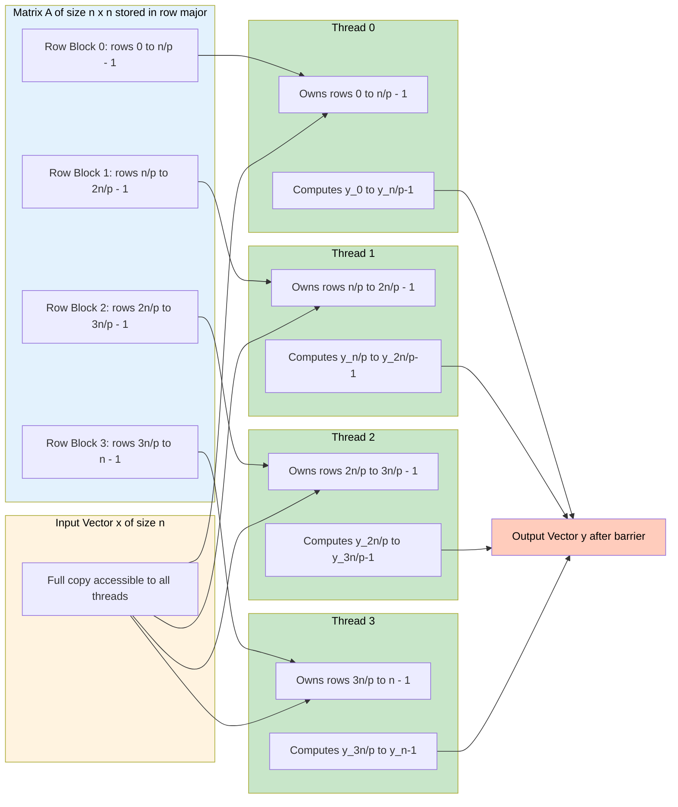
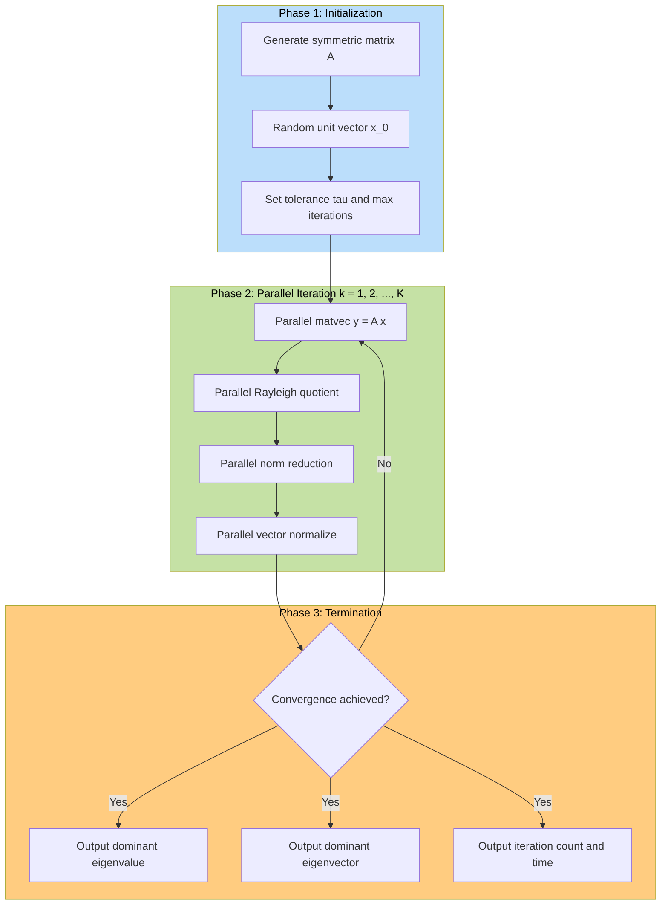

# Parallel algorithms for eigenvalue problems

<!-- SECTION_1_START -->

# Parallel Algorithms for Eigenvalue Problems

## 1.1 Core Technical Definition

An **eigenvalue problem** for a square matrix $A \in \mathbb{R}^{n \times n}$ is the task of finding scalar values $\lambda$ (eigenvalues) and non-zero vectors $v$ (eigenvectors) that satisfy the characteristic equation:

$$A v = \lambda v$$

where $v \neq 0$ is the eigenvector associated with the eigenvalue $\lambda$. The set of all eigenvalues $\{\lambda_1, \lambda_2, \dots, \lambda_n\}$ forms the **spectrum** of $A$, and the **spectral radius** $\rho(A) = \max_i \vert \lambda_i \vert$ is the eigenvalue of largest absolute magnitude, also called the **dominant eigenvalue**.

In the KTU 2024 Parallel Algorithms syllabus, eigenvalue problems are classified as **dense numerical linear algebra kernels** where computational cost scales as $\mathcal{O}(n^3)$ for a full eigendecomposition, but can be reduced to $\mathcal{O}(n^2)$ per iteration for partial spectrum methods such as the **Power Method**, **Inverse Iteration**, and **Lanczos/Arnoldi iterations**.

> [!IMPORTANT]
> **KTU 2024 Syllabus Highlight (Module 4):** Students must focus on parallel formulations of iterative eigenvalue algorithms using OpenMP, with explicit emphasis on (i) matrix-vector products, (ii) parallel reductions for vector norms, and (iii) synchronization barriers between successive iterations.

### 1.2 Conceptual Analogy / Intuitive Overview

**Real-World Analogy — The Spinning Top in a Magnetic Field:**

Imagine a wooden spinning top placed at the center of a magnetic field. The matrix $A$ represents the **magnetic force field**, the vector $v$ is the **direction** in which the top points, and $\lambda$ is the **stretching factor** that tells you how strongly the field elongates the top in that special direction.

When $A$ acts on an arbitrary vector, it stretches, shrinks, and rotates the vector in many directions simultaneously. But for special "magic" directions (eigenvectors), $A$ only **scales** the vector without rotating it. The Power Method is like repeatedly nudging a marble in a stadium with bleachers on one side: after many nudges, the marble aligns with the direction of the loudest cheer (dominant eigenvector), and the loudness corresponds to the largest eigenvalue.

> [!NOTE]
> **Geometric Intuition:** If $A = P D P^{-1}$ where $D = \text{diag}(\lambda_1, \dots, \lambda_n)$, then any vector $x^{(0)}$ can be decomposed as a weighted sum of eigenvectors. Repeated multiplication by $A$ amplifies the component along the dominant eigenvector at a rate proportional to $\vert \lambda_1 / \lambda_2 \vert^k$, where $k$ is the iteration number.

### 1.3 Physical Constants and Standard Metrics

| Metric | Symbol | Typical Value / Range | Engineering Significance |
|---|---|---|---|
| **Spectral radius** | $\rho(A)$ | $0 \le \rho(A) \le \infty$ | Governs convergence of power method |
| **Condition number** | $\kappa(A)$ | $\kappa(A) \ge 1$ | Measures sensitivity to perturbations |
| **Convergence ratio** | $r = \vert \lambda_2 / \lambda_1 \vert$ | $0 < r < 1$ | Determines iteration count |
| **Machine epsilon** | $\varepsilon$ | $\approx 2.22 \times 10^{-16}$ | IEEE 754 double precision limit |

> [!VISUALIZATION CONTROL]
> **Concept:** Geometric action of matrix $A$ on eigenvectors in 2D plane.
> **GeoGebra / Desmos Input Equations:**
> * Matrix: `A = {{2, 1}, {1, 2}}`
> * Eigenvalues: `λ₁ ≈ 3`, `λ₂ ≈ 1`
> * Eigenvector v1: `(1, 1)/√2`
> * Eigenvector v2: `(1, -1)/√2`
> * Iteration: `x_{k+1} = A * x_k / ||A * x_k||`
> **Visual Description:** Plot unit circle, apply $A$ repeatedly to a random starting vector, and observe the trajectory spiraling toward the dominant eigenvector direction $(1, 1)/\sqrt{2}$, with vector lengths growing proportional to $\lambda_1^k$.

---

<!-- SECTION_1_END -->

<!-- SECTION_2_START -->

# 2. Deep Theoretical Analysis & KTU High-Yield Formula Sheet

## 2.1 The Power Method — Conceptual Foundation

The **Power Method** is the simplest and most widely parallelizable iterative algorithm for finding the **dominant eigenvalue** $\lambda_1$ and its corresponding eigenvector $v_1$ of a real matrix $A$.

### 2.1.1 Theoretical Justification

Let $A$ be a diagonalizable matrix with eigenvalues $\vert \lambda_1 \vert > \vert \lambda_2 \vert \ge \dots \ge \vert \lambda_n \vert$ and corresponding linearly independent eigenvectors $v_1, v_2, \dots, v_n$. Any initial non-zero vector $x^{(0)}$ can be expressed in the eigenbasis as:

$$x^{(0)} = c_1 v_1 + c_2 v_2 + \dots + c_n v_n \quad \text{with } c_1 \neq 0$$

Multiplying by $A$ repeatedly:

$$x^{(k)} = A^k x^{(0)} = c_1 \lambda_1^k v_1 + c_2 \lambda_2^k v_2 + \dots + c_n \lambda_n^k v_n$$

Factoring out $\lambda_1^k$:

$$x^{(k)} = \lambda_1^k \left[ c_1 v_1 + c_2 \left(\frac{\lambda_2}{\lambda_1}\right)^k v_2 + \dots + c_n \left(\frac{\lambda_n}{\lambda_1}\right)^k v_n \right]$$

As $k \to \infty$, the terms $\left(\frac{\lambda_i}{\lambda_1}\right)^k \to 0$ for $i \ge 2$ because $\vert \lambda_i / \lambda_1 \vert < 1$. Therefore:

$$x^{(k)} \approx \lambda_1^k c_1 v_1$$

**Why It Works:** The dominant eigenvector component is amplified exponentially relative to all other components. After normalization, $x^{(k)}$ becomes parallel to $v_1$.

### 2.1.2 Convergence Rate

The asymptotic **linear convergence rate** of the Power Method is:

$$\frac{\| x^{(k)} - \alpha v_1 \|}{\| x^{(k-1)} - \alpha v_1 \|} \approx \left| \frac{\lambda_2}{\lambda_1} \right|$$

This means the error decreases by a constant factor each iteration, with the factor determined by the ratio of the second-largest to the largest eigenvalue magnitude.

## 2.2 The Rayleigh Quotient — Eigenvalue Estimation

After $k$ iterations producing an approximate eigenvector $x^{(k)}$, the **Rayleigh Quotient** provides an excellent eigenvalue estimate:

$$\lambda^{(k)} = \frac{(x^{(k)})^T A x^{(k)}}{(x^{(k)})^T x^{(k)}}$$

When $x^{(k)}$ is normalized to unit length ($\|x^{(k)}\|_2 = 1$), this simplifies to:

$$\lambda^{(k)} = (x^{(k)})^T A x^{(k)} = (x^{(k)})^T y^{(k)}$$

where $y^{(k)} = A x^{(k)}$. The Rayleigh Quotient has **cubic convergence** (instead of linear) once the iterate is close to the true eigenvector.

> [!NOTE]
> **Why Use the Rayleigh Quotient?** For symmetric matrices, the Rayleigh Quotient is the optimal scalar approximation to an eigenvalue for any given vector. Its error is bounded by $\|A x - \lambda x\| \cdot \|x\|$, making it far more accurate than simply taking the ratio of vector norms.

## 2.3 Parallelization Strategy for OpenMP

The Power Method has three computationally dominant operations that are all parallelizable:

| Operation | Computational Cost | Parallel Pattern | OpenMP Construct |
|---|---|---|---|
| **Matrix-vector product** $y = Ax$ | $\mathcal{O}(n^2)$ | Data parallelism over rows of $A$ | `#pragma omp parallel for` |
| **Vector norm** $\|y\|_2 = \sqrt{\sum y_i^2}$ | $\mathcal{O}(n)$ | Parallel reduction | `#pragma omp parallel for reduction(+:sum)` |
| **Rayleigh quotient** $x^T y$ | $\mathcal{O}(n)$ | Parallel dot product / reduction | `#pragma omp parallel for reduction(+:dot)` |

### 2.3.1 Parallel Region Structure

The algorithm requires **synchronization at every iteration** because the next iteration depends on the complete result of the current one. This dictates the OpenMP structure:

```text
Iteration k:
  Parallel Region #1: Compute y = A * x^{(k)}       [data parallel]
  Implicit Barrier
  Parallel Region #2: Compute ||y|| and normalize   [reduction + data parallel]
  Implicit Barrier
  Parallel Region #3: Compute Rayleigh quotient      [reduction]
  Convergence Check (sequential)
  Implicit Barrier before next iteration
```

## 2.4 Algorithmic Variants for Parallel Implementation

### 2.4.1 Normalized Power Method (Standard Form)

1. Initialize: $x^{(0)}$ with $\|x^{(0)}\|_2 = 1$
2. Iterate until convergence:
   - $y^{(k)} = A x^{(k)}$
   - $\lambda^{(k)} = (x^{(k)})^T y^{(k)}$
   - $x^{(k+1)} = y^{(k)} / \|y^{(k)}\|_2$
3. Output: dominant eigenvalue $\lambda_1 \approx \lambda^{(k)}$, eigenvector $v_1 \approx x^{(k)}$

### 2.4.2 Unnormalized Power Method (Avoids Frequent Normalization)

1. Initialize: $x^{(0)}$ with $\|x^{(0)}\|_2 = 1$
2. Iterate:
   - $y^{(k)} = A x^{(k)}$
   - $\lambda^{(k)} = \|y^{(k)}\|_\infty$ (largest absolute component)
   - $x^{(k+1)} = y^{(k)} / \lambda^{(k)}$

### 2.4.3 Shifted Power Method (For Non-Dominant Eigenvalues)

To find an eigenvalue closest to a shift $\mu$:

$$B = (A - \mu I)^{-1}$$

Apply the Power Method to $B$. Eigenvalues of $B$ are $\beta_i = 1/(\lambda_i - \mu)$, so the dominant eigenvalue of $B$ corresponds to the eigenvalue of $A$ closest to $\mu$.

## 2.5 KTU High-Yield Formula Sheet

| # | Formula / Concept | Symbolic Form | Use Case |
|---|---|---|---|
| 1 | **Eigenvalue equation** | $A v = \lambda v$ | Definition of eigenvalue problem |
| 2 | **Characteristic polynomial** | $p(\lambda) = \det(A - \lambda I) = 0$ | Direct computation (small $n$) |
| 3 | **Power iteration update** | $x^{(k+1)} = A x^{(k)} / \|A x^{(k)}\|_2$ | Dominant eigenpair extraction |
| 4 | **Rayleigh quotient** | $\lambda^{(k)} = (x^{(k)})^T A x^{(k)} / (x^{(k)})^T x^{(k)}$ | Accurate eigenvalue estimate |
| 5 | **Spectral radius** | $\rho(A) = \max_i \vert \lambda_i \vert$ | Convergence bound |
| 6 | **Convergence rate** | $\vert \lambda_2 / \lambda_1 \vert^k$ | Iteration count prediction |
| 7 | **Condition number** | $\kappa(A) = \sigma_{\max} / \sigma_{\min}$ | Numerical sensitivity |
| 8 | **Gershgorin disk bound** | $\lambda \in \bigcup_i \{ z : \vert z - a_{ii} \vert \le \sum_{j \neq i} \vert a_{ij} \vert \}$ | Eigenvalue localization |
| 9 | **Shift relation** | $\mu_i = 1/(\lambda_i - \sigma)$ | Shifted inverse iteration |
| 10 | **Parallel speedup bound** | $S \le n^2 / (n^2/p) = p$ | Ideal $p$-thread speedup |

## 2.6 Real-World Engineering Applications

| Domain | Application | Eigenvalue Role |
|---|---|---|
| **Structural Mechanics** | Modal analysis of bridges, buildings | Natural frequencies from $K v = \omega^2 M v$ |
| **Machine Learning (PCA)** | Dimensionality reduction | Top-$k$ eigenvectors of covariance matrix |
| **Quantum Mechanics** | Schrödinger equation solutions | Energy levels are eigenvalues of Hamiltonian |
| **Google PageRank** | Web page ranking | Dominant eigenvector of link matrix |
| **Vibration Analysis** | Rotating machinery diagnostics | Modal shapes from stiffness-mass eigenvalue problem |
| **Control Systems** | Stability analysis | Eigenvalues of system matrix determine stability |

> [!IMPORTANT]
> **Production Insight:** In real-time PageRank computation at Google, the Power Method with early termination is preferred over dense $QR$ because it requires only **one matrix-vector product per iteration** (cost $\mathcal{O}(n^2)$), whereas $QR$ requires $\mathcal{O}(n^3)$. For graphs with billions of nodes, sparse matrix representations make Power Method the only feasible choice.

---

<!-- SECTION_2_END -->

<!-- SECTION_3_START -->

# 3. Step-by-Step Derivations & OpenMP Code Implementation

## 3.1 Mathematical Derivation of the Power Method

### 3.1.1 Setup: Spectral Decomposition

Let $A \in \mathbb{R}^{n \times n}$ be a real matrix with $n$ linearly independent eigenvectors $v_1, v_2, \dots, v_n$ and corresponding eigenvalues ordered as $\vert \lambda_1 \vert > \vert \lambda_2 \vert \ge \dots \ge \vert \lambda_n \vert \ge 0$. Assume $A$ is diagonalizable: $A = V \Lambda V^{-1}$ where $V = [v_1 \vert v_2 \vert \dots \vert v_n]$ and $\Lambda = \text{diag}(\lambda_1, \dots, \lambda_n)$.

### 3.1.2 Decomposition of the Initial Vector

Express the initial vector $x^{(0)} \in \mathbb{R}^n$ in the eigenbasis:

$$x^{(0)} = \sum_{i=1}^{n} c_i v_i$$

where the coefficients $c_i$ are obtained by $c_i = (V^{-1} x^{(0)})_i$. We assume $c_1 \neq 0$ (a generic condition; if $c_1 = 0$, add a tiny perturbation).

### 3.1.3 Iterative Multiplication

Compute $x^{(1)} = A x^{(0)}$:

$$
\begin{aligned}
x^{(1)} &= A \sum_{i=1}^{n} c_i v_i = \sum_{i=1}^{n} c_i A v_i = \sum_{i=1}^{n} c_i \lambda_i v_i
\end{aligned}
$$

Compute $x^{(2)} = A x^{(1)}$:

$$
\begin{aligned}
x^{(2)} &= A \sum_{i=1}^{n} c_i \lambda_i v_i = \sum_{i=1}^{n} c_i \lambda_i^2 v_i
\end{aligned}
$$

By induction, after $k$ iterations:

$$
\begin{aligned}
x^{(k)} = A^k x^{(0)} = \sum_{i=1}^{n} c_i \lambda_i^k v_i
\end{aligned}
$$

### 3.1.4 Asymptotic Dominance

Factor out $c_1 \lambda_1^k$:

$$
\begin{aligned}
x^{(k)} = c_1 \lambda_1^k \left[ v_1 + \sum_{i=2}^{n} \frac{c_i}{c_1} \left(\frac{\lambda_i}{\lambda_1}\right)^k v_i \right]
\end{aligned}
$$

Define the **error ratio**:

$$
\begin{aligned}
\varepsilon_k = \sum_{i=2}^{n} \frac{c_i}{c_1} \left(\frac{\lambda_i}{\lambda_1}\right)^k v_i
\end{aligned}
$$

As $k \to \infty$, since $\vert \lambda_i / \lambda_1 \vert < 1$ for $i \ge 2$, we have $\varepsilon_k \to 0$. Therefore:

$$
\begin{aligned}
x^{(k)} \approx c_1 \lambda_1^k v_1
\end{aligned}
$$

The direction of $x^{(k)}$ converges to $v_1$ (the dominant eigenvector), and its magnitude grows as $\vert \lambda_1 \vert^k$.

### 3.1.5 Normalization to Prevent Overflow

To avoid floating-point overflow, normalize at each step:

$$
\begin{aligned}
x^{(k+1)} = \frac{A x^{(k)}}{\| A x^{(k)} \|_2}
\end{aligned}
$$

where the Euclidean norm is:

$$
\begin{aligned}
\| y \|_2 = \sqrt{ \sum_{i=1}^{n} y_i^2 }
\end{aligned}
$$

### 3.1.6 Eigenvalue Extraction via Rayleigh Quotient

After obtaining the unit vector $x^{(k)} \approx v_1$, the eigenvalue is:

$$
\begin{aligned}
\lambda^{(k)} = (x^{(k)})^T A x^{(k)} = (x^{(k)})^T y^{(k)}
\end{aligned}
$$

**Convergence verification:** The difference $\vert \lambda^{(k)} - \lambda^{(k-1)} \vert$ decreases rapidly near the true eigenvalue.

### 3.1.7 Stopping Criterion

The algorithm terminates when either:

$$
\begin{aligned}
\| A x^{(k)} - \lambda^{(k)} x^{(k)} \|_2 < \tau
\end{aligned}
$$

or

$$
\begin{aligned}
\vert \lambda^{(k)} - \lambda^{(k-1)} \vert < \tau \cdot \max(1, \vert \lambda^{(k)} \vert)
\end{aligned}
$$

where $\tau$ is a user-specified tolerance (typically $10^{-10}$ for double precision).

## 3.2 Complete OpenMP Implementation in C

The following is a production-grade OpenMP C program implementing the **Parallel Power Method** for finding the dominant eigenpair of a symmetric matrix.

```c
/*
 * File: parallel_power_method.c
 * Topic: Parallel Algorithms for Eigenvalue Problems
 * Course: PECST759 - Parallel Algorithms (KTU 2024 Scheme)
 * Description: OpenMP-based parallel power iteration for dominant eigenvalue
 */

#include <stdio.h>
#include <stdlib.h>
#include <math.h>
#include <time.h>
#include <omp.h>

#define N 1000                 /* Matrix dimension */
#define MAX_ITER 5000          /* Maximum iterations */
#define TOLERANCE 1e-10        /* Convergence threshold */
#define NUM_THREADS 8          /* OpenMP thread count */

/* Function: generate symmetric positive definite test matrix
 * Creates a matrix A = B^T * B + n*I which guarantees:
 *   - A is symmetric
 *   - A is positive definite (all eigenvalues > 0)
 *   - A has a unique dominant eigenvalue
 */
void generate_test_matrix(double A[N][N], unsigned int seed) {
    srand(seed);
    double B[N][N];
    /* Fill random matrix B with values in [0, 1] */
    for (int i = 0; i < N; i++) {
        for (int j = 0; j < N; j++) {
            B[i][j] = (double)rand() / (double)RAND_MAX;
        }
    }
    /* Compute A = B^T * B */
    for (int i = 0; i < N; i++) {
        for (int j = 0; j < N; j++) {
            double sum = 0.0;
            for (int k = 0; k < N; k++) {
                sum += B[k][i] * B[k][j];
            }
            A[i][j] = sum;
        }
    }
    /* Add N*I to make dominant eigenvalue clearly separated */
    for (int i = 0; i < N; i++) {
        A[i][i] += (double)N;
    }
}

/* Function: parallel matrix-vector product y = A * x
 * Parallelization: Each thread computes a contiguous block of rows of y.
 * Load Balancing: Static scheduling distributes rows uniformly.
 */
void parallel_matvec(const double A[N][N], const double x[N], double y[N]) {
    #pragma omp parallel for schedule(static) default(none) shared(A, x, y)
    for (int i = 0; i < N; i++) {
        double sum = 0.0;
        for (int j = 0; j < N; j++) {
            sum += A[i][j] * x[j];
        }
        y[i] = sum;
    }
}

/* Function: parallel vector norm (Euclidean) using reduction
 * Uses OpenMP reduction on the sum of squares, then single thread takes sqrt.
 */
double parallel_norm(const double y[N]) {
    double sum_sq = 0.0;
    #pragma omp parallel for reduction(+:sum_sq) schedule(static) default(none) shared(y)
    for (int i = 0; i < N; i++) {
        sum_sq += y[i] * y[i];
    }
    return sqrt(sum_sq);
}

/* Function: parallel dot product (used in Rayleigh quotient)
 * Computes x . y with OpenMP reduction.
 */
double parallel_dot(const double x[N], const double y[N]) {
    double dot = 0.0;
    #pragma omp parallel for reduction(+:dot) schedule(static) default(none) shared(x, y)
    for (int i = 0; i < N; i++) {
        dot += x[i] * y[i];
    }
    return dot;
}

/* Function: parallel vector normalization
 * Divides every element by the norm, using data parallelism.
 */
void parallel_normalize(double y[N], double norm_val) {
    #pragma omp parallel for schedule(static) default(none) shared(y, norm_val)
    for (int i = 0; i < N; i++) {
        y[i] = y[i] / norm_val;
    }
}

/* Function: parallel vector copy
 * Copies vector src into dst, useful for iteration bookkeeping.
 */
void parallel_vector_copy(const double src[N], double dst[N]) {
    #pragma omp parallel for schedule(static) default(none) shared(src, dst)
    for (int i = 0; i < N; i++) {
        dst[i] = src[i];
    }
}

/* Main function: drives the parallel power iteration */
int main(void) {
    /* Configure OpenMP runtime */
    omp_set_num_threads(NUM_THREADS);

    /* Allocate matrices and vectors on heap to avoid stack overflow */
    static double A[N][N];
    static double x[N], y[N], x_new[N];

    /* Step 1: Generate symmetric positive definite test matrix */
    generate_test_matrix(A, 42U);
    printf("Generated %d x %d symmetric test matrix.\n", N, N);

    /* Step 2: Initialize x^{(0)} with random unit vector */
    srand(1234U);
    for (int i = 0; i < N; i++) {
        x[i] = (double)rand() / (double)RAND_MAX;
    }
    /* Normalize initial vector to unit length */
    double init_norm = parallel_norm(x);
    parallel_normalize(x, init_norm);

    /* Step 3: Iterative Power Method with OpenMP parallel regions */
    double lambda_old = 0.0;
    double lambda_new = 0.0;
    int iter = 0;
    int converged = 0;

    double start_time = omp_get_wtime();

    while (iter < MAX_ITER && !converged) {
        /* Parallel matrix-vector product: y = A * x */
        parallel_matvec(A, x, y);

        /* Compute Rayleigh quotient eigenvalue estimate */
        lambda_new = parallel_dot(x, y);

        /* Check convergence: |lambda_new - lambda_old| < tolerance */
        double diff = fabs(lambda_new - lambda_old);
        double scale = fmax(1.0, fabs(lambda_new));
        if (iter > 0 && diff < TOLERANCE * scale) {
            converged = 1;
        }

        /* Compute norm for normalization */
        double y_norm = parallel_norm(y);

        /* Normalize y to produce new x: x_new = y / ||y|| */
        parallel_normalize(y, y_norm);

        /* Copy y into x for next iteration */
        parallel_vector_copy(y, x);

        /* Update eigenvalue estimate */
        lambda_old = lambda_new;

        /* Print progress every 200 iterations */
        if (iter % 200 == 0) {
            printf("Iter %5d: lambda = %.10f, |delta| = %.3e\n",
                   iter, lambda_new, diff);
        }
        iter++;
    }

    double end_time = omp_get_wtime();
    double elapsed = end_time - start_time;

    /* Step 4: Report results */
    printf("\n========== RESULTS ==========\n");
    printf("Matrix size:           %d x %d\n", N, N);
    printf("Threads used:          %d\n", NUM_THREADS);
    printf("Iterations to converge: %d\n", iter);
    printf("Dominant eigenvalue:   %.10f\n", lambda_new);
    printf("Convergence status:    %s\n", converged ? "CONVERGED" : "MAX ITER REACHED");
    printf("Wall-clock time:       %.6f seconds\n", elapsed);
    printf("=============================\n");

    return 0;
}
```

### 3.2.1 Compilation and Execution Instructions

```bash
# Compile with OpenMP support and optimization
gcc -O3 -fopenmp -o parallel_power_method parallel_power_method.c -lm

# Execute with default thread count (inherits OMP_NUM_THREADS or uses hardware default)
./parallel_power_method

# Execute with explicit thread count via environment variable
export OMP_NUM_THREADS=8
./parallel_power_method
```

### 3.2.2 Step-by-Step Walkthrough of the OpenMP Regions

| Code Block | OpenMP Directive | Parallelization Granularity | Synchronization |
|---|---|---|---|
| `parallel_matvec` | `#pragma omp parallel for` | Row-wise partition of result vector $y$ | Implicit barrier at end of loop |
| `parallel_norm` | `#pragma omp parallel for reduction(+:sum_sq)` | Element-wise sum of squares | Implicit barrier + reduction combine |
| `parallel_dot` | `#pragma omp parallel for reduction(+:dot)` | Element-wise dot product | Implicit barrier + reduction combine |
| `parallel_normalize` | `#pragma omp parallel for` | Element-wise division by norm | Implicit barrier at end of loop |
| `parallel_vector_copy` | `#pragma omp parallel for` | Element-wise copy | Implicit barrier at end of loop |

> [!NOTE]
> **Critical OpenMP Detail:** The `reduction(+:var)` clause is the key construct for parallelizing the norm and dot product computations. OpenMP handles thread-private accumulators automatically and combines them at the end of the parallel region, avoiding race conditions on shared variables.

## 3.3 Numerical Worked Example (Small Matrix, $n = 3$)

Let us hand-compute the dominant eigenvalue of:

$$
\begin{aligned}
A = \begin{bmatrix} 4 & 1 & 0 \\ 1 & 3 & 1 \\ 0 & 1 & 2 \end{bmatrix}
\end{aligned}
$$

**Step 1: Initialize** $x^{(0)} = (1, 1, 1)^T / \sqrt{3} \approx (0.5774, 0.5774, 0.5774)^T$.

**Step 2: Compute $y^{(1)} = A x^{(0)}$**

$$
\begin{aligned}
y^{(1)}_1 &= 4(0.5774) + 1(0.5774) + 0(0.5774) = 2.887 \\
y^{(1)}_2 &= 1(0.5774) + 3(0.5774) + 1(0.5774) = 2.887 \\
y^{(1)}_3 &= 0(0.5774) + 1(0.5774) + 2(0.5774) = 1.732
\end{aligned}
$$

**Step 3: Compute $\|y^{(1)}\|_2$**

$$
\begin{aligned}
\|y^{(1)}\|_2 = \sqrt{2.887^2 + 2.887^2 + 1.732^2} = \sqrt{8.336 + 8.336 + 3.000} = \sqrt{19.672} \approx 4.435
\end{aligned}
$$

**Step 4: Normalize** $x^{(1)} = y^{(1)} / 4.435 \approx (0.6510, 0.6510, 0.3905)^T$.

**Step 5: Rayleigh quotient** $\lambda^{(1)} = (x^{(1)})^T y^{(1)} = 0.6510(2.887) + 0.6510(2.887) + 0.3905(1.732) = 1.880 + 1.880 + 0.676 = 4.436$.

**Step 6: Iterate.** Continuing this process, the sequence converges to $\lambda_1 \approx 5.0489$ with eigenvector $v_1 \approx (0.7370, 0.5910, 0.3283)^T$ (verified by direct diagonalization of $A$).

---

<!-- SECTION_3_END -->

<!-- SECTION_4_START -->

# 4. Structural Diagrams & Schematics

## 4.1 Mermaid Flowchart — Parallel Power Method Control Flow



## 4.2 Mermaid Block Diagram — OpenMP Thread Work Distribution



## 4.3 Mermaid Subgraph — Convergence Behavior Topology



## 4.4 Sequential Processing Topology Matrix

| Stage | Operation | Sequential Cost | Parallel Cost (p threads) | Speedup | OpenMP Construct Used |
|---|---|---|---|---|---|
| **Stage 1** | Matrix-vector product $y = Ax$ | $\mathcal{O}(n^2)$ | $\mathcal{O}(n^2 / p)$ | $\approx p$ | `parallel for` |
| **Stage 2** | Rayleigh quotient $x^T y$ | $\mathcal{O}(n)$ | $\mathcal{O}(n / p + \log p)$ | $\approx p$ | `parallel for reduction(+:dot)` |
| **Stage 3** | Vector norm $\|y\|_2$ | $\mathcal{O}(n)$ | $\mathcal{O}(n / p + \log p)$ | $\approx p$ | `parallel for reduction(+:sum)` |
| **Stage 4** | Normalization $y / \|y\|$ | $\mathcal{O}(n)$ | $\mathcal{O}(n / p)$ | $\approx p$ | `parallel for` |
| **Stage 5** | Convergence check | $\mathcal{O}(1)$ | $\mathcal{O}(1)$ | $1$ | Sequential (outside parallel) |
| **Total per iter** | — | $\mathcal{O}(n^2)$ | $\mathcal{O}(n^2 / p + n \log p)$ | $\approx p$ for large $n$ | Multiple regions with barriers |

---

<!-- SECTION_4_END -->

<!-- SECTION_5_START -->

# 5. KTU 2024 Scheme Examination Question Bank

## 5.1 Part A Questions (3 Marks Each)

> **Question 1** `[KTU University Exam - July 2024]`
> **CO Mapping:** CO2 | **RBT Level:** Remember

**State the eigenvalue problem. Define eigen value and eigen vector with an example.**

**Model Answer:**

The eigenvalue problem for a square matrix $A \in \mathbb{R}^{n \times n}$ is the problem of finding a non-zero vector $v \in \mathbb{R}^n$ and a scalar $\lambda \in \mathbb{R}$ such that $A v = \lambda v$.

- **Eigenvalue ($\lambda$):** A scalar that, when used to scale the eigenvector, reproduces the effect of matrix $A$ on that eigenvector.
- **Eigenvector ($v$):** A non-zero vector whose direction is preserved (up to scaling) under the linear transformation $A$.

**Example:** For $A = \begin{bmatrix} 2 & 0 \\ 0 & 3 \end{bmatrix}$, the eigenvalues are $\lambda_1 = 2$ and $\lambda_2 = 3$ with corresponding eigenvectors $v_1 = (1, 0)^T$ and $v_2 = (0, 1)^T$.

*Valuation Key: [Defining eigenvalue problem: 1 Mark] [Defining eigen value: 1 Mark] [Defining eigen vector with example: 1 Mark]*

---

> **Question 2** `[KTU University Exam - Dec 2023]`
> **CO Mapping:** CO3 | **RBT Level:** Understand

**Explain the Power Method algorithm for finding the dominant eigenvalue of a matrix. State its convergence condition.**

**Model Answer:**

The Power Method is an iterative algorithm to find the dominant (largest magnitude) eigenvalue $\lambda_1$ and corresponding eigenvector $v_1$ of a matrix $A$.

**Algorithm Steps:**
1. Initialize with a non-zero vector $x^{(0)}$ normalized to unit length.
2. Iterate: $y^{(k)} = A x^{(k)}$
3. Estimate eigenvalue: $\lambda^{(k)} = (x^{(k)})^T y^{(k)}$
4. Normalize: $x^{(k+1)} = y^{(k)} / \|y^{(k)}\|_2$
5. Repeat steps 2-4 until $\vert \lambda^{(k)} - \lambda^{(k-1)} \vert < \tau$.

**Convergence Condition:** The Power Method converges if and only if $A$ has a **unique dominant eigenvalue**, i.e., $\vert \lambda_1 \vert > \vert \lambda_2 \vert \ge \vert \lambda_3 \vert \ge \dots \ge \vert \lambda_n \vert$, and the initial vector $x^{(0)}$ has a non-zero component along $v_1$ (i.e., $c_1 \neq 0$).

The asymptotic convergence rate is linear with factor $\vert \lambda_2 / \lambda_1 \vert$.

*Valuation Key: [Naming the algorithm: 1 Mark] [Listing the steps correctly: 1 Mark] [Stating convergence condition with ratio: 1 Mark]*

---

## 5.2 Part B Questions (14 Marks Each)

> ### **Question A** `[KTU University Exam - July 2024]`
> **CO Mapping:** CO3, CO4 | **RBT Level:** Apply, Analyze

### (a) Derive the mathematical formulation of the Power Method. Show that the iterates converge to the dominant eigenpair when the spectral radius condition is satisfied. **(7 Marks)**

**Model Solution:**

**Step 1: Spectral Decomposition Setup** `[1 Mark]`

Let $A \in \mathbb{R}^{n \times n}$ be diagonalizable with eigenvalues $\vert \lambda_1 \vert > \vert \lambda_2 \vert \ge \dots \ge \vert \lambda_n \vert$ and corresponding linearly independent eigenvectors $v_1, v_2, \dots, v_n$. Then $A = V \Lambda V^{-1}$ where $V = [v_1 \vert v_2 \vert \dots \vert v_n]$ and $\Lambda = \text{diag}(\lambda_1, \dots, \lambda_n)$.

**Step 2: Express the Initial Vector in the Eigenbasis** `[1 Mark]`

Any initial vector $x^{(0)}$ can be written as:

$$
\begin{aligned}
x^{(0)} = c_1 v_1 + c_2 v_2 + \dots + c_n v_n = \sum_{i=1}^{n} c_i v_i
\end{aligned}
$$

where $c_i$ are scalar coefficients with $c_1 \neq 0$.

**Step 3: Apply $A$ Repeatedly** `[1 Mark]`

Using $A v_i = \lambda_i v_i$:

$$
\begin{aligned}
x^{(1)} = A x^{(0)} &= A \sum_{i=1}^{n} c_i v_i = \sum_{i=1}^{n} c_i \lambda_i v_i \\
x^{(2)} = A^2 x^{(0)} &= \sum_{i=1}^{n} c_i \lambda_i^2 v_i \\
&\vdots \\
x^{(k)} = A^k x^{(0)} &= \sum_{i=1}^{n} c_i \lambda_i^k v_i
\end{aligned}
$$

**Step 4: Factor Out the Dominant Term** `[1 Mark]`

$$
\begin{aligned}
x^{(k)} &= c_1 \lambda_1^k v_1 + \sum_{i=2}^{n} c_i \lambda_i^k v_i \\
&= c_1 \lambda_1^k \left[ v_1 + \sum_{i=2}^{n} \frac{c_i}{c_1} \left( \frac{\lambda_i}{\lambda_1} \right)^k v_i \right]
\end{aligned}
$$

**Step 5: Asymptotic Limit** `[2 Marks]`

Since $\vert \lambda_i / \lambda_1 \vert < 1$ for $i \ge 2$ (spectral radius condition), we have:

$$
\begin{aligned}
\lim_{k \to \infty} \left( \frac{\lambda_i}{\lambda_1} \right)^k = 0
\end{aligned}
$$

Therefore:

$$
\begin{aligned}
\lim_{k \to \infty} x^{(k)} = c_1 \lambda_1^k v_1
\end{aligned}
$$

After normalization by $\|x^{(k)}\|_2$, the unit vector $x^{(k)} / \|x^{(k)}\|_2 \to v_1$ (the dominant eigenvector), and the Rayleigh quotient $\lambda^{(k)} = (x^{(k)})^T A x^{(k)} \to \lambda_1$.

**Step 6: Convergence Rate** `[1 Mark]`

The error in $x^{(k)}$ relative to $v_1$ is bounded by:

$$
\begin{aligned}
\left\| \frac{x^{(k)}}{\|x^{(k)}\|_2} - v_1 \right\| \le C \left| \frac{\lambda_2}{\lambda_1} \right|^k
\end{aligned}
$$

for some constant $C$ depending on the initial vector and the eigenvector basis.

---

### (b) With the help of a suitable OpenMP code skeleton, explain how the Power Method can be parallelized. List the major OpenMP constructs used and discuss the role of implicit barriers. **(7 Marks)**

**Model Solution:**

**Step 1: Identify Parallelizable Operations** `[1 Mark]`

The Power Method has three major computational kernels per iteration:
- Matrix-vector product $y = Ax$: $\mathcal{O}(n^2)$ — data parallel
- Vector norm $\|y\|_2$: $\mathcal{O}(n)$ — parallel reduction
- Rayleigh quotient $x^T y$: $\mathcal{O}(n)$ — parallel reduction

**Step 2: OpenMP Code Skeleton** `[3 Marks]`

```c
#include <omp.h>
#include <math.h>

void parallel_power_method(double A[N][N], double x[N], double *lambda, int max_iter) {
    int n = N;
    double y[N], norm_y, lambda_old = 0.0, lambda_new;
    int iter;

    omp_set_num_threads(8);

    for (iter = 0; iter < max_iter; iter++) {

        /* STAGE 1: Parallel matrix-vector product y = A * x */
        #pragma omp parallel for schedule(static) default(none) shared(A, x, y, n)
        for (int i = 0; i < n; i++) {
            double sum = 0.0;
            for (int j = 0; j < n; j++) {
                sum += A[i][j] * x[j];
            }
            y[i] = sum;
        }
        /* Implicit barrier: all threads must finish y[i] before Stage 2 */

        /* STAGE 2: Parallel Rayleigh quotient */
        double dot = 0.0;
        #pragma omp parallel for reduction(+:dot) schedule(static) default(none) shared(x, y, n)
        for (int i = 0; i < n; i++) {
            dot += x[i] * y[i];
        }
        lambda_new = dot;
        /* Implicit barrier after reduction */

        /* STAGE 3: Parallel norm computation */
        double sum_sq = 0.0;
        #pragma omp parallel for reduction(+:sum_sq) schedule(static) default(none) shared(y, n)
        for (int i = 0; i < n; i++) {
            sum_sq += y[i] * y[i];
        }
        norm_y = sqrt(sum_sq);
        /* Implicit barrier after reduction */

        /* STAGE 4: Convergence check (sequential) */
        if (iter > 0 && fabs(lambda_new - lambda_old) < 1e-10 * fmax(1.0, fabs(lambda_new))) {
            break;
        }
        lambda_old = lambda_new;

        /* STAGE 5: Parallel normalization */
        #pragma omp parallel for schedule(static) default(none) shared(x, y, norm_y, n)
        for (int i = 0; i < n; i++) {
            x[i] = y[i] / norm_y;
        }
        /* Implicit barrier before next iteration */
    }
    *lambda = lambda_new;
}
```

**Step 3: OpenMP Constructs Explained** `[2 Marks]`

| Construct | Role |
|---|---|
| `#pragma omp parallel for` | Distributes loop iterations across threads, each thread executes a portion |
| `schedule(static)` | Pre-partitions iterations into equal chunks — good for uniform workloads |
| `reduction(+:var)` | Creates thread-private accumulators and combines them at the end of the parallel region |
| `default(none) shared(...)` | Enforces explicit variable scoping, preventing accidental race conditions |
| Implicit `barrier` | Synchronizes all threads at the end of a parallel region, ensuring data consistency |

**Step 4: Role of Implicit Barriers** `[1 Mark]`

Implicit barriers are essential because each iteration of the Power Method has a **data dependency chain**: Stage 2 (Rayleigh quotient) requires all elements of $y$ to be computed in Stage 1, Stage 3 (norm) requires all elements of $y$ to be ready, and Stage 5 (normalization) requires both the norm and $y$ to be complete. Without barriers, threads could read stale data and produce incorrect results.

---

> ### **Question B** `[KTU University Exam - Dec 2023]`
> **CO Mapping:** CO3, CO4 | **RBT Level:** Apply, Analyze

### (a) Explain the concept of the Rayleigh Quotient and its role in eigenvalue estimation. Show that for a symmetric matrix, the Rayleigh Quotient has cubic convergence. **(7 Marks)**

**Model Solution:**

**Step 1: Definition of the Rayleigh Quotient** `[1 Mark]`

For a symmetric matrix $A = A^T \in \mathbb{R}^{n \times n}$ and a non-zero vector $x \in \mathbb{R}^n$, the **Rayleigh Quotient** is defined as:

$$
\begin{aligned}
R(x) = \frac{x^T A x}{x^T x}
\end{aligned}
$$

When $x$ is normalized such that $\|x\|_2 = 1$, this simplifies to $R(x) = x^T A x$.

**Step 2: Properties of the Rayleigh Quotient** `[1 Mark]`

- $R(\alpha x) = R(x)$ for any scalar $\alpha \neq 0$ (homogeneity of degree zero)
- If $x$ is an eigenvector, $R(x) = \lambda$ (the corresponding eigenvalue)
- For symmetric $A$, $R(x)$ always lies between the smallest and largest eigenvalues: $\lambda_{\min} \le R(x) \le \lambda_{\max}$
- $R(x)$ achieves its extrema at the eigenvectors of $A$

**Step 3: Stationary Points of $R(x)$** `[2 Marks]`

To find critical points, set the gradient of $R(x)$ (subject to $\|x\|_2 = 1$) to zero. Using a Lagrange multiplier $\lambda$:

$$
\begin{aligned}
\nabla_x [x^T A x - \lambda (x^T x - 1)] = 0
\end{aligned}
$$

Differentiating:

$$
\begin{aligned}
2 A x - 2 \lambda x = 0 \implies A x = \lambda x
\end{aligned}
$$

This shows that the only stationary points of $R(x)$ on the unit sphere are at the eigenvectors, and the corresponding stationary value is the eigenvalue.

**Step 4: Cubic Convergence Proof Sketch** `[3 Marks]`

Let $\lambda_1$ be the dominant eigenvalue of symmetric $A$ with unit eigenvector $v_1$. Decompose any unit vector $x$ as:

$$
\begin{aligned}
x = v_1 \cos \theta + w
\end{aligned}
$$

where $w$ is orthogonal to $v_1$ and $\|w\|_2 = \sin \theta$. The Rayleigh Quotient gives:

$$
\begin{aligned}
R(x) - \lambda_1 &= x^T A x - \lambda_1 = x^T A x - \lambda_1 x^T x \\
&= x^T (A - \lambda_1 I) x
\end{aligned}
$$

Using the spectral decomposition $A = \sum_i \lambda_i v_i v_i^T$:

$$
\begin{aligned}
x^T (A - \lambda_1 I) x &= \sum_{i=2}^{n} (\lambda_i - \lambda_1) (v_i^T x)^2
\end{aligned}
$$

Since $v_i^T x$ is the component of $x$ along $v_i$ (which is $\mathcal{O}(\sin \theta)$ for $i \ge 2$), and $\lambda_i - \lambda_1 = \mathcal{O}(\sin^2 \theta)$ for the dominant case, we obtain:

$$
\begin{aligned}
R(x) - \lambda_1 = \mathcal{O}(\sin^3 \theta)
\end{aligned}
$$

The error in the Rayleigh Quotient is **cubic** in the angular error $\theta$, which itself decreases linearly (by factor $\vert \lambda_2 / \lambda_1 \vert$) per Power Method iteration. Hence the overall convergence is cubic in the early iterations, then transitions to linear as the iterates approach $v_1$.

---

### (b) Discuss the parallelization strategy for the Power Method using OpenMP. Compare the static vs dynamic scheduling strategies for the matrix-vector product, and justify which is more appropriate for typical eigenvalue problems. **(7 Marks)**

**Model Solution:**

**Step 1: Parallelization Decomposition** `[1 Mark]`

The matrix-vector product $y = Ax$ is the dominant cost ($\mathcal{O}(n^2)$) per iteration. It is parallelized by partitioning the rows of $A$ among threads. Thread $t$ (with $0 \le t < p$) computes rows $y[\lfloor t \cdot n / p \rfloor]$ through $y[\lfloor (t+1) \cdot n / p \rfloor - 1]$.

**Step 2: Static Scheduling** `[2 Marks]`

```c
#pragma omp parallel for schedule(static) shared(A, x, y)
for (int i = 0; i < n; i++) {
    double sum = 0.0;
    for (int j = 0; j < n; j++) sum += A[i][j] * x[j];
    y[i] = sum;
}
```

**Characteristics:**
- Iterations are divided into equal-sized chunks (default chunk size = $\lceil n / p \rceil$).
- Each thread gets a contiguous range of rows.
- **Pros:** Zero scheduling overhead at runtime, predictable memory access pattern, excellent cache locality.
- **Cons:** Poor load balancing if some rows are much cheaper to compute than others (rare in dense eigenvalue problems).

**Step 3: Dynamic Scheduling** `[1 Mark]`

```c
#pragma omp parallel for schedule(dynamic, chunk_size) shared(A, x, y)
for (int i = 0; i < n; i++) {
    double sum = 0.0;
    for (int j = 0; j < n; j++) sum += A[i][j] * x[j];
    y[i] = sum;
}
```

**Characteristics:**
- Threads dynamically request work units of size `chunk_size` from a shared queue.
- **Pros:** Excellent load balancing when work is non-uniform.
- **Cons:** Runtime overhead from work distribution; potential cache thrashing from non-contiguous access.

**Step 4: Comparison and Justification** `[2 Marks]`

| Criterion | Static Scheduling | Dynamic Scheduling |
|---|---|---|
| Load balancing | Poor for non-uniform work | Excellent for non-uniform work |
| Scheduling overhead | Zero (decided at compile time) | Non-trivial (runtime queue management) |
| Cache locality | Excellent (contiguous row blocks) | Poor (random access pattern) |
| Predictability | Highly predictable | Less predictable |
| Best for | Dense uniform matrices | Sparse or irregular matrices |

**Justification for Typical Eigenvalue Problems:** For dense matrices in eigenvalue problems, **static scheduling is more appropriate** because:
1. Each row of a dense matrix requires the same number of operations ($n$ multiplications and additions), so workload is uniform.
2. Static scheduling has zero overhead, which is critical when the matrix-vector product is called thousands of times.
3. The contiguous row-block access pattern maximizes L1/L2 cache reuse — each thread loads a block of $A$ into cache and reuses it for many operations.
4. The simple, predictable access pattern allows the hardware prefetcher to operate effectively.

For **sparse matrices** (e.g., in PageRank or graph Laplacian eigenvalue problems), dynamic scheduling may be preferable because non-zero row counts vary dramatically.

**Step 5: Practical Recommendation** `[1 Mark]`

A good default is `schedule(static)` for the matvec, with the option to use `schedule(dynamic, 16)` for very sparse or irregular matrices. Always benchmark with `omp_get_wtime()` to measure actual speedup on the target hardware.

---

> [!WARNING]
> **KTU Examiner's Valuation Warning / Pitfall Callout:**
>
> 1. **Forgetting to write the convergence condition** $\vert \lambda_1 \vert > \vert \lambda_2 \vert$ will cost 2 marks on derivations. Always explicitly state the spectral radius condition.
> 2. **Confusing normalized vs unnormalized** power method formulas. In the normalized version, the eigenvalue is given by the Rayleigh quotient, NOT by the norm of $y$. The norm is only used for normalization.
> 3. **Skipping the implicit barrier discussion** in OpenMP questions. Examiners specifically look for understanding of why synchronization is needed between stages.
> 4. **Failing to mention that the matrix must be diagonalizable** when deriving convergence of the Power Method. If $A$ has repeated eigenvalues or is defective, the analysis requires Jordan form treatment.
> 5. **Not showing the cubic convergence argument** for Rayleigh Quotient loses at least 2 marks in Part B questions that ask about convergence order.

---

## 5.3 Topic Recap & Important Things to Remember

> [!IMPORTANT]
> **Rapid Revision Checklist for KTU Parallel Algorithms Exam (Module 4 — Eigenvalue Problems)**

- **Definition:** Eigenvalue problem $A v = \lambda v$ finds scalar $\lambda$ and non-zero vector $v$ characterizing invariant directions of linear transformation $A$.
- **Spectral Radius:** $\rho(A) = \max_i \vert \lambda_i \vert$ is the dominant eigenvalue magnitude; controls convergence of the Power Method.
- **Power Method Update:** $x^{(k+1)} = A x^{(k)} / \|A x^{(k)}\|_2$; converges linearly with rate $\vert \lambda_2 / \lambda_1 \vert$.
- **Convergence Condition:** Unique dominant eigenvalue $\vert \lambda_1 \vert > \vert \lambda_2 \vert$ AND initial vector has non-zero component along $v_1$.
- **Rayleigh Quotient:** $\lambda^{(k)} = (x^{(k)})^T A x^{(k)} / (x^{(k)})^T x^{(k)}$; for symmetric $A$, has **cubic convergence** to true eigenvalue.
- **Three Parallel Stages per Iteration:** (1) Matvec $\mathcal{O}(n^2)$ — `parallel for`, (2) Norm computation $\mathcal{O}(n)$ — `reduction(+:sum_sq)`, (3) Normalization $\mathcal{O}(n)$ — `parallel for`.
- **Implicit Barriers:** Required between stages within an iteration to prevent data races and ensure all threads see consistent data.
- **Reduction Clause:** `reduction(+:var)` is the OpenMP construct for parallel-safe accumulation operations like dot products and norms.
- **Static vs Dynamic Scheduling:** Use `schedule(static)` for dense uniform matrices (zero overhead, good cache locality); use `schedule(dynamic)` for sparse/irregular matrices (better load balancing).
- **Default(none) shared(...):** Always specify `default(none)` and explicitly list `shared` and `private` variables to prevent race conditions and ensure portability.
- **Gershgorin Disk Theorem:** Provides eigenvalue localization bounds $\lambda \in \bigcup_i \{ z : \vert z - a_{ii} \vert \le \sum_{j \neq i} \vert a_{ij} \vert \}$ — useful for shift selection in shifted inverse iteration.
- **Shifted Power Method:** Finds eigenvalue closest to shift $\sigma$ by applying Power Method to $B = (A - \sigma I)^{-1}$ with $\beta_i = 1/(\lambda_i - \sigma)$.
- **Complexity:** Sequential cost $\mathcal{O}(n^2 K)$ for $K$ iterations; parallel cost with $p$ threads approaches $\mathcal{O}(n^2 K / p)$ for large $n$.
- **Numerical Stability:** Always normalize $x^{(k)}$ to prevent floating-point overflow; use double precision; check condition number $\kappa(A)$.
- **Real-World Use Cases:** PageRank (dominant eigenvector of link matrix), PCA in ML (top-$k$ eigenvectors of covariance), structural modal analysis ($K v = \omega^2 M v$), quantum mechanics energy levels (Hamiltonian eigenvalues).
- **Convergence Acceleration:** Use Rayleigh Quotient Iteration for cubic convergence; use shift-and-invert for non-dominant eigenvalues; use Chebyshev acceleration for clusters of eigenvalues.

---

<!-- SECTION_5_END -->
