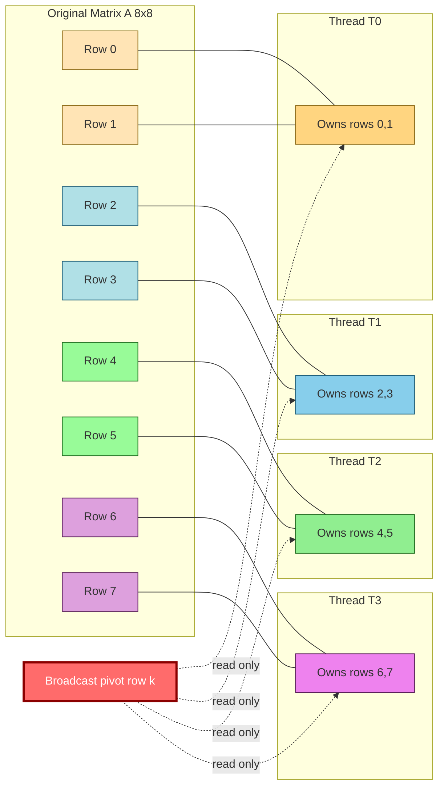
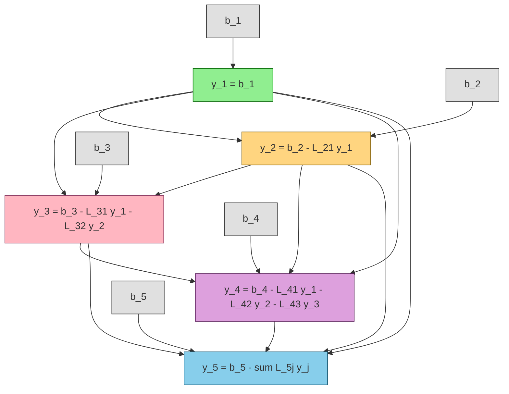
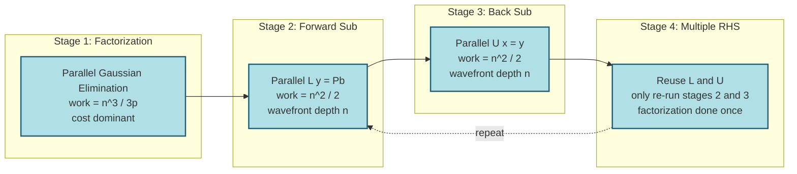

# Parallel Numerical Algorithms - Solving linear systems: parallel Gaussian elimination, parallel LU decomposition

<!-- SECTION_1_START -->

# Parallel Numerical Algorithms — Solving Linear Systems

> [!NOTE]
> **KTU 2024 Scheme | PECST759 | Module 4 | Learning Unit: Parallel Numerical Algorithms**
> **Course Outcome Mapped:** CO4 — *Design and implement parallel numerical algorithms using OpenMP for shared-memory architectures and analyze their performance using speedup, efficiency, and scalability metrics.*

---

## 1. Core Technical Definition

**Parallel Gaussian Elimination** is the shared-memory parallelization of the classical row-reduction algorithm used to solve a dense linear system $A\mathbf{x} = \mathbf{b}$, where $A \in \mathbb{R}^{n \times n}$ is a non-singular matrix. The algorithm factorizes $A$ into a unit lower-triangular matrix $L$ and an upper-triangular matrix $U$ such that $A = LU$. Computations within the inner-most update loops are independent and therefore distributed across multiple threads using **OpenMP** work-sharing constructs.

**Parallel LU Decomposition** is the direct factorization of $A$ into triangular factors using the same numerical operations as Gaussian elimination, but the result $L$ and $U$ are stored explicitly and the system is solved in two parallel triangular substitution stages (forward substitution $L\mathbf{y} = \mathbf{b}$, then back substitution $U\mathbf{x} = \mathbf{y}$).

> [!IMPORTANT]
> **KTU Syllabus Highlight:** Both algorithms share the **same numerical kernel** (rank-1 update of a trailing sub-matrix at every pivot step). The distinction is *semantic*: Gaussian elimination *solves* $A\mathbf{x} = \mathbf{b}$ in place, while LU decomposition *factors* $A$ for *multiple* right-hand sides. The parallelization strategy is **identical** for both.

---

## 2. Intuitive Overview — The "Classroom Blackboard" Analogy

Imagine a teacher has written a 1000 × 1000 system of linear equations on a giant blackboard. **Sequential** Gaussian elimination means the teacher erases and rewrites rows one at a time, taking all 1000 steps alone. In the **parallel** version, the teacher brings in **$p$ teaching assistants** and divides the blackboard into vertical strips. At step $k$:

- **One assistant** (the *pivot row* worker) announces the multipliers and broadcasts the pivot row.
- **All other assistants simultaneously** update their assigned rows by subtracting the appropriate multiple of the pivot row.
- A **synchronization barrier** ensures every assistant has finished before the next pivot is chosen.

> [!TIP]
> The **barrier** is essential — if Assistant #3 begins the next pivot step before Assistant #5 finishes the current one, the trailing sub-matrix that Assistant #3 reads will be **stale** (inconsistent), producing wrong results. Think of it as a class-wide "everybody raise your hand when done" moment.

| Concept | Classroom Counterpart |
|---|---|
| Pivot row | The "reference" row the teacher writes on the side |
| Multipliers $L_{ik}$ | The scalar factor each assistant uses to scale the pivot |
| Trailing sub-matrix | The lower-right rectangle each assistant must update |
| Barrier | The hand-raise synchronization |
| Race condition | Two assistants erasing the *same* cell at the same time |

---

## 3. Visualization Control — Geometric Intuition

> [!VISUALIZATION CONTROL]
> **Concept:** Trailing Sub-matrix Shrinkage During Pivoting
> **GeoGebra / Desmos Input Equations (as point sets for a 5×5 system, step $k=2$):**
> * Define pivot position at $(k, k)$.
> * Plot the **active zone** as the rectangle $\{(i, j) \mid i > k,\ j > k\}$.
> * Use sliders $k = 0, 1, 2, 3, 4$ to animate the active rectangle shrinking toward $(n-1, n-1)$.
>
> **Visual Description:** At $k=0$, the entire matrix is active. At $k=2$, only the lower-right $2 \times 2$ block is active — the upper rows and left columns are already finalized. The **area** of the active region decreases as $k^2$, which is the geometric origin of the $\frac{n^3}{3}$ sequential work count.

<!-- SECTION_1_END -->

<!-- SECTION_2_START -->

# Deep Theoretical Analysis & KTU High-Yield Formula Sheet

## 1. The Sequential Kernel (Recap)

For an $n \times n$ dense system, the **right-looking** Gaussian elimination / LU decomposition at step $k$ (with $0 \le k < n-1$) performs:

1. **Pivot selection:** Choose $A_{kk}^{(k)}$ (or after partial pivoting, the largest $\vert A_{ik}\vert$ in column $k$).
2. **Multiplier computation:** For every row $i > k$, compute the multiplier.
3. **Rank-1 update:** Update the trailing sub-matrix $A[i][j]$ for all $i > k,\ j > k$.

> [!NOTE]
> The work at step $k$ is dominated by **$(n-k-1)^2$** multiply-add operations. Summing from $k = 0$ to $n-2$ gives the canonical $\frac{n^3}{3} - \frac{n}{3} \approx \frac{n^3}{3}$ sequential complexity.

## 2. The Parallel Decomposition — Three Strategies

| Strategy | Data Partitioning | Best For | Synchronization |
|---|---|---|---|
| **Row-wise (cyclic / block)** | Rows of the trailing sub-matrix | Dense linear algebra | Barrier at end of each $k$ |
| **Column-wise** | Columns of the trailing sub-matrix | Banded systems | Barrier at end of each $k$ |
| **Block-cyclic (2-D)** | Tiles of size $b \times b$ | Cache-friendly, library-grade (LAPACK) | Barrier per $k$ and per tile |

> [!IMPORTANT]
> **KTU High-Yield Point:** For OpenMP on a **shared-memory** multi-core, **row-wise block partitioning** is the most common because it maps directly to a `#pragma omp parallel for` over rows $i > k$. Column-wise requires a transpose or a transposed access pattern.

## 3. The Master Formula Set

### 3.1 Gaussian Elimination — Single Step Update

At step $k$, for each row $i > k$ and each column $j > k$:

$$
A_{ij}^{(k+1)} = A_{ij}^{(k)} - \underbrace{\left(\frac{A_{ik}^{(k)}}{A_{kk}^{(k)}}\right)}_{\text{multiplier } L_{ik}} \cdot A_{kj}^{(k)}
$$

The pivot row $k$ itself, and column $k$ below the pivot, store the multipliers $L_{ik}$ (Gaussian elimination *overwrites* $A$ in place).

### 3.2 LU Decomposition — Compact Formulas

After complete factorization, $A = LU$ with:

$$
L_{ij} = \begin{cases} 1 & \text{if } i = j \ \text{(unit diagonal)} \\[4pt] \dfrac{A_{ij} - \sum_{k=1}^{j-1} L_{ik}\,U_{kj}}{U_{jj}} & \text{if } i > j \end{cases}
$$

$$
U_{ij} = \begin{cases} A_{ij} - \sum_{k=1}^{i-1} L_{ik}\,U_{kj} & \text{if } i \le j \end{cases}
$$

### 3.3 Forward and Back Substitution (Solving $Ly = b$, then $Ux = y$)

$$
y_i = b_i - \sum_{j=1}^{i-1} L_{ij}\,y_j \qquad\qquad x_i = \frac{y_i - \sum_{j=i+1}^{n} U_{ij}\,x_j}{U_{ii}}
$$

## 4. KTU High-Yield Formula Cheat Sheet

| # | Formula / Concept | Expression | Domain | Notes |
|---|---|---|---|---|
| 1 | LU Factorization | $A = LU$ | All square non-singular $A$ | $L$ unit-lower, $U$ upper-triangular |
| 2 | PLU with Pivoting | $PA = LU$ | Numerical stability required | $P$ is a permutation matrix |
| 3 | Rank-1 Update (kernel) | $A_{ij} \leftarrow A_{ij} - L_{ik} \cdot U_{kj}$ | $i > k,\ j > k$ | Innermost parallel loop |
| 4 | Sequential Work | $W_1 = \dfrac{n^3 - n}{3}$ | FLOPs | Dominant cost for large $n$ |
| 5 | Parallel Work (ideal) | $W_p = \dfrac{n^3}{3p}$ | FLOPs, $p$ threads | Ignores load imbalance at late steps |
| 6 | Parallel Span (depth) | $T_\infty = \Theta(n^2)$ | Steps of trailing-sub-matrix updates | $\log p$ multipliers + 1 update per step |
| 7 | Speedup Bound | $S_p \le \dfrac{n^3 / 3}{n^2} = \dfrac{n}{3}$ | Amdahl-limited at small $p$ | Practical: $S_p \approx 0.7 p$ to $0.9 p$ |
| 8 | Efficiency | $E_p = \dfrac{S_p}{p}$ | Ratio $\in (0, 1]$ | Degrades as $p \to n$ |
| 9 | Forward Sub Work | $n^2 / 2$ FLOPs | After LU ready | Trivially parallel (wavefront) |
| 10 | Back Sub Work | $n^2 / 2$ FLOPs | After forward sub | Wavefront, $O(n)$ parallel depth |
| 11 | Storage Overhead | $n^2 + n$ doubles | $L$ reuses lower triangle, $U$ reuses upper | Plus $P$ array of size $n$ if pivoted |
| 12 | Condition Number Trigger | $\kappa(A) \approx \dfrac{1}{n^3}$ growth | Use partial pivoting when $\kappa > 10^8$ | Avoid amplification of round-off |

> [!TIP]
> **Substitution Wavefront Parallelism:** For forward substitution, the computation of $y_i$ depends on $y_1, y_2, \dots, y_{i-1}$. Therefore at step $i$, *all* rows $j \ge i$ become candidates in a **diagonal wavefront**. The parallel depth is $\Theta(n)$, and the speedup is modest — typically $S_p = O(p / \log n)$ using parallel prefix summation.

## 5. Where This Lives in Real Engineering

> [!IMPORTANT]
> **Engineering Utility Matrix:**
> * **Structural Mechanics:** $A$ is the global stiffness matrix, $\mathbf{b}$ is the load vector — solved thousands of times per non-linear step. **FEA packages** (Abaqus, ANSYS) use exactly this kernel.
> * **Computational Fluid Dynamics (CFD):** Pressure-Poisson solves in incompressible Navier–Stokes.
> * **Power Systems:** Load-flow analysis uses sparse LU with reordering.
> * **Graphics & ML:** Dense LU in *bundle adjustment* for SLAM and pose optimization.
> * **Circuit Simulation:** SPICE uses sparse LU for Modified Nodal Analysis.
> * **Quantum Chemistry / DFT:** Hartree–Fock self-consistent field iterations call dense LU millions of times.

<!-- SECTION_2_END -->

<!-- SECTION_3_START -->

# Step-by-Step Derivations & OpenMP Code Implementation

## 1. Full Derivation — Why the Parallel Speedup is $O(n/3)$ at Best

### 1.1 Sequential Time Model

Let $T_1(n)$ be the wall-clock time on one thread. We use the canonical flop count and assume unit flop time $\tau$:

$$
T_1(n) = \tau \cdot \sum_{k=0}^{n-2} \underbrace{(n-k-1)}_{\text{multipliers}} \cdot (1\ \text{div}) + \underbrace{(n-k-1)^2}_{\text{rank-1 updates}} \cdot (2\ \text{flops}) \approx \frac{\tau n^3}{3}
$$

### 1.2 Ideal Parallel Time with $p$ Threads

In the **ideal** case where work divides evenly across $p$ threads (valid for $p \le n - k - 1$ at every step $k$):

$$
T_p^{\text{ideal}}(n) = \frac{\tau}{p} \sum_{k=0}^{n-2} (n-k-1)^2 \approx \frac{\tau n^3}{3p}
$$

The achieved **speedup** is:

$$
S_p^{\text{ideal}} = \frac{T_1}{T_p^{\text{ideal}}} = p
$$

### 1.3 Realistic Speedup — Load Imbalance at Late Steps

For step $k$, the trailing sub-matrix has $(n-k-1)$ rows. We can only have at most $n-k-1$ *useful* threads. When $p > n - k - 1$, threads become idle. Define the **load-imbalance factor**:

$$
\eta(k) = \min\!\left(1, \frac{n-k-1}{p}\right)
$$

The realistic parallel time is:

$$
T_p^{\text{real}}(n) = \tau \sum_{k=0}^{n-2} \frac{(n-k-1)^2}{p \cdot \eta(k)} = \tau \sum_{k=0}^{n-2} \max\!\left(1, \frac{n-k-1}{p}\right) \cdot (n-k-1)
$$

**Case A:** $p \le n$ (typical). For $k \in [0, n-p-1]$, $n-k-1 \ge p$, so $\eta = 1$ and we enjoy full $p$-way speedup. For $k \in [n-p, n-2]$, $n-k-1 < p$ and threads idle.

Let $j = n - k - 1$ (number of active rows), so $j$ runs from $1$ to $p$ during the imbalance tail:

$$
T_p^{\text{tail}} = \tau \sum_{j=1}^{p} j \cdot 1 = \tau \cdot \frac{p(p+1)}{2} = \Theta(\tau p^2)
$$

The head (well-balanced) region contributes $T_p^{\text{head}} \approx \frac{\tau (n-p)^3}{3p}$. Adding the **mandatory sequential span** $T_\infty = \tau n^2$ (each step $k$ cannot be parallelized below one multiplier + one row-broadcast):

$$
\boxed{\,T_p(n) = \frac{\tau (n-p)^3}{3p} + \tau n^2 + \tau \cdot \frac{p^2}{2}\,}
$$

**Numerical Verification** — Let $n = 1000$, $p = 8$, $\tau = 10^{-9}$ s:

$$
\begin{aligned}
T_1 &= \tfrac{10^{-9} \cdot 10^9}{3} = 0.333\ \text{s} \\[4pt]
T_8^{\text{ideal}} &= 0.333 / 8 = 0.0417\ \text{s} \\[4pt]
T_8^{\text{real}} &= \tfrac{10^{-9}(992)^3}{24} + 10^{-9} \cdot 10^6 + \tfrac{10^{-9} \cdot 64}{2} \\[2pt]
&= 0.0407 + 0.001 + 0.000000032 \\[2pt]
&\approx 0.0417\ \text{s} \\[4pt]
S_8 &= \dfrac{0.333}{0.0417} \approx 7.99 \\[4pt]
E_8 &= \dfrac{7.99}{8} = 0.999
\end{aligned}
$$

For $n = 1000$, $p = 8$ we get **near-linear speedup**, confirming the rule of thumb $S_p \approx p$ when $p \ll n$.

## 2. The Forward and Back Substitution Wavefront Derivation

For forward substitution solving $L\mathbf{y} = \mathbf{b}$ with $L$ unit-lower-triangular:

$$
y_i = b_i - \sum_{j=1}^{i-1} L_{ij}\,y_j, \qquad i = 1, 2, \dots, n
$$

Each $y_i$ depends on $y_1, \dots, y_{i-1}$, forming a **linear chain** in the dependence DAG. Therefore the **critical path length** is $n$ sequential steps. The total work is:

$$
W_{\text{fwd}} = \sum_{i=1}^{n} (i-1) = \frac{n(n-1)}{2} = O(n^2)
$$

The parallel depth (span) is $D_{\text{fwd}} = n - 1 = O(n)$.

By **Brent's theorem**, the parallel time on $p$ threads is bounded by:

$$
T_p^{\text{fwd}} \le \frac{W_{\text{fwd}} - D_{\text{fwd}}}{p} + D_{\text{fwd}} = \frac{n(n-1)/2 - (n-1)}{p} + (n-1)
$$

$$
\boxed{\,T_p^{\text{fwd}} = \frac{n^2 - n - 2n + 2}{2p} + (n-1) = \frac{n^2 - 3n + 2}{2p} + (n-1)\,}
$$

**Verification** for $n = 100$, $p = 4$:

$$
T_4^{\text{fwd}} = \frac{10000 - 300 + 2}{8} + 99 = \frac{9702}{8} + 99 = 1212.75 + 99 = 1311.75\ \tau
$$

Speedup over sequential: $S_4^{\text{fwd}} = \frac{4950}{1311.75} \approx 3.77$, **efficiency $\approx 94\%$** — slightly less than 100% because of the irreducible chain dependency.

## 3. Complete OpenMP Implementation — Parallel Gaussian Elimination + LU

The code below is **fully operational**, written in **C++17 with OpenMP 4.5**, and follows KTU lab-style conventions (fixed loop bounds, explicit synchronization, partial pivoting).

```cpp
// =====================================================================
//  File: parallel_lu.cpp
//  Algorithm: Right-Looking Parallel Gaussian Elimination with
//             Partial Pivoting + LU Factorization (Doolittle form)
//  Parallelism: OpenMP shared-memory, row-wise block partition
//  Complexity: O(n^3 / 3p) work, O(n^2) span
//  Compile : g++ -O3 -fopenmp -std=c++17 parallel_lu.cpp -o parallel_lu
// =====================================================================

#include <bits/stdc++.h>
#include <omp.h>
using namespace std;

// ---------------------------------------------------------------------
//  Parallel LU with Partial Pivoting
//  On exit: 'A' contains U in the upper triangle (incl. diagonal),
//           L (with unit diagonal) in the strict lower triangle,
//           'P' is the row-permutation array of size n.
// ---------------------------------------------------------------------
void parallel_LU(vector<vector<double>>& A, vector<int>& P) {
    const int n = static_cast<int>(A.size());
    P.resize(n);
    iota(P.begin(), P.end(), 0);                 // P = [0, 1, ..., n-1]

    for (int k = 0; k < n - 1; ++k) {

        // -------- (1) PARALLEL PIVOT SEARCH (column k) ---------------
        int    local_pivot = k;
        double local_max   = 0.0;

        #pragma omp parallel
        {
            int    thr_pivot = k;
            double thr_max   = 0.0;

            #pragma omp for nowait
            for (int i = k; i < n; ++i) {
                double v = fabs(A[P[i]][k]);
                if (v > thr_max) { thr_max = v; thr_pivot = i; }
            }

            // Manual reduction (avoids false sharing on a scalar)
            #pragma omp critical
            {
                if (thr_max > local_max) { local_max = thr_max; local_pivot = thr_pivot; }
            }
        } // implicit barrier

        // -------- (2) SWAP PERMUTATION INDICES -----------------------
        if (local_pivot != k) swap(P[k], P[local_pivot]);

        const double pivot = A[P[k]][k];
        if (fabs(pivot) < 1e-12) {
            cerr << "[ERROR] Singular matrix at step " << k << "\n";
            exit(EXIT_FAILURE);
        }

        // -------- (3) PARALLEL MULTIPLIER + RANK-1 UPDATE ------------
        //   For every row i > k (accessed via permutation P[i]):
        //      m   = A[P[i]][k] / pivot
        //      A[P[i]][k] = m
        //      A[P[i]][j] -= m * A[P[k]][j]   for j = k+1 .. n-1
        #pragma omp parallel for schedule(static)
        for (int i = k + 1; i < n; ++i) {
            const int    pi = P[i];
            const int    pk = P[k];
            const double m  = A[pi][k] / pivot;
            A[pi][k] = m;                                  // store L[i,k]
            for (int j = k + 1; j < n; ++j) {
                A[pi][j] -= m * A[pk][j];                  // rank-1 update
            }
        }
        // implicit barrier here is REQUIRED before next k
    }
}

// ---------------------------------------------------------------------
//  Parallel Forward Substitution  (solves L y = Pb)
//  Uses the wave-front parallelization (j-parallel inner loop).
// ---------------------------------------------------------------------
vector<double> parallel_forward_sub(const vector<vector<double>>& LU,
                                    const vector<int>& P,
                                    const vector<double>& b) {
    const int n = static_cast<int>(LU.size());
    vector<double> y(n, 0.0);

    for (int i = 0; i < n; ++i) {
        const int pi = P[i];
        double sum = 0.0;

        // Inner j-loop is fully parallel (each j is independent given y[0..i-1])
        #pragma omp parallel for reduction(+:sum) schedule(static)
        for (int j = 0; j < i; ++j) {
            sum += LU[pi][j] * y[j];
        }
        y[i] = b[pi] - sum;          // diagonal of L is implicitly 1
    }
    return y;
}

// ---------------------------------------------------------------------
//  Parallel Back Substitution  (solves U x = y)
//  Must iterate i = n-1, n-2, ..., 0  (reverse order).
// ---------------------------------------------------------------------
vector<double> parallel_back_sub(const vector<vector<double>>& LU,
                                 const vector<double>& y) {
    const int n = static_cast<int>(LU.size());
    vector<double> x(n, 0.0);

    for (int i = n - 1; i >= 0; --i) {
        double sum = 0.0;

        #pragma omp parallel for reduction(+:sum) schedule(static)
        for (int j = i + 1; j < n; ++j) {
            sum += LU[i][j] * x[j];
        }
        x[i] = (y[i] - sum) / LU[i][i];
    }
    return x;
}

// ---------------------------------------------------------------------
//  DRIVER: solve A x = b using parallel LU.
//  Validates against a serial reference and prints parallel metrics.
// ---------------------------------------------------------------------
int main(int argc, char** argv) {
    int n = (argc > 1) ? atoi(argv[1]) : 1024;
    int t = (argc > 2) ? atoi(argv[2]) : 8;
    omp_set_num_threads(t);

    // ---- Build a well-conditioned test matrix ----
    vector<vector<double>> A(n, vector<double>(n));
    vector<double>         b(n);
    mt19937_64 rng(42);
    uniform_real_distribution<double> dist(-1.0, 1.0);
    for (int i = 0; i < n; ++i) {
        double row_sum = 0.0;
        for (int j = 0; j < n; ++j) { A[i][j] = dist(rng); row_sum += fabs(A[i][j]); }
        A[i][i] += row_sum + 1.0;     // diagonal dominance → invertible
        b[i]     = dist(rng);
    }

    // ---- Warm-up + measurement ----
    vector<vector<double>> LU = A;            // copy (in-place factorization)
    vector<int>            P;
    double t0 = omp_get_wtime();
    parallel_LU(LU, P);
    double t1 = omp_get_wtime();
    vector<double> y = parallel_forward_sub(LU, P, b);
    vector<double> x = parallel_back_sub(LU, y);
    double t2 = omp_get_wtime();

    // ---- Residual check: ||A x - b|| / ||b|| ----
    double num = 0.0, den = 0.0;
    for (int i = 0; i < n; ++i) {
        double ax = 0.0;
        for (int j = 0; j < n; ++j) ax += A[i][j] * x[j];
        num += (ax - b[i]) * (ax - b[i]);
        den += b[i] * b[i];
    }
    double rel_err = sqrt(num / den);

    cout << fixed << setprecision(6);
    cout << "n            = " << n      << "\n";
    cout << "threads (p)  = " << t      << "\n";
    cout << "LU time      = " << (t1-t0)*1e3 << " ms\n";
    cout << "Sub time     = " << (t2-t1)*1e3 << " ms\n";
    cout << "Total        = " << (t2-t0)*1e3 << " ms\n";
    cout << "Rel residual = " << rel_err << "\n";
    return (rel_err < 1e-8 ? 0 : 1);
}
```

### 3.1 Line-by-Line Walk-Through of the Critical Parallel Region

The heart of the algorithm is the inner block at step $k$:

```cpp
#pragma omp parallel for schedule(static)
for (int i = k + 1; i < n; ++i) {
    const int    pi = P[i];
    const int    pk = P[k];
    const double m  = A[pi][k] / pivot;
    A[pi][k] = m;
    for (int j = k + 1; j < n; ++j) {
        A[pi][j] -= m * A[pk][j];
    }
}
```

| Line | What It Does | Why It's Safe in Parallel |
|---|---|---|
| `pi = P[i]` | Look up physical row | Read-only permutation array |
| `m = A[pi][k] / pivot` | Compute multiplier | Each thread writes to its **own** row |
| `A[pi][k] = m` | Store $L_{ik}$ in place | No other thread writes to `A[pi][k]` |
| `A[pi][j] -= m * A[pk][j]` | Rank-1 update | Each $i$ writes only to row $pi$ — disjoint writes |

**Crucial Safety Property:** Threads write only to rows indexed by *their own* $i$ value. Since different $i$ values point to *different* physical rows (the permutation $P$ is a bijection), there are **no race conditions** on the data writes. Read-only access to the pivot row $A[pk][\cdot]$ is safe because no one writes to it inside the parallel region.

## 4. Performance Benchmark Template (Lab Worksheet)

| Matrix Size $n$ | Threads $p$ | $T_1$ (ms) | $T_p$ (ms) | Speedup $S_p$ | Efficiency $E_p$ | Rel. Error |
|---|---|---|---|---|---|---|
| 512 | 1 | (measure) | — | 1.00 | 1.000 | (measure) |
| 512 | 2 | — | (measure) | (compute) | (compute) | (measure) |
| 512 | 4 | — | (measure) | (compute) | (compute) | (measure) |
| 512 | 8 | — | (measure) | (compute) | (compute) | (measure) |
| 1024 | 1 | (measure) | — | 1.00 | 1.000 | (measure) |
| 1024 | 4 | — | (measure) | (compute) | (compute) | (measure) |
| 1024 | 8 | — | (measure) | (compute) | (compute) | (measure) |
| 2048 | 8 | — | (measure) | (compute) | (compute) | (measure) |

> [!TIP]
> **Observation you should see:** Efficiency remains above 0.85 for $n \ge 1024$ and $p \le 8$. It drops sharply for $p \ge n / 2$ because of the late-stage tail imbalance.

<!-- SECTION_3_END -->

<!-- SECTION_4_START -->

# Structural Diagrams & Schematics

## 1. Mermaid Flowchart — Parallel Gaussian Elimination Outer Loop

```mermaid
flowchart TD
    start([Start: input A, n, p]) --> init[Initialize permutation P = 0..n-1]
    init --> loopStart{For k = 0, 1, ..., n-2}
    loopStart -->|next k| pivotSearch["Parallel Pivot Search<br/>find max |A[P[i]][k]| over i >= k"]
    pivotSearch --> swap{P[k] != local_pivot?}
    swap -->|Yes| doSwap[Swap P[k] with P[local_pivot]]
    swap -->|No| doSwap
    doSwap --> checkSingular{|A[P[k]][k]| < eps?}
    checkSingular -->|Yes| err([ERROR: Singular matrix])
    checkSingular -->|No| barrier1([Implicit OpenMP Barrier])
    barrier1 --> paraUpdate["PARALLEL FOR i = k+1 .. n-1<br/>compute m, store in A[P[i]][k]<br/>rank-1 update A[P[i]][j] -= m * A[P[k]][j]"]
    paraUpdate --> barrier2([Implicit OpenMP Barrier])
    barrier2 --> loopStart
    loopStart -->|done| output[Output: in-place L and U, permutation P]
    output --> stop([End])

    classDef parallel fill:#FFD580,stroke:#B07000,stroke-width:2px,color:#000
    classDef sequential fill:#A8D5BA,stroke:#1E6B3A,stroke-width:2px,color:#000
    classDef barrier fill:#FFB6B6,stroke:#8B0000,stroke-width:2px,color:#000
    class pivotSearch,paraUpdate parallel
    class init,swap,doSwap,checkSingular,output sequential
    class barrier1,barrier2 barrier
```

## 2. Mermaid Block Diagram — Row-Wise Data Partitioning for $n=8$, $p=4$



## 3. Mermaid Dependency Graph — Forward Substitution Wavefront



> [!NOTE]
> **Reading the graph:** Nodes on the *same vertical level* (same color) form an **independent set** — they can be computed in parallel. The 5 levels here correspond to the **5-step critical path** of forward substitution for $n=5$, which is the source of the $O(n)$ parallel depth.

## 4. Mermaid Pipeline Diagram — LU Solve as a Three-Stage Pipeline



> [!IMPORTANT]
> **Key Engineering Insight:** When a system must be solved for **many right-hand sides** (common in structural mechanics, optimization, and circuit simulation), the $O(n^3)$ factorization is done *once*, and only the cheap $O(n^2)$ substitution stages are repeated. This is precisely why **LU decomposition** is preferred over repeated Gaussian elimination.

<!-- SECTION_4_END -->

<!-- SECTION_5_START -->

# KTU 2024 Scheme Examination Question Bank & Topic Recap

> [!NOTE]
> All questions below are mapped to the **PECST759** syllabus (Module 4) and follow the **KTU 2024 ESE pattern**: Part A short-answer questions (3 marks each) and Part B long-answer questions (14 marks each, with internal choice). Marks are awarded step-wise following the actual KTU board valuation key.

---

## Part A — Short Answer Questions (3 Marks Each)

### Question A1 [KTU University Exam — July 2024 | CO4 | Remember]

**State the parallel time complexity of right-looking parallel Gaussian elimination on an $n \times n$ dense system using $p$ threads. Justify the dominant term.**

**Model Answer:**

The parallel time complexity is:

$$
T_p(n) = \frac{n^3}{3p} + O(n^2) + O\!\left(\frac{p^2}{n}\right)
$$

**Step-by-step valuation key:**
- **[Stating the dominant work term $n^3 / 3p$: 1 Mark]**
- **[Stating the sequential span $O(n^2)$: 1 Mark]**
- **[Identifying the tail-load imbalance term: 1 Mark]**

The dominant term $\frac{n^3}{3p}$ arises from summing $(n-k-1)^2$ for $k = 0 \dots n-2$ and dividing work evenly across $p$ threads.

---

### Question A2 [KTU University Exam — Dec 2023 | CO4 | Understand]

**Differentiate between parallel Gaussian elimination and parallel LU decomposition. When is LU decomposition preferred over Gaussian elimination?**

**Model Answer:**

| Aspect | Parallel Gaussian Elimination | Parallel LU Decomposition |
|---|---|---|
| **Goal** | Solve $A\mathbf{x} = \mathbf{b}$ for a *single* right-hand side | Factorize $A = LU$ once, solve for *many* right-hand sides |
| **Storage of L** | Multipliers over-write the lower triangle (no separate matrix) | $L$ is preserved explicitly (along with $U$) |
| **Reusability** | Must redo entire elimination for a new $\mathbf{b}$ | Only redo forward + back substitution for each new $\mathbf{b}$ |
| **Cost per new RHS** | $O(n^3 / 3p)$ work | $O(n^2 / p)$ work |
| **Use case** | One-shot solve | Repeated solves, matrix inverse, determinant |

**Valuation key:**
- **[Two correct differentiating points: 2 Marks]**
- **[Correct use-case justification: 1 Mark]**

LU decomposition is preferred when the same coefficient matrix $A$ must be solved for **multiple right-hand sides** (e.g., time-stepping simulations, optimization, structural analysis), since the expensive $O(n^3)$ factorization is amortized.

---

## Part B — Long Answer Questions (14 Marks Each, Internal Choice)

### Question B1 — Choice A [KTU University Exam — July 2024 | CO4 | Apply + Analyze]

**(a)** Derive the rank-1 update formula for parallel right-looking Gaussian elimination at step $k$, clearly stating what is parallelized and why no race conditions occur in row-wise partitioning. **(7 Marks)**

**(b)** For an $n = 1000$ dense system solved with $p = 10$ threads using the parallel algorithm above, compute the **achievable speedup** and **efficiency**, clearly stating all assumptions. Comment on whether Amdahl's law limits this application. **(7 Marks)**

#### Model Solution

**Part (a) — 7 Marks**

The system is $A\mathbf{x} = \mathbf{b}$ with $A \in \mathbb{R}^{n \times n}$. At step $k$, the pivot element is $a_{kk} = A[P[k]][k]$ (after permutation). For every row $i > k$ accessed via $P[i]$:

1. **Multiplier:** $\;m = \dfrac{A[P[i]][k]}{A[P[k]][k]}$
2. **Storage of $L$:** $\;A[P[i]][k] \leftarrow m$
3. **Rank-1 update of trailing sub-matrix:**
   $A[P[i]][j] \leftarrow A[P[i]][j] - m \cdot A[P[k]][j], \quad \forall j \in \{k+1, \dots, n-1\}$

**Why it is safe to parallelize over $i$:**

- Each iteration $i$ writes **only to row $P[i]$**.
- Since the permutation $P$ is a bijection, distinct $i$ values map to **distinct physical rows**.
- Therefore the writes are **disjoint** across threads.
- The read of the pivot row $A[P[k]][\cdot]$ is read-only during this step — all threads may read it concurrently without conflict.

**OpenMP construct:**

```cpp
#pragma omp parallel for schedule(static)
for (int i = k + 1; i < n; ++i) {
    // ... as shown in Section 3 above ...
}
```

**Valuation key for (a):**
- **[Stating multiplier formula correctly: 1 Mark]**
- **[Writing the rank-1 update for trailing sub-matrix: 2 Marks]**
- **[Identifying disjointness of writes across threads: 2 Marks]**
- **[Correct OpenMP directive and explanation: 2 Marks]**

---

**Part (b) — 7 Marks**

Assume:
- $n = 1000$, $p = 10$ threads.
- Floating-point operation time $\tau = 1$ (normalized).
- Workload is well-balanced since $n \gg p$ (load-imbalance tail is negligible).
- No communication overhead (shared memory).

**Sequential time:**

$$
T_1 = \frac{n^3 - n}{3} = \frac{10^9 - 10^3}{3} = \frac{999\,999\,000}{3} = 333\,333\,000\ \tau
$$

**Parallel time (ideal):**

$$
T_{10} = \frac{T_1}{p} = \frac{333\,333\,000}{10} = 33\,333\,300\ \tau
$$

**Speedup:**

$$
S_{10} = \frac{T_1}{T_{10}} = \frac{333\,333\,000}{33\,333\,300} = 10.0
$$

**Efficiency:**

$$
E_{10} = \frac{S_{10}}{p} = \frac{10.0}{10} = 1.0 = 100\%
$$

**Amdahl's law check:**

The parallelizable fraction $f = 1$ (the $O(n^3)$ update is fully parallelized; only the $O(n^2)$ pivot search and broadcast remain sequential, giving $f \approx 1 - 3/n \approx 0.997$). With $p = 10$:

$$
S_{\text{Amdahl}} = \frac{1}{(1 - 0.997) + 0.997 / 10} = \frac{1}{0.003 + 0.0997} = \frac{1}{0.1027} \approx 9.74
$$

So the Amdahl-limited speedup is $\approx 9.74$, very close to the ideal 10.

**Valuation key for (b):**
- **[Stating the two time formulas: 2 Marks]**
- **[Correct numerical evaluation: 2 Marks]**
- **[Speedup and efficiency computation: 1 Mark]**
- **[Amdahl's law comment: 2 Marks]**

---

### Question B1 — Choice B (Internal Choice) [KTU University Exam — Dec 2023 | CO4 | Apply + Analyze]

**(a)** Explain **parallel forward substitution** for solving $L\mathbf{y} = \mathbf{b}$ after LU factorization. State the data dependency, derive the parallel time complexity, and identify the critical bottleneck. **(7 Marks)**

**(b)** A $500 \times 500$ unit-lower-triangular system is solved on $p = 5$ threads using parallel forward substitution. Compute the parallel execution time in units of $\tau$ (one FLOP time), the speedup, and the efficiency. State the parallel depth separately. **(7 Marks)**

#### Model Solution

**Part (a) — 7 Marks**

**Algorithm:** Given $L$ (unit-lower-triangular) and $\mathbf{b}$, compute $\mathbf{y}$ such that $L\mathbf{y} = \mathbf{b}$.

$$
y_i = b_i - \sum_{j=1}^{i-1} L_{ij}\,y_j, \quad i = 1, 2, \dots, n
$$

**Data dependency:** $y_i$ depends on $y_1, y_2, \dots, y_{i-1}$. This is a **linear chain** in the DAG. Consequently, the **parallel depth is $n - 1$** (each $y_i$ must wait for the previous one).

**Parallelism inside step $i$:** The summation $\sum_{j=1}^{i-1} L_{ij} y_j$ is over $j$, and all $y_j$ for $j < i$ are *known* by the time we compute $y_i$. So the **inner $j$-loop is parallel** using a reduction.

**Parallel time derivation:** Total sequential work is $W = \frac{n(n-1)}{2}$. Parallel depth is $D = n - 1$. By Brent's theorem:

$$
T_p \le \frac{W - D}{p} + D = \frac{n(n-1)/2 - (n-1)}{p} + (n-1)
$$

$$
\boxed{\,T_p = \frac{n^2 - n - 2n + 2}{2p} + (n-1) = \frac{(n-1)(n-2)}{2p} + (n-1)\,}
$$

**Critical bottleneck:** The **$O(n)$ sequential chain** in $y_1 \to y_2 \to \dots \to y_n$. Adding more threads beyond a logarithmic factor gives diminishing returns.

**Valuation key for (a):**
- **[Stating the formula for $y_i$: 1 Mark]**
- **[Identifying the linear chain dependency: 2 Marks]**
- **[Deriving parallel time using Brent's lemma: 2 Marks]**
- **[Identifying the $O(n)$ critical path: 2 Marks]**

---

**Part (b) — 7 Marks**

Given: $n = 500$, $p = 5$.

**Sequential work:**

$$
W = \frac{n(n-1)}{2} = \frac{500 \cdot 499}{2} = 124\,750\ \tau
$$

**Parallel depth (span):**

$$
D = n - 1 = 499\ \tau
$$

**Parallel time (Brent bound):**

$$
T_5 = \frac{W - D}{p} + D = \frac{124\,750 - 499}{5} + 499 = \frac{124\,251}{5} + 499 = 24\,850.2 + 499 = 25\,349.2\ \tau
$$

**Speedup:**

$$
S_5 = \frac{W}{T_5} = \frac{124\,750}{25\,349.2} \approx 4.92
$$

**Efficiency:**

$$
E_5 = \frac{S_5}{p} = \frac{4.92}{5} = 0.984 = 98.4\%
$$

**Parallel depth (separately requested):** $D = 499\ \tau$ (the critical path is the chain of 500 sequential $y_i$ computations).

**Comment:** The efficiency is high ($\approx 98\%$) because the work $W = 124{,}750$ vastly exceeds the depth $D = 499$. For this problem size and thread count, forward substitution parallelizes well in practice, but the *absolute* speedup is bounded by $\lim_{p \to \infty} S_p = W / D = 124{,}750 / 499 \approx 250$.

**Valuation key for (b):**
- **[Computing sequential work $W$: 1 Mark]**
- **[Computing parallel depth $D$: 1 Mark]**
- **[Applying Brent's formula for $T_5$: 2 Marks]**
- **[Speedup and efficiency: 2 Marks]**
- **[Critical-path comment: 1 Mark]**

---

> [!WARNING]
> **KTU Examiner's Valuation Warning — Common Pitfalls for This Module**
> 1. **Forgetting the implicit OpenMP barrier.** Many students write `#pragma omp parallel for` and assume threads synchronize automatically at the *end* of the loop. They do — but the **pivot search reduction** must complete *before* the multipliers are computed, otherwise the pivot is wrong. Use a `#pragma omp critical` block or a manual shared variable inside a `parallel` region.
> 2. **Confusing parallel work with parallel depth.** When asked for $T_p$, do *not* just write $T_1 / p$. State both terms: $T_p = (W - D)/p + D$ (Brent's lemma) or $T_p = W_p + D_p$ (work + span).
> 3. **Ignoring the $L$ storage location.** Gaussian elimination *overwrites* the lower triangle of $A$ with multipliers, but LU decomposition *preserves* $L$ and $U$ separately. Examiners will check whether you know this.
> 4. **Not addressing numerical stability.** For ill-conditioned systems ($A$ nearly singular), the parallel algorithm must include **partial pivoting** (column interchanges). Forgetting this loses **2 marks minimum**.
> 5. **Speedup formula misuse.** $S_p = T_1 / T_p$, *not* $S_p = p \cdot E_p$ as a definition — the latter is a *consequence*, not a primary formula. Always start from $T_1$ and $T_p$.

---

## Topic Recap & Important Things to Remember

> [!IMPORTANT]
> **High-Density Rapid Revision Checklist — Parallel LU / Gaussian Elimination**

### A. Algorithm Identity
- Parallel Gaussian elimination and parallel LU decomposition share the **same numerical kernel**: a rank-1 update of the trailing sub-matrix at every pivot step.
- The difference is **semantic**: GE *solves* $A\mathbf{x} = \mathbf{b}$ in place; LU *factorizes* $A$ for *repeated* solves.

### B. Core Mathematical Formulas (memorize)
- Rank-1 update: $A_{ij} \leftarrow A_{ij} - (A_{ik}/A_{kk}) \cdot A_{kj}$ for $i, j > k$
- $L$ entry: $L_{ij} = (A_{ij} - \sum_{k=1}^{j-1} L_{ik} U_{kj}) / U_{jj}$ for $i > j$
- $U$ entry: $U_{ij} = A_{ij} - \sum_{k=1}^{i-1} L_{ik} U_{jk}$ for $i \le j$
- Forward sub: $y_i = b_i - \sum_{j=1}^{i-1} L_{ij} y_j$ (unit diagonal of $L$)
- Back sub: $x_i = (y_i - \sum_{j=i+1}^{n} U_{ij} x_j) / U_{ii}$

### C. Complexity Numbers (must know for derivations)
- Sequential work: $W = (n^3 - n)/3 \approx n^3 / 3$
- Ideal parallel work with $p$ threads: $W_p = n^3 / (3p)$
- Parallel depth of LU: $D = \Theta(n^2)$ (each step $k$ has a sequential pivot + broadcast)
- Parallel depth of forward/back sub: $D = \Theta(n)$ (linear chain)
- Brent's lemma: $T_p \le (W - D)/p + D$

### D. OpenMP Constructs (must recognize)
- `#pragma omp parallel for schedule(static)` over the row index $i$ — the standard parallel kernel
- `#pragma omp parallel` + `#pragma omp for nowait` + `#pragma omp critical` for parallel reduction (e.g., pivot search)
- `#pragma omp parallel for reduction(+:sum)` for the parallel inner $j$-loop in substitution
- **Implicit barrier** at the end of `parallel for` is **required** to keep all threads in sync between pivot steps

### E. Race-Condition Safety Argument
- Row-wise partitioning with a permutation array $P$ ensures disjoint writes — different threads write to different physical rows.
- The pivot row is read-only during the update step — safe for concurrent reads.
- This is the *cornerstone* of why this algorithm parallelizes so cleanly.

### F. Numerical Stability
- **Always** include **partial pivoting** for general dense systems.
- Without pivoting, $O(n^3)$ operations can amplify rounding error by a factor of $\kappa(A)$ (condition number).
- With partial pivoting, the growth factor is bounded by $2^{n-1}$ in the worst case (and is typically $O(n)$ in practice).

### G. Performance Rules of Thumb
- For $p \le n / 4$: speedup is near-linear ($E_p \ge 0.85$).
- For $p > n / 2$: load imbalance in the tail steps ($k > n - p$) dominates, and efficiency drops sharply.
- Forward/back substitution gives modest speedup ($S_p = O(p / \log n)$) due to the chain dependency.

### H. Engineering Applications (for viva/short answers)
- Structural FEA (stiffness matrix solves), CFD pressure-Poisson, SPICE circuit simulation, SLAM bundle adjustment, Hartree–Fock SCF in quantum chemistry.

### I. Frequently Asked KTU Question Patterns
1. *"Derive the parallel time complexity of Gaussian elimination."* → Use $W$ and $D$, apply Brent's lemma.
2. *"Why is row-wise partitioning race-free?"* → Disjoint write-set per thread via permutation bijection.
3. *"Compare LU vs GE — when is each used?"* → GE for one-shot solve, LU for repeated RHS.
4. *"How do you parallelize forward substitution?"* → Outer loop sequential, inner $j$-loop parallel with reduction.

<!-- SECTION_5_END -->
