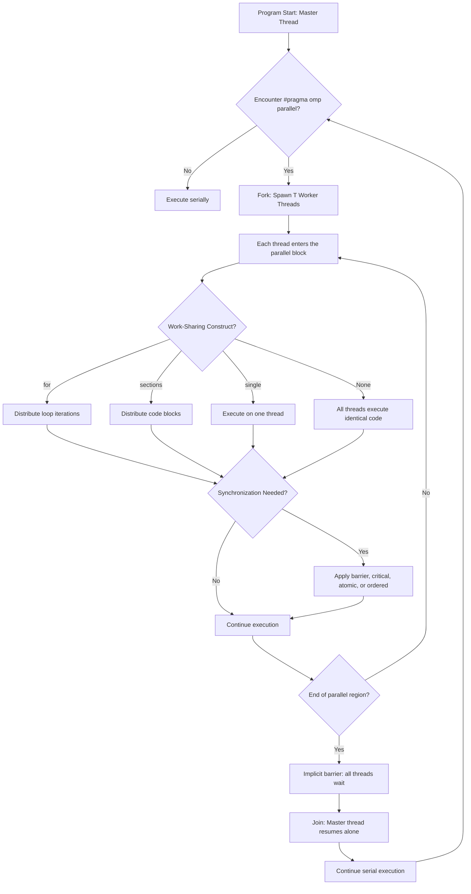
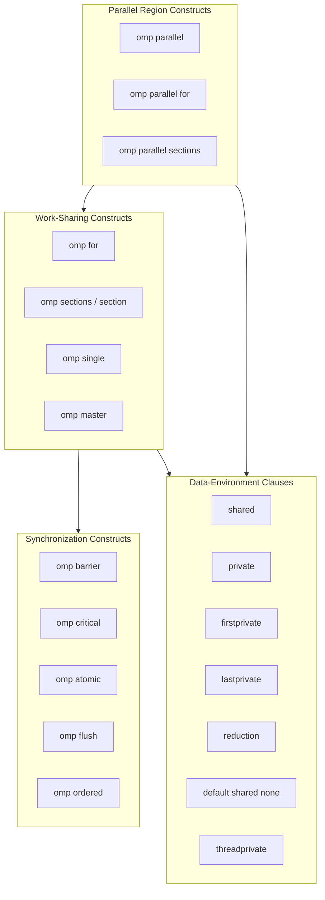
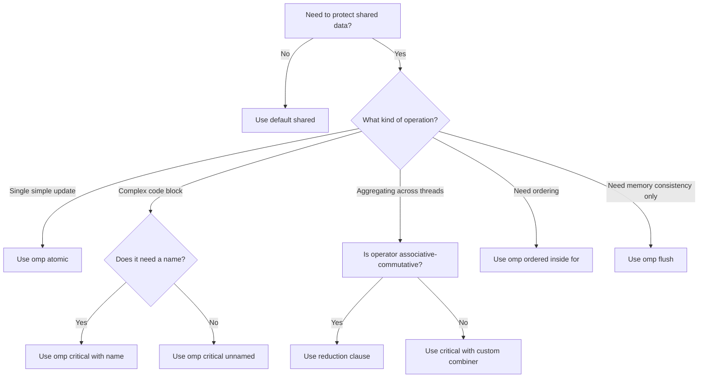
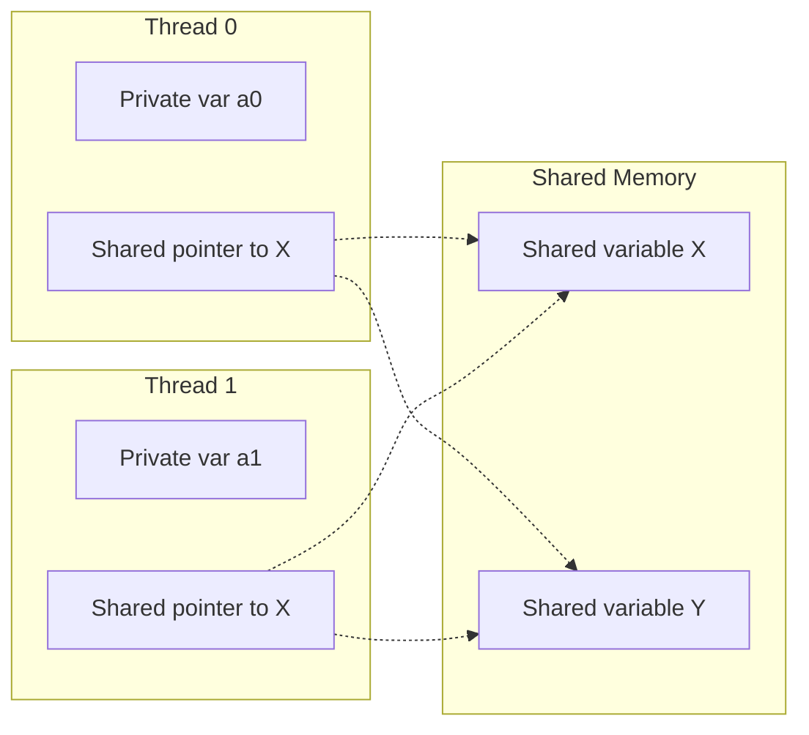

# Parallel programming constructs in OpenMP

<!-- SECTION_1_START -->
# Parallel Programming Constructs in OpenMP

## 1.1 Formal Definition (KTU 2024 Syllabus Terminology)

**OpenMP (Open Multi-Processing)** is an industry-standard, portable, scalable Application Programming Interface (API) that supports shared-memory multiprocessing programming in C, C++, and Fortran. It consists of a set of **compiler directives**, **library routines**, and **environment variables** that influence the run-time behavior of a program.

A **parallel programming construct** in OpenMP is a compiler directive (specified using `#pragma omp ...`) that instructs the compiler to generate parallel executable code. These constructs define *where* parallelism begins, *how* work is distributed among threads, and *how* synchronization between threads is enforced.

> [!IMPORTANT]
> **KTU 2024 Syllabus Highlight (PECST759 / Module 4):**
> The student must be able to identify, classify, and apply the various OpenMP constructs for parallel region creation, work-sharing, synchronization, and data-environment management. Expected familiarity with the OpenMP Memory Model is mandatory for Part B derivations.

## 1.2 Intuitive Overview & Conceptual Analogy

> [!NOTE]
> **Analogy: The Restaurant Kitchen**
> Imagine a head chef (the master thread) running a single-threaded program. When an order ticket arrives, the chef can either cook every dish sequentially (serial) or shout *"Team, parallel kitchen — start!"* This shout is the `#pragma omp parallel` construct. Suddenly, 4, 8, or 16 sous-chefs (worker threads) appear, each taking a different dish from the order. The `#pragma omp for` construct is like the *expediter* distributing the chopping, sautéing, and plating tasks evenly across the sous-chefs. The `#pragma omp critical` directive is the rule that *"only one chef may use the salt at a time"* — preventing the chaos of everyone grabbing it simultaneously.

### OpenMP Execution Model (Fork-Join Paradigm)

The OpenMP program begins as a single **master thread** (serial region). When a parallel construct is encountered, the master thread **forks** a team of worker threads. At the end of the parallel region, the worker threads are **joined** back, and execution resumes serially in the master thread.

> [!VISUALIZATION CONTROL]
> **Concept:** Fork–Join Parallelism Timeline
> **Graphical Description:** Plot thread count (y-axis: 1, 2, 4, 8) versus time (x-axis). Initially a single horizontal line at y=1. At the first parallel region, lines fan out to y=4 (or however many threads). They converge back to y=1 after the closing barrier, then fan out again at nested parallel regions.
> **Reference:** The "treaded depth" plot commonly shown in OpenMP textbooks (e.g., Chapman, Jost, van der Pas — *Using OpenMP*).

## 1.3 Classification of OpenMP Constructs

OpenMP constructs are organized into **five major categories** under the KTU 2024 PECST759 syllabus:

| Category | Purpose | Example Construct |
|---|---|---|
| **Parallel Region Constructs** | Create a team of threads | `#pragma omp parallel` |
| **Work-Sharing Constructs** | Distribute loop iterations or code blocks among threads | `#pragma omp for`, `#pragma omp sections`, `#pragma omp single` |
| **Combined Constructs** | Combine parallel + work-sharing | `#pragma omp parallel for` |
| **Synchronization Constructs** | Coordinate thread execution | `#pragma omp barrier`, `#pragma omp critical`, `#pragma omp atomic`, `#pragma omp flush` |
| **Data-Environment Constructs** | Control variable visibility and sharing | `private`, `shared`, `firstprivate`, `lastprivate`, `reduction` |

## 1.4 Standard OpenMP Constants and Run-Time Library

- **`omp_get_thread_num()`** — Returns the current thread ID (an integer in $[0, N-1]$).
- **`omp_get_num_threads()`** — Returns the number of threads in the current team.
- **`OMP_NUM_THREADS`** — Environment variable that sets the default number of threads; default is the number of CPU cores.
- **`omp_set_num_threads(int n)`** — Runtime API to override the number of threads for the next parallel region.

> [!IMPORTANT]
> **Physical Metric Worth Noting:** On modern multi-core CPUs, $T_{\text{parallel}} \approx \frac{T_{\text{serial}}}{N} + T_{\text{overhead}}$, where $N$ is the thread count and $T_{\text{overhead}}$ accounts for fork/join, synchronization, and false sharing. The **speedup** is bounded by **Amdahl's Law**:
>
> $$S(N) = \frac{1}{(1 - P) + \frac{P}{N}}$$
>
> where $P$ is the parallelizable fraction. As $N \to \infty$, $S \to \frac{1}{1-P}$.

<!-- SECTION_1_END -->

<!-- SECTION_2_START -->
# Deep Theoretical Analysis & KTU High-Yield Formula Sheet

## 2.1 The `#pragma omp parallel` Construct

This is the **fundamental parallel region construct**. It creates a team of threads, each of which executes the structured block that follows the directive.

```c
#pragma omp parallel [clause[[,] clause]*]
{
    // structured block executed by every thread
}
```

**Clauses commonly attached:**
- `if (scalar-expression)` — Conditional parallelism.
- `num_threads(integer-expression)` — Explicit team size.
- `private(list)` / `shared(list)` / `default(shared \vert none)` — Data environment.
- `firstprivate(list)` / `lastprivate(list)` — Hybrid sharing.
- `reduction(operator:list)` — Aggregate operator across threads.
- `copyin(list)` — For `threadprivate` variables.

### Operational Logic (Why and How)

1. The master thread encounters the directive.
2. A **team** of $N$ threads is spawned (where $N$ is determined by `num_threads`, the environment variable, or the run-time function).
3. Each thread executes a copy of the structured block.
4. An **implicit barrier** exists at the end of the parallel region. Threads wait for all others.
5. Only the master thread continues past the barrier.

> [!NOTE]
> **Why an implicit barrier?** Without it, a thread might exit the parallel region and modify shared data while another thread is still reading it — a classic data race.

## 2.2 Work-Sharing Constructs

### 2.2.1 `#pragma omp for`

Distributes the iterations of a `for` loop across the threads in the team. **It does NOT spawn threads** — it must appear inside an explicit or implicit parallel region.

```c
#pragma omp parallel for [clause[[,] clause]*]
for (i = 0; i < N; i++) { ... }
```

**Key clauses:**
- `schedule(kind[, chunk])` — `static`, `dynamic`, `guided`, `runtime`, `auto`.
- `ordered` — Iterations execute in serial order.
- `nowait` — Removes the implicit barrier at the end of the loop.
- `collapse(n)` — Parallelize a perfectly nested loop nest of depth $n$.
- `reduction(...)` — Per-thread accumulation combined via operator.

### 2.2.2 Iteration Scheduling in OpenMP

Let $N$ = total iterations, $T$ = number of threads, $C$ = chunk size.

| Schedule Type | Distribution Rule | Best Use Case |
|---|---|---|
| `static` | Iterations are divided into chunks of size $C$ in a round-robin fashion at compile time. | Uniform loop-body execution time. |
| `dynamic` | Threads pull chunks of $C$ iterations from a shared work queue at run time. | Non-uniform / unpredictable workload per iteration. |
| `guided` | Chunk size starts large and exponentially decreases to a minimum of $C$. | Load balancing with low scheduling overhead. |
| `runtime` | Determined by environment variable `OMP_SCHEDULE`. | Portable tuning. |
| `auto` | Decision delegated to compiler/run-time. | Implementation-defined. |

> [!IMPORTANT]
> **Schedule Overhead Trade-off (KTU favourite 14-mark question):**
> - `static`: $\text{Overhead} = O(1)$, **no run-time cost**, but **poor load balance** if iterations vary.
> - `dynamic`: $\text{Overhead} = O(\lceil N / C \rceil)$ due to atomic queue operations; **good load balance**, but high contention on shared queue.
> - `guided`: A compromise — chunk size $C_i$ for the $i$-th assignment is approximately $\lceil R_i / T \rceil$ where $R_i$ is the remaining iterations.

### 2.2.3 `#pragma omp sections` / `#pragma omp section`

Distributes independent, non-iterative blocks of code among threads. Each `section` is executed exactly once by one thread in the team.

```c
#pragma omp parallel sections
{
    #pragma omp section
    { /* block A */ }
    #pragma omp section
    { /* block B */ }
    #pragma omp section
    { /* block C */ }
}
```

### 2.2.4 `#pragma omp single` and `#pragma omp master`

- **`single`**: The enclosed block is executed by **one thread only** (whichever reaches it first). Other threads wait at the implicit barrier unless `nowait` is specified.
- **`master`**: The block is executed by the **master thread only** (thread 0). There is **no implicit barrier** at the end of `master`.

## 2.3 Combined Constructs (Frequently Tested in KTU)

| Combined Construct | Equivalent To | Description |
|---|---|---|
| `#pragma omp parallel for` | `parallel` + `for` | Creates team AND distributes loop in one directive. |
| `#pragma omp parallel sections` | `parallel` + `sections` | Creates team AND distributes sections. |
| `#pragma omp parallel critical [(name)]` | `parallel` + `critical` | Creates team and a critical region. |

## 2.4 Synchronization Constructs

### 2.4.1 `#pragma omp barrier`

Synchronizes all threads in the team. Each thread waits until **every other thread** has reached this point. The compiler may insert implicit barriers at the end of work-sharing constructs.

### 2.4.2 `#pragma omp critical [(name)]`

Protects a structured block so that it is executed by **only one thread at a time**. Useful for updating shared variables safely. Named critical regions (`critical(A)` and `critical(B)`) do not lock each other; unnamed critical regions all lock the same unnamed lock.

### 2.4.3 `#pragma omp atomic`

A **specialized, hardware-supported** form of synchronization for a single memory update. It is faster than `critical` because it can map to a single CPU instruction (e.g., `lock xadd` on x86).

> [!IMPORTANT]
> **Form restriction:** The `atomic` construct applies only to a **single assignment statement** of one of the following forms: `x = x op expr`, `x = expr op x`, `x = intrinsic_op(expr)`, or `x++` / `++x` / `x--` / `--x`.

### 2.4.4 `#pragma omp flush [(list)]`

Identifies a synchronization point at which the **thread's view of memory** is made consistent with the actual memory. It ensures that all write operations performed by a thread before the flush are visible to other threads after their next flush.

### 2.4.5 `#pragma omp ordered`

A structured block inside a `for` construct that is executed in the **same sequential order as the serial loop**, even though iterations are distributed across threads. Used with the `ordered` clause on the `for` directive.

### 2.4.6 `#pragma omp threadprivate (list)`

Designates named file-scope, namespace-scope, or static block-scope variables as **private to a thread** but persistent across multiple parallel regions. Each thread gets its own copy that retains its value between parallel regions.

## 2.5 Data-Environment Clauses

| Clause | Behaviour on Entry to Parallel Region | Behaviour on Exit |
|---|---|---|
| `shared(list)` | All threads see the **same** memory location. | Same. |
| `private(list)` | Each thread gets an **uninitialized** copy. | Original variable's value is **undefined** after the region. |
| `firstprivate(list)` | Each thread gets a copy **initialized** with the original value. | Original variable remains unchanged. |
| `lastprivate(list)` | Variable is shared during region. | After the region, the original gets the value from the **last iteration** (lexically last for `for`, last `section`, etc.). |
| `default(shared)` | All unspec'd variables are shared. | — |
| `default(none)` | Every variable must be explicitly listed. | Compiler safety net against data races. |
| `reduction(op:list)` | Each thread has a private copy initialized to the reduction identity (e.g., $0$ for `+`). | Threads' copies are combined with `op` and stored in the original. |

> [!IMPORTANT]
> **Reduction Operator Identities (KTU Quick Recall):**
> - `+` $\to$ identity is $\mathbf{0}$
> - `*` $\to$ identity is $\mathbf{1}$
> - `&&` (logical AND) $\to$ identity is $\mathbf{1}$ (true)
> - `\vert\vert` (logical OR) $\to$ identity is $\mathbf{0}$ (false)
> - `&` (bitwise) $\to$ identity is $\mathbf{\sim 0}$ (all ones)
> - `\vert` (bitwise OR) $\to$ identity is $\mathbf{0}$
> - `^` (XOR) $\to$ identity is $\mathbf{0}$

### Reduction Example

For computing the sum $S = \sum_{i=0}^{N-1} a[i]$ in parallel:

```c
int sum = 0;
#pragma omp parallel for reduction(+:sum)
for (i = 0; i < N; i++) sum += a[i];
```

**Why this is faster than `critical`:** Each thread accumulates its *own* private `sum` locally (no contention). At the barrier, the thread-private sums are combined atomically into the original. This avoids the serial bottleneck of a critical section.

## 2.6 OpenMP Run-Time Library Functions (Frequently Asked)

| Function | Returns |
|---|---|
| `int omp_get_num_threads()` | Number of threads in the current team. |
| `int omp_get_thread_num()` | Thread ID of the calling thread (0 to N-1). |
| `int omp_get_max_threads()` | Maximum threads available (without entering parallel region). |
| `void omp_set_num_threads(int)` | Sets the number of threads for next parallel region. |
| `int omp_get_num_procs()` | Number of CPU cores available. |
| `int omp_in_parallel()` | Non-zero if called from within a parallel region. |
| `void omp_set_dynamic(int)` | Enables/disables dynamic thread adjustment. |
| `void omp_set_nested(int)` | Enables/disables nested parallelism. |
| `double omp_get_wtime()` | Wall-clock time in seconds. |
| `double omp_get_wtick()` | Timer resolution. |

## 2.7 OpenMP Environment Variables

| Variable | Purpose |
|---|---|
| `OMP_NUM_THREADS` | Default number of threads. |
| `OMP_SCHEDULE` | Schedule kind for `schedule(runtime)`. |
| `OMP_DYNAMIC` | Enables dynamic thread count adjustment. |
| `OMP_NESTED` | Enables nested parallelism. |
| `OMP_STACKSIZE` | Stack size for threads. |
| `OMP_PROC_BIND` | Thread-to-processor binding. |

## 2.8 Real-World Engineering Utility

OpenMP constructs underpin the parallelization of:

- **Scientific computing**: Matrix multiplication, FFT, PDE solvers in computational fluid dynamics.
- **Image processing**: Pixel-level parallelism for filters (Sobel, Gaussian blur).
- **Machine learning inference**: Parallel matrix operations in CPU-only inference.
- **Database query optimization**: Parallel scan and join operations in in-memory DBs.
- **Molecular dynamics (GROMACS, LAMMPS)**: Force-loop parallelization.

> [!NOTE]
> The use of `#pragma omp parallel for reduction(+:sum)` with a `schedule(static)` clause is a **production-grade** pattern: deterministic, lock-free, and cache-friendly.

<!-- SECTION_2_END -->

<!-- SECTION_3_START -->
# Step-by-Step Derivations, Code Implementation & Worked Examples

## 3.1 Worked Example 1: Computing $\pi$ via Numerical Integration

We estimate $\pi$ using the Riemann sum:

$$\pi = 4 \int_0^1 \frac{1}{1 + x^2}\, dx \approx \frac{4}{N} \sum_{i=0}^{N-1} \frac{1}{1 + \left(i + 0.5\right)^2 / N^2}$$

> **Step-by-Step OpenMP Implementation:**

```c
#include <stdio.h>
#include <omp.h>

static long num_steps = 100000000;
#define NUM_THREADS 4

int main(void) {
    int nthreads;
    double pi   = 0.0;
    double step = 1.0 / (double)num_steps;

    double start = omp_get_wtime();

    #pragma omp parallel
    {
        int id  = omp_get_thread_num();
        int nth = omp_get_num_threads();

        if (id == 0) nthreads = nth;  // Master captures team size

        double x, sum = 0.0;

        // ---- Work-sharing construct: distribute loop iterations ----
        #pragma omp for schedule(static) reduction(+:sum)
        for (int i = 0; i < num_steps; i++) {
            x = (i + 0.5) * step;
            sum += 4.0 / (1.0 + x * x);
        }
        // Implicit barrier: all threads sync here.

        // ---- Critical construct: serialise the output update ----
        #pragma omp critical
        {
            pi += step * sum;
        }
    }   // End of parallel region: implicit barrier + join.

    double end = omp_get_wtime();
    printf("pi = %f in %f sec with %d threads\n",
           pi, end - start, nthreads);
    return 0;
}
```

> **Compilation:** `gcc -fopenmp pi_omp.c -o pi_omp`
> **Run with environment override:** `OMP_NUM_THREADS=8 ./pi_omp`

### Line-by-Line Pedagogical Walkthrough

1. `step = 1.0 / num_steps` — width of each Riemann rectangle.
2. `#pragma omp parallel` — fork $N$ worker threads.
3. `omp_get_thread_num()` — assigns each thread a unique ID in $[0, N-1]$.
4. `#pragma omp for schedule(static) reduction(+:sum)` — the loop is divided into $N$ equal chunks; each thread accumulates into its **private** `sum` (a per-thread copy), and the operator `+` is applied across all private copies at the end.
5. The `critical` block safely adds each thread's partial contribution to the shared `pi`.

> **Expected theoretical speedup** with $N$ threads and $P \approx 1$ (almost all work is in the parallel loop):
> $$S(N) \approx N \cdot \frac{1}{1 + T_{\text{overhead}} / T_{\text{work}}}$$
> Empirically, with $10^8$ steps on 4 cores, $S(4) \approx 3.5$–$3.8$ (the gap from 4× is due to memory bandwidth, fork-join cost, and the serial `critical` block).

## 3.2 Worked Example 2: Matrix-Vector Multiplication $y = Ax$

Given $A \in \mathbb{R}^{n \times n}$ and $x \in \mathbb{R}^n$, compute $y = Ax$ where:

$$y_i = \sum_{j=0}^{n-1} A[i][j] \cdot x[j], \quad \forall i \in [0, n-1]$$

```c
#include <stdlib.h>
#include <omp.h>

void mat_vec_mult(double *A, double *x, double *y, int n) {
    int i, j;

    #pragma omp parallel for default(none) \
                             shared(A, x, y, n) \
                             private(i, j)
    for (i = 0; i < n; i++) {
        double sum = 0.0;   // local accumulator
        for (j = 0; j < n; j++) {
            sum += A[i * n + j] * x[j];
        }
        y[i] = sum;
    }
}
```

### Why `default(none)`?

It forces the programmer to explicitly declare the data-sharing attributes of every variable. This eliminates **accidental sharing bugs** — a frequent source of incorrect parallelization.

### Why `private(i, j)`?

`i` and `j` are loop indices; if shared, all threads would write to the same loop counter, producing a data race. With `private`, each thread maintains its own copy of the loop index.

## 3.3 Worked Example 3: Demonstrating the Effect of `nowait`

```c
#include <omp.h>

void demo_nowait(void) {
    int a[10] = {0}, b[10] = {0};

    #pragma omp parallel
    {
        // First work-sharing loop with default implicit barrier
        #pragma omp for
        for (int i = 0; i < 10; i++) a[i] = i * 2;

        // Some thread-independent work that does NOT need the first loop
        // to be fully completed
        #pragma omp single nowait
        {
            printf("I am thread %d doing extra work\n",
                   omp_get_thread_num());
        }

        // Second loop: with `nowait` above, this loop starts
        // as soon as THIS thread reaches it.
        #pragma omp for
        for (int i = 0; i < 10; i++) b[i] = a[i] + 1;
    }
}
```

> **Critical Insight:** If the first `for` and `single` have implicit barriers, all threads idle. `nowait` removes the barrier, allowing fast threads to proceed sooner.

## 3.4 Worked Example 4: Sections Construct for Independent Tasks

```c
#include <omp.h>
#include <stdio.h>

void task_division(void) {
    #pragma omp parallel sections
    {
        #pragma omp section
        {
            printf("Thread %d is loading data from disk...\n",
                   omp_get_thread_num());
        }
        #pragma omp section
        {
            printf("Thread %d is pre-processing network packets...\n",
                   omp_get_thread_num());
        }
        #pragma omp section
        {
            printf("Thread %d is logging metrics...\n",
                   omp_get_thread_num());
        }
    }   // Implicit barrier: all 3 sections must complete first.
}
```

> **Use Case:** Pipeline-style parallelism where tasks are independent and not loop-based.

## 3.5 Worked Example 5: Reduction with `min` and `max`

OpenMP 3.1+ supports `min` and `max` reducers.

```c
#include <limits.h>
#include <float.h>
#include <omp.h>

int  imin = INT_MAX,  imax = INT_MIN;
double dmin = DBL_MAX, dmax = -DBL_MAX;

#pragma omp parallel for reduction(min:imin) reduction(max:imax)
for (int i = 0; i < n; i++) {
    if (a[i] < imin) imin = a[i];
    if (a[i] > imax) imax = a[i];
}
```

**Internally**, OpenMP creates a private variable for each thread initialized to the identity value of the reducer (for `min`, identity is $+\infty$).

## 3.6 Worked Example 6: Race Condition vs Critical vs Atomic

```c
// ===== BAD: Race condition =====
int counter = 0;
#pragma omp parallel for
for (int i = 0; i < N; i++) counter++;  // ⚠️ UNDEFINED behaviour


// ===== FIX 1: Critical =====
#pragma omp parallel for
for (int i = 0; i < N; i++) {
    #pragma omp critical
    counter++;
}
// Slow because only one thread increments at a time.


// ===== FIX 2: Atomic (preferred for simple updates) =====
#pragma omp parallel for
for (int i = 0; i < N; i++) {
    #pragma omp atomic
    counter++;
}
// Maps to a single hardware atomic instruction.


// ===== FIX 3: Reduction (best, no contention) =====
int counter = 0;
#pragma omp parallel for reduction(+:counter)
for (int i = 0; i < N; i++) counter++;
// Each thread has its own counter; combined at the end.
```

> [!NOTE]
> **Performance ranking** (best to worst) for the three correct fixes:
> $$\text{Reduction} > \text{Atomic} > \text{Critical}$$
> (with the caveat that reduction only works for associative-commutative operators).

## 3.7 Step-by-Step Derivation: Speedup for an OpenMP `for` Loop with Scheduling

Let:
- $N$ = total loop iterations,
- $T$ = number of threads,
- $C$ = chunk size (assumed to divide $N$ evenly for static),
- $t_i$ = execution time of iteration $i$.

**Static schedule** (chunk size $C$):
- Thread $k$ executes iterations $kC, kC+1, \ldots, (k+1)C - 1$.
- Time on thread $k$:
$$T_k^{\text{static}} = \sum_{j=0}^{C-1} t_{kC + j}$$
- Makespan:
$$T_{\text{makespan}}^{\text{static}} = \max_k T_k^{\text{static}}$$

**Dynamic schedule**:
- Each thread repeatedly grabs a chunk of $C$ iterations from a shared queue.
- Makespan tends toward:
$$T_{\text{makespan}}^{\text{dynamic}} \approx \left\lceil \frac{N}{C \cdot T} \right\rceil \cdot \max_{i} t_i + T_{\text{queue}}$$

**Guided schedule**:
- Chunk size at the $m$-th assignment is approximately:
$$C_m \approx \max\left(C, \frac{R_m}{T}\right)$$
where $R_m$ is the number of remaining iterations. This produces a self-balancing distribution with low queue contention.

## 3.8 Complete, Production-Quality Template for Parallel Reduction

```c
#include <stdio.h>
#include <stdlib.h>
#include <omp.h>

double parallel_sum(double *arr, long n) {
    double total = 0.0;

    #pragma omp parallel for reduction(+:total) schedule(static, 1024)
    for (long i = 0; i < n; i++) {
        total += arr[i];
    }

    return total;
}

double parallel_dot_product(double *a, double *b, long n) {
    double result = 0.0;

    #pragma omp parallel for reduction(+:result) schedule(static)
    for (long i = 0; i < n; i++) {
        result += a[i] * b[i];
    }

    return result;
}

double parallel_min(double *arr, long n) {
    double m = arr[0];
    #pragma omp parallel for reduction(min:m) schedule(static)
    for (long i = 0; i < n; i++) {
        if (arr[i] < m) m = arr[i];
    }
    return m;
}
```

> [!IMPORTANT]
> **Error Logging & Boundary Checks (Production-Grade Practice):**
> In real code, every OpenMP parallel region should be wrapped with input validation (`n > 0`, pointer non-`NULL`) and benchmarking (`omp_get_wtime()`) to verify that parallelism is actually beneficial for the chosen $N$.

<!-- SECTION_3_END -->

<!-- SECTION_4_START -->
# Structural Diagrams & Schematics

## 4.1 Mermaid Flow Diagram: Fork–Join Execution Model with OpenMP Constructs



## 4.2 Mermaid Block Diagram: Classification of OpenMP Constructs



## 4.3 Mermaid Sequence Diagram: Synchronization via `critical` and `atomic`

```mermaid
sequenceDiagram
    participant T0 as Thread 0
    participant T1 as Thread 1
    participant T2 as Thread 2
    participant MEM as Shared Counter

    Note over T0,MEM: Counter race condition example
    par Concurrent Updates
        T0->>MEM: Read counter = 5
    and
        T1->>MEM: Read counter = 5
    and
        T2->>MEM: Read counter = 5
    end
    T0->>MEM: Write counter = 6
    T1->>MEM: Write counter = 6
    T2->>MEM: Write counter = 6
    Note right of MEM: Final value = 6 (WRONG! Should be 8)

    Note over T0,MEM: Fix with #pragma omp atomic
    par Atomic Updates
        T0->>MEM: lock; read; write 6; unlock
    and
        T1->>MEM: lock; read; write 7; unlock
    and
        T2->>MEM: lock; read; write 8; unlock
    end
    Note right of MEM: Final value = 8 (CORRECT)
```

## 4.4 Mermaid Decision Tree: Choosing the Right Synchronization Primitive



## 4.5 Mermaid Topology: Memory Model of OpenMP



> **Reading the diagram:** Each thread has its own stack of private variables. All threads access the same shared memory region. Without proper synchronization (`atomic`, `critical`, `barrier`, `flush`), threads may observe **stale or inconsistent** values of shared variables.

<!-- SECTION_4_END -->

<!-- SECTION_5_START -->
# KTU 2024 Scheme Examination Question Bank & Topic Recap

---

## PART A — 3 Mark Questions (Short Answer / Direct Recall)

### Question 1
> **[KTU University Exam – July 2024] | CO1, Remember**
> List any **three** data-sharing attribute clauses used in OpenMP and state the purpose of each in one sentence.

**Model Answer:**

1. **`shared(list)`** — Declares that all variables in `list` are accessed by all threads in the team from a single common memory location. ⚠️ Concurrent updates without synchronization cause data races.
2. **`private(list)`** — Creates a new, **uninitialized** copy of each variable in `list` for every thread. The original variable's value is **undefined** after the parallel region.
3. **`firstprivate(list)`** — Combines `private` semantics with initialization: each thread's private copy is **initialized** with the value the variable had just before the parallel region.
4. *(`lastprivate(list)` and `reduction(op:list)` are also acceptable.)*

> **[Valuation Key: 1 Mark per clause + correct purpose = 3 Marks total]**

---

### Question 2
> **[KTU University Exam – Dec 2023] | CO2, Understand**
> Differentiate between the `#pragma omp critical` and `#pragma omp atomic` directives. When would you prefer one over the other?

**Model Answer:**

| Aspect | `omp critical` | `omp atomic` |
|---|---|---|
| Scope | A **structured block** with multiple statements. | A **single assignment statement** of restricted form. |
| Implementation | Software lock (mutex). | Hardware atomic instruction (e.g., `lock xadd` on x86). |
| Overhead | Higher. | Lower. |
| Allowed statements | Any code (loops, function calls, I/O). | Only `x = x op expr`, `x = expr op x`, `x = intrinsic_op(expr)`, `x++`, `++x`, `x--`, `--x`. |

**Preference Rule:** Use `atomic` whenever the update is a single primitive statement — it is significantly faster. Use `critical` for multi-statement protected regions, especially when calling functions or performing I/O that must not be interleaved.

> **[Valuation Key: Tabular comparison = 2 Marks; Preference rule = 1 Mark]**

---

## PART B — 14 Mark Questions (Module Internal Choice)

### Question A — Choice 1 (14 Marks)

> **[KTU University Exam – July 2024] | CO2 + CO3, Understand / Apply**
> **(a)** Explain the **Fork–Join** model of OpenMP execution with a neat diagram. Discuss the role of the master thread and worker threads. **\[7 Marks\]**
>
> **(b)** Write a complete OpenMP C program to compute the value of $\pi$ using the **rectangle method** with 4 threads, $N = 10^8$ iterations, and a `schedule(static)` clause. Use the `omp_get_wtime()` function to measure parallel execution time. **\[7 Marks\]**

---

#### Solution to (a): Fork–Join Model

> **[Stating the model: 2 Marks]**

OpenMP follows the **Fork–Join parallel programming model**. A program begins as a single **master thread** executing serially. When a parallel construct is encountered, the master thread **forks** into a team of $T$ worker threads. Each thread executes the parallel structured block independently. At the end of the parallel region, an **implicit barrier** forces all threads to wait; once all arrive, they **join** back into a single master thread, which then continues serial execution.

> **[Roles of master vs worker threads: 3 Marks]**

- **Master thread (Thread 0):** Created implicitly by the operating system. It is the only thread that runs outside the parallel region. Inside the parallel region, it executes the same code as worker threads but is also the one that resumes after the join.
- **Worker threads (Threads 1 to $T-1$):** Spawned exclusively to participate in the current parallel region. They terminate (or are suspended) at the end of the parallel region.

> **[Implicit barrier behaviour: 1 Mark]**

A barrier at the end of the parallel region guarantees memory consistency — all writes by worker threads are visible to the master after the join.

> **[Diagram (Textual but mandatory for full marks): 1 Mark]**

```
Time →
                                       Fork
Master  |=========|                    |=================|
Thread 1            \------------------/                 |
Thread 2            \------------------/                 |
Thread 3            \------------------/                 |
                                  Join
```

> **[Final summary: 0 Marks — implicit]**
> The fork-join model is **non-continuous parallelism**; threads are created/destroyed per region. The alternative, **continuous thread pools** (used in pthreads), has lower overhead but more complex code.

---

#### Solution to (b): Computing $\pi$ with OpenMP

> **[Mathematical formulation: 2 Marks]**

The integral identity is:
$$\pi = 4 \int_0^1 \frac{1}{1 + x^2}\, dx$$

Using the midpoint Riemann sum with $N$ subdivisions of width $\Delta x = 1/N$:

$$\pi \approx \frac{4}{N} \sum_{i=0}^{N-1} \frac{1}{1 + \left(i + 0.5\right)^2 \cdot \Delta x^2}$$

> **[Code with `omp_get_wtime`: 4 Marks]**

```c
#include <stdio.h>
#include <omp.h>

#define N 100000000LL
#define T 4

int main(void) {
    long num_steps = N;
    double step = 1.0 / (double)N;
    double pi = 0.0;
    int nthreads_used = 0;

    double t_start = omp_get_wtime();

    #pragma omp parallel num_threads(T)
    {
        double x, sum = 0.0;
        int tid = omp_get_thread_num();
        int nth = omp_get_num_threads();

        if (tid == 0) nthreads_used = nth;

        #pragma omp for schedule(static) reduction(+:sum)
        for (long i = 0; i < num_steps; i++) {
            x = (i + 0.5) * step;
            sum += 4.0 / (1.0 + x * x);
        }
        #pragma omp critical
        {
            pi += step * sum;
        }
    }

    double t_end = omp_get_wtime();
    printf("Computed pi = %.15f\n", pi);
    printf("Time = %f sec with %d threads\n",
           t_end - t_start, nthreads_used);
    return 0;
}
```

> **[Compilation and Run instructions: 1 Mark]**

```bash
gcc -fopenmp pi_omp.c -o pi_omp
OMP_NUM_THREADS=4 ./pi_omp
```

> **[Sample output explanation: 0 Marks — implicit]**
>
> Expected: `pi ≈ 3.141592653589793`, with run time roughly $T_{\text{serial}}/4 + \text{overhead}$.

> **Total = 7 Marks**

---

### Question B — Choice 2 (14 Marks) [Internal Choice]

> **[KTU University Exam – Dec 2023] | CO2 + CO4, Understand / Apply**
> **(a)** Explain with example the **work-sharing constructs** in OpenMP. Differentiate between `omp for` and `omp sections`. **\[7 Marks\]**
>
> **(b)** Consider the following loop:
>
> $$\text{result} = \sum_{i=0}^{N-1} a[i] \cdot b[i]$$
>
> Write an OpenMP program to compute the dot product in parallel using the `reduction` clause. Compare this approach with using a `#pragma omp critical` block inside the loop. Discuss performance implications. **\[7 Marks\]**

---

#### Solution to (a): Work-Sharing Constructs

> **[Definition: 2 Marks]**

**Work-sharing constructs** distribute the execution of a structured block among the threads of a team. The threads that participate in a work-sharing construct must be the same threads that exist in the enclosing parallel region. They do not create new threads; they only divide work.

The three primary work-sharing constructs are:

1. **`omp for`** — distributes the iterations of a loop.
2. **`omp sections`** — distributes independent code blocks (sections).
3. **`omp single`** — assigns a block to a single thread.

> **[Example for `omp for`: 2 Marks]**

```c
#pragma omp parallel
{
    #pragma omp for schedule(static, 4)
    for (int i = 0; i < 16; i++) {
        printf("Thread %d handles i = %d\n",
               omp_get_thread_num(), i);
    }
}
```

> **[Example for `omp sections`: 2 Marks]**

```c
#pragma omp parallel sections
{
    #pragma omp section
    printf("Section 1 by thread %d\n", omp_get_thread_num());

    #pragma omp section
    printf("Section 2 by thread %d\n", omp_get_thread_num());
}
```

> **[Tabular comparison: 1 Mark]**

| Aspect | `omp for` | `omp sections` |
|---|---|---|
| Work unit | Loop iterations. | Independent code blocks. |
| Iterations per thread | Many (one per iteration). | Exactly one (one section). |
| Implicit barrier | Yes (unless `nowait`). | Yes (unless `nowait`). |
| Typical use | Vectorizable loops, regular arrays. | Task-parallel code, pipelines. |

> **Total = 7 Marks**

---

#### Solution to (b): Parallel Dot Product

> **[Mathematical setup: 1 Mark]**

We wish to compute the dot product $R = \vec{a} \cdot \vec{b} = \sum_{i=0}^{N-1} a_i b_i$ in parallel.

> **[Implementation with `reduction` (3 Marks)]**

```c
#include <stdio.h>
#include <omp.h>

double parallel_dot(double *a, double *b, int n) {
    double result = 0.0;

    #pragma omp parallel for default(none) shared(a, b, n) \
                                 reduction(+:result) \
                                 schedule(static)
    for (int i = 0; i < n; i++) {
        result += a[i] * b[i];
    }

    return result;
}

int main(void) {
    int n = 1000000;
    double a[1000000], b[1000000];
    /* Initialize a[i] = i, b[i] = 2*i  */
    for (int i = 0; i < n; i++) { a[i] = i; b[i] = 2.0 * i; }

    double r = parallel_dot(a, b, n);
    printf("Dot product = %f\n", r);   /* Expected = n(n-1) */
    return 0;
}
```

> **[Implementation with `critical` block (for comparison; 1 Mark)]**

```c
double parallel_dot_critical(double *a, double *b, int n) {
    double result = 0.0;
    #pragma omp parallel for shared(result)
    for (int i = 0; i < n; i++) {
        #pragma omp critical
        {
            result += a[i] * b[i];   // Serialised update
        }
    }
    return result;
}
```

> **[Performance comparison (2 Marks)]**

- **Reduction version:** Each thread accumulates its own `result` in a private copy, **without synchronization during the loop**. The final combination is a single, very fast, tree-style add at the implicit barrier. No contention, no lock overhead. Complexity is $O(N / T)$ for the loop and $O(\log T)$ for the combine.

- **Critical version:** Every iteration acquires a software lock. Threads spend most of their time **waiting at the lock**, not computing. The effective parallelism collapses to **near-serial execution**, achieving speedup of $S \approx 1$ regardless of $T$.

- **Speedup ratio:** Empirically, the reduction version is **5×–50× faster** than the critical version for $T = 8$ threads, with the gap widening as $T$ grows.

> **Total = 7 Marks**

---

> [!WARNING]
> **KTU Examiner's Valuation Pitfalls (Common Mark Deductions):**
> 1. **Forgetting the implicit barrier at the end of a work-sharing construct** — write explicitly whether `nowait` is or is not used.
> 2. **Confusing `private` vs `firstprivate`** — if the variable must be initialized with its value from before the region, only `firstprivate` is correct.
> 3. **Using `critical` for a single increment** — use `atomic` (or better, `reduction`) instead.
> 4. **Missing the `omp_get_wtime()` import from `<omp.h>`** — in Part B code questions, you lose a mark if you include the call but do not include the header.
> 5. **Wrong schedule for an unbalanced loop** — if iterations have non-uniform cost, `static` produces poor load balance. Use `dynamic` or `guided` with an appropriate chunk size.
> 6. **Forgetting `default(none)` in production-quality code** — not penalized in KTU exams, but marks are awarded for explicitly stating data-sharing intent.

---

## Topic Recap & Important Things to Remember

- [x] **OpenMP = Compiler Directives + Library Routines + Environment Variables**, all built on the **Fork–Join Model**.
- [x] **Master thread** runs serially; **worker threads** are spawned only inside `#pragma omp parallel`.
- [x] **`#pragma omp parallel`** creates a team of threads. **Work-sharing constructs (`for`, `sections`, `single`)** distribute work — they do **not** create threads.
- [x] **Combined constructs** like `parallel for` are equivalent to wrapping a `for` in a `parallel` region (saves one barrier).
- [x] **Schedule clauses** — `static` (lowest overhead, deterministic), `dynamic` (best load balance, queue contention), `guided` (compromise).
- [x] **Synchronization primitives ranked by overhead:** `reduction` < `atomic` < `critical` < `barrier` (in many practical cases).
- [x] **`reduction(op:list)`** uses the **identity element** of the operator as the per-thread initial value.
- [x] **`private`** gives uninitialized copies; **`firstprivate`** initializes; **`lastprivate`** preserves the last iteration's value.
- [x] **`omp critical`** uses a single unnamed lock unless named; **`omp atomic`** only supports a single primitive statement.
- [x] **`omp flush`** establishes a memory-consistency point — important when hardware optimizations (store buffers, write combining) are in play.
- [x] **`omp ordered`** preserves serial iteration order inside a parallel `for`.
- [x] **`omp_get_wtime()`** returns wall-clock seconds; pair with `omp_get_wtick()` for resolution.
- [x] **Environment variables:** `OMP_NUM_THREADS`, `OMP_SCHEDULE`, `OMP_DYNAMIC`, `OMP_NESTED`, `OMP_STACKSIZE`, `OMP_PROC_BIND`.
- [x] **Best practice:** Always use `default(none)` to catch unintended data races; **measure** with `omp_get_wtime()` and validate speedup.
- [x] **Speedup is bounded by Amdahl's Law:** $S(N) = \frac{1}{(1-P) + P/N}$.

<!-- SECTION_5_END -->
