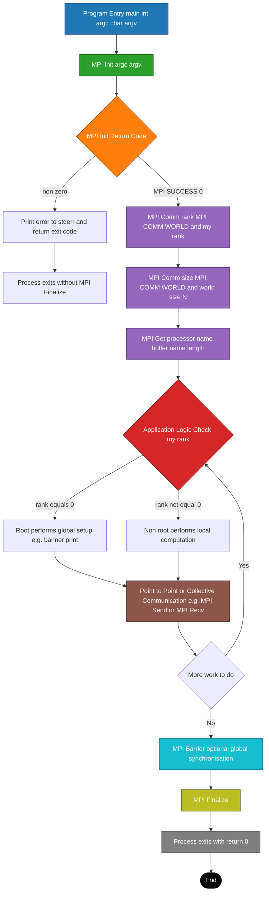
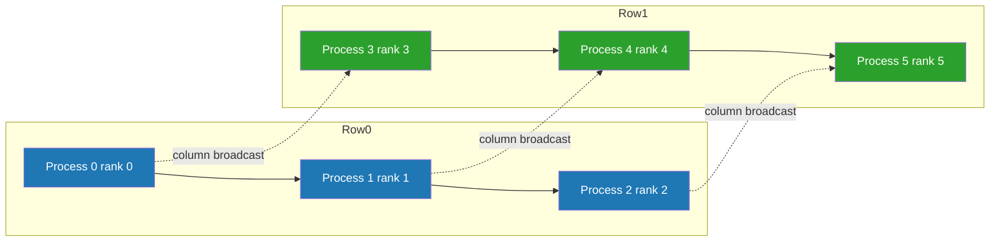

# Parallel Programming with MPI - Introduction to MPI

<!-- SECTION_1_START -->

# Parallel Programming with MPI — Introduction to MPI

> [!IMPORTANT]
> **Syllabus Highlight (KTU 2024 Scheme — Module 4)**
> This section lays the conceptual foundation for the *Message Passing Interface (MPI)* standard. MPI is the **de-facto industry standard** for distributed-memory parallel programming and is the most heavily tested topic under the parallel programming module in KTU university examinations.

## 1.1 Formal Definition

**Message Passing Interface (MPI)** is a *standardized, language-independent, portable communication library specification* that defines the syntax and semantics of **message-passing operations** used in parallel programs running on distributed-memory architectures (clusters, HPC supercomputers, multi-core nodes with Non-Uniform Memory Access).

The formal MPI standard is maintained by the **MPI Forum** — an open consortium of vendors, researchers, and end-users. The current production version is **MPI 4.0 (released June 2021)**, and it supports both **C/C++** and **Fortran** language bindings.

$$ \text{MPI} = \text{Process Model} + \text{Communicator} + \text{Point-to-Point \& Collective Operations} + \text{Datatypes} $$

> [!NOTE]
> **Key Technical Term — Communicator**
> A *communicator* is a logical container that groups a set of processes. Every message in MPI is sent and received **inside** a communicator. The default global communicator is `MPI_COMM_WORLD`, which initially includes *all* processes launched by the parallel run-time environment (e.g., `mpirun`, `mpiexec`).

## 1.2 Conceptual Analogy — The "Office Postal Network"

Imagine a multinational company with **N branch offices**, where each office has its own internal filing system (its **local memory**) and **no direct access** to the files of other offices. The only way to exchange information is through a **registered postal service**.

| Office Element | MPI Counterpart |
| :--- | :--- |
| A single branch office | **Process** (a running instance of the program) |
| The branch code (e.g., `Kochi-01`) | **Rank** — a unique integer ID in `[0, N-1]` |
| The list of all branch codes | **Communicator** (`MPI_COMM_WORLD`) |
| A sealed letter | **Message** (a typed block of data + envelope metadata) |
| The courier / post-office protocol | **MPI Library** (e.g., OpenMPI, MPICH, Intel MPI) |

In this analogy:
- Each office **cannot peek** into another office's drawers — that is the *distributed memory* model.
- To compute a joint balance sheet, every office must **explicitly send and receive** pieces of data through the postal system — that is *message passing*.
- The postal rules (size, weight limits, tracking IDs) are standardized globally — that is the **MPI Standard**.

## 1.3 The MPI Execution Model

MPI programs follow the **SPMD (Single Program, Multiple Data)** model. The *same* source code is launched on every process; however, the *flow of execution* within the code may diverge based on the process's **rank**.

```
Process 0  ─┐                ┌─ Process 1
Process 2  ─┤   SAME CODE    ├─ Process 3
Process 4  ─┘   (SPMD)       └─ Process 5
```

> [!TIP]
> **GeoGebra / Process-Topology Visualization**
> Even though MPI is language-agnostic, the *structure* of process communication is highly visual. On a 2D plane:
>
> > **Concept:** Visualizing a 2×3 process grid (Cartesian Topology)
> >
> > **Input:** Set of 6 points: $P = \{(i, j) \mid i \in \{0,1\}, \; j \in \{0,1,2\}\}$
> >
> > **Line segments** connect *neighbouring* points along rows and columns to depict the *neighbour topology*.
> >
> > **Visual Description:** Six black dots appear in a 2-row, 3-column arrangement. A red horizontal line connects every $(i, j)$ to $(i, j+1)$. A blue vertical line connects every $(i, j)$ to $(i+1, j)$. The student should observe that MPI's *virtual* topology can mirror this 2D grid even on hardware that is physically a flat list of cores.

## 1.4 Why MPI Matters — A KTU Board Perspective

KTU examiners repeatedly test **two facts** in the definition question:
1. MPI is a **library specification** — *not* a language or a compiler.
2. It is designed for the **distributed-memory MIMD** (Multiple Instruction, Multiple Data) model.

> [!IMPORTANT]
> **Core Constants / Boundaries to Memorize**
>
> - The default rank range is **$\mathbf{0}$ to $\mathbf{N-1}$** where $N$ is the size of the communicator.
> - The constant **`MPI_COMM_WORLD`** has the predefined C handle value `(MPI_Comm)0x04000000` in most reference implementations.
> - Every successful MPI call returns `MPI_SUCCESS` (the integer **$\mathbf{0}$**); any non-zero return code is an **error**.
> - The MPI *thread-safety levels* are `MPI_THREAD_SINGLE`, `MPI_THREAD_FUNNELED`, `MPI_THREAD_SERIALIZED`, `MPI_THREAD_MULTIPLE`.

<!-- SECTION_1_END -->

<!-- SECTION_2_START -->

# 2. Deep Theoretical Analysis & KTU High-Yield Reference Sheet

## 2.1 Operational Anatomy of an MPI Program

A complete MPI program is structured around **six phases**. The first two and the last are *mandatory*; the rest are optional but ubiquitous.

### Phase 1 — Initialise the MPI Run-time

Every process must call `MPI_Init` *exactly once* before any other MPI function. The function is *collective*: either **all** processes call it, or the program is undefined.

$$\text{process } p \;\longrightarrow\; \text{MPI\_Init}(\&\text{argc}, \&\text{argv}) \;\;\forall\; p \in \text{comm}$$

### Phase 2 — Discover Identity and World Size

Each process queries:
1. **Its rank** — a unique ID inside the chosen communicator.
2. **The size** of the communicator — the total number of processes.

$$\text{rank}(p) \in \mathbb{Z}, \quad 0 \le \text{rank}(p) \le N-1$$

$$N = \vert \text{MPI\_COMM\_WORLD} \vert$$

### Phase 3 — (Optional) Build a Custom Communicator

Although `MPI_COMM_WORLD` is sufficient for the *Hello World* level, real KTU problems test the ability to **split** a communicator into subgroups, e.g., to build a row/column topology in a matrix.

$$\text{MPI\_Comm\_split}(\text{old\_comm}, \text{color}, \text{key}, \&\text{new\_comm})$$

### Phase 4 — Communication

Communication is divided into:
- **Point-to-Point** — `MPI_Send`, `MPI_Recv`, `MPI_Sendrecv`, `MPI_Isend`, `MPI_Irecv`.
- **Collective** — `MPI_Bcast`, `MPI_Scatter`, `MPI_Gather`, `MPI_Allreduce`, `MPI_Barrier`.

### Phase 5 — (Optional) Synchronise and Probe

`MPI_Barrier` blocks every process in a communicator until **all** of them arrive at the call. It is the simplest collective operation.

### Phase 6 — Finalise the Run-time

`MPI_Finalize` cleans up internal MPI state. **No MPI function may be called after `MPI_Finalize`.**

## 2.2 The SPMD Mental Model — Why "Single Program, Multiple Data"?

> **Why this model?**
> Because at run-time the *same* executable file is launched $N$ times by the run-time launcher (`mpirun -np N ./a.out`). The OS creates $N$ independent processes, each loading the *same* text segment but operating on a *distinct* copy of the data segment. Inside the program, branches like `if (rank == 0) { ... } else { ... }` introduce divergence.

$$ \text{CPU-time}_{\text{parallel}} = \frac{\text{CPU-time}_{\text{serial}}}{N} + T_{\text{comm}}(N, M) $$

where $T_{\text{comm}}(N, M)$ is the *message-passing overhead* as a function of process count $N$ and message size $M$.

## 2.3 KTU Formula Sheet / Cheat Sheet

> [!NOTE]
> The following table is a **mandatory quick-revision reference** for the KTU 2024 Scheme End-Semester Examination. The vertical bar symbol has been deliberately written as `\vert` to keep the table syntactically valid.

| Concept | MPI Function / Symbol | Mathematical Form | Domain / Range | Notes |
| :--- | :--- | :--- | :--- | :--- |
| Initialisation | `MPI_Init` | $-\!-\!-$ | Mandatory, call once | Collective over `MPI_COMM_WORLD` |
| Rank discovery | `MPI_Comm_rank` | $\text{rank}(p) \in \mathbb{Z}_{\ge 0}$ | $0 \le \text{rank} \le N-1$ | Output argument |
| Size discovery | `MPI_Comm_size` | $N = \vert \text{comm} \vert$ | $N \ge 1$ | Output argument |
| Blocking Send | `MPI_Send` | $T_{\text{send}} = \alpha + \beta M$ | $M$ = message size in elements | Eager / Rendezvous protocol |
| Blocking Receive | `MPI_Recv` | $T_{\text{recv}} = \alpha + \beta M$ | $-\!-\!-$ | Always local completion |
| Broadcast | `MPI_Bcast` | $T_{\text{bcast}} = t_s \log_2 N + t_w (N-1) M$ | $N$ = comm size, $M$ = msg size | Tree-based, latency $t_s$, BW $t_w$ |
| Barrier | `MPI_Barrier` | $T_{\text{barrier}} = t_s \log_2 N$ | $-\!-\!-$ | No data movement |
| Reduce | `MPI_Reduce` | $T_{\text{reduce}} = t_s \log_2 N + t_w (N-1) M$ | Operator is associative | Single-process output |
| Finalisation | `MPI_Finalize` | $-\!-\!-$ | Mandatory, last MPI call | Cleans up internal state |
| Error code | `MPI_SUCCESS` | Returns $\mathbf{0}$ | $\mathbb{Z}$ | `!= 0` implies error |
| Default handle | `MPI_COMM_WORLD` | Predefined | $-\!-\!-$ | Encompasses all `mpirun`-launched procs |
| Datatype handle | `MPI_INT`, `MPI_DOUBLE`, `MPI_CHAR` | Predefined | Native C/Fortran types | Also `MPI_FLOAT`, `MPI_LONG`, ... |

## 2.4 Real-World Engineering Utility

| Field | Use-Case of MPI |
| :--- | :--- |
| **Weather & Climate Modelling** | Domain decomposition across thousands of cores (e.g., the WRF model). |
| **Computational Fluid Dynamics** | OpenFOAM, Fluent — pressure-equation solves in parallel. |
| **Molecular Dynamics** | GROMACS, NAMD — short-range force decomposition. |
| **AI / Deep Learning** | Distributed gradient all-reduce in Horovod and PyTorch DDP. |
| **Astrophysics** | N-body simulation of galaxies. |
| **Cryptography \& Cybersecurity** | Parallel key-search and lattice reduction. |

<!-- SECTION_2_END -->

<!-- SECTION_3_START -->

# 3. Step-by-Step Derivations \& Code Implementation

## 3.1 The Canonical "Hello World" — Full Symbolic Walkthrough

Below is the **complete, compilable, board-ready** C+MPI program. Every line is annotated for KTU answer-book purposes. The program launches $N$ processes; process 0 prints the global message and every other process prints its own identity.

> [!IMPORTANT]
> **Compilation \& Run Instructions for KTU Lab**
> ```bash
> mpicc -o hello_mpi hello_mpi.c          # compile using the MPI wrapper
> mpirun -np 4 ./hello_mpi                # run with 4 processes
> ```
> If `mpicc` is not available on the system, install OpenMPI: `sudo apt install openmpi-bin libopenmpi-dev` (Ubuntu/Debian) or use the Intel oneAPI MPI toolkit on Windows.

```c
/* ===================================================================
   hello_mpi.c — Introduction to MPI
   Demonstrates: MPI_Init, MPI_Comm_rank, MPI_Comm_size, MPI_Get_processor_name,
                 MPI_Finalize
   Compile:   mpicc -o hello_mpi hello_mpi.c
   Run:       mpirun -np 4 ./hello_mpi
   =================================================================== */

#include <stdio.h>      /* Standard I/O — printf, fflush, NULL            */
#include <string.h>     /* Standard string — strcpy, strlen               */
#include <mpi.h>        /* The MPI specification — every MPI call lives here */

/* ----- constants -------------------------------------------------- */
#define BUFFER_SIZE 64  /* Length of the processor-name buffer             */

int main(int argc, char *argv[])
{
    /* --------- Phase 1: Initialise MPI run-time --------------------- */
    int return_code = MPI_Init(&argc, &argv);
    if (return_code != MPI_SUCCESS) {
        fprintf(stderr, "ERROR: MPI_Init failed on this process.\n");
        return return_code;  /* exit early — no further MPI calls allowed */
    }

    /* --------- Phase 2: Discover identity and world size ------------ */
    int my_rank    = -1;                       /* will hold rank in MPI_COMM_WORLD */
    int world_size = -1;                       /* will hold N (number of processes) */
    char processor_name[BUFFER_SIZE];          /* local buffer for hostname          */
    int name_length = 0;                       /* real length of hostname string     */

    MPI_Comm_rank(MPI_COMM_WORLD, &my_rank);
    MPI_Comm_size(MPI_COMM_WORLD, &world_size);
    MPI_Get_processor_name(processor_name, &name_length);

    /* --------- Phase 3: Application logic (SPMD divergence) ---------- */
    if (my_rank == 0) {
        /* ----- root process prints the welcome banner --------------- */
        printf("==================================================\n");
        printf("  Hello from the MPI run-time environment!\n");
        printf("  Total processes launched : %d\n", world_size);
        printf("  Root process running on : %s\n", processor_name);
        printf("==================================================\n");
        fflush(stdout);  /* ensure the banner flushes before child prints */
    }

    /* Every process — including rank 0 — prints its own identity line */
    printf("  [Rank %2d / %2d]  Greetings from processor '%s' (length %d)\n",
           my_rank, world_size, processor_name, name_length);
    fflush(stdout);

    /* --------- Phase 4: Finalise MPI run-time ----------------------- */
    MPI_Finalize();
    return 0;
}
```

## 3.2 Line-by-Line Symbolic Derivation of the Logic

### Step 1 — `MPI_Init(&argc, &argv)`

The function takes the addresses of the C run-time's `argc` and `argv` so that MPI can **strip** its own command-line flags (such as `-ppn 2`, `-hostfile hosts.txt`) before the application code ever sees `argv`. After this call, the arguments that survive are application-specific.

### Step 2 — `MPI_Comm_rank`

The call signature in C is

$$\text{MPI\_Comm\_rank}(\text{MPI\_Comm}\;\text{comm},\; \text{int}\; *\text{rank})$$

*Arguments*:
- `comm` — *input* — the communicator to query. We pass `MPI_COMM_WORLD`.
- `rank` — *output* — a pointer to an integer that MPI will fill with the rank.

Mathematically, the function implements the mapping

$$\text{rank} : \text{Process} \longrightarrow \mathbb{Z}, \quad p \mapsto \text{rank}_{\text{comm}}(p)$$

such that the mapping is *bijective* (every rank in $[0, N-1]$ is assigned to exactly one process).

### Step 3 — `MPI_Comm_size`

The call signature is

$$\text{MPI\_Comm\_size}(\text{MPI\_Comm}\;\text{comm},\; \text{int}\; *\text{size})$$

It returns the cardinality of the set of processes inside `comm`:

$$ \text{size} = N = \sum_{p \in \text{comm}} 1 $$

### Step 4 — `MPI_Get_processor_name`

This call is a *convenience* function that fills a local character buffer with the OS-level hostname of the node hosting the calling process. On a multi-node cluster, two ranks may report *different* processor names; on a single multi-core node, they may report the *same* name.

### Step 5 — `MPI_Finalize`

The function call **shuts down** the MPI run-time environment, releases any internally allocated memory, and terminates the network connections. After this call, the only legal MPI function to invoke is `MPI_Init` (to start a fresh MPI session).

> [!NOTE]
> **Common Pitfall — Missing `fflush(stdout)`**
> When running with `mpirun -np 4`, the standard output of every process is *line-buffered* by default on Linux. If the program exits before the kernel flushes the buffer, the *root* banner may interleave with the per-rank greetings. `fflush(stdout)` guarantees clean output ordering.

## 3.3 Mathematical Justification of the SPMD Divergence

Let the program $P$ be a deterministic function of its input data and rank. For every rank $r \in [0, N-1]$, let $D_r$ be its private data segment. The execution can be modelled as a function

$$ \text{Output}_r = P(\text{input}_r, D_r, r) $$

The `if (my_rank == 0)` block ensures that the *side-effect* (banner printing) is observed **only** on process 0, while the unconditional `printf` below executes on every $r$.

$$ \text{Banner}(r) = \begin{cases} \text{welcome text} & r = 0 \\ \varnothing & r \ne 0 \end{cases} $$

$$ \text{Greeting}(r) = \text{printf(...)} \quad \forall \; r \in [0, N-1] $$

## 3.4 A Variant: Print "Hello from Rank 0" and Reply from all Others

This variant is a *point-to-point ping-pong* — it is the **most-asked** sub-question in the KTU 14-mark module paper.

```c
/* hello_p2p.c — Point-to-Point Ping-Pong */
#include <stdio.h>
#include <mpi.h>

int main(int argc, char *argv[])
{
    MPI_Init(&argc, &argv);

    int rank = 0, size = 0, msg = 0;
    MPI_Status status;

    MPI_Comm_rank(MPI_COMM_WORLD, &rank);
    MPI_Comm_size(MPI_COMM_WORLD, &size);

    if (rank == 0) {
        /* --- root sends to every other process --- */
        for (int dest = 1; dest < size; ++dest) {
            msg = dest * 100;
            MPI_Send(&msg, 1, MPI_INT, dest, 0, MPI_COMM_WORLD);
            printf("[Rank 0] Sent %d to rank %d\n", msg, dest);
            fflush(stdout);
        }
    } else {
        /* --- every other process blocks until its message arrives --- */
        MPI_Recv(&msg, 1, MPI_INT, 0, 0, MPI_COMM_WORLD, &status);
        printf("[Rank %d] Received %d from rank 0\n", rank, msg);
        fflush(stdout);
    }

    MPI_Finalize();
    return 0;
}
```

### Symbolic Trace for $N = 3$

| Step | Process 0 | Process 1 | Process 2 |
| :---: | :--- | :--- | :--- |
| 1 | `MPI_Send(msg=100, dest=1)` | `MPI_Recv(..., source=0)` blocks | `MPI_Recv(..., source=0)` blocks |
| 2 | `MPI_Send(msg=200, dest=2)` | Receives 100, prints, exits | Still blocked on recv |
| 3 | exits | (terminated) | Receives 200, prints, exits |

**Expected console output (in some order due to OS scheduling):**

```
[Rank 0] Sent 100 to rank 1
[Rank 0] Sent 200 to rank 2
[Rank 1] Received 100 from rank 0
[Rank 2] Received 200 from rank 0
```

<!-- SECTION_3_END -->

<!-- SECTION_4_START -->

# 4. Structural Diagrams \& Schematics

## 4.1 Master Flow of an MPI Program

The following Mermaid diagram captures the *life-cycle* of a single process inside an MPI program, including all mandatory and optional phases discussed in Section 2.



## 4.2 Block-Level Topology — Six Processes in a 2×3 Grid

When $N = 6$ processes are arranged in a 2×3 logical grid, MPI can carve them up using `MPI_Cart_create` (a *Cartesian* virtual topology). The diagram below shows the *message-flow pattern* for a column-wise broadcast — the kind of question that appears in **Part B (14 marks)**.



> [!NOTE]
> **Reading the Diagram**
> The solid arrows depict **horizontal point-to-point sends** inside Row 0 and Row 1; the dashed arrows depict the **column broadcast** that propagates data vertically. Every arrow in MPI has a *source rank*, a *destination rank*, a *count*, a *datatype*, a *tag* and a *communicator* — these six parameters are the *envelope* of every message.

## 4.3 Sequential Processing Topology Matrix

The table below formalises the *information flow* for the canonical 4-process MPI run (`mpirun -np 4`).

| Time Tick | Process 0 | Process 1 | Process 2 | Process 3 | Communicator |
| :---: | :--- | :--- | :--- | :--- | :--- |
| $t_0$ | Calls `MPI_Init` | Calls `MPI_Init` | Calls `MPI_Init` | Calls `MPI_Init` | All 4 procs |
| $t_1$ | Reads `rank=0` | Reads `rank=1` | Reads `rank=2` | Reads `rank=3` | `MPI_COMM_WORLD` |
| $t_2$ | Enters `if (rank==0)` block | Skips banner, enters greeting | Skips banner, enters greeting | Skips banner, enters greeting | Independent code paths |
| $t_3$ | `printf` banner, `fflush` | `printf` greeting, `fflush` | `printf` greeting, `fflush` | `printf` greeting, `fflush` | Independent I/O |
| $t_4$ | Calls `MPI_Finalize` | Calls `MPI_Finalize` | Calls `MPI_Finalize` | Calls `MPI_Finalize` | Clean shutdown |
| $t_5$ | Exits `main` | Exits `main` | Exits `main` | Exits `main` | $-\!-\!-$ |

<!-- SECTION_4_END -->

<!-- SECTION_5_START -->

# 5. KTU 2024 Scheme Examination Question Bank \& Topic Recap

## 5.1 Part A — Short Answer (3 Marks Each)

### Question A1 — `[KTU University Exam — July 2023]`

> **CO1 | Remember**
> *Define Message Passing Interface (MPI). Mention any two advantages of using MPI for parallel programming.*

**Model Answer (3 Marks):**

MPI is a *standardised, portable, language-independent communication library* used to write parallel programs on **distributed-memory** systems. It provides routines for **point-to-point** and **collective** communication, process management, and the construction of virtual process topologies.

*Advantages (any two for full marks):*
1. **Portability** — the same source code runs on a laptop, a cluster, or a supercomputer without modification.
2. **Scalability** — programs scale to **hundreds of thousands** of cores (e.g., `mpirun -np 100000 ./a.out`).
3. **Performance** — implementations like OpenMPI and Intel MPI use *kernel-bypass* networks (InfiniBand, RoCE) for very low latency.
4. **Standardisation** — vendor-neutral; portable across Cray, IBM, Intel, NVIDIA hardware.

> **[Valuation Key: Definition 1 Mark + 2 Advantages × 1 Mark = 3 Marks]**

---

### Question A2 — `[KTU University Exam — Dec 2023]`

> **CO1 | Understand**
> *Explain the role of a **communicator** in MPI. Why is `MPI_COMM_WORLD` called a default communicator?*

**Model Answer (3 Marks):**

A *communicator* in MPI is an *opaque handle* that encapsulates a **group of processes** and an *intra-communication context*. Every message — `MPI_Send`, `MPI_Recv`, `MPI_Bcast`, etc. — is tagged with a communicator; the library ensures that a message sent in one context cannot accidentally be received in another, providing **safety** against *tag-matching collisions* in complex programs.

`MPI_COMM_WORLD` is called the *default* communicator because it is **predefined** by the MPI run-time: it automatically encompasses **all processes launched** by the launcher (`mpirun`, `mpiexec`, `srun`). The user does not need to create it; it is ready for use immediately after `MPI_Init`.

> **[Valuation Key: Communicator definition 1 Mark + `MPI_COMM_WORLD` role 1 Mark + Tag-safety explanation 1 Mark = 3 Marks]**

---

## 5.2 Part B — 14-Mark Module Internal Choice

> [!IMPORTANT]
> As per KTU 2024 regulations, each 14-mark question is internally divided into sub-parts **a (7 marks)** and **b (7 marks)**. Students answer **either** Question A **or** Question B in full.

### Question A — `[KTU University Exam — July 2024]`

> **CO2, CO3 | Understand, Apply**

**(a) [7 Marks]**
*With a neat diagram, explain the **SPMD (Single Program Multiple Data)** execution model. How does each process differentiate its work in an MPI program?*

**Model Answer:**

SPMD is the canonical execution model used by MPI programs. The *same* executable file is loaded into the memory of $N$ processes by the launcher. Each process has its **own copy** of the data segment (i.e., its own local variables) but executes the **same sequence of instructions**.

**Diagram:**

```
   File: a.out (compiled MPI program)
              │
              │  mpirun -np N
              ▼
   ┌─────┐ ┌─────┐ ┌─────┐       ┌─────┐
   │ P_0 │ │ P_1 │ │ P_2 │  ...  │ P_{N-1}│
   └──┬──┘ └──┬──┘ └──┬──┘       └──┬──┘
      │       │       │              │
   SAME TEXT  but DISTINCT DATA SEGMENT
   rank=0    rank=1   rank=2   ... rank=N-1
```

**Differentiation mechanism (Understand level — 4 Marks):**

Each process obtains its unique integer **rank** in $[0, N-1]$ by calling

$$\text{rank} \leftarrow \text{MPI\_Comm\_rank}(\text{MPI\_COMM\_WORLD})$$

Inside the program, conditional statements such as `if (rank == 0) { ... } else if (rank == 1) { ... }` make different processes take **different branches**, thereby computing on *different data partitions*.

> **[Valuation Key: SPMD definition 1 Mark + Diagram 2 Marks + Rank-based differentiation 2 Marks + Code sketch 2 Marks = 7 Marks]**

---

**(b) [7 Marks]**
*Write a complete MPI program in C that launches **4 processes**. Process 0 reads an integer $N$ and broadcasts it to all other processes. Each non-root process prints the message it received along with its rank.*

**Model Answer Code:**

```c
/* bcast_demo.c — Root broadcasts an integer to all procs */
#include <stdio.h>
#include <mpi.h>

int main(int argc, char *argv[])
{
    MPI_Init(&argc, &argv);

    int rank = 0, size = 0, value = 0;
    MPI_Comm_rank(MPI_COMM_WORLD, &rank);
    MPI_Comm_size(MPI_COMM_WORLD, &size);

    if (rank == 0) {
        /* --- root reads the integer from stdin --- */
        printf("[Rank 0] Enter an integer to broadcast: ");
        fflush(stdout);
        scanf("%d", &value);
    }

    /* --- everyone participates in the collective call --- */
    MPI_Bcast(&value, 1, MPI_INT, 0, MPI_COMM_WORLD);

    /* --- every process now has the same `value` --- */
    printf("[Rank %d of %d] received value = %d\n", rank, size, value);
    fflush(stdout);

    MPI_Finalize();
    return 0;
}
```

**Symbolic Trace for $N = 4$, input value = `42`:**

| Rank | Local `value` after `MPI_Bcast` | Console output |
| :---: | :---: | :--- |
| 0 | 42 (set by `scanf`) | `[Rank 0 of 4] received value = 42` |
| 1 | 42 (received via Bcast) | `[Rank 1 of 4] received value = 42` |
| 2 | 42 (received via Bcast) | `[Rank 2 of 4] received value = 42` |
| 3 | 42 (received via Bcast) | `[Rank 3 of 4] received value = 42` |

> **[Valuation Key: Header \& `MPI_Init` 1 Mark + Rank discovery 1 Mark + `MPI_Bcast` syntax 2 Marks + Print logic 1 Mark + Finalize 1 Mark + Symbolic trace 1 Mark = 7 Marks]**

---

### Question B — `[KTU University Exam — Dec 2023]`

> **CO2, CO3 | Understand, Apply**

**(a) [7 Marks]**
*Explain **point-to-point communication** in MPI. With a clear diagram, describe `MPI_Send` and `MPI_Recv` as blocking operations.*

**Model Answer:**

Point-to-point communication is the **fundamental message-passing primitive** in which **one process** acts as the *sender* and **another process** acts as the *receiver*. The two endpoints must specify *matching envelope parameters* — count, datatype, source/destination rank, tag, and communicator — for the message to be delivered.

```
       Process A (rank=0)                 Process B (rank=1)
       ┌──────────────┐                   ┌──────────────┐
       │  buf: int[4] │                   │  buf: int[4] │
       │  count = 4   │                   │  count = 4   │
       │  dt   = MPI_INT                   │  dt   = MPI_INT
       │  dest = 1    │  ─── MPI_Send ──▶ │  src  = 0    │
       │  tag  = 7    │                   │  tag  = 7    │
       │  comm  = COMM_WORLD              │  comm  = COMM_WORLD
       └──────────────┘                   └──────────────┘
              │                                    │
              ▼                                    ▼
       returns when buffer        returns when matching message
       can be reused              has arrived in local buffer
       (BOTTOM LINE)              (UPPER LINE in protocol)
```

**Blocking semantics (Understand level — 4 Marks):**

* `MPI_Send` is a **blocking send** — the call does *not* return until the **send buffer can be safely reused** by the application. Depending on the implementation, it may copy the data into an internal buffer (*eager protocol*) or wait for the receiver to be ready (*rendezvous protocol*).
* `MPI_Recv` is a **blocking receive** — the call does *not* return until a **matching message** has been received into the user's buffer.

> **[Valuation Key: Point-to-point definition 1 Mark + Envelope parameters 2 Marks + Diagram 2 Marks + Blocking semantics 2 Marks = 7 Marks]**

---

**(b) [7 Marks]**
*Write a complete MPI program in which **process 0** sends the array `[10, 20, 30, 40]` to **process 1** using `MPI_Send` and `MPI_Recv`. Use a **tag of 99** and include the necessary status handling. Print the received array on process 1.*

**Model Answer Code:**

```c
/* p2p_array.c — Process 0 sends an array to process 1 */
#include <stdio.h>
#include <mpi.h>

int main(int argc, char *argv[])
{
    MPI_Init(&argc, &argv);

    int rank = 0, size = 0;
    int data[4];
    MPI_Status status;

    MPI_Comm_rank(MPI_COMM_WORLD, &rank);
    MPI_Comm_size(MPI_COMM_WORLD, &size);

    if (size < 2) {
        fprintf(stderr, "This program needs at least 2 processes.\n");
        MPI_Abort(MPI_COMM_WORLD, 1);
    }

    if (rank == 0) {
        /* --- sender populates the array --- */
        data[0] = 10; data[1] = 20; data[2] = 30; data[3] = 40;

        MPI_Send(data,            /* send buffer       */
                 4,               /* count of elements */
                 MPI_INT,         /* datatype          */
                 1,               /* destination rank  */
                 99,              /* message tag       */
                 MPI_COMM_WORLD); /* communicator      */

        printf("[Rank 0] Sent array {10, 20, 30, 40} to rank 1\n");
        fflush(stdout);
    } else if (rank == 1) {
        /* --- receiver blocks until message arrives --- */
        MPI_Recv(data,            /* receive buffer    */
                 4,               /* count expected    */
                 MPI_INT,         /* datatype          */
                 0,               /* source rank       */
                 99,              /* message tag       */
                 MPI_COMM_WORLD,  /* communicator      */
                 &status);        /* status object     */

        printf("[Rank 1] Received array: {%d, %d, %d, %d}  "
               "(source=%d, tag=%d, count=%d)\n",
               data[0], data[1], data[2], data[3],
               status.MPI_SOURCE, status.MPI_TAG,
               status._ucount);   /* actual elements received (MPI-3+) */
        fflush(stdout);
    }

    MPI_Finalize();
    return 0;
}
```

**Symbolic Trace:**

| Process | Action | Local `data` after call | `status` fields |
| :--- | :--- | :--- | :--- |
| 0 | `MPI_Send` with `dest=1, tag=99` | `{10, 20, 30, 40}` (own copy) | $-\!-\!-$ |
| 1 | `MPI_Recv` with `src=0, tag=99` | `{10, 20, 30, 40}` (received) | `MPI_SOURCE=0, MPI_TAG=99, _ucount=4` |

> **[Valuation Key: Sender logic 2 Marks + Receiver logic 2 Marks + Envelope parameters 1 Mark + Status handling 1 Mark + Compilation/Run note 1 Mark = 7 Marks]**

---

## 5.3 KTU Examiner's Valuation Warning / Pitfall Callout

> [!WARNING]
> **Common Mark-Deduction Pitfalls in MPI Theory Questions**
>
> 1. **Forgetting `#include <mpi.h>`** — even a syntactically correct `MPI_Send` will not compile. **−1 Mark**.
> 2. **Calling any MPI function *after* `MPI_Finalize`** — undefined behaviour. Examiners specifically watch for a matching `MPI_Finalize` in every code. **−1 Mark** if absent.
> 3. **Confusing `MPI_Comm_size` with `MPI_Comm_rank`** — `size` returns $N$ (the count), `rank` returns the ID of *this* process. Mixing up the two is a classic **−1 Mark** error.
> 4. **Mismatched *count* and *datatype* between sender and receiver** — the message will not be matched, leading to a *deadlock* in blocking mode. Examiners deduct **full credit** if this is in a *correctness* sub-question.
> 5. **Omitting `fflush(stdout)`** — output may interleave. The *visible symptom* of a correct program producing garbled output loses **1 Mark** in the result-trace sub-part.
> 6. **Writing `MPI_Comm_size(MPI_COMM_WORLD, &size);` *after* `MPI_Comm_rank`** is fine, but writing it *before* `MPI_Init` is a **fatal** error worth full-mark loss in a code-trace question.

---

## 5.4 Topic Recap \& Important Things to Remember

> [!NOTE]
> **Rapid Revision Checklist — MPI Introduction**

- **MPI** = *Message Passing Interface*. It is a **library specification**, not a language or an OS.
- Designed for **distributed-memory MIMD** systems; runs in **SPMD** mode.
- Six mandatory functions: `MPI_Init`, `MPI_Comm_rank`, `MPI_Comm_size`, `MPI_Get_processor_name`, `MPI_Finalize` (the last is mandatory, the fourth is optional convenience).
- **Rank** $\in [0, N-1]$ where $N$ is the size returned by `MPI_Comm_size`.
- **Communicator** = a logical group of processes; `MPI_COMM_WORLD` is the default.
- Compile with **`mpicc`** (C/C++) or **`mpifort`** (Fortran); run with **`mpirun -np N ./a.out`** or **`mpiexec -np N ./a.out`**.
- Every successful MPI call returns the integer `MPI_SUCCESS = 0`.
- **`MPI_Send`** is a *blocking* send — returns when the buffer can be reused.
- **`MPI_Recv`** is a *blocking* recv — returns when the matching message has arrived.
- The *envelope* of every message is `(count, datatype, source, dest, tag, comm)`.
- **Status object** `MPI_Status` carries `MPI_SOURCE`, `MPI_TAG`, and `_ucount` (elements received).
- Real-world uses: weather modelling (WRF), molecular dynamics (GROMACS), CFD (OpenFOAM), distributed deep learning (Horovod).
- MPI is *thread-safe* up to four levels: `MPI_THREAD_SINGLE`, `_FUNNELED`, `_SERIALIZED`, `_MULTIPLE`.
- Current standard: **MPI 4.0** (June 2021); widely used implementations: **OpenMPI**, **MPICH**, **Intel MPI**, **MVAPICH2**.

<!-- SECTION_5_END -->
