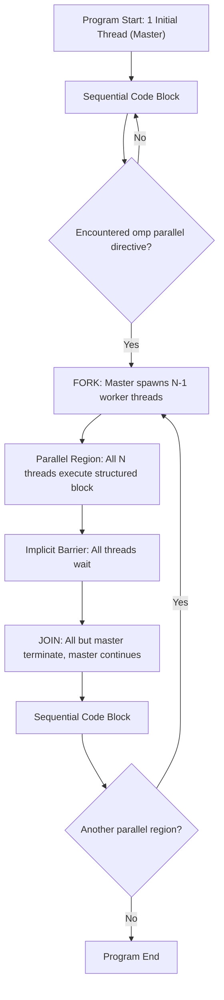
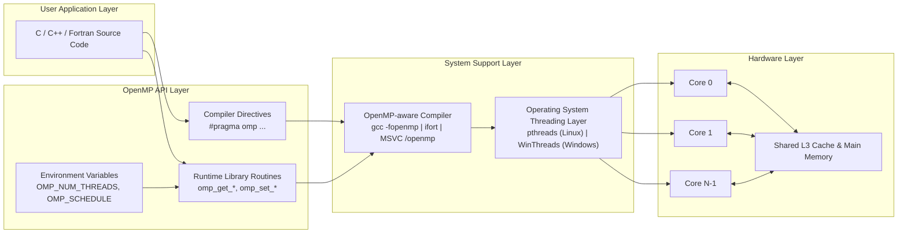
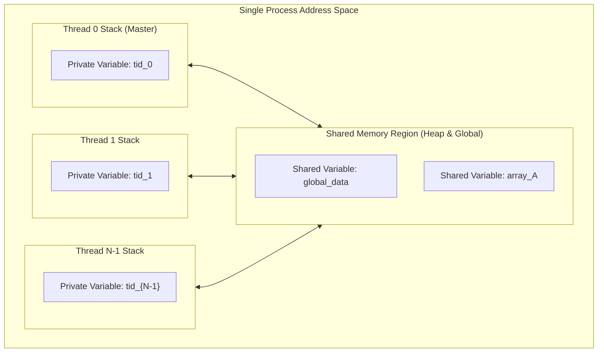

# Parallel Programming with OpenMP - Introduction to OpenMP

<!-- SECTION_1_START -->
# Parallel Programming with OpenMP — Introduction to OpenMP

## 1.1 Formal Definition (KTU 2024 Syllabus Terminology)

> [!IMPORTANT]
> **OpenMP (Open Multi-Processing)** is an *Application Programming Interface (API)* that supports **multi-platform shared-memory parallel programming in C, C++, and Fortran** on most processor architectures and operating systems. It consists of a set of **compiler directives**, a **runtime library**, and **environment variables** that allow a programmer to write sequential code that, with minimal modification, becomes parallel.

OpenMP is governed by a consortium of hardware and software vendors (initially launched in **1997** as the OpenMP Architecture Review Board — *OpenMP ARB*). The current standards are **OpenMP 5.0 (2018)**, **5.1 (2020)**, and **5.2 (2021)**, which extend the model to support *device offloading*, *tasking*, *GPU acceleration*, and *heterogeneous computing*.

| Parameter | Specification |
|---|---|
| Programming Model | Shared-Memory Parallelism (SMP) |
| API Style | Directive-based (\#pragma) |
| Supported Languages | C, C++, Fortran |
| Current Standard | **OpenMP 5.2** |
| Original Release | **October 1997** |
| Steering Body | OpenMP Architecture Review Board (ARB) |

## 1.2 Conceptual Analogy — "The Restaurant Kitchen"

> [!NOTE]
> **Intuitive Analogy: Sequential vs Parallel Cooking**
>
> Imagine a single chef (the **sequential thread**) must prepare a five-course meal alone. Each dish is prepared one after the other — total time = $T_1 + T_2 + T_3 + T_4 + T_5$.
>
> Now imagine a head chef who can **fork** the kitchen into 5 assistant chefs (parallel region). Each chef handles one course. The **head chef waits at a barrier** (the *join* point) until all assistants finish. Total time $\approx \max(T_1, T_2, T_3, T_4, T_5) + T_{\text{sync}}$.
>
> *OpenMP is exactly this head chef.* A single program spawns a *team of threads*, divides work among them, then re-joins to continue sequentially. This is the famous **Fork–Join Model**.

> [!TIP]
> **Key Insight for KTU Exams**: OpenMP follows a *sequential-by-default* philosophy. Your program begins with **one thread (the master)**. Only the code inside an explicit *parallel region* is executed by multiple threads. Always mention this in theory answers — it earns an easy **2 marks**.

## 1.3 OpenMP Components at a Glance

> [!IMPORTANT]
> **Three Pillars of the OpenMP API**
> 1. **Compiler Directives** — `#pragma omp ...` (the core parallelizing construct)
> 2. **Runtime Library Routines** — `omp_get_thread_num()`, `omp_set_num_threads()`, etc.
> 3. **Environment Variables** — `OMP_NUM_THREADS`, `OMP_SCHEDULE`, `OMP_DYNAMIC`

## 1.4 Visualization of Thread Distribution

> [!VISUALIZATION CONTROL]
> **Concept:** Speedup curve for a parallel region as threads increase (Amdahl's Law preview)
> **GeoGebra / Desmos Input Equations:**
> * $S(p) = \dfrac{1}{(1-f) + \dfrac{f}{p}}$
> * where $f = 0.9$ (parallel fraction), $p = 1, 2, 4, 8, 16, 32$
> **Visual Description:** A rapidly rising curve that asymptotically approaches $S_{\max} = \dfrac{1}{1-f} = 10$ as the number of threads $p \to \infty$, then plateaus — illustrating that **adding more threads does not guarantee linear speedup**.
<!-- SECTION_1_END -->

<!-- SECTION_2_START -->
# Deep Theoretical Analysis & KTU High-Yield Formula Sheet

## 2.1 The OpenMP Execution Model — Fork–Join Paradigm

> [!NOTE]
> An OpenMP program is a collection of **sequential and parallel segments**. The execution model is the **Fork–Join Model of Parallelism**:
> * **Sequential Part** → executed by a single *initial thread* (the *master*, master thread has ID 0).
> * **Fork Point** → the program reaches a *parallel region* directive; the master spawns a *team of $N$ threads*.
> * **Parallel Part** → the structured block is executed by every thread in the team (with implicit synchronization at the end).
> * **Join Point** → an *implicit barrier* — all threads wait; only the master continues past the parallel region.

This is *not* the same as spawning new processes — all threads live in a **single process** and share its address space.

## 2.2 The Three OpenMP API Components

### 2.2.1 Compiler Directives

Directives appear as `#pragma omp <directive> [clause [clause] ...]`. They begin with `#pragma omp` to avoid clash with other pragmas.

| Directive | Purpose |
|---|---|
| `#pragma omp parallel` | Start a parallel region |
| `#pragma omp for` | Distribute loop iterations across threads |
| `#pragma omp parallel for` | Combined parallel + for |
| `#pragma omp barrier` | Synchronize all threads in a team |
| `#pragma omp critical` | Serialize execution (mutual exclusion) |
| `#pragma omp single` | Code executed by exactly one thread |

### 2.2.2 Runtime Library Routines (Functions)

> [!IMPORTANT]
> All OpenMP runtime functions begin with the prefix `omp_`. They are declared in the header `<omp.h>` (C/C++).

| Routine | Return / Effect | Used For |
|---|---|---|
| `omp_get_thread_num()` | Returns `int` — thread ID in the team (0 = master) | Identifying individual threads |
| `omp_get_num_threads()` | Returns `int` — total threads in the current team | Loop bounds / partitioning |
| `omp_get_max_threads()` | Returns `int` — max threads available in current parallel region | Capacity planning |
| `omp_set_num_threads(int n)` | Sets the default team size for the next parallel region | Controlling parallelism |
| `omp_get_num_procs()` | Returns `int` — number of processor cores available | Hardware-aware scheduling |
| `omp_in_parallel()` | Returns non-zero if called from inside a parallel region | Conditional logic |
| `double omp_get_wtime()` | Wall-clock timer (seconds) | Performance measurement |

### 2.2.3 Environment Variables

| Variable | Default | Meaning |
|---|---|---|
| `OMP_NUM_THREADS` | System core count | Number of threads for parallel regions |
| `OMP_SCHEDULE` | `static` | Default scheduling for `omp for` |
| `OMP_DYNAMIC` | `false` | Allows runtime to adjust thread count |
| `OMP_NESTED` | `false` | Enables nested parallelism |
| `OMP_PROC_BIND` | `false` | Binds threads to physical cores |
| `OMP_PLACES` | `cores` | Abstract thread affinity topology |

## 2.3 Shared-Memory Model and Data Environment

> [!NOTE]
> **Crucial Concept:** OpenMP assumes a **shared-memory** architecture. By default, all variables in a parallel region are **shared** among threads, *except* the following which are implicitly **private**:
> * Loop index variables of `omp for`
> * Variables declared *inside* the parallel region
> * Variables in a `private`, `firstprivate`, or `lastprivate` clause

Shared variables can be read by all threads but **must be protected** when written — this is where `critical`, `atomic`, `reduction`, and `barrier` constructs enter.

## 2.4 Why OpenMP? — Real-World Engineering Utility

| Domain | Application of OpenMP |
|---|---|
| Scientific Computing | Matrix multiplication, FFT, $N$-body simulations |
| Computational Fluid Dynamics (CFD) | Solving Navier–Stokes on multi-core CPUs |
| Machine Learning | Training of small/medium models on CPU clusters |
| Signal/Image Processing | Convolution, filtering, DCT on large data |
| Financial Computing | Monte Carlo simulations, risk analysis |

OpenMP requires **no message passing** (unlike MPI), **no GPU reprogramming** (until OpenMP 5.0 device offload), and works *incrementally* — you can parallelize one function at a time, keeping the rest of the codebase sequential.

## 2.5 KTU Formula Sheet — Speedup, Efficiency, Amdahl's Law

> [!TIP]
> **These three equations appear in nearly every KTU Parallel Algorithms exam. Memorize them.**

$$
S(p) = \frac{T_{\text{serial}}}{T_{\text{parallel}}(p)}
$$

$$
E(p) = \frac{S(p)}{p} = \frac{T_{\text{serial}}}{p \cdot T_{\text{parallel}}(p)}
$$

$$
S_{\text{Amdahl}}(p) = \frac{1}{(1-f) + \frac{f}{p}}
$$

Where:
* $S(p)$ = speedup with $p$ processors
* $E(p)$ = parallel efficiency, $0 \le E(p) \le 1$
* $f$ = parallelizable fraction of the program
* $1-f$ = inherently sequential fraction
* $T_{\text{serial}}$ = execution time on a single processor

**Limit as $p \to \infty$:** $S_{\infty} = \dfrac{1}{1-f}$. This sets the *hard upper bound* on speedup — no matter how many threads you add, you cannot beat this.
<!-- SECTION_2_END -->

<!-- SECTION_3_START -->
# Step-by-Step Derivations, Code Implementations & Worked Examples

## 3.1 Derivation 1 — Maximum Speedup from Amdahl's Law

> **Problem (KTU Style):** A program spends 80% of its execution time in a parallelizable region. Compute the speedup when running on 4 threads and on 8 threads. What is the maximum theoretical speedup?

**Step 1 — Identify the parallel and serial fractions.**

$$
f = 0.80, \qquad 1 - f = 0.20
$$

**Step 2 — Apply Amdahl's Law for $p = 4$.**

$$
S(4) = \frac{1}{(1 - 0.80) + \dfrac{0.80}{4}} = \frac{1}{0.20 + 0.20} = \frac{1}{0.40} = 2.5
$$

**Step 3 — Apply Amdahl's Law for $p = 8$.**

$$
S(8) = \frac{1}{(1 - 0.80) + \dfrac{0.80}{8}} = \frac{1}{0.20 + 0.10} = \frac{1}{0.30} \approx 3.33
$$

**Step 4 — Maximum theoretical speedup as $p \to \infty$.**

$$
S_{\infty} = \lim_{p \to \infty} \frac{1}{(1 - f) + \dfrac{f}{p}} = \frac{1}{1 - 0.80} = 5
$$

> **Answer:** $S(4) = 2.5$, $S(8) \approx 3.33$, $S_{\max} = 5$. The serial 20% is the bottleneck.

## 3.2 Derivation 2 — Efficiency Drop with Increasing Threads

> **Problem:** A parallel program takes $T_{\text{serial}} = 100$ seconds on 1 thread and $T_{\text{parallel}}(8) = 22$ seconds on 8 threads. Compute the speedup, efficiency, and the *serial fraction* $f$.

**Step 1 — Speedup.**

$$
S(8) = \frac{100}{22} \approx 4.545
$$

**Step 2 — Efficiency.**

$$
E(8) = \frac{S(8)}{8} = \frac{4.545}{8} \approx 0.568 \;(\text{or } 56.8\%)
$$

**Step 3 — Recover $f$ from Amdahl's Law.**

$$
S(8) = \frac{1}{(1-f) + \dfrac{f}{8}} \;\Rightarrow\; 4.545 = \frac{1}{(1-f) + 0.125\,f}
$$

$$
(1 - 0.875\,f) = \frac{1}{4.545} = 0.22
$$

$$
0.875\,f = 0.78 \;\Rightarrow\; f = \frac{0.78}{0.875} \approx 0.891
$$

> **Answer:** Speedup $= 4.545$, Efficiency $\approx 56.8\%$, Parallel fraction $f \approx 89.1\%$.

## 3.3 Full Code Example 1 — "Hello World" Parallel Region

```c
/* File: hello_omp.c
 * Compile: gcc -fopenmp hello_omp.c -o hello_omp
 * Run:     ./hello_omp
 */
#include <stdio.h>
#include <omp.h>      /* OpenMP runtime header */

int main(void) {
    /* Sequential code — runs on the master (initial) thread only. */
    printf("Sequential part begins. Total threads available = %d\n",
           omp_get_max_threads());

    /* === FORK POINT === */
    #pragma omp parallel           /* Start of parallel region */
    {
        /* This structured block runs once PER THREAD. */
        int tid = omp_get_thread_num();
        int nthreads = omp_get_num_threads();
        printf("Hello from thread %d of %d\n", tid, nthreads);
    }
    /* === IMPLICIT BARRIER + JOIN POINT === */

    /* Sequential code again. */
    printf("Sequential part resumes on the master thread.\n");
    return 0;
}
```

### 3.3.1 Line-by-Line Annotation (Valuation-Ready)

| Line | Marks (KTU) | Explanation |
|---|---|---|
| `#include <omp.h>` | 1 | Mandatory header to access OpenMP API |
| `#pragma omp parallel` | 2 | Triggers the Fork — spawns the team |
| `omp_get_thread_num()` | 1 | Returns a unique ID per thread (0…$N-1$) |
| `omp_get_num_threads()` | 1 | Returns the *current* team size $N$ |
| Implicit barrier at `}` | 1 | Automatic synchronization at the end of the region |

> [!TIP]
> **Compilation flag is mandatory**: in GCC/Clang use `-fopenmp`; in MSVC the flag is `/openmp`. Forgetting this flag makes the directives **silently ignored** — a common KTU lab exam trap.

### 3.3.2 Sample Output (Order is Non-Deterministic)

```
Sequential part begins. Total threads available = 4
Hello from thread 2 of 4
Hello from thread 0 of 4
Hello from thread 1 of 4
Hello from thread 3 of 4
Sequential part resumes on the master thread.
```

> [!NOTE]
> The order in which threads print is **undefined by the standard** — OpenMP makes no guarantee of thread ordering. Examiners **do not** penalize for this.

## 3.4 Full Code Example 2 — Setting & Querying Thread Count

```c
/* File: thread_control.c
 * Demonstrates OMP_NUM_THREADS, omp_set_num_threads(), and queries.
 */
#include <stdio.h>
#include <omp.h>

int main(void) {
    /* Method 1: Read environment variable (set externally). */
    printf("Processors available on host   : %d\n", omp_get_num_procs());

    /* Method 2: Programmatically request 6 threads. */
    omp_set_num_threads(6);
    printf("Threads requested via API     : %d\n", omp_get_max_threads());

    #pragma omp parallel
    {
        int tid    = omp_get_thread_num();
        int total  = omp_get_num_threads();
        printf("Thread %2d reporting — team size = %2d\n", tid, total);
    }
    return 0;
}
```

### 3.4.1 Method Comparison Table

| Method | Scope | Persistence |
|---|---|---|
| `OMP_NUM_THREADS=4 ./binary` | Whole process | Until program exits |
| `omp_set_num_threads(N)` | Subsequent parallel regions | Until changed or program exits |
| `num_threads(N)` *clause* | Only that specific `parallel` directive | Local, scoped to one region |

> [!IMPORTANT]
> The **`num_threads(N)` clause** in a directive **overrides everything** — environment variable, runtime call, and the default. Example: `#pragma omp parallel num_threads(3)`. This is the highest-priority control.

## 3.5 Full Code Example 3 — Hello World from Specific Threads

```c
/* File: master_hello.c
 * Demonstrates distinguishing the master from worker threads.
 */
#include <stdio.h>
#include <omp.h>

int main(void) {
    omp_set_num_threads(4);

    #pragma omp parallel
    {
        int tid = omp_get_thread_num();
        if (tid == 0) {
            /* Only the master (thread 0) executes this. */
            printf("[Master] I am thread 0. I will coordinate.\n");
        } else {
            printf("[Worker] I am thread %d. I do the heavy lifting.\n", tid);
        }
    }
    return 0;
}
```

> [!NOTE]
> A more idiomatic and **race-free** way to do the same is the `omp master` / `omp single` directive (covered in Module 4.2 / 4.3 of your syllabus). The above `if (tid == 0)` is *functionally* identical for printing, but `omp single` carries an **implicit barrier** that `if (tid == 0)` does not.

## 3.6 Worked Example 3 — Identifying Race Conditions

> **Question:** In the snippet below, is there a race condition? Justify.

```c
int counter = 0;
#pragma omp parallel
{
    counter = counter + 1;   /* read-modify-write */
}
```

**Step 1 — Analyse the operation.** `counter + 1` is a **read-modify-write** sequence: load, increment, store.

**Step 2 — Identify the conflict.** All $N$ threads execute this on the **shared** variable `counter` simultaneously.

**Step 3 — Determine the hazard.** A *lost-update* race: two threads may read the same value, both write the same incremented value, losing one increment.

**Step 4 — Conclusion.** Yes, this contains a **data race** — the final value of `counter` is **non-deterministic** and is **almost always less than $N$**.

**Step 5 — Fix.** Use `reduction(+:counter)` or `omp atomic` — both are addressed in later modules.
<!-- SECTION_3_END -->

<!-- SECTION_4_START -->
# Structural Diagrams & Schematics

## 4.1 The Fork–Join Execution Model



## 4.2 OpenMP Three-Pillar Architecture



## 4.3 Shared-Memory Data Environment



> [!NOTE]
> All threads *see* the shared region at the same virtual address, but each thread has its **own private stack**. The OpenMP **data-sharing attribute clauses** (`private`, `shared`, `firstprivate`, `lastprivate`, `reduction`, `threadprivate`) control exactly which variables end up in which region.

## 4.4 Sequential Processing Topology Matrix

| Stage | Thread Count | Activity | Synchronization |
|---|---|---|---|
| 1. Program Start | 1 (master) | Initialize, allocate | None |
| 2. Sequential Work | 1 | All pre-parallel code | None |
| 3. `#pragma omp parallel` | $N$ | Fork — team created | None (fork itself) |
| 4. Inside Parallel Region | $N$ | Concurrent execution | Optional barriers / critical |
| 5. End of Parallel Region | $N \to 1$ | Implicit barrier + join | **Mandatory barrier** |
| 6. Post-Parallel | 1 | Master continues alone | None |
| 7. Termination | 0 | Process exits | — |
<!-- SECTION_4_END -->

<!-- SECTION_5_START -->
# KTU 2024 Scheme Examination Question Bank & Topic Recap

---

## 📘 PART A — Short Answer Questions (3 Marks Each)

### Question 1: Define OpenMP and list its three main components.
**[KTU University Exam — July 2022] | CO1 | Remember**

**Model Answer (Board-Expected Wording):**

> **OpenMP (Open Multi-Processing)** is a portable, scalable API that provides a simple and flexible interface for developing parallel applications on shared-memory platforms. It is jointly defined by a group of major computer hardware and software vendors.
>
> **The three main components of the OpenMP API are:**
> 1. **Compiler Directives** — `#pragma omp <directive>` constructs that guide the compiler to parallelize the code.
> 2. **Runtime Library Routines** — a set of functions (e.g., `omp_get_thread_num()`) for querying/controlling the parallel environment at runtime.
> 3. **Environment Variables** — used to control the behavior of OpenMP programs from outside the source code (e.g., `OMP_NUM_THREADS`).

**Valuation Key:**
* [Correct definition: 1 Mark]
* [Listing three components: 1.5 Marks]
* [One-line description of each: 0.5 Mark]

---

### Question 2: Explain the *Fork–Join Model of Parallelism* with a neat diagram.
**[KTU University Exam — Dec 2023] | CO1, CO2 | Understand**

**Model Answer:**

> The **Fork–Join Model** is the fundamental execution model of OpenMP. An OpenMP program begins execution as a single **sequential process** (the initial or master thread). When a **parallel region** is encountered, the master thread *forks* — i.e., it creates a set of **worker threads** that execute the code block concurrently. At the end of the parallel region, there is an **implicit barrier**: all threads must reach it before the program can *join* back to a single thread of execution and continue sequentially.
>
> **Diagram (must be drawn in the exam):**
> ```
>                  ┌─── Thread 1 ───┐
>  Master ──Fork───┤─── Thread 2 ───├───Join──► Master (continued)
>                  └─── Thread N ───┘
>           (Parallel Region)        (Barrier)
> ```

**Valuation Key:**
* [Defining fork: 1 Mark]
* [Defining join + barrier: 1 Mark]
* [Diagram with proper labels: 1 Mark]

---

## 📕 PART B — Long Answer Questions (14 Marks Each — Internal Choice)

### ✏️ Question A — Option 1 (14 Marks)

**(a)** [7 Marks] List and briefly explain **five important OpenMP runtime library functions**. Write a small C program that uses `omp_get_thread_num()`, `omp_get_num_threads()`, and `omp_set_num_threads()` to print a unique greeting from each thread.
**[KTU University Exam — July 2024] | CO1, CO2 | Understand, Apply**

**Model Solution:**

> The **five important OpenMP runtime functions** are:
>
> | # | Function | Description |
> |---|---|---|
> | 1 | `omp_get_thread_num()` | Returns the ID of the currently executing thread within its team. Master is always 0. |
> | 2 | `omp_get_num_threads()` | Returns the number of threads currently active in the parallel region. |
> | 3 | `omp_set_num_threads(int N)` | Sets the number of threads to be used in the *next* parallel region. |
> | 4 | `omp_get_num_procs()` | Returns the number of processor cores available to the device. |
> | 5 | `omp_get_wtime()` | Returns elapsed wall-clock time in seconds as a `double` — useful for performance measurement. |
>
> **Reference Program:**
> ```c
> #include <stdio.h>
> #include <omp.h>
>
> int main(void) {
>     omp_set_num_threads(4);
>     #pragma omp parallel
>     {
>         int tid = omp_get_thread_num();
>         int total = omp_get_num_threads();
>         printf("Greetings from thread %d of %d!\n", tid, total);
>     }
>     return 0;
> }
> ```
> **Compilation:** `gcc -fopenmp greet.c -o greet`
> **Expected Output (order non-deterministic):**
> ```
> Greetings from thread 0 of 4!
> Greetings from thread 1 of 4!
> Greetings from thread 3 of 4!
> Greetings from thread 2 of 4!
> ```

**Valuation Key (Sub-part a — 7 Marks):**
* [Listing 5 functions with one-line description: 5 × 0.5 = 2.5 Marks]
* [Correct `#include <omp.h>` and `omp_set_num_threads`: 1 Mark]
* [Correct `omp_get_thread_num` and `omp_get_num_threads` use: 1.5 Marks]
* [Proper `#pragma omp parallel` block: 1 Mark]
* [Compile command and expected output note: 1 Mark]

---

**(b)** [7 Marks] A program has 25% inherently sequential code. Apply **Amdahl's Law** to find: (i) the speedup on 4 threads, (ii) the speedup on 16 threads, and (iii) the maximum theoretical speedup.
**[KTU University Exam — Dec 2023] | CO3, CO4 | Apply, Analyze**

**Model Solution:**

**Step 1 — Extract parameters.**
$$
1 - f = 0.25, \qquad f = 0.75
$$

**Step 2 — Apply $S(p) = \dfrac{1}{(1-f) + \dfrac{f}{p}}$ for $p = 4$.**

$$
S(4) = \frac{1}{0.25 + \dfrac{0.75}{4}} = \frac{1}{0.25 + 0.1875} = \frac{1}{0.4375} \approx 2.286
$$

**Step 3 — Apply for $p = 16$.**

$$
S(16) = \frac{1}{0.25 + \dfrac{0.75}{16}} = \frac{1}{0.25 + 0.046875} = \frac{1}{0.296875} \approx 3.368
$$

**Step 4 — Maximum theoretical speedup as $p \to \infty$.**

$$
S_{\max} = \frac{1}{1 - f} = \frac{1}{0.25} = 4
$$

**Final Answer:** $S(4) \approx 2.29$, $S(16) \approx 3.37$, $S_{\max} = 4$.

**Valuation Key (Sub-part b — 7 Marks):**
* [Stating $f$ and $1-f$: 1 Mark]
* [Formula written: 1 Mark]
* [Computation for $p=4$: 1.5 Marks]
* [Computation for $p=16$: 1.5 Marks]
* [Maximum speedup derived using limit: 2 Marks]

---

### ✏️ Question B — Option 2 (14 Marks)

**(a)** [7 Marks] With the help of a **neat block diagram**, explain the architecture of the OpenMP API. Distinguish clearly between *directives*, *runtime routines*, and *environment variables*.
**[KTU University Exam — Dec 2022] | CO1, CO2 | Understand**

**Model Solution:**

> The OpenMP API architecture can be visualized as **three interacting layers**:
>
> ```
> ┌────────────────────────────────────────────────────┐
> │        USER APPLICATION (C / C++ / Fortran)        │
> ├────────────────────┬───────────────┬───────────────┤
> │  Compiler          │  Runtime      │  Environment  │
> │  Directives        │  Library      │  Variables    │
> │  #pragma omp ...   │  omp_get_*    │  OMP_NUM_*    │
> │  #pragma omp ...   │  omp_set_*    │  OMP_SCHED*   │
> ├────────────────────┴───────────────┴───────────────┤
> │        OpenMP-Aware Compiler (gcc -fopenmp)        │
> ├────────────────────────────────────────────────────┤
> │           OS Threading Layer (pthreads, etc.)      │
> ├────────────────────────────────────────────────────┤
> │     Shared-Memory Multi-Core Hardware (CPU Cores)  │
> └────────────────────────────────────────────────────┘
> ```
>
> **Distinctions:**
>
> | Aspect | Directives | Runtime Routines | Environment Variables |
> |---|---|---|---|
> | **Form** | `#pragma omp parallel` | Function call: `omp_get_thread_num()` | Shell variable: `OMP_NUM_THREADS=8` |
> | **Purpose** | Tell the compiler *where* and *how* to parallelize | Query or modify the parallel environment at *runtime* | Set program-wide defaults *before* execution |
> | **Where used** | Inside source code | Inside source code | Outside the program (in the shell) |
> | **Example** | `#pragma omp parallel num_threads(4)` | `omp_set_num_threads(4)` | `export OMP_NUM_THREADS=4` |

**Valuation Key (Sub-part a — 7 Marks):**
* [Neat block diagram with all 3 layers: 3 Marks]
* [Tabular distinction: 3 Marks]
* [One correct example of each: 1 Mark]

---

**(b)** [7 Marks] Write a complete C program using OpenMP that: (i) detects the number of available processor cores using `omp_get_num_procs()`, (ii) explicitly sets the thread count to 8 via `omp_set_num_threads(8)`, (iii) inside the parallel region, has each thread print `Hello from thread X of Y` where $X$ and $Y$ are obtained using the appropriate OpenMP functions.
**[KTU University Exam — July 2023] | CO2, CO3 | Apply**

**Model Solution:**

```c
/* File: full_hello.c — Complete OpenMP Hello World */
#include <stdio.h>
#include <omp.h>

int main(void) {
    int cores;

    /* (i) Detect processor cores */
    cores = omp_get_num_procs();
    printf("[System] Number of processor cores = %d\n", cores);

    /* (ii) Set thread count to 8 */
    omp_set_num_threads(8);
    printf("[Setup]  Requesting 8 threads for the parallel region.\n");

    /* (iii) Parallel region with per-thread greeting */
    #pragma omp parallel
    {
        int tid   = omp_get_thread_num();
        int total = omp_get_num_threads();

        printf("Hello from thread %d of %d\n", tid, total);
    }

    printf("[Done]   Parallel region complete.\n");
    return 0;
}
```

**Compilation:**
```bash
gcc -fopenmp full_hello.c -o full_hello
./full_hello
```

**Sample Output (8 threads, order undefined):**
```
[System] Number of processor cores = 4
[Setup]  Requesting 8 threads for the parallel region.
Hello from thread 0 of 8
Hello from thread 2 of 8
Hello from thread 5 of 8
Hello from thread 1 of 8
Hello from thread 6 of 8
Hello from thread 3 of 8
Hello from thread 7 of 8
Hello from thread 4 of 8
[Done]   Parallel region complete.
```

> [!NOTE]
> **Why does the program request 8 threads when the system has only 4 cores?** OpenMP is a *logical* parallel model — it does not always refuse to over-subscribe. The OS will *time-slice* threads onto the available cores. For best performance, you should set `OMP_NUM_THREADS` $\le$ number of physical cores.

**Valuation Key (Sub-part b — 7 Marks):**
* [Correct `#include <omp.h>`: 0.5 Mark]
* [`omp_get_num_procs()` correctly used: 1 Mark]
* [`omp_set_num_threads(8)` correctly placed: 1 Mark]
* [`#pragma omp parallel` block: 1 Mark]
* [`omp_get_thread_num()` and `omp_get_num_threads()` correctly used: 2 Marks]
* [Compile command + output note: 1.5 Marks]

---

## ⚠️ KTU Examiner's Valuation Warning / Pitfall Callout

> [!WARNING]
> **Common Mistakes That Cost Easy Marks**
> 1. **Forgetting `<omp.h>`** → All `omp_*` functions are *undeclared*. Code will not compile with `-fopenmp`. Loss: 0.5–1 Mark.
> 2. **Forgetting the `-fopenmp` flag** → Directives are silently ignored, program runs sequentially but compiles. The student *thinks* it parallelized, but the output shows only 1 thread. Always mention the compile command in lab records.
> 3. **Treating OpenMP as automatic** → OpenMP does **not** auto-parallelize loops. The programmer must add `#pragma omp parallel for` or work-sharing constructs explicitly.
> 4. **Confusing `omp_get_max_threads()` with `omp_get_num_threads()`** → The former returns the *upper bound* available *outside* a parallel region; the latter returns the *actual* team size *inside* one.
> 5. **Assuming deterministic output order** → It is not. Never write "Thread 0 prints first" — the standard does not guarantee this.
> 6. **Forgetting the implicit barrier** → When you write a single answer, mention the **implicit barrier at the end of every parallel region** — it is a favourite KTU sub-question.
> 7. **In Amdahl's Law problems, forgetting units or stating the formula without the constant term $(1-f)$** → Always write $S(p) = \dfrac{1}{(1-f) + \dfrac{f}{p}}$, *not* $S(p) = \dfrac{p}{f}$. Loss: 1–2 Marks.

---

## 🎯 Topic Recap & Important Things to Remember

> [!TIP]
> **Rapid Revision Checklist — Module 4.1: Introduction to OpenMP**

- [x] **OpenMP** = Open Multi-Processing — a directive-based API for **shared-memory** parallel programming.
- [x] Three API components: **Directives**, **Runtime Routines**, **Environment Variables**.
- [x] Execution model: **Fork–Join** — sequential start, fork at `#pragma omp parallel`, implicit barrier, join.
- [x] The **master thread has ID 0** in every team.
- [x] Mandatory header: `<omp.h>`; mandatory compile flag: **`-fopenmp`** (GCC/Clang) or **`/openmp`** (MSVC).
- [x] Most-used runtime functions:
   - `omp_get_thread_num()` → current thread's ID
   - `omp_get_num_threads()` → current team size
   - `omp_set_num_threads(N)` → set team size
   - `omp_get_num_procs()` → number of processor cores
   - `omp_get_max_threads()` → upper bound outside parallel region
- [x] Most-used environment variable: `OMP_NUM_THREADS`.
- [x] Default data-sharing: variables in scope are **shared**, except loop indices and locally declared variables which are **private**.
- [x] **Amdahl's Law:** $S(p) = \dfrac{1}{(1-f) + \dfrac{f}{p}}$; maximum $S_{\max} = \dfrac{1}{1-f}$.
- [x] **Efficiency:** $E(p) = \dfrac{S(p)}{p}$, always $0 \le E(p) \le 1$.
- [x] **Critical distinction:** `#pragma omp parallel` alone runs the block N times (one per thread). It is *not* the same as work-sharing — that requires `omp for` (Module 4.2).
- [x] **Race condition warning:** read-modify-write on a shared variable inside a parallel region is a *data race* — use `critical`, `atomic`, or `reduction` (covered in subsequent modules).
- [x] **OpenMP is incremental** — you can parallelize one function at a time while keeping the rest sequential; it does not require a complete rewrite.
- [x] **Current standard:** OpenMP 5.2 (2021) — supports GPU offloading and heterogeneous computing (C/C++/Fortran).
<!-- SECTION_5_END -->
