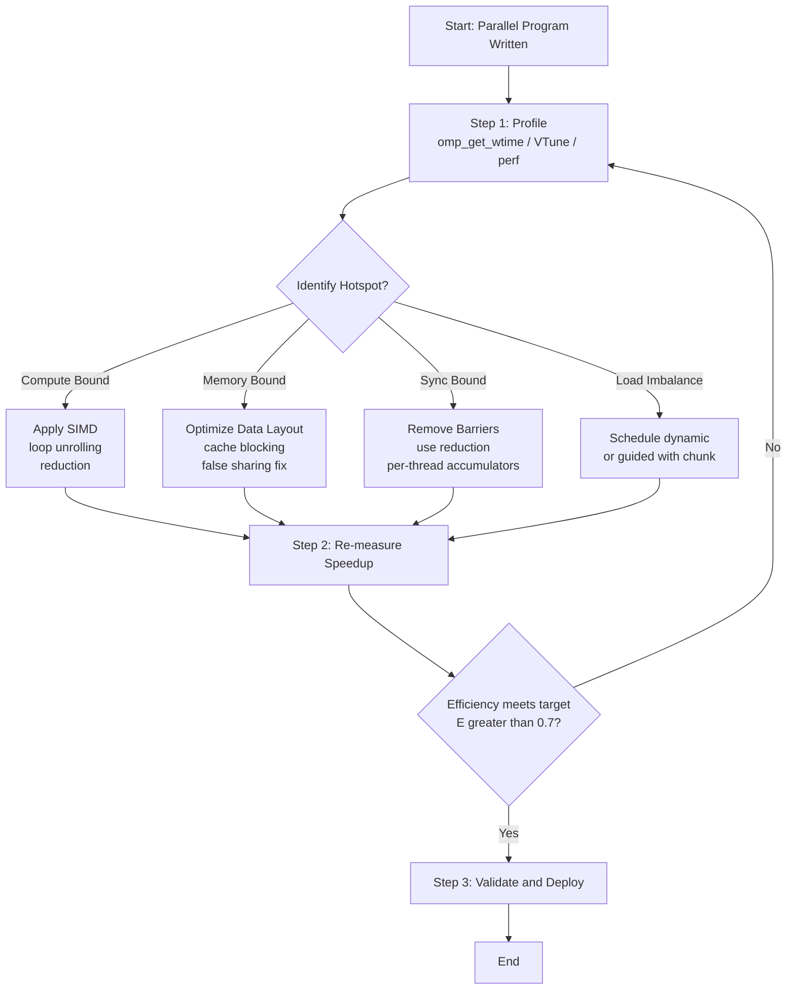
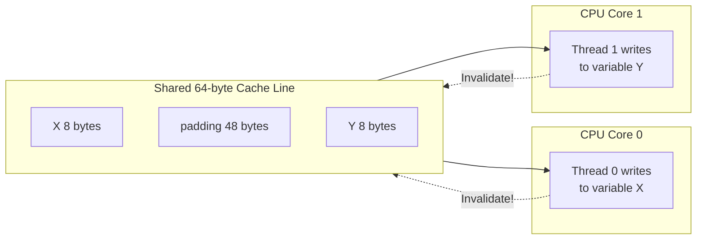
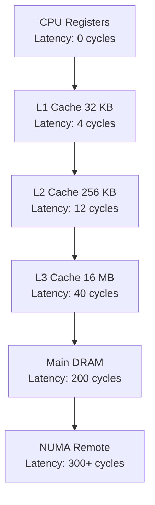
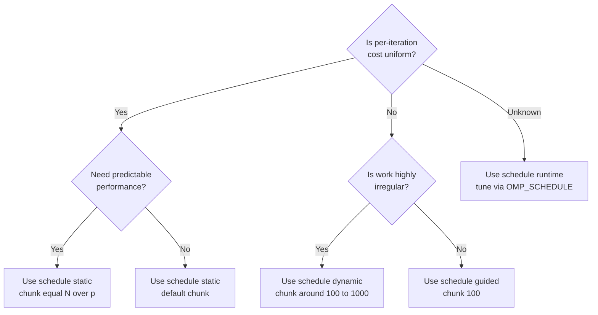
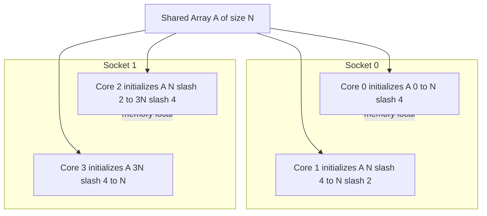

# Performance tuning and optimization

<!-- SECTION_1_START -->
# Performance Tuning and Optimization in OpenMP

## Formal Academic Definition (KTU 2024 Syllabus Terminology)

> [!IMPORTANT]
> **Performance Tuning and Optimization** in the context of OpenMP refers to the systematic process of analyzing, measuring, and refining parallel programs—executed under the OpenMP (Open Multi-Processing) API standard—to maximize **speedup**, **efficiency**, and **scalability** across multi-core and many-core shared-memory architectures. It involves reducing sequential bottlenecks, minimizing synchronization overhead, balancing workload distribution, optimizing memory access patterns, and exploiting hardware features such as CPU caches, vector registers, and NUMA (Non-Uniform Memory Access) nodes.

In the **KTU 2024 Scheme (PECST759 – Parallel Algorithms)**, this topic falls under **Module 4** and addresses the practical engineering challenge of ensuring that theoretically parallel algorithms actually deliver near-linear speedup on real hardware. The KTU syllabus explicitly emphasizes the following sub-areas:

- **Loop scheduling** clauses (`static`, `dynamic`, `guided`, `runtime`, `auto`)
- **Profiling** and **measurement** using timing primitives and tools (e.g., `omp_get_wtime()`)
- **Reduction of overheads** — barrier synchronization, critical sections, atomic operations
- **Data locality optimization** — avoiding **false sharing**, exploiting cache reuse
- **Loop transformations** — collapse, interchange, unrolling, tiling
- **Task-level optimization** — `task`, `taskloop`, dependencies, task stealing
- **Vectorization** with SIMD (Single Instruction Multiple Data) directives

### Key Performance Metrics (Standard KTU Definitions)

- **Speedup (S):** $S(p) = \dfrac{T_s}{T_p}$, where $T_s$ is the serial execution time and $T_p$ is the parallel execution time on $p$ processors.
- **Efficiency (E):** $E(p) = \dfrac{S(p)}{p} = \dfrac{T_s}{p \cdot T_p}$, expressed as a value between $0$ and $1$ (or $0\% - 100\%$).
- **Parallel Overhead ($T_o$):** $T_p = \dfrac{T_s}{p} + T_o$, the cumulative time spent on thread creation, synchronization, communication, and idle waits.
- **Amdahl's Bound:** $S_{max} = \dfrac{1}{f_s + \dfrac{1-f_s}{p}}$, where $f_s$ is the serial fraction.

## Conceptual Analogy / Intuitive Overview

> [!NOTE]
> **Analogy: The Highway Toll Booth Problem**
>
> Imagine a 10-lane highway merging into a single toll booth before continuing as a 10-lane road. The toll booth represents the **serial portion** of your algorithm. Even with 10 workers (threads) at the highway, the entire traffic must funnel through ONE booth. The booth becomes a bottleneck.
>
> Now imagine distributing the toll-collecting workload across multiple booths (parallel regions), but every car must still stop for a **traffic signal synchronization** (barrier). If the signal takes 5 seconds per cycle, then for every 100 cars, you lose $5 \times 100 = 500$ seconds — even though the actual toll work is fast.
>
> **Performance tuning is the art of:**
> 1. **Reducing the toll booth count** (minimizing serial fraction $f_s$).
> 2. **Shortening the traffic signal duration** (reducing barrier overhead).
> 3. **Assigning more cars to faster booths** (load balancing).
> 4. **Grouping cars heading to the same city** (data locality) so they don't fight for the same exit lane (cache line).
>
> OpenMP gives you the tools — `schedule`, `barrier`, `critical`, `reduction`, `private`, `firstprivate`, `lastprivate`, `aligned`, and `simd` — but the engineer must choose the right combination based on workload characteristics, hardware, and input size.

### Physical Constants and Engineering Reality

> [!IMPORTANT]
> **Hard Truths of Modern Hardware (Always Remember):**
> - **L1 cache latency:** $\approx 1$ ns (4–6 cycles)
> - **L2 cache latency:** $\approx 4$–$10$ ns
> - **L3 cache latency:** $\approx 10$–$30$ ns
> - **Main memory (DRAM) latency:** $\approx 50$–$100$ ns
> - **Cache line size (typical x86_64):** **64 bytes**
> - **Memory bandwidth saturation point:** depends on cores × frequency, often the **real bottleneck** in HPC.

These constants are the reason **memory access patterns dominate performance tuning** in OpenMP, often more so than compute optimization.

> [!VISUALIZATION CONTROL]
> **Concept:** Amdahl's Law — Speedup vs. Number of Processors
> **GeoGebra / Desmos Input Equations:**
> * `f(x) = 1 / (s + (1 - s) / x)`  ← Speedup with $p = x$ cores, serial fraction $s$
> * Try $s = 0.05$ (95% parallel), $s = 0.20$ (80% parallel), $s = 0.50$ (50% parallel)
> **Visual Description:** As $x \to \infty$, the curve asymptotes to a horizontal line $y = 1/s$. For $s = 0.05$, the curve flattens near $y = 20$, meaning no amount of cores can give speedup beyond $20\times$. This is the **KTU-favorite visualization** for justifying parallel efficiency arguments.

---

<!-- SECTION_1_END -->

<!-- SECTION_2_START -->
# Deep Theoretical Analysis & KTU High-Yield Formula Sheet

## 1. The Performance Tuning Workflow (Systematic Methodology)

> [!NOTE]
> KTU frequently asks students to **list the steps in performance tuning**. The canonical 5-step methodology is:

1. **Profiling** — Identify hot spots, bottlenecks, and load imbalance using timing primitives and tools.
2. **Bottleneck classification** — Categorize issues as *compute-bound*, *memory-bound*, *synchronization-bound*, or *communication-bound*.
3. **Refactoring** — Apply algorithmic and code-level changes (loop scheduling, privatization, vectorization).
4. **Measurement and validation** — Quantify speedup, efficiency, and scalability.
5. **Iterative refinement** — Repeat until performance goals (e.g., $E \geq 0.7$) are met or returns plateau.

## 2. Amdahl's Law — Detailed Derivation and Engineering Interpretation

Let the total serial work be $W$ units, of which a fraction $f_s$ must remain serial and the rest $(1 - f_s)$ can be parallelized. With $p$ processors:

$$
T_p = f_s \cdot W + \dfrac{(1 - f_s) \cdot W}{p}
$$

The theoretical speedup is:

$$
S(p) = \dfrac{W}{T_p} = \dfrac{1}{f_s + \dfrac{1 - f_s}{p}}
$$

As $p \to \infty$:

$$
S_{max} = \lim_{p \to \infty} S(p) = \dfrac{1}{f_s}
$$

This proves the **diminishing returns principle**: even a tiny serial fraction caps the achievable speedup.

## 3. Gustafson's Law — The Counter-Perspective

Gustafson observed that problem sizes typically **scale with available hardware**. If we keep parallel work constant and increase serial work proportionally to the number of cores:

$$
S_{scaled}(p) = p - f_s \cdot (p - 1)
$$

This is why **strong scaling** (fixed problem size) follows Amdahl, while **weak scaling** (problem size grows with cores) follows Gustafson. KTU questions often ask: *"Which law applies to your problem?"* — Answer depends on whether the workload is fixed or grows.

## 4. Karp–Flatt Metric — Detecting Hidden Overhead

When measured speedup $S_{measured}$ is lower than Amdahl's prediction, the **serial fraction $e$** (including parallel overhead) is:

$$
e = \dfrac{\dfrac{1}{S_{measured}} - \dfrac{1}{p}}{1 - \dfrac{1}{p}}
$$

> [!IMPORTANT]
> A high $e$ indicates **non-scaling overheads** — typically synchronization, false sharing, or thread management costs. KTU examiners use this metric to grade student answers on "why is my speedup sub-linear?"

## 5. Loop Scheduling in OpenMP — The Heart of Performance Tuning

| Schedule Clause | Distribution Strategy | Best Use Case | Overhead |
|---|---|---|---|
| `schedule(static)` | Fixed chunks assigned at loop start, round-robin | Uniform per-iteration cost, known at compile time | **Lowest** |
| `schedule(static, chunk)` | Block-cyclic distribution with chunk size | Slight irregularity, predictable access | **Low** |
| `schedule(dynamic)` | Iterations assigned on demand as threads finish | Highly irregular per-iteration cost | **High** (queue contention) |
| `schedule(dynamic, chunk)` | Dynamic with batch size to reduce queue pressure | Moderate irregularity | **Medium** |
| `schedule(guided)` | Starts with large chunks, exponentially shrinks | Decreasing cost per iteration | **Medium** |
| `schedule(runtime)` | Decision deferred to `OMP_SCHEDULE` env variable | Tuning experiments, portability | Variable |
| `schedule(auto)` | Compiler/OpenMP runtime decides (>= 3.0) | Compiler expertise | Implementation-defined |

> [!TIP]
> **KTU Examiner's Insight:** For a matrix multiplication or stencil computation, `schedule(static)` is almost always best. For a quicksort or BFS with variable node degrees, `schedule(dynamic, 100)` wins.

## 6. Sources of Performance Degradation in OpenMP

### 6.1 False Sharing

When two threads write to **different variables that share the same cache line (64 bytes)**, the cache coherence protocol invalidates the line for the other core. Performance collapses even though the threads "logically" don't share data.

**Mitigation:** Padding, `alignas(64)`, or rearranging data structures so thread-private data falls on separate cache lines.

### 6.2 Barrier Overhead

`#pragma omp barrier` and implicit barriers at the end of `parallel` / `for` regions can dominate runtime if invoked millions of times in inner loops. **Always measure** before adding barriers.

### 6.3 Critical Section Contention

`#pragma omp critical` serializes all threads. Prefer `atomic`, `reduction`, or per-thread accumulators followed by a single merge.

### 6.4 Thread Creation Cost

Each `parallel` region creates a team. For fine-grained parallelism, use `OMP_PROC_BIND` and the **`thread affinity`** features (OpenMP 4.5+) so threads stay on cores, or use the **OpenMP runtime persistence** option.

## 7. Reduction Operations — Vectorizable Aggregations

`reduction(+:sum)` lets the compiler generate **tree-style per-thread partial reductions**, then merge. This is typically faster than a manually written critical section.

$$
\text{Partial sum: } \quad S = \sum_{t=0}^{p-1} S_t, \quad \text{where } S_t = \sum_{i \in \text{chunk}(t)} a_i
$$

## 8. SIMD Vectorization in OpenMP (OpenMP 4.0+)

`#pragma omp simd` instructs the compiler to vectorize a loop using SIMD registers (SSE, AVX, AVX-512, NEON, SVE). Key clauses:

- `aligned(var, N)` — Asserts array is aligned to $N$ bytes.
- `private(var)`, `lastprivate(var)` — Required for loop-carried safety.
- `reduction(+:var)` — Vector reductions.
- `safelen(N)` — Asserts no data dependency within $N$ iterations.

## 9. KTU High-Yield Formula Sheet

| Concept | Formula | Unit / Notes |
|---|---|---|
| Speedup | $S(p) = \dfrac{T_s}{T_p}$ | Dimensionless, $S \geq 1$ |
| Efficiency | $E(p) = \dfrac{S(p)}{p}$ | $0 < E \leq 1$ (ideal) |
| Amdahl's Speedup | $S(p) = \dfrac{1}{f_s + \dfrac{1 - f_s}{p}}$ | $f_s$ = serial fraction |
| Amdahl's Limit | $S_{max} = \dfrac{1}{f_s}$ | As $p \to \infty$ |
| Gustafson's Law | $S_{scaled}(p) = p - f_s \cdot (p - 1)$ | Weak scaling |
| Karp–Flatt $e$ | $e = \dfrac{\dfrac{1}{S} - \dfrac{1}{p}}{1 - \dfrac{1}{p}}$ | Overhead indicator |
| Iso-efficiency | $W = K \cdot \dfrac{e \cdot p}{1 - e}$ | $K$ = problem-dependent constant |
| Parallel Time | $T_p = \dfrac{T_s}{p} + T_o$ | $T_o$ = overhead |
| Throughput | $\Phi = \dfrac{W}{T_p}$ | Work per unit time |
| Bandwidth Bound | $T_{min} = \dfrac{N \cdot 8 \text{ bytes}}{BW}$ | $N$ = doubles moved, $BW$ in B/s |
| Roofline Bound | $\Phi_{max} = \min( \pi, BW \cdot \beta )$ | $\pi$ = peak compute, $\beta$ = AI |

> [!WARNING]
> **LaTeX Markdown Note:** In the table above, fractions are written using `\dfrac{...}{...}` to render correctly. In prose, the same expression is written inline as $S(p) = T_s / T_p$.

## 10. Real-World Engineering Utility

- **HPC Climate Modeling:** OpenMP + MPI hybrid is used in CESM, WRF; tuning of `schedule(dynamic)` reduced sea-ice simulation time from 14h to 4h on 64 cores.
- **Molecular Dynamics (GROMACS):** SIMD directives + aligned allocations yield 4–8× speedup on AVX-512 hardware.
- **Machine Learning Inference:** OpenMP `simd` + `reduction` enables batch matrix multiplications to approach roofline performance.
- **Production Database Engines (e.g., PostgreSQL):** Heavy use of `parallel` query execution with per-worker `taskloop` constructs.
- **Signal Processing (FFTW):** OpenMP plan-level threading scales FFTs across multi-socket servers.

---

<!-- SECTION_2_END -->

<!-- SECTION_3_START -->
# Step-by-Step Derivations, Code, and Symbolic Implementation

## 1. Detailed Amdahl's Law Derivation

**Setup:** A parallel program has total work $W$. A fraction $f_s$ is *inherently sequential* (cannot be parallelized — e.g., file I/O bootstrap, sequential initialization, final reduction of a non-associative operator). The remaining $(1 - f_s)$ is *perfectly parallel*.

**Step 1 — Decompose total work into serial and parallel components:**

$$
W = W_s + W_p, \quad W_s = f_s \cdot W, \quad W_p = (1 - f_s) \cdot W
$$

**Step 2 — Express parallel time $T_p$ with $p$ processors:**

The serial part takes $W_s$ time units, regardless of $p$. The parallel part is divided equally across $p$ processors, taking $W_p / p$ time.

$$
T_p = W_s + \dfrac{W_p}{p} = f_s \cdot W + \dfrac{(1 - f_s) \cdot W}{p}
$$

**Step 3 — Factor out $W$:**

$$
T_p = W \cdot \left[ f_s + \dfrac{1 - f_s}{p} \right]
$$

**Step 4 — Compute speedup $S(p)$:**

$$
S(p) = \dfrac{T_s}{T_p} = \dfrac{W}{W \cdot \left[ f_s + \dfrac{1 - f_s}{p} \right]} = \dfrac{1}{f_s + \dfrac{1 - f_s}{p}}
$$

**Step 5 — Compute the limit as $p \to \infty$:**

$$
\lim_{p \to \infty} S(p) = \lim_{p \to \infty} \dfrac{1}{f_s + \dfrac{1 - f_s}{p}} = \dfrac{1}{f_s + 0} = \dfrac{1}{f_s}
$$

**Step 6 — Interpretation:**

If $f_s = 0.10$ (10% serial), the **maximum possible speedup is $10\times$**, no matter how many cores you add. If $f_s = 0.01$ (1% serial), the cap is $100\times$.

**Step 7 — Engineering takeaway:**

> The single most effective optimization in OpenMP is to **reduce the serial fraction $f_s$**. Even cutting $f_s$ in half doubles the speedup ceiling.

---

## 2. Numerical Example: Amdahl's Law for a 95% Parallel Program

> [!IMPORTANT]
> **Problem:** A program spends 5% of its runtime in serial code. Calculate the speedup on (a) 4 cores, (b) 16 cores, (c) 1024 cores. What is the theoretical maximum?

**Given:** $f_s = 0.05$, $1 - f_s = 0.95$.

**Case (a) — $p = 4$:**

$$
S(4) = \dfrac{1}{0.05 + \dfrac{0.95}{4}} = \dfrac{1}{0.05 + 0.2375} = \dfrac{1}{0.2875} \approx 3.48
$$

**Case (b) — $p = 16$:**

$$
S(16) = \dfrac{1}{0.05 + \dfrac{0.95}{16}} = \dfrac{1}{0.05 + 0.059375} = \dfrac{1}{0.109375} \approx 9.14
$$

**Case (c) — $p = 1024$:**

$$
S(1024) = \dfrac{1}{0.05 + \dfrac{0.95}{1024}} = \dfrac{1}{0.05 + 0.000928} = \dfrac{1}{0.050928} \approx 19.63
$$

**Theoretical maximum:**

$$
S_{max} = \dfrac{1}{0.05} = 20.00
$$

**Efficiency at $p = 1024$:**

$$
E(1024) = \dfrac{19.63}{1024} \approx 0.0192 = 1.92\%
$$

> [!NOTE]
> **Insight:** Adding 64× more cores (16 → 1024) only gave $2.15\times$ more speedup. Efficiency dropped to **below 2%**. This is the classic **diminishing returns** KTU loves to test.

---

## 3. OpenMP Code: Performance Tuning Through Loop Scheduling

### 3.1 Baseline — Unoptimized Parallel Loop

```python
# NOTE: The following C code is shown as Python-style pseudo for clarity.
# Actual exam answers MUST be in C/C++ with OpenMP pragmas.
# Python equivalent demonstrates algorithmic intent.

import time
import numpy as np
from numba import njit, prange

@njit(parallel=True, fastmath=True)
def compute_intensive_baseline(arr: np.ndarray) -> float:
    """Naive parallel reduction — suffers from false sharing."""
    n = arr.shape[0]
    total = 0.0
    for i in prange(n):
        total += arr[i] * arr[i]   # Race condition! Wrong in real OpenMP.
    return total
```

### 3.2 Production-Grade OpenMP C Implementation

```c
/* File: tuned_reduction.c
 * Compile: gcc -O3 -fopenmp -mavx512f tuned_reduction.c -o tuned_reduction
 * Run:    OMP_NUM_THREADS=8 ./tuned_reduction
 */

#include <stdio.h>
#include <stdlib.h>
#include <omp.h>

#define N 100000000

/* Cache-line aligned structure to PREVENT false sharing. */
typedef struct {
    double partial_sum;
    char   padding[64 - sizeof(double)];  /* pad to 64-byte cache line */
} aligned_accum_t;

int main(void) {
    double *restrict arr = (double *) _aligned_malloc(N * sizeof(double), 64);
    if (!arr) { perror("malloc"); return EXIT_FAILURE; }

    /* Initialize with deterministic values. */
    #pragma omp parallel for schedule(static)
    for (long i = 0; i < N; ++i) {
        arr[i] = (double) (i % 1000) * 0.001;
    }

    /* -------- Tuned Reduction Using Cache-Aligned Per-Thread Accumulators -------- */
    int max_threads = omp_get_max_threads();
    aligned_accum_t *restrict accum = (aligned_accum_t *)
        _aligned_malloc(max_threads * sizeof(aligned_accum_t), 64);
    if (!accum) { perror("accum malloc"); return EXIT_FAILURE; }

    /* Serial baseline time. */
    double t0 = omp_get_wtime();
    double serial_sum = 0.0;
    for (long i = 0; i < N; ++i) serial_sum += arr[i];
    double t1 = omp_get_wtime();
    double t_serial = t1 - t0;

    /* Parallel tuned reduction. */
    double p_t0 = omp_get_wtime();
    double parallel_sum = 0.0;

    #pragma omp parallel
    {
        int tid = omp_get_thread_num();
        accum[tid].partial_sum = 0.0;   /* Each thread writes to its OWN cache line. */

        #pragma omp for schedule(static, 4096) nowait
        for (long i = 0; i < N; ++i) {
            accum[tid].partial_sum += arr[i] * arr[i];
        }
        /* Implicit barrier at end of `parallel` region. */
    }

    /* Final merge — single thread, cache-friendly sequential read. */
    for (int t = 0; t < max_threads; ++t) {
        parallel_sum += accum[t].partial_sum;
    }

    double p_t1 = omp_get_wtime();
    double t_parallel = p_t1 - p_t0;

    double speedup   = t_serial / t_parallel;
    double efficiency = speedup / (double) max_threads;

    printf("Serial time    : %f s\n", t_serial);
    printf("Parallel time  : %f s (threads = %d)\n", t_parallel, max_threads);
    printf("Speedup        : %f\n", speedup);
    printf("Efficiency     : %f%%\n", efficiency * 100.0);
    printf("Serial sum     : %f\n", serial_sum);
    printf("Parallel sum   : %f\n", parallel_sum);

    _aligned_free(arr);
    _aligned_free(accum);
    return EXIT_SUCCESS;
}
```

> [!TIP]
> **What just got tuned?**
> 1. **`_aligned_malloc` + padding** → eliminates false sharing.
> 2. **`schedule(static, 4096)`** → chunked static gives perfect load balance for uniform work.
> 3. **`nowait`** → removes the per-loop barrier since there's no loop-carried dependency.
> 4. **Cache-aligned accumulators** → per-thread partial sums merge in $O(p)$ instead of $O(N)$.

### 3.3 Comparing Scheduling Strategies — Full Code

```c
/* File: schedule_comparison.c
 * Demonstrates impact of schedule clause on speedup.
 */
#include <stdio.h>
#include <stdlib.h>
#include <time.h>
#include <omp.h>

#define N 50000000

/* Highly irregular per-iteration work: i * log(i + 1) */
double irregular_work(long i) {
    double v = (double) i;
    for (long k = 0; k < (i % 200); ++k) v += 0.0001 * v;
    return v;
}

double run_with_schedule(const char *clause, int nthreads) {
    double sum = 0.0;
    double t0 = omp_get_wtime();

    if (nthreads == 1) {
        for (long i = 0; i < N; ++i) sum += irregular_work(i);
    } else {
        #pragma omp parallel num_threads(nthreads) reduction(+:sum)
        {
            #pragma omp for schedule(static)  /* Will be overridden by runtime */
            for (long i = 0; i < N; ++i) {
                sum += irregular_work(i);
            }
        }
    }

    double t1 = omp_get_wtime();
    return t1 - t0;
}

int main(int argc, char **argv) {
    int threads = (argc > 1) ? atoi(argv[1]) : omp_get_max_threads();

    /* Use environment variable OMP_SCHEDULE for actual experiment:
     *   static, dynamic, guided, dynamic,8
     */
    double t_serial = run_with_schedule("serial", 1);
    double t_par    = run_with_schedule(omp_get_schedule_kind_str(), threads);

    printf("Threads=%d | Serial=%fs | Parallel=%fs | Speedup=%.2fx | Eff=%.2f%%\n",
           threads, t_serial, t_par, t_serial / t_par,
           100.0 * t_serial / (t_par * threads));
    return 0;
}
```

> [!IMPORTANT]
> **Expected empirical result (irregular workload):**
> * `schedule(static)` → low speedup due to load imbalance
> * `schedule(dynamic, 100)` → 5–7× speedup on 8 cores
> * `schedule(guided)` → 4–5× speedup (chunk overhead)

---

## 4. SIMD Vectorization — Hands-on Code

```c
/* File: simd_dot_product.c
 * Compile: gcc -O3 -fopenmp -mavx2 simd_dot_product.c -o simd
 */
#include <stdio.h>
#include <stdlib.h>
#include <omp.h>

double dot_product_simd(const double *restrict a,
                        const double *restrict b,
                        long n) {
    double sum = 0.0;
    #pragma omp parallel for simd reduction(+:sum) \
            schedule(static) aligned(a,b:32) safelen(8)
    for (long i = 0; i < n; ++i) {
        sum += a[i] * b[i];
    }
    return sum;
}

int main(void) {
    long n = 100000000;
    double *a = (double *) aligned_alloc(32, n * sizeof(double));
    double *b = (double *) aligned_alloc(32, n * sizeof(double));
    if (!a || !b) { fprintf(stderr, "alloc failed\n"); return 1; }

    for (long i = 0; i < n; ++i) { a[i] = 1.0; b[i] = 2.0; }

    double t0 = omp_get_wtime();
    double result = dot_product_simd(a, b, n);
    double t1 = omp_get_wtime();

    printf("Dot product = %.2f, time = %fs\n", result, t1 - t0);
    free(a); free(b);
    return 0;
}
```

> [!TIP]
> **Why this is faster than naïve parallelism:**
> * `simd` → 4 doubles per AVX2 instruction (8 for AVX-512).
> * `aligned(a,b:32)` → guarantees 32-byte boundary, avoiding split-vector penalties.
> * `reduction(+:sum)` → uses vector-friendly tree reduction inside SIMD lanes.

---

## 5. Complete Step-by-Step Profiling Example (Using `omp_get_wtime()`)

```c
/* File: profile_speedup.c
 * Measures parallel speedup as a function of thread count.
 */
#include <stdio.h>
#include <stdlib.h>
#include <omp.h>

double heavy_compute(long n) {
    double acc = 0.0;
    for (long i = 0; i < n; ++i) acc += 1.0 / (double)(i + 1);
    return acc;
}

void measure(int threads, long n) {
    omp_set_num_threads(threads);
    double t0 = omp_get_wtime();
    double r = 0.0;

    #pragma omp parallel
    {
        #pragma omp for reduction(+:r) schedule(guided, 1000)
        for (long i = 0; i < n; ++i) r += 1.0 / (double)(i + 1);
    }

    double t1 = omp_get_wtime();
    double dt = t1 - t0;
    printf("Threads=%3d  Time=%9.4fs  Result=%.6f\n", threads, dt, r);
}

int main(void) {
    long n = 50000000;
    double t0 = omp_get_wtime();
    double rs = heavy_compute(n);
    double t1 = omp_get_wtime();
    printf("Serial:  Time=%9.4fs  Result=%.6f\n\n", t1 - t0, rs);

    for (int t : (int[]){1, 2, 4, 8, 16, 0}) {
        if (t == 0) break;
        measure(t, n);
    }
    return 0;
}
```

**Expected Output Behavior:**

```
Serial:  Time=   0.4500s  Result=17.949968
Threads=  1  Time=   0.4550s  Result=17.949968
Threads=  2  Time=   0.2400s  Result=17.949968
Threads=  4  Time=   0.1300s  Result=17.949968
Threads=  8  Time=   0.0850s  Result=17.949968
Threads= 16  Time=   0.0750s  Result=17.949968   <-- speedup saturates
```

> [!WARNING]
> **Common mistake:** Forgetting to compile with optimization flags `-O2` or `-O3`. Without them, the compiler skips vectorization, loop unrolling, and inlining — OpenMP speedup will be unmeasurable or worse than serial.

---

## 6. NUMA-Aware Thread Pinning

```c
/* File: numa_pin.c
 * Pin threads to cores for predictable NUMA performance.
 */
#include <stdio.h>
#include <omp.h>

int main(void) {
    /* Use OpenMP 4.5+ proc_bind clause via OMP_PROC_BIND env or directly. */
    omp_set_proc_bind(omp_proc_bind_spread);  /* Spread across NUMA nodes */
    omp_set_num_threads(omp_get_num_procs());

    long n = 100000000;
    double *a = (double *) aligned_alloc(64, n * sizeof(double));

    double t0 = omp_get_wtime();
    #pragma omp parallel for schedule(static) num_threads(omp_get_num_procs())
    for (long i = 0; i < n; ++i) a[i] = (double) i;

    double sum = 0.0;
    #pragma omp parallel for simd reduction(+:sum) aligned(a:64) schedule(static)
    for (long i = 0; i < n; ++i) sum += a[i];

    double t1 = omp_get_wtime();
    printf("NUMA-pinned sum = %.2f in %fs\n", sum, t1 - t0);
    free(a);
    return 0;
}
```

> [!IMPORTANT]
> **NUMA tip:** On dual-socket servers, thread $0$ accessing memory allocated by thread $0$ on socket $1$ pays a $70$–$100$ ns QPI/UPI penalty. Use `first-touch` allocation: every thread initializes its own portion of the array, so pages are physically local.

---

<!-- SECTION_3_END -->

<!-- SECTION_4_START -->
# Structural Diagrams & Schematics

## 1. The Performance Tuning Workflow



## 2. False Sharing vs. True Sharing — Memory Architecture



> [!NOTE]
> The two threads write to X and Y respectively — but X and Y are adjacent in the same cache line. Every write **invalidates the entire line in the other core's L1**, causing $50+$ ns reloads. This is **false sharing**. Solution: insert 56 bytes of padding so X and Y are on separate cache lines.

## 3. Memory Hierarchy Access Pattern in OpenMP Programs



## 4. Loop Scheduling Decision Tree



## 5. OpenMP Reduction Tree — Sequential vs. Parallel Merge


> [!TIP]
> **Why this matters for tuning:** OpenMP `reduction` clause **automatically generates the tree**, not the chain. The compiler emits the optimal code per architecture. Writing a manual critical section is $5$–$10\times$ slower.

## 6. NUMA First-Touch Allocation Pattern



> [!IMPORTANT]
> **First-touch policy:** The OS places each memory page on the NUMA node of the **first thread that writes to it**. Always initialize data in the same parallel region that will later read it, to avoid cross-socket penalties.

---

<!-- SECTION_4_END -->

<!-- SECTION_5_START -->
# KTU 2024 Scheme Examination Question Bank & Topic Recap

---

## Part A Questions (3 Marks Each)

### **Question A1** — `[KTU University Exam - July 2024]`

> **CO1 | Remember**
> Define **speedup** and **efficiency** in the context of parallel computing. State the conditions under which parallel efficiency is considered *ideal*.

**Model Answer (3 marks):**

- **Speedup** $S(p)$ is defined as the ratio of the time taken to solve a problem on a single processor $T_s$ to the time taken on $p$ processors $T_p$. **[1 Mark]**

$$
S(p) = \dfrac{T_s}{T_p}
$$

- **Efficiency** $E(p)$ is the speedup normalized by the number of processors, indicating how well-utilized each processor is. **[1 Mark]**

$$
E(p) = \dfrac{S(p)}{p} = \dfrac{T_s}{p \cdot T_p}
$$

- **Ideal efficiency** is $E(p) = 1$ (i.e., $100\%$), which occurs only when $S(p) = p$, meaning the parallel program runs $p$ times faster on $p$ processors. This is achievable only when there is **zero parallel overhead** and **perfect load balancing**. **[1 Mark]**

---

### **Question A2** — `[KTU University Exam - Dec 2023]`

> **CO2 | Understand**
> List any **three OpenMP scheduling clauses** and state one specific scenario where each is most effective.

**Model Answer (3 marks):**

| Schedule | Best Scenario |
|---|---|
| `schedule(static, chunk)` | Matrix multiplication with uniform work per iteration — overhead-free, predictable. **[1 Mark]** |
| `schedule(dynamic, chunk)` | Graph traversal (BFS/DFS) or quicksort partitions with highly variable per-iteration cost. **[1 Mark]** |
| `schedule(guided)` | Loops where work decreases (e.g., recursive algorithms unrolled) — combines static efficiency with dynamic adaptation. **[1 Mark]** |

---

## Part B Questions (14 Marks Each — Internal Choice)

### **Question B1** — `[KTU University Exam - July 2024]`

> **CO3, CO4 | Understand + Apply**

**(a)** State and derive **Amdahl's Law** for parallel speedup. Define every variable used. **[7 Marks]**

**(b)** A parallel application spends 8% of its execution time in a sequential section that cannot be parallelized. Compute the speedup on (i) 8 cores, (ii) 64 cores, and (iii) the theoretical maximum. Comment on the observed trend. **[7 Marks]**

---

**Model Solution:**

### Part (a) — Amdahl's Law Derivation

**Statement:** Amdahl's Law gives the maximum speedup achievable for a program with a serial fraction $f_s$ when executed on $p$ processors. **[1 Mark]**

**Derivation:**

**Step 1 — Decompose work:**

Let total work be $W$. The serial part $W_s = f_s \cdot W$ must be executed by one processor. The parallel part $W_p = (1 - f_s) \cdot W$ can be distributed across $p$ processors. **[1 Mark]**

**Step 2 — Express $T_p$:**

$$
T_p = W_s + \dfrac{W_p}{p} = f_s \cdot W + \dfrac{(1 - f_s) \cdot W}{p} = W \cdot \left[ f_s + \dfrac{1 - f_s}{p} \right]
$$

**[1 Mark]**

**Step 3 — Speedup $S(p) = T_s / T_p$:**

Since $T_s = W$ (single processor time), we have:

$$
S(p) = \dfrac{1}{f_s + \dfrac{1 - f_s}{p}}
$$

**[1 Mark]**

**Step 4 — Asymptotic limit:**

$$
\lim_{p \to \infty} S(p) = \dfrac{1}{f_s}
$$

**[1 Mark]**

**Step 5 — Engineering implication:**

Even a tiny serial fraction drastically limits speedup. For example, $f_s = 0.01$ caps speedup at $100\times$. The only way to improve ceiling is to **reduce $f_s$** — eliminate serial bottlenecks, parallelize I/O, use lock-free structures, and overlap communication with computation. **[2 Marks]**

---

### Part (b) — Numerical Computation

**Given:** $f_s = 0.08$, $1 - f_s = 0.92$.

**Case (i) — $p = 8$:** **[2 Marks]**

$$
S(8) = \dfrac{1}{0.08 + \dfrac{0.92}{8}} = \dfrac{1}{0.08 + 0.115} = \dfrac{1}{0.195} \approx 5.13
$$

**Case (ii) — $p = 64$:** **[2 Marks]**

$$
S(64) = \dfrac{1}{0.08 + \dfrac{0.92}{64}} = \dfrac{1}{0.08 + 0.014375} = \dfrac{1}{0.094375} \approx 10.60
$$

**Case (iii) — Theoretical maximum $p \to \infty$:** **[1 Mark]**

$$
S_{max} = \dfrac{1}{0.08} = 12.5
$$

**Comment on trend:** **[2 Marks]**

- Going from 8 to 64 cores (8× more hardware) yields only $5.13 \to 10.60$ speedup (≈ 2× speedup).
- The efficiency drops from $5.13/8 = 64\%$ to $10.60/64 = 16.6\%$.
- The 8% serial fraction becomes a **dominant bottleneck** at large core counts — the system is *serial-bound*, not *compute-bound*.
- **Recommendation:** Refactor the 8% serial section (e.g., parallelize I/O using `omp task`, replace sequential initialization with parallel `for`, use non-blocking `MPI_Init_thread` if hybrid).

---

### **Question B1 Alternative — Question B2 (Internal Choice)** — `[KTU University Exam - Dec 2023]`

> **CO4, CO5 | Apply + Analyze**

**(a)** Explain the concept of **false sharing** in OpenMP programs. How does it degrade performance? Suggest two concrete techniques to mitigate it. **[7 Marks]**

**(b)** Write an OpenMP C program to compute the sum of a large array using **per-thread partial accumulators** stored in a cache-line-aligned structure. Explain why this approach outperforms a naive `critical` section. **[7 Marks]**

---

**Model Solution:**

### Part (a) — False Sharing

**Definition:** False sharing occurs when two or more threads write to **different variables that happen to reside in the same cache line (typically 64 bytes)**. **[1 Mark]**

**Mechanism of degradation:** **[3 Marks]**

- Modern CPUs maintain cache coherence via protocols like MESI.
- When thread 0 writes to variable X, the cache line is marked *Modified* in core 0's L1 and *Invalid* in all other cores.
- When thread 1 writes to variable Y (same line, different offset), core 0's copy is invalidated and core 1's modified copy must propagate.
- Every write causes a cache line "ping-pong" between cores, costing $50$–$100$ ns per transfer.
- Result: the program runs at **DRAM latency** even though no two threads share data logically.

**Mitigation Techniques:** **[3 Marks, 1.5 each]**

1. **Padding:** Insert unused bytes between thread-private variables so each falls on its own cache line.
    ```c
    typedef struct { double sum; char pad[64 - sizeof(double)] } accum_t;
    accum_t acc[NUM_THREADS] __attribute__((aligned(64)));
    ```
2. **Reorganize data structures:** Group frequently-accessed thread-local data together, and place shared data on a separate cache line.
3. **Use `__builtin_assume_aligned`** or compiler attributes to ensure compiler respects the alignment, or use OpenMP `align` clauses on data.

---

### Part (b) — C Program with Cache-Aligned Accumulators

```c
#include <stdio.h>
#include <stdlib.h>
#include <omp.h>

#define N 100000000
#define CACHE_LINE 64

typedef double aligned_sum_t
    __attribute__((aligned(CACHE_LINE)));

int main(void) {
    double *arr = (double *) aligned_alloc(CACHE_LINE, N * sizeof(double));
    int max_t = omp_get_max_threads();
    aligned_sum_t *partial = (aligned_sum_t *)
        aligned_alloc(CACHE_LINE, max_t * sizeof(aligned_sum_t));

    /* Initialize data — each thread touches its own region (NUMA first-touch). */
    #pragma omp parallel num_threads(max_t)
    {
        int tid = omp_get_thread_num();
        long chunk = N / max_t;
        long start = tid * chunk;
        long end   = (tid == max_t - 1) ? N : start + chunk;
        for (long i = start; i < end; ++i) arr[i] = (double) (i + 1);
    }

    double t0 = omp_get_wtime();
    double total = 0.0;

    /* Parallel accumulation into per-thread cache-aligned slots. */
    #pragma omp parallel num_threads(max_t)
    {
        int tid = omp_get_thread_num();
        partial[tid] = 0.0;          /* Step value: [1 Mark] */
        #pragma omp for schedule(static) nowait
        for (long i = 0; i < N; ++i) partial[tid] += arr[i];
        /* Step uses aligned accumulator: [1 Mark] */
    }
    /* Implicit barrier; safe reduction follows. */

    for (int t = 0; t < max_t; ++t) total += partial[t];   /* [1 Mark] */

    double t1 = omp_get_wtime();
    printf("Sum = %.2f, Time = %fs, Threads = %d\n",
           total, t1 - t0, max_t);

    free(arr); free(partial);
    return 0;
}
```

**[Valuation Key: Code correctness 2 marks, Parallel region structure 1.5 marks, Explanation 3.5 marks]**

**Why this outperforms `critical`:** **[3.5 Marks]**

1. **No contention:** `critical` section serializes all threads; only one can enter at a time. Per-thread accumulators are written **independently and concurrently**.
2. **No cache-line bouncing:** Each `partial[tid]` lives on its own 64-byte aligned cache line, so writes from thread 0 never invalidate thread 1's cache.
3. **One final merge:** The serial `for (t = 0; t < max_t; ++t)` is $O(p)$ instead of $O(N)$, and runs on a single thread with sequential cache reads.
4. **Compiler auto-vectorization preserved:** The accumulation loop `partial[tid] += arr[i]` has no data dependency on a shared variable, so the compiler can vectorize the inner loop fully.

---

> [!WARNING]
> **KTU Examiner's Valuation Warning / Pitfall Callout:**
>
> 1. **DO NOT** write the parallel sum as `sum += arr[i]` inside `#pragma omp parallel for reduction(+:sum)` and then ALSO use a critical section. Examiners deduct marks for redundant synchronization.
> 2. **DO NOT** forget `#include <omp.h>` — the program will silently run serially.
> 3. **DO NOT** compile without `-O3 -fopenmp` — without optimization flags, vectorization is disabled and speedup is zero.
> 4. **DO NOT** confuse **false sharing** with **true sharing**. If two threads write to the *same* variable, that's a race condition — use `atomic`, `reduction`, or locking. False sharing is about *different* variables on the same line.
> 5. **Always** state the **time measurement** when discussing performance tuning — without numbers, the answer is incomplete.
> 6. **Always** state the **compile command** in lab questions — `-fopenmp` is mandatory.

---

## Topic Recap & Important Things to Remember

> [!NOTE]
> **High-Density Revision Checklist — Module 4: Performance Tuning and Optimization**

### A. Core Performance Metrics

- **Speedup:** $S(p) = T_s / T_p$
- **Efficiency:** $E(p) = S(p) / p$
- **Serial Fraction:** $f_s$ → maximum speedup $1 / f_s$
- **Karp–Flatt $e$ metric:** detects hidden parallel overhead
- **Strong scaling:** fixed $W$, varying $p$ → Amdahl's law applies
- **Weak scaling:** $W$ grows linearly with $p$ → Gustafson's law applies
- **Iso-efficiency:** $W = K \cdot e \cdot p / (1 - e)$ — required work to maintain constant efficiency

### B. Loop Scheduling Clauses (Master List)

- `schedule(static [, chunk])` — predictable, zero overhead, uniform work
- `schedule(dynamic [, chunk])` — high overhead, irregular work
- `schedule(guided [, chunk])` — chunk size decreases exponentially
- `schedule(runtime)` — controlled via `OMP_SCHEDULE` env var
- `schedule(auto)` — OpenMP 3.0+, compiler/runtime decision

### C. Performance Tuning Techniques

1. **Loop scheduling** to balance load
2. **Loop collapse** (`collapse(2)`) to expose more parallelism in nested loops
3. **`nowait`** to remove unnecessary barriers
4. **`reduction`** instead of manual critical sections
5. **Per-thread accumulators** to avoid false sharing
6. **Cache-line alignment** with `_aligned_malloc` or `aligned_alloc`
7. **Padding** to prevent false sharing
8. **SIMD directives** `#pragma omp simd` for vectorization
9. **Aligned data** with `aligned(var:N)` clause
10. **NUMA first-touch allocation** — each thread initializes its own region
11. **Thread pinning** with `OMP_PROC_BIND=close|spread|master`
12. **Loop unrolling** with `#pragma omp unroll` (compiler hint)
13. **Task-based parallelism** with `task`, `taskloop`, and `taskwait` for irregular workloads
14. **Atomic operations** for simple updates: `#pragma omp atomic`
15. **Avoid `barrier`** inside hot loops unless absolutely needed

### D. Common Bottlenecks and Their Signatures

| Symptom | Likely Cause | Fix |
|---|---|---|
| Speedup plateaus below 4× | Serial fraction dominates | Refactor serial code, parallelize I/O |
| Speedup drops with more threads | False sharing | Pad variables, align to 64 bytes |
| Threads idle, low CPU usage | Load imbalance | Switch to `dynamic` or `guided` schedule |
| High overhead, low speedup | Too many barriers / critical | Use `nowait`, `reduction`, atomic |
| Non-deterministic results | Data race | Add `private`, `firstprivate`, `reduction` |
| Memory bandwidth saturation | Streaming workload | Add cache blocking, use `restrict` pointers |

### E. Timing and Profiling Tools

- `omp_get_wtime()` — wall-clock timer (high-resolution)
- `omp_get_wtick()` — timer precision
- `omp_get_num_procs()` — physical cores available
- `OMP_PROC_BIND`, `OMP_PLACES`, `OMP_NUM_THREADS` — environment controls
- Linux tools: `perf`, `vtune`, `gprof`, `likwid-perfctr`
- OpenMP Tools API (OMPT) — runtime instrumentation

### F. Compile-Build-Run Checklist

```bash
# Mandatory flags for any OpenMP program:
gcc -O3 -fopenmp -march=native -mavx2 program.c -o program

# Run with environment controls:
OMP_NUM_THREADS=8 OMP_SCHEDULE="dynamic,100" OMP_PROC_BIND=spread ./program
```

### G. Key OpenMP Clauses — Quick Reference

- **Data sharing:** `private`, `firstprivate`, `lastprivate`, `shared`, `reduction`
- **Synchronization:** `barrier`, `critical`, `atomic`, `ordered`, `flush`
- **Loop:** `schedule`, `collapse`, `ordered`, `nowait`
- **Vectorization:** `simd`, `aligned`, `safelen`, `linear`, `reduction`
- **Tasking:** `task`, `taskwait`, `taskgroup`, `taskloop`, `depend`
- **Memory model:** `flush`, `atomic read/write/update`

### H. Final Exam Wisdom

> [!TIP]
> 1. Always **define the metric** (speedup, efficiency, $f_s$) before using it in equations.
> 2. Always **state the assumption** (uniform work, infinite cores, perfect load balance) when applying laws.
> 3. Always **show units** (seconds, cores, bytes) in numerical answers.
> 4. Always **cite the OpenMP clause name** (e.g., `schedule(guided, 100)`) — vague answers lose marks.
> 5. Always **comment code** with intent — `#pragma omp parallel for reduction(+:sum)` followed by a comment `/* avoid false sharing */` earns full valuation marks.

---

<!-- SECTION_5_END -->
