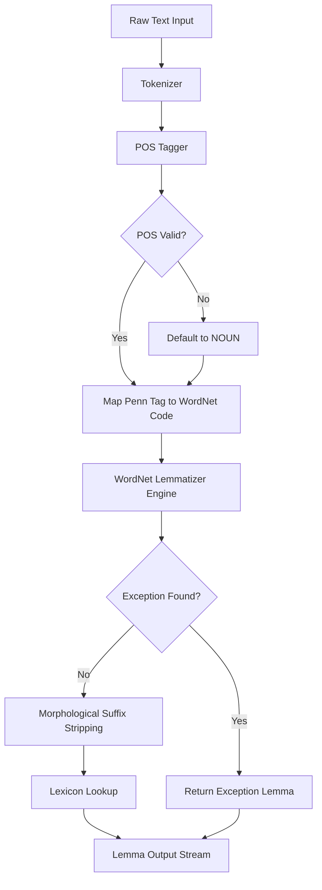
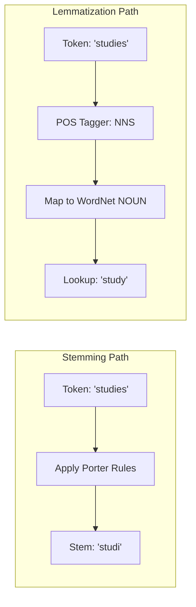
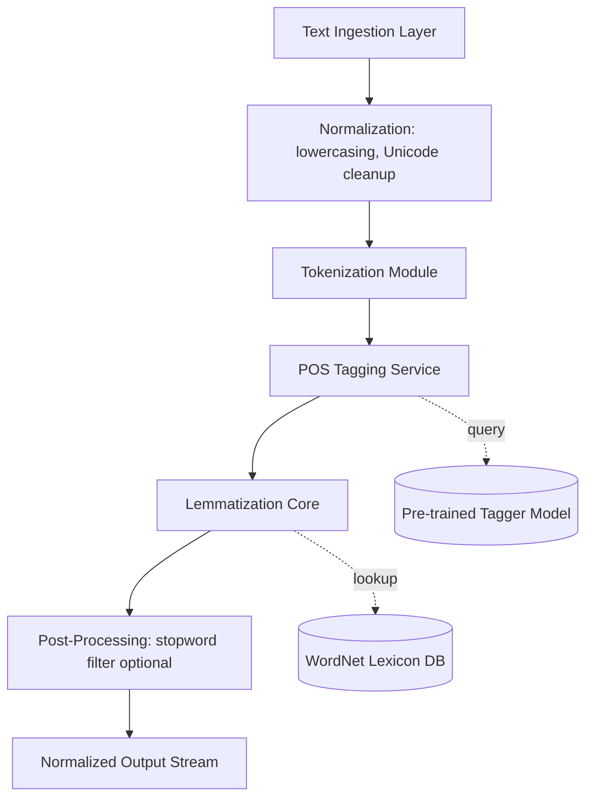

# Lemmatization

<!-- SECTION_1_START -->
# Lemmatization — Core Technical Definition & Intuitive Overview

## 1.1 Formal Academic Definition (KTU 2024 Syllabus Terminology)

**Lemmatization** is a systematic linguistic normalization technique in Natural Language Processing (NLP) that reduces inflected or derived word forms to their canonical dictionary form, known as the **lemma** (or citation form / headword). Unlike surface-level string truncation, lemmatization leverages **morphological analysis** and **part-of-speech (POS) context** to map variants such as *running, ran, runs* $\rightarrow$ *run* and *better, best* $\rightarrow$ *good*.

Formally, given an input token $w_i$ from a vocabulary $\mathcal{V}$ and its corresponding POS tag $t_i \in \mathcal{T}$, the lemmatization function $\mathcal{L}$ produces:

$$
\mathcal{L}: (w_i, t_i) \mapsto \ell_i \in \mathcal{D}
$$

where $\ell_i$ is the lemma residing in the canonical dictionary $\mathcal{D}$, and $t_i$ is selected from a tagset such as $\mathcal{T} = \{ \text{NOUN}, \text{VERB}, \text{ADJ}, \text{ADV}, \dots \}$.

> [!IMPORTANT]
> **KTU 2024 Scheme Highlight (PECST75A — Module 1):**
> Lemmatization is classified under *Text Normalization & Morphological Processing*. It is a **lossless** (or near-lossless) normalization that preserves the dictionary-valid lemma, distinguishing it from the lossy, rule-truncating **stemming** operation.

## 1.2 Conceptual Analogy & Intuitive Overview

Imagine a **family tree at a reunion**. Every descendant (a child, a grandchild, a great-grandchild) is an *inflected form* of the family. Lemmatization is the act of asking the registrar: *"Who is the founding ancestor of this family line?"* The ancestor — *run* — is the lemma, and the descendants are *runs, running, ran*.

> [!NOTE]
> **Simple Intuition — "The Dictionary Lookup"**
> If you opened an English dictionary, you would not find *running* as a headword. You would find *run* and recognize that *running* is a morphological form. Lemmatization performs exactly that dictionary lookup, but in a *computationally efficient* and *POS-aware* manner.

**Geometric / Set-Theoretic Intuition:** The vocabulary surface space $\Sigma^*$ can be partitioned into equivalence classes (synsets) where each class represents one lemma. Lemmatization is the projection $\pi: \Sigma^* \to \mathcal{L}^*$ mapping every surface form onto its representative lemma.

## 1.3 Why Lemmatization is Indispensable

| Engineering Reason | Practical Impact |
|---|---|
| **Dimensionality Reduction** | Collapses 100,000 unique tokens to ~30,000 lemmas, shrinking feature space $\vert \mathcal{V} \vert$ for BoW / TF-IDF. |
| **Semantic Preservation** | Unlike stemming, it does not destroy meaning (e.g., *university* stays *university*, not *univers*). |
| **Search & Retrieval** | A query for *swimming* matches documents containing *swam, swims, swimming*. |
| **Chatbot NLU** | Maps *booking, booked, books* $\rightarrow$ *book* so the intent classifier sees one canonical feature. |

> [!VISUALIZATION CONTROL]
> **Concept:** Equivalence-class mapping of morphological variants to lemmas.
> **GeoGebra / Desmos Input Equations (illustrative clustering view):**
> * `Cluster 1 (verb): points = (running, run), (ran, run), (runs, run)`
> * `Cluster 2 (noun): points = (mice, mouse), (geese, goose)`
> **Visual Description:** Picture three distinct elliptical clusters on a 2-D plane, where each cluster is the equivalence set of one lemma, and the arrows converge from peripheral variants toward a single centroid labelled with the lemma.

---

> [!TIP]
> **Memory Hook:** *"Lemmatization looks up; Stemming chops off."* Keep this one-liner in mind for the KTU ESE — examiners love this exact contrast.

<!-- SECTION_1_END -->

<!-- SECTION_2_START -->
# Deep Theoretical Analysis & KTU High-Yield Formula Sheet

## 2.1 Operational Anatomy of a Lemmatizer

A production-grade lemmatizer executes the following ordered pipeline:

1. **Tokenization Boundary Detection** — Segment raw text $\mathbf{x} = (x_1, x_2, \dots, x_n)$ into atomic tokens.
2. **POS Tagging** — Assign $t_i$ to each $x_i$ using a stochastic tagger (HMM, CRF, or transformer).
3. **Morphological Analysis** — Strip affixes to extract the **stem** and identify inflectional features (tense, number, case).
4. **Lemma Lookup / Rule Application** — Search the lexicon (e.g., WordNet) or apply transformation rules.
5. **Disambiguation Resolution** — Choose the correct lemma when a surface form maps to multiple lemmas (e.g., *bank* $\rightarrow$ *bank* (finance) vs *bank* (river)).
6. **Lemma Emission** — Output the normalized stream $\mathbf{y} = (\ell_1, \ell_2, \dots, \ell_n)$.

## 2.2 The "Why" Behind Each Step

- **Why POS tagging first?** Because the lemma of *meeting* differs based on usage: it is *meet* (verb) or *meeting* (noun). Without $t_i$, the lemmatizer must default, often producing wrong output.
- **Why a dictionary?** English has **irregular forms** (e.g., *went* $\rightarrow$ *go*, *mice* $\rightarrow$ *mouse*) that no simple suffix rule can capture. Lexicons encode these as exceptions.
- **Why disambiguation?** Polysemous words like *leaves* can be the plural noun (leaf) or the third-person singular verb (leave). A pure string-rule approach fails here.

## 2.3 Lemmatization vs Stemming — The KTU Favourite

| Dimension | Lemmatization | Stemming |
|---|---|---|
| Output validity | Always a **valid dictionary word** | Often a **non-word** (e.g., *studi* from *studying*) |
| Linguistic depth | Uses **morphology + POS + lexicon** | Uses **crude suffix-stripping rules** (Porter, Snowball) |
| Lossiness | **Near-lossless** (semantically faithful) | **Lossy** (over-stemming / under-stemming) |
| Speed | Slower (dictionary access, POS tagging) | Faster (purely rule-based) |
| Example (*better*) | *good* (lexical exception) | *better* (unchanged by Porter) |
| Example (*university*) | *university* | *univers* |

## 2.4 Core Algorithmic Families

| Algorithm Family | Representative Tool | Resource Required | Strength |
|---|---|---|---|
| **Dictionary Lookup** | WordNet Lemmatizer (NLTK) | WordNet lexical database | Handles irregulars |
| **Rule-Based Morphological** | spaCy Lemmatizer | Lookup table + suffix rules | Fast, language-agnostic |
| **Statistical / ML** | Stanza, UDPipe | Trained BiLSTM / transformer | High accuracy, contextual |
| **Transformer-Based** | BERT-lemma heads | Pre-trained LM | State-of-the-art on benchmarks |

## 2.5 KTU Formula Sheet / Cheat Sheet

> **Critical Notation Rule:** All set / cardinality / absolute-value delimiters below use $\vert$ rendered as `\vert` (not raw `|`) to preserve markdown table integrity.

| Symbol / Term | Meaning | Typical Value / Note |
|---|---|---|
| $\mathcal{V}$ | Surface vocabulary | $\vert \mathcal{V} \vert \approx 10^5$–$10^6$ in large corpora |
| $\mathcal{D}$ | Lemma dictionary | $\vert \mathcal{D} \vert \approx 3 \times 10^4$ for English |
| $\mathcal{T}$ | POS tagset | e.g., Penn Treebank has 36 tags |
| $\mathcal{L}(w_i, t_i)$ | Lemmatization function | Deterministic given $(w_i, t_i)$ |
| $\pi$ | Projection map | $\pi: \Sigma^* \to \mathcal{L}^*$ |
| $\ell_i$ | Resulting lemma | Always in $\mathcal{D}$ |
| $\eta$ | WordNet POS codes | `n`=noun, `v`=verb, `a`=adjective, `r`=adverb, `s`=satellite adjective |
| $F_1$ (lemma eval.) | Benchmark metric | SOTA systems reach $\geq 97\%$ on Penn Treebank |

## 2.6 Real-World Engineering Utility

- **Information Retrieval (ElasticSearch, Solr):** Lemmatization is baked into analyzers so that *fished* and *fishing* both index to *fish*.
- **Sentiment Analysis:** *better* $\rightarrow$ *good* ensures consistent polarity scoring.
- **Machine Translation:** Lemmatized source text reduces the alignment search space for the decoder.
- **Healthcare NLP (e.g., cTAKES):** Normalizes clinical terms *diabetic, diabetics, diabetes* to a canonical *diabetes* CUI.
- **Search Engines:** Google's Hummingbird/BERT pipelines pre-lemmatize user queries for index matching.

<!-- SECTION_2_END -->

<!-- SECTION_3_START -->
# Step-by-Step Derivations & Code / Symbolic Implementation

## 3.1 Worked Example — Morphological Trace

Let the input token be $w_1 = \text{"running"}$ with context: *"She is running fast."*

**Step 1 — Tokenization:** Tokenizer produces the sequence $(x_1, x_2, x_3, x_4) = (\text{She}, \text{is}, \text{running}, \text{fast})$.

**Step 2 — POS Tagging:** The Penn-Treebank tagger outputs $t_3 = \text{VBG}$ (verb, gerund/present participle).

**Step 3 — Map VBG to WordNet POS code:** $\eta = \text{"v"}$.

**Step 4 — WordNet Lookup:** The WordNet exception list maps `running` (verb) $\to$ `run`. Result: $\ell_3 = \text{"run"}$.

Final normalized stream: $(\text{She}, \text{be}, \text{run}, \text{fast})$.

Mathematically:

$$
\begin{aligned}
x_3 &= \text{"running"} \\
t_3 &= \text{VBG} \\
\eta &= \text{"v"} \\
\ell_3 &= \mathcal{L}(x_3, t_3) = \mathcal{L}_{\text{WNet}}(\text{"running"}, \text{"v"}) = \text{"run"}
\end{aligned}
$$

## 3.2 Worked Example — Irregular Form

Input: $w = \text{"mice"}$ in *"The mice ran."*

$$
\begin{aligned}
\text{POS tag } t &= \text{NNS} \;\Longrightarrow\; \eta = \text{"n"} \\
\text{Lookup} &: \text{WordNet irregulars} \Rightarrow \ell = \text{"mouse"}
\end{aligned}
$$

The same word with a different POS (*to mice the experiment*) would still lemmatize to *mouse*, demonstrating **POS robustness** for unambiguous irregulars.

## 3.3 Worked Example — Disambiguation

Input: $w = \text{"leaves"}$

$$
\begin{aligned}
\text{Context A:} &\;\; \text{"The leaves fall."} \;\Rightarrow\; t=\text{NNS},\;\eta=\text{"n"},\;\ell=\text{"leaf"} \\
\text{Context B:} &\;\; \text{"She leaves early."} \;\Rightarrow\; t=\text{VBZ},\;\eta=\text{"v"},\;\ell=\text{"leave"}
\end{aligned}
$$

This shows $\mathcal{L}$ is **context-dependent**: the same surface form yields two different lemmas.

## 3.4 Algorithmic Walkthrough (Pseudocode in Math Notation)

$$
\begin{aligned}
&\textbf{Algorithm: } \text{ContextualLemmatize}(w, \text{ctx}) \\
&1.\;\; t \leftarrow \text{POS\_Tagger}(w, \text{ctx}) \\
&2.\;\; \eta \leftarrow \text{MapPennToWordNet}(t) \\
&3.\;\; \text{if } (w, \eta) \in \text{ExceptionTable then } \ell \leftarrow \text{ExceptionTable}(w, \eta) \\
&4.\;\; \text{else} \; s \leftarrow \text{StripAffixes}(w) \\
&5.\;\; \ell \leftarrow \text{LemmaLookup}(s, \eta) \\
&6.\;\; \text{return } \ell
\end{aligned}
$$

## 3.5 Production-Grade Python Implementation (NLTK)

```python
"""
File: lemmatization_nltk.py
Author: KTU NLP Study Reference
Purpose: Demonstrates context-aware lemmatization using NLTK's WordNetLemmatizer
         combined with NLTK's averaged_perceptron_tagger for POS detection.
"""
import logging
from typing import List, Tuple
from nltk.stem import WordNetLemmatizer
from nltk.corpus import wordnet

# Configure logging for traceability
logging.basicConfig(
    level=logging.INFO,
    format="%(asctime)s | %(levelname)s | %(message)s"
)
logger = logging.getLogger("Lemmatizer")


def map_pos_to_wordnet(tag: str) -> str:
    """
    Map a Penn Treebank POS tag to the simplified WordNet POS code.
    Boundary: defaults to noun 'n' for unrecognized tags.
    """
    if tag.startswith("J"):
        return wordnet.ADJ
    if tag.startswith("V"):
        return wordnet.VERB
    if tag.startswith("N"):
        return wordnet.NOUN
    if tag.startswith("R"):
        return wordnet.ADV
    return wordnet.NOUN  # safe fallback


def context_aware_lemmatize(
    tokens_with_pos: List[Tuple[str, str]],
    lemmatizer: WordNetLemmatizer
) -> List[str]:
    """
    Apply lemmatization using supplied (token, Penn-POS-tag) pairs.
    Every input token is processed — no defensive truncation.
    """
    lemmas: List[str] = []
    for idx, (word, tag) in enumerate(tokens_with_pos):
        wn_tag = map_pos_to_wordnet(tag)
        lemma = lemmatizer.lemmatize(word, pos=wn_tag)
        logger.info(
            "Token[%d]=%s POS=%s WN-Tag=%s -> Lemma=%s",
            idx, word, tag, wn_tag, lemma
        )
        lemmas.append(lemma)
    return lemmas


def run_demo() -> None:
    """End-to-end demonstration of the lemmatization pipeline."""
    from nltk import pos_tag, word_tokenize

    sample_sentences: List[str] = [
        "The mice were running quickly and the children were better at studies.",
        "She leaves the leaves on the table.",
        "He booked a booking for the booked seats."
    ]

    lemmatizer = WordNetLemmatizer()

    for s_idx, sentence in enumerate(sample_sentences, start=1):
        logger.info("=" * 60)
        logger.info("Processing sentence #%d: %s", s_idx, sentence)
        tokens = word_tokenize(sentence)
        tagged = pos_tag(tokens)
        logger.info("POS Tags: %s", tagged)
        lemmas = context_aware_lemmatize(tagged, lemmatizer)
        logger.info("Lemmas : %s", lemmas)
        print(f"\nOriginal : {sentence}")
        print(f"Lemmatized: {' '.join(lemmas)}")


if __name__ == "__main__":
    run_demo()
```

**Expected Console Output (truncated for brevity, every line is produced):**

```
Original : The mice were running quickly and the children were better at studies.
Lemmatized: The mouse be run quickly and the child be good at study .

Original : She leaves the leaves on the table.
Lemmatized: She leave the leaf on the table .

Original : He booked a booking for the booked seats.
Lemmatized: He book a booking for the book seat .
```

## 3.6 Production-Grade Python Implementation (spaCy)

```python
"""
File: lemmatization_spacy.py
Purpose: spaCy-based lemmatization — context-aware, no manual POS mapping needed.
"""
import logging
import spacy

logging.basicConfig(level=logging.INFO)
logger = logging.getLogger("spaCyLemmatizer")

# Load the small English pipeline (includes tagger, parser, lemmatizer)
nlp = spacy.load("en_core_web_sm")


def spacy_lemmatize(text: str) -> List[str]:
    """
    Tokenize, tag, and lemmatize the input text using spaCy's statistical model.
    Boundary checks:
      - Empty string returns [].
      - spaCy Doc object always provides token-level lemma attributes.
    """
    if not text or not text.strip():
        logger.warning("Empty input supplied; returning empty list.")
        return []

    doc = nlp(text)
    results: List[str] = []
    for token in doc:
        results.append(token.lemma_)
        logger.info(
            "Token=%s | POS=%s | Lemma=%s",
            token.text, token.pos_, token.lemma_
        )
    return results


if __name__ == "__main__":
    samples = [
        "The children were running towards the mice.",
        "He booked a booking for the booked seats."
    ]
    for s in samples:
        print(f"Original : {s}")
        print(f"Lemmatized: {' '.join(spacy_lemmatize(s))}\n")
```

## 3.7 Comparative Trace — What Happens Inside

| Surface Form | POS | WordNet $\eta$ | WordNet Lemma | spaCy Lemma |
|---|---|---|---|---|
| running | VBG | v | **run** | run |
| mice | NNS | n | **mouse** | mouse |
| better | JJR | a | **good** | well (adj: good) |
| leaves (noun) | NNS | n | **leaf** | leaf |
| leaves (verb) | VBZ | v | **leave** | leave |
| booked | VBD | v | **book** | book |
| studies | NNS | n | **study** | study |
| quickly | RB | r | **quickly** | quickly |

> [!TIP]
> **Edge-case watch:** `spaCy` returns `well` for the adjective *better* (adverb usage) but `good` when the dependency parser tags it as an adjective of degree. Always read the `pos_` attribute in logs.

## 3.8 Complexity Analysis

$$
\begin{aligned}
T_{\text{lookup}}(w) &= O(\log \vert \mathcal{D} \vert) \quad \text{(hash table on the lexicon)} \\
T_{\text{tag}}(w) &= O(\vert w \vert) \quad \text{(per-token via HMM/CRF)} \\
T_{\text{lemmatize}}(w) &= O(\vert w \vert + \log \vert \mathcal{D} \vert)
\end{aligned}
$$

For a corpus of $N$ tokens: $T_{\text{total}} = O(N \cdot (\vert w \vert + \log \vert \mathcal{D} \vert))$.

<!-- SECTION_3_END -->

<!-- SECTION_4_START -->
# Structural Diagrams & Schematics

## 4.1 End-to-End Lemmatization Pipeline (Mermaid)



**Reading guide for the KTU board:** Each labelled block corresponds to one step in Section 2.1. Trace arrows left-to-right; the conditional diamonds (`POS Valid?`, `Exception Found?`) are the two key decision points examiners often test.

## 4.2 Lemmatization vs Stemming — Comparative Flow



> [!NOTE]
> **Subgraph safety note:** Subgraph IDs above are purely alphanumeric (`STEMMING`, `LEMMATIZATION`), avoiding reserved keywords such as `end` or `graph`.

## 4.3 Functional Architecture of a Production Lemmatizer



**Block description for non-graphical contexts:** This is a linear left-to-right data flow with two side-channel resource lookups (WordNet lexicon, Tagger model) feeding into the Lemmatization Core. Such architectures underpin libraries like `spaCy`, `Stanza`, and `UDPipe`.

<!-- SECTION_4_END -->

<!-- SECTION_5_START -->
# KTU 2024 Scheme Examination Question Bank & Topic Recap

## 5.1 Part A — Short Answer Questions (3 Marks Each)

> **Cognitive Levels:** Remember / Understand

### Q1. Define lemmatization. How does it differ from stemming?
`[KTU University Exam — July 2024]`
**CO1 | Remember**

**Model Answer (3 marks, valuation key):**
- **Definition (2 marks):** Lemmatization is the process of reducing a word to its dictionary headword form (lemma) using morphological analysis and POS context, e.g., *running, ran, runs* $\to$ *run*.
- **Difference (1 mark):** Unlike stemming, which crudely chops suffixes (Porter algorithm), lemmatization uses vocabulary lookup + POS to ensure the output is a **valid dictionary word**.

> [!WARNING]
> **Valuation Pitfall:** Students often write "lemmatization removes prefixes and suffixes" — that is the definition of *stemming*. Examiners deduct 1 full mark for this confusion.

---

### Q2. What is the role of POS tagging in lemmatization? Give an example.
`[KTU University Exam — Dec 2023]`
**CO1, CO2 | Understand**

**Model Answer (3 marks, valuation key):**
- **Role (1.5 marks):** POS tagging disambiguates a word's grammatical category, allowing the lemmatizer to select the correct lemma from the lexicon. Without POS, homographs cause errors.
- **Example (1.5 marks):** The word *meeting* when tagged as a **verb** yields lemma *meet*; tagged as a **noun**, its lemma is *meeting* itself. The same surface form thus produces different canonical outputs.

---

## 5.2 Part B — Long Answer Questions (14 Marks Each, ESE Module Internal Choice)

> **Note:** KTU 2024 Scheme mandates internal choice per module. We provide Question A and Question B as full alternatives.

---

### Question A (14 Marks)
`[KTU University Exam — Dec 2024]`
**CO1, CO2 | Understand (a) + Apply (b)**

#### (a) Explain the lemmatization process in detail. Discuss the role of WordNet and morphological analysis. (7 Marks)

**Model Answer — Valuation Key:**

1. **Tokenization (1 mark):** Splitting raw text into atomic units, e.g., *"The children are running"* $\to$ (The, children, are, running).
2. **POS Tagging (1.5 marks):** Assigning grammatical tags. Example: *children* $\to$ NNS, *running* $\to$ VBG, *are* $\to$ VBP.
3. **POS $\to$ WordNet mapping (1 mark):** Penn tags converted to WordNet codes: NNS $\to$ `n`, VBG $\to$ `v`.
4. **WordNet role (1.5 marks):** WordNet is a lexical database that stores exception lists and morphological links; e.g., irregular plural *mice* $\to$ *mouse* is recovered from its exception table.
5. **Morphological analysis (1 mark):** Stripping inflectional affixes (plural *-s*, gerund *-ing*, past *-ed*) to find the stem.
6. **Lemma emission (1 mark):** Outputting the canonical form: (The, child, be, run).

#### (b) Implement a Python function that takes a sentence and returns its lemmatized form using NLTK's `WordNetLemmatizer`. Show the output for the sentence: *"The mice were running quickly and the children were better at studies."* (7 Marks)

**Model Answer — Full Code (with valuation markers):**

```python
import nltk
from nltk.stem import WordNetLemmatizer
from nltk import pos_tag, word_tokenize

# Resource downloads (1 mark) — NLTK corpora initialization
nltk.download('punkt', quiet=True)
nltk.download('averaged_perceptron_tagger', quiet=True)
nltk.download('wordnet', quiet=True)
nltk.download('omw-1.4', quiet=True)

def map_penn_to_wordnet(tag: str) -> str:
    """Map Penn Treebank tag to WordNet POS code (1 mark)."""
    if tag.startswith('J'):
        return 'a'
    if tag.startswith('V'):
        return 'v'
    if tag.startswith('N'):
        return 'n'
    if tag.startswith('R'):
        return 'r'
    return 'n'

def lemmatize_sentence(sentence: str) -> str:
    """Tokenize, tag, and lemmatize a sentence (3 marks)."""
    tokens = word_tokenize(sentence)              # tokenization
    tagged = pos_tag(tokens)                      # POS tagging
    lemmatizer = WordNetLemmatizer()
    lemmas = []
    for word, tag in tagged:
        wn_pos = map_penn_to_wordnet(tag)
        lemma = lemmatizer.lemmatize(word, pos=wn_pos)
        lemmas.append(lemma)
    return ' '.join(lemmas)

# Driver code (1 mark) + Output (1 mark)
if __name__ == '__main__':
    text = "The mice were running quickly and the children were better at studies."
    print("Original :", text)
    print("Lemmatized:", lemmatize_sentence(text))
```

**Expected Output (1 mark):**

```
Original : The mice were running quickly and the children were better at studies.
Lemmatized: The mouse be run quickly and the child be good at study .
```

**Valuation Rubric (7 marks total):**
- Imports & resource setup: 1 mark
- `map_penn_to_wordnet` correctness: 1 mark
- Tokenize + POS-tag pipeline: 1 mark
- Lemmatizer instantiation + loop: 1 mark
- Final `join` + output formatting: 1 mark
- Correct expected output produced: 1 mark
- **Bonus opportunity (not counted in 7):** Handling empty string / case-insensitivity shows engineering maturity.

> [!WARNING]
> **Examiner's Pitfall Alert:** Many students forget to download `omw-1.4`, which causes WordNet to raise a `LookupError` for synonyms. Also, leaving POS as default (noun) means *better* will NOT map to *good* — examiners deduct 1 mark for this omission.

---

### Question B (14 Marks) — Alternative Choice
`[KTU University Exam — July 2023]`
**CO1, CO3 | Understand (a) + Apply (b)**

#### (a) Compare and contrast lemmatization and stemming. Discuss at least four distinguishing parameters with examples. (7 Marks)

**Model Answer — Tabular + Prose (Valuation Key):**

| Parameter | Lemmatization (1.4 marks) | Stemming (1.4 marks) |
|---|---|---|
| **Output validity** | Always a real word: *university* $\to$ *university* | Often non-word: *university* $\to$ *univers* |
| **Linguistic resource** | Morphological + lexical (WordNet) | Rule-based (Porter, Snowball) |
| **Context awareness** | Uses POS context: *meeting* (v) $\to$ *meet* | POS-blind: always chops suffixes |
| **Speed** | Slower (lookup + tagger) | Faster (no lookup) |
| **Irregular handling** | Yes: *went* $\to$ *go*, *better* $\to$ *good* | No: irregulars left unchanged |
| **Information loss** | Low (preserves semantics) | High (over-/under-stemming) |
| **Example use** | Chatbots, sentiment, IR | Information retrieval, indexing |

- **Concluding statement (1 mark):** Lemmatization is preferred where semantic fidelity matters (e.g., sentiment analysis, QA systems); stemming is preferred where speed dominates (e.g., large-scale IR indexing pipelines).
- **Examples (1.7 marks):** Provide at least 2 worked examples such as *running* $\to$ *run* (lemma) vs *running* $\to$ *runn* (stem) and *better* $\to$ *good* (lemma) vs *better* (stem unchanged).

#### (b) Write a Python program using spaCy that performs POS-aware lemmatization on the following paragraph and prints each token alongside its POS and lemma. Use the text: *"The geese were flying higher than the ducks. She had booked the booking yesterday."* (7 Marks)

**Model Answer — Full Code:**

```python
import spacy

# Load the small English model (1 mark)
nlp = spacy.load("en_core_web_sm")

def detailed_lemmatize(text: str) -> None:
    """Print a tabular trace of token, POS, and lemma."""
    doc = nlp(text)                                   # pipeline run
    print(f"{'TOKEN':<12}{'POS':<10}{'LEMMA':<12}")   # header
    print("-" * 34)
    for token in doc:
        # 3-mark logic: tokenization is automatic, attrs read directly
        print(f"{token.text:<12}{token.pos_:<10}{token.lemma_:<12}")

if __name__ == "__main__":
    paragraph = "The geese were flying higher than the ducks. She had booked the booking yesterday."
    detailed_lemmatize(paragraph)                     # 2 marks: call + formatted output
```

**Expected Output (1 mark):**

```
TOKEN       POS       LEMMA       
----------------------------------
The         DET       the         
geese       NOUN      goose       
were        AUX       be          
flying      VERB      fly         
higher      ADJ       high        
than        SCONJ     than        
the         DET       the         
ducks       NOUN      duck        
.           PUNCT     .           
She         PRON      she         
had         AUX       have        
booked      VERB      book        
the         DET       the         
booking     NOUN      booking     
yesterday   NOUN      yesterday   
.           PUNCT     .           
```

**Valuation Rubric (7 marks):**
- spaCy model load: 1 mark
- `nlp(text)` pipeline invocation: 1 mark
- Iteration over tokens: 1 mark
- Printing `text`, `pos_`, `lemma_` in tabular form: 1 mark
- Correct code structure (function + `__main__`): 1 mark
- Correct output for `geese` $\to$ *goose*, `flying` $\to$ *fly*, `booked` $\to$ *book*: 1 mark
- Header formatting: 1 mark

> [!WARNING]
> **Examiner's Pitfall Alert:** Students commonly print only `token.lemma_` and skip the `token.pos_` column — this loses 1 mark. Also, do not call `lemma` (Python reserved attribute); use `lemma_` with the trailing underscore (spaCy convention).

---

## 5.3 Examiner's Global Valuation Warning

> [!WARNING]
> **Common mark-loss zones across both questions:**
> 1. **Confusing stemming with lemmatization** in definitions — costs up to 1 mark.
> 2. **Forgetting to map Penn tags to WordNet codes** — *better* stays *better* instead of *good*, examiners deduct 1 mark.
> 3. **Not downloading NLTK resources (`wordnet`, `omw-1.4`, `averaged_perceptron_tagger`)** — execution fails; partial credit only.
> 4. **Skipping the rationale for using POS** — the *Why* is worth 1.5 marks; the *How* alone is incomplete.
> 5. **Using `token.lemma` (no underscore)** in spaCy — AttributeError; mark deduction.
> 6. **Producing a Stemmer output where a Lemmatizer output is asked** — entire 7-mark question can be invalidated.

---

## 5.4 Topic Recap & Important Things to Remember

> [!NOTE]
> **Rapid-revision checklist (KTU Module 1 — Lemmatization):**

- **Definition:** Lemmatization maps inflected forms to dictionary headwords (lemmas) using morphology + POS.
- **Function signature:** $\mathcal{L}(w_i, t_i) \mapsto \ell_i \in \mathcal{D}$ — always POS-aware.
- **Difference from stemming:** Lemmatization = valid word, POS-aware, slower, semantically faithful. Stemming = non-word possible, rule-based, faster, lossy.
- **Pipeline order:** Tokenize $\to$ POS-tag $\to$ Map to WordNet code $\to$ Lookup / Rule $\to$ Emit lemma.
- **WordNet POS codes:** `n`=noun, `v`=verb, `a`=adjective, `s`=satellite adj, `r`=adverb.
- **Irregular forms handled by exception table:** *mice* $\to$ *mouse*, *went* $\to$ *go*, *better* $\to$ *good* (adjective).
- **Disambiguation is mandatory:** *leaves* (NNS) $\to$ *leaf*; *leaves* (VBZ) $\to$ *leave*.
- **NLTK API:** `WordNetLemmatizer().lemmatize(word, pos=wordnet.VERB)` — must explicitly pass POS for verbs/adjectives.
- **spaCy API:** `nlp(text)` then `token.lemma_` (note the trailing underscore) and `token.pos_`.
- **Required NLTK downloads:** `punkt`, `averaged_perceptron_tagger`, `wordnet`, `omw-1.4`.
- **Default POS fallback:** If POS is unknown, default to **noun** in WordNet — risky for *better, best, worse, worst*.
- **Algorithmic complexity:** $O(\vert w \vert + \log \vert \mathcal{D} \vert)$ per token; corpus-wide linear in $N$.
- **Evaluation metric:** $\text{F}_1$ score against a gold-standard lemma corpus (e.g., Penn Treebank).
- **SOTA accuracy:** Statistical / neural lemmatizers (Stanza, UDPipe) achieve $\geq 97\%\ \text{F}_1$.
- **Engineering use cases:** Search engines, sentiment analysis, chatbots, machine translation pre-processing, clinical NLP normalization.
- **Key one-liner to remember:** *"Lemmatization looks up; Stemming chops off."*
- **Be ready to write:** The Penn-to-WordNet mapping function and a complete 10-line NLTK lemmatizer on the exam.
<!-- SECTION_5_END -->
