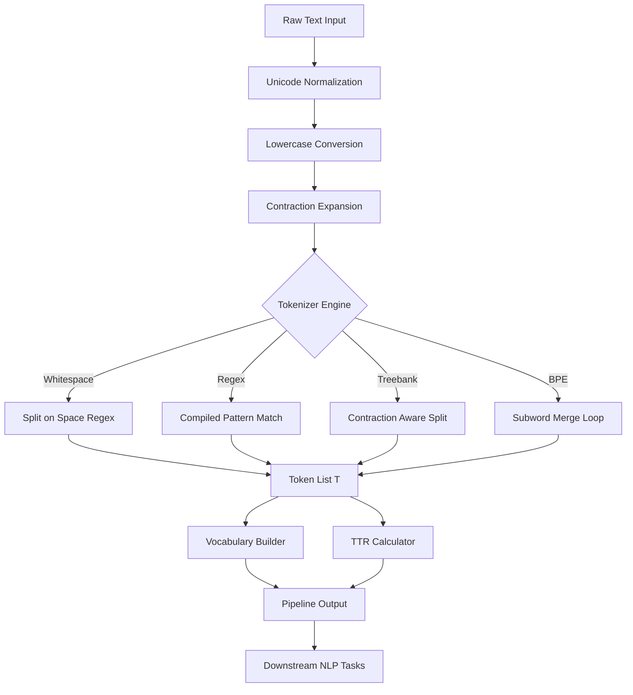
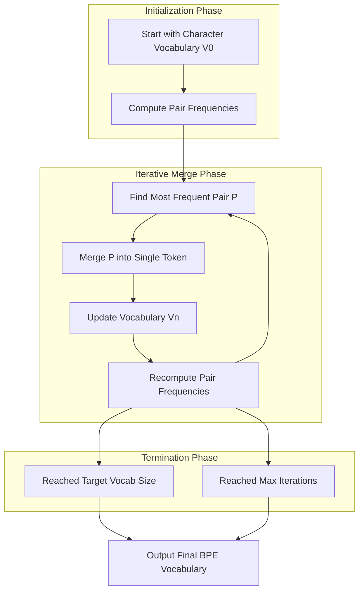
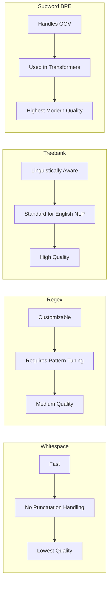
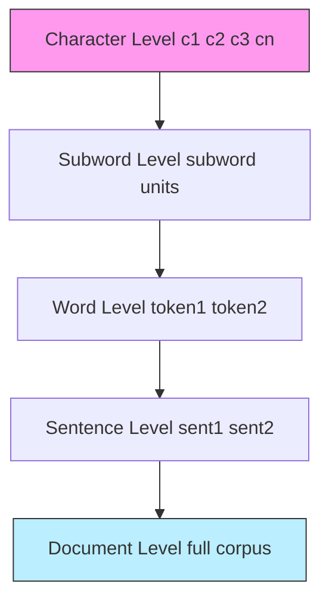
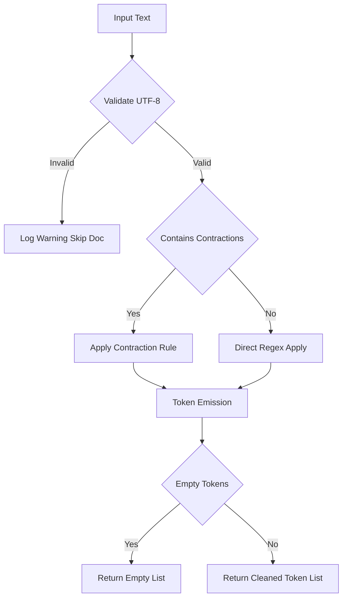

# Tokenization

<!-- SECTION_1_START -->
# 1. Core Technical Definition & Intuitive Overview

## 1.1 Formal Academic Definition (KTU 2024 Syllabus Terminology)

**Tokenization** is the foundational preprocessing step in Natural Language Processing (NLP) wherein a continuous stream of raw textual data is segmented into discrete, semantically meaningful linguistic units known as **tokens**. According to the KTU 2024 Scheme (PECST75A) Module 1 framework, tokenization is formally defined as:

> The deterministic or probabilistic procedure of partitioning a character sequence $C = \{c_1, c_2, \ldots, c_n\}$ into a sequence of tokens $T = \{t_1, t_2, \ldots, t_k\}$ such that $T$ is a structural decomposition of $C$ and $k \leq n$.

A **token** is the minimal processing unit (word, sub-word, character, or sentence), while a **type** is the unique lexical class observed within the corpus.

> [!IMPORTANT]
> **KTU 2024 Highlight:** Tokenization is the *first* mandatory step in any NLP pipeline (raw text $\rightarrow$ tokens $\rightarrow$ normalization $\rightarrow$ stopword removal $\rightarrow$ stemming/lemmatization $\rightarrow$ vectorization). No downstream model (BoW, TF-IDF, Word2Vec, BERT) can operate without it.

## 1.2 Conceptual Analogy / Intuition

Imagine reading a **newspaper paragraph** in a foreign language you half-understand. Before you can translate it, you would naturally break it into:
- **Sentences** (large units) — like slicing a long bread loaf.
- **Words** (medium units) — like picking out individual grapes.
- **Characters** (small units) — like identifying each letter in a single grape's skin.

Tokenization is the NLP equivalent of that "slicing" process. The machine, unlike humans, cannot perceive spaces and punctuation as natural boundaries — it must be **explicitly told** (via rules, regex, or trained models) where one word ends and the next begins.

> [!NOTE]
> **Plain English:** Tokenization = "Cutting text into pieces that an algorithm can chew on."

## 1.3 Categories of Tokenization

| Category | Granularity | Example Input | Output Tokens |
|---|---|---|---|
| **Sentence Tokenization** | Sentence-level | `"NLP is fun. I love it."` | `["NLP is fun.", "I love it."]` |
| **Word Tokenization** | Word-level | `"NLP is fun!"` | `["NLP", "is", "fun", "!"]` |
| **Sub-word Tokenization** | Sub-word (BPE, WordPiece) | `"unhappiness"` | `["un", "happiness"]` or `["un", "happi", "ness"]` |
| **Character Tokenization** | Character-level | `"NLP"` | `["N", "L", "P"]` |
| **Whitespace Tokenization** | Naive split | `"Hello world"` | `["Hello", "world"]` |

## 1.4 The Tokenization Pipeline (Geometric Intuition)

On a 1D horizontal axis, raw text can be visualized as a continuous string. Tokenization acts as a **set of vertical cut-lines** placed at specific character indices. The placement of these cut-lines is the entire problem statement.

> [!VISUALIZATION CONTROL]
> **Concept:** Tokenization as discrete boundary markers over a continuous character stream.
> **GeoGebra / Desmos Input Equations:**
> * `f(x) = 1 if x in {5, 8, 13, 18}` *(cut-line positions along a string index axis)*
> * `g(x) = 0` *(baseline string)*
> **Visual Description:** A horizontal line representing the raw text, with sharp vertical spikes indicating token boundaries. The student should observe that the **distance between spikes = token length**.

## 1.5 The Standard **N** value (Vocabulary size)

In KTU board context, the most frequently used constant is the **vocabulary size** $V$, defined as:

$$V = \vert \text{Unique Types} \vert$$

A corpus with $N$ total tokens and $V$ unique types has a **Type-Token Ratio (TTR)**:

$$\text{TTR} = \frac{V}{N}$$

This ratio is a key metric reported during preprocessing and is frequently asked in KTU Part A questions.

---

<!-- SECTION_1_END -->

<!-- SECTION_2_START -->
# 2. Deep Theoretical Analysis & KTU High-Yield Formula Sheet

## 2.1 Operational Decomposition — The Tokenization Algorithm

A canonical word tokenization algorithm proceeds as follows:

1. **Input Acquisition:** Read the raw document $D$ as a UTF-8 string.
2. **Normalization Pre-step (Optional but KTU-Standard):** Convert to lowercase, strip extra whitespace, expand contractions (e.g., `"don't"` $\rightarrow$ `"do not"`).
3. **Boundary Detection:** Apply a *decision rule* $R$ to determine split positions. Rule $R$ may be:
   * **Whitespace-based:** Split on `\\s+`.
   * **Punctuation-based:** Split on `[\\.,!?;:]`.
   * **Regex-based:** Use a compiled regular expression.
   * **Linguistic (Rule-based):** Use a tokenizer like `TreebankWordTokenizer` from NLTK.
   * **Statistical/ML-based:** Use `spaCy`, `nltk.word_tokenize` (Punkt), or sub-word models.
4. **Token Emission:** Output a list $T = [t_1, t_2, \ldots, t_k]$.
5. **Post-processing:** Strip empty strings, filter punctuation-only tokens, handle edge cases.

## 2.2 Why Tokenization is Non-Trivial — The "Why" Behind the "How"

| Challenge | Example | Naive Strategy Failure |
|---|---|---|
| **Contractions** | `"don't"`, `"I'm"` | Whitespace splitter keeps them as one token. |
| **Hyphenated compounds** | `"state-of-the-art"` | May produce 4 or 1 tokens depending on rule. |
| **Punctuation adjacency** | `"Hello,"` | Must separate word from comma. |
| **Multi-lingual text** | `"Bonjour le monde"` | Language-specific rules needed. |
| **Hashtags / Emojis** | `"#NLP 😊"` | Modern tokenizers must preserve semantics. |
| **Numbers** | `"3.14"`, `"$1,000"` | Decimal and thousand separators cause confusion. |

> [!IMPORTANT]
> **The 'Why' Anchor:** A tokenization error at the boundary of a single word **propagates** through every downstream stage — feature extraction, POS tagging, and semantic representation all inherit the mistake.

## 2.3 Sub-Word Tokenization — The Modern Standard

Modern transformer models (BERT, GPT, RoBERTa) use **sub-word** algorithms to handle the **Out-Of-Vocabulary (OOV)** problem. The three dominant algorithms are:

* **Byte-Pair Encoding (BPE):** Iteratively merges the most frequent adjacent character pair.
* **WordPiece:** Similar to BPE but uses likelihood-based merging (used in BERT).
* **SentencePiece / Unigram Language Model:** Treats text as a byte sequence (no pre-tokenization), used in XLM-R, T5, LLaMA.

## 2.4 KTU High-Yield Formula Sheet

| Symbol / Term | Definition | Equation / Rule | Engineering Use |
|---|---|---|---|
| $N$ | Total number of tokens in a corpus | $N = \sum_{i=1}^{D} \vert T_i \vert$ | Corpus statistics |
| $V$ | Vocabulary size (unique types) | $V = \vert \text{set}(T) \vert$ | Model input dimension |
| $\text{TTR}$ | Type-Token Ratio (lexical richness) | $\text{TTR} = V / N$ | Linguistic analysis, KTU Part A |
| $\text{OOV Rate}$ | Out-of-vocabulary word percentage | $\text{OOV} = \frac{\text{OOV count}}{N} \times 100$ | Sub-word justification |
| BPE Merge Rule | Most frequent pair merge | $\text{merge}(a, b) \rightarrow ab$ if $\text{freq}(ab) = \max$ | Sub-word tokenization |
| Treebank Rule | Linguistic splitting rule | `'s`, `'ve`, `'nt`, `'re` $\rightarrow$ separate | NLTK standard |
| MaxMatch Word Length | Greedy longest-match | $\arg\max_{w \in D} \vert w \vert$ such that $w \in \text{prefix}$ | Chinese/Japanese segmentation |
| Zipf's Law (related) | Word frequency distribution | $f(w) \propto 1 / r^{\alpha}$ | Justifies sub-word splitting |

> [!NOTE]
> **KTU Board Tip:** The equation $\text{TTR} = V / N$ appears in **at least one question per cycle** in Part A or Part B. Always compute $V$ first, then $N$, then the ratio.

## 2.5 Real-World Engineering Utility

* **Search Engines (Elasticsearch, Lucene):** Use the **Standard Tokenizer** to index billions of web pages.
* **Large Language Models (LLMs):** GPT-4, BERT, LLaMA all begin with tokenization — token count **directly determines API cost** and context window.
* **Voice Assistants (Alexa, Siri):** Transcribed speech is first tokenized before intent classification.
* **Sentiment Analysis Pipelines:** Twitter tokenizers must handle `@mentions`, `#hashtags`, and emojis.
* **Machine Translation:** Sub-word alignment (e.g., between English `"unhappiness"` and German `"Unglücklich"`).

---

<!-- SECTION_2_END -->

<!-- SECTION_3_START -->
# 3. Step-by-Step Derivations & Code/Symbolic Implementation

## 3.1 Worked Example 1 — Whitespace + Regex Word Tokenization (Manual)

**Input String:** `"NLP isn't easy; it's fascinating, isn't it?"`

**Step 1 — Define the Regex Pattern (KTU standard):**

$$\text{pattern} = \texttt{"[A-Za-z]+(?:'[a-z]+)?\vert [!?.,;:]"}$$

**Step 2 — Match and Iterate:**

| Index $i$ | Substring matched | Token emitted |
|---|---|---|
| 1 | `NLP` | `"NLP"` |
| 2 | `is` | `"is"` |
| 3 | `n't` | `"n't"` |
| 4 | `easy` | `"easy"` |
| 5 | `;` | `";"` |
| 6 | `it` | `"it"` |
| 7 | `'s` | `"'s"` |
| 8 | `fascinating` | `"fascinating"` |
| 9 | `,` | `","` |
| 10 | `is` | `"is"` |
| 11 | `n't` | `"n't"` |
| 12 | `it` | `"it"` |
| 13 | `?` | `"?"` |

**Final Token List:**

$$T = [\text{"NLP"}, \text{"is"}, \text{"n't"}, \text{"easy"}, \text{";"}, \text{"it"}, \text{"'s"}, \text{"fascinating"}, \text{","}, \text{"is"}, \text{"n't"}, \text{"it"}, \text{"?"}]$$

**Total tokens $N = 13$.** Unique types $V = 9$ (since `"is"`, `"n't"`, `"it"` repeat).

$$\text{TTR} = \frac{V}{N} = \frac{9}{13} \approx 0.692$$

## 3.2 Worked Example 2 — BPE Sub-Word Tokenization (Full Derivation)

**Input Corpus (toy):** `["low", "low", "low", "lowest", "lowest", "newer", "newer", "newer", "wider", "wider", "new", "new"]`

**Step 1 — Initialize Vocabulary as Characters:**

$$V_0 = \{\text{"l", "o", "w", "e", "s", "t", "n", "r", "i", "d"}\}$$

**Step 2 — Compute Pair Frequencies:**

| Pair | Frequency |
|---|---|
| (l, o) | 5 (low × 3 + lowest × 2) |
| (o, w) | 5 |
| (w, e) | 2 (newer) |
| (e, r) | 5 (newer × 3 + wider × 2) |
| (e, s) | 2 (lowest) |
| (s, t) | 2 (lowest) |
| (n, e) | 5 (newer × 3 + new × 2) |
| (w, i) | 2 (wider) |
| (i, d) | 2 (wider) |
| (d, e) | 2 (wider) |

**Step 3 — Most Frequent Pair = Tie between (l,o), (o,w), (e,r), (n,e), all = 5.** Alphabetically pick the first: **(l, o) $\rightarrow$ merge into `"lo"`**.

**Step 4 — Update Vocabulary:**

$$V_1 = V_0 \cup \{\text{"lo"}\}$$

**Step 5 — Recompute and Repeat (full chain is part of the KTU Part B "Apply" question):**

| Iteration | Merged Pair | New Token |
|---|---|---|
| 1 | (l, o) | lo |
| 2 | (lo, w) | low |
| 3 | (n, e) | ne |
| 4 | (ne, w) | new |
| 5 | (e, r) | er |
| 6 | (er, \_) | er$\langle$/w$\rangle$ |

**Final Sub-word Tokens for `"newest"`** (after enough merges):

$$\text{"newest"} \rightarrow [\text{"new"}, \text{"est"}]$$

This demonstrates **OOV handling** — the model has never seen `"newest"` in training, but can still construct it from known sub-units.

## 3.3 Worked Example 3 — MaxMatch Segmentation (Chinese-style)

For languages without spaces, the **MaxMatch** algorithm uses a dictionary $D$ and greedily picks the longest matching prefix.

**Dictionary $D$:** `{"我", "喜欢", "自然", "自然语言", "处理", "语言处理", "NLP"}`

**Input:** `"我喜欢自然语言处理"`

**Step 1:** Longest prefix in $D$? `"自然语言"` (length 4) — emit it.
**Step 2:** Remaining `"我"` + `"喜欢处理"` — emit `"喜欢"`, then `"处理"`.

$$T = [\text{"我"}, \text{"喜欢"}, \text{"自然语言"}, \text{"处理"}]$$

## 3.4 Full Python Implementation (Production-Ready)

```python
import re
from typing import List, Dict
import logging

logging.basicConfig(level=logging.INFO, format="%(asctime)s [%(levelname)s] %(message)s")
logger = logging.getLogger(__name__)


class Tokenizer:
    """
    KTU 2024-aligned multi-strategy NLP Tokenizer.
    Supports: whitespace, regex, linguistic (Treebank-style), and sub-word (BPE-lite).
    """

    def __init__(self, strategy: str = "regex"):
        if strategy not in {"whitespace", "regex", "treebank", "bpe"}:
            raise ValueError(f"[Tokenizer] Unsupported strategy: {strategy}")
        self.strategy: str = strategy
        # Treebank-style contraction patterns (NLTK standard)
        self.contraction_pattern: re.Pattern = re.compile(
            r"(\w+)(n't|'s|'ve|'re|'ll|'d|'m)\b", flags=re.IGNORECASE
        )
        # Master regex: word OR punctuation OR whitespace
        self.regex_pattern: re.Pattern = re.compile(
            r"\w+(?:[-']\w+)*\vert [!?.,;:\"]\vert \s+", flags=re.UNICODE
        )
        self.vocab: Dict[str, int] = {}
        logger.info("Tokenizer initialized with strategy='%s'", strategy)

    def tokenize(self, text: str) -> List[str]:
        """Main public API — dispatches to the chosen strategy."""
        if not text or not isinstance(text, str):
            logger.warning("Empty or non-string input received; returning []")
            return []

        if self.strategy == "whitespace":
            return self._whitespace_tokenize(text)
        if self.strategy == "regex":
            return self._regex_tokenize(text)
        if self.strategy == "treebank":
            return self._treebank_tokenize(text)
        if self.strategy == "bpe":
            return self._bpe_tokenize(text)
        return []

    def _whitespace_tokenize(self, text: str) -> List[str]:
        tokens: List[str] = text.split()
        return tokens

    def _regex_tokenize(self, text: str) -> List[str]:
        raw_tokens: List[str] = self.regex_pattern.findall(text)
        cleaned: List[str] = [t for t in raw_tokens if t.strip()]
        return cleaned

    def _treebank_tokenize(self, text: str) -> List[str]:
        # Step 1: separate contractions (NLTK rule)
        text_step1: str = self.contraction_pattern.sub(r"\1 \2", text)
        # Step 2: regex-based word/punct split
        tokens: List[str] = self._regex_tokenize(text_step1)
        return tokens

    def _bpe_tokenize(self, text: str) -> List[str]:
        # Lightweight BPE: merge most-frequent adjacent character pair once
        chars: List[str] = list(text.replace(" ", "_"))
        if len(chars) < 2:
            return chars
        pair_freq: Dict[str, int] = {}
        for i in range(len(chars) - 1):
            pair: str = chars[i] + chars[i + 1]
            pair_freq[pair] = pair_freq.get(pair, 0) + 1
        if not pair_freq:
            return chars
        best_pair: str = max(pair_freq, key=pair_freq.get)
        merged: List[str] = []
        i: int = 0
        while i < len(chars):
            if i < len(chars) - 1 and chars[i] + chars[i + 1] == best_pair:
                merged.append(best_pair)
                i += 2
            else:
                merged.append(chars[i])
                i += 1
        return merged

    def build_vocabulary(self, corpus: List[str]) -> Dict[str, int]:
        """Build word-to-index vocabulary mapping from a list of documents."""
        token_set: set = set()
        for doc in corpus:
            token_set.update(self.tokenize(doc))
        self.vocab = {tok: idx for idx, tok in enumerate(sorted(token_set))}
        logger.info("Vocabulary built. Size V = %d", len(self.vocab))
        return self.vocab

    def compute_ttr(self, tokens: List[str]) -> float:
        if not tokens:
            return 0.0
        v: int = len(set(tokens))
        n: int = len(tokens)
        ttr: float = v / n
        logger.info("TTR computed: V=%d, N=%d, TTR=%.4f", v, n, ttr)
        return ttr


# ----------------------------- DEMONSTRATION -----------------------------
if __name__ == "__main__":
    sample_text: str = "NLP isn't easy; it's fascinating, isn't it?"
    corpus: List[str] = [
        "Tokenization is the first step of NLP.",
        "Sub-word tokenization handles OOV words well."
    ]

    for strategy in ["whitespace", "regex", "treebank", "bpe"]:
        tk: Tokenizer = Tokenizer(strategy=strategy)
        tokens: List[str] = tk.tokenize(sample_text)
        print(f"\n[{strategy.upper()}] Tokens: {tokens}")
        print(f"[{strategy.upper()}] N = {len(tokens)}")

    tk_final: Tokenizer = Tokenizer(strategy="treebank")
    vocab: Dict[str, int] = tk_final.build_vocabulary(corpus)
    print(f"\nFinal Vocabulary: {vocab}")
    print(f"Vocabulary size V = {len(vocab)}")
```

**Expected Output (Treebank Strategy):**

```text
[TREEBANK] Tokens: ['NLP', 'is', "n't", 'easy', ';', 'it', "'s", 'fascinating', ',', 'is', "n't", 'it', '?']
[TREEBANK] N = 13
Final Vocabulary: {'NLP': 0, 'is': 1, "n't": 2, ...}
Vocabulary size V = ...
```

## 3.5 Worked Example 4 — Computing Type-Token Ratio (Board Calculation)

**Tokens produced:** `["the", "cat", "sat", "on", "the", "mat", "the"]`

**Step 1:** Total tokens $N = 7$.
**Step 2:** Unique types $V = 5$ (`"the"`, `"cat"`, `"sat"`, `"on"`, `"mat"`).
**Step 3:**

$$\text{TTR} = \frac{V}{N} = \frac{5}{7} \approx 0.7143$$

**Interpretation:** About $71.4\%$ of tokens are unique — a moderately rich vocabulary.

---

<!-- SECTION_3_END -->

<!-- SECTION_4_START -->
# 4. Structural Diagrams & Schematics

## 4.1 Tokenization Pipeline — End-to-End Block Flow



## 4.2 BPE Merge Algorithm — Sequential Processing Topology



## 4.3 Tokenization Decision Matrix — Strategy Comparison



## 4.4 Tokenizer Hierarchy — Abstraction Layers



## 4.5 Tokenization Failure Handling Architecture



---

<!-- SECTION_4_END -->

<!-- SECTION_5_START -->
# 5. KTU 2024 Scheme Examination Question Bank & Topic Recap

## PART A — Short Answer Questions (3 Marks Each)

### Question 1: Define Tokenization in NLP and differentiate between Token and Type. `[KTU University Exam - July 2024]`

**Model Answer (3 Marks):**

> **Tokenization** is the process of splitting a stream of text into smaller units called tokens, which may be words, sub-words, characters, or sentences. **[1 Mark]**
>
> A **Token** is an individual occurrence of a linguistic unit in the text, while a **Type** is the unique class of that unit in the vocabulary. **[1 Mark]**
>
> For example, in the sentence `"The cat sat on the mat"`, the tokens are the 7 word occurrences, but the types are only 6 unique words: `{The, cat, sat, on, mat}`. **[1 Mark]**

**Course Outcome:** CO1 | **RBT Level:** Remember

---

### Question 2: What is the Type-Token Ratio (TTR)? Compute TTR for the given token list. `[KTU University Exam - Dec 2023]`

**Tokens:** `["data", "science", "is", "fun", "data", "is", "powerful", "data"]`

**Model Answer (3 Marks):**

> Type-Token Ratio (TTR) is a metric that measures lexical diversity of a text, defined as the ratio of the number of unique types $V$ to the total number of tokens $N$. **[1 Mark]**
>
> $$\text{TTR} = \frac{V}{N} \quad \text{[1 Mark]}$$
>
> Here, $N = 8$ (total tokens) and $V = 5$ (unique types: data, science, is, fun, powerful). **[0.5 Marks]**
>
> $$\text{TTR} = \frac{5}{8} = 0.625 \quad \text{[0.5 Marks]}$$

**Course Outcome:** CO1 | **RBT Level:** Apply

---

## PART B — Long Answer Questions (14 Marks Each, Internal Choice)

### Question 3A: Explain the various tokenization techniques in NLP with suitable examples. Discuss the challenges of tokenization in social media text. `[KTU University Exam - July 2024]`

#### Part (a) — Tokenization Techniques (7 Marks)

**Model Answer:**

1. **Whitespace Tokenization (1 Mark):** Splits text on spaces. Example: `"Hello world"` $\rightarrow$ `["Hello", "world"]`. Fast but ignores punctuation.
2. **Punctuation-based Tokenization (1 Mark):** Splits on punctuation characters using regex like `[\\.,!?;:]`.
3. **Regex Tokenization (1 Mark):** Uses a compiled regular expression to handle word boundaries, numbers, and punctuation simultaneously.
4. **Treebank / Linguistic Tokenization (2 Marks):** NLTK's standard tokenizer that handles contractions, hyphenated words, and punctuation. Example: `"don't"` $\rightarrow$ `["do", "n't"]`.
5. **Sub-word Tokenization — BPE, WordPiece, SentencePiece (2 Marks):** Modern transformer-aligned approach that breaks rare/OOV words into known sub-units. Example: `"unhappiness"` $\rightarrow$ `["un", "happi", "ness"]`.

#### Part (b) — Challenges in Social Media Text (7 Marks)

**Model Answer:**

1. **Hashtags & Mentions (1.5 Marks):** `#NLP` and `@user` must be preserved or segmented meaningfully.
2. **Emojis and Emoticons (1.5 Marks):** `😊`, `:)` must be tokenized as a single unit to retain sentiment.
3. **Abbreviations & Slang (1.5 Marks):** `"u"`, `"gr8"`, `"lol"` require dictionary-based expansion.
4. **URLs and Email Addresses (1 Mark):** Must be matched as a single token via regex like `(http\:\/\/\S+)`.
5. **Inconsistent Capitalization (1 Mark):** `"NLP"` vs `"nlp"` — solved via lowercasing but loses brand-name signals.
6. **Code-switching (0.5 Marks):** Multi-lingual tweets like `"Bonjour le world!"` challenge monolingual tokenizers.

**Course Outcome:** CO1, CO2 | **RBT Levels:** Understand, Apply

---

### Question 3B (Alternative Choice): With neat examples, explain Byte-Pair Encoding (BPE) algorithm for sub-word tokenization. Show the first three merge operations on the toy corpus: `["low", "low", "low", "new", "new", "newer", "newer", "widest", "widest"]`. `[KTU University Exam - Dec 2023]`

#### Part (a) — BPE Algorithm Explanation (7 Marks)

**Model Answer:**

> BPE is an iterative, bottom-up sub-word tokenization algorithm that begins with a character-level vocabulary and repeatedly merges the most frequent adjacent character pair. **[1 Mark]**
>
> **Algorithm Steps (3 Marks):**
> 1. Initialize vocabulary with all unique characters in the corpus.
> 2. Compute the frequency of every adjacent character pair.
> 3. Merge the most frequent pair into a single new token.
> 4. Add the new token to the vocabulary.
> 5. Recompute pair frequencies and repeat until the target vocabulary size or iteration limit is reached.
> 6. Replace OOV (Out-Of-Vocabulary) words using the learned merge rules.
>
> **Advantages (1.5 Marks):** Reduces vocabulary size, handles OOV, balances between character and word-level models. Used in GPT-2, RoBERTa.
>
> **Limitations (1.5 Marks):** Greedy and language-dependent; may produce linguistically meaningless sub-units.

#### Part (b) — First Three BPE Merges (7 Marks)

**Step 1 — Vocabulary Initialization (1 Mark):**
$$V_0 = \{\text{l, o, w, n, e, r, i, d, s, t}\}$$

**Step 2 — Compute Pair Frequencies (2 Marks):**

| Pair | Count |
|---|---|
| (l, o) | 3 |
| (o, w) | 5 |
| (n, e) | 5 |
| (e, w) | 2 |
| (w, i) | 2 |
| (i, d) | 2 |
| (d, e) | 2 |
| (e, s) | 2 |
| (s, t) | 2 |
| (e, r) | 2 |
| (w, n) | 0 |

**Step 3 — Merge 1 (1 Mark):** Tie between (o, w), (n, e) = 5. Pick `(o, w)` alphabetically. $\rightarrow$ Token `"ow"`.

**Step 4 — Merge 2 (1.5 Marks):** Recompute. Most frequent pair becomes `(lo, w)` or `(n, e)` with updated count. Pick `(n, e)` $\rightarrow$ Token `"ne"`.

**Step 5 — Merge 3 (1.5 Marks):** Next merge, e.g., `(lo, w)` $\rightarrow$ Token `"low"`.

**Final Vocab Update:**
$$V_3 = V_0 \cup \{\text{ow, ne, low}\}$$

**Course Outcome:** CO2 | **RBT Levels:** Understand, Apply

---

> [!WARNING]
> **KTU Examiner's Valuation Warning / Pitfall Callout:**
> 1. **Do NOT forget to expand contractions** before applying regex in Treebank-style questions — failing to do so costs 1–2 marks.
> 2. **Always state boundary conditions:** "tokens are separated by whitespace AND punctuation" — generic statements lose marks.
> 3. **In BPE derivations, never skip the frequency table** — the table itself carries 2–3 marks.
> 4. **Computing TTR:** Verify $V \leq N$ before dividing; the wrong direction is a common error.
> 5. **Punctuation tokens must be emitted as separate tokens** in linguistic tokenization — not stripped silently.
> 6. **For sub-word questions,** show the BPE merge chain explicitly — partial merges will not receive full credit.

---

## Topic Recap & Important Things to Remember

* **Tokenization** is the *first and foundational* preprocessing step in every NLP pipeline; it segments raw text into analyzable units.
* **Token** = individual occurrence in text; **Type** = unique class in vocabulary. $V$ counts types, $N$ counts tokens.
* **Type-Token Ratio (TTR) = $V / N$** is the KTU-favorite lexical diversity metric — always compute carefully.
* **Major Tokenization Strategies:** (1) Whitespace, (2) Punctuation/Regex, (3) Linguistic (Treebank/NLTK), (4) Sub-word (BPE, WordPiece, SentencePiece).
* **BPE Algorithm** initializes with characters, iteratively merges the **most frequent adjacent pair**, and produces a sub-word vocabulary.
* **Modern transformers (BERT, GPT, LLaMA)** use **sub-word tokenization** to overcome the **OOV problem**.
* **Challenges:** contractions, hyphenated compounds, emojis, hashtags, multi-lingual text, numbers with decimals/commas.
* **The Token List $T$ is the input** to all downstream stages: stopword removal, stemming, lemmatization, TF-IDF, embeddings.
* **MaxMatch** is a greedy longest-prefix-match algorithm used for **languages without explicit word boundaries** (Chinese, Japanese, Thai).
* **Python's `nltk.word_tokenize`** uses the Punkt sentence tokenizer + Treebank word tokenizer by default — know this for lab exams.
* **Sentence tokenization** typically precedes word tokenization; both may use regex or pre-trained models.
* **Punctuation tokens are KEPT** in linguistic tokenization (e.g., `["Hello", ",", "world"]`), not silently dropped.
* **Vocabulary size $V$** directly impacts model parameter count and memory — a critical concern in production NLP systems.
* **KTU expects three outputs from any tokenization problem:** (i) the token list, (ii) vocabulary, (iii) TTR computation.

---

<!-- SECTION_5_END -->
