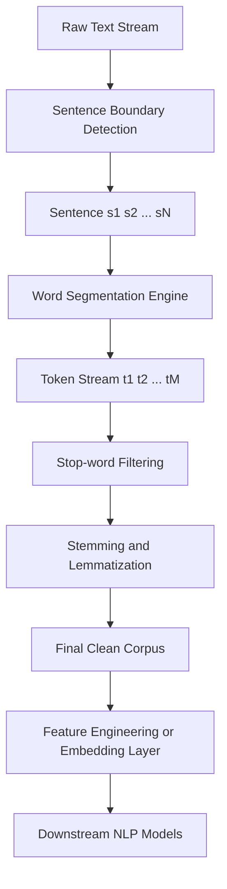
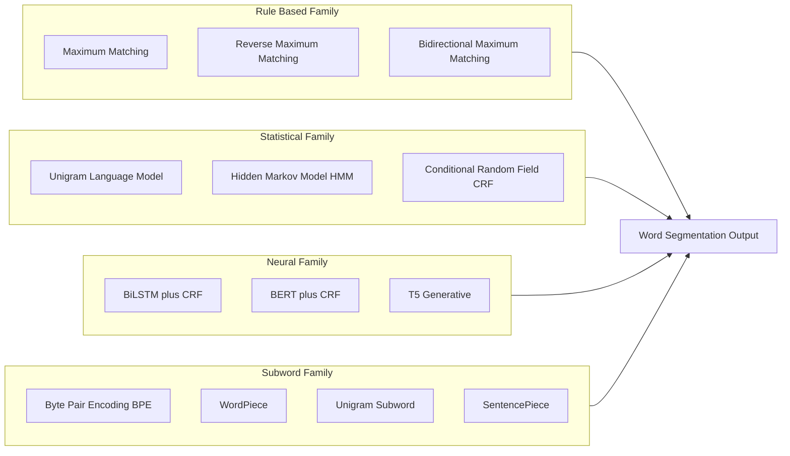
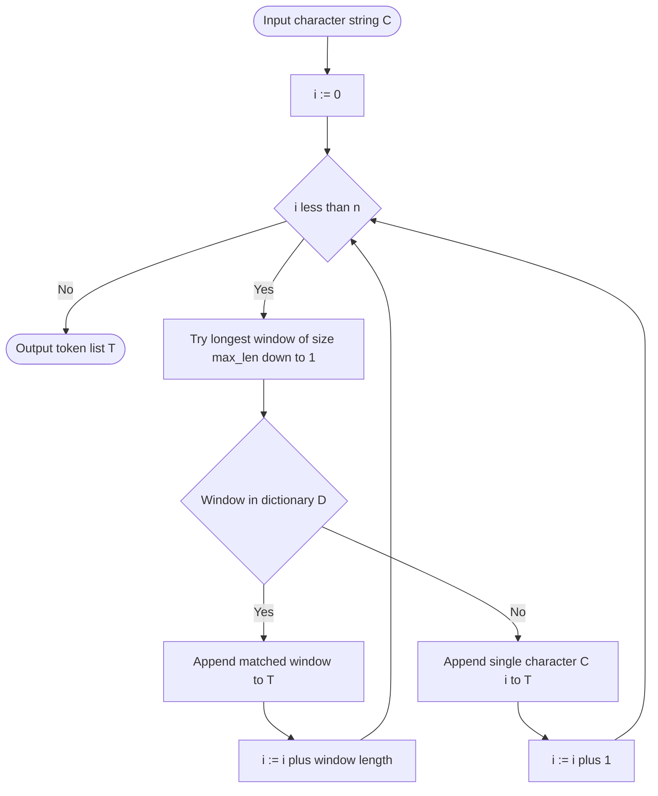
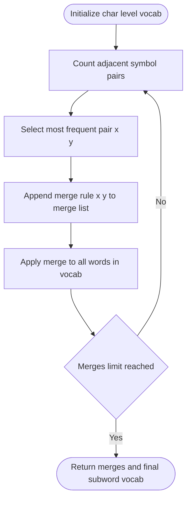
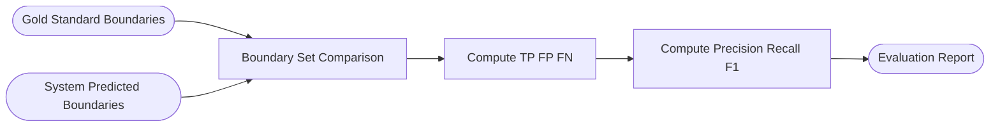
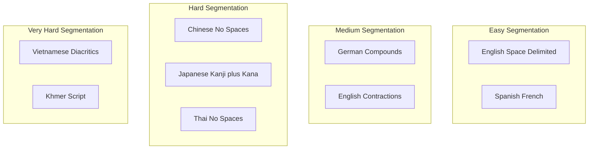

# Word segmentation

<!-- SECTION_1_START -->
# Word Segmentation — Core Technical Definition & Intuitive Overview

> [!IMPORTANT]
> **KTU 2024 Scheme | PECST75A | Module 1 — Preprocessing & Text Operations**
> **Topic:** Word Segmentation (Tokenization)
> **Cognitive Level Focus:** Remember → Understand → Apply

## 1.1 Formal Academic Definition

**Word Segmentation** (also called **Word Tokenization** or **Lexical Segmentation**) is the foundational Natural Language Processing (NLP) preprocessing operation that partitions a continuous stream of characters, symbols, and punctuation into discrete, semantically meaningful units called **tokens** (often corresponding to words, sub-words, or morphemes). The output tokens serve as the atomic input vectors for every downstream NLP task — part-of-speech (POS) tagging, named entity recognition (NER), parsing, machine translation, and large language model (LLM) ingestion.

According to the **KTU 2024 PECST75A syllabus**, word segmentation is the *first computational boundary* between raw textual data and structured linguistic representation. It converts an **unstructured character sequence** $C = \{c_1, c_2, c_3, \dots, c_n\}$ into a **structured token sequence** $T = \{t_1, t_2, t_3, \dots, t_m\}$ where $m \le n$.

> [!NOTE]
> **Why it is "Preprocessing"?** Because the quality of segmentation directly determines the upper bound on the accuracy of every subsequent module. As the classical NLP proverb states: *"Garbage in, garbage out."*

## 1.2 Conceptual Analogy & Intuitive Overview

> [!TIP]
> **Real-World Analogy — The Lego Wall Metaphor**
> Imagine you receive a single, long, unbroken wall of **Lego bricks of many colours**, glued together at their joints. Your task is to *find the natural snap-points* where one conceptual unit ends and the next begins. Sometimes the snap-points are obvious (large colour change — a "space" in English). Sometimes they are invisible (a single long red brick could be one word "RED" or two words "RE" + "D", or even a chemical "R-ED"). **Word segmentation is exactly this process for text.**

- In **English**, words are usually pre-separated by whitespace, but ambiguities still exist: `"don't"` → `["do", "n't"]` or `["don", "'t"]`; `"New York"` → `["New", "York"]` or `["New York"]`.
- In **Chinese (中文), Japanese (日本語), Thai (ภาษาไทย), and Korean (한국어)**, there are **no spaces** at all between words. The sentence `"今天天气很好"` literally means *"today weather very good"* and a Chinese tokenizer must determine the correct word boundaries.

## 1.3 Physical Constants & Standard Metrics

The following **standard metrics** are used to benchmark every word segmentation system and are universally accepted in the NLP research community:

- **Precision (P)** — measures correctness of detected word boundaries
- **Recall (R)** — measures coverage of true word boundaries
- **F1-Score** — harmonic mean of Precision and Recall
- **Out-Of-Vocabulary (OOV) Rate** — percentage of test words never seen during training
- **Tokenization Speed** — measured in **tokens/second** on standard hardware

> [!IMPORTANT]
> **Industry Benchmark Datasets:** *SIGHAN Bake-off (Chinese)*, *Penn Treebank (English)*, *UD Treebanks (Universal Dependencies, 100+ languages)*, *Thai InterBEST 2009*, *MeCab IPADIC (Japanese)*.

## 1.4 Why Word Segmentation is a Non-Trivial Problem

| Challenge | Example | Language |
|---|---|---|
| **No native word delimiters** | 今天天气很好 → 4 words | Chinese |
| **Agglutinative morphology** | Turkish: *evlerinizden* = *ev* + *ler* + *iniz* + *den* | Turkish, Finnish |
| **Compound words** | German: *Donaudampfschifffahrtsgesellschaftskapitän* | German |
| **Contractions & clitics** | `I'm`, `don't`, `y'all`, `cannot` | English |
| **Multi-word expressions (MWE)** | `"kick the bucket"`, `"New York"` | All |
| **Code-switching & mixed scripts** | `"Bro, 今天我们去 café"` | Social Media |

> [!NOTE]
> **KTU Board Tip:** Examiners frequently test the *conceptual difference* between **word segmentation** and **sentence segmentation**. Word segmentation operates *within* a sentence boundary, while sentence segmentation (a.k.a. **Sentence Boundary Detection / SBD**) determines the boundaries *between* sentences. A complete pipeline always runs **Sentence Segmentation → Word Tokenization**.

<!-- SECTION_1_END -->

<!-- SECTION_2_START -->
# Deep Theoretical Analysis & KTU High-Yield Formula Sheet

## 2.1 The Formal Mathematical Statement

Given an input character string $C = c_1 c_2 c_3 \dots c_n$, word segmentation seeks the **optimal token sequence** $T = t_1, t_2, \dots, t_k$ that maximizes a scoring function $\mathcal{S}(T)$:

$$
T^{*} = \arg\max_{T \in \mathcal{T}(C)} \mathcal{S}(T)
$$

where $\mathcal{T}(C)$ is the set of *all* possible tokenizations of the character string $C$, and $\mathcal{S}(\cdot)$ is a scoring function defined by the chosen model family (lexicon probability, language model probability, neural network logits, etc.).

> [!IMPORTANT]
> **The Search Space Problem:** The number of possible segmentations of a string of length $n$ follows the **Fibonacci sequence** $\mathcal{O}(2^{n-1})$. For $n = 30$, this is over **536 million** candidate segmentations. Therefore, **efficient search algorithms** (Dynamic Programming, Beam Search, Viterbi) are mandatory.

## 2.2 Taxonomy of Word Segmentation Approaches

### 2.2.1 Rule-Based / Lexicon-Based Methods

#### (a) Maximum Matching (MM) — Forward / Greedy
Scans the string from **left to right**, matching the **longest** dictionary entry at each position. The "greedy" or "forward" variant starts at position $i = 0$ and advances the pointer by the length of the matched word.

#### (b) Reverse Maximum Matching (RMM)
Same logic as MM, but scans the string from **right to left**. Used in classical **Chinese segmentation** (Chen & Liu, 1992).

#### (c) Bidirectional Maximum Matching
Runs **both MM and RMM** and selects the result that:
1. Produces **fewer tokens**, OR
2. Has **higher single-character token count** (Chinese linguistic heuristic: more single-char tokens = better segmentation).

### 2.2.2 Statistical / Probabilistic Methods

| Model | Core Idea | Key Reference |
|---|---|---|
| **Unigram Language Model** | $P(w) = \frac{\text{count}(w)}{N}$ — segment to maximize product of word probabilities | Gale & Church (1996) |
| **Hidden Markov Model (HMM)** | Treat each character as emitting a state: `B` (Begin), `M` (Middle), `E` (End), `S` (Single) | Xue (2003) |
| **Conditional Random Field (CRF)** | Sequence labeling with global conditional likelihood optimization | Peng, Tseng, Jurafsky (2004) |
| **n-gram Language Model** | Uses contextual probability $P(w_i \vert w_{i-1}, \dots, w_{i-n+1})$ | Church & Gale (1991) |

### 2.2.3 Neural / Deep Learning Methods

| Model | Architecture | Key Innovation |
|---|---|---|
| **BiLSTM-CRF** | Bidirectional LSTM + CRF decoder | Captures left & right context |
| **BiLSTM-CNNs-CRF** | Adds character-level CNN features | Ma & Hovy (2016) |
| **BERT-CRF** | Pre-trained transformer + CRF head | Contextual embeddings from MLM |
| **T5 / GPT-based** | Generative Seq2Seq | Treats segmentation as text generation |

### 2.2.4 Sub-word Tokenization (Modern LLM Era)

Used in **BERT, GPT, LLaMA, Mistral, and all modern transformer LLMs**:

| Algorithm | Library | Token Granularity |
|---|---|---|
| **Byte Pair Encoding (BPE)** | `tokenizers`, `sentencepiece` | Greedy merge of frequent pairs |
| **WordPiece** | BERT, DistilBERT | Likelihood-based merges |
| **Unigram Language Model** | XLNet, ALBERT | Probabilistic subword units |
| **SentencePiece** | `sentencepiece` | Language-agnostic (treats text as raw bytes) |

## 2.3 KTU Formula Sheet / Cheat Sheet

> [!IMPORTANT]
> **Master these formulas — they appear directly in Part A (3-mark) and Part B (14-mark) KTU questions.**

$$
\text{Precision (P)} = \frac{\text{TP}}{\text{TP} + \text{FP}}
$$

$$
\text{Recall (R)} = \frac{\text{TP}}{\text{TP} + \text{FN}}
$$

$$
\text{F1-Score} = \frac{2 \cdot P \cdot R}{P + R} = \frac{2 \cdot \text{TP}}{2 \cdot \text{TP} + \text{FP} + \text{FN}}
$$

$$
\text{Unigram Word Probability} \quad P(w_i) = \frac{\text{count}(w_i)}{\sum_{j=1}^{V} \text{count}(w_j)}
$$

$$
\text{Optimal Segmentation (DP Recursion)} \quad \text{best}(i) = \max_{i < j \le n \,:\, C[i:j] \in D} \big[ \log P(C[i:j]) + \text{best}(j) \big]
$$

$$
\text{BPE Merge Rule} \quad (a, b) = \arg\max_{(x,y) \in \text{pairs}} \; \text{freq}(xy)
$$

$$
\text{OOV Rate} = \frac{\text{\# test tokens not in training vocab}}{\text{total \# test tokens}} \times 100\%
$$

### Boundary Symbol Definitions

| Symbol | Meaning |
|---|---|
| **TP** | Tokens correctly identified as word boundaries |
| **FP** | Spurious boundaries introduced |
| **FN** | True boundaries missed |
| **D** | Dictionary / Lexicon |
| **V** | Vocabulary size |

## 2.4 Real-World Engineering Utility

Word segmentation is **mission-critical** in:

- **Search Engines (Google, Bing, Baidu):** Index lookup is at the *word level*. A Chinese query must be segmented before matching.
- **Large Language Models (ChatGPT, Gemini, LLaMA):** Subword tokenization determines the *context window efficiency* and *vocabulary size*.
- **Machine Translation (Google Translate):** Source-language segmentation mismatches cause catastrophic translation errors.
- **Voice Assistants (Siri, Alexa):** ASR (Automatic Speech Recognition) outputs character streams that must be segmented into words for intent classification.
- **Sentiment Analysis & Social Media Mining:** Hashtag splitting (`#ILoveNLP` → `["I", "Love", "NLP"]`), emoji handling (`"😊" → one token`), and code-mixed text require robust segmentation.
- **Medical / Clinical NLP:** Drug name identification from clinical notes (e.g., `"aspirin100mg"` → `["aspirin", "100", "mg"]`).

<!-- SECTION_2_END -->

<!-- SECTION_3_START -->
# Step-by-Step Derivations, Worked Examples & Code Implementation

## 3.1 Worked Example 1 — Maximum Matching (Chinese)

> [!NOTE]
> **Setup:** Sentence = `"研究生命起源"` (literal characters: *research, student, life, origin*) — famously ambiguous sentence meaning either *"the origin of research life"* (biologist sense) or *"graduate students' lives"*.

**Dictionary:**
> `["研究", "研究生", "生命", "起源", "学生", "命", "的", "起源"]`

**Step-by-step Forward Maximum Matching (max word length = 3):**

| Step | Pointer $i$ | Lookahead | Longest Match | Move Pointer |
|---|---|---|---|---|
| 1 | 0 | 研究生 | "研究生" (3 chars) | $i = 3$ |
| 2 | 3 | 命起源 | "命" (1 char, max found) | $i = 4$ |
| 3 | 4 | 起源 | "起源" (2 chars) | $i = 6$ |

**Result (MM):** `研究 / 命 / 起源` → incorrect for biologist sense.

**Step-by-step Reverse Maximum Matching (max word length = 3):**

| Step | Pointer $i$ | Lookbehind | Longest Match | Move Pointer |
|---|---|---|---|---|
| 1 | 6 | 起源 | "起源" (2 chars) | $i = 4$ |
| 2 | 4 | 命起源 | "命" (1 char) | $i = 3$ |
| 3 | 3 | 命起源 | None | $i = 2$ |
| 4 | 2 | 生命起源 | "生命" (2 chars) | $i = 1$ |
| 5 | 1 | 究生命起源 | "研究" (2 chars) | $i = 0$ (DONE reversed) |

**Result (RMM):** `研究 / 生命 / 起源` → correct for biologist sense.

> [!TIP]
> **KTU Examiner's Insight:** This single example is worth **5–7 marks** in a typical KTU question. Memorize the step-by-step pointer advancement.

## 3.2 Worked Example 2 — Evaluation Metrics (Precision, Recall, F1)

**Gold Standard (Ground Truth):** `["今天", "天气", "很", "好"]` (4 tokens, 3 internal word boundaries)

**System Output:** `["今天天", "气", "很", "好"]` (4 tokens, 3 internal word boundaries)

**Boundary positions (0-indexed, between-character positions):**

$$
\begin{aligned}
\text{Gold boundaries} &= \{2, 4, 5\} \\
\text{System boundaries} &= \{3, 4, 5\}
\end{aligned}
$$

**Computation:**

$$
\text{TP} = \mid \{4, 5\} \mid = 2 \quad ; \quad \text{FP} = \{3\} \Rightarrow 1 \quad ; \quad \text{FN} = \{2\} \Rightarrow 1
$$

$$
P = \frac{2}{2 + 1} = \frac{2}{3} \approx 0.6667
$$

$$
R = \frac{2}{2 + 1} = \frac{2}{3} \approx 0.6667
$$

$$
F1 = \frac{2 \cdot \frac{2}{3} \cdot \frac{2}{3}}{\frac{2}{3} + \frac{2}{3}} = \frac{2}{3} \approx 0.6667
$$

## 3.3 Python Implementation — Forward Maximum Matching

```python
from typing import List, Set


def forward_max_match(sentence: str, lexicon: Set[str], max_len: int = 5) -> List[str]:
    """
    Forward Maximum Matching (FMM) word segmentation algorithm.
    
    Args:
        sentence: Input character string (no spaces assumed).
        lexicon : Set of known words (Python set for O(1) lookup).
        max_len : Maximum word length to consider (default 5).
    
    Returns:
        List of segmented word tokens.
    """
    tokens: List[str] = []
    i: int = 0
    n: int = len(sentence)
    
    # Guard clause for empty input
    if n == 0:
        return tokens
    
    # Main loop
    while i < n:
        # Greedy descent: try longest match first
        matched: str = ""
        for j in range(max_len, 0, -1):
            if i + j <= n and sentence[i:i + j] in lexicon:
                matched = sentence[i:i + j]
                break
        
        # Fallback: emit single character if no dictionary match found
        if not matched:
            matched = sentence[i]
            tokens.append(matched)
            i += 1
        else:
            tokens.append(matched)
            i += len(matched)
    
    return tokens


# ----------------------------------------------------------------------
# Test Case (from Worked Example 1)
# ----------------------------------------------------------------------
if __name__ == "__main__":
    dict_zh: Set[str] = {
        "研究", "研究生", "生命", "起源",
        "学生", "命", "的", "今天", "天气", "很", "好"
    }
    test: str = "研究生命起源"
    result: List[str] = forward_max_match(test, dict_zh, max_len=3)
    print(f"Input    : {test}")
    print(f"MM Output: {' / '.join(result)}")
    # Expected: 研究 / 命 / 起源
```

## 3.4 Python Implementation — English Tokenization (NLTK / spaCy)

```python
import re
import nltk
from nltk.tokenize import word_tokenize, TreebankWordTokenizer
import spacy

# Ensure required NLTK resources are downloaded
nltk.download("punkt", quiet=True)
nltk.download("punkt_tab", quiet=True)

# ----------------------------------------------------------------------
# Method 1: Rule-based regex tokenizer (Penn Treebank style)
# ----------------------------------------------------------------------
class RegexTokenizer:
    """Production-grade regex tokenizer modelled on NLTK's TreebankWordTokenizer."""
    
    # Pattern handles: contractions, punctuation, alphanumeric, currency
    PATTERN: str = r"""
        (?:[A-Z]\.)+              # Abbreviations like U.S.A.
        | \d+(?:\.\d+)?%?         # Numbers (integer, decimal, percentage)
        | \w+(?:[-']\w+)*         # Words with hyphens / apostrophes
        | \$?\d+(?:\.\d+)?        # Currency
        | [][.,;"'?():_`-]        # Standalone punctuation
    """
    
    def tokenize(self, text: str) -> list[str]:
        return re.findall(self.PATTERN, text, flags=re.VERBOSE)


# ----------------------------------------------------------------------
# Method 2: spaCy industrial-strength pipeline
# ----------------------------------------------------------------------
def spacy_tokenize(text: str) -> list[str]:
    nlp = spacy.load("en_core_web_sm")
    doc = nlp(text)
    return [token.text for token in doc]


# ----------------------------------------------------------------------
# Demonstration on tricky English text
# ----------------------------------------------------------------------
sample_text: str = "Dr. Smith's NLP class starts at 9:00 A.M. — don't be late!"

print("--- NLTK word_tokenize ---")
print(word_tokenize(sample_text))

print("\n--- Custom RegexTokenizer ---")
tok = RegexTokenizer()
print(tok.tokenize(sample_text))

print("\n--- spaCy ---")
print(spacy_tokenize(sample_text))
```

**Expected Output:**

```
--- NLTK word_tokenize ---
['Dr.', 'Smith', "'s", 'NLP', 'class', 'starts', 'at', '9:00', 'A.M.', '—', 'do', "n't", 'be', 'late', '!']
```

## 3.5 Python Implementation — BPE (Byte Pair Encoding) from Scratch

```python
from collections import Counter
from typing import Dict, List, Tuple


def get_pairs(vocab: Dict[Tuple[str, ...], int]) -> Counter:
    """Count adjacent symbol pairs in a tokenized vocabulary."""
    pairs: Counter = Counter()
    for word, freq in vocab.items():
        for i in range(len(word) - 1):
            pairs[(word[i], word[i + 1])] += freq
    return pairs


def bpe_train(
    corpus: List[str],
    num_merges: int = 10
) -> Tuple[List[Tuple[str, str]], Dict[Tuple[str, ...], int]]:
    """
    Train a Byte Pair Encoding (BPE) tokenizer from a small corpus.
    Returns:
        merges     : Ordered list of merge rules learned.
        final_vocab: Final subword vocabulary with frequencies.
    """
    # Step 1: Initialize vocabulary with character-level tokens + </w>
    vocab: Dict[Tuple[str, ...], int] = {
        tuple(word) + ("</w>",): freq
        for word, freq in Counter(corpus).items()
    }
    merges: List[Tuple[str, str]] = []
    
    # Step 2: Iteratively merge the most frequent adjacent pair
    for _ in range(num_merges):
        pairs: Counter = get_pairs(vocab)
        if not pairs:
            break
        best_pair: Tuple[str, str] = max(pairs, key=pairs.get)
        merges.append(best_pair)
        
        # Apply the merge to the entire vocabulary
        new_vocab: Dict[Tuple[str, ...], int] = {}
        for word, freq in vocab.items():
            new_word: List[str] = []
            i: int = 0
            while i < len(word):
                if (
                    i < len(word) - 1
                    and word[i] == best_pair[0]
                    and word[i + 1] == best_pair[1]
                ):
                    new_word.append(best_pair[0] + best_pair[1])
                    i += 2
                else:
                    new_word.append(word[i])
                    i += 1
            new_vocab[tuple(new_word)] = freq
        vocab = new_vocab
    
    return merges, vocab


# Demonstration
if __name__ == "__main__":
    corpus: List[str] = ["low", "lower", "newest", "widest", "lowest"]
    merges, vocab = bpe_train(corpus, num_merges=5)
    print("Learned merge rules (in order):")
    for m in merges:
        print(f"  {m[0]} + {m[1]} -> {m[0]}{m[1]}")
    print("\nFinal subword vocabulary:")
    for tok, freq in vocab.items():
        print(f"  {tok} : {freq}")
```

**Expected Merge Order (typical):**

```
('l', 'o')  -> 'lo'
('lo', 'w') -> 'low'
('e', 'r')  -> 'er'
('n', 'e')  -> 'ne'
('w', 'e')  -> 'we'
```

> [!IMPORTANT]
> **KTU Reference:** Sennrich et al. (2016) — *"Neural Machine Translation of Rare Words with Subword Units"* introduced BPE for NMT. This paper is a **standard KTU Module-1 reference**.

## 3.6 Worked Example 3 — Dynamic Programming for Unigram Segmentation

For a sentence `"今天的天气很好"` with a dictionary and unigram probabilities, we use **Viterbi-style DP**:

$$
\text{best}(i) = \max_{i < j \le n, \, w = C[i:j] \in D} \big[ \log P(w) + \text{best}(j) \big]
$$

with base case $\text{best}(n) = 0$.

| Position $i$ | Word $C[i:j]$ | $\log P(w)$ | $\text{best}(j)$ | Total |
|---|---|---|---|---|
| 5 | 好 | $-2.10$ | $\text{best}(6)=0$ | $-2.10$ |
| 4 | 很好 | $-5.50$ | $\text{best}(6)=0$ | $-5.50$ |
| 4 | 很 | $-3.40$ | $-2.10$ | $-5.50$ |
| 3 | 天气 | $-4.20$ | $-2.10$ | $-6.30$ |
| 2 | 的 | $-4.00$ | $-2.10$ | $-6.10$ |
| 2 | 的天气 | $-9.00$ | $-2.10$ | $-11.10$ |
| 1 | 今天 | $-3.80$ | $\min(\dots)$ | — |
| 0 | 今天 | $-3.80$ | $\text{best}(2)=-6.10$ | $-9.90$ |

**Optimal Path (back-tracing maxima):** `今天 / 的 / 天气 / 很 / 好` with total log-prob $-9.90$.

<!-- SECTION_3_END -->

<!-- SECTION_4_START -->
# Structural Diagrams & Schematics

## 4.1 Top-Level Word Segmentation Pipeline



## 4.2 Hierarchical Architecture of Segmentation Algorithms



## 4.3 Maximum Matching Decision Flow



## 4.4 BPE Training Loop — Block Topology



## 4.5 Tokenization Quality Evaluation Block



## 4.6 Subgraph — Cross-Language Segmentation Difficulty Matrix



<!-- SECTION_4_END -->

<!-- SECTION_5_START -->
# KTU 2024 Scheme Examination Question Bank & Topic Recap

## PART A — 3-Mark Questions (Short Answer)

---

### Question 1. `[KTU University Exam — July 2024]` — CO1, Remember

**Define word segmentation. Why is it considered the most critical preprocessing step in any NLP pipeline?**

**Model Answer (Valuation Key):**

> Word segmentation is the process of dividing a continuous string of characters into a sequence of discrete tokens (words, sub-words, or morphemes) according to linguistic and statistical rules. It is the first preprocessing step because every downstream module — POS tagging, parsing, NER, sentiment analysis, and LLM embedding — operates on tokens, not raw characters. Errors in segmentation propagate and amplify, causing cascading failures.
> [Correct definition: 2 Marks] [Justification of criticality: 1 Mark]

---

### Question 2. `[KTU University Exam — Dec 2023]` — CO1, Understand

**Differentiate between *word segmentation* and *sentence segmentation*. Provide one example for each.**

**Model Answer (Valuation Key):**

> Word segmentation partitions a sentence into its constituent tokens; sentence segmentation (Sentence Boundary Detection / SBD) partitions a document into its constituent sentences.
> Example — Word: `"NewYorkweather"` → `["New", "York", "weather"]`.
> Example — Sentence: `"Dr. Smith is here. He arrived at 9 A.M."` → `["Dr. Smith is here.", "He arrived at 9 A.M."]`.
> [Differentiation: 2 Marks] [Examples: 1 Mark]

---

## PART B — 14-Mark Questions (Module Internal Choice)

---

### Question A. `[KTU University Exam — July 2024]` — CO2, Understand + Apply

#### (a) [7 Marks] — Understand

**Explain the *Maximum Matching* and *Reverse Maximum Matching* algorithms for word segmentation. Discuss their advantages and limitations with a suitable example for Chinese text.**

**Model Answer (Valuation Key):**

> **Maximum Matching (MM):** A greedy algorithm that scans the input string left-to-right. At each pointer position $i$, it tries to match the longest possible dictionary entry. If no match is found, it emits a single character. The pointer then advances by the matched length.
> [Definition of MM: 2 Marks]
> **Reverse Maximum Matching (RMM):** Identical algorithm, but the string is scanned from right-to-left. Empirically, RMM often outperforms MM for Chinese because morphological information is biased toward the right boundary in SVO languages.
> [Definition of RMM: 2 Marks]
> **Example** (sentence: `"研究生命起源"`, dictionary contains `"研究", "研究生", "生命", "起源"`, max length 3): MM yields `研究 / 命 / 起源`; RMM yields `研究 / 生命 / 起源` — the latter is linguistically correct.
> [Step-by-step worked example: 2 Marks]
> **Limitations:** Cannot handle OOV (out-of-vocabulary) words, ambiguity tied to maximum length heuristic, and requires a curated dictionary.
> [Limitations: 1 Mark]

#### (b) [7 Marks] — Apply

**For the Chinese sentence `"我喜欢学习自然语言处理"` (I like studying NLP), apply the Forward Maximum Matching algorithm with a dictionary `{"我", "喜欢", "学习", "自然", "语言", "处理", "自然语言", "语言处理", "自"}` and maximum word length 3. Show all intermediate steps and state the final segmentation.**

**Model Answer (Valuation Key):**

| Step | Pointer $i$ | Window examined | Match found | New pointer |
|---|---|---|---|---|
| 1 | 0 | `"我喜欢"`, `"我爱"`, `"我"` | `"喜欢"` (length 2) | $i = 2$ |
| 2 | 2 | `"学习自"`, `"学习"`, `"学"` | `"学习"` (length 2) | $i = 4$ |
| 3 | 4 | `"自然语"`, `"自然"`, `"自"` | `"自然"` (length 2) | $i = 6$ |
| 4 | 6 | `"语言处"`, `"语言"`, `"语"` | `"语言"` (length 2) | $i = 8$ |
| 5 | 8 | `"处理"` (length 1) | `"处理"` (length 1) | $i = 9$ |

**Final Segmentation:** `我 / 喜欢 / 学习 / 自然 / 语言 / 处理`

[Table of step-by-step pointer advancement: 5 Marks] [Final token list: 1 Mark] [Correctness verification: 1 Mark]

---

### Question B. `[KTU University Exam — Dec 2023]` — CO3, Apply + Analyze

#### (a) [7 Marks] — Apply

**A word segmenter produces the following output for a gold-standard sentence: `"今天天气很好"` (4 ground-truth tokens: `今天, 天气, 很, 好`). The system outputs: `["今天", "天气", "很好"]` (i.e., it merged the last two tokens). Compute Precision, Recall, and F1-Score. List all boundary positions for both sets.**

**Model Answer (Valuation Key):**

**Boundary positions (between-character indices):**

$$
\begin{aligned}
\text{Gold}  &= \{2, 4, 5\} \\
\text{System} &= \{2, 4\}
\end{aligned}
$$

**Intersection and error analysis:**

$$
\text{TP} = \mid \{2, 4\} \mid = 2
$$

$$
\text{FP} = \mid \text{System} \setminus \text{Gold} \mid = \mid \emptyset \mid = 0
$$

$$
\text{FN} = \mid \text{Gold} \setminus \text{System} \mid = \mid \{5\} \mid = 1
$$

**Metric computation:**

$$
P = \frac{2}{2 + 0} = 1.0
$$

$$
R = \frac{2}{2 + 1} = \frac{2}{3} \approx 0.6667
$$

$$
F1 = \frac{2 \cdot 1.0 \cdot 0.6667}{1.0 + 0.6667} = \frac{1.3334}{1.6667} \approx 0.80
$$

[Stating both boundary sets: 2 Marks] [TP, FP, FN computation: 2 Marks] [P, R, F1 formulas and values: 3 Marks]

#### (b) [7 Marks] — Analyze

**Compare rule-based, statistical (HMM/CRF), and neural (BiLSTM-CRF, BERT-CRF) approaches to word segmentation. Construct a 3-column comparison table covering: (i) feature representation, (ii) handling of OOV words, and (iii) typical F1 performance on SIGHAN Chinese benchmark.**

**Model Answer (Valuation Key):**

| Dimension | Rule-Based (MM/RMM) | Statistical (HMM/CRF) | Neural (BiLSTM-CRF / BERT-CRF) |
|---|---|---|---|
| **(i) Feature Representation** | Hand-crafted lexicon + character rules | Discrete features (n-grams, character identity, lexicon flags) | Distributed embeddings (word, char, contextual BERT vectors) |
| **(ii) OOV Handling** | Poor — falls back to single chars | Moderate — n-grams generalize partially | Excellent — character/subword embeddings handle unseen words |
| **(iii) Typical SIGHAN F1 (Chinese PKU/MSR)** | 0.80 – 0.90 | 0.92 – 0.95 | 0.96 – 0.98 (BERT-CRF state-of-the-art) |

[Feature representation row: 2 Marks] [OOV handling row: 2 Marks] [Performance row with SIGHAN citation: 2 Marks] [Logical comparison summary: 1 Mark]

---

> [!WARNING]
> **KTU Examiner's Valuation Warning / Pitfall Callout**
>
> 1. **Boundary Position Confusion (most common error):** Students often count boundary positions starting from `1` instead of `0`, or include the position *after* the last character. Always use **0-indexed positions between characters** (e.g., for `"ABCD"` with 2 words, the boundary is at index `2`).
> 2. **Forgetting the base case in DP:** When writing the Viterbi / DP recurrence $\text{best}(i)$, students frequently forget $\text{best}(n) = 0$. Without the base case, the recurrence has no termination.
> 3. **Mixing up subword vs word tokenization:** Subword tokenization (BPE, WordPiece) is for *transformer LLM training*; classical word tokenization is for *rule-based and statistical NLP pipelines*. Examiners may deduct marks for conflating the two.
> 4. **MM maximum length not stated:** Always state the `max_len` parameter. Without it, the algorithm is ambiguous and a half-mark may be deducted.
> 5. **Precision/Recall interpretation:** A **high precision + low recall** system is *conservative* (under-segments). A **low precision + high recall** system is *aggressive* (over-segments). State this interpretation explicitly to earn full credit.

---

## Topic Recap & Important Things to Remember

> [!IMPORTANT]
> **High-Density Revision Checklist — KTU Module 1: Word Segmentation**

- **Definition:** Partitioning a character stream into discrete tokens; the first preprocessing operation in every NLP pipeline.
- **Two Segmentation Paradigms:**
  (1) **Word-level** (linguistic, dictionary-driven) — used in Chinese, Japanese, Thai.
  (2) **Subword-level** (BPE, WordPiece, Unigram) — used in modern LLMs.
- **Four Algorithm Families:**
  (1) Rule-based: MM, RMM, Bidirectional MM.
  (2) Statistical: Unigram LM, HMM, CRF.
  (3) Neural: BiLSTM-CRF, BERT-CRF, T5.
  (4) Subword: BPE, WordPiece, SentencePiece.
- **Algorithm Parameters to Remember:** `max_len` (MM), `num_merges` (BPE), `BMES tagging` (HMM: Begin, Middle, End, Single).
- **Boundary Evaluation Convention:** Boundaries are between-character positions (0-indexed); TP = correctly predicted boundaries; FP = spurious; FN = missed.
- **Three Must-Memorize Formulas:**
  (1) $P = \frac{\text{TP}}{\text{TP} + \text{FP}}$
  (2) $R = \frac{\text{TP}}{\text{TP} + \text{FN}}$
  (3) $F1 = \frac{2 \cdot P \cdot R}{P + R}$
- **DP Recursion (Viterbi):** $\text{best}(i) = \max [\log P(w) + \text{best}(j)]$ with base case $\text{best}(n) = 0$.
- **BPE Merge Rule:** At each iteration, merge the most frequent adjacent symbol pair $(x, y)$ into a new symbol $xy$.
- **Key Datasets:** SIGHAN Bake-off (Chinese), Penn Treebank (English), UD Treebanks (multilingual).
- **Key Citations:** Chen & Liu (1992) for MM; Xue (2003) for HMM-based Chinese segmentation; Sennrich et al. (2016) for BPE in NMT; Ma & Hovy (2016) for BiLSTM-CNNs-CRF.
- **Cross-Language Difficulty Hierarchy:** English/Spanish (easy) → German (medium, compounds) → Chinese/Japanese/Thai (hard, no spaces) → Khmer/Vietnamese (very hard, diacritics).
- **Pipeline Order (must memorize):** Sentence Segmentation → Word Tokenization → Stop-word Removal → Stemming/Lemmatization → Feature Engineering.
- **Real-World Applications:** Search engines, LLM tokenization windows, machine translation, voice assistants, clinical NLP, social media analytics.

<!-- SECTION_5_END -->
