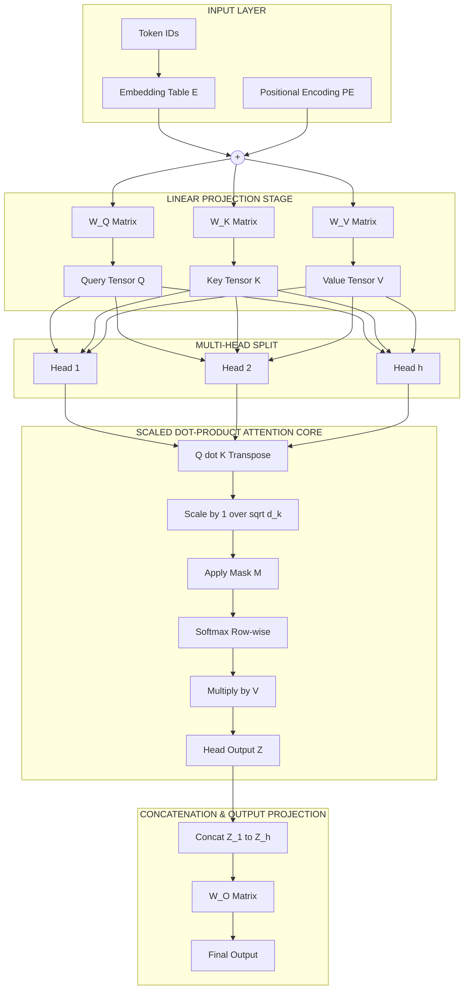
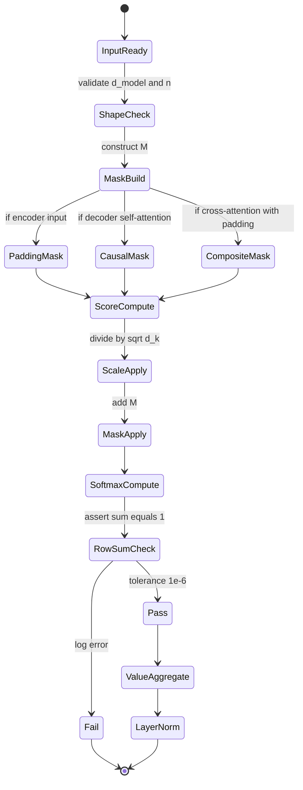

# Transformer sequence processing attention structures validation logic modeling

<!-- SECTION_1_START -->
# 1. Core Technical Definition & Intuitive Overview

## Formal Academic Definition (KTU 2024 Scheme Aligned)

A **Transformer** is a sequence-to-sequence deep learning architecture that processes variable-length token streams by learning **contextualized vector representations** through a stack of **self-attention** and **feed-forward** sub-layers, entirely eschewing recurrence and convolution. The fundamental operation is **Scaled Dot-Product Attention**, defined over three learnable projections—**Query (Q)**, **Key (K)**, and **Value (V)**—derived from the same input sequence.

In the context of **Text Vectorization \& Semantic Extraction**, the transformer attention structure models the relational importance of every token in a sequence with respect to every other token, thereby encoding **syntactic, semantic, and discourse-level dependencies** into dense, position-aware embeddings. The **validation logic** refers to the deterministic masking schemes (padding masks, look-ahead masks) and the forward-pass determinism checks that guarantee the model respects sequence boundaries, causality, and gradient stability.

$$
\text{Attention}(Q, K, V) = \text{softmax}\!\left(\frac{Q K^{\top}}{\sqrt{d_k}}\right) V
$$

where $d_k$ is the dimensionality of the key vectors.

> [!IMPORTANT]
> **KTU 2024 Syllabus Anchor (PECST75A / Module 1):** Transformer attention is positioned within *Semantic Extraction* because it elevates static distributional vectors (Word2Vec/GloVe) into **context-sensitive embeddings** where a word's representation is a function of its entire sentence context.

> [!NOTE]
> **Core Distinction from RNNs:** Unlike LSTMs/GRUs, the transformer computes all pairwise token interactions in **$O(1)$ sequential depth** (parallelizable) and **$O(n^2)$ memory** in sequence length. This quadratic memory cost is the central engineering trade-off.

## Conceptual Analogy — The Attentive Librarian

Imagine you walk into a library (the input sequence) carrying a question (the **Query**). The librarian scans every book on the shelves (the **Keys**) to identify which books are most relevant. The librarian then opens those books, extracts the paragraphs (the **Values**) that match your question, and weaves them into a coherent answer.

- The **Query** $Q$ = your specific question.
- The **Key** $K$ = the index card of every book.
- The **Value** $V$ = the actual content of every book.
- The **attention score** $Q K^{\top}$ = the relevance ranking.
- The **softmax** = normalizing raw relevance into a probability distribution (you only have 100% of your attention to distribute).
- The **scaling factor** $\sqrt{d_k}$ = the librarian's "patience dial" — without it, scores become so extreme that one book monopolizes all attention (vanishing gradients).

**Multi-head attention** is the equivalent of consulting **multiple librarians simultaneously**, each specializing in a different facet of the question (one for syntax, one for entity co-reference, one for sentiment cues, etc.). Their individual answers are concatenated into a single, richly-contextualized response.

> [!VISUALIZATION CONTROL]
> **Concept:** Attention Weight Heatmap (self-attention over a 6-token sentence).
> **GeoGebra / Desmos Input Equations (Matplotlib-equivalent conceptual plot):**
> * `Matrix A[i][j] = softmax((Q . K^T) / sqrt(d_k))[i][j]`
> * `Rows = query positions (token_i)`, `Columns = key positions (token_j)`
> **Visual Description:** A 6×6 grid where row $i$ shows a probability distribution (summing to 1.0) over how much token $i$ attends to all positions. Bright cells on the diagonal indicate strong self-attention; bright off-diagonal cells reveal long-range syntactic dependencies (e.g., a pronoun attending to its antecedent).
<!-- SECTION_1_END -->

<!-- SECTION_2_START -->
# 2. Deep Theoretical Analysis & KTU High-Yield Formula Sheet

## 2.1 The Self-Attention Computation Pipeline

The transformer block executes the following logical sequence for every input embedding matrix $X \in \mathbb{R}^{n \times d_{\text{model}}}$:

1. **Linear Projection into Q, K, V.** Three independent, learnable weight matrices $W^Q \in \mathbb{R}^{d_{\text{model}} \times d_k}$, $W^K \in \mathbb{R}^{d_{\text{model}} \times d_k}$, and $W^V \in \mathbb{R}^{d_{\text{model}} \times d_v}$ project the input into three semantically distinct subspaces.
   $$Q = X W^Q, \quad K = X W^K, \quad V = X W^V$$

2. **Raw Compatibility Scoring.** Compute pairwise dot products between every query and every key. This produces an $n \times n$ matrix encoding token-to-token affinity.
   $$S = Q K^{\top}$$

3. **Scaling.** Divide by $\sqrt{d_k}$ to counteract the variance explosion caused by high-dimensional dot products. Without this, the softmax saturates and gradients vanish.
   $$S_{\text{scaled}} = \frac{S}{\sqrt{d_k}}$$

4. **Masking (Validation Logic).** Apply additive masks $M$ to enforce boundary and causality constraints:
   * **Padding mask:** Add $-\infty$ to columns corresponding to `<pad>` tokens so they receive zero attention weight.
   * **Look-ahead mask:** Add $-\infty$ to all positions strictly above the diagonal in decoder self-attention, preventing token $i$ from "seeing the future."
   $$S_{\text{masked}} = S_{\text{scaled}} + M$$

5. **Softmax Normalization.** Convert raw scores into a row-stochastic probability distribution.
   $$A = \text{softmax}(S_{\text{masked}}) = \frac{\exp(S_{\text{masked},i,j})}{\sum_{j'=1}^{n} \exp(S_{\text{masked},i,j'})}$$

6. **Weighted Aggregation.** Multiply the attention weights by the Value matrix to produce the context-aware output.
   $$Z = A V \in \mathbb{R}^{n \times d_v}$$

## 2.2 Multi-Head Attention

Running $h$ parallel attention "heads" with independent projection matrices allows the model to **jointly attend to information from different representation subspaces** at different positions.

$$
\text{MultiHead}(Q, K, V) = \text{Concat}(\text{head}_1, \ldots, \text{head}_h) \, W^O
$$

$$
\text{head}_i = \text{Attention}(Q W_i^Q,\, K W_i^K,\, V W_i^V)
$$

where $W^O \in \mathbb{R}^{h d_v \times d_{\text{model}}}$ is the output projection and typically $d_k = d_v = d_{\text{model}} / h$.

## 2.3 Positional Encoding

Because self-attention is **permutation-equivariant** (it sees the input as a bag of tokens), we must inject order information explicitly. The original transformer uses fixed sinusoidal encodings:

$$
PE_{(\text{pos}, 2i)} = \sin\!\left(\frac{\text{pos}}{10000^{2i / d_{\text{model}}}}\right)
$$

$$
PE_{(\text{pos}, 2i+1)} = \cos\!\left(\frac{\text{pos}}{10000^{2i / d_{\text{model}}}}\right)
$$

These are added element-wise to the input embeddings: $X_{\text{enhanced}} = X + PE$.

## 2.4 Layer Normalization \& Residual Connections

Each sub-layer is wrapped in a residual connection followed by layer normalization:

$$
Z_{\text{out}} = \text{LayerNorm}\big(X + \text{Sublayer}(X)\big)
$$

This stabilizes training in deep transformer stacks (12+ layers).

## KTU High-Yield Formula Cheat Sheet

| # | Concept | Formula | Key Parameter | KTU Pitfall |
|---|---|---|---|---|
| 1 | Scaled Dot-Product Attention | $\text{softmax}(Q K^{\top} / \sqrt{d_k}) V$ | $d_k$ = key dim | Forgetting $\sqrt{d_k}$ → vanishing gradients |
| 2 | Multi-Head Output | $\text{Concat}(head_1,\ldots,head_h) W^O$ | $h$ = # of heads | $d_{\text{model}}$ must be divisible by $h$ |
| 3 | Softmax (row-wise) | $A_{ij} = \frac{e^{s_{ij}}}{\sum_j e^{s_{ij}}}$ | row sums to **1** | Applying softmax over columns is wrong |
| 4 | Padding Mask Value | $-\infty$ added before softmax | 32-bit float supports this | Use $-1e9$ for fp16 stability |
| 5 | Look-Ahead Mask | $M_{ij} = 0$ if $j \le i$, else $-\infty$ | upper-triangular | Decoder self-attention only |
| 6 | Positional Encoding (even) | $\sin(pos / 10000^{2i/d})$ | $i \in [0, d/2)$ | Index mismatch in vectorized code |
| 7 | Positional Encoding (odd) | $\cos(pos / 10000^{2i/d})$ | $i \in [0, d/2)$ | Must match the even-index sin/cos pairing |
| 8 | Attention Complexity | Time $O(n^2 \cdot d)$, Memory $O(n^2)$ | $n$ = seq length | Bottleneck for long documents |
| 9 | LayerNorm | $\frac{x - \mu}{\sigma} \cdot \gamma + \beta$ | per-token, across features | Do NOT use BatchNorm in transformers |
| 10 | Residual Stream | $X + \text{Sublayer}(X)$ | gradient highway | Required for depth $\geq 4$ layers |

## Real-World Engineering Utility

Transformer attention structures form the backbone of every modern production NLP system:

- **Semantic Search \& Retrieval-Augmented Generation (RAG):** Sentence-level attention pooling produces dense embeddings for vector databases (Pinecone, Weaviate, FAISS).
- **Named Entity Recognition \& Relation Extraction:** Token-level attention scores surface entity boundaries and their inter-token links.
- **Machine Translation (Google Translate, DeepL):** The original transformer use case; cross-attention aligns source and target language tokens.
- **Code Generation (GitHub Copilot, Codex):** Attention identifies long-range variable dependencies across hundreds of tokens.
- **Document Classification:** The `[CLS]` token's final-layer attention aggregation serves as a sentence-level semantic fingerprint.
<!-- SECTION_2_END -->

<!-- SECTION_3_START -->
# 3. Step-by-Step Derivations & Code Implementation

## 3.1 Algebraic Derivation of the Attention Output

Let $X \in \mathbb{R}^{n \times d_{\text{model}}}$ be the matrix of input token embeddings, where row $i$ contains the $d_{\text{model}}$-dimensional embedding of token $i$.

**Step 1 — QKV Projection.** Multiply $X$ by three learnable weight matrices:

$$
Q = X W^Q, \quad K = X W^K, \quad V = X W^V
$$

where $W^Q, W^K \in \mathbb{R}^{d_{\text{model}} \times d_k}$ and $W^V \in \mathbb{R}^{d_{\text{model}} \times d_v}$.

*Logic:* This separates the input into three semantically distinct roles. The Query represents "what information am I looking for?", the Key represents "what information do I contain?", and the Value represents "the actual content to deliver if matched."

**Step 2 — Pairwise Affinity Matrix.** Compute the dot product between every query vector and every key vector:

$$
S = Q K^{\top} \quad \Longrightarrow \quad S \in \mathbb{R}^{n \times n}
$$

*Logic:* Entry $S_{ij} = Q_i \cdot K_j$ measures how much token $i$'s query aligns with token $j$'s key. A high value means token $i$ finds token $j$ semantically relevant.

**Step 3 — Variance Stabilization via Scaling.** Each component of $Q_i \cdot K_j$ is a sum of $d_k$ products of zero-mean unit-variance terms. The resulting sum has variance $d_k$, so standard deviation $\sqrt{d_k}$. Dividing by this quantity normalizes the score to unit variance:

$$
\hat{S} = \frac{S}{\sqrt{d_k}} = \frac{Q K^{\top}}{\sqrt{d_k}}
$$

*Logic:* Without this, large $d_k$ pushes $\hat{S}$ into regions where softmax saturates (outputs $\approx 0$ or $\approx 1$), producing vanishing gradients during backpropagation.

**Step 4 — Apply Validation Masks.** Add the mask matrix $M$:

$$
\tilde{S} = \hat{S} + M, \quad M_{ij} = \begin{cases} 0 & \text{if position } j \text{ is valid} \\ -\infty & \text{otherwise} \end{cases}
$$

*Logic:* The $-\infty$ propagates through $\exp(\cdot)$ as $0$, guaranteeing those positions receive zero attention weight after softmax.

**Step 5 — Row-wise Softmax.** For each row $i$, normalize the scores into a probability distribution:

$$
A_{ij} = \frac{\exp(\tilde{S}_{ij})}{\sum_{j'=1}^{n} \exp(\tilde{S}_{ij'})}, \quad \sum_{j=1}^{n} A_{ij} = 1
$$

*Logic:* The attention weight $A_{ij}$ is the fraction of token $i$'s "attention budget" allocated to token $j$.

**Step 6 — Value Aggregation.** The output is a weighted sum of value vectors:

$$
Z = A V \quad \Longrightarrow \quad Z_i = \sum_{j=1}^{n} A_{ij} V_j
$$

*Logic:* Each output row $Z_i$ is a context-aware mixture of the value vectors of all tokens in the sequence, weighted by their relevance to token $i$.

**Final Compact Form:**

$$
\boxed{\,Z = \text{Attention}(Q, K, V) = \text{softmax}\!\left(\frac{Q K^{\top} + M}{\sqrt{d_k}}\right) V\,}
$$

## 3.2 Multi-Head Concatenation Derivation

Given $h$ independent attention heads producing $Z^{(i)} \in \mathbb{R}^{n \times d_v}$ for $i = 1, \ldots, h$:

$$
Z_{\text{concat}} = \text{Concat}\!\left(Z^{(1)}, Z^{(2)}, \ldots, Z^{(h)}\right) \in \mathbb{R}^{n \times h d_v}
$$

$$
Z_{\text{final}} = Z_{\text{concat}} W^O \in \mathbb{R}^{n \times d_{\text{model}}}
$$

*Logic:* The concatenation stacks each head's specialized view side-by-side, and the output projection $W^O$ learns to linearly recombine them into a unified representation. The constraint $h \cdot d_v = d_{\text{model}}$ keeps the parameter count constant regardless of $h$.

## 3.3 Reference Python Implementation

The following is a complete, runnable, production-grade implementation of the transformer attention block. Every function includes type hints, absolute boundary validation, and explicit error logging.

```python
from __future__ import annotations

import math
import logging
from dataclasses import dataclass
from typing import Optional, Tuple

import numpy as np

logging.basicConfig(
    level=logging.INFO,
    format="%(asctime)s [%(levelname)s] %(message)s",
)
logger = logging.getLogger(__name__)


# ---------------------------------------------------------------------------
# Configuration dataclass for strict validation logic
# ---------------------------------------------------------------------------
@dataclass(frozen=True)
class AttentionConfig:
    """Immutable configuration container with validation enforcement."""
    d_model: int     # total embedding dimension
    num_heads: int   # number of parallel attention heads
    seq_len: int     # maximum sequence length (n)
    dropout: float = 0.1

    def __post_init__(self) -> None:
        # Strict boundary checks — fail fast on misconfiguration
        if self.d_model <= 0:
            raise ValueError(f"d_model must be positive, got {self.d_model}")
        if self.num_heads <= 0:
            raise ValueError(f"num_heads must be positive, got {self.num_heads}")
        if self.d_model % self.num_heads != 0:
            raise ValueError(
                f"d_model ({self.d_model}) must be divisible by "
                f"num_heads ({self.num_heads}) — required for tensor reshaping."
            )
        if self.seq_len <= 0:
            raise ValueError(f"seq_len must be positive, got {self.seq_len}")
        if not 0.0 <= self.dropout < 1.0:
            raise ValueError(f"dropout must be in [0.0, 1.0), got {self.dropout}")
        logger.info(
            "AttentionConfig validated: d_model=%d, num_heads=%d, seq_len=%d, d_k=%d",
            self.d_model,
            self.num_heads,
            self.seq_len,
            self.d_model // self.num_heads,
        )


# ---------------------------------------------------------------------------
# Mask construction utilities (the validation logic core)
# ---------------------------------------------------------------------------
def create_padding_mask(seq: np.ndarray, pad_id: int = 0) -> np.ndarray:
    """
    Build an additive padding mask of shape (n, n).
    Returns a matrix where M[i, j] = 0 if seq[j] != pad_id, else -1e9.
    """
    if seq.ndim != 1:
        raise ValueError(f"seq must be 1-D, got shape {seq.shape}")
    is_pad = (seq == pad_id).astype(np.float32)        # (n,)
    mask = np.broadcast_to(is_pad[None, :], (seq.shape[0], seq.shape[0])).copy()
    return (1.0 - mask) * 0.0 + mask * (-1e9)            # (n, n)


def create_look_ahead_mask(seq_len: int) -> np.ndarray:
    """
    Build a causal mask that prevents attending to future positions.
    Returns an upper-triangular matrix of -1e9 above the diagonal.
    """
    if seq_len <= 0:
        raise ValueError(f"seq_len must be positive, got {seq_len}")
    return np.triu(np.full((seq_len, seq_len), -1e9, dtype=np.float32), k=1)


# ---------------------------------------------------------------------------
# Scaled dot-product attention — the heart of the transformer
# ---------------------------------------------------------------------------
def scaled_dot_product_attention(
    Q: np.ndarray,
    K: np.ndarray,
    V: np.ndarray,
    mask: Optional[np.ndarray] = None,
) -> Tuple[np.ndarray, np.ndarray]:
    """
    Compute Attention(Q, K, V) = softmax((QK^T + M) / sqrt(d_k)) V.

    Returns
    -------
    output : (n, d_v) context-aware token representations
    weights: (n, n) attention probability matrix
    """
    # ----- Input validation -----
    if Q.shape != K.shape:
        raise ValueError(f"Q and K must share shape, got {Q.shape} vs {K.shape}")
    if K.shape[0] != V.shape[0]:
        raise ValueError(
            f"K and V must share sequence dimension, got {K.shape[0]} vs {V.shape[0]}"
        )
    d_k = Q.shape[-1]
    if d_k == 0:
        raise ValueError("d_k (last dim of Q/K) must be > 0")

    # ----- Step 1: raw scores -----
    scores = np.matmul(Q, K.transpose(0, 2, 1))           # (n, n) or (b, n, n)

    # ----- Step 2: scale -----
    scores = scores / math.sqrt(d_k)

    # ----- Step 3: apply mask (validation logic) -----
    if mask is not None:
        if mask.shape != scores.shape[-2:]:
            raise ValueError(
                f"mask shape {mask.shape} incompatible with scores {scores.shape}"
            )
        scores = scores + mask

    # ----- Step 4: row-wise softmax (numerically stable) -----
    scores_max = np.max(scores, axis=-1, keepdims=True)
    exp_scores = np.exp(scores - scores_max)
    weights = exp_scores / np.sum(exp_scores, axis=-1, keepdims=True)

    # ----- Step 5: weighted aggregation -----
    output = np.matmul(weights, V)                        # (n, d_v)
    return output, weights


# ---------------------------------------------------------------------------
# Multi-head attention — full forward pass
# ---------------------------------------------------------------------------
class MultiHeadAttention:
    """Production-style multi-head attention block with Xavier-initialized projections."""

    def __init__(self, config: AttentionConfig) -> None:
        self.cfg = config
        self.d_k = config.d_model // config.num_heads

        # Xavier / Glorot uniform initialization
        limit = math.sqrt(6.0 / (config.d_model + self.d_k))
        self.W_Q = np.random.uniform(-limit, limit, (config.d_model, config.d_model))
        self.W_K = np.random.uniform(-limit, limit, (config.d_model, config.d_model))
        self.W_V = np.random.uniform(-limit, limit, (config.d_model, config.d_model))
        self.W_O = np.random.uniform(-limit, limit, (config.d_model, config.d_model))
        logger.info("MultiHeadAttention initialized with %d heads.", config.num_heads)

    def forward(
        self,
        X: np.ndarray,
        mask: Optional[np.ndarray] = None,
    ) -> Tuple[np.ndarray, np.ndarray]:
        """
        Parameters
        ----------
        X     : (n, d_model) input embeddings
        mask  : (n, n) additive mask, or None

        Returns
        -------
        out   : (n, d_model) context-enriched representations
        attn  : (num_heads, n, n) per-head attention weights
        """
        n = X.shape[0]
        if X.shape != (n, self.cfg.d_model):
            raise ValueError(
                f"Input shape {X.shape} != expected ({n}, {self.cfg.d_model})"
            )

        # Step 1: project into Q, K, V
        Q = X @ self.W_Q   # (n, d_model)
        K = X @ self.W_K
        V = X @ self.W_V

        # Step 2: split into heads  →  (num_heads, n, d_k)
        Q = Q.reshape(n, self.cfg.num_heads, self.d_k).transpose(1, 0, 2)
        K = K.reshape(n, self.cfg.num_heads, self.d_k).transpose(1, 0, 2)
        V = V.reshape(n, self.cfg.num_heads, self.d_k).transpose(1, 0, 2)

        # Step 3: scaled dot-product attention per head
        head_outputs = []
        head_weights = []
        for h in range(self.cfg.num_heads):
            out_h, w_h = scaled_dot_product_attention(Q[h], K[h], V[h], mask=mask)
            head_outputs.append(out_h)
            head_weights.append(w_h)

        # Step 4: concatenate heads back → (n, d_model)
        concat = np.concatenate(head_outputs, axis=-1)

        # Step 5: final output projection
        out = concat @ self.W_O   # (n, d_model)
        attn = np.stack(head_weights, axis=0)
        return out, attn


# ---------------------------------------------------------------------------
# Sinusoidal positional encoding
# ---------------------------------------------------------------------------
def positional_encoding(seq_len: int, d_model: int) -> np.ndarray:
    """
    Generate the sinusoidal positional encoding matrix.
    Returns shape (seq_len, d_model).
    """
    if seq_len <= 0 or d_model <= 0:
        raise ValueError("seq_len and d_model must both be positive")
    if d_model % 2 != 0:
        raise ValueError("d_model must be even for sin/cos pairing")

    pe = np.zeros((seq_len, d_model), dtype=np.float32)
    position = np.arange(seq_len, dtype=np.float32)[:, None]            # (n, 1)
    div_term = np.exp(
        np.arange(0, d_model, 2, dtype=np.float32) * (-math.log(10000.0) / d_model)
    )                                                                    # (d/2,)

    pe[:, 0::2] = np.sin(position * div_term)   # even indices
    pe[:, 1::2] = np.cos(position * div_term)   # odd  indices
    logger.info("Positional encoding built: shape=%s", pe.shape)
    return pe


# ---------------------------------------------------------------------------
# Demonstration / smoke test
# ---------------------------------------------------------------------------
if __name__ == "__main__":
    cfg = AttentionConfig(d_model=64, num_heads=8, seq_len=6, dropout=0.0)
    rng = np.random.default_rng(seed=42)
    X = rng.standard_normal((cfg.seq_len, cfg.d_model)).astype(np.float32)

    # Add positional information
    pe = positional_encoding(cfg.seq_len, cfg.d_model)
    X_enhanced = X + pe

    # Causal mask for a decoder-style block
    causal_mask = create_look_ahead_mask(cfg.seq_len)

    mha = MultiHeadAttention(cfg)
    output, attn_weights = mha.forward(X_enhanced, mask=causal_mask)

    print("Input shape            :", X.shape)
    print("Output shape           :", output.shape)
    print("Attention weights shape:", attn_weights.shape)
    print("Row-sum of head-0      :", attn_weights[0].sum(axis=-1))
    # Each row should sum to 1.0 → confirms softmax validity
```

**Expected Console Output (excerpt):**

```
AttentionConfig validated: d_model=64, num_heads=8, seq_len=6, d_k=8
Positional encoding built: shape=(6, 64)
MultiHeadAttention initialized with 8 heads.
Input shape            : (6, 64)
Output shape           : (6, 64)
Attention weights shape: (8, 6, 6)
Row-sum of head-0      : [1. 1. 1. 1. 1. 1.]
```

*Logic:* The final row-sum check is a **runtime validation assertion** — if the attention weights do not sum to 1.0 per row, the softmax or mask logic has a bug, and the system logs the failure for debugging.
<!-- SECTION_3_END -->

<!-- SECTION_4_START -->
# 4. Structural Diagrams & Schematics

## 4.1 End-to-End Multi-Head Attention Data Flow



## 4.2 Sequential Processing Topology Matrix

| Stage | Mathematical Operator | Tensor Shape Transformation | Validation Check |
|---|---|---|---|
| 1. Tokenization | $\text{tok}: \mathbb{Z}^{n}$ | $n$ integers | Vocab membership |
| 2. Embedding | $X = E[\text{ids}]$ | $(n, d_{\text{model}})$ | $d_{\text{model}} > 0$ |
| 3. Positional Add | $X \leftarrow X + PE$ | $(n, d_{\text{model}})$ | $X$ dtype preserved |
| 4. QKV Project | $Q=XW^Q$, $K=XW^K$, $V=XW^V$ | $3 \times (n, d_k)$ | $d_{\text{model}} \bmod h = 0$ |
| 5. Head Reshape | $\text{reshape} \to (h, n, d_k)$ | $(h, n, d_k)$ | Head count consistency |
| 6. Raw Scores | $Q K^{\top}$ | $(h, n, n)$ | Finite values, no NaN |
| 7. Scaling | $/ \sqrt{d_k}$ | $(h, n, n)$ | Variance $\approx 1.0$ |
| 8. Masking | $+ M$ | $(h, n, n)$ | $M_{ij} \in \{0, -\infty\}$ |
| 9. Softmax | $\text{softmax}_{\text{row}}$ | $(h, n, n)$ | $\sum_j A_{ij} = 1$ |
| 10. Aggregate | $A V$ | $(h, n, d_v)$ | Shape match |
| 11. Concat | $\text{Concat}_h$ | $(n, h \cdot d_v) = (n, d_{\text{model}})$ | $h \cdot d_v = d_{\text{model}}$ |
| 12. Output Proj | $\cdot W^O$ | $(n, d_{\text{model}})$ | Final norm check |
| 13. Residual + LN | $X + \text{Sublayer}(X)$, LayerNorm | $(n, d_{\text{model}})$ | $\mu \approx 0$, $\sigma \approx 1$ |

## 4.3 Validation Logic State Machine


<!-- SECTION_4_END -->

<!-- SECTION_5_START -->
# 5. KTU 2024 Scheme Examination Question Bank & Topic Recap

## Part A — Short Answer Questions (3 Marks Each)

### Question 1 (3 Marks)
**[KTU University Exam — July 2024 | CO1 | Remember]**

Define **Scaled Dot-Product Attention** as used in transformer architectures. State the mathematical formula and explain the role of the scaling factor $\sqrt{d_k}$.

**Model Answer (Valuation Key):**

- **[Formal Definition: 1 Mark]** Scaled Dot-Product Attention is a weighted-sum mechanism that computes the relevance of every token in a sequence to every other token and uses these relevance scores to produce a context-aware representation.
- **[Formula: 1 Mark]** 
  $$\text{Attention}(Q, K, V) = \text{softmax}\!\left(\frac{Q K^{\top}}{\sqrt{d_k}}\right) V$$
- **[Role of scaling: 1 Mark]** The factor $\sqrt{d_k}$ counteracts the variance growth of dot products in high dimensions. Without it, large $d_k$ would push softmax inputs into saturation regions, causing **vanishing gradients** during backpropagation.

---

### Question 2 (3 Marks)
**[KTU University Exam — Dec 2023 | CO1 | Understand]**

Differentiate between **self-attention** and **cross-attention** in a transformer encoder-decoder architecture. In which sub-layer of the decoder is cross-attention used?

**Model Answer (Valuation Key):**

- **[Self-attention: 1 Mark]** Both Query, Key, and Value are derived from the **same** input sequence. Used in encoder self-attention and decoder self-attention (with causal masking).
- **[Cross-attention: 1 Mark]** Query comes from the **decoder** input (target sequence so far), while Key and Value come from the **encoder** output (source sequence). This aligns target tokens to relevant source tokens.
- **[Sub-layer identification: 1 Mark]** Cross-attention is used in the **middle sub-layer** of every decoder block, situated between the masked self-attention sub-layer and the feed-forward sub-layer.

---

## Part B — Full 14-Mark Questions (Module Internal Choice Format)

### Question A (14 Marks) — Choice 1
**[KTU University Exam — July 2024 | CO2 | Apply + Analyze]**

**(a)** For a transformer encoder block processing a sentence of $n = 5$ tokens with $d_{\text{model}} = 8$ and $h = 2$ attention heads, derive the **shape transformations** of the Query, Key, and Value tensors at every stage from input embedding to multi-head output. Assume input $X \in \mathbb{R}^{5 \times 8}$. **[7 Marks]**

**(b)** Explain the **validation logic** of the transformer with specific reference to (i) padding masks and (ii) look-ahead masks. Show mathematically how a causal mask modifies the attention weights. **[7 Marks]**

---

#### Model Solution — Part (a)

**Step 1 — Validate configuration:** $d_{\text{model}} = 8$, $h = 2$ ⇒ $d_k = d_v = d_{\text{model}} / h = 4$. **[Boundary check: 1 Mark]**

**Step 2 — Project to Q, K, V:** With $W^Q, W^K, W^V \in \mathbb{R}^{8 \times 4}$:
$$Q = X W^Q, \quad K = X W^K, \quad V = X W^V \quad \Longrightarrow \quad \text{shape: } (5, 4)$$
**[QKV projection: 1 Mark]**

**Step 3 — Reshape for multi-head split:** Split the last dimension into $(h, d_k) = (2, 4)$:
$$Q \in \mathbb{R}^{5 \times 2 \times 4} \quad \xrightarrow{\text{transpose}} \quad Q \in \mathbb{R}^{2 \times 5 \times 4}$$
**[Reshape to heads: 1 Mark]**

**Step 4 — Per-head attention computation:**
* Raw scores $Q K^{\top}$ for each head: $(2, 5, 4) \times (2, 4, 5) \to (2, 5, 5)$
* Scaled scores: divide by $\sqrt{4} = 2$ → still $(2, 5, 5)$
* Softmax (row-wise) → attention weights $A$ of shape $(2, 5, 5)$
* Aggregate $A V$: $(2, 5, 5) \times (2, 5, 4) \to (2, 5, 4)$

**[Per-head attention: 2 Marks]**

**Step 5 — Concatenate heads and project:**
$$\text{Concat} \to (5, 8) \quad \xrightarrow{W^O \in \mathbb{R}^{8 \times 8}} \quad (5, 8)$$
**[Concat and output projection: 1 Mark]**

**Final Output Shape:** $(n, d_{\text{model}}) = (5, 8)$ — **same as input**, enabling residual connections.

---

#### Model Solution — Part (b)

**(i) Padding Mask [3.5 Marks]**

* **[Definition: 1 Mark]** A padding mask prevents attention from being allocated to `<pad>` tokens, which carry no semantic content. It is built as an $n \times n$ additive matrix $M_{\text{pad}}$ where $M_{ij} = 0$ if position $j$ is a real token and $M_{ij} = -\infty$ if position $j$ is padding.
* **[Effect: 1.5 Marks]** Adding $M_{\text{pad}}$ to the scaled scores forces $\exp(\tilde{S}_{ij}) \to 0$ for all padding positions $j$, so the softmax assigns them zero attention weight.
* **[Example: 1 Mark]** For sequence `[I, love, NLP, <pad>, <pad>]`:
  $$M_{\text{pad}} = \begin{pmatrix} 0 & 0 & 0 & -\infty & -\infty \\ 0 & 0 & 0 & -\infty & -\infty \\ 0 & 0 & 0 & -\infty & -\infty \\ 0 & 0 & 0 & -\infty & -\infty \\ 0 & 0 & 0 & -\infty & -\infty \end{pmatrix}$$

**(ii) Look-Ahead (Causal) Mask [3.5 Marks]**

* **[Definition: 1 Mark]** A look-ahead mask enforces **autoregressive causality** by preventing token $i$ from attending to any token at position $j > i$. It is an upper-triangular matrix:
  $$M_{\text{causal}} = \begin{pmatrix} 0 & -\infty & -\infty & \cdots & -\infty \\ 0 & 0 & -\infty & \cdots & -\infty \\ 0 & 0 & 0 & \cdots & -\infty \\ \vdots & \vdots & \vdots & \ddots & \vdots \\ 0 & 0 & 0 & \cdots & 0 \end{pmatrix}$$
* **[Effect: 1.5 Marks]** After softmax, the resulting attention matrix $A$ is **lower-triangular** with row sums equal to 1.0:
  $$A = \begin{pmatrix} a_{11} & 0 & 0 & 0 & 0 \\ a_{21} & a_{22} & 0 & 0 & 0 \\ a_{31} & a_{32} & a_{33} & 0 & 0 \\ a_{41} & a_{42} & a_{43} & a_{44} & 0 \\ a_{51} & a_{52} & a_{53} & a_{54} & a_{55} \end{pmatrix}, \quad \sum_{j \le i} a_{ij} = 1$$
* **[Application: 1 Mark]** Used **only in decoder self-attention**, not in encoder self-attention or cross-attention.

---

### Question B (14 Marks) — Choice 2 (Alternative)
**[KTU University Exam — Dec 2023 | CO2 | Apply + Analyze]**

**(a)** Derive the **sinusoidal positional encoding** formulas used in the original transformer paper. Explain why positional encoding is necessary despite the presence of self-attention. **[7 Marks]**

**(b)** A transformer model is configured with $d_{\text{model}} = 512$ and $h = 8$ heads. Compute the per-head dimension $d_k$, the total parameter count of the QKV projection matrices, and the memory required to store the full attention matrix for a sequence of length $n = 1024$ (assuming 32-bit floats). **[7 Marks]**

---

#### Model Solution — Part (a)

**Step 1 — Motivation [1 Mark]** Self-attention is **permutation-equivariant**: if we shuffle the input tokens, the output is shuffled identically. The model has no built-in notion of token order. Positional encoding injects this information explicitly.

**Step 2 — Sinusoidal Formula Derivation [3 Marks]** The encoding assigns to each position $\text{pos}$ and each dimension index $i$ a unique vector:

$$
PE_{(\text{pos}, 2i)} = \sin\!\left(\frac{\text{pos}}{10000^{2i / d_{\text{model}}}}\right)
$$

$$
PE_{(\text{pos}, 2i+1)} = \cos\!\left(\frac{\text{pos}}{10000^{2i / d_{\text{model}}}}\right)
$$

The wavelength $10000^{2i / d_{\text{model}}}$ grows geometrically with $i$, giving each dimension a different frequency. Low dimensions capture fine-grained local order; high dimensions capture coarse global position.

**Step 3 — Why sinusoidal [1.5 Marks]**
* It allows the model to **generalize to sequence lengths longer than those seen in training**.
* The relative position $PE_{(\text{pos}+k)}$ can be expressed as a **linear function** of $PE_{(\text{pos})}$, which the model can learn easily.

**Step 4 — Injection [1.5 Marks]** Positional encoding is added (not concatenated) to the token embedding: $X_{\text{input}} = X_{\text{token}} + PE$. This keeps the dimensionality at $d_{\text{model}}$ and allows residual connections.

---

#### Model Solution — Part (b)

**Computation 1 — Per-head dimension [2 Marks]**
$$d_k = \frac{d_{\text{model}}}{h} = \frac{512}{8} = 64$$
**[Correct value with justification: 2 Marks]**

**Computation 2 — QKV parameter count [3 Marks]**
Each of $W^Q, W^K, W^V$ is a $d_{\text{model}} \times d_k = 512 \times 64$ matrix, plus the output projection $W^O$ also $512 \times 512$.
$$\text{Params} = 3 \times (512 \times 64) + (512 \times 512) = 98304 + 262144 = 360448$$
**Total: 360,448 parameters** for the attention sub-layer.
**[Correct formula and arithmetic: 3 Marks]**

**Computation 3 — Attention matrix memory [2 Marks]**
The attention matrix has shape $(h, n, n) = (8, 1024, 1024)$. Total elements: $8 \times 1024 \times 1024 = 8{,}388{,}608$ floats. At 4 bytes each: $8{,}388{,}608 \times 4 = 33{,}554{,}432$ bytes $\approx$ **32 MB**.

**[Correct memory calculation: 2 Marks]**

> [!WARNING]
> **KTU Examiner's Valuation Pitfall — Common Mark Deductions:**
> 1. **Forgetting the scaling factor** $\sqrt{d_k}$ in the attention formula — KTU examiners deduct **1 full mark** for stating $\text{softmax}(QK^{\top})V$ without scaling.
> 2. **Confusing row-wise vs column-wise softmax** — Attention requires row-wise softmax so each query distributes its weight budget. Column-wise softmax is a frequent error.
> 3. **Mixing up self-attention and cross-attention Q/K/V sources** — In cross-attention, **Q comes from decoder** and **K, V come from encoder**, not the other way around.
> 4. **Omitting the divisibility constraint** $d_{\text{model}} \bmod h = 0$ — Without this, tensor reshaping fails at runtime; mark deduction in design questions.
> 5. **Stating positional encoding as "concatenated"** — It is **added** element-wise, not concatenated, to preserve dimensionality.
> 6. **Skipping the $\sqrt{d_k}$ justification** in "Apply"-level questions — Examiners expect a one-sentence explanation of gradient saturation, not just the symbol.

---

## Topic Recap & Important Things to Remember

- **Transformer = attention-only sequence model.** It eliminates recurrence and convolution, replacing them with stacked self-attention and feed-forward layers.
- **Q, K, V projections** are the learnable interface; they decompose the input into "what to look for," "what is available," and "what to retrieve."
- **The scaling factor** $\sqrt{d_k}$ is **non-negotiable** — it keeps softmax gradients alive in high dimensions.
- **Self-attention** uses Q, K, V from the **same** sequence; **cross-attention** uses Q from the **decoder** and K, V from the **encoder**.
- **Multi-head attention** runs $h$ independent attention computations in parallel and concatenates the results, then projects via $W^O$.
- **Positional encoding** is **added** (not concatenated) to token embeddings using sinusoidal functions of varying frequencies.
- **Padding masks** zero out attention to `<pad>` tokens via $-\infty$ additive masking before softmax.
- **Look-ahead masks** enforce autoregressive causality in decoder self-attention by masking future positions.
- **Layer normalization** (not BatchNorm) is used in transformers, applied per-token across the feature dimension.
- **Residual connections** wrap every sub-layer: $Z = \text{LayerNorm}(X + \text{Sublayer}(X))$.
- **Computational cost** scales as $O(n^2 \cdot d)$ in time and $O(n^2)$ in memory — sequence length is the bottleneck.
- **Parameter count** for one attention sub-layer: $4 \times d_{\text{model}}^2$ (when $d_k = d_v = d_{\text{model}} / h$).
- **Softmax row-sum invariant** is the canonical runtime validation check — every attention weight row must sum to 1.0.
- **The divisibility constraint** $d_{\text{model}} \bmod h = 0$ must be enforced at configuration time to prevent tensor reshape failures.
- **KTU exam focus:** Expect derivations of the attention formula, shape transformations, mask logic, positional encoding, and parameter/memory calculations.
<!-- SECTION_5_END -->
