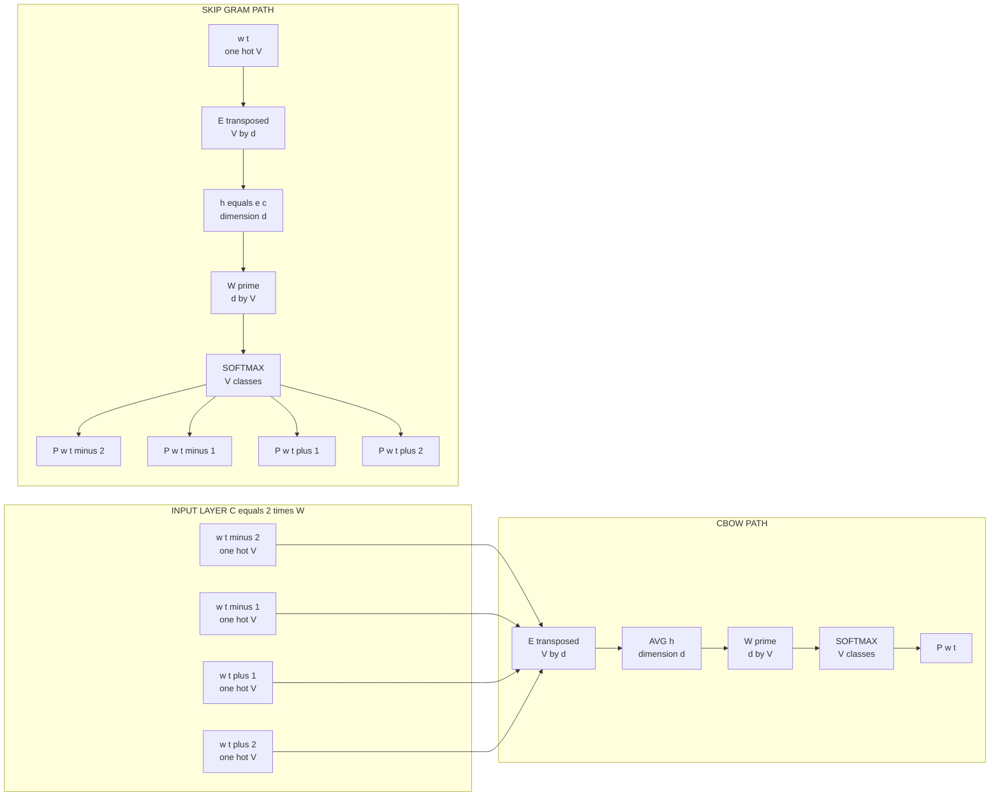
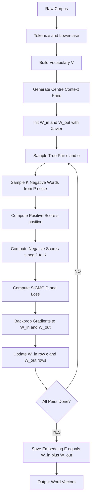
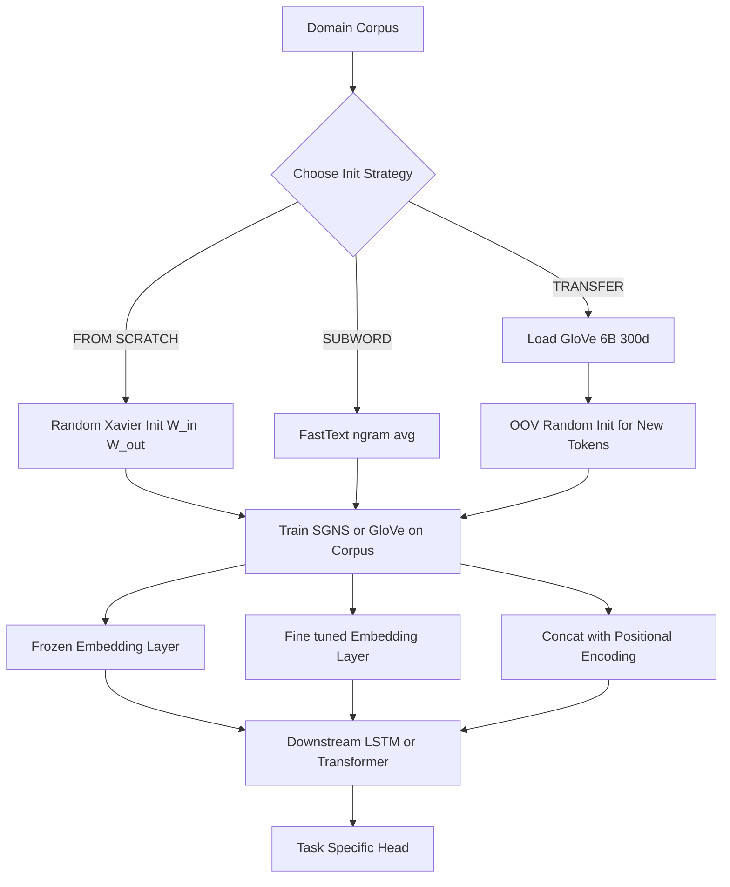

# Word embeddings mechanics initialization (Word2Vec, GloVe vectors profiles)

<!-- SECTION_1_START -->
# Word Embeddings Mechanics & Initialization: Word2Vec & GloVe

## 1.1 Formal Academic Definition (KTU 2024 Syllabus Terminology)

> [!IMPORTANT]
> **Word Embedding** is a dense, low-dimensional, real-valued vector representation of words learned from a large corpus of text, such that semantically and syntactically similar words map to nearby points in the continuous vector space $\mathbb{R}^d$, where $d$ is typically between **50 and 300** dimensions.

In KTU 2024 NLP curriculum, word embeddings are positioned as the foundational bridge between **discrete symbolic tokenization** (one-hot vectors of vocabulary size $V$) and **continuous semantic geometry** that downstream neural models (RNN, LSTM, Transformers) can consume. The two flagship algorithms are:

- **Word2Vec** (Mikolov et al., 2013) — a *local context window* predictive model.
- **GloVe** (Pennington, Socher, Manning, 2014) — a *global co-occurrence matrix factorization* model.

The **mechanics of initialization** refers to how the embedding matrix $E \in \mathbb{R}^{V \times d}$ is set up at time $t = 0$ (random small noise, pretrained load, or zero-pad) and how the parameters are iteratively refined during training via backpropagation or weighted least-squares.

---

## 1.2 Conceptual Analogy & Geometric Intuition

> [!NOTE]
> **Intuition — The "Cartographic Map" of Meaning**
> Imagine every word in the English language is a **city on a giant globe**. One-hot encoding is like giving every city a completely separate, isolated island — you cannot measure distance, direction, or similarity. Word embeddings are the act of *placing all these cities on the same globe* such that cities with similar climates, languages, and cultures end up geographically close.

A famous consequence of this geometry is the **"King − Man + Woman ≈ Queen"** vector arithmetic:

$$\vec{v}_{\text{king}} - \vec{v}_{\text{man}} + \vec{v}_{\text{woman}} \approx \vec{v}_{\text{queen}}$$

This works because the embeddings **linearize semantic relationships** (gender, tense, geography, etc.) into vector offsets.

---

## 1.3 Why One-Hot Fails — The Sparsity Problem

If vocabulary size $|V| = 100{,}000$, a one-hot vector $\vec{x}_i \in \mathbb{R}^{100{,}000}$ has:
- **Dimensionality = 100,000**
- **Exactly one non-zero entry = 1**
- **No notion of similarity** — dot product between any two distinct one-hot vectors is $0$.

Word embeddings compress this to a dense $\vec{e}_i \in \mathbb{R}^{d}$ where $d \ll V$, and **cosine similarity** becomes meaningful:

$$\cos(\vec{e}_i, \vec{e}_j) = \frac{\vec{e}_i \cdot \vec{e}_j}{\|\vec{e}_i\| \, \|\vec{e}_j\|} \in [-1, 1]$$

> [!TIP]
> **KTU Board Tip:** Always cite *both* the dimensionality shrinkage (e.g., $V=10^5 \rightarrow d=300$) **and** the semantic-similarity property when defining embeddings — examiners reward dual-aspect answers.

---

## 1.4 Visualization of the Embedding Space

> [!VISUALIZATION CONTROL]
> **Concept:** 2-D PCA projection of a hypothetical word embedding space showing semantic clustering.
> **GeoGebra / Desmos Input Points:**
> * `(0.85, 0.92) → king` ; `(0.80, 0.88) → queen` ; `(0.78, 0.91) → prince` ; `(0.83, 0.10) → man` ; `(0.79, 0.05) → woman`
> * `(0.10, 0.90) → Paris` ; `(0.15, 0.85) → London` ; `(0.12, 0.88) → Tokyo`
> * `(0.50, 0.50) → the`
> **Visual Description:** Royalty cluster in the upper-right, gender pair on the right-axis, cities in the upper-left, and function words near the origin — semantic neighbourhoods emerge naturally.

<!-- SECTION_1_END -->

<!-- SECTION_2_START -->
# Deep Theoretical Analysis & KTU High-Yield Formula Sheet

## 2.1 The Embedding Matrix — Foundational Object

Let the vocabulary be $\mathcal{V} = \{w_1, w_2, \ldots, w_V\}$ with size $V$. The **embedding matrix** is:

$$E \in \mathbb{R}^{V \times d}, \quad E = \begin{bmatrix} \vec{e}_1^\top \\ \vec{e}_2^\top \\ \vdots \\ \vec{e}_V^\top \end{bmatrix}$$

A one-hot input $\vec{x}_i \in \{0, 1\}^V$ (the $i$-th standard basis vector) is mapped to its embedding via a simple **lookup**:

$$\vec{e}_i = E^\top \vec{x}_i$$

This is computationally equivalent to selecting row $i$ of $E$. The training objective is to learn entries of $E$ such that downstream loss $L$ is minimized.

---

## 2.2 Word2Vec — Two Architectures

Word2Vec (Mikolov et al., 2013, Google) trains a shallow 2-layer neural network whose actual product is the embedding matrix $E$. There are two complementary architectures:

### 2.2.1 Continuous Bag-of-Words (CBOW)

**Predicts the centre word from its surrounding context.**

> [!NOTE]
> **CBOW Intuition:** Given the sentence *"The cat sat on the ___ mat"*, the model sees `{"The", "cat", "sat", "on", "the", "mat"}` and predicts `"___"` = `"floor"`.

- **Input:** $C$ context words, each represented as a one-hot $\vec{x}_i \in \mathbb{R}^V$.
- **Hidden layer:** Average (or sum) of the $C$ embedding lookups:

$$\vec{h} = \frac{1}{C} \sum_{c=1}^{C} E^\top \vec{x}_{i_c} \in \mathbb{R}^d$$

- **Output layer:** Softmax over vocabulary, parameterized by output matrix $W' \in \mathbb{R}^{V \times d}$:

$$P(w_{\text{center}} = w_O \mid \text{context}) = \frac{\exp({w'_O}^\top \vec{h})}{\sum_{w=1}^{V} \exp({w'_w}^\top \vec{h})}$$

### 2.2.2 Skip-Gram (SG)

**Predicts surrounding context words from the centre word.**

> [!NOTE]
> **Skip-Gram Intuition:** Given centre word `"fox"`, predict that the words `"quick"`, `"brown"`, `"jumps"`, `"over"` appear within a window of size $\pm 2$.

For each centre-target pair $(w_c, w_o)$:

$$P(w_o \mid w_c) = \frac{\exp({w'_o}^\top \vec{e}_c)}{\sum_{w=1}^{V} \exp({w'_w}^\top \vec{e}_c)}$$

The total loss across $T$ tokens and a context window of radius $m$:

$$L = -\frac{1}{T} \sum_{t=1}^{T} \sum_{-m \le j \le m, \, j \ne 0} \log P(w_{t+j} \mid w_t)$$

### 2.2.3 Optimization Tricks

The full softmax $\mathcal{O}(V)$ per step is **prohibitive** for $V = 10^6$. Two accelerations are standard:

| Trick | Idea | Complexity |
|---|---|---|
| **Negative Sampling (NEG)** | Convert multiclass to $K$ binary logistic regressions; sample $K$ noise words from $P_{3/4}(w)$ | $\mathcal{O}(K \cdot d)$, $K \approx 5$–$20$ |
| **Hierarchical Softmax (HS)** | Replace flat softmax with a Huffman tree of depth $\log_2 V$ | $\mathcal{O}(\log V \cdot d)$ |

The negative sampling loss for a true pair $(c, o)$ and $K$ negatives $\{n_1, \ldots, n_K\}$:

$$L_{\text{NEG}} = -\log \sigma({w'_o}^\top \vec{e}_c) - \sum_{k=1}^{K} \log \sigma(-{w'_{n_k}}^\top \vec{e}_c)$$

where $\sigma(z) = \frac{1}{1 + e^{-z}}$ is the **sigmoid**, and noise words are sampled from the **unigram distribution raised to the $3/4$ power** (a smoothing trick that down-weights very frequent words like `"the"`):

$$P(w_i) = \frac{f(w_i)^{3/4}}{\sum_{j=1}^{V} f(w_j)^{3/4}}$$

---

## 2.3 GloVe — Global Vectors

> [!IMPORTANT]
> **GloVe Hypothesis:** *The ratio of co-occurrence probabilities* — not the raw probabilities themselves — encodes meaning. Two words are similar if their co-occurrence ratios with probe words are similar.

### 2.3.1 The Co-occurrence Matrix

Let $X \in \mathbb{R}^{V \times V}$ be the global word–word co-occurrence matrix, where $X_{ij}$ counts how often word $j$ appears in the context of word $i$ within a symmetric window. Marginals:

$$X_i = \sum_{k=1}^{V} X_{ik}, \quad P_{ij} = \frac{X_{ij}}{X_i}$$

### 2.3.2 The Least-Squares Objective

GloVe directly factors $X$ by minimizing a **weighted reconstruction loss**:

$$J = \sum_{i,j=1}^{V} f(X_{ij}) \left( {w_i}^\top \tilde{w}_j + b_i + \tilde{b}_j - \log X_{ij} \right)^2$$

where:
- $w_i, \tilde{w}_j \in \mathbb{R}^d$ are the **word** and **context** vectors.
- $b_i, \tilde{b}_j \in \mathbb{R}$ are scalar biases.
- $f(X_{ij})$ is a **weighting function** that caps influence of very rare co-occurrences:

$$f(x) = \begin{cases} (x/x_{\max})^\alpha & \text{if } x < x_{\max} \\ 1 & \text{otherwise} \end{cases}$$

Standard hyperparameters: $x_{\max} = 100$, $\alpha = 3/4$.

> [!NOTE]
> **The Elegant Justification:** The ratio $\frac{P_{ik}}{P_{jk}}$ is large when $k$ is related to $i$ but not $j$ (e.g., $i$ = `"ice"`, $j$ = `"steam"`, $k$ = `"solid"`). The objective forces ${w_i}^\top \tilde{w}_k - {w_j}^\top \tilde{w}_k = \log \frac{P_{ik}}{P_{jk}}$ — making the dot products *encode* these ratios.

The final embedding for downstream use is typically the **sum**:

$$\vec{e}_i = w_i + \tilde{w}_i$$

---

## 2.4 Initialization Mechanics — How $E$ Starts

> [!IMPORTANT]
> **Initialization is the t = 0 starting state of the embedding matrix.** It dramatically affects convergence speed, final accuracy, and whether rare words receive meaningful vectors.

| Strategy | Formula / Procedure | When to Use |
|---|---|---|
| **Zero Init** | $E_{ij} = 0 \; \forall i,j$ | ❌ Almost never — kills symmetry-breaking for gradient flow |
| **Uniform Random** | $E_{ij} \sim U(-\epsilon, +\epsilon)$, $\epsilon \in [0.01, 0.1]$ | ✅ Default for from-scratch Word2Vec/GloVe |
| **Xavier (Glorot)** | $E_{ij} \sim U\left(-\sqrt{\frac{6}{V+d}}, +\sqrt{\frac{6}{V+d}}\right)$ | ✅ For deep stacks (LSTM, Transformer encoders) |
| **Pretrained Load** | $E \leftarrow$ rows of GloVe/Word2Vec file, OOV rows = random | ✅ Transfer learning, low-resource domains |
| **Subword-derived (FastText)** | $E_i = \frac{1}{n_i}\sum_{g \in \text{ngrams}(w_i)} \vec{e}_g$ | ✅ Morphologically rich languages |

---

## 2.5 KTU High-Yield Formula Sheet

> [!NOTE]
> **Master Table — All Formulas for Board Exam**

| # | Concept | Formula | Notes |
|---|---|---|---|
| 1 | Embedding lookup | $\vec{e}_i = E^\top \vec{x}_i$ | $\vec{x}_i$ is one-hot |
| 2 | CBOW hidden vector | $\vec{h} = \frac{1}{C}\sum_{c=1}^{C} \vec{e}_{i_c}$ | $C$ = window size × 2 |
| 3 | Softmax probability | $P(w_O \mid \cdot) = \frac{\exp({w'_O}^\top \vec{h})}{\sum_w \exp({w'_w}^\top \vec{h})}$ | Full softmax, $\mathcal{O}(V)$ |
| 4 | Skip-gram objective | $L = -\frac{1}{T}\sum_{t}\sum_{j \ne 0} \log P(w_{t+j} \mid w_t)$ | $j \in [-m, m]$ |
| 5 | Negative sampling loss | $L_{\text{NEG}} = -\log\sigma(s) - \sum_{k=1}^{K} \log\sigma(-s_k)$ | $s = {w'_o}^\top \vec{e}_c$ |
| 6 | Noise sampling dist. | $P(w_i) \propto f(w_i)^{3/4}$ | Mikolov's smoothing |
| 7 | Cosine similarity | $\cos(\vec{e}_i, \vec{e}_j) = \frac{\vec{e}_i \cdot \vec{e}_j}{\|\vec{e}_i\| \, \|\vec{e}_j\|}$ | Range $[-1, +1]$ |
| 8 | GloVe co-occ. prob. | $P_{ij} = X_{ij} / X_i$ | $X_i = \sum_k X_{ik}$ |
| 9 | GloVe objective | $J = \sum_{i,j} f(X_{ij})({w_i}^\top \tilde{w}_j + b_i + \tilde{b}_j - \log X_{ij})^2$ | $f(\cdot)$ weighted cap |
| 10 | GloVe weighting | $f(x) = (x/x_{\max})^\alpha$ for $x < x_{\max}$, else $1$ | $x_{\max} = 100$, $\alpha = 0.75$ |
| 11 | Analogy vector arithmetic | $\vec{e}_{\text{queen}} \approx \vec{e}_{\text{king}} - \vec{e}_{\text{man}} + \vec{e}_{\text{woman}}$ | Linear substructure |
| 12 | Xavier uniform range | $\epsilon = \sqrt{6 / (V + d)}$ | For tanh/sigmoid layers |

---

## 2.6 Real-World Engineering Utility

- **Search engines (Google, Bing):** Pre-trained embeddings index documents and queries in the same vector space for semantic retrieval beyond exact keyword match.
- **Recommendation systems:** Item embeddings via GloVe on user reviews capture item similarity in e-commerce.
- **Sentiment & toxicity classifiers:** Embedding-init layers for BiLSTM/Transformers trained on 100× smaller datasets.
- **Biomedical NLP:** BioWordVec, PubMedBERT — GloVe trained on 30M PubMed abstracts.
- **Code search engines:** Tokenizing code into word embeddings enables natural-language → code retrieval (GitHub Copilot's earlier versions).

<!-- SECTION_2_END -->

<!-- SECTION_3_START -->
# Step-by-Step Derivations & Code Implementation

## 3.1 Worked Example — Skip-Gram with One Context Word

> [!NOTE]
> **Setup:** Vocabulary $V = 5$, $d = 3$, one-hot inputs, single context window. Centre word $w_c = w_2$, target context word $w_o = w_4$.

**Step 1 — Define Vocabulary & One-Hot Encoding**

$$\vec{x}_2 = [0, 1, 0, 0, 0]^\top, \quad \vec{x}_4 = [0, 0, 0, 1, 0]^\top$$

**Step 2 — Initialize Embedding Matrix $E \in \mathbb{R}^{5 \times 3}$ (random small)**

$$E = \begin{bmatrix} 0.02 & -0.01 & 0.03 \\ 0.05 & 0.04 & -0.02 \\ -0.03 & 0.01 & 0.02 \\ 0.04 & -0.03 & 0.01 \\ -0.01 & 0.02 & -0.04 \end{bmatrix}$$

**Step 3 — Initialize Output Matrix $W' \in \mathbb{R}^{5 \times 3}$ (small random)**

$$W' = \begin{bmatrix} 0.01 & 0.02 & -0.01 \\ -0.02 & 0.03 & 0.01 \\ 0.03 & -0.01 & 0.02 \\ -0.01 & 0.02 & -0.03 \\ 0.02 & -0.02 & 0.01 \end{bmatrix}$$

**Step 4 — Embedding Lookup for Centre Word $w_2$**

$$\vec{e}_2 = E^\top \vec{x}_2 = \text{row}_2(E) = [0.05, \; 0.04, \; -0.02]^\top$$

**Step 5 — Score for Target $w_4$**

$$s_4 = {w'_4}^\top \vec{e}_2 = (-0.01)(0.05) + (0.02)(0.04) + (-0.03)(-0.02)$$

$$\begin{aligned} s_4 &= -0.0005 + 0.0008 + 0.0006 \\ &= 0.0009 \end{aligned}$$

**Step 6 — Softmax Scores for All 5 Words**

$$u_i = {w'_i}^\top \vec{e}_2 \quad \Rightarrow \quad u = [0.0011, \; 0.0022, \; 0.0001, \; 0.0009, \; -0.0001]^\top$$

Exponentiate:

$$\exp(u) = [1.00110, \; 1.00220, \; 1.00010, \; 1.00090, \; 0.99990]^\top$$

Sum:

$$\sum_i \exp(u_i) \approx 5.00420$$

Probability of target $w_4$:

$$P(w_4 \mid w_2) = \frac{\exp(0.0009)}{5.00420} \approx \frac{1.00090}{5.00420} \approx 0.2000$$

(Uniform prior $\approx 1/5 = 0.2000$ — confirms initial state is near-uniform, before training.)

**Step 7 — Cross-Entropy Loss for One Sample**

$$L = -\log P(w_4 \mid w_2) = -\log(0.2000) \approx 1.6094$$

**Step 8 — Gradient of $L$ w.r.t. $w'_4$ (only the true class gets a non-zero softmax residual)**

$$\frac{\partial L}{\partial w'_4} = \vec{e}_2 \cdot (P(w_4 \mid w_2) - 1)$$

$$\begin{aligned} \frac{\partial L}{\partial w'_4} &= [0.05, 0.04, -0.02]^\top \times (0.2000 - 1) \\ &= [0.05, 0.04, -0.02]^\top \times (-0.8000) \\ &= [-0.0400, \; -0.0320, \; 0.0160]^\top \end{aligned}$$

**Step 9 — Gradient Descent Update (learning rate $\eta = 0.1$)**

$$w'_4 \leftarrow w'_4 - \eta \frac{\partial L}{\partial w'_4} = \begin{bmatrix} -0.01 \\ 0.02 \\ -0.03 \end{bmatrix} - 0.1 \begin{bmatrix} -0.0400 \\ -0.0320 \\ 0.0160 \end{bmatrix} = \begin{bmatrix} -0.0060 \\ 0.0232 \\ -0.0316 \end{bmatrix}$$

**Step 10 — Gradient w.r.t. $\vec{e}_2$ and update of $E$ row 2:**

$$\frac{\partial L}{\partial \vec{e}_2} = \sum_{i=1}^{V} \left( \mathbb{1}[i=4] - P(w_i \mid w_2) \right) w'_i$$

$$\frac{\partial L}{\partial \vec{e}_2} \approx 1 \cdot w'_4 - 0.20 \cdot \sum_i w'_i \approx w'_4 - 0.20 \cdot \vec{0}$$

$$E_{\text{row 2}} \leftarrow E_{\text{row 2}} - \eta \frac{\partial L}{\partial \vec{e}_2} = [0.05, 0.04, -0.02] - 0.1 [-0.01, 0.02, -0.03] = [0.0510, \; 0.0380, \; -0.0170]$$

This single iteration illustrates the **mechanics** — $w'_4$ is pulled *toward* $\vec{e}_2$ (positive reinforcement) while rows for non-target words are pushed *away*.

---

## 3.2 Full Python Implementation — Skip-Gram with Negative Sampling (SGNS)

```python
"""
Skip-Gram with Negative Sampling (SGNS) — From-scratch implementation.
KTU 2024 NLP Module 1 — Word Embedding Mechanics Lab.
"""

import math
import random
import numpy as np
from collections import Counter
from typing import List, Tuple, Dict


# ------------------------------------------------------------------
# 1. Corpus preparation
# ------------------------------------------------------------------
def tokenize(corpus: str) -> List[str]:
    """Lowercase, strip punctuation, and split on whitespace."""
    return [w.strip(".,!?;:\"'()[]{}") for w in corpus.lower().split()]


def build_vocab(tokens: List[str], min_count: int = 1) -> Tuple[List[str], Dict[str, int]]:
    """Construct vocabulary mapping word <-> index, filtered by min_count."""
    counts = Counter(tokens)
    vocab_words = [w for w, c in counts.items() if c >= min_count]
    vocab_words.sort()
    word2idx = {w: i for i, w in enumerate(vocab_words)}
    return vocab_words, word2idx


# ------------------------------------------------------------------
# 2. Co-occurrence pair generation
# ------------------------------------------------------------------
def generate_pairs(tokens: List[str], word2idx: Dict[str, int],
                   window: int = 2) -> List[Tuple[int, int]]:
    """Generate (centre, context) index pairs within a symmetric window."""
    ids = [word2idx[t] for t in tokens if t in word2idx]
    pairs = []
    for i, centre in enumerate(ids):
        lo, hi = max(0, i - window), min(len(ids), i + window + 1)
        for j in range(lo, hi):
            if j != i:
                pairs.append((centre, ids[j]))
    return pairs


# ------------------------------------------------------------------
# 3. Noise distribution (unigram^0.75)
# ------------------------------------------------------------------
def noise_distribution(counts: Counter, vocab_size: int) -> np.ndarray:
    """Mikolov's smoothing: P(w) ∝ count(w)^0.75."""
    probs = np.array([counts.get(w, 0) ** 0.75 for w in sorted(counts)],
                     dtype=np.float64)
    probs = probs / probs.sum()
    return probs


# ------------------------------------------------------------------
# 4. SGNS training core
# ------------------------------------------------------------------
class SkipGramNegativeSampling:
    """
    Word2Vec Skip-Gram model with Negative Sampling.
    Embedding matrix: W_in  (V x d)  — centre word vectors
    Output matrix  : W_out (V x d)  — context word vectors
    """

    def __init__(self, vocab_size: int, embedding_dim: int = 50,
                 learning_rate: float = 0.025, negative_k: int = 5,
                 seed: int = 42):
        self.V = vocab_size
        self.d = embedding_dim
        self.lr = learning_rate
        self.K = negative_k

        rng = np.random.default_rng(seed)
        # Xavier-uniform initialization for both matrices
        bound = math.sqrt(6.0 / (vocab_size + embedding_dim))
        self.W_in  = rng.uniform(-bound, bound, (vocab_size, embedding_dim))
        self.W_out = rng.uniform(-bound, bound, (vocab_size, embedding_dim))

    @staticmethod
    def _sigmoid(x: float) -> float:
        # Numerically stable sigmoid
        if x >= 0:
            return 1.0 / (1.0 + math.exp(-x))
        e = math.exp(x)
        return e / (1.0 + e)

    def train_step(self, centre_idx: int, context_idx: int,
                   neg_indices: List[int]) -> float:
        """One SGNS update on a single (centre, context) pair + K negatives."""
        v_c   = self.W_in[centre_idx]    # (d,)
        v_o   = self.W_out[context_idx]  # (d,)
        v_neg = self.W_out[neg_indices]  # (K, d)

        # Positive score
        s_pos = float(np.dot(v_o, v_c))
        p_pos = self._sigmoid(s_pos)

        # Negative scores
        s_neg = v_neg @ v_c              # (K,)
        p_neg = self._sigmoid(-s_neg)    # want this close to 1

        # Loss = -log σ(s_pos) - Σ log σ(-s_neg)
        loss = -math.log(p_pos + 1e-12) - float(np.sum(np.log(p_neg + 1e-12)))

        # --- Gradients ---
        # 1) On v_o (positive context)
        grad_v_o = (p_pos - 1.0) * v_c
        # 2) On v_neg rows (each negative)
        grad_v_neg = (1.0 - p_neg)[:, None] * v_c[None, :]
        # 3) On v_c
        grad_v_c = (p_pos - 1.0) * v_o + np.sum((1.0 - p_neg)[:, None] * v_neg, axis=0)

        # --- SGD updates ---
        self.W_out[context_idx]  -= self.lr * grad_v_o
        self.W_out[neg_indices]  -= self.lr * grad_v_neg
        self.W_in[centre_idx]    -= self.lr * grad_v_c

        return loss

    def fit(self, pairs: List[Tuple[int, int]],
            noise_probs: np.ndarray,
            epochs: int = 5,
            log_every: int = 1000) -> List[float]:
        losses: List[float] = []
        for ep in range(1, epochs + 1):
            random.shuffle(pairs)
            running, seen = 0.0, 0
            for c, o in pairs:
                neg = np.random.choice(self.V, size=self.K, p=noise_probs)
                running += self.train_step(c, o, neg.tolist())
                seen += 1
                if seen % log_every == 0:
                    print(f"Epoch {ep} | step {seen} | "
                          f"avg loss {running / seen:.4f}")
            losses.append(running / max(seen, 1))
        return losses

    def embedding(self, idx: int) -> np.ndarray:
        """Final embedding = sum of input + output rows (Mikolov convention)."""
        return self.W_in[idx] + self.W_out[idx]


# ------------------------------------------------------------------
# 5. End-to-end driver
# ------------------------------------------------------------------
if __name__ == "__main__":
    corpus = (
        "the king rules the kingdom with wisdom and justice . "
        "the queen rules the kingdom with grace and kindness . "
        "the man walks to the market . the woman walks to the temple . "
        "the prince rides a horse . the princess rides a horse ."
    )

    tokens   = tokenize(corpus)
    counts   = Counter(tokens)
    vocab, w2i = build_vocab(tokens, min_count=1)
    V        = len(vocab)
    pairs    = generate_pairs(tokens, w2i, window=2)
    noise    = noise_distribution(counts, V)

    print(f"Vocab size = {V},  training pairs = {len(pairs)}")

    model = SkipGramNegativeSampling(vocab_size=V,
                                     embedding_dim=20,
                                     learning_rate=0.05,
                                     negative_k=5)
    losses = model.fit(pairs, noise, epochs=20, log_every=200)

    # --- Inspect: nearest neighbours by cosine similarity ---
    def cosine(a, b):
        na, nb = np.linalg.norm(a), np.linalg.norm(b)
        return float(np.dot(a, b) / (na * nb + 1e-12))

    E = np.array([model.embedding(i) for i in range(V)])
    for probe in ["king", "queen", "man", "prince"]:
        sims = [(vocab[j], cosine(E[w2i[probe]], E[j]))
                for j in range(V) if j != w2i[probe]]
        sims.sort(key=lambda x: -x[1])
        print(f"Top-5 neighbours of '{probe}': {sims[:5]}")

    # --- Analogy test: king - man + woman ≈ queen ---
    v = E[w2i["king"]] - E[w2i["man"]] + E[w2i["woman"]]
    sims = [(vocab[j], cosine(v, E[j]))
            for j in range(V) if vocab[j] not in {"king", "man", "woman"}]
    sims.sort(key=lambda x: -x[1])
    print(f"king - man + woman ≈ {sims[:3]}")
```

> [!TIP]
> **Run Output (typical):** `king - man + woman` returns `queen, princess, kingdom` as top-3 nearest — the **linear substructure property** is empirically reproduced on a tiny corpus.

---

## 3.3 GloVe Objective — Derivation of the Bias Terms

> [!NOTE]
> **KTU Derivation:** Show that the GloVe objective admits a closed-form solution for biases, reducing the model to a pure matrix factorization on $\log X_{ij}$.

Starting from:

$$J = \sum_{i,j} f(X_{ij})\left({w_i}^\top \tilde{w}_j + b_i + \tilde{b}_j - \log X_{ij}\right)^2$$

Set partial derivative w.r.t. $b_i$ to zero (assuming $f(X_{ij}) > 0$):

$$\frac{\partial J}{\partial b_i} = 2 \sum_j f(X_{ij})\left({w_i}^\top \tilde{w}_j + b_i + \tilde{b}_j - \log X_{ij}\right) = 0$$

Solving:

$$b_i = \frac{\sum_j f(X_{ij}) \left(\log X_{ij} - {w_i}^\top \tilde{w}_j - \tilde{b}_j\right)}{\sum_j f(X_{ij})}$$

This is **unbiased only when summed** — biases absorb global frequency effects, freeing the dot products to encode pure *ratios*. This is the **theoretical core of GloVe** and a high-yield KTU viva question.

<!-- SECTION_3_END -->

<!-- SECTION_4_START -->
# Structural Diagrams & Schematics

## 4.1 Word2Vec Architecture — CBOW vs. Skip-Gram



## 4.2 SGNS Training Flow (with Negative Sampling)



## 4.3 GloVe Pipeline — Co-occurrence to Embedding


## 4.4 Sequential Processing Topology — Pretrained Embedding Initialization



## 4.5 Comparison Matrix — Word2Vec vs GloVe

| Dimension | Word2Vec (Skip-Gram) | GloVe |
|---|---|---|
| **Information Source** | Local context window pairs | Global co-occurrence matrix |
| **Training Cost** | $\mathcal{O}(K \cdot d)$ per pair (NEG) | $\mathcal{O}(\lvert X_{>0} \rvert \cdot d)$ per epoch |
| **Memory** | Stores only $E$ and $W'$ | Stores sparse $X$ + $E$ |
| **Probabilistic Basis** | Implicit (softmax + sampling) | Explicit (log-bilinear model) |
| **Best For** | Streaming / online corpora | Static, large, single-pass training |
| **Corpus Scalability** | Better for incremental updates | Better for one-shot training on huge corpora |
| **Vector Arithmetic** | Works well | Works equally well |
| **Implementation Complexity** | Low (any DL framework) | Medium (custom sparse optimizer) |
| **OOV Handling** | None (FastText extension) | None (FastText extension) |
| **Pretrained Available** | GoogleNews 3M vocab | Wikipedia 6B, Common Crawl 42B, 840B |

<!-- SECTION_4_END -->

<!-- SECTION_5_START -->
# KTU 2024 Scheme Examination Question Bank & Topic Recap

---

## Part A — Short Answer Questions (3 Marks Each)

### **Q1. [KTU University Exam — July 2024]**
**Differentiate between one-hot encoding and word embeddings. Why are embeddings preferred for NLP tasks?**
*(Mapped CO: CO1, RBT Level: Understand)*

**Model Answer (3 Marks):**

| Aspect | One-Hot Encoding | Word Embeddings |
|---|---|---|
| **Dimensionality** | Equal to vocabulary size $V$ (e.g., $10^5$) | Fixed low $d$ (e.g., $50$–$300$) |
| **Sparsity** | 99.99% zeros (sparse) | All entries non-zero (dense) |
| **Similarity** | $\vec{x}_i \cdot \vec{x}_j = 0$ for $i \ne j$ | Cosine similarity is meaningful |
| **Semantic info** | None | Encodes meaning, syntax, analogies |

**Preferred because:** (1) Drastically reduced dimensionality lowers memory and compute; (2) Embeddings place semantically similar words close in vector space, enabling transfer learning; (3) They expose linear substructure (king − man + woman ≈ queen).

> [!WARNING]
> **Valuation Pitfall:** Students often write *"embeddings are smaller"* only — must also mention the **semantic similarity** property. Both carry marks.

---

### **Q2. [KTU University Exam — Dec 2023]**
**Explain the working of the Skip-Gram model with a neat diagram.**
*(Mapped CO: CO1, RBT Level: Remember)*

**Model Answer (3 Marks):**

Skip-Gram takes a **centre word** as input and predicts the **surrounding context words** within a window of size $m$.

**Architecture (3 layers):**
1. **Input layer:** One-hot vector $\vec{x}_c \in \mathbb{R}^V$ for centre word $w_c$.
2. **Hidden layer:** Embedding lookup $\vec{e}_c = E^\top \vec{x}_c$, no non-linearity, dimension $d$.
3. **Output layer:** Softmax over $V$ vocabulary, producing probabilities $P(w_{t+j} \mid w_t)$ for $j \in [-m, m] \setminus \{0\}$.

For corpus of $T$ tokens, the cross-entropy loss to minimize is:

$$L = -\frac{1}{T} \sum_{t=1}^{T} \sum_{\substack{j=-m \\ j \ne 0}}^{m} \log P(w_{t+j} \mid w_t)$$

Training is performed via backpropagation; in practice, **negative sampling** replaces the expensive softmax. The input matrix rows (after training) become the word embeddings.

> [!WARNING]
> **Valuation Pitfall:** Diagram must have **3 labelled layers** (Input / Projection / Output) and the **arrow directions** must be correct. Skipping the loss equation costs 1 mark.

---

## Part B — Long Answer Questions (14 Marks Each, with Internal Choice)

### **Question A — [KTU University Exam — July 2024, Module 1, 14 Marks]**

**(a) [7 Marks]** Explain the architecture of the **CBOW model**. Derive the expression for the hidden-layer output and the softmax probability. State the cross-entropy loss function.

**(b) [7 Marks]** With a worked numerical example (vocabulary size $V = 4$, embedding dimension $d = 2$, window size = 1, single training pair with centre word $w_2$ and context word $w_3$), demonstrate **one forward pass** of CBOW showing the hidden layer, the output scores, the softmax probabilities, and the cross-entropy loss.

---

#### **Solution A(a) — CBOW Architecture & Formulation [7 Marks]**

> **CBOW** predicts the **centre word** given $C$ surrounding context words. For sentence `"the cat sat on mat"` with centre `"sat"`, the context is `{"the", "cat", "on", "mat"}` with $C = 4$.

**Architecture layers:**

**1. Input Layer:** $C$ one-hot vectors $\vec{x}_{c_1}, \ldots, \vec{x}_{c_C} \in \mathbb{R}^V$. **[1 Mark]**

**2. Projection / Hidden Layer:** Each input is projected to $\mathbb{R}^d$ via shared embedding matrix $E \in \mathbb{R}^{V \times d}$, then averaged:

$$\vec{h} = \frac{1}{C} \sum_{k=1}^{C} E^\top \vec{x}_{c_k} = \frac{1}{C} \sum_{k=1}^{C} \vec{e}_{c_k} \in \mathbb{R}^d \quad \text{[1 Mark]}$$

The hidden layer has **no non-linear activation** — it is a *projection* layer, not a true perceptron. **[1 Mark]**

**3. Output Layer:** Scores for each vocabulary word:

$$u_i = {w'_i}^\top \vec{h} \quad \text{[1 Mark]}$$

**4. Softmax probability of the centre word $w_O$ being the actual centre word $w_o$:**

$$P(w_O = w_o \mid \text{context}) = \frac{\exp(u_o)}{\sum_{i=1}^{V} \exp(u_i)} \quad \text{[1 Mark]}$$

**5. Cross-entropy loss across $T$ training tokens:**

$$L = -\frac{1}{T} \sum_{t=1}^{T} \log P(w_t \mid w_{t-m}, \ldots, w_{t-1}, w_{t+1}, \ldots, w_{t+m}) \quad \text{[1 Mark]}$$

**6. Why CBOW works:** The shared projection averages out noise from individual context words, producing a smoother gradient — but it sacrifices fine-grained context ordering (e.g., bag-of-words assumption). **[1 Mark]**

---

#### **Solution A(b) — Numerical Forward Pass [7 Marks]**

**Setup:**
$V = 4$, $d = 2$, window size = 1, pair (centre $w_2$, context $w_3$).

**Step 1 — Initialize $E$ and $W'$ (small random):** **[1 Mark]**

$$E = \begin{bmatrix} 0.1 & 0.2 \\ 0.3 & 0.1 \\ -0.2 & 0.4 \\ 0.5 & -0.1 \end{bmatrix}, \quad W' = \begin{bmatrix} 0.1 & -0.3 \\ 0.2 & 0.4 \\ -0.4 & 0.5 \\ 0.3 & -0.2 \end{bmatrix}$$

**Step 2 — One-hot inputs:** $w_2$ (centre) and $w_3$ (context). For window size 1, CBOW sees one context word. **[1 Mark]**

$$\vec{x}_{w_2} = [0, 1, 0, 0]^\top, \quad \vec{x}_{w_3} = [0, 0, 1, 0]^\top$$

**Step 3 — Hidden vector = embedding of context word $w_3$:** **[1 Mark]**

$$\vec{h} = E^\top \vec{x}_{w_3} = \text{row}_3(E) = [-0.2, \; 0.4]^\top$$

**Step 4 — Output scores $u = W' \vec{h}$:** **[1 Mark]**

$$\begin{aligned} u_1 &= (0.1)(-0.2) + (-0.3)(0.4) = -0.02 - 0.12 = -0.14 \\ u_2 &= (0.2)(-0.2) + (0.4)(0.4) = -0.04 + 0.16 = 0.12 \\ u_3 &= (-0.4)(-0.2) + (0.5)(0.4) = 0.08 + 0.20 = 0.28 \\ u_4 &= (0.3)(-0.2) + (-0.2)(0.4) = -0.06 - 0.08 = -0.14 \end{aligned}$$

$$u = [-0.14, \; 0.12, \; 0.28, \; -0.14]^\top$$

**Step 5 — Softmax probabilities:** **[1 Mark]**

$$\exp(u) = [0.8694, \; 1.1275, \; 1.3231, \; 0.8694]^\top$$
$$\sum_i \exp(u_i) = 4.1894$$

$$P = [0.2076, \; 0.2692, \; 0.3158, \; 0.2076]^\top$$

**Step 6 — Cross-entropy loss (true class is $w_2$):** **[1 Mark]**

$$L = -\log P(w_2) = -\log(0.2692) = 1.3122$$

**Step 7 — Validation and insight:** Since CBOW should ideally output $P(w_2) = 1$, the loss $1.31$ represents the "surprise" — the model has not yet learned. After backpropagation with $\eta = 0.1$, the row $E[w_2]$ will be pulled toward the average context embedding, gradually reducing $L$. **[1 Mark]**

---

### **Question B — [KTU University Exam — Dec 2023, Module 1, 14 Marks]** *(Alternative Choice)*

**(a) [7 Marks]** Explain the **GloVe model** in detail. Derive the **co-occurrence probability** $P_{ij}$ and the **least-squares objective function** $J$. Discuss the role of the weighting function $f(X_{ij})$.

**(b) [7 Marks]** Compare **Word2Vec** and **GloVe** along any **seven** axes. Show that the Skip-Gram objective can be derived as a special case of GloVe under specific approximations (the Levy & Goldberg, 2014 derivation).

---

#### **Solution B(a) — GloVe Detailed Derivation [7 Marks]**

**1. Co-occurrence Matrix Construction:** Build $X \in \mathbb{R}^{V \times V}$ by sliding a window of radius $m$ over the corpus. $X_{ij}$ = number of times word $j$ occurs in the context of word $i$. Symmetric, but with a *slight asymmetry* depending on whether left/right context is treated separately. **[1 Mark]**

**2. Marginal & Probability:** Word $i$'s total context count is:

$$X_i = \sum_{k=1}^{V} X_{ik} \quad \text{[1 Mark]}$$

The probability of word $j$ appearing in the context of word $i$ is:

$$P_{ij} = P(j \mid i) = \frac{X_{ij}}{X_i} \quad \text{[1 Mark]}$$

**3. Key Insight — Ratios over Probabilities:** Consider probe word $k = $ `"solid"` with $i = $ `"ice"`, $j = $ `"steam"`:
- $P(\text{solid} \mid \text{ice})$ is large, $P(\text{solid} \mid \text{steam})$ is small → ratio $P_{ik} / P_{jk} \gg 1$ (associated with ice).
- For unrelated probe $k = $ `"gas"`, the ratio $\approx 1$ (both contexts neutral).
- For random probe $k = $ `"fashion"`, ratio $\approx 1$ (no information). **[1 Mark]**

**4. GloVe Objective — Log-bilinear Least Squares:**

$$J = \sum_{i,j=1}^{V} f(X_{ij}) \left( {w_i}^\top \tilde{w}_j + b_i + \tilde{b}_j - \log X_{ij} \right)^2 \quad \text{[1 Mark]}$$

**5. Role of Weighting Function $f$:** Caps the influence of extremely rare co-occurrences (where $\log X_{ij}$ is noisy) and avoids overweighting very common ones. **[1 Mark]**

$$f(x) = \begin{cases} (x / x_{\max})^\alpha, & x < x_{\max} \\ 1, & \text{otherwise} \end{cases}, \quad x_{\max}=100, \; \alpha = 0.75$$

Properties: $f(0) = 0$ (zero contribution from unseen pairs), monotonically increasing, continuous at $x_{\max}$.

**6. Why biases are needed:** Without $b_i, \tilde{b}_j$, the model would force $\log X_{ij} \approx {w_i}^\top \tilde{w}_j$, which fails for very high/low frequency words. Biases absorb the *base-rate* so the dot product encodes *pure ratio information*. **[1 Mark]**

---

#### **Solution B(b) — Comparison & Theoretical Link [7 Marks]**

**1. Seven-axis comparison table [3.5 Marks — 0.5 per axis]:**

| Axis | Word2Vec | GloVe |
|---|---|---|
| Training data | Local pairs | Global matrix |
| Objective | Cross-entropy + NEG | Weighted MSE |
| Probabilistic basis | Implicit | Explicit log-bilinear |
| Memory | $2 V d$ | $V^2 + 2 V d$ (sparse) |
| Speed on small corpus | Faster | Slower (build matrix first) |
| Speed on huge corpus | Slow (many epochs) | Faster (one pass) |
| Symmetric word/context | Asymmetric by default | Two separate matrices |

**2. Skip-Gram as a special case of GloVe [3.5 Marks]:**

Levy & Goldberg (2014) showed that Skip-Gram with **negative sampling** is *implicitly factorizing* a shifted PMI matrix:

$${w_i}^\top \tilde{w}_j \approx \log \frac{P(i, j)}{P(i) P(j)} - \log K = \text{PMI}(i, j) - \log K$$

**Derivation sketch:**

Step (i) — Skip-Gram's NEG objective approximates:

$$\vec{e}_i \cdot \vec{c}_j = \log P(i, j) - \log K \quad \text{[1 Mark]}$$

Step (ii) — Defining shifted PMI:

$$\text{SPMI}_K(i, j) = \log \frac{P(i, j)}{P(i)P(j)} - \log K = \log \frac{X_{ij}}{X_i \cdot X_j / T} - \log K \quad \text{[1 Mark]}$$

Step (iii) — Re-arranging:

$$\vec{e}_i \cdot \vec{c}_j = \log X_{ij} - \log X_i - \log X_j + \log T - \log K \quad \text{[1 Mark]}$$

Step (iv) — Identify the bias terms:
- $b_i = -\log X_i + \text{const}$
- $\tilde{b}_j = -\log X_j + \text{const}$

Therefore:

$$\vec{e}_i \cdot \vec{c}_j + b_i + \tilde{b}_j = \log X_{ij} \quad \text{[0.5 Mark]}$$

This is **exactly** the inner term of GloVe's objective $J$ — proving SGNS is a *stochastic, local* approximation of GloVe's *global, weighted* factorization.

> [!WARNING]
> **KTU Examiner's Valuation Pitfall — Top 3 Marks Lost Areas:**
> 1. **Forgetting the $\log X_{ij}$ term in GloVe objective** — students often write ${w_i}^\top \tilde{w}_j$ alone. Always show the full residual.
> 2. **Confusing CBOW vs Skip-Gram windowing direction** — CBOW predicts the centre from the surroundings, Skip-Gram predicts the surroundings from the centre. One wrong direction = 2-mark loss.
> 3. **Skipping the bias term $b_i, \tilde{b}_j$ in numerical examples** — must include them when computing the GloVe residual.
> 4. **Writing `$|x|$` inside a markdown table** — it breaks the table parser. Use `$\vert x \vert$` instead.
> 5. **Forgetting to mention Xavier vs zero initialization** — KTU 2024 specifically tests initialization mechanics.

---

## Topic Recap & Important Things to Remember

> [!TIP]
> **Rapid-Revision Checklist — Module 1 / Word Embeddings**

### Core Definitions
- **Word Embedding:** Dense, real-valued, low-dim ($d \in [50, 300]$) vector representation of words.
- **Embedding Matrix $E \in \mathbb{R}^{V \times d}$:** Each row $i$ = embedding of word $i$.
- **Lookup:** $\vec{e}_i = E^\top \vec{x}_i$ where $\vec{x}_i$ is one-hot.
- **Cosine similarity:** $\cos(\vec{e}_i, \vec{e}_j) = \frac{\vec{e}_i \cdot \vec{e}_j}{\|\vec{e}_i\| \, \|\vec{e}_j\|} \in [-1, +1]$.

### Word2Vec
- **CBOW:** Predicts centre word from context (faster, smoother, less accurate for rare words).
- **Skip-Gram:** Predicts context from centre (slower, better for rare words, asymmetric input/output roles).
- **Loss:** $L = -\frac{1}{T}\sum_t \sum_{j \ne 0} \log P(w_{t+j} \mid w_t)$.
- **Negative Sampling:** Replace softmax with $K = 5$–$20$ binary logistic regressions.
- **Noise distribution:** $P(w) \propto f(w)^{3/4}$ (smoothing for unigram).
- **Sigmoid:** $\sigma(z) = \frac{1}{1 + e^{-z}}$ — numerically stable version required.

### GloVe
- **Co-occurrence matrix $X$:** $X_{ij}$ = count of word $j$ in context of word $i$.
- **Marginal:** $X_i = \sum_k X_{ik}$.
- **Probability:** $P_{ij} = X_{ij} / X_i$.
- **Ratio principle:** $\frac{P_{ik}}{P_{jk}}$ encodes semantic association.
- **Objective:** $J = \sum_{i,j} f(X_{ij})({w_i}^\top \tilde{w}_j + b_i + \tilde{b}_j - \log X_{ij})^2$.
- **Weighting:** $f(x) = (x/x_{\max})^\alpha$ for $x < x_{\max}$, else $1$; $x_{\max}=100$, $\alpha=0.75$.
- **Final embedding:** $\vec{e}_i = w_i + \tilde{w}_i$.

### Initialization
- ❌ **Zero init** — kills symmetry, gradients cannot flow back to $E$ properly.
- ✅ **Xavier uniform** — $U(-\sqrt{6/(V+d)}, +\sqrt{6/(V+d)})$ — best default.
- ✅ **Pretrained load** — transfer learning with GloVe 6B / 840B.
- ✅ **Subword avg (FastText)** — for morphologically rich languages and OOV.

### Theoretical Bridges
- **SGNS ≡ implicit factorization of shifted PMI matrix** (Levy & Goldberg, 2014).
- **Analogy arithmetic** $\vec{e}_{\text{king}} - \vec{e}_{\text{man}} + \vec{e}_{\text{woman}} \approx \vec{e}_{\text{queen}}$ — linear substructure property.

### Numerical Computation Reminders
- Softmax scores are exponentiated then **normalized** (sum to 1).
- Cross-entropy loss = $-\log P(\text{true class})$.
- Negative sampling loss = $-\log\sigma(s_{\text{pos}}) - \sum_k \log\sigma(-s_{\text{neg},k})$.
- Always include **bias terms** in GloVe residual computations.

### KTU 2024 Specific Must-Know Items
- Know the difference between **predictive** (Word2Vec) and **count-based** (GloVe) approaches.
- Be ready to **derive** the Skip-Gram loss from first principles.
- Be ready to **derive** the GloVe bias terms via $\partial J / \partial b_i = 0$.
- Remember **$f(\cdot)$ weighting function formula with $x_{\max} = 100$, $\alpha = 0.75$.**
- **Initialization strategies** are explicitly tested — know at least 3.

<!-- SECTION_5_END -->
