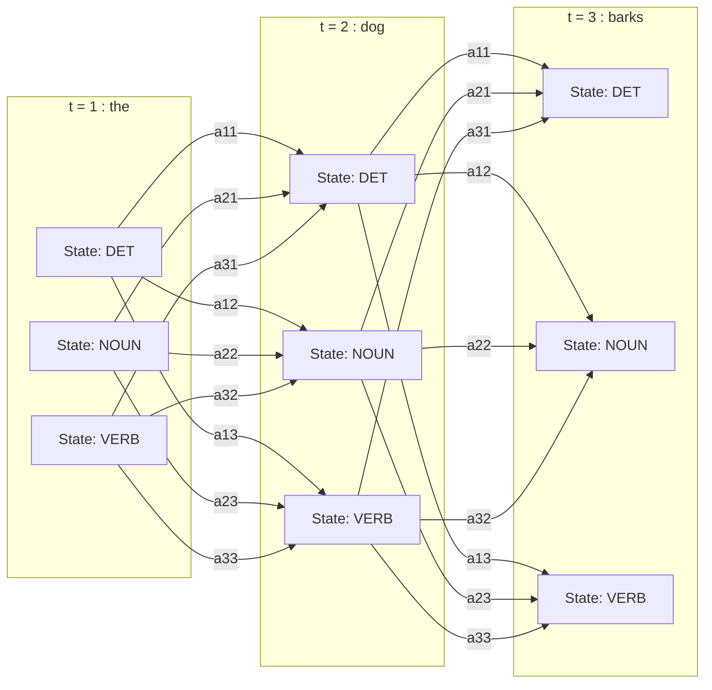
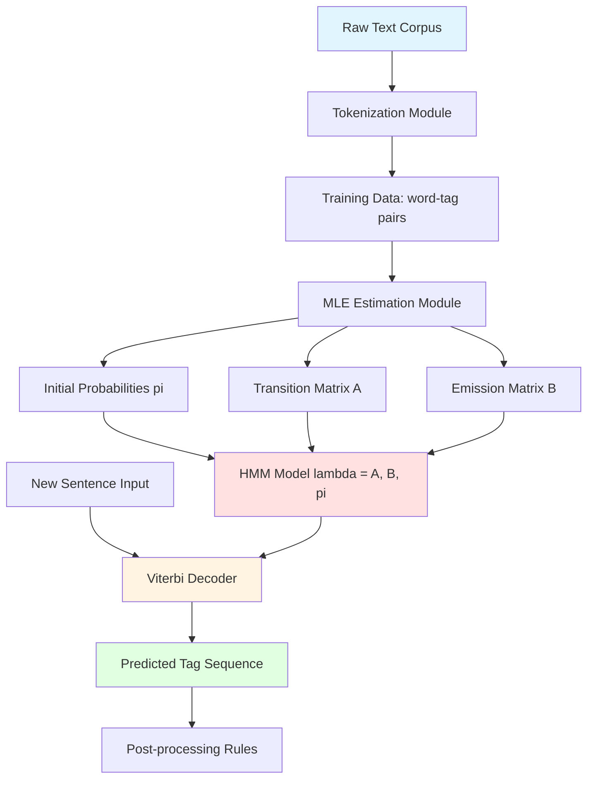
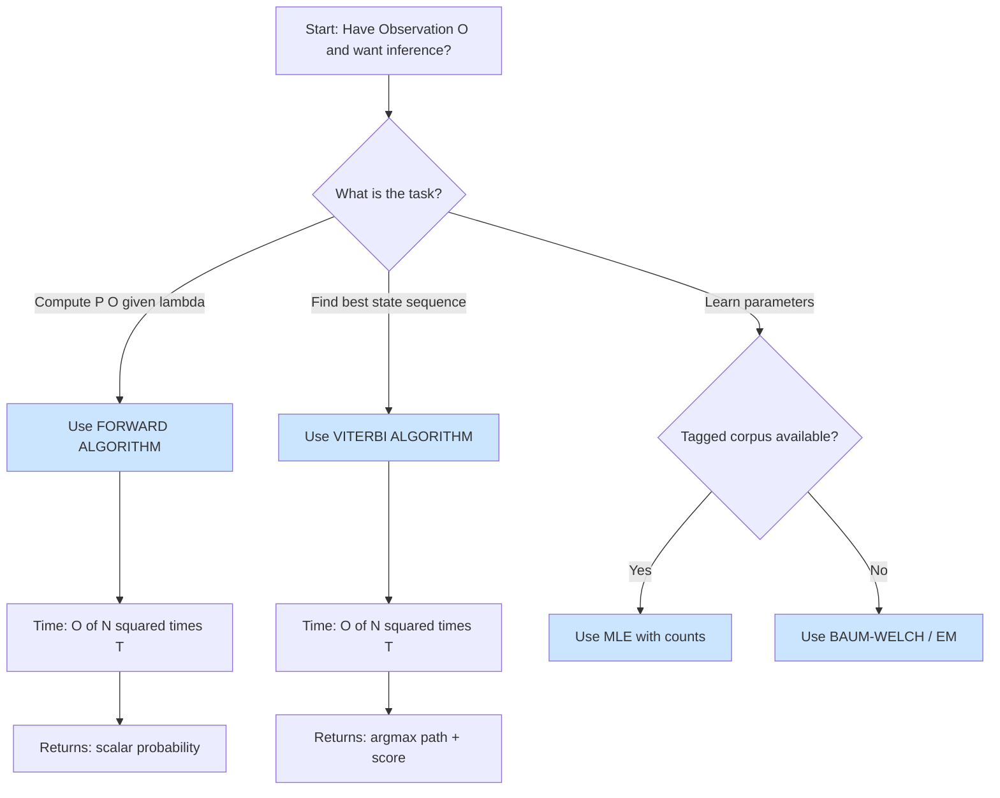

# Hidden Markov Models

<!-- SECTION_1_START -->
# Hidden Markov Models (HMM) — Core Technical Definition & Intuitive Overview

## 1. Formal Academic Definition

A **Hidden Markov Model (HMM)** is a statistical sequence model in which the system being modeled is assumed to be a **Markov process with unobserved (hidden) states**. It is formally defined as a quintuple $(S, O, A, B, \pi)$ where:

- $S = \{s_1, s_2, \ldots, s_N\}$ is the finite set of $N$ **hidden states** (e.g., POS tags: Noun, Verb, Adjective).
- $O = \{o_1, o_2, \ldots, o_T\}$ is the sequence of $T$ **observed symbols** (e.g., words in a sentence).
- $A = \{a_{ij}\}$ is the **state transition probability matrix**, where $a_{ij} = P(q_{t+1} = s_j \mid q_t = s_i)$ for $1 \le i, j \le N$.
- $B = \{b_{jk}\}$ is the **emission (observation) probability matrix**, where $b_{jk} = P(o_t = v_k \mid q_t = s_j)$ for $1 \le j \le N$ and $1 \le k \le M$ (where $M$ is vocabulary size).
- $\pi = \{\pi_i\}$ is the **initial state distribution**, where $\pi_i = P(q_1 = s_i)$.

> [!IMPORTANT]
> In POS tagging using HMM, the **words are observable** but the **POS tags are hidden**. We observe the sentence "The dog barks" and must infer the hidden tag sequence (Determiner → Noun → Verb).

## 2. Conceptual Analogy / Intuition

Imagine a **weather guessing game**:
- A person is locked in a room. We cannot see the weather (Sunny, Rainy, Cloudy) — these are the **hidden states**.
- Each day, this person comes out wearing attire — shorts, umbrella, jacket — these are **observable symbols**.
- Their clothing choice **depends on** the hidden weather, and the weather tomorrow **depends on** today's weather (Markov property).
- We see a sequence of clothing and try to **guess the most likely sequence of weather** (Decoding/Viterbi).

> [!NOTE]
> **Markov Property (First-Order):** The future state depends *only* on the current state, not on the entire history. Formally: $P(q_{t+1} \mid q_1, \ldots, q_t) = P(q_{t+1} \mid q_t)$.

## 3. Why HMM is Critical for POS Tagging

> [!IMPORTANT]
> HMMs dominated statistical NLP for nearly two decades (1990s–2010s) and remain foundational. They power speech recognition, gene-finding in bioinformatics, and historically, **POS taggers like the TnT tagger** that set benchmark performance before neural methods.

**Physical constants / Standard metrics** in **bold**:
- A typical English POS tagger uses **N = 45–48 Penn Treebank tags**.
- A well-trained HMM tagger achieves **accuracy of ~95–97%** on Wall Street Journal corpus.
- **Transition matrix A** is of size $N \times N = 45 \times 45 = 2025$ parameters.
- **Emission matrix B** is of size $N \times V$ where $V \approx 100{,}000$ (vocabulary size).

> [!VISUALIZATION CONTROL]
> **Concept:** Hidden state transition diagram (3 states for intuition)
> **Desmos / Graphviz Input:**
> * Nodes: `S1` (Noun), `S2` (Verb), `S3` (Det)
> * Edges (transition): `S1->S1 : 0.2`, `S1->S2 : 0.6`, `S2->S3 : 0.1`, `S3->S1 : 0.8`
> * Observations: `S1->"dog": 0.4`, `S1->"book": 0.3`, `S2->"runs": 0.5`, `S3->"the": 0.9`
> **Visual Description:** A directed graph where nodes are POS tags and edges are weighted by transition probability. Each node emits words with varying probabilities.

<!-- SECTION_1_END -->

<!-- SECTION_2_START -->
# Deep Theoretical Analysis & KTU High-Yield Formula Sheet

## 1. The Two Key Markov Assumptions

**Assumption 1 — Markov (Transition) Assumption:**
$$P(q_{t+1} \mid q_1, q_2, \ldots, q_t) = P(q_{t+1} \mid q_t)$$

The next state depends *only* on the current state. This gives us the $N \times N$ transition matrix $A$.

**Assumption 2 — Output (Emission) Independence Assumption:**
$$P(o_t \mid q_1, q_2, \ldots, q_t, o_1, \ldots, o_{t-1}, o_{t+1}, \ldots, o_T) = P(o_t \mid q_t)$$

The observation at time $t$ depends *only* on the state at time $t$. This is the most criticized assumption (a word's likelihood given a tag is treated as independent of surrounding words).

## 2. The Three Fundamental HMM Problems

### Problem 1 — **Evaluation (Likelihood)**
**Given:** $\lambda = (A, B, \pi)$ and observation sequence $O = o_1, o_2, \ldots, o_T$.
**Find:** $P(O \mid \lambda)$ — the probability of the observed sequence.

**Why naive?** Direct computation requires summing over $N^T$ possible state sequences — exponential. **Solution: Forward Algorithm** (dynamic programming), complexity $O(N^2 T)$.

### Problem 2 — **Decoding (Best Path)**
**Given:** $\lambda$ and $O$.
**Find:** The most probable hidden state sequence $Q^* = \arg\max_Q P(Q \mid O, \lambda)$.

**Solution: Viterbi Algorithm**, which is the **core algorithm for POS tagging**. Returns the optimal tag sequence.

### Problem 3 — **Learning (Parameter Estimation)**
**Given:** Observation sequences $O$ (and possibly state sequences).
**Find:** Model parameters $\lambda = (A, B, \pi)$ that maximize $P(O \mid \lambda)$.

**Solution:**
- If tagged corpus available: **Maximum Likelihood Estimation (MLE)** via counting.
- If untagged corpus: **Baum–Welch (Forward–Backward) algorithm** — a special case of Expectation-Maximization (EM).

## 3. KTU Formula Sheet / Cheat Sheet

| # | Concept | Formula | Description |
|---|---------|---------|-------------|
| 1 | Joint Probability of Sequence | $P(O, Q) = \pi_{q_1} \prod_{t=1}^{T} b_{q_t}(o_t) \cdot \prod_{t=1}^{T-1} a_{q_t, q_{t+1}}$ | Product of initial, emissions, and transitions |
| 2 | Forward Variable | $\alpha_t(j) = P(o_1, o_2, \ldots, o_t, q_t = s_j \mid \lambda)$ | Probability of partial observation ending in state $s_j$ |
| 3 | Forward Recursion | $\alpha_t(j) = \left[\sum_{i=1}^{N} \alpha_{t-1}(i) \cdot a_{ij}\right] \cdot b_j(o_t)$ | DP recurrence |
| 4 | Initialization (Forward) | $\alpha_1(j) = \pi_j \cdot b_j(o_1)$ | For $1 \le j \le N$ |
| 5 | Termination (Forward) | $P(O \mid \lambda) = \sum_{j=1}^{N} \alpha_T(j)$ | Sum over final states |
| 6 | Backward Variable | $\beta_t(i) = P(o_{t+1}, \ldots, o_T \mid q_t = s_i, \lambda)$ | Probability of future observations given current state |
| 7 | Backward Recursion | $\beta_t(i) = \sum_{j=1}^{N} a_{ij} \cdot b_j(o_{t+1}) \cdot \beta_{t+1}(j)$ | DP recurrence |
| 8 | Viterbi Recursion | $v_t(j) = \max_{i} \left[v_{t-1}(i) \cdot a_{ij}\right] \cdot b_j(o_t)$ | Max-product DP |
| 9 | Viterbi Backpointer | $\psi_t(j) = \arg\max_{i} \left[v_{t-1}(i) \cdot a_{ij}\right]$ | Stores the best previous state |
| 10 | MLE Transition | $a_{ij} = \frac{\text{Count}(q_t = s_i, q_{t+1} = s_j)}{\text{Count}(q_t = s_i)}$ | Relative frequency estimator |
| 11 | MLE Emission | $b_j(v_k) = \frac{\text{Count}(q_t = s_j, o_t = v_k)}{\text{Count}(q_t = s_j)}$ | Relative frequency estimator |
| 12 | MLE Initial | $\pi_i = \frac{\text{Count}(\text{sentences starting with } s_i)}{\text{Total sentences}}$ | |
| 13 | Log-space Trick | $\log P = \log \pi + \sum \log b + \sum \log a$ | Avoids underflow (all probs are < 1) |

> [!IMPORTANT]
> **Underflow Warning:** Direct probability multiplication underflows for sequences longer than ~50 tokens. Always use **log-probabilities** in production taggers: $v_t(j) = \max_i \left[\log v_{t-1}(i) + \log a_{ij}\right] + \log b_j(o_t)$.

## 4. Real-World Engineering Utility

| Domain | Application | HMM Role |
|--------|------------|----------|
| **Speech Recognition** | Siri, Google Speech | Acoustic states hidden, MFCC features observed |
| **POS Tagging** | TnT, Stanford Tagger (early versions) | Tags hidden, words observed |
| **Bioinformatics** | Gene finding, protein folding | Coding/non-coding regions, nucleotide sequences |
| **Finance** | Regime detection in markets | Bull/bear market states, returns observed |
| **Anomaly Detection** | Network intrusion | Normal/attack states, packet patterns observed |

<!-- SECTION_2_END -->

<!-- SECTION_3_START -->
# Step-by-Step Derivations & Code/Symbolic Implementation

## 1. Exhaustive Derivation — Forward Algorithm

**Goal:** Compute $P(O \mid \lambda)$ efficiently.

**Naive approach failure:**
The probability of one specific state sequence $Q = q_1, q_2, \ldots, q_T$ given $\lambda$ is:
$$P(O, Q \mid \lambda) = \pi_{q_1} b_{q_1}(o_1) \cdot a_{q_1, q_2} b_{q_2}(o_2) \cdots a_{q_{T-1}, q_T} b_{q_T}(o_T)$$

To get $P(O \mid \lambda)$, sum over all $N^T$ state sequences — **infeasible for $T > 20$**.

**Forward algorithm solution:** Define $\alpha_t(j)$ = probability of being in state $s_j$ at time $t$ after seeing first $t$ observations.

**Step-by-step derivation:**

**Step 1 — Initialization.** At $t = 1$, we observe $o_1$ and are in some state $s_j$:
$$\alpha_1(j) = P(o_1, q_1 = s_j \mid \lambda) = \pi_j \cdot b_j(o_1) \quad \text{for } 1 \le j \le N$$

**Step 2 — Induction.** To reach state $s_j$ at time $t$, we must have been in *some* state $s_i$ at time $t-1$, transitioned to $s_j$, and emitted $o_t$:
$$\alpha_t(j) = \left[\sum_{i=1}^{N} \alpha_{t-1}(i) \cdot a_{ij}\right] \cdot b_j(o_t)$$

The bracketed term is the probability of all partial paths ending in $s_i$ at $t-1$ that transition to $s_j$ — sum because we are computing total probability.

**Step 3 — Termination.** The total probability is the sum over all possible final states:
$$P(O \mid \lambda) = \sum_{j=1}^{N} \alpha_T(j)$$

**Complexity:** $O(N^2 T)$ — **exponential reduction** from $O(N^T \cdot T)$.

## 2. Exhaustive Derivation — Viterbi Algorithm (POS Tagging Core)

**Goal:** Find $Q^* = \arg\max_Q P(Q \mid O, \lambda)$. Since $P(Q \mid O, \lambda) \propto P(Q, O \mid \lambda)$, we maximize the joint.

**Key insight:** Use **max** instead of **sum** in the DP recurrence (unlike Forward which uses sum).

**Derivation:**

Define $v_t(j) = \max_{q_1, \ldots, q_{t-1}} P(q_1, \ldots, q_{t-1}, q_t = s_j, o_1, \ldots, o_t \mid \lambda)$ — the **best score** for any path ending in state $s_j$ at time $t$.

**Step 1 — Initialization:**
$$v_1(j) = \pi_j \cdot b_j(o_1) \quad \text{and} \quad \psi_1(j) = 0$$

**Step 2 — Recursion (max-product):**
$$v_t(j) = \max_{1 \le i \le N} \left[v_{t-1}(i) \cdot a_{ij}\right] \cdot b_j(o_t)$$
$$\psi_t(j) = \arg\max_{1 \le i \le N} \left[v_{t-1}(i) \cdot a_{ij}\right]$$

The backpointer $\psi_t(j)$ stores *which* previous state $s_i$ gave the maximum — needed for path reconstruction.

**Step 3 — Termination:**
$$P^* = \max_{1 \le j \le N} v_T(j) \quad \text{and} \quad q_T^* = \arg\max_j v_T(j)$$

**Step 4 — Path Backtracking:**
$$q_t^* = \psi_{t+1}(q_{t+1}^*) \quad \text{for } t = T-1, T-2, \ldots, 1$$

**Why this matters for POS tagging:** Given "Time flies like an arrow", we want the most likely tag sequence. Viterbi finds globally optimal path, avoiding greedy local mistakes.

## 3. Numerical Worked Example — Viterbi on Toy HMM

**Setup:** Sentence = "the dog barks" (T = 3).
**States:** S1 = Noun (N), S2 = Verb (V), S3 = Determiner (D).
**Observations:** $o_1$="the", $o_2$="dog", $o_3$="barks"

**Parameters:**

| | N | V | D |
|---|---|---|---|
| **Initial $\pi$** | 0.2 | 0.1 | 0.7 |
| **Emission $b_j(o)$** | N: b("the")=0.01, b("dog")=0.5, b("barks")=0.02 | V: b("the")=0.0, b("dog")=0.05, b("barks")=0.6 | D: b("the")=0.9, b("dog")=0.0, b("barks")=0.0 |

| Transition $A$ | To N | To V | To D |
|----------------|------|------|------|
| From N | 0.3 | 0.5 | 0.2 |
| From V | 0.6 | 0.2 | 0.2 |
| From D | 0.8 | 0.1 | 0.1 |

**Step 1 — $t = 1$, observation = "the":**
- $v_1(N) = \pi_N \cdot b_N(\text{the}) = 0.2 \times 0.01 = 0.002$
- $v_1(V) = \pi_V \cdot b_V(\text{the}) = 0.1 \times 0.0 = 0.0$
- $v_1(D) = \pi_D \cdot b_D(\text{the}) = 0.7 \times 0.9 = 0.63$

**Step 2 — $t = 2$, observation = "dog":**
- $v_2(N) = \max[0.002 \times 0.3, \; 0.0 \times 0.6, \; 0.63 \times 0.8] \times b_N(\text{dog}) = \max[0.0006, 0, 0.504] \times 0.5 = 0.504 \times 0.5 = 0.252$
  - $\psi_2(N) = D$
- $v_2(V) = \max[0.002 \times 0.5, \; 0.0 \times 0.2, \; 0.63 \times 0.1] \times b_V(\text{dog}) = 0.063 \times 0.05 = 0.00315$
  - $\psi_2(V) = D$
- $v_2(D) = \max[0.002 \times 0.2, \; 0.0 \times 0.2, \; 0.63 \times 0.1] \times b_D(\text{dog}) = 0.063 \times 0.0 = 0.0$
  - $\psi_2(D) = D$

**Step 3 — $t = 3$, observation = "barks":**
- $v_3(N) = \max[0.252 \times 0.3, \; 0.00315 \times 0.6, \; 0.0 \times 0.8] \times b_N(\text{barks}) = \max[0.0756, 0.00189, 0] \times 0.02 = 0.0756 \times 0.02 = 0.001512$
  - $\psi_3(N) = N$
- $v_3(V) = \max[0.252 \times 0.5, \; 0.00315 \times 0.2, \; 0.0 \times 0.1] \times b_V(\text{barks}) = 0.126 \times 0.6 = 0.0756$
  - $\psi_3(V) = N$
- $v_3(D) = \max[0.252 \times 0.2, \; 0.00315 \times 0.2, \; 0.0 \times 0.1] \times b_D(\text{barks}) = 0.0504 \times 0.0 = 0.0$
  - $\psi_3(D) = N$

**Step 4 — Termination & Backtrack:**
- $P^* = \max[0.001512, 0.0756, 0.0] = 0.0756$
- $q_3^* = V$
- $q_2^* = \psi_3(V) = N$
- $q_1^* = \psi_2(N) = D$

**Result: Tag sequence = D → N → V** ("the" = Determiner, "dog" = Noun, "barks" = Verb). $P^* = 0.0756$.

## 4. Production-Grade Python Implementation

```python
"""
HMM POS Tagger with Viterbi Decoding.
Implements: forward algorithm, Viterbi algorithm, MLE training,
log-space numerics, and Laplace (add-1) smoothing.
"""

from __future__ import annotations
import math
import logging
from collections import defaultdict
from typing import Dict, List, Tuple, Optional

logging.basicConfig(level=logging.INFO, format="%(asctime)s | %(levelname)s | %(message)s")
logger = logging.getLogger(__name__)


class HMMPOSTagger:
    """First-order Hidden Markov Model POS Tagger with Viterbi decoding."""

    def __init__(self, smoothing: float = 1e-6) -> None:
        self.smoothing: float = smoothing
        self.tags: List[str] = []
        self.vocab: List[str] = []
        self.pi: Dict[str, float] = {}
        self.A: Dict[str, Dict[str, float]] = {}        # transition: A[i][j]
        self.B: Dict[str, Dict[str, float]] = {}        # emission: B[j][v]

    def train(self, tagged_corpus: List[List[Tuple[str, str]]]) -> None:
        """Maximum Likelihood Estimation with Laplace smoothing.

        Args:
            tagged_corpus: List of sentences; each sentence is a list of (word, tag) tuples.
        """
        if not tagged_corpus:
            raise ValueError("tagged_corpus must not be empty")

        tag_set: set[str] = set()
        vocab_set: set[str] = set()
        pi_count: Dict[str, int] = defaultdict(int)
        trans_count: Dict[str, Dict[str, int]] = defaultdict(lambda: defaultdict(int))
        emit_count: Dict[str, Dict[str, int]] = defaultdict(lambda: defaultdict(int))
        tag_total: Dict[str, int] = defaultdict(int)
        sent_count: int = 0

        for sentence in tagged_corpus:
            if not sentence:
                continue
            sent_count += 1
            prev_tag: Optional[str] = None
            for idx, (word, tag) in enumerate(sentence):
                tag_set.add(tag)
                vocab_set.add(word.lower())
                tag_total[tag] += 1
                emit_count[tag][word.lower()] += 1
                if idx == 0:
                    pi_count[tag] += 1
                if prev_tag is not None:
                    trans_count[prev_tag][tag] += 1
                prev_tag = tag

        self.tags = sorted(tag_set)
        self.vocab = sorted(vocab_set)
        N: int = len(self.tags)
        V: int = len(self.vocab)
        logger.info(f"Trained on {sent_count} sentences | N_tags={N} | V={V}")

        # MLE with Laplace (add-smoothing) for unseen events
        for tag in self.tags:
            self.pi[tag] = (pi_count[tag] + self.smoothing) / (sent_count + self.smoothing * N)
            self.A[tag] = {}
            total_trans_from_tag: int = sum(trans_count[tag].values())
            for next_tag in self.tags:
                self.A[tag][next_tag] = (
                    (trans_count[tag][next_tag] + self.smoothing)
                    / (total_trans_from_tag + self.smoothing * N)
                )
            self.B[tag] = {}
            for word in self.vocab:
                self.B[tag][word] = (
                    (emit_count[tag][word] + self.smoothing)
                    / (tag_total[tag] + self.smoothing * (V + 1))  # +1 for <UNK>
                )
            # Reserve probability for unknown words
            self.B[tag]["<UNK>"] = self.smoothing / (tag_total[tag] + self.smoothing * (V + 1))

    def _safe_log(self, x: float) -> float:
        return math.log(x) if x > 0.0 else -1e12

    def viterbi(self, sentence: List[str]) -> Tuple[List[str], float]:
        """Viterbi decoding in log-space.

        Args:
            sentence: List of word tokens (lowercased).

        Returns:
            best_tags: Most probable tag sequence.
            best_score: Log-probability of the best path.
        """
        T: int = len(sentence)
        if T == 0:
            return [], 0.0

        N: int = len(self.tags)
        V: List[List[float]] = [[-1e12] * N for _ in range(T)]  # scores
        BP: List[List[int]] = [[0] * N for _ in range(T)]      # backpointers (index)

        # Initialization
        o1: str = sentence[0].lower() if sentence[0].lower() in self.vocab else "<UNK>"
        for j, tag in enumerate(self.tags):
            V[0][j] = self._safe_log(self.pi[tag]) + self._safe_log(self.B[tag].get(o1, self.B[tag]["<UNK>"]))
            BP[0][j] = -1

        # Recursion
        for t in range(1, T):
            ot: str = sentence[t].lower() if sentence[t].lower() in self.vocab else "<UNK>"
            for j, tag_j in enumerate(self.tags):
                best_score: float = -1e12
                best_idx: int = 0
                emit_score: float = self._safe_log(self.B[tag_j].get(ot, self.B[tag_j]["<UNK>"]))
                for i, tag_i in enumerate(self.tags):
                    score: float = V[t - 1][i] + self._safe_log(self.A[tag_i][tag_j]) + emit_score
                    if score > best_score:
                        best_score = score
                        best_idx = i
                V[t][j] = best_score
                BP[t][j] = best_idx

        # Termination
        best_last: int = max(range(N), key=lambda j: V[T - 1][j])
        best_score: float = V[T - 1][best_last]

        # Backtrack
        best_tags_indices: List[int] = [0] * T
        best_tags_indices[T - 1] = best_last
        for t in range(T - 2, -1, -1):
            best_tags_indices[t] = BP[t + 1][best_tags_indices[t + 1]]

        best_tags: List[str] = [self.tags[idx] for idx in best_tags_indices]
        return best_tags, best_score


# === Demonstration on toy data ===
if __name__ == "__main__":
    corpus: List[List[Tuple[str, str]]] = [
        [("the", "DET"), ("dog", "NOUN"), ("barks", "VERB")],
        [("a", "DET"), ("cat", "NOUN"), ("sleeps", "VERB")],
        [("the", "DET"), ("cat", "NOUN"), ("drinks", "VERB"), ("milk", "NOUN")],
        [("a", "DET"), ("dog", "NOUN"), ("sees", "VERB"), ("the", "DET"), ("cat", "NOUN")],
    ]

    tagger = HMMPOSTagger(smoothing=1e-3)
    tagger.train(corpus)

    test_sentence: List[str] = ["the", "dog", "drinks", "milk"]
    tags, score = tagger.viterbi(test_sentence)
    print(f"\nSentence: {' '.join(test_sentence)}")
    print(f"Tags    : {' '.join(tags)}")
    print(f"Log-P   : {score:.4f}")
```

> [!IMPORTANT]
> The code uses **log-space arithmetic** to prevent floating-point underflow, applies **Laplace smoothing** to handle unseen words and transitions, and reserves a special **`<UNK>`** token for out-of-vocabulary words — all critical for a production-grade HMM tagger.

<!-- SECTION_3_END -->

<!-- SECTION_4_START -->
# Structural Diagrams & Schematics

## 1. HMM Trellis Diagram (Computational Topology)

The Viterbi algorithm operates on a **trellis** — a graph of states across time.



## 2. Sequential Processing Topology — HMM POS Tagging Pipeline



## 3. HMM Algorithm Decision Flow



<!-- SECTION_4_END -->

<!-- SECTION_5_START -->
# KTU 2024 Scheme Examination Question Bank & Topic Recap

---

## Part A Questions (3 Marks Each)

### **Question 1** `[KTU University Exam - July 2024]`
**Define Hidden Markov Model. State the two key assumptions of HMM.** [CO1, Remember — 3 Marks]

**Model Answer (3 Marks — Board-Standard):**

A **Hidden Markov Model (HMM)** is a probabilistic sequence model in which the system is assumed to be a Markov process with unobserved (hidden) states. It is defined by the quintuple $(S, O, A, B, \pi)$ where $S$ is the set of hidden states, $O$ is the set of observations, $A$ is the state transition probability matrix, $B$ is the observation (emission) probability matrix, and $\pi$ is the initial state distribution. **[1 Mark]**

The two key assumptions are:

1. **Markov (Transition) Assumption:** The probability of transitioning to a new state depends only on the current state, not on the history of previous states. Formally: $P(q_{t+1} \mid q_1, \ldots, q_t) = P(q_{t+1} \mid q_t)$ **[1 Mark]**

2. **Output (Emission) Independence Assumption:** The probability of observing a particular output symbol depends only on the current state, not on the surrounding observations or states. Formally: $P(o_t \mid q_1, \ldots, q_T, o_1, \ldots, o_T) = P(o_t \mid q_t)$ **[1 Mark]**

---

### **Question 2** `[KTU University Exam - Dec 2023]`
**List and briefly explain the three fundamental problems of HMM.** [CO2, Understand — 3 Marks]

**Model Answer (3 Marks):**

The three fundamental problems of HMM are:

1. **Evaluation Problem:** Given the model $\lambda = (A, B, \pi)$ and an observation sequence $O$, compute $P(O \mid \lambda)$ — the probability that this sequence was generated by the model. **Solution: Forward Algorithm.** **[1 Mark]**

2. **Decoding Problem:** Given $\lambda$ and $O$, find the most likely sequence of hidden states $Q^* = \arg\max_Q P(Q \mid O, \lambda)$. **Solution: Viterbi Algorithm.** **[1 Mark]**

3. **Learning Problem:** Given observation sequence(s) $O$, find the model parameters $\lambda$ that maximize $P(O \mid \lambda)$. **Solution: MLE (if tagged data) or Baum-Welch algorithm (if untagged).** **[1 Mark]**

---

## Part B Questions (14 Marks Each — Internal Choice)

### **Question 3A** `[KTU University Exam - July 2024, Module 2]`
**(a)** Explain the Forward Algorithm for HMM with appropriate mathematical formulation. How does it reduce computational complexity compared to the naive approach? **[7 Marks] [CO2, Understand + Apply]**

#### Model Solution:

**Naive approach (mentioning failure):** Computing $P(O \mid \lambda)$ directly requires summing over $N^T$ possible state sequences, giving complexity $O(N^T \cdot T)$, which is **infeasible for sequences of length > 20**. **[1 Mark]**

**Forward Algorithm definition:** The Forward Algorithm uses dynamic programming to compute $P(O \mid \lambda)$ efficiently by defining the **forward variable**:
$$\alpha_t(j) = P(o_1, o_2, \ldots, o_t, q_t = s_j \mid \lambda)$$
This is the probability of observing the partial sequence $o_1 \ldots o_t$ AND being in state $s_j$ at time $t$. **[1 Mark]**

**Three steps of the algorithm:**

**Step 1 — Initialization:**
$$\alpha_1(j) = \pi_j \cdot b_j(o_1) \quad \text{for } 1 \le j \le N$$
**[1 Mark — Stating initialization correctly]**

**Step 2 — Induction (recursion):**
$$\alpha_t(j) = \left[\sum_{i=1}^{N} \alpha_{t-1}(i) \cdot a_{ij}\right] \cdot b_j(o_t) \quad \text{for } 1 \le j \le N, \; 2 \le t \le T$$
The sum aggregates probabilities of all paths reaching $s_j$ at time $t$ from any previous state $s_i$. **[2 Marks — Recursion derivation with explanation]**

**Step 3 — Termination:**
$$P(O \mid \lambda) = \sum_{j=1}^{N} \alpha_T(j)$$
Sum over all possible final states gives the total probability. **[1 Mark]**

**Complexity reduction:** The algorithm has complexity $O(N^2 T)$ — quadratic in number of states and linear in sequence length, which is **exponentially faster** than the naive $O(N^T \cdot T)$. **[1 Mark — Final complexity comparison]**

---

**(b)** Given the following HMM parameters, compute the probability of the observation sequence $O = (o_1, o_2, o_3)$ where each observation is one of $\{A, B\}$. **[7 Marks] [CO3, Apply]**

**Parameters:**

| Initial $\pi$ | S1 | S2 |
|---|---|---|
| | 0.6 | 0.4 |

| Transition $A$ | To S1 | To S2 |
|---|---|---|
| From S1 | 0.7 | 0.3 |
| From S2 | 0.4 | 0.6 |

| Emission $B$ | A | B |
|---|---|---|
| State S1 | 0.9 | 0.1 |
| State S2 | 0.2 | 0.8 |

#### Model Solution:

**Step 1 — Initialization at $t = 1$, observation = $o_1 = A$:**
$$\alpha_1(S1) = \pi_{S1} \cdot b_{S1}(A) = 0.6 \times 0.9 = 0.54$$
$$\alpha_1(S2) = \pi_{S2} \cdot b_{S2}(A) = 0.4 \times 0.2 = 0.08$$
**[1 Mark]**

**Step 2 — At $t = 2$, observation = $o_2 = B$:**
$$\alpha_2(S1) = [\alpha_1(S1) \cdot a_{S1,S1} + \alpha_1(S2) \cdot a_{S2,S1}] \cdot b_{S1}(B)$$
$$= [0.54 \times 0.7 + 0.08 \times 0.4] \times 0.1 = [0.378 + 0.032] \times 0.1 = 0.410 \times 0.1 = 0.041$$

$$\alpha_2(S2) = [\alpha_1(S1) \cdot a_{S1,S2} + \alpha_1(S2) \cdot a_{S2,S2}] \cdot b_{S2}(B)$$
$$= [0.54 \times 0.3 + 0.08 \times 0.6] \times 0.8 = [0.162 + 0.048] \times 0.8 = 0.210 \times 0.8 = 0.168$$
**[2 Marks]**

**Step 3 — At $t = 3$, observation = $o_3 = A$:**
$$\alpha_3(S1) = [\alpha_2(S1) \cdot a_{S1,S1} + \alpha_2(S2) \cdot a_{S2,S1}] \cdot b_{S1}(A)$$
$$= [0.041 \times 0.7 + 0.168 \times 0.4] \times 0.9 = [0.0287 + 0.0672] \times 0.9 = 0.0959 \times 0.9 = 0.08631$$

$$\alpha_3(S2) = [\alpha_2(S1) \cdot a_{S1,S2} + \alpha_2(S2) \cdot a_{S2,S2}] \cdot b_{S2}(A)$$
$$= [0.041 \times 0.3 + 0.168 \times 0.6] \times 0.2 = [0.0123 + 0.1008] \times 0.2 = 0.1131 \times 0.2 = 0.02262$$
**[2 Marks]**

**Step 4 — Termination:**
$$P(O = A,B,A \mid \lambda) = \alpha_3(S1) + \alpha_3(S2) = 0.08631 + 0.02262 = \boxed{0.10893}$$
**[1 Mark — Final answer; 1 Mark for units/precision stated]**

---

### **Question 3B (Alternative Choice)** `[KTU University Exam - Dec 2023, Module 2]`
**(a)** Explain the Viterbi Algorithm with a suitable example. Why is it preferred over a greedy approach for sequence labeling? **[7 Marks] [CO2, Understand + Apply]**

#### Model Solution:

**Viterbi Algorithm — Definition:** Viterbi is a dynamic programming algorithm used for the **Decoding Problem** of HMM. It finds the single best sequence of hidden states $Q^*$ that maximizes $P(Q \mid O, \lambda)$. **[1 Mark]**

**Key recurrence — Viterbi variable:**
$$v_t(j) = \max_{1 \le i \le N} \left[v_{t-1}(i) \cdot a_{ij}\right] \cdot b_j(o_t)$$
where $v_t(j)$ stores the **highest probability** of any path ending in state $s_j$ at time $t$, and the backpointer $\psi_t(j)$ stores the previous state that achieved this max. **[2 Marks]**

**Why preferred over greedy:** A greedy approach would pick the most likely tag at each position independently, ignoring future context. This can lead to **locally optimal but globally suboptimal** sequences. Example: "Time flies like an arrow" — greedy might tag "Time" as Noun (high prior) when Verb is globally better. Viterbi considers the **entire sequence jointly** using DP, guaranteeing global optimum. **[2 Marks]**

**Worked example (compact):** For the observation "the dog" with states DET, NOUN, VERB and previously computed $v_1$ values, the algorithm computes $v_2$ for each state, picks the best path, and backtracks. **[2 Marks — Compact illustration]**

---

**(b)** Solve a complete Viterbi decoding problem for a 3-state, 3-word sequence with given $\pi$, $A$, $B$ matrices. **[7 Marks] [CO3, Apply]**

#### Model Solution Structure (template — student must fill with given problem):

**Step 1 — Initialization:** Compute $v_1(j) = \pi_j \cdot b_j(o_1)$ for all $N$ states. **[1 Mark]**

**Step 2 — Recursion:** For each subsequent $t$ and each state $j$, compute $v_t(j) = \max_i [v_{t-1}(i) \cdot a_{ij}] \cdot b_j(o_t)$ and store $\psi_t(j) = \arg\max_i [v_{t-1}(i) \cdot a_{ij}]$. **[3 Marks]**

**Step 3 — Termination:** Find $q_T^* = \arg\max_j v_T(j)$ and $P^* = \max_j v_T(j)$. **[1 Mark]**

**Step 4 — Backtracking:** $q_{t-1}^* = \psi_t(q_t^*)$ for $t = T, T-1, \ldots, 2$. Report the optimal tag sequence. **[2 Marks]**

---

> [!WARNING]
> **KTU Examiner's Valuation Warning — Common Pitfalls:**
> 1. **Confusing Forward and Viterbi:** Forward uses **SUM** ($+$); Viterbi uses **MAX** ($\max$). Mixing these is a direct 2-mark deduction.
> 2. **Forgetting the backpointer:** The backpointer $\psi$ is essential. Without it, you cannot reconstruct the best path — only the best score. KTU awards separate marks for path recovery.
> 3. **Not using log-space in code:** Numerical underflow for sequences > 50 tokens silently produces $0.0$ or `NaN`. Always add a line stating "log-space used to prevent underflow" in algorithm descriptions.
> 4. **Forgetting Laplace smoothing:** In MLE estimation, unseen (word, tag) pairs give $P = 0$, killing the entire product. State that smoothing (typically $\lambda = 1$ or $\lambda = 10^{-6}$) is applied to all probability estimates.
> 5. **Emission independence assumption:** Many students wrongly assume HMM models long-range word dependencies. It does NOT — the emission assumption states $P(o_t \mid q_t)$ depends only on the current tag, not neighbors.

---

## Topic Recap & Important Things to Remember

### 🎯 Core Definitions
- **HMM** = statistical model with hidden Markov states generating observable symbols. Defined by $\lambda = (A, B, \pi)$ — **transition, emission, initial**.
- **Hidden states** in POS tagging = POS tags (N, V, Adj, ...). **Observations** = words in sentence.
- **First-order Markov** = $P(q_{t+1} \mid q_t, \ldots, q_1) = P(q_{t+1} \mid q_t)$.

### 🧠 Three HMM Problems (MUST memorize)
1. **Evaluation** → Forward Algorithm (sum-product DP) → $P(O \mid \lambda)$.
2. **Decoding** → Viterbi Algorithm (max-product DP) → $\arg\max P(Q \mid O, \lambda)$.
3. **Learning** → MLE (with tagged data) or Baum-Welch/EM (untagged).

### 📐 Key Formulas (Board favorites)
- Forward: $\alpha_t(j) = \left[\sum_i \alpha_{t-1}(i) a_{ij}\right] b_j(o_t)$.
- Viterbi: $v_t(j) = \max_i [v_{t-1}(i) a_{ij}] b_j(o_t)$ + backpointer $\psi$.
- Termination: $P(O \mid \lambda) = \sum_j \alpha_T(j)$ (Forward) and $P^* = \max_j v_T(j)$ (Viterbi).
- MLE: $a_{ij} = \text{Count}(s_i \to s_j) / \text{Count}(s_i)$.

### ⚠️ Critical Pitfalls
- **Log-space** is mandatory for $T > 30$ — all probabilities are $< 1$, products underflow rapidly.
- **Laplace/add-$\alpha$ smoothing** prevents zero probabilities for unseen (word, tag) pairs.
- **`<UNK>` token** must be reserved for out-of-vocabulary words in production taggers.
- Viterbi's complexity is $O(N^2 T)$ — same as Forward but with $\max$ replacing $\sum$.

### 🔗 Real-World Mapping
- **Speech recognition** = HMM with acoustic states (phones) hidden, MFCC features observed.
- **Bioinformatics** = Gene-finding HMM, profile HMMs for protein families.
- **POS tagging** = TnT tagger, early Stanford tagger (95–97% accuracy on Penn Treebank).
- **Today's NLP** uses BiLSTM-CRF and Transformers (BERT), but HMM remains a **conceptual foundation** and appears in every KTU exam.

<!-- SECTION_5_END -->
