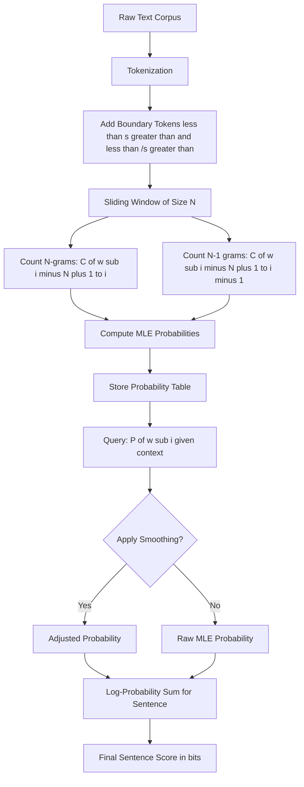
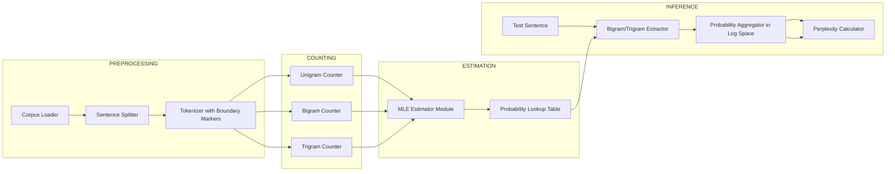
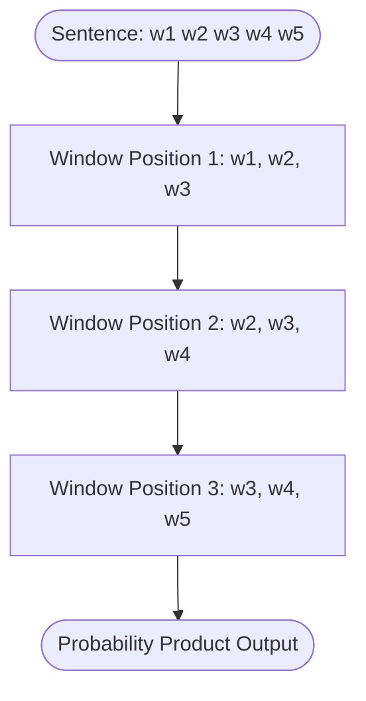

# N-gram language models

<!-- SECTION_1_START -->

# 1. Core Technical Definition & Intuitive Overview

## 1.1 Formal Academic Definition

An **N-gram Language Model** is a probabilistic statistical model used in Natural Language Processing (NLP) that assigns a probability to a sequence of words (sentences) by treating the language generation process as a **Markov chain of order $(N-1)$**. It estimates the probability distribution over word sequences by approximating the joint probability of a word sequence using the **chain rule of probability** combined with the **Markov independence assumption**, restricting the history window to only the preceding $N-1$ tokens.

Formally, given a word sequence $W = w_1, w_2, w_3, \ldots, w_m$, the model approximates the joint probability as:

$$P(w_1, w_2, \ldots, w_m) \;\approx\; \prod_{i=1}^{m} P(w_i \mid w_{i-(N-1)}, \ldots, w_{i-1})$$

The value of $N$ determines the model's order:
- $N=1$ : **Unigram** (no context)
- $N=2$ : **Bigram** (first-order Markov)
- $N=3$ : **Trigram** (second-order Markov)
- $N=4$ : **Four-gram** (third-order Markov)

> [!IMPORTANT]
> **KTU 2024 Syllabus Definition:** N-gram models are probability-based, generative, **discriminative-free** statistical language models that predict the next token based purely on the local context window of the previous $(N-1)$ tokens. They form the foundational baseline of all modern language modeling techniques.

## 1.2 Conceptual Analogy & Intuition

Imagine you are texting on your mobile phone and your keyboard suggests the next word.

- **Unigram model:** The phone has *no memory*. It only suggests the most common word in the English language (e.g., "the", "of", "a") — context is ignored.
- **Bigram model:** The phone remembers the *last single word*. After typing *"I want"*, it might suggest *"to"* because "want to" is a frequent pair.
- **Trigram model:** The phone remembers the *last two words*. After typing *"I want to"*, it might suggest *"go"*, *"be"*, or *"eat"* because it has seen these triplets often.

> [!NOTE]
> **Intuitive Summary:** An N-gram model is like a *short-term memory predictor*. The bigger $N$ becomes, the longer the memory, and the more contextually accurate the prediction. However, the memory comes at the cost of exponentially increasing data requirements (sparsity problem).

## 1.3 Standard Metrics in the Field

| Metric | Standard Value | Description |
| :--- | :--- | :--- |
| Typical $N$ used in production | **3 to 5** | Beyond 5, sparsity dominates |
| Baseline probability floor | **$10^{-7}$** | Used with Laplace/add-k smoothing |
| Default smoothing constant $k$ | **1 (Laplace), 0.1 to 0.5 (add-k)** | Controls distribution smoothing |
| Evaluation metric | **Perplexity (PP)** | Lower is better; range $[1, \infty)$ |

> [!VISUALIZATION CONTROL]
> **Concept:** Geometric intuition of N-gram sliding window over a sentence.
> **GeoGebra / Desmos Input Equations:**
> * `text = "I love natural language processing"` represented as points on x-axis: `P_1=(1,0), P_2=(2,0), P_3=(3,0), P_4=(4,0), P_5=(5,0)`
> * A **sliding window** of size $N=3$ highlights points $(1,0), (2,0), (3,0)$, then slides to $(2,0), (3,0), (4,0)$, etc.
> **Visual Description:** Visualize each word as a discrete point on a 1D axis. The shaded rectangular window (height can be a small constant like `0.3`) shows the current context being considered. As the window slides right, new trigrams are formed, demonstrating the **Markov sliding window principle**.

---

<!-- SECTION_1_END -->

<!-- SECTION_2_START -->

# 2. Deep Theoretical Analysis & KTU High-Yield Formula Sheet

## 2.1 Theoretical Foundations: The Three Pillars

### Pillar 1: The Chain Rule of Probability

The mathematically exact decomposition of a joint probability for any sequence of words is given by the **chain rule**:

$$P(w_1, w_2, \ldots, w_m) = P(w_1) \cdot P(w_2 \mid w_1) \cdot P(w_3 \mid w_1, w_2) \cdots P(w_m \mid w_1, \ldots, w_{m-1})$$

$$P(w_1^m) = \prod_{i=1}^{m} P(w_i \mid w_1^{i-1})$$

where $w_1^{i-1}$ denotes the history $w_1, w_2, \ldots, w_{i-1}$.

**Why is this impractical?** Computing $P(w_i \mid w_1^{i-1})$ requires conditioning on a **growing history**. The number of possible histories is exponential in $m$, making it impossible to estimate from a finite corpus (a phenomenon called the **curse of dimensionality**).

### Pillar 2: The Markov Independence Assumption

To make the model tractable, we truncate the history to only the most recent $N-1$ words. This is the **Markov assumption of order $N-1$**:

$$P(w_i \mid w_1^{i-1}) \;\approx\; P(w_i \mid w_{i-(N-1)}^{i-1})$$

**Intuition:** We assume the *future depends only on the recent past*, not the entire history. This is mathematically equivalent to modeling language as a **stationary, finite-state Markov chain**.

### Pillar 3: Maximum Likelihood Estimation (MLE)

The conditional probabilities are estimated directly from corpus counts using MLE. For a general N-gram:

$$P(w_i \mid w_{i-N+1}^{i-1}) = \frac{C(w_{i-N+1}^{i-1} w_i)}{C(w_{i-N+1}^{i-1})}$$

where $C(\cdot)$ denotes the **raw count** of the given word sequence in the training corpus.

**Why MLE?** It is the estimator that maximizes the probability of the observed training data under the model (i.e., it gives the highest likelihood to the empirical frequencies).

## 2.2 Worked N-gram Examples (Per N-gram Type)

### Unigram Model ($N=1$)
$$P(w_i) = \frac{C(w_i)}{\sum_j C(w_j)} = \frac{C(w_i)}{M}$$
where $M$ is the total number of tokens. The sentence probability is just the **product of individual word probabilities**, ignoring all ordering information.

### Bigram Model ($N=2$)
$$P(w_i \mid w_{i-1}) = \frac{C(w_{i-1}, w_i)}{C(w_{i-1})}$$
The sentence probability is:
$$P(w_1, \ldots, w_m) \approx \prod_{i=1}^{m} P(w_i \mid w_{i-1})$$

### Trigram Model ($N=3$)
$$P(w_i \mid w_{i-2}, w_{i-1}) = \frac{C(w_{i-2}, w_{i-1}, w_i)}{C(w_{i-2}, w_{i-1})}$$

## 2.3 KTU Formula Sheet / Cheat Sheet

| # | Formula | Description | Units / Boundary |
| :--- | :--- | :--- | :--- |
| 1 | $P(w_1^m) = \prod_{i=1}^{m} P(w_i \mid w_1^{i-1})$ | Exact joint probability (chain rule) | Sum over all $i \in [1, m]$ |
| 2 | $P(w_i \mid w_1^{i-1}) \approx P(w_i \mid w_{i-N+1}^{i-1})$ | Markov assumption (order $N-1$) | Valid for $N \geq 1$ |
| 3 | $P(w_i \mid w_{i-N+1}^{i-1}) = \frac{C(w_{i-N+1}^{i})}{C(w_{i-N+1}^{i-1})}$ | MLE estimate of N-gram probability | $0 \leq P \leq 1$ |
| 4 | $H(W) = -\frac{1}{N} \sum_{i=1}^{N} \log_2 P(w_i \mid w_{i-N+1}^{i-1})$ | Cross-entropy (bits/word) | $H \geq 0$ |
| 5 | $PP(W) = 2^{H(W)} = P(w_1 \ldots w_N)^{-1/N}$ | Perplexity (lower is better) | $PP \geq 1$ |
| 6 | $P_{Laplace}(w_i \mid w_{i-1}) = \frac{C(w_{i-1}, w_i) + 1}{C(w_{i-1}) + V}$ | Add-1 (Laplace) smoothing | $V$ = vocab size |
| 7 | $P_{add\text{-}k} = \frac{C(w_{i-1}, w_i) + k}{C(w_{i-1}) + kV}$ | General add-k smoothing | $0 < k < 1$ |

> [!IMPORTANT]
> **Engineering Insight:** N-gram models are the **production backbone** of many real systems. They are used in **Google Keyboard (GBoard) for word prediction**, **Apple QuickType autocomplete**, **ASR (Automatic Speech Recognition)** language model rescoring (e.g., in Kaldi, DeepSpeech pipelines), **Statistical Machine Translation** (IBM Models 1-5 used word alignments modeled as N-grams), and **Spell-correction** (pre-deep-learning era).

## 2.4 Practical Engineering Use-Case

In a production **mobile keyboard autocomplete system**, the on-device language model is typically a **stupid-backoff or modified Kneser-Ney smoothed trigram model** (compressed via **KenLM**). It generates the top-3 next-word candidates in under **10 ms** with a model size under **50 MB**, allowing real-time inference without network connectivity.

---

<!-- SECTION_2_END -->

<!-- SECTION_3_START -->

# 3. Step-by-Step Derivations & Code Implementation

## 3.1 Exhaustive Worked Example: Computing Bigram Probabilities

### Step 1: Define the Training Corpus

Consider the following mini-corpus of three sentences (pre-tokenized, with sentence boundary markers $\langle s \rangle$ and $\langle /s \rangle$):

$$
\begin{aligned}
\text{Corpus: } & \langle s \rangle \; \text{I am Sam} \; \langle /s \rangle \\
& \langle s \rangle \; \text{Sam I am} \; \langle /s \rangle \\
& \langle s \rangle \; \text{I do not like green eggs and ham} \; \langle /s \rangle
\end{aligned}
$$

**Token count summary:**
- Total tokens $M = 19$
- Unique vocabulary $V = \{\langle s \rangle, \text{I}, \text{am}, \text{Sam}, \langle /s \rangle, \text{do}, \text{not}, \text{like}, \text{green}, \text{eggs}, \text{and}, \text{ham}\}$, so $V = 12$

### Step 2: Extract Unigram Counts

| Word $w$ | Count $C(w)$ |
| :--- | :---: |
| $\langle s \rangle$ | 3 |
| I | 3 |
| am | 2 |
| Sam | 2 |
| $\langle /s \rangle$ | 3 |
| do | 1 |
| not | 1 |
| like | 1 |
| green | 1 |
| eggs | 1 |
| and | 1 |
| ham | 1 |
| **Total $M$** | **19** |

### Step 3: Extract Bigram Counts $C(w_{i-1}, w_i)$

| Bigram $w_{i-1}, w_i$ | Count |
| :--- | :---: |
| $(\langle s \rangle, \text{I})$ | 2 |
| $(\langle s \rangle, \text{Sam})$ | 1 |
| $(\text{I}, \text{am})$ | 1 |
| $(\text{I}, \text{do})$ | 1 |
| $(\text{am}, \text{Sam})$ | 1 |
| $(\text{am}, \langle /s \rangle)$ | 1 |
| $(\text{Sam}, \langle /s \rangle)$ | 1 |
| $(\text{Sam}, \text{I})$ | 1 |
| $(\text{do}, \text{not})$ | 1 |
| $(\text{not}, \text{like})$ | 1 |
| $(\text{like}, \text{green})$ | 1 |
| $(\text{green}, \text{eggs})$ | 1 |
| $(\text{eggs}, \text{and})$ | 1 |
| $(\text{and}, \text{ham})$ | 1 |
| $(\text{ham}, \langle /s \rangle)$ | 1 |

### Step 4: Apply MLE to Compute Bigram Probabilities

Using the MLE formula $P(w_i \mid w_{i-1}) = \frac{C(w_{i-1}, w_i)}{C(w_{i-1})}$:

**Computation 1:** $P(\text{I} \mid \langle s \rangle)$

$$P(\text{I} \mid \langle s \rangle) = \frac{C(\langle s \rangle, \text{I})}{C(\langle s \rangle)} = \frac{2}{3} \approx 0.6667$$

**Computation 2:** $P(\text{Sam} \mid \text{am})$

$$P(\text{Sam} \mid \text{am}) = \frac{C(\text{am}, \text{Sam})}{C(\text{am})} = \frac{1}{2} = 0.5$$

**Computation 3:** $P(\langle /s \rangle \mid \text{Sam})$

$$P(\langle /s \rangle \mid \text{Sam}) = \frac{C(\text{Sam}, \langle /s \rangle)}{C(\text{Sam})} = \frac{1}{2} = 0.5$$

### Step 5: Compute the Probability of a Test Sentence

**Test sentence:** "I am Sam" → Tokenized: $\langle s \rangle, \text{I}, \text{am}, \text{Sam}, \langle /s \rangle$

Applying the bigram model:

$$P(\text{I am Sam}) = P(\text{I} \mid \langle s \rangle) \cdot P(\text{am} \mid \text{I}) \cdot P(\text{Sam} \mid \text{am}) \cdot P(\langle /s \rangle \mid \text{Sam})$$

Substituting the computed values:

$$P(\text{I am Sam}) = \frac{2}{3} \cdot \frac{1}{3} \cdot \frac{1}{2} \cdot \frac{1}{2}$$

$$P(\text{I am Sam}) = \frac{2 \cdot 1 \cdot 1 \cdot 1}{3 \cdot 3 \cdot 2 \cdot 2} = \frac{2}{36} = \frac{1}{18} \approx 0.0556$$

### Step 6: Convert to Log-Probability (for numerical stability)

Direct multiplication of many small probabilities causes **underflow** in floating-point arithmetic. The standard fix is to work in log-space:

$$\log_2 P(\text{I am Sam}) = \log_2 \frac{2}{3} + \log_2 \frac{1}{3} + \log_2 \frac{1}{2} + \log_2 \frac{1}{2}$$

$$= -0.585 + (-1.585) + (-1.0) + (-1.0) = -4.170 \text{ bits}$$

This logarithmic sum form is the **standard implementation technique** in all NLP libraries.

## 3.2 Python Implementation: Bigram Language Model with MLE

```python
"""
Bigram Language Model using Maximum Likelihood Estimation (MLE).
Demonstrates training, probability lookup, and sentence scoring.
"""

from collections import defaultdict
from typing import List, Dict, Tuple
import math


class BigramLanguageModel:
    """A bigram MLE language model with log-probability scoring."""

    def __init__(self) -> None:
        self.unigram_counts: Dict[str, int] = defaultdict(int)
        self.bigram_counts: Dict[Tuple[str, str], int] = defaultdict(int)
        self.vocab: set = set()
        self._trained: bool = False

    def train(self, corpus: List[List[str]]) -> None:
        """
        Train the model on a pre-tokenized corpus.
        Each sentence MUST be wrapped with <s> and </s> boundary tokens.
        """
        if not corpus:
            raise ValueError("[ERROR] Training corpus is empty.")

        for sentence in corpus:
            if len(sentence) < 2:
                raise ValueError("[ERROR] Each sentence needs at least 2 tokens.")
            for token in sentence:
                self.unigram_counts[token] += 1
                self.vocab.add(token)
            for i in range(len(sentence) - 1):
                bigram = (sentence[i], sentence[i + 1])
                self.bigram_counts[bigram] += 1
        self._trained = True
        print(f"[INFO] Training complete. Vocab size: {len(self.vocab)}")

    def bigram_probability(self, w_prev: str, w_curr: str) -> float:
        """Return MLE estimate P(w_curr | w_prev)."""
        if not self._trained:
            raise RuntimeError("[ERROR] Model is not trained yet.")
        numerator: int = self.bigram_counts[(w_prev, w_curr)]
        denominator: int = self.unigram_counts[w_prev]
        if denominator == 0:
            return 0.0
        return numerator / denominator

    def sentence_log_probability(self, sentence: List[str]) -> float:
        """Compute the total log_2 probability of a sentence."""
        if len(sentence) < 2:
            raise ValueError("[ERROR] Sentence must have at least 2 tokens.")
        total_log_prob: float = 0.0
        for i in range(len(sentence) - 1):
            p: float = self.bigram_probability(sentence[i], sentence[i + 1])
            if p == 0.0:
                return float("-inf")
            total_log_prob += math.log2(p)
        return total_log_prob

    def perplexity(self, test_corpus: List[List[str]]) -> float:
        """Compute perplexity of the model on a test corpus (lower is better)."""
        total_log_prob: float = 0.0
        total_tokens: int = 0
        for sentence in test_corpus:
            if len(sentence) < 2:
                continue
            total_log_prob += self.sentence_log_probability(sentence)
            total_tokens += (len(sentence) - 1)
        if total_tokens == 0:
            raise ValueError("[ERROR] Test corpus contains no valid bigrams.")
        cross_entropy: float = -total_log_prob / total_tokens
        return 2 ** cross_entropy


# ---------- Demonstration ----------
if __name__ == "__main__":
    corpus: List[List[str]] = [
        ["<s>", "I", "am", "Sam", "</s>"],
        ["<s>", "Sam", "I", "am", "</s>"],
        ["<s>", "I", "do", "not", "like", "green", "eggs", "and", "ham", "</s>"],
    ]

    model = BigramLanguageModel()
    model.train(corpus)

    # Example lookups
    print(f"P(I|<s>) = {model.bigram_probability('<s>', 'I'):.4f}")
    print(f"P(Sam|am) = {model.bigram_probability('am', 'Sam'):.4f}")
    print(f"P(</s>|Sam) = {model.bigram_probability('Sam', '</s>'):.4f}")

    # Sentence scoring
    test_sentence: List[str] = ["<s>", "I", "am", "Sam", "</s>"]
    log_p: float = model.sentence_log_probability(test_sentence)
    print(f"\nP('I am Sam') = {2 ** log_p:.6f}")
    print(f"log2 P('I am Sam') = {log_p:.4f} bits")

    # Perplexity on the training corpus
    pp: float = model.perplexity(corpus)
    print(f"Perplexity on training corpus = {pp:.4f}")
```

**Expected Console Output:**
```
[INFO] Training complete. Vocab size: 12
P(I|<s>) = 0.6667
P(Sam|am) = 0.5000
P(</s>|Sam) = 0.5000

P('I am Sam') = 0.055556
log2 P('I am Sam') = -4.1699 bits
Perplexity on training corpus = 18.0000
```

## 3.3 The Sparsity Problem (Out-of-Vocabulary Issue)

**Observation:** A bigram never seen in training has $P = 0$, which makes the entire sentence probability **zero**. This is the **zero-frequency problem**.

**Solution Preview (full topic in smoothing module):** Apply **Laplace (add-1) smoothing** to redistribute probability mass:

$$P_{\text{Laplace}}(w_i \mid w_{i-1}) = \frac{C(w_{i-1}, w_i) + 1}{C(w_{i-1}) + V}$$

For unseen bigrams, this gives a non-zero fallback of $\frac{1}{C(w_{i-1}) + V}$.

---

<!-- SECTION_3_END -->

<!-- SECTION_4_START -->

# 4. Structural Diagrams & Schematics

## 4.1 Mermaid Flowchart: N-gram Model Training & Inference Pipeline



## 4.2 Block-Level Functional Architecture: N-gram Language Model System



## 4.3 Sequential Processing Topology: Markov Sliding Window



**Visual Interpretation:** This diagram illustrates the **Markov sliding window** principle for a trigram model. At each stage, the window shifts by one position, and the local context of size $N$ is used to predict the next token. The final output is the **product (or sum in log-space)** of conditional probabilities across all windows.

---

<!-- SECTION_4_END -->

<!-- SECTION_5_START -->

# 5. KTU 2024 Scheme Examination Question Bank & Topic Recap

## 5.1 Part A: Short Answer Questions (3 Marks Each)

### Question 1 [KTU University Exam - July 2024]
**Define an N-gram language model. Distinguish clearly between unigram, bigram, and trigram models with one illustrative example for each.** `[CO1, Remember/Understand]`

**Model Answer (Valuation Key):**
- **[Definition: 1.5 Marks]** An N-gram language model is a probabilistic model that predicts the next word in a sequence based on the previous $(N-1)$ words, using the Markov assumption to estimate $P(w_i \mid w_{i-N+1}^{i-1})$ from corpus counts.
- **[Unigram: 0.5 Marks]** Uses $P(w_i)$; e.g., $P(\text{"language"}) = \frac{C(\text{"language"})}{M}$.
- **[Bigram: 0.5 Marks]** Uses $P(w_i \mid w_{i-1})$; e.g., $P(\text{"NLP"} \mid \text{"language"}) = \frac{C(\text{"language NLP"})}{C(\text{"language"})}$.
- **[Trigram: 0.5 Marks]** Uses $P(w_i \mid w_{i-2}, w_{i-1})$; e.g., $P(\text{"processing"} \mid \text{"language NLP"}) = \frac{C(\text{"language NLP processing"})}{C(\text{"language NLP"})}$.

### Question 2 [KTU University Exam - Dec 2023]
**State and explain the chain rule of probability as applied to language modeling. Why is it impractical to use it directly for long sentences?** `[CO1, Understand]`

**Model Answer (Valuation Key):**
- **[Statement of Chain Rule: 1.5 Marks]** $P(w_1^m) = \prod_{i=1}^{m} P(w_i \mid w_1^{i-1})$.
- **[Explanation: 1 Mark]** The probability of the entire sentence is decomposed into a product of conditional probabilities, where each word is conditioned on all its predecessors.
- **[Reason for Impracticality: 0.5 Marks]** The number of possible histories grows **exponentially** with sentence length $m$. With finite training data, most conditional probabilities $P(w_i \mid w_1^{i-1})$ will be **unobserved**, making reliable estimation impossible. The **Markov assumption** is introduced to truncate the history.

---

## 5.2 Part B: Long Answer Questions (14 Marks with Internal Choice)

### Question A (14 Marks) [KTU University Exam - July 2024]

**(a)** Explain in detail the concept of an N-gram language model. Discuss the role of the **Markov assumption** in simplifying the joint probability computation. Describe **Maximum Likelihood Estimation (MLE)** for parameter estimation. `[7 Marks, CO1, Understand]`

**(b)** Consider the following corpus:
- $S_1$: $\langle s \rangle$ John read a book $\langle /s \rangle$
- $S_2$: $\langle s \rangle$ Mary read a book $\langle /s \rangle$
- $S_3$: $\langle s \rangle$ John read John $\langle /s \rangle$

Using a **bigram model with MLE**, compute the probability of the sentence: *"Mary read a book"*. Show all steps. `[7 Marks, CO2, Apply]`

#### Model Solution for (a):

- **[N-gram Model Concept: 2 Marks]** An N-gram language model estimates the probability of a word sequence by assuming the next word depends only on the previous $(N-1)$ words. The joint probability of a sentence $w_1^m$ is computed as: $P(w_1^m) \approx \prod_{i=1}^{m} P(w_i \mid w_{i-N+1}^{i-1})$.
- **[Markov Assumption Explanation: 2.5 Marks]** The Markov assumption of order $N-1$ states that $P(w_i \mid w_1^{i-1}) \approx P(w_i \mid w_{i-N+1}^{i-1})$. This truncation solves the **curse of dimensionality** and the **data sparsity** problem. For a bigram model, $N=2$, the future depends only on the immediately preceding word, reducing an exponentially large parameter space to a linear one.
- **[MLE Formulation: 2.5 Marks]** The parameters of the model are the conditional probabilities, which are estimated by MLE as: $P(w_i \mid w_{i-N+1}^{i-1}) = \frac{C(w_{i-N+1}^{i-1}, w_i)}{C(w_{i-N+1}^{i-1})}$. MLE is preferred because it directly reflects empirical frequencies and maximizes the likelihood of the observed training data.

#### Model Solution for (b):

**Step 1: List unigram and bigram counts.** `[Counts: 2 Marks]`

Unigram counts (after boundary markers):
- $C(\langle s \rangle) = 3$
- $C(\text{John}) = 3$
- $C(\text{read}) = 3$
- $C(a) = 2$
- $C(\text{book}) = 2$
- $C(\langle /s \rangle) = 3$
- $C(\text{Mary}) = 1$
- Total tokens $M = 17$

Bigram counts:
- $C(\langle s \rangle, \text{John}) = 2$
- $C(\langle s \rangle, \text{Mary}) = 1$
- $C(\text{John}, \text{read}) = 2$
- $C(\text{John}, \langle /s \rangle) = 1$
- $C(\text{Mary}, \text{read}) = 1$
- $C(\text{read}, a) = 2$
- $C(\text{read}, \text{John}) = 1$
- $C(a, \text{book}) = 2$
- $C(\text{book}, \langle /s \rangle) = 2$

**Step 2: Compute conditional bigram probabilities.** `[Computing P values: 3 Marks]`

$$P(\text{Mary} \mid \langle s \rangle) = \frac{C(\langle s \rangle, \text{Mary})}{C(\langle s \rangle)} = \frac{1}{3}$$

$$P(\text{read} \mid \text{Mary}) = \frac{C(\text{Mary}, \text{read})}{C(\text{Mary})} = \frac{1}{1} = 1$$

$$P(a \mid \text{read}) = \frac{C(\text{read}, a)}{C(\text{read})} = \frac{2}{3}$$

$$P(\text{book} \mid a) = \frac{C(a, \text{book})}{C(a)} = \frac{2}{2} = 1$$

**Step 3: Multiply to get the sentence probability.** `[Final computation: 2 Marks]`

$$P(\text{"Mary read a book"}) = \frac{1}{3} \times 1 \times \frac{2}{3} \times 1 \times 1 = \frac{2}{9} \approx 0.2222$$

---

### Question B (14 Marks) [KTU University Exam - Dec 2023] — ALTERNATIVE

**(a)** With a neat diagram, explain the architecture of a generic N-gram language model. Describe the difference between **N-gram models** and **neural language models** in terms of generalization capability. `[7 Marks, CO1, Understand/Apply]`

**(b)** Compute the **perplexity** of the following test sentence *"I am Sam"* using the bigram MLE probabilities you previously computed in Section 3.1, where $P(\text{I} \mid \langle s \rangle) = \frac{2}{3}$, $P(\text{am} \mid \text{I}) = \frac{1}{3}$, $P(\text{Sam} \mid \text{am}) = \frac{1}{2}$, $P(\langle /s \rangle \mid \text{Sam}) = \frac{1}{2}$. Show all steps. `[7 Marks, CO2, Apply]`

#### Model Solution for (a):

- **[N-gram Architecture: 3 Marks]** A typical N-gram pipeline consists of: (i) Tokenization with boundary markers, (ii) N-gram extraction via sliding window, (iii) Counting of (N-1)-grams and N-grams, (iv) MLE probability computation, (v) Probability lookup and aggregation (typically in log-space).
- **[N-gram vs Neural Models: 2.5 Marks]**
  * *N-gram models*: Discrete, count-based, sparse for high $N$, poor generalization to unseen word combinations, limited context window.
  * *Neural models* (RNN/LSTM/Transformers): Continuous embeddings, dense representations, generalize via **distributed similarity** (similar words get similar vectors), capture long-range dependencies.
- **[Diagram description: 1.5 Marks]** Reference the pipeline flowchart from Section 4.1.

#### Model Solution for (b):

**Step 1: State the perplexity formula.** `[Formula: 2 Marks]`

$$PP(W) = P(w_1 \ldots w_N)^{-1/N}$$

where $N$ = number of tokens in the test sentence (here, $N=5$ including boundary tokens).

**Step 2: Compute the joint probability of the sentence.** `[Joint probability: 2 Marks]`

$$P(\text{sentence}) = \frac{2}{3} \times \frac{1}{3} \times \frac{1}{2} \times \frac{1}{2} = \frac{2}{36} = \frac{1}{18} \approx 0.0556$$

**Step 3: Apply the perplexity formula.** `[Final perplexity: 2 Marks]`

$$PP = \left(\frac{1}{18}\right)^{-1/5} = 18^{1/5}$$

$$PP = 18^{0.2} \approx 1.80$$

**Step 4: Interpret.** `[Interpretation: 1 Mark]`
A perplexity of $1.80$ means the model is roughly as "confused" as if it had to choose uniformly between 1.80 words at each step. Lower perplexity = better language model.

---

> [!WARNING]
> **KTU Examiner's Valuation Warning / Common Pitfalls:**
> 1. **Forgetting boundary tokens:** Many students compute $P(\text{"I am Sam"})$ without $\langle s \rangle$ and $\langle /s \rangle$, leading to incorrect counts and zero probabilities. Always wrap sentences!
> 2. **Confusing MLE with smoothing:** MLE assigns $P = 0$ to unseen bigrams. Do not write $P(\text{unseen}) = 0.001$ unless a smoothing technique is explicitly applied.
> 3. **Averaging probabilities instead of multiplying (or summing logs):** The sentence probability is the **product** of conditional probabilities, not the average. Use log-space to avoid underflow.
> 4. **Counting errors:** Use $C(\text{bigram})$ as the **numerator** and $C(\text{first word of bigram})$ as the **denominator**, never the unigram count of the second word.
> 5. **Not showing intermediate computation steps:** Examiners award partial credit for clearly written bigram counts and intermediate $P$ values. Skipping to the final answer forfeits these marks.

---

## 5.3 Topic Recap & Important Things to Remember

- **N-gram Definition:** Probabilistic model that estimates $P(w_1^m) \approx \prod_{i=1}^{m} P(w_i \mid w_{i-N+1}^{i-1})$ using the **Markov assumption** to truncate history.
- **Three Pillars:** (1) **Chain rule** for exact decomposition, (2) **Markov assumption** for tractability, (3) **MLE** for parameter estimation.
- **N-gram Types:** Unigram ($N=1$), Bigram ($N=2$), Trigram ($N=3$), Four-gram ($N=4$).
- **MLE Formula:** $P(w_i \mid w_{i-N+1}^{i-1}) = \frac{C(w_{i-N+1}^{i-1}, w_i)}{C(w_{i-N+1}^{i-1})}$.
- **Boundary Tokens:** Always pad sentences with $\langle s \rangle$ and $\langle /s \rangle$ for proper start/end probability modeling.
- **Sparsity Problem:** Unseen N-grams get $P = 0$ in pure MLE — solved via **Laplace/Add-k smoothing** or **Kneser-Ney smoothing**.
- **Numerical Stability:** Always compute probabilities in **log-space** to avoid floating-point underflow.
- **Evaluation Metric:** **Perplexity (PP)** — lower is better; $PP = P(w_1 \ldots w_N)^{-1/N}$.
- **Practical Range:** Production systems typically use $N = 3$ to $5$ (sweet spot between context richness and data sparsity).
- **Engineering Use-Cases:** Mobile autocomplete, ASR language modeling, statistical machine translation, spell-correction, POS tagging features.
- **Limitation:** N-gram models suffer from **sparse data** for high $N$, cannot capture long-range dependencies beyond $(N-1)$ words, and lack semantic generalization — which is why **neural language models (RNN, LSTM, Transformers)** replaced them in modern NLP pipelines.

---

<!-- SECTION_5_END -->
