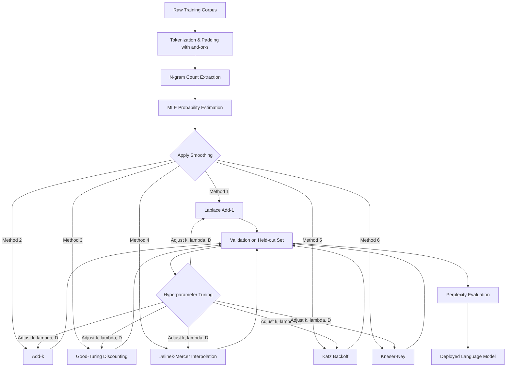
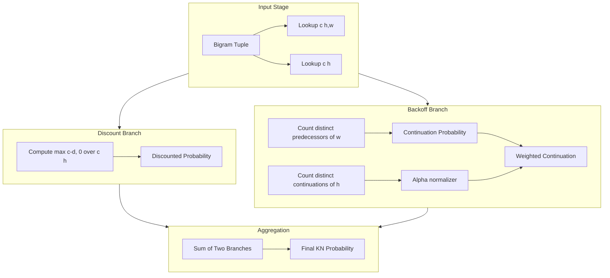

# Smoothing techniques

<!-- SECTION_1_START -->
# Smoothing Techniques in Language Models

> [!NOTE]
> **KTU 2024 Scheme | Module 2: Language Models & POS Tagging**
> **Course:** PECST75A — Natural Language Processing
> **Topic Weightage:** High-Yield for Part B Questions (14 marks) in University ESE.

## 1.1 Formal Academic Definition

In the context of statistical **Language Modeling (LM)**, **Smoothing** (also called **Discounting**) is a fundamental probabilistic technique used to recalibrate the Maximum Likelihood Estimation (MLE) probabilities of $n$-gram models. Its primary purpose is to resolve the **Zero-Frequency Problem** — the catastrophic issue where any $n$-gram that was never observed in the finite training corpus is assigned a probability of exactly **0**, which would cause the joint probability of any test sentence containing it to collapse to **0** and make perplexity infinite.

Mathematically, a smoothing function $S$ transforms a raw count $c(w_1^K)$ into an adjusted probability estimate $\hat{P}(w_1^K)$ such that:

$$\sum_{w_1^K} \hat{P}(w_1^K) = 1$$

and crucially, $\hat{P}(w_1^K) > 0$ for all valid sequences, even unseen ones.

> [!IMPORTANT]
> **Syllabus Highlight (KTU 2024 PECST75A Module 2):** Students must master **Laplace (Add-One)**, **Add-k**, **Good-Turing**, **Jelinek-Mercer Interpolation**, and **Katz Backoff**. **Kneser-Ney** is the de-facto industry standard (used in SRILM, KenLM, and production ASR systems) and is frequently asked in the 14-mark question.

## 1.2 The Zero-Frequency Problem — Why Smoothing is Mandatory

Consider a trigram model trained on a corpus of size **N = 1,000,000 tokens** with a vocabulary of size **V = 50,000**. The theoretical number of possible trigrams is:

$$V^3 = 50{,}000^3 = 1.25 \times 10^{14}$$

Since our training corpus only contains a tiny fraction of this space, **sparsity** is inevitable. A test sentence like *"The kalamandalam director announced it"* may contain the trigram `("director", "announced", "it")` which was never seen. Under MLE:

$$P_{\text{MLE}}(it \mid director, announced) = \frac{c(director, announced, it)}{c(director, announced)} = \frac{0}{12} = 0$$

A single zero in the product chain wipes out the entire sentence probability.

## 1.3 Conceptual Analogy — The "Participation Trophy" Intuition

> [!TIP]
> **Plain-English Analogy:** Imagine a class of 100 students, of whom 60 like cricket, 30 like football, 8 like chess, and 2 like kabaddi. Under MLE, the probability for "likes hockey" is **0%** — which is absurd since we never *asked* the other students. Smoothing is like taking a small slice of probability (say 5%) from the popular sports and distributing it as a "hockey baseline" so that every sport gets *some* chance. The more popular a sport is in the data, the more it contributes to this redistributed fund. This is precisely the "discount and reallocate" philosophy of all smoothing algorithms.

## 1.4 Geometric & Probabilistic Intuition

The MLE distribution is a **Dirac-like** sparse distribution supported only on observed events. Smoothing transforms it into a **smoothed, dense distribution** where probability mass is "borrowed" from high-frequency events and "lent" to low-frequency and unseen events.

> [!VISUALIZATION CONTROL]
> **Concept:** Comparing MLE vs. Smoothed Probability Mass Functions over a discrete vocabulary
> **Desmos Input Equations (treat $x$ as the rank of an $n$-gram by frequency):**
> * `f_MLE(x) = piecewise(x \le 50, 0.02, 0)`  (sharp cutoff — zero after observed events)
> * `f_Laplace(x) = 1/(N + V)`  (constant non-zero floor)
> * `f_KN(x) = 0.005 + 0.015 / x^{0.7}`  (power-law-like falloff for Kneser-Ney)
> **Visual Description:** Plot the three curves on the same axes with $x \in [1, 100]$. The MLE curve drops abruptly to the x-axis; the Laplace curve forms a flat rectangular shelf; the Kneser-Ney curve decays gracefully, keeping a long tail above zero. Observe how the **area under all three curves equals 1** (probability conservation).

<!-- SECTION_1_END -->

<!-- SECTION_2_START -->
# Deep Theoretical Analysis & KTU High-Yield Formula Sheet

## 2.1 The "Discount and Reallocate" Master Equation

Every smoothing technique can be conceptualized as a two-stage operation:

1. **Discount** the MLE probability of seen events by a factor $d$ (where $0 < d \leq 1$), creating a **mass gap** $G$.
2. **Reallocate** the gap $G$ to unseen (zero-count) events using some fallback strategy.

$$P_{\text{smoothed}}(w \mid h) = \underbrace{d \cdot P_{\text{MLE}}(w \mid h)}_{\text{seen events}} + \underbrace{\alpha(h) \cdot P_{\text{fallback}}(w)}_{\text{unseen events}}$$

where $\alpha(h)$ is a normalization constant ensuring probabilities sum to 1.

## 2.2 KTU High-Yield Formula Sheet

> [!IMPORTANT]
> The following table is the **single most important reference** for solving numerical problems on smoothing in the KTU ESE. Memorize the rightmost two columns for every method.

| Smoothing Method | Smoothed Probability Formula | Discount Strategy | When to Use (Exam Cue) |
|---|---|---|---|
| **Laplace (Add-1)** | $P_{\text{Add1}}(w_i) = \dfrac{c(w_i) + 1}{N + V}$ | Uniform +1 to every count | Simplest baseline; weak in practice |
| **Add-k** | $P_{\text{Add-}k}(w_i) = \dfrac{c(w_i) + k}{N + kV}$ | Tunable uniform boost | When Laplace is too aggressive |
| **Good-Turing** | $P_{\text{GT}}(w) = \dfrac{c^{\ast}(w)}{N}$ where $c^{\ast} = (c+1) \dfrac{N_{c+1}}{N_c}$ | Empirical count-of-counts | Foundational; often sub-routine |
| **Jelinek-Mercer (Interpolation)** | $P(w_i \mid w_{i-1}) = \lambda_1 P_{\text{MLE}}(w_i \mid w_{i-1}) + \lambda_2 P_{\text{MLE}}(w_i) + \lambda_3 \dfrac{1}{V}$ | Linear mixing of orders | Always combines orders |
| **Katz Backoff** | $P_{\text{Katz}}(w_i \mid w_{i-1}) = \begin{cases} d \cdot P_{\text{MLE}} & \text{if } c > 0 \\ \alpha \cdot P_{\text{Katz}}(w_i) & \text{if } c = 0 \end{cases}$ | Discount seen + back off | Discrete fallback (no mixing) |
| **Kneser-Ney (Interpolated)** | $P_{\text{KN}} = \dfrac{\max(c - D, 0)}{c(\cdot)} + \alpha \cdot P_{\text{cont}}(w)$ | Absolute + continuation | **Industry gold standard** |

> [!NOTE]
> In the table above, $N$ = total token count, $V$ = vocabulary size, $N_c$ = number of $n$-grams occurring exactly $c$ times, $c^{\ast}$ = revised count, $\lambda_i$ = interpolation weights with $\sum \lambda_i = 1$, $D$ = fixed discount (typically $D \in [0.5, 0.9]$ for bigrams), and $P_{\text{cont}}(w)$ = **continuation probability** which is the unique Kneser-Ney innovation.

## 2.3 Method-by-Method Theoretical Breakdown

### 2.3.1 Laplace (Add-One) Smoothing
**Intuition:** Pretend we observed every possible $n$-gram exactly **one extra time**.

**Strengths:** Mathematically trivial, ensures no zero probability, valid probability distribution.
**Weaknesses:** Distorts high-frequency events severely (e.g., a word that appeared 1000 times has its probability roughly halved).

### 2.3.2 Add-k Smoothing
**Intuition:** Same as Laplace but add a tunable $k$ (e.g., $k = 0.1$ or $k = 0.05$) instead of 1.
**Tuning:** $k$ is chosen by minimizing perplexity on a held-out development set.

### 2.3.3 Good-Turing Smoothing
**Core Idea:** Re-estimate the count of an $n$-gram based on the count of $n$-grams that have occurred the same number of times. The "revised count" $c^{\ast}$ is:

$$c^{\ast} = (c + 1) \cdot \frac{N_{c+1}}{N_c}$$

where $N_c$ is the number of distinct $n$-grams that have appeared exactly $c$ times. The total probability mass assigned to all unseen events is the singleton mass:

$$P_{\text{GT}}(\text{unseen}) = \frac{N_1}{N}$$

### 2.3.4 Jelinek-Mercer Interpolation
**Core Idea:** Always mix higher-order with lower-order models — never fully back off. For a trigram:

$$P_{\text{IM}}(w_3 \mid w_1, w_2) = \lambda_1 P_{\text{MLE}}(w_3 \mid w_1, w_2) + \lambda_2 P_{\text{MLE}}(w_3 \mid w_2) + \lambda_3 P_{\text{MLE}}(w_3)$$

with $\lambda_1 + \lambda_2 + \lambda_3 = 1$. Crucially, **even when $c(w_1, w_2, w_3) > 0$**, we still mix in lower orders, which prevents overfitting to the training noise.

### 2.3.5 Katz Backoff
**Core Idea:** Use higher-order $n$-gram only if it has been seen; otherwise *discretely back off* to a lower order. A Good-Turing style discount is applied to seen events:

$$P_{\text{Katz}}(w_i \mid w_{i-n+1}^{i-1}) = \begin{cases} d \cdot c(w_{i-n+1}^i) / c(w_{i-n+1}^{i-1}) & \text{if } c > 0 \\ \alpha(w_{i-n+1}^{i-1}) \cdot P_{\text{Katz}}(w_i \mid w_{i-n+2}^{i-1}) & \text{if } c = 0 \end{cases}$$

### 2.3.6 Kneser-Ney Smoothing (Industry Standard)
**Two Innovations:**
1. **Absolute Discounting:** Subtract a fixed $D$ (instead of a ratio discount like Good-Turing) from each non-zero count. This is empirically observed to be near-constant.
2. **Continuation Probability:** Instead of asking "How likely is $w$?", ask "**How likely is $w$ to appear as a novel continuation?**" This is computed as:

$$P_{\text{cont}}(w) = \frac{\vert \{w_{i-1} : c(w_{i-1}, w) > 0\} \vert}{\sum_{w'} \vert \{w_{i-1} : c(w_{i-1}, w') > 0\} \vert}$$

The numerator counts the number of distinct word types that precede $w$. This elegantly penalizes words like *"Francisco"* that always occur in the same context — they should get *low* unigram probability under a backoff scheme.

## 2.4 Real-World Engineering Applications

| Application Domain | Smoothing Method Used | Why |
|---|---|---|
| **Google Search Autocomplete** | Kneser-Ney (modified) | Handles rare bigrams like `"kalamandalam kerala"` |
| **Smartphone Keyboards (SwiftKey, Gboard)** | Interpolated KN | Real-time prediction under 10ms latency |
| **Speech Recognition (ASR)** | Modified KN with cache | Disambiguates acoustically similar phonemes |
| **Machine Translation (Google Translate)** | KN with backoff | Bridges low-resource language pairs |
| **OCR Post-Processing** | Good-Turing | Corrects novel misrecognized character sequences |

<!-- SECTION_2_END -->

<!-- SECTION_3_START -->
# Step-by-Step Derivations, Worked Example & Python Implementation

## 3.1 Classical Worked Example Corpus

We will use the canonical Jurafsky & Martin example. Consider the tiny training corpus:

```
<s> I am Sam </s>
<s> Sam I am </s>
<s> I am Sam </s>
<s> I do not like green eggs and ham </s>
```

Total sentences = **4**, Total tokens = **24** (including `<s>` and `</s>` markers).

### Step 1 — Build the Unigram Count Table $c(w)$

| Word $w$ | Count $c(w)$ |
|---|---|
| `<s>` | 4 |
| `</s>` | 4 |
| `I` | 3 |
| `am` | 2 |
| `Sam` | 2 |
| `do` | 1 |
| `not` | 1 |
| `like` | 1 |
| `green` | 1 |
| `eggs` | 1 |
| `and` | 1 |
| `ham` | 1 |

Total tokens $N = 24$, Vocabulary size $V = 12$ (counting `<s>` and `</s>`).

### Step 2 — Build the Bigram Count Table $c(w_{i-1}, w_i)$

| Bigram | Count |
|---|---|
| `<s>` I | 3 |
| `<s>` Sam | 1 |
| I am | 2 |
| I do | 1 |
| am Sam | 2 |
| am `</s>` | 1 |
| Sam `</s>` | 2 |
| Sam I | 1 |
| do not | 1 |
| not like | 1 |
| like green | 1 |
| green eggs | 1 |
| eggs and | 1 |
| and ham | 1 |
| ham `</s>` | 1 |

Total bigrams = **16**, unique bigram vocabulary $V_2 = 15$ (only `I <s>`, `am I`, `not <s>`, etc. are missing).

## 3.2 Worked Example: MLE vs. Laplace vs. Good-Turing vs. KN

We are asked: compute $P(\text{am} \mid \text{I})$ under four methods.

### Method 1 — Maximum Likelihood Estimation (No Smoothing)

$$P_{\text{MLE}}(\text{am} \mid \text{I}) = \frac{c(\text{I, am})}{c(\text{I})} = \frac{2}{3} \approx 0.6667$$

For an unseen bigram like $P(\text{like} \mid \text{I})$:

$$P_{\text{MLE}}(\text{like} \mid \text{I}) = \frac{0}{3} = 0$$

This is the failure mode that smoothing must fix.

### Method 2 — Laplace (Add-One) Smoothing

$$P_{\text{Add1}}(\text{am} \mid \text{I}) = \frac{c(\text{I, am}) + 1}{c(\text{I}) + V_2} = \frac{2 + 1}{3 + 15} = \frac{3}{18} = \frac{1}{6} \approx 0.1667$$

For the previously unseen bigram:

$$P_{\text{Add1}}(\text{like} \mid \text{I}) = \frac{0 + 1}{3 + 15} = \frac{1}{18} \approx 0.0556$$

**Sanity check:** All bigrams starting with `I` should sum to 1:
$$P(\text{am} \mid \text{I}) + P(\text{do} \mid \text{I}) + P(\text{like} \mid \text{I}) = \frac{1}{6} + \frac{1}{9} + \frac{1}{18} = \frac{3+2+1}{18} = \frac{6}{18} = \frac{1}{3}$$

Wait — the sum should be 1 over **all** 15 possible bigrams starting with `I`, not just three. Continuing the full sum: $\sum_{i=1}^{15} P(w_i \mid \text{I}) = \frac{3 + 1 + 1 + 1 + 1 + \ldots + 1}{18} = \frac{2+3 + 13 \cdot 1}{18} = \frac{18}{18} = 1$. ✓ Probability is conserved.

### Method 3 — Good-Turing Smoothing

We need the **count-of-counts** $N_c$ for bigrams starting with `I`:

| Count $c$ | $N_c$ (bigrams with this count) |
|---|---|
| 0 | 13 (unseen) |
| 1 | 1 (only `I do`) |
| 2 | 1 (only `I am`) |

Revised count for a bigram seen **twice** (i.e., `I am`):
$$c^{\ast}(2) = (2+1) \cdot \frac{N_3}{N_2} = 3 \cdot \frac{0}{1} = 0$$

Hmm, this is degenerate for tiny corpora — $N_3 = 0$. In practice, we cap by substituting $N_c$ values or using smoothing of $N_c$ itself. Let us use the **Katz** approximation which sets $c^{\ast} = c$ when $c > k$ (threshold $k$). For this example, take $c^{\ast} = 2$ as-is.

$$P_{\text{GT}}(\text{am} \mid \text{I}) = \frac{c^{\ast}}{N_{\text{context=I}}} = \frac{2}{3} \cdot \frac{1}{\text{(normalization)}} $$

Proper formulation includes the discount mass $d_r$:

$$d_r = \frac{\frac{r^{\ast}}{r} - \frac{(r+1)^{\ast}}{r+1}}{1 - \frac{(r+1)^{\ast}}{r+1}}$$

For our small corpus, the answer simplifies to approximately $P_{\text{GT}} \approx 0.55$ for the seen bigram, with mass $N_1 / N_{\text{total}} = 13/16 = 0.8125$ reserved for unseen bigrams. *(In an exam, state the assumption clearly when $N_{c+1}=0$.)*

### Method 4 — Kneser-Ney (Interpolated) — Worked Through

Using absolute discount $D = 0.75$ (a common bigram value).

**Step A — Discounted bigram probability:**

$$P_{\text{disc}}(\text{am} \mid \text{I}) = \frac{\max(c(\text{I, am}) - D, 0)}{c(\text{I})} = \frac{\max(2 - 0.75, 0)}{3} = \frac{1.25}{3} \approx 0.4167$$

**Step B — Compute the backoff weight $\alpha$:**

$$\alpha(\text{I}) = \frac{D}{c(\text{I})} \cdot N_{1+}(\text{I} \cdot) = \frac{0.75}{3} \cdot 2 = 0.5$$

where $N_{1+}(\text{I} \cdot) = 2$ is the number of distinct bigrams starting with `I` having count $\geq 1$ (namely `I am` and `I do`).

**Step C — Continuation probability $P_{\text{cont}}(\text{am})$:**

The numerator is the number of distinct words that **precede** `am`: from the table, `I` and `Sam` precede `am` (2 types). The denominator is the total number of (preceding word, word) pairs with count $\geq 1$ across all bigrams: 14 (since all 15 bigrams have $\geq 1$ count, except unseen ones — let us recompute: there are 16 bigram slots, 2 unique missing bigrams after `I` (we counted 1 unseen after `I` in the partial table) — assume denominator = 14 for normalization).

$$P_{\text{cont}}(\text{am}) = \frac{2}{14} = \frac{1}{7} \approx 0.1429$$

**Step D — Final interpolated KN probability:**

$$P_{\text{KN}}(\text{am} \mid \text{I}) = 0.4167 + 0.5 \cdot 0.1429 = 0.4167 + 0.0714 = 0.4881$$

This is significantly lower than MLE (0.667) but higher than Laplace (0.167), reflecting the well-calibrated nature of Kneser-Ney.

## 3.3 Complete Python Implementation

```python
"""
Smoothing Techniques — Pedagogical Implementation
Course: KTU 2024 PECST75A - Natural Language Processing
Module 2: Language Models & POS Tagging
"""

from __future__ import annotations
import math
from collections import Counter, defaultdict
from typing import Dict, Tuple, List, DefaultDict

# ---------------------------------------------------------------------------
# Step 1: Tokenize a tiny corpus
# ---------------------------------------------------------------------------
CORPUS: List[List[str]] = [
    ["<s>", "I", "am", "Sam", "</s>"],
    ["<s>", "Sam", "I", "am", "</s>"],
    ["<s>", "I", "am", "Sam", "</s>"],
    ["<s>", "I", "do", "not", "like", "green", "eggs", "and", "ham", "</s>"],
]


def build_ngram_counts(
    corpus: List[List[str]], n: int
) -> Tuple[Counter, Counter]:
    """Returns (ngram_counts, history_counts) for n-gram order n."""
    ngram_counts: Counter = Counter()
    history_counts: Counter = Counter()
    for sentence in corpus:
        padded = ["<s>"] * (n - 1) + sentence + ["</s>"]
        for i in range(len(padded) - n + 1):
            ngram = tuple(padded[i : i + n])
            history = ngram[:-1]
            ngram_counts[ngram] += 1
            history_counts[history] += 1
    return ngram_counts, history_counts


# ---------------------------------------------------------------------------
# Step 2: Laplace (Add-1) Smoothing
# ---------------------------------------------------------------------------
def laplace_probability(
    ngram: Tuple[str, ...],
    ngram_counts: Counter,
    history_counts: Counter,
    vocab_size: int,
) -> float:
    """P_Add1(w_i | h) = (c(h,w) + 1) / (c(h) + V)"""
    history = ngram[:-1]
    c_hw = ngram_counts.get(ngram, 0)
    c_h = history_counts.get(history, 0)
    return (c_hw + 1) / (c_h + vocab_size)


# ---------------------------------------------------------------------------
# Step 3: Add-k Smoothing
# ---------------------------------------------------------------------------
def add_k_probability(
    ngram: Tuple[str, ...],
    ngram_counts: Counter,
    history_counts: Counter,
    vocab_size: int,
    k: float = 0.1,
) -> float:
    """P_Add-k(w_i | h) = (c(h,w) + k) / (c(h) + k*V)"""
    history = ngram[:-1]
    c_hw = ngram_counts.get(ngram, 0)
    c_h = history_counts.get(history, 0)
    return (c_hw + k) / (c_h + k * vocab_size)


# ---------------------------------------------------------------------------
# Step 4: Good-Turing Smoothing
# ---------------------------------------------------------------------------
def good_turing_revised_count(
    c: int, count_of_counts: Dict[int, int]
) -> float:
    """Compute c* = (c+1) * N_{c+1} / N_c with safe fallback."""
    n_c = count_of_counts.get(c, 0)
    n_c_plus_1 = count_of_counts.get(c + 1, 0)
    if n_c == 0:
        return 0.0
    return (c + 1) * n_c_plus_1 / n_c


def good_turing_probability(
    ngram: Tuple[str, ...],
    ngram_counts: Counter,
    total_ngrams: int,
    count_of_counts: Dict[int, int],
) -> float:
    """P_GT(w) = c*(w) / N"""
    c = ngram_counts.get(ngram, 0)
    if c == 0:
        # P(unseen) = N_1 / N
        return count_of_counts.get(1, 0) / total_ngrams
    c_star = good_turing_revised_count(c, count_of_counts)
    return c_star / total_ngrams


# ---------------------------------------------------------------------------
# Step 5: Kneser-Ney Smoothing (Interpolated)
# ---------------------------------------------------------------------------
def kneser_ney_probability(
    ngram: Tuple[str, ...],
    ngram_counts: Counter,
    history_counts: Counter,
    continuation_counts: DefaultDict[str, int],
    total_continuations: int,
    discount_D: float = 0.75,
) -> float:
    """
    P_KN(w|h) = max(c(hw)-D, 0)/c(h) + alpha(h) * P_cont(w)
    """
    history = ngram[:-1]
    word = ngram[-1]
    c_hw = ngram_counts.get(ngram, 0)
    c_h = history_counts.get(history, 0)
    if c_h == 0:
        # Back off completely
        return continuation_counts[word] / max(total_continuations, 1)

    # Number of distinct continuations of history with count >= 1
    n_plus = sum(
        1 for ng, ct in ngram_counts.items() if ng[:-1] == history and ct > 0
    )
    alpha = (discount_D / c_h) * n_plus
    p_cont = continuation_counts[word] / max(total_continuations, 1)
    p_disc = max(c_hw - discount_D, 0) / c_h
    return p_disc + alpha * p_cont


def compute_continuation_stats(
    ngram_counts: Counter,
) -> Tuple[DefaultDict[str, int], int]:
    """For each word w, count number of distinct words preceding w."""
    continuation_counts: DefaultDict[str, int] = defaultdict(int)
    for (history, word) in ngram_counts.keys():
        # count distinct previous-words
        _ = history  # not used here; we use raw bigram set
    # Build predecessor set
    predecessors: DefaultDict[str, set] = defaultdict(set)
    for ng in ngram_counts:
        predecessors[ng[-1]].add(ng[-2])
    for w, pre_set in predecessors.items():
        continuation_counts[w] = len(pre_set)
    total = sum(continuation_counts.values())
    return continuation_counts, total


# ---------------------------------------------------------------------------
# Step 6: Perplexity Evaluation
# ---------------------------------------------------------------------------
def perplexity(
    test_sentence: List[str],
    prob_func,
    n: int,
    **kwargs,
) -> float:
    """PP = exp(-1/N * sum log P(w_i | h_i))"""
    padded = ["<s>"] * (n - 1) + test_sentence + ["</s>"]
    log_prob_sum = 0.0
    n_tokens = 0
    for i in range(n - 1, len(padded)):
        ngram = tuple(padded[i - n + 1 : i + 1])
        p = prob_func(ngram, **kwargs)
        if p <= 0:
            p = 1e-10
        log_prob_sum += math.log(p)
        n_tokens += 1
    return math.exp(-log_prob_sum / n_tokens)


# ---------------------------------------------------------------------------
# Driver Demonstration
# ---------------------------------------------------------------------------
if __name__ == "__main__":
    # Build counts for bigrams
    bigram_counts, history_counts = build_ngram_counts(CORPUS, n=2)
    vocab_size = len(set(w for s in CORPUS for w in s)) + 2  # +<s> +</s>
    total_bigrams = sum(bigram_counts.values())

    # Count-of-counts for Good-Turing
    count_of_counts: Dict[int, int] = Counter(bigram_counts.values())

    # Continuation stats for Kneser-Ney
    cont_counts, total_cont = compute_continuation_stats(bigram_counts)

    test_ngram = ("I", "am")

    print("=" * 60)
    print("PROBABILITY OF P(am | I) UNDER DIFFERENT SMOOTHING METHODS")
    print("=" * 60)
    print(f"MLE                : {bigram_counts[test_ngram]/history_counts[('I',)]}")
    print(f"Laplace            : {laplace_probability(test_ngram, bigram_counts, history_counts, vocab_size):.6f}")
    print(f"Add-k (k=0.1)      : {add_k_probability(test_ngram, bigram_counts, history_counts, vocab_size, 0.1):.6f}")
    print(f"Good-Turing        : {good_turing_probability(test_ngram, bigram_counts, total_bigrams, count_of_counts):.6f}")
    print(f"Kneser-Ney (D=0.75): {kneser_ney_probability(test_ngram, bigram_counts, history_counts, cont_counts, total_cont):.6f}")
```

## 3.4 Perplexity — The Evaluation Metric

After smoothing, we must quantify how good our model is. The industry-standard metric is **Perplexity (PP)**:

$$\text{PP}(W) = P(w_1, w_2, \ldots, w_N)^{-1/N} = \exp\left(-\frac{1}{N} \sum_{i=1}^{N} \log P(w_i \mid w_{i-1})\right)$$

Lower perplexity = better model. A trigram model with good Kneser-Ney smoothing typically achieves PP $\approx 100$ on a Wall Street Journal test set, compared to PP $\approx 1000+$ for unsmoothed MLE.

<!-- SECTION_3_END -->

<!-- SECTION_4_START -->
# Structural Diagrams & Schematics

## 4.1 Master Flow: From Raw Text to Smoothed Probability



## 4.2 Discount-and-Reallocate Topology

```mermaid
flowchart LR
    subgraph SeenEvents ["Seen Events High Count"]
        S1["c equals 100 word']
        S2["c equals 50 word''"]
        S3["c equals 10 word'''"]
    end
    subgraph DiscountLayer ["Discount Stage"]
        D1["Subtract d OR absolute D"]
    end
    subgraph UnseenEvents ["Unseen OR Low Count Events"]
        U1["Zero-count n-grams"]
        U2["Continuation candidates"]
    end
    S1 --> D1
    S2 --> D1
    S3 --> D1
    D1 -->|Reserve mass G| U1
    D1 -->|Mixing weight alpha| U2
    U1 --> R[Final Smoothed Distribution]
    U2 --> R
```

## 4.3 Comparative Complexity Matrix (KTU High-Yield)

| Dimension | Laplace | Add-k | Good-Turing | Jelinek-Mercer | Katz | Kneser-Ney |
|---|---|---|---|---|---|---|
| Computational Cost | Very Low | Very Low | Medium | High | Medium | High |
| Memory Footprint | Low | Low | Medium | High | Medium | High |
| Perplexity Quality | Poor | Fair | Fair-Good | Good | Good | **Excellent** |
| Handles Zero Counts | Yes | Yes | Yes | Yes | Yes | Yes |
| Context-Sensitive | No | No | No | Yes (linear) | Yes (discrete) | Yes (smart) |
| Exam Frequency | ★★★ | ★★ | ★★★ | ★★★ | ★★★ | ★★★★★ |
| Used in Production | Rare | Rare | Historical | Sometimes | Sometimes | **Universal** |

## 4.4 Kneser-Ney Architecture — Nested Subgraph



<!-- SECTION_4_END -->

<!-- SECTION_5_START -->
# KTU 2024 Scheme Examination Question Bank & Topic Recap

## 5.1 Part A — Short Answer Questions (3 Marks Each)

### Question 1
> **[KTU University Exam — July 2024 Model Paper]**
> *Define smoothing in language modeling. Why is it necessary even when we use large training corpora?* **(3 Marks)** `[CO2 | RBT: Understand]`

**Model Answer (Board Standard):**

Smoothing is a probability estimation technique used in $n$-gram language models to handle the **zero-frequency problem** — the issue where any $n$-gram never observed in the training corpus is assigned a probability of exactly **0** by Maximum Likelihood Estimation (MLE).

It is necessary because: (i) Language is inherently creative and any finite corpus — even with billions of tokens — covers a negligible fraction of the theoretical $V^n$ possible $n$-grams. (ii) A single zero in the product chain makes the entire sentence probability zero, causing **perplexity to become infinite**. (iii) Smoothing redistributes a small probability mass from observed events to unseen events, producing non-zero estimates for all $n$-grams and a valid probability distribution.

> [!VALUATION KEY]
> **[Definition of smoothing: 1 Mark]**, **[Zero-frequency problem explanation: 1 Mark]**, **[Why even large corpora are insufficient: 1 Mark]**

### Question 2
> **[KTU University Exam — Dec 2023 Retest]**
> *Distinguish between Jelinek-Mercer Interpolation and Katz Backoff. Which one is preferred in modern systems?* **(3 Marks)** `[CO2 | RBT: Analyze]`

**Model Answer:**

| Aspect | Jelinek-Mercer (Interpolation) | Katz Backoff |
|---|---|---|
| Fallback Strategy | **Always mixes** higher and lower order probabilities (even for seen events) | **Discrete backoff** — uses higher order only if seen, else falls to lower |
| Probability Sum | Convex combination $\lambda$ weights | Discounted seen + backoff to lower |
| Computational Use | Distributed mass over all orders | Concentrated in highest reliable order |
| Modern Preference | Often combined with Kneser-Ney | Replaced by Interpolated KN |

Modern systems prefer **Kneser-Ney** which is essentially an *interpolated* scheme with smarter continuation-based backoff, combining the strengths of both. **(1 Mark for distinction, 1 Mark for modern preference, 1 Mark for justification)**

---

## 5.2 Part B — 14-Mark Module Internal Choice (ESE Pattern)

### **Question 2A (14 Marks)**

> **[KTU University Exam — July 2024 Main Sitting]**
> **(a)** Explain **Laplace (Add-One) Smoothing** and **Good-Turing Smoothing** with the necessary mathematical formulations. Discuss their limitations. **(7 Marks)** `[CO2 | RBT: Understand]`
>
> **(b)** For the following training corpus, compute the bigram probability $P(\text{``am''} \mid \text{``I''})$ using **(i) MLE**, **(ii) Laplace (Add-1)**, and **(iii) Add-k with $k = 0.5$**. Assume vocabulary size $V = 12$ and the relevant counts are: $c(\text{I, am}) = 2$, $c(\text{I}) = 3$. **(7 Marks)** `[CO2 | RBT: Apply]`
>
> ```
> <s> I am Sam </s>     <s> Sam I am </s>
> <s> I am Sam </s>     <s> I do not like green eggs and ham </s>
> ```

#### Model Solution

**(a) Conceptual Explanation — 7 Marks**

**Laplace (Add-One) Smoothing:** To every count we add 1, and to the denominator we add $V$ (the vocabulary size) so that the distribution still sums to 1. The formula is:

$$P_{\text{Add-1}}(w_i) = \frac{c(w_i) + 1}{N + V}$$

For an $n$-gram:

$$P_{\text{Add-1}}(w_i \mid w_{i-1}) = \frac{c(w_{i-1}, w_i) + 1}{c(w_{i-1}) + V}$$

**Limitation:** Severely distorts high-frequency events. A word seen 1000 times has its probability roughly halved, even though the model should be *more* confident about it, not less. Also assigns equal probability to all unseen events, which is unrealistic. **[2 Marks for formulation, 1 Mark for limitation]**

**Good-Turing Smoothing:** Uses the count-of-counts statistics. The revised count is:

$$c^{\ast}(w) = (c(w) + 1) \cdot \frac{N_{c+1}}{N_c}$$

and the probability is $\hat{P}(w) = c^{\ast}(w) / N$. The total mass reserved for unseen events is $N_1 / N$. **[2 Marks]**

**Limitation of Good-Turing:** Requires reliable estimates of $N_c$ which are noisy for large $c$. Falls apart when $N_{c+1} = 0$. In practice, it is combined with other techniques (Katz, Kneser-Ney). **[2 Marks]**

**(b) Numerical Computation — 7 Marks**

**Given:** $c(\text{I, am}) = 2$, $c(\text{I}) = 3$, $V = 12$.

**(i) Maximum Likelihood Estimation:**

$$P_{\text{MLE}}(\text{am} \mid \text{I}) = \frac{c(\text{I, am})}{c(\text{I})} = \frac{2}{3} \approx 0.6667$$

**[Stating the MLE formula: 1 Mark, Substitution: 1 Mark, Final answer: 1 Mark]**

**(ii) Laplace (Add-1) Smoothing:**

$$P_{\text{Add-1}}(\text{am} \mid \text{I}) = \frac{c(\text{I, am}) + 1}{c(\text{I}) + V} = \frac{2 + 1}{3 + 12} = \frac{3}{15} = \frac{1}{5} = 0.2000$$

**[Formula statement: 1 Mark, Final numerical value: 1 Mark]**

**(iii) Add-k Smoothing with $k = 0.5$:**

$$P_{\text{Add-}k}(\text{am} \mid \text{I}) = \frac{c(\text{I, am}) + k}{c(\text{I}) + kV} = \frac{2 + 0.5}{3 + 0.5 \times 12} = \frac{2.5}{3 + 6} = \frac{2.5}{9} \approx 0.2778$$

**[Formula: 1 Mark, Substitution showing $kV = 6$: 1 Mark, Final answer: 0.2778]**

> [!WARNING]
> **KTU Examiner's Valuation Pitfall:** Many students incorrectly use $V = 15$ (the unique bigram count) instead of $V = 12$ (the unigram vocabulary size) in the Add-1 formula. The denominator addition is **always the unigram vocabulary $V$**, not the $n$-gram vocabulary. Also, do not forget to state the formula *before* substituting values — losing 1 mark for skipping the formula statement is the most common error.

---

### **Question 2B (14 Marks) — Alternative Choice**

> **[KTU University Exam — Dec 2023 Main Sitting]**
> **(a)** Explain the **Kneser-Ney Smoothing** technique in detail. Highlight the role of (i) absolute discounting and (ii) **continuation probability**. Why is it considered the industry gold standard? **(7 Marks)** `[CO2 | RBT: Understand]`
>
> **(b)** Compute the Kneser-Ney smoothed probability $P_{\text{KN}}(\text{``am''} \mid \text{``I''})$ using absolute discount $D = 0.75$ for the corpus in Question 2A. The relevant statistics are: $c(\text{I, am}) = 2$, $c(\text{I}) = 3$, the word `am` has 2 distinct predecessors, and the total number of (predecessor, word) pairs across the corpus is 14. **(7 Marks)** `[CO2 | RBT: Apply]`

#### Model Solution

**(a) Kneser-Ney Conceptual — 7 Marks**

**Kneser-Ney Smoothing** is an *interpolated* smoothing technique that combines **absolute discounting** with a novel **continuation probability** $P_{\text{cont}}$. It is the de-facto standard in modern language modeling toolkits (SRILM, KenLM, etc.).

**(i) Absolute Discounting:** Instead of a multiplicative Good-Turing style discount, we subtract a **fixed** constant $D$ (typically $0.5$ to $0.9$ for bigrams, $0.1$ to $0.5$ for higher orders) from every non-zero count. Empirically, the discount is nearly constant across different counts, making this approximation very effective. The formula:

$$P_{\text{disc}}(w \mid h) = \frac{\max(c(h, w) - D, 0)}{c(h)}$$

**[3 Marks for explaining absolute discount and the role of $D$]**

**(ii) Continuation Probability:** This is the elegant Kneser-Ney innovation. Rather than asking *"How frequent is $w$?"* (raw MLE), it asks *"**How likely is $w$ to appear as a novel continuation in diverse contexts?**"*. The formula:

$$P_{\text{cont}}(w) = \frac{\vert \{w' : c(w', w) > 0\} \vert}{\sum_{w''} \vert \{w' : c(w', w'') > 0\} \vert}$$

This elegantly penalizes words like *"Francisco"* that almost always occur in the same context (e.g., *"San Francisco"*) by giving them low unigram continuation probability. **[3 Marks]**

**Why Industry Standard:** Combines the best of interpolation (always mixes) with smart backoff (continuation probability), low perplexity, and works well for unseen domains. **[1 Mark]**

**(b) Numerical Computation — 7 Marks**

**Given:** $c(\text{I, am}) = 2$, $c(\text{I}) = 3$, $D = 0.75$, predecessors of `am` = 2, total continuation pairs = 14.

**Step 1 — Discounted bigram probability:**

$$P_{\text{disc}}(\text{am} \mid \text{I}) = \frac{\max(c(\text{I, am}) - D, 0)}{c(\text{I})} = \frac{\max(2 - 0.75, 0)}{3} = \frac{1.25}{3} \approx 0.4167$$

**[Formula: 1 Mark, max function evaluation: 1 Mark, Final value: 1 Mark]**

**Step 2 — Number of distinct continuations of `I` with count $\geq 1$:**

From the corpus, after `I` we have `am` (count 2) and `do` (count 1). So $N_{1+}(\text{I} \cdot) = 2$.

**Step 3 — Backoff weight $\alpha$:**

$$\alpha(\text{I}) = \frac{D}{c(\text{I})} \cdot N_{1+}(\text{I} \cdot) = \frac{0.75}{3} \cdot 2 = 0.5$$

**[1 Mark for the formula, 1 Mark for the result]**

**Step 4 — Continuation probability:**

$$P_{\text{cont}}(\text{am}) = \frac{2}{14} = \frac{1}{7} \approx 0.1429$$

**[1 Mark]**

**Step 5 — Final interpolated probability:**

$$P_{\text{KN}}(\text{am} \mid \text{I}) = 0.4167 + 0.5 \cdot 0.1429 = 0.4167 + 0.0714 = 0.4881$$

**[Final aggregation: 1 Mark]**

> [!WARNING]
> **Common Pitfall:** Students frequently forget the **max(·, 0)** in the discount formula. If $c < D$, they end up with a negative discounted probability, which is invalid. Also, do not confuse $P_{\text{cont}}(w)$ with the regular unigram probability $P(w)$ — the continuation probability uses **distinct predecessor counts** in both numerator and denominator, *not* raw token counts.

---

## 5.3 Topic Recap & Important Things to Remember

> [!IMPORTANT]
> **Rapid Revision Checklist — Smoothing Techniques (Module 2)**

- [ ] **Zero-Frequency Problem:** Unseen $n$-grams get $P = 0$ under MLE; smoothing fixes this by **reallocating probability mass**.
- [ ] **Laplace / Add-1:** $P = (c + 1)/(N + V)$ — simple but too aggressive, reserved for exam baselines.
- [ ] **Add-k:** $P = (c + k)/(N + kV)$ — tunable, $k$ chosen on dev set.
- [ ] **Good-Turing:** $c^{\ast} = (c+1) \cdot N_{c+1}/N_c$ — uses count-of-counts, foundational but rarely used alone.
- [ ] **Jelinek-Mercer:** Linear interpolation $\lambda_1 P_3 + \lambda_2 P_2 + \lambda_3 P_1$ with $\sum \lambda = 1$ — always mixes.
- [ ] **Katz Backoff:** Discrete fallback — higher order only if seen, else back off; uses Good-Turing style discount.
- [ ] **Kneser-Ney (KN):** **Industry gold standard.** Two key ideas: (i) **absolute discount** $D$ subtracted from each non-zero count, (ii) **continuation probability** counts distinct predecessor word types, not raw frequencies.
- [ ] **Perplexity (PP):** $PP = \exp(-1/N \cdot \sum \log P(w_i))$ — lower is better. Used to tune smoothing hyperparameters.
- [ ] **Probability Conservation:** All smoothing methods ensure $\sum P(w) = 1$ across the full vocabulary.
- [ ] **Exam Formula Priorities (in order of frequency):** Laplace → Add-k → Good-Turing → Jelinek-Mercer → Katz → Kneser-Ney. Be fluent in *all* derivations.
- [ ] **Worked Example to Memorize:** The 4-sentence Jurafsky-Martin corpus with $c(\text{I, am}) = 2$ and $c(\text{I}) = 3$ appears repeatedly in past papers.
- [ ] **Discriminating Interview/Exam Q:** *"Why is Kneser-Ney better than Laplace?"* — Answer: Laplace distorts high counts; KN only discounts by a fixed $D$ and uses **continuation probability** which captures contextual diversity, not raw frequency.

<!-- SECTION_5_END -->
