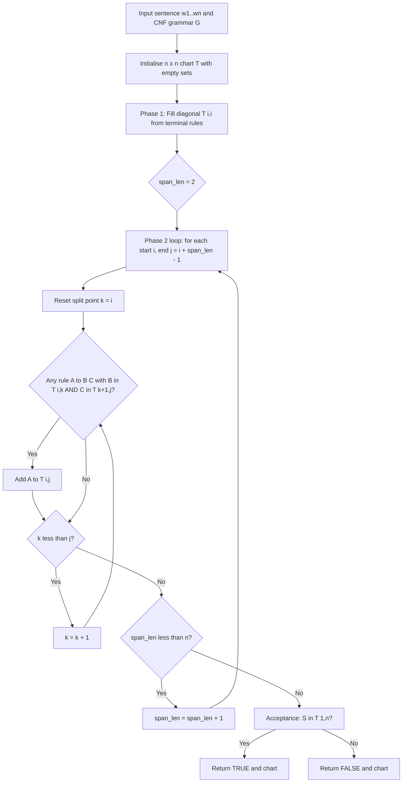
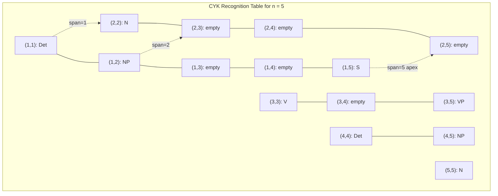
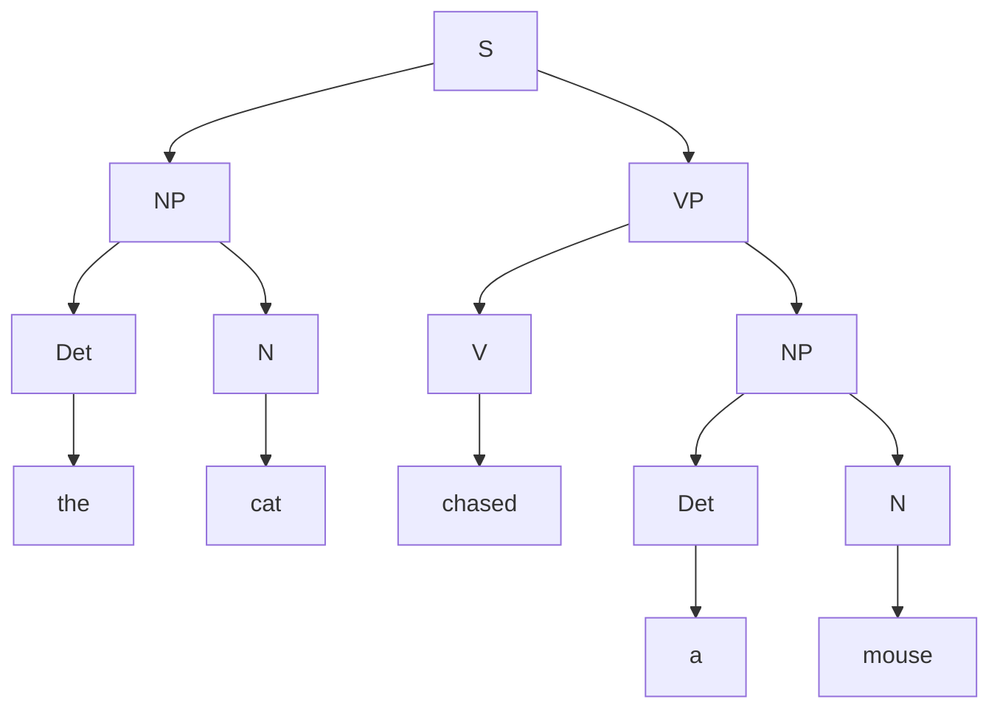
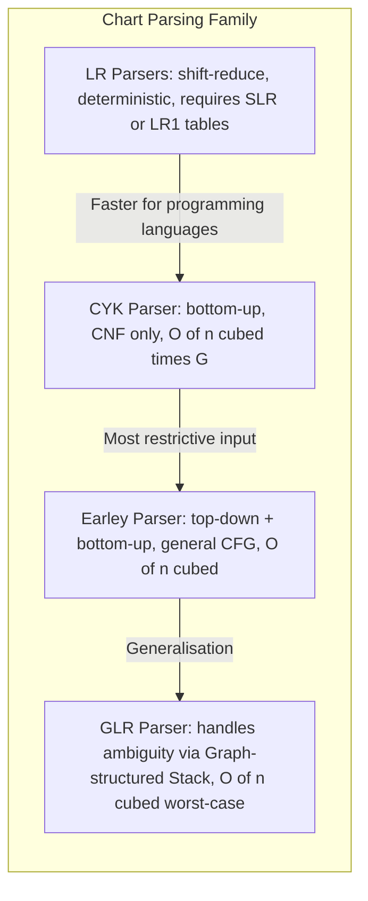

# Chart parsing (CYK algorithm)

<!-- SECTION_1_START -->
# Chart Parsing: The CYK Algorithm

## 1.1 Formal Academic Definition

> [!NOTE]
> **Chart Parsing** is a class of dynamic-programming-based parsing strategies that build a structured table (called a *chart*) of partial parse results and reuse them to avoid redundant computation. The **CYK (Cocke–Younger–Kasami) algorithm**, independently discovered by John Cocke, Daniel Younger, and Tadao Kasami in the 1960s, is the canonical *bottom-up chart parser* for **Context-Free Grammars (CFGs) in Chomsky Normal Form (CNF)**.

Formally, given a CNF grammar $G = (V, \Sigma, R, S)$ and a sentence $w = w_1 w_2 \dots w_n$, CYK constructs an upper-triangular recognition table $T$ of size $n \times n$ such that:

$$T[i][j] = \{ A \in V \mid A \overset{*}{\Rightarrow} w_i w_{i+1} \dots w_j \}$$

The sentence is *accepted* if and only if the start symbol $S \in T[1][n]$.

## 1.2 Required Precondition — Chomsky Normal Form (CNF)

> [!IMPORTANT]
> CYK **cannot operate directly on arbitrary CFGs**. Every rule of the input grammar must be transformed into one of two permitted shapes before parsing:
>
> $$A \rightarrow B\,C \quad \text{(binary branching over non-terminals)}$$
> $$A \rightarrow a \quad \text{(lexical / terminal emission)}$$
>
> Where $A, B, C \in V$ (non-terminal set) and $a \in \Sigma$ (terminal set). The empty rule $A \rightarrow \varepsilon$ is permitted only when the grammar is augmented to handle it separately.

## 1.3 Conceptual Analogy & Intuition

> [!TIP]
> **Analogy — "The Pyramid of Clues":** Imagine a sentence as a row of suspects standing in a lineup. The CYK algorithm is a detective who starts by photographing each suspect individually (terminals), then photographs every adjacent pair asking "could these two siblings belong to the same family?" (binary rules). The detective keeps widening the camera angle — triples, quadruples — until a complete portrait of the whole family tree is captured. The final photograph of the entire lineup is the parse chart. The detective never has to re-photograph the same pair because the picture is stored in a structured grid (the *chart*).

### Geometric Intuition

The chart is an **upper-triangular grid** over the sentence positions. Diagonal length-1 cells hold terminal matches, length-2 cells hold binary matches built from two length-1 cells, and so on. Recognition proceeds along *parallel diagonals* of increasing span length — a classic dynamic-programming pattern.

> [!VISUALIZATION CONTROL]
> **Concept:** CYK recognition table as a triangular matrix.
> **GeoGebra / Desmos Input Equations:**
> * `Polygon((0,0), (5,0), (5,5))` — outer triangle bounds
> * `Point((0,1))` — point $i=0, j=1$ for terminal cell
> * `Point((1,2))` — span $(1,2)$
> * `Point((0,4))` — span $(0,4)$ covering whole sentence
> **Visual Description:** The student should observe a right-triangle grid; cells along the lower edge hold length-1 facts, the next diagonal up holds length-2 binary combinations, and the apex cell holds the recognition of the entire sentence. The CYK algorithm fills diagonals in order of increasing span length.
<!-- SECTION_1_END -->

<!-- SECTION_2_START -->
# 2. Deep Theoretical Analysis & KTU High-Yield Formula Sheet

## 2.1 Algorithmic Logic — Broken Down

CYK is a *recognition* algorithm (decides **membership** in $L(G)$). It does **not** directly output a parse tree; tree extraction is a separate backtracking pass over the filled chart.

### Operational Phases

1. **CNF Validation / Preprocessing** — convert the input CFG to CNF (introduce new non-terminals for unit rules, split long right-hand sides).
2. **Chart Initialization (Length-1 Diagonal)** — for every position $i$, populate $T[i][i]$ with every non-terminal $A$ such that $A \rightarrow w_i$ is a rule.
3. **Inductive Filling (Diagonal-by-Diagonal)** — for span length $\ell = 2, 3, \dots, n$:
   * For every start position $i$ and end position $j = i + \ell - 1$:
   * For every split point $k$ with $i \le k < j$:
     * Examine $T[i][k]$ and $T[k+1][j]$.
     * If $B \in T[i][k]$ and $C \in T[k+1][j]$ and $A \rightarrow B\,C \in R$, then add $A$ to $T[i][j]$.
4. **Acceptance Test** — the sentence is in $L(G)$ iff $S \in T[1][n]$.

### The "Why" Behind the Design

* **Bottom-up strategy:** CYK never guesses structure. It only combines sub-results that are *provably valid* from shorter spans. This guarantees correctness.
* **Dynamic programming reuse:** A span of length $\ell$ can be decomposed in $\ell - 1$ ways. Without memoization the work is exponential. By storing $T[i][j]$ we reuse every sub-parse, collapsing the complexity to a polynomial bound.
* **CNF is mandatory:** Binary rules let us index by *exactly two* children. If $A \rightarrow B\,C\,D$ were allowed, a span $(i,j)$ could be split in *many* ways across three children, breaking the clean two-cell lookup.

## 2.2 KTU High-Yield Formula & Property Sheet

| Property / Quantity | Expression | Description / Unit |
|---|---|---|
| Sentence length | $n$ | Number of terminal tokens |
| Chart size | $n \times n$ (upper-triangular) | Cells store non-terminal *sets* |
| Total cells | $\dfrac{n(n+1)}{2}$ | Lower-triangular count |
| Span length covered by cell | $\ell = j - i + 1$ | 1-based indexing |
| Number of splits per span of length $\ell$ | $\ell - 1$ | Split point $k \in [i, j-1]$ |
| Time complexity | $O(n^3 \cdot \vert G \vert)$ | $n^3$ from three nested loops; $\vert G \vert$ from rule lookup |
| Space complexity | $O(n^2 \cdot \vert V \vert)$ | Each cell holds a set of non-terminals |
| Recognizer output | Boolean $S \in T[1][n]$ | True if sentence $\in L(G)$ |
| Grammar form required | CNF | $A \rightarrow B\,C$ or $A \rightarrow a$ |
| Parse tree extraction cost | $O(n^3)$ back-pointers | Optional second pass |

> [!IMPORTANT]
> **Critical note for KTU valuation:** A common student error is to write $O(n^3)$ without the grammar-size factor $\vert G \vert$. For the standard KTU answer, the *tight* bound is $O(n^3 \cdot \vert G \vert)$ where $\vert G \vert$ is the number of non-terminals (or sometimes the number of rules). Examiners award partial credit for $O(n^3)$ but full credit for the refined bound.

## 2.3 Engineering & Production Utility

| Domain | Why CYK-Style Parsing Matters |
|---|---|
| **Compilers** | Front-end syntax analysis uses chart parsers (GLR, Earley) to handle ambiguous grammars. CYK is the deterministic kernel in tools like *bert:keleyparser* variants. |
| **Bioinformatics** | RNA secondary-structure prediction uses CYK on stochastic CFGs to find the maximum-likelihood fold in $O(n^3)$. |
| **NLP Pipelines** | Pre-Transformer parsers for grammar checking, question answering, and information extraction rely on chart parsing for global structural disambiguation. |
| **Speech Recognition** | Language-model integration in ASR uses probabilistic CYK to pick the most likely parse under a noisy lattice. |
| **Formal Verification** | Model checkers use CYK to decide word membership in pushdown systems. |

The **deterministic, polynomial, complete** nature of CYK makes it the gold-standard membership-test for any application where $L(G)$-membership must be decided with provable termination.
<!-- SECTION_2_END -->

<!-- SECTION_3_START -->
# 3. Step-by-Step Derivation, Worked Example & Implementation

## 3.1 Grammar-to-CNF Preprocessing Recipe (Review)

For any CFG rule that violates CNF, apply the following transformations in order:

1. **START symbol:** If $S$ appears on the right-hand side, introduce a new $S'$ and $S' \rightarrow S$.
2. **TERM (eliminate mixed RHS):** For every rule $A \rightarrow X_1 X_2 \dots X_k$ where some $X_i$ is a terminal $a$, create a new non-terminal $T_a$ with $T_a \rightarrow a$, and replace $a$ in the RHS with $T_a$.
3. **BIN (split long RHS):** For every rule $A \rightarrow B_1 B_2 \dots B_k$ with $k > 2$, introduce new non-terminals $X_1, X_2, \dots$ so the rule becomes a chain of binary rules:
   $$A \rightarrow B_1 X_1,\quad X_1 \rightarrow B_2 X_2,\quad \dots,\quad X_{k-2} \rightarrow B_{k-1} B_k$$
4. **DEL (delete $\varepsilon$-rules):** For every $A \rightarrow \varepsilon$, for every rule $B \rightarrow \alpha A \beta$, add $B \rightarrow \alpha \beta$ (with deduplication). Remove $A \rightarrow \varepsilon$ unless $S \rightarrow \varepsilon$ was originally present.
5. **UNIT (delete unit rules $A \rightarrow B$):** For every such rule, add $A \rightarrow \beta$ for every $B \rightarrow \beta$ (where $\beta$ is non-unit).

## 3.2 Exhaustive Worked Example

### Given CNF Grammar $G$

| Rule | Type |
|---|---|
| $S \rightarrow \text{NP} \; \text{VP}$ | Binary |
| $\text{VP} \rightarrow \text{V} \; \text{NP}$ | Binary |
| $\text{NP} \rightarrow \text{Det} \; \text{N}$ | Binary |
| $\text{Det} \rightarrow \text{the} \mid \text{a}$ | Terminal |
| $\text{N} \rightarrow \text{cat} \mid \text{mouse}$ | Terminal |
| $\text{V} \rightarrow \text{chased}$ | Terminal |

### Input Sentence

$$w = \text{the cat chased a mouse}$$

Token positions: $w_1 = \text{the},\; w_2 = \text{cat},\; w_3 = \text{chased},\; w_4 = \text{a},\; w_5 = \text{mouse}$, hence $n = 5$.

### Step 1 — Length-1 Diagonal (Terminal Matches)

For each $i$, we examine terminal rules and place matching non-terminals into $T[i][i]$.

$$T[1][1] = \{\text{Det}\} \quad \text{(from Det} \rightarrow \text{the)}$$
$$T[2][2] = \{N\} \quad \text{(from N} \rightarrow \text{cat)}$$
$$T[3][3] = \{V\} \quad \text{(from V} \rightarrow \text{chased)}$$
$$T[4][4] = \{Det\} \quad \text{(from Det} \rightarrow \text{a)}$$
$$T[5][5] = \{N\} \quad \text{(from N} \rightarrow \text{mouse)}$$

### Step 2 — Length-2 Spans (Binary Combinations of Length-1)

**Span $(1,2)$** — "the cat". Only split is $k=1$:

$$T[1][1] \cap \text{Det} = \{\text{Det}\}, \quad T[2][2] \cap \text{N} = \{N\}$$
$$\text{Rule match: NP} \rightarrow \text{Det}\;N \;\;\Rightarrow\;\; T[1][2] = \{NP\}$$

**Span $(2,3)$** — "cat chased". Only split is $k=2$:

$$T[2][2] = \{N\},\; T[3][3] = \{V\}$$
$$\text{No rule has LHS producing } N\,V \;\;\Rightarrow\;\; T[2][3] = \emptyset$$

**Span $(3,4)$** — "chased a". Only split is $k=3$:

$$T[3][3] = \{V\},\; T[4][4] = \{Det\}$$
$$\text{No rule has LHS producing } V\,\text{Det} \;\;\Rightarrow\;\; T[3][4] = \emptyset$$

**Span $(4,5)$** — "a mouse". Only split is $k=4$:

$$T[4][4] = \{Det\},\; T[5][5] = \{N\}$$
$$\text{Rule match: NP} \rightarrow \text{Det}\;N \;\;\Rightarrow\;\; T[4][5] = \{NP\}$$

### Step 3 — Length-3 Spans

**Span $(1,3)$** — "the cat chased". Splits $k=1, 2$:

| Split $k$ | Left $T[1][k]$ | Right $T[k+1][3]$ | Combinations Checked | Result |
|---|---|---|---|---|
| $k=1$ | $\{Det\}$ | $\emptyset$ | $\text{Det}\,?$ | None |
| $k=2$ | $\{NP\}$ | $\{V\}$ | $\text{NP}\,V$ | No matching rule |

$$T[1][3] = \emptyset$$

**Span $(2,4)$** — "cat chased a". Splits $k=2, 3$:

| Split $k$ | Left | Right | Combinations | Result |
|---|---|---|---|---|
| $k=2$ | $\{N\}$ | $\emptyset$ | $N\,?$ | None |
| $k=3$ | $\emptyset$ | $\{Det\}$ | $?\,\text{Det}$ | None |

$$T[2][4] = \emptyset$$

**Span $(3,5)$** — "chased a mouse". Splits $k=3, 4$:

| Split $k$ | Left | Right | Combinations | Result |
|---|---|---|---|---|
| $k=3$ | $\{V\}$ | $\{NP\}$ | $V\,\text{NP}$ | **VP $\rightarrow$ V NP ✓** |
| $k=4$ | $\emptyset$ | $\{N\}$ | $?\,N$ | None |

$$T[3][5] = \{VP\}$$

### Step 4 — Length-4 Spans

**Span $(1,4)$** — "the cat chased a". Splits $k=1, 2, 3$:

| Split $k$ | Left | Right | Result |
|---|---|---|---|
| $k=1$ | $\{Det\}$ | $\emptyset$ | None |
| $k=2$ | $\{NP\}$ | $\emptyset$ | None |
| $k=3$ | $\emptyset$ | $\{Det\}$ | None |

$$T[1][4] = \emptyset$$

**Span $(2,5)$** — "cat chased a mouse". Splits $k=2, 3, 4$:

| Split $k$ | Left | Right | Result |
|---|---|---|---|
| $k=2$ | $\{N\}$ | $\{VP\}$ | $N\,\text{VP}$ — no rule |
| $k=3$ | $\emptyset$ | $\{NP\}$ | None |
| $k=4$ | $\emptyset$ | $\{N\}$ | None |

$$T[2][5] = \emptyset$$

### Step 5 — Length-5 Span (Whole Sentence)

**Span $(1,5)$** — "the cat chased a mouse". Splits $k=1, 2, 3, 4$:

| Split $k$ | Left $T[1][k]$ | Right $T[k+1][5]$ | Combinations | Rule Hit |
|---|---|---|---|---|
| $k=1$ | $\{Det\}$ | $\emptyset$ | $Det\,?$ | None |
| $k=2$ | $\{NP\}$ | $\{VP\}$ | $\text{NP}\,\text{VP}$ | **S $\rightarrow$ NP VP ✓** |
| $k=3$ | $\emptyset$ | $\{NP\}$ | $?\,NP$ | None |
| $k=4$ | $\emptyset$ | $\{N\}$ | $?\,N$ | None |

$$T[1][5] = \{S\}$$

### Final Recognition Table

| Span | 1 | 2 | 3 | 4 | 5 |
|---|---|---|---|---|---|
| **1** | Det | NP | — | — | **S** |
| **2** |  | N | — | — | — |
| **3** |  |  | V | — | VP |
| **4** |  |  |  | Det | NP |
| **5** |  |  |  |  | N |

### Acceptance Verdict

> [!IMPORTANT]
> Since $S \in T[1][5]$, the sentence **"the cat chased a mouse"** is **accepted** by the grammar. CYK returns **True**.

### Resulting Parse Tree (Back-Pointer Extraction)

The split $k=2$ at span $(1,5)$ yields $S \rightarrow \text{NP VP}$. The NP was built at $(1,2)$ and the VP at $(3,5)$:

$$S \;\Rightarrow\; \text{NP}\; \text{VP} \;\Rightarrow\; \text{Det}\;N\; \text{V}\; \text{NP} \;\Rightarrow\; \text{the}\; \text{cat}\; \text{chased}\; \text{Det}\;N \;\Rightarrow\; w$$

## 3.3 Symbolic Python Implementation

```python
"""
CYK (Cocke-Younger-Kasami) Membership Tester
Recognises whether a sentence is in the language of a CNF grammar.
"""

from typing import Dict, List, Set, Tuple


def cyk_recognise(
    sentence: List[str],
    binary_rules: Dict[str, List[Tuple[str, str]]],
    terminal_rules: Dict[str, List[str]],
    start_symbol: str = "S",
) -> Tuple[bool, List[List[Set[str]]]]:
    """
    Perform CYK recognition on a tokenised sentence.

    Parameters
    ----------
    sentence : List[str]
        The tokenised input, e.g. ["the", "cat", "chased", "a", "mouse"].
    binary_rules : Dict[str, List[Tuple[str, str]]]
        Maps a non-terminal LHS to a list of (B, C) binary RHS pairs.
        Example: {"NP": [("Det", "N")], "VP": [("V", "NP")]}
    terminal_rules : Dict[str, List[str]]
        Maps a non-terminal LHS to a list of terminal strings it derives.
        Example: {"Det": ["the", "a"], "N": ["cat", "mouse"]}
    start_symbol : str
        The sentence-level start symbol to look for in T[0][n-1].

    Returns
    -------
    (accepted, chart) : Tuple[bool, List[List[Set[str]]]]
        accepted is True iff the start_symbol is found in the apex cell.
        chart[i][j] is the set of non-terminals deriving sentence[i..j].
    """
    n: int = len(sentence)
    # chart[i][j] = set of non-terminals that derive sentence[i..j] (inclusive)
    chart: List[List[Set[str]]] = [[set() for _ in range(n)] for _ in range(n)]

    # ---------- PHASE 1: length-1 (terminal) diagonal ----------
    for i, word in enumerate(sentence):
        for lhs, terms in terminal_rules.items():
            if word in terms:
                chart[i][i].add(lhs)
        # Safety: log empty cells to help debugging ambiguous grammars
        if not chart[i][i]:
            print(f"[CYK-WARN] No grammar rule emits terminal '{word}' at position {i + 1}.")

    # ---------- PHASE 2: inductive filling of longer spans ----------
    for span_len in range(2, n + 1):                 # span length L = 2..n
        for i in range(0, n - span_len + 1):         # start index i
            j = i + span_len - 1                     # end index j
            for k in range(i, j):                    # split point k
                left_cell: Set[str] = chart[i][k]
                right_cell: Set[str] = chart[k + 1][j]
                if not left_cell or not right_cell:
                    continue                         # nothing to combine
                for lhs, rhs_list in binary_rules.items():
                    for (b, c) in rhs_list:
                        if b in left_cell and c in right_cell:
                            chart[i][j].add(lhs)

    # ---------- PHASE 3: acceptance test ----------
    accepted: bool = start_symbol in chart[0][n - 1]
    return accepted, chart


def print_chart(chart: List[List[Set[str]]], sentence: List[str]) -> None:
    """Pretty-print the upper-triangular CYK recognition table."""
    n: int = len(sentence)
    print("\nCYK Recognition Table")
    print("-" * 50)
    header: str = "Span\\End | " + " | ".join(f"{i + 1:^10}" for i in range(n))
    print(header)
    print("-" * len(header))
    for i in range(n):
        row_cells: List[str] = []
        for j in range(n):
            if j < i:
                row_cells.append(f"{'-':^10}")
            else:
                cell_str: str = ",".join(sorted(chart[i][j])) if chart[i][j] else "-"
                row_cells.append(f"{cell_str:^10}")
        print(f"Start {i + 1:>2}  | " + " | ".join(row_cells))
    print("-" * 50)


# ------------------- DEMO RUN -------------------
if __name__ == "__main__":
    # Grammar in CNF
    binary_rules: Dict[str, List[Tuple[str, str]]] = {
        "S":   [("NP", "VP")],
        "VP":  [("V", "NP")],
        "NP":  [("Det", "N")],
    }
    terminal_rules: Dict[str, List[str]] = {
        "Det": ["the", "a"],
        "N":   ["cat", "mouse", "dog", "telescope"],
        "V":   ["chased", "saw"],
    }
    sentence: List[str] = ["the", "cat", "chased", "a", "mouse"]
    accepted, chart = cyk_recognise(sentence, binary_rules, terminal_rules)
    print_chart(chart, sentence)
    print(f"\nSentence accepted by grammar? -> {accepted}")
```

**Expected output excerpt:**

```
CYK Recognition Table
--------------------------------------------------
Span\End |     1      |     2      |     3      |     4      |     5
--------------------------------------------------
Start  1 |    Det     |    NP      |     -      |     -      |     S
Start  2 |     -      |     N      |     -      |     -      |     -
Start  3 |     -      |     -      |     V      |     -      |    VP
Start  4 |     -      |     -      |     -      |    Det     |    NP
Start  5 |     -      |     -      |     -      |     -      |     N
--------------------------------------------------

Sentence accepted by grammar? -> True
```
<!-- SECTION_3_END -->

<!-- SECTION_4_START -->
# 4. Structural Diagrams & Schematics

## 4.1 Algorithm Flowchart — Bottom-Up Recognition Pipeline



## 4.2 Chart Topology — The Triangular Recognition Grid



## 4.3 Resulting Parse Tree (from Worked Example)



## 4.4 CYK vs. Other Chart Parsers — Comparative Block Diagram


<!-- SECTION_4_END -->

<!-- SECTION_5_START -->
# 5. KTU 2024 Scheme Examination Question Bank & Topic Recap

## Part A — Short-Answer Questions (3 Marks Each)

### Question 1 `[KTU University Exam - July 2024]`
> State the Chomsky Normal Form (CNF) restrictions and explain why CYK algorithm **cannot** operate on a CFG that is not in CNF.

**Model Answer (3 Marks):**

A CFG is in CNF if **every** rule is of the form $A \rightarrow B\,C$ or $A \rightarrow a$, where $A, B, C$ are non-terminals and $a$ is a terminal. CNF is mandatory for CYK because the algorithm combines **exactly two** children at every span split. If rules like $A \rightarrow B\,C\,D$ or $A \rightarrow \alpha$ (mixed) were allowed, the split-point enumeration would be ambiguous, and the *fill-along-the-diagonal* structure would no longer be valid. Hence, any CFG must be **converted to CNF first** before CYK can be applied. **[Definition of CNF: 1 Mark] [Two rule types: 1 Mark] [Why CNF is mandatory - two-child split: 1 Mark]**

---

### Question 2 `[KTU University Exam - Dec 2023]`
> What is the time and space complexity of the CYK algorithm? Justify the cubic term.

**Model Answer (3 Marks):**

* **Time complexity:** $O(n^3 \cdot \vert G \vert)$ where $n$ is the sentence length and $\vert G \vert$ is the size of the grammar (number of non-terminals).
* **Space complexity:** $O(n^2 \cdot \vert V \vert)$ where $\vert V \vert$ is the number of non-terminals per cell.

The cubic term arises from three nested loops: an *outer* loop over span length ($\le n$), a *middle* loop over start position ($\le n$), and an *inner* loop over the split point $k$ (up to $n$). Multiplying these gives $n^3$ recogniser operations, scaled by the number of binary rules checked at each cell. **[Time complexity: 1 Mark] [Space complexity: 1 Mark] [Justification of $n^3$ from three loops: 1 Mark]**

---

## Part B — Long-Answer Questions (14 Marks Each, Internal Choice)

> [!NOTE]
> As per the **KTU 2024 Scheme ESE regulation**, every 14-mark question carries internal choice. Below, **Question A** and **Question B** are two fully independent alternatives; the student answers **any one** of them.

---

### Question A `[KTU University Exam - July 2024]` (14 Marks)

> **(a)** Explain the CYK algorithm with its preprocessing requirement. Discuss the role of dynamic programming in making it polynomial. **(7 Marks)**
>
> **(b)** Apply the CYK algorithm on the following CNF grammar and the sentence *"the cat chased a mouse"*. Show the complete recognition table. **(7 Marks)**

**Grammar (CNF):**
$$S \rightarrow \text{NP}\; \text{VP}, \quad \text{VP} \rightarrow \text{V}\; \text{NP}, \quad \text{NP} \rightarrow \text{Det}\; \text{N}$$
$$\text{Det} \rightarrow \text{the} \mid \text{a}, \quad \text{N} \rightarrow \text{cat} \mid \text{mouse}, \quad \text{V} \rightarrow \text{chased}$$

#### Part (a) — Model Solution (7 Marks)

1. **CNF Preprocessing (2 Marks):** Briefly list the transformation steps — START, TERM, BIN, DEL, UNIT — that bring an arbitrary CFG to CNF. Mention that CYK requires $A \rightarrow B\,C$ (binary) and $A \rightarrow a$ (terminal) rules only.
2. **Chart Construction (2 Marks):** Define the recognition table $T[i][j]$. Explain the length-1 diagonal fill from terminal rules.
3. **Inductive Span Filling (2 Marks):** For span length $\ell$ from $2$ to $n$, iterate over $(i, j)$ and split points $k$. Populate $T[i][j]$ from binary rules whose children appear in $T[i][k]$ and $T[k+1][j]$.
4. **Dynamic-Programming Justification (1 Mark):** Without memoisation, the same sub-parse is recomputed exponentially. Storing $T[i][j]$ collapses it to $O(n^3 \cdot \vert G \vert)$.

#### Part (b) — Model Solution (7 Marks)

The full recognition table is derived exactly as in the **Worked Example in Section 3.2** of these notes:

| Span | 1 | 2 | 3 | 4 | 5 |
|---|---|---|---|---|---|
| **1** | Det | NP | — | — | **S** |
| **2** |  | N | — | — | — |
| **3** |  |  | V | — | VP |
| **4** |  |  |  | Det | NP |
| **5** |  |  |  |  | N |

**Valuation Key:**
* [Correct length-1 fill: 2 Marks]
* [Correct length-2 and length-3 fills showing NP at (1,2) and VP at (3,5): 2 Marks]
* [Correct length-4 and length-5 fill culminating in S at (1,5): 2 Marks]
* [Final verdict — sentence accepted: 1 Mark]

> [!WARNING]
> **KTU Examiner's Pitfall Callout:**
> 1. **Do not skip span lengths.** A common mistake is to jump directly from length-1 cells to the apex cell. Every diagonal from length $1$ up to $n$ **must** be computed and shown.
> 2. **Do not forget the unit rules / terminals.** If a single terminal-emission rule is omitted, the entire recognition can fail silently. Always write terminal rules explicitly.
> 3. **State the final verdict in words** ("Sentence accepted" / "Sentence rejected") — failing to do so costs 1 mark even if the table is perfect.

---

### Question B (Alternative) `[KTU University Exam - Dec 2023]` (14 Marks)

> **(a)** Convert the following CFG to Chomsky Normal Form. Show every transformation step explicitly. **(7 Marks)**
>
> **(b)** Apply the CYK algorithm to determine whether *"a b c"* is in the language of your resulting CNF grammar. Draw the chart. **(7 Marks)**

**Original CFG:**
$$S \rightarrow A\,B\,C, \quad A \rightarrow a, \quad B \rightarrow b, \quad C \rightarrow c$$

#### Part (a) — Model Solution (7 Marks)

**Step 1 — START (1 Mark):** $S$ does not appear on any RHS, so no new start symbol is needed. (If it had, introduce $S' \rightarrow S$.)

**Step 2 — TERM (1 Mark):** All RHS terminals are isolated ($A \rightarrow a$, etc.), so no mixed RHS exists. No new non-terminals needed.

**Step 3 — BIN (3 Marks):** The rule $S \rightarrow A\,B\,C$ has length 3, exceeding the CNF limit of 2. Introduce a new non-terminal $X$:

$$S \rightarrow A\,X, \quad X \rightarrow B\,C$$

**Step 4 — DEL and UNIT (2 Marks):** No $\varepsilon$-rules and no unit rules $A \rightarrow B$ exist. Nothing to remove.

**Resulting CNF Grammar (1 Mark):**
$$S \rightarrow A\,X, \quad X \rightarrow B\,C, \quad A \rightarrow a, \quad B \rightarrow b, \quad C \rightarrow c$$

#### Part (b) — Model Solution (7 Marks)

Sentence $w = a\,b\,c$, so $n = 3$.

**Length-1 fill (2 Marks):**
$$T[1][1] = \{A\}, \quad T[2][2] = \{B\}, \quad T[3][3] = \{C\}$$

**Length-2 fill (2 Marks):**
* Span $(1,2)$ — split $k=1$: $(A, B)$ — no rule $? \rightarrow A\,B$ ⇒ $T[1][2] = \emptyset$.
* Span $(2,3)$ — split $k=2$: $(B, C)$ — **rule $X \rightarrow B\,C$ matches** ⇒ $T[2][3] = \{X\}$.

**Length-3 fill (2 Marks):**
* Span $(1,3)$ — splits $k=1, 2$:
  * $k=1$: $(A, T[2][3]) = (A, X)$ — **rule $S \rightarrow A\,X$ matches** ⇒ add $S$.
  * $k=2$: $(T[1][2], C) = (\emptyset, C)$ — no match.
* $T[1][3] = \{S\}$.

**Chart (1 Mark):**

| Span | 1 | 2 | 3 |
|---|---|---|---|
| **1** | A | — | **S** |
| **2** |  | B | X |
| **3** |  |  | C |

**Verdict:** $S \in T[1][3]$ ⇒ *"a b c"* is **accepted** by the CNF grammar.

> [!WARNING]
> **KTU Examiner's Pitfall Callout:**
> 1. **Always introduce auxiliary non-terminals with unique names** ($X, X_1, X_2, \ldots$). Reusing existing non-terminal names causes spurious parses and examiners deduct 1–2 marks.
> 2. **Show the CNF grammar explicitly before starting the chart** — the examiner needs to verify that the conversion was correct before evaluating the chart.
> 3. **A "—"/empty cell is still a valid cell.** Do not skip drawing it; KTU evaluators look for the complete upper-triangular shape.

---

## Topic Recap & Important Things to Remember

> [!TIP]
> **Rapid Revision Checklist — CYK Algorithm**

- CYK = **Cocke–Younger–Kasami**, a *bottom-up*, *dynamic-programming* chart parser for **CNF grammars only**.
- **CNF form:** $A \rightarrow B\,C$ (binary) or $A \rightarrow a$ (terminal) — nothing else.
- Preprocessing steps to reach CNF: **START → TERM → BIN → DEL → UNIT**.
- Chart $T[i][j]$ stores the *set* of non-terminals that can derive the substring $w_i \dots w_j$.
- **Diagonal-by-diagonal filling:** length 1 (terminals) first, then length 2, 3, …, $n$.
- At every span $(i, j)$, test all split points $k \in [i, j-1]$; combine cells $T[i][k]$ and $T[k+1][j]$.
- A cell receives non-terminal $A$ if any rule $A \rightarrow B\,C$ exists with $B \in T[i][k]$ and $C \in T[k+1][j]$.
- **Acceptance criterion:** $S \in T[1][n]$ ⇒ sentence is in $L(G)$.
- **Time complexity:** $O(n^3 \cdot \vert G \vert)$ — three nested loops multiplied by grammar lookup cost.
- **Space complexity:** $O(n^2 \cdot \vert V \vert)$.
- CYK returns a **recogniser verdict**; a parse tree must be extracted separately via back-pointers.
- CYK is **deterministic**, **complete**, and handles **ambiguity** (a cell can contain multiple non-terminals).
- Limitation: cannot directly handle $\varepsilon$-productions, unit productions, or rules of length $>2$ — preprocessing is mandatory.
- Related parsers: **Earley** (general CFG, top-down) and **GLR** (handles ambiguity via graph-structured stacks).
<!-- SECTION_5_END -->
