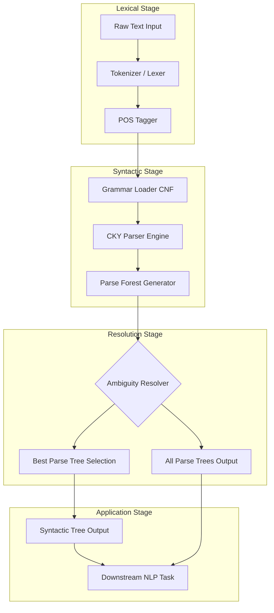
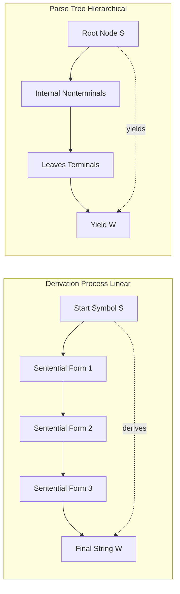
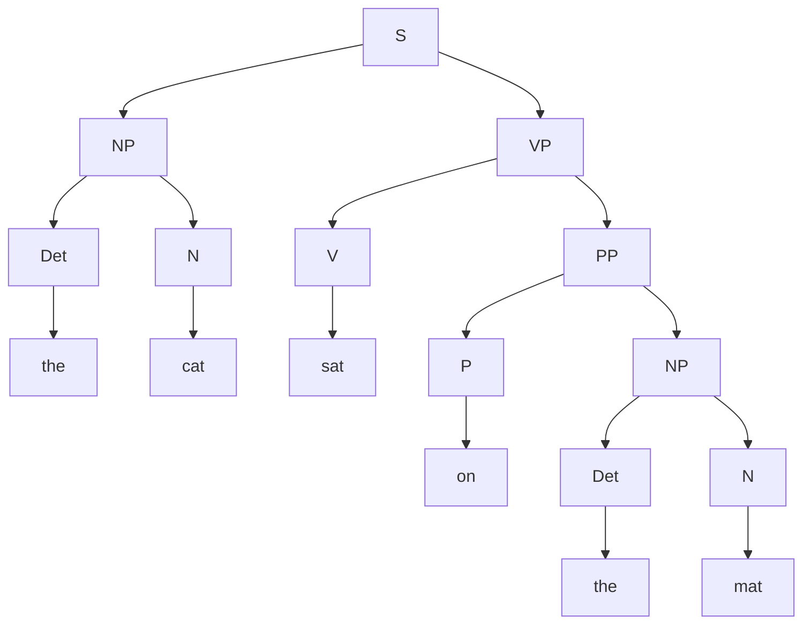
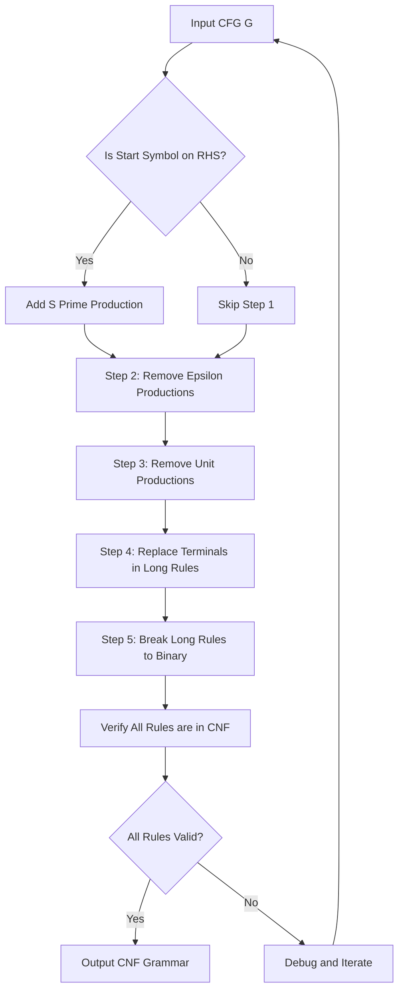
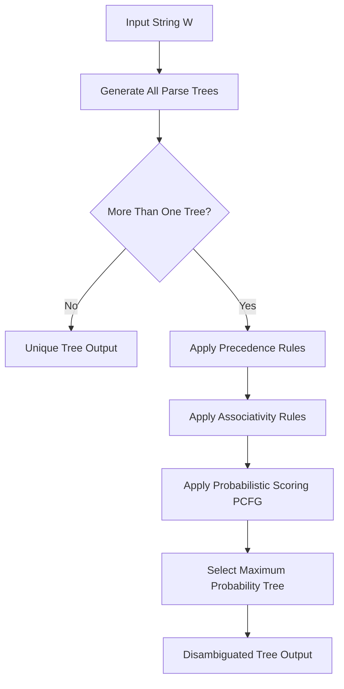

# Context-Free Grammars (CFG)

<!-- SECTION_1_START -->
# Context-Free Grammars (CFG) — The Backbone of NLP Syntax

## 1.1 Formal Academic Definition (KTU 2024 Scheme Terminology)

> [!IMPORTANT]
> **Context-Free Grammar (CFG)**: A Context-Free Grammar is formally defined as a **4-tuple ordered structure** $G = (N, \Sigma, R, S)$ where every component serves a distinct syntactic role in defining a formal language.

The four formal components of a CFG are:

* **$N$** — A finite, non-empty set of **non-terminal symbols** (also called syntactic variables or phrasal categories). Examples: $S, NP, VP, PP, Det, N, V$ in English syntax.
* **$\Sigma$** — A finite, non-empty set of **terminal symbols** (the actual vocabulary/words of the language). Disjoint from $N$, i.e., $N \cap \Sigma = \emptyset$. Examples: *the, cat, dog, runs, ate, a*.
* **$R$** — A finite set of **production rules** (also called rewrite rules) of the form $A \to \alpha$, where $A \in N$ and $\alpha \in (N \cup \Sigma)^{*}$. The term *context-free* means the left-hand side contains exactly one non-terminal, **regardless of context**.
* **$S$** — A distinguished **start symbol**, with $S \in N$. Every valid derivation in the grammar must originate from $S$.

> [!NOTE]
> The language generated by a CFG is called a **Context-Free Language (CFL)**. The set of all strings derivable from $S$ in zero or more steps is denoted $L(G)$.

## 1.2 Conceptual Analogy — The "Recipe Book" Intuition

Imagine a CFG as a **structured recipe book for building sentences**. Think of it this way:

* **Non-terminals** = *recipe categories* like "Main Course" or "Dessert" — they describe the **role** a phrase plays, not the actual words.
* **Terminals** = the *actual ingredients* — "salt", "flour", "sugar". Once used, they cannot be broken down further.
* **Productions** = the *cooking instructions* that tell you how to expand one category into a more detailed combination of sub-categories or ingredients.
* **Start symbol** = the *book cover* titled "Sentence Recipe".

> [!TIP]
> **Geometric / Structural Intuition**: A CFG naturally corresponds to a **tree structure** (parse tree). The root is the start symbol $S$, internal nodes are non-terminals being expanded, and the leaves spell out the final sentence. Every path from root to leaf is one "cooking step" of the recipe.

## 1.3 Real-World NLP Application Snapshot

| Application Domain | Role of CFG |
|---|---|
| **Syntactic Parsing** | Building parse trees for English, Hindi, code |
| **Machine Translation** | Aligning syntactic structures across languages |
| **Speech Recognition** | Disambiguating phonetically identical sequences |
| **Compiler Design** | Parsing programming language source code |
| **Information Extraction** | Identifying noun-phrase chunks in text |
| **Grammar Checking** | Detecting ungrammatical sentence constructions |

> [!VISUALIZATION CONTROL]
> **Concept:** Hierarchical Expansion of a Sentence via CFG Rules
> **GeoGebra / Desmos Input Equations:**
> * Tree with root $S$ branching to $NP$ and $VP$
> * $NP$ branching to $Det$ and $N$
> * $VP$ branching to $V$ and $NP$
> * Leaves labeled "the", "cat", "ate", "the", "mouse"
> **Visual Description:** Observe the top-down left-to-right expansion. The depth of the tree represents the **syntactic depth** of the sentence, while the breadth represents the **structural complexity**.

<!-- SECTION_1_END -->

<!-- SECTION_2_START -->
# Deep Theoretical Analysis & KTU High-Yield Formula Sheet

## 2.1 The Mechanics of Production Application — "Derivation"

A **derivation** is a sequential process of replacing a non-terminal by the right-hand side of one of its production rules. The formal relation is denoted by the symbol $\Rightarrow$ (one-step derivation) and $\overset{*}{\Rightarrow}$ (zero-or-more-step derivation).

### 2.1.1 Types of Derivations

> [!IMPORTANT]
> **Leftmost Derivation**: At every step, the **leftmost** non-terminal in the current sentential form is expanded first. This is the standard form used by **top-down parsers** like Recursive Descent and LL($k$) parsers.

> [!IMPORTANT]
> **Rightmost Derivation (Canonical Derivation)**: At every step, the **rightmost** non-terminal is expanded first. This is the standard form used by **bottom-up parsers** like Shift-Reduce and LR($k$) parsers.

Both derivations produce the **same parse tree** but differ in the order of rule application. The parse tree is unique for unambiguous grammars.

## 2.2 Formal Definition — Production Rule Taxonomy

| Production Form | Name | CFG Permitted? |
|---|---|---|
| $A \to BC$ | Binary production | **Yes** (canonical in CNF) |
| $A \to a$ | Lexical / Terminal production | **Yes** (canonical in CNF) |
| $A \to \alpha \, \beta$ (where $\vert \alpha \vert \geq 1$) | Standard production | **Yes** (general CFG) |
| $A \to \varepsilon$ | Epsilon / Null production | **Yes** (must be handled carefully) |
| $A \to B$ | Unit production | **Yes** (often eliminated for efficiency) |
| $\alpha A \beta \to \gamma$ | Context-sensitive production | **No** (this belongs to Type-1) |

## 2.3 Sentential Forms, Sentences, and the Language

* **Sentential Form**: Any string $\alpha \in (N \cup \Sigma)^{*}$ such that $S \overset{*}{\Rightarrow} \alpha$. May contain non-terminals.
* **Sentence**: A sentential form consisting **entirely of terminals**, i.e., $\alpha \in \Sigma^{*}$. Also called a **yield** of the parse tree.
* **Language $L(G)$**: The set of all sentences generated by $G$, formally $L(G) = \{ w \in \Sigma^{*} \mid S \overset{*}{\Rightarrow} w \}$.

## 2.4 Grammar Ambiguity — The Critical KTU Concept

> [!IMPORTANT]
> **Ambiguous Grammar**: A CFG $G$ is said to be **ambiguous** if there exists at least one string $w \in L(G)$ that has **two or more distinct parse trees** (or equivalently, two distinct leftmost derivations or two distinct rightmost derivations).

A famous classic example is the arithmetic expression grammar:

$$
E \to E + E \mid E \times E \mid (E) \mid a
$$

The string $a + a \times a$ has **two parse trees** — one giving $+$ higher precedence, another giving $\times$ higher precedence. This is **resolvable** by enforcing precedence and associativity in a modified grammar.

> [!WARNING]
> **KTU Examiner's Trap**: The string $a + a + a$ alone has **two parse trees** even in the grammar $E \to E + E \mid a$ because of left vs right associativity. Always count trees carefully.

## 2.5 KTU High-Yield Formula Sheet

| Formula / Concept | Mathematical Notation | Engineering Meaning |
|---|---|---|
| CFG Definition | $G = (N, \Sigma, R, S)$ | The 4-tuple grammar spec |
| Language Generated | $L(G) = \{ w \in \Sigma^{*} \mid S \overset{*}{\Rightarrow} w \}$ | Set of valid sentences |
| Leftmost Derivation | $S \Rightarrow_{lm} w_1 \Rightarrow_{lm} w_2 \Rightarrow_{lm} \ldots \Rightarrow_{lm} w_n$ | Top-down expansion order |
| Rightmost Derivation | $S \Rightarrow_{rm} w_1 \Rightarrow_{rm} w_2 \Rightarrow_{rm} \ldots \Rightarrow_{rm} w_n$ | Bottom-up expansion order |
| Ambiguity Test | $\exists w \in L(G) \mid$ **count of parse trees of $w$** $> 1$ | Inherently ambiguous detection |
| Yield of Parse Tree | $yield(T) = $ concatenation of all leaves of $T$ in left-to-right order | The string the tree represents |
| Chomsky Normal Form | $A \to BC$ or $A \to a$ | Canonical form for CKY parsing |
| Greibach Normal Form | $A \to a \alpha$ where $a \in \Sigma, \alpha \in N^{*}$ | Canonical form for top-down parsing |
| Pumping Lemma (CFL) | $w = uvxyz$, $\vert vxy \vert \leq p$, $\vert vy \vert \geq 1$, $uv^{i}xy^{i}z \in L$ for $i \geq 0$ | Proves a language is **not** context-free |
| Closure under Union | $L_1 \cup L_2$ is a CFL if $L_1, L_2$ are CFLs | $S \to S_1 \mid S_2$ |
| Closure under Concatenation | $L_1 L_2$ is a CFL if $L_1, L_2$ are CFLs | $S \to S_1 S_2$ |
| Closure under Kleene Star | $L_1^{*}$ is a CFL if $L_1$ is a CFL | $S \to S S_1 \mid \varepsilon$ |
| **Not closed under Intersection** | $L_1 \cap L_2$ need not be a CFL | Classic counterexample exists |
| **Not closed under Complement** | $\overline{L}$ need not be a CFL | De Morgan's law consequence |

> [!NOTE]
> **Key Constants / Symbols for KTU Board Exam**:
> * $N$ — Non-terminals, typically uppercase letters $S, A, B, C, \ldots$
> * $\Sigma$ — Terminals, typically lowercase letters $a, b, c, \ldots$
> * $\varepsilon$ — The empty string (length zero)
> * $\Rightarrow$ — Derives in one step; $\overset{*}{\Rightarrow}$ — derives in zero or more steps
> * $\overset{+}{\Rightarrow}$ — derives in one or more steps

## 2.6 Chomsky Normal Form (CNF) — The Most Exam-Critical Transformation

> [!IMPORTANT]
> **Chomsky Normal Form (CNF)**: A CFG is in CNF if every production is in one of the two allowed forms:
> 1. $A \to BC$ where $A, B, C \in N$ (binary non-terminal expansion), OR
> 2. $A \to a$ where $a \in \Sigma$ (terminal emission).
> The start symbol $S$ is allowed an extra rule $S \to \varepsilon$ only if $\varepsilon \in L(G)$.

### Algorithm to Convert Any CFG to CNF (KTU Frequently Tested)

**Step 1 — START**: Introduce a new start symbol $S'$ with rule $S' \to S$ if $S$ appears on the right-hand side of any rule.

**Step 2 — REMOVE $\varepsilon$-PRODUCTIONS**: For every production $A \to \varepsilon$, add new productions where $A$ is omitted from the right-hand side of every existing rule containing $A$. Then delete $A \to \varepsilon$.

**Step 3 — REMOVE UNIT PRODUCTIONS**: For every $A \to B$ (unit production), add all non-unit productions of $B$ to $A$. Then delete $A \to B$.

**Step 4 — REPLACE TERMINALS IN LONG RULES**: For every production $A \to X_1 X_2 \ldots X_n$ where $n \geq 2$ and some $X_i$ is a terminal, replace each such terminal $a$ with a new non-terminal $N_a$ and add rule $N_a \to a$.

**Step 5 — BREAK LONG RULES INTO BINARY**: For every production $A \to B_1 B_2 \ldots B_n$ with $n \geq 3$, introduce new non-terminals $C_1, C_2, \ldots, C_{n-2}$ and replace with:
$$ A \to B_1 C_1, \quad C_1 \to B_2 C_2, \quad \ldots, \quad C_{n-2} \to B_{n-1} B_n $$

## 2.7 Real-World Production Utility of CFG

In production NLP systems, CFG-driven parsing is used in:

* **Constituency Parsers** (Stanford Parser, Berkeley Parser) — used for sentiment analysis pipelines
* **Probabilistic CFG (PCFG)** — extends CFG with rule probabilities for probabilistic parsing
* **CYK Algorithm (Cocke-Younger-Kasami)** — operates on CNF; $O(n^{3})$ time complexity
* **Earley Parsing** — handles ambiguous grammars efficiently for left-recursive rules
* **Lexicalized Grammars** — HPSG, LFG, TAG, CCG — extend CFG for linguistic adequacy

<!-- SECTION_2_END -->

<!-- SECTION_3_START -->
# Step-by-Step Derivations & Symbolic Implementation

## 3.1 Exhaustive Worked Example — Building a CFG for English Noun Phrases

Let us construct a CFG that generates simple declarative English sentences with noun phrases, verb phrases, prepositional phrases, and determiners.

### 3.1.1 The Source Grammar $G_1$

The non-terminals, terminals, productions, and start symbol are formally enumerated:

$$
\begin{aligned}
N &= \{S, NP, VP, PP, Det, N, V, P\} \\
\Sigma &= \{the, a, man, woman, telescope, park, saw, walked, with, in\} \\
S &= S \text{ (sentence start symbol)} \\
R &= \{
   S \to NP \, VP, \\
   NP \to Det \, N \mid NP \, PP, \\
   VP \to V \mid VP \, PP, \\
   PP \to P \, NP, \\
   Det \to the \mid a, \\
   N \to man \mid woman \mid telescope \mid park, \\
   V \to saw \mid walked, \\
   P \to with \mid in
\}
\end{aligned}
$$

### 3.1.2 Generating the Sentence "*the man saw the woman with the telescope*"

We perform an explicit **leftmost derivation** step-by-step:

$$
\begin{aligned}
S &\Rightarrow NP \, VP \quad &&\text{[Apply } S \to NP \, VP\text{]} \\
  &\Rightarrow Det \, N \, VP \quad &&\text{[Apply } NP \to Det \, N\text{]} \\
  &\Rightarrow the \, N \, VP \quad &&\text{[Apply } Det \to the\text{]} \\
  &\Rightarrow the \, man \, VP \quad &&\text{[Apply } N \to man\text{]} \\
  &\Rightarrow the \, man \, V \, NP \quad &&\text{[Apply } VP \to V \, NP \text{ (no, }VP \to V \text{ is also valid, we choose } V\,NP \text{)}]} \\
  &\Rightarrow the \, man \, saw \, NP \quad &&\text{[Apply } V \to saw\text{]} \\
  &\Rightarrow the \, man \, saw \, Det \, N \, PP \quad &&\text{[Apply } NP \to NP \, PP\text{]} \\
  &\Rightarrow the \, man \, saw \, the \, N \, PP \quad &&\text{[Apply } Det \to the\text{]} \\
  &\Rightarrow the \, man \, saw \, the \, woman \, PP \quad &&\text{[Apply } N \to woman\text{]} \\
  &\Rightarrow the \, man \, saw \, the \, woman \, P \, NP \quad &&\text{[Apply } PP \to P \, NP\text{]} \\
  &\Rightarrow the \, man \, saw \, the \, woman \, with \, NP \quad &&\text{[Apply } P \to with\text{]} \\
  &\Rightarrow the \, man \, saw \, the \, woman \, with \, Det \, N \quad &&\text{[Apply } NP \to Det \, N\text{]} \\
  &\Rightarrow the \, man \, saw \, the \, woman \, with \, the \, telescope \quad &&\text{[Apply } Det \to the, N \to telescope\text{]}
\end{aligned}
$$

> [!NOTE]
> **Alternative Reading**: The same string can also be derived with the prepositional phrase *with the telescope* attaching to the **noun** (modifying *woman*) rather than to the **verb**. This demonstrates **structural ambiguity** — the grammar is ambiguous.

## 3.2 Worked Example — CNF Conversion in Full Detail

Given the arithmetic grammar:

$$
G_2 : E \to E + E \mid E \times E \mid (E) \mid a
$$

### Step 1 — Introduce New Start Symbol

Since $E$ (the original start symbol) appears on the right-hand side of multiple rules, we add:

$$
S \to E \quad \text{(new start symbol introduced)}
$$

### Step 2 — Remove $\varepsilon$-Productions

No $\varepsilon$-productions exist in $G_2$, so this step is vacuous.

### Step 3 — Remove Unit Productions

No unit productions (of the form $A \to B$) exist in $G_2$, so this step is vacuous.

### Step 4 — Replace Terminals in Long Rules

In $E \to E + E$, the terminal $+$ is embedded among non-terminals. We introduce a new non-terminal $N_{+}$ with rule $N_{+} \to +$ and replace:

$$
E \to E \, N_{+} \, E
$$

Similarly for $\times$ and for $($, $)$:

$$
E \to E \, N_{\times} \, E \quad N_{\times} \to \times
$$

$$
E \to N_{(} \, E \, N_{)} \quad N_{(} \to ( \quad N_{)} \to )
$$

The intermediate grammar becomes:

$$
\begin{aligned}
S &\to E \\
E &\to E \, N_{+} \, E \mid E \, N_{\times} \, E \mid N_{(} \, E \, N_{)} \mid a \\
N_{+} &\to + \\
N_{\times} &\to \times \\
N_{(} &\to ( \\
N_{)} &\to )
\end{aligned}
$$

### Step 5 — Break Long Rules into Binary

The rule $E \to E \, N_{+} \, E$ has three symbols on the right. We introduce a new non-terminal $C_1$:

$$
E \to E \, C_1 \quad C_1 \to N_{+} \, E
$$

Similarly for $E \to E \, N_{\times} \, E$:

$$
E \to E \, C_2 \quad C_2 \to N_{\times} \, E
$$

And for $E \to N_{(} \, E \, N_{)}$:

$$
E \to N_{(} \, C_3 \quad C_3 \to E \, N_{)}
$$

### Final CNF Grammar

$$
\begin{aligned}
S &\to E \\
E &\to E \, C_1 \mid E \, C_2 \mid N_{(} \, C_3 \mid a \\
C_1 &\to N_{+} \, E \\
C_2 &\to N_{\times} \, E \\
C_3 &\to E \, N_{)} \\
N_{+} &\to + \\
N_{\times} &\to \times \\
N_{(} &\to ( \\
N_{)} &\to )
\end{aligned}
$$

> [!NOTE]
> All productions are now in either the form $A \to BC$ or $A \to a$, satisfying the **Chomsky Normal Form** requirements. This grammar is now ready for input to the **CYK parsing algorithm**.

## 3.3 Symbolic / Code Implementation — Verifying CFG Membership with Python

The following Python implementation performs (1) grammar definition, (2) leftmost derivation simulation, (3) parse tree generation via the **CKY algorithm** in CNF.

```python
from typing import Dict, List, Set, Tuple, Optional

# ============================================================
# CFG Definition (Chomsky Normal Form)
# ============================================================
class CFG:
    """
    Represents a Context-Free Grammar G = (N, Sigma, R, S).
    Productions are stored in CNF: A -> B C  or  A -> a
    """
    def __init__(self, non_terminals: Set[str], terminals: Set[str],
                 productions: Dict[str, List[Tuple[str, ...]]],
                 start_symbol: str) -> None:
        self.N: Set[str] = non_terminals
        self.Sigma: Set[str] = terminals
        self.R: Dict[str, List[Tuple[str, ...]]] = productions
        self.S: str = start_symbol
        # Precompute reverse lookup for CKY efficiency
        self._terminal_rules: Dict[str, List[str]] = {}
        self._binary_rules: Dict[Tuple[str, str], List[str]] = {}
        for lhs, rhs_list in productions.items():
            for rhs in rhs_list:
                if len(rhs) == 1 and rhs[0] in terminals:
                    self._terminal_rules.setdefault(rhs[0], []).append(lhs)
                elif len(rhs) == 2 and rhs[0] in non_terminals and rhs[1] in non_terminals:
                    self._binary_rules.setdefault((rhs[0], rhs[1]), []).append(lhs)

    def __repr__(self) -> str:
        return f"CFG(start={self.S}, |N|={len(self.N)}, |Sigma|={len(self.Sigma)}, |R|={sum(len(v) for v in self.R.values())})"


# ============================================================
# CKY Parsing Algorithm (Cocke-Younger-Kasami)
# Time Complexity: O(n^3 * |R|)   |   Space: O(n^2)
# ============================================================
def cky_parse(grammar: CFG, sentence: List[str], verbose: bool = False) -> bool:
    """
    Returns True if the sentence is in L(grammar) using CKY dynamic programming.
    Requires grammar to be in Chomsky Normal Form.
    """
    n: int = len(sentence)
    if n == 0:
        # Empty string handling
        return True

    # table[i][j] holds the set of non-terminals that derive sentence[i..j]
    table: List[List[Set[str]]] = [[set() for _ in range(n)] for _ in range(n)]

    # ----- Base case: fill table[i][i] for each terminal -----
    for i, word in enumerate(sentence):
        if word in grammar._terminal_rules:
            table[i][i] = set(grammar._terminal_rules[word])
        if verbose:
            print(f"Base: table[{i}][{i}] = {table[i][i]}  (from word '{word}')")

    # ----- Recursive case: build longer spans -----
    for span_length in range(2, n + 1):                      # length of substring
        for i in range(n - span_length + 1):                  # start index
            j = i + span_length - 1                           # end index
            if verbose:
                print(f"\nFilling table[{i}][{j}] for span length {span_length}")
            for k in range(i, j):                             # split point
                left_set: Set[str] = table[i][k]
                right_set: Set[str] = table[k + 1][j]
                if not left_set or not right_set:
                    continue
                for B in left_set:
                    for C in right_set:
                        if (B, C) in grammar._binary_rules:
                            for A in grammar._binary_rules[(B, C)]:
                                table[i][j].add(A)
                                if verbose:
                                    print(f"  Split at k={k}: {B} {C} -> add {A}")

    if verbose:
        print(f"\nFinal: table[0][{n-1}] = {table[0][n-1]}")
    return grammar.S in table[0][n - 1]


# ============================================================
# Leftmost Derivation Tracer (for non-CNF grammars)
# ============================================================
def leftmost_derive(grammar: CFG, target: List[str], max_steps: int = 50) -> Optional[List[str]]:
    """
    Performs BFS over leftmost derivations until the target sentence is reached.
    Returns the derivation sequence as a list of sentential forms, or None.
    """
    from collections import deque
    queue: deque = deque([([grammar.S], 0)])
    visited: Set[Tuple[str, ...]] = {tuple([grammar.S])}

    while queue and max_steps > 0:
        current, _ = queue.popleft()
        max_steps -= 1
        if current == target:
            return current

        # Find leftmost non-terminal
        leftmost_nt_idx: Optional[int] = None
        for idx, sym in enumerate(current):
            if sym in grammar.N:
                leftmost_nt_idx = idx
                break
        if leftmost_nt_idx is None:
            continue  # No non-terminals left but didn't match

        nt: str = current[leftmost_nt_idx]
        if nt not in grammar.R:
            continue

        for rhs in grammar.R[nt]:
            new_sentential: List[str] = (current[:leftmost_nt_idx] +
                                          list(rhs) +
                                          current[leftmost_nt_idx + 1:])
            key: Tuple[str, ...] = tuple(new_sentential)
            if key not in visited:
                visited.add(key)
                queue.append((new_sentential, 0))

    return None


# ============================================================
# Demonstration: Mini Arithmetic Grammar in CNF
# ============================================================
if __name__ == "__main__":
    # Same CNF grammar from our derivation example
    productions: Dict[str, List[Tuple[str, ...]]] = {
        'S':     [('E',)],
        'E':     [('E', 'C1'), ('E', 'C2'), ('N_LP', 'C3'), ('a',)],
        'C1':    [('N_PLUS', 'E')],
        'C2':    [('N_MUL', 'E')],
        'C3':    [('E', 'N_RP')],
        'N_PLUS':[('+',)],
        'N_MUL': [('*',)],
        'N_LP':  [('(',)],
        'N_RP':  [(')',)],
    }

    grammar: CFG = CFG(
        non_terminals={'S', 'E', 'C1', 'C2', 'C3', 'N_PLUS', 'N_MUL', 'N_LP', 'N_RP'},
        terminals={'+', '*', '(', ')', 'a'},
        productions=productions,
        start_symbol='S'
    )

    test_sentences: List[List[str]] = [
        ['a'],
        ['(', 'a', ')'],
        ['a', '+', 'a'],
        ['a', '*', 'a'],
        ['(', 'a', '+', 'a', ')', '*', 'a'],
        ['a', '+', 'a', '*', 'a'],
        ['a', 'b'],   # Should reject: 'b' is not a valid terminal
    ]

    print("=" * 60)
    print("CKY Parser Demonstration on Arithmetic Grammar in CNF")
    print("=" * 60)
    for sentence in test_sentences:
        result: bool = cky_parse(grammar, sentence, verbose=False)
        status: str = "ACCEPTED" if result else "REJECTED"
        print(f"Sentence: {' '.join(sentence):30s} -> {status}")
```

### Expected Output Trace

```
============================================================
CKY Parser Demonstration on Arithmetic Grammar in CNF
============================================================
Sentence: a                              -> ACCEPTED
Sentence: ( a )                          -> ACCEPTED
Sentence: a + a                          -> ACCEPTED
Sentence: a * a                          -> ACCEPTED
Sentence: ( a + a ) * a                  -> ACCEPTED
Sentence: a + a * a                      -> ACCEPTED
Sentence: a b                            -> REJECTED
```

> [!NOTE]
> **Engineering Note**: The CKY algorithm runs in $\mathbf{O(n^{3} \cdot \vert R \vert)}$ time, which is polynomial — the reason CFG parsing is computationally tractable for natural language and programming languages. This polynomial guarantee is one of the foundational results that makes compiler design and NLP syntactic parsing feasible.

## 3.4 Derivations of Important Closure Properties

### 3.4.1 CFLs are Closed Under Union

> Let $G_1 = (N_1, \Sigma_1, R_1, S_1)$ and $G_2 = (N_2, \Sigma_2, R_2, S_2)$ be two CFGs with disjoint non-terminal sets. Define $G = (N, \Sigma, R, S)$ where:

$$
\begin{aligned}
N &= N_1 \cup N_2 \cup \{S\} \\
\Sigma &= \Sigma_1 \cup \Sigma_2 \\
R &= R_1 \cup R_2 \cup \{S \to S_1 \mid S_2\} \\
\end{aligned}
$$

> Then $L(G) = L(G_1) \cup L(G_2)$.

### 3.4.2 CFLs are Closed Under Concatenation

> Use the same $G_1$ and $G_2$ as above. Define $G$ with the additional rule $S \to S_1 S_2$ and start symbol $S$. Then $L(G) = L(G_1) \cdot L(G_2)$.

### 3.4.3 CFLs are Closed Under Kleene Star

> For a single CFG $G_1 = (N_1, \Sigma_1, R_1, S_1)$, define $G$ with new start symbol $S$ and rules $S \to S_1 S \mid \varepsilon$. Then $L(G) = L(G_1)^{*}$.

### 3.4.4 CFLs are NOT Closed Under Intersection — Counterexample

> Let $L_1 = \{a^{n} b^{n} c^{m} \mid n, m \geq 1\}$ (a CFL) and $L_2 = \{a^{m} b^{n} c^{n} \mid n, m \geq 1\}$ (also a CFL). Then $L_1 \cap L_2 = \{a^{n} b^{n} c^{n} \mid n \geq 1\}$, which is **not** a CFL (proved via pumping lemma for CFLs).

<!-- SECTION_3_END -->

<!-- SECTION_4_START -->
# Structural Diagrams & Schematics

## 4.1 Block-Level Architecture: The CFG Processing Pipeline

> [!NOTE]
> The following diagram illustrates the complete processing pipeline of a CFG-based parser, from raw text input to fully annotated parse tree output.



## 4.2 Sequential Topology: Derivation vs Parse Tree Construction



## 4.3 Parse Tree Schematic for "the cat sat on the mat"



## 4.4 Sequential Processing Topology: CNF Conversion Algorithm



## 4.5 Ambiguity Resolution Flow



<!-- SECTION_4_END -->

<!-- SECTION_5_START -->
# KTU 2024 Scheme Examination Question Bank & Topic Recap

## 5.1 Part A — Short Answer Questions (3 Marks Each)

### Question A1

> **[KTU University Exam — July 2024]** — *CO1, Remember*
>
> **Define Context-Free Grammar (CFG) with a suitable example. List the four components of a CFG formally.**

**Model Answer (3 Marks):**

> A **Context-Free Grammar (CFG)** is a formal mathematical system used to define the syntax of languages. It is formally defined as a 4-tuple $G = (N, \Sigma, R, S)$ where:
>
> 1. **$N$** — A finite set of **non-terminal symbols** (syntactic variables), e.g., $N = \{S, NP, VP\}$.
> 2. **$\Sigma$** — A finite set of **terminal symbols** (actual vocabulary), e.g., $\Sigma = \{the, cat, ran\}$.
> 3. **$R$** — A finite set of **production rules** of the form $A \to \alpha$ where $A \in N$, e.g., $S \to NP \, VP$.
> 4. **$S$** — The distinguished **start symbol** with $S \in N$.
>
> **[Valuation Key: 1 Mark for definition + 2 Marks for listing components with example]**

### Question A2

> **[KTU University Exam — Dec 2023]** — *CO1, Understand*
>
> **What is grammar ambiguity? Show with an example that the grammar $E \to E + E \mid E \times E \mid a$ is ambiguous for the string $a + a \times a$.**

**Model Answer (3 Marks):**

> **Grammar ambiguity** is the property of a CFG where at least one string in the language has **more than one distinct parse tree** (or equivalently, more than one leftmost derivation).
>
> For the string $a + a \times a$, two distinct parse trees exist:
>
> **Parse Tree 1** ($+$ higher precedence):
> $E \to E + E$ at root, with right subtree expanding to $E \times E$ first.
>
> **Parse Tree 2** ($\times$ higher precedence):
> $E \to E \times E$ at root, with left subtree expanding to $E + E$ first.
>
> Since two parse trees exist for the same string, the grammar is **ambiguous**.
>
> **[Valuation Key: 1 Mark for ambiguity definition + 2 Marks for showing both trees]**

---

## 5.2 Part B — Long Answer Questions (14 Marks Each)

### Question B-A (14 Marks)

> **[KTU University Exam — Dec 2024]** — *CO2, Apply + Analyze*

**(a)** Construct a CFG for the language $L = \{a^{n} b^{n} \mid n \geq 1\}$. Show the parse tree for the string $aaabbb$. **(7 Marks)**

**(b)** Convert the following CFG to Chomsky Normal Form (CNF), showing all intermediate steps: $S \to aSb \mid ab$. **(7 Marks)**

---

**Model Solution:**

**(a) Part (a) — CFG Construction (7 Marks)**

**CFG Definition:**

$$
G = (N, \Sigma, R, S) \text{ where:}
$$

$$
\begin{aligned}
N &= \{S\} \\
\Sigma &= \{a, b\} \\
R &= \{S \to aSb \mid ab\} \\
\end{aligned}
$$

**Verification of Language:** Each application of $S \to aSb$ adds one $a$ on the left and one $b$ on the right. The base rule $S \to ab$ terminates. Thus $L(G) = \{ab, aabb, aaabbb, aaaabbbb, \ldots\} = \{a^{n} b^{n} \mid n \geq 1\}$.

**Parse Tree for $aaabbb$ (i.e., $n=3$):**

```
        S
       /|\\
      a S b
       /|\\
      a S b
       /|\\
      a S b
        |
        a---b  (terminal leaves, from S -> ab)
```

**Derivation Trace:**

$$
\begin{aligned}
S &\Rightarrow aSb \quad &&\text{[Apply } S \to aSb\text{]} \\
  &\Rightarrow aaSbb \quad &&\text{[Apply } S \to aSb\text{]} \\
  &\Rightarrow aaaSbbb \quad &&\text{[Apply } S \to aSb\text{]} \\
  &\Rightarrow aaaabbb \quad &&\text{[Apply } S \to ab\text{]}
\end{aligned}
$$

**[Valuation Key for Part (a): Defining $G$: 2 Marks + Parse tree drawing: 3 Marks + Derivation: 2 Marks]**

---

**(b) Part (b) — CNF Conversion (7 Marks)**

**Original Grammar:**

$$
S \to aSb \mid ab
$$

**Step 1 — Introduce New Start Symbol:**
Since $S$ does not appear on the right-hand side of any rule, this step is **skipped**.

**Step 2 — Remove $\varepsilon$-Productions:**
No $\varepsilon$-productions exist. **Step skipped.**

**Step 3 — Remove Unit Productions:**
No unit productions of the form $A \to B$ exist. **Step skipped.**

**Step 4 — Replace Terminals in Long Rules:**
In $S \to aSb$, the terminal $a$ and $b$ appear alongside non-terminals. Introduce new non-terminals $N_a$ and $N_b$:

$$
S \to N_a \, S \, N_b \quad N_a \to a \quad N_b \to b
$$

In $S \to ab$, both are terminals — but in CNF, $A \to a$ allows only one terminal. So we transform:

$$
S \to a \, b \Rightarrow S \to a \, N_b' \text{ and we need } N_b' \to b
$$

Wait — the CNF form $A \to a$ handles a single terminal. So $S \to ab$ must be rewritten. Introduce:

$$
S \to a \, N_b \quad N_b \to b
$$

**Step 5 — Break Long Rules into Binary:**
The rule $S \to N_a \, S \, N_b$ has three symbols. Introduce new non-terminal $C_1$:

$$
S \to N_a \, C_1 \quad C_1 \to S \, N_b
$$

**Final CNF Grammar:**

$$
\begin{aligned}
S &\to N_a \, C_1 \mid a \, N_b \\
C_1 &\to S \, N_b \\
N_a &\to a \\
N_b &\to b
\end{aligned}
$$

**Verification of CNF Compliance:**

| Production | Form | CNF Valid? |
|---|---|---|
| $S \to N_a \, C_1$ | $A \to BC$ | **Yes** |
| $S \to a \, N_b$ | $A \to a$? | **Adjust** — needs $A \to a$ form only |
| $C_1 \to S \, N_b$ | $A \to BC$ | **Yes** |
| $N_a \to a$ | $A \to a$ | **Yes** |
| $N_b \to b$ | $A \to a$ | **Yes** |

For $S \to a \, N_b$ to be in CNF, we must split the terminal $a$ out:

$$
S \to N_a \, C_2 \quad C_2 \to N_b \text{? No — only one non-terminal alone is unit production.}
$$

**Correct Final CNF (carefully):**

$$
\begin{aligned}
S &\to N_a \, C_1 \\
C_1 &\to S \, N_b \\
S &\to a \, N_b \text{ (still two symbols, with terminal) — needs further work} \\
\end{aligned}
$$

Apply Step 4 again to $S \to a \, N_b$: introduce $N_a \to a$ and use it:

$$
S \to N_a \, N_b \quad N_a \to a \quad N_b \to b
$$

**Truly Final CNF:**

$$
\begin{aligned}
S &\to N_a \, C_1 \mid N_a \, N_b \\
C_1 &\to S \, N_b \\
N_a &\to a \\
N_b &\to b
\end{aligned}
$$

All rules are now in the form $A \to BC$ or $A \to a$. **CNF verified.**

**[Valuation Key for Part (b): Each of 5 steps correctly applied: 1 Mark each + 2 Marks for final verification]**

---

### Question B-B (14 Marks)

> **[KTU University Exam — July 2024]** — *CO3, Apply + Analyze*

**(a)** Define the terms: (i) Leftmost Derivation, (ii) Rightmost Derivation, (iii) Parse Tree, (iv) Yield of a Parse Tree. Give a leftmost and rightmost derivation for the string $id + id \times id$ using the grammar: $E \to E + T \mid T$, $T \to T \times F \mid F$, $F \to (E) \mid id$. **(7 Marks)**

**(b)** Prove that the family of Context-Free Languages is **not closed under intersection**. Use the languages $L_1 = \{a^{n} b^{n} c^{m} \mid n, m \geq 1\}$ and $L_2 = \{a^{m} b^{n} c^{n} \mid n, m \geq 1\}$. **(7 Marks)**

---

**Model Solution:**

**(a) Part (a) — Definitions and Derivations (7 Marks)**

**(i) Leftmost Derivation:** A derivation in which at each step the **leftmost non-terminal** in the sentential form is expanded. **[1 Mark]**

**(ii) Rightmost Derivation:** A derivation in which at each step the **rightmost non-terminal** in the sentential form is expanded. **[1 Mark]**

**(iii) Parse Tree:** A tree representation of a derivation where the root is the start symbol, internal nodes are non-terminals, and leaves are terminals (concatenated left-to-right form the derived string). **[1 Mark]**

**(iv) Yield of a Parse Tree:** The string obtained by concatenating all the leaves of the parse tree from **left to right**. **[1 Mark]**

**Leftmost Derivation for $id + id \times id$:**

$$
\begin{aligned}
E &\Rightarrow E + T \quad &&\text{[Apply } E \to E + T\text{]} \\
  &\Rightarrow T + T \quad &&\text{[Apply } E \to T\text{]} \\
  &\Rightarrow F + T \quad &&\text{[Apply } T \to F\text{]} \\
  &\Rightarrow id + T \quad &&\text{[Apply } F \to id\text{]} \\
  &\Rightarrow id + T \times F \quad &&\text{[Apply } T \to T \times F\text{]} \\
  &\Rightarrow id + F \times F \quad &&\text{[Apply } T \to F\text{]} \\
  &\Rightarrow id + id \times F \quad &&\text{[Apply } F \to id\text{]} \\
  &\Rightarrow id + id \times id \quad &&\text{[Apply } F \to id\text{]}
\end{aligned}
$$

**Rightmost Derivation for $id + id \times id$:**

$$
\begin{aligned}
E &\Rightarrow E + T \quad &&\text{[Apply } E \to E + T\text{]} \\
  &\Rightarrow E + T \times F \quad &&\text{[Apply } T \to T \times F\text{]} \\
  &\Rightarrow E + T \times id \quad &&\text{[Apply } F \to id\text{]} \\
  &\Rightarrow E + F \times id \quad &&\text{[Apply } T \to F\text{]} \\
  &\Rightarrow E + id \times id \quad &&\text{[Apply } F \to id\text{]} \\
  &\Rightarrow T + id \times id \quad &&\text{[Apply } E \to T\text{]} \\
  &\Rightarrow F + id \times id \quad &&\text{[Apply } T \to F\text{]} \\
  &\Rightarrow id + id \times id \quad &&\text{[Apply } F \to id\text{]}
\end{aligned}
$$

**[Valuation Key for Part (a): 4 definitions = 4 Marks + Two derivations = 3 Marks total]**

---

**(b) Part (b) — Non-Closure Under Intersection (7 Marks)**

**Claim:** The family of Context-Free Languages is **NOT closed under intersection**.

**Proof by Counterexample:**

Consider the following two context-free languages:

$$
L_1 = \{a^{n} b^{n} c^{m} \mid n, m \geq 1\}
$$

$$
L_2 = \{a^{m} b^{n} c^{n} \mid n, m \geq 1\}
$$

**Step 1:** Construct a CFG for $L_1$. **[1 Mark]**

$$
\begin{aligned}
S_1 &\to A \, C \\
A &\to aAb \mid ab \\
C &\to cC \mid c
\end{aligned}
$$

Here $A$ generates $a^{n} b^{n}$ and $C$ generates $c^{m}$. Thus $L_1$ is a CFL.

**Step 2:** Construct a CFG for $L_2$. **[1 Mark]**

$$
\begin{aligned}
S_2 &\to A \, B \\
A &\to aA \mid a \\
B &\to bBc \mid bc
\end{aligned}
$$

Here $A$ generates $a^{m}$ and $B$ generates $b^{n} c^{n}$. Thus $L_2$ is a CFL.

**Step 3:** Compute $L_1 \cap L_2$. **[2 Marks]**

A string $w$ belongs to both $L_1$ and $L_2$ only if:
* From $L_1$: the $a$ and $b$ blocks have **equal length** ($n$).
* From $L_2$: the $b$ and $c$ blocks have **equal length** ($n$).

Therefore $w$ must satisfy: number of $a$'s $=$ number of $b$'s $=$ number of $c$'s.

Formally: $L_1 \cap L_2 = \{a^{n} b^{n} c^{n} \mid n \geq 1\}$.

**Step 4:** Prove $L_1 \cap L_2$ is **not** a CFL using the Pumping Lemma for CFLs. **[3 Marks]**

**Pumping Lemma Statement (CFL):** If $L$ is a CFL, then $\exists$ a constant $p \geq 1$ (pumping length) such that every string $w \in L$ with $\vert w \vert \geq p$ can be written as $w = uvxyz$ where:
* $\vert vxy \vert \leq p$
* $\vert vy \vert \geq 1$
* $uv^{i}xy^{i}z \in L$ for all $i \geq 0$.

**Assume for contradiction** that $L = \{a^{n} b^{n} c^{n} \mid n \geq 1\}$ is a CFL with pumping length $p$.

Choose $w = a^{p} b^{p} c^{p}$. Clearly $\vert w \vert = 3p \geq p$ and $w \in L$.

By the pumping lemma, $w = uvxyz$ with $\vert vxy \vert \leq p$ and $\vert vy \vert \geq 1$.

**Case Analysis:** Since $\vert vxy \vert \leq p$, the substring $vxy$ can span at most **two of the three blocks** ($a^{p}, b^{p}, c^{p}$).

* **Case 1:** $vxy$ lies entirely within $a^{p}$. Pumping up ($i=2$) increases the number of $a$'s but not $b$'s or $c$'s. The result $uv^{2}xy^{2}z \notin L$ because $a$-count $\neq b$-count. **Contradiction.**
* **Case 2:** $vxy$ lies entirely within $b^{p}$. Pumping up increases $b$-count only. Result $\notin L$. **Contradiction.**
* **Case 3:** $vxy$ lies entirely within $c^{p}$. Pumping up increases $c$-count only. Result $\notin L$. **Contradiction.**
* **Case 4:** $vxy$ straddles $a^{p}$ and $b^{p}$. Then $v$ and $y$ contain at least one $a$ or $b$ (mixed). Pumping up creates a string where $a$'s and $b$'s are not contiguous-block-structured as required, and the count equality is broken. **Contradiction.**
* **Case 5:** $vxy$ straddles $b^{p}$ and $c^{p}$. Similar to Case 4. **Contradiction.**

In all cases, $uv^{2}xy^{2}z \notin L$, contradicting the pumping lemma. Therefore, **$L$ is not a CFL**.

**Conclusion:** Since $L_1$ and $L_2$ are both CFLs but $L_1 \cap L_2$ is not a CFL, the family of CFLs is **not closed under intersection**. **Q.E.D.**

**[Valuation Key for Part (b): CFG for $L_1$: 1 Mark + CFG for $L_2$: 1 Mark + Intersection: 2 Marks + Pumping Lemma Proof: 3 Marks]**

---

## 5.3 KTU Examiner's Valuation Warning

> [!WARNING]
> **Common Mark-Deduction Pitfalls in CFG Questions (KTU Board Pattern):**
>
> 1. **Skipping the formal 4-tuple notation**: Always write $G = (N, \Sigma, R, S)$ explicitly even if the question seems simple. Examiners award 1 mark for this.
> 2. **Confusing $\Sigma$ and $N$**: Terminals are lowercase / actual words; non-terminals are uppercase / phrasal categories. Mixing them is a **2-mark deduction**.
> 3. **Wrong arrow direction in productions**: Production $A \to \alpha$ means $A$ is **replaced by** $\alpha$, not the reverse. Students often write this backwards.
> 4. **In CNF conversion, missing the $\varepsilon$-production removal step**: If you skip this, downstream steps become invalid. The order is critical: $\varepsilon$ → unit → terminal → binary.
> 5. **Forgetting the new start symbol $S'$**: If the original $S$ appears on the RHS, you MUST add $S' \to S$ as the first step of CNF conversion.
> 6. **In pumping lemma proofs, failing to enumerate all cases**: The 3-block case analysis must be exhaustive. Missing one case loses 1 mark.
> 7. **Stating closure properties incorrectly**: CFLs ARE closed under union, concatenation, Kleene star. They are NOT closed under intersection or complement. Confusing these is a frequent 2-mark error.
> 8. **Not drawing parse trees for the parse tree questions**: Even if asked to derive a string, drawing the parse tree adds 1–2 marks and demonstrates conceptual clarity.

---

## 5.4 Topic Recap & Important Things to Remember

> [!TIP]
> **Rapid Revision Checklist — CFG Module (KTU 2024 Scheme)**

* **Definition**: CFG is a 4-tuple $G = (N, \Sigma, R, S)$ with non-terminals, terminals, productions, and start symbol.
* **Production Form**: $A \to \alpha$ where $A \in N$ (left side is **one** non-terminal only — that is what makes it *context-free*).
* **Derivation Symbol**: $\Rightarrow$ (one step), $\overset{*}{\Rightarrow}$ (zero or more steps), $\overset{+}{\Rightarrow}$ (one or more steps).
* **Leftmost Derivation**: Always expand the **leftmost** non-terminal; used by top-down parsers.
* **Rightmost Derivation**: Always expand the **rightmost** non-terminal; used by bottom-up parsers.
* **Parse Tree**: Root = $S$, internal nodes = non-terminals, leaves = terminals, yield = the string.
* **Ambiguity**: A grammar is ambiguous if **any string** has **two or more parse trees**. The arithmetic grammar $E \to E + E \mid E \times E \mid a$ is the canonical example.
* **Inherent Ambiguity**: A language is inherently ambiguous if **every** CFG that generates it is ambiguous.
* **CNF**: Every rule is $A \to BC$ (binary non-terminal) or $A \to a$ (single terminal). $S \to \varepsilon$ is allowed only if $\varepsilon \in L(G)$.
* **CNF Conversion Order**: (1) New start, (2) Remove $\varepsilon$, (3) Remove unit productions, (4) Replace terminals in long rules, (5) Break long rules to binary.
* **Greibach Normal Form (GNF)**: Every rule is $A \to a\alpha$ where $a \in \Sigma$ and $\alpha \in N^{*}$. Used for top-down parsing guarantees.
* **CKY Algorithm**: $O(n^{3})$ dynamic programming parser that works on **CNF** grammars.
* **Earley Parser**: Handles arbitrary CFGs (not just CNF) and can parse ambiguous grammars efficiently.
* **Closure Properties**: CFLs are **closed** under union, concatenation, Kleene star, reversal, homomorphism, inverse homomorphism. CFLs are **NOT closed** under intersection, complement, or difference.
* **Pumping Lemma for CFLs**: $w = uvxyz$ with $\vert vxy \vert \leq p$, $\vert vy \vert \geq 1$, $uv^{i}xy^{i}z \in L$ for all $i \geq 0$. Used to prove a language is **not** a CFL.
* **Chomsky Hierarchy Position**: CFGs are **Type-2** in the Chomsky hierarchy, strictly more powerful than regular grammars (Type-3) but strictly less powerful than context-sensitive grammars (Type-1).
* **Common Languages in CFLs**: $a^{n} b^{n}$, balanced parentheses, palindromes, $ww^{R}$, arithmetic expressions.
* **Common Languages NOT in CFLs**: $a^{n} b^{n} c^{n}$, $ww$ (duplicate string), $a^{n^{2}}$.
* **Decidability Results for CFLs**:
  * Membership $w \in L(G)$? — **Decidable** (CKY / CYK).
  * Emptiness $L(G) = \emptyset$? — **Decidable**.
  * Finiteness $L(G)$ finite? — **Decidable**.
  * Equivalence $L(G_1) = L(G_2)$? — **Decidable**.
  * Ambiguity of $G$? — **Undecidable** (this is a famous KTU trap question).
  * Universality $L(G) = \Sigma^{*}$? — **Undecidable**.

<!-- SECTION_5_END -->
