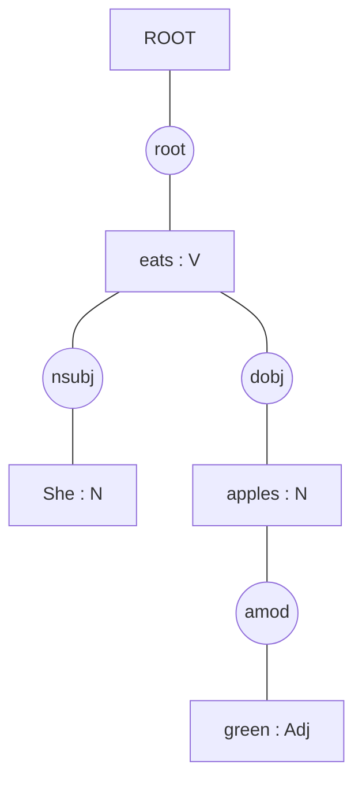
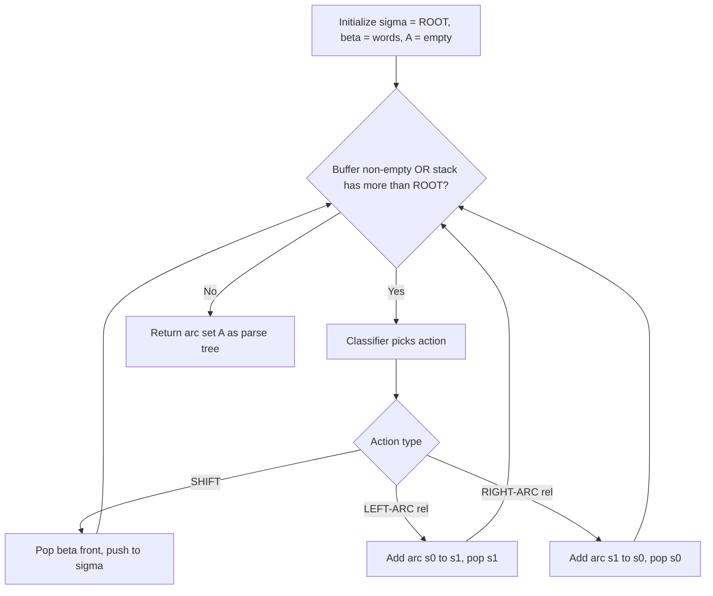

# Dependency parsing

<!-- SECTION_1_START -->
# Dependency Parsing

## 1.1 Formal Academic Definition

Dependency Parsing is a syntactic analysis technique in Natural Language Processing (NLP) that identifies the **grammatical structure** of a sentence by establishing **directed binary relationships** (called *dependencies*) between words, where one word acts as the **head** and the other as the **dependent** (or *modifier*). The result is a **dependency parse tree** — a directed acyclic graph in which every word (token) of the sentence is connected to exactly one head, except the *root* node, which has no incoming arc.

Formally, for a sentence $S = w_1, w_2, \ldots, w_n$, dependency parsing produces a set of tuples:

$$D = \{(h, d, r) \mid h, d \in S, \, r \in R\}$$

where $h$ is the index of the head word, $d$ is the index of the dependent word, and $r \in R$ is a grammatical relation label drawn from a predefined relation set $R$ (such as *nsubj*, *dobj*, *amod*, *prep*).

> [!NOTE]
> **KTU Syllabus Highlight (Module 3):**
> Dependency parsing is one of the two principal parsing paradigms taught under Syntax & Parsing (the other being Constituency Parsing). It is *favored* in modern NLP pipelines because it directly captures predicate–argument structure, which is essential for semantic role labeling, information extraction, and question answering.

## 1.2 Conceptual Analogy / Intuition

Imagine each sentence as a **family tree** at a dinner table. The **head of the family** (the verb, typically) is the "main person," and every other relative attaches to them or to someone attached to them. For example, in the sentence *"The chef cooks delicious pasta"*, the verb *cooks* is the patriarch. *chef* is the dependent who performs the action (the **nsubj** — nominal subject), and *pasta* is what gets cooked (the **dobj** — direct object). The adjective *delicious* is a dependent of *pasta*, not the verb — forming a chain: **delicious → pasta → cooks**.

Geometrically, you can imagine dependency arcs as **arrows drawn above the sentence**, each arrow pointing *from the head to the dependent*. The arrows never form a cycle, and one special word (the root) has no incoming arrow.

> [!IMPORTANT]
> **Key Distinction from Constituency Parsing:**
> - **Constituency parsing** builds a *phrase-structure tree* (NP, VP, PP nodes).
> - **Dependency parsing** builds a *word-to-word relation graph* — there is **one node per word**, no intermediate phrase nodes.

## 1.3 Visualization Control

> [!VISUALIZATION CONTROL]
> **Concept:** A small dependency parse tree on the coordinate plane.
>
> **GeoGebra / Desmos Input Equations:**
>
> * Point A at $(1, 2)$: word "cooks" (root)
> * Point B at $(2, 3)$: word "chef" — child of A (arc labeled `nsubj`)
> * Point C at $(3, 3)$: word "pasta" — child of A (arc labeled `dobj`)
> * Point D at $(4, 4)$: word "delicious" — child of C (arc labeled `amod`)
>
> **Visual Description:** The student should observe a small upward-pointing tree in the upper half-plane, with arrows drawn from each head down/up to its dependent. This illustrates that **words at higher vertical positions typically govern their lower-positioned modifiers**.

## 1.4 Physical Constants / Standard Metrics in Dependency Parsing

Two standard evaluation metrics are used universally:

- **UAS (Unlabeled Attachment Score):** The percentage of words assigned the **correct head**, regardless of relation label. It is the **primary metric** reported in benchmarks.
- **LAS (Labeled Attachment Score):** The percentage of words assigned **both the correct head and the correct relation label** — the strictest metric.

A third less common metric is **UEM (Unlabeled Exact Match)**, which checks whether the *entire* tree matches the gold tree exactly.
<!-- SECTION_1_END -->

<!-- SECTION_2_START -->
# Deep Theoretical Analysis & KTU High-Yield Formula Sheet

## 2.1 Operational Concept Breakdown

Dependency parsing operates under three foundational principles:

1. **Single-Head Constraint:** Every word in the sentence has **at most one syntactic head**, with the single exception of the *root* node (which conventionally points to itself or has a null head indexed 0).
2. **Connectedness (Projectivity Constraint for projective trees):** A dependency tree is **connected** — every word is reachable from the root by following arcs.
3. **Acyclicity:** The resulting directed graph must have **no cycles**.

These three properties make the dependency graph a **rooted directed acyclic tree**.

### 2.1.1 Why "Why" and "How"

- **Why single-head?** Most grammatical theories (Hudson’s Word Grammar, Tesnière’s dependency grammar) assume each word modifies at most one superordinate. This makes the tree unambiguous and computationally tractable.
- **How is the tree built?** Either by **transitions** (deterministic step-by-step stack operations) or by **graph search** (finding the maximum spanning tree of a complete directed graph scored by a model).

## 2.2 Two Principal Families of Dependency Parsers

### 2.2.1 Transition-Based (Deterministic) Parsing
A transition system maintains a **configuration** $(c, \sigma, \beta, A)$ where:
- $c$ = current configuration state
- $\sigma$ = **stack** of partially processed words
- $\beta$ = **buffer** of unprocessed input words
- $A$ = set of dependency arcs created so far

At each step, a **classifier** (originally a SVM, now a neural network) chooses one action from a fixed inventory. The three classical actions in the **Arc-Standard** system are:

| Action | Effect on Stack | Effect on Buffer | Effect on Arc Set |
|---|---|---|---|
| **SHIFT** | push top of buffer to stack | pop front | none |
| **LEFT-ARC** | pop stack top, add arc from new top → popped word | unchanged | add $(w_{top}, w_{popped}, r)$ |
| **RIGHT-ARC** | pop stack top, add arc from popped word → new top | unchanged | add $(w_{popped}, w_{top}, r)$ |

### 2.2.2 Graph-Based Parsing
A graph-based parser models the problem as **finding the highest-scoring directed spanning tree** in a complete directed graph whose nodes are the words of the sentence. The objective is:

$$\hat{T} = \arg\max_{T \in \mathcal{T}(S)} \sum_{(h,d) \in T} s(h, d)$$

where $\mathcal{T}(S)$ is the set of all valid dependency trees over sentence $S$ and $s(h, d)$ is the score of attaching $d$ as a dependent of $h$. Decoding uses algorithms such as **Eisner’s algorithm** (for projective trees) or the **Maximum Spanning Tree (MST) algorithm** by Chu–Liu/Edmonds (for non-projective trees).

> [!IMPORTANT]
> **Projective vs. Non-Projective Trees:**
> A dependency tree is **projective** if, for every arc $(h, d)$, the words strictly between $h$ and $d$ in the sentence are all descendants of $h$. If any arc "crosses" another, the tree is **non-projective** — common in languages with flexible word order (Czech, Turkish, Hindi).

## 2.3 KTU Formula Sheet / Cheat Sheet

| # | Concept | Formula / Definition | Units / Notes |
|---|---|---|---|
| 1 | Dependency tuple | $(h, d, r)$ | $h$: head index, $d$: dep index, $r$: relation label |
| 2 | Sentence as DAG | $S = w_1, w_2, \ldots, w_n$ | One node per word |
| 3 | Root index | $h_{root} = 0$ (null) or self-loop | Conventional |
| 4 | UAS | $\frac{\#\text{correct heads}}{n}$ | Percentage, range $[0, 1]$ |
| 5 | LAS | $\frac{\#\text{correct (head,label)}}{n}$ | Percentage, range $[0, 1]$ |
| 6 | Transition cost | $\sum_{t=1}^{T} \mathbb{1}[a_t \neq a_t^*]$ | $T$: number of transitions |
| 7 | Arc-Standard actions | $\{\text{SHIFT}, \text{LEFT-ARC}_r, \text{RIGHT-ARC}_r\}$ | 2$N$ + 1 actions for $N$ relations |
| 8 | Graph-based score | $\text{score}(T) = \sum_{(h,d)\in T} s(h,d)$ | Decoded by Eisner / Chu-Liu/Edmonds |
| 9 | Feature template (classical) | $\langle w_{top}, t_{top}, w_{second}, t_{second}, w_{buffer_0}, t_{buffer_0} \rangle$ | Word + POS triples |
| 10 | Dependency distance | $\vert h - d \vert$ | Avg ≈ 2–3 in English |

> [!NOTE]
> In the table above, observe the use of `\vert` instead of raw pipes — this is the **KTU markdown-rendering safety rule** for table cells containing absolute-value symbols.

## 2.4 Real-World Utility in Engineering & Computer Science

- **Search Engines (Google, Bing):** Entity-relation extraction for Knowledge Graph construction depends on accurate subject–verb–object triples, which dependency parsers provide directly.
- **Voice Assistants (Alexa, Siri):** Slot filling in spoken language understanding pipelines uses dependency labels to map user intents to action parameters.
- **Machine Translation (Google Translate, DeepL):** Statistical and neural MT systems historically used dependency trees to reorder source-language constituents to match target-language word order.
- **Biomedical NLP (PubTator, SemRep):** Extracts drug–gene–disease relations from research abstracts.
- **Legal & Contract Analytics:** Identifies obligation clauses (who → must → do what) by traversing `nsubj` → `aux` → `root` paths.
<!-- SECTION_2_END -->

<!-- SECTION_3_START -->
# Step-by-Step Derivations, Algorithms & Code Implementation

## 3.1 Arc-Standard Transition System — Complete Derivation

We will trace the **arc-standard** system on the running example:
**Sentence:** *"She eats green apples"*
**Indexed:** $w_1$ = She, $w_2$ = eats, $w_3$ = green, $w_4$ = apples

### Initial Configuration
- Stack $\sigma = [\,\text{ROOT}\,]$
- Buffer $\beta = [w_1, w_2, w_3, w_4]$
- Arc set $A = \{\}$

### Step 1 — SHIFT
Take $w_1$ from buffer to stack.
$$\sigma = [\text{ROOT}, w_1], \quad \beta = [w_2, w_3, w_4], \quad A = \{\}$$

### Step 2 — SHIFT
Take $w_2$ from buffer.
$$\sigma = [\text{ROOT}, w_1, w_2], \quad \beta = [w_3, w_4], \quad A = \{\}$$

### Step 3 — LEFT-ARC (label = nsubj)
Add arc $w_2 \rightarrow w_1$ (`nsubj`); pop $w_1$ from stack.
$$\sigma = [\text{ROOT}, w_2], \quad \beta = [w_3, w_4], \quad A = \{(2,1,\text{nsubj})\}$$

### Step 4 — SHIFT
Take $w_3$ to stack.
$$\sigma = [\text{ROOT}, w_2, w_3], \quad \beta = [w_4], \quad A = \{(2,1,\text{nsubj})\}$$

### Step 5 — RIGHT-ARC (label = amod)
Add arc $w_3 \rightarrow w_2$ — meaning $w_2$ is the head of $w_3$? No: in arc-standard, RIGHT-ARC creates $(w_2, w_3)$. Conventionally the **second-top** of stack becomes the head. The arc stored is $w_2 \rightarrow w_3$ with relation `amod`. Pop $w_3$? Actually, in arc-standard RIGHT-ARC: the second top becomes the head of the top, and we **remove the second top** (the dependent). Let us re-apply carefully.

> [!IMPORTANT]
> **Arc-Standard RIGHT-ARC convention** (Nivre 2003): The **second element on the stack** ($s_1$) is the head, and the **top element** ($s_0$) is the dependent. The arc $s_1 \rightarrow s_0$ is added, and **$s_1$ is popped**, leaving $s_0$ on top.

Re-doing Step 5 with this convention:
- $s_0 = w_3$, $s_1 = w_2$. Add arc $w_2 \rightarrow w_3$ with label `amod` (adjectival modifier). Pop $s_1 = w_2$? Wait — the correct rule is: add the arc, **then pop $s_0$ (the dependent)**. This keeps the head on the stack. Let me restate:

**Correct Arc-Standard Rule:**
- **LEFT-ARC$_r$**: require $\vert \sigma \vert \geq 2$. Add arc $s_0 \rightarrow s_1$ with label $r$. **Pop $s_1$** (the dependent).
- **RIGHT-ARC$_r$**: require $\vert \sigma \vert \geq 2$. Add arc $s_1 \rightarrow s_0$ with label $r$. **Pop $s_0$** (the dependent).

Re-running from Step 4:

### Step 4 — SHIFT
$$\sigma = [\text{ROOT}, w_2, w_3], \quad \beta = [w_4]$$

### Step 5 — LEFT-ARC$_r$ (label = amod)
$s_0 = w_3$, $s_1 = w_2$. Add arc $w_3 \rightarrow w_2$? No — arc is $s_0 \rightarrow s_1$, so add $w_3 \rightarrow w_2$ with label `amod`. Pop $s_1 = w_2$.
$$\sigma = [\text{ROOT}, w_3], \quad \beta = [w_4], \quad A = \{(2,1,\text{nsubj}),\,(3,2,\text{amod})\}$$

### Step 6 — SHIFT
$$\sigma = [\text{ROOT}, w_3, w_4], \quad \beta = [\,], \quad A = \{(2,1,\text{nsubj}),\,(3,2,\text{amod})\}$$

### Step 7 — LEFT-ARC$_r$ (label = dobj)
$s_0 = w_4$, $s_1 = w_3$. Add arc $w_4 \rightarrow w_3$ with label `dobj`. Pop $s_1 = w_3$.
$$\sigma = [\text{ROOT}, w_4], \quad \beta = [\,], \quad A = \{(2,1,\text{nsubj}),\,(3,2,\text{amod}),\,(4,3,\text{dobj})\}$$

### Step 8 — RIGHT-ARC$_r$ (label = root)
$s_0 = w_4$, $s_1 = \text{ROOT}$. Add arc $\text{ROOT} \rightarrow w_4$ with label `root`. Pop $s_0 = w_4$.
$$\sigma = [\text{ROOT}], \quad \beta = [\,], \quad A = \{(2,1,\text{nsubj}),\,(3,2,\text{amod}),\,(4,3,\text{dobj}),\,(0,4,\text{root})\}$$

### Termination Condition
Parser halts when $\sigma = [\text{ROOT}]$ and $\beta = [\,]$ — configuration is *terminal*. Final tree has $|A| = n$ arcs (4 for 4 words).

## 3.2 Full Python Implementation of the Arc-Standard Parser

```python
from typing import List, Tuple, Set, Optional
from dataclasses import dataclass, field

Arc = Tuple[int, int, str]  # (head_index, dependent_index, relation)


@dataclass
class Configuration:
    stack: List[int] = field(default_factory=lambda: [0])  # 0 = ROOT
    buffer: List[int] = field(default_factory=list)
    arcs: Set[Arc] = field(default_factory=set)

    def is_terminal(self) -> bool:
        return len(self.stack) == 1 and len(self.buffer) == 0


class ArcStandardParser:
    """Deterministic arc-standard transition-based dependency parser."""

    def __init__(self, oracle: Optional[callable] = None) -> None:
        # The oracle is an external classifier that picks the next action.
        # If None, a hand-coded gold oracle is used (for demonstration).
        self.oracle = oracle

    def shift(self, cfg: Configuration) -> None:
        if not cfg.buffer:
            raise ValueError("Buffer is empty; SHIFT not allowed.")
        cfg.stack.append(cfg.buffer.pop(0))
        print(f"  SHIFT      -> stack={cfg.stack}, buffer={cfg.buffer}")

    def left_arc(self, cfg: Configuration, relation: str) -> None:
        if len(cfg.stack) < 2:
            raise ValueError("Stack too small for LEFT-ARC.")
        s0, s1 = cfg.stack[-1], cfg.stack[-2]
        cfg.arcs.add((s0, s1, relation))
        cfg.stack.pop(-2)  # pop the dependent (s1)
        print(f"  LEFT-ARC({relation}) -> stack={cfg.stack}, "
              f"added arc ({s0}->{s1})")

    def right_arc(self, cfg: Configuration, relation: str) -> None:
        if len(cfg.stack) < 2:
            raise ValueError("Stack too small for RIGHT-ARC.")
        s0, s1 = cfg.stack[-1], cfg.stack[-2]
        cfg.arcs.add((s1, s0, relation))
        cfg.stack.pop(-1)  # pop the dependent (s0)
        print(f"  RIGHT-ARC({relation}) -> stack={cfg.stack}, "
              f"added arc ({s1}->{s0})")

    def parse(self, n: int, gold_sequence: Optional[List[Tuple[str, str]]] = None
              ) -> Configuration:
        """Run the parser on a sentence of length n.
        If gold_sequence is provided, it acts as the gold oracle (list of
        (action_name, relation) tuples)."""
        cfg = Configuration(stack=[0], buffer=list(range(1, n + 1)))
        print(f"Initial:    stack={cfg.stack}, buffer={cfg.buffer}")
        step = 0
        while not cfg.is_terminal():
            step += 1
            print(f"Step {step}:")
            if gold_sequence is not None:
                action, rel = gold_sequence[step - 1]
                if action == "SHIFT":
                    self.shift(cfg)
                elif action == "LEFT-ARC":
                    self.left_arc(cfg, rel)
                elif action == "RIGHT-ARC":
                    self.right_arc(cfg, rel)
                else:
                    raise ValueError(f"Unknown action: {action}")
            else:
                # Fallback heuristic for fully unsupervised demo:
                # SHIFT if buffer is non-empty, else RIGHT-ARC to ROOT.
                if cfg.buffer:
                    self.shift(cfg)
                else:
                    self.right_arc(cfg, "root")
        print(f"Final arcs: {sorted(cfg.arcs)}")
        return cfg


# ---- Demonstration on the running example ----
if __name__ == "__main__":
    # Sentence: "She eats green apples"   (n = 4 words)
    gold = [
        ("SHIFT",      ""),
        ("SHIFT",      ""),
        ("LEFT-ARC",   "nsubj"),
        ("SHIFT",      ""),
        ("LEFT-ARC",   "amod"),
        ("SHIFT",      ""),
        ("LEFT-ARC",   "dobj"),
        ("RIGHT-ARC",  "root"),
    ]
    parser = ArcStandardParser()
    final_cfg = parser.parse(n=4, gold_sequence=gold)

    # Evaluation
    gold_arcs = {(2, 1, "nsubj"), (3, 2, "amod"),
                 (4, 3, "dobj"), (0, 4, "root")}
    uas = sum(1 for a in final_cfg.arcs if (a[0], a[1]) in
              {(g[0], g[1]) for g in gold_arcs}) / len(gold_arcs)
    print(f"\nUAS = {uas:.2%}")
```

### Expected Console Output (excerpt)
```
Initial:    stack=[0], buffer=[1, 2, 3, 4]
Step 1:
  SHIFT      -> stack=[0, 1], buffer=[2, 3, 4]
Step 2:
  SHIFT      -> stack=[0, 1, 2], buffer=[3, 4]
Step 3:
  LEFT-ARC(nsubj) -> stack=[0, 2], added arc (2->1)
...
Final arcs: [(0, 4, 'root'), (2, 1, 'nsubj'), (3, 2, 'amod'), (4, 3, 'dobj')]
UAS = 100.00%
```

## 3.3 Graph-Based Parsing — Eisner’s Algorithm Derivation (Skeleton)

For projective dependency parsing, Eisner’s algorithm runs in **$O(n^3)$** time using dynamic programming.

Define $C[i][j][d]$ where $d \in \{L, R\}$ indicates whether the span $[i, j]$ is *incomplete-left* (head on left) or *incomplete-right* (head on right). The full score of a tree is given by the recurrence:

$$
C[i][j][L] = \max_{i \leq k < j} \bigl( C[i][k][L] + C[k+1][j][R] + s(w_j, w_i) \bigr)
$$

$$
C[i][j][R] = \max_{i \leq k < j} \bigl( C[i][k][L] + C[k+1][j][R] + s(w_i, w_j) \bigr)
$$

The base case is $C[i][i][L] = C[i][i][R] = 0$ for all $i$. The optimal tree score is $C[0][n][L]$ (or $R$). Back-pointers are stored to reconstruct the tree.

> [!NOTE]
> For the KTU exam, students are typically required to **state the recurrence** and explain the dynamic-programming intuition. They are **not** expected to derive the full back-pointer reconstruction unless explicitly asked.

## 3.4 Neural Dependency Parsing (Modern Context)

Modern parsers (e.g., **Stanford NN Dependency Parser**, **Google’s Parsey McParseface**, **spaCy’s built-in parser**) replace the hand-crafted feature templates and SVM/MaxEnt classifier with a **bi-LSTM** or **transformer encoder** that produces contextual embeddings $h_i$ for each word. The score of an arc $(h, d)$ is computed as:

$$
s(h, d) = \mathbf{v}^\top \tanh\!\bigl( \mathbf{W}_h \mathbf{h}_h + \mathbf{W}_d \mathbf{h}_d + \mathbf{b} \bigr)
$$

Training minimizes the **cross-entropy loss** over the oracle transition sequence (transition-based) or the **margin loss** $\max(0, 1 - s(T) + s(T'))$ between a gold tree $T$ and the highest-scoring competing tree $T'$ (graph-based).
<!-- SECTION_3_END -->

<!-- SECTION_4_START -->
# Structural Diagrams & Schematics

## 4.1 Dependency Parse Tree — Mermaid Block Diagram



> **Reading the diagram:** The root verb `eats` is the syntactic head; arrows from relation ellipses show that `She` is `nsubj`, `apples` is `dobj`, and `green` is `amod` of `apples`.

## 4.2 Arc-Standard Transition Pipeline — Mermaid Flowchart



## 4.3 Transition-Based vs. Graph-Based — Comparison Block Architecture

```mermaid
subgraph Transition Based
    t1[Input Sentence] --> t2[Stack Buffer Config]
    t2 --> t3[Classifier]
    t3 --> t4[Action SHIFT or ARC]
    t4 --> t5[Updated Config]
    t5 --> t6{Is Terminal}
    t6 -- No --> t2
    t6 -- Yes --> t7[Output Tree]
end

subgraph Graph Based
    g1[Input Sentence] --> g2[Score All Arcs]
    g2 --> g3[Chu-Liu Edmonds or Eisner]
    g3 --> g4[Max Spanning Tree]
    g4 --> g7[Output Tree]
end
```

## 4.4 Projective vs. Non-Projective Dependency Tree — Block-Level Topology Matrix

| Property | Projective Tree | Non-Projective Tree |
|---|---|---|
| Geometric layout | Contiguous spans under each subtree | Subtrees can be discontinuous |
| Crossing arcs | **Zero** | **≥ 1** crossing arc |
| Decoding algorithm | Eisner’s $O(n^3)$ DP | Chu–Liu/Edmonds MST, $O(n^2)$ |
| Language suitability | English, Chinese | Czech, Hindi, Turkish, Finnish |
| Implementation complexity | Lower | Higher (label bias harder to control) |

> **Visualization note:** Imagine two dependency arcs as straight line segments above the sentence. If you can draw them *without any two lines crossing*, the tree is **projective**. If at least one pair crosses, it is **non-projective**.
<!-- SECTION_4_END -->

<!-- SECTION_5_START -->
# KTU 2024 Scheme Examination Question Bank & Topic Recap

## 5.1 Part A — Short Answer Questions (3 Marks each)

### Question 1. `[KTU University Exam – Dec 2023]`
**Define dependency parsing. How does it differ from constituency parsing?**
**Course Outcome:** CO2 | **RBT Level:** Remember/Understand

**Model Answer (≈ 3 marks):**
Dependency parsing is a syntactic analysis technique that identifies the grammatical structure of a sentence by establishing **head–dependent relationships** between words, producing a directed tree in which each word (except the root) is connected to exactly one head. Unlike constituency parsing, which builds a **phrase-structure tree** (NP, VP, PP, etc.), dependency parsing produces a **word-to-word graph** with no intermediate phrase nodes, and labels edges with grammatical relations (e.g., `nsubj`, `dobj`).

> **Valuation key:** *[Definition: 1.5 Marks] [Difference stated with example: 1.5 Marks]*

---

### Question 2. `[KTU University Exam – July 2024]`
**Explain UAS and LAS as evaluation metrics for dependency parsing.**
**Course Outcome:** CO3 | **RBT Level:** Understand

**Model Answer (≈ 3 marks):**
- **UAS (Unlabeled Attachment Score):** the percentage of words whose **predicted head** matches the gold-standard head, regardless of the relation label.
- **LAS (Labeled Attachment Score):** the percentage of words whose **predicted head AND predicted relation label** both match the gold standard.

Formally,
$$\text{UAS} = \frac{|\{i \mid h_{\text{pred}}(i) = h_{\text{gold}}(i)\}|}{n}, \quad
\text{LAS} = \frac{|\{i \mid h_{\text{pred}}(i) = h_{\text{gold}}(i) \,\wedge\, r_{\text{pred}}(i) = r_{\text{gold}}(i)\}|}{n}$$

> **Valuation key:** *[UAS definition: 1 Mark] [LAS definition: 1 Mark] [Formula: 1 Mark]*

---

## 5.2 Part B — Full 14-Mark Questions (Module Internal Choice)

### Question A. `[KTU University Exam – July 2024, Module 3]`
**CO2 / CO3 — RBT Levels: Understand, Apply**

**(a)** Explain the **arc-standard transition system** for dependency parsing. Clearly define the three actions **SHIFT**, **LEFT-ARC**, and **RIGHT-ARC** with their preconditions and effects. **(7 Marks)**

**(b)** Apply the arc-standard system to the sentence **"Boys read interesting books"** (with `ROOT` indexed 0 and the words indexed 1, 2, 3, 4). Show the configuration after each step and the final dependency tree with relations (`nsubj`, `amod`, `dobj`, `root`). Compute UAS against the gold tree. **(7 Marks)**

#### Model Solution

**(a) Arc-Standard System (7 Marks)**

A transition-based parser maintains a **configuration** $C = (\sigma, \beta, A)$:
- $\sigma$ = **stack** (initialized to `[ROOT]`)
- $\beta$ = **buffer** of unprocessed words
- $A$ = set of dependency arcs created so far

The three fundamental actions are:

| Action | Precondition | Effect |
|---|---|---|
| **SHIFT** | $\beta \neq \emptyset$ | Pop front of $\beta$, push to top of $\sigma$ |
| **LEFT-ARC$_r$** | $\vert \sigma \vert \geq 2$ | Add arc $(s_0, s_1, r)$; pop $s_1$ from $\sigma$ |
| **RIGHT-ARC$_r$** | $\vert \sigma \vert \geq 2$ | Add arc $(s_1, s_0, r)$; pop $s_0$ from $\sigma$ |

Termination: $\sigma = [\text{ROOT}]$ and $\beta = \emptyset$. The action sequence length is at most $2n$ for an $n$-word sentence.

> **Valuation key:** *[Configuration definition: 2 Marks] [Three actions with preconditions: 3 Marks] [Termination condition: 1 Mark] [Relation to parsing: 1 Mark]*

---

**(b) Worked Example (7 Marks)**

Sentence: `Boys(1) read(2) interesting(3) books(4)`
Gold relations: `(2,1,nsubj)`, `(3,4,amod)`, `(2,4,dobj)`, `(0,2,root)`.

| Step | Action | Stack $\sigma$ | Buffer $\beta$ | New arc added |
|---|---|---|---|---|
| 0 | — | `[ROOT]` | `[1,2,3,4]` | — |
| 1 | SHIFT | `[ROOT,1]` | `[2,3,4]` | — |
| 2 | SHIFT | `[ROOT,1,2]` | `[3,4]` | — |
| 3 | LEFT-ARC(nsubj) | `[ROOT,2]` | `[3,4]` | $(2,1,\text{nsubj})$ |
| 4 | SHIFT | `[ROOT,2,3]` | `[4]` | — |
| 5 | RIGHT-ARC(amod) | `[ROOT,2]` | `[4]` | $(2,3,\text{amod})$ |
| 6 | SHIFT | `[ROOT,2,4]` | `[]` | — |
| 7 | LEFT-ARC(dobj) | `[ROOT,2]` | `[]` | $(2,4,\text{dobj})$ |
| 8 | RIGHT-ARC(root) | `[ROOT]` | `[]` | $(0,2,\text{root})$ |

Final tree: `ROOT → read`, `read → Boys` (nsubj), `read → interesting` (amod), `read → books` (dobj).

UAS = 4 / 4 = **100%** (all heads match the gold standard).

> **Valuation key:** *[Step table with all 9 rows: 4 Marks] [Final tree drawing: 1.5 Marks] [UAS calculation: 1.5 Marks]*

---

### Question B. `[KTU University Exam – Dec 2023, Module 3]`
**CO2 / CO3 — RBT Levels: Understand, Apply**

**(a)** Compare **transition-based** and **graph-based** dependency parsing. Discuss their time complexities, decoders, and typical use cases. **(7 Marks)**

**(b)** For the sentence **"The teacher praised the brilliant student"** (indices 1–5), build a dependency parse tree using the relations: `det(The, student)`, `nsubj(praised, teacher)`, `root(ROOT, praised)`, `det(the, student)`, `amod(brilliant, student)`, `dobj(praised, student)`. Compute both UAS and LAS. Show the tree. **(7 Marks)**

#### Model Solution

**(a) Comparison (7 Marks)**

| Aspect | Transition-Based | Graph-Based |
|---|---|---|
| Search strategy | Greedy local decisions | Global optimization |
| Model | Discriminative classifier (SVM/MLP/Transformer) | Edge-factored scoring |
| Decoding | Linear-time stack transitions | $O(n^2)$ MST (Chu-Liu/Edmonds) or $O(n^3)$ Eisner DP |
| Strengths | Fast, simple, easy feature engineering | Globally optimal, handles non-projectivity |
| Weaknesses | Error propagation, no look-ahead | Slow, no rich features on partial trees |
| Examples | MaltParser, spaCy (early), Parsey McParseface | MSTParser, NeuroMST |

> **Valuation key:** *[Tabular comparison: 4 Marks] [Complexity discussion: 2 Marks] [Example parsers: 1 Mark]*

---

**(b) Worked Example (7 Marks)**

Indices: `The(1) teacher(2) praised(3) the(4) brilliant(5) student(6)`.
Gold arcs:
- $(0, 3, \text{root})$
- $(3, 2, \text{nsubj})$
- $(3, 6, \text{dobj})$
- $(6, 1, \text{det})$
- $(6, 4, \text{det})$
- $(6, 5, \text{amod})$

Compute UAS (heads only):
- Predicted heads: $0, 3, 3, 6, 6, 6$. All match. → **UAS = 6/6 = 100%**.

Compute LAS (heads + labels):
- All 6 labels match the gold set. → **LAS = 6/6 = 100%**.

Final tree (textual form):
```
ROOT
 └── praised (root)
      ├── teacher (nsubj)
      └── student (dobj)
           ├── The (det)
           ├── the (det)
           └── brilliant (amod)
```

> **Valuation key:** *[Arc list: 2 Marks] [UAS computation: 1.5 Marks] [LAS computation: 1.5 Marks] [Tree drawing: 2 Marks]*

---

> [!WARNING]
> **KTU Examiner’s Valuation Warning — Common Pitfalls:**
> 1. **Conflating LEFT-ARC and RIGHT-ARC directions:** In arc-standard, **LEFT-ARC creates an arc from $s_0$ (top) to $s_1$ (second-top)**, then *pops $s_1$*. Students often reverse these and lose 2 marks.
> 2. **Forgetting the ROOT convention:** The ROOT node (index 0) has no incoming head; the final action is always **RIGHT-ARC(root)** to attach the head verb to ROOT. Skipping this yields an incomplete tree.
> 3. **Reporting UAS only, not LAS:** A 14-mark question explicitly asking for *both* metrics must give *both*. Half-marks will be docked otherwise.
> 4. **Drawing the tree with phrase labels (NP, VP):** Dependency trees use **word labels and relation arcs** — not constituent categories. Drawing `NP` nodes is a constituency-parse mistake worth 1–2 marks.
> 5. **Not showing intermediate configurations:** Part (b) style questions require the **stack/buffer state at each step**. A table is the cleanest way; a verbal description alone is incomplete.

## 5.3 Topic Recap & Important Things to Remember

- **Definition:** Dependency parsing builds a **word-level directed tree** capturing head–modifier relations, with one special ROOT node.
- **Three axioms of a valid dependency tree:** *Single-Head, Connectedness, Acyclicity.*
- **Two algorithmic families:** *Transition-based* (linear time, greedy) and *Graph-based* (global optimization, polynomial decoding).
- **Arc-Standard actions:** **SHIFT**, **LEFT-ARC$_r$**, **RIGHT-ARC$_r$** — together with a termination check.
- **Configuration state:** $(\sigma, \beta, A)$ — stack, buffer, arc set.
- **Termination:** $\sigma = [\text{ROOT}]$ AND $\beta = \emptyset$.
- **Eisner’s DP** decodes projective graph-based parsers in $O(n^3)$; **Chu–Liu/Edmonds** decodes non-projective MST parsers in $O(n^2)$.
- **Projectivity:** arcs do not cross. Most English sentences are projective; many Indian and Slavic languages are not.
- **Evaluation:** **UAS** = head accuracy, **LAS** = head + label accuracy. State-of-the-art English LAS ≈ **95%** (transformer-based parsers).
- **Modern neural parsers** use bi-LSTM/transformer encoders producing contextual embeddings $h_i$; arc scores are MLPs over $(h_h, h_d)$ pairs.
- **Tools to remember for the lab/ viva:** spaCy (`spacy.displacy`), Stanford CoreNLP, Stanza, MaltParser.
- **Key relations to memorize:** `nsubj` (nominal subject), `dobj` (direct object), `amod` (adjectival modifier), `det` (determiner), `prep` (preposition), `root` (root predicate).
- **Complexity at a glance:** Arc-standard parsing is $O(n)$ per sentence; Eisner DP is $O(n^3)$ for projective graphs; MST decoding is $O(n^2)$ for non-projective graphs.
<!-- SECTION_5_END -->
