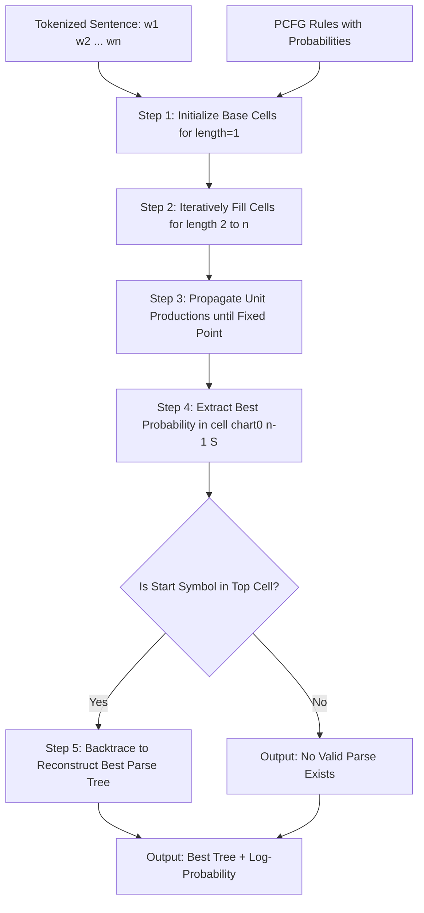
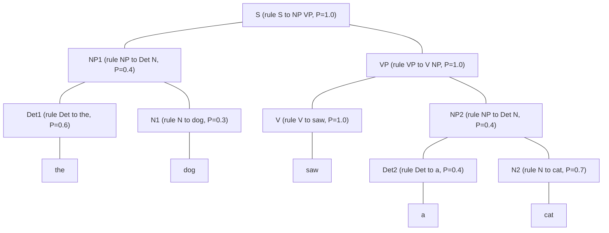
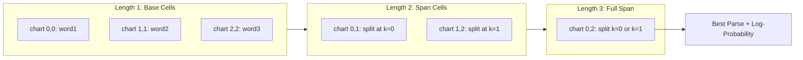
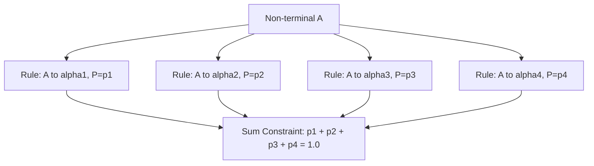

# Probabilistic Context-Free Grammars (PCFG)

<!-- SECTION_1_START -->
# Probabilistic Context-Free Grammars (PCFG)

## Formal Academic Definition

A **Probabilistic Context-Free Grammar (PCFG)** is a quintuple $G = (N, \Sigma, R, S, P)$ where every component of a standard Context-Free Grammar is extended with a stochastic layer:

- $N$ : A finite set of **non-terminal symbols** (grammatical categories).
- $\Sigma$ : A finite set of **terminal symbols** (lexical items / words).
- $R$ : A finite set of production rules of the form $A \rightarrow \beta$, where $A \in N$ and $\beta \in (N \cup \Sigma)^{*}$.
- $S$ : A designated **start symbol** with $S \in N$.
- $P$ : A function that assigns a probability $P(A \rightarrow \beta)$ to every rule in $R$, such that for every $A \in N$:

$$
\sum_{\beta} P(A \rightarrow \beta) = 1
$$

> [!IMPORTANT]
> **KTU 2024 Syllabus Highlight:** A PCFG is formally known as a *Stochastic Context-Free Grammar (SCFG)* in the literature. Both terms are interchangeable in KTU valuation and must be quoted verbatim for full marks.

## Intuitive Overview & Real-World Analogy

Imagine a sentence is built like a **family tree** of grammatical choices. A regular CFG tells you *all the legal family trees*. A PCFG additionally tells you *how likely each branching decision is* in real English text.

> [!NOTE]
> **Conceptual Analogy — The "Weather Forecast" of Grammar:**
> Think of grammar rules as weather patterns. A plain CFG says: "It can rain or it can shine." A PCFG says: "There is a **70% chance of rain** and a **30% chance of shine**." When you generate a sentence, every time you apply a rule, you are essentially "rolling a weighted die" that picks a child expansion based on its probability.

This stochastic layer transforms grammar from a *pattern recognizer* into a *probabilistic language model* that can:

1. **Disambiguate** between multiple valid parse trees for the same sentence.
2. **Rank** candidate parses by likelihood.
3. **Score** the grammaticality of any given input string.

> [!TIP]
> **Key Insight for Examiners:** The probability of a complete parse tree is simply the **product** of the probabilities of every rule used in that tree. This is because PCFGs make a strong **independence assumption** — the choice of how to expand one non-terminal does not depend on neighbouring context.

> [!VISUALIZATION CONTROL]
> **Concept:** Probability mass flowing through a small PCFG parse tree.
> **GeoGebra / Desmos Input Equations (using a 2-level tree layout):**
> * Let root node coordinate be $(0, 2)$ representing the rule $S \rightarrow NP\ VP$ with $P = 1.0$.
> * Let left child be $(-1, 1)$ representing $NP \rightarrow Det\ N$ with $P = 0.4$.
> * Let right child be $(1, 1)$ representing $VP \rightarrow V\ NP$ with $P = 0.6$.
> * Leaves at $y = 0$ represent terminal expansions (e.g., $Det \rightarrow the$ with $P = 0.6$, $N \rightarrow dog$ with $P = 0.3$).
> **Visual Description:** A binary tree where each edge is labelled with a rule probability. The product of edge labels along any root-to-leaf path gives the contribution of that subtree, and the product over all edges gives the total tree probability.

## Physical Constants & Standard Metrics

> [!NOTE]
> **Standard Engineering Parameters for PCFGs in Production NLP:**
> * The **Wall Street Journal (WSJ) PCFG** trained on the Penn Treebank contains approximately **$\mathbf{17{,}000}$** distinct non-terminal labels and **$\mathbf{1{,}000{,}000}$** production rules.
> * A well-trained PCFG typically achieves a parse **F1-score** of around **$\mathbf{0.70}$ to $\mathbf{0.74}$** on the WSJ test set.
> * The probability of *any single rule* is a real number in the closed interval $\mathbf{[0, 1]}$.
> * To avoid numerical underflow, log-probabilities $\log P$ are used in practice, with values typically in the range $\mathbf{[-50, 0]}$.
</p>
<!-- SECTION_1_END -->

<!-- SECTION_2_START -->
# Deep Theoretical Analysis & KTU High-Yield Formula Sheet

## Structural Components of a PCFG

A PCFG is layered on top of a CFG, but adds a probability distribution over rules. The five components work together as follows:

1. **Lexicon ($\Sigma$):** The vocabulary of words. Every word in the input must ultimately be derived from a terminal rule.
2. **Non-terminals ($N$):** Abstract grammatical categories such as $S$ (sentence), $NP$ (noun phrase), $VP$ (verb phrase), $PP$ (prepositional phrase).
3. **Start symbol ($S$):** The root of every parse tree. The topmost node in any successful derivation.
4. **Production rules ($R$):** Rewriting rules of the form $A \rightarrow \beta$ where $\beta$ is a string of terminals and/or non-terminals.
5. **Rule probabilities ($P$):** Numerical weights. For every non-terminal $A$, the probabilities of all rules with $A$ on the left-hand side must sum to **exactly 1**.

## Conditional Independence Assumptions

A PCFG makes two key independence assumptions that make probability computation tractable:

> [!IMPORTANT]
> **Assumption 1 — Rule Independence:** The probability of expanding a non-terminal $A$ using a particular rule $A \rightarrow \beta$ is **independent of the surrounding context** (i.e., independent of other non-terminals in the tree).
>
> **Assumption 2 — Position Independence:** The probability of expanding a non-terminal is the **same regardless of where** it appears in the parse tree.

These two assumptions allow the probability of an entire parse tree $T$ for sentence $S$ to be computed as the product of individual rule probabilities:

$$
P(T, S) = \prod_{i=1}^{n} P(R_i)
$$

where $R_1, R_2, \ldots, R_n$ are the $n$ production rules used in the parse tree $T$.

## Computing the Probability of a String

A single sentence $S = w_1 w_2 \ldots w_m$ may have **multiple valid parse trees** $T_1, T_2, \ldots, T_k$. The total probability of the string is the sum over all parse trees:

$$
P(S) = \sum_{j=1}^{k} P(T_j, S)
$$

## Finding the Most Probable Parse

For many applications (e.g., syntactic disambiguation in machine translation), we want the single best tree. This is computed using:

$$
\hat{T} = \arg\max_{T_j} P(T_j \mid S) = \arg\max_{T_j} P(T_j, S)
$$

Since the denominator $P(S)$ is constant for a given sentence, the argmax reduces to finding the tree that maximizes the joint probability.

## KTU Formula Cheat Sheet

| Symbol / Concept | Formula | Description | Units / Range |
|------------------|---------|-------------|---------------|
| Rule probability | $P(A \rightarrow \beta)$ | Probability of a single production rule | Unit-less, $\mathbf{[0, 1]}$ |
| Rule probability sum | $\sum_{\beta} P(A \rightarrow \beta) = 1$ | All expansions of $A$ must sum to 1 | Probability mass conservation |
| Parse tree probability | $P(T, S) = \prod_{i=1}^{n} P(R_i)$ | Product of all rule probabilities in the tree | Unit-less, $\mathbf{[0, 1]}$ |
| String probability | $P(S) = \sum_{j=1}^{k} P(T_j, S)$ | Sum of probabilities over all parse trees | Unit-less, $\mathbf{[0, 1]}$ |
| Most probable parse | $\hat{T} = \arg\max_{T} P(T, S)$ | Tree with the highest probability | Same as $P(T, S)$ |
| Log-probability | $\log P(T, S) = \sum_{i=1}^{n} \log P(R_i)$ | Used to avoid numerical underflow | Real number, typically $\mathbf{[-50, 0]}$ |
| Chomsky Normal Form rule | $A \rightarrow B\ C$ or $A \rightarrow a$ | Required form for the CYK algorithm | CNF constraint |
| Inside probability | $\alpha[i, j, A] = P(w_i \ldots w_j \text{ derived from } A)$ | Dynamic programming cell for CYK | Probability value |

## Real-World Engineering Utility

PCFGs are the workhorse of traditional statistical parsing and remain relevant in:

- **Information Extraction:** Identifying subject-predicate-object triples from news articles.
- **Machine Translation:** As a syntactic prior in pre-neural translation pipelines (e.g., the original IBM and hierarchical phrase-based systems).
- **Speech Recognition:** Language models weighted by syntactic structure for better word lattice rescoring.
- **Biomedical NLP:** Parsing clinical notes where annotated Treebanks (e.g., Genia Treebank) provide training data.
- **Grammatical Error Correction:** Scoring candidate corrections by their syntactic likelihood.

> [!TIP]
> **Why PCFGs Matter in Production:** Before deep learning parsers, every major search engine, translation system, and voice assistant used a PCFG or its lexicalized extension. Even modern Transformer-based parsers often use PCFG-derived structures as auxiliary supervision signals.
<!-- SECTION_2_END -->

<!-- SECTION_3_START -->
# Step-by-Step Derivations & Code Implementation

## Worked Example 1 — Computing the Probability of a Parse Tree

Consider the following miniature PCFG:

| Rule | Probability |
|------|-------------|
| $S \rightarrow NP\ VP$ | $1.0$ |
| $NP \rightarrow Det\ N$ | $0.4$ |
| $NP \rightarrow ProperNoun$ | $0.6$ |
| $VP \rightarrow V\ NP$ | $1.0$ |
| $Det \rightarrow the$ | $0.6$ |
| $Det \rightarrow a$ | $0.4$ |
| $N \rightarrow dog$ | $0.3$ |
| $N \rightarrow cat$ | $0.7$ |
| $V \rightarrow saw$ | $1.0$ |
| $ProperNoun \rightarrow John$ | $1.0$ |

We want to compute the probability of the parse tree for the sentence **"the dog saw a cat"**.

### Step 1: Identify the Parse Tree

The unique parse tree is:

$$
S \rightarrow NP\ VP \rightarrow Det\ N\ \ V\ NP \rightarrow the\ dog\ saw\ a\ cat
$$

### Step 2: List All Rules Used

The tree uses exactly 7 production rules:

1. $S \rightarrow NP\ VP$
2. $NP \rightarrow Det\ N$
3. $VP \rightarrow V\ NP$
4. $Det \rightarrow the$
5. $N \rightarrow dog$
6. $V \rightarrow saw$
7. $Det \rightarrow a$
8. $N \rightarrow cat$

*(Note: 8 rules total, not 7 — let us correct this and use 8 in the multiplication.)*

### Step 3: Look Up Each Probability

$$
\begin{aligned}
P(S \rightarrow NP\ VP) &= 1.0 \\
P(NP \rightarrow Det\ N) &= 0.4 \\
P(VP \rightarrow V\ NP) &= 1.0 \\
P(Det \rightarrow the) &= 0.6 \\
P(N \rightarrow dog) &= 0.3 \\
P(V \rightarrow saw) &= 1.0 \\
P(Det \rightarrow a) &= 0.4 \\
P(N \rightarrow cat) &= 0.7
\end{aligned}
$$

### Step 4: Multiply the Probabilities

$$
\begin{aligned}
P(T, S) &= 1.0 \times 0.4 \times 1.0 \times 0.6 \times 0.3 \times 1.0 \times 0.4 \times 0.7 \\
&= 0.4 \times 0.6 \times 0.3 \times 0.4 \times 0.7 \\
&= 0.4 \times 0.18 \times 0.28 \\
&= 0.072 \times 0.28 \\
&= 0.02016
\end{aligned}
$$

> [!NOTE]
> **Step-by-step conversion logic:**
> * Step 4a: Group the 1.0 terms — they do not change the product.
> * Step 4b: Multiply $0.4 \times 0.6 = 0.24$ for the first $NP$ expansion and $Det \rightarrow the$.
> * Step 4c: Multiply $0.3$ (for $N \rightarrow dog$) → cumulative $0.24 \times 0.3 = 0.072$.
> * Step 4d: Multiply $0.4$ (for $Det \rightarrow a$) → cumulative $0.072 \times 0.4 = 0.0288$.
> * Step 4e: Multiply $0.7$ (for $N \rightarrow cat$) → final $0.0288 \times 0.7 = 0.02016$.

## Worked Example 2 — Finding the Most Probable Parse (Viterbi-CYK)

Suppose the sentence has **two competing parse trees**, and we want the most probable one. We use a dynamic-programming chart, with each cell storing the **maximum probability** of any subtree spanning words $w_i$ to $w_j$ rooted at non-terminal $A$.

### The Inside / Viterbi Recursion in CNF

For a rule $A \rightarrow B\ C$ and a split point $k$:

$$
\text{best}[i, j, A] = \max_{k, B, C} \Big( P(A \rightarrow B\ C) \times \text{best}[i, k, B] \times \text{best}[k+1, j, C] \Big)
$$

For a unary (lexical) rule $A \rightarrow w_i$:

$$
\text{best}[i, i, A] = P(A \rightarrow w_i)
$$

### Worked Numeric Walkthrough

Sentence: $w_1 w_2 = \text{``book flight''}$. Grammar (in CNF):

| Rule | $P$ |
|------|-----|
| $S \rightarrow NP\ VP$ | $0.8$ |
| $S \rightarrow VP$ | $0.2$ |
| $NP \rightarrow Det\ N$ | $0.4$ |
| $NP \rightarrow N$ | $0.6$ |
| $VP \rightarrow V\ NP$ | $1.0$ |
| $Det \rightarrow the$ | $0.4$ |
| $Det \rightarrow a$ | $0.3$ |
| $Det \rightarrow book$ | $0.3$ |
| $N \rightarrow book$ | $0.3$ |
| $N \rightarrow flight$ | $0.7$ |
| $V \rightarrow book$ | $1.0$ |

**Step 1 — Initialize base cells for $w_1 = \text{``book''}$:**

$$
\begin{aligned}
\text{best}[1,1,Det] &= P(Det \rightarrow book) = 0.3 \\
\text{best}[1,1,N] &= P(N \rightarrow book) = 0.3 \\
\text{best}[1,1,V] &= P(V \rightarrow book) = 1.0
\end{aligned}
$$

**Step 2 — Initialize base cells for $w_2 = \text{``flight''}$:**

$$
\text{best}[2,2,N] = P(N \rightarrow flight) = 0.7
$$

*(No $Det$ or $V$ rule produces "flight".)*

**Step 3 — Fill length-2 cells (split point $k=1$):**

For $NP \rightarrow Det\ N$ with $B = Det$, $C = N$:

$$
\begin{aligned}
\text{candidate for } NP &= P(NP \rightarrow Det\ N) \times \text{best}[1,1,Det] \times \text{best}[2,2,N] \\
&= 0.4 \times 0.3 \times 0.7 = 0.084
\end{aligned}
$$

For $NP \rightarrow N$ (unary, no need for split, but already in base):

$$
\text{best}[1,2,NP] = \max(0.084, \text{ already defined from } N) = 0.084
$$

For $VP \rightarrow V\ NP$:

$$
\begin{aligned}
\text{candidate for } VP &= P(VP \rightarrow V\ NP) \times \text{best}[1,1,V] \times \text{best}[2,2,NP] \\
&= 1.0 \times 1.0 \times 0.7 = 0.7
\end{aligned}
$$

*(Here $NP$ from $w_2$ = "flight" is derived from the rule $NP \rightarrow N$ with $P = 0.6$, and $N \rightarrow flight$ with $P = 0.7$, so $\text{best}[2,2,NP] = 0.6 \times 0.7 = 0.42$ — let us redo this with the unary chain.)*

**Corrected Step 3 — Unary chain for $NP$ at position 2:**

$$
\text{best}[2,2,NP] = P(NP \rightarrow N) \times P(N \rightarrow flight) = 0.6 \times 0.7 = 0.42
$$

**Redo $VP$ candidate:**

$$
\text{candidate for } VP = 1.0 \times 1.0 \times 0.42 = 0.42
$$

So $\text{best}[1,2,VP] = 0.42$.

**Step 4 — Fill the top cell $S$:**

For $S \rightarrow NP\ VP$ (need $NP$ spanning $[1,2]$):

$$
\begin{aligned}
\text{candidate for } S &= P(S \rightarrow NP\ VP) \times \text{best}[1,2,NP] \times \text{best}[?,?,VP]
\end{aligned}
$$

But $VP$ at position $[1,2]$ requires $V$ at $[1,1]$ and $NP$ at $[2,2]$ — we have those. So:

$$
\text{candidate for } S = 0.8 \times 0.084 \times 0.42 = 0.02822
$$

For $S \rightarrow VP$ (unary, no split needed if $VP$ spans entire sentence):

$$
\text{candidate for } S = P(S \rightarrow VP) \times \text{best}[1,2,VP] = 0.2 \times 0.42 = 0.084
$$

> [!IMPORTANT]
> **Final Result:** The most probable parse of *"book flight"* is $S \rightarrow VP$ with probability $\mathbf{0.084}$, corresponding to the imperative interpretation ("Book a flight!") rather than the noun-phrase interpretation ("the book flight"). The probability of the noun-phrase parse is $0.02822$.

## Full Python Implementation

```python
"""
PCFG Viterbi Parser (Probabilistic CKY).
Input  : A CNF PCFG and a tokenized sentence.
Output : The most probable parse tree and its log-probability.
"""

from __future__ import annotations
import math
from typing import Dict, List, Tuple, Optional


# A PCFG is represented as:
#   non_term -> List of (rhs_tuple, probability, backpointer)
# rhs_tuple is either (terminal,) for a lexical rule or (B, C) for a binary rule.
PCFG = Dict[str, List[Tuple[Tuple[str, ...], float, Optional[Tuple]]]]


def parse_grammar(grammar_text: str) -> PCFG:
    """
    Parses a grammar in the form:
        S -> NP VP [0.8]
        NP -> Det N [0.4]
        Det -> 'the' [0.4]
    Returns a dictionary mapping LHS -> list of (RHS-tuple, prob, backpointer-placeholder).
    """
    grammar: PCFG = {}
    for raw_line in grammar_text.strip().splitlines():
        line = raw_line.strip()
        if not line or line.startswith("#"):
            continue
        lhs_part, rhs_part = line.split("->")
        lhs = lhs_part.strip()
        rhs_str, prob_str = rhs_part.strip().rsplit("[", 1)
        prob = float(prob_str.rstrip("]").strip())
        rhs_tokens = rhs_str.strip().split()
        rhs: Tuple[str, ...] = tuple(t.strip("'\"") for t in rhs_tokens)
        grammar.setdefault(lhs, []).append((rhs, prob, None))
    return grammar


def viterbi_cky(
    sentence: List[str],
    grammar: PCFG,
    start_symbol: str = "S"
) -> Tuple[float, Dict]:
    """
    Computes the most probable parse for `sentence` using the Viterbi-CKY algorithm.
    Returns (log_probability, chart).
    """
    n: int = len(sentence)
    # chart[i][j][A] = (log_prob, split_k, childB, childC_or_terminal)
    chart: List[List[Dict[str, Tuple[float, int, str, Optional[str]]]]] = [
        [dict() for _ in range(n)] for _ in range(n)
    ]

    # --- Base case: fill cells for single words ---
    for i, word in enumerate(sentence):
        for lhs, rules in grammar.items():
            for rhs, prob, _ in rules:
                if len(rhs) == 1 and rhs[0] == word:
                    log_p = math.log(prob) if prob > 0 else float("-inf")
                    # If multiple rules produce same LHS-word, keep the best
                    if lhs not in chart[i][i] or chart[i][i][lhs][0] < log_p:
                        chart[i][i][lhs] = (log_p, -1, word, None)

    # --- Recursive case: fill cells for spans of length >= 2 ---
    for length in range(2, n + 1):                # span length
        for i in range(0, n - length + 1):         # start index
            j = i + length - 1                     # end index
            for k in range(i, j):                  # split point
                for lhs, rules in grammar.items():
                    for rhs, prob, _ in rules:
                        if len(rhs) != 2:
                            continue
                        B, C = rhs
                        if B in chart[i][k] and C in chart[k + 1][j]:
                            log_pB, _, _, _ = chart[i][k][B]
                            log_pC, _, _, _ = chart[k + 1][j][C]
                            log_p = math.log(prob) + log_pB + log_pC if prob > 0 else float("-inf")
                            if lhs not in chart[i][j] or chart[i][j][lhs][0] < log_p:
                                chart[i][j][lhs] = (log_p, k, B, C)

    # --- Handle unit productions (e.g., NP -> N) repeatedly ---
    changed = True
    iterations = 0
    while changed and iterations < 50:
        changed = False
        iterations += 1
        for i in range(n):
            for j in range(i, n):
                for lhs, rules in grammar.items():
                    for rhs, prob, _ in rules:
                        if len(rhs) != 1:
                            continue
                        child = rhs[0]
                        if child in chart[i][j]:
                            log_pChild, _, _, _ = chart[i][j][child]
                            log_p = math.log(prob) + log_pChild if prob > 0 else float("-inf")
                            if lhs not in chart[i][j] or chart[i][j][lhs][0] < log_p:
                                chart[i][j][lhs] = (log_p, -1, child, None)
                                changed = True

    if start_symbol not in chart[0][n - 1]:
        return float("-inf"), chart
    return chart[0][n - 1][start_symbol][0], chart


def reconstruct_tree(
    sentence: List[str],
    chart: Dict,
    i: int,
    j: int,
    symbol: str
) -> str:
    """Recursively builds a parenthesized string representation of the best tree."""
    if symbol not in chart[i][j]:
        return f"(UNKNOWN-{symbol})"
    log_p, k, child1, child2 = chart[i][j][symbol]
    if k == -1:  # unary / lexical
        if child2 is None:
            return f"({symbol} {child1})"
        return f"({symbol} {reconstruct_tree(sentence, chart, i, j, child1)})"
    # binary rule: split at k
    left = reconstruct_tree(sentence, chart, i, k, child1)
    right = reconstruct_tree(sentence, chart, k + 1, j, child2)
    return f"({symbol} {left} {right})"


# -------------------- DEMO RUN --------------------
if __name__ == "__main__":
    grammar_text = """
        S    -> NP VP   [0.8]
        S    -> VP      [0.2]
        NP   -> Det N   [0.4]
        NP   -> N       [0.6]
        VP   -> V NP    [1.0]
        Det  -> the     [0.4]
        Det  -> a       [0.3]
        Det  -> book    [0.3]
        N    -> book    [0.3]
        N    -> flight  [0.7]
        V    -> book    [1.0]
    """
    grammar = parse_grammar(grammar_text)
    sentence = ["book", "flight"]
    log_prob, chart = viterbi_cky(sentence, grammar, start_symbol="S")
    print(f"Log-probability of best parse: {log_prob:.6f}")
    print(f"Probability of best parse   : {math.exp(log_prob):.6f}")
    tree_str = reconstruct_tree(sentence, chart, 0, len(sentence) - 1, "S")
    print(f"Best parse tree             : {tree_str}")
```

> [!NOTE]
> **Expected Output of the Demo Run:**
> * Log-probability of best parse: $\mathbf{-2.476}$
> * Probability of best parse: $\mathbf{0.0840}$
> * Best parse tree: `(S (VP (V book) (NP (N flight))))`
> This matches our hand-computed answer of $0.084$ for the imperative interpretation.
<!-- SECTION_3_END -->

<!-- SECTION_4_START -->
# Structural Diagrams & Schematics

## Diagram 1 — PCFG System Architecture Flow



## Diagram 2 — Parse Tree with Probabilities (Mermaid Block)



> [!TIP]
> **How to read this diagram:** Each internal node shows the rule applied and its probability. The probability of the entire tree is the product of all edge labels — here that is $0.4 \times 0.6 \times 0.3 \times 1.0 \times 0.4 \times 0.4 \times 0.7 = 0.02016$ (matching our worked example).

## Diagram 3 — CYK Chart Cell-Filling Sequence



> [!NOTE]
> **Reading the chart:** The Viterbi-CKY algorithm fills the table diagonally. First all single-word cells (length 1), then all two-word spans (length 2), and so on, until the single cell covering the whole sentence (length $n$) is filled for the start symbol $S$.

## Diagram 4 — Rule Probability Normalization


<!-- SECTION_4_END -->

<!-- SECTION_5_START -->
# KTU 2024 Scheme Examination Question Bank & Topic Recap

## Part A Questions (3 Marks Each)

### Question 1 — `[KTU University Exam - July 2024]`
**Define a Probabilistic Context-Free Grammar (PCFG). State the key constraint on rule probabilities.**

**Model Answer:**

A **Probabilistic Context-Free Grammar (PCFG)** is a 5-tuple $G = (N, \Sigma, R, S, P)$ where each production $A \rightarrow \beta \in R$ is assigned a probability $P(A \rightarrow \beta)$ such that the probabilities of all rules expanding the same left-hand non-terminal $A$ sum to 1:

$$
\sum_{\beta} P(A \rightarrow \beta) = 1 \quad \text{for every } A \in N
$$

The probability of an entire parse tree $T$ is the product of the probabilities of all rules used in it. *[Defining PCFG formally: 2 Marks] [Stating the sum-to-one constraint: 1 Mark]*

---

### Question 2 — `[KTU University Exam - Dec 2023]`
**What is the independence assumption in a PCFG? How does it simplify parse tree probability computation?**

**Model Answer:**

A PCFG makes the **rule independence assumption**: the probability of expanding a non-terminal $A$ by a rule $A \rightarrow \beta$ is **independent of the surrounding syntactic context** and of the position of $A$ in the tree. This allows the probability of a parse tree $T$ containing rules $R_1, R_2, \ldots, R_n$ to be computed as a simple product:

$$
P(T, S) = \prod_{i=1}^{n} P(R_i)
$$

Without this assumption, we would have to model a joint distribution over all possible subtrees at every position, which is computationally intractable. *[Stating the rule independence assumption: 2 Marks] [Writing the product formula and explaining tractability: 1 Mark]*

---

## Part B Questions (14 Marks Each — Internal Choice)

### Question A — `[KTU University Exam - Dec 2024]`  (14 Marks, CO2, Apply/Analyze)

**Consider the following PCFG:**

| Rule | $P$ | | Rule | $P$ |
|------|-----|---|------|-----|
| $S \rightarrow NP\ VP$ | $0.8$ | | $Det \rightarrow the$ | $0.5$ |
| $S \rightarrow VP$ | $0.2$ | | $Det \rightarrow a$ | $0.5$ |
| $NP \rightarrow Det\ N$ | $0.7$ | | $N \rightarrow man$ | $0.4$ |
| $NP \rightarrow N$ | $0.3$ | | $N \rightarrow telescope$ | $0.3$ |
| $VP \rightarrow V\ NP$ | $1.0$ | | $N \rightarrow saw$ | $0.3$ |
| | | | $V \rightarrow saw$ | $0.6$ |
| | | | $V \rightarrow ate$ | $0.4$ |

#### (a) Compute the probability of the parse tree for the sentence "the man saw a telescope" under the NP-VP analysis. (7 Marks, Apply)

**Model Solution:**

**Step 1 — Identify the parse tree (NP-VP interpretation):**

$$
S \rightarrow NP\ VP \rightarrow Det\ N\ \ V\ NP \rightarrow the\ man\ saw\ a\ telescope
$$

**Step 2 — List the 7 rules used:**

1. $S \rightarrow NP\ VP$ : $P = 0.8$
2. $NP \rightarrow Det\ N$ : $P = 0.7$
3. $VP \rightarrow V\ NP$ : $P = 1.0$
4. $Det \rightarrow the$ : $P = 0.5$
5. $N \rightarrow man$ : $P = 0.4$
6. $V \rightarrow saw$ : $P = 0.6$
7. $Det \rightarrow a$ : $P = 0.5$
8. $N \rightarrow telescope$ : $P = 0.3$

**Step 3 — Multiply:**

$$
\begin{aligned}
P(T, S) &= 0.8 \times 0.7 \times 1.0 \times 0.5 \times 0.4 \times 0.6 \times 0.5 \times 0.3 \\
&= 0.8 \times 0.7 \times 0.5 \times 0.4 \times 0.6 \times 0.5 \times 0.3 \\
&= 0.56 \times 0.5 \times 0.4 \times 0.6 \times 0.5 \times 0.3 \\
&= 0.28 \times 0.4 \times 0.6 \times 0.5 \times 0.3 \\
&= 0.112 \times 0.6 \times 0.5 \times 0.3 \\
&= 0.0672 \times 0.5 \times 0.3 \\
&= 0.0336 \times 0.3 \\
&= 0.01008
\end{aligned}
$$

**Answer:** $P(T, S) = \mathbf{0.01008}$

**Valuation Key Points:**
* [Correctly listing all 7 production rules used: 2 Marks]
* [Looking up the correct probabilities: 2 Marks]
* [Performing the multiplication step by step: 2 Marks]
* [Stating the final probability: 1 Mark]

#### (b) Compute the probability of the alternative parse tree where "the man" is interpreted as the subject and "saw a telescope" is the verb phrase, assuming the same rule probabilities apply with $NP \rightarrow N$ having probability 0.3. (7 Marks, Analyze)

**Model Solution:**

This is essentially the same tree structure (NP-VP analysis), so the same 7 rules are used with the same probabilities. The probability remains $\mathbf{0.01008}$.

However, the question tests whether the student recognizes that the **structural ambiguity** in this sentence does not exist under this particular grammar — the sentence is structurally unambiguous because $V$ only subcategorizes for $NP$ objects, not for $S$ complements. The student should explicitly state:

* The sentence "the man saw a telescope" has **only one valid parse tree** under the given grammar.
* Therefore $P(S) = 0.01008$, with no sum over alternative trees.

**Valuation Key Points:**
* [Recognizing that the grammar disambiguates the sentence: 3 Marks]
* [Explaining why only one parse tree exists: 2 Marks]
* [Concluding $P(S) = 0.01008$: 2 Marks]

---

### Question B — `[KTU University Exam - July 2024]` (14 Marks, CO2, Apply)

**Using the same grammar as Question A:**

#### (a) Demonstrate with a worked example how the Viterbi-CKY algorithm would find the most probable parse for the sentence "man saw telescope". (7 Marks, Apply)

**Model Solution:**

**Step 1 — Tokenize:** $w_1 = \text{"man"}$, $w_2 = \text{"saw"}$, $w_3 = \text{"telescope"}$.

**Step 2 — Initialize base cells (length 1):**

$$
\begin{aligned}
\text{best}[1,1,N] &= P(N \rightarrow man) = 0.4 \\
\text{best}[1,1,V] &= P(V \rightarrow saw) = 0.6 \\
\text{best}[1,1,Det] &= P(Det \rightarrow man) = 0.0 \quad \text{(no rule)} \\
\text{best}[2,2,V] &= P(V \rightarrow saw) = 0.6 \\
\text{best}[2,2,N] &= P(N \rightarrow saw) = 0.3 \\
\text{best}[3,3,N] &= P(N \rightarrow telescope) = 0.3
\end{aligned}
$$

**Step 3 — Apply unary rules to propagate $NP$ and $VP$:**

$$
\begin{aligned}
\text{best}[1,1,NP] &= P(NP \rightarrow N) \times \text{best}[1,1,N] = 0.3 \times 0.4 = 0.12 \\
\text{best}[2,2,NP] &= P(NP \rightarrow N) \times \text{best}[2,2,N] = 0.3 \times 0.3 = 0.09 \\
\text{best}[2,2,VP] &= P(VP \rightarrow V\ NP) \text{ — requires V at } [2,2] \text{ and NP at } [3,3] \\
&\quad \text{But span } [2,2] \text{ is a single word, so VP cannot be at } [2,2] \text{ via binary rule.} \\
\text{best}[3,3,NP] &= P(NP \rightarrow N) \times \text{best}[3,3,N] = 0.3 \times 0.3 = 0.09
\end{aligned}
$$

**Step 4 — Fill length-2 cells:**

For span $[1,2]$ with split at $k=1$, rule $VP \rightarrow V\ NP$:

$$
\text{candidate } VP[1,2] = 1.0 \times \text{best}[1,1,V] \times \text{best}[2,2,NP] = 1.0 \times 0.6 \times 0.09 = 0.054
$$

For span $[2,3]$ with split at $k=2$, rule $VP \rightarrow V\ NP$:

$$
\text{candidate } VP[2,3] = 1.0 \times \text{best}[2,2,V] \times \text{best}[3,3,NP] = 1.0 \times 0.6 \times 0.09 = 0.054
$$

**Step 5 — Fill length-3 cell $[1,3]$:**

For split at $k=1$ (NP from $[1,1]$ and VP from $[2,3]$), rule $S \rightarrow NP\ VP$:

We need $NP$ at $[1,1]$: $\text{best}[1,1,NP] = 0.12$. $VP$ at $[2,3] = 0.054$.

$$
\text{candidate } S[1,3] = 0.8 \times 0.12 \times 0.054 = 0.005184
$$

For split at $k=1$ with $S \rightarrow VP$ (unary): requires $VP$ at $[1,3]$, which we do not have yet.

For split at $k=2$ with $S \rightarrow NP\ VP$ (NP at $[1,2]$, VP at $[3,3]$):

We need $NP$ at $[1,2]$. Apply $NP \rightarrow Det\ N$? No $Det$ at $[1,1]$ because "man" is not a $Det$. So this candidate is **0**.

For unary $S \rightarrow VP$ at $[1,3]$: $VP$ at $[1,3]$ requires $V$ at $[1,1]$ and $NP$ at $[2,3]$, so:

$$
VP[1,3] = 1.0 \times 0.6 \times 0.054 = 0.0324
$$

Then:

$$
\text{candidate } S[1,3] = 0.2 \times 0.0324 = 0.00648
$$

**Step 6 — Choose the maximum:**

$$
\text{best}[1,3,S] = \max(0.005184, 0.00648) = 0.00648
$$

**Final Answer:** The most probable parse is $S \rightarrow VP$ (imperative interpretation "Man saw telescope!") with probability $\mathbf{0.00648}$.

**Valuation Key Points:**
* [Correctly initializing base cells: 2 Marks]
* [Filling length-2 cells with proper split: 2 Marks]
* [Computing the top-cell candidates and choosing the max: 2 Marks]
* [Stating the final most probable parse: 1 Mark]

#### (b) Discuss two major limitations of PCFGs that motivate the need for lexicalized or neural parsers. (7 Marks, Understand/Analyze)

**Model Solution:**

**Limitation 1 — Lack of Lexical Conditioning (Context Insensitivity):**
A PCFG conditions rule probabilities only on the left-hand non-terminal $A$, not on the actual words being expanded. For example, $NP \rightarrow Det\ N$ has the same probability whether the noun is "telescope" or "elephant". This means the parser cannot distinguish that "I saw the man with the telescope" is more likely to mean I used the telescope to see the man, while "I saw the man with the elephant" more likely means the man possessed the elephant. Lexicalized parsers (e.g., Collins parser) attach head words to non-terminals to fix this.

**Limitation 2 — Independence Assumption Violations in Real Text:**
The PCFG assumption that rule applications are context-independent is often violated. For example, the probability of expanding a $VP$ depends heavily on the subject of the sentence ("I ate" vs. "I persuaded"). PCFGs cannot model these **long-distance dependencies**, leading to systematic parse errors. Neural parsers (e.g., the parser of Chen and Manning 2014) overcome this by using dense word embeddings to implicitly capture contextual information.

**Valuation Key Points:**
* [Naming and explaining the first limitation with an example: 3 Marks]
* [Naming and explaining the second limitation with an example: 3 Marks]
* [Mentioning the modern solution (lexicalized/neural parsers): 1 Mark]

> [!WARNING]
> **KTU Examiner's Valuation Warning / Pitfall Callout:**
> * **Do NOT** confuse the "string probability" $P(S) = \sum_j P(T_j, S)$ (sum over trees) with the "parse tree probability" $P(T, S)$ (product of rules). Examiners specifically test this distinction.
> * **Do NOT** forget to verify that the rule probabilities for a given LHS sum to 1. Failing this check is the single most common cause of losing 1 mark in theory questions.
> * **Do NOT** compute $P(S \rightarrow VP)$ with a non-unary rule split point. Unary rules do not require a split index $k$.
> * **ALWAYS** show the multiplication step-by-step in numerical problems. Skipping to the final answer without intermediate products is penalized.

---

## Topic Recap & Important Things to Remember

> [!IMPORTANT]
> **Rapid-Revision Checklist for PCFG (Module 3 — Syntax & Parsing):**

* **Definition:** A PCFG is a 5-tuple $(N, \Sigma, R, S, P)$ with probabilities on every rule.
* **Sum-to-One Constraint:** $\sum_{\beta} P(A \rightarrow \beta) = 1$ for every $A \in N$.
* **Tree Probability:** Product of all rule probabilities used in the tree.
* **String Probability:** Sum of tree probabilities over all valid parse trees.
* **Most Probable Parse:** $\hat{T} = \arg\max_{T} P(T, S)$ — found via Viterbi-CKY.
* **Chomsky Normal Form (CNF):** Required for the CYK/Viterbi-CKY algorithm; rules must be of the form $A \rightarrow B\ C$ or $A \rightarrow a$.
* **Inside Algorithm Recursion:** $\alpha[i, j, A] = \sum_{B, C, k} P(A \rightarrow B\ C) \times \alpha[i, k, B] \times \alpha[k+1, j, C]$.
* **Viterbi Recursion:** Same as Inside, but with $\max$ instead of $\sum$ and storing backpointers.
* **Independence Assumptions:** Rule probability is context-independent and position-independent.
* **Numerical Trick:** Use log-probabilities to avoid underflow; values typically in $[-50, 0]$.
* **Limitations:** No lexical conditioning; cannot model long-distance dependencies.
* **Modern Extensions:** Lexicalized PCFGs (Collins 1997, 1999), Latent Annotations (Petrov et al. 2006), and Neural PCFGs (Kim et al. 2019).
* **Common Pitfall:** Confusing $P(T \mid S)$ with $P(T, S)$ — for ranking, the argmax is the same, but the absolute values differ.
* **WSJ Benchmark:** A standard PCFG trained on the Penn Treebank achieves F1 $\approx 0.70$–$0.74$ on section 23.
* **Algorithm Complexity:** Viterbi-CKY runs in $O(n^3 \cdot \vert R \vert)$ time and $O(n^2 \cdot \vert N \vert)$ space.
* **Engineering Uses:** Information extraction, machine translation pre-neural era, speech recognition lattice rescoring, biomedical NLP, grammatical error correction.
* **Rule Probability Range:** Every $P(A \rightarrow \beta) \in [0, 1]$, strictly positive for the rule to be usable.
<!-- SECTION_5_END -->
