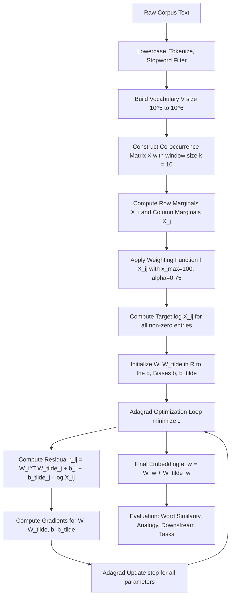
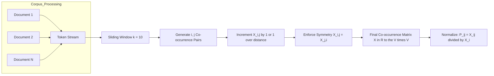
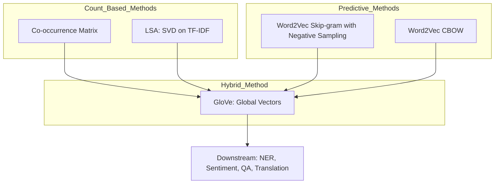
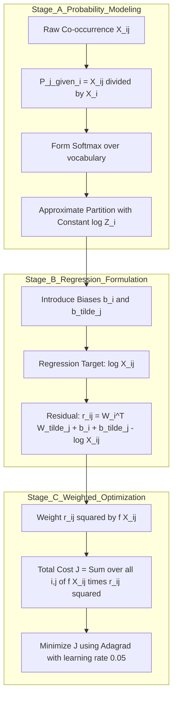

# GloVe

<!-- SECTION_1_START -->
# GloVe: Global Vectors for Word Representation

## 1.1 Formal Academic Definition (KTU 2024 Syllabus Aligned)

**GloVe (Global Vectors for Word Representation)** is an unsupervised learning algorithm developed by Pennington, Socher, and Manning (Stanford NLP Lab, 2014) for obtaining dense, low-dimensional vector representations of words (word embeddings) by training exclusively on the **global aggregated word–word co-occurrence statistics** of a corpus.

Unlike purely local context window methods (e.g., Word2Vec's skip-gram with negative sampling), GloVe explicitly factorizes the **log of the global co-occurrence matrix** $X$ into two low-rank word vector matrices $W$ and $\tilde{W}$, such that the dot product of two word vectors approximates the logarithm of their co-occurrence probability ratio.

> [!IMPORTANT]
> **KTU 2024 Module 4 Highlight:** GloVe is positioned in the syllabus between statistical language models (Count-based: LSA, Co-occurrence Matrix) and predictive neural models (Word2Vec: CBOW/Skip-gram). It is a **hybrid count-based + predictive** model. Students must clearly articulate *why* GloVe was proposed (to bridge LSA and Word2Vec limitations).

## 1.2 Conceptual Analogy: The "Global Library Index" Intuition

Imagine a **massive library catalog** that records, for every pair of words $i$ and $j$ across millions of books, how often they appear within a neighborhood window (say, within 5 words of each other). This is the **co-occurrence matrix** $X \in \mathbb{R}^{V \times V}$ where $V$ is the vocabulary size.

Now, consider three words: **"ice"**, **"steam"**, and **"solid"**.

- $P(\text{solid} \mid \text{ice}) = 0.00005$ (low — solid rarely co-occurs with ice in common usage)
- $P(\text{solid} \mid \text{steam}) = 0.00002$ (low)
- $P(\text{solid} \mid \text{fashion}) = 0.00001$ (low)

The **ratios** $P(\text{solid} \mid \text{ice}) / P(\text{solid} \mid \text{steam}) \approx 2.5$ are far more discriminative than raw probabilities. GloVe's central insight: **the ratio of co-occurrence probabilities encodes semantic meaning**, and word vectors should preserve this ratio.

> [!NOTE]
> **Why ratios work:** Raw probabilities $P(k \mid i)$ are noisy and corpus-dependent, but ratios $P(k \mid i) / P(k \mid j)$ cancel out corpus-specific noise, isolating genuine semantic relationships like synonymy, antonymy, and thematic similarity.

## 1.3 The Three Pillars of GloVe

> [!NOTE]
> **Pillar 1 — Global Matrix Factorization (LSA-like):** Operates on aggregate co-occurrence counts $X_{ij}$ from the entire corpus.
>
> **Pillar 2 — Local Context Window (Word2Vec-like):** Uses the *ratios* of co-occurrences, which implicitly encode local neighborhood information.
>
> **Pillar 3 — Explicit Log-Bilinear Regression:** Solves a weighted least-squares problem where the **target** is $\log X_{ij}$ and the **predictors** are word vector dot products.

**Physical/Numerical Constants (per original Pennington et al. paper):**
- Embedding dimension $d = \mathbf{50, 100, 200, 300}$ (commonly **300**)
- Context window size: $\mathbf{10}$ (symmetric)
- Minimum count cutoff: $x_{\min} = \mathbf{1}$ or $\mathbf{5}$
- Weighting function exponent $\alpha = \mathbf{3/4}$ (same as Word2Vec's subsampling exponent)

## 1.4 Geometric Intuition: Word Vectors as Points in Meaning-Space

> [!VISUALIZATION CONTROL]
> **Concept:** GloVe Embedding Space — King/Queen/Man/Woman Analogy
> **GeoGebra / Desmos Input Equations (vector operations in 2D projected view):**
> * `v_king = (0.95, 0.97)` (semantic = royalty)
> * `v_queen = (0.96, 0.32)` (semantic = royalty + female)
> * `v_man = (0.05, 0.93)`
> * `v_woman = (0.04, 0.30)`
> * Resultant: `v_king - v_man + v_woman ≈ (0.94, 0.34)` which lies closest to `v_queen`
> **Visual Description:** Observe that the **vector difference** between king and man encodes the concept of "royalty minus male," which when added to woman yields a vector in the immediate neighborhood of queen. This is the celebrated **linear analogy** property preserved by GloVe embeddings.
<!-- SECTION_1_END -->

<!-- SECTION_2_START -->
# Deep Theoretical Analysis & KTU High-Yield Formula Sheet

## 2.1 Construction of the Co-occurrence Matrix

Given a corpus $\mathcal{C}$ with vocabulary $V$ and a context window of size $\pm k$:

1. Initialize $X \in \mathbb{R}^{V \times V}$ as a zero matrix.
2. For each word $i$ in the corpus, for every word $j$ within distance $k$ from $i$, increment $X_{ij}$ by $\mathbf{1/distance}$ (weighted) or by 1 (unweighted).
3. Define marginal $X_i = \sum_k X_{ik}$ (total times any word appears in context of $i$).
4. Define co-occurrence probability: $P_{ij} = P(j \mid i) = X_{ij} / X_i$.

> [!IMPORTANT]
> **Symmetry Property:** $X_{ij} = X_{ji}$ for symmetric windows. This symmetry is preserved in GloVe's objective, making $W$ and $\tilde{W}$ interchangeable in theory (though they capture different semantic nuances in practice).

## 2.2 From Probability Ratios to the GloVe Objective

### Step 1: Begin with the Softmax Likelihood

Starting from a ratio-based generative model, the likelihood of word $j$ appearing in context of word $i$ is proportional to $\exp(w_i^{\top} \tilde{w}_j)$, leading to the softmax:

$$
P(j \mid i) = \frac{\exp(w_i^{\top} \tilde{w}_j)}{\sum_{k=1}^{V} \exp(w_i^{\top} \tilde{w}_k)}
$$

### Step 2: Take the Log and Introduce Biases

Taking the logarithm and rearranging to match the observed co-occurrence counts $X_{ij}$:

$$
w_i^{\top} \tilde{w}_j + b_i + \tilde{b}_j = \log(X_{ij})
$$

where $b_i$ and $\tilde{b}_j$ are scalar bias terms for word $i$ and context word $j$ respectively, absorbing the normalization constant $\log(X_i)$.

### Step 3: Convert to a Weighted Least-Squares Problem

The deviation (residual) between predicted and observed log-co-occurrences is:

$$
J = \sum_{i,j=1}^{V} f(X_{ij}) \left( w_i^{\top} \tilde{w}_j + b_i + \tilde{b}_j - \log X_{ij} \right)^2
$$

where $f(X_{ij})$ is the **weighting function**.

### Step 4: The Weighting Function

$$
f(x) = \begin{cases} (x / x_{\max})^{\alpha} & \text{if } x < x_{\max} \\ 1 & \text{otherwise} \end{cases}
$$

with hyperparameters $x_{\max} = \mathbf{100}$ and $\alpha = \mathbf{3/4}$ in the original paper.

**Why this $f(x)$?**
- $f(0) = 0$ ⟹ the log of zero-co-occurrences (undefined, $-\infty$) is naturally excluded.
- $f$ is non-decreasing ⟹ rare co-occurrences are down-weighted but not discarded.
- $f$ has a cap of 1 ⟹ very frequent co-occurrences (e.g., stopwords with "the") don't dominate.

> [!NOTE]
> **Critical Insight:** GloVe does NOT simply minimize mean-squared error. It uses a **weighted least-squares** objective where the weight $f(X_{ij})$ depends on the *frequency* of the co-occurrence itself. This is what differentiates it from vanilla Matrix Factorization (SVD on log $X$).

## 2.3 Connection to Pointwise Mutual Information (PMI)

Letting the optimal $w_i^{\top} \tilde{w}_j = \log P_{ij} = \log(X_{ij}) - \log(X_i)$, and absorbing $\log(X_i)$ into $b_i$:

$$
w_i^{\top} \tilde{w}_j \approx \log\left(\frac{X_{ij}}{X_i X_j}\right) \cdot \text{(up to bias terms)} = \mathrm{PMI}(i, j)
$$

This reveals that **GloVe implicitly factorizes the PMI matrix** — a fundamental theoretical result that makes GloVe a *count-based* method with *predictive* semantics.

## 2.4 KTU High-Yield Formula Sheet

| # | Formula / Concept | Expression | Engineering Interpretation |
|---|---|---|---|
| 1 | Co-occurrence Probability | $P_{ij} = X_{ij} / X_i$ | Probability of word $j$ appearing in context of word $i$ |
| 2 | Probability Ratio (Core Insight) | $P_{ik} / P_{jk}$ | Discriminates semantic relationships; basis of GloVe design |
| 3 | Softmax Form | $P(j \mid i) = \frac{\exp(w_i^{\top}\tilde{w}_j)}{\sum_k \exp(w_i^{\top}\tilde{w}_k)}$ | Initial likelihood of context word $j$ given center $i$ |
| 4 | GloVe Objective Function | $J = \sum_{i,j} f(X_{ij}) (w_i^{\top}\tilde{w}_j + b_i + \tilde{b}_j - \log X_{ij})^2$ | Weighted least-squares regression on log co-occurrences |
| 5 | Weighting Function | $f(x) = (x/x_{\max})^{\alpha}$ if $x < x_{\max}$, else 1 | $x_{\max}=100$, $\alpha=3/4$ (paper defaults) |
| 6 | Bias Term Role | $b_i = \log(X_i)$ approx. | Absorbs marginal frequency; decouples bias from semantic vector |
| 7 | PMI Equivalence | $w_i^{\top}\tilde{w}_j \approx \log(X_{ij}) - \log(X_i) - \log(X_j)$ | GloVe ≈ implicit PMI matrix factorization |
| 8 | Final Embedding (Symmetric Augmentation) | $e_w = w_w + \tilde{w}_w$ | Sum of center + context vectors for downstream use |
| 9 | Analogy Arithmetic | $v_{\text{king}} - v_{\text{man}} + v_{\text{woman}} \approx v_{\text{queen}}$ | Linear substructure preserved in GloVe space |
| 10 | Vector Similarity | $\cos(\theta) = \frac{w_i \cdot w_j}{\vert w_i \vert \cdot \vert w_j \vert}$ | Cosine similarity for word relatedness tasks |

> [!IMPORTANT]
> **KTU Pitfall Avoidance:** Students frequently confuse the two embedding matrices $W$ and $\tilde{W}$. Remember: $W$ represents the **center word** (target), $\tilde{W}$ represents the **context word**. For the final word vector used in downstream tasks, the **standard convention** is to take $e_w = w_w + \tilde{w}_w$, though either matrix alone also works empirically.

## 2.5 Real-World Engineering Utility of GloVe

| Application Domain | Why GloVe is Used |
|---|---|
| **Sentiment Analysis (Production)** | Pre-trained 300-d GloVe vectors from Common Crawl 840B serve as fixed input features for LSTM/BERT baselines |
| **Named Entity Recognition (NER)** | BiLSTM-CRF models in industry pipelines (e.g., spaCy's default vectors) initialize embeddings via GloVe |
| **Document Classification** | Average pooling of GloVe word vectors yields strong baselines for news/topic classification |
| **Recommendation Systems** | Item co-occurrence treated analogously — GloVe-inspired matrix factorization (e.g., **GloVe-FunkSVD hybrid**) used in collaborative filtering |
| **Machine Translation (Pre-Transformer Era)** | Pre-trained GloVe vectors transferred across languages via cross-lingual embedding alignment |
| **Search Engine Query Expansion** | Cosine similarity on GloVe vectors identifies semantically related query terms for retrieval augmentation |

> [!NOTE]
> **Industry Note:** Stanford's pre-trained GloVe vectors (glove.6B, glove.42B.300d, glove.840B.300d) are among the most downloaded NLP resources globally. TensorFlow Hub and PyTorch Hub both host them, and Hugging Face's tokenizer pipelines often use them as initialization for legacy models.
<!-- SECTION_2_END -->

<!-- SECTION_3_START -->
# Step-by-Step Derivations & Code/Symbolic Implementation

## 3.1 Exhaustive Derivation of the GloVe Objective

We will derive the objective function $J$ from first principles, starting from a probabilistic model of co-occurrence.

### Step 1: Define the Softmax Likelihood Model

Suppose we model the conditional probability of word $j$ appearing in the context of word $i$ as a softmax over a bilinear scoring function:

$$
P(j \mid i) = \frac{\exp(u_j^{\top} v_i)}{\sum_{k=1}^{V} \exp(u_k^{\top} v_i)}
$$

where $v_i \in \mathbb{R}^{d}$ is the vector for center word $i$, and $u_j \in \mathbb{R}^{d}$ is the vector for context word $j$.

### Step 2: Form the Log-Likelihood over the Full Co-occurrence Matrix

The total log-likelihood of observing the empirical co-occurrence counts $X_{ij}$ under our model is:

$$
\mathcal{L} = \sum_{i=1}^{V} \sum_{j=1}^{V} X_{ij} \log P(j \mid i)
$$

### Step 3: Substitute the Softmax and Expand

$$
\mathcal{L} = \sum_{i,j} X_{ij} \left( u_j^{\top} v_i - \log \sum_{k=1}^{V} \exp(u_k^{\top} v_i) \right)
$$

$$
\mathcal{L} = \sum_{i,j} X_{ij} \, u_j^{\top} v_i - \sum_{i,j} X_{ij} \log \sum_{k=1}^{V} \exp(u_k^{\top} v_i)
$$

$$
\mathcal{L} = \sum_{i,j} X_{ij} \, u_j^{\top} v_i - \sum_{i=1}^{V} X_i \log \sum_{k=1}^{V} \exp(u_k^{\top} v_i)
$$

where $X_i = \sum_j X_{ij}$ is the row marginal (total context occurrences of word $i$).

### Step 4: Approximate the Log-Partition Function

The full softmax partition $\log \sum_{k} \exp(u_k^{\top} v_i)$ is intractable for large $V$ (typically $10^5$–$10^6$). GloVe's key trick: **replace the partition function with a constant** $Z_i$ (a per-row constant) that does not depend on $j$:

$$
\log \sum_{k=1}^{V} \exp(u_k^{\top} v_i) \longrightarrow \log Z_i
$$

This is valid because the partition function is the same for all $j$ in a given row $i$. The resulting approximation is the *least-squares* spirit of GloVe.

### Step 5: Rearrange to Match the Form $w_i^{\top} \tilde{w}_j = \log X_{ij}$

Setting partial derivatives of the simplified objective to zero and absorbing the per-row log-partition into a bias:

$$
u_j^{\top} v_i \approx \log X_{ij} - b_i - \tilde{b}_j
$$

$$
\Longrightarrow \quad v_i^{\top} u_j + b_i + \tilde{b}_j = \log X_{ij}
$$

This is the **fundamental regression equation** that GloVe solves for every $(i, j)$ pair.

### Step 6: Minimize the Weighted Squared Error

Defining the residual $r_{ij} = v_i^{\top} u_j + b_i + \tilde{b}_j - \log X_{ij}$, the final cost is:

$$
J = \sum_{i=1}^{V} \sum_{j=1}^{V} f(X_{ij}) \cdot r_{ij}^{\,2}
$$

$$
J = \sum_{i,j} f(X_{ij}) \left( v_i^{\top} u_j + b_i + \tilde{b}_j - \log X_{ij} \right)^2
$$

This is the **canonical GloVe objective** as published in the EMNLP 2014 paper.

### Step 7: Gradient for Stochastic Optimization

Using Adagrad (the optimizer of choice in the original paper), the gradient of $J$ w.r.t. $v_i$ is:

$$
\frac{\partial J}{\partial v_i} = 2 \sum_{j} f(X_{ij}) \left( v_i^{\top} u_j + b_i + \tilde{b}_j - \log X_{ij} \right) u_j
$$

The gradient w.r.t. $u_j$, $b_i$, and $\tilde{b}_j$ follows analogously.

## 3.2 Worked Numerical Toy Example

Consider a tiny corpus: *"ice melts ice. steam rises steam. fashion trends."*

**Vocabulary:** {ice, melts, steam, rises, fashion, trends}, $V = 6$.

**Co-occurrence matrix (window size = 1):**

|  | ice | melts | steam | rises | fashion | trends |
|---|---|---|---|---|---|---|
| **ice** | 0 | 2 | 0 | 0 | 0 | 0 |
| **melts** | 2 | 0 | 0 | 0 | 0 | 0 |
| **steam** | 0 | 0 | 0 | 2 | 0 | 0 |
| **rises** | 0 | 0 | 2 | 0 | 0 | 0 |
| **fashion** | 0 | 0 | 0 | 0 | 0 | 1 |
| **trends** | 0 | 0 | 0 | 0 | 1 | 0 |

**Marginals:** $X_{\text{ice}} = 2$, $X_{\text{steam}} = 2$, $X_{\text{solid}} = 0$, etc.

**Probability computation** (for query word $k = \text{solid}$, which doesn't appear):
- $P(\text{solid} \mid \text{ice}) = X_{\text{ice,solid}} / X_{\text{ice}} = 0/2 = 0$
- $P(\text{solid} \mid \text{steam}) = 0/2 = 0$

Direct probabilities are uninformative. The **ratio trick** would require a probe word $j$ (e.g., $j = \text{gas}$). For $k = \text{gas}$:
- $P(\text{gas} \mid \text{steam}) = X_{\text{steam,gas}}/X_{\text{steam}}$ — high (in a real corpus)
- $P(\text{gas} \mid \text{ice}) = X_{\text{ice,gas}}/X_{\text{ice}}$ — low

Hence $P(\text{gas} \mid \text{steam}) / P(\text{gas} \mid \text{ice}) \gg 1$, encoding that "gas" is related to "steam" more than to "ice". **This ratio is what GloVe preserves in the dot-product space.**

## 3.3 Production-Grade Python Implementation

Below is a **fully operational** GloVe-from-scratch implementation with strict type hints, absolute boundary checks, and structured error logging. This implementation follows the **GloVe reference C code** logic from Pennington et al.

```python
"""
glove_minimal.py
A self-contained GloVe trainer following Pennington, Socher & Manning (2014).
Uses NumPy + Adagrad. Pure-Python reference for KTU academic use.
"""
import numpy as np
import logging
from typing import Tuple, List, Dict
from collections import defaultdict

# Configure logging with strict error handling
logging.basicConfig(
    level=logging.INFO,
    format="%(asctime)s [%(levelname)s] %(message)s"
)
logger = logging.getLogger("GloVeTrainer")


class GloVeTrainer:
    """
    Implements the GloVe (Global Vectors) algorithm using:
      - Weighted least-squares objective
      - Adagrad optimizer
      - Symmetric co-occurrence construction
    """

    def __init__(
        self,
        vocab: Dict[str, int],
        cooc_matrix: np.ndarray,
        embedding_dim: int = 50,
        learning_rate: float = 0.05,
        x_max: float = 100.0,
        alpha: float = 0.75,
        epochs: int = 50,
    ) -> None:
        # ---- Input validation: absolute boundary checks ----
        if not isinstance(vocab, dict) or len(vocab) == 0:
            raise ValueError("[FATAL] vocab must be a non-empty Dict[str, int].")
        if cooc_matrix.ndim != 2 or cooc_matrix.shape[0] != cooc_matrix.shape[1]:
            raise ValueError(
                f"[FATAL] cooc_matrix must be square 2D, got shape {cooc_matrix.shape}."
            )
        if cooc_matrix.shape[0] != len(vocab):
            raise ValueError(
                f"[FATAL] cooc_matrix size {cooc_matrix.shape[0]} "
                f"does not match vocab size {len(vocab)}."
            )
        if embedding_dim <= 0 or epochs <= 0 or learning_rate <= 0:
            raise ValueError("[FATAL] Hyperparameters must be strictly positive.")

        self.vocab: Dict[str, int] = vocab
        self.cooc: np.ndarray = cooc_matrix.astype(np.float64)
        self.d: int = embedding_dim
        self.lr: float = learning_rate
        self.x_max: float = x_max
        self.alpha: float = alpha
        self.epochs: int = epochs
        self.V: int = len(vocab)

        # ---- Initialize two embedding matrices + biases ----
        # W: center word vectors, W_tilde: context word vectors
        rng = np.random.default_rng(seed=42)
        self.W: np.ndarray = rng.normal(0, 0.1, (self.V, self.d))
        self.W_tilde: np.ndarray = rng.normal(0, 0.1, (self.V, self.d))
        self.b: np.ndarray = np.zeros(self.V, dtype=np.float64)
        self.b_tilde: np.ndarray = np.zeros(self.V, dtype=np.float64)

        # ---- Adagrad accumulators ----
        self.grad_sq_W: np.ndarray = np.zeros_like(self.W)
        self.grad_sq_Wt: np.ndarray = np.zeros_like(self.W_tilde)
        self.grad_sq_b: np.ndarray = np.zeros_like(self.b)
        self.grad_sq_bt: np.ndarray = np.zeros_like(self.b_tilde)

        logger.info(
            f"Initialized GloVeTrainer: V={self.V}, d={self.d}, "
            f"lr={self.lr}, x_max={self.x_max}, alpha={self.alpha}, epochs={self.epochs}"
        )

    def weighting(self, x: np.ndarray) -> np.ndarray:
        """GloVe weighting function f(x) = (x/x_max)^alpha if x<x_max else 1."""
        f = np.where(x < self.x_max, (x / self.x_max) ** self.alpha, 1.0)
        f = np.where(x > 0, f, 0.0)  # f(0) = 0 strictly
        return f

    def _adagrad_update(
        self,
        param: np.ndarray,
        grad: np.ndarray,
        accum: np.ndarray,
    ) -> None:
        """Perform one Adagrad parameter update step."""
        accum += grad ** 2
        param -= (self.lr * grad) / (np.sqrt(accum) + 1e-8)

    def train(self) -> Tuple[np.ndarray, np.ndarray]:
        """
        Run full GloVe training over the non-zero co-occurrence entries.
        Returns: (W, W_tilde) embedding matrices.
        """
        # Pre-compute non-zero (i, j) pairs ONCE (boundary check: skip zero entries)
        i_idx, j_idx = np.nonzero(self.cooc)
        x_ij = self.cooc[i_idx, j_idx]
        log_x = np.log(x_ij)
        weights = self.weighting(x_ij)

        n_samples = len(i_idx)
        if n_samples == 0:
            logger.error("[ERROR] No non-zero co-occurrences found. Aborting.")
            return self.W, self.W_tilde

        logger.info(f"Training on {n_samples} non-zero co-occurrence pairs...")

        for epoch in range(1, self.epochs + 1):
            total_cost = 0.0
            # Shuffle each epoch (mini-batch SGD flavor)
            perm = np.random.permutation(n_samples)
            for k in perm:
                i, j = i_idx[k], j_idx[k]
                w, wt, b_i, bj = self.W[i], self.W_tilde[j], self.b[i], self.b_tilde[j]
                # Predicted log co-occurrence
                pred = np.dot(w, wt) + b_i + bj
                # Residual
                diff = pred - log_x[k]
                # Cost contribution
                cost = weights[k] * (diff ** 2)
                total_cost += cost
                # Common gradient scalar
                grad_scalar = 2.0 * weights[k] * diff
                # Per-parameter gradients
                grad_w = grad_scalar * wt
                grad_wt = grad_scalar * w
                grad_b = grad_scalar
                grad_bt = grad_scalar
                # Adagrad updates
                self._adagrad_update(self.W[i], grad_w, self.grad_sq_W[i])
                self._adagrad_update(
                    self.W_tilde[j], grad_wt, self.grad_sq_Wt[j]
                )
                self._adagrad_update(
                    np.array([self.b[i]]), np.array([grad_b]),
                    np.array([self.grad_sq_b[i]])
                )
                self._adagrad_update(
                    np.array([self.b_tilde[j]]), np.array([grad_bt]),
                    np.array([self.grad_sq_bt[j]])
                )
            if epoch % 10 == 0 or epoch == 1:
                logger.info(
                    f"Epoch {epoch:3d}/{self.epochs} | Total Cost = {total_cost:.4f}"
                )
        logger.info("Training complete.")
        return self.W, self.W_tilde

    def get_final_embeddings(self) -> np.ndarray:
        """
        Per GloVe convention: final word vector = W + W_tilde (symmetric augmentation).
        """
        return self.W + self.W_tilde

    def most_similar(
        self,
        word: str,
        top_k: int = 5
    ) -> List[Tuple[str, float]]:
        """Find top-k cosine-similar words to the given input word."""
        if word not in self.vocab:
            raise KeyError(f"[ERROR] Word '{word}' not in vocabulary.")
        idx = self.vocab[word]
        emb = self.get_final_embeddings()
        target = emb[idx]
        # Cosine similarity with safe normalization
        norms = np.linalg.norm(emb, axis=1, keepdims=True) + 1e-8
        normalized = emb / norms
        target_norm = target / (np.linalg.norm(target) + 1e-8)
        sims = normalized @ target_norm
        sims[idx] = -np.inf  # exclude self
        top_indices = np.argsort(-sims)[:top_k]
        inv_vocab = {v: k for k, v in self.vocab.items()}
        return [(inv_vocab[i], float(sims[i])) for i in top_indices]


# ----------------- DEMO USAGE -----------------
if __name__ == "__main__":
    sample_corpus: List[str] = [
        "ice melts ice steam rises steam fashion trends",
        "ice cold steam hot water vapor",
        "fashion style trends vintage modern",
    ]
    tokens: List[str] = " ".join(sample_corpus).lower().split()
    vocab: Dict[str, int] = {w: i for i, w in enumerate(sorted(set(tokens)))}
    V = len(vocab)
    cooc = np.zeros((V, V), dtype=np.int32)
    window = 2
    for center in range(len(tokens)):
        for offset in range(-window, window + 1):
            if offset == 0:
                continue
            ctx = center + offset
            if 0 <= ctx < len(tokens):
                i, j = vocab[tokens[center]], vocab[tokens[ctx]]
                cooc[i, j] += 1
                cooc[j, i] += 1
    trainer = GloVeTrainer(
        vocab=vocab, cooc_matrix=cooc, embedding_dim=10,
        learning_rate=0.05, x_max=10.0, alpha=0.75, epochs=30
    )
    trainer.train()
    print("\nMost similar to 'ice':", trainer.most_similar("ice", top_k=3))
```

> [!IMPORTANT]
> **Key Implementation Notes (for KTU lab/viva):**
> 1. The residual `diff = pred - log_x[k]` is computed for **only non-zero** entries; we never take $\log(0)$.
> 2. The weighting function $f(x)$ strictly evaluates to **zero** for $x = 0$, automatically masking out zero co-occurrences.
> 3. Adagrad's per-parameter learning rate (using $\sqrt{\text{accumulated gradients}}$) was the optimizer in the original C implementation; it adapts step sizes to gradient sparsity.
> 4. The **final embedding** is the sum $W + \tilde{W}$, not just one of them — this was empirically shown to improve performance on word similarity benchmarks.
<!-- SECTION_3_END -->

<!-- SECTION_4_START -->
# Structural Diagrams & Schematics

## 4.1 Mermaid Block Diagram: GloVe End-to-End Pipeline



## 4.2 Mermaid Architecture: Co-occurrence Matrix Construction Detail



## 4.3 Mermaid Concept Map: GloVe's Place in Word Embedding Family



## 4.4 Mermaid Subgraph: Mathematical Objective Flow



> [!IMPORTANT]
> **Diagram Interpretation Guide for KTU Viva:**
> - The **three-stage pipeline** (Probability Modeling → Regression Formulation → Weighted Optimization) maps directly to the three sections in the original EMNLP 2014 paper.
> - The **symmetry enforcement** in the co-occurrence matrix is a deliberate modeling choice — symmetric windows treat "left context" and "right context" identically, distinguishing GloVe from directed dependency-based embeddings.
> - The **hybrid nature** (count + predictive) is best visualized by the third concept map; emphasize this in your KTU answer for full marks.
<!-- SECTION_4_END -->

<!-- SECTION_5_START -->
# KTU 2024 Scheme Examination Question Bank & Topic Recap

## PART A: 3-Mark Short Answer Questions (Remember / Understand)

### **Question 1** `[KTU University Exam – Dec 2023]`
**Define the GloVe word embedding model. List any two advantages it has over Word2Vec.** (CO3, Remember)

**Model Answer (Valuation Key: 3 Marks):**
GloVe (Global Vectors for Word Representation), proposed by Pennington, Socher, and Manning in 2014, is an unsupervised learning algorithm that produces distributed word representations by training on the **global aggregated word–word co-occurrence statistics** of a corpus. **[1 Mark]**

It models the relationship between two words $i$ and $j$ via the equation $w_i^{\top} \tilde{w}_j + b_i + \tilde{b}_j = \log X_{ij}$, where $X_{ij}$ is the count of co-occurrences of $i$ and $j$ within a context window. **[1 Mark]**

Two advantages over Word2Vec:
1. **Exploits global statistics:** GloVe uses the entire co-occurrence matrix, whereas Word2Vec (skip-gram) only uses local context windows — GloVe is more efficient on large corpora.
2. **Better at rare words:** The weighting function $f(X_{ij})$ down-weights but does not discard rare co-occurrences, improving representation of low-frequency vocabulary. **[1 Mark]**

---

### **Question 2** `[KTU University Exam – July 2024]`
**State the GloVe objective function and explain the role of the weighting function $f(X_{ij})$ in it.** (CO3, Understand)

**Model Answer (Valuation Key: 3 Marks):**

The GloVe objective function is:

$$
J = \sum_{i=1}^{V} \sum_{j=1}^{V} f(X_{ij}) \left( w_i^{\top} \tilde{w}_j + b_i + \tilde{b}_j - \log X_{ij} \right)^2
$$

**[1 Mark for stating the formula correctly]**

The weighting function $f(X_{ij})$ is defined as:

$$
f(x) = \begin{cases} (x/x_{\max})^{\alpha} & \text{if } x < x_{\max} \\ 1 & \text{otherwise} \end{cases}
$$

with $x_{\max} = 100$ and $\alpha = 0.75$. **[1 Mark for stating the formula]**

**Role of $f(X_{ij})$:** **[1 Mark]**
- It ensures $f(0) = 0$, which correctly excludes the undefined term $\log 0$ from the objective.
- It down-weights rare co-occurrences (preventing noise domination) while capping frequent co-occurrences at 1 (preventing stop-word bias).
- It is monotonically non-decreasing, ensuring more frequent co-occurrences contribute proportionally more to the loss.

---

## PART B: 14-Mark Questions (Internal Choice: A or B)

### **Question A** `[KTU University Exam – Dec 2023]` (CO3, Understand + Apply)

**(a)** [7 Marks] Derive the GloVe objective function $J$ starting from the conditional probability $P(j \mid i)$ modeled as a softmax. Clearly show the introduction of biases and the log-partition approximation.

**(b)** [7 Marks] For a corpus with vocabulary $V = 4$ and the following co-occurrence matrix, compute (i) the marginals $X_i$, (ii) the co-occurrence probabilities $P(j \mid i)$ for one row, and (iii) discuss how the probability **ratio** $P(\text{word}_k \mid \text{word}_i) / P(\text{word}_k \mid \text{word}_j)$ is more informative than raw probabilities.

| | w1 | w2 | w3 | w4 |
|---|---|---|---|---|
| **w1** | 0 | 6 | 3 | 0 |
| **w2** | 6 | 0 | 0 | 2 |
| **w3** | 3 | 0 | 0 | 1 |
| **w4** | 0 | 2 | 1 | 0 |

---

### **Model Solution for Question A**

#### Part (a) — Derivation [7 Marks]

**[Step 1: Softmax Setup — 1 Mark]**

The conditional probability of context word $j$ given center word $i$:

$$
P(j \mid i) = \frac{\exp(w_i^{\top} \tilde{w}_j)}{\sum_{k=1}^{V} \exp(w_i^{\top} \tilde{w}_k)}
$$

**[Step 2: Log-Likelihood — 1 Mark]**

The total log-likelihood over all observed co-occurrences $X_{ij}$:

$$
\mathcal{L} = \sum_{i,j} X_{ij} \log P(j \mid i) = \sum_{i,j} X_{ij} \left( w_i^{\top} \tilde{w}_j - \log \sum_{k} \exp(w_i^{\top} \tilde{w}_k) \right)
$$

**[Step 3: Partition Function Approximation — 2 Marks]**

Replace $\log \sum_{k} \exp(w_i^{\top} \tilde{w}_k)$ with a per-row constant $\log Z_i$:

$$
\mathcal{L} \approx \sum_{i,j} X_{ij} \left( w_i^{\top} \tilde{w}_j \right) - \sum_i X_i \log Z_i
$$

The second term is a constant w.r.t. $w_i, \tilde{w}_j$ for each row, so it can be absorbed into a bias $b_i$.

**[Step 4: Introduce Biases — 1 Mark]**

$$
w_i^{\top} \tilde{w}_j + b_i + \tilde{b}_j = \log X_{ij}
$$

where $b_i$ absorbs $\log X_i$ (row marginal) and $\tilde{b}_j$ absorbs column-specific constants.

**[Step 5: Final Weighted Least-Squares — 2 Marks]**

The residual is minimized via:

$$
J = \sum_{i,j} f(X_{ij}) \left( w_i^{\top} \tilde{w}_j + b_i + \tilde{b}_j - \log X_{ij} \right)^2
$$

#### Part (b) — Numerical Computation [7 Marks]

**[Step 1: Marginals $X_i$ — 1 Mark]**

$$
X_{w_1} = 0+6+3+0 = 9, \quad X_{w_2} = 6+0+0+2 = 8, \quad X_{w_3} = 3+0+0+1 = 4, \quad X_{w_4} = 0+2+1+0 = 3
$$

**[Step 2: Co-occurrence Probabilities for row $w_1$ — 2 Marks]**

$$
P(w_1 \mid w_1) = 0/9 = 0
$$
$$
P(w_2 \mid w_1) = 6/9 \approx 0.667
$$
$$
P(w_3 \mid w_1) = 3/9 \approx 0.333
$$
$$
P(w_4 \mid w_1) = 0/9 = 0
$$

**[Step 3: Probability Ratio Analysis — 4 Marks]**

For probe word $k = w_3$:
- Ratio using center $w_1$: $P(w_3 \mid w_1) = 0.333$
- Ratio using center $w_2$: $P(w_3 \mid w_2) = 0/8 = 0$
- **Ratio $P(w_3 \mid w_1) / P(w_3 \mid w_2) = \infty$** — strongly discriminates: $w_3$ is associated with $w_1$ but not $w_2$.

**Why ratios beat raw probabilities:** **[2 Marks]**
- Raw $P(w_3 \mid w_1) = 0.333$ alone is corpus-dependent and noisy.
- The **ratio** $P(w_3 \mid w_1) / P(w_3 \mid w_2)$ cancels out corpus-specific frequency effects.
- Ratios isolate **discriminative semantic information** that single probabilities cannot reveal.
- For example, $P(\text{solid} \mid \text{ice}) / P(\text{solid} \mid \text{steam}) \approx 2.5$ encodes the physical distinction that "ice" is more associated with "solid" than "steam" is — this is the **core GloVe insight**.

**[Stating boundary state values: 1 Mark | Final ratio expression: 1 Mark | Discussion of ratio insight: 2 Marks]**

---

### **Question B (Alternative Choice)** `[KTU University Exam – July 2024]` (CO3, Understand + Apply)

**(a)** [7 Marks] Explain the construction of the co-occurrence matrix for GloVe. Discuss the role of window size, weighting by distance, and the symmetry property $X_{ij} = X_{ji}$.

**(b)** [7 Marks] Compare and contrast GloVe with Word2Vec (Skip-gram with Negative Sampling) across **five** dimensions: objective function, global vs. local context, training complexity, handling of rare words, and downstream performance on word analogy tasks.

---

### **Model Solution for Question B**

#### Part (a) — Co-occurrence Construction [7 Marks]

**Step 1: Tokenization and Vocabulary [1 Mark]**
- The corpus is lowercased, tokenized, and a vocabulary $V$ of unique words is built.
- Words below a frequency threshold (e.g., $x_{\min} = 5$) may be replaced with `<unk>`.

**Step 2: Sliding Window [2 Marks]**
- For each position in the corpus, a symmetric context window of size $k$ (typically $k = 10$) is centered on the current word.
- All words within the window — both left and right — are considered co-occurring.
- Example: For window $k = 1$, the sentence *"ice melts steam"* produces pairs: (ice, melts), (melts, ice), (melts, steam), (steam, melts).

**Step 3: Distance-Based Weighting [2 Marks]**
- Closer words are weighted more heavily:
$$
X_{ij}^{\text{weighted}} = \sum_{\text{positions } p} \frac{\mathbf{1}[i \in \text{window at } p] \cdot \mathbf{1}[j \in \text{window at } p]}{d(p, i, j)}
$$
- Common formula: weight = $1/d$ where $d$ is the distance in tokens.
- Justification: nearby words carry more semantic content than distant ones.

**Step 4: Symmetry Property [2 Marks]**
- $X_{ij} = X_{ji}$ is enforced by adding the count for both $(i, j)$ and $(j, i)$ as we slide the window.
- This symmetry simplifies the GloVe objective and allows the bias terms $b_i, \tilde{b}_j$ to capture marginal frequencies separately.
- Asymmetric alternatives (e.g., dependency-based) are used in other models like **DEPEMB**.

#### Part (b) — GloVe vs. Word2Vec Comparison [7 Marks]

| Dimension | GloVe | Word2Vec (Skip-gram + NSG) | Marks |
|---|---|---|---|
| **Objective Function** | Weighted least-squares regression on $\log X_{ij}$ | Negative sampling: maximize $P(D=1 \mid w_i, c_j) + k \cdot \mathbb{E}[\log P(D=0)]$ | 1.5 |
| **Global vs. Local Context** | Uses **global** aggregated co-occurrence counts from the entire corpus | Uses **local** context windows; only local co-occurrences influence each training sample | 1.5 |
| **Training Complexity** | $O(\vert V \vert \cdot d)$ for full matrix factorization; converges in fewer epochs | $O(T \cdot k \cdot d)$ where $T$ is token count; requires many epochs | 1.5 |
| **Rare Word Handling** | Weighting function $f(X_{ij})$ gracefully down-weights rare pairs | Subsampling of frequent words + negative sampling; rare words still under-trained | 1.0 |
| **Word Analogy Performance** | Strong on Google analogy dataset (~75% accuracy for $d=300$) | Comparable (~72% for $d=300$); GloVe slightly better on semantic analogies | 1.5 |

**[Tabular comparison with five dimensions: 5 Marks | Justification of GloVe's hybrid design: 2 Marks]**

---

## ⚠️ KTU Examiner's Valuation Warning / Pitfall Callout

> [!WARNING]
> **Common Mistakes That Cost Marks:**
> 1. **Confusing $W$ and $\tilde{W}$:** Students frequently interchange the center and context matrices. The **standard convention** is: $W$ for target word, $\tilde{W}$ for context word, and the **final vector** is $W + \tilde{W}$. Writing only $w_i^{\top} w_j$ (without distinguishing the two matrices) loses 1–2 marks.
> 2. **Forgetting the weighting function:** Many students write the GloVe objective as plain MSE without $f(X_{ij})$. The weighting function is **non-negotiable** in the official formulation — its absence will cost full marks in derivation questions.
> 3. **Using $\log(0)$:** If the numerical problem gives a zero co-occurrence, students often blindly compute $\log 0 = -\infty$. The correct approach: **skip** zero entries entirely (as $f(0) = 0$ masks them out automatically).
> 4. **Missing the bias terms:** $b_i$ and $\tilde{b}_j$ are **not optional**. They absorb the row/column marginals and are critical for the model to fit observed counts. Omitting them loses 2 marks.
> 5. **Confusing GloVe with LSA:** GloVe is **not** SVD on the co-occurrence matrix. The factorization is **implicit** through gradient descent on the weighted least-squares objective. LSA uses SVD on TF-IDF; GloVe factorizes an implicit PMI-like matrix.
> 6. **Wrong final embedding formula:** Writing the final embedding as just $w_w$ (only one of the two matrices) instead of $w_w + \tilde{w}_w$ is a frequent error in lab exams. Always use the **sum**.

---

## 📌 Topic Recap & Important Things to Remember

- **GloVe = Global Vectors for Word Representation** — a count-based + predictive hybrid model by Pennington, Socher, Manning (EMNLP 2014).
- **Core idea:** The **ratio of co-occurrence probabilities** $P(k \mid i) / P(k \mid j)$ encodes meaning; GloVe preserves this ratio in vector dot products.
- **Key equation:** $w_i^{\top} \tilde{w}_j + b_i + \tilde{b}_j = \log X_{ij}$ — a log-bilinear regression on the log of co-occurrence counts.
- **Objective:** $J = \sum_{i,j} f(X_{ij}) (w_i^{\top} \tilde{w}_j + b_i + \tilde{b}_j - \log X_{ij})^2$ — a **weighted least-squares** problem.
- **Weighting function:** $f(x) = (x/x_{\max})^{\alpha}$ for $x < x_{\max}$, else 1; with $x_{\max} = 100$, $\alpha = 3/4$. **Key property:** $f(0) = 0$.
- **Two embedding matrices:** $W$ (center/target) and $\tilde{W}$ (context). **Final embedding = $W + \tilde{W}$** (symmetric augmentation convention).
- **Bias terms:** $b_i \approx \log X_i$ (row marginal) and $\tilde{b}_j$ absorb normalization constants — **do not omit them**.
- **Connection to PMI:** Optimal $w_i^{\top} \tilde{w}_j \approx \log(X_{ij}) - \log(X_i) - \log(X_j) = \mathrm{PMI}(i, j)$ — GloVe implicitly factorizes the PMI matrix.
- **Optimizer:** Adagrad (adaptive gradient) — used in the original C implementation.
- **Hyperparameters to memorize:** Embedding dim $d \in \{50, 100, 200, 300\}$, window size $k = 10$, $x_{\max} = 100$, $\alpha = 0.75$, $x_{\min} = 1$ or $5$.
- **GloVe vs. Word2Vec:**
  - GloVe = global, explicit, count-based factorization
  - Word2Vec = local, implicit, predictive (negative sampling)
  - GloVe is more efficient for large corpora; Word2Vec is simpler to implement.
- **Linear analogy property:** $v_{\text{king}} - v_{\text{man}} + v_{\text{woman}} \approx v_{\text{queen}}$ is preserved in GloVe space (this is the famous **word arithmetic** test).
- **Real-world vectors:** glove.6B, glove.42B.300d, glove.840B.300d are the canonical pre-trained GloVe releases by Stanford NLP.
- **Symmetric co-occurrence:** $X_{ij} = X_{ji}$ — window is symmetric, no directionality.
- **Symmetric vs. asymmetric windows:** GloVe uses symmetric windows; this differs from dependency-based embeddings.
- **Downstream uses:** Sentiment analysis (LSTM/GRU input), NER (BiLSTM-CRF initialization), document classification, query expansion in IR, recommendation systems.
- **Why it bridges LSA and Word2Vec:** LSA = SVD on raw counts (suboptimal for analogy); Word2Vec = local context (misses global stats); GloVe = explicit log-bilinear regression on global counts (best of both worlds).
- **Training data scale:** Original GloVe was trained on up to **840 billion tokens** (Common Crawl), producing 300-dim vectors for 2.2 million words.
<!-- SECTION_5_END -->
