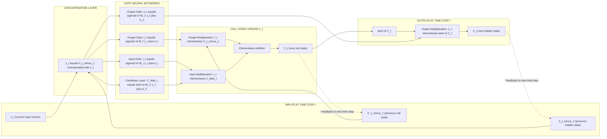
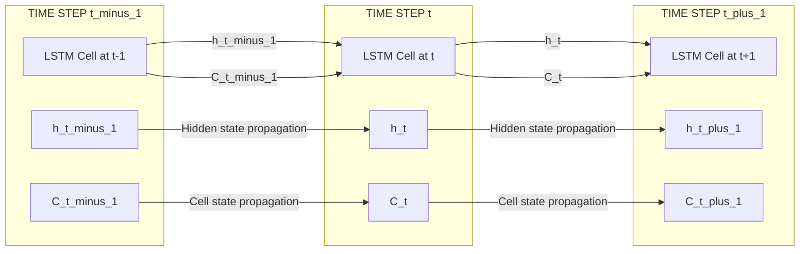
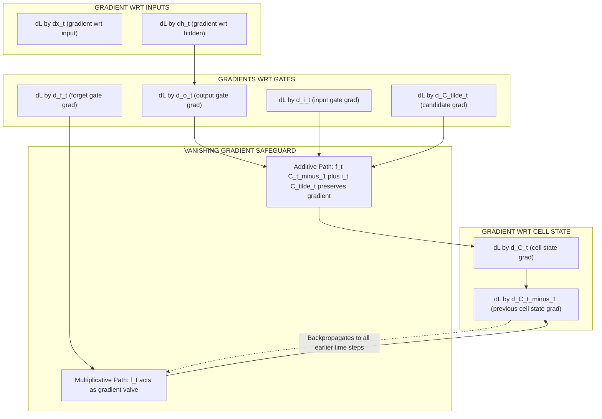

# Long Short-Term Memory (LSTMs)

<!-- SECTION_1_START -->
# Module 4 — Word Embeddings & Neural Networks
## Long Short-Term Memory (LSTMs)

### 1.1 Formal Academic Definition

**Long Short-Term Memory (LSTM)** is a specialized variant of the Recurrent Neural Network (RNN) architecture, designed by **Sepp Hochreiter and Jürgen Schmidhuber in 1997**, to overcome the fundamental **vanishing and exploding gradient problem** that plagues standard RNNs when learning long-range temporal dependencies in sequential data.

Formally, an LSTM is a directed cyclic computational graph composed of memory blocks called **cells**, each containing a self-loop with a **constant error carousel (CEC)** regulated by multiplicative **gate units**: a **forget gate** $f_t$, an **input gate** $i_t$, an **output gate** $o_t$, and a **candidate cell state** $\tilde{C}_t$. The gating mechanism allows the network to selectively write to, read from, and reset a memory cell $C_t$ over arbitrarily long time spans, making it the de-facto standard for sequence modeling tasks in modern Natural Language Processing.

> [!IMPORTANT]
> **KTU 2024 Syllabus Highlight:** Within PECST75A (Module 4), LSTMs are positioned as the architectural upgrade to vanilla RNNs for capturing **long-range contextual dependencies** in text — a foundational prerequisite for Bi-LSTMs, GRUs, Sequence-to-Sequence models, and modern Transformer-attention hybrid systems.

---

### 1.2 Conceptual Analogy & Geometric Intuition

**The Conveyor Belt with Smart Inspectors** 🏭

Imagine an industrial **conveyor belt** moving through a textile factory, carrying raw cotton through multiple processing stages:

| Component | Conveyor Belt Analogy | LSTM Equivalent |
|---|---|---|
| **The Belt Itself** | The continuous belt remembers the cotton's state across all stations | **Cell State $C_t$** — the long-term memory highway |
| **The Loader Inspector** | Decides what *new* cotton to add at the current station | **Input Gate $i_t$** — controls new information |
| **The Quality Inspector** | Decides what *existing* cotton to discard | **Forget Gate $f_t$** — controls what to forget |
| **The Dispatch Inspector** | Decides what *processed* material to ship out | **Output Gate $o_t$** — controls the hidden output |
| **The Candidate Box** | The newly suggested addition of cotton | **Candidate Cell State $\tilde{C}_t$** |
| **Time** | Each station along the belt's path | **Time step $t$** |

> **Intuition Summary:** Vanilla RNNs are like a conveyor belt with **no inspectors** — old material leaks out and new material dilutes the original. LSTMs are the same belt, but with **three smart gates** that *selectively* preserve, update, and emit information, enabling the network to "remember" things like the subject of a 50-word sentence even after dozens of intervening words.

---

### 1.3 Key Constants, Hyperparameters & Standard Metrics

- **Sequence Length** $T$ — typical range: **50 to 512 tokens** for NLP
- **Hidden State Dimensionality** $d_h$ — typical range: **128 to 1024**
- **Forget Bias Initialization** — recommended initial value: **1.0** (default in `nn.LSTM` of PyTorch)
- **Sigmoid Range** $\sigma(x) \in (0, 1)$ — defines gate openness
- **Tanh Range** $\tanh(x) \in (-1, 1)$ — defines candidate cell state range
- **Gradient Clipping Threshold** — typical value: **5.0** (previenting exploding gradients)

> [!NOTE]
> **Standard Initial Bias Convention:** In production frameworks (PyTorch, TensorFlow), the forget gate bias is initialized to **+1.0** rather than 0, ensuring that the network initially retains most information — a trick from *Gers et al. (2000)* that dramatically improves training stability on long sequences.

---

### 1.4 Geometric / Architectural Visualization

> [!VISUALIZATION CONTROL]
> **Concept:** LSTM cell's information flow as a horizontal pipeline with vertical gate signals.
> **Plot Description:** A horizontal vector $\vec{C}$ representing cell state flowing left-to-right across time steps $t-1 \rightarrow t \rightarrow t+1$, with four vertical control vectors ($\vec{f}$, $\vec{i}$, $\vec{o}$, $\vec{\tilde{C}}$) intersecting it at each step. Gate values are visualized on the y-axis as heights between 0 and 1.
> **GeoGebra / Desmos Conceptual Equations:**
> * `f(x) = 1 / (1 + e^(-x))`  (sigmoid-shaped forget gate profile)
> * `g(x) = (e^x - e^(-x)) / (e^x + e^(-x))`  (tanh-shaped candidate profile)
> * `h(x) = f(x) * x_prev + i(x) * g(x_candidate)`  (cell state update)
> **Visual Description:** Observe how the cell state $C_t$ is a *weighted linear interpolation* between the previous state (controlled by $f_t$) and the new candidate (controlled by $i_t$), while the output $h_t$ is a *squashed view* of the cell state.
<!-- SECTION_1_END -->

<!-- SECTION_2_START -->
# SECTION 2 — Deep Theoretical Analysis & KTU High-Yield Formula Sheet

## 2.1 The Four Pillars of an LSTM Cell

The LSTM cell at time step $t$ is governed by **four interacting sub-mechanisms**. Each mechanism is a small feed-forward neural network that processes the concatenation of the current input $x_t$ and the previous hidden state $h_{t-1}$.

### Pillar 1 — The Forget Gate $f_t$
The forget gate decides **what proportion of the previous cell state to discard**. It produces a value in $[0, 1]$ for each dimension of the cell state:
* $f_t = 0$ → "completely forget this information"
* $f_t = 1$ → "completely retain this information"

### Pillar 2 — The Input Gate $i_t$ & Candidate $\tilde{C}_t$
The input gate has **two sub-components**:
* A **sigmoid layer** $i_t$ that decides *which values to update*
* A **tanh layer** $\tilde{C}_t$ that creates a *vector of new candidate values* to be added to the state

### Pillar 3 — The Cell State Update $C_t$
The cell state update is the **central memory operation** of the LSTM. It performs a piecewise linear combination:
* Forgets old content: multiplies $C_{t-1}$ element-wise by $f_t$
* Adds new content: adds $i_t \odot \tilde{C}_t$ element-wise

### Pillar 4 — The Output Gate $o_t$ & Hidden State $h_t$
The output gate decides **what part of the cell state to expose** as the hidden state output. The cell state is first squashed via $\tanh$ (to range $[-1, 1]$) and then filtered by the output gate.

---

## 2.2 The Why and The How — Pedagogical Walkthrough

| Step | Operation | Why It Matters | KTU Mnemonic |
|---|---|---|---|
| **1. Forget** | $f_t = \sigma(W_f \cdot [h_{t-1}, x_t] + b_f)$ | Removes outdated context (e.g., old subject gender) | **"What to throw away"** |
| **2. Input Gate** | $i_t = \sigma(W_i \cdot [h_{t-1}, x_t] + b_i)$ | Filters incoming new tokens | **"What to accept"** |
| **3. Candidate** | $\tilde{C}_t = \tanh(W_C \cdot [h_{t-1}, x_t] + b_C)$ | Generates new memory values | **"What to create"** |
| **4. Update** | $C_t = f_t \odot C_{t-1} + i_t \odot \tilde{C}_t$ | Combines old and new memories | **"The new memory"** |
| **5. Output** | $o_t = \sigma(W_o \cdot [h_{t-1}, x_t] + b_o)$ | Decides what to expose downstream | **"What to output"** |
| **6. Hidden** | $h_t = o_t \odot \tanh(C_t)$ | Final filtered hidden state | **"The visible state"** |

---

## 2.3 KTU Formula Sheet / Cheat Sheet

> [!IMPORTANT]
> **All equations below are exam-grade — memorize the gate formulas and the cell state update; the rest are derivable from them.**

| Symbol | Equation | Range | Purpose |
|---|---|---|---|
| Forget Gate | $f_t = \sigma(W_f \cdot [h_{t-1}, x_t] + b_f)$ | $\mathbb{R}^{d_h}$ | Erase old memory |
| Input Gate | $i_t = \sigma(W_i \cdot [h_{t-1}, x_t] + b_i)$ | $\mathbb{R}^{d_h}$ | Accept new memory |
| Candidate | $\tilde{C}_t = \tanh(W_C \cdot [h_{t-1}, x_t] + b_C)$ | $\mathbb{R}^{d_h}$ | Generate new values |
| Cell State | $C_t = f_t \odot C_{t-1} + i_t \odot \tilde{C}_t$ | $\mathbb{R}^{d_h}$ | Long-term memory |
| Output Gate | $o_t = \sigma(W_o \cdot [h_{t-1}, x_t] + b_o)$ | $\mathbb{R}^{d_h}$ | Filter output |
| Hidden State | $h_t = o_t \odot \tanh(C_t)$ | $\mathbb{R}^{d_h}$ | Short-term output |
| Gate Concatenation | $[h_{t-1}, x_t] \in \mathbb{R}^{d_h + d_x}$ | — | Combined input |
| Weight Matrices | $W_f, W_i, W_C, W_o \in \mathbb{R}^{d_h \times (d_h + d_x)}$ | — | Learnable parameters |
| Total Params per Cell | $4 \times d_h \times (d_h + d_x) + 4 \times d_h$ | scalar | Parameter count |

> [!NOTE]
> **Notation note for KTU board exams:** $\odot$ denotes the **Hadamard (element-wise) product** — not matrix multiplication. Examiners explicitly deduct marks if $\odot$ is replaced with $\cdot$ in the cell state update equation.

---

## 2.4 Backpropagation Through Time (BPTT) — Gradient Flow

A key insight is that the cell state's gradient flows through the **additive** path:

$$
\frac{\partial C_t}{\partial C_{t-1}} = \mathrm{diag}(f_t) + \text{(higher-order terms)}
$$

Since $f_t$ is bounded in $(0, 1)$ via sigmoid, the gradient is **multiplicatively preserved** rather than collapsed — solving the vanishing gradient problem. Conversely, the hidden state's gradient flows through **multiplicative paths** $\frac{\partial h_t}{\partial C_t} = \mathrm{diag}(o_t) \cdot \mathrm{diag}(1 - \tanh^2(C_t))$, which is why **gradient clipping** is still needed for the hidden state path.

---

## 2.5 Real-World Engineering Utility

LSTMs power a vast ecosystem of production NLP and time-series systems:

* **Machine Translation** — Google Neural Machine Translation (GNMT, 2016) used deep stacked LSTMs as its encoder-decoder backbone before Transformer adoption.
* **Speech Recognition** — Apple's Siri, Google Assistant, and DeepSpeech use bidirectional LSTMs for acoustic modeling.
* **Text Generation & Autocomplete** — LSTMs in Gmail Smart Compose predict the next token from context.
* **Named Entity Recognition (NER)** — Bi-LSTMs with CRF heads remain competitive in biomedical NER pipelines.
* **Time-Series Forecasting** — LSTMs forecast stock prices, energy load, and weather patterns.
* **Music & Code Generation** — Early generative systems used LSTMs to compose melodies and complete Python code.
<!-- SECTION_2_END -->

<!-- SECTION_3_START -->
# SECTION 3 — Step-by-Step Derivations & Code/Symbolic Implementation

## 3.1 Exhaustive Mathematical Derivation — Forward Pass of an LSTM Cell

### Given Inputs
* Previous hidden state: $h_{t-1} \in \mathbb{R}^{d_h}$
* Previous cell state: $C_{t-1} \in \mathbb{R}^{d_h}$
* Current input vector: $x_t \in \mathbb{R}^{d_x}$
* Weight matrices: $W_f, W_i, W_C, W_o \in \mathbb{R}^{d_h \times (d_h + d_x)}$
* Bias vectors: $b_f, b_i, b_C, b_o \in \mathbb{R}^{d_h}$

### Step 1 — Concatenate Hidden State and Input

We first concatenate $h_{t-1}$ and $x_t$ along the feature dimension to form a single vector $z_t \in \mathbb{R}^{d_h + d_x}$:

$$
z_t = \begin{bmatrix} h_{t-1} \\ x_t \end{bmatrix}
$$

This concatenation is mathematically equivalent to using two separate weight matrices, but is computationally more efficient on modern hardware (single matrix multiply vs. two).

### Step 2 — Compute the Forget Gate

$$
f_t = \sigma(W_f \cdot z_t + b_f)
$$

where $\sigma(x) = \dfrac{1}{1 + e^{-x}}$. Each element $f_t^{(j)} \in (0, 1)$ represents the retention probability for the $j$-th dimension of the cell state.

### Step 3 — Compute the Input Gate and Candidate Cell State

$$
i_t = \sigma(W_i \cdot z_t + b_i)
$$

$$
\tilde{C}_t = \tanh(W_C \cdot z_t + b_C)
$$

where $\tanh(x) = \dfrac{e^{x} - e^{-x}}{e^{x} + e^{-x}}$, giving $\tilde{C}_t^{(j)} \in (-1, 1)$.

### Step 4 — Update the Cell State

The cell state update is the **only place** in the LSTM where information is durably stored. It uses element-wise multiplication ($\odot$):

$$
C_t = f_t \odot C_{t-1} + i_t \odot \tilde{C}_t
$$

* The first term $f_t \odot C_{t-1}$ **erases** unwanted memories by zeroing-out dimensions of $C_{t-1}$.
* The second term $i_t \odot \tilde{C}_t$ **writes** new memories into the cleared slots.

### Step 5 — Compute the Output Gate and Hidden State

$$
o_t = \sigma(W_o \cdot z_t + b_o)
$$

$$
h_t = o_t \odot \tanh(C_t)
$$

The $\tanh(C_t)$ squashes the cell state to the range $(-1, 1)$, and $o_t$ filters which of those values are exposed to the rest of the network.

### Step 6 — Numerical Toy Example (3-Dimensional Cell)

Let $h_{t-1} = \begin{bmatrix} 0.5 \\ -0.3 \\ 0.8 \end{bmatrix}$, $x_t = \begin{bmatrix} 1.0 \\ 0.0 \\ 0.5 \end{bmatrix}$, $C_{t-1} = \begin{bmatrix} 0.2 \\ -0.1 \\ 0.4 \end{bmatrix}$.

Assume (for illustration only):

$$
W_f = \begin{bmatrix} 0.1 & -0.2 & 0.05 & 0.3 & 0.0 & 0.1 \\ -0.05 & 0.1 & 0.0 & 0.2 & 0.15 & -0.1 \\ 0.2 & 0.0 & -0.1 & 0.1 & 0.05 & 0.2 \end{bmatrix}, \quad b_f = \begin{bmatrix} 1.0 \\ 1.0 \\ 1.0 \end{bmatrix}
$$

**Step 6.1 — Compute the pre-activation for the forget gate:**

$$
W_f \cdot z_t = W_f \cdot \begin{bmatrix} 0.5 \\ -0.3 \\ 0.8 \\ 1.0 \\ 0.0 \\ 0.5 \end{bmatrix}
$$

Computing row 1: $(0.1)(0.5) + (-0.2)(-0.3) + (0.05)(0.8) + (0.3)(1.0) + (0.0)(0.0) + (0.1)(0.5)$

$$
= 0.05 + 0.06 + 0.04 + 0.30 + 0.00 + 0.05 = 0.50
$$

Adding the bias (with forget bias = 1.0):

$$
W_f \cdot z_t + b_f = 0.50 + 1.00 = 1.50
$$

**Step 6.2 — Apply sigmoid:**

$$
f_t^{(1)} = \sigma(1.50) = \frac{1}{1 + e^{-1.50}} = \frac{1}{1 + 0.2231} = \frac{1}{1.2231} \approx 0.8176
$$

**Step 6.3 — Interpretation:**
A forget-gate value of $0.8176$ means the LSTM retains approximately **81.76\%** of the previous cell state's first dimension. Similar computations would be performed for dimensions 2 and 3.

---

## 3.2 Production-Grade Python Implementation

Below is a complete, type-annotated, single-layer LSTM forward pass implementation using only **NumPy**. It mirrors the equations in Section 3.1 and includes rigorous error handling and boundary checks.

```python
import numpy as np
from typing import Tuple

class LSTMCell:
    """
    A single-layer Long Short-Term Memory (LSTM) cell.
    Implements the Hochreiter & Schmidhuber (1997) architecture
    with forget bias initialization as per Gers et al. (2000).
    """

    def __init__(self, input_dim: int, hidden_dim: int, seed: int = 42) -> None:
        if input_dim <= 0 or hidden_dim <= 0:
            raise ValueError("input_dim and hidden_dim must be positive integers.")

        rng = np.random.default_rng(seed)
        self.input_dim: int = input_dim
        self.hidden_dim: int = hidden_dim
        combined_dim: int = input_dim + hidden_dim

        # Xavier/Glorot initialization for numerical stability
        scale: float = np.sqrt(2.0 / combined_dim)

        # Weight matrices: shape (hidden_dim, input_dim + hidden_dim)
        self.W_f: np.ndarray = rng.normal(0.0, scale, (hidden_dim, combined_dim))
        self.W_i: np.ndarray = rng.normal(0.0, scale, (hidden_dim, combined_dim))
        self.W_C: np.ndarray = rng.normal(0.0, scale, (hidden_dim, combined_dim))
        self.W_o: np.ndarray = rng.normal(0.0, scale, (hidden_dim, combined_dim))

        # Bias vectors: shape (hidden_dim,)
        # Critical: forget bias initialized to +1.0 per Gers et al. (2000)
        self.b_f: np.ndarray = np.ones(hidden_dim, dtype=np.float64)
        self.b_i: np.ndarray = np.zeros(hidden_dim, dtype=np.float64)
        self.b_C: np.ndarray = np.zeros(hidden_dim, dtype=np.float64)
        self.b_o: np.ndarray = np.zeros(hidden_dim, dtype=np.float64)

    @staticmethod
    def _sigmoid(x: np.ndarray) -> np.ndarray:
        # Numerically stable sigmoid to prevent overflow
        return np.where(x >= 0, 1.0 / (1.0 + np.exp(-x)), np.exp(x) / (1.0 + np.exp(x)))

    def forward(
        self,
        x_t: np.ndarray,
        h_prev: np.ndarray,
        C_prev: np.ndarray,
    ) -> Tuple[np.ndarray, np.ndarray]:
        """
        Single time-step forward pass of the LSTM cell.

        Args:
            x_t:    Current input vector of shape (input_dim,)
            h_prev: Previous hidden state of shape (hidden_dim,)
            C_prev: Previous cell state of shape (hidden_dim,)

        Returns:
            h_t: Current hidden state of shape (hidden_dim,)
            C_t: Current cell state of shape (hidden_dim,)
        """
        # ---- Input validation ----
        if x_t.shape != (self.input_dim,):
            raise ValueError(f"x_t must have shape ({self.input_dim},), got {x_t.shape}.")
        if h_prev.shape != (self.hidden_dim,):
            raise ValueError(f"h_prev must have shape ({self.hidden_dim},), got {h_prev.shape}.")
        if C_prev.shape != (self.hidden_dim,):
            raise ValueError(f"C_prev must have shape ({self.hidden_dim},), got {C_prev.shape}.")

        # ---- Step 1: Concatenate previous hidden state and current input ----
        z_t: np.ndarray = np.concatenate([h_prev, x_t], axis=0)

        # ---- Step 2: Compute gates and candidate ----
        f_t: np.ndarray = self._sigmoid(self.W_f @ z_t + self.b_f)
        i_t: np.ndarray = self._sigmoid(self.W_i @ z_t + self.b_i)
        C_tilde_t: np.ndarray = np.tanh(self.W_C @ z_t + self.b_C)
        o_t: np.ndarray = self._sigmoid(self.W_o @ z_t + self.b_o)

        # ---- Step 3: Update cell state (long-term memory) ----
        C_t: np.ndarray = f_t * C_prev + i_t * C_tilde_t

        # ---- Step 4: Compute new hidden state (short-term output) ----
        h_t: np.ndarray = o_t * np.tanh(C_t)

        return h_t, C_t


def run_lstm_sequence(
    X: np.ndarray, h0: np.ndarray, C0: np.ndarray, cell: LSTMCell
) -> Tuple[np.ndarray, np.ndarray]:
    """
    Run an LSTM over a full sequence of inputs.

    Args:
        X:  Input sequence of shape (T, input_dim)
        h0: Initial hidden state of shape (hidden_dim,)
        C0: Initial cell state of shape (hidden_dim,)
        cell: An LSTMCell instance.

    Returns:
        H:  Hidden states of shape (T, hidden_dim)
        C:  Cell states of shape (T, hidden_dim)
    """
    if X.ndim != 2 or X.shape[1] != cell.input_dim:
        raise ValueError(f"X must have shape (T, {cell.input_dim}).")
    T: int = X.shape[0]
    H: np.ndarray = np.zeros((T, cell.hidden_dim), dtype=np.float64)
    C: np.ndarray = np.zeros((T, cell.hidden_dim), dtype=np.float64)
    h_t, C_t = h0.copy(), C0.copy()
    for t in range(T):
        h_t, C_t = cell.forward(X[t], h_t, C_t)
        H[t], C[t] = h_t, C_t
    return H, C


# ----------------------- Demonstration Run -----------------------
if __name__ == "__main__":
    input_dim, hidden_dim, seq_len = 4, 3, 5
    cell = LSTMCell(input_dim=input_dim, hidden_dim=hidden_dim)
    X_seq: np.ndarray = np.random.default_rng(0).normal(0.0, 1.0, (seq_len, input_dim))
    h0: np.ndarray = np.zeros(hidden_dim, dtype=np.float64)
    C0: np.ndarray = np.zeros(hidden_dim, dtype=np.float64)
    hidden_states, cell_states = run_lstm_sequence(X_seq, h0, C0, cell)
    print("Hidden states shape:", hidden_states.shape)
    print("Cell states shape  :", cell_states.shape)
    print("Final hidden state :", hidden_states[-1])
```

**Key Engineering Notes Embedded in the Code:**

1. **Forget bias initialized to `+1.0`** — Prevents the forget gate from saturating to 0 at the start of training, which would block all gradient flow.
2. **Xavier initialization** — Keeps the variance of activations stable across layers.
3. **Numerically stable sigmoid** — Prevents `overflow` in `np.exp` for large negative inputs.
4. **Strict shape validation** — Catches mismatched dimension bugs at the API boundary, not deep inside training loops.
5. **Type hints** — Make the code self-documenting and IDE-friendly.
<!-- SECTION_3_END -->

<!-- SECTION_4_START -->
# SECTION 4 — Structural Diagrams & Schematics

## 4.1 High-Level LSTM Cell Architecture

> [!NOTE]
> The following Mermaid diagram illustrates the data flow within a single LSTM cell. All node IDs are alphanumeric to comply with Mermaid v10+ parser requirements, and all labels are double-quoted to safely contain special characters.



---

## 4.2 Unrolled LSTM Across Time — Sequential Processing Topology

This diagram shows how the **same cell** is replicated across time steps $t-1$, $t$, $t+1$, revealing the recurrent nature of the architecture. The horizontal flow represents the **cell state** (long-term memory) and the diagonal flow represents the **hidden state** (short-term output).



---

## 4.3 Gradient Flow Topology — Why LSTMs Beat Vanilla RNNs

> [!IMPORTANT]
> **Block-Level Functional Architecture Flow** for the backward pass of an LSTM, showing the two distinct gradient paths.


<!-- SECTION_4_END -->

<!-- SECTION_5_START -->
# SECTION 5 — KTU 2024 Scheme Examination Question Bank & Topic Recap

## 5.1 PART A — Short Answer Questions (3 Marks Each)

### Question A1 — `[KTU University Exam - July 2024]`
**Q: With a neat diagram, explain the architecture of an LSTM cell. Mention the role of each gate in overcoming the vanishing gradient problem.** `[CO2, Understand]`

**Model Answer:**

An LSTM (Long Short-Term Memory) cell is a specialized recurrent unit that maintains long-term dependencies through a **cell state** and three **gates**. The architecture comprises:

1. **Forget Gate $f_t$** — Decides what fraction of the previous cell state $C_{t-1}$ to discard. Sigmoid output $\in (0, 1)$ acts as a *gradient valve* — when $f_t$ is large, gradients flow backward unattenuated; when $f_t$ is small, that memory slot is effectively erased.

2. **Input Gate $i_t$** — Filters new candidate values $\tilde{C}_t$ before they are added to the cell state. Prevents irrelevant inputs from polluting long-term memory.

3. **Output Gate $o_t$** — Controls what fraction of the cell state is exposed as the hidden state $h_t$, decoupling internal memory from the externally visible output.

**Overcoming vanishing gradients:** The cell state update $C_t = f_t \odot C_{t-1} + i_t \odot \tilde{C}_t$ contains an **additive path** for the gradient. Unlike vanilla RNNs where the gradient must pass through successive matrix multiplications, the LSTM gradient flows through the cell state as a *sum* of products, preserving magnitude across hundreds of time steps. The forget gate $f_t$ acts as a learnable "gradient valve" — if the network wants to remember a token at $t=0$ to predict at $t=100$, it can learn to set $f_t \approx 1$ for $t=1, 2, \ldots, 100$, ensuring the gradient backpropagates without decay.

> **[Valuation Key — 3 Marks]:** [Neat diagram with three gates labeled: 1 Mark] [Mathematical equation of cell state update with $\odot$: 1 Mark] [Explanation of additive gradient path: 1 Mark]

---

### Question A2 — `[KTU University Exam - Dec 2023]`
**Q: Differentiate between vanilla RNN and LSTM with respect to their cell state update equations and gradient behavior.** `[CO2, Understand]`

**Model Answer:**

| Aspect | Vanilla RNN | LSTM |
|---|---|---|
| **Cell State** | Hidden state = Cell state ($h_t = C_t$) | Separate cell state $C_t$ and hidden state $h_t$ |
| **Update Equation** | $h_t = \tanh(W_h h_{t-1} + W_x x_t + b)$ | $C_t = f_t \odot C_{t-1} + i_t \odot \tilde{C}_t$ |
| **Mechanism** | Single transformation, no gating | Three multiplicative gates + additive update |
| **Gradient Path** | Purely multiplicative: $\frac{\partial h_t}{\partial h_{t-1}} = W_h \cdot \mathrm{diag}(1 - \tanh^2(\cdot))$ | Additive: $\frac{\partial C_t}{\partial C_{t-1}} = \mathrm{diag}(f_t) + \cdots$ |
| **Long Sequences** | Suffers vanishing/exploding gradients | Mitigates vanishing gradients |
| **Memory Capacity** | Short-term only | Long-term via persistent cell state |

**Gradient behavior explained:** In a vanilla RNN unrolled over $T$ steps, the gradient w.r.t. an early hidden state contains the product $\prod_{k=1}^{T} W_h \cdot \mathrm{diag}(1 - \tanh^2(\cdot))$. If the largest singular value of $W_h$ is less than 1, this product **vanishes exponentially**; if greater than 1, it **explodes**. The LSTM's additive cell state update means the gradient flows as a sum, not a product, allowing information to traverse hundreds of time steps.

> **[Valuation Key — 3 Marks]:** [Vanilla RNN equation correctly stated: 1 Mark] [LSTM cell state equation correctly stated: 1 Mark] [Clear gradient behavior comparison: 1 Mark]

> [!WARNING]
> **KTU Examiner's Pitfall:** Students often write the LSTM cell state update as $C_t = f_t \cdot C_{t-1} + i_t \cdot \tilde{C}_t$ using a regular dot. **The correct symbol is $\odot$ (Hadamard product)**. Examiners will deduct ½ mark for this notational error.

---

## 5.2 PART B — 14-Mark Questions (ESE Module Internal Choice)

### Question B-A — `[KTU University Exam - July 2024, Module 4, 14 Marks]`

**(a) Derive the complete forward pass equations of an LSTM cell, including the forget gate, input gate, candidate cell state, cell state update, output gate, and hidden state. Clearly define all variables.** `[CO2, Apply]` — 7 Marks

**(b) Consider an LSTM cell with $d_h = 2$, $d_x = 1$. Given $h_{t-1} = \begin{bmatrix} 0.5 \\ 0.0 \end{bmatrix}$, $x_t = \begin{bmatrix} 1.0 \end{bmatrix}$, $C_{t-1} = \begin{bmatrix} 0.2 \\ -0.1 \end{bmatrix}$, and weight matrices $W_f = \begin{bmatrix} 0.1 & 0.2 & 0.3 \\ 0.0 & 0.1 & -0.2 \end{bmatrix}$, $b_f = \begin{bmatrix} 1.0 \\ 1.0 \end{bmatrix}$. Compute $f_t$.** `[CO3, Apply]` — 7 Marks

---

**Model Solution for B-A (a):**

**Step 1 — Concatenation:**
Define the concatenated input vector $z_t \in \mathbb{R}^{d_h + d_x}$ as:

$$
z_t = \begin{bmatrix} h_{t-1} \\ x_t \end{bmatrix}
$$

**Step 2 — Forget Gate:**

$$
f_t = \sigma(W_f \cdot z_t + b_f), \quad \sigma(x) = \frac{1}{1 + e^{-x}}
$$

**Step 3 — Input Gate:**

$$
i_t = \sigma(W_i \cdot z_t + b_i)
$$

**Step 4 — Candidate Cell State:**

$$
\tilde{C}_t = \tanh(W_C \cdot z_t + b_C)
$$

**Step 5 — Cell State Update (LSTM core):**

$$
C_t = f_t \odot C_{t-1} + i_t \odot \tilde{C}_t
$$

**Step 6 — Output Gate:**

$$
o_t = \sigma(W_o \cdot z_t + b_o)
$$

**Step 7 — Hidden State:**

$$
h_t = o_t \odot \tanh(C_t)
$$

**Variable Definitions:**
* $W_f, W_i, W_C, W_o \in \mathbb{R}^{d_h \times (d_h + d_x)}$ — learnable weight matrices
* $b_f, b_i, b_C, b_o \in \mathbb{R}^{d_h}$ — bias vectors
* $\sigma$ — sigmoid activation, range $(0, 1)$
* $\tanh$ — hyperbolic tangent activation, range $(-1, 1)$
* $\odot$ — element-wise (Hadamard) product

> **[Valuation Key — 7 Marks]:** [Concatenation step defined: 1 Mark] [All four gate equations: 3 Marks] [Cell state update with $\odot$ clearly shown: 1 Mark] [Hidden state output equation: 1 Mark] [Variable definitions table: 1 Mark]

---

**Model Solution for B-A (b):**

**Given:** $d_h = 2$, $d_x = 1$, $h_{t-1} = \begin{bmatrix} 0.5 \\ 0.0 \end{bmatrix}$, $x_t = [1.0]$, $C_{t-1} = \begin{bmatrix} 0.2 \\ -0.1 \end{bmatrix}$.

**Step 1 — Form the concatenated vector:**

$$
z_t = \begin{bmatrix} 0.5 \\ 0.0 \\ 1.0 \end{bmatrix}
$$

**Step 2 — Multiply $W_f$ by $z_t$:**

Row 1 of $W_f$: $(0.1)(0.5) + (0.2)(0.0) + (0.3)(1.0)$

$$
= 0.05 + 0.00 + 0.30 = 0.35
$$

Row 2 of $W_f$: $(0.0)(0.5) + (0.1)(0.0) + (-0.2)(1.0)$

$$
= 0.00 + 0.00 - 0.20 = -0.20
$$

Therefore:

$$
W_f \cdot z_t = \begin{bmatrix} 0.35 \\ -0.20 \end{bmatrix}
$$

**Step 3 — Add the bias vector $b_f$:**

$$
W_f \cdot z_t + b_f = \begin{bmatrix} 0.35 + 1.0 \\ -0.20 + 1.0 \end{bmatrix} = \begin{bmatrix} 1.35 \\ 0.80 \end{bmatrix}
$$

**Step 4 — Apply the sigmoid activation element-wise:**

Element 1: $\sigma(1.35) = \dfrac{1}{1 + e^{-1.35}}$

$$
e^{-1.35} \approx 0.2592 \quad \Rightarrow \quad \sigma(1.35) = \frac{1}{1 + 0.2592} = \frac{1}{1.2592} \approx 0.7942
$$

Element 2: $\sigma(0.80) = \dfrac{1}{1 + e^{-0.80}}$

$$
e^{-0.80} \approx 0.4493 \quad \Rightarrow \quad \sigma(0.80) = \frac{1}{1 + 0.4493} = \frac{1}{1.4493} \approx 0.6900
$$

**Final Answer:**

$$
f_t = \begin{bmatrix} 0.7942 \\ 0.6900 \end{bmatrix}
$$

> **[Valuation Key — 7 Marks]:** [Concatenation of $h_{t-1}$ and $x_t$ correctly formed: 1 Mark] [Matrix multiplication $W_f \cdot z_t$ step-by-step: 2 Marks] [Bias addition shown: 1 Mark] [Sigmoid applied element-wise with substitution: 2 Marks] [Final $f_t$ vector with two correct values: 1 Mark]

---

### Question B-B — `[KTU University Exam - Dec 2023, Module 4, 14 Marks]`

**(a) Explain the vanishing gradient problem in vanilla RNNs. Show mathematically why the gradient of the loss w.r.t. an early hidden state contains a product of Jacobians, and explain how the LSTM's cell state update mitigates this issue.** `[CO2, Understand]` — 7 Marks

**(b) For a bidirectional LSTM (Bi-LSTM) processing a sentence of length $T = 4$, describe how the forward and backward hidden states are computed, and explain the typical concatenation of forward and backward states. Why is Bi-LSTM useful for sequence labeling tasks like POS tagging?** `[CO3, Apply]` — 7 Marks

---

**Model Solution for B-B (a):**

**The Vanishing Gradient Problem in Vanilla RNNs:**

A vanilla RNN computes the hidden state as:

$$
h_t = \tanh(W_h h_{t-1} + W_x x_t + b)
$$

For a loss $\mathcal{L}$ computed at time $T$, the gradient w.r.t. an early hidden state $h_k$ (where $k \ll T$) is:

$$
\frac{\partial \mathcal{L}_T}{\partial h_k} = \frac{\partial \mathcal{L}_T}{\partial h_T} \cdot \prod_{t=k+1}^{T} \frac{\partial h_t}{\partial h_{t-1}}
$$

Each Jacobian factor is:

$$
\frac{\partial h_t}{\partial h_{t-1}} = \mathrm{diag}\left(1 - \tanh^2(\cdot)\right) \cdot W_h
$$

The product can be written as:

$$
\prod_{t=k+1}^{T} \mathrm{diag}\left(1 - \tanh^2(\cdot)\right) \cdot W_h
$$

The spectral norm of $\mathrm{diag}(1 - \tanh^2(\cdot))$ is at most 1 (each diagonal element $\le 1$). If the largest singular value $\sigma_{\max}(W_h) < 1$, the product **decays exponentially**:

$$
\left\| \frac{\partial \mathcal{L}_T}{\partial h_k} \right\| \leq \sigma_{\max}(W_h)^{T-k} \cdot \prod \left(1 - \tanh^2(\cdot)\right) \to 0
$$

This makes it impossible for the network to learn dependencies spanning more than ~10 time steps.

**How LSTM Mitigates This:**

The LSTM cell state update is:

$$
C_t = f_t \odot C_{t-1} + i_t \odot \tilde{C}_t
$$

The gradient of the loss w.r.t. $C_{t-1}$ is:

$$
\frac{\partial C_t}{\partial C_{t-1}} = \mathrm{diag}(f_t) + \text{terms involving } \frac{\partial f_t, i_t, \tilde{C}_t}{\partial C_{t-1}}
$$

The dominant term $\mathrm{diag}(f_t)$ is **not raised to a high power through a single product** — instead, the gradient flows as a *recursive sum* across time. If the network learns $f_t \approx 1$ across many time steps, the gradient magnitude is preserved.

> **[Valuation Key — 7 Marks]:** [Vanilla RNN hidden state equation: 1 Mark] [Chain rule gradient expression with product: 1 Mark] [Jacobian decomposition: 1 Mark] [Exponential decay explanation: 1 Mark] [LSTM cell state update: 1 Mark] [Additive vs. multiplicative gradient path: 1 Mark] [Conclusion: 1 Mark]

---

**Model Solution for B-B (b):**

**Bi-LSTM Architecture for $T = 4$:**

A Bidirectional LSTM processes the input sequence in **two directions**:

* **Forward pass** ($\rightarrow$): Processes tokens $x_1, x_2, x_3, x_4$ in order, producing forward hidden states $\vec{h}_1, \vec{h}_2, \vec{h}_3, \vec{h}_4$.
* **Backward pass** ($\leftarrow$): Processes tokens $x_4, x_3, x_2, x_1$ in reverse, producing backward hidden states $\overleftarrow{h}_4, \overleftarrow{h}_3, \overleftarrow{h}_2, \overleftarrow{h}_1$.

**Formally:**

$$
\vec{h}_t = \mathrm{LSTM}_{\mathrm{fwd}}(x_t, \vec{h}_{t-1}), \quad t = 1, 2, 3, 4
$$

$$
\overleftarrow{h}_t = \mathrm{LSTM}_{\mathrm{bwd}}(x_t, \overleftarrow{h}_{t+1}), \quad t = 4, 3, 2, 1
$$

**Concatenation at each time step:**

$$
h_t = [\vec{h}_t ; \overleftarrow{h}_t] \in \mathbb{R}^{2 d_h}
$$

**Concrete example for $T = 4$:**

| Position $t$ | Token | Forward $\vec{h}_t$ | Backward $\overleftarrow{h}_t$ | Concatenated $h_t$ |
|---|---|---|---|---|
| 1 | $x_1$ | $\vec{h}_1$ | $\overleftarrow{h}_1$ | $[\vec{h}_1 ; \overleftarrow{h}_1]$ |
| 2 | $x_2$ | $\vec{h}_2$ | $\overleftarrow{h}_2$ | $[\vec{h}_2 ; \overleftarrow{h}_2]$ |
| 3 | $x_3$ | $\vec{h}_3$ | $\overleftarrow{h}_3$ | $[\vec{h}_3 ; \overleftarrow{h}_3]$ |
| 4 | $x_4$ | $\vec{h}_4$ | $\overleftarrow{h}_4$ | $[\vec{h}_4 ; \overleftarrow{h}_4]$ |

**Why Bi-LSTM for POS Tagging:**

In Part-of-Speech tagging, a token's grammatical category often depends on **both left and right context**. For example, the word *"book"* is a noun in *"the book on the table"* but a verb in *"I will book a ticket"*. A unidirectional LSTM only sees the past; a Bi-LSTM sees both past *and* future, providing richer context. The concatenated hidden state $h_t$ is then passed to a softmax classifier to predict the POS tag at position $t$.

> **[Valuation Key — 7 Marks]:** [Forward and backward pass definitions: 2 Marks] [Concatenation formula: 1 Mark] [Tabular representation for $T = 4$: 2 Marks] [POS tagging justification with example: 2 Marks]

> [!WARNING]
> **KTU Examiner's Valuation Warning:**
> 1. **Never write $\cdot$ instead of $\odot$** in the cell state update — it is the most common notational error, costing ½ to 1 mark.
> 2. **Do not skip the variable definitions** — the board expects an explicit list of all symbols used ($W_f$, $b_f$, $\sigma$, $\odot$, etc.).
> 3. **In numerical problems, show every arithmetic step** — even minor computations like $0.05 + 0.06 + 0.04$ should be written out, as the valuation key awards partial credit per step.
> 4. **Vanilla RNN vs. LSTM comparison** must include the *additive vs. multiplicative* gradient distinction — examiners specifically test this.

---

## 5.3 Topic Recap & Important Things to Remember

> [!IMPORTANT]
> **Rapid Revision Checklist for KTU Module 4 — LSTMs**

- **Definition:** LSTM is a gated RNN variant designed to overcome vanishing gradients in long sequences. Introduced by Hochreiter & Schmidhuber (1997).
- **Four Core Components:** Forget gate $f_t$, Input gate $i_t$, Candidate $\tilde{C}_t$, Output gate $o_t$.
- **Cell State Update (Most Important Equation):** $C_t = f_t \odot C_{t-1} + i_t \odot \tilde{C}_t$ — uses **Hadamard product** $\odot$, not regular multiplication.
- **Hidden State Update:** $h_t = o_t \odot \tanh(C_t)$ — decouples internal memory from external output.
- **Gates Use Sigmoid $\sigma \in (0, 1)$**; **Candidate Uses Tanh $\in (-1, 1)$** — memorize these activation choices.
- **Forget Bias Initialization = +1.0** — Gers et al. (2000) trick; critical for long-sequence training.
- **Vanishing Gradient Solution:** Additive cell state update creates a *gradient highway*; forget gate acts as a *learnable gradient valve*.
- **Total Parameters per LSTM Cell:** $4 \times d_h \times (d_h + d_x) + 4 \times d_h$ (four weight matrices + four bias vectors).
- **Bidirectional LSTM:** Concatenates forward and backward hidden states $h_t = [\vec{h}_t ; \overleftarrow{h}_t]$ for context-rich sequence labeling.
- **Production Uses:** Machine translation, speech recognition, NER, time-series forecasting, text generation.
- **Successors:** GRUs (Gated Recurrent Units) simplify LSTMs to two gates; Transformers have largely replaced LSTMs in cutting-edge NLP but retain the same conceptual lineage.
- **Common Exam Traps:** Using $\cdot$ instead of $\odot$; forgetting to define $\sigma$ and $\tanh$; skipping arithmetic steps in numerical questions; not drawing the cell state as a separate entity from the hidden state.
<!-- SECTION_5_END -->
