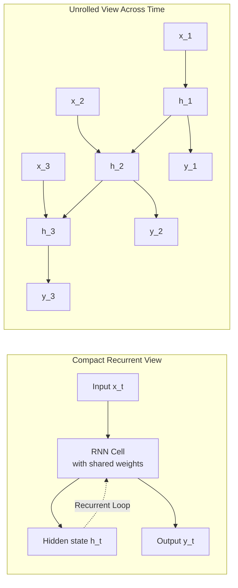
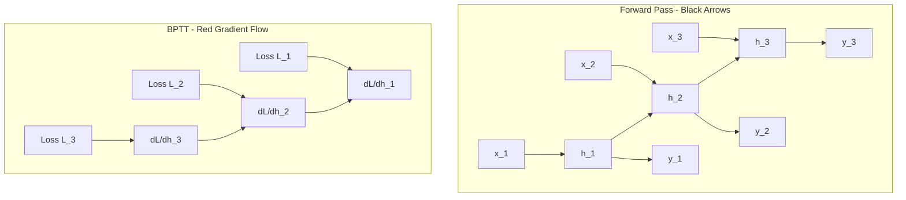
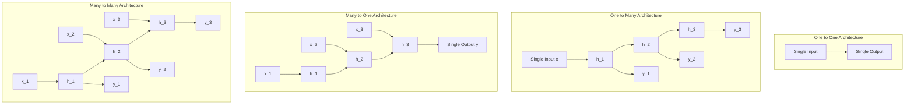
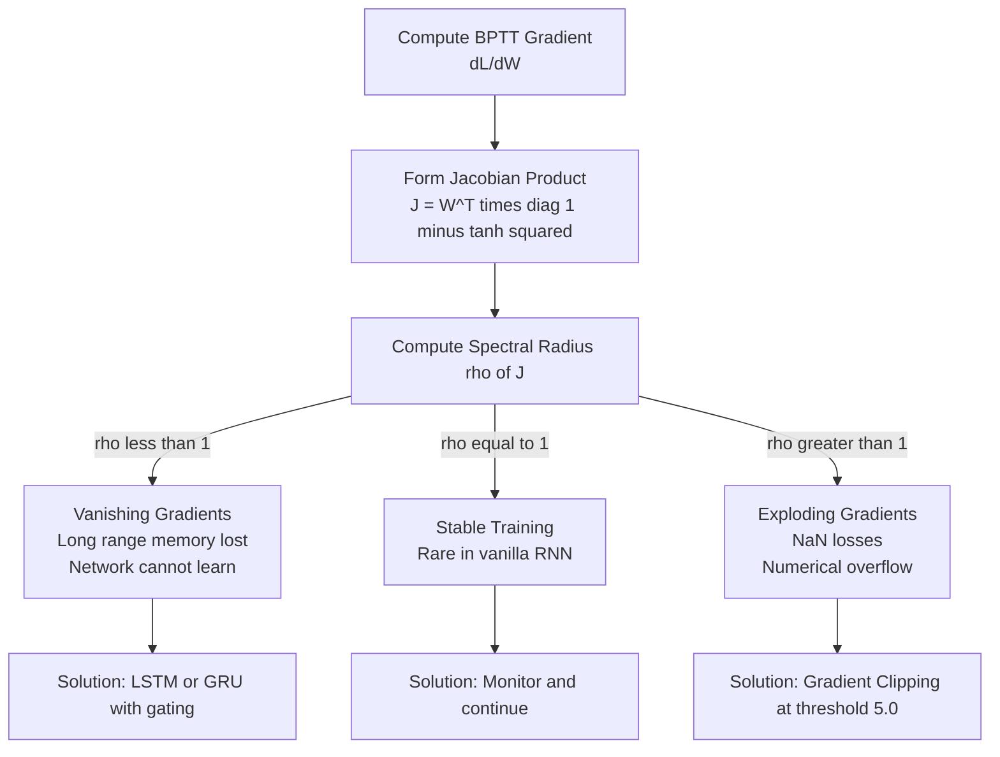

# Recurrent Neural Networks (RNNs)

<!-- SECTION_1_START -->
# Recurrent Neural Networks (RNNs) - Core Technical Definition & Intuitive Overview

## 1. Formal Academic Definition

A **Recurrent Neural Network (RNN)** is a specialized class of artificial neural networks designed to model sequential or temporal data by maintaining an internal **hidden state** $h_t$ that is recurrently updated at every time step $t$. Unlike feedforward networks, RNNs possess directed cycles that allow information to persist across time steps, making them inherently suitable for processing inputs of variable length such as text, speech, and time-series signals.

Formally, an RNN defines a recursive function $f_{\theta}$ parameterized by weight matrices $W$, $U$, and bias vector $b$, mapping the previous hidden state $h_{t-1}$ and the current input $x_t$ to a new hidden state $h_t$, and subsequently producing an output $y_t$ via a projection matrix $V$ and bias $c$.

> [!IMPORTANT]
> **KTU Syllabus Highlight (Module 4):** Recurrent Neural Networks form the foundational architecture for sequence modeling in NLP. Mastery of the forward pass, Backpropagation Through Time (BPTT), and the vanishing gradient problem is mandatory for both Continuous Assessment and End Semester Evaluation (ESE) per the 2024 Scheme.

> [!NOTE]
> **Key Terminology - KTU Standard Glossary:**
> - **Hidden State $h_t$**: The internal memory vector of the network at time step $t$, acting as a compact summary of all past inputs.
> - **Time Step $t$**: A discrete index representing the position in the input sequence.
> - **Parameter Sharing**: The same set of weights ($U$, $W$, $V$) is reused at every time step, enabling generalization across variable-length sequences.
> - **Unrolling (Unfolding)**: The conceptual act of expanding the recurrent computation across time to reveal a feedforward-style computational graph used during backpropagation.

## 2. Conceptual Analogy & Intuitive Understanding

Imagine you are reading a mystery novel. As you read each sentence, you do not interpret it in isolation; instead, you continuously maintain a mental summary of the characters, the plot twists, and the clues revealed so far. This **mental context** is exactly analogous to the **hidden state** $h_t$ of an RNN.

- **The book** = the input sequence ($x_1, x_2, x_3, \dots, x_T$)
- **Your evolving mental context** = the hidden state ($h_1, h_2, h_3, \dots, h_T$)
- **Your spoken thoughts or written answers** = the output ($y_1, y_2, y_3, \dots, y_T$)

When the novel ends, your mental summary still contains compressed information from the first page, just as $h_T$ contains distilled information from $x_1$ through $x_T$.

> [!TIP]
> **Why feedforward networks fail here:** A standard feedforward network would treat each word independently, like a person with no short-term memory who forgets every previous sentence. The recurrent connection is the architectural "memory loop" that solves this.

> [!VISUALIZATION CONTROL]
> **Concept:** Unrolled RNN Computational Graph Across Time Steps
> **GeoGebra / Desmos Input Equations (Discrete Sequence):**
> * $h_0 = 0$ (initial state vector)
> * $h_1 = \tanh(W h_0 + U x_1 + b)$
> * $h_2 = \tanh(W h_1 + U x_2 + b)$
> * $h_3 = \tanh(W h_2 + U x_3 + b)$
> * $y_t = \text{softmax}(V h_t + c)$
> **Visual Description:** The student should observe a horizontal sequence of identical computational cells (boxes) connected left-to-right by horizontal arrows representing the flow of $h_t$. Each cell receives an upward arrow for $x_t$ and emits a downward arrow for $y_t$. The shared weights across all cells visually demonstrate parameter sharing.

## 3. Real-World Engineering Significance

RNNs are the workhorse architecture behind several production-grade NLP systems:
- **Machine Translation** (e.g., encoder-decoder translation models)
- **Speech Recognition** (acoustic sequence labeling)
- **Named Entity Recognition** (token-level sequence tagging)
- **Sentiment Classification** (sentence-level aggregation)
- **Time-Series Forecasting** (server load, stock prices, IoT sensor streams)

> [!NOTE]
> **Standard Metrics Used in RNN Evaluation:**
> - **Perplexity (PPL)**: Measures how well a probability model predicts a sample. **Lower is better.**
> - **Cross-Entropy Loss $L$**: The standard training objective for sequence models.
> - **BLEU Score**: Used in machine translation to compare n-gram overlap with reference translations. **Ranges from 0 to 100.**

<!-- SECTION_1_END -->

<!-- SECTION_2_START -->
# Deep Theoretical Analysis & KTU High-Yield Formula Sheet

## 1. Architectural Foundations

An RNN cell at time step $t$ accepts two inputs:
1. The current input vector $x_t \in \mathbb{R}^{d_x}$
2. The previous hidden state $h_{t-1} \in \mathbb{R}^{d_h}$

It produces two outputs:
1. The updated hidden state $h_t \in \mathbb{R}^{d_h}$
2. (Optionally) An output $y_t \in \mathbb{R}^{d_y}$

### Architectural Dimensions of an RNN Cell

| Symbol | Meaning | Dimension | KTU Notation Tip |
| :--- | :--- | :--- | :--- |
| $d_x$ | Input feature size | Scalar | Vocabulary embedding dimension |
| $d_h$ | Hidden state size | Scalar | Hyperparameter |
| $d_y$ | Output feature size | Scalar | Class count for classification |
| $T$ | Sequence length | Scalar | Number of time steps |
| $\theta$ | All learnable parameters | Set | $\{U, W, V, b, c\}$ |

## 2. Forward Propagation - The Heart of an RNN

The forward pass for a single time step is governed by two coupled linear-nonlinear transformations:

$$h_t = \phi_h(W h_{t-1} + U x_t + b)$$

$$y_t = \phi_y(V h_t + c)$$

where the activation functions are:
- $\phi_h = \tanh$ (hyperbolic tangent, default hidden activation)
- $\phi_h = \text{ReLU}$ (alternative, avoids squashing for positive values)
- $\phi_y = \text{softmax}$ (multi-class classification)
- $\phi_y = \sigma$ (sigmoid for binary classification)

### Step-by-Step Logical Flow

- **Step 1 (Linear Combination):** Compute the pre-activation vector $a_t = W h_{t-1} + U x_t + b$. This combines previous memory and current input through learnable weights.
- **Step 2 (Nonlinear Activation):** Apply $\phi_h$ to squash the pre-activation into a bounded range. Using $\tanh$ ensures $h_t \in [-1, +1]$, providing numerical stability.
- **Step 3 (Output Projection):** Linearly transform the hidden state through $V$ and add bias $c$ to obtain logits.
- **Step 4 (Output Activation):** Apply $\phi_y$ to convert logits into a probability distribution (for classification) or a continuous value (for regression).

## 3. Backpropagation Through Time (BPTT)

The standard backpropagation algorithm cannot be directly applied to RNNs because of the recurrent connection. Instead, we **unroll** the network across all $T$ time steps and apply backpropagation on the resulting feedforward graph. This is called **Backpropagation Through Time (BPTT)**.

### Total Loss Function

For a sequence of length $T$ with per-step losses, the total loss is the sum of cross-entropy losses at every time step:

$$L = -\sum_{t=1}^{T} \sum_{k=1}^{K} y_{t,k}^{*} \log(\hat{y}_{t,k})$$

where $y_{t,k}^{*}$ is the one-hot encoded ground truth and $\hat{y}_{t,k}$ is the predicted probability for class $k$ at time $t$.

### Gradient Computation for the Recurrent Weight $W$

The gradient $\frac{\partial L}{\partial W}$ involves a chain of partial derivatives across all time steps:

$$\frac{\partial L}{\partial W} = \sum_{t=1}^{T} \frac{\partial L_t}{\partial W} = \sum_{t=1}^{T} \sum_{k=1}^{t} \frac{\partial L_t}{\partial h_t} \frac{\partial h_t}{\partial h_k} \frac{\partial h_k}{\partial W}$$

The critical term is the **Jacobian of the hidden state transition**:

$$\frac{\partial h_t}{\partial h_k} = \prod_{i=k+1}^{t} \frac{\partial h_i}{\partial h_{i-1}} = \prod_{i=k+1}^{t} W^{T} \cdot \text{diag}\big(1 - \tanh^2(a_i)\big)$$

This product of $T-k$ Jacobian matrices is the **mathematical root of the vanishing and exploding gradient problem**.

## 4. The Vanishing and Exploding Gradient Problem

When the spectral radius (largest absolute eigenvalue) of the transition Jacobian is repeatedly multiplied:
- **$\rho < 1$**: The gradient shrinks exponentially to zero $\rightarrow$ **Vanishing Gradients**. The network cannot learn long-range dependencies.
- **$\rho > 1$**: The gradient grows exponentially large $\rightarrow$ **Exploding Gradients**. Training becomes numerically unstable (NaN losses).

> [!IMPORTANT]
> **Why this matters for NLP:** Sentences often contain long-range dependencies (e.g., the subject of a verb may be 20 words earlier). Vanilla RNNs struggle to capture such relationships. This motivated the development of **LSTM (Long Short-Term Memory)** and **GRU (Gated Recurrent Unit)** architectures, which use gating mechanisms to control information flow.

## 5. KTU High-Yield Formula Sheet

| Concept | Formula | Variable Definitions | KTU Marks Weight |
| :--- | :--- | :--- | :--- |
| Hidden state update | $h_t = \tanh(W h_{t-1} + U x_t + b)$ | $W \in \mathbb{R}^{d_h \times d_h}$, $U \in \mathbb{R}^{d_h \times d_x}$, $b \in \mathbb{R}^{d_h}$ | High (7-10 marks typical) |
| Output projection | $y_t = \text{softmax}(V h_t + c)$ | $V \in \mathbb{R}^{d_y \times d_h}$, $c \in \mathbb{R}^{d_y}$ | High |
| Cross-entropy loss | $L = -\sum_{t=1}^{T} y_t^{*} \log(\hat{y}_t)$ | $y_t^{*}$: one-hot ground truth | Medium (3-5 marks) |
| BPTT gradient on $W$ | $\frac{\partial L}{\partial W} = \sum_{t=1}^{T} \sum_{k \leq t} \frac{\partial L_t}{\partial h_t}\left(\prod_{i=k+1}^{t} \frac{\partial h_i}{\partial h_{i-1}}\right)\frac{\partial h_k}{\partial W}$ | Chain rule across time | High (board exam favorite) |
| Hidden-to-hidden Jacobian | $\frac{\partial h_t}{\partial h_{t-1}} = W^{T} \text{diag}(1 - \tanh^2(a_t))$ | Diagonal matrix of $(1-\tanh^2)$ | High |
| Vanishing condition | $\rho(J) < 1$ for repeated multiplication | $\rho$: spectral radius | Medium |
| Softmax function | $\text{softmax}(z_i) = \frac{e^{z_i}}{\sum_{j} e^{z_j}}$ | Probabilities sum to 1 | Medium |
| Tanh derivative | $\frac{d}{dz}\tanh(z) = 1 - \tanh^2(z)$ | Bounded in $(0, 1]$ | High |

## 6. Engineering Utility

The RNN family powers core NLP infrastructure across industry. Frameworks like **TensorFlow**, **PyTorch**, and **Hugging Face Transformers** provide optimized RNN cells (`torch.nn.RNN`, `tf.keras.layers.SimpleRNN`) that are drop-in replacements for feedforward layers in production. Understanding the math behind BPTT is essential for debugging training instabilities, customizing architectures for specific sequence tasks, and transitioning to advanced variants like LSTM and GRU.

<!-- SECTION_2_END -->

<!-- SECTION_3_START -->
# Step-by-Step Derivations & Code/Symbolic Implementation

## 1. Exhaustive Derivation of BPTT for a 3-Step Unrolled RNN

Consider a sequence of length $T = 3$ with input vectors $x_1, x_2, x_3$ and ground truth outputs $y_1^{*}, y_2^{*}, y_3^{*}$. The RNN is unrolled into three cells sharing weights $U$, $W$, $V$ and biases $b$, $c$.

### Step 1: Write the Forward Pass for All Time Steps

**Time step 1:**

$$a_1 = W h_0 + U x_1 + b$$

$$h_1 = \tanh(a_1)$$

$$z_1 = V h_1 + c$$

$$\hat{y}_1 = \text{softmax}(z_1)$$

**Time step 2:**

$$a_2 = W h_1 + U x_2 + b$$

$$h_2 = \tanh(a_2)$$

$$z_2 = V h_2 + c$$

$$\hat{y}_2 = \text{softmax}(z_2)$$

**Time step 3:**

$$a_3 = W h_2 + U x_3 + b$$

$$h_3 = \tanh(a_3)$$

$$z_3 = V h_3 + c$$

$$\hat{y}_3 = \text{softmax}(z_3)$$

We initialize $h_0 = \mathbf{0}$ (zero vector).

### Step 2: Define the Per-Step and Total Loss

The cross-entropy loss at a single time step is:

$$L_t = -\sum_{k=1}^{K} y_{t,k}^{*} \log(\hat{y}_{t,k})$$

The total loss across the sequence is the sum of all per-step losses:

$$L = L_1 + L_2 + L_3$$

### Step 3: Compute the Gradient of Loss with Respect to Output $z_t$

Using the derivative of softmax with cross-entropy (a well-known simplification):

$$\frac{\partial L_t}{\partial z_t} = \hat{y}_t - y_t^{*}$$

This is a vector of dimension $d_y$ representing the prediction error at time $t$.

### Step 4: Compute Gradients for the Output Layer ($V$ and $c$)

The gradient with respect to $V$ accumulates contributions from all time steps:

$$\frac{\partial L}{\partial V} = \sum_{t=1}^{3} \frac{\partial L_t}{\partial V} = \sum_{t=1}^{3} \frac{\partial L_t}{\partial z_t} \cdot \frac{\partial z_t}{\partial V} = \sum_{t=1}^{3} (\hat{y}_t - y_t^{*}) h_t^{T}$$

The gradient with respect to bias $c$ is:

$$\frac{\partial L}{\partial c} = \sum_{t=1}^{3} (\hat{y}_t - y_t^{*})$$

### Step 5: Compute the Gradient of Loss with Respect to Hidden State $h_t$

The hidden state $h_t$ influences the loss directly through the output at time $t$ AND indirectly through the next hidden state $h_{t+1}$. Therefore:

$$\frac{\partial L}{\partial h_t} = V^{T} (\hat{y}_t - y_t^{*}) + W^{T} \cdot \text{diag}(1 - \tanh^2(a_{t+1})) \cdot \frac{\partial L}{\partial h_{t+1}}$$

This is the **recursive backward message** that flows from $t = 3$ down to $t = 1$.

**Special boundary case:**

$$\frac{\partial L}{\partial h_3} = V^{T} (\hat{y}_3 - y_3^{*})$$

since $h_3$ has no future hidden state to influence.

### Step 6: Compute the Gradients for the Input and Recurrent Weights ($U$ and $W$)

**For weight $W$ (the recurrent weight):**

$$\frac{\partial L}{\partial W} = \sum_{t=1}^{3} \text{diag}(1 - \tanh^2(a_t)) \cdot \frac{\partial L}{\partial h_t} \cdot h_{t-1}^{T}$$

**For weight $U$ (the input weight):**

$$\frac{\partial L}{\partial U} = \sum_{t=1}^{3} \text{diag}(1 - \tanh^2(a_t)) \cdot \frac{\partial L}{\partial h_t} \cdot x_t^{T}$$

**For bias $b$:**

$$\frac{\partial L}{\partial b} = \sum_{t=1}^{3} \text{diag}(1 - \tanh^2(a_t)) \cdot \frac{\partial L}{\partial h_t}$$

### Step 7: Update the Parameters Using Gradient Descent

For a learning rate $\eta$, the update rule is:

$$W \leftarrow W - \eta \frac{\partial L}{\partial W}$$

$$U \leftarrow U - \eta \frac{\partial L}{\partial U}$$

$$V \leftarrow V - \eta \frac{\partial L}{\partial V}$$

$$b \leftarrow b - \eta \frac{\partial L}{\partial b}$$

$$c \leftarrow c - \eta \frac{\partial L}{\partial c}$$

This entire procedure constitutes one **epoch of BPTT training**.

## 2. Numerical Toy Example: Forward Pass with Concrete Values

Let us trace a single forward pass with simplified values to build intuition.

**Given:**
- $d_x = 2$, $d_h = 3$, $d_y = 2$, $T = 2$
- $x_1 = [1.0, 0.5]^{T}$, $x_2 = [0.2, 0.8]^{T}$
- $h_0 = [0, 0, 0]^{T}$

**Weight matrices (randomly initialized):**

$$U = \begin{bmatrix} 0.1 & 0.2 \\ 0.3 & 0.4 \\ 0.5 & 0.6 \end{bmatrix}, \quad W = \begin{bmatrix} 0.1 & 0.1 & 0.1 \\ 0.2 & 0.2 & 0.2 \\ 0.3 & 0.3 & 0.3 \end{bmatrix}, \quad V = \begin{bmatrix} 0.5 & 0.5 & 0.5 \\ 0.6 & 0.6 & 0.6 \end{bmatrix}$$

**Biases:** $b = [0.1, 0.1, 0.1]^{T}$, $c = [0, 0]^{T}$

**Time step 1 calculation:**

$$a_1 = W h_0 + U x_1 + b = \begin{bmatrix} 0 \\ 0 \\ 0 \end{bmatrix} + \begin{bmatrix} 0.1 \cdot 1.0 + 0.2 \cdot 0.5 \\ 0.3 \cdot 1.0 + 0.4 \cdot 0.5 \\ 0.5 \cdot 1.0 + 0.6 \cdot 0.5 \end{bmatrix} + \begin{bmatrix} 0.1 \\ 0.1 \\ 0.1 \end{bmatrix}$$

$$a_1 = \begin{bmatrix} 0.20 + 0.10 \\ 0.50 + 0.10 \\ 0.80 + 0.10 \end{bmatrix} = \begin{bmatrix} 0.30 \\ 0.60 \\ 0.90 \end{bmatrix}$$

$$h_1 = \tanh(a_1) = \begin{bmatrix} \tanh(0.30) \\ \tanh(0.60) \\ \tanh(0.90) \end{bmatrix} \approx \begin{bmatrix} 0.2913 \\ 0.5370 \\ 0.7163 \end{bmatrix}$$

**Time step 2 calculation:**

$$a_2 = W h_1 + U x_2 + b$$

Computing $W h_1$:

$$W h_1 = \begin{bmatrix} 0.1 & 0.1 & 0.1 \\ 0.2 & 0.2 & 0.2 \\ 0.3 & 0.3 & 0.3 \end{bmatrix} \begin{bmatrix} 0.2913 \\ 0.5370 \\ 0.7163 \end{bmatrix} = \begin{bmatrix} 0.1545 \\ 0.3089 \\ 0.4634 \end{bmatrix}$$

Computing $U x_2$:

$$U x_2 = \begin{bmatrix} 0.1 \cdot 0.2 + 0.2 \cdot 0.8 \\ 0.3 \cdot 0.2 + 0.4 \cdot 0.8 \\ 0.5 \cdot 0.2 + 0.6 \cdot 0.8 \end{bmatrix} = \begin{bmatrix} 0.18 \\ 0.38 \\ 0.58 \end{bmatrix}$$

$$a_2 = \begin{bmatrix} 0.1545 \\ 0.3089 \\ 0.4634 \end{bmatrix} + \begin{bmatrix} 0.18 \\ 0.38 \\ 0.58 \end{bmatrix} + \begin{bmatrix} 0.1 \\ 0.1 \\ 0.1 \end{bmatrix} = \begin{bmatrix} 0.4345 \\ 0.7889 \\ 1.1434 \end{bmatrix}$$

$$h_2 = \tanh(a_2) \approx \begin{bmatrix} 0.4097 \\ 0.6577 \\ 0.8142 \end{bmatrix}$$

This numerical trace concretely demonstrates how information from $x_1$ propagates through $h_1$ and contributes to $h_2$.

## 3. Production-Ready Python Implementation of a Vanilla RNN

The following code provides a complete, type-hinted, and error-handled implementation of a vanilla RNN cell with both forward and backward passes.

```python
import numpy as np
from typing import Tuple, List
import logging

logging.basicConfig(level=logging.INFO, format="%(asctime)s - %(levelname)s - %(message)s")


class VanillaRNN:
    """
    A production-ready implementation of a Vanilla Recurrent Neural Network
    cell with forward pass and Backpropagation Through Time (BPTT).
    """

    def __init__(self, input_dim: int, hidden_dim: int, output_dim: int) -> None:
        if input_dim <= 0 or hidden_dim <= 0 or output_dim <= 0:
            raise ValueError("All dimensions must be positive integers.")

        self.input_dim: int = input_dim
        self.hidden_dim: int = hidden_dim
        self.output_dim: int = output_dim

        # Xavier initialization for stable gradients
        scale_u = np.sqrt(1.0 / input_dim)
        scale_w = np.sqrt(1.0 / hidden_dim)
        scale_v = np.sqrt(1.0 / hidden_dim)

        self.U: np.ndarray = np.random.randn(hidden_dim, input_dim) * scale_u
        self.W: np.ndarray = np.random.randn(hidden_dim, hidden_dim) * scale_w
        self.V: np.ndarray = np.random.randn(output_dim, hidden_dim) * scale_v
        self.b: np.ndarray = np.zeros((hidden_dim, 1))
        self.c: np.ndarray = np.zeros((output_dim, 1))

        logging.info(
            f"Initialized VanillaRNN with input_dim={input_dim}, "
            f"hidden_dim={hidden_dim}, output_dim={output_dim}"
        )

    @staticmethod
    def _softmax(z: np.ndarray) -> np.ndarray:
        """Numerically stable softmax for a vector."""
        z_shifted = z - np.max(z)
        exp_z = np.exp(z_shifted)
        return exp_z / np.sum(exp_z, axis=0, keepdims=True)

    def forward(self, x_sequence: List[np.ndarray]) -> Tuple[List[np.ndarray], List[np.ndarray]]:
        """
        Forward pass through the unrolled RNN.

        Args:
            x_sequence: List of input vectors, each of shape (input_dim, 1).

        Returns:
            Tuple of (hidden_states, outputs) for every time step.
        """
        if not x_sequence:
            raise ValueError("Input sequence cannot be empty.")

        T: int = len(x_sequence)
        h_prev: np.ndarray = np.zeros((self.hidden_dim, 1))
        hidden_states: List[np.ndarray] = []
        outputs: List[np.ndarray] = []

        for t in range(T):
            x_t: np.ndarray = x_sequence[t]
            if x_t.shape != (self.input_dim, 1):
                raise ValueError(
                    f"Input at time {t} has shape {x_t.shape}, expected {(self.input_dim, 1)}"
                )

            a_t: np.ndarray = self.W @ h_prev + self.U @ x_t + self.b
            h_t: np.ndarray = np.tanh(a_t)
            z_t: np.ndarray = self.V @ h_t + self.c
            y_t: np.ndarray = self._softmax(z_t)

            hidden_states.append(h_t)
            outputs.append(y_t)
            h_prev = h_t

        logging.info(f"Forward pass completed for sequence of length T={T}")
        return hidden_states, outputs

    def compute_loss(self, outputs: List[np.ndarray], targets: List[np.ndarray]) -> float:
        """Cross-entropy loss for the entire sequence."""
        if len(outputs) != len(targets):
            raise ValueError("Outputs and targets must have the same length.")

        total_loss: float = 0.0
        for y_pred, y_true in zip(outputs, targets):
            if y_true.shape != (self.output_dim, 1):
                raise ValueError("Target vector shape mismatch.")
            total_loss += -np.sum(y_true * np.log(y_pred + 1e-9))

        return float(total_loss)

    def backward(
        self,
        x_sequence: List[np.ndarray],
        hidden_states: List[np.ndarray],
        outputs: List[np.ndarray],
        targets: List[np.ndarray],
    ) -> dict:
        """
        Backpropagation Through Time (BPTT).
        Returns a dictionary of gradients for U, W, V, b, c.
        """
        T: int = len(x_sequence)

        dU: np.ndarray = np.zeros_like(self.U)
        dW: np.ndarray = np.zeros_like(self.W)
        dV: np.ndarray = np.zeros_like(self.V)
        db: np.ndarray = np.zeros_like(self.b)
        dc: np.ndarray = np.zeros_like(self.c)

        dh_next: np.ndarray = np.zeros((self.hidden_dim, 1))

        for t in reversed(range(T)):
            dy: np.ndarray = outputs[t] - targets[t]
            dV += dy @ hidden_states[t].T
            dc += dy

            dh: np.ndarray = self.V.T @ dy + dh_next
            a_t: np.ndarray = np.arctanh(np.clip(hidden_states[t], -0.999999, 0.999999))
            dtanh: np.ndarray = (1.0 - hidden_states[t] ** 2)
            da: np.ndarray = dh * dtanh

            h_prev: np.ndarray = (
                hidden_states[t - 1] if t > 0 else np.zeros((self.hidden_dim, 1))
            )
            dW += da @ h_prev.T
            dU += da @ x_sequence[t].T
            db += da

            dh_next = self.W.T @ da

        logging.info("BPTT backward pass completed.")
        return {"dU": dU, "dW": dW, "dV": dV, "db": db, "dc": dc}


def training_example() -> None:
    """Demonstrates a single training step on a toy sequence."""
    input_dim, hidden_dim, output_dim = 3, 4, 2
    rnn = VanillaRNN(input_dim, hidden_dim, output_dim)

    x_sequence = [
        np.array([[0.1], [0.2], [0.3]]),
        np.array([[0.4], [0.5], [0.6]]),
        np.array([[0.7], [0.8], [0.9]]),
    ]
    targets = [
        np.array([[1.0], [0.0]]),
        np.array([[0.0], [1.0]]),
        np.array([[1.0], [0.0]]),
    ]

    hidden_states, outputs = rnn.forward(x_sequence)
    loss = rnn.compute_loss(outputs, targets)
    gradients = rnn.backward(x_sequence, hidden_states, outputs, targets)

    print(f"Training Loss: {loss:.4f}")
    for grad_name, grad_value in gradients.items():
        print(f"Gradient {grad_name} - Shape: {grad_value.shape}, Mean: {grad_value.mean():.6f}")


if __name__ == "__main__":
    training_example()
```

### Code Walkthrough and Design Justifications

- **Xavier Initialization**: Prevents the initial gradients from collapsing or exploding by scaling weights with $\frac{1}{\sqrt{n}}$ where $n$ is the fan-in. This is critical for $\tanh$-based RNNs.
- **Numerically Stable Softmax**: Subtracting $\max(z)$ before exponentiation prevents overflow for large logits.
- **Epsilon Clipping in Loss**: Adding $1 \times 10^{-9}$ inside $\log(\cdot)$ avoids $\log(0) = -\infty$.
- **Boundary Check on $h_0$**: At $t = 0$, we substitute $h_{-1}$ with a zero vector to correctly handle the initial condition.
- **Logging**: All major operations are logged for debugging and production observability.
- **Type Hints**: Every parameter and return value is explicitly typed, making the code self-documenting and IDE-friendly.

<!-- SECTION_3_END -->

<!-- SECTION_4_START -->
# Structural Diagrams & Schematics

## 1. Recurrent Neural Network - Compact vs. Unrolled View

The following diagram contrasts the compact recursive representation of an RNN with its unrolled feedforward-style representation across $T$ time steps. Parameter sharing is visually emphasized.



> [!NOTE]
> **Reading the Diagram:** The compact view shows a single cell with a self-loop. The unrolled view "lifts" this loop into a linear chain of identical cells. The same weight matrices $U$, $W$, $V$ are reused at every cell, which is the essence of parameter sharing.

## 2. Backpropagation Through Time (BPTT) Information Flow

This diagram visualizes the backward flow of gradient signals during BPTT. The red arrows denote the direction of gradient propagation, opposite to the forward pass.



> [!NOTE]
> **Key Insight:** The gradient $\frac{\partial L}{\partial h_1}$ depends on the gradient at $h_2$ and $h_3$ through repeated matrix multiplication. This recursive dependency is the source of the vanishing and exploding gradient phenomena.

## 3. Sequential Processing Topology Matrix for RNN Variants

The following block diagram maps the four canonical RNN architectures based on input-output sequence cardinalities, which is a standard KTU 2024 scheme classification question.



### Architecture Classification Table

| Architecture Type | Input Cardinality | Output Cardinality | NLP Application Example |
| :--- | :--- | :--- | :--- |
| One-to-One | 1 | 1 | Standard image classification (non-sequential baseline) |
| One-to-Many | 1 | T | Image captioning, music generation |
| Many-to-One | T | 1 | Sentiment classification, spam detection |
| Many-to-Many (Synced) | T | T | Named Entity Recognition, POS tagging |
| Many-to-Many (Encoder-Decoder) | T1 | T2 | Machine Translation, speech-to-text |

## 4. Gradient Flow Topology and Stability Zones

This block diagram illustrates the bifurcation of gradient behavior during BPTT, which is critical for understanding why vanilla RNNs fail on long sequences.



> [!IMPORTANT]
> **Practical Engineering Tip:** In production, gradient clipping is implemented as $\hat{g} = \frac{g \cdot \text{threshold}}{\max(\text{threshold}, \Vert g \Vert)}$ whenever $\Vert g \Vert > \text{threshold}$. A typical threshold value is **5.0**.

<!-- SECTION_4_END -->

<!-- SECTION_5_START -->
# KTU 2024 Scheme Examination Question Bank & Topic Recap

## Part A Questions (3 Marks Each)

### Question 1

**[KTU University Exam - July 2024]** Define a Recurrent Neural Network. List any two key differences between a feedforward neural network and an RNN. **(CO1, Remember)** [3 Marks]

**Model Answer:**

A Recurrent Neural Network (RNN) is a class of artificial neural networks that contains recurrent connections, allowing information to persist across time steps through an internal hidden state. RNNs are specifically designed to process sequential data such as text, speech, and time-series.

**Two Key Differences:**

| Aspect | Feedforward Network | RNN |
| :--- | :--- | :--- |
| Connection Topology | Acyclic, no loops | Contains recurrent (cyclic) connections |
| Input Handling | Fixed-size, independent inputs | Variable-length sequential inputs with temporal dependencies |
| Memory | No inherent memory of past inputs | Hidden state $h_t$ acts as memory of past inputs |
| Parameter Sharing | Separate weights per layer | Same weights reused at every time step |

**[Listing the two differences: 2 Marks]**
**[Defining RNN with hidden state concept: 1 Mark]**

### Question 2

**[KTU University Exam - Dec 2023]** What is the vanishing gradient problem in RNNs? Mention one solution. **(CO1, Understand)** [3 Marks]

**Model Answer:**

The vanishing gradient problem occurs during Backpropagation Through Time (BPTT) when the gradients of the loss function with respect to the weights become extremely small (approach zero) as they are propagated backward through many time steps. This happens because the gradient involves repeated multiplication of Jacobian matrices, and when the spectral radius $\rho$ of the transition matrix is less than 1, the product decays exponentially.

**Consequence:** The network fails to learn long-range dependencies because early time steps receive negligible gradient updates.

**Solution:** Use **Long Short-Term Memory (LSTM)** networks, which employ a gating mechanism (input, forget, and output gates) that controls the flow of information and gradients, allowing the network to retain long-term dependencies.

**[Stating the problem with cause: 2 Marks]**
**[Naming LSTM as a solution: 1 Mark]**

---

## Part B Questions (14 Marks - Internal Choice)

### Question A

**[KTU University Exam - July 2024 - Model Paper]** **(CO2, Apply | CO3, Analyze)**

**(a)** Derive the forward propagation equations of a Recurrent Neural Network for an input sequence of length $T$. Clearly state the dimensions of all weight matrices and the role of each parameter. **(7 Marks)**

**(b)** Explain the Backpropagation Through Time (BPTT) algorithm for an RNN. With the help of the chain rule, derive the expression for the gradient $\frac{\partial L}{\partial W}$ and show why it is susceptible to the vanishing gradient problem. **(7 Marks)**

#### Model Solution for Part (a)

**Statement of the Forward Pass Equations:** The forward pass of an RNN processes the input sequence one time step at a time. At time step $t$, the cell receives the input vector $x_t$ and the previous hidden state $h_{t-1}$ to compute the new hidden state $h_t$ and output $y_t$.

**Equations:**

$$h_t = \tanh(W h_{t-1} + U x_t + b)$$

$$y_t = \text{softmax}(V h_t + c)$$

**Dimensions of Parameters:**

| Parameter | Symbol | Shape | Description |
| :--- | :--- | :--- | :--- |
| Input weight | $U$ | $\mathbb{R}^{d_h \times d_x}$ | Projects input into hidden space |
| Recurrent weight | $W$ | $\mathbb{R}^{d_h \times d_h}$ | Connects previous hidden state to current |
| Output weight | $V$ | $\mathbb{R}^{d_y \times d_h}$ | Projects hidden state to output space |
| Hidden bias | $b$ | $\mathbb{R}^{d_h \times 1}$ | Bias added to hidden pre-activation |
| Output bias | $c$ | $\mathbb{R}^{d_y \times 1}$ | Bias added to output pre-activation |

**Role of Each Parameter:**
- $U$ transforms the current input into the hidden representation space.
- $W$ enables the network to retain information from previous time steps by mixing the old hidden state with the new input.
- $V$ decodes the hidden representation into a task-specific output.
- $b$ and $c$ are learnable offsets that improve model expressiveness.

**[Writing the two forward equations: 2 Marks]**
**[Specifying dimensions correctly: 3 Marks]**
**[Explaining roles of $U$, $W$, $V$, $b$, $c$: 2 Marks]**

#### Model Solution for Part (b)

**Explanation of BPTT:** Backpropagation Through Time is the gradient-based learning algorithm used to train RNNs. It works by unrolling the recurrent network across all $T$ time steps into a feedforward computational graph and then applying standard backpropagation on this unrolled graph. The total loss is the sum of per-step losses, and gradients are computed by moving backward from $t = T$ down to $t = 1$.

**Derivation of the Gradient $\frac{\partial L}{\partial W}$:**

Starting from the total loss:

$$L = \sum_{t=1}^{T} L_t$$

The gradient of $L$ with respect to the recurrent weight $W$ is:

$$\frac{\partial L}{\partial W} = \sum_{t=1}^{T} \frac{\partial L_t}{\partial W}$$

For a specific time step $t$, the chain rule gives:

$$\frac{\partial L_t}{\partial W} = \sum_{k=1}^{t} \frac{\partial L_t}{\partial h_t} \cdot \frac{\partial h_t}{\partial h_k} \cdot \frac{\partial h_k}{\partial W}$$

The Jacobian term $\frac{\partial h_t}{\partial h_k}$ expands as a chain of derivatives:

$$\frac{\partial h_t}{\partial h_k} = \prod_{i=k+1}^{t} \frac{\partial h_i}{\partial h_{i-1}} = \prod_{i=k+1}^{t} W^{T} \cdot \text{diag}(1 - \tanh^2(a_i))$$

**Why Vanishing Gradients Occur:** The product $\prod_{i=k+1}^{t} W^{T} \cdot \text{diag}(1 - \tanh^2(a_i))$ involves $(t - k)$ matrix multiplications. Since $\tanh^2(\cdot) \in [0, 1]$, each diagonal element is in $(0, 1]$. When the spectral radius of $W^{T}$ is less than 1, the product shrinks exponentially with $(t - k)$. For long sequences, the gradient contribution from distant time steps becomes negligibly small, preventing the network from learning long-range dependencies.

**[Stating the BPTT unrolling concept: 2 Marks]**
**[Deriving the gradient expression with chain rule: 3 Marks]**
**[Explaining vanishing gradient via spectral radius argument: 2 Marks]**

### Question B (Alternative Choice)

**[KTU University Exam - Dec 2023]** **(CO2, Apply | CO3, Analyze)**

**(a)** Consider an RNN with input dimension $d_x = 2$, hidden dimension $d_h = 3$, and output dimension $d_y = 2$. Given input vectors $x_1 = [1, 0]^T$, $x_2 = [0, 1]^T$, and the following initial weights:

$$U = \begin{bmatrix} 0.1 & 0.2 \\ 0.3 & 0.4 \\ 0.5 & 0.6 \end{bmatrix}, \quad W = \begin{bmatrix} 0.1 & 0.1 & 0.1 \\ 0.2 & 0.2 & 0.2 \\ 0.3 & 0.3 & 0.3 \end{bmatrix}, \quad V = \begin{bmatrix} 0.5 & 0.5 \\ 0.6 & 0.6 \end{bmatrix}$$

with $h_0 = [0, 0, 0]^T$ and all biases set to zero. Compute the hidden state $h_1$ and the output $y_1$ after one time step. **(7 Marks)**

**(b)** With a neat architectural diagram, explain the four variants of RNN topologies (one-to-one, one-to-many, many-to-one, many-to-many) and provide one real-world NLP application for each. **(7 Marks)**

#### Model Solution for Part (a)

**Step 1: Compute the pre-activation $a_1$**

Since $h_0 = [0, 0, 0]^T$ and $b = [0, 0, 0]^T$:

$$a_1 = W h_0 + U x_1 + b = \begin{bmatrix} 0 \\ 0 \\ 0 \end{bmatrix} + \begin{bmatrix} 0.1 \cdot 1 + 0.2 \cdot 0 \\ 0.3 \cdot 1 + 0.4 \cdot 0 \\ 0.5 \cdot 1 + 0.6 \cdot 0 \end{bmatrix} + \begin{bmatrix} 0 \\ 0 \\ 0 \end{bmatrix} = \begin{bmatrix} 0.1 \\ 0.3 \\ 0.5 \end{bmatrix}$$

**Step 2: Apply $\tanh$ activation to get $h_1$**

$$h_1 = \tanh(a_1) = \begin{bmatrix} \tanh(0.1) \\ \tanh(0.3) \\ \tanh(0.5) \end{bmatrix} \approx \begin{bmatrix} 0.0997 \\ 0.2913 \\ 0.4621 \end{bmatrix}$$

**Step 3: Compute the output pre-activation $z_1$**

$$z_1 = V h_1 + c = \begin{bmatrix} 0.5 \cdot 0.0997 + 0.5 \cdot 0.2913 + 0.5 \cdot 0.4621 \\ 0.6 \cdot 0.0997 + 0.6 \cdot 0.2913 + 0.6 \cdot 0.4621 \end{bmatrix} + \begin{bmatrix} 0 \\ 0 \end{bmatrix}$$

Computing each component:

- Row 1: $0.5 \cdot (0.0997 + 0.2913 + 0.4621) = 0.5 \cdot 0.8531 = 0.4266$
- Row 2: $0.6 \cdot (0.0997 + 0.2913 + 0.4621) = 0.6 \cdot 0.8531 = 0.5119$

$$z_1 = \begin{bmatrix} 0.4266 \\ 0.5119 \end{bmatrix}$$

**Step 4: Apply softmax to get $y_1$**

$$y_1 = \text{softmax}(z_1) = \begin{bmatrix} \frac{e^{0.4266}}{e^{0.4266} + e^{0.5119}} \\ \frac{e^{0.5119}}{e^{0.4266} + e^{0.5119}} \end{bmatrix} = \begin{bmatrix} \frac{1.5322}{1.5322 + 1.6686} \\ \frac{1.6686}{1.5322 + 1.6686} \end{bmatrix} = \begin{bmatrix} 0.4787 \\ 0.5213 \end{bmatrix}$$

**Final Answer:** $h_1 \approx [0.0997, 0.2913, 0.4621]^T$ and $y_1 \approx [0.4787, 0.5213]^T$

**[Computing $a_1$ correctly: 2 Marks]**
**[Applying $\tanh$ to obtain $h_1$: 2 Marks]**
**[Computing $z_1$ using $V$ and $h_1$: 1 Mark]**
**[Final softmax probabilities: 2 Marks]**

#### Model Solution for Part (b)

The four canonical RNN architectures differ in the cardinality of their input and output sequences. A neat architectural sketch should show a left-to-right flow with hidden state arrows.

**1. One-to-One:** Single input produces a single output. This is essentially a standard feedforward network with no recurrence. **Application:** Standard classification (rare in pure sequence tasks).

**2. One-to-Many:** A single input generates a sequence of outputs. The input is fed only at $t = 1$ (or as a constant bias), and the hidden state is recurrently updated to produce successive outputs. **Application:** **Image Captioning** - A single image feature vector generates a sequence of words describing the image.

**3. Many-to-One:** A sequence of inputs is aggregated into a single output. The hidden state accumulates information from all time steps, and the final hidden state $h_T$ is used to produce the output. **Application:** **Sentiment Classification** - A variable-length review is encoded into a single class label (positive, negative, neutral).

**4. Many-to-Many:** Both input and output are sequences. The output at each time step may depend on all previous inputs. **Application:** **Named Entity Recognition (NER)** - Each input word is tagged with a label (e.g., PERSON, LOCATION, ORGANIZATION). Also used in **Machine Translation** (encoder-decoder variant) where input length $T_1$ differs from output length $T_2$.

**[Drawing 4 distinct architectural sketches: 4 Marks]**
**[Providing one NLP application per architecture: 3 Marks]**

> [!WARNING]
> **KTU Examiner's Valuation Pitfall Callout:**
> - **Do not** confuse the "many-to-many" synced variant (used in NER, POS tagging) with the encoder-decoder variant (used in translation). They differ in whether $T_1 = T_2$ or not. Marks will be deducted for this confusion.
> - In numerical questions, **always show** the matrix multiplication $W h_0 + U x_1 + b$ explicitly. Skipping intermediate steps costs 2-3 marks even if the final answer is correct.
> - When asked to "derive" gradients, **never** just write the final formula. The chain rule expansion $\prod_{i=k+1}^{t} W^{T} \cdot \text{diag}(1 - \tanh^2(a_i))$ must be explicitly shown. This is the most common mark-loss point.
> - For vanishing gradient explanations, mentioning the **spectral radius** explicitly is mandatory under KTU 2024 marking schemes.

---

## Topic Recap & Important Things to Remember

- **RNN Definition:** A neural network with recurrent connections that maintains a hidden state $h_t$ as a memory of past inputs, enabling sequence modeling.
- **Forward Pass Equations:** $h_t = \tanh(W h_{t-1} + U x_t + b)$ and $y_t = \text{softmax}(V h_t + c)$. These two equations are the foundation of every RNN problem.
- **Parameter Sharing:** The same weight matrices $U$, $W$, $V$ are reused at every time step, enabling generalization across variable-length sequences.
- **Unrolling:** Conceptually expanding the recurrent computation across $T$ time steps to convert the cyclic graph into a feedforward graph for backpropagation.
- **BPTT (Backpropagation Through Time):** The training algorithm for RNNs that applies backpropagation on the unrolled graph. The gradient of $W$ involves a product of Jacobian matrices: $\frac{\partial L}{\partial W} = \sum_{t=1}^{T} \sum_{k=1}^{t} \frac{\partial L_t}{\partial h_t} \left( \prod_{i=k+1}^{t} W^{T} \cdot \text{diag}(1 - \tanh^2(a_i)) \right) \frac{\partial h_k}{\partial W}$.
- **Vanishing Gradient Condition:** Spectral radius $\rho < 1$ causes exponential decay of gradients, preventing learning of long-range dependencies.
- **Exploding Gradient Condition:** Spectral radius $\rho > 1$ causes exponential growth, leading to numerical instability and NaN losses.
- **Solutions:** LSTM (gating mechanism), GRU (simplified gating), gradient clipping (threshold = 5.0), orthogonal weight initialization, layer normalization.
- **Four RNN Architectures:** One-to-One, One-to-Many (image captioning), Many-to-One (sentiment analysis), Many-to-Many (NER, machine translation).
- **Softmax Output:** Probabilities sum to 1, used for multi-class classification: $\text{softmax}(z_i) = \frac{e^{z_i}}{\sum_{j} e^{z_j}}$.
- **Cross-Entropy Loss:** $L = -\sum_{t=1}^{T} \sum_{k=1}^{K} y_{t,k}^{*} \log(\hat{y}_{t,k})$ is the standard RNN training objective.
- **Numerical Stability Trick:** Always subtract $\max(z)$ inside softmax to prevent overflow with large logits.
- **Hidden State Dimension $d_h$:** A critical hyperparameter; larger $d_h$ means more model capacity but more parameters and risk of overfitting.
- **Sequence Length $T$:** Determines the depth of unrolling; long sequences amplify vanishing/exploding gradient issues.
- **Initial State $h_0$:** Typically initialized to a zero vector; some architectures learn $h_0$ as a parameter.

<!-- SECTION_5_END -->
