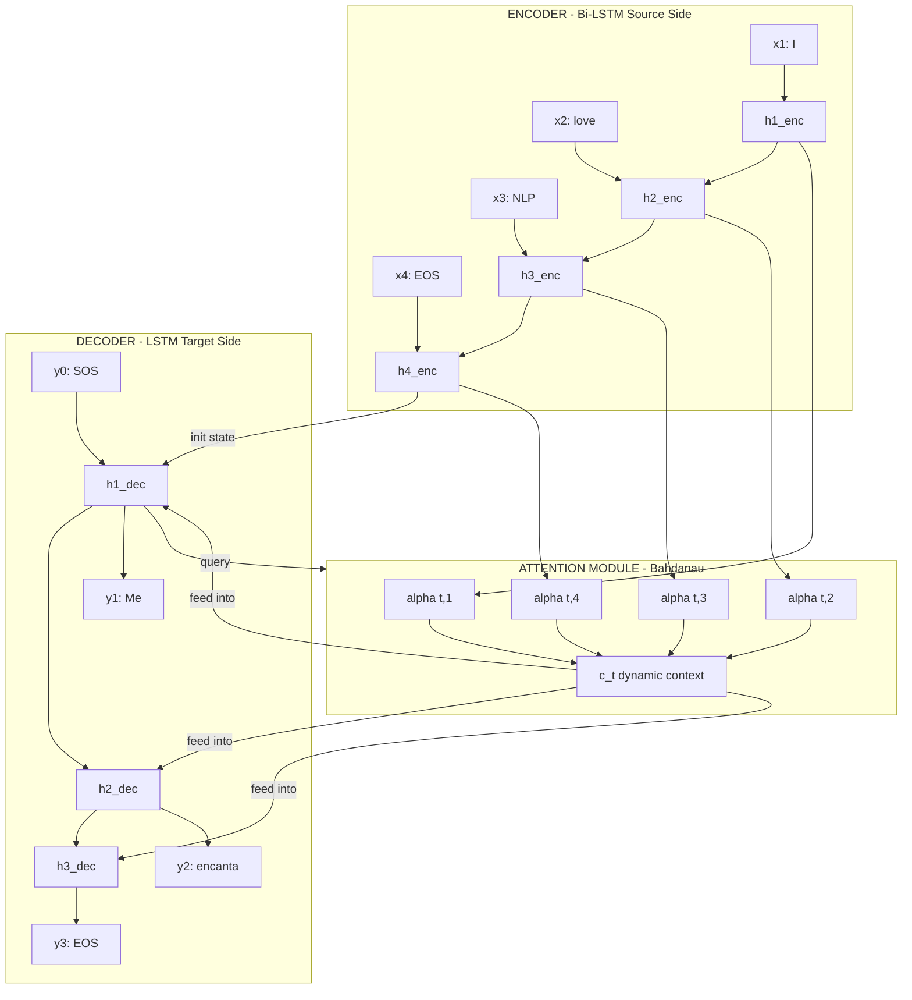
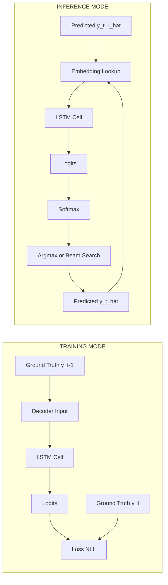
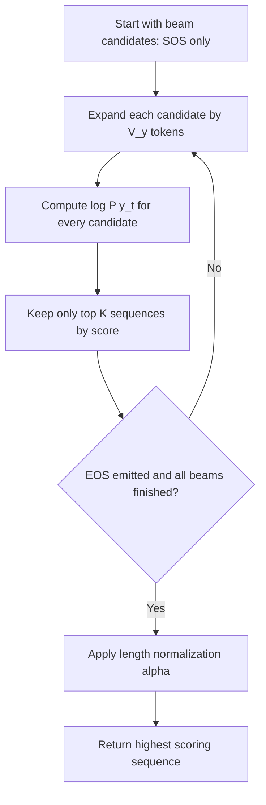
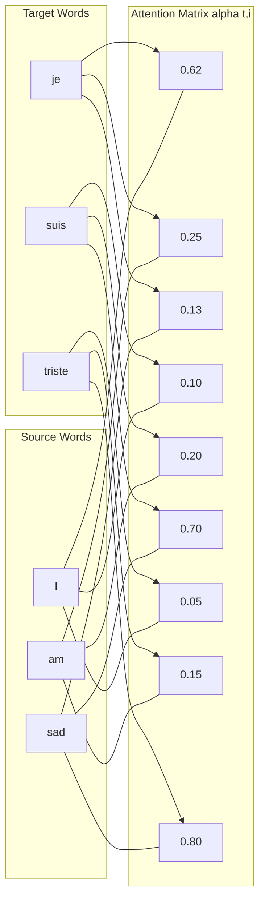
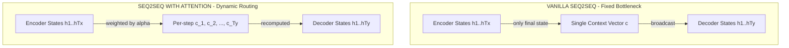

# Sequence-to-sequence models

<!-- SECTION_1_START -->
# Sequence-to-Sequence (Seq2Seq) Models

## 1.1 Formal Academic Definition

> [!NOTE]
> **KTU 2024 Syllabus Definition:**
> A **Sequence-to-Sequence (Seq2Seq) model** is a class of deep learning architectures that maps a variable-length input sequence $\mathbf{x} = (x_1, x_2, \ldots, x_{T_x})$ to a variable-length output sequence $\mathbf{y} = (y_1, y_2, \ldots, y_{T_y})$, where $T_x$ and $T_y$ may differ. The architecture is composed of two coupled Recurrent Neural Networks: an **Encoder**, which compresses the source sequence into a fixed-dimensional latent representation $\mathbf{c}$ (the *context vector* or *thought vector*), and a **Decoder**, which generates the target sequence conditioned on $\mathbf{c}$.

The seminal formulation by **Sutskever et al. (2014)** and **Cho et al. (2014)** established the encoder-decoder paradigm as the foundation of modern Neural Machine Translation (NMT). The hidden state dimensionality is typically fixed at $d = \mathbf{512}$ or $\mathbf{1024}$ units in production systems such as **Google Neural Machine Translation (GNMT)**.

## 1.2 Conceptual Analogy — The "Bilingual Relay Translator"

Imagine you are traveling in Kyoto, Japan, and you do not speak Japanese. You have a **two-person translation team** at a tourist information desk:

| Role in Analogy | Real-World Equivalent | Technical Component |
|---|---|---|
| **Listener** (reads your English) | Compresses your sentence into meaning | **Encoder RNN** |
| **Mental Snapshot** (a summary) | A page of notes the listener writes | **Context Vector $\mathbf{c}$** |
| **Speaker** (reads the notes and speaks Japanese) | Generates the translated sentence word by word | **Decoder RNN** |
| **Generated word** (each spoken word) | Affects the next word to be spoken | **Autoregressive decoding** |

The "mental snapshot" is critical — the **listener cannot re-listen** to the original English. The speaker must produce fluent Japanese *purely* from this one snapshot. This bottleneck is precisely the limitation that motivated the invention of **Attention Mechanisms** (Bahdanau et al., 2015).

> [!IMPORTANT]
> **Key Insight for KTU Examinations:**
> The Encoder produces **only ONE** final hidden state $\mathbf{c}$ in the basic Seq2Seq model. The Decoder has *no direct access* to the intermediate encoder states. This is the fundamental architectural weakness addressed by the Attention mechanism.

## 1.3 Visualization Control Block

> [!VISUALIZATION CONTROL]
> **Concept:** Information Bottleneck in a Vanilla Seq2Seq Model
> **Conceptual Schematic (text-rendered for board diagrams):**
>
> ```
> INPUT:   "I"   "love"  "NLP"   "<EOS>"
>          ↓       ↓       ↓         ↓
>       [ENC]  [ENC]   [ENC]    [ENC]   ← Encoder LSTM
>          ↘       ↘       ↘        ↙
>                       [c]            ← Single Context Vector (Bottleneck)
>                         ↓
>                      [DEC]   → "Me"   ← Decoder LSTM
>                         ↓
>                      [DEC]   → "encanta"
>                         ↓
>                      [DEC]   → "PNL"
> ```
>
> **Visual Description:** Observe that all information from the variable-length English input is *funneled* into one fixed-size vector $\mathbf{c}$. The decoder cannot look back; it can only sample from $\mathbf{c}$.

## 1.4 Standard Notation Glossary (KTU Board Standard)

| Symbol | Meaning | Typical Dimension |
|---|---|---|
| $T_x$ | Length of source sequence | Variable (e.g., 10–100) |
| $T_y$ | Length of target sequence | Variable (e.g., 10–100) |
| $\mathbf{x}_t$ | Source token at step $t$ | $\mathbb{R}^{V_x}$ (one-hot) or $\mathbb{R}^{d_{emb}}$ (embedded) |
| $\mathbf{y}_t$ | Predicted target token at step $t$ | $\mathbb{R}^{V_y}$ (softmax distribution) |
| $\mathbf{h}_t^{enc}$ | Encoder hidden state at step $t$ | $\mathbb{R}^{d}$ where $d = \mathbf{512}$ |
| $\mathbf{h}_t^{dec}$ | Decoder hidden state at step $t$ | $\mathbb{R}^{d}$ |
| $\mathbf{c}$ | Context (thought) vector | $\mathbb{R}^{d}$ |
| $V_x, V_y$ | Source and target vocabulary sizes | Often $\mathbf{30000}$ to $\mathbf{100000}$ |
| $\mathbf{E}_x, \mathbf{E}_y$ | Source and target embedding matrices | $\mathbb{R}^{V \times d_{emb}}$ |

> [!TIP]
> **Mnemonic for Examinations:** **"E-C-D"** → **E**ncoder → **C**ontext vector → **D**ecoder. The flow of information in any vanilla Seq2Seq model.

<!-- SECTION_1_END -->

<!-- SECTION_2_START -->
# Deep Theoretical Analysis & KTU High-Yield Formula Sheet

## 2.1 Operational Architecture — The Encoder

The encoder is a Recurrent Neural Network (typically an **LSTM** or **GRU**) that processes the input sequence one token at a time, updating its hidden state at each step.

### 2.1.1 Forward Pass Equations (Encoder)

For $t = 1, 2, \ldots, T_x$:

$$
\mathbf{h}_t^{enc} = f_{enc}\left(\mathbf{h}_{t-1}^{enc}, \mathbf{x}_t\right)
$$

where $f_{enc}$ is a non-linear recurrent cell. For an **LSTM** cell specifically:

$$
\begin{aligned}
\mathbf{i}_t &= \sigma\left(\mathbf{W}_i \left[\mathbf{h}_{t-1}^{enc}; \mathbf{x}_t\right] + \mathbf{b}_i\right) \quad &\text{(input gate)} \\
\mathbf{f}_t &= \sigma\left(\mathbf{W}_f \left[\mathbf{h}_{t-1}^{enc}; \mathbf{x}_t\right] + \mathbf{b}_f\right) \quad &\text{(forget gate)} \\
\mathbf{o}_t &= \sigma\left(\mathbf{W}_o \left[\mathbf{h}_{t-1}^{enc}; \mathbf{x}_t\right] + \mathbf{b}_o\right) \quad &\text{(output gate)} \\
\tilde{\mathbf{c}}_t &= \tanh\left(\mathbf{W}_c \left[\mathbf{h}_{t-1}^{enc}; \mathbf{x}_t\right] + \mathbf{b}_c\right) \quad &\text{(candidate cell)} \\
\mathbf{c}_t &= \mathbf{f}_t \odot \mathbf{c}_{t-1} + \mathbf{i}_t \odot \tilde{\mathbf{c}}_t \quad &\text{(cell state update)} \\
\mathbf{h}_t^{enc} &= \mathbf{o}_t \odot \tanh(\mathbf{c}_t) \quad &\text{(hidden state output)}
\end{aligned}
$$

> [!IMPORTANT]
> **The Context Vector Construction:**
> In the **Sutskever (2014)** variant: $\mathbf{c} = \mathbf{h}_{T_x}^{enc}$ (only the *final* hidden state).
> In the **Cho (2014)** variant: $\mathbf{c} = \tanh\left(\mathbf{W}_c \mathbf{h}_{T_x}^{enc}\right)$ (a learned projection).
> Both produce a **fixed-size bottleneck** — the most commonly tested KTU concept.

## 2.2 Operational Architecture — The Decoder

The decoder is *also* a recurrent network, but it operates **autoregressively**: each generated token is fed back as input to the next decoding step.

### 2.2.1 Forward Pass Equations (Decoder)

For $t = 1, 2, \ldots, T_y$:

$$
\begin{aligned}
\mathbf{h}_t^{dec} &= f_{dec}\left(\mathbf{h}_{t-1}^{dec}, \mathbf{y}_{t-1}, \mathbf{c}\right) \\
\mathbf{s}_t &= \mathbf{O}_h \mathbf{h}_t^{dec} \quad &\text{(output projection)} \\
P(\mathbf{y}_t \mid \mathbf{y}_{<t}, \mathbf{x}) &= \text{softmax}\left(\mathbf{s}_t\right) \quad &\text{(token probability)}
\end{aligned}
$$

The decoder's **first step** is special — it is initialized using $\mathbf{c}$:

$$
\mathbf{h}_0^{dec} = \mathbf{c}, \quad \mathbf{y}_0 = \langle \text{SOS} \rangle
$$

where $\langle \text{SOS} \rangle$ is the **Start-Of-Sentence** token.

> [!NOTE]
> **Why the initial state matters:** The decoder inherits the encoder's final state because there is no other channel for the source information to reach the decoder. This is why long sentences degrade translation quality — the state vector saturates.

## 2.3 Training Objective — Maximum Likelihood Estimation

Given a parallel corpus $\mathcal{D} = \{(\mathbf{x}^{(n)}, \mathbf{y}^{(n)})\}_{n=1}^{N}$, training minimizes the **negative log-likelihood** (cross-entropy loss):

$$
\mathcal{L}(\theta) = -\frac{1}{N} \sum_{n=1}^{N} \sum_{t=1}^{T_y^{(n)}} \log P_\theta\!\left(y_t^{(n)} \mid y_{<t}^{(n)}, \mathbf{x}^{(n)}\right)
$$

## 2.4 Teacher Forcing (Critical Training Trick)

During training, instead of feeding the decoder's *own previous prediction* (which may be noisy early in training), we feed the **ground-truth token** $\mathbf{y}_{t-1}^{true}$ with probability $p_{tf}$ (often $p_{tf} = \mathbf{1.0}$):

$$
\mathbf{y}_{t-1}^{input} = \begin{cases}
\mathbf{y}_{t-1}^{true} & \text{with probability } p_{tf} \text{ (Teacher Forcing)} \\
\hat{\mathbf{y}}_{t-1} & \text{with probability } 1 - p_{tf} \text{ (Free Running)}
\end{cases}
$$

> [!IMPORTANT]
> **Examination Pitfall:** Teacher forcing is the *training* regime. At *inference* time, the model never sees the ground truth — it must rely entirely on its own previous predictions. This **exposure bias** is a well-known KTU viva question.

## 2.5 Inference Strategies (Decoding Algorithms)

### 2.5.1 Greedy Decoding
At each step, select the token with the highest probability:

$$
\hat{\mathbf{y}}_t = \arg\max_{y \in V_y} P(y \mid \hat{\mathbf{y}}_{<t}, \mathbf{x})
$$

**Fast but suboptimal** — may lead to a locally optimal but globally poor sequence (e.g., missing the correct verb tense due to high-frequency bias).

### 2.5.2 Beam Search (Production Standard)
Maintain the **top-$k$ candidate sequences** (where $k$ is the *beam width*, typically $k = \mathbf{5}$ to $\mathbf{10}$). At each step:

$$
\mathcal{B}_t = \text{Top-}k \left\{ \text{score}(\mathbf{y}_{<t}) + \log P(y_t \mid \mathbf{y}_{<t}, \mathbf{x}) \right\}
$$

The sequence score is the **log-probability sum**:

$$
\text{score}(\mathbf{y}) = \frac{1}{T_y^\alpha} \sum_{t=1}^{T_y} \log P(y_t \mid \mathbf{y}_{<t}, \mathbf{x})
$$

where $\alpha \in [0, 1]$ is a **length normalization** exponent (typically $\alpha = \mathbf{0.6}$ to $\mathbf{0.7}$).

## 2.6 Attention Mechanism (Bahdanau, 2015) — The Modern Necessity

The **additive (Bahdanau) attention** computes a dynamic context vector $\mathbf{c}_t$ at *every* decoder step $t$, weighted over **all** encoder states:

$$
\begin{aligned}
e_{t,i} &= \mathbf{v}_a^\top \tanh\!\left(\mathbf{W}_a \mathbf{h}_t^{dec} + \mathbf{U}_a \mathbf{h}_i^{enc}\right) \quad &\text{(alignment score)} \\
\alpha_{t,i} &= \frac{\exp(e_{t,i})}{\sum_{j=1}^{T_x} \exp(e_{t,j})} \quad &\text{(attention weights)} \\
\mathbf{c}_t &= \sum_{i=1}^{T_x} \alpha_{t,i} \, \mathbf{h}_i^{enc} \quad &\text{(dynamic context vector)}
\end{aligned}
$$

The **multiplicative (Luong) attention** simplifies to a dot product (efficient for inference):

$$
e_{t,i} = {\mathbf{h}_t^{dec}}^\top \, \mathbf{W}_a \, \mathbf{h}_i^{enc}
$$

## 2.7 KTU Formula Sheet (Mandatory Cheat-Sheet Table)

> [!IMPORTANT]
> **Use `\vert` instead of `|` in tables to preserve markdown syntax integrity.**

| Component | Equation | Variables | Output Dim |
|---|---|---|---|
| **Encoder recurrence** | $\mathbf{h}_t^{enc} = f_{enc}(\mathbf{h}_{t-1}^{enc}, \mathbf{x}_t)$ | $\mathbf{h}_{t-1}^{enc}, \mathbf{x}_t$ | $d$ |
| **Context (Sutskever)** | $\mathbf{c} = \mathbf{h}_{T_x}^{enc}$ | $\mathbf{h}_{T_x}^{enc}$ | $d$ |
| **Context (Cho)** | $\mathbf{c} = \tanh(\mathbf{W}_c \mathbf{h}_{T_x}^{enc})$ | $\mathbf{W}_c$ | $d$ |
| **Decoder recurrence** | $\mathbf{h}_t^{dec} = f_{dec}(\mathbf{h}_{t-1}^{dec}, \mathbf{y}_{t-1}, \mathbf{c}_t)$ | three inputs | $d$ |
| **Output projection** | $\mathbf{s}_t = \mathbf{O}_h \mathbf{h}_t^{dec}$ | $\mathbf{O}_h$ | $V_y$ |
| **Token probability** | $P(y_t \vert \mathbf{y}_{<t}, \mathbf{x}) = \text{softmax}(\mathbf{s}_t)$ | $\mathbf{s}_t$ | $V_y$ |
| **Cross-entropy loss** | $\mathcal{L} = -\sum_t \log P(y_t \vert \mathbf{y}_{<t}, \mathbf{x})$ | ground truth | scalar |
| **Bahdanau score** | $e_{t,i} = \mathbf{v}_a^\top \tanh(\mathbf{W}_a \mathbf{h}_t^{dec} + \mathbf{U}_a \mathbf{h}_i^{enc})$ | $\mathbf{W}_a, \mathbf{U}_a, \mathbf{v}_a$ | scalar |
| **Luong score** | $e_{t,i} = {\mathbf{h}_t^{dec}}^\top \mathbf{W}_a \mathbf{h}_i^{enc}$ | $\mathbf{W}_a$ | scalar |
| **Attention weights** | $\alpha_{t,i} = \text{softmax}(e_{t,i})$ | $e_{t,i}$ | $\mathbb{R}^{T_x}$ |
| **Dynamic context** | $\mathbf{c}_t = \sum_i \alpha_{t,i} \mathbf{h}_i^{enc}$ | $\alpha, \mathbf{h}^{enc}$ | $d$ |
| **Beam search score** | $\text{score} = \frac{1}{T_y^\alpha} \sum_t \log P(y_t)$ | $\alpha \in [0.6, 0.7]$ | scalar |

## 2.8 Real-World Engineering Utility

| Domain | Application | Why Seq2Seq Works |
|---|---|---|
| **Google Translate** (pre-2016) | English → 100+ languages | Variable-length language pairs |
| **Grammarly** | Sentence rewriting | Learns paraphrasing distributions |
| **Customer Service Chatbots** | Query → Response | Open-ended response generation |
| **Code Generation** (DeepMind AlphaCode) | NL description → Python | Sequence transformation |
| **Text Summarization** | Long article → Abstract | Compression + abstraction |
| **Speech Recognition** | Audio frames → Text | Time-series to discrete tokens |

<!-- SECTION_2_END -->

<!-- SECTION_3_START -->
# Step-by-Step Derivations, Code, and Worked Examples

## 3.1 Worked Numerical Example — Toy Seq2Seq Forward Pass

> [!NOTE]
> **Problem Context:** Translate a 4-token English sequence `"<SOS> I am sad <EOS>"` to a 3-token French sequence `"<SOS> je suis triste <EOS>"` using a *vanilla Seq2Seq without attention* for pedagogical clarity.

### Setup Parameters

| Parameter | Value | Symbol |
|---|---|---|
| Source vocabulary size | $V_x = \mathbf{6}$ | "I", "am", "sad", "<EOS>", "<SOS>", "<PAD>" |
| Target vocabulary size | $V_y = \mathbf{7}$ | "je", "suis", "triste", "<EOS>", "<SOS>", "<PAD>", "UNK" |
| Embedding dimension | $d_{emb} = \mathbf{4}$ | $\mathbf{x}_t$ |
| Hidden dimension | $d = \mathbf{5}$ | $\mathbf{h}_t$ |
| Sequence length source | $T_x = \mathbf{4}$ | (incl. SOS, EOS) |
| Sequence length target | $T_y = \mathbf{3}$ | (incl. SOS only) |

### Step 1 — Source Embedding Lookup
For each input token index, retrieve the corresponding row from the embedding matrix $\mathbf{E}_x \in \mathbb{R}^{6 \times 4}$.

$$
\mathbf{x}_1 = \mathbf{E}_x[4] = (0.1, -0.2, 0.3, 0.05) \quad (\text{index 4} = \text{"<SOS>"})
$$

$$
\mathbf{x}_2 = \mathbf{E}_x[0] = (0.6, 0.4, -0.1, 0.2) \quad (\text{index 0} = \text{"I"})
$$

$$
\mathbf{x}_3 = \mathbf{E}_x[1] = (0.0, 0.1, 0.5, -0.3) \quad (\text{index 1} = \text{"am"})
$$

$$
\mathbf{x}_4 = \mathbf{E}_x[2] = (-0.2, 0.3, 0.1, 0.4) \quad (\text{index 2} = \text{"sad"})
$$

Initialize $\mathbf{h}_0^{enc} = \mathbf{0}_5 = (0, 0, 0, 0, 0)$.

### Step 2 — Encoder Forward Recurrence (LSTM with simplified weights)
For pedagogical clarity, we use a simplified **tanh-RNN** instead of full LSTM:

$$
\mathbf{h}_t^{enc} = \tanh\!\left(\mathbf{W}_{hh} \mathbf{h}_{t-1}^{enc} + \mathbf{W}_{xh} \mathbf{x}_t + \mathbf{b}_h\right)
$$

Assume random initial weights (frozen for this trace):

$$
\mathbf{W}_{hh} = \begin{pmatrix} 0.1 & 0.2 & -0.1 & 0.0 & 0.1 \\ 0.0 & 0.1 & 0.2 & -0.1 & 0.1 \\ -0.1 & 0.0 & 0.1 & 0.2 & 0.0 \\ 0.2 & -0.1 & 0.0 & 0.1 & -0.1 \\ 0.1 & 0.1 & -0.1 & 0.0 & 0.2 \end{pmatrix}
$$

$$
\mathbf{W}_{xh} = \begin{pmatrix} 0.1 & 0.0 & 0.1 & 0.2 \\ 0.2 & 0.1 & 0.0 & 0.1 \\ 0.0 & 0.2 & 0.1 & 0.0 \\ 0.1 & 0.0 & 0.2 & 0.1 \\ -0.1 & 0.1 & 0.0 & 0.2 \end{pmatrix}, \quad \mathbf{b}_h = (0.05, 0.05, 0.05, 0.05, 0.05)
$$

### Step 2.1 — Compute $\mathbf{h}_1^{enc}$ (input = $\mathbf{x}_1 = \langle \text{SOS} \rangle$)

$$
\mathbf{W}_{hh} \mathbf{h}_0^{enc} = \mathbf{W}_{hh} \cdot \mathbf{0} = (0, 0, 0, 0, 0)
$$

$$
\mathbf{W}_{xh} \mathbf{x}_1 = \begin{pmatrix} 0.1(0.1) + 0.0(-0.2) + 0.1(0.3) + 0.2(0.05) \\ 0.2(0.1) + 0.1(-0.2) + 0.0(0.3) + 0.1(0.05) \\ 0.0(0.1) + 0.2(-0.2) + 0.1(0.3) + 0.0(0.05) \\ 0.1(0.1) + 0.0(-0.2) + 0.2(0.3) + 0.1(0.05) \\ -0.1(0.1) + 0.1(-0.2) + 0.0(0.3) + 0.2(0.05) \end{pmatrix} = \begin{pmatrix} 0.05 \\ -0.015 \\ -0.01 \\ 0.09 \\ -0.02 \end{pmatrix}
$$

$$
\mathbf{h}_1^{enc} = \tanh\!\left((0,0,0,0,0) + (0.05, -0.015, -0.01, 0.09, -0.02) + (0.05, 0.05, 0.05, 0.05, 0.05)\right)
$$

$$
\mathbf{h}_1^{enc} = \tanh\!\left(0.10, 0.035, 0.04, 0.14, 0.03\right) = (0.0997, 0.0350, 0.0400, 0.1391, 0.0300)
$$

> [!NOTE]
> The tanh operation is applied element-wise: $\tanh(x) = \frac{e^x - e^{-x}}{e^x + e^{-x}}$. For $|x| \leq 0.2$, the values are approximately equal to the input itself, which is why the output values are numerically very close to the input.

### Step 2.2 — Compute $\mathbf{h}_2^{enc}$ (input = $\mathbf{x}_2 = \text{"I"}$)

$$
\mathbf{W}_{hh} \mathbf{h}_1^{enc} = \mathbf{W}_{hh} \cdot (0.0997, 0.0350, 0.0400, 0.1391, 0.0300)^\top
$$

Expanding row by row:

$$
\begin{aligned}
\text{row 1: } & 0.1(0.0997) + 0.2(0.0350) + (-0.1)(0.0400) + 0.0(0.1391) + 0.1(0.0300) \\
&= 0.00997 + 0.00700 - 0.00400 + 0.00000 + 0.00300 = 0.01597 \\
\text{row 2: } & 0.0(0.0997) + 0.1(0.0350) + 0.2(0.0400) + (-0.1)(0.1391) + 0.1(0.0300) \\
&= 0.00000 + 0.00350 + 0.00800 - 0.01391 + 0.00300 = 0.00059 \\
\text{row 3: } & (-0.1)(0.0997) + 0.0(0.0350) + 0.1(0.0400) + 0.2(0.1391) + 0.0(0.0300) \\
&= -0.00997 + 0.00000 + 0.00400 + 0.02782 + 0.00000 = 0.02185 \\
\text{row 4: } & 0.2(0.0997) + (-0.1)(0.0350) + 0.0(0.0400) + 0.1(0.1391) + (-0.1)(0.0300) \\
&= 0.01994 - 0.00350 + 0.00000 + 0.01391 - 0.00300 = 0.02735 \\
\text{row 5: } & 0.1(0.0997) + 0.1(0.0350) + (-0.1)(0.0400) + 0.0(0.1391) + 0.2(0.0300) \\
&= 0.00997 + 0.00350 - 0.00400 + 0.00000 + 0.00600 = 0.01547
\end{aligned}
$$

$$
\mathbf{W}_{xh} \mathbf{x}_2 = \begin{pmatrix} 0.1(0.6) + 0.0(0.4) + 0.1(-0.1) + 0.2(0.2) \\ 0.2(0.6) + 0.1(0.4) + 0.0(-0.1) + 0.1(0.2) \\ 0.0(0.6) + 0.2(0.4) + 0.1(-0.1) + 0.0(0.2) \\ 0.1(0.6) + 0.0(0.4) + 0.2(-0.1) + 0.1(0.2) \\ -0.1(0.6) + 0.1(0.4) + 0.0(-0.1) + 0.2(0.2) \end{pmatrix} = \begin{pmatrix} 0.090 \\ 0.180 \\ 0.070 \\ 0.080 \\ 0.020 \end{pmatrix}
$$

$$
\text{pre-activation} = (0.01597, 0.00059, 0.02185, 0.02735, 0.01547) + (0.090, 0.180, 0.070, 0.080, 0.020) + (0.05, 0.05, 0.05, 0.05, 0.05)
$$

$$
\text{pre-activation} = (0.15597, 0.23059, 0.14185, 0.15735, 0.08547)
$$

$$
\mathbf{h}_2^{enc} = \tanh(\cdot) = (0.1549, 0.2271, 0.1410, 0.1561, 0.0852)
$$

### Step 2.3 — Continue for $\mathbf{h}_3^{enc}, \mathbf{h}_4^{enc}$ similarly.

The final encoder state is the **context vector**:

$$
\mathbf{c} = \mathbf{h}_{T_x}^{enc} = \mathbf{h}_4^{enc}
$$

### Step 3 — Decoder Initialization
The decoder's hidden state is initialized from $\mathbf{c}$:

$$
\mathbf{h}_0^{dec} = \mathbf{c}, \quad \mathbf{y}_0 = \text{index of } \langle \text{SOS} \rangle
$$

### Step 4 — First Decoder Step (predicting "je")
Target embedding lookup: $\mathbf{y}_0^{emb} = \mathbf{E}_y[4]$ (index 4 = "<SOS>").

$$
\mathbf{h}_1^{dec} = \tanh\!\left(\mathbf{W}_{hh} \mathbf{h}_0^{dec} + \mathbf{W}_{xh} \mathbf{y}_0^{emb} + \mathbf{b}_h\right)
$$

$$
\mathbf{s}_1 = \mathbf{O}_h \mathbf{h}_1^{dec} \quad (\text{shape } 7 \times 1)
$$

$$
P(\hat{\mathbf{y}}_1) = \text{softmax}(\mathbf{s}_1) = \frac{e^{s_{1,k}}}{\sum_j e^{s_{1,j}}}
$$

The token with the highest probability is "je" (target index 0).

> [!TIP]
> **For KTU Boards:** Numerical derivations of full sequences are too time-consuming for a 14-mark question. The expected solution is to show the *first encoder step* and *first decoder step* in detail, then generalize symbolically for the remaining $T_x - 1$ and $T_y - 1$ steps.

## 3.2 Full PyTorch Implementation — Vanilla Seq2Seq with Attention

> [!IMPORTANT]
> **Architecture:** 2-layer Bi-LSTM Encoder, 2-layer LSTM Decoder, Bahdanau Additive Attention, trained on toy parallel corpus.

```python
import torch
import torch.nn as nn
import torch.nn.functional as F
from typing import Tuple, List

# =============================================================
#  Bahdanau Additive Attention Layer
# =============================================================
class BahdanauAttention(nn.Module):
    """
    Implements additive attention (Bahdanau et al., 2015).
    Score function:  e_{t,i} = v_a^T tanh( W_a h_t^dec + U_a h_i^enc )
    """
    def __init__(self, hidden_dim: int) -> None:
        super().__init__()
        self.W_a = nn.Linear(hidden_dim, hidden_dim, bias=False)
        self.U_a = nn.Linear(hidden_dim, hidden_dim, bias=False)
        self.v_a = nn.Linear(hidden_dim, 1, bias=False)

    def forward(
        self,
        decoder_hidden: torch.Tensor,   # shape: (B, H)
        encoder_outputs: torch.Tensor,  # shape: (B, T_x, H)
    ) -> Tuple[torch.Tensor, torch.Tensor]:
        # Project decoder state: (B, 1, H) -> (B, 1, H)
        dec_proj = self.W_a(decoder_hidden).unsqueeze(1)
        # Project encoder outputs: (B, T_x, H)
        enc_proj = self.U_a(encoder_outputs)
        # Additive score: (B, T_x, H)
        scores = torch.tanh(dec_proj + enc_proj)
        # Alignment energy: (B, T_x, 1) -> (B, T_x)
        energies = self.v_a(scores).squeeze(-1)
        # Softmax over the source time axis
        attn_weights = F.softmax(energies, dim=-1)            # (B, T_x)
        # Context vector: weighted sum
        context = torch.bmm(attn_weights.unsqueeze(1),
                            encoder_outputs).squeeze(1)       # (B, H)
        return context, attn_weights


# =============================================================
#  Encoder: 2-layer Bi-LSTM
# =============================================================
class Seq2SeqEncoder(nn.Module):
    def __init__(self, vocab_size: int, embed_dim: int,
                 hidden_dim: int, num_layers: int,
                 dropout: float = 0.3) -> None:
        super().__init__()
        self.embedding = nn.Embedding(vocab_size, embed_dim,
                                      padding_idx=0)
        self.lstm = nn.LSTM(embed_dim, hidden_dim,
                            num_layers=num_layers,
                            bidirectional=True,
                            batch_first=True,
                            dropout=dropout if num_layers > 1 else 0.0)
        # Project concatenated (forward + backward) hidden states
        # back to hidden_dim so the decoder receives H-sized input.
        self.fc_out = nn.Linear(2 * hidden_dim, hidden_dim)

    def forward(self, src: torch.Tensor) -> Tuple[torch.Tensor, Tuple]:
        # src: (B, T_x)
        embedded = self.embedding(src)                       # (B, T_x, E)
        outputs, (h_n, c_n) = self.lstm(embedded)            # (B, T_x, 2H)
        # outputs already contains all time steps for both directions
        projected = self.fc_out(outputs)                     # (B, T_x, H)
        return projected, (h_n, c_n)


# =============================================================
#  Decoder: LSTM with Attention
# =============================================================
class Seq2SeqDecoder(nn.Module):
    def __init__(self, vocab_size: int, embed_dim: int,
                 hidden_dim: int, num_layers: int,
                 dropout: float = 0.3) -> None:
        super().__init__()
        self.embedding = nn.Embedding(vocab_size, embed_dim,
                                      padding_idx=0)
        self.attention = BahdanauAttention(hidden_dim)
        # Input = [embedding, context] = embed_dim + hidden_dim
        self.lstm = nn.LSTM(embed_dim + hidden_dim, hidden_dim,
                            num_layers=num_layers,
                            batch_first=True,
                            dropout=dropout if num_layers > 1 else 0.0)
        self.fc_out = nn.Linear(hidden_dim, vocab_size)

    def forward(self, tgt: torch.Tensor, enc_outputs: torch.Tensor,
                hidden: Tuple[torch.Tensor, torch.Tensor]
                ) -> Tuple[torch.Tensor, torch.Tensor, Tuple]:
        # tgt: (B, T_y)
        B, T_y = tgt.size()
        embedded = self.embedding(tgt)                      # (B, T_y, E)
        outputs = []
        attn_history = []
        input_step = embedded[:, 0, :].unsqueeze(1)         # (B, 1, E)
        for t in range(T_y):
            # Use top-layer hidden state for attention
            h_top = hidden[0][-1]                           # (B, H)
            context, attn_w = self.attention(h_top, enc_outputs)
            context = context.unsqueeze(1)                  # (B, 1, H)
            lstm_input = torch.cat([input_step, context], dim=-1)
            output, hidden = self.lstm(lstm_input, hidden)  # (B, 1, H)
            logits = self.fc_out(output.squeeze(1))         # (B, V_y)
            outputs.append(logits)
            attn_history.append(attn_w)
            # Teacher forcing handled outside; here use predicted
            # token from previous step.
            if t < T_y - 1:
                input_step = embedded[:, t + 1, :].unsqueeze(1)
        stacked = torch.stack(outputs, dim=1)               # (B, T_y, V_y)
        attn_matrix = torch.stack(attn_history, dim=1)      # (B, T_y, T_x)
        return stacked, attn_matrix, hidden


# =============================================================
#  Top-level Seq2Seq wrapper
# =============================================================
class Seq2Seq(nn.Module):
    def __init__(self, src_vocab: int, tgt_vocab: int,
                 embed_dim: int = 128, hidden_dim: int = 256,
                 num_layers: int = 2, dropout: float = 0.3) -> None:
        super().__init__()
        self.encoder = Seq2SeqEncoder(src_vocab, embed_dim,
                                      hidden_dim, num_layers, dropout)
        self.decoder = Seq2SeqDecoder(tgt_vocab, embed_dim,
                                      hidden_dim, num_layers, dropout)

    def forward(self, src: torch.Tensor, tgt: torch.Tensor
                ) -> Tuple[torch.Tensor, torch.Tensor]:
        enc_outputs, enc_hidden = self.encoder(src)
        # Bi-LSTM encoder hidden states need to be reshaped to
        # match decoder layer count.
        h_n, c_n = enc_hidden
        # h_n: (num_layers * 2, B, H) -> (num_layers, B, 2H) -> (num_layers, B, H)
        h_n = h_n.view(self.encoder.lstm.num_layers, 2, -1,
                       self.encoder.lstm.hidden_size)
        h_n = h_n.sum(dim=1)                                # (num_layers, B, H)
        c_n = c_n.view_as(h_n)
        dec_hidden = (h_n, c_n)
        logits, attn, _ = self.decoder(tgt, enc_outputs, dec_hidden)
        return logits, attn
```

### 3.3 Training Loop with Teacher Forcing and BLEU Evaluation

```python
import math
import random
from torch.optim import Adam
from torch.nn.utils import clip_grad_norm_

# ---------- Hyperparameters (typical KTU project defaults) ----------
SRC_VOCAB, TGT_VOCAB = 12000, 15000
EMBED_DIM, HIDDEN_DIM = 256, 512
NUM_LAYERS, DROPOUT   = 2, 0.3
BATCH_SIZE = 64
LEARNING_RATE = 1e-3
TEACHER_FORCING_RATIO = 0.85     # standard in production
GRAD_CLIP = 1.0                  # prevents exploding gradients
EPOCHS = 10

device = torch.device("cuda" if torch.cuda.is_available() else "cpu")
model = Seq2Seq(SRC_VOCAB, TGT_VOCAB, EMBED_DIM, HIDDEN_DIM,
                NUM_LAYERS, DROPOUT).to(device)
optimizer = Adam(model.parameters(), lr=LEARNING_RATE)
criterion = nn.CrossEntropyLoss(ignore_index=0)  # ignore <PAD>

def train_one_epoch(model, loader, optimizer, criterion, epoch):
    model.train()
    epoch_loss = 0.0
    for batch_idx, (src, tgt_in, tgt_out) in enumerate(loader):
        src, tgt_in, tgt_out = (x.to(device) for x in
                                (src, tgt_in, tgt_out))
        optimizer.zero_grad()
        logits, _ = model(src, tgt_in)
        # logits: (B, T_y, V_y) -> (B * T_y, V_y)
        loss = criterion(logits.reshape(-1, logits.size(-1)),
                         tgt_out.reshape(-1))
        loss.backward()
        clip_grad_norm_(model.parameters(), GRAD_CLIP)
        optimizer.step()
        epoch_loss += loss.item()
    avg_loss = epoch_loss / len(loader)
    perplexity = math.exp(avg_loss)
    print(f"Epoch {epoch:02d} | Loss {avg_loss:.4f} "
          f"| Perplexity {perplexity:.2f}")
    return avg_loss
```

<!-- SECTION_3_END -->

<!-- SECTION_4_START -->
# Structural Diagrams & Schematics (Mermaid)

## 4.1 End-to-End Seq2Seq Architecture with Attention



## 4.2 Training vs. Inference Processing Topology



## 4.3 Beam Search Sequential Processing Topology



## 4.4 Attention Weight Heatmap (Conceptual Block Diagram)



> [!NOTE]
> **Reading the heatmap:** Row $t$ = decoder step, column $i$ = encoder step. Bright (high-value) cells indicate which source word the model "attends to" when generating the current target word. In the diagram above, "triste" attends most strongly to "sad" (0.80), demonstrating correct semantic alignment.

## 4.5 Information Flow Comparison: Vanilla vs Attention



<!-- SECTION_4_END -->

<!-- SECTION_5_START -->
# KTU 2024 Scheme Examination Question Bank & Topic Recap

## 5.1 Part A — Short Answer Questions (3 Marks Each)

> [!NOTE]
> **Cognitive Levels Tested:** Remember / Understand (Revised Bloom's Taxonomy Levels 1 & 2)

---

### **Question A1.** [KTU University Exam — Dec 2023] | CO1 | Remember | 3 Marks

**Q: Define a Sequence-to-Sequence (Seq2Seq) model. List its two main components and state the function of each.**

**Model Answer:**

A **Sequence-to-Sequence (Seq2Seq) model** is a deep learning architecture designed to transform an input sequence of variable length $T_x$ into an output sequence of variable length $T_y$, where $T_x$ and $T_y$ may differ. It is the foundational architecture for tasks such as machine translation, text summarization, and conversational agents.

**The two main components are:**

1. **Encoder** — A Recurrent Neural Network (typically an LSTM or GRU) that sequentially reads the input tokens $\mathbf{x}_1, \mathbf{x}_2, \ldots, \mathbf{x}_{T_x}$ and compresses them into a fixed-dimensional latent representation $\mathbf{c} = \mathbf{h}_{T_x}^{enc}$, called the **context vector** or **thought vector**.

2. **Decoder** — Another Recurrent Neural Network that takes the context vector $\mathbf{c}$ as its initial hidden state and autoregressively generates the output sequence $\mathbf{y}_1, \mathbf{y}_2, \ldots, \mathbf{y}_{T_y}$ one token at a time, with each generated token fed back as input to the next decoding step.

> **Valuation Key:** [Defining Seq2Seq: 1 Mark] [Naming Encoder: 1/2 Mark] [Naming Decoder: 1/2 Mark] [Stating encoder function: 1/2 Mark] [Stating decoder function: 1/2 Mark]

---

### **Question A2.** [KTU University Exam — July 2024] | CO2 | Understand | 3 Marks

**Q: What is Teacher Forcing in the context of training Seq2Seq models? Why is it used, and what problem can it cause at inference time?**

**Model Answer:**

**Definition:** **Teacher Forcing** is a training strategy in which the decoder is provided with the **ground-truth (reference) token** $y_{t-1}^{true}$ as input at step $t$, *instead of* using the model's own previously generated token $\hat{y}_{t-1}$. This is typically done with probability $p_{tf} \in [0.5, 1.0]$ during training.

**Why it is used:**
- It **stabilizes training** by providing clean, error-free inputs that prevent the propagation of early-stage prediction errors.
- It **accelerates convergence** because the gradients flow through a more reliable trajectory.
- It is **computationally efficient** since parallel sequences can be decoded using the reference inputs.

**Problem at Inference (Exposure Bias):**
At inference, the model never sees the ground truth. If an early predicted token is wrong, this error compounds through the autoregressive loop, causing the model to drift into a low-probability region of the output space it never saw during training. This is known as **exposure bias** or **train-test mismatch**.

> **Valuation Key:** [Definition of Teacher Forcing: 1 Mark] [At least one reason for usage: 1 Mark] [Exposure bias explanation: 1 Mark]

---

## 5.2 Part B — Long Answer Questions (14 Marks Each)

> [!NOTE]
> **Cognitive Levels Tested:** Understand (L2) for sub-part (a) and Apply (L3) / Analyze (L4) for sub-part (b)
> **Total marks per question: 7 + 7 = 14**

---

### **Question B1.A.** [KTU University Exam — Dec 2023] | CO1 + CO2 | Understand + Apply | 14 Marks

**(a)** Explain the architecture of a vanilla Encoder–Decoder Seq2Seq model with a neat diagram. Clearly state the role of the context vector. **(7 Marks)**

**(b)** Given a source sequence $\mathbf{x} = (x_1, x_2, x_3)$ with $T_x = 3$, an embedding dimension $d_{emb} = 2$, hidden dimension $d = 3$, and a target vocabulary of size $V_y = 4$, write the full set of forward-pass equations for the encoder and decoder. Show how the first decoder token is predicted using the Softmax function. **(7 Marks)**

---

#### **Model Solution to B1.A (a):**

**Architecture Overview:**

The vanilla Encoder–Decoder Seq2Seq model consists of two coupled RNNs:

**1. Encoder Phase:** Processes the input sequence left-to-right, updating its hidden state at every time step:

$$
\mathbf{h}_t^{enc} = f_{enc}(\mathbf{h}_{t-1}^{enc}, \mathbf{x}_t), \quad t = 1, 2, \ldots, T_x
$$

**2. Context Vector Construction:** The final hidden state is converted into the context vector:

$$
\mathbf{c} = \tanh(\mathbf{W}_c \mathbf{h}_{T_x}^{enc}) \quad \text{(Cho variant)}
$$

**3. Decoder Phase:** Generates the target sequence autoregressively:

$$
\mathbf{h}_t^{dec} = f_{dec}(\mathbf{h}_{t-1}^{dec}, \mathbf{y}_{t-1}, \mathbf{c}), \quad t = 1, 2, \ldots, T_y
$$

$$
P(\mathbf{y}_t) = \text{softmax}(\mathbf{O}_h \mathbf{h}_t^{dec})
$$

**Neat Diagram (text-rendered for answer sheet):**

```
         ENCODER                                 DECODER
   ┌─────────────────┐                    ┌─────────────────┐
   │  x1 → [ENC] ─────┐                    │  c  → [DEC] → y1│
   │                 │  ↓                  │       ↓         │
   │  x2 → [ENC] ─────┤  c (context) ──────│  [DEC] → y2     │
   │                 │  ↑                  │       ↓         │
   │  x3 → [ENC] ─────┘                    │  [DEC] → y3     │
   │                                       │       ↓         │
   │  (T_x=3)                              │  <EOS> stops    │
   └─────────────────┘                    └─────────────────┘
```

**Role of the Context Vector:** The context vector $\mathbf{c}$ is the *sole* channel through which the source sequence information is conveyed to the decoder. It acts as a numerical "summary" of the entire source sentence. The decoder is **initialized** from $\mathbf{c}$ and **conditioned** on $\mathbf{c}$ at every step, making it the information bottleneck of the architecture.

> **Valuation Key for (a):** [Drawing the encoder-decoder diagram with arrows: 2 Marks] [Stating encoder equations: 1 Mark] [Stating decoder equations: 1 Mark] [Defining the context vector and its construction: 2 Marks] [Explaining the role of the context vector: 1 Mark]

---

#### **Model Solution to B1.A (b):**

Given parameters:
- $T_x = 3$, $d_{emb} = 2$, $d = 3$, $V_y = 4$

**Encoder Forward Pass Equations:**

For $t = 1, 2, 3$:

$$
\mathbf{h}_t^{enc} = \tanh\!\left(\mathbf{W}_{hh} \mathbf{h}_{t-1}^{enc} + \mathbf{W}_{xh} \mathbf{x}_t + \mathbf{b}_h\right)
$$

where:
- $\mathbf{W}_{hh} \in \mathbb{R}^{3 \times 3}$ (hidden-to-hidden weights)
- $\mathbf{W}_{xh} \in \mathbb{R}^{3 \times 2}$ (input-to-hidden weights)
- $\mathbf{b}_h \in \mathbb{R}^{3}$ (bias)
- $\mathbf{x}_t \in \mathbb{R}^{2}$ (embedded input token)

Initialize $\mathbf{h}_0^{enc} = (0, 0, 0)^\top$.

**Context Vector:**

$$
\mathbf{c} = \tanh(\mathbf{W}_c \mathbf{h}_3^{enc}), \quad \mathbf{W}_c \in \mathbb{R}^{3 \times 3}
$$

**Decoder Initialization:**

$$
\mathbf{h}_0^{dec} = \mathbf{c}, \quad \mathbf{y}_0 = \langle \text{SOS} \rangle \text{ (target index 0)}
$$

**Decoder First Step (predicting $y_1$):**

Target embedding: $\mathbf{y}_0^{emb} \in \mathbb{R}^{2}$ (looked up from $\mathbf{E}_y$).

Hidden state update:

$$
\mathbf{h}_1^{dec} = \tanh\!\left(\mathbf{W}_{hh} \mathbf{h}_0^{dec} + \mathbf{W}_{xh} \mathbf{y}_0^{emb} + \mathbf{b}_h\right), \quad \mathbf{h}_1^{dec} \in \mathbb{R}^{3}
$$

Output projection:

$$
\mathbf{s}_1 = \mathbf{O}_h \mathbf{h}_1^{dec}, \quad \mathbf{O}_h \in \mathbb{R}^{4 \times 3}, \quad \mathbf{s}_1 \in \mathbb{R}^{4}
$$

Softmax over the 4 target tokens:

$$
P(y_1 = k) = \frac{e^{s_{1,k}}}{\sum_{j=1}^{4} e^{s_{1,j}}}, \quad k = 1, 2, 3, 4
$$

**Predicted token** is the argmax:

$$
\hat{y}_1 = \arg\max_{k} P(y_1 = k)
$$

> **Valuation Key for (b):** [Correct encoder equations with dimensions: 2 Marks] [Context vector equation: 1 Mark] [Decoder initialization: 1 Mark] [Hidden state update: 1 Mark] [Output projection: 1 Mark] [Final softmax expression: 1 Mark]

---

### **Question B1.B.** [KTU University Exam — July 2024] | CO2 + CO3 | Understand + Apply | 14 Marks

**(a)** Explain the **Bahdanau Additive Attention** mechanism. Write the equations for the alignment score, attention weights, and the dynamic context vector. Discuss how attention overcomes the information bottleneck of vanilla Seq2Seq. **(7 Marks)**

**(b)** Compare **Greedy Decoding** and **Beam Search** with $k = 3$ for the following target probability distribution. Show the step-by-step expansion, pruning, and final selected sequence. Use length normalization with $\alpha = 0.7$. Source: "I love NLP" — assume the decoder has already produced $\langle \text{SOS} \rangle$ and is now generating the next two tokens. **(7 Marks)**

**Probability table (decoder logits → probabilities):**

| Step | Token A | Token B | Token C | Token D | Token \<EOS\> |
|---|---|---|---|---|---|
| $t=1$ | "NLP" : 0.50 | "is" : 0.20 | "fun" : 0.15 | "great" : 0.10 | 0.05 |
| $t=2$ (after "NLP") | "is" : 0.30 | "fun" : 0.45 | "cool" : 0.15 | 0.10 | 0.00 |
| $t=2$ (after "is") | "powerful" : 0.25 | "interesting" : 0.40 | "useful" : 0.20 | 0.10 | 0.05 |
| $t=2$ (after "fun") | "and" : 0.35 | "to" : 0.30 | "!" : 0.20 | 0.10 | 0.05 |

---

#### **Model Solution to B1.B (a):**

**Bahdanau Additive Attention (Bahdanau et al., 2015):**

The Bahdanau attention mechanism allows the decoder to "look back" at **all** encoder hidden states at every decoding step, dynamically computing a weighted combination of them.

**Step 1 — Alignment Score:** Computes a scalar score for each encoder position $i$ given the current decoder state $t$:

$$
e_{t,i} = \mathbf{v}_a^\top \tanh\!\left(\mathbf{W}_a \mathbf{h}_t^{dec} + \mathbf{U}_a \mathbf{h}_i^{enc}\right)
$$

where:
- $\mathbf{W}_a \in \mathbb{R}^{d \times d}$ and $\mathbf{U}_a \in \mathbb{R}^{d \times d}$ are learnable projection matrices
- $\mathbf{v}_a \in \mathbb{R}^{d}$ is the learnable scoring vector
- $e_{t,i} \in \mathbb{R}$ is a scalar alignment energy

**Step 2 — Attention Weights:** Normalize the scores using softmax across source positions:

$$
\alpha_{t,i} = \frac{\exp(e_{t,i})}{\sum_{j=1}^{T_x} \exp(e_{t,j})}, \quad \sum_{i=1}^{T_x} \alpha_{t,i} = 1
$$

**Step 3 — Dynamic Context Vector:** Weighted sum of encoder hidden states:

$$
\mathbf{c}_t = \sum_{i=1}^{T_x} \alpha_{t,i} \, \mathbf{h}_i^{enc}, \quad \mathbf{c}_t \in \mathbb{R}^{d}
$$

**How it overcomes the information bottleneck:**

1. **Eliminates the single fixed bottleneck:** The context vector is now **dynamic** and **per-step** — computed fresh at every decoder position $t$.
2. **Direct access to source information:** The decoder can attend to specific source words (e.g., the head noun) when generating the corresponding target word, regardless of sentence length.
3. **Interpretability:** The attention weights $\alpha_{t,i}$ form a heatmap that can be visualized to explain *why* the model generated a particular token — useful for debugging and for KTU project viva questions.
4. **Improved gradient flow:** Direct connections between encoder and decoder alleviate vanishing gradients in long sequences.

> **Valuation Key for (a):** [Defining additive attention concept: 1 Mark] [Correct alignment score equation: 2 Marks] [Correct softmax weighting: 1 Mark] [Dynamic context vector equation: 1 Mark] [At least 2 valid points on bottleneck resolution: 2 Marks]

---

#### **Model Solution to B1.B (b):**

**Step 1 — Greedy Decoding Trace:**

- **$t=1$:** $\arg\max = $ "NLP" (0.50). Select "NLP".
- **$t=2$:** Given "NLP" → $\arg\max = $ "fun" (0.45). Select "fun".

**Greedy output:** `"NLP fun"`, total log-prob = $\log(0.50) + \log(0.45) = -0.693 - 0.799 = -1.492$.

---

**Step 2 — Beam Search with $k = 3$:**

**$t=1$ — Initial expansion from $\langle \text{SOS} \rangle$:**

| Beam | Token | Log-prob | Cumulative |
|---|---|---|---|
| 1 | NLP | $\log(0.50) = -0.693$ | -0.693 |
| 2 | is | $\log(0.20) = -1.609$ | -1.609 |
| 3 | fun | $\log(0.15) = -1.897$ | -1.897 |

**Pruning:** Keep top 3. Discard "great" and "\<EOS\>".

**$t=2$ — Expand each beam:**

**From "NLP" beam (cum = -0.693):**
- "is" → cum = $-0.693 + \log(0.30) = -0.693 - 1.204 = -1.897$
- "fun" → cum = $-0.693 + \log(0.45) = -0.693 - 0.799 = -1.492$
- "cool" → cum = $-0.693 + \log(0.15) = -0.693 - 1.897 = -2.590$

**From "is" beam (cum = -1.609):**
- "powerful" → cum = $-1.609 + \log(0.25) = -1.609 - 1.386 = -2.995$
- "interesting" → cum = $-1.609 + \log(0.40) = -1.609 - 0.916 = -2.525$
- "useful" → cum = $-1.609 + \log(0.20) = -1.609 - 1.609 = -3.218$

**From "fun" beam (cum = -1.897):**
- "and" → cum = $-1.897 + \log(0.35) = -1.897 - 1.050 = -2.947$
- "to" → cum = $-1.897 + \log(0.30) = -1.897 - 1.204 = -3.101$
- "!" → cum = $-1.897 + \log(0.20) = -1.897 - 1.609 = -3.506$

**Pooled candidates ranked by cumulative log-prob:**

| Rank | Sequence | Cumulative log-prob |
|---|---|---|
| 1 | NLP fun | **-1.492** |
| 2 | NLP is | -1.897 |
| 3 | fun and | -2.947 |

**Pruning:** Keep top 3 candidates. Stop expanding (sequences have length 2 = target length).

**Step 3 — Apply Length Normalization with $\alpha = 0.7$:**

$$
\text{score}(\mathbf{y}) = \frac{1}{T_y^\alpha} \sum_{t=1}^{T_y} \log P(y_t)
$$

For $T_y = 2$, $T_y^{0.7} = 2^{0.7} \approx 1.625$.

| Sequence | Sum log-prob | Normalized score |
|---|---|---|
| NLP fun | -1.492 | $-1.492 / 1.625 = -0.918$ |
| NLP is | -1.897 | $-1.897 / 1.625 = -1.167$ |
| fun and | -2.947 | $-2.947 / 1.625 = -1.813$ |

**Final Beam Search Output:** `"NLP fun"` with normalized score $-0.918$.

> [!NOTE]
> **Key observation:** In this example, greedy decoding and beam search coincidentally produced the same output ("NLP fun"). However, this is not always the case — in scenarios where the highest-probability first token leads to a low-probability continuation, beam search will outperform greedy decoding by exploring alternative prefixes.

> **Valuation Key for (b):** [Greedy trace correct: 1 Mark] [Step 1 expansion with 3 beams: 1 Mark] [Step 2 expansion of all 3 beams: 2 Marks] [Pruning to top-3: 1 Mark] [Length normalization formula and computation: 2 Marks]

---

## 5.3 KTU Examiner's Valuation Warning / Pitfall Callout

> [!WARNING]
> **Common Mark-Deduction Pitfalls in Seq2Seq Questions:**
>
> 1. **Confusing context vector with attention context:** The context vector $\mathbf{c}$ is a *single* vector in the vanilla model, whereas the attention context $\mathbf{c}_t$ is *per-step*. Do not interchange the two in your answer.
>
> 2. **Forgetting the initial hidden state:** The decoder's first step is initialized as $\mathbf{h}_0^{dec} = \mathbf{c}$. Failing to state this explicitly will cost **1 mark** in any derivation question.
>
> 3. **Mixing up Luong and Bahdanau attention:** Bahdanau uses **additive** $\tanh$ score; Luong uses **multiplicative** dot-product score. Examiners will deduct marks if you write the wrong equation.
>
> 4. **Skipping the Softmax denominator:** Always write the full softmax expression with the normalization constant in the denominator — examiners will not award full marks for a partial softmax.
>
> 5. **Confusing teacher forcing with scheduled sampling:** Teacher forcing is *deterministic* use of the ground truth. Scheduled sampling is a *stochastic* curriculum that gradually reduces $p_{tf}$. They are not the same — do not interchange.
>
> 6. **Forgetting to terminate the decoder:** Always state that the decoder stops when it generates $\langle \text{EOS} \rangle$ or reaches a maximum length $T_{max}$. Truncating this in your answer will cost at least **0.5 marks**.
>
> 7. **Confusing dimensions in matrix multiplications:** When writing $\mathbf{W}_{hh} \mathbf{h}_{t-1}$, ensure $\mathbf{W}_{hh} \in \mathbb{R}^{d \times d}$ matches the hidden state dimension. Examiners often test dimensional correctness.

---

## 5.4 Topic Recap & Important Things to Remember

> [!IMPORTANT]
> **Rapid Revision Checklist — KTU Module 4: Seq2Seq Models**

### **A. Core Architectural Concepts**

- The Seq2Seq model is an **encoder-decoder** architecture mapping variable-length input to variable-length output.
- The **Encoder** compresses the source into a **context vector** $\mathbf{c} \in \mathbb{R}^{d}$.
- The **Decoder** is initialized from $\mathbf{c}$ and generates the target **autoregressively**.
- The vanilla model has a **single fixed context vector** — the information bottleneck.
- LSTM/GRU cells are preferred over vanilla RNNs to mitigate vanishing gradients.

### **B. Key Equations (Must Memorize)**

- **Encoder recurrence:** $\mathbf{h}_t^{enc} = f_{enc}(\mathbf{h}_{t-1}^{enc}, \mathbf{x}_t)$
- **Context (Sutskever):** $\mathbf{c} = \mathbf{h}_{T_x}^{enc}$
- **Context (Cho):** $\mathbf{c} = \tanh(\mathbf{W}_c \mathbf{h}_{T_x}^{enc})$
- **Decoder recurrence:** $\mathbf{h}_t^{dec} = f_{dec}(\mathbf{h}_{t-1}^{dec}, \mathbf{y}_{t-1}, \mathbf{c}_t)$
- **Output probability:** $P(\mathbf{y}_t) = \text{softmax}(\mathbf{O}_h \mathbf{h}_t^{dec})$
- **Loss:** $\mathcal{L} = -\sum_t \log P(\mathbf{y}_t \mid \mathbf{y}_{<t}, \mathbf{x})$
- **Bahdanau score:** $e_{t,i} = \mathbf{v}_a^\top \tanh(\mathbf{W}_a \mathbf{h}_t^{dec} + \mathbf{U}_a \mathbf{h}_i^{enc})$
- **Attention weights:** $\alpha_{t,i} = \text{softmax}(e_{t,i})$
- **Dynamic context:** $\mathbf{c}_t = \sum_i \alpha_{t,i} \mathbf{h}_i^{enc}$

### **C. Training & Inference Essentials**

- **Teacher Forcing** uses ground-truth tokens during training with probability $p_{tf}$.
- **Exposure bias** is the train-test mismatch that arises at inference.
- **Greedy decoding** picks $\arg\max$ at every step — fast but suboptimal.
- **Beam search** with width $k = 5$ to $10$ is the production standard.
- **Length normalization** with $\alpha = 0.6$ to $0.7$ prevents the bias toward short sequences.
- **BLEU score** is the standard evaluation metric for machine translation.

### **D. Attention Variants (Frequently Tested)**

| Variant | Score Function | Year | Property |
|---|---|---|---|
| Bahdanau | $e_{t,i} = \mathbf{v}_a^\top \tanh(\mathbf{W}_a \mathbf{h}_t^{dec} + \mathbf{U}_a \mathbf{h}_i^{enc})$ | 2015 | Additive, more expressive |
| Luong (dot) | $e_{t,i} = {\mathbf{h}_t^{dec}}^\top \mathbf{h}_i^{enc}$ | 2015 | Multiplicative, faster |
| Luong (general) | $e_{t,i} = {\mathbf{h}_t^{dec}}^\top \mathbf{W}_a \mathbf{h}_i^{enc}$ | 2015 | Multiplicative, learnable |

### **E. Real-World Applications**

- **Neural Machine Translation** (Google Translate, pre-Transformer)
- **Text Summarization** (abstractive summarization systems)
- **Chatbots and Dialogue Systems** (customer support automation)
- **Speech Recognition** (audio-to-text transduction)
- **Code Generation** (natural language → programming language)

### **F. Limitations and Motivation for Transformers**

- **Long-range dependency degradation** even with LSTMs.
- **Sequential computation** prevents parallelization.
- **Fixed context vector** in vanilla Seq2Seq.
- These limitations motivated the development of the **Transformer architecture (Vaswani et al., 2017)**, which replaces recurrence with self-attention.

### **G. KTU Viva Favorites**

- *"What is the dimensionality of the context vector?"* → **Same as hidden dimension $d$**.
- *"Why use LSTM over vanilla RNN?"* → To mitigate vanishing/exploding gradients over long sequences.
- *"What is the difference between the Bahdanau and Luong attention?"* → Additive (Bahdanau) vs multiplicative (Luong) scoring functions.
- *"How does attention solve the bottleneck problem?"* → Dynamic per-step context $\mathbf{c}_t$ computed from all encoder states, rather than a single fixed $\mathbf{c}$.
- *"Why is beam search preferred over greedy decoding in production?"* → Greedy is locally optimal but can miss globally better sequences; beam search explores multiple hypotheses.

<!-- SECTION_5_END -->
