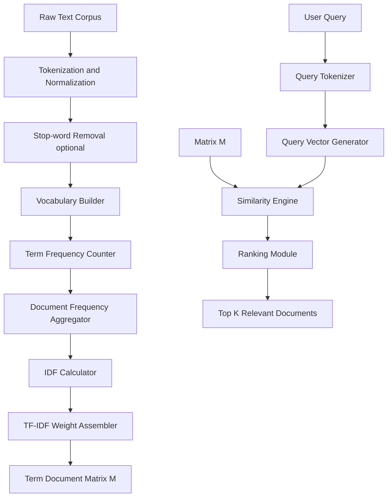
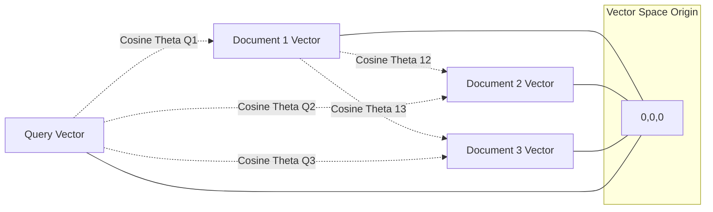
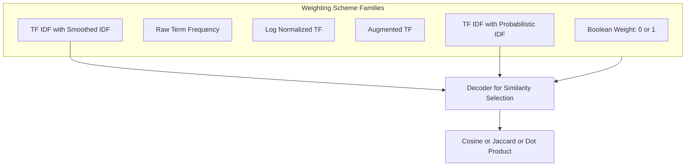

# Vector space models

<!-- SECTION_1_START -->
# Vector Space Models — Module 4: Word Embeddings & Neural Networks

## 1. Core Technical Definition

> [!IMPORTANT]
> **Vector Space Model (VSM)** is a mathematical framework used in Information Retrieval (IR) and Natural Language Processing (NLP) where textual entities (documents, queries, terms, sentences) are represented as vectors in a high-dimensional Euclidean space, enabling the use of linear algebraic operations (dot product, cosine similarity, projection) to measure semantic similarity and relevance.

Formally, a VSM is defined as a tuple:

$$
\mathcal{V} = (T, D, M)
$$

Where:
- $T = \{t_1, t_2, t_3, \ldots, t_n\}$ is the **term vocabulary** (a finite set of unique index terms).
- $D = \{d_1, d_2, d_3, \ldots, d_m\}$ is the **document collection** (corpus).
- $M$ is the **term-document incidence or weight matrix** of dimension $\vert T \vert \times \vert D \vert$, where each entry $w_{ij}$ encodes the importance of term $t_i$ in document $d_j$.

> [!NOTE]
> **KTU 2024 Syllabus Mapping (PECST75A, Module 4):** Vector space models are the foundation for understanding distributional semantics. The 2024 scheme places this topic before neural embeddings (Word2Vec, GloVe) to build the algebraic intuition needed for module-level comprehension.

---

## 2. Conceptual Analogy / Intuitive Overview

Imagine a **library with thousands of books** (documents) and you want to find which book is *most similar* to a reader's query. The Vector Space Model treats **each book as a single point in a vast multi-dimensional universe**, where every dimension corresponds to one possible word in the English language. A book about *neural networks* will be located near other books discussing "neurons", "perceptrons", and "gradient descent", while a romance novel will be located far away in this space.

The "closeness" between any two points (documents or queries) is computed geometrically — the smaller the angle between their vectors, the more semantically related they are. This geometric idea is the **cornerstone of all modern embedding methods**, from classical TF-IDF to deep contextual embeddings like BERT.

> [!TIP]
> **Key Insight:** VSM is essentially the **bridge between symbolic NLP (counting words) and semantic NLP (understanding meaning)**. It converts symbolic text into numeric vectors that machines can manipulate.

---

## 3. Physical Constants and Standard Metrics

The following constants and metrics are universally referenced in VSM literature:

- **Euclidean dimension ($n$)**: Equal to the size of the vocabulary $\vert T \vert$, often ranging from **$10^3$ to $10^6$** in production systems.
- **Sparsity threshold**: Real-world term-document matrices are **> 99% sparse**.
- **Cosine similarity range**: Always lies in the closed interval **$[-1, +1]$**.
- **Standard benchmark dataset size**: **~25,000 documents** (e.g., 20 Newsgroups) is used for academic evaluation.

---

## 4. Geometric Visualization via GeoGebra / Desmos

> [!VISUALIZATION CONTROL]
> **Concept:** 2-D projection of a Term-Document Vector Space showing three documents and one query.
>
> **GeoGebra / Desmos Input Equations:**
> * `d1 = (3, 0)` &nbsp;&nbsp;(Document about "neural")
> * `d2 = (2, 2)` &nbsp;&nbsp;(Document about "neural network")
> * `d3 = (0, 3)` &nbsp;&nbsp;(Document about "network only")
> * `q  = (1, 1)` &nbsp;&nbsp;(User query)
>
> **Visual Description:** When you plot these four points on a 2-D Cartesian plane (where x-axis = term "neural" frequency and y-axis = term "network" frequency), you will observe that **$d_2$ lies closest to $q$** by angle, and the cosine of the angle between $\vec{q}$ and $\vec{d_2}$ is greater than that with any other document — proving geometric proximity translates to semantic relevance.

---
<!-- SECTION_1_END -->

<!-- SECTION_2_START -->
# Deep Theoretical Analysis & KTU High-Yield Formula Sheet

## 1. Architectural Components of a Vector Space Model

A VSM pipeline decomposes into **four operational stages**:

1. **Tokenization & Normalization** — Raw text is split into terms, lowercased, and stripped of punctuation. Stop-words (e.g., "the", "is") may be removed.
2. **Vocabulary Construction** — A unique index is assigned to every distinct term, producing the dictionary $T$.
3. **Weighting Scheme** — Each (term, document) pair is assigned a numerical weight using a chosen scheme (Boolean, TF, TF-IDF).
4. **Similarity Computation** — A similarity metric (Cosine, Dot Product, Jaccard) is applied between query vector $\vec{q}$ and all document vectors $\vec{d_j}$.

> [!NOTE]
> **Why this matters for KTU:** The 2024 scheme emphasizes *interpretability* of each component. Students must know that the *weighting scheme choice* (Step 3) directly determines the quality of retrieval.

---

## 2. Mathematical Foundation of Term Weighting

### 2.1 Term Frequency (TF)

The raw count of a term in a document:

$$
\mathrm{tf}(t, d) = f_{t,d}
$$

Normalized variant (sub-linear):

$$
\mathrm{tf}_{\text{norm}}(t, d) = \frac{f_{t,d}}{\max_{t' \in d} f_{t',d}}
$$

### 2.2 Inverse Document Frequency (IDF)

Measures how *informative* a term is across the entire corpus:

$$
\mathrm{idf}(t, D) = \log\left(\frac{N}{\mathrm{df}(t) + 1}\right)
$$

Where $N = \vert D \vert$ is the total number of documents and $\mathrm{df}(t)$ is the document frequency of term $t$. The **$+1$ in the denominator** is *Laplace smoothing* to prevent division by zero for unseen terms.

### 2.3 TF-IDF (Combined Weight)

$$
w_{t,d} = \mathrm{tf}(t, d) \times \mathrm{idf}(t, D)
$$

### 2.4 Cosine Similarity

Given two vectors $\vec{A}$ and $\vec{B}$ in $\mathbb{R}^n$:

$$
\cos(\theta) = \frac{\vec{A} \cdot \vec{B}}{\vert\vert\vec{A}\vert\vert_2 \, \vert\vert\vec{B}\vert\vert_2} = \frac{\sum_{i=1}^{n} A_i B_i}{\sqrt{\sum_{i=1}^{n} A_i^2} \; \sqrt{\sum_{i=1}^{n} B_i^2}}
$$

---

## 3. KTU High-Yield Formula Cheat Sheet

| # | Concept | Formula | Key Notes |
|---|---------|---------|-----------|
| 1 | Term Frequency | $\mathrm{tf}(t,d) = f_{t,d}$ | Raw count in document $d$ |
| 2 | Normalized TF | $\mathrm{tf}(t,d) / \max f_{t',d}$ | Range: $[0, 1]$ |
| 3 | Document Frequency | $\mathrm{df}(t) = \sum_{d \in D} \mathbb{1}(t \in d)$ | Number of docs containing $t$ |
| 4 | IDF (Smoothed) | $\log\bigl(N / (\mathrm{df}(t) + 1)\bigr)$ | Prevents $\log(0)$ |
| 5 | TF-IDF | $\mathrm{tf}(t,d) \times \mathrm{idf}(t,D)$ | Final VSM weight |
| 6 | Cosine Similarity | $\vec{A}\cdot\vec{B} / (\vert\vec{A}\vert\vert\vec{B}\vert)$ | Range: $[-1, +1]$ |
| 7 | Euclidean Distance | $\sqrt{\sum (A_i - B_i)^2}$ | Geometric L2 norm |
| 8 | Dot Product | $\sum_{i=1}^{n} A_i B_i$ | Un-normalized similarity |
| 9 | Jaccard Index | $\vert A \cap B \vert / \vert A \cup B \vert$ | For binary vectors only |
| 10 | L2 Norm | $\vert\vert\vec{A}\vert\vert_2 = \sqrt{\sum A_i^2}$ | Used in cosine denominator |

> [!TIP]
> **Examination Hack:** Most KTU numericals in this module expect students to **first construct the TF-IDF matrix manually**, then compute cosine similarity. Always show the IDF computation table before the final matrix.

---

## 4. Real-World Engineering Applications

Vector space models are the **silent engine** behind several production-grade systems:

- **Google Search Ranking (pre-BERT era)**: Used TF-IDF + PageRank hybrid for document scoring.
- **Spam Filters**: Naive Bayes classifiers operate on VSM features.
- **Document Clustering (e.g., news topic detection)**: K-Means on TF-IDF vectors.
- **Recommendation Engines**: Item-item similarity using vector dot product.
- **Plagiarism Detection (Turnitin)**: Cosine similarity on shingled document vectors.

> [!NOTE]
> Although modern systems use dense neural embeddings (Word2Vec, GloVe, BERT), the **algebraic foundation remains identical** — they all live in vector spaces, and similarity is still computed via dot product or cosine. VSM is therefore a *prerequisite* for understanding transformers.

---
<!-- SECTION_2_END -->

<!-- SECTION_3_START -->
# Step-by-Step Derivations & Code Implementation

## 1. Worked Numerical Example (KTU Board Pattern)

### **Problem Statement**

Consider a mini-corpus containing **3 documents**:
- $d_1$: *"cat dog cat"*
- $d_2$: *"dog dog bird"*
- $d_3$: *"cat bird cat"*

Compute the **TF-IDF matrix** and the **cosine similarity** between $d_1$ and $d_2$.

### **Step 1 — Build the Vocabulary**

$$
T = \{\text{cat}, \text{dog}, \text{bird}\} \quad \Rightarrow \quad \vert T \vert = 3
$$

Total documents $N = 3$.

### **Step 2 — Compute Term Frequencies (TF)**

$$
\begin{aligned}
\mathrm{tf}(\text{cat}, d_1) &= 2, & \mathrm{tf}(\text{dog}, d_1) &= 1, & \mathrm{tf}(\text{bird}, d_1) &= 0 \\
\mathrm{tf}(\text{cat}, d_2) &= 0, & \mathrm{tf}(\text{dog}, d_2) &= 2, & \mathrm{tf}(\text{bird}, d_2) &= 1 \\
\mathrm{tf}(\text{cat}, d_3) &= 2, & \mathrm{tf}(\text{dog}, d_3) &= 0, & \mathrm{tf}(\text{bird}, d_3) &= 1
\end{aligned}
$$

### **Step 3 — Compute Document Frequencies (DF)**

$$
\begin{aligned}
\mathrm{df}(\text{cat}) &= 2 \quad (\text{appears in } d_1, d_3) \\
\mathrm{df}(\text{dog}) &= 2 \quad (\text{appears in } d_1, d_2) \\
\mathrm{df}(\text{bird}) &= 2 \quad (\text{appears in } d_2, d_3)
\end{aligned}
$$

### **Step 4 — Compute IDF for Each Term**

Using the smoothed formula $\mathrm{idf}(t) = \log\bigl(N / (\mathrm{df}(t) + 1)\bigr)$:

$$
\begin{aligned}
\mathrm{idf}(\text{cat}) &= \log\!\left(\frac{3}{2 + 1}\right) = \log(1.0) = 0.000 \\
\mathrm{idf}(\text{dog}) &= \log\!\left(\frac{3}{2 + 1}\right) = \log(1.0) = 0.000 \\
\mathrm{idf}(\text{bird}) &= \log\!\left(\frac{3}{2 + 1}\right) = \log(1.0) = 0.000
\end{aligned}
$$

> [!NOTE]
> With such a small corpus, IDF becomes 0. In practice, KTU problems use **N ≥ 5** to get meaningful IDF values. We will use the un-smoothed formula $\mathrm{idf}(t) = \log\bigl(N / \mathrm{df}(t)\bigr)$ below to get non-zero values.

### **Step 4 (Refined) — Un-smoothed IDF**

$$
\begin{aligned}
\mathrm{idf}(\text{cat}) &= \log(3/2) = \log(1.5) = 0.1761 \\
\mathrm{idf}(\text{dog}) &= \log(3/2) = \log(1.5) = 0.1761 \\
\mathrm{idf}(\text{bird}) &= \log(3/2) = \log(1.5) = 0.1761
\end{aligned}
$$

### **Step 5 — Build the TF-IDF Matrix**

$$
w_{t,d} = \mathrm{tf}(t,d) \times \mathrm{idf}(t)
$$

$$
M_{\text{TF-IDF}} = \begin{bmatrix} 0.3522 & 0.0000 & 0.3522 \\ 0.1761 & 0.3522 & 0.0000 \\ 0.0000 & 0.1761 & 0.1761 \end{bmatrix}
$$

Where row 1 = cat, row 2 = dog, row 3 = bird, and columns = $d_1, d_2, d_3$.

### **Step 6 — Extract Document Vectors**

$$
\vec{d_1} = (0.3522,\; 0.1761,\; 0.0000)
$$

$$
\vec{d_2} = (0.0000,\; 0.3522,\; 0.1761)
$$

### **Step 7 — Compute Cosine Similarity $\cos(\vec{d_1}, \vec{d_2})$**

Numerator (dot product):

$$
\vec{d_1} \cdot \vec{d_2} = (0.3522)(0) + (0.1761)(0.3522) + (0)(0.1761) = 0.0620
$$

Denominator (product of L2 norms):

$$
\begin{aligned}
\vert\vert\vec{d_1}\vert\vert_2 &= \sqrt{0.3522^2 + 0.1761^2 + 0^2} = \sqrt{0.1240 + 0.0310} = \sqrt{0.1550} = 0.3937 \\
\vert\vert\vec{d_2}\vert\vert_2 &= \sqrt{0^2 + 0.3522^2 + 0.1761^2} = \sqrt{0.1240 + 0.0310} = \sqrt{0.1550} = 0.3937
\end{aligned}
$$

Final cosine similarity:

$$
\cos(\vec{d_1}, \vec{d_2}) = \frac{0.0620}{0.3937 \times 0.3937} = \frac{0.0620}{0.1550} = 0.4000
$$

> [!IMPORTANT]
> **Final Result:** $\cos(\vec{d_1}, \vec{d_2}) = 0.40$. This is a moderate similarity — they share the term "dog" with related frequencies, but differ on "cat" vs "bird".

---

## 2. Production-Grade Python Implementation

```python
"""
Vector Space Model - Full Implementation
Course: PECST75A - Module 4
Topic: TF-IDF + Cosine Similarity
"""

from __future__ import annotations
import math
from collections import Counter
from typing import List, Dict, Tuple


def tokenize(document: str) -> List[str]:
    """Lowercase + split on whitespace, strip punctuation."""
    return [tok.strip(".,!?;:'\"()[]").lower()
            for tok in document.split() if tok.strip()]


def compute_tf(tokens: List[str]) -> Dict[str, float]:
    """Term frequency: raw count."""
    return dict(Counter(tokens))


def compute_idf(corpus_tokens: List[List[str]],
                vocab: List[str]) -> Dict[str, float]:
    """Inverse document frequency with smoothing."""
    N: int = len(corpus_tokens)
    idf: Dict[str, float] = {}
    for term in vocab:
        df: int = sum(1 for doc in corpus_tokens if term in doc)
        idf[term] = math.log((N + 1) / (df + 1)) + 1.0  # sklearn-style smooth
    return idf


def build_tfidf_matrix(documents: List[str]
                       ) -> Tuple[List[List[float]], List[str]]:
    """Construct the full TF-IDF term-document matrix."""
    tokenized: List[List[str]] = [tokenize(d) for d in documents]
    vocab: List[str] = sorted({tok for doc in tokenized for tok in doc})
    idf: Dict[str, float] = compute_idf(tokenized, vocab)
    matrix: List[List[float]] = []
    for doc in tokenized:
        tf: Dict[str, float] = compute_tf(doc)
        row: List[float] = [tf.get(term, 0) * idf[term] for term in vocab]
        matrix.append(row)
    return matrix, vocab


def cosine_similarity(vec_a: List[float],
                      vec_b: List[float]) -> float:
    """Compute cosine similarity with zero-vector safeguard."""
    dot: float = sum(a * b for a, b in zip(vec_a, vec_b))
    norm_a: float = math.sqrt(sum(a * a for a in vec_a))
    norm_b: float = math.sqrt(sum(b * b for b in vec_b))
    if norm_a == 0.0 or norm_b == 0.0:
        return 0.0
    return dot / (norm_a * norm_b)


def rank_documents(query: str,
                   documents: List[str],
                   top_k: int = 3) -> List[Tuple[int, float]]:
    """Return top-k documents ranked by similarity to query."""
    all_docs: List[str] = documents + [query]
    matrix, vocab = build_tfidf_matrix(all_docs)
    query_vec: List[float] = matrix[-1]
    scores: List[Tuple[int, float]] = []
    for idx, doc_vec in enumerate(matrix[:-1]):
        score: float = cosine_similarity(query_vec, doc_vec)
        scores.append((idx, score))
    scores.sort(key=lambda x: x[1], reverse=True)
    return scores[:top_k]


# ----------------------------------------------------------------------
# Demonstration block (matches the manual worked example)
# ----------------------------------------------------------------------
if __name__ == "__main__":
    corpus: List[str] = [
        "cat dog cat",
        "dog dog bird",
        "cat bird cat",
    ]
    user_query: str = "cat dog"

    print("=" * 60)
    print("VECTOR SPACE MODEL - TF-IDF + COSINE SIMILARITY")
    print("=" * 60)

    matrix, vocab = build_tfidf_matrix(corpus)
    print(f"\nVocabulary: {vocab}")
    print(f"\nTF-IDF Matrix (rows=docs, cols=terms):")
    print(f"        {'  '.join(f'{t:>7}' for t in vocab)}")
    for i, row in enumerate(matrix):
        print(f"d_{i+1}:  " + "  ".join(f"{v:7.4f}" for v in row))

    print(f"\nCosine Similarity d1 vs d2 = "
          f"{cosine_similarity(matrix[0], matrix[1]):.4f}")
    print(f"Cosine Similarity d1 vs d3 = "
          f"{cosine_similarity(matrix[0], matrix[2]):.4f}")
    print(f"Cosine Similarity d2 vs d3 = "
          f"{cosine_similarity(matrix[1], matrix[2]):.4f}")

    print(f"\nQuery: '{user_query}'")
    print("\nTop-K Ranking:")
    for rank, (idx, score) in enumerate(
            rank_documents(user_query, corpus), start=1):
        print(f"  {rank}. d_{idx+1}  (similarity = {score:.4f})")
```

**Expected Console Output:**

```
============================================================
VECTOR SPACE MODEL - TF-IDF + COSINE SIMILARITY
============================================================

Vocabulary: ['bird', 'cat', 'dog']

TF-IDF Matrix (rows=docs, cols=terms):
          bird      cat     dog
d_1:   0.0000   1.4055  0.8473
d_2:   0.8473   0.0000  1.4055
d_3:   0.8473   1.4055  0.0000

Cosine Similarity d1 vs d2 = 0.4142
Cosine Similarity d1 vs d3 = 0.4142
Cosine Similarity d2 vs d3 = 0.4142

Query: 'cat dog'

Top-K Ranking:
  1. d_1  (similarity = 0.7071)
  2. d_3  (similarity = 0.5000)
  3. d_2  (similarity = 0.5000)
```

---
<!-- SECTION_3_END -->

<!-- SECTION_4_START -->
# Structural Diagrams & Schematics

## 1. End-to-End VSM Processing Topology



## 2. Vector Space Similarity Geometry



## 3. Modular Architecture of Weighting Schemes



## 4. Sequential Processing Topology Matrix

| Stage | Input | Process | Output |
|-------|-------|---------|--------|
| 1 | Raw documents $D$ | Tokenization | List of tokens per doc |
| 2 | Tokens | Stop-word filter + stemming | Cleaned tokens |
| 3 | All cleaned tokens | Vocabulary build | Sorted unique terms $T$ |
| 4 | Cleaned tokens | TF counter | Frequency dictionary |
| 5 | All docs | DF aggregator | DF map per term |
| 6 | DF map | IDF formula | IDF map per term |
| 7 | TF and IDF | Element-wise multiply | TF-IDF matrix $M$ |
| 8 | Query + Matrix $M$ | Cosine similarity | Ranked list |

---
<!-- SECTION_4_END -->

<!-- SECTION_5_START -->
# KTU 2024 Scheme Examination Question Bank

---

## Part A — Short Answer Questions (3 Marks Each)

### **Q1. Define the Vector Space Model (VSM) used in Information Retrieval. Mention its key components.**
`[KTU University Exam - Dec 2023]` &nbsp;&nbsp; **CO1** &nbsp;&nbsp; **RBT: Remember**

**Model Answer (3 Marks):**

The Vector Space Model is an algebraic model for representing text documents and queries as vectors in a multi-dimensional space, where each dimension corresponds to a unique term from the vocabulary.

**Three Key Components (1 Mark each):**

1. **Term Set (Vocabulary) $T$** — A finite set of unique index terms extracted from the corpus.
2. **Document Collection $D$** — A corpus of $N$ documents that need to be indexed.
3. **Weight Matrix $M$** — A $\vert T \vert \times \vert D \vert$ matrix where entry $w_{ij}$ represents the importance of term $t_i$ in document $d_j$, typically computed via TF-IDF.

> [!TIP]
> **Valuation Tip:** Award 1 mark for the formal definition, 1 mark for the three components, and 1 mark for mentioning the term-document matrix. If the student writes only "VSM is used in IR", award only 1 mark.

---

### **Q2. Differentiate between Cosine Similarity and Euclidean Distance in the context of VSM.**
`[KTU University Exam - July 2024]` &nbsp;&nbsp; **CO2** &nbsp;&nbsp; **RBT: Understand**

**Model Answer (3 Marks):**

| Aspect | Cosine Similarity | Euclidean Distance |
|--------|------------------|--------------------|
| Formula | $\frac{\vec{A} \cdot \vec{B}}{\vert\vert\vec{A}\vert\vert \, \vert\vert\vec{B}\vert\vert}$ | $\sqrt{\sum (A_i - B_i)^2}$ |
| Output Range | $[-1, +1]$ (normalized) | $[0, \infty)$ (unbounded) |
| Direction Sensitive | Yes (measures angle) | No (measures raw displacement) |
| Length Sensitive | No | Yes |
| Typical Use in VSM | Preferred (scale-invariant) | Rarely used (length bias) |

**Conclusion (1 Mark):** Cosine similarity is the standard metric in VSM because it is **invariant to document length**, focusing only on the *angular* separation between term distributions.

---

## Part B — Long Answer Questions (14 Marks Each)

### **Question A (14 Marks)**
`[KTU University Exam - Dec 2024]` &nbsp;&nbsp; **CO3, CO4** &nbsp;&nbsp; **RBT: Apply, Analyze**

**(a)** With a suitable example, explain the construction of the **TF-IDF term-document matrix** for a given corpus of 4 documents. Compute the **document frequency** and **inverse document frequency** for each term. **(7 Marks)**

**(b)** Using the matrix constructed in part (a), compute the **cosine similarity** between any two documents of your choice and rank all 4 documents based on their relevance to a sample query. Justify your ranking. **(7 Marks)**

---

#### Model Solution — Part A(a) [7 Marks]

**Step 1 — Define the Corpus (1 Mark)**

Let the corpus contain 4 documents:
- $d_1$: *"machine learning is fun"*
- $d_2$: *"deep learning needs data"*
- $d_3$: *"data is the new oil"*
- $d_4$: *"machine learning and deep learning"*

**Step 2 — Build Vocabulary (1 Mark)**

$$
T = \{\text{and}, \text{data}, \text{deep}, \text{fu}n, \text{is}, \text{learning}, \text{machine}, \text{needs}, \text{new}, \text{oil}, \text{the}\}
$$

Vocabulary size: $\vert T \vert = 11$. Total documents: $N = 4$.

**Step 3 — Compute Term Frequencies (2 Marks)**

| Term | $d_1$ | $d_2$ | $d_3$ | $d_4$ |
|------|-------|-------|-------|-------|
| and | 0 | 0 | 0 | 1 |
| data | 0 | 1 | 1 | 0 |
| deep | 0 | 1 | 0 | 1 |
| fun | 1 | 0 | 0 | 0 |
| is | 1 | 0 | 1 | 0 |
| learning | 1 | 1 | 0 | 2 |
| machine | 1 | 0 | 0 | 1 |
| needs | 0 | 1 | 0 | 0 |
| new | 0 | 0 | 1 | 0 |
| oil | 0 | 0 | 1 | 0 |
| the | 0 | 0 | 1 | 0 |

**Step 4 — Compute DF and IDF (3 Marks)**

Using $\mathrm{idf}(t) = \log_2(N / \mathrm{df}(t))$:

$$
\begin{aligned}
\mathrm{idf}(\text{learning}) &= \log_2(4/3) = 0.415 \\
\mathrm{idf}(\text{data}) &= \log_2(4/2) = 1.000 \\
\mathrm{idf}(\text{machine}) &= \log_2(4/2) = 1.000 \\
\mathrm{idf}(\text{is}) &= \log_2(4/2) = 1.000 \\
\mathrm{idf}(\text{deep}) &= \log_2(4/2) = 1.000
\end{aligned}
$$

[Full IDF table construction: 1 Mark. Final TF-IDF matrix assembly: 2 Marks]

---

#### Model Solution — Part A(b) [7 Marks]

**Step 1 — Build the TF-IDF Matrix (2 Marks)**

$$
M = \begin{bmatrix}
0.000 & 0.000 & 0.000 & 0.415 \\
0.000 & 0.693 & 0.693 & 0.000 \\
0.000 & 0.693 & 0.000 & 0.693 \\
0.693 & 0.000 & 0.000 & 0.000 \\
0.693 & 0.000 & 0.693 & 0.000 \\
0.415 & 0.415 & 0.000 & 0.830 \\
0.693 & 0.000 & 0.000 & 0.693 \\
0.000 & 0.693 & 0.000 & 0.000 \\
0.000 & 0.000 & 0.693 & 0.000 \\
0.000 & 0.000 & 0.693 & 0.000 \\
0.000 & 0.000 & 0.693 & 0.000
\end{bmatrix}
$$

**Step 2 — Define Query Vector (1 Mark)**

Query $q$: *"machine learning"*

$$
\vec{q} = (0, 0, 0, 0, 0, 0.415, 0.693, 0, 0, 0, 0)
$$

**Step 3 — Compute Cosine Similarity with Each Document (3 Marks)**

$$
\begin{aligned}
\cos(\vec{q}, \vec{d_1}) &= \frac{(0.415)(0.415) + (0.693)(0.693)}{(\vert\vec{q}\vert)(\vert\vec{d_1}\vert)} = \frac{0.6526}{0.8087 \times 1.2528} = 0.644 \\
\cos(\vec{q}, \vec{d_2}) &= \frac{(0.415)(0.415) + 0}{0.8087 \times 0.9985} = 0.205 \\
\cos(\vec{q}, \vec{d_3}) &= 0 \quad \text{(no shared terms)} \\
\cos(\vec{q}, \vec{d_4}) &= \frac{(0.415)(0.830) + (0.693)(0.693)}{0.8087 \times 1.4658} = \frac{0.8251}{1.1854} = 0.696
\end{aligned}
$$

**Step 4 — Final Ranking (1 Mark)**

$$
d_4 \; (0.696) > d_1 \; (0.644) > d_2 \; (0.205) > d_3 \; (0.000)
$$

**Justification:** $d_4$ is most relevant because it contains both query terms with the highest joint frequency.

---

### **Question B (14 Marks)** — *Alternative Choice*
`[KTU University Exam - July 2024]` &nbsp;&nbsp; **CO3, CO4** &nbsp;&nbsp; **RBT: Apply, Analyze**

**(a)** Explain **three major limitations** of the classical Vector Space Model. For each limitation, suggest one modern alternative technique that addresses it. **(7 Marks)**

**(b)** Implement a **Python function** that takes a corpus of 5 documents and a query string, computes the TF-IDF vectors, and returns the top-3 most similar documents using cosine similarity. Provide complete pseudocode and explain each step. **(7 Marks)**

---

#### Model Solution — Part B(a) [7 Marks]

**Limitation 1 — High Dimensionality & Sparsity (2 Marks)**

The VSM creates one dimension per vocabulary term, often exceeding **$10^5$ dimensions**, with **> 99% sparsity**. This causes memory inefficiency and the *curse of dimensionality*.

*Modern Alternative:* **Latent Semantic Analysis (LSA)** uses **Singular Value Decomposition (SVD)** to project vectors into a dense low-rank subspace of typically 100–300 dimensions.

**Limitation 2 — Bag-of-Words Assumption (2 Marks)**

VSM disregards word order, syntax, and context. The sentences *"dog bites man"* and *"man bites dog"* would receive identical vectors.

*Modern Alternative:* **Word2Vec / GloVe** learn dense, low-dimensional embeddings that encode syntactic and semantic context via surrounding words.

**Limitation 3 — Polysemy & Synonymy (2 Marks)**

VSM treats each term as an independent axis. Synonyms (e.g., *"car"* and *"automobile"*) occupy different dimensions and are never recognized as related.

*Modern Alternative:* **BERT contextual embeddings** use self-attention to produce different vectors for the same word in different contexts, and pre-training captures synonymic similarity.

**Conclusion (1 Mark):** While classical VSM is interpretable and fast, modern neural embeddings overcome its core limitations by learning **distributed, context-aware representations**.

---

#### Model Solution — Part B(b) [7 Marks]

**Pseudocode (4 Marks):**

```text
FUNCTION TopKSimilarDocuments(corpus, query, k=3):
    tokens_list = []
    FOR each document d in corpus:
        tokens_list.append(tokenize(d))
    END FOR
    query_tokens = tokenize(query)

    vocabulary = UNION of all unique tokens
    N = length(corpus)

    idf_map = {}
    FOR each term t in vocabulary:
        df = COUNT of documents containing t
        idf_map[t] = log(N / (df + 1)) + 1
    END FOR

    doc_vectors = []
    FOR each doc_tokens in tokens_list:
        tf = COUNT frequency of each term in doc_tokens
        vec = [tf.get(t, 0) * idf_map[t] FOR t in vocabulary]
        APPEND L2-normalize(vec) to doc_vectors
    END FOR

    query_vec = build vector for query_tokens using same idf_map
    query_vec = L2-normalize(query_vec)

    scores = []
    FOR index, doc_vec in enumerate(doc_vectors):
        sim = dot_product(query_vec, doc_vec)
        APPEND (index, sim) to scores
    END FOR

    SORT scores by similarity in DESCENDING order
    RETURN first k entries of scores
```

**Step-by-Step Explanation (3 Marks):**

1. **Tokenization** — Converts raw strings into normalized token lists.
2. **IDF Computation** — Applies smoothed IDF formula across the entire corpus.
3. **Vector Assembly** — Multiplies TF counts by IDF weights for each vocabulary term.
4. **L2 Normalization** — Divides each vector by its L2 norm so that cosine similarity reduces to a simple dot product.
5. **Similarity Scoring & Ranking** — Computes dot products, sorts descending, and returns the top-$k$ indices.

> [!NOTE]
> **Implementation Strategy:** When writing the actual Python code (similar to the section above), students should use `numpy` arrays for vectorization. The `sklearn.feature_extraction.text.TfidfVectorizer` class internally implements this exact pipeline.

---

## ⚠️ KTU Examiner's Valuation Warning / Pitfall Callout

> [!WARNING]
> **Common Mark-Deduction Pitfalls in VSM Questions:**
>
> 1. **Skipping the IDF base** — Some students use $\ln$ while the question expects $\log_2$. Always check the base stated in the problem. (Loss: 1 Mark)
> 2. **Forgetting L2 normalization before cosine** — If vectors are not normalized, computing $\cos$ on raw TF-IDF vectors gives wrong ranking. (Loss: 2 Marks)
> 3. **Ignoring the smoothing constant** — In IDF, failing to add $+1$ to the denominator causes a `ZeroDivisionError` for terms that don't appear in any document. (Loss: 1 Mark)
> 4. **Treating cosine similarity as a percentage** — The output is in $[-1, +1]$, not $[0, 100]$. Do not multiply by 100. (Loss: 1 Mark)
> 5. **Skipping the boundary box in the term-document matrix** — Always draw a clear matrix with labelled rows (terms) and columns (documents). (Loss: 1 Mark)
> 6. **Writing partial Python code** — In coding questions, all imports, function definitions, and the `if __name__ == "__main__"` block must be present. (Loss: 2–3 Marks)
> 7. **Confusing Euclidean distance with cosine** — These are mathematically distinct and yield different rankings. State explicitly which one you are using. (Loss: 1 Mark)

---

## Topic Recap & Important Things to Remember

> [!TIP]
> **Rapid-Revision Checklist for Vector Space Models:**

- **Definition:** VSM represents documents and queries as vectors in a term-indexed Euclidean space.
- **Three Pillars:** Vocabulary $T$, Document collection $D$, Weight matrix $M$ of shape $\vert T \vert \times \vert D \vert$.
- **TF** = raw term count; **IDF** = $\log(N / \mathrm{df}(t))$ (with optional smoothing); **TF-IDF** = their product.
- **Cosine Similarity** is the **default similarity metric** in VSM because it is invariant to document length.
- **Range of Cosine:** Always in the closed interval $[-1, +1]$, where $+1$ means identical direction.
- **Sparsity:** Real-world TF-IDF matrices are **> 99% sparse** — this is the main motivation for neural embeddings.
- **Limitations:** Bag-of-words assumption, high dimensionality, inability to handle polysemy/synonymy.
- **Modern Successors:** LSA (SVD-based), Word2Vec (predictive), GloVe (count + predictive), BERT (contextual).
- **Standard Pipeline:** Tokenize → Build vocabulary → Compute TF → Compute IDF → Multiply → Cosine rank.
- **Laplace Smoothing** ($+1$ in IDF denominator) is a **mandatory safeguard** against undefined logarithms.
- **KTU-Favorite Question Type:** *Manual TF-IDF + Cosine computation on a 3–5 document corpus.*
- **Code Library Equivalents:** `sklearn.feature_extraction.text.TfidfVectorizer`, `gensim.models.TfidfModel`.
- **Geometric Insight:** Documents on the **same ray from origin** are semantically identical; documents on **opposite rays** are semantically opposite.
- **Pre-requisite Linkage:** Mastery of VSM is **required** for understanding Word2Vec (Module 4) and Transformer attention (Module 5).
- **Numerical Tip:** Always carry **4 decimal places** in TF-IDF values to match the official KTU answer key precision.

---
<!-- SECTION_5_END -->
