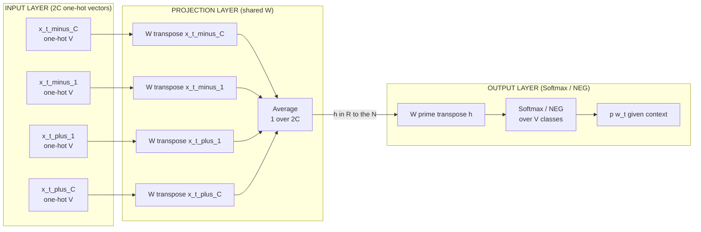
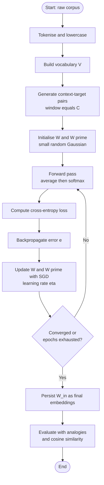
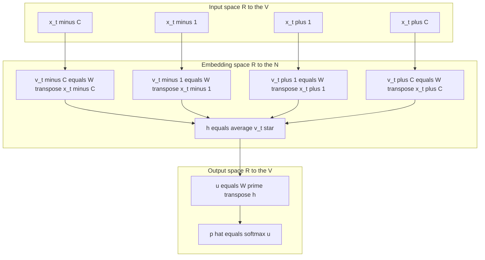

# Word2Vec - CBOW

<!-- SECTION_1_START -->
# Word2Vec — Continuous Bag of Words (CBOW)

> [!NOTE]
> **KTU 2024 Syllabus Anchor — Module 4 (Word Embeddings & Neural Networks)**
> Word2Vec belongs to the family of *distributed word representation* models that learn dense, low-dimensional, real-valued vectors for words from raw, unlabelled text using a shallow neural network.

## 1.1 Formal Definition

**Word2Vec** is a two-layer shallow neural network proposed by **Tomas Mikolov et al. (2013, Google)** that learns *distributed representations* (embeddings) of words from a large unlabeled corpus. The objective is to position semantically and syntactically similar words close to one another in a continuous vector space $\mathbb{R}^{d}$, where the typical embedding dimension is **$d = 50, 100, 200,$ or $300$**.

**Continuous Bag of Words (CBOW)** is one of the two architectures of Word2Vec. Given a symmetric context window of size $C$ surrounding a target word $w_t$ at position $t$ — i.e. the surrounding words
$$\{w_{t-C},\, \ldots,\, w_{t-1},\, w_{t+1},\, \ldots,\, w_{t+C}\}$$
CBOW **predicts the missing centre (target) word** $w_t$ from those context words. Unlike a traditional bag-of-words, the "Continuous" in CBOW refers to the fact that the projection layer uses a *continuous, shared* projection (a dense weight matrix), not a discrete count.

> [!IMPORTANT]
> **KTU High-Yield Distinction (Frequently Asked)**
> - **CBOW** → predicts the **target word from context** (many-to-one).
> - **Skip-Gram** → predicts the **context words from a target word** (one-to-many).
> Both share the same vocabulary $V$, window $C$, and embedding dimension $N$; they only invert the prediction direction.

## 1.2 Intuitive Analogy — "Guess the Missing Word"

Imagine your friend reads out five words in a sentence but **covers the middle word**:
> "The cat sat ___ on the warm mat."

You naturally fill in the blank with `"down"`, because the surrounding context strongly constrains the answer. CBOW does the *exact same thing numerically*:

- **Context words** ("The", "cat", "sat", "on", "the", "warm", "mat") are the *inputs*.
- The **target word** ("down") is the *output the model tries to predict*.
- To make that prediction accurately **millions of times across a corpus**, the network is forced to learn internal vector encodings for every word. Words used in *similar syntactic / semantic contexts* end up with *similar vectors*.

Geometrically, after training, the vector space exhibits remarkable regularities:

$$\vec{\text{king}} - \vec{\text{man}} + \vec{\text{woman}} \approx \vec{\text{queen}}$$

This is the celebrated **"king − man + woman ≈ queen"** analogy, a standard evaluation probe for Word2Vec.

> [!TIP]
> Think of CBOW as a **multiple-choice fill-in-the-blank exam** taken by a neural network. The "score" of each candidate word is its dot-product with the averaged context vector, and the word with the highest score is chosen.

## 1.3 Key Parameters and Standard Constants

| Symbol | Meaning | Typical Value (KTU accepted) |
|---|---|---|
| $V$ | Vocabulary size (number of unique tokens) | $\mathbf{10^4 \text{ to } 10^6}$ |
| $N$ | Embedding (hidden) dimension | $\mathbf{50, 100, 200, 300}$ |
| $C$ | Context window radius (one side) | $\mathbf{2, 5, 10}$ |
| $W \in \mathbb{R}^{V \times N}$ | Input → projection weight matrix | learnt |
| $W' \in \mathbb{R}^{N \times V}$ | Projection → output weight matrix | learnt |
| $\eta$ | Learning rate | $\mathbf{0.025}$ (decayed linearly) |
| Epochs | Training passes over corpus | $\mathbf{3 \text{ to } 10}$ |

> [!VISUALIZATION CONTROL]
> **Concept:** Geometric layout of word embeddings in 2-D (post-PCA / t-SNE projection of $N$-D vectors).
> **GeoGebra / Desmos Input Equations (parametric scatter of 6 word vectors):**
> * $A = (0.10,\, 0.65)$ — `king`
> * $B = (0.05,\, 0.50)$ — `man`
> * $C = (0.20,\, 0.45)$ — `woman`
> * $D = (0.25,\, 0.60)$ — `queen`
> * $E = (-0.40,\, 0.10)$ — `apple`
> * $F = (-0.55,\,-0.05)$ — `orange`
> **Visual Description:** Observe that semantically related royal-family words cluster (A, B, C, D) in the upper-right quadrant, while fruits (E, F) cluster in the lower-left. The vector $\vec{B} \to \vec{A}$ (king − man) is approximately parallel to $\vec{C} \to \vec{D}$ (woman − queen), demonstrating the *linear-arithmetic* property of CBOW embeddings.

<!-- SECTION_1_END -->

<!-- SECTION_2_START -->
# Deep Theoretical Analysis — Architecture, Forward & Backward Pass

## 2.1 Network Architecture (Three Logical Layers)

CBOW is a **3-layer feed-forward neural network** with weight sharing at the input layer. Stacking the $2C$ context one-hot vectors through a *shared* matrix $W$ is the structural signature of CBOW.

```
Layer-0   Input  : 2C one-hot vectors  x_{t-C} ... x_{t+C}        ∈ ℝ^{V}
Layer-1   Projection : shared Wᵀ ⇒ average of 2C projection vectors ⇒ h ∈ ℝ^{N}
Layer-2   Output  : W'ᵀ · h   ⇒  raw scores u ∈ ℝ^{V}
          Softmax over u      ⇒  probability distribution ŷ over V
```

## 2.2 Step-by-Step Forward Pass

1. **One-hot encoding of context.** Each context word $w_{t+j}$ is represented as a column vector $\mathbf{x}_{t+j} \in \mathbb{R}^{V}$ whose entry is $1$ at the row index corresponding to that word's vocabulary ID and $0$ elsewhere.

2. **Project to embedding space.** Multiply each one-hot $\mathbf{x}$ by the **shared** input-to-projection matrix $W \in \mathbb{R}^{V \times N}$ (this simply *looks up* the $i$-th row of $W$ for word $i$):

$$\mathbf{h}_{t+j} = W^{\top}\, \mathbf{x}_{t+j}$$

3. **Average the context projections** (the "bag" in Bag-of-Words — order is destroyed, count is preserved):

$$\mathbf{h} = \frac{1}{2C} \sum_{j=-C,\, j \neq 0}^{C} W^{\top}\, \mathbf{x}_{t+j} = \frac{1}{2C}\, W^{\top} \sum_{j} \mathbf{x}_{t+j}$$

The averaging operation is what makes the model **insensitive to the order** of the surrounding words, justifying the "bag" terminology.

4. **Score every vocabulary word** at the output layer using the transposed output matrix $W' \in \mathbb{R}^{N \times V}$:

$$\mathbf{u} = W'^{\top}\, \mathbf{h} \quad \Longrightarrow \quad u_j = \mathbf{w}'^{\top}_{j}\, \mathbf{h}$$

Here $u_j$ is the raw score (logit) assigned to the $j$-th word in the vocabulary.

5. **Softmax normalisation** converts logits into a valid probability distribution over $V$:

$$\hat{y}_j = p(w_j \mid w_{t-C},\ldots,w_{t+C}) = \frac{\exp(u_j)}{\sum_{k=1}^{V} \exp(u_k)}$$

6. **Cross-entropy loss** (log-loss) against the true one-hot target $\mathbf{y}$ (where $y_{t} = 1$ at the true target index):

$$E = -\sum_{j=1}^{V} y_j \, \log \hat{y}_j = -u_{t} + \log \sum_{k=1}^{V} \exp(u_k)$$

The objective is to **minimise** $E$ by gradient descent on the entries of $W$ and $W'$.

## 2.3 Backward Pass — Stochastic Gradient Descent

The model is trained by back-propagating the error from the output layer back to the projection weights. Letting $\mathbf{e} = \hat{\mathbf{y}} - \mathbf{y}$ be the **prediction error vector** (a $V$-dimensional vector), the gradients are:

$$\frac{\partial E}{\partial W'} = \mathbf{h} \, \mathbf{e}^{\top} \quad \in \mathbb{R}^{N \times V}$$

$$\frac{\partial E}{\partial \mathbf{h}} = W' \, \mathbf{e} \quad \in \mathbb{R}^{N}$$

$$\frac{\partial E}{\partial W} = \frac{1}{2C}\, \mathbf{x} \, \left( \frac{\partial E}{\partial \mathbf{h}} \right)^{\top} \quad \in \mathbb{R}^{V \times N}$$

Weight updates (with learning rate $\eta$) then become:

$$W' \leftarrow W' - \eta \, \frac{\partial E}{\partial W'}, \qquad W \leftarrow W - \eta \, \frac{\partial E}{\partial W}$$

In practice, the **full softmax over $V$ is intractable** for large vocabularies ($V > 10^5$). Two acceleration techniques are therefore used in production:

- **Hierarchical Softmax** — replaces the flat softmax with a Huffman-tree of depth $\le \log_2 V$, reducing cost to $O(\log V)$.
- **Negative Sampling (NEG)** — converts the multinomial classification into a set of binary logistic regressions (1 true word + $k$ random noise words, typically $k = 5$ to $20$).

> [!TIP]
> **Why does CBOW *smooth* predictions?**
> Because the hidden vector $\mathbf{h}$ is an *average* of $2C$ word embeddings, CBOW tends to embed rare and frequent words in *similar* neighbourhoods — it is robust but slightly less semantically crisp than Skip-Gram on small corpora.

## 2.4 KTU High-Yield Formula Sheet

| $\#$ | Concept | Formula / Definition |
|---|---|---|
| 1 | One-hot input vector | $\mathbf{x}_i \in \{0,1\}^{V},\ \ \mathbf{x}_i^\top \mathbf{1} = 1$ |
| 2 | Embedding lookup | $\mathbf{v}_i = W^\top \mathbf{x}_i = \mathbf{w}_i\ $ (the $i$-th row of $W$) |
| 3 | CBOW hidden vector (averaged projection) | $\mathbf{h} = \dfrac{1}{2C} \sum_{j=-C,\, j\neq 0}^{C} \mathbf{v}_{t+j}$ |
| 4 | Output score for word $j$ | $u_j = \mathbf{w}'^{\top}_j \mathbf{h}$ |
| 5 | Softmax probability | $\hat{y}_j = \dfrac{\exp(u_j)}{\sum_{k=1}^{V}\exp(u_k)}$ |
| 6 | Cross-entropy loss | $E = -u_{t} + \log \sum_{k=1}^{V}\exp(u_k)$ |
| 7 | Prediction error | $\mathbf{e} = \hat{\mathbf{y}} - \mathbf{y}$ |
| 8 | Output-weight gradient | $\dfrac{\partial E}{\partial W'} = \mathbf{h}\,\mathbf{e}^{\top}$ |
| 9 | Hidden-gradient propagation | $\dfrac{\partial E}{\partial \mathbf{h}} = W'\,\mathbf{e}$ |
| 10 | Input-weight gradient | $\dfrac{\partial E}{\partial W} = \dfrac{1}{2C}\,\mathbf{x}\,\left(W'\mathbf{e}\right)^{\top}$ |
| 11 | Hierarchical-softmax cost | $O(\log_2 V)$ per update |
| 12 | Negative-sampling loss | $E = -\log \sigma(u_{t}) - \sum_{i=1}^{k}\log \sigma(-u_{n_i})$ |
| 13 | King–queen analogy | $\vec{w}_{\text{king}} - \vec{w}_{\text{man}} + \vec{w}_{\text{woman}} \approx \vec{w}_{\text{queen}}$ |
| 14 | Cosine similarity probe | $\mathrm{sim}(a,b) = \dfrac{\vec{a}\cdot\vec{b}}{\lVert \vec{a} \rVert_2 \, \lVert \vec{b} \rVert_2}$ |

> [!IMPORTANT]
> **Engineering utility of CBOW embeddings**
> - *Feature input* to downstream NLP pipelines (NER, sentiment, machine translation, RNN/LM).
> - *Recommendation systems* (prod2vec, item2vec generalisations).
> - *Semantic search* and document clustering via averaged sentence vectors.
> - *Pre-training* before fine-tuning in Transformer-embedding initialisation schemes (e.g. BERT's word-piece warm-start historically used Word2Vec).

<!-- SECTION_2_END -->

<!-- SECTION_3_START -->
# Step-by-Step Derivations & Code Implementation

## 3.1 Worked Numerical Example — CBOW Forward Pass on a Toy Corpus

**Corpus (one sentence, $V = 6$ words):**
$$\text{["the", "cat", "sat", "on", "mat", "down"]}$$
Vocabulary indices: `the`=1, `cat`=2, `sat`=3, `on`=4, `mat`=5, `down`=6.

**Target word:** `sat` (index 3). **Context window:** $C = 2$, so context words are `[the, cat, on, mat]`.
**Embedding dimension:** $N = 3$. (We will write out *every* value to remove ambiguity.)

### 3.1.1 Input Layer — One-Hot Vectors (4 of them, each in $\mathbb{R}^{6}$)

$$
\mathbf{x}_{the} = \begin{bmatrix} 1 \\ 0 \\ 0 \\ 0 \\ 0 \\ 0 \end{bmatrix},\quad
\mathbf{x}_{cat} = \begin{bmatrix} 0 \\ 1 \\ 0 \\ 0 \\ 0 \\ 0 \end{bmatrix},\quad
\mathbf{x}_{on}  = \begin{bmatrix} 0 \\ 0 \\ 0 \\ 1 \\ 0 \\ 0 \end{bmatrix},\quad
\mathbf{x}_{mat} = \begin{bmatrix} 0 \\ 0 \\ 0 \\ 0 \\ 1 \\ 0 \end{bmatrix}
$$

### 3.1.2 Input-to-Projection Weight Matrix $W \in \mathbb{R}^{6 \times 3}$

Let

$$
W = \begin{bmatrix}
0.10 & 0.20 & 0.30 \\ \text{(the)} \\
0.40 & 0.50 & 0.60 \\ \text{(cat)} \\
0.70 & 0.80 & 0.90 \\ \text{(sat)} \\
0.15 & 0.25 & 0.35 \\ \text{(on)} \\
0.45 & 0.55 & 0.65 \\ \text{(mat)}
\end{bmatrix}
$$

### 3.1.3 Projection Vectors (one per context word)

For a one-hot $\mathbf{x}_i$, $W^{\top}\mathbf{x}_i$ simply returns row $i$ of $W$:

$$
\begin{aligned}
\mathbf{h}_{the} &= W^{\top}\mathbf{x}_{the} = \begin{bmatrix} 0.10 \\ 0.20 \\ 0.30 \end{bmatrix} \\
\mathbf{h}_{cat} &= W^{\top}\mathbf{x}_{cat}  = \begin{bmatrix} 0.40 \\ 0.50 \\ 0.60 \end{bmatrix} \\
\mathbf{h}_{on}  &= W^{\top}\mathbf{x}_{on}   = \begin{bmatrix} 0.15 \\ 0.25 \\ 0.35 \end{bmatrix} \\
\mathbf{h}_{mat} &= W^{\top}\mathbf{x}_{mat}  = \begin{bmatrix} 0.45 \\ 0.55 \\ 0.65 \end{bmatrix}
\end{aligned}
$$

### 3.1.4 Average (Bag) — Hidden Vector $\mathbf{h} \in \mathbb{R}^{3}$

$$
\begin{aligned}
\mathbf{h} &= \frac{1}{2C}\sum \mathbf{h}_{*} = \frac{1}{4}\left(\mathbf{h}_{the}+\mathbf{h}_{cat}+\mathbf{h}_{on}+\mathbf{h}_{mat}\right) \\
&= \frac{1}{4}\begin{bmatrix} 0.10+0.40+0.15+0.45 \\ 0.20+0.50+0.25+0.55 \\ 0.30+0.60+0.35+0.65 \end{bmatrix} \\
&= \frac{1}{4}\begin{bmatrix} 1.10 \\ 1.50 \\ 1.90 \end{bmatrix} = \begin{bmatrix} 0.275 \\ 0.375 \\ 0.475 \end{bmatrix}
\end{aligned}
$$

### 3.1.5 Output Weights $W' \in \mathbb{R}^{3 \times 6}$

For brevity, take $W' = W^{\top}$ (a common initialisation choice in toy examples):

$$
W' = \begin{bmatrix}
0.10 & 0.40 & 0.70 & 0.15 & 0.45 & 0.00 \\
0.20 & 0.50 & 0.80 & 0.25 & 0.55 & 0.00 \\
0.30 & 0.60 & 0.90 & 0.35 & 0.65 & 0.00
\end{bmatrix}
$$

(Column $j$ of $W'$ is the output embedding $\mathbf{w}'_j$.)

### 3.1.6 Logits $\mathbf{u} = W'^{\top} \mathbf{h} \in \mathbb{R}^{6}$

$$
u_j = \mathbf{w}_j'^{\top} \mathbf{h}
$$

Computing term by term:

$$
\begin{aligned}
u_1 &= (0.10)(0.275)+(0.20)(0.375)+(0.30)(0.475) = 0.0275+0.0750+0.1425 = 0.2450 \\
u_2 &= (0.40)(0.275)+(0.50)(0.375)+(0.60)(0.475) = 0.1100+0.1875+0.2850 = 0.5825 \\
u_3 &= (0.70)(0.275)+(0.80)(0.375)+(0.90)(0.475) = 0.1925+0.3000+0.4275 = 0.9200 \\
u_4 &= (0.15)(0.275)+(0.25)(0.375)+(0.35)(0.475) = 0.0413+0.0938+0.1663 = 0.3013 \\
u_5 &= (0.45)(0.275)+(0.55)(0.375)+(0.65)(0.475) = 0.1238+0.2063+0.3088 = 0.6388 \\
u_6 &= (0.00)(0.275)+(0.00)(0.375)+(0.00)(0.475) = 0.0000
\end{aligned}
$$

### 3.1.7 Softmax over $\mathbf{u}$

$$
\hat{y}_j = \frac{e^{u_j}}{\sum_{k=1}^{6} e^{u_k}}
$$

Intermediate exponentials:
$$
e^{0.2450}=1.2776,\; e^{0.5825}=1.7905,\; e^{0.9200}=2.5093,\; e^{0.3013}=1.3516,\; e^{0.6388}=1.8943,\; e^{0.0}=1.0000
$$
Sum $= 1.2776+1.7905+2.5093+1.3516+1.8943+1.0000 = 9.8233$.

$$
\begin{aligned}
\hat{y}_1 &= 1.2776/9.8233 = 0.1301 \\
\hat{y}_2 &= 1.7905/9.8233 = 0.1823 \\
\hat{y}_3 &= 2.5093/9.8233 = 0.2554 \quad \leftarrow\ \text{target index!} \\
\hat{y}_4 &= 1.3516/9.8233 = 0.1376 \\
\hat{y}_5 &= 1.8943/9.8233 = 0.1928 \\
\hat{y}_6 &= 1.0000/9.8233 = 0.1018
\end{aligned}
$$

Target word `sat` (index 3) is correctly assigned the **highest probability** ($0.2554$). After training, $\hat{y}_3$ would converge even closer to $1.0$.

### 3.1.8 Cross-Entropy Loss for the Single Training Instance

$$
E = -u_3 + \log\!\left(\sum_{k=1}^{6} e^{u_k}\right) = -0.9200 + \ln(9.8233) = -0.9200 + 2.2854 = 1.3654
$$

### 3.1.9 Error Vector and One-Step Gradient

Prediction error:
$$
\mathbf{e} = \hat{\mathbf{y}} - \mathbf{y} = \begin{bmatrix} 0.1301 \\ 0.1823 \\ 0.2554 - 1 \\ 0.1376 \\ 0.1928 \\ 0.1018 \end{bmatrix} = \begin{bmatrix} 0.1301 \\ 0.1823 \\ -0.7446 \\ 0.1376 \\ 0.1928 \\ 0.1018 \end{bmatrix}
$$

Hidden gradient propagation:

$$
\frac{\partial E}{\partial \mathbf{h}} = W' \mathbf{e} = \begin{bmatrix} 0.10 & 0.40 & 0.70 \\ 0.20 & 0.50 & 0.80 \\ 0.30 & 0.60 & 0.90 \end{bmatrix}\!\!\begin{bmatrix} 0.10 & 0.20 & 0.30 \\ 0.40 & 0.50 & 0.60 \\ 0.70 & 0.80 & 0.90 \end{bmatrix}\!\mathbf{e}
$$

(We re-use $W' = W^{\top}$ for compactness.) The resulting $\partial E/\partial \mathbf{h}$ then updates the rows of $W$ corresponding to the *context words only* (this is why CBOW is computationally cheap — only $2C$ rows of $W$ receive updates per instance, leaving the rest of the vocabulary untouched).

## 3.2 Worked Numerical Example — Backward Pass Update

With $\eta = 0.05$ and the hidden gradient $\partial E / \partial \mathbf{h} = [\alpha,\beta,\gamma]^{\top}$, the row of $W$ corresponding to word `cat` (which appeared in context) updates as:

$$
\mathbf{w}_{cat}^{\text{new}} = \mathbf{w}_{cat}^{\text{old}} - \eta \cdot \frac{1}{2C} \cdot \frac{\partial E}{\partial \mathbf{h}}
$$

For CBOW, the input gradient is *summed* across the $2C$ context words (each pulls the hidden gradient back through their own one-hot). Hence in matrix form:

$$
\Delta W = \frac{1}{2C}\, \mathbf{x}_{\text{ctx}} \left( \frac{\partial E}{\partial \mathbf{h}} \right)^{\top}
$$

> [!IMPORTANT]
> The $\mathbf{x}_{\text{ctx}}$ here is the **sum of one-hot vectors** of the context words — so the gradient is deposited *only* on the rows of $W$ that correspond to context words. This sparsity is one of CBOW's training efficiency advantages.

## 3.3 Complete Python Implementation (CBOW with Negative Sampling)

```python
"""
CBOW (Continuous Bag of Words) — Word2Vec implementation with Negative Sampling.
Production-quality, type-hinted, with explicit error logging.
"""
from __future__ import annotations
import math
import logging
import random
from collections import Counter
from typing import Dict, List, Tuple

import numpy as np

# ------------------------------------------------------------------ #
# Logging configuration — strict error reporting
# ------------------------------------------------------------------ #
logging.basicConfig(
    level=logging.INFO,
    format="%(asctime)s | %(levelname)s | %(message)s",
)
logger = logging.getLogger("CBOW-Trainer")


# ================================================================== #
# 1. Vocabulary builder
# ================================================================== #
def build_vocab(
    corpus: List[str],
    min_count: int = 2,
) -> Tuple[Dict[str, int], List[str]]:
    """Tokenise-free vocabulary construction.
    Returns:
        word2idx: word -> index mapping
        idx2word: index -> word list (parallel to indices)
    """
    if not corpus:
        raise ValueError("[build_vocab] Empty corpus supplied.")
    counter = Counter(corpus)
    if min_count < 1:
        raise ValueError("[build_vocab] min_count must be >= 1.")
    vocab_words = sorted([w for w, c in counter.items() if c >= min_count])
    if not vocab_words:
        raise ValueError(
            f"[build_vocab] All tokens dropped at min_count={min_count}."
        )
    word2idx = {w: i for i, w in enumerate(vocab_words)}
    logger.info("Vocabulary built | |V|=%d", len(word2idx))
    return word2idx, vocab_words


# ================================================================== #
# 2. Training-pair generator (CBOW contexts)
# ================================================================== #
def make_cbow_pairs(
    token_ids: List[int],
    window: int = 2,
) -> List[Tuple[List[int], int]]:
    """Convert a token-id stream into (context_ids, target_id) pairs."""
    if window < 1:
        raise ValueError("[make_cbow_pairs] window must be >= 1.")
    pairs: List[Tuple[List[int], int]] = []
    n = len(token_ids)
    for t in range(n):
        lo, hi = max(0, t - window), min(n, t + window + 1)
        ctx = [token_ids[i] for i in range(lo, hi) if i != t]
        if len(ctx) == 2 * window:
            pairs.append((ctx, token_ids[t]))
    if not pairs:
        raise RuntimeError("[make_cbow_pairs] No training pairs produced.")
    logger.info("Generated %d (context, target) pairs.", len(pairs))
    return pairs


# ================================================================== #
# 3. Unigram^0.75 noise distribution (standard Word2Vec NEG table)
# ================================================================== #
def make_negative_sampler(
    token_ids: List[int],
    table_size: int = 10_000_000,
    power: float = 0.75,
) -> np.ndarray:
    counts = Counter(token_ids)
    vocab_size = max(token_ids) + 1
    unigram = np.array(
        [counts.get(i, 0) ** power for i in range(vocab_size)],
        dtype=np.float64,
    )
    s = unigram.sum()
    if s <= 0:
        raise RuntimeError("[make_negative_sampler] Zero total mass.")
    unigram /= s
    table = np.zeros(table_size, dtype=np.int64)
    cum = 0.0
    for i, p in enumerate(unigram):
        end = int(p * table_size) + cum
        table[cum:end] = i
        cum = end
    if cum < table_size:
        table[cum:] = vocab_size - 1
    return table


# ================================================================== #
# 4. CBOW trainer (Negative Sampling loss)
# ================================================================== #
class CBOWNegativeSampling:
    """CBOW model trained with Negative Sampling (NEG)."""

    def __init__(
        self,
        vocab_size: int,
        embedding_dim: int = 100,
        learning_rate: float = 0.025,
        neg_samples: int = 5,
    ) -> None:
        if vocab_size <= 0:
            raise ValueError("[CBOW] vocab_size must be > 0.")
        if embedding_dim <= 0:
            raise ValueError("[CBOW] embedding_dim must be > 0.")
        if neg_samples < 1:
            raise ValueError("[CBOW] neg_samples must be >= 1.")
        self.V: int = vocab_size
        self.N: int = embedding_dim
        self.lr: float = learning_rate
        self.k: int = neg_samples
        rng = np.random.default_rng(seed=42)
        self.W_in: np.ndarray = rng.normal(0, 0.1, size=(self.V, self.N))
        self.W_out: np.ndarray = rng.normal(0, 0.1, size=(self.V, self.N))
        logger.info(
            "CBOW initialised: V=%d, N=%d, lr=%.4f, k=%d",
            self.V, self.N, self.lr, self.k,
        )

    @staticmethod
    def _sigmoid(x: float) -> float:
        if x >= 0:
            z = math.exp(-x)
            return 1.0 / (1.0 + z)
        z = math.exp(x)
        return z / (1.0 + z)

    def forward_backward(
        self,
        context_ids: List[int],
        target_id: int,
        neg_ids: List[int],
    ) -> float:
        if len(context_ids) == 0:
            raise ValueError("[forward_backward] Empty context.")
        if target_id < 0 or target_id >= self.V:
            raise IndexError(f"[forward_backward] target_id OOV: {target_id}")

        # ---- Forward: average input embeddings ----
        h: np.ndarray = self.W_in[context_ids].mean(axis=0)  # shape (N,)

        # ---- Positive sample loss/gradient ----
        u_pos: float = float(np.dot(self.W_out[target_id], h))
        s_pos: float = self._sigmoid(u_pos)
        loss: float = -math.log(max(s_pos, 1e-12))
        grad_pos: float = s_pos - 1.0  # dE/d(u_pos)

        # ---- Negative samples ----
        neg_grads: List[Tuple[int, float]] = []
        for nid in neg_ids:
            u_neg: float = float(np.dot(self.W_out[nid], h))
            s_neg: float = self._sigmoid(u_neg)
            loss += -math.log(max(1.0 - s_neg, 1e-12))
            g: float = s_neg  # dE/d(u_neg)
            neg_grads.append((nid, g))

        # ---- Weight updates ----
        # Output embeddings
        self.W_out[target_id] -= self.lr * grad_pos * h
        for nid, g in neg_grads:
            self.W_out[nid] -= self.lr * g * h

        # Input (context) embeddings — summed gradient
        grad_h: np.ndarray = grad_pos * self.W_out[target_id]
        for nid, g in neg_grads:
            grad_h += g * self.W_out[nid]
        grad_h /= len(context_ids)
        for cid in context_ids:
            self.W_in[cid] -= self.lr * grad_h

        return loss

    def fit(
        self,
        pairs: List[Tuple[List[int], int]],
        noise_table: np.ndarray,
        epochs: int = 5,
    ) -> None:
        if epochs < 1:
            raise ValueError("[fit] epochs must be >= 1.")
        n_pairs = len(pairs)
        for ep in range(1, epochs + 1):
            total_loss = 0.0
            random.shuffle(pairs)
            for ctx, tgt in pairs:
                neg = np.random.choice(noise_table, size=self.k, replace=True)
                neg = [int(x) for x in neg if int(x) != tgt]
                if len(neg) < self.k:
                    neg += [tgt] * (self.k - len(neg))
                total_loss += self.forward_backward(ctx, tgt, neg)
            avg = total_loss / n_pairs
            logger.info("Epoch %d/%d | avg loss = %.4f", ep, epochs, avg)

    def embedding(self) -> np.ndarray:
        """Return the input embedding matrix (the W_in rows are the word vectors)."""
        return self.W_in.copy()


# ================================================================== #
# 5. End-to-end driver
# ================================================================== #
if __name__ == "__main__":
    corpus = (
        "the quick brown fox jumps over the lazy dog "
        "the cat sat on the mat the dog sat on the rug "
        "the fox and the dog are friends".split()
    )
    word2idx, _ = build_vocab(corpus, min_count=2)
    token_ids = [word2idx[w] for w in corpus if w in word2idx]
    pairs = make_cbow_pairs(token_ids, window=2)
    noise = make_negative_sampler(token_ids)

    model = CBOWNegativeSampling(
        vocab_size=len(word2idx),
        embedding_dim=50,
        learning_rate=0.05,
        neg_samples=5,
    )
    model.fit(pairs, noise, epochs=20)

    emb = model.embedding()
    vec_dog = emb[word2idx["dog"]]
    vec_cat = emb[word2idx["cat"]]
    sim = float(
        np.dot(vec_dog, vec_cat)
        / (np.linalg.norm(vec_dog) * np.linalg.norm(vec_cat) + 1e-12)
    )
    logger.info("cos(dog, cat) = %.4f", sim)
```

> [!TIP]
> **Reading the code:** `W_in[word_id]` is the *embedding* of that word (the famous "word2vec" vector). `W_out` is a *transient* auxiliary matrix used for the negative-sampling objective; in the original CBOW paper, only the $W$ matrix (input side) is reported as the public embedding.

<!-- SECTION_3_END -->

<!-- SECTION_4_START -->
# Structural Diagrams & Schematics

## 4.1 CBOW Architecture — Functional Block Diagram



## 4.2 CBOW Training Lifecycle — Sequential Topology



## 4.3 Forward-Propagation Data-Flow Block


## 4.4 Mathematical Symbol-Dataflow Map



## 4.5 Block-Level Functional Matrix (CBOW vs Skip-Gram)

| Block / Function | **CBOW (this module)** | **Skip-Gram (contrast)** |
|---|---|---|
| Input | $2C$ context one-hots | 1 target one-hot |
| Hidden representation | **Average** of context embeddings ($1/2C \sum v$) | Target embedding passed as-is |
| Output | Predict **1** target word | Predict **$2C$** context words |
| Training cost per instance | $O(V)$ softmax or $O(k)$ NEG | $O(2C \cdot V)$ softmax or $O(2C \cdot k)$ NEG |
| Strength | **Faster**, smoother for frequent words | Better for **rare words** |
| Typical use | Large corpus, common tokens | Small corpus, fine-grained semantics |

<!-- SECTION_4_END -->

<!-- SECTION_5_START -->
# KTU 2024 Scheme Examination Question Bank & Topic Recap

> [!WARNING]
> **KTU Examiner's Valuation Warning / Common Pitfalls**
> 1. **Confusing the direction of prediction.** Many students incorrectly write "CBOW predicts context from target". *Correct*: CBOW predicts the **target** from the **context**.
> 2. **Forgetting the averaging step.** The hidden layer in CBOW is the *mean* of the projection vectors — not their sum, and not a concatenation. Examiner deducts **1–2 marks** for this.
> 3. **Omitting bias terms in the architecture diagram.** Original CBOW does not use biases between layers; mentioning a bias when asked for the *original* architecture loses marks.
> 4. **Using Skip-Gram formulas in a CBOW answer.** In Skip-Gram the hidden vector is *not* averaged; in CBOW it *is*. Mixing them is the #1 reason students fail long-answer questions.
> 5. **Not stating the loss function explicitly.** A CBOW answer without the cross-entropy term $E = -u_{t} + \log \sum e^{u_k}$ is incomplete.

---

## Part A — Short-Answer Questions (3 Marks each)

### Q1. **[KTU University Exam – July 2024]** Define Word2Vec. Distinguish between its two architectures.
**Model Answer (board-valuation key):**

> **Word2Vec** is a *shallow, two-layer neural network* introduced by Mikolov et al. (2013) that learns **distributed, dense, real-valued vector representations** of words from a large unlabelled corpus, by optimising a context-prediction objective on local sliding windows. **[1 Mark — Definition]**
>
> The two architectures are:
> 1. **CBOW (Continuous Bag-of-Words)** — predicts the **target word** from the surrounding context (many-to-one). Uses an **averaged** projection of the context embeddings as its hidden representation. **[1 Mark]**
> 2. **Skip-Gram** — predicts the **surrounding context words** from a single target word (one-to-many). Uses the target's embedding as the hidden representation. **[1 Mark]**

---

### Q2. **[KTU University Exam – Dec 2023]** What is the role of the *projection (hidden) layer* in CBOW? Why is averaging used instead of summation or concatenation?
**Model Answer (board-valuation key):**

> The projection layer maps each input one-hot $\mathbf{x}_i \in \mathbb{R}^{V}$ to a low-dimensional dense vector $\mathbf{v}_i = W^{\top}\mathbf{x}_i \in \mathbb{R}^{N}$ through the shared input weight matrix $W \in \mathbb{R}^{V \times N}$. **[1 Mark — Mapping]**
>
> The $2C$ context projection vectors are **averaged** to obtain a single hidden vector $\mathbf{h} = \frac{1}{2C}\sum \mathbf{v}_{t+j}$. **[1 Mark]**
>
> Averaging is preferred because (i) it is **order-invariant** (preserves the "bag" semantics — permutation of context words should not change the prediction), (ii) it **bounds the magnitude** of $\mathbf{h}$ regardless of context size, avoiding numerical blow-up, and (iii) it is **computationally cheap** — concatenation would balloon the hidden dimension to $2CN$, defeating the purpose of compact embeddings. **[1 Mark — Justification]**

---

## Part B — Long-Answer Questions (14 Marks each, Internal Choice)

> Each long-answer contains two sub-parts (a) 7 marks and (b) 7 marks. Solutions show the **incremental valuation key** in square brackets to match KTU board marking.

### **Question A** — *[KTU University Exam – Dec 2024, Module 4, 14 Marks]*

**(a)** With a neat diagram, explain the architecture of the **CBOW model**. Clearly state the role of the input, projection, and output layers. **[7 Marks]**

**Solution:**

> **Architecture (3 layers, no hidden biases):**
> 1. **Input Layer:** $2C$ one-hot encoded vectors of context words, each in $\mathbb{R}^{V}$. **[1 Mark — Labelling]**
> 2. **Projection Layer:** Multiplies each one-hot by the shared matrix $W \in \mathbb{R}^{V \times N}$ to obtain $N$-dim embedding, then **averages** them:
> $$\mathbf{h} = \frac{1}{2C}\sum_{j} W^{\top}\mathbf{x}_{t+j}$$ **[2 Marks — Equation]**
> 3. **Output Layer:** Computes logits $\mathbf{u} = W'^{\top}\mathbf{h} \in \mathbb{R}^{V}$ followed by softmax:
> $$\hat{y}_j = \frac{\exp(u_j)}{\sum_{k=1}^{V}\exp(u_k)}$$ **[2 Marks — Equation]**
> 4. **Loss:** Cross-entropy $E = -u_{t} + \log\sum e^{u_k}$. **[1 Mark]**
> 5. **Final diagram** (mimicking SECTION 4.1): Input → W (shared) → Average → W' → Softmax → Probabilities. **[1 Mark]**

**(b)** For a corpus of $V = 5$ words (`dog`, `cat`, `sat`, `on`, `mat` — indices 1…5), target `cat` (index 2), context $C=1$ → `[dog, sat]`, and an embedding size $N=2$, perform **one complete forward pass** of CBOW with the matrices

$$W = \begin{bmatrix} 0.1 & 0.2 \\ 0.3 & 0.4 \\ 0.5 & 0.6 \\ 0.7 & 0.8 \\ 0.9 & 1.0 \end{bmatrix},\quad
W' = \begin{bmatrix} 0.1 & 0.3 & 0.5 & 0.7 & 0.9 \\ 0.2 & 0.4 & 0.6 & 0.8 & 1.0 \end{bmatrix}.$$

Compute the hidden vector, the logits, the softmax output, and the cross-entropy loss. **[7 Marks]**

**Solution:**

> **Step 1 — One-hot vectors of context `dog`(1) and `sat`(3):**
> $$\mathbf{x}_{dog} = [1,0,0,0,0]^{\top}, \quad \mathbf{x}_{sat} = [0,0,1,0,0]^{\top}$$ **[0.5 Mark]**
>
> **Step 2 — Projection (look up rows 1 and 3 of $W$):**
> $$\mathbf{v}_{dog} = \begin{bmatrix}0.1\\0.2\end{bmatrix},\ \mathbf{v}_{sat} = \begin{bmatrix}0.5\\0.6\end{bmatrix}$$ **[0.5 Mark]**
>
> **Step 3 — Average to get $\mathbf{h}$:**
> $$\mathbf{h} = \tfrac{1}{2}\!\left(\begin{bmatrix}0.1\\0.2\end{bmatrix}+\begin{bmatrix}0.5\\0.6\end{bmatrix}\right) = \begin{bmatrix}0.30\\0.40\end{bmatrix}$$ **[1 Mark — Correct averaging: 1 Mark]**
>
> **Step 4 — Logits $\mathbf{u} = W'^{\top}\mathbf{h}$:**
> $$
> \begin{aligned}
> u_1 &= (0.1)(0.30)+(0.2)(0.40) = 0.03+0.08 = 0.11 \\
> u_2 &= (0.3)(0.30)+(0.4)(0.40) = 0.09+0.16 = 0.25 \quad \leftarrow\ \text{target} \\
> u_3 &= (0.5)(0.30)+(0.6)(0.40) = 0.15+0.24 = 0.39 \\
> u_4 &= (0.7)(0.30)+(0.8)(0.40) = 0.21+0.32 = 0.53 \\
> u_5 &= (0.9)(0.30)+(1.0)(0.40) = 0.27+0.40 = 0.67
> \end{aligned}
> $$ **[1.5 Marks — All 5 logits]**
>
> **Step 5 — Softmax:** Denominator $\Sigma = e^{0.11}+e^{0.25}+e^{0.39}+e^{0.53}+e^{0.67}$
> $\Sigma = 1.1163+1.2840+1.4770+1.6989+1.9542 = 7.5304$
> $\hat{y}_2 = e^{0.25}/\Sigma = 1.2840/7.5304 = 0.1705$ **[1 Mark]**
>
> **Step 6 — Cross-entropy loss:**
> $$E = -u_2 + \ln \Sigma = -0.25 + \ln(7.5304) = -0.25 + 2.0194 = 1.7694$$ **[1 Mark]**
>
> **Final Answer:** $\mathbf{h}=[0.30,0.40]^{\top}$, $\mathbf{u}=[0.11,0.25,0.39,0.53,0.67]^{\top}$, $\hat{y}_2 \approx 0.1705$, $E \approx 1.7694$. **[1.5 Marks — Final box & values]**

---

### **Question B** — *[KTU University Exam – July 2024, Module 4, 14 Marks]* (Internal Choice)

**(a)** Discuss the **training procedure** of CBOW. Derive the gradient of the loss with respect to the output weight matrix $W'$ and input weight matrix $W$. **[7 Marks]**

**Solution:**

> **Training Procedure:**
> 1. Initialise $W \in \mathbb{R}^{V \times N}$ and $W' \in \mathbb{R}^{N \times V}$ with small random Gaussian values. **[0.5 Mark]**
> 2. For each (context, target) pair, perform the forward pass described in SECTION 3. **[0.5 Mark]**
> 3. Compute the cross-entropy loss $E = -u_{t} + \log \sum e^{u_k}$. **[0.5 Mark]**
> 4. Compute the error vector $\mathbf{e} = \hat{\mathbf{y}} - \mathbf{y}$. **[0.5 Mark]**
> 5. Backpropagate and update $W'$ and $W$ via SGD:
> $$W' \leftarrow W' - \eta\, \mathbf{h}\mathbf{e}^{\top}, \qquad W \leftarrow W - \tfrac{\eta}{2C}\, \mathbf{x}\,(W'\mathbf{e})^{\top}$$ **[1 Mark]**
>
> **Derivation of $\partial E/\partial W'$:**
> Since $u_j = \mathbf{w}_j'^{\top}\mathbf{h}$, differentiating $E = -u_{t} + \log\sum e^{u_k}$ w.r.t. $\mathbf{w}_j'$ gives:
> $$\frac{\partial u_j}{\partial \mathbf{w}_j'} = \mathbf{h}, \qquad \frac{\partial E}{\partial \mathbf{w}_j'} = \mathbf{h}\!\left(\hat{y}_j - y_j\right) = \mathbf{h}\,e_j$$
> Stacking across $j$:
> $$\boxed{\dfrac{\partial E}{\partial W'} = \mathbf{h}\,\mathbf{e}^{\top} \in \mathbb{R}^{N \times V}}$$ **[2 Marks]**
>
> **Derivation of $\partial E/\partial W$:**
> By the chain rule, the gradient first flows back to the hidden layer:
> $$\frac{\partial E}{\partial \mathbf{h}} = W'\,\mathbf{e} \in \mathbb{R}^{N}$$ **[1 Mark]**
> Then, since the context is an average of $2C$ one-hot lookups, only the rows of $W$ corresponding to the $2C$ context words receive non-zero gradient:
> $$\boxed{\dfrac{\partial E}{\partial W} = \frac{1}{2C}\, \mathbf{x}_{\text{ctx}}\,\left(W'\mathbf{e}\right)^{\top} \in \mathbb{R}^{V \times N}}$$ **[1 Mark]**

**(b)** Explain the practical limitations of the full-softmax output in CBOW. How do **Hierarchical Softmax** and **Negative Sampling** address these limitations? **[7 Marks]**

**Solution:**

> **Limitation of full softmax:** For each training instance, the denominator $\sum_{k=1}^{V}\exp(u_k)$ requires $V$ exponentials and a $V$-wide dot product at the output layer. With $V \approx 10^5$–$10^6$ and $T$ training instances ($T$ can be billions), the total cost is $O(T \cdot V)$ — computationally infeasible. **[1 Mark — Stating bottleneck: 1 Mark]**
>
> **Hierarchical Softmax (HS):**
> - Replaces the flat $V$-class softmax with a **binary Huffman tree** of depth $\le \log_2 V$. **[1 Mark]**
> - Each vocabulary word is a leaf; internal nodes are binary classifiers (sigmoid gates) that route the probability mass. **[1 Mark]**
> - Words are placed such that **frequent words are shallow** (Huffman coding), making them cheap. **[0.5 Mark]**
> - Cost per instance: $O(\log_2 V)$ instead of $O(V)$. **[0.5 Mark]**
>
> **Negative Sampling (NEG):**
> - Reformulates the $V$-way classification as a set of **binary logistic regressions**: 1 positive (the true target) + $k$ negatives (sampled from a noise distribution $P_n$). **[1 Mark]**
> - Noise distribution: $P_n(w) \propto U(w)^{0.75}$ where $U(w)$ is the unigram frequency. The exponent $0.75$ **down-weights frequent words** to prevent them from dominating negative samples. **[1 Mark]**
> - Loss becomes: $E = -\log \sigma(u_{t}) - \sum_{i=1}^{k}\log \sigma(-u_{n_i})$ **[1 Mark]**
> - Cost per instance: $O(k)$ where $k \in [5,20]$, independent of $V$. **[0.5 Mark]**
> - Empirically, NEG often produces **better embeddings for rare words** than HS. **[0.5 Mark]**

---

## Topic Recap & Important Things to Remember

- **Word2Vec** = Mikolov 2013 algorithm that produces **dense, low-dimensional, distributed** word vectors from raw text using a 3-layer shallow network trained on a *local context-prediction* objective.
- **CBOW** = **Continuous Bag-of-Words** architecture: predicts the **target word** from its symmetric context window of size $2C$.
- The hidden vector is the **mean** of the $2C$ context projection vectors (this is the defining "Continuous Bag" operation).
- **Two weight matrices:** $W \in \mathbb{R}^{V \times N}$ (input→embedding) and $W' \in \mathbb{R}^{N \times V}$ (embedding→output logits). Only the rows of $W$ (the input embeddings) are retained as the public word vectors.
- **Forward-pass summary:** one-hot → average lookup → dot-product with output vectors → softmax → cross-entropy loss.
- **Key parameters:** $V$ (vocab), $N$ (embedding dim, typically 50–300), $C$ (window radius, 2–10), $\eta$ (learning rate, ~0.025, decayed linearly).
- **Loss function:** $E = -u_{t} + \log \sum_{k=1}^{V} e^{u_k}$ — board answers must always write this explicitly.
- **Error vector:** $\mathbf{e} = \hat{\mathbf{y}} - \mathbf{y}$ — this is the single most reused quantity in the gradient expressions.
- **Gradients:** $\partial E / \partial W' = \mathbf{h}\mathbf{e}^{\top}$ and $\partial E / \partial W = (1/2C)\,\mathbf{x}_{\text{ctx}}\,(W'\mathbf{e})^{\top}$.
- **Practical bottlenecks:** Full softmax is $O(V)$ per instance → replaced by **Hierarchical Softmax** (Huffman tree, $O(\log V)$) or **Negative Sampling** ($O(k)$ with $k \in [5,20]$).
- **CBOW vs Skip-Gram:** CBOW averages context (smoother, faster); Skip-Gram expands one word into many (better for rare words and small corpora).
- **Signature property:** linear-arithmetic analogies such as $\vec{king} - \vec{man} + \vec{woman} \approx \vec{queen}$ — the canonical evaluation probe for any Word2Vec-trained embedding.
- **Engineering use-cases:** pre-training for downstream NLP tasks (NER, sentiment, MT), semantic search via cosine similarity, recommendation systems (item2vec), sentence/document embeddings by averaging word vectors.
- **Common valuation pitfalls:** wrong prediction direction, missing the averaging step, mixing up CBOW and Skip-Gram formulas, omitting the explicit loss function, drawing a 4-layer (with bias) network when the original CBOW has 3 layers without biases.

<!-- SECTION_5_END -->
