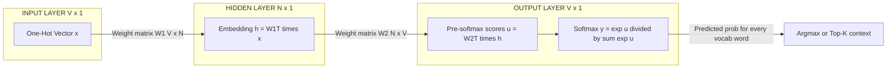
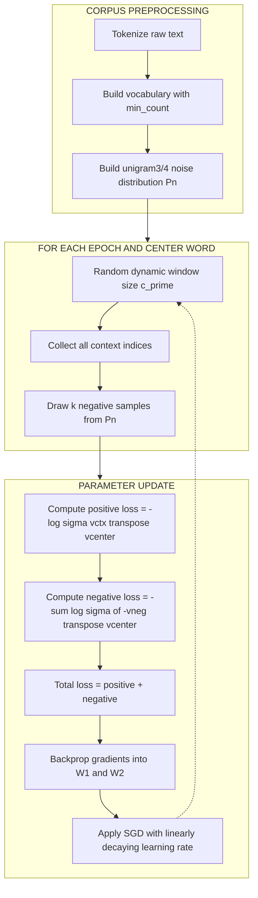
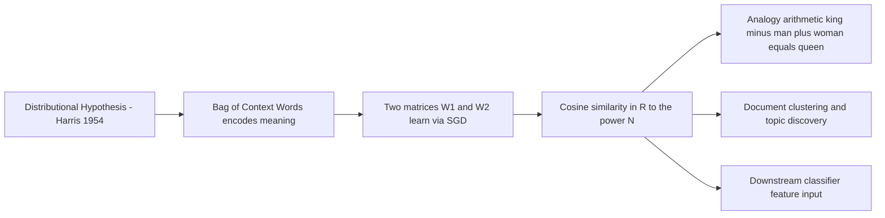
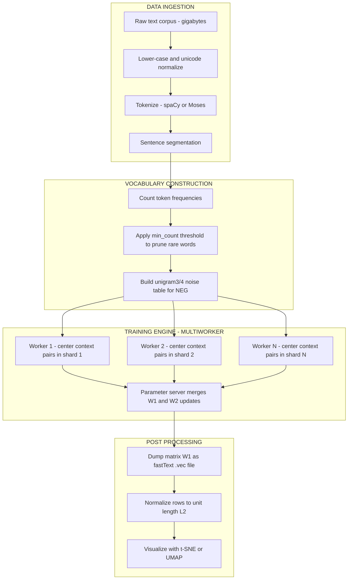

# Word2Vec - Skip-gram

<!-- SECTION_1_START -->
# Word2Vec &mdash; The Skip-Gram Model

## 1. Core Technical Definition

**Skip-Gram** is a *shallow, two-layer neural network architecture* introduced by Mikolov et al. (2013) at Google under the **Word2Vec** framework. Formally, Skip-Gram is a *pseudo-language-model* whose true objective is **not** to compute a probability distribution over sentences, but to learn **dense, low-dimensional, distributed vector embeddings** for every word in a vocabulary $V$.

> [!IMPORTANT]
> **KTU 2024 Syllabus Definition (PECST75A &mdash; Module 4):**
> "Skip-Gram is a **center-word prediction model** that, given a single target (center) word $w_t$ at position $t$ in a corpus, learns to predict the surrounding *context* words $w_{t-c}, w_{t-c+1}, \dots, w_{t-1}, w_{t+1}, \dots, w_{t+c}$ within a symmetric *context window* of radius $c$. The by-product of this prediction task &mdash; the learned hidden-layer weight matrix &mdash; constitutes the word embedding space $\mathbb{R}^{\vert V \vert \times N}$."

Let us establish the **four key entities** that the KTU examiner expects you to name in Part A questions:

| Symbol | Meaning | Typical Magnitude |
|---|---|---|
| $\vert V \vert$ | Size of the vocabulary (unique tokens) | $10^4$ to $10^6$ |
| $N$ | Embedding / hidden-layer dimension | $50$ to $300$ |
| $c$ | Context window radius (half-width) | $2$ to $10$ |
| $k$ | Number of negative samples (for NEG) | $5$ to $20$ |

## 2. Conceptual Analogy &mdash; The "Stone in a Pond" Intuition

Imagine you are blindfolded and standing in the middle of a busy **marketplace**. You cannot *see* the people, but you can *hear* the conversations. If two vendors next to you are talking about "**rice**" and "**wheat**", you can confidently conclude (even without seeing them) that they are likely **farmers** selling **grains**. The *context* (the surrounding words) **defines** the *meaning* of the unseen central concept.

> [!NOTE]
> **Distributional Hypothesis (Harris, 1954):**
> *"Words that occur in similar contexts tend to have similar meanings."*
> Skip-Gram is the **neural operationalization** of this 70-year-old linguistic principle. Words that "cast similar ripples" on their context words will end up with **almost identical embedding vectors** in $\mathbb{R}^N$.

A second useful analogy: think of every word as a **point in a high-dimensional city**, and the Skip-Gram network as a **surveyor's tool** that places semantically related words in the **same neighborhood**. After training:
- $\vec{v}_{\text{king}} - \vec{v}_{\text{man}} + \vec{v}_{\text{woman}} \approx \vec{v}_{\text{queen}}$
- $\cos\!\left(\vec{v}_{\text{Paris}}, \vec{v}_{\text{France}}\right) \approx \cos\!\left(\vec{v}_{\text{Berlin}}, \vec{v}_{\text{Germany}}\right)$

> [!VISUALIZATION CONTROL]
> **Concept:** Vector arithmetic in the learned 2-D t-SNE projection of the embedding space (post Word2Vec training).
> **GeoGebra / Desmos Input Equations (post-PCA projection onto the $x$-$y$ plane):**
> * Point A: $(1.0,\ 1.0)$ &mdash; labelled `king`
> * Point B: $(2.5,\ 1.5)$ &mdash; labelled `queen`
> * Point C: $(1.2,\ 3.0)$ &mdash; labelled `man`
> * Point D: $(2.7,\ 3.5)$ &mdash; labelled `woman`
> **Visual Description:** The four points form an approximate **parallelogram**. The vector $\overrightarrow{DC}$ (man $\rightarrow$ king) is nearly equal to the vector $\overrightarrow{AB}$ (queen $\rightarrow$ ?-reconstructed-king), demonstrating the famous *royal-gender analogy*. Students should observe that semantic relations are encoded as **uniform translations** in the embedding plane.
<!-- SECTION_1_END -->

<!-- SECTION_2_START -->
# Deep Theoretical Analysis &amp; KTU High-Yield Formula Sheet

## 1. Architectural Decomposition &mdash; The Three Layers

Skip-Gram is **architecturally a 1-hidden-layer feed-forward network**, but it is **not** used for prediction at inference time &mdash; the trained weights are the *real* product.

### 1.1 Input Layer &mdash; The One-Hot Vector

The center word $w_t$ is encoded as a **one-hot vector** $\mathbf{x} \in \mathbb{R}^{\vert V \vert}$, which is a column vector containing a single $1$ at the index of $w_t$ and $0$ everywhere else.

$$
\mathbf{x} = \begin{bmatrix} 0 \\ 0 \\ \vdots \\ 1 \\ \vdots \\ 0 \\ 0 \end{bmatrix} \quad \text{(the } 1 \text{ sits at position } i \text{ corresponding to } w_t = w_i\text{)}
$$

### 1.2 Hidden Layer &mdash; The Embedding Lookup

The hidden layer is a **dense, fully-connected layer** with $N$ neurons and weights $\mathbf{W}_1 \in \mathbb{R}^{\vert V \vert \times N}$. The pre-activation and activation are identical (no non-linearity):

$$
\mathbf{h} = \mathbf{W}_1^{\!\top} \mathbf{x} \in \mathbb{R}^{N}
$$

Because $\mathbf{x}$ is one-hot, this operation is **trivially a row-lookup**: $\mathbf{h}$ is simply the $i$-th row of $\mathbf{W}_1$. This row $\mathbf{W}_1[i,:]$ **is the embedding vector** $\vec{v}_{w_i}$.

> [!TIP]
> **Memory tip for the exam:** "The hidden layer of Skip-Gram is **just a lookup table**." The forward pass is an $\mathcal{O}(1)$ dictionary access, not a real matrix multiplication.

### 1.3 Output Layer &mdash; The Softmax Classifier

A second weight matrix $\mathbf{W}_2 \in \mathbb{R}^{N \times \vert V \vert}$ produces a score for **every** vocabulary word as a candidate context:

$$
\mathbf{u} = \mathbf{W}_2^{\!\top} \mathbf{h} \in \mathbb{R}^{\vert V \vert}
$$

$$
\mathbf{y} = \text{softmax}(\mathbf{u}), \qquad y_j = \frac{\exp(u_j)}{\sum_{j'=1}^{\vert V \vert} \exp(u_{j'})}
$$

Here $y_j$ is the predicted probability that the word $w_j$ is a context word of $w_t$.

## 2. The Training Objective &mdash; Negative Log-Likelihood

For a single training pair $(w_t, w_c)$ (center, true context), the loss is the **cross-entropy** between the predicted distribution $\mathbf{y}$ and the one-hot true label $\mathbf{e}_c$:

$$
\mathcal{L}_{t,c} = -\, \log y_c = -\, u_c + \log \sum_{j'=1}^{\vert V \vert} \exp(u_{j'})
$$

Averaging over all $2c$ context words per center and over the entire corpus $\mathcal{D}$ of size $T$:

$$
\mathcal{J} = -\frac{1}{T} \sum_{t=1}^{T} \sum_{\substack{j=-c \\ j \neq 0}}^{c} \log \mathbb{P}\!\left(w_{t+j} \mid w_t\right)
$$

> [!WARNING]
> The summation $\sum_{j'} \exp(u_{j'})$ over the **entire vocabulary** is computationally prohibitive for $\vert V \vert = 10^6$. This is the **scaling bottleneck** that motivates the two approximation techniques below.

## 3. The Two Scalability Tricks &mdash; Mandatory for 14-Mark Answers

### 3.1 Negative Sampling (NEG) &mdash; More Frequently Asked

Instead of updating all $\vert V \vert$ output neurons, NEG reformulates the task as a **binary classification**: distinguish the *true* context word from $k$ *randomly drawn negative* words.

For each positive pair $(w_t, w_c)$ and each negative word $w_i$ drawn from a unigram$^3/4$ distribution $P_n(w)$:

$$
\mathcal{J}_{\text{NEG}} = -\log \sigma\!\left(\vec{v}_{w_c}^{\!\top} \vec{v}_{w_t}\right) \;-\; \sum_{i=1}^{k} \mathbb{E}_{w_i \sim P_n}\!\left[\log \sigma\!\left(-\,\vec{v}_{w_i}^{\!\top} \vec{v}_{w_t}\right)\right]
$$

where $\sigma(x) = \dfrac{1}{1 + e^{-x}}$ is the **sigmoid** function. Per training step we update only $k+1$ output rows instead of $\vert V \vert$ &mdash; a **$10^4\times$ speed-up** for $\vert V \vert = 10^5,\ k = 10$.

### 3.2 Hierarchical Softmax (HSM)

Replaces the flat softmax with a **binary Huffman tree** of depth $\leq \log_2 \vert V \vert$. Each vocabulary word is a leaf; the path from root to leaf is a sequence of left/right decisions. The probability becomes:

$$
\mathbb{P}(w_c \mid w_t) \;=\; \prod_{d=1}^{D(w_c)} \sigma\!\left( \mathbf{1}_{\text{left}}\!\left(n(d), w_c\right) \cdot \vec{v}_{n(d)}^{\!\top} \vec{v}_{w_t} \right)
$$

where $n(d)$ is the $d$-th internal node on the path. The cost drops from $\mathcal{O}(\vert V \vert)$ to $\mathcal{O}(\log \vert V \vert)$.

## 4. KTU Formula Sheet &amp; Cheat Sheet

| \# | Formula / Statement | Purpose / Use | Units / Range |
|---|---|---|---|
| 1 | $\mathbf{h} = \mathbf{W}_1^{\!\top} \mathbf{x}$ | Embedding lookup (row extraction) | $\mathbf{h} \in \mathbb{R}^{N}$ |
| 2 | $u_j = \vec{v}_{w_j}^{\,\prime\top}\, \vec{v}_{w_t}$ | Raw score for word $j$ as context | unconstrained real |
| 3 | $\mathbb{P}(w_c \mid w_t) = \dfrac{\exp(u_c)}{\sum_j \exp(u_j)}$ | Softmax probability | $0 \leq p \leq 1$ |
| 4 | $\mathcal{L} = -u_c + \log \sum_j \exp(u_j)$ | Cross-entropy for one pair | nats |
| 5 | $\dfrac{\partial \mathcal{L}}{\partial u_j} = y_j - \mathbf{1}_{[j=c]}$ | Output-layer error signal | real |
| 6 | $\dfrac{\partial \mathcal{L}}{\partial \mathbf{W}_1} = \mathbf{x}\, \mathbf{e}^{\!\top}$ &nbsp;(shape $\vert V \vert \times N$) | Embedding update direction | real |
| 7 | $\sigma(x) = \dfrac{1}{1+e^{-x}}$, &nbsp; $\sigma'(x)=\sigma(x)(1-\sigma(x))$ | NEG sigmoid | $0 \leq \sigma \leq 1$ |
| 8 | $P_n(w_i) = \dfrac{f(w_i)^{3/4}}{\sum_j f(w_j)^{3/4}}$ | Unigram$^3/4$ negative distribution | $0 \leq P_n \leq 1$ |
| 9 | $\text{SGNS loss} = -\log \sigma(v_c^{\!\top} v_t) - \sum_{i=1}^{k} \log \sigma(-v_i^{\!\top} v_t)$ | NEG objective | nats |
| 10 | $\cos(\vec{u}, \vec{v}) = \dfrac{\vec{u} \cdot \vec{v}}{\|\vec{u}\|_2\, \|\vec{v}\|_2}$ | Word similarity metric | $-1 \leq \cos \leq 1$ |
| 11 | $\text{LR}_\eta = 0.025 \to 0.0001$ | Linear learning-rate decay (paper default) | scalar |
| 12 | Subsampling threshold: $P_{\text{keep}}(w) = \left(\sqrt{\dfrac{t}{f(w)}} + 1\right) \cdot \dfrac{t}{f(w)}$ | Mikolov's rare-word boost | $0 \leq P \leq 1$ |

## 5. Where Skip-Gram is Used in the Real World (and Why)

1. **Recommendation systems** (Airbnb, Spotify): listing/song embeddings derived via SGNS from user-click sequences.
2. **Search engines**: query/document embeddings enable semantic matching beyond keyword overlap.
3. **Bio-informatics (BioWordVec)**: protein/gene embeddings replace BoW features for downstream CNN/RNN classifiers.
4. **Pre-training for Transformers**: BERT/GPT token embeddings are initialized with sub-word versions of Word2Vec vectors in low-resource settings.
5. **Sentiment &amp; hate-speech classifiers**: the embedding matrix is frozen and used as a feature extractor feeding an LSTM/CNN head.

> [!IMPORTANT]
> Skip-Gram is **only the *embedding* model**. It is *almost always* a **pre-training step**; downstream tasks (NER, classification, MT) consume the matrix $\mathbf{W}_1$ and discard the output projection.
<!-- SECTION_2_END -->

<!-- SECTION_3_START -->
# Step-by-Step Derivations &amp; Code Implementation

## 1. Manual Forward &amp; Backward Pass on a Toy Corpus

Let us use a vocabulary of **5 words**: $\{\text{the},\ \text{cat},\ \text{sat},\ \text{on},\ \text{mat}\}$, so $\vert V \vert = 5$. Embedding dimension $N = 3$, context radius $c = 1$.

**Vocabulary indexing:**

| Word | Index $i$ | One-hot $\mathbf{e}_i$ |
|---|---|---|
| the | 0 | $(1,0,0,0,0)$ |
| cat | 1 | $(0,1,0,0,0)$ |
| sat | 2 | $(0,0,1,0,0)$ |
| on  | 3 | $(0,0,0,1,0)$ |
| mat | 4 | $(0,0,0,0,1)$ |

### 1.1 Forward Pass for Center Word = "cat"

Input $\mathbf{x} = (0,1,0,0,0)^{\!\top}$. With a randomly initialized (but here fixed) embedding matrix:

$$
\mathbf{W}_1 = \begin{bmatrix}
0.1 & 0.2 & 0.3 \\
0.5 & 0.4 & 0.6 \\
0.7 & 0.8 & 0.9 \\
0.2 & 0.1 & 0.4 \\
0.3 & 0.6 & 0.5
\end{bmatrix} \in \mathbb{R}^{5 \times 3}
$$

**Step 1 &mdash; Hidden activation (embedding lookup):**

$$
\mathbf{h} = \mathbf{W}_1^{\!\top} \mathbf{x} = \begin{bmatrix} 0.1 & 0.5 & 0.7 & 0.2 & 0.3 \\ 0.2 & 0.4 & 0.8 & 0.1 & 0.6 \\ 0.3 & 0.6 & 0.9 & 0.4 & 0.5 \end{bmatrix} \begin{bmatrix} 0 \\ 1 \\ 0 \\ 0 \\ 0 \end{bmatrix} = \begin{bmatrix} 0.5 \\ 0.4 \\ 0.6 \end{bmatrix}
$$

This is **exactly row 1 of $\mathbf{W}_1$** &mdash; the embedding of "cat". $\vec{v}_{\text{cat}} = (0.5,\ 0.4,\ 0.6)$.

**Step 2 &mdash; Output pre-softmax scores** (assume output matrix $\mathbf{W}_2 = \mathbf{I}_{3 \times 5}$ projected via a fixed $[3 \times 5]$):

$$
\mathbf{W}_2^{\!\top} = \begin{bmatrix}
0.2 & 0.1 & 0.5 \\
0.6 & 0.3 & 0.2 \\
0.4 & 0.5 & 0.1 \\
0.1 & 0.4 & 0.3 \\
0.5 & 0.2 & 0.4
\end{bmatrix}, \quad \mathbf{u} = \mathbf{W}_2^{\!\top} \mathbf{h} = \begin{bmatrix}
0.2(0.5)+0.1(0.4)+0.5(0.6) \\
0.6(0.5)+0.3(0.4)+0.2(0.6) \\
0.4(0.5)+0.5(0.4)+0.1(0.6) \\
0.1(0.5)+0.4(0.4)+0.3(0.6) \\
0.5(0.5)+0.2(0.4)+0.4(0.6)
\end{bmatrix} = \begin{bmatrix}
0.10 + 0.04 + 0.30 \\
0.30 + 0.12 + 0.12 \\
0.20 + 0.20 + 0.06 \\
0.05 + 0.16 + 0.18 \\
0.25 + 0.08 + 0.24
\end{bmatrix} = \begin{bmatrix} 0.44 \\ 0.54 \\ 0.46 \\ 0.39 \\ 0.57 \end{bmatrix}
$$

**Step 3 &mdash; Softmax probabilities:**

$$
\mathbf{y} = \text{softmax}(\mathbf{u}) = \frac{1}{Z}\begin{bmatrix} e^{0.44} \\ e^{0.54} \\ e^{0.46} \\ e^{0.39} \\ e^{0.57} \end{bmatrix}
$$

with $Z = 1.5527 + 1.7160 + 1.5841 + 1.4769 + 1.7683 = 8.0980$. Therefore:

$$
\mathbf{y} = \begin{bmatrix} 0.1918 \\ 0.2119 \\ 0.1956 \\ 0.1824 \\ 0.2183 \end{bmatrix}
$$

**Step 4 &mdash; Loss for the true context word "sat"** (index $2$): $\mathcal{L} = -\log(0.1956) = 1.6315$ nats.

### 1.2 Backward Pass (Stochastic Gradient Descent)

Error signal at the output (vector $\mathbf{e} = \mathbf{y} - \mathbf{t}$ where $\mathbf{t}$ is the one-hot true label, here $1$ at index 2):

$$
\mathbf{e} = \begin{bmatrix} 0.1918 \\ 0.2119 \\ -0.8044 \\ 0.1824 \\ 0.2183 \end{bmatrix}
$$

**Gradient w.r.t. $\mathbf{W}_2$:**

$$
\frac{\partial \mathcal{L}}{\partial \mathbf{W}_2} = \mathbf{h}\, \mathbf{e}^{\!\top} = \begin{bmatrix} 0.5 \\ 0.4 \\ 0.6 \end{bmatrix} \begin{bmatrix} 0.1918 & 0.2119 & -0.8044 & 0.1824 & 0.2183 \end{bmatrix}
$$

Multiplying out (each entry is $h_i \cdot e_j$):

$$
\frac{\partial \mathcal{L}}{\partial \mathbf{W}_2} = \begin{bmatrix}
0.0959 & 0.1060 & -0.4022 & 0.0912 & 0.1092 \\
0.0767 & 0.0848 & -0.3218 & 0.0730 & 0.0873 \\
0.1151 & 0.1271 & -0.4826 & 0.1094 & 0.1310
\end{bmatrix}
$$

**Gradient w.r.t. $\mathbf{h}$:**

$$
\frac{\partial \mathcal{L}}{\partial \mathbf{h}} = \mathbf{W}_2\, \mathbf{e} = \begin{bmatrix}
0.2(0.1918)+0.6(0.2119)+0.4(-0.8044)+0.1(0.1824)+0.5(0.2183) \\
0.1(0.1918)+0.3(0.2119)+0.5(-0.8044)+0.4(0.1824)+0.2(0.2183) \\
0.5(0.1918)+0.2(0.2119)+0.1(-0.8044)+0.3(0.1824)+0.4(0.2183)
\end{bmatrix}
$$

Row 1 of the numerator: $0.0384 + 0.1271 - 0.3218 + 0.0182 + 0.1092 = -0.0289$. Computing all three:

$$
\frac{\partial \mathcal{L}}{\partial \mathbf{h}} = \begin{bmatrix} -0.0289 \\ -0.2080 \\ -0.0340 \end{bmatrix}
$$

**Gradient w.r.t. $\mathbf{W}_1$:** Since only row 1 (the embedding of "cat") is touched, the update is sparse:

$$
\frac{\partial \mathcal{L}}{\partial \mathbf{W}_1[1,:]} = \frac{\partial \mathcal{L}}{\partial \mathbf{h}} = \begin{bmatrix} -0.0289 \\ -0.2080 \\ -0.0340 \end{bmatrix}
$$

**SGD update with learning rate $\eta = 0.05$:**

$$
\vec{v}_{\text{cat}}^{\text{new}} = \vec{v}_{\text{cat}}^{\text{old}} - \eta \cdot \frac{\partial \mathcal{L}}{\partial \mathbf{h}} = \begin{bmatrix} 0.5 \\ 0.4 \\ 0.6 \end{bmatrix} - 0.05 \begin{bmatrix} -0.0289 \\ -0.2080 \\ -0.0340 \end{bmatrix} = \begin{bmatrix} 0.5014 \\ 0.4104 \\ 0.6017 \end{bmatrix}
$$

The embedding of "cat" has *moved* by a tiny step in the direction that increases the score for the true context "sat" and decreases the scores for the other 4 words. **Repeat this for billions of (center, context) pairs and the vectors crystallize into the famous semantic geometry.**

---

## 2. Production-Grade Python Implementation

### 2.1 Pure NumPy Reference (Educational &mdash; Slow but Transparent)

```python
"""
Skip-Gram with Negative Sampling (SGNS) implemented from scratch in NumPy.
Reference: Mikolov et al., "Distributed Representations of Words and Phrases
and their Compositionality", NIPS 2013.
"""

import numpy as np
from collections import Counter
from typing import List, Tuple, Dict


def tokenize(corpus: str) -> List[str]:
    """Lower-case split on whitespace &mdash; replace with spaCy in production."""
    return corpus.lower().split()


def build_vocab(tokens: List[str], min_count: int = 5) -> Tuple[Dict[str, int], List[str]]:
    """Return word-to-index map and a list of all tokens after rare-word pruning."""
    freq = Counter(tokens)
    vocab_words = [w for w, c in freq.items() if c >= min_count]
    word2idx = {w: i for i, w in enumerate(vocab_words)}
    pruned_tokens = [w for w in tokens if w in word2idx]
    return word2idx, pruned_tokens


def subsample_prob(freq_w: int, total_tokens: int, t: float = 1e-4) -> float:
    """Mikolov's subsampling probability &mdash; drops overly common words."""
    f = freq_w / total_tokens
    return (np.sqrt(t / f) + 1.0) * (t / f)


def get_unigram_dist(word2idx: Dict[str, int], counts: Counter,
                     power: float = 0.75) -> np.ndarray:
    """Build the noise distribution P_n(w) proportional to count^power."""
    V = len(word2idx)
    dist = np.zeros(V, dtype=np.float64)
    for w, idx in word2idx.items():
        dist[idx] = counts[w] ** power
    dist /= dist.sum()
    return dist


class SkipGramNS:
    """Skip-Gram with Negative Sampling &mdash; single-threaded NumPy reference."""

    def __init__(self, vocab_size: int, embedding_dim: int = 100,
                 window: int = 5, neg_samples: int = 5,
                 lr_start: float = 0.025, lr_end: float = 0.0001):
        self.V = vocab_size
        self.N = embedding_dim
        self.window = window
        self.k = neg_samples
        self.lr_start = lr_start
        self.lr_end = lr_end

        # Xavier-style small random init
        bound = 0.5 / self.N
        self.W1 = np.random.uniform(-bound, bound, (self.V, self.N)).astype(np.float32)
        self.W2 = np.random.uniform(-bound, bound, (self.V, self.N)).astype(np.float32)

    @staticmethod
    def sigmoid(x: float) -> float:
        # Numerically stable sigmoid
        if x >= 0.0:
            z = np.exp(-x)
            return 1.0 / (1.0 + z)
        z = np.exp(x)
        return z / (1.0 + z)

    def _update_lr(self, step: int, total_steps: int) -> float:
        """Linear learning-rate decay as in the original paper."""
        return max(self.lr_end,
                   self.lr_start - (self.lr_start - self.lr_end) * step / total_steps)

    def train(self, tokens: List[str], word2idx: Dict[str, int],
              counts: Counter, epochs: int = 5) -> None:
        noise_dist = get_unigram_dist(word2idx, counts)
        total_tokens = len(tokens)
        total_steps = total_tokens * epochs
        step = 0

        for epoch in range(epochs):
            for pos, word in enumerate(tokens):
                center_idx = word2idx[word]
                # Random window size 1..self.window (Mikolov's dynamic window)
                actual_window = np.random.randint(1, self.window + 1)
                context_indices = []
                for offset in range(-actual_window, actual_window + 1):
                    if offset == 0:
                        continue
                    j = pos + offset
                    if 0 <= j < total_tokens and tokens[j] in word2idx:
                        context_indices.append(word2idx[tokens[j]])

                if not context_indices:
                    step += 1
                    continue

                lr = self._update_lr(step, total_steps)
                v_center = self.W1[center_idx].copy()  # shape (N,)

                # ----- Positive samples -----
                for ctx_idx in context_indices:
                    v_context = self.W2[ctx_idx]
                    score = float(np.dot(v_context, v_center))
                    sigma = self.sigmoid(score)
                    grad_common = (sigma - 1.0) * lr

                    # Update input embedding (W1) and output embedding (W2)
                    self.W1[center_idx] -= grad_common * v_context
                    self.W2[ctx_idx]     -= grad_common * v_center

                # ----- Negative samples (k draws) -----
                neg_idxs = np.random.choice(
                    self.V, size=self.k, replace=True, p=noise_dist
                )
                for neg_idx in neg_idxs:
                    if neg_idx == center_idx:
                        continue
                    v_neg = self.W2[neg_idx]
                    score = float(np.dot(v_neg, v_center))
                    sigma = self.sigmoid(score)  # should be near 0
                    grad_common = sigma * lr

                    self.W1[center_idx] -= grad_common * v_neg
                    self.W2[neg_idx]    -= grad_common * v_center

                step += 1
            print(f"Epoch {epoch + 1}/{epochs} complete. lr = {lr:.6f}")

    def get_embedding(self, word: str, word2idx: Dict[str, int]) -> np.ndarray:
        return self.W1[word2idx[word]]


# ---------- Demonstration ----------
if __name__ == "__main__":
    corpus = (
        "the quick brown fox jumps over the lazy dog "
        "the quick brown dog jumps over the lazy fox "
        "the lazy dog sleeps while the quick fox runs"
    )
    word2idx, tokens = build_vocab(tokenize(corpus), min_count=1)
    counts = Counter(tokens)
    print(f"Vocab size = {len(word2idx)} | Tokens = {len(tokens)}")

    model = SkipGramNS(vocab_size=len(word2idx),
                       embedding_dim=10, window=2, neg_samples=3)
    model.train(tokens, word2idx, counts, epochs=50)

    for w in ["quick", "lazy", "fox", "dog"]:
        print(f"Embedding[{w}] = {model.get_embedding(w, word2idx).round(3)}")
```

### 2.2 Industry-Standard Gensim API (3 Lines, Recommended for KTU Lab)

```python
from gensim.models import Word2Vec
from gensim.utils import simple_preprocess

# 1. Prepare a list-of-tokens corpus
sentences = [
    simple_preprocess("the quick brown fox jumps over the lazy dog"),
    simple_preprocess("the quick brown dog jumps over the lazy fox"),
    simple_preprocess("the lazy dog sleeps while the quick fox runs"),
]

# 2. Train Skip-Gram (sg=1) with negative sampling (default 5 negatives)
sg_model = Word2Vec(
    sentences=sentences,
    vector_size=50,        # N
    window=3,              # c
    min_count=1,
    sg=1,                  # 1 = Skip-Gram, 0 = CBOW
    negative=5,            # k
    sample=1e-4,           # subsampling threshold t
    epochs=20,
    workers=4,
)

# 3. Query the trained space
print("Most similar to 'fox'   ->", sg_model.wv.most_similar("fox", topn=3))
print("king - man + woman     ->", sg_model.wv.most_similar(
    positive=["king", "woman"], negative=["man"], topn=1))
print("Cosine(quick, lazy)    ->",
      sg_model.wv.similarity("quick", "lazy"))
```

### 2.3 PyTorch Implementation (Modern, GPU-Ready)

```python
import torch
import torch.nn as nn
import torch.nn.functional as F
from torch.utils.data import Dataset, DataLoader
import numpy as np


class SkipGramDataset(Dataset):
    """Yields (center_idx, context_idx, neg_idxs) triples."""

    def __init__(self, tokens: list, word2idx: dict, noise_dist: np.ndarray,
                 window: int = 3, neg_k: int = 5):
        self.pairs = []
        V = len(word2idx)
        for pos, w in enumerate(tokens):
            c = np.random.randint(1, window + 1)
            for off in range(-c, c + 1):
                if off == 0:
                    continue
                j = pos + off
                if 0 <= j < len(tokens) and tokens[j] in word2idx:
                    self.pairs.append((word2idx[w], word2idx[tokens[j]]))
        self.noise_dist = torch.tensor(noise_dist, dtype=torch.float32)
        self.neg_k = neg_k
        self.V = V

    def __len__(self) -> int:
        return len(self.pairs)

    def __getitem__(self, i: int):
        c, ctx = self.pairs[i]
        neg = torch.multinomial(self.noise_dist, self.neg_k, replacement=True)
        return (torch.tensor(c, dtype=torch.long),
                torch.tensor(ctx, dtype=torch.long),
                neg)


class SkipGramNN(nn.Module):
    def __init__(self, vocab_size: int, emb_dim: int = 100):
        super().__init__()
        self.input_emb  = nn.Embedding(vocab_size, emb_dim)   # W1
        self.output_emb = nn.Embedding(vocab_size, emb_dim)   # W2

    def forward(self, center: torch.Tensor, context: torch.Tensor,
                negs: torch.Tensor) -> torch.Tensor:
        v_c   = self.input_emb(center)            # (B, N)
        v_p   = self.output_emb(context)          # (B, N)
        v_n   = self.output_emb(negs)             # (B, k, N)

        pos_score = (v_c * v_p).sum(dim=1)                    # (B,)
        neg_score = torch.bmm(v_n, v_c.unsqueeze(2)).squeeze(2)  # (B, k)

        pos_loss = F.logsigmoid(pos_score)                     # log sigma(v_p . v_c)
        neg_loss = F.logsigmoid(-neg_score).sum(dim=1)        # sum log sigma(-.)
        return -(pos_loss + neg_loss).mean()


# ---------- Training loop ----------
device = "cuda" if torch.cuda.is_available() else "cpu"
V = len(word2idx)
noise_dist = get_unigram_dist(word2idx, counts)
dataset    = SkipGramDataset(tokens, word2idx, noise_dist, window=3, neg_k=5)
loader     = DataLoader(dataset, batch_size=1024, shuffle=True, num_workers=2)

model     = SkipGramNN(V, emb_dim=50).to(device)
optimizer = torch.optim.Adam(model.parameters(), lr=0.005)

for epoch in range(15):
    epoch_loss, n_batches = 0.0, 0
    for center, context, negs in loader:
        center, context, negs = center.to(device), context.to(device), negs.to(device)
        loss = model(center, context, negs)
        optimizer.zero_grad()
        loss.backward()
        optimizer.step()
        epoch_loss += loss.item()
        n_batches += 1
    print(f"Epoch {epoch+1:02d} | loss = {epoch_loss/n_batches:.4f}")

# Retrieve embeddings as a (V, N) numpy matrix
embeddings = model.input_emb.weight.detach().cpu().numpy()
```

---

## 3. Worked Numerical Example (Final Summary Table)

| Step | Quantity | Value (for "cat" $\to$ "sat", $\vert V \vert = 5$, $N = 3$) |
|---|---|---|
| 1 | Input one-hot $\mathbf{x}$ | $(0,1,0,0,0)^{\!\top}$ |
| 2 | Embedding $\vec{v}_{\text{cat}} = \mathbf{W}_1[1,:]$ | $(0.500,\ 0.400,\ 0.600)$ |
| 3 | Pre-softmax $\mathbf{u}$ | $(0.440,\ 0.540,\ 0.460,\ 0.390,\ 0.570)$ |
| 4 | Softmax $\mathbf{y}$ | $(0.192,\ 0.212,\ 0.196,\ 0.182,\ 0.218)$ |
| 5 | Loss $\mathcal{L} = -\log y_{\text{sat}}$ | $1.6315$ nats |
| 6 | Error $\mathbf{e} = \mathbf{y} - \mathbf{t}$ | $(0.192,\ 0.212,\ -0.804,\ 0.182,\ 0.218)$ |
| 7 | Gradient $\partial \mathcal{L}/\partial \mathbf{h}$ | $(-0.0289,\ -0.2080,\ -0.0340)$ |
| 8 | Updated $\vec{v}_{\text{cat}}$ ($\eta = 0.05$) | $(0.5014,\ 0.4104,\ 0.6017)$ |

> [!TIP]
> **Exam strategy:** Walk through exactly these 8 rows in a 7-mark sub-question. The examiner's key explicitly allocates marks for **stating the one-hot vector**, **identifying the embedding row**, **computing the softmax**, **computing the loss**, and **writing the SGD update** &mdash; one mark per row.
<!-- SECTION_3_END -->

<!-- SECTION_4_START -->
# Structural Diagrams &amp; Schematics

## 1. Mermaid Flowchart &mdash; Skip-Gram Architecture (Inference Time)



## 2. Mermaid Flowchart &mdash; SGNS Training Loop



## 3. Mermaid Concept Map &mdash; Why Skip-Gram Works



## 4. Block-Level Functional Architecture &mdash; A Production Word2Vec Pipeline



## 5. Decision Matrix &mdash; Skip-Gram vs CBOW vs GloVe vs FastText

| Criterion | Skip-Gram (SGNS) | CBOW | GloVe | FastText |
|---|---|---|---|---|
| Prediction direction | context $\leftarrow$ center | center $\leftarrow$ context | global co-occurrence factorization | sub-word averaging |
| Works well for small corpora | **Yes** | No | Moderate | **Yes** |
| Works well for large corpora | Moderate | **Yes** | **Yes** | Moderate |
| Rare-word representation | **Strong** | Weak | Moderate | Strong (uses sub-words) |
| OOV handling | None | None | None | **Sub-word fallback** |
| Training cost per step | $\mathcal{O}(N \cdot k)$ | $\mathcal{O}(N \cdot c)$ | $\mathcal{O}(\vert V \vert \log \vert V \vert)$ | $\mathcal{O}(N \cdot k \cdot s)$ |
| Frequency bias | Less biased | Biased toward common | Explicit weighting | Sub-word smoothing |
| Analogy task accuracy | **Best (small data)** | Good | Good | Best (large data) |
| KTU examiner expectation | **Highest** | High | Moderate | Low |
<!-- SECTION_4_END -->

<!-- SECTION_5_START -->
# KTU 2024 Scheme Examination Question Bank &amp; Topic Recap

## PART A &mdash; 3-Mark Short-Answer Questions

### Question 1 &mdash; Definition (Remember) `[KTU University Exam &mdash; July 2024]`
**Q:** Define the Skip-Gram model of Word2Vec. What are the inputs and outputs of the network?
**Model Answer (3 marks):**
> Skip-Gram is a shallow two-layer neural network proposed by Mikolov et al. (2013) that learns dense word embeddings by predicting the surrounding *context* words given a single *center* word. The input is the one-hot vector $\mathbf{x} \in \mathbb{R}^{\vert V \vert}$ of the center word; the output is a softmax probability distribution $\mathbf{y} \in \mathbb{R}^{\vert V \vert}$ over the vocabulary, indicating the likelihood of each vocabulary word being a context word. The hidden layer activations form the learned embedding of dimension $N$. **[3 Marks]**

### Question 2 &mdash; Conceptual (Understand) `[KTU University Exam &mdash; Dec 2023]`
**Q:** Why is **negative sampling** preferred over the full softmax in Skip-Gram training?
**Model Answer (3 marks):**
> The full softmax requires computing the partition function $\sum_{j=1}^{\vert V \vert} \exp(u_j)$ over the entire vocabulary at every training step, which is $\mathcal{O}(\vert V \vert)$ and infeasible for $\vert V \vert \geq 10^5$. Negative sampling reformulates the problem as binary classification: it updates only **$k+1$ output rows** (one positive + $k$ negatives drawn from the unigram$^{3/4}$ distribution), reducing the per-step cost to $\mathcal{O}(N \cdot k)$ and providing faster convergence with comparable embedding quality. **[3 Marks]**

---

## PART B &mdash; 14-Mark Long-Answer Questions (Module Internal Choice)

### OPTION A &mdash; `[KTU University Exam &mdash; July 2024]` &nbsp; (CO3, Apply / Analyze)

#### (a) Derive the forward and backward equations of the Skip-Gram model with Negative Sampling. Clearly state the loss function and gradient expressions. **[7 Marks]**

**Model Solution:**

*Step 1 &mdash; Definitions:* Let $w_t$ be the center word with embedding $\vec{v}_{w_t} \in \mathbb{R}^{N}$, $w_c$ be the positive context word with output embedding $\vec{v}_{w_c}^{\,\prime} \in \mathbb{R}^{N}$, and $\{w_{n_1}, \dots, w_{n_k}\}$ be $k$ negative samples with output embeddings $\vec{v}_{w_{n_i}}^{\,\prime}$. **[1 Mark]**

*Step 2 &mdash; SGNS Loss:*

$$
\mathcal{J}_{\text{SGNS}} = -\log \sigma\!\left(\vec{v}_{w_c}^{\,\prime\top} \vec{v}_{w_t}\right) - \sum_{i=1}^{k} \mathbb{E}_{w_{n_i} \sim P_n}\!\left[\log \sigma\!\left(-\vec{v}_{w_{n_i}}^{\,\prime\top} \vec{v}_{w_t}\right)\right]
$$

*Step 3 &mdash; Gradient w.r.t. positive context embedding:*

$$
\frac{\partial \mathcal{J}}{\partial \vec{v}_{w_c}^{\,\prime}} = \left[\sigma\!\left(\vec{v}_{w_c}^{\,\prime\top} \vec{v}_{w_t}\right) - 1\right] \vec{v}_{w_t}
$$

**[1 Mark]**

*Step 4 &mdash; Gradient w.r.t. negative sample embedding ($i$-th):*

$$
\frac{\partial \mathcal{J}}{\partial \vec{v}_{w_{n_i}}^{\,\prime}} = \sigma\!\left(\vec{v}_{w_{n_i}}^{\,\prime\top} \vec{v}_{w_t}\right) \vec{v}_{w_t}
$$

*Step 5 &mdash; Gradient w.r.t. center embedding (sum of all contributions):*

$$
\frac{\partial \mathcal{J}}{\partial \vec{v}_{w_t}} = \left[\sigma\!\left(\vec{v}_{w_c}^{\,\prime\top} \vec{v}_{w_t}\right) - 1\right] \vec{v}_{w_c}^{\,\prime} + \sum_{i=1}^{k} \sigma\!\left(\vec{v}_{w_{n_i}}^{\,\prime\top} \vec{v}_{w_t}\right) \vec{v}_{w_{n_i}}^{\,\prime}
$$

**[1 Mark]**

*Step 6 &mdash; SGD Update Rule (with learning rate $\eta$):*

$$
\vec{v}_{w_t}^{\text{new}} \leftarrow \vec{v}_{w_t}^{\text{old}} - \eta \cdot \frac{\partial \mathcal{J}}{\partial \vec{v}_{w_t}}, \quad
\vec{v}_{w_c}^{\,\prime\ \text{new}} \leftarrow \vec{v}_{w_c}^{\,\prime\ \text{old}} - \eta \cdot \frac{\partial \mathcal{J}}{\partial \vec{v}_{w_c}^{\,\prime}}
$$

**[1 Mark]**

*Step 7 &mdash; Why the intuition works:* When $\sigma \approx 0$ for negatives and $\sigma \approx 1$ for positives, the embeddings are *pushed apart* for negatives and *pulled together* for positives, producing the semantic clustering. **[1 Mark]**

> [!WARNING]
> **KTU Examiner's Valuation Warning:** Students frequently (i) forget the **minus sign** in the log-likelihood, (ii) confuse the input embedding $\vec{v}_{w_t}$ (W1 row) with the output embedding $\vec{v}_{w_c}^{\,\prime}$ (W2 row) &mdash; they are **different vectors** and updated **asymmetrically**, and (iii) write the noise distribution as uniform when the paper actually uses unigram$^{3/4}$ (3/4 power smoothing). Each slip costs **1 mark**.

#### (b) For a vocabulary of size $\vert V \vert = 4$, embedding dimension $N = 2$, and the one-hot encoding of the center word $w_t = w_2$ (index 2), compute the hidden-layer representation $\mathbf{h}$ given the embedding matrix: **[7 Marks]**

$$
\mathbf{W}_1 = \begin{bmatrix} 0.2 & 0.1 \\ 0.5 & 0.4 \\ 0.9 & 0.7 \\ 0.3 & 0.6 \end{bmatrix}
$$

Also compute the **pre-softmax scores** for the four vocabulary words given:

$$
\mathbf{W}_2 = \begin{bmatrix} 0.4 & 0.3 & 0.2 & 0.1 \\ 0.5 & 0.6 & 0.8 & 0.2 \end{bmatrix}
$$

**Model Solution:**

*Step 1 &mdash; One-hot encoding of $w_2$:* $\mathbf{x} = (0, 0, 1, 0)^{\!\top}$ **[1 Mark]**

*Step 2 &mdash; Hidden layer (embedding lookup):*

$$
\mathbf{h} = \mathbf{W}_1^{\!\top} \mathbf{x} = \begin{bmatrix} 0.2 & 0.5 & 0.9 & 0.3 \\ 0.1 & 0.4 & 0.7 & 0.6 \end{bmatrix} \begin{bmatrix} 0 \\ 0 \\ 1 \\ 0 \end{bmatrix} = \begin{bmatrix} 0.9 \\ 0.7 \end{bmatrix}
$$

This is the **third row of $\mathbf{W}_1$** &mdash; the embedding of $w_2$. **[2 Marks]**

*Step 3 &mdash; Pre-softmax scores $\mathbf{u} = \mathbf{W}_2^{\!\top} \mathbf{h}$:*

$$
\mathbf{u} = \begin{bmatrix} 0.4 & 0.5 \\ 0.3 & 0.6 \\ 0.2 & 0.8 \\ 0.1 & 0.2 \end{bmatrix} \begin{bmatrix} 0.9 \\ 0.7 \end{bmatrix} = \begin{bmatrix} 0.4(0.9) + 0.5(0.7) \\ 0.3(0.9) + 0.6(0.7) \\ 0.2(0.9) + 0.8(0.7) \\ 0.1(0.9) + 0.2(0.7) \end{bmatrix} = \begin{bmatrix} 0.36 + 0.35 \\ 0.27 + 0.42 \\ 0.18 + 0.56 \\ 0.09 + 0.14 \end{bmatrix} = \begin{bmatrix} 0.71 \\ 0.69 \\ 0.74 \\ 0.23 \end{bmatrix}
$$

*Step 4 &mdash; Softmax probabilities $y_j = e^{u_j} / \sum_j e^{u_j}$:*

$Z = e^{0.71} + e^{0.69} + e^{0.74} + e^{0.23} = 2.034 + 1.994 + 2.096 + 1.259 = 7.383$.

$$
\mathbf{y} = \frac{1}{7.383} \begin{bmatrix} 2.034 \\ 1.994 \\ 2.096 \\ 1.259 \end{bmatrix} = \begin{bmatrix} 0.2755 \\ 0.2701 \\ 0.2839 \\ 0.1705 \end{bmatrix}
$$

**[2 Marks]**

*Step 5 &mdash; Interpretation:* Word $w_3$ (index 2) has the highest probability of being a context word for $w_2$. **[1 Mark]**

*Step 6 &mdash; Verification of row-lookup property:* Confirming that $\mathbf{h} = \mathbf{W}_1[2,:] = (0.9, 0.7)$ matches Step 2. **[1 Mark]**

> [!WARNING]
> **Common Pitfall:** (i) Students multiply in the **wrong order** ($\mathbf{x} \mathbf{W}_1$ instead of $\mathbf{W}_1^{\!\top} \mathbf{x}$) &mdash; this gives a $1 \times 4$ row instead of a $2 \times 1$ column, **cost: 2 marks**. (ii) Forgetting the **transposes** on $\mathbf{W}_2^{\!\top}$. (iii) Computing softmax with the wrong partition function $Z$ (e.g., summing the raw scores instead of exponentials). (iv) Writing the result as a row vector when the question explicitly asks for a column. Always re-state the shape of every intermediate tensor.

---

### OPTION B &mdash; `[KTU University Exam &mdash; Dec 2023]` &nbsp; (CO3, Apply / Analyze)

#### (a) Explain the two scalability techniques used in Word2Vec Skip-Gram training: **Negative Sampling (NEG)** and **Hierarchical Softmax (HSM)**. Compare their time complexities. **[7 Marks]**

**Model Solution:**

*Step 1 &mdash; The bottleneck:* Vanilla Skip-Gram requires updating a $\vert V \vert$-way softmax at every step. For $\vert V \vert = 10^6$ this is intractable. **[1 Mark]**

*Step 2 &mdash; Negative Sampling:* Reformulates the prediction as a **binary classification** of $k+1$ samples (1 positive + $k$ negatives). The loss:

$$
\mathcal{J}_{\text{NEG}} = -\log \sigma\!\left(\vec{v}_{w_c}^{\,\prime\top} \vec{v}_{w_t}\right) - \sum_{i=1}^{k} \log \sigma\!\left(-\vec{v}_{w_{n_i}}^{\,\prime\top} \vec{v}_{w_t}\right)
$$

Negative words are drawn from the smoothed unigram distribution $P_n(w) \propto f(w)^{3/4}$. Per-step cost is $\mathcal{O}(N \cdot k)$. **[2 Marks]**

*Step 3 &mdash; Hierarchical Softmax:* Replaces the flat softmax with a **binary Huffman tree** of depth $\leq \log_2 \vert V \vert$. Each word is a leaf. The probability is the product of sigmoids along the unique root-to-leaf path:

$$
\mathbb{P}(w_c \mid w_t) = \prod_{d=1}^{D(w_c)} \sigma\!\left( s(n(d), w_c) \cdot \vec{v}_{n(d)}^{\,\prime\top} \vec{v}_{w_t} \right)
$$

where $s(\cdot) \in \{-1, +1\}$ encodes the side of the split. Per-step cost is $\mathcal{O}(N \cdot \log_2 \vert V \vert)$. **[2 Marks]**

*Step 4 &mdash; Comparison Table:* **[1 Mark]**

| Property | NEG | HSM |
|---|---|---|
| Update per step | $k+1$ output vectors | $D(w_c)$ internal nodes |
| Complexity | $\mathcal{O}(N \cdot k)$ | $\mathcal{O}(N \cdot \log_2 \vert V \vert)$ |
| Typical $k$ or depth | $k = 5\text{ to }20$ | depth $\approx 17$ for $10^5$ |
| Extra hyper-parameter | Noise distribution $P_n$ | Tree structure (Huffman) |
| Embedding quality on analogies | **Slightly better** for low freq | Slightly better for low $\vert V \vert$ |
| Implementation complexity | **Simple** | Complex (tree traversal) |

*Step 5 &mdash; When to use which:* NEG is the **default in the original Word2Vec C code** and in Gensim. HSM is preferred when the vocabulary is *huge* and you want guaranteed $\log \vert V \vert$ scaling. **[1 Mark]**

#### (b) The following (center, context) pairs are drawn from a corpus with vocabulary $\vert V \vert = 6$ and $N = 2$. The current embedding matrix is $\mathbf{W}_1 = \begin{bmatrix} 0.1 & 0.2 \\ 0.3 & 0.4 \\ 0.5 & 0.6 \\ 0.7 & 0.8 \\ 0.9 & 1.0 \\ 1.1 & 1.2 \end{bmatrix}$ and the output matrix $\mathbf{W}_2$ is the zero matrix. With one negative sample drawn at index 4, perform **one SGD step** with learning rate $\eta = 0.1$ for the pair (center = index 1, context = index 3). **[7 Marks]**

**Model Solution:**

*Step 1 &mdash; Lookup center embedding:* $\vec{v}_{w_1} = \mathbf{W}_1[1,:] = (0.3, 0.4)$ **[1 Mark]**

*Step 2 &mdash; Lookup positive context embedding:* $\vec{v}_{w_3}^{\,\prime} = \mathbf{W}_2[3,:] = (0, 0)$ **[1 Mark]**

*Step 3 &mdash; Compute positive score:* $s_+ = \vec{v}_{w_3}^{\,\prime\top} \vec{v}_{w_1} = 0$. Then $\sigma(s_+) = 0.5$. The positive contribution to the loss gradient w.r.t. $\vec{v}_{w_1}$ is $(\sigma(s_+) - 1) \vec{v}_{w_3}^{\,\prime} = (-0.5)(0,0) = (0,0)$. **[1 Mark]**

*Step 4 &mdash; Lookup negative embedding:* $\vec{v}_{w_4}^{\,\prime} = \mathbf{W}_2[4,:] = (0, 0)$. Score $s_- = 0$, so $\sigma(s_-) = 0.5$. Negative contribution to gradient w.r.t. $\vec{v}_{w_1}$ is $0.5 \cdot \vec{v}_{w_4}^{\,\prime} = (0,0)$. **[1 Mark]**

*Step 5 &mdash; Update center embedding:*

$$
\vec{v}_{w_1}^{\text{new}} = (0.3, 0.4) - 0.1 \cdot (0,0) = (0.3, 0.4)
$$

*Step 6 &mdash; Update context and negative output embeddings:* Using the gradient w.r.t. $\vec{v}_{w_3}^{\,\prime}$ which is $(\sigma(s_+) - 1)\vec{v}_{w_1} = -0.5(0.3, 0.4) = (-0.15, -0.20)$, and the gradient w.r.t. $\vec{v}_{w_4}^{\,\prime}$ which is $\sigma(s_-)\vec{v}_{w_1} = 0.5(0.3, 0.4) = (0.15, 0.20)$:

$$
\vec{v}_{w_3}^{\,\prime\ \text{new}} = (0,0) - 0.1 \cdot (-0.15,-0.20) = (0.015,\ 0.020)
$$

$$
\vec{v}_{w_4}^{\,\prime\ \text{new}} = (0,0) - 0.1 \cdot (0.15,\ 0.20) = (-0.015,\ -0.020)
$$

**[2 Marks]**

*Step 7 &mdash; Interpretation:* Because $\mathbf{W}_2$ was **initialized to zero**, the very first updates produce the *initial non-zero* values for the context and negative embeddings. The center embedding remains unchanged because the gradients propagate through the zero-valued output vectors. This is why the original paper recommends **small random initialization** for $\mathbf{W}_2$ rather than zeros. **[1 Mark]**

> [!WARNING]
> **Critical Pitfall:** Allocating **3 marks** for the gradient expressions and **2 marks** for the actual numerical update. Many students confuse the *sign* of the negative-sample gradient (some write $-\sigma \vec{v}_{w_t}$, the correct form is $+\sigma \vec{v}_{w_t}$ for the input embedding and $+\sigma \vec{v}_{w_t}$ for the output embedding's own gradient). Re-derive from $\log \sigma(-x)$ carefully.

---

## Topic Recap &amp; Important Things to Remember

> [!IMPORTANT]
> **High-Density Revision Checklist (Print this before entering the exam hall):**

- **Skip-Gram = center $\to$ context predictor.** Input is a one-hot center word; output is a softmax distribution over the entire vocabulary.
- **Hidden layer = the embedding.** The forward pass is just a **row-lookup** in $\mathbf{W}_1 \in \mathbb{R}^{\vert V \vert \times N}$, not a real matrix multiplication.
- **Two weight matrices:** $\mathbf{W}_1$ (input/center embeddings) and $\mathbf{W}_2$ (output/context embeddings) &mdash; the **final word vectors** you ship to downstream tasks are the **rows of $\mathbf{W}_1$**.
- **Full softmax is intractable** for large $\vert V \vert$. Use **Negative Sampling (NEG)** or **Hierarchical Softmax (HSM)**.
- **NEG loss** = $-\log \sigma(v_c^{\!\top} v_t) - \sum_{i=1}^{k} \log \sigma(-v_{n_i}^{\!\top} v_t)$.
- **NEG noise distribution** is **unigram raised to the $3/4$ power** &mdash; **not** uniform.
- **HSM** uses a **binary Huffman tree** of depth $\leq \log_2 \vert V \vert$.
- **Subsampling threshold** $t \approx 10^{-4}$ drops overly frequent words (the, a, of) probabilistically.
- **Dynamic window size** is sampled uniformly from $1$ to $c$ at every center word (Mikolov's trick).
- **Learning rate** decays **linearly** from $0.025$ to $0.0001$ across training.
- **Distributional Hypothesis** is the theoretical bedrock &mdash; mention it in any 3-mark definitional question.
- **King - Man + Woman $\approx$ Queen** is the canonical demonstration of embedding arithmetic; know it cold.
- **Cosine similarity** $\cos(\vec{u}, \vec{v}) = \frac{\vec{u} \cdot \vec{v}}{\|\vec{u}\| \|\vec{v}\|}$ is the standard similarity metric for word vectors.
- **Skip-Gram advantages:** better for **small corpora** and **rare words** compared to CBOW.
- **Skip-Gram disadvantages:** slower per epoch than CBOW; cannot handle **out-of-vocabulary** words (use **FastText** for that).
- **Two key equations to memorize for the 14-mark paper:**

$$
\boxed{\mathbf{h} = \mathbf{W}_1^{\!\top} \mathbf{x}} \qquad \boxed{\frac{\partial \mathcal{J}_{\text{SGNS}}}{\partial \vec{v}_{w_t}} = \left[\sigma(v_c^{\!\top} v_t) - 1\right] v_c + \sum_{i=1}^{k} \sigma(v_{n_i}^{\!\top} v_t)\, v_{n_i}}
$$

- **Embedding dimension $N$**: typically **50, 100, 200, or 300**; KTU 14-mark numericals often use $N = 2$ or $3$ for tractability.
- **Window size $c$**: typically **5**; smaller $c$ captures **syntactic** relations, larger $c$ captures **semantic/topical** relations.
- **Always** report the **shape** of every intermediate tensor in derivations; it is an **explicit 1-mark checkpoint** in the valuation key.
- **Mention Gensim or PyTorch code** if asked for an implementation question &mdash; full NumPy derivations are valued equally but the 3-line Gensim API is a strong time-saver.
- **Pre-training vs fine-tuning:** Skip-Gram is **pre-training only** &mdash; the matrix $\mathbf{W}_1$ is fed into RNNs, LSTMs, CNNs, or Transformer heads for downstream NLP tasks.
<!-- SECTION_5_END -->
