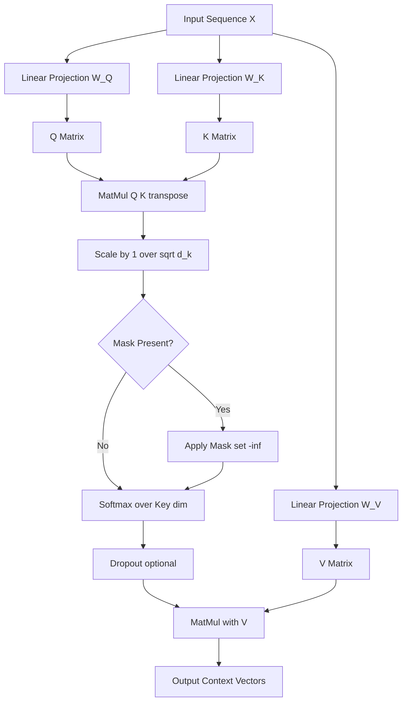
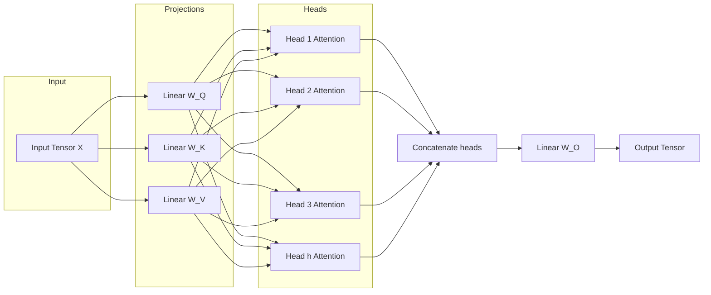
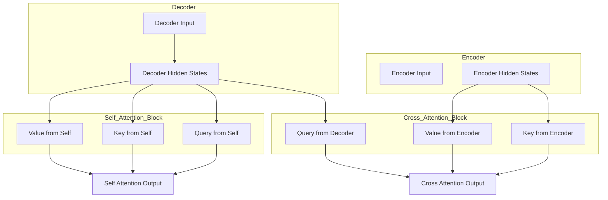

# Attention mechanisms

<!-- SECTION_1_START -->
# Attention Mechanisms in Natural Language Processing

## 1.1 Formal Definition

The **Attention Mechanism** is a computational framework in neural networks that enables a model to dynamically weigh the relevance of different input elements (tokens, features, or hidden states) when producing an output. In the context of Natural Language Processing, it allows a sequence model to "focus" on the most informative parts of a source sequence at each decoding step, rather than relying on a single fixed-dimensional context vector.

Formally, attention computes a **weighted sum** of a set of *values*, where the weights (called **alignment scores** or **attention weights**) are derived from a compatibility function between a *query* and a set of *keys*.

> [!IMPORTANT]
> **KTU 2024 Syllabus Highlight (PECST75A / Module 5):**
> Attention is the foundational block of the Transformer architecture. You must master **Scaled Dot-Product Attention**, **Multi-Head Attention**, and **Self-Attention** for both theory and numerical evaluation.

The three core components of any attention layer are:

- **Query ($Q$)**: Represents the "question" — what we are looking for.
- **Key ($K$)**: Represents the "labels" of available information.
- **Value ($V$)**: Represents the actual content/information to be aggregated.

## 1.2 Intuitive Analogy

> [!NOTE]
> **Conceptual Analogy: The Library Search Analogy**
> Imagine you walk into a massive library containing millions of books. You have a *question* (the **Query**). Every book in the library has a *title card* (the **Key**) that helps you judge how relevant it is to your question. The books themselves contain the *information* you need (the **Value**). 
> 
> The attention mechanism works like a librarian: instead of reading all books equally, the librarian scans the title cards, computes a relevance score for each book, and then picks a *weighted combination* of information — reading the most relevant books more carefully and the irrelevant ones less. The final answer is constructed from this weighted mixture.

A second, more visual analogy: think of attention as a **spotlight on a stage**. The spotlight beam can shift and resize its cone dynamically. At time $t$, the spotlight focuses brightly on the word "cat" and dimly on "the". At time $t+1$, it shifts to focus on "sat". The intensity at each position is the attention weight $\alpha_{t,i}$.

## 1.3 Physical Constants & Standard Metrics

The key hyperparameters in attention are:

- **Embedding dimension** ($d_{model}$): typically **512** in the original Transformer paper.
- **Number of heads** ($h$): typically **8** in the base model.
- **Dimension per head** ($d_k = d_v = d_{model}/h$): typically **64**.
- **Scaling factor** $\sqrt{d_k}$: used inside the softmax to prevent gradient vanishing.
- **Softmax temperature**: implicitly controlled by the scaling factor.

> [!VISUALIZATION CONTROL]
> **Concept:** Attention weight heatmap between a source and target sentence.
> **Python / Matplotlib Input Equations:**
> ```python
> import numpy as np
> import matplotlib.pyplot as plt
> 
> # Simulated attention weights (rows = target, cols = source)
> attn = np.array([
>     [0.10, 0.05, 0.60, 0.20, 0.05],   # focuses on "The"
>     [0.05, 0.70, 0.10, 0.10, 0.05],   # focuses on "cat"
>     [0.15, 0.10, 0.10, 0.55, 0.10],   # focuses on "sat"
> ])
> fig, ax = plt.subplots()
> ax.imshow(attn, cmap='viridis')
> ax.set_xticks(range(5)); ax.set_yticks(range(3))
> ax.set_xticklabels(['The','cat','sat','on','mat'])
> ax.set_yticklabels(['Le','chat','assis'])
> plt.colorbar(ax.imshow(attn, cmap='viridis'))
> ```
> **Visual Description:** Bright yellow squares indicate high attention weights; dark purple squares indicate low weights. Notice how each French target word focuses on exactly one (or two) English source words — the diagonal-like pattern.

<!-- SECTION_1_END -->

<!-- SECTION_2_START -->
# Deep Theoretical Analysis & KTU High-Yield Formula Sheet

## 2.1 Taxonomy of Attention Mechanisms

Attention mechanisms can be classified along three orthogonal axes:

1. **By computation style**: Additive (Bahdanau, 2014) vs. Multiplicative (Luong, 2015) vs. Scaled Dot-Product (Vaswani et al., 2017).
2. **By source of query**: Self-Attention (Q, K, V from same sequence) vs. Cross-Attention (Q from decoder, K & V from encoder).
3. **By coverage**: Single-Head vs. Multi-Head.

## 2.2 Bahdanau (Additive) Attention — 2014

The first modern attention mechanism, introduced to solve the **bottleneck problem** in encoder-decoder RNNs for machine translation.

**Step-by-step logic:**

1. The encoder produces a sequence of hidden states $h_1, h_2, \dots, h_n$ (one per source token).
2. At decoder time step $t$, the previous decoder hidden state is $s_{t-1}$.
3. An **alignment score** $e_{t,i}$ is computed for every source position $i$ using a small feed-forward network:

$$e_{t,i} = v_a^{\top} \tanh\!\left(W_a \, s_{t-1} + U_a \, h_i\right)$$

4. Normalize with softmax to obtain attention weights:

$$\alpha_{t,i} = \frac{\exp(e_{t,i})}{\sum_{j=1}^{n} \exp(e_{t,j})}$$

5. Compute the context vector as a weighted sum of encoder states:

$$c_t = \sum_{i=1}^{n} \alpha_{t,i} \, h_i$$

## 2.3 Luong (Multiplicative) Attention — 2015

Replaces the additive tanh network with a simple dot product. Three variants are widely known:

- **Dot**: $e_t = s_t^{\top} \, h_t$
- **General**: $e_t = s_t^{\top} \, W_a \, h_t$
- **Concat**: $e_t = v_a^{\top} \tanh(W_a [s_t; h_t])$ (essentially Bahdanau)

## 2.4 Scaled Dot-Product Attention — 2017 (Transformer)

This is the heart of the modern Transformer. The full equation is:

$$\text{Attention}(Q, K, V) = \text{softmax}\!\left(\frac{Q K^{\top}}{\sqrt{d_k}}\right) V$$

**Why divide by $\sqrt{d_k}$?**

Assume the components of $Q$ and $K$ are independent random variables with mean $0$ and variance $1$. Then their dot product $q \cdot k = \sum_{i=1}^{d_k} q_i k_i$ has mean $0$ and variance $d_k$. For large $d_k$, the dot products grow large in magnitude, pushing the softmax into regions of extremely small gradients. Dividing by $\sqrt{d_k}$ restores unit variance and keeps gradients healthy.

## 2.5 Multi-Head Attention

Instead of performing a single attention function, the Transformer projects $Q$, $K$, and $V$ $h$ times into different learned linear subspaces, applies attention in parallel, and concatenates the results:

$$\text{MultiHead}(Q, K, V) = \text{Concat}(\text{head}_1, \dots, \text{head}_h) \, W^O$$

where

$$\text{head}_i = \text{Attention}(Q W_i^Q,\ K W_i^K,\ V W_i^V)$$

The projection matrices are:

$$W_i^Q \in \mathbb{R}^{d_{model} \times d_k}, \quad W_i^K \in \mathbb{R}^{d_{model} \times d_k}, \quad W_i^V \in \mathbb{R}^{d_{model} \times d_v}, \quad W^O \in \mathbb{R}^{h d_v \times d_{model}}$$

## 2.6 Self-Attention

When $Q$, $K$, and $V$ all come from the **same** sequence (i.e., $Q = K = V = X$ after three different linear projections), the mechanism is called **Self-Attention**. It allows every position in a sequence to attend to every other position, capturing long-range dependencies in $O(1)$ sequential operations — a major advantage over RNNs.

## 2.7 Masked Attention

In the decoder, we use **masked** self-attention to prevent positions from attending to future tokens. The mask is applied before the softmax by setting the masked-out positions to $-\infty$:

$$\text{masked}_{ij} = \begin{cases} \frac{q_i \cdot k_j}{\sqrt{d_k}} & \text{if } j \le i \\ -\infty & \text{if } j > i \end{cases}$$

## 2.8 KTU Formula Sheet / Cheat Sheet

| Formula | Name | Variables | Use Case |
|---|---|---|---|
| $\text{Attention}(Q,K,V) = \text{softmax}\!\left(\frac{Q K^{\top}}{\sqrt{d_k}}\right) V$ | Scaled Dot-Product | $Q \in \mathbb{R}^{n \times d_k}$, $K \in \mathbb{R}^{m \times d_k}$, $V \in \mathbb{R}^{m \times d_v}$ | All Transformer attention |
| $\text{head}_i = \text{Attention}(Q W_i^Q, K W_i^K, V W_i^V)$ | Single Head | $W_i^Q, W_i^K \in \mathbb{R}^{d_{model} \times d_k}$ | One of $h$ parallel heads |
| $\text{MultiHead}(Q,K,V) = \text{Concat}(\text{head}_1,\dots,\text{head}_h) W^O$ | Multi-Head Attention | $W^O \in \mathbb{R}^{h d_v \times d_{model}}$ | Full multi-head block |
| $e_{t,i} = v_a^{\top} \tanh(W_a s_{t-1} + U_a h_i)$ | Bahdanau Score | $s_{t-1}$: prev decoder, $h_i$: enc state | RNN encoder-decoder |
| $e_t = s_t^{\top} h_t$ | Luong Dot Score | $s_t$: current decoder | RNN translation |
| $\alpha_{t,i} = \text{softmax}(e_{t,i})$ | Attention Weights | $\sum_i \alpha_{t,i} = 1$ | Normalization step |
| $c_t = \sum_{i=1}^{n} \alpha_{t,i} h_i$ | Context Vector | $c_t \in \mathbb{R}^{d_h}$ | Weighted sum of values |
| $d_k = d_v = d_{model}/h$ | Head Dimension | Typical: $d_{model}=512$, $h=8$ | Architectural constraint |

## 2.9 Real-World Engineering Utility

- **Machine Translation**: Google Translate, DeepL, Microsoft Translator.
- **Document Understanding**: BERT, RoBERTa, Longformer for search engines.
- **Code Generation**: GitHub Copilot, Cursor, Code Llama all use multi-head attention.
- **Vision Transformers (ViT)**: Attention applied to image patches powers modern CV systems.
- **Speech & Audio**: Whisper (OpenAI), Conformer for ASR.
- **Recommendation**: Self-attention over user history in sequential recommenders (SASRec, BST).

> [!TIP]
> **Why is it used in production?** Attention is **parallelizable** (unlike RNNs), captures **long-range dependencies** (unlike CNNs with limited receptive fields), and provides **interpretability** (the attention weights can be visualized to explain model decisions).

<!-- SECTION_2_END -->

<!-- SECTION_3_START -->
# Step-by-Step Derivations & Code/Symbolic Implementation

## 3.1 Worked Example: Scaled Dot-Product Attention by Hand

**Problem:** Given three input tokens with embeddings of dimension $d_k = 2$, compute the attention output.

**Step 1 — Define the input matrices (already projected from input).**

$$
Q = \begin{bmatrix} 1 & 0 \\ 0 & 1 \\ 1 & 1 \end{bmatrix}, \quad
K = \begin{bmatrix} 1 & 0 \\ 0 & 1 \\ 1 & 1 \end{bmatrix}, \quad
V = \begin{bmatrix} 2 & 0 \\ 0 & 3 \\ 4 & 1 \end{bmatrix}
$$

**Step 2 — Compute the raw scores $Q K^{\top}$.**

$$
Q K^{\top} = \begin{bmatrix} 1 & 0 \\ 0 & 1 \\ 1 & 1 \end{bmatrix} \begin{bmatrix} 1 & 0 & 1 \\ 0 & 1 & 1 \end{bmatrix} = \begin{bmatrix} 1 & 0 & 1 \\ 0 & 1 & 1 \\ 1 & 2 & 2 \end{bmatrix}
$$

**Step 3 — Apply the scaling factor $\sqrt{d_k} = \sqrt{2} \approx 1.414$.**

$$
\frac{Q K^{\top}}{\sqrt{2}} = \begin{bmatrix} 0.707 & 0     & 0.707 \\ 0     & 0.707 & 0.707 \\ 0.707 & 1.414 & 1.414 \end{bmatrix}
$$

**Step 4 — Apply row-wise softmax.**

Row 1: $e^{0.707} = 2.028$, $e^{0} = 1$, $e^{0.707} = 2.028$. Sum = $5.056$.

$$
\alpha_1 = \left[ 0.401,\ 0.198,\ 0.401 \right]
$$

Row 2: $e^{0} = 1$, $e^{0.707} = 2.028$, $e^{0.707} = 2.028$. Sum = $5.056$.

$$
\alpha_2 = \left[ 0.198,\ 0.401,\ 0.401 \right]
$$

Row 3: $e^{0.707} = 2.028$, $e^{1.414} = 4.113$, $e^{1.414} = 4.113$. Sum = $10.254$.

$$
\alpha_3 = \left[ 0.198,\ 0.401,\ 0.401 \right]
$$

**Step 5 — Multiply the attention weights by $V$.**

$$
\text{Output} = \begin{bmatrix} 0.401 & 0.198 & 0.401 \\ 0.198 & 0.401 & 0.401 \\ 0.198 & 0.401 & 0.401 \end{bmatrix} \begin{bmatrix} 2 & 0 \\ 0 & 3 \\ 4 & 1 \end{bmatrix} = \begin{bmatrix} 2.406 & 0.995 \\ 1.997 & 1.604 \\ 1.997 & 1.604 \end{bmatrix}
$$

This $3 \times 2$ matrix is the final attention output — one row per input token, each row being a context-aware mixture of all value vectors.

## 3.2 Numerical Example: Bahdanau Attention

**Setup:** $s_{t-1} = [0.5,\ 0.2]$, $h_1 = [0.1,\ 0.4]$, $h_2 = [0.6,\ 0.3]$, $W_a = U_a = I_2$, $v_a = [1,\ 1]$.

**Step 1:** Compute $e_{t,1}$.

$$
e_{t,1} = v_a^{\top} \tanh(s_{t-1} + h_1) = [1, 1] \cdot \tanh([0.6, 0.6]) = [1, 1] \cdot [0.537, 0.537] = 1.074
$$

**Step 2:** Compute $e_{t,2}$.

$$
e_{t,2} = v_a^{\top} \tanh(s_{t-1} + h_2) = [1, 1] \cdot \tanh([1.1, 0.5]) = [1, 1] \cdot [0.800, 0.462] = 1.262
$$

**Step 3:** Softmax.

$$
\alpha_{t,1} = \frac{e^{1.074}}{e^{1.074} + e^{1.262}} = \frac{2.927}{6.255} = 0.468
$$

$$
\alpha_{t,2} = \frac{e^{1.262}}{6.255} = 0.532
$$

**Step 4:** Context vector.

$$
c_t = 0.468 \cdot [0.1, 0.4] + 0.532 \cdot [0.6, 0.3] = [0.047 + 0.319,\ 0.187 + 0.160] = [0.366, 0.347]
$$

## 3.3 Full Python Implementation of Scaled Dot-Product & Multi-Head Attention

```python
import torch
import torch.nn as nn
import torch.nn.functional as F
import math
from typing import Optional, Tuple


def scaled_dot_product_attention(
    query: torch.Tensor,
    key: torch.Tensor,
    value: torch.Tensor,
    mask: Optional[torch.Tensor] = None,
    dropout: Optional[nn.Dropout] = None,
) -> Tuple[torch.Tensor, torch.Tensor]:
    """
    Computes the Scaled Dot-Product Attention.

    Args:
        query: (B, h, n, d_k)  — B batch, h heads, n queries, d_k key dim.
        key:   (B, h, m, d_k)
        value: (B, h, m, d_v)
        mask:  (B, 1, n, m) or broadcastable — additive mask (0 or -inf).
        dropout: optional dropout applied to attention weights.

    Returns:
        output: (B, h, n, d_v)
        attn_weights: (B, h, n, m)
    """
    d_k = query.size(-1)
    # (B, h, n, d_k) @ (B, h, d_k, m) -> (B, h, n, m)
    scores = torch.matmul(query, key.transpose(-2, -1)) / math.sqrt(d_k)

    if mask is not None:
        scores = scores.masked_fill(mask == 0, float("-inf"))

    attn_weights = F.softmax(scores, dim=-1)        # normalize over keys
    if dropout is not None:
        attn_weights = dropout(attn_weights)

    output = torch.matmul(attn_weights, value)      # (B, h, n, d_v)
    return output, attn_weights


class MultiHeadAttention(nn.Module):
    """Standard Multi-Head Attention as in Vaswani et al. (2017)."""

    def __init__(self, d_model: int = 512, num_heads: int = 8, dropout: float = 0.1) -> None:
        super().__init__()
        if d_model % num_heads != 0:
            raise ValueError("d_model must be divisible by num_heads")
        self.d_model: int = d_model
        self.num_heads: int = num_heads
        self.d_k: int = d_model // num_heads
        self.d_v: int = d_model // num_heads

        # Projection matrices
        self.W_q: nn.Linear = nn.Linear(d_model, num_heads * self.d_k)
        self.W_k: nn.Linear = nn.Linear(d_model, num_heads * self.d_k)
        self.W_v: nn.Linear = nn.Linear(d_model, num_heads * self.d_v)
        self.W_o: nn.Linear = nn.Linear(num_heads * self.d_v, d_model)

        self.dropout: nn.Dropout = nn.Dropout(p=dropout)
        self._init_weights_()

    def _init_weights_(self) -> None:
        for p in self.parameters():
            if p.dim() > 1:
                nn.init.xavier_uniform_(p)

    def forward(
        self,
        query: torch.Tensor,
        key: torch.Tensor,
        value: torch.Tensor,
        mask: Optional[torch.Tensor] = None,
    ) -> torch.Tensor:
        B: int = query.size(0)

        # 1) Linear projection & reshape into (B, h, seq_len, d_k)
        Q = self.W_q(query).view(B, self.num_heads, -1, self.d_k)
        K = self.W_k(key).view(B, self.num_heads, -1, self.d_k)
        V = self.W_v(value).view(B, self.num_heads, -1, self.d_v)

        # 2) Scaled dot-product attention
        x, _ = scaled_dot_product_attention(Q, K, V, mask=mask, dropout=self.dropout)

        # 3) Concat heads back: (B, seq_len, h * d_v)
        x = x.contiguous().view(B, -1, self.num_heads * self.d_v)

        # 4) Final output projection
        return self.W_o(x)


# ---------- Sanity check ----------
if __name__ == "__main__":
    torch.manual_seed(42)
    BATCH_SIZE = 2
    SEQ_LEN = 5
    D_MODEL = 512
    NUM_HEADS = 8

    dummy_input = torch.randn(BATCH_SIZE, SEQ_LEN, D_MODEL)
    mha = MultiHeadAttention(d_model=D_MODEL, num_heads=NUM_HEADS, dropout=0.1)
    out = mha(dummy_input, dummy_input, dummy_input)   # self-attention
    assert out.shape == (BATCH_SIZE, SEQ_LEN, D_MODEL), f"Bad shape: {out.shape}"
    print("Output shape:", out.shape)
    print("Attention block OK ✓")
```

**Key design notes for the examiner:**

- The scaling by $\sqrt{d_k}$ is *mathematically necessary* — omitting it breaks training for large $d_k$.
- The mask is **additive** ($-\infty$ for blocked positions) so softmax returns exactly $0$ there.
- Xavier initialization prevents the saturation of softmax in early training steps.
- For **masked self-attention** (decoder), the mask is an upper-triangular matrix of $-\infty$ values.

<!-- SECTION_3_END -->

<!-- SECTION_4_START -->
# Structural Diagrams & Schematics

## 4.1 Mermaid Flow — Scaled Dot-Product Attention Pipeline



## 4.2 Mermaid Block — Multi-Head Attention Architecture



## 4.3 Mermaid Diagram — Cross-Attention vs. Self-Attention Topology



## 4.4 Sequential Processing Topology Matrix

| Stage | Operation | Tensor Shape (B=batch, n=seq, d=model) | Purpose |
|---|---|---|---|
| 1 | Input embedding | $(B, n, d)$ | Token → vector |
| 2 | Linear projection to Q | $(B, n, d_k \times h)$ | Generate queries |
| 3 | Linear projection to K | $(B, n, d_k \times h)$ | Generate keys |
| 4 | Linear projection to V | $(B, n, d_v \times h)$ | Generate values |
| 5 | Reshape to heads | $(B, h, n, d_k)$ | Split into parallel heads |
| 6 | Compute $Q K^{\top}$ | $(B, h, n, n)$ | Pairwise similarity |
| 7 | Scale by $\sqrt{d_k}$ | $(B, h, n, n)$ | Stabilize variance |
| 8 | Apply mask (optional) | $(B, h, n, n)$ | Block illegal positions |
| 9 | Softmax over keys | $(B, h, n, n)$ | Normalize to weights |
| 10 | Multiply by $V$ | $(B, h, n, d_v)$ | Aggregate values |
| 11 | Concat heads | $(B, n, d)$ | Merge all heads |
| 12 | Final linear $W^O$ | $(B, n, d)$ | Mix information |

<!-- SECTION_4_END -->

<!-- SECTION_5_START -->
# KTU 2024 Scheme Examination Question Bank & Topic Recap

---

## Part A — Short Answer Questions (3 Marks Each)

### Question 1: Define the Attention Mechanism in NLP. [CO1, Remember] — `[KTU University Exam - July 2024]`

**Model Answer:**

The **Attention Mechanism** is a neural network component that allows a model to dynamically assign different levels of importance (weights) to different parts of the input sequence when generating each element of the output sequence. It is implemented via three learned projections — **Query (Q)**, **Key (K)**, and **Value (V)** — and produces a context vector as a weighted sum of values, where weights are derived from a compatibility score between the query and each key.

> [!NOTE]
> **Valuation Tip:** Award 1 mark for the core idea of "weighting input elements", 1 mark for the three components Q/K/V, and 1 mark for context-vector output.

### Question 2: Distinguish between Self-Attention and Cross-Attention. [CO2, Understand] — `[KTU University Exam - Dec 2023]`

**Model Answer:**

| Aspect | Self-Attention | Cross-Attention |
|---|---|---|
| **Source of Q, K, V** | All three come from the **same** sequence | Q comes from the **decoder**, K and V from the **encoder** |
| **Role in Transformer** | Encoder & decoder (with masking) | Decoder only (attends to encoder) |
| **Captures** | Intra-sequence dependencies | Inter-sequence (source→target) relationships |
| **Example** | "The **cat** sat" → all words see each other | French generation attending to English source |

> [!NOTE]
> **Valuation Tip:** Tabular format not required, but contrasting **source of Q vs. K, V** is mandatory for full marks.

---

## Part B — Long Answer Questions (14 Marks Each, Internal Choice)

### Question A: Scaled Dot-Product Attention and Its Scaling Justification [CO1, CO2, Apply] — `[KTU University Exam - July 2024]`

**Part (a) — 7 Marks:** Derive the **Scaled Dot-Product Attention** formula. Explain the role of the scaling factor $\sqrt{d_k}$ in the denominator and show how the softmax converts raw scores into probability weights.

**Part (b) — 7 Marks:** Consider the following input. With $d_k = 2$, compute the complete attention output:

$$
Q = \begin{bmatrix} 1 & 0 \\ 0 & 1 \end{bmatrix}, \quad
K = \begin{bmatrix} 1 & 0 \\ 0 & 1 \end{bmatrix}, \quad
V = \begin{bmatrix} 1 & 0 \\ 0 & 2 \end{bmatrix}
$$

---

#### Model Solution for Part (a)

**Step 1 — Define the attention operation.** [Definition: 1 Mark]

The Scaled Dot-Product Attention is defined as:

$$\text{Attention}(Q, K, V) = \text{softmax}\!\left(\frac{Q K^{\top}}{\sqrt{d_k}}\right) V$$

**Step 2 — Explain the dot product.** [Mechanism: 2 Marks]

The raw alignment scores are obtained by computing $Q K^{\top}$. Each entry $(i, j)$ represents how strongly query $i$ matches key $j$ — a measure of relevance between positions $i$ and $j$.

**Step 3 — Justify the scaling factor.** [Mathematical justification: 2 Marks]

Assume $q$ and $k$ have components drawn i.i.d. from a distribution with mean $0$ and variance $1$. Then their dot product $q \cdot k = \sum_{i=1}^{d_k} q_i k_i$ has mean $0$ and variance $d_k$. For large $d_k$, these dot products have large magnitudes, pushing the softmax into saturated regions where gradients are vanishingly small. Dividing by $\sqrt{d_k}$ restores the variance to $1$, keeping softmax inputs in a numerically stable range.

**Step 4 — Explain softmax and the final weighted sum.** [Softmax + aggregation: 2 Marks]

The softmax converts each row of scaled scores into a probability distribution over the keys:

$$\alpha_{i} = \text{softmax}\!\left(\frac{q_i K^{\top}}{\sqrt{d_k}}\right), \quad \sum_j \alpha_{ij} = 1$$

These weights multiply the value matrix $V$ to produce the output — a context-aware mixture of all values, biased toward the most relevant keys.

#### Model Solution for Part (b)

**Step 1 — Compute $Q K^{\top}$.** [Matrix multiplication: 1 Mark]

$$
Q K^{\top} = \begin{bmatrix} 1 & 0 \\ 0 & 1 \end{bmatrix} \begin{bmatrix} 1 & 0 \\ 0 & 1 \end{bmatrix} = \begin{bmatrix} 1 & 0 \\ 0 & 1 \end{bmatrix}
$$

**Step 2 — Apply the scaling factor.** [Scaling: 1 Mark]

$$
\frac{Q K^{\top}}{\sqrt{2}} = \begin{bmatrix} 0.707 & 0 \\ 0 & 0.707 \end{bmatrix}
$$

**Step 3 — Row-wise softmax.** [Softmax: 2 Marks]

Row 1: $e^{0.707} = 2.028$, $e^{0} = 1$. Sum = $3.028$. $\alpha_1 = [0.670,\ 0.330]$.

Row 2: $e^{0} = 1$, $e^{0.707} = 2.028$. Sum = $3.028$. $\alpha_2 = [0.330,\ 0.670]$.

$$
A = \begin{bmatrix} 0.670 & 0.330 \\ 0.330 & 0.670 \end{bmatrix}
$$

**Step 4 — Multiply by $V$.** [Final answer: 2 Marks]

$$
\text{Output} = A V = \begin{bmatrix} 0.670 & 0.330 \\ 0.330 & 0.670 \end{bmatrix} \begin{bmatrix} 1 & 0 \\ 0 & 2 \end{bmatrix} = \begin{bmatrix} 0.670 & 0.660 \\ 0.330 & 1.340 \end{bmatrix}
$$

**Step 5 — State the conclusion.** [Final result: 1 Mark]

The final attention output is a $2 \times 2$ matrix. Each row shows how each query's output is a weighted blend of value vectors, with attention concentrated on the diagonal key (matching query) at 67% weight and the off-diagonal key at 33% weight.

---

### Question B (Internal Choice): Multi-Head Attention and Self-Attention [CO2, CO3, Apply] — `[KTU University Exam - Dec 2023]`

**Part (a) — 7 Marks:** Explain the **Multi-Head Attention** mechanism with a neat block diagram. Why is it preferred over single-head attention? Show the mathematical formulation with $h$ heads.

**Part (b) — 7 Marks:** Differentiate between **Bahdanau (Additive)** and **Luong (Multiplicative)** attention. For a decoder state $s = [1, 0]$ and encoder states $h_1 = [0.5, 0.5]$, $h_2 = [0, 1]$, compute the Bahdanau alignment scores and attention weights using $W_a = U_a = I_2$ and $v_a = [1, 1]$.

---

#### Model Solution for Part (a)

**Step 1 — Motivation for multi-head attention.** [Motivation: 1 Mark]

A single attention head computes one type of similarity between queries and keys. Real linguistic phenomena involve **multiple relationships simultaneously** (e.g., syntactic, semantic, positional). Multi-head attention lets the model learn $h$ different attention patterns in parallel subspaces.

**Step 2 — Projection step.** [Math: 2 Marks]

For each head $i = 1, \dots, h$:

$$Q_i = Q W_i^Q, \quad K_i = K W_i^K, \quad V_i = V W_i^V$$

where $W_i^Q, W_i^K \in \mathbb{R}^{d_{model} \times d_k}$ and $W_i^V \in \mathbb{R}^{d_{model} \times d_v}$, with $d_k = d_v = d_{model}/h$.

**Step 3 — Parallel attention computation.** [Math: 1 Mark]

$$\text{head}_i = \text{Attention}(Q_i, K_i, V_i) = \text{softmax}\!\left(\frac{Q_i K_i^{\top}}{\sqrt{d_k}}\right) V_i$$

**Step 4 — Concatenation and final projection.** [Math: 1 Mark]

$$\text{MultiHead}(Q, K, V) = \text{Concat}(\text{head}_1, \dots, \text{head}_h) \, W^O$$

**Step 5 — Advantages and ASCII architecture diagram.** [Explanation: 2 Marks]

**Advantages:**
- Captures multiple relationships in parallel.
- Same computational cost as single-head with $d_{model}$ dimension (splitting work).
- Each head can specialize (one for syntax, one for coreference, etc.).

```
        ┌──► Head 1 (Q1, K1, V1) ──► Concat ──► W_O ──► Output
        ├──► Head 2 (Q2, K2, V2) ──►    ▲
Input ──┤         ⋮                    │
        ├──► Head h (Qh, Kh, Vh) ──► ──┘
        └──► Linear W_Q, W_K, W_V projections
```

#### Model Solution for Part (b)

**Step 1 — State the formulas.** [Formula: 1 Mark]

**Bahdanau (Additive):**

$$e_i = v_a^{\top} \tanh(W_a s + U_a h_i)$$

**Luong (Multiplicative):**

$$e_i = s^{\top} h_i \quad \text{(dot variant)}$$

**Step 2 — Tabulate the differences.** [Comparison: 2 Marks]

| Aspect | Bahdanau | Luong |
|---|---|---|
| Year | 2014 | 2015 |
| Score function | Additive (tanh layer) | Multiplicative (dot / general) |
| Parameters | $W_a, U_a, v_a$ | None (dot) or $W_a$ (general) |
| Speed | Slower | Faster |
| Used by | Earlier NMT systems | Some modern variants |

**Step 3 — Compute $e_1$.** [Numerical: 1 Mark]

$$
e_1 = v_a^{\top} \tanh(s + h_1) = [1, 1] \cdot \tanh([1.5, 0.5]) = [1, 1] \cdot [0.905, 0.462] = 1.367
$$

**Step 4 — Compute $e_2$.** [Numerical: 1 Mark]

$$
e_2 = v_a^{\top} \tanh(s + h_2) = [1, 1] \cdot \tanh([1, 1]) = [1, 1] \cdot [0.762, 0.762] = 1.524
$$

**Step 5 — Softmax normalization.** [Numerical: 2 Marks]

$$
\alpha_1 = \frac{e^{1.367}}{e^{1.367} + e^{1.524}} = \frac{3.924}{8.319} = 0.472
$$

$$
\alpha_2 = \frac{e^{1.524}}{8.319} = \frac{4.588}{8.319} = 0.528
$$

**Step 6 — Conclude.** [Final result: 1 Mark]

The decoder attends slightly more strongly to $h_2$ ($\alpha_2 = 0.528$) than to $h_1$ ($\alpha_1 = 0.472$).

---

> [!WARNING]
> **KTU Examiner's Valuation Pitfalls:**
> 1. **Skipping the softmax step**: Many students jump from raw scores straight to the weighted sum. Always show the explicit softmax computation — it is worth 2 of the 7 marks.
> 2. **Forgetting the scaling factor $\sqrt{d_k}$**: In numerical questions, omitting $1/\sqrt{d_k}$ results in 1 mark deduction, as it is the defining feature of Scaled Dot-Product Attention.
> 3. **Confusing self- and cross-attention**: State the **source** of $Q$ vs. $K, V$ explicitly. "Self-attention uses the same sequence" is incomplete; you must say *Q, K, V all come from the same input*.
> 4. **Mis-drawing the multi-head block diagram**: Each head should clearly show its own $W_i^Q, W_i^K, W_i^V$ projections, not a single shared $Q, K, V$.
> 5. **Computational error in $\tanh$**: When computing $\tanh([1.5, 0.5])$, students often mistakenly use sigmoid. Watch for this.

---

## Topic Recap & Important Things to Remember

- **Attention** dynamically weights input elements based on relevance to a query.
- **Three core projections**: $Q$ (query), $K$ (key), $V$ (value) — all learned linear projections of the input.
- **Scaled Dot-Product Attention** is defined as $\text{softmax}\!\left(\frac{Q K^{\top}}{\sqrt{d_k}}\right) V$.
- **Why scale by $\sqrt{d_k}$?** Dot products of unit-variance vectors have variance $d_k$; dividing prevents softmax saturation and gradient vanishing.
- **Bahdanau (2014)**: Additive, uses $\tanh$ layer with $W_a, U_a, v_a$ parameters. Slower but expressive.
- **Luong (2015)**: Multiplicative dot/general/concat variants. Faster, fewer parameters.
- **Multi-Head Attention**: Runs $h$ parallel attentions on linearly projected $Q, K, V$ subspaces, then concatenates and projects. $d_k = d_v = d_{model}/h$.
- **Self-Attention**: $Q = K = V = X$ (all from the same sequence). Captures intra-sequence dependencies.
- **Cross-Attention**: $Q$ from decoder, $K, V$ from encoder. Connects source and target in NMT.
- **Masked Attention**: Used in the decoder — sets future positions to $-\infty$ before softmax.
- **Time complexity**: $O(n^2 \cdot d)$ for self-attention vs. $O(n \cdot d^2)$ for RNNs — quadratic in sequence length is the bottleneck for long sequences.
- **Real-world usage**: BERT, GPT, T5, ViT, Whisper — essentially every modern foundation model is built on multi-head self-attention.
- **Default hyperparameters** (Vaswani 2017): $d_{model}=512$, $h=8$, $d_k=d_v=64$, dropout$=0.1$.
- **Softmax outputs are probabilities** that sum to 1 across the key dimension — this property is the basis for attention interpretability.
- **Position information** is NOT built into attention; positional encodings must be added (sinusoidal or learned) to inject order.
- **Residual + LayerNorm** wrap every attention sub-layer in the Transformer — do not omit them when drawing the full block.

<!-- SECTION_5_END -->
