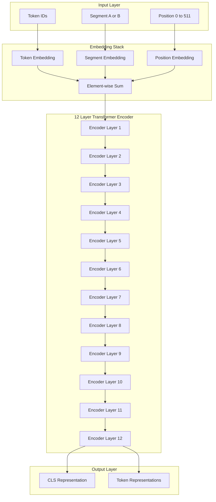
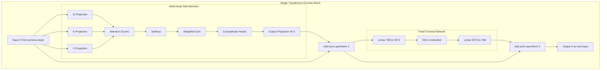
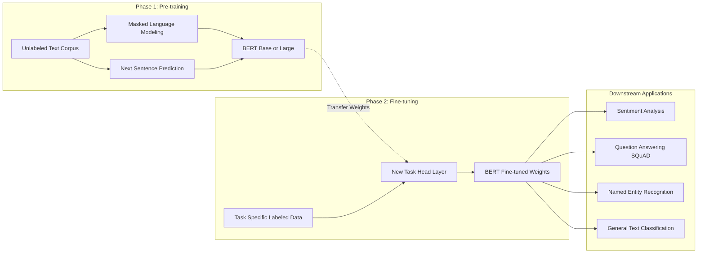
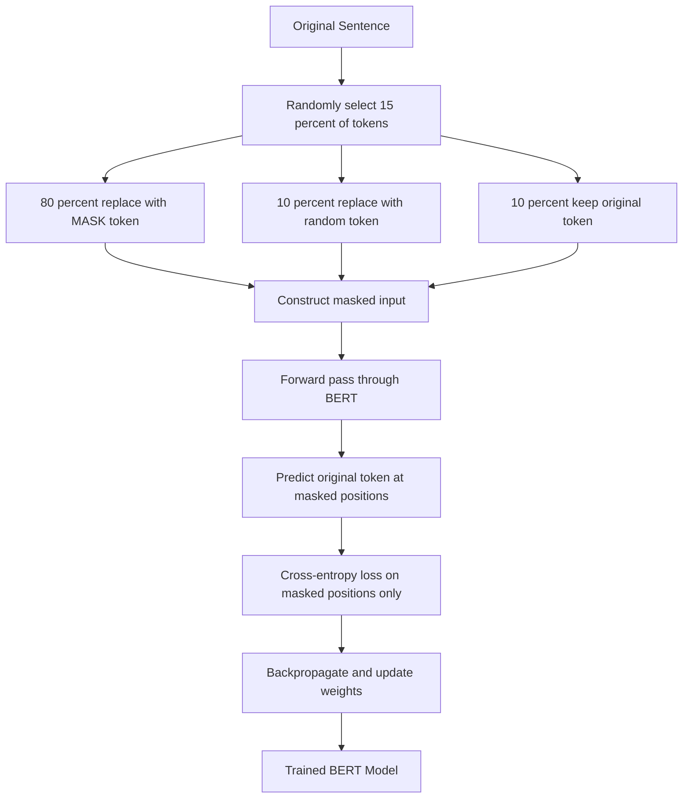
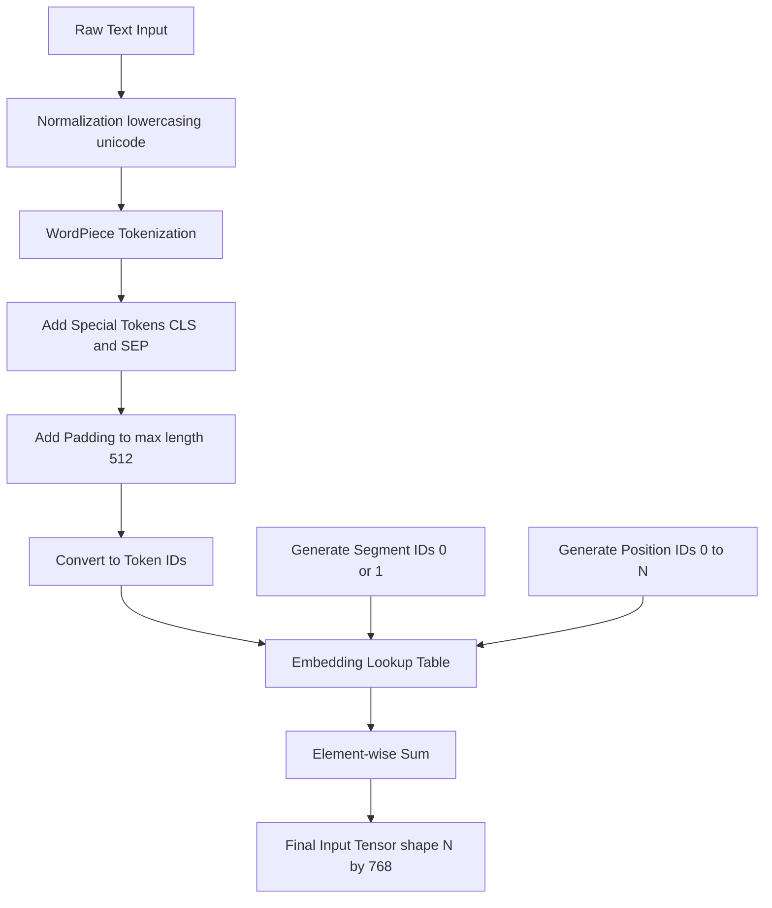

# BERT

<!-- SECTION_1_START -->

# BERT: Bidirectional Encoder Representations from Transformers

## 1. Core Technical Definition & Intuitive Overview

**BERT (Bidirectional Encoder Representations from Transformers)** is a pre-trained deep bidirectional transformer encoder model introduced by Google Research in 2018 (Devlin et al., "BERT: Pre-training of Deep Bidirectional Transformers for Language Understanding"). It is designed to pre-train deep bidirectional representations from unlabeled text by jointly conditioning on both left and right context in all layers.

> [!IMPORTANT]
> **KTU 2024 Syllabus Definition:**
> BERT is a pre-trained language representation model that uses a multi-layer bidirectional Transformer encoder. The "bidirectional" nature means the model jointly processes context from both left-to-right and right-to-left directions simultaneously, unlike traditional sequential models.

### Conceptual Analogy / Intuition

Imagine reading a sentence where you can see **the entire sentence at once**, with no left-to-right or right-to-left restriction. To understand the word **"bank"** in *"I deposited money in the bank by the river bank"*, you instantly use both contexts:
- Left context: *"deposited money"* → suggests financial institution
- Right context: *"by the river"* → suggests river bank

**BERT does exactly this** — it reads the entire sentence simultaneously (in both directions) to deeply understand each word's meaning in context.

> [!NOTE]
> **Key Innovation Over Prior Models:**
> - **ELMo** (BiLSTM-based): Shallow bidirectionality (concatenates left-to-right and right-to-left)
> - **GPT** (Transformer): Unidirectional (left-to-right only)
> - **BERT** (Transformer): **Truly deep bidirectional** — context flows both ways in *every layer*

### BERT Model Variants

| Variant | Layers $L$ | Hidden Size $H$ | Attention Heads $A$ | Parameters |
|---------|:----------:|:---------------:|:-------------------:|:----------:|
| **BERT$_{\text{BASE}}$** | **12** | **768** | **12** | **110M** |
| **BERT$_{\text{LARGE}}$** | **24** | **1024** | **16** | **340M** |

> [!TIP]
> **For KTU Exams:** Remember that BERT$_{\text{BASE}}$ has **12 encoder layers, 768 hidden units, 12 attention heads, and ~110 million parameters**. This is the most frequently asked configuration.

### Physical Constants & Architectural Metrics

- **Vocabulary Size:** $V = 30{,}522$ WordPiece tokens
- **Maximum Sequence Length:** $N_{\max} = 512$ tokens
- **Position Embedding Type:** Learned absolute (up to 512 positions)
- **Activation Function:** **GELU** (Gaussian Error Linear Unit)
- **Pre-training Corpus:** **BookCorpus (800M words) + English Wikipedia (2.5B words)**

### Input Representation

BERT's input embedding is a **sum of three embeddings**:

$$E_{\text{input}} = E_{\text{token}} + E_{\text{segment}} + E_{\text{position}}$$

Where:
- $E_{\text{token}}$ → WordPiece token embedding
- $E_{\text{segment}}$ → Sentence A vs Sentence B indicator (used for NSP)
- $E_{\text{position}}$ → Learned positional embedding

The special tokens are:
- **[CLS]** → Classification token (always prepended; its final hidden state is used for sentence-level tasks)
- **[SEP]** → Separator token (distinguishes sentence pairs)
- **[PAD]** → Padding token

> [!VISUALIZATION CONTROL]
> **Concept:** BERT Input Embedding Composition
> **Visual Description:** Three parallel vectors of dimension 768 stacked horizontally and summed element-wise. Token embeddings show subword tokens, segment embeddings show alternating A/B labels, position embeddings show increasing integers from 0 to 511.

---

<!-- SECTION_1_END -->

<!-- SECTION_2_START -->

# 2. Deep Theoretical Analysis & KTU High-Yield Formula Sheet

## 2.1 BERT Architecture: The Transformer Encoder Stack

BERT is fundamentally the **encoder portion** of the original Transformer (Vaswani et al., 2017). Each encoder block consists of:

1. **Multi-Head Self-Attention** sub-layer
2. **Position-wise Feed-Forward Network** (FFN)
3. **Residual connections** + **Layer Normalization** around each sub-layer

The complete input flow:

$$\text{Input Tokens} \xrightarrow{E_{\text{input}}} \text{Encoder Layer 1} \rightarrow \cdots \rightarrow \text{Encoder Layer } L \rightarrow \text{Output Representations}$$

### Multi-Head Self-Attention in BERT

For a given input sequence $X \in \mathbb{R}^{N \times d_{\text{model}}}$, the attention mechanism computes:

$$\text{Attention}(Q, K, V) = \text{softmax}\left(\frac{QK^{\top}}{\sqrt{d_k}}\right)V$$

Where projections are learned:

$$Q = X W^{Q}, \quad K = X W^{K}, \quad V = X W^{V}$$

With $W^{Q}, W^{K} \in \mathbb{R}^{d_{\text{model}} \times d_k}$ and $W^{V} \in \mathbb{R}^{d_{\text{model}} \times d_v}$.

For **multi-head attention**:

$$\text{MultiHead}(Q, K, V) = \text{Concat}(\text{head}_1, \ldots, \text{head}_h) W^{O}$$

Where each head is computed in parallel:
$$\text{head}_i = \text{Attention}(X W_i^{Q}, X W_i^{K}, X W_i^{V})$$

For BERT$_{\text{BASE}}$: $h = 12$, $d_k = d_v = d_{\text{model}} / h = 768 / 12 = 64$.

### Position-wise Feed-Forward Network

$$\text{FFN}(x) = \max(0, x W_1 + b_1) W_2 + b_2$$

> [!IMPORTANT]
> **Note:** BERT originally used **GELU** activation, not ReLU. The exact form is:
> $$\text{GELU}(x) = x \cdot \Phi(x) = x \cdot \frac{1}{2}\left[1 + \text{erf}\left(\frac{x}{\sqrt{2}}\right)\right]$$
> where $\Phi(x)$ is the standard Gaussian CDF.

## 2.2 Pre-training Objectives

### Objective 1: Masked Language Model (MLM)

**Problem with standard LM:** A left-to-right model would allow the answer to "see itself" trivially during training.

**BERT's Solution:** Randomly mask **15%** of the WordPiece tokens in each input sequence, then predict the original token at the masked positions.

**Masking Strategy (per the 15% selected tokens):**
- **80%** of the time → Replace with **[MASK]** token
- **10%** of the time → Replace with a **random token**
- **10%** of the time → Keep the **original token unchanged**

> [!NOTE]
> **Why this randomization?** 
> - Prevents the model from being confident that a known token is *never* the target.
> - Forces the model to maintain a distributional representation of every token.
> - Reduces the train/test mismatch (since [MASK] tokens don't appear at fine-tuning time).

The MLM loss is **cross-entropy** computed only on the masked positions:

$$\mathcal{L}_{\text{MLM}} = -\sum_{i \in \mathcal{M}} \log P(x_i \mid x_{\setminus \mathcal{M}})$$

Where $\mathcal{M}$ is the set of masked token indices.

### Objective 2: Next Sentence Prediction (NSP)

To train a model that understands **sentence relationships**, BERT is pre-trained on a **binary classification** task:

- Given a sentence pair $(A, B)$
- **50%** of the time: $B$ is the **actual next sentence** → Label = `IsNext`
- **50%** of the time: $B$ is a **random sentence from corpus** → Label = `NotNext`

The prediction is made from the **[CLS] token's final hidden state** $C \in \mathbb{R}^{H}$:

$$P(\text{IsNext} \mid A, B) = \text{softmax}(C W^{\text{NSP}})_1$$

> [!TIP]
> **KTU Important:** NSP was later shown to be **not very useful** (e.g., in RoBERTa, it was removed). However, for KTU exams, the original BERT design includes both MLM and NSP. Know both!

## 2.3 WordPiece Tokenization

BERT uses **WordPiece tokenization** (a subword algorithm similar to BPE). The vocabulary is built using the **likelihood-based merging criterion**:

$$\text{merge pair}(x, y) \iff \arg\max_{x,y} \frac{P(xy)}{P(x)P(y)} = \arg\max_{x,y} \frac{\text{count}(xy)}{\text{count}(x) \cdot \text{count}(y)}$$

**Example:** "unaffable" → ["una", "##ff", "##able"]
- "##" prefix marks subword continuation (non-initial subwords)

## 2.4 Fine-tuning BERT

For downstream tasks, BERT adds a **thin task-specific output layer** on top of the pre-trained encoder:

| Task Type | Input Format | Output Used |
|-----------|:------------:|:-----------:|
| **Single Sentence Classification** | `[CLS] sentence [SEP]` | $C$ (CLS hidden state) |
| **Sentence Pair Classification** | `[CLS] A [SEP] B [SEP]` | $C$ |
| **Question Answering (SQuAD)** | `[CLS] Question [SEP] Context [SEP]` | All token hidden states (start/end span) |
| **Named Entity Recognition** | `[CLS] sentence [SEP]` | All token hidden states |
| **Feature Extraction** | Any | Any hidden layer's output |

The fine-tuning objective for classification:

$$P(y \mid x) = \text{softmax}(W_{\text{cls}} \cdot C + b_{\text{cls}})$$

$$\mathcal{L}_{\text{fine-tune}} = -\log P(y \mid x)$$

## 2.5 KTU High-Yield Formula Sheet

| Concept | Formula / Definition | Notes |
|---------|----------------------|-------|
| **Input Embedding** | $E = E_{\text{tok}} + E_{\text{seg}} + E_{\text{pos}}$ | Sum of three learned embeddings |
| **Scaled Dot-Product Attention** | $\text{Attn}(Q,K,V) = \text{softmax}\left(\frac{QK^{\top}}{\sqrt{d_k}}\right) V$ | Scale factor $\sqrt{d_k}$ prevents softmax saturation |
| **Multi-Head Attention** | $\text{MultiHead} = \text{Concat}(\text{head}_1, \ldots, \text{head}_h) W^{O}$ | $h$ parallel heads |
| **FFN** | $\text{FFN}(x) = \text{GELU}(x W_1 + b_1) W_2 + b_2$ | Two linear transformations |
| **GELU Activation** | $\text{GELU}(x) = 0.5x\left[1 + \text{erf}(x/\sqrt{2})\right]$ | Smooth, non-monotonic |
| **MLM Loss** | $\mathcal{L}_{\text{MLM}} = -\sum_{i \in \mathcal{M}} \log P(x_i \mid x_{\setminus\mathcal{M}})$ | Only on 15% masked tokens |
| **NSP Loss** | $\mathcal{L}_{\text{NSP}} = -\log P(\text{IsNext} \mid A, B)$ | Binary cross-entropy on [CLS] |
| **WordPiece Merge** | $\arg\max \frac{\text{count}(xy)}{\text{count}(x) \cdot \text{count}(y)}$ | Greedy likelihood-based |
| **BERT$_{\text{BASE}}$ Parameters** | $L=12, H=768, A=12, \sim 110\text{M}$ | Most cited config |
| **Maximum Sequence Length** | $N_{\max} = 512$ tokens | Hard architectural limit |
| **MLM Masking Probability** | $p = 0.15$ | 80% [MASK], 10% random, 10% original |
| **Vocabulary Size** | $V = 30{,}522$ tokens | WordPiece vocab |

## 2.6 Real-World Engineering Applications

> [!IMPORTANT]
> **Why BERT Matters in Production:**
> - **Search Engines:** Google now uses BERT for **query understanding** (officially deployed since 2019, affecting ~10% of English searches).
> - **Question Answering:** Powers SQuAD, customer support chatbots.
> - **Named Entity Recognition:** Extract structured info from medical records, legal documents.
> - **Sentiment Analysis:** Brand monitoring, social media analytics.
> - **Code Search:** GitHub Copilot uses similar transformer-encoder ideas.

---

<!-- SECTION_2_END -->

<!-- SECTION_3_START -->

# 3. Step-by-Step Derivations & Code Implementation

## 3.1 Mathematical Derivation: Multi-Head Self-Attention Forward Pass

Given input sequence $X = [x_1, x_2, \ldots, x_N]$ where each $x_i \in \mathbb{R}^{d_{\text{model}}}$, BERT$_{\text{BASE}}$ has $d_{\text{model}} = 768$.

### Step 1: Project to Q, K, V

For each of the $h = 12$ attention heads, compute separate Q, K, V projections.

$$\text{For head } i: \quad Q_i = X W_i^Q, \quad K_i = X W_i^K, \quad V_i = X W_i^V$$

Where $W_i^Q, W_i^K, W_i^V \in \mathbb{R}^{768 \times 64}$ (since $768 / 12 = 64$).

### Step 2: Compute Attention Scores

For head $i$, the attention score between position $j$ (query) and position $k$ (key) is:

$$\alpha_{jk}^{(i)} = \frac{Q_i[j] \cdot K_i[k]^{\top}}{\sqrt{d_k}} = \frac{Q_i[j] \cdot K_i[k]^{\top}}{\sqrt{64}} = \frac{Q_i[j] \cdot K_i[k]^{\top}}{8}$$

The scaling by $\sqrt{d_k}$ is critical — without it, large dot products would push the softmax into regions of extremely small gradients (vanishing gradient problem).

### Step 3: Apply Softmax

$$w_{jk}^{(i)} = \text{softmax}(\alpha_{jk}^{(i)}) = \frac{\exp(\alpha_{jk}^{(i)})}{\sum_{m=1}^{N} \exp(\alpha_{jm}^{(i)})}$$

The weights $w_{jk}^{(i)}$ represent how much position $j$ attends to position $k$.

### Step 4: Weighted Sum with V

$$\text{head}_i[j] = \sum_{k=1}^{N} w_{jk}^{(i)} V_i[k]$$

### Step 5: Concatenate All Heads

$$\text{MultiHead}[j] = \text{Concat}(\text{head}_1[j], \ldots, \text{head}_{12}[j]) W^O$$

Where $W^O \in \mathbb{R}^{768 \times 768}$ is the output projection matrix.

### Step 6: Add Residual Connection and Layer Norm

$$\text{Output}_j = \text{LayerNorm}(X_j + \text{MultiHead}[j])$$

### Step 7: Apply FFN with Another Residual

$$\text{Hidden}_j = \text{LayerNorm}(\text{Output}_j + \text{FFN}(\text{Output}_j))$$

This complete process is repeated for all $L = 12$ encoder layers.

## 3.2 Mathematical Derivation: Masked Language Model Loss

Given an input sequence of $N$ tokens where $\mathcal{M} = \{i_1, i_2, \ldots, i_m\}$ are the $m$ masked positions (with $m \approx 0.15N$).

**Step 1: Get final hidden representations** from BERT's $L$-th layer:

$$H = \text{BERT}_{\text{encoder}}(\text{input embeddings}) \in \mathbb{R}^{N \times d_{\text{model}}}$$

**Step 2: Project masked positions to vocabulary space** using the tied embedding matrix $W_E^{\top}$:

$$S_i = H_i \cdot W_E^{\top} + b \in \mathbb{R}^{V}, \quad \forall i \in \mathcal{M}$$

**Step 3: Apply softmax to get probability distribution** over vocabulary:

$$P(x_i = w \mid x) = \frac{\exp(S_i[w])}{\sum_{w' \in \mathcal{V}} \exp(S_i[w'])}$$

**Step 4: Compute cross-entropy loss** at each masked position:

$$\mathcal{L}_i = -\log P(x_i = x_i^{\text{true}} \mid x)$$

**Step 5: Average over all masked positions**:

$$\mathcal{L}_{\text{MLM}} = \frac{1}{m} \sum_{i \in \mathcal{M}} \mathcal{L}_i$$

For NSP, the binary cross-entropy is:

$$\mathcal{L}_{\text{NSP}} = -[y \log P(\text{IsNext}) + (1-y) \log P(\text{NotNext})]$$

**Total pre-training loss:**

$$\mathcal{L}_{\text{total}} = \mathcal{L}_{\text{MLM}} + \mathcal{L}_{\text{NSP}}$$

## 3.3 Complete Python Implementation: BERT for Text Classification

```python
import torch
import torch.nn as nn
from torch.utils.data import Dataset, DataLoader
from transformers import (
    BertTokenizer,
    BertForSequenceClassification,
    BertConfig,
    get_linear_schedule_with_warmup,
)
from torch.optim import AdamW
from sklearn.model_selection import train_test_split
from sklearn.metrics import accuracy_score, f1_score, classification_report
import numpy as np
import logging
import os
from typing import List, Tuple, Dict, Optional

# Configure logging
logging.basicConfig(
    level=logging.INFO,
    format="%(asctime)s | %(levelname)s | %(message)s",
)
logger = logging.getLogger(__name__)


# ------------------------------------------------------------
# 1. Custom Dataset for BERT
# ------------------------------------------------------------
class BERTTextDataset(Dataset):
    """
    Custom PyTorch Dataset for BERT tokenization and
    sequence-pair / single-sentence classification.
    """

    def __init__(
        self,
        texts: List[str],
        labels: List[int],
        tokenizer: BertTokenizer,
        max_length: int = 128,
    ) -> None:
        self.texts: List[str] = texts
        self.labels: List[int] = labels
        self.tokenizer: BertTokenizer = tokenizer
        self.max_length: int = max_length

        if len(self.texts) != len(self.labels):
            raise ValueError("texts and labels must have the same length.")

    def __len__(self) -> int:
        return len(self.texts)

    def __getitem__(self, idx: int) -> Dict[str, torch.Tensor]:
        text: str = str(self.texts[idx])
        label: int = int(self.labels[idx])

        encoding = self.tokenizer.encode_plus(
            text,
            add_special_tokens=True,         # adds [CLS] and [SEP]
            max_length=self.max_length,
            return_token_type_ids=True,      # segment ids
            padding="max_length",
            truncation=True,
            return_attention_mask=True,
            return_tensors="pt",
        )

        return {
            "input_ids": encoding["input_ids"].squeeze(0),
            "attention_mask": encoding["attention_mask"].squeeze(0),
            "token_type_ids": encoding["token_type_ids"].squeeze(0),
            "label": torch.tensor(label, dtype=torch.long),
        }


# ------------------------------------------------------------
# 2. BERT Fine-Tuner Class
# ------------------------------------------------------------
class BERTFineTuner:
    """
    Encapsulates the full pipeline of fine-tuning BERT
    on a custom classification task.
    """

    def __init__(
        self,
        model_name: str = "bert-base-uncased",
        num_labels: int = 2,
        max_length: int = 128,
        batch_size: int = 16,
        learning_rate: float = 2e-5,
        num_epochs: int = 3,
        warmup_ratio: float = 0.1,
        device: Optional[str] = None,
    ) -> None:
        self.model_name = model_name
        self.num_labels = num_labels
        self.max_length = max_length
        self.batch_size = batch_size
        self.learning_rate = learning_rate
        self.num_epochs = num_epochs
        self.warmup_ratio = warmup_ratio

        self.device: str = (
            device if device else ("cuda" if torch.cuda.is_available() else "cpu")
        )
        logger.info(f"Using device: {self.device}")

        # Load tokenizer
        self.tokenizer: BertTokenizer = BertTokenizer.from_pretrained(
            self.model_name, do_lower_case=True
        )

        # Load pre-trained BERT with classification head
        self.model: BertForSequenceClassification = (
            BertForSequenceClassification.from_pretrained(
                self.model_name,
                num_labels=self.num_labels,
                output_attentions=False,
                output_hidden_states=False,
            )
        )
        self.model.to(self.device)

    def create_dataloaders(
        self,
        texts_train: List[str],
        labels_train: List[int],
        texts_val: List[str],
        labels_val: List[int],
    ) -> Tuple[DataLoader, DataLoader]:
        train_dataset = BERTTextDataset(
            texts_train, labels_train, self.tokenizer, self.max_length
        )
        val_dataset = BERTTextDataset(
            texts_val, labels_val, self.tokenizer, self.max_length
        )

        train_loader = DataLoader(
            train_dataset, batch_size=self.batch_size, shuffle=True, num_workers=2
        )
        val_loader = DataLoader(
            val_dataset, batch_size=self.batch_size, shuffle=False, num_workers=2
        )
        return train_loader, val_loader

    def _build_optimizer_and_scheduler(
        self, num_training_steps: int
    ) -> Tuple[AdamW, object]:
        # Weight decay grouping: no decay on bias and LayerNorm weights
        no_decay = ["bias", "LayerNorm.weight"]
        optimizer_grouped_parameters = [
            {
                "params": [
                    p
                    for n, p in self.model.named_parameters()
                    if not any(nd in n for nd in no_decay)
                ],
                "weight_decay": 0.01,
            },
            {
                "params": [
                    p
                    for n, p in self.model.named_parameters()
                    if any(nd in n for nd in no_decay)
                ],
                "weight_decay": 0.0,
            },
        ]
        optimizer = AdamW(
            optimizer_grouped_parameters, lr=self.learning_rate, eps=1e-8
        )
        num_warmup_steps: int = int(num_training_steps * self.warmup_ratio)
        scheduler = get_linear_schedule_with_warmup(
            optimizer,
            num_warmup_steps=num_warmup_steps,
            num_training_steps=num_training_steps,
        )
        return optimizer, scheduler

    def train(
        self,
        train_loader: DataLoader,
        val_loader: DataLoader,
    ) -> Dict[str, List[float]]:
        num_training_steps: int = len(train_loader) * self.num_epochs
        optimizer, scheduler = self._build_optimizer_and_scheduler(num_training_steps)

        history: Dict[str, List[float]] = {
            "train_loss": [],
            "val_accuracy": [],
            "val_f1": [],
        }

        for epoch in range(self.num_epochs):
            logger.info(f"========== Epoch {epoch + 1}/{self.num_epochs} ==========")
            self.model.train()
            total_loss: float = 0.0
            num_batches: int = 0

            for step, batch in enumerate(train_loader):
                self.model.zero_grad()

                input_ids = batch["input_ids"].to(self.device)
                attention_mask = batch["attention_mask"].to(self.device)
                token_type_ids = batch["token_type_ids"].to(self.device)
                labels = batch["label"].to(self.device)

                outputs = self.model(
                    input_ids=input_ids,
                    attention_mask=attention_mask,
                    token_type_ids=token_type_ids,
                    labels=labels,
                )

                loss = outputs.loss
                total_loss += loss.item()
                num_batches += 1

                loss.backward()
                # Gradient clipping to prevent exploding gradients
                torch.nn.utils.clip_grad_norm_(self.model.parameters(), max_norm=1.0)

                optimizer.step()
                scheduler.step()

                if (step + 1) % 50 == 0:
                    logger.info(
                        f"Epoch {epoch+1} | Step {step+1}/{len(train_loader)} "
                        f"| Loss: {loss.item():.4f}"
                    )

            avg_train_loss = total_loss / max(num_batches, 1)
            history["train_loss"].append(avg_train_loss)

            # Validation pass
            val_acc, val_f1 = self.evaluate(val_loader)
            history["val_accuracy"].append(val_acc)
            history["val_f1"].append(val_f1)

            logger.info(
                f"Epoch {epoch+1} Summary | "
                f"Train Loss: {avg_train_loss:.4f} | "
                f"Val Acc: {val_acc:.4f} | Val F1: {val_f1:.4f}"
            )

        return history

    @torch.no_grad()
    def evaluate(self, data_loader: DataLoader) -> Tuple[float, float]:
        self.model.eval()
        all_preds: List[int] = []
        all_labels: List[int] = []

        for batch in data_loader:
            input_ids = batch["input_ids"].to(self.device)
            attention_mask = batch["attention_mask"].to(self.device)
            token_type_ids = batch["token_type_ids"].to(self.device)
            labels = batch["label"].to(self.device)

            logits = self.model(
                input_ids=input_ids,
                attention_mask=attention_mask,
                token_type_ids=token_type_ids,
            ).logits

            preds = torch.argmax(logits, dim=-1).cpu().numpy()
            all_preds.extend(preds.tolist())
            all_labels.extend(labels.cpu().numpy().tolist())

        accuracy: float = accuracy_score(all_labels, all_preds)
        f1: float = f1_score(
            all_labels, all_preds, average="weighted", zero_division=0
        )
        return accuracy, f1

    def predict(self, texts: List[str]) -> np.ndarray:
        self.model.eval()
        dataset = BERTTextDataset(
            texts, [0] * len(texts), self.tokenizer, self.max_length
        )
        loader = DataLoader(dataset, batch_size=self.batch_size, shuffle=False)
        predictions: List[int] = []

        with torch.no_grad():
            for batch in loader:
                input_ids = batch["input_ids"].to(self.device)
                attention_mask = batch["attention_mask"].to(self.device)
                token_type_ids = batch["token_type_ids"].to(self.device)

                logits = self.model(
                    input_ids=input_ids,
                    attention_mask=attention_mask,
                    token_type_ids=token_type_ids,
                ).logits

                preds = torch.argmax(logits, dim=-1).cpu().numpy()
                predictions.extend(preds.tolist())

        return np.array(predictions)

    def save_model(self, save_directory: str = "./bert_finetuned") -> None:
        os.makedirs(save_directory, exist_ok=True)
        self.model.save_pretrained(save_directory)
        self.tokenizer.save_pretrained(save_directory)
        logger.info(f"Model saved to {save_directory}")


# ------------------------------------------------------------
# 3. Demonstration: Sample binary classification
# ------------------------------------------------------------
def run_demo() -> None:
    """
    Demonstrates BERT fine-tuning on a toy sentiment-analysis dataset.
    """
    # Toy dataset
    texts: List[str] = [
        "I absolutely loved this movie, fantastic storyline!",
        "Terrible experience, would not recommend to anyone.",
        "The product works exactly as described, very happy.",
        "Complete waste of money, broke after one day.",
        "Brilliant acting and beautiful cinematography.",
        "Boring plot and weak character development.",
        "Exceeded all my expectations, truly outstanding.",
        "Disappointing service and rude staff members.",
    ]
    labels: List[int] = [1, 0, 1, 0, 1, 0, 1, 0]  # 1=positive, 0=negative

    texts_train, texts_val, labels_train, labels_val = train_test_split(
        texts, labels, test_size=0.25, random_state=42, stratify=labels
    )

    # Initialize fine-tuner
    tuner = BERTFineTuner(
        model_name="bert-base-uncased",
        num_labels=2,
        max_length=64,
        batch_size=4,
        learning_rate=2e-5,
        num_epochs=3,
    )

    train_loader, val_loader = tuner.create_dataloaders(
        texts_train, labels_train, texts_val, labels_val
    )

    history = tuner.train(train_loader, val_loader)

    # Test on new examples
    test_texts: List[str] = [
        "What an amazing performance by the lead actor!",
        "Worst purchase I have ever made.",
    ]
    preds = tuner.predict(test_texts)
    logger.info(f"Predictions for test texts: {preds}")
    logger.info(f"Class mapping: 0=Negative, 1=Positive")

    print("\n=== Training Complete ===")
    print(f"Final Train Loss: {history['train_loss'][-1]:.4f}")
    print(f"Final Val Accuracy: {history['val_accuracy'][-1]:.4f}")
    print(f"Final Val F1: {history['val_f1'][-1]:.4f}")


if __name__ == "__main__":
    run_demo()
```

## 3.4 Step-by-Step Walkthrough: How BERT Processes a Single Sentence

Let's trace how BERT processes: `"The cat sat on the mat"` with `[CLS]` and `[SEP]` added.

**Step 1: Tokenization (WordPiece)**

```
Input:  "The cat sat on the mat"
Tokens: [CLS], the, cat, sat, on, the, mat, [SEP]
IDs:    101,  1996, 4937, 4523, 2006, 1996, 13523, 102
```

**Step 2: Create Embeddings** (sum of token + segment + position embeddings)

| Position | Token | Token ID | Token Emb (768-d) | Seg Emb | Pos Emb | Sum (768-d) |
|:--------:|:-----:|:--------:|:-----------------:|:-------:|:-------:|:-----------:|
| 0 | [CLS] | 101 | $E_{\text{tok}}(101)$ | $E_A$ | $E_0$ | $h_0$ |
| 1 | the | 1996 | $E_{\text{tok}}(1996)$ | $E_A$ | $E_1$ | $h_1$ |
| 2 | cat | 4937 | $E_{\text{tok}}(4937)$ | $E_A$ | $E_2$ | $h_2$ |
| ... | ... | ... | ... | ... | ... | ... |
| 7 | [SEP] | 102 | $E_{\text{tok}}(102)$ | $E_A$ | $E_7$ | $h_7$ |

**Step 3: Pass through 12 Encoder Layers**

At each layer $\ell \in \{1, \ldots, 12\}$:
- Multi-head self-attention captures contextual relationships
- FFN transforms representations
- Residual + LayerNorm stabilizes training

**Step 4: Output Representations**

After 12 layers, we get contextualized embeddings:
- $C \in \mathbb{R}^{768}$ → [CLS] final state (used for classification)
- $T_i \in \mathbb{R}^{768}$ for $i = 1, \ldots, 7$ → token-level representations

**Step 5: Task-Specific Prediction**

For sentiment classification:
$$P(\text{positive} \mid \text{sentence}) = \text{softmax}(C \cdot W_{\text{cls}})_1$$

---

<!-- SECTION_3_END -->

<!-- SECTION_4_START -->

# 4. Structural Diagrams & Schematics

## 4.1 BERT High-Level Architecture



## 4.2 Single Encoder Block Internal Structure



## 4.3 Pre-training vs Fine-tuning Flow



## 4.4 MLM Masking Strategy Flow



## 4.5 Input Tokenization Pipeline



## 4.6 Sequential Processing Topology Matrix: BERT Inference Pipeline

| Stage | Operation | Input Shape | Output Shape | Compute Complexity |
|:-----:|-----------|:-----------:|:------------:|:------------------:|
| 1 | **Tokenize** | `"The cat sat"` (str) | `[101, 1996, 4937, 4523, 102]` (list) | $O(L_{\text{text}})$ |
| 2 | **Token Embedding Lookup** | token IDs $(N,)$ | $(N, 768)$ | $O(N \cdot V)$ lookup |
| 3 | **Segment Embedding** | segment IDs $(N,)$ | $(N, 768)$ | $O(N)$ |
| 4 | **Position Embedding** | position IDs $(N,)$ | $(N, 768)$ | $O(N)$ |
| 5 | **Sum Embeddings** | three $(N, 768)$ | $(N, 768)$ | $O(N \cdot 768)$ |
| 6 | **Encoder Layer 1** | $(N, 768)$ | $(N, 768)$ | $O(N^2 \cdot 768 + N \cdot 768^2)$ |
| 7 | **... (Layers 2-12)** | $(N, 768)$ | $(N, 768)$ | same as Layer 1 |
| 8 | **Encoder Layer 12** | $(N, 768)$ | $(N, 768)$ | final representations |
| 9 | **Pool/Task Head** | $(N, 768)$ | $(C_{\text{task}},)$ | task-specific |
| 10 | **Softmax** | $(C_{\text{task}},)$ | $(C_{\text{task}},)$ probabilities | $O(C_{\text{task}})$ |

**Memory Footprint (Inference, FP32):**
- Activations per layer: $\sim 4N \cdot d_{\text{model}} \cdot 4$ bytes $\approx 4 \cdot 128 \cdot 768 \cdot 4 \approx 1.5$ MB
- 12 layers total: $\sim 18$ MB
- Model weights: $\sim 440$ MB for BERT$_{\text{BASE}}$

---

<!-- SECTION_4_END -->

<!-- SECTION_5_START -->

# 5. KTU 2024 Scheme Examination Question Bank & Topic Recap

---

## 📝 PART A QUESTIONS (3 Marks Each)

### **Question 1** [KTU University Exam - July 2024]
**Explain the concept of "bidirectional" context in BERT. How does it differ from unidirectional language models like GPT?**

**Model Answer (3 Marks):**

In BERT, "bidirectionality" means that during pre-training, the model attends to **both left and right context simultaneously** at every layer, for every token. This is achieved through the **Masked Language Modeling (MLM)** objective, where 15% of tokens are masked and the model must predict them using the full surrounding context.

**Difference from GPT (Unidirectional):**
- **GPT:** Uses masked self-attention where each token can **only attend to previous tokens** (left-to-right autoregressive). The model predicts the next token given past tokens.
- **BERT:** Uses unmasked self-attention where each token can attend to **all other tokens in the sequence** (both left and right context).

**Valuation Key Points:**
- [Defining bidirectionality in MLM context: 1 Mark]
- [Mentioning masked self-attention mechanism: 1 Mark]
- [Clear contrast with GPT's left-to-right attention: 1 Mark]

---

### **Question 2** [KTU University Exam - Dec 2023]
**List and briefly explain the two pre-training objectives used in BERT.**

**Model Answer (3 Marks):**

1. **Masked Language Modeling (MLM):** Randomly, 15% of the tokens in the input are selected for prediction. Of these selected tokens:
   - 80% are replaced with the `[MASK]` token
   - 10% are replaced with a random token
   - 10% are kept unchanged
   
   The model uses the **full surrounding context** (left and right) to predict the original token. Loss is computed using cross-entropy only on the masked positions. **[1.5 Marks]**

2. **Next Sentence Prediction (NSP):** Given a pair of sentences (A, B), the model predicts whether B is the actual next sentence following A in the original text (label `IsNext`) or a random sentence (label `NotNext`). The prediction is made using the final hidden state of the `[CLS]` token, passed through a binary classification head. This trains the model to understand **inter-sentence relationships**. **[1.5 Marks]**

---

## 📝 PART B QUESTIONS (14 Marks Each) — Module Internal Choice

---

### **QUESTION A (14 Marks)** [KTU University Exam - July 2024]

#### **Part (a)** — 7 Marks
**Explain the architecture of BERT$_{\text{BASE}}$ in detail. Draw the block diagram and explain the function of each component.** *(Cognitive Level: Understand, CO2)*

#### **Model Answer:**

**BERT$_{\text{BASE}}$ Architecture Specifications:**

| Parameter | Value |
|-----------|:-----:|
| Encoder Layers ($L$) | 12 |
| Hidden Size ($H$) | 768 |
| Attention Heads ($A$) | 12 |
| Feed-Forward Size | 3072 |
| Total Parameters | ~110M |
| Vocabulary Size | 30,522 |
| Max Sequence Length | 512 |

**Component-wise Explanation:**

**1. Input Embedding Layer:**
The input to BERT is a sum of three embeddings:
$$E = E_{\text{token}} + E_{\text{segment}} + E_{\text{position}}$$

- **Token Embedding:** Uses WordPiece tokenization with 30,522 vocabulary size. Each token is mapped to a 768-dimensional vector.
- **Segment Embedding:** Distinguishes between two sentences (A or B) in pair tasks. Uses two learned vectors of dimension 768.
- **Position Embedding:** Learned absolute position embeddings, supporting up to 512 positions. **[1 Mark]**

**2. Multi-Head Self-Attention (MHSA):**
Each encoder layer has 12 attention heads. For each head:
$$\text{head}_i = \text{softmax}\left(\frac{XW_i^Q (XW_i^K)^{\top}}{\sqrt{64}}\right) XW_i^V$$

Heads are concatenated and projected: $\text{MultiHead} = \text{Concat}(\text{head}_1, \ldots, \text{head}_{12}) W^O$

This allows the model to attend to information from different representation subspaces at different positions. **[2 Marks]**

**3. Position-wise Feed-Forward Network (FFN):**
Applied independently to each position:
$$\text{FFN}(x) = \text{GELU}(x W_1 + b_1) W_2 + b_2$$

Where $W_1 \in \mathbb{R}^{768 \times 3072}$ and $W_2 \in \mathbb{R}^{3072 \times 768}$. This expands to a higher dimension, applies GELU non-linearity, then projects back. **[1 Mark]**

**4. Residual Connections and Layer Normalization:**
Applied around each sub-layer:
$$\text{output} = \text{LayerNorm}(x + \text{Sublayer}(x))$$

Stabilizes training of the deep network by preventing vanishing gradients. **[1 Mark]**

**5. Stacking:**
These components are stacked 12 times to form BERT$_{\text{BASE}}$, with each layer refining the contextual representation. **[1 Mark]**

**6. Output:**
The final output provides a 768-dimensional contextualized embedding for each input token. The `[CLS]` token's final representation is used for classification tasks. **[1 Mark]**

**Valuation Key:**
- [Correctly listing BERT$_{\text{BASE}}$ parameters: 2 Marks]
- [Explaining input embedding composition: 2 Marks]
- [Multi-head attention mechanism: 2 Marks]
- [FFN + LayerNorm explanation: 1 Mark]

---

#### **Part (b)** — 7 Marks
**Discuss the pre-training procedure of BERT with proper justification for the 80-10-10 masking strategy.** *(Cognitive Level: Apply, CO3)*

#### **Model Answer:**

**Pre-training Procedure Overview:**

BERT is pre-trained on a **massive unlabeled text corpus** consisting of:
- **BookCorpus:** ~800 million words
- **English Wikipedia:** ~2.5 billion words

The model is trained for **1 million steps** with batch size of 256 sequences.

**The Masked Language Modeling (MLM) Strategy:**

In standard left-to-right language models, the model would trivially predict a word by copying it from the context. BERT solves this by randomly masking 15% of the tokens and asking the model to predict them.

**The 80-10-10 Split for the 15% Masked Tokens:**

**Case 1: 80% replaced with [MASK] token** (e.g., *"The cat [MASK] on the mat"*)
- **Justification:** This is the standard MLM setup. The model learns to use bidirectional context to predict the masked word. Without this, there's no incentive for the model to use right context. **[2 Marks]**

**Case 2: 10% replaced with a random token** (e.g., *"The cat apple on the mat"*)
- **Justification:** This prevents the model from being overly confident that a known (non-masked) input token is *always* the correct answer. It forces the model to maintain a contextual understanding of *every* token, not just [MASK] tokens. Without this, the model might learn: "If it's not [MASK], don't bother predicting it." **[2 Marks]**

**Case 3: 10% kept as original token** (e.g., *"The cat sat on the mat"*)
- **Justification:** This preserves the model's ability to use contextual representations for downstream fine-tuning, where [MASK] tokens never appear. It reduces the **train-test mismatch**. If we always replaced with [MASK], the model would learn representations specialized for [MASK] inputs that don't transfer well. **[2 Marks]**

**Training Loss:**

The loss is the **cross-entropy** between the predicted distribution and the true token, computed **only on the 15% selected positions**:

$$\mathcal{L}_{\text{MLM}} = -\frac{1}{m} \sum_{i \in \mathcal{M}} \log P(x_i = x_i^{\text{true}} \mid x)$$

Combined with NSP loss: $\mathcal{L}_{\text{total}} = \mathcal{L}_{\text{MLM}} + \mathcal{L}_{\text{NSP}}$

**Training Hyperparameters:**
- Optimizer: Adam (learning rate = 1e-4, $\beta_1 = 0.9$, $\beta_2 = 0.999$)
- L2 weight decay: 0.01
- Dropout: 0.1 on all layers
- GELU activation
- Learning rate warmup over first 10,000 steps **[1 Mark]**

**Valuation Key:**
- [Identifying the 15% selection and 80-10-10 split: 2 Marks]
- [Justification for 80% [MASK] (bidirectional learning): 2 Marks]
- [Justification for 10% random (avoiding trivial prediction): 1.5 Marks]
- [Justification for 10% original (train-test mismatch): 1.5 Marks]

---

### **QUESTION B (14 Marks)** [KTU University Exam - Dec 2023]

#### **Part (a)** — 7 Marks
**Explain the input representation of BERT with an example. How does the [CLS] token play a role in classification tasks?** *(Cognitive Level: Understand, CO2)*

#### **Model Answer:**

**BERT Input Representation:**

BERT's input embedding is the **element-wise sum of three embeddings**:

$$E_{\text{input}} = E_{\text{token}} + E_{\text{segment}} + E_{\text{position}}$$

**1. Token Embedding ($E_{\text{token}}$):**
- Uses **WordPiece tokenization** with a vocabulary of 30,522 tokens.
- Each token is mapped to a 768-dimensional (for BASE) learned vector.
- Special tokens: `[CLS]` (classification), `[SEP]` (separator), `[PAD]` (padding), `[UNK]` (unknown).

**2. Segment Embedding ($E_{\text{segment}}$):**
- Two learned vectors distinguish sentences in a pair.
- Sentence A tokens get segment ID = 0
- Sentence B tokens get segment ID = 1
- For single-sentence tasks, all tokens get segment ID = 0.

**3. Position Embedding ($E_{\text{position}}$):**
- Learned absolute position embeddings (not sinusoidal like original Transformer).
- Supports up to 512 positions.

**Example:** Input: `"[CLS] My dog is cute [SEP] He likes play [SEP]"`

| Token | Token ID | Segment ID | Position ID |
|:-----:|:--------:|:----------:|:-----------:|
| [CLS] | 101 | 0 | 0 |
| My | 2026 | 0 | 1 |
| dog | 3899 | 0 | 2 |
| is | 2003 | 0 | 3 |
| cute | 10140 | 0 | 4 |
| [SEP] | 102 | 0 | 5 |
| He | 2002 | 1 | 6 |
| likes | 7777 | 1 | 7 |
| play | 2377 | 1 | 8 |
| [SEP] | 102 | 1 | 9 |

Each row's three embeddings are summed to produce the final input representation $E_i \in \mathbb{R}^{768}$. **[3 Marks]**

**Role of [CLS] Token in Classification:**

The `[CLS]` token is a special classification token **prepended to every input sequence**. Its key properties:

1. **Aggregated Representation:** Since [CLS] attends to all other tokens via self-attention, its **final hidden state** $C \in \mathbb{R}^{768}$ after the last encoder layer serves as a **pooled representation of the entire sequence**. **[2 Marks]**

2. **Classification Head:** For classification tasks, a simple linear layer + softmax is applied:
$$P(y \mid x) = \text{softmax}(W_{\text{cls}} \cdot C + b_{\text{cls}})$$
where $W_{\text{cls}} \in \mathbb{R}^{768 \times C_{\text{classes}}}$. **[1 Mark]**

3. **Why use [CLS] and not mean-pooling?**
   - The [CLS] token is **specifically trained** (via NSP) to aggregate sequence-level information.
   - It provides a **single fixed vector** regardless of input length.
   - Empirically, it works as well as or better than mean/max pooling for most tasks. **[1 Mark]**

**Valuation Key:**
- [Input representation formula and three components: 2 Marks]
- [Worked example with token-segment-position: 2 Marks]
- [Role of [CLS] in classification: 2 Marks]
- [Comparison with pooling: 1 Mark]

---

#### **Part (b)** — 7 Marks
**Compare BERT with traditional embedding methods like Word2Vec and GloVe. Discuss the limitations of BERT and how subsequent models like RoBERTa and ALBERT addressed them.** *(Cognitive Level: Apply, CO4)*

#### **Model Answer:**

**Comparison: BERT vs Word2Vec/GloVe**

| Feature | Word2Vec/GloVe | BERT |
|---------|:--------------:|:----:|
| **Context** | **Static** — one vector per word | **Contextual** — different vector per context |
| **Direction** | Word2Vec: shallow window; GloVe: co-occurrence matrix | Deep bidirectional self-attention |
| **Polysemy Handling** | ❌ Cannot distinguish *"bank"* (river) vs *"bank"* (money) | ✅ Same word → different vectors based on context |
| **Out-of-Vocabulary** | ❌ OOV words get random/zero vectors | ✅ WordPiece handles subwords, no OOV |
| **Training** | Shallow (2-layer) on co-occurrence | Deep (12-24 layer) Transformer |
| **Architecture** | CBOW / Skip-gram / Matrix factorization | Multi-layer bidirectional Transformer |
| **Output Granularity** | Word-level | Subword-level (WordPiece) |
| **Downstream Usage** | Concatenate/average word vectors | Fine-tune entire model on task |

**Example illustrating context dependence:**

Sentence 1: *"I went to the **bank** to deposit money."*
Sentence 2: *"I sat on the **river bank** and watched the water."*

- **Word2Vec/GloVe:** The vector for "bank" is **identical** in both sentences.
- **BERT:** Produces two **different vectors** for "bank", one biased toward financial context, the other toward geographical context. **[2 Marks]**

**Limitations of BERT and Subsequent Improvements:**

**1. Limitation: NSP is Not Useful**
- **Problem:** Yang et al. (2019) showed that NSP hurts performance. The task is too easy and doesn't add value when training on long contiguous text.
- **RoBERTa's Solution (Liu et al., 2019):** **Removed NSP** entirely, used dynamic masking (changing masks per epoch) and 10× more training data. Result: Significant performance gains. **[1.5 Marks]**

**2. Limitation: Large Model Size**
- **Problem:** BERT$_{\text{LARGE}}$ has 340M parameters, making deployment expensive.
- **ALBERT's Solution (Lan et al., 2019):** Used two key techniques:
  - **Factorized Embedding Parameterization:** Decouples vocabulary embedding size $E$ from hidden size $H$ by using $E \ll H$.
  - **Cross-Layer Parameter Sharing:** Shares the same parameters across all encoder layers.
  - Result: 18× fewer parameters (ALBERT$_{\text{BASE}}$ has ~12M params) with comparable performance. **[1.5 Marks]**

**3. Limitation: Static Masking**
- **Problem:** BERT masks once during data preprocessing, so the same masking pattern is seen across epochs.
- **RoBERTa's Solution:** **Dynamic masking** — the masking pattern is generated on-the-fly for each training epoch, increasing data variety. **[1 Mark]**

**4. Limitation: Slow Training**
- **Problem:** Training takes 4 days on 64 TPU chips.
- **RoBERTa's Solution:** Trains for longer (500K → 300K steps with more data) but on bigger batches, achieving better results. **[1 Mark]**

**Valuation Key:**
- [Tabular comparison with at least 5 features: 2 Marks]
- [Concrete example showing context dependence: 1 Mark]
- [NSP removal (RoBERTa): 1.5 Marks]
- [Parameter sharing (ALBERT): 1.5 Marks]
- [Dynamic masking + training tricks: 1 Mark]

---

## ⚠️ KTU Examiner's Valuation Warning / Pitfall Callout

> [!WARNING]
> **Common Mistakes That Cost Marks in BERT Questions:**
> 
> 1. **Confusing BERT with GPT:** Many students incorrectly state that BERT is "autoregressive" or "left-to-right." **Remember:** BERT is **bidirectional encoder-only**; GPT is **unidirectional decoder-only**.
> 
> 2. **Wrong Masking Percentage:** Writing "20%" or "10%" instead of the correct **15%** for MLM token selection. Of those 15%, the 80-10-10 split is the most important detail.
> 
> 3. **Forgetting Special Tokens:** Always mention `[CLS]` and `[SEP]` when discussing BERT input. Skipping these is a guaranteed mark loss in input representation questions.
> 
> 4. **Saying "BERT is a decoder":** BERT is **encoder-only**. Do not confuse it with T5, GPT, or BART which have decoders.
> 
> 5. **Writing "BERT uses ReLU":** BERT uses **GELU** activation, not ReLU. The exact form: $\text{GELU}(x) = 0.5x[1 + \text{erf}(x/\sqrt{2})]$.
> 
> 6. **Confusing BERT$_{\text{BASE}}$ and BERT$_{\text{LARGE}}$ parameters:** BASE = 12 layers, 768 hidden, 12 heads, 110M params. LARGE = 24 layers, 1024 hidden, 16 heads, 340M params.
> 
> 7. **Skipping the formula:** For attention, always write the scaled dot-product formula with $\sqrt{d_k}$ division. Skipping the scaling factor loses 0.5-1 mark.
> 
> 8. **Not justifying the masking strategy:** Don't just say "80% [MASK]" — explain **why** (bidirectional learning, avoiding trivial prediction, train-test mismatch).

---

## 🎯 Topic Recap & Important Things to Remember

### **Core Definition & Architecture**
- ✅ BERT = **Bidirectional Encoder Representations from Transformers**
- ✅ BERT is **encoder-only** (not decoder)
- ✅ **BERT$_{\text{BASE}}$:** 12 layers, 768 hidden, 12 heads, ~110M parameters
- ✅ **BERT$_{\text{LARGE}}$:** 24 layers, 1024 hidden, 16 heads, ~340M parameters
- ✅ Uses **GELU** activation, not ReLU
- ✅ Maximum sequence length: **512 tokens**, vocabulary: **30,522 WordPiece tokens**

### **Input Representation**
- ✅ Input = **Token Embedding + Segment Embedding + Position Embedding** (sum)
- ✅ Special tokens: **[CLS]** (classification, prepended), **[SEP]** (separator between sentences), **[PAD]**
- ✅ Segment embeddings distinguish sentence A (ID=0) vs sentence B (ID=1)
- ✅ Position embeddings are **learned** (not sinusoidal), up to 512 positions

### **Pre-training Objectives**
- ✅ **MLM (Masked Language Model):** Mask 15% of tokens
  - 80% → replace with `[MASK]`
  - 10% → replace with random token
  - 10% → keep original
  - Loss = cross-entropy only on masked positions
- ✅ **NSP (Next Sentence Prediction):** Binary classification on `[CLS]` token, predict if B follows A
- ✅ **Total pre-training loss** = $\mathcal{L}_{\text{MLM}} + \mathcal{L}_{\text{NSP}}$
- ✅ Pre-training corpora: BookCorpus (800M words) + English Wikipedia (2.5B words)

### **Attention Mechanism**
- ✅ **Scaled dot-product attention:** $\text{Attn}(Q,K,V) = \text{softmax}(QK^{\top}/\sqrt{d_k})V$
- ✅ Scale factor $\sqrt{d_k}$ prevents softmax saturation
- ✅ **Multi-head:** $h$ parallel attention heads, then concatenate
- ✅ For BERT$_{\text{BASE}}$: $d_k = d_v = 64$ (since 768/12 = 64)

### **Fine-tuning**
- ✅ Add thin task-specific output layer on top of pre-trained BERT
- ✅ **Single-sentence classification:** Use `[CLS]` final hidden state
- ✅ **Sentence-pair classification:** Use `[CLS]` from `[CLS] A [SEP] B [SEP]`
- ✅ **Question Answering (SQuAD):** Use all token hidden states; predict start/end span
- ✅ **NER:** Use all token hidden states; classify each token
- ✅ Typical learning rate: 2e-5 to 5e-5, epochs: 2-4

### **Key Differences from Other Models**
- ✅ **BERT vs GPT:** BERT = bidirectional encoder; GPT = unidirectional decoder
- ✅ **BERT vs ELMo:** BERT = deep bidirectionality in every layer; ELMo = shallow concatenation of L2R and R2L
- ✅ **BERT vs Word2Vec/GloVe:** BERT = contextual embeddings; Word2Vec/GloVe = static embeddings

### **Limitations & Successors**
- ✅ **Limitation:** NSP is not useful → **RoBERTa** removed NSP
- ✅ **Limitation:** Large model size → **ALBERT** used parameter sharing and factorized embeddings
- ✅ **Limitation:** Static masking → **RoBERTa** used dynamic masking
- ✅ **Limitation:** Slow training → **RoBERTa** used more data and longer training

### **Real-World Applications**
- ✅ Google Search query understanding (deployed 2019, ~10% of English queries)
- ✅ Question Answering (SQuAD benchmarks)
- ✅ Sentiment analysis, Named Entity Recognition
- ✅ Customer support chatbots, medical text mining
- ✅ Code search and bug detection (BERT-style encoders)

### **Quick-Recall Mnemonics**
- 🧠 **"BERT = Bidirectional Encoder"** → Always encoder, never decoder
- 🧠 **"3-Sum Input"** → Token + Segment + Position = Input Embedding
- 🧠 **"15-80-10-10 Rule"** → 15% selected → 80% MASK, 10% random, 10% original
- 🧠 **"CLS is the Classifier"** → Use [CLS] output for sentence-level tasks
- 🧠 **"GELU, not ReLU"** → BERT uses GELU activation
- 🧠 **"110M / 340M"** → BASE = 110M, LARGE = 340M parameters

<!-- SECTION_5_END -->
