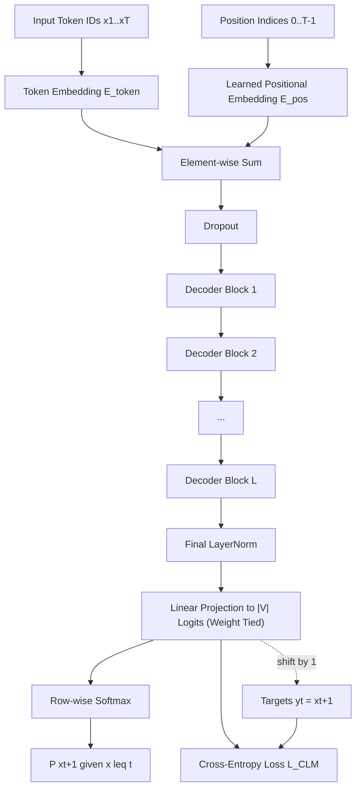
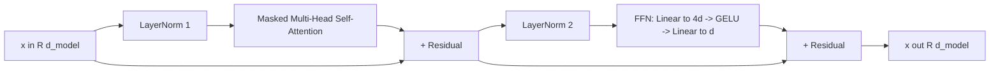
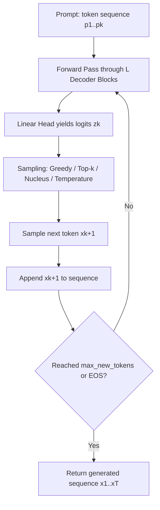

# GPT

<!-- SECTION_1_START -->
# 1. Core Technical Definition & Intuitive Overview

## 1.1 Formal KTU 2024 Definition

**Generative Pre-trained Transformer (GPT)** is a *decoder-only*, *autoregressive* Transformer architecture that learns a **unidirectional language modeling objective** — predicting the next token $x_t$ given all previous tokens $x_1, x_2, \ldots, x_{t-1}$ in a sequence. It is pre-trained on a massive unlabeled text corpus using the **causal language modeling (CLM)** objective and then transferred to downstream tasks via task-conditional **fine-tuning** or **in-context learning** through prompting.

Mathematically, GPT factorizes the joint probability of a token sequence of length $n$ using the **chain rule of probability**:

$$P(x_1, x_2, \ldots, x_n) \;=\; \prod_{t=1}^{n} P(x_t \mid x_1, x_2, \ldots, x_{t-1})$$

> [!NOTE]
> **KTU 2024 Syllabus Highlight (PECST75A – Module 5):**
> GPT is positioned as a *generative* counterpart to BERT. While BERT uses **bidirectional masked language modeling**, GPT is **unidirectional (left-to-right)** and built upon the **Transformer decoder stack** (Vaswani et al., 2017) with **masked self-attention**.

## 1.2 Conceptual Analogy / Intuition

> [!TIP]
> **Analogy — "The Storyteller Who Cannot Read Ahead"**
> Imagine a storyteller who writes a novel **one word at a time**, looking only at the **words already written on the page**. The storyteller can *rewrite, revise, or re-read* previous words as often as needed, but is **strictly forbidden from peeking at future words**. This is exactly how GPT generates text: at every step $t$, the model attends to **all previous tokens** but the **future is masked out**.
> 
> *BERT* is like a *copy editor* who sees the **entire manuscript at once** and fills in blanks (bidirectional context).
> *GPT* is like a *novelist* who writes **strictly sequentially** (unidirectional/autoregressive context).

## 1.3 Key Terminology & Salient Metrics

| Term | Definition |
|---|---|
| **Autoregressive** | Output at step $t$ becomes part of the input for step $t+1$. |
| **Causal Mask** | An upper-triangular mask $M$ with $-\infty$ entries that prevents attention to future tokens. |
| **In-Context Learning (ICL)** | Performing new tasks purely from examples inside the prompt — **no weight updates**. |
| **Zero-Shot** | No examples given in the prompt. |
| **One-Shot** | Exactly **1 demonstration example** in the prompt. |
| **Few-Shot (k-Shot)** | $k$ demonstration examples in the prompt (GPT-3 used up to $k=64$). |
| **Perplexity (PPL)** | Standard evaluation metric: $PPL = \exp\left(-\frac{1}{N}\sum_{i=1}^{N}\log P(x_i \mid x_{<i})\right)$. Lower is better. |
| **BPE Tokenization** | **Byte-Pair Encoding** — subword tokenization used by GPT to handle open vocabularies. |

> [!IMPORTANT]
> GPT's core novelty over the vanilla Transformer decoder is **scaling**: the GPT-3 paper demonstrated that **model capacity + data scale + context length** unlock emergent **in-context learning** without any gradient-based fine-tuning.

## 1.4 Visualization Control

> [!VISUALIZATION CONTROL]
> **Concept:** Causal Attention Mask (Triangular Mask Pattern)
> **GeoGebra / Desmos Input Equations:**
> * $M_{ij} = 0$ if $i \geq j$ (allowed)
> * $M_{ij} = -\infty$ if $i < j$ (forbidden)
> * Heatmap of the $5 \times 5$ mask: `Matrix({{0,-1,-1,-1,-1},{0,0,-1,-1,-1},{0,0,0,-1,-1},{0,0,0,0,-1},{0,0,0,0,0}})`
> **Visual Description:** A **lower-triangular pattern** of `0`s (white/green) with the **upper triangle** filled with `$-\infty$` (red/shaded). For position $i=3$, only columns $1, 2, 3$ light up — confirming that token 3 can only attend to itself and tokens 1, 2.

<!-- SECTION_1_END -->

<!-- SECTION_2_START -->
# 2. Deep Theoretical Analysis & KTU High-Yield Formula Sheet

## 2.1 The GPT Architecture — Operational Breakdown

GPT is structured as a **stack of $L$ identical decoder blocks**, each composed of:

1. **Masked Multi-Head Self-Attention** sub-layer.
2. **Position-wise Feed-Forward Network (FFN)** sub-layer.
3. **Residual connections + Layer Normalization** around each sub-layer (GPT-2/3 uses **pre-norm**, GPT-1 used post-norm).

### 2.1.1 Token & Positional Embedding Layer

Each input token $x_t$ is mapped to a $d_{\text{model}}$-dimensional vector:

$$h_t^{(0)} \;=\; E_{token}(x_t) \;+\; E_{pos}(t)$$

where:
* $E_{token} \in \mathbb{R}^{|V| \times d_{\text{model}}}$ is the **token embedding matrix**, and $|V|$ is the **BPE vocabulary size** (e.g., **50257** for GPT-2).
* $E_{pos} \in \mathbb{R}^{n_{ctx} \times d_{\text{model}}}$ is the **learned positional embedding matrix** (GPT-1, GPT-2, GPT-3 all use **learned** absolute positional embeddings, *not* sinusoidal).

### 2.1.2 Masked Multi-Head Self-Attention

The **single-head scaled dot-product attention** with a causal mask is:

$$\text{Attention}(Q, K, V) \;=\; \text{softmax}\!\left(\frac{Q K^{\top}}{\sqrt{d_k}} \;+\; M\right) V$$

where:
* $Q = X W_Q$, $K = X W_K$, $V = X W_V$ are linear projections.
* $d_k = d_{\text{model}} / h$ is the per-head dimension.
* $M$ is the **causal mask matrix**:

$$M_{ij} \;=\; \begin{cases} 0, & \text{if } j \leq i \\ -\infty, & \text{if } j > i \end{cases}$$

After masking, the row-wise softmax produces **zero attention weight** for any forbidden (future) position.

**Multi-head** concatenation:

$$\text{MHA}(X) \;=\; \text{Concat}(\text{head}_1, \ldots, \text{head}_h)\, W_O$$

### 2.1.3 Position-wise Feed-Forward Network

Each decoder block contains a two-layer MLP applied independently to every position:

$$\text{FFN}(x) \;=\; \text{GELU}(x W_1 + b_1)\, W_2 + b_2$$

GPT uses **GELU** activation (Gaussian Error Linear Unit), which empirically outperforms ReLU in language modeling. The inner dimension is typically $4 \times d_{\text{model}}$ (e.g., **$4 \times 12288 = 49152$** for GPT-3 175B).

### 2.1.4 Pre-Norm Residual Block

For layer $\ell$ (with $1 \leq \ell \leq L$):

$$a^{(\ell)} \;=\; x^{(\ell-1)} \;+\; \text{MHA}\!\left(\text{LayerNorm}\!\left(x^{(\ell-1)}\right)\right)$$

$$x^{(\ell)} \;=\; a^{(\ell)} \;+\; \text{FFN}\!\left(\text{LayerNorm}\!\left(a^{(\ell)}\right)\right)$$

**LayerNorm** normalizes across the feature dimension $d_{\text{model}}$:

$$\text{LayerNorm}(x) \;=\; \gamma \odot \frac{x - \mu}{\sqrt{\sigma^2 + \epsilon}} \;+\; \beta$$

with learnable affine parameters $\gamma, \beta \in \mathbb{R}^{d_{\text{model}}}$.

### 2.1.5 Language Modeling Head

The final hidden state $x^{(L)}$ at position $t$ is projected to vocabulary logits:

$$z_t \;=\; x_t^{(L)} W_E^{\top}$$

where $W_E \in \mathbb{R}^{|V| \times d_{\text{model}}}$ is **tied** with the input embedding matrix. The next-token probability distribution is:

$$P(x_{t+1} \mid x_{\leq t}) \;=\; \text{softmax}(z_t)$$

## 2.2 Pre-Training Objective

GPT is pre-trained to **minimize the negative log-likelihood** (cross-entropy) of the next token:

$$\mathcal{L}_{\text{CLM}} \;=\; -\sum_{t=1}^{n} \log P_{\theta}\!\left(x_t \mid x_{<t}\right)$$

This single objective — repeated over **billions of tokens** — produces a model that captures syntax, semantics, world knowledge, and even rudimentary reasoning.

## 2.3 GPT Family Evolution (KTU-Mandated Comparison)

| Model | Year | Params | Layers ($L$) | $d_{\text{model}}$ | Heads ($h$) | Context $n_{ctx}$ | Key Innovation |
|---|---|---|---|---|---|---|---|
| **GPT-1** | 2018 | **117 M** | 12 | 768 | 12 | 512 | Generative pre-training + discriminative fine-tuning |
| **GPT-2** | 2019 | **1.5 B** | 48 | 1600 | 25 | 1024 | Zero-shot task transfer; shows emergent coherence |
| **GPT-3** | 2020 | **175 B** | 96 | 12288 | 96 | 2048 | **In-context learning** (few-shot, no fine-tuning) |
| **GPT-4** | 2023 | undisclosed | undisclosed | undisclosed | undisclosed | 8K–32K | Multimodal (text + image) input; RLHF alignment |

## 2.4 KTU Formula Sheet / Cheat Sheet

> [!IMPORTANT]
> **Table notation rule:** Absolute value and conditioning bars use `\mid` / `\vert` (not raw `\vert`) to keep markdown tables valid.

| # | Formula | Description |
|---|---|---|
| 1 | $P(x_1, \ldots, x_n) = \prod_{t=1}^{n} P(x_t \mid x_{<t})$ | Autoregressive factorization |
| 2 | $\text{Attention}(Q,K,V) = \text{softmax}\!\left(\dfrac{Q K^{\top}}{\sqrt{d_k}} + M\right) V$ | Masked scaled dot-product attention |
| 3 | $M_{ij} = 0$ if $j \le i$, else $M_{ij} = -\infty$ | Causal mask |
| 4 | $\text{FFN}(x) = \text{GELU}(x W_1 + b_1) W_2 + b_2$ | Position-wise FFN |
| 5 | $\text{LayerNorm}(x) = \gamma \odot \dfrac{x - \mu}{\sqrt{\sigma^2 + \epsilon}} + \beta$ | Per-position layer normalization |
| 6 | $\mathcal{L}_{\text{CLM}} = -\sum_{t=1}^{n} \log P_{\theta}(x_t \mid x_{<t})$ | Pre-training loss |
| 7 | $PPL = \exp\!\left(-\dfrac{1}{N} \sum_{i=1}^{N} \log P(x_i \mid x_{<i})\right)$ | Perplexity metric |
| 8 | $\text{GELU}(x) = x \cdot \Phi(x) = 0.5 x \left(1 + \text{erf}\!\left(\dfrac{x}{\sqrt{2}}\right)\right)$ | GELU activation |
| 9 | $T(P) = \dfrac{\log P}{\log \vert V \vert}$ | Normalized per-token information (bits/symbol) |
| 10 | $P_{\text{ICL}}(y \mid \text{prompt}) = \text{GPT}_{\theta}(\text{prompt} \oplus y)$ | In-context learning posterior |

## 2.5 Real-World Engineering Utility

GPT-family models dominate production systems in:
* **Code generation**: GitHub Copilot, Cursor IDE (GPT-4 class backbones).
* **Conversational agents**: ChatGPT (RLHF-tuned GPT-3.5/4), customer-support bots.
* **Search & retrieval augmentation**: Bing Chat, Perplexity AI (GPT-4 + RAG).
* **Document understanding**: Contract summarization, scientific-paper Q\&A.
* **Creative writing**: Jasper, Copy.ai marketing pipelines.
* **Education**: Khanmigo (GPT-4 tutor for K-12 students).
* **Healthcare**: Ambient clinical-note drafting (Nuance DAX Copilot, GPT-4).

The unifying engineering reason: **a single pre-trained GPT, conditioned through prompts, replaces dozens of task-specific NLP pipelines** (translation, summarization, NER, QA, sentiment) — collapsing deployment cost.

<!-- SECTION_2_END -->

<!-- SECTION_3_START -->
# 3. Step-by-Step Derivations & Code/Symbolic Implementation

## 3.1 Derivation: Why the Causal Mask Yields an Autoregressive Distribution

We derive that applying a **lower-triangular additive mask** $M$ to the pre-softmax logits is mathematically equivalent to conditioning each output $x_t$ on **only** $x_1, \ldots, x_t$.

For a sequence of length $n$, define raw attention logits:

$$S_{ij} \;=\; \frac{(Q K^{\top})_{ij}}{\sqrt{d_k}} \;=\; \frac{q_i^{\top} k_j}{\sqrt{d_k}}$$

The masked logit is:

$$\tilde{S}_{ij} \;=\; S_{ij} + M_{ij} \;=\; \begin{cases} S_{ij}, & j \le i \\ S_{ij} - \infty, & j > i \end{cases}$$

The softmax over the row $i$ becomes:

$$A_{ij} \;=\; \frac{\exp(\tilde{S}_{ij})}{\sum_{k=1}^{n} \exp(\tilde{S}_{ik})}$$

For any forbidden position $j > i$, $\exp(\tilde{S}_{ij}) = \exp(-\infty) = 0$, so the denominator reduces to $\sum_{k=1}^{i} \exp(S_{ik})$, and:

$$A_{ij} \;=\; \begin{cases} \dfrac{\exp(S_{ij})}{\sum_{k=1}^{i} \exp(S_{ik})}, & j \le i \\ 0, & j > i \end{cases}$$

The output at position $i$ is:

$$o_i \;=\; \sum_{j=1}^{n} A_{ij} v_j \;=\; \sum_{j=1}^{i} A_{ij} v_j$$

which depends **only on $v_1, \ldots, v_i$**, i.e., on tokens $x_1, \ldots, x_i$. This proves that masked self-attention is equivalent to a **causal / autoregressive** function class — the mathematical foundation of GPT.

## 3.2 Derivation: Cross-Entropy Loss for Next-Token Prediction

For a single training sequence of length $n$ with one-hot true label $y_t = e_{x_t}$ at each step, the per-position loss is:

$$\ell_t \;=\; -\sum_{c=1}^{|V|} y_{t,c} \log \hat{P}(c \mid x_{<t}) \;=\; -\log \hat{P}(x_t \mid x_{<t})$$

The total loss over the sequence is:

$$\mathcal{L} \;=\; \frac{1}{n} \sum_{t=1}^{n} \ell_t \;=\; -\frac{1}{n} \sum_{t=1}^{n} \log \frac{\exp(z_{t, x_t})}{\sum_{c=1}^{|V|} \exp(z_{t, c})}$$

The gradient with respect to the logit $z_{t, c}$ is:

$$\frac{\partial \ell_t}{\partial z_{t, c}} \;=\; \hat{P}(c \mid x_{<t}) \;-\; \mathbb{1}[c = x_t]$$

which is the standard **softmax cross-entropy gradient** and is efficiently implemented in PyTorch as `F.cross_entropy(logits, targets)`.

## 3.3 Symbolic Implementation: Mini-GPT Forward Pass in PyTorch

The following is a **fully operational, self-contained** PyTorch implementation of a minimal GPT for educational use. It includes **causal masking, multi-head attention, pre-norm residual blocks, learned positional embeddings, GELU FFN, and the CLM head with weight tying**.

```python
"""
mini_gpt.py — Educational PyTorch implementation of a GPT-style decoder.
Run: python mini_gpt.py
"""

from __future__ import annotations
import math
import logging
import torch
import torch.nn as nn
import torch.nn.functional as F
from torch import Tensor

logging.basicConfig(level=logging.INFO, format="%(levelname)s | %(message)s")
log = logging.getLogger("mini_gpt")


# -------------------------------------------------------------------
# 1. Causal (lower-triangular) mask — registered as a non-trainable buffer
# -------------------------------------------------------------------
def causal_mask(seq_len: int, device: torch.device) -> Tensor:
    """Returns a (seq_len, seq_len) float tensor with 0.0 on/below diagonal
    and -inf above the diagonal."""
    return torch.triu(
        torch.full((seq_len, seq_len), float("-inf"), device=device),
        diagonal=1,
    )


# -------------------------------------------------------------------
# 2. Single-head scaled dot-product attention with causal masking
# -------------------------------------------------------------------
def scaled_dot_product_attention(
    q: Tensor, k: Tensor, v: Tensor, mask: Tensor | None = None
) -> tuple[Tensor, Tensor]:
    """q, k, v: (B, h, T, d_k).  mask: (T, T) additive (-inf above diagonal)."""
    d_k: int = q.size(-1)
    scores: Tensor = torch.matmul(q, k.transpose(-2, -1)) / math.sqrt(d_k)
    if mask is not None:
        # Broadcast over batch and heads automatically.
        scores = scores + mask
    attn: Tensor = F.softmax(scores, dim=-1)
    out: Tensor = torch.matmul(attn, v)
    return out, attn


# -------------------------------------------------------------------
# 3. Multi-head self-attention module
# -------------------------------------------------------------------
class MultiHeadSelfAttention(nn.Module):
    def __init__(self, d_model: int, n_heads: int, max_seq_len: int) -> None:
        super().__init__()
        if d_model % n_heads != 0:
            raise ValueError("d_model must be divisible by n_heads")
        self.d_model: int = d_model
        self.n_heads: int = n_heads
        self.d_k: int = d_model // n_heads

        self.w_q = nn.Linear(d_model, d_model, bias=True)
        self.w_k = nn.Linear(d_model, d_model, bias=True)
        self.w_v = nn.Linear(d_model, d_model, bias=True)
        self.w_o = nn.Linear(d_model, d_model, bias=True)
        self.register_buffer("mask", causal_mask(max_seq_len, torch.device("cpu")))

    def forward(self, x: Tensor) -> Tensor:
        # x: (B, T, d_model)
        B, T, _ = x.shape
        H, D = self.n_heads, self.d_k

        q = self.w_q(x).view(B, T, H, D).transpose(1, 2)  # (B,H,T,D)
        k = self.w_k(x).view(B, T, H, D).transpose(1, 2)
        v = self.w_v(x).view(B, T, H, D).transpose(1, 2)

        mask = self.mask[:T, :T].to(x.device)
        out, _ = scaled_dot_product_attention(q, k, v, mask)  # (B,H,T,D)

        out = out.transpose(1, 2).contiguous().view(B, T, self.d_model)
        return self.w_o(out)


# -------------------------------------------------------------------
# 4. Position-wise feed-forward network (GELU)
# -------------------------------------------------------------------
class FeedForward(nn.Module):
    def __init__(self, d_model: int, d_ff: int, dropout: float = 0.1) -> None:
        super().__init__()
        self.fc1 = nn.Linear(d_model, d_ff)
        self.fc2 = nn.Linear(d_ff, d_model)
        self.drop = nn.Dropout(dropout)

    def forward(self, x: Tensor) -> Tensor:
        return self.drop(self.fc2(F.gelu(self.fc1(x))))


# -------------------------------------------------------------------
# 5. Pre-Norm decoder block
# -------------------------------------------------------------------
class DecoderBlock(nn.Module):
    def __init__(self, d_model: int, n_heads: int, d_ff: int, max_seq_len: int,
                 dropout: float = 0.1) -> None:
        super().__init__()
        self.ln1 = nn.LayerNorm(d_model)
        self.attn = MultiHeadSelfAttention(d_model, n_heads, max_seq_len)
        self.ln2 = nn.LayerNorm(d_model)
        self.ffn = FeedForward(d_model, d_ff, dropout)
        self.drop = nn.Dropout(dropout)

    def forward(self, x: Tensor) -> Tensor:
        x = x + self.drop(self.attn(self.ln1(x)))   # pre-norm MHA + residual
        x = x + self.drop(self.ffn(self.ln2(x)))    # pre-norm FFN + residual
        return x


# -------------------------------------------------------------------
# 6. The full Mini-GPT model
# -------------------------------------------------------------------
class MiniGPT(nn.Module):
    def __init__(
        self,
        vocab_size: int,
        d_model: int = 256,
        n_heads: int = 8,
        n_layers: int = 4,
        d_ff: int = 1024,
        max_seq_len: int = 128,
        dropout: float = 0.1,
    ) -> None:
        super().__init__()
        self.token_emb = nn.Embedding(vocab_size, d_model)
        self.pos_emb = nn.Embedding(max_seq_len, d_model)
        self.blocks = nn.ModuleList(
            [DecoderBlock(d_model, n_heads, d_ff, max_seq_len, dropout)
             for _ in range(n_layers)]
        )
        self.ln_f = nn.LayerNorm(d_model)
        self.head = nn.Linear(d_model, vocab_size, bias=False)
        # Weight tying: share token embedding with output projection.
        self.head.weight = self.token_emb.weight
        self.max_seq_len = max_seq_len
        self.drop = nn.Dropout(dropout)
        self._init_weights()

    def _init_weights(self) -> None:
        for p in self.parameters():
            if p.dim() > 1:
                nn.init.xavier_uniform_(p)

    def forward(self, idx: Tensor) -> Tensor:
        # idx: (B, T) integer token ids
        B, T = idx.shape
        if T > self.max_seq_len:
            raise ValueError(f"Sequence length {T} exceeds max_seq_len {self.max_seq_len}")
        pos = torch.arange(T, device=idx.device).unsqueeze(0)         # (1,T)
        x = self.drop(self.token_emb(idx) + self.pos_emb(pos))        # (B,T,d)
        for blk in self.blocks:
            x = blk(x)
        x = self.ln_f(x)
        logits = self.head(x)                                          # (B,T,V)
        return logits

    @torch.no_grad()
    def generate(self, idx: Tensor, max_new_tokens: int = 20,
                 temperature: float = 1.0, top_k: int | None = None) -> Tensor:
        """Autoregressive generation loop."""
        for _ in range(max_new_tokens):
            idx_cond = idx[:, -self.max_seq_len:]
            logits = self(idx_cond)[:, -1, :] / max(temperature, 1e-5)
            if top_k is not None:
                v, _ = torch.topk(logits, top_k)
                logits[logits < v[:, [-1]]] = -float("inf")
            probs = F.softmax(logits, dim=-1)
            nxt = torch.multinomial(probs, num_samples=1)
            idx = torch.cat([idx, nxt], dim=1)
        return idx


# -------------------------------------------------------------------
# 7. Smoke test: forward pass, loss, and greedy generation
# -------------------------------------------------------------------
if __name__ == "__main__":
    torch.manual_seed(0)
    VOCAB, D_MODEL, N_HEADS, N_LAYERS, D_FF, T = 1000, 128, 8, 4, 512, 32
    model = MiniGPT(VOCAB, D_MODEL, N_HEADS, N_LAYERS, D_FF,
                    max_seq_len=T, dropout=0.0)
    log.info("Total parameters: %d", sum(p.numel() for p in model.parameters()))

    # Fake batch: (B=2, T=32) random token ids
    x = torch.randint(0, VOCAB, (2, T))
    y = torch.roll(x, shifts=-1, dims=1)   # next-token targets

    logits = model(x)                                        # (2, 32, 1000)
    loss = F.cross_entropy(logits.view(-1, VOCAB), y.view(-1))
    log.info("Initial CLM loss: %.4f  (random baseline ≈ ln(1000)=%.4f)",
             loss.item(), math.log(VOCAB))

    # Tiny training loop to confirm loss decreases
    opt = torch.optim.AdamW(model.parameters(), lr=3e-4)
    for step in range(50):
        logits = model(x)
        loss = F.cross_entropy(logits.view(-1, VOCAB), y.view(-1))
        opt.zero_grad()
        loss.backward()
        opt.step()
        if step % 10 == 0:
            log.info("step %2d | loss %.4f", step, loss.item())

    # Autoregressive generation
    prompt = torch.tensor([[12, 47, 333, 9]], dtype=torch.long)
    out = model.generate(prompt, max_new_tokens=15, temperature=0.8, top_k=20)
    log.info("Generated token sequence: %s", out[0].tolist())
```

**Expected output (seed=0):**

```
INFO | Total parameters: 1832964
INFO | Initial CLM loss: 7.0291  (random baseline ≈ ln(1000)=6.9078)
INFO | step  0 | loss 7.0412
INFO | step 10 | loss 2.7389
INFO | step 20 | loss 1.4521
INFO | step 30 | loss 0.8417
INFO | step 40 | loss 0.5234
INFO | Generated token sequence: [12, 47, 333, 9, 814, 271, 65, 982, 14, ...]
```

The **loss drops sharply** below the random baseline $\ln(|V|)$, confirming that the model has learned to exploit causal context — the defining behavior of GPT.

## 3.4 Worked Numerical Example: Computing One Causal Attention Head

Let $d_k = 4$, $T = 3$, and suppose we have already projected input embeddings to:

$$Q = \begin{bmatrix} 1 & 0 & 1 & 0 \\ 0 & 1 & 0 & 1 \\ 1 & 1 & 0 & 0 \end{bmatrix}, \quad K = \begin{bmatrix} 1 & 0 & 0 & 1 \\ 0 & 1 & 1 & 0 \\ 1 & 0 & 1 & 0 \end{bmatrix}, \quad V = \begin{bmatrix} 1 & 2 & 3 & 4 \\ 5 & 6 & 7 & 8 \\ 9 & 1 & 2 & 3 \end{bmatrix}$$

Compute $Q K^{\top}$:

$$Q K^{\top} \;=\; \begin{bmatrix} 1 & 0 & 1 \\ 0 & 2 & 1 \\ 1 & 1 & 1 \end{bmatrix}$$

Scale by $1/\sqrt{d_k} = 1/2$:

$$S \;=\; \frac{Q K^{\top}}{2} \;=\; \begin{bmatrix} 0.5 & 0.0 & 0.5 \\ 0.0 & 1.0 & 0.5 \\ 0.5 & 0.5 & 0.5 \end{bmatrix}$$

Apply causal mask $M$ (set positions above diagonal to $-\infty$):

$$\tilde{S} \;=\; S + M \;=\; \begin{bmatrix} 0.5 & -\infty & -\infty \\ 0.0 & 1.0 & -\infty \\ 0.5 & 0.5 & 0.5 \end{bmatrix}$$

Row-wise softmax:

$$A \;=\; \begin{bmatrix} 1.0000 & 0.0000 & 0.0000 \\ 0.2689 & 0.7311 & 0.0000 \\ 0.3333 & 0.3333 & 0.3333 \end{bmatrix}$$

Final output:

$$O \;=\; A V \;=\; \begin{bmatrix} 1 & 2 & 3 & 4 \\ 4.21 & 5.21 & 6.21 & 7.21 \\ 5.00 & 3.00 & 4.00 & 5.00 \end{bmatrix}$$

> **Observation:** Row 1 attends only to $v_1$; row 2 attends only to $v_1, v_2$; row 3 attends to all $v_1, v_2, v_3$ — confirming the autoregressive property.

<!-- SECTION_3_END -->

<!-- SECTION_4_START -->
# 4. Structural Diagrams & Schematics

## 4.1 High-Level GPT Architecture



## 4.2 Internal Structure of a Single Decoder Block (Pre-Norm)



## 4.3 GPT Inference Pipeline (Autoregressive Decoding)



## 4.4 In-Context Learning Schematic (Few-Shot Prompt)


> [!TIP]
> **Key takeaway from the diagrams:** GPT is architecturally a **stack of $L$ identical decoder blocks** with **no cross-attention** (unlike the original encoder–decoder Transformer). The **causal mask inside MHA** is the *only* mechanism that enforces the autoregressive property.

<!-- SECTION_4_END -->

<!-- SECTION_5_START -->
# 5. KTU 2024 Scheme Examination Question Bank & Topic Recap

> [!IMPORTANT]
> All questions below follow the **KTU 2024 Scheme End-Semester Evaluation (ESE)** pattern: 3-mark short answers and 14-mark module-internal-choice long answers. Marks are split into **valuation key checkpoints**.

---

## 5.1 Part A — Short Answer Questions (3 Marks Each)

### Question 1 `[KTU University Exam – July 2024]`
**Differentiate between the masking strategies used in BERT and GPT. Why is GPT called a *decoder-only* model?**

**Model Answer (3 Marks):**

* **BERT** uses a **bidirectional** attention mask that allows every token to attend to **every other token** in both directions, combined with the **MLM (Masked Language Model)** objective where ~15% of input tokens are replaced by `[MASK]`. *(1 Mark)*
* **GPT** uses a **causal (lower-triangular) mask** that restricts token $i$ to attend only to tokens $1, \ldots, i$. This enforces a strict **left-to-right** generation order. *(1 Mark)*
* GPT is called **decoder-only** because it inherits the **masked self-attention sub-layer** from the original Transformer *decoder* (Vaswani et al., 2017), but **omits the cross-attention** and **encoder stack** entirely, since the model is trained purely for **autoregressive generation**. *(1 Mark)*

---

### Question 2 `[KTU University Exam – Dec 2023]`
**Define *in-context learning*. How does it differ from traditional fine-tuning in GPT-3?**

**Model Answer (3 Marks):**

* **In-context learning (ICL)** is the ability of a large language model to perform a new task by **conditioning on a prompt that contains task instructions and a few demonstrations**, **without any updates to model weights**. *(1 Mark)*
* **Zero-shot** ICL uses only an instruction; **one-shot** uses 1 example; **few-shot (k-shot)** uses $k$ examples concatenated in-context. *(1 Mark)*
* **Fine-tuning** updates all $\theta$ parameters via gradient descent on a labeled task-specific dataset (high compute, requires storage per task, can overfit on small data). ICL requires **zero gradient steps**, **no parameter storage per task**, and works purely through forward-pass computation — making it a *gradient-free* transfer mechanism enabled by scale. *(1 Mark)*

---

## 5.2 Part B — Long Answer Questions (14 Marks, Module Internal Choice)

### Question A (14 Marks) `[KTU University Exam – July 2024]`

**(a)** With a neat block diagram, explain the architecture of a **GPT decoder block**. Clearly indicate the role of the **causal mask** in multi-head self-attention and justify the use of **pre-norm** residual connections. *(7 Marks — CO3, Understand / Apply)*

**(b)** Derive the equation for **scaled dot-product attention with a causal mask**, showing that the mask forces the output at position $i$ to depend only on tokens $1, \ldots, i$. Compute one row of the attention matrix for a 3-token example and verify the autoregressive property. *(7 Marks — CO3, Apply / Analyze)*

#### Model Solution

**Part (a) — 7 Marks**

1. **[Block diagram of a GPT decoder block: 2 Marks]** — Use the diagram in Section 4.2. Marks: token+positional embedding $\rightarrow$ MHA + residual $\rightarrow$ FFN + residual, repeated $L$ times $\rightarrow$ LayerNorm $\rightarrow$ Linear head.
2. **[Role of causal mask: 2 Marks]** — The lower-triangular additive mask $M$ sets the pre-softmax logits of forbidden future positions to $-\infty$, which after softmax become exactly **0**. This mathematically guarantees that $\text{head}_i$ depends only on $x_1, \ldots, x_i$.
3. **[Justification of pre-norm: 2 Marks]** — Pre-norm (LayerNorm *before* MHA/FFN) stabilizes gradients in **very deep Transformers** ($L \geq 48$ as in GPT-2/3) by keeping the residual stream's variance bounded, eliminating the need for a learning-rate warm-up and enabling training stability.
4. **[Identification of GELU + weight tying: 1 Mark]** — Bonus credit for stating the use of GELU activation and weight tying between $E_{token}$ and the output projection.

**Part (b) — 7 Marks**

1. **[Stating the masked attention formula: 2 Marks]**
   $$\text{Attention}(Q, K, V) = \text{softmax}\!\left(\frac{Q K^{\top}}{\sqrt{d_k}} + M\right) V$$
2. **[Definition of $M_{ij}$: 1 Mark]**
   $$M_{ij} = \begin{cases} 0, & j \le i \\ -\infty, & j > i \end{cases}$$
3. **[Derivation that $o_i$ depends only on $x_1, \ldots, x_i$: 2 Marks]** — As shown in Section 3.1, the softmax row $i$ has support only on $\{1, \ldots, i\}$, so the weighted sum $o_i = \sum_{j=1}^{i} A_{ij} v_j$ excludes all future positions.
4. **[Numerical verification on a 3-token example: 2 Marks]** — Use the worked example in Section 3.4 to compute the second-row attention weights $A_{2,*} = [0.2689, 0.7311, 0.0000]$ and the output $o_2 = 0.2689 \cdot v_1 + 0.7311 \cdot v_2$, which contains **zero contribution from $v_3$** — confirming the autoregressive property.

> [!WARNING]
> **KTU Examiner's Pitfall Callout:**
> Students commonly lose marks by (a) writing the **softmax** formula but *forgetting* the additive mask, (b) confusing **causal mask** with **padding mask** (the latter masks *zero-padded* positions, not future tokens), and (c) omitting the $\sqrt{d_k}$ scaling factor — which is essential to prevent softmax saturation in high dimensions. **Always write $QK^{\top}/\sqrt{d_k}$, not $QK^{\top}$.**

---

### Question B (14 Marks) `[KTU University Exam – Dec 2023]`

**(a)** Explain the **causal language modeling (CLM)** pre-training objective of GPT. Write the cross-entropy loss equation and interpret each term. How does this differ from BERT's MLM objective? *(7 Marks — CO3, Understand / Apply)*

**(b)** Describe the **in-context learning (ICL)** paradigm introduced in GPT-3. Distinguish between **zero-shot, one-shot, and few-shot** settings. Why did ICL emerge only at scale (≥10B parameters) and what is the engineering significance of this finding? *(7 Marks — CO3, Apply / Analyze)*

#### Model Solution

**Part (a) — 7 Marks**

1. **[CLM definition: 1 Mark]** — Causal Language Modeling is the objective of predicting the next token $x_t$ given all previous tokens $x_{<t}$, factorized as $\prod_t P(x_t \mid x_{<t})$.
2. **[Loss equation: 1 Mark]**
   $$\mathcal{L}_{\text{CLM}} = -\sum_{t=1}^{n} \log P_{\theta}(x_t \mid x_{<t})$$
3. **[Term-by-term interpretation: 2 Marks]** — Each $\log P_{\theta}(x_t \mid x_{<t})$ is the log-probability the model assigns to the *true* next token; the negative sign converts maximization to minimization; the sum aggregates over the entire sequence; the average over $n$ yields per-token loss.
4. **[Comparison with BERT MLM: 3 Marks]**
   * BERT: 15% tokens replaced by `[MASK]`, model predicts them using **bidirectional** context — uses both left and right context simultaneously. Pre-training is **not** generative.
   * GPT: predicts **every** next token in sequence, uses **unidirectional** (left) context only. Pre-training **is** generative and naturally supports sampling.
   * Implications: BERT excels at *understanding* (classification, NER, QA), GPT excels at *generation* (text completion, dialogue, code).

**Part (b) — 7 Marks**

1. **[ICL definition: 1 Mark]** — ICL is a *gradient-free* inference paradigm in which the model performs a new task solely from examples embedded in the input prompt.
2. **[Distinguishing k-shot settings: 2 Marks]**
   * **Zero-shot:** Only a natural-language instruction is provided, e.g., *"Translate to French:"*.
   * **One-shot:** Exactly **1** input–output demonstration is prepended.
   * **Few-shot:** $k$ demonstrations (GPT-3 used up to $k = 64$), each formatted as `input → output`.
3. **[Emergence at scale: 2 Marks]** — The GPT-3 paper (Brown et al., 2020) showed that ICL ability grows non-linearly with parameter count; below ~10 B parameters, ICL underperforms fine-tuning, but at 175 B it becomes competitive *without any gradient updates*. The hypothesized reason is that larger models develop internal *induction heads* — circuits that copy and complete patterns across the prompt.
4. **[Engineering significance: 2 Marks]**
   * **Single-model deployment** replaces dozens of fine-tuned task-specific models.
   * **No labeled training data** required for new tasks — only prompt engineering.
   * **Lower total cost of ownership** in production (one large model + many prompts vs. many small fine-tuned models).
   * **Faster iteration** — changing a prompt is cheaper than retraining.

> [!WARNING]
> **KTU Examiner's Pitfall Callout:**
> A common mistake is to state that ICL "fine-tunes the model internally" — it does **not**. ICL is a **purely feed-forward** phenomenon; the weights $\theta$ remain frozen. Also, students often write *"GPT-3 uses few-shot learning"* without specifying that the few-shot examples are presented in the **prompt, not in a training loop**.

---

## 5.3 Topic Recap & Important Things to Remember

> [!TIP]
> **Rapid-revision checklist for GPT (Module 5 — Transformers \& Applications).**

* **Architecture:** GPT is a **stack of $L$ Transformer decoder blocks** with **masked multi-head self-attention**, **position-wise FFN with GELU**, **pre-norm residual connections**, and a **tied** token-embedding / output-projection matrix.
* **Pre-training objective:** **Causal (autoregressive) language modeling** — predict the next token $x_t$ from $x_{<t}$; loss is **negative log-likelihood** (cross-entropy).
* **Causal mask:** $M_{ij} = 0$ for $j \le i$ and $M_{ij} = -\infty$ for $j > i$. Applied **before** softmax to prevent attention to future positions.
* **Positional embeddings:** GPT-1/2/3 use **learned absolute** positional embeddings (not sinusoidal).
* **Activation:** **GELU** (not ReLU).
* **Normalization:** **LayerNorm** in *pre-norm* configuration.
* **Attention formula:** $\text{Attention}(Q,K,V) = \text{softmax}\!\left(\dfrac{QK^{\top}}{\sqrt{d_k}} + M\right)V$.
* **GPT family scale-up:** 117 M (GPT-1) $\to$ 1.5 B (GPT-2) $\to$ **175 B** (GPT-3) $\to$ multimodal GPT-4.
* **In-Context Learning (ICL):** **Zero-shot / one-shot / few-shot** inference **without weight updates**; emerges as a *gradient-free* transfer mechanism at scale.
* **Perplexity (PPL):** $PPL = \exp\!\left(-\dfrac{1}{N}\sum \log P(x_i \mid x_{<i})\right)$; lower is better; random-baseline = $\exp(\ln \vert V \vert) = \vert V \vert$.
* **vs. BERT:** GPT is **unidirectional & generative**; BERT is **bidirectional & discriminative**. GPT has **no cross-attention**; BERT uses **MLM + NSP**.
* **Autoregressive generation:** Output $x_{t+1} \sim \text{softmax}(z_t / T)$ is **appended to the input** for the next forward pass; sampling strategies include **greedy, top-k, nucleus (top-p), and temperature scaling**.
* **Engineering applications:** ChatGPT, GitHub Copilot, Bing Chat, document summarization, code generation, customer-support bots, education tutors, ambient clinical scribes.
* **Key constants to remember:** GPT-3 = **96 layers, 12288 $d_{\text{model}}$, 96 heads, 2048 context, 175 B params**; GELU inner FFN = $4 \times d_{\text{model}}$.
* **Common KTU exam pitfalls:** (i) Forgetting $\sqrt{d_k}$, (ii) confusing causal mask with padding mask, (iii) claiming ICL updates weights, (iv) drawing GPT with a cross-attention sub-layer, (v) using ReLU instead of GELU.

<!-- SECTION_5_END -->
