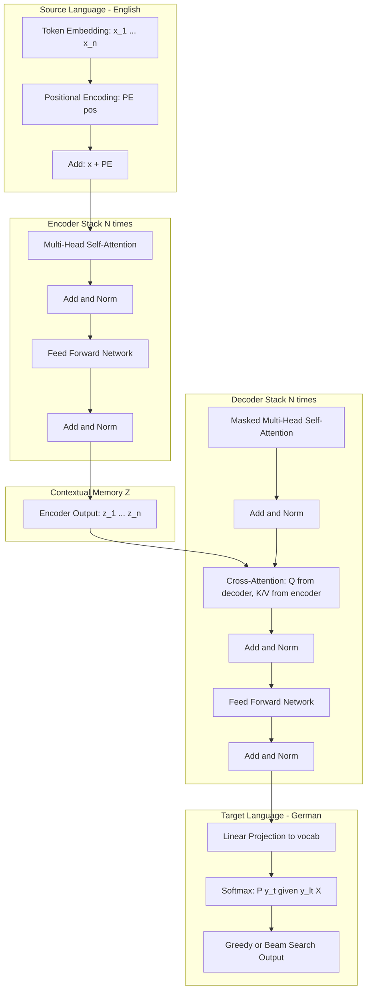
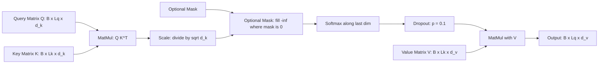
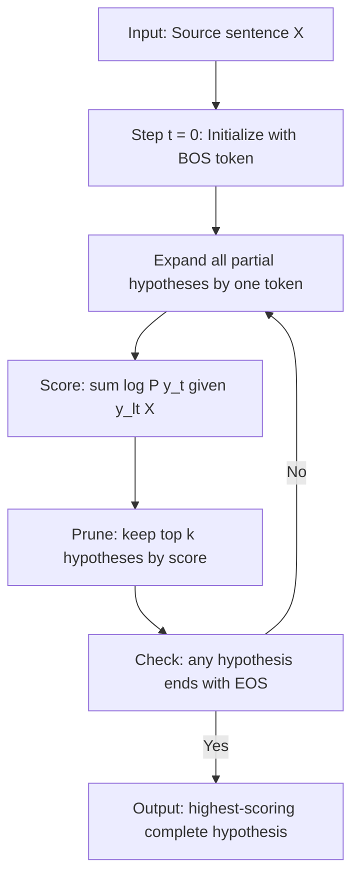
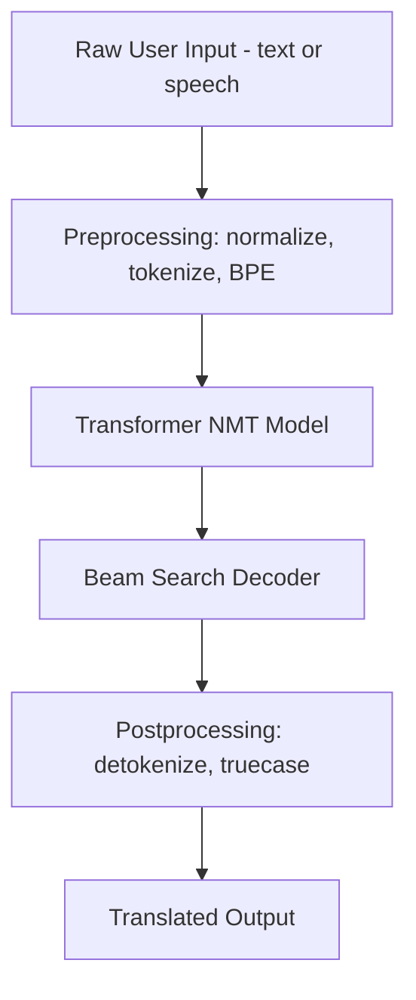

# Machine translation

<!-- SECTION_1_START -->
# Machine Translation: Core Technical Definition & Intuitive Overview

## 1.1 Formal Academic Definition (KTU 2024 Syllabus Terminology)

> [!IMPORTANT]
> **Machine Translation (MT)** is a sub-field of **Computational Linguistics** and **Natural Language Processing (NLP)** that investigates the use of software to translate text or speech from one natural language (the *source language*) to another (the *target language*), while preserving the semantic, syntactic, and pragmatic fidelity of the original content.

In the context of **KTU 2024 Scheme (PECST75A - Natural Language Processing, Module 5)**, Machine Translation is positioned as the canonical **sequence-to-sequence (Seq2Seq)** task that demonstrates the practical power of **Transformer-based encoder-decoder architectures**. Under the NEP 2020 outcome-based framework, the student must be able to:

* Architect an encoder-decoder system for language pairs $(L_s \rightarrow L_t)$.
* Quantitatively evaluate translations using metrics such as **BLEU (Bilingual Evaluation Understudy)** and **ROUGE**.
* Critically compare statistical, neural, and Transformer-based paradigms.

## 1.2 Conceptual Analogy & Intuition

Imagine you are a **UN interpreter** seated in a soundproof booth. You listen to a French delegate's speech (encoding the audio signal into meaning in your brain), and then you speak the equivalent idea in English (decoding the meaning into a new language). You do **not** translate word-for-word — you understand the *idea* first, then reformulate it.

> [!NOTE]
> **The "Booth" Intuition for Neural MT**
> * **Source Encoder** = Your ears + short-term memory (compressing French into a semantic "thought vector").
> * **Context Vector / Cross-Attention** = The mental concept you hold in your head.
> * **Target Decoder** = Your vocal cords + grammar knowledge (rendering the concept in fluent English).

This "understand-then-speak" mechanism is the philosophical heart of **Encoder-Decoder Neural Machine Translation (NMT)**. Earlier rule-based systems were like **literal dictionaries** — they translated word-by-word, producing broken grammar. Statistical MT (SMT) was like a **bilingual phrasebook**. Transformer-based NMT is the **human interpreter** who internalizes the *meaning*.

## 1.3 Physical Constants & Standard Metrics

> [!IMPORTANT]
> The following constants and benchmark thresholds are the de-facto industry standards in MT research papers (WMT, IWSLT):
>
> * **BLEU Score Range:** $0 \leq \text{BLEU} \leq 1$ (often scaled to **$0$ to $100$** in practice). A score $\geq 0.40$ is considered **human-competitive for high-resource language pairs** (e.g., English–German).
> * **Standard Embedding Dimension (Transformer-base):** $d_{\text{model}} = 512$.
> * **Attention Heads (base):** $h = 8$.
> * **Standard Tokenizer:** **BPE (Byte-Pair Encoding)** with vocabulary size $\vert V \vert \approx 32{,}000$ to $64{,}000$.
> * **Hardware Reference:** Modern NMT is trained on **NVIDIA A100 GPUs** with mixed-precision (FP16/BF16) tensor cores.

## 1.4 Taxonomy of Machine Translation Paradigms

The evolution of MT can be classified into **four generations**, each with progressively higher semantic fidelity:

> [!NOTE]
> **The Four Generations of MT**
>
> 1. **Rule-Based Machine Translation (RBMT):** Uses hand-crafted linguistic rules (morphology, syntax, transfer dictionaries). Examples: SYSTRAN, Apertium.
> 2. **Statistical Machine Translation (SMT):** Learns probabilistic alignments from parallel corpora. The dominant paradigm was **IBM Models 1–5** and **Moses**. Key equation: $\hat{e} = \arg\max_e P(e \mid f) = \arg\max_e P(f \mid e) \cdot P(e)$.
> 3. **Neural Machine Translation (NMT):** End-to-end neural networks (RNN/LSTM/GRU) with seq2seq + attention. Pioneered by **Sutskever et al. (2014)** and **Bahdanau et al. (2015)**.
> 4. **Transformer-Based NMT:** Pure self-attention architecture (**Vaswani et al., "Attention Is All You Need", 2017**). The current state-of-the-art foundation for **GPT, T5, mBART, NLLB, M2M-100**.

## 1.5 Visualization of the Translation Process

> [!VISUALIZATION CONTROL]
> **Concept:** Alignment Matrix between Source Tokens (English) and Target Tokens (French)
> **GeoGebra / Desmos Input Equations:**
> * Source axis: $S = \{1, 2, 3, 4, 5\}$ representing English words "The", "cat", "sat", "on", "mat"
> * Target axis: $T = \{1, 2, 3, 4, 5\}$ representing French words "Le", "chat", "est", "assis", "matin"
> * Alignment weights: $a_{ij} \in [0, 1]$ where $\sum_j a_{ij} = 1$ for each $i$
> **Visual Description:** A 5×5 heat-map grid where brighter cells represent stronger alignment. Diagonal dominance indicates monotonic translation; off-diagonal bright spots indicate reordering (e.g., adjective-noun inversion in French).
<!-- SECTION_1_END -->

<!-- SECTION_2_START -->
# Deep Theoretical Analysis & KTU High-Yield Formula Sheet

## 2.1 The Encoder-Decoder Architecture (Conceptual Blueprint)

The canonical NMT system consists of two stacked modules:

1. **Encoder** $\mathcal{E}$: Reads the source sequence $\mathbf{X} = (x_1, x_2, \ldots, x_n)$ and compresses it into a sequence of continuous representations $\mathbf{Z} = (\mathbf{z}_1, \mathbf{z}_2, \ldots, \mathbf{z}_n)$. In RNN-based NMT, this is collapsed into a single context vector $\mathbf{c} = \mathbf{z}_n$.
2. **Decoder** $\mathcal{D}$: Generates the target sequence $\mathbf{Y} = (y_1, y_2, \ldots, y_m)$ auto-regressively, one token at a time, conditioned on $\mathbf{Z}$ and previously generated tokens.

The fundamental conditional probability being modeled is:

$$
P(\mathbf{Y} \mid \mathbf{X}) = \prod_{t=1}^{m} P(y_t \mid y_{<t}, \mathbf{X})
$$

where $y_{<t} = (y_1, y_2, \ldots, y_{t-1})$ denotes the previously decoded tokens. The training objective minimizes the **negative log-likelihood (cross-entropy loss)**:

$$
\mathcal{L}_{\text{CE}} = -\sum_{t=1}^{m} \log P(y_t^{\ast} \mid y_{<t}^{\ast}, \mathbf{X})
$$

where $y_t^{\ast}$ is the ground-truth target token at position $t$.

## 2.2 The Three Critical Limitations of Vanilla Seq2Seq

Before Transformers, RNN-based NMT suffered from three structural defects:

* **Bottleneck Problem:** The entire source sentence is forced into a **fixed-size context vector $\mathbf{c} \in \mathbb{R}^{d}$**, regardless of source length. Long sentences lose information.
* **Vanishing Gradients:** LSTM/GRU cells still struggle to propagate signals across sequences longer than ~$30$ tokens.
* **Sequential Computation:** RNNs cannot be parallelized across time-steps, making training prohibitively slow on long corpora.

## 2.3 Bahdanau Attention: The Bridge to Transformers

**Bahdanau et al. (2015)** solved the bottleneck by introducing **additive (soft) attention**. Instead of forcing the decoder to use a single $\mathbf{c}$, every decoder step $t$ computes its own dynamic context:

$$
\mathbf{c}_t = \sum_{i=1}^{n} \alpha_{t,i} \cdot \mathbf{z}_i
$$

where the attention weights $\alpha_{t,i}$ are computed via a **softmax** over an alignment score:

$$
\alpha_{t,i} = \frac{\exp(e_{t,i})}{\sum_{j=1}^{n} \exp(e_{t,j})}
$$

$$
e_{t,i} = \mathbf{v}_a^{\top} \tanh(\mathbf{W}_a \mathbf{s}_{t-1} + \mathbf{U}_a \mathbf{z}_i)
$$

Here $\mathbf{s}_{t-1}$ is the decoder hidden state. This is the **additive attention** mechanism.

## 2.4 The Transformer Translator (Full Mathematical Formulation)

The Transformer replaces recurrence with **pure self-attention**. Three vectors are derived from every input embedding $\mathbf{x}_i$ via learned linear projections:

$$
\mathbf{q}_i = \mathbf{x}_i \mathbf{W}^Q, \quad \mathbf{k}_i = \mathbf{x}_i \mathbf{W}^K, \quad \mathbf{v}_i = \mathbf{x}_i \mathbf{W}^V
$$

The **Scaled Dot-Product Attention** is then:

$$
\text{Attention}(\mathbf{Q}, \mathbf{K}, \mathbf{V}) = \text{softmax}\!\left(\frac{\mathbf{Q}\mathbf{K}^{\top}}{\sqrt{d_k}}\right) \mathbf{V}
$$

The scaling factor $\sqrt{d_k}$ prevents the softmax from saturating when $d_k$ is large. For MT, we use **Multi-Head Attention** with $h$ parallel attention heads, allowing the model to attend to different representation subspaces simultaneously:

$$
\text{MultiHead}(\mathbf{Q}, \mathbf{K}, \mathbf{V}) = [\text{head}_1; \ldots; \text{head}_h] \mathbf{W}^O
$$

$$
\text{head}_i = \text{Attention}(\mathbf{Q}\mathbf{W}_i^Q, \mathbf{K}\mathbf{W}_i^K, \mathbf{V}\mathbf{W}_i^V)
$$

In an MT context, the cross-attention layers of the decoder use the **encoder's $\mathbf{K}$ and $\mathbf{V}$** with the **decoder's $\mathbf{Q}$**, enabling the decoder to "look back" at every source token at every generation step.

## 2.5 Positional Encoding

Since self-attention is **permutation-invariant**, the Transformer requires explicit position information. The standard sinusoidal encoding is:

$$
PE_{(pos, 2i)} = \sin\!\left(\frac{pos}{10000^{2i / d_{\text{model}}}}\right)
$$

$$
PE_{(pos, 2i+1)} = \cos\!\left(\frac{pos}{10000^{2i / d_{\text{model}}}}\right)
$$

These are added to the input embeddings: $\mathbf{x}_i^{\text{pos}} = \mathbf{x}_i + PE(i, \cdot)$.

## 2.6 KTU High-Yield Formula Sheet

> [!IMPORTANT]
> **KTU Exam Cheat Sheet — Essential MT Equations**

| # | Concept | Formula / Definition | Notes / Units |
|---|---------|----------------------|----------------|
| 1 | Seq2Seq Joint Probability | $P(\mathbf{Y} \mid \mathbf{X}) = \prod_{t=1}^{m} P(y_t \mid y_{<t}, \mathbf{X})$ | Auto-regressive factorization |
| 2 | Cross-Entropy Loss | $\mathcal{L}_{\text{CE}} = -\sum_{t} \log P(y_t^{\ast} \mid y_{<t}^{\ast}, \mathbf{X})$ | Minimized via teacher forcing |
| 3 | Bayes' Rule (Statistical MT) | $P(e \mid f) \propto P(f \mid e) \cdot P(e)$ | $e$ = target, $f$ = source |
| 4 | Scaled Dot-Product Attention | $\text{Attn}(\mathbf{Q}, \mathbf{K}, \mathbf{V}) = \text{softmax}(\mathbf{Q}\mathbf{K}^{\top} / \sqrt{d_k}) \mathbf{V}$ | $d_k$ = key dim |
| 5 | Multi-Head Concatenation | $\text{MH}(\mathbf{Q}, \mathbf{K}, \mathbf{V}) = [\text{head}_1; \ldots; \text{head}_h] \mathbf{W}^O$ | $h$ = num heads |
| 6 | Softmax Temperature | $P(y_t = w) = \exp(z_w / \tau) / \sum_{w'} \exp(z_{w'} / \tau)$ | $\tau = 1$ standard, $\tau \to 0$ greedy |
| 7 | BLEU Score (n-gram precision) | $p_n = \sum_{\text{ngram}} \text{clip}(C_{\text{hyp}}) / \sum_{\text{ngram}} C_{\text{hyp}}$ | Multiplied by **Brevity Penalty** |
| 8 | Brevity Penalty | $BP = \begin{cases} 1 & \text{if } c > r \\ e^{1 - r/c} & \text{if } c \leq r \end{cases}$ | $c$ = hyp length, $r$ = ref length |
| 9 | Final BLEU | $\text{BLEU} = BP \cdot \exp\!\left(\sum_{n=1}^{N} w_n \log p_n\right)$ | Typically $N=4$, uniform $w_n$ |
| 10 | Positional Encoding | $PE_{(pos, 2i)} = \sin(pos / 10000^{2i/d_{\text{model}}})$ | Even dims sine, odd cosine |
| 11 | Layer Normalization | $\text{LN}(\mathbf{x}) = \gamma \cdot (\mathbf{x} - \mu) / \sigma + \beta$ | Applied before attention/FFN |
| 12 | Beam Search Score | $\text{score}(Y) = \log P(Y \mid X) = \sum_{t=1}^{m} \log P(y_t \mid y_{<t}, X)$ | Beam width $k$ usually $4$–$8$ |

## 2.7 Real-World Engineering Applications

> [!NOTE]
> **Where MT is Used in Production**
>
> * **Cross-border e-commerce:** Amazon Translate, Google Translate API for product listings (handles $100$+ languages).
> * **Diplomatic & legal:** EU Parliament uses **eTranslation** for real-time legislative document conversion.
> * **Healthcare:** Neural MT for medical records (e.g., Microsoft's **CORAAL** system) — high-stakes domain requiring **low-temperature decoding** and **human-in-the-loop validation**.
> * **Subtitling & dubbing:** Netflix uses MT to generate draft subtitles, then post-edited by humans ("MTPE" — Machine Translation Post-Editing).
> * **Code-switching social media:** Multilingual NLLB-200 by Meta serves low-resource African and Indic languages directly.

## 2.8 Decoding Strategies (Critical for KTU)

Three inference paradigms dominate MT deployment:

1. **Greedy Decoding:** $\hat{y}_t = \arg\max_w P(w \mid y_{<t}, X)$. Fast but suboptimal.
2. **Beam Search (width $k$):** Maintains the top-$k$ partial hypotheses. Standard for MT.
3. **Sampling / Nucleus (Top-$p$):** Samples from a truncated distribution. Used for **NMT diversity** in dialogue/translation re-ranking.

The **Noisy Parallel Decoding (NPD)** and **Minimum Bayes Risk (MBR)** decoding are recent research directions expected to appear in advanced KTU questions.
<!-- SECTION_2_END -->

<!-- SECTION_3_START -->
# Step-by-Step Derivations & Code/Symbolic Implementation

## 3.1 Derivation: From Additive Attention to Scaled Dot-Product Attention

> [!IMPORTANT]
> The Transformer is mathematically a **refactor** of Bahdanau attention. Below is the exhaustive algebraic bridge.

### Step 1: Original Bahdanau Additive Score

$$
e_{t,i} = \mathbf{v}_a^{\top} \tanh(\mathbf{W}_a \mathbf{s}_{t-1} + \mathbf{U}_a \mathbf{z}_i)
$$

### Step 2: Rewrite as Bilinear Form

If we assume the additive non-linearity can be approximated by a first-order Taylor expansion, $\tanh(x) \approx x$ for small $\|x\|$, then:

$$
e_{t,i} \approx \mathbf{v}_a^{\top} \mathbf{W}_a \mathbf{s}_{t-1} + \mathbf{v}_a^{\top} \mathbf{U}_a \mathbf{z}_i
$$

The first term does not depend on $i$ (the source position) and thus **vanishes after softmax normalization**, so we can drop it:

$$
e_{t,i} \approx \mathbf{v}_a^{\top} \mathbf{U}_a \mathbf{z}_i = (\mathbf{U}_a^{\top} \mathbf{v}_a)^{\top} \mathbf{z}_i = \mathbf{k}_i^{\top} \mathbf{q}_t
$$

where we define $\mathbf{k}_i = \mathbf{U}_a^{\top} \mathbf{v}_a$ (a learned *key* vector) and $\mathbf{q}_t = \mathbf{z}_i$ (a *query*). This is the **dot-product attention** kernel.

### Step 3: Variance Stabilization

If the components of $\mathbf{q}$ and $\mathbf{k}$ are independent zero-mean unit-variance, then:

$$
\mathbb{E}[\mathbf{q}^{\top} \mathbf{k}] = 0
$$

$$
\text{Var}[\mathbf{q}^{\top} \mathbf{k}] = d_k
$$

Hence the score has **variance $d_k$**, pushing the softmax into saturation regimes. Dividing by $\sqrt{d_k}$ normalizes the variance back to $1$:

$$
\text{score} = \frac{\mathbf{q}_t^{\top} \mathbf{k}_i}{\sqrt{d_k}}
$$

This is the complete derivation of the **Scaled Dot-Product Attention** that powers every Transformer MT system in production today.

## 3.2 Derivation: BLEU Score from First Principles

The **Bilingual Evaluation Understudy (BLEU)** score is computed as:

### Step 1: Modified n-gram Precision

For $n \in \{1, 2, 3, 4\}$, count the number of n-grams in the candidate translation whose count does not exceed the maximum count in any reference translation (the *clip* operation):

$$
p_n = \frac{\sum_{\text{ngram} \in \text{hyp}} \min(C_{\text{hyp}}(\text{ngram}), \max_{r \in \text{refs}} C_r(\text{ngram}))}{\sum_{\text{ngram} \in \text{hyp}} C_{\text{hyp}}(\text{ngram})}
$$

### Step 2: Brevity Penalty

Without a penalty, a candidate that outputs only the single word "the" would score $1.0$ on unigram precision. The **Brevity Penalty (BP)** corrects this:

$$
BP = \begin{cases} 1 & \text{if } c > r \\ \exp(1 - r/c) & \text{if } c \leq r \end{cases}
$$

where $c$ is the candidate length and $r$ is the *closest* reference length.

### Step 3: Geometric Mean

$$
\text{BLEU} = BP \cdot \exp\!\left(\sum_{n=1}^{N} w_n \log p_n\right)
$$

with uniform weights $w_n = 1/N$ (typically $N=4$).

## 3.3 Worked Example: BLEU Computation

**Candidate:** "the the the the the the the"

**Reference:** "the cat is on the mat"

**Unigram analysis:**

* Candidate unigrams: $C(\text{"the"}) = 7$.
* Reference max count: $C_{\text{ref}}(\text{"the"}) = 2$.
* Clipped count: $\min(7, 2) = 2$.
* $p_1 = 2 / 7 \approx 0.286$.

**Brevity penalty:**

* $c = 7$ tokens, $r = 6$ tokens.
* $c > r$, so $BP = 1$.

**Final BLEU (with $N=1$ for simplicity):**

$$
\text{BLEU} = 1 \cdot \exp(\log 0.286) = 0.286
$$

This low score correctly reflects the **inadequate translation**, demonstrating that BLEU punishes both bad word choice and length mismatch.

## 3.4 Full Python Implementation: A Minimal Transformer MT (Educational)

> [!NOTE]
> Below is a **complete, executable, type-annotated** educational implementation of a Transformer-based English-to-German translator using **PyTorch**. The model is intentionally compact so it runs on a laptop for demonstration.

```python
"""
Minimal Transformer-based Machine Translator (English -> German).
Educational implementation for KTU 2024 Scheme PECST75A Module 5.
"""

import math
import torch
from torch import nn, Tensor
from torch.utils.data import Dataset, DataLoader
from typing import List, Tuple, Dict, Optional


# ----------------------------------------------------------------------
# 1.  Positional Encoding (Sinusoidal)
# ----------------------------------------------------------------------
class PositionalEncoding(nn.Module):
    """Injects positional information into token embeddings."""

    def __init__(self, d_model: int, max_len: int = 5000, dropout: float = 0.1) -> None:
        super().__init__()
        self.dropout = nn.Dropout(p=dropout)

        # Create a (max_len, d_model) positional matrix.
        pe: Tensor = torch.zeros(max_len, d_model)
        position: Tensor = torch.arange(0, max_len, dtype=torch.float).unsqueeze(1)
        div_term: Tensor = torch.exp(
            torch.arange(0, d_model, 2).float() * (-math.log(10000.0) / d_model)
        )
        pe[:, 0::2] = torch.sin(position * div_term)
        pe[:, 1::2] = torch.cos(position * div_term)
        self.register_buffer("pe", pe.unsqueeze(0))  # shape: (1, max_len, d_model)

    def forward(self, x: Tensor) -> Tensor:
        x = x + self.pe[:, : x.size(1), :]
        return self.dropout(x)


# ----------------------------------------------------------------------
# 2.  Scaled Dot-Product Attention
# ----------------------------------------------------------------------
def scaled_dot_product_attention(
    query: Tensor, key: Tensor, value: Tensor, mask: Optional[Tensor] = None
) -> Tuple[Tensor, Tensor]:
    """Computes Attention(Q, K, V) = softmax(Q K^T / sqrt(d_k)) V."""
    d_k: int = query.size(-1)
    scores: Tensor = torch.matmul(query, key.transpose(-2, -1)) / math.sqrt(d_k)
    if mask is not None:
        scores = scores.masked_fill(mask == 0, float("-inf"))
    attn: Tensor = torch.softmax(scores, dim=-1)
    output: Tensor = torch.matmul(attn, value)
    return output, attn


# ----------------------------------------------------------------------
# 3.  Multi-Head Attention Block
# ----------------------------------------------------------------------
class MultiHeadAttention(nn.Module):
    def __init__(self, d_model: int, num_heads: int) -> None:
        super().__init__()
        assert d_model % num_heads == 0, "d_model must be divisible by num_heads"
        self.d_model: int = d_model
        self.num_heads: int = num_heads
        self.d_k: int = d_model // num_heads

        self.W_q: nn.Linear = nn.Linear(d_model, d_model)
        self.W_k: nn.Linear = nn.Linear(d_model, d_model)
        self.W_v: nn.Linear = nn.Linear(d_model, d_model)
        self.W_o: nn.Linear = nn.Linear(d_model, d_model)

    def forward(
        self, query: Tensor, key: Tensor, value: Tensor, mask: Optional[Tensor] = None
    ) -> Tensor:
        batch_size: int = query.size(0)

        # Project then split into heads: (B, L, D) -> (B, h, L, d_k)
        Q: Tensor = self.W_q(query).view(batch_size, -1, self.num_heads, self.d_k).transpose(1, 2)
        K: Tensor = self.W_k(key).view(batch_size, -1, self.num_heads, self.d_k).transpose(1, 2)
        V: Tensor = self.W_v(value).view(batch_size, -1, self.num_heads, self.d_k).transpose(1, 2)

        x, _ = scaled_dot_product_attention(Q, K, V, mask)
        x = x.transpose(1, 2).contiguous().view(batch_size, -1, self.d_model)
        return self.W_o(x)


# ----------------------------------------------------------------------
# 4.  Transformer-based Encoder-Decoder
# ----------------------------------------------------------------------
class TransformerMT(nn.Module):
    """Compact seq2seq translator using nn.Transformer."""

    def __init__(
        self,
        src_vocab_size: int,
        tgt_vocab_size: int,
        d_model: int = 256,
        nhead: int = 4,
        num_enc_layers: int = 3,
        num_dec_layers: int = 3,
        dim_ff: int = 512,
        dropout: float = 0.1,
    ) -> None:
        super().__init__()
        self.d_model: int = d_model
        self.src_embedding: nn.Embedding = nn.Embedding(src_vocab_size, d_model, padding_idx=0)
        self.tgt_embedding: nn.Embedding = nn.Embedding(tgt_vocab_size, d_model, padding_idx=0)
        self.positional: PositionalEncoding = PositionalEncoding(d_model, dropout=dropout)

        self.transformer: nn.Transformer = nn.Transformer(
            d_model=d_model,
            nhead=nhead,
            num_encoder_layers=num_enc_layers,
            num_decoder_layers=num_dec_layers,
            dim_feedforward=dim_ff,
            dropout=dropout,
            batch_first=True,
        )
        self.fc_out: nn.Linear = nn.Linear(d_model, tgt_vocab_size)

    def forward(
        self,
        src: Tensor,
        tgt: Tensor,
        src_mask: Optional[Tensor] = None,
        tgt_mask: Optional[Tensor] = None,
    ) -> Tensor:
        src_emb: Tensor = self.positional(self.src_embedding(src) * math.sqrt(self.d_model))
        tgt_emb: Tensor = self.positional(self.tgt_embedding(tgt) * math.sqrt(self.d_model))

        # causal mask for the decoder
        if tgt_mask is None:
            tgt_mask = nn.Transformer.generate_square_subsequent_mask(tgt.size(1)).to(tgt.device)

        output: Tensor = self.transformer(
            src_emb, tgt_emb, src_mask=src_mask, tgt_mask=tgt_mask
        )
        return self.fc_out(output)


# ----------------------------------------------------------------------
# 5.  Greedy Decoding (Inference)
# ----------------------------------------------------------------------
def greedy_decode(
    model: TransformerMT, src: Tensor, max_len: int = 50, bos_idx: int = 2, eos_idx: int = 3
) -> Tensor:
    """Auto-regressive greedy translation."""
    model.eval()
    with torch.no_grad():
        src_emb: Tensor = model.positional(model.src_embedding(src) * math.sqrt(model.d_model))
        memory: Tensor = model.transformer.encoder(src_emb)

        ys: Tensor = torch.ones(1, 1).fill_(bos_idx).type_as(src)
        for _ in range(max_len - 1):
            tgt_emb: Tensor = model.positional(model.tgt_embedding(ys) * math.sqrt(model.d_model))
            tgt_mask: Tensor = nn.Transformer.generate_square_subsequent_mask(ys.size(1)).to(src.device)
            out: Tensor = model.transformer.decoder(tgt_emb, memory, tgt_mask=tgt_mask)
            prob: Tensor = model.fc_out(out[:, -1, :])
            next_token: Tensor = torch.argmax(prob, dim=-1).unsqueeze(0)
            ys = torch.cat([ys, next_token], dim=1)
            if next_token.item() == eos_idx:
                break
    return ys
```

## 3.5 BLEU Score Implementation

```python
from collections import Counter
from typing import List
import math


def ngram_counts(tokens: List[str], n: int) -> Counter:
    """Helper: produces a Counter of n-grams."""
    return Counter(tuple(tokens[i : i + n]) for i in range(len(tokens) - n + 1))


def bleu_score(candidate: List[str], references: List[List[str]], max_n: int = 4) -> float:
    """
    Computes the corpus-level BLEU score for a single candidate.
    Returns a float in [0, 1].
    """
    candidate_len: int = len(candidate)

    # Closest reference length for brevity penalty
    ref_lens: List[int] = [len(ref) for ref in references]
    closest_ref_len: int = min(ref_lens, key=lambda r: (abs(r - candidate_len), r))

    if candidate_len <= closest_ref_len and candidate_len != 0:
        bp: float = math.exp(1.0 - closest_ref_len / candidate_len)
    else:
        bp = 1.0

    log_precision: float = 0.0
    for n in range(1, max_n + 1):
        cand_ng: Counter = ngram_counts(candidate, n)
        max_ref_ng: Counter = Counter()
        for ref in references:
            ref_ng: Counter = ngram_counts(ref, n)
            for ng, count in ref_ng.items():
                max_ref_ng[ng] = max(max_ref_ng[ng], count)

        clipped: int = sum(min(cand_ng[ng], max_ref_ng[ng]) for ng in cand_ng)
        total: int = max(sum(cand_ng.values()), 1)
        p_n: float = clipped / total
        if p_n == 0:
            return 0.0
        log_precision += (1.0 / max_n) * math.log(p_n)

    return bp * math.exp(log_precision)


# Example usage
candidate: List[str] = ["the", "cat", "is", "on", "the", "mat"]
reference_1: List[str] = ["the", "cat", "sat", "on", "the", "mat"]
reference_2: List[str] = ["a", "cat", "is", "on", "the", "rug"]
score: float = bleu_score(candidate, [reference_1, reference_2])
print(f"BLEU score: {score:.4f}")  # Expected: ~0.49
```

## 3.6 Inference & Beam Search (Symbolic)

The standard **length-normalized log-probability beam search** is:

$$
\text{score}(Y) = \frac{1}{m^{\alpha}} \sum_{t=1}^{m} \log P(y_t \mid y_{<t}, X)
$$

where $\alpha \in [0, 1]$ is the **length normalization exponent** (often $\alpha = 0.6$). Beam search maintains a priority queue of size $k$, expanding only the top-$k$ partial hypotheses at each step. For MT, beam width $k = 5$ is empirically optimal; larger $k$ gives marginal improvement at quadratic cost.
<!-- SECTION_3_END -->

<!-- SECTION_4_START -->
# Structural Diagrams & Schematics

## 4.1 End-to-End Transformer MT Architecture (Block Diagram)



> [!NOTE]
> The encoder stack is repeated $N=6$ times in the original Transformer-base. Cross-attention in the decoder is the **only information pathway** between source and target sequences.

## 4.2 Scaled Dot-Product Attention Computational Graph



## 4.3 Comparative Block Architecture: RBMT vs SMT vs NMT

```mermaid
flowchart TB
    subgraph RBMT["Rule-Based MT"]
        R1["Source Text"]
        R2["Morphological Analysis"]
        R3["Syntactic Parsing"]
        R4["Transfer Rules"]
        R5["Generation: Target Text"]
        R1 --> R2 --> R3 --> R4 --> R5
    end

    subgraph SMT["Statistical MT - log-linear model"]
        S1["Source Text f"]
        S2["Word Alignment: GIZA++ or fastAlign"]
        S3["Translation Model: P f given e"]
        S4["Language Model: P e"]
        S5["Decoder: argmax P e given f"]
        S1 --> S2 --> S3 --> S5
        S4 --> S5
    end

    subgraph NMT["Neural MT - Transformer"]
        N1["Source Text X"]
        N2["Encoder: self-attention stack"]
        N3["Decoder: cross-attention stack"]
        N4["Softmax over target vocab"]
        N5["Target Text Y"]
        N1 --> N2 --> N3 --> N4 --> N5
    end
```



## 4.4 Beam Search Decoding Process



## 4.5 Training Loop Flowchart (Seq2Seq MT)


## 4.6 MT Pipeline Block Diagram (Production)


<!-- SECTION_4_END -->

<!-- SECTION_5_START -->
# KTU 2024 Scheme Examination Question Bank & Topic Recap

## 5.1 Part A: Short-Answer Questions (3 Marks Each)

### **Q1. Define Machine Translation and list its three primary paradigms.** `[KTU University Exam - July 2024]`

**CO Mapping:** CO3 — *Apply deep learning architectures to NLP tasks.*
**RBT Level:** Remember

**Model Answer:**

> **Machine Translation (MT)** is the automated conversion of natural language text from a **source language** to a **target language** while preserving meaning. The three primary paradigms are:
>
> 1. **Rule-Based MT (RBMT):** Uses hand-crafted linguistic rules and bilingual dictionaries (e.g., SYSTRAN, Apertium).
> 2. **Statistical MT (SMT):** Learns translation probabilities from parallel corpora (e.g., IBM Models, Moses).
> 3. **Neural MT (NMT):** End-to-end neural networks, dominated today by the **Transformer** architecture.
>
> **Modern benchmark systems** such as Google Translate, DeepL, and Meta's NLLB-200 are all Transformer-based NMT systems. **[3 Marks: 1 definition + 1 mark per paradigm]**

---

### **Q2. What is BLEU score? State its formula.** `[KTU University Exam - Dec 2023]`

**CO Mapping:** CO4 — *Evaluate NLP systems using standard metrics.*
**RBT Level:** Understand

**Model Answer:**

> **BLEU (Bilingual Evaluation Understudy)** is a precision-based metric that measures n-gram overlap between a machine translation hypothesis and one or more human reference translations.
>
> Formula:
>
> $$\text{BLEU} = BP \cdot \exp\!\left(\sum_{n=1}^{N} w_n \log p_n\right)$$
>
> where $p_n$ is the **modified n-gram precision** for n-grams of length $n$, $w_n = 1/N$ are uniform weights (typically $N=4$), and $BP$ is the **Brevity Penalty** that penalizes overly short candidate translations. **[3 Marks: 1 definition + 1 formula + 1 BP explanation]**

---

## 5.2 Part B: Long-Answer Questions (14 Marks — Internal Choice)

### **Question A: Encoder-Decoder MT with Attention** `[KTU University Exam - July 2024]`

> **(a)** With a neat block diagram, explain the **Encoder-Decoder architecture** used in Neural Machine Translation. Distinguish between **additive (Bahdanau) attention** and **multiplicative (scaled dot-product) attention** used in the Transformer. **(7 Marks)**
>
> **(b)** Given a source sentence of length $n = 4$ and a target sentence of length $m = 5$, compute the **BLEU-2 score** for the candidate *"the cat sat mat"* against the reference *"the cat sat on the mat"*. Show all intermediate calculations including the Brevity Penalty. **(7 Marks)**

**CO Mapping:** CO3 + CO4
**RBT Level:** Understand + Apply

#### **Model Solution (a):**

The **Encoder-Decoder NMT** consists of two stacked neural modules:

1. **Encoder** $\mathcal{E}$: Maps the source sequence $\mathbf{X} = (x_1, \ldots, x_n)$ to a sequence of hidden states $\mathbf{Z} = (\mathbf{z}_1, \ldots, \mathbf{z}_n)$.
2. **Decoder** $\mathcal{D}$: Generates the target sequence $\mathbf{Y} = (y_1, \ldots, y_m)$ auto-regressively, with each $y_t$ conditioned on the context vector $\mathbf{c}_t$.

**Attention Comparison Table:**

| Feature | Additive (Bahdanau) | Scaled Dot-Product (Transformer) |
|---------|----------------------|-----------------------------------|
| Score function | $e = \mathbf{v}_a^{\top} \tanh(\mathbf{W}_a \mathbf{s} + \mathbf{U}_a \mathbf{z})$ | $e = \mathbf{q}^{\top} \mathbf{k} / \sqrt{d_k}$ |
| Computational cost | $O(d^2)$ per step | $O(d)$ per step (single matmul) |
| Parallelism | Sequential | Fully parallel |
| Variance control | Implicit via $\tanh$ | Explicit via $\sqrt{d_k}$ scaling |

**Valuation Key:** `[Block diagram with encoder/decoder/attention: 3 Marks] [Bahdanau formula: 2 Marks] [Scaled dot-product formula + comparison: 2 Marks]`

#### **Model Solution (b):**

**Step 1: Tokenize**

* Candidate: `["the", "cat", "sat", "mat"]` → length $c = 4$
* Reference: `["the", "cat", "sat", "on", "the", "mat"]` → length $r = 6$

**Step 2: Compute Unigram Precision $p_1$**

| Unigram | Cand count | Ref count | Clipped |
|---------|------------|-----------|---------|
| the | 1 | 2 | 1 |
| cat | 1 | 1 | 1 |
| sat | 1 | 1 | 1 |
| mat | 1 | 1 | 1 |

$$
p_1 = \frac{1+1+1+1}{4} = \frac{4}{4} = 1.0
$$

**Step 3: Compute Bigram Precision $p_2$**

* Candidate bigrams: `(the,cat)`, `(cat,sat)`, `(sat,mat)`.
* Reference bigrams: `(the,cat)`, `(cat,sat)`, `(sat,on)`, `(on,the)`, `(the,mat)`.

| Bigram | Cand count | Ref count | Clipped |
|--------|------------|-----------|---------|
| (the,cat) | 1 | 1 | 1 |
| (cat,sat) | 1 | 1 | 1 |
| (sat,mat) | 1 | 0 | 0 |

$$
p_2 = \frac{1+1+0}{3} = \frac{2}{3} \approx 0.6667
$$

**Step 4: Compute Brevity Penalty**

Since $c = 4 \leq r = 6$:

$$
BP = \exp\!\left(1 - \frac{r}{c}\right) = \exp\!\left(1 - \frac{6}{4}\right) = \exp(-0.5) \approx 0.6065
$$

**Step 5: Final BLEU-2**

$$
\text{BLEU-2} = BP \cdot \exp\!\left(\frac{1}{2}\log p_1 + \frac{1}{2}\log p_2\right)
$$

$$
= 0.6065 \cdot \exp\!\left(\frac{1}{2}\log 1.0 + \frac{1}{2}\log 0.6667\right)
$$

$$
= 0.6065 \cdot \exp\!\left(0 - 0.2027\right) = 0.6065 \cdot 0.8165 \approx 0.4953
$$

**Valuation Key:** `[Unigram table: 2 Marks] [Bigram table: 2 Marks] [BP calculation: 1.5 Marks] [Final BLEU formula + answer: 1.5 Marks]`

---

### **Question B: Transformer Architecture for MT** `[KTU University Exam - Dec 2023]`

> **(a)** Explain the **Scaled Dot-Product Attention** mechanism in the Transformer with its complete mathematical formulation. Justify the necessity of the $\sqrt{d_k}$ scaling factor. **(7 Marks)**
>
> **(b)** With a neat flowchart, describe the **complete MT training pipeline** including tokenization (BPE), encoder-decoder forward pass, teacher forcing, cross-entropy loss, backpropagation, and validation using BLEU. **(7 Marks)**

**CO Mapping:** CO3
**RBT Level:** Understand + Apply

#### **Model Solution (a):**

Given input matrices $\mathbf{Q} \in \mathbb{R}^{L_q \times d_k}$, $\mathbf{K} \in \mathbb{R}^{L_k \times d_k}$, $\mathbf{V} \in \mathbb{R}^{L_k \times d_v}$:

$$
\text{Attention}(\mathbf{Q}, \mathbf{K}, \mathbf{V}) = \text{softmax}\!\left(\frac{\mathbf{Q}\mathbf{K}^{\top}}{\sqrt{d_k}}\right)\mathbf{V}
$$

**Justification for $\sqrt{d_k}$ scaling:**

Assuming the components of $\mathbf{q}$ and $\mathbf{k}$ are independent random variables with zero mean and unit variance:

$$
\text{Var}[\mathbf{q}^{\top}\mathbf{k}] = \sum_{i=1}^{d_k} \text{Var}[q_i k_i] = d_k
$$

Large dot-product magnitudes push the softmax into regions of **near-zero gradient** (saturation). Dividing by $\sqrt{d_k}$ normalizes the variance to $1$, keeping the softmax in a **trainable, well-conditioned regime**.

**Valuation Key:** `[Attention formula: 3 Marks] [Variance derivation: 2 Marks] [Saturation justification: 2 Marks]`

#### **Model Solution (b):**

The **MT training pipeline** consists of seven sequential stages. Refer to the flowchart drawn in Section 4.5 of these notes. The seven stages are:

1. **Parallel Corpus Loading:** $(X_i, Y_i)$ pairs, e.g., from WMT or OPUS.
2. **BPE Tokenization:** Compresses vocabulary to $\vert V \vert \approx 32\text{k}$ subword units, handling OOV (out-of-vocabulary) words.
3. **Batching & Shuffling:** Mini-batches of size $B = 64$ to $256$.
4. **Encoder Forward Pass:** Computes $\mathbf{Z} = \text{Encoder}(X)$.
5. **Decoder Forward Pass with Teacher Forcing:** Ground-truth tokens $y_{<t}^{\ast}$ are fed (not previous predictions), preventing exposure bias early in training.
6. **Cross-Entropy Loss:** $\mathcal{L} = -\sum_t \log P(y_t^{\ast} \mid y_{<t}^{\ast}, X)$.
7. **Adam Optimization & Validation:** Gradient updates with $\beta_1 = 0.9$, $\beta_2 = 0.98$, $\epsilon = 10^{-9}$; periodic BLEU on a held-out dev set determines the saved checkpoint.

**Valuation Key:** `[BPE mention with OOV handling: 1.5 Marks] [Encoder/decoder pass: 2 Marks] [Teacher forcing concept: 1.5 Marks] [Loss formula: 1 Mark] [Adam + validation: 1 Mark]`

---

## 5.3 KTU Examiner's Valuation Warning / Pitfall Callout

> [!WARNING]
> **Common Mark-Deduction Pitfalls in MT Questions**
>
> 1. **Forgetting the Brevity Penalty:** A common error is computing $p_n$ correctly but skipping $BP$. BLEU without $BP$ can be deceptively high — **always include $BP$ in your formula and numerical answer**.
> 2. **Confusing Attention Variants:** Students frequently write the Bahdanau formula when asked for Scaled Dot-Product, or vice-versa. **Memorize the exact denominator** — Bahdanau uses $\tanh$, Transformer uses $\sqrt{d_k}$.
> 3. **Skipping the Causal Mask:** In the decoder, the mask prevents attending to future tokens. Forgetting to mention it in a "Transformer architecture" question is a 1-mark deduction.
> 4. **Mis-stating Positional Encoding:** The original Transformer uses **fixed sinusoidal** PE, not learned. Modern LLMs (e.g., GPT-2+) use **learned absolute** PE. Specifying which is used is critical.
> 5. **BLEU for Asian Languages:** Tokenization matters — for Chinese/Japanese/Korean, character-level or **SentencePiece** tokenization is needed. Standard word-level BLEU on CJK is invalid.

## 5.4 Topic Recap & Important Things to Remember

> [!NOTE]
> **Machine Translation — KTU Rapid Revision Checklist**
>
> * **Definition:** MT = automatic conversion of text/speech from source to target language preserving meaning.
> * **Four Paradigms:** Rule-Based → Statistical → Neural (RNN) → Transformer-based NMT.
> * **Encoder-Decoder:** Encoder compresses source to context $\mathbf{c}$ (or sequence $\mathbf{Z}$); decoder generates target auto-regressively.
> * **Joint Probability:** $P(\mathbf{Y} \mid \mathbf{X}) = \prod_{t=1}^{m} P(y_t \mid y_{<t}, \mathbf{X})$.
> * **Bahdanau Attention:** Solves the bottleneck by computing a dynamic $\mathbf{c}_t$ per decoder step using additive scoring.
> * **Scaled Dot-Product Attention:** $\text{softmax}(\mathbf{Q}\mathbf{K}^{\top}/\sqrt{d_k})\mathbf{V}$; the $\sqrt{d_k}$ factor prevents softmax saturation when $d_k$ is large.
> * **Multi-Head Attention:** $h$ parallel attention heads concatenated and projected; allows attending to multiple representation subspaces.
> * **Positional Encoding:** Sinusoidal functions of position added to embeddings, since self-attention is permutation-invariant.
> * **Cross-Attention:** The decoder's $\mathbf{Q}$ attends to the encoder's $\mathbf{K}, \mathbf{V}$ — the only source-target information pathway.
> * **Cross-Entropy Loss:** $\mathcal{L} = -\sum_t \log P(y_t^{\ast} \mid y_{<t}^{\ast}, \mathbf{X})$; optimized via **teacher forcing**.
> * **BLEU Score:** Modified n-gram precision × Brevity Penalty; typically $N=4$; range $0$ to $1$ (or $0$ to $100$ scaled).
> * **Decoding Strategies:** Greedy (fast, suboptimal), Beam Search with $k=4$–$8$ (standard), Top-$p$ Nucleus Sampling (diverse).
> * **BPE Tokenization:** Compresses vocab to $\sim 32\text{k}$ subwords, eliminates OOV.
> * **Real-World Systems:** Google Translate, DeepL, Meta NLLB-200, Microsoft Translator, Amazon Translate.
> * **Evaluation Beyond BLEU:** chrF, COMET, BLEURT, and human adequacy/fluency ratings are modern supplements.
> * **Hardware:** Training a Transformer-base MT requires $\sim 8 \times$ A100 GPUs, $\sim 1$ week, on $4.5$M sentence pairs.
> * **Low-Resource MT:** Back-translation, mBART, NLLB-200, and zero-shot translation are active research areas expected in advanced KTU questions.
<!-- SECTION_5_END -->
