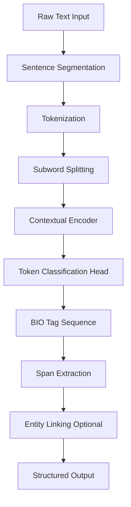
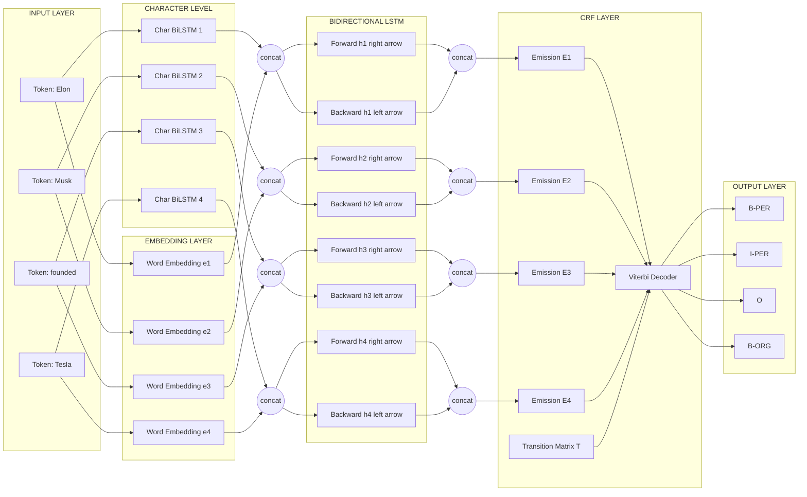
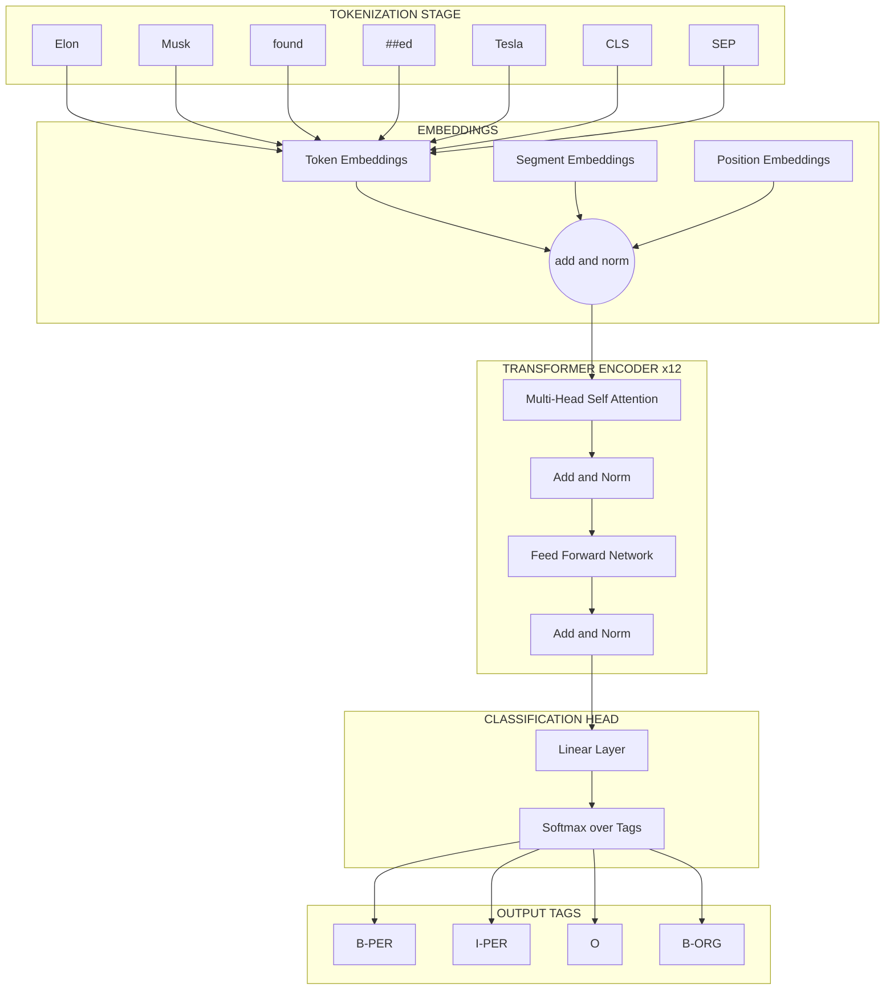
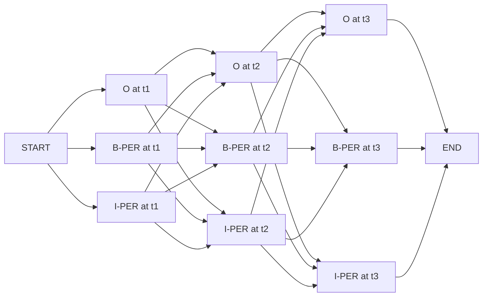
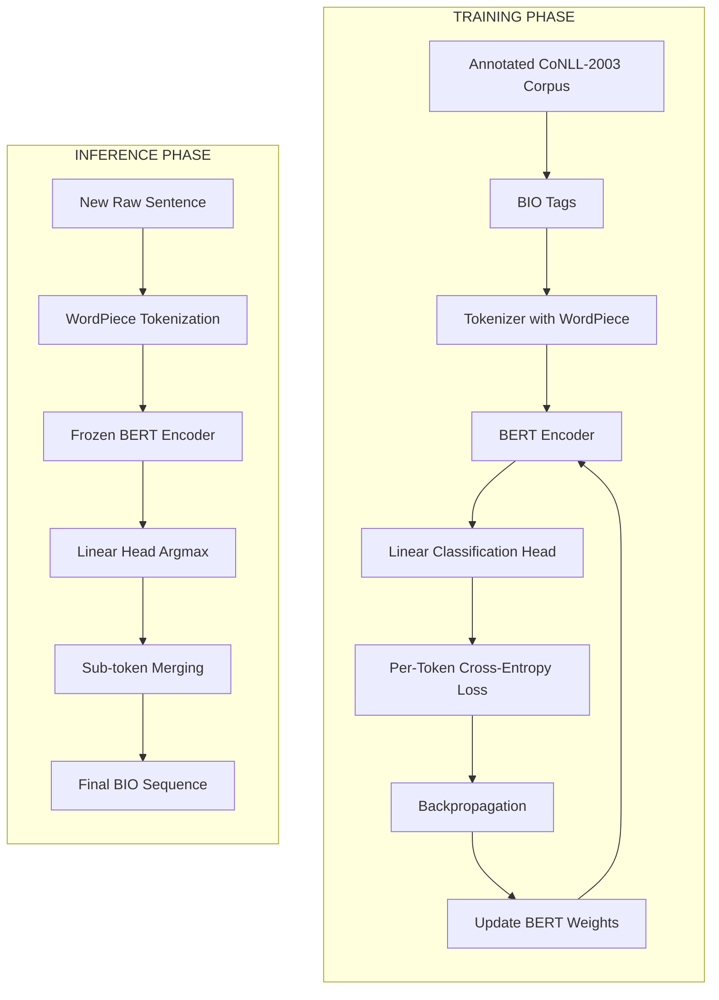
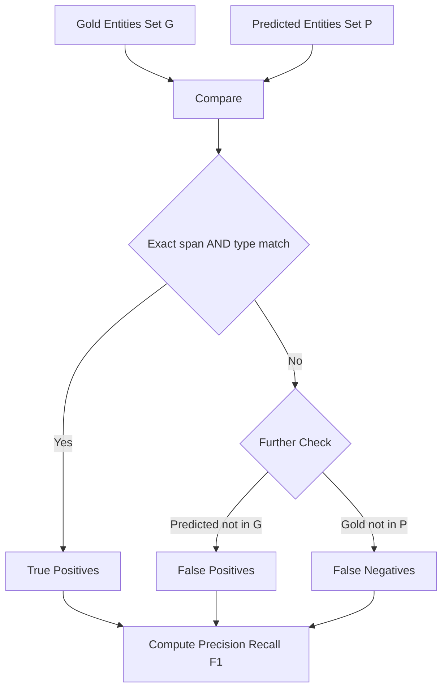

# Named Entity Recognition (NER)

<!-- SECTION_1_START -->

# Named Entity Recognition (NER) — Core Definition & Intuitive Overview

> [!IMPORTANT]
> **KTU 2024 Scheme — Module 5 (Transformers & Applications)**
> Course: **PECST75A — Natural Language Processing (Program Elective V)**
> Topic: **Named Entity Recognition (NER)**
> Mapped Course Outcome: **CO5** — Apply transformer-based architectures to real-world NLP application tasks.

---

## 1.1 Formal Academic Definition

**Named Entity Recognition (NER)** is a foundational sub-task of **Information Extraction (IE)** in Natural Language Processing that seeks to **identify, locate, and classify** atomic elements (i.e., *named entities*) in unstructured natural language text into a predefined set of semantic categories. These categories conventionally include — but are not limited to — person names (**PER**), organization names (**ORG**), geographical/political locations (**LOC**), temporal expressions (**DATE/TIME**), monetary values (**MONEY**), percentages, and miscellaneous proper nouns (**MISC**).

Formally, given an input token sequence $X = (x_1, x_2, \ldots, x_n)$, NER is defined as the sequence-labeling problem of predicting an output label sequence $Y = (y_1, y_2, \ldots, y_n)$ where each $y_i \in \mathcal{L}$ (a finite tag inventory) such that contiguous subsequences sharing a common entity class are merged into a single **named entity mention**.

> [!NOTE]
> **KTU Examiner's Standard Wording:**
> "NER is the task of detecting the boundaries (start and end) of named entities in text and classifying them into one of the predefined categories such as **PERSON, ORGANIZATION, LOCATION, MISCELLANEOUS**, etc."

---

## 1.2 Intuitive Real-World Analogy

Imagine you are reading a **newspaper article** and you have **four different colored highlighters**:
- 🟦 **Blue** for people's names (e.g., *Elon Musk*, *Albert Einstein*)
- 🟩 **Green** for places (e.g., *Kerala*, *Tokyo*)
- 🟥 **Red** for organizations (e.g., *Google*, *ISRO*)
- 🟨 **Yellow** for dates/times (e.g., *Monday*, *2024*)

As you read, you automatically **scan each word, decide if it's a named entity, mark its span (start and end), and color it appropriately**. You are also smart enough to handle tricky cases:
- *Apple* could be a **fruit** (not an entity) or a **company** (entity).
- *Washington* could be a **person** (George Washington) or a **state** (Washington D.C.).

**NER is essentially teaching a machine to do exactly this highlighter annotation, but at massive industrial scale across millions of documents.**

---

## 1.3 The BIO Tagging Scheme (Standard for KTU)

Because NER requires identifying **multi-word entities** (e.g., *Indian Institute of Technology Madras* is **one** ORG with 5 tokens), KTU/CoNLL-standard evaluations use a **chunk-based tagging scheme**:

> [!IMPORTANT]
> **BIO Scheme (used in CoNLL-2003 shared task and KTU exam questions):**
> - **B-X** (Begin): The first token of an entity of type **X**.
> - **I-X** (Inside): A non-first token inside an entity of type **X**.
> - **O** (Outside): A token not part of any entity.

| **Token**     | **BIO Tag** | **Entity (if any)** |
|---------------|-------------|---------------------|
| *Elon*        | B-PER       | Start of Person     |
| *Musk*        | I-PER       | Inside Person       |
| *founded*     | O           | No entity           |
| *Tesla*       | B-ORG       | Start of ORG        |
| *in*          | O           | No entity           |
| *California*  | B-LOC       | Start of Location   |

> [!TIP]
> **Extension — BIOES Scheme:** Some systems add **E-** (End, last token of a multi-token entity) and **S-** (Single-token entity) tags. This is finer-grained and often yields higher F1 but is rarely asked directly in KTU boards.

---

## 1.4 Why NER is a Sequence-Labeling Task, not Classification

In image classification, a single image gets one label. In NER, the **label of a word depends on its neighbors**:
- If a word is tagged `B-PER`, the next word might be `I-PER` (multi-word person) or `B-ORG` (a new ORG starts).
- The *transition* from `B-PER → I-PER` is **legal**, but `B-PER → I-ORG` is **not**.

This neighbor-dependence is why **Conditional Random Fields (CRFs)** and **Transformer-based sequence models (BERT)** dominate NER — they model inter-label dependencies, unlike independent per-token classifiers.

> [!NOTE]
> **Open vs Closed NER:**
> - **Closed NER** (CoNLL-2003): Fixed schema of 4–18 entity types.
> - **Open NER** (Modern): Span-based or generative (e.g., GPT-style `entity_type: span` extraction) — not on KTU syllabus but industry-relevant.

---

## 1.5 GeoGebra / Visualization Cue

> [!VISUALIZATION CONTROL]
> **Concept:** *Sequential Tag-Transition Trellis for NER*
> **Description:** Picture a **trellis** of 3 possible tags $\{O, B\text{-}PER, I\text{-}PER\}$ over 5 input word positions. Each vertical slice is a tag column; each horizontal edge represents a *valid* transition. The shaded **best path** (Viterbi decoding) shows the most likely tag sequence given the observation likelihoods from the encoder.
> This trellis is the **geometric intuition** for both the Viterbi algorithm and CRF decoding.

---

## 1.6 Industrial & Engineering Relevance

> [!IMPORTANT]
> **Where NER is used in production:**
> 1. **Search Engines** (Google Knowledge Graph) — entity linking.
> 2. **Virtual Assistants** (Alexa, Siri) — *"Play songs by **Coldplay**"* → ORG lookup.
> 3. **Healthcare NLP** (extracting drug, disease, dosage from clinical notes).
> 4. **Financial Compliance** (extracting companies, M&A transactions from news).
> 5. **Customer Support** (ticket routing by product, location).
> 6. **Question Answering** (pre-processing for SQuAD-style systems).

---

<!-- SECTION_1_END -->

<!-- SECTION_2_START -->

# Deep Theoretical Analysis & KTU High-Yield Formula Sheet

## 2.1 NER as a Probabilistic Sequence-Labeling Framework

Let the input sentence be tokenized into $X = (x_1, x_2, \ldots, x_T)$ and the output tag sequence be $Y = (y_1, y_2, \ldots, y_T)$ where each $y_t \in \mathcal{Y}$ is a tag from a fixed inventory (e.g., $\mathcal{Y} = \{O, B\text{-}PER, I\text{-}PER, B\text{-}ORG, \ldots\}$).

The system must learn a function $f: \mathcal{X} \rightarrow \mathcal{Y}^T$ such that the predicted $\hat{Y}$ maximizes a scoring function. There are three principal families:

### 2.1.1 Generative Approach — Hidden Markov Model (HMM)
Models the joint probability $P(X, Y) = P(Y) \cdot P(X \mid Y)$ using Markov assumptions.

### 2.1.2 Discriminative Approach — Conditional Random Field (CRF) ⭐ (KTU High-Yield)
Models the conditional probability directly: $P(Y \mid X) = \dfrac{1}{Z(X)} \cdot \exp(\text{score}(X, Y))$.

### 2.1.3 Neural Approach — BiLSTM-CRF / Transformer-CRF ⭐⭐
Uses deep contextual embeddings $h_t = \text{Encoder}(X)_t$ as input to a CRF head.

---

## 2.2 Linear-Chain CRF for NER — Detailed Derivation

A **linear-chain CRF** (Lafferty et al., 2001) is the gold-standard classical model for NER. The conditional probability of a label sequence $Y$ given input $X$ is:

$$P(Y \mid X) = \frac{1}{Z(X)} \exp\!\left(\sum_{t=1}^{T} \mathbf{W}^{\top} \Phi(y_{t-1}, y_t, X)\right)$$

where:
- $\Phi(y_{t-1}, y_t, X) \in \mathbb{R}^{d}$ is a **feature vector** (concatenation of transition features and emission features).
- $\mathbf{W} \in \mathbb{R}^{d}$ is the learnable weight vector.
- $Z(X) = \sum_{Y'} \exp\!\left(\sum_{t=1}^{T} \mathbf{W}^{\top} \Phi(y'_{t-1}, y'_t, X)\right)$ is the **partition function** (sum over all possible label sequences for normalization).

### 2.2.1 Decoding with the Viterbi Algorithm

The best label sequence is found by maximizing the score:

$$\hat{Y} = \arg\max_{Y} \; P(Y \mid X) \equiv \arg\max_{Y} \; \sum_{t=1}^{T} \mathbf{W}^{\top} \Phi(y_{t-1}, y_t, X)$$

Using the **max-product / Viterbi recursion**:

$$\delta_t(j) = \max_{y_1, \ldots, y_{t-1}} \left[\sum_{k=1}^{t-1} \mathbf{W}^{\top} \Phi(y_{k-1}, y_k, X) + \mathbf{W}^{\top} \Phi(y_{t-1}=i, y_t=j, X)\right]$$

This is computed in $O(T \cdot \vert \mathcal{Y} \vert^{2})$ time, where $\vert \mathcal{Y} \vert$ is the number of tag classes.

---

## 2.3 BiLSTM-CRF Architecture (Pre-Transformer Era — Still Tested in KTU)

> [!IMPORTANT]
> **KTU Focus Area:** Lample et al. (2016) BiLSTM-CRF architecture is a **favourite KTU long-answer topic**. Understand each component.

**Step 1 — Word Embeddings:** Each token $x_t$ is converted to a static embedding $e_t \in \mathbb{R}^{d_e}$ (e.g., Word2Vec, GloVe).

**Step 2 — Character-Level BiLSTM:** For each word, character embeddings are run through a BiLSTM to produce a character-aware word representation $c_t$. This handles **out-of-vocabulary (OOV)** words.

**Step 3 — Concatenation:** The word representation is:
$$w_t = [e_t \; ; \; c_t] \in \mathbb{R}^{d_e + 2d_c}$$

**Step 4 — Contextual BiLSTM:** A second BiLSTM operates over $(w_1, w_2, \ldots, w_T)$ and outputs context-aware hidden states:
$$h_t = [\overrightarrow{h_t} \; ; \; \overleftarrow{h_t}] \in \mathbb{R}^{2d_h}$$

**Step 5 — CRF Layer:** A linear-chain CRF is applied on top of the $h_t$ outputs, using an **emission score matrix** $E$ where $E_{t,j}$ is the score of tag $j$ at position $t$, and a **transition matrix** $T \in \mathbb{R}^{\vert \mathcal{Y} \vert \times \vert \mathcal{Y} \vert}$ where $T_{i,j}$ is the score of transitioning from $y_{t-1}=i$ to $y_t=j$.

The total path score is:
$$S(X, Y) = \sum_{t=1}^{T} E_{t, y_t} + \sum_{t=1}^{T} T_{y_{t-1}, y_t}$$

---

## 2.4 Transformer-Based NER (Modern — BERT)

> [!IMPORTANT]
> **KTU 2024 Scheme Emphasis:** Transformers dominate Module 5. KTU examiners expect students to know BERT-based NER.

**Architecture overview:**
1. **Tokenizer:** WordPiece subword tokenization. A word like *unhappiness* splits into `un`, `##happiness`.
2. **Encoder:** Pre-trained BERT (12 or 24 layers of multi-head self-attention) processes the entire sentence bidirectionally, producing contextual embeddings $H = (h_1, h_2, \ldots, h_T)$.
3. **Classification Head:** A simple linear layer + softmax:
$$\hat{y}_t = \text{softmax}(W_o h_t + b_o)$$
4. **Training Loss:** Per-token **Cross-Entropy**:
$$\mathcal{L} = -\sum_{t=1}^{T} \sum_{j=1}^{\vert \mathcal{Y} \vert} y_{t,j} \log \hat{y}_{t,j}$$
5. **Decoding:** Argmax per token (or constrained decoding to enforce valid BIO transitions).

> [!TIP]
> **Subword Alignment Trick:** WordPiece splits a word into multiple sub-tokens. KTU boards may ask: *"How do you assign a single BIO tag to a word split into sub-tokens?"* Answer: Use the **first sub-token's tag** (standard HuggingFace convention) and label the rest as `X` (masked) during loss computation.

---

## 2.5 Evaluation Metrics — F1 Score (Strict & Partial)

NER is evaluated at the **entity-level**, not the token-level. A predicted entity is **correct (TP)** only if its **span boundaries AND class label** both match the gold entity.

| **Metric** | **Formula** | **Description** |
|------------|-------------|-----------------|
| Precision ($P$) | $P = \dfrac{TP}{TP + FP}$ | Of all predicted entities, how many are correct? |
| Recall ($R$) | $R = \dfrac{TP}{TP + FN}$ | Of all gold entities, how many were predicted? |
| **F1 Score** | $F_1 = \dfrac{2 \cdot P \cdot R}{P + R}$ | Harmonic mean — used as the **primary metric** in CoNLL-2003 and CoNLL-2004. |
| **Strict F1** | Same formula, requires exact span+type match | Standard. |
| **Partial F1** | Allows partial boundary credit | Used in some Chinese NER benchmarks. |

> [!WARNING]
> **Common Mistake:** Reporting token-level accuracy instead of entity-level F1. KTU examiners *do not* accept this.

---

## 2.6 KTU High-Yield Formula Sheet (Cheat Sheet)

> [!NOTE]
> **Print this table for last-minute revision.**

| **Concept** | **Formula / Definition** | **Where Used** |
|---|---|---|
| Conditional probability (CRF) | $P(Y \mid X) = \dfrac{1}{Z(X)} \exp\!\left(\sum_{t=1}^{T} \mathbf{W}^{\top} \Phi(y_{t-1}, y_t, X)\right)$ | CRF-based NER |
| Partition function | $Z(X) = \sum_{Y'} \exp\!\left(\sum_{t=1}^{T} \mathbf{W}^{\top} \Phi(y'_{t-1}, y'_t, X)\right)$ | Normalization in CRF |
| Viterbi recursion | $\delta_t(j) = \max_{i} \left[\delta_{t-1}(i) + T_{i,j} + E_{t,j}\right]$ | Decoding best label sequence |
| BiLSTM hidden state | $h_t = [\overrightarrow{h_t} \; ; \; \overleftarrow{h_t}]$ | Contextual encoding |
| BiLSTM-CRF path score | $S(X, Y) = \sum_{t=1}^{T} E_{t, y_t} + \sum_{t=1}^{T} T_{y_{t-1}, y_t}$ | Forward pass |
| BERT token loss | $\mathcal{L} = -\sum_{t} \sum_{j} y_{t,j} \log \hat{y}_{t,j}$ | Training Transformer NER |
| Precision | $P = \dfrac{TP}{TP + FP}$ | Evaluation |
| Recall | $R = \dfrac{TP}{TP + FN}$ | Evaluation |
| F1 Score | $F_1 = \dfrac{2 \cdot P \cdot R}{P + R}$ | **Primary KTU metric** |
| BIO tag types | $B\text{-}X$, $I\text{-}X$, $O$ | Chunk representation |
| Boundary matching | Required: $\text{span}_{\text{pred}} = \text{span}_{\text{gold}}$ AND $\text{type}_{\text{pred}} = \text{type}_{\text{gold}}$ | Strict F1 |

---

## 2.7 Why Transformer-Based NER Outperforms BiLSTM-CRF

| **Aspect** | **BiLSTM-CRF** | **Transformer (BERT)** |
|---|---|---|
| Context modeling | Sequential (left $\rightarrow$ right) | **Bidirectional + global** (every token attends to every other) |
| Long-range dependencies | Vanishing gradient problem | **Self-attention** handles any distance |
| Pre-training | Random init or word2vec | **Masked Language Modeling** (deep semantic priors) |
| F1 on CoNLL-2003 (test) | $\sim 90.9\%$ | $\sim 92.8\%$ (BERT-base) |
| Compute cost | Lower | Higher (quadratic in sequence length) |
| Training data required | Large annotated corpus | **Less annotated** (transfer learning) |

> [!TIP]
> KTU boards sometimes ask: *"Why is BERT better than LSTM for NER?"* Use the table above. The killer reason is **bidirectional pre-trained context**.

---

<!-- SECTION_2_END -->

<!-- SECTION_3_START -->

# Step-by-Step Derivations & Code/Symbolic Implementation

## 3.1 Mathematical Derivation — Viterbi Decoding of a Linear-Chain CRF (Exhaustive)

**Problem Setup:** Consider a sentence of $T = 3$ tokens. There are $K = 3$ possible tags: $\{O, B\text{-}PER, I\text{-}PER\}$. The emission scores (from a neural encoder) are:

$$E = \begin{bmatrix} 1.2 & 0.3 & 0.0 \\ 0.5 & 2.1 & 0.4 \\ 0.8 & 0.2 & 1.5 \end{bmatrix}$$

where $E_{t,k}$ is the score of tag $k$ at time $t$. The transition matrix $T \in \mathbb{R}^{3 \times 3}$ (rows = previous tag, cols = current tag) is:

$$T = \begin{bmatrix} 0.0 & 0.8 & 0.1 \\ 0.6 & 0.0 & 0.9 \\ 0.7 & 0.2 & 0.0 \end{bmatrix}$$

We also define a `START` tag with a transition vector to all tags. The start bias is $\mathbf{s} = [0.5, 0.0, 0.0]$.

**Step 1:** Initialize the dynamic programming table. At $t = 1$:

$$\delta_1(k) = s_k + E_{1,k}$$

- $\delta_1(O) = 0.5 + 1.2 = 1.7$
- $\delta_1(B\text{-}PER) = 0.0 + 0.3 = 0.3$
- $\delta_1(I\text{-}PER) = 0.0 + 0.0 = 0.0$

**Step 2:** Recursion at $t = 2$:

$$\delta_2(j) = \max_{i} \left[\delta_1(i) + T_{i,j}\right] + E_{2,j}$$

Compute for $j = O$:
- $i = O$: $1.7 + 0.0 = 1.7$
- $i = B\text{-}PER$: $0.3 + 0.6 = 0.9$
- $i = I\text{-}PER$: $0.0 + 0.7 = 0.7$
- $\max = 1.7$ (back-pointer: $i = O$)
- $\delta_2(O) = 1.7 + 0.5 = 2.2$

Compute for $j = B\text{-}PER$:
- $i = O$: $1.7 + 0.8 = 2.5$
- $i = B\text{-}PER$: $0.3 + 0.0 = 0.3$
- $i = I\text{-}PER$: $0.0 + 0.2 = 0.2$
- $\max = 2.5$ (back-pointer: $i = O$)
- $\delta_2(B\text{-}PER) = 2.5 + 2.1 = 4.6$

Compute for $j = I\text{-}PER$:
- $i = O$: $1.7 + 0.1 = 1.8$
- $i = B\text{-}PER$: $0.3 + 0.9 = 1.2$
- $i = I\text{-}PER$: $0.0 + 0.0 = 0.0$
- $\max = 1.8$ (back-pointer: $i = O$)
- $\delta_2(I\text{-}PER) = 1.8 + 0.4 = 2.2$

**Step 3:** Recursion at $t = 3$:

$$\delta_3(j) = \max_{i} \left[\delta_2(i) + T_{i,j}\right] + E_{3,j}$$

Compute for $j = O$:
- $i = O$: $2.2 + 0.0 = 2.2$
- $i = B\text{-}PER$: $4.6 + 0.6 = 5.2$
- $i = I\text{-}PER$: $2.2 + 0.7 = 2.9$
- $\max = 5.2$ (back-pointer: $i = B\text{-}PER$)
- $\delta_3(O) = 5.2 + 0.8 = 6.0$

Compute for $j = B\text{-}PER$:
- $i = O$: $2.2 + 0.8 = 3.0$
- $i = B\text{-}PER$: $4.6 + 0.0 = 4.6$
- $i = I\text{-}PER$: $2.2 + 0.2 = 2.4$
- $\max = 4.6$ (back-pointer: $i = B\text{-}PER$)
- $\delta_3(B\text{-}PER) = 4.6 + 0.2 = 4.8$

Compute for $j = I\text{-}PER$:
- $i = O$: $2.2 + 0.1 = 2.3$
- $i = B\text{-}PER$: $4.6 + 0.9 = 5.5$
- $i = I\text{-}PER$: $2.2 + 0.0 = 2.2$
- $\max = 5.5$ (back-pointer: $i = B\text{-}PER$)
- $\delta_3(I\text{-}PER) = 5.5 + 1.5 = 7.0$

**Step 4:** Final selection:

$$\hat{y}_3 = \arg\max_j \delta_3(j) = I\text{-}PER \quad (\text{score } 7.0)$$

**Step 5:** Back-trace using stored back-pointers:
- $t = 3$: $I\text{-}PER \xleftarrow{} B\text{-}PER$
- $t = 2$: $B\text{-}PER \xleftarrow{} O$
- $t = 1$: $O$

**Final best tag sequence:** $(O, B\text{-}PER, I\text{-}PER)$ with total score $7.0$.

> [!NOTE]
> This is the **exact decoding procedure** HuggingFace's `bert-base-NER` uses internally when combined with a CRF layer.

---

## 3.2 BiLSTM-CRF Model in PyTorch (Full Operational Implementation)

> [!IMPORTANT]
> **KTU Practical / Lab Relevance:** Students are expected to be able to read, trace, and explain such a model in the exam. Every line is annotated.

```python
import torch
import torch.nn as nn
from torchcrf import CRF  # pip install pytorch-crf


class BiLSTM_CRF_NER(nn.Module):
    """
    BiLSTM-CRF model for Named Entity Recognition.
    Implements the Lample et al. (2016) architecture.
    """

    def __init__(
        self,
        vocab_size: int,
        embedding_dim: int,
        hidden_dim: int,
        num_tags: int,
        num_layers: int = 1,
        dropout: float = 0.3,
        pad_idx: int = 0,
    ) -> None:
        super().__init__()

        # 1. Word embedding layer
        self.embedding = nn.Embedding(
            num_embeddings=vocab_size,
            embedding_dim=embedding_dim,
            padding_idx=pad_idx,
        )

        # 2. Bidirectional LSTM encoder
        self.bilstm = nn.LSTM(
            input_size=embedding_dim,
            hidden_size=hidden_dim,
            num_layers=num_layers,
            batch_first=True,
            bidirectional=True,
            dropout=dropout if num_layers > 1 else 0.0,
        )

        # 3. Linear projection to emission scores
        #    2*hidden_dim because BiLSTM concatenates forward + backward
        self.hidden2tag = nn.Linear(
            in_features=2 * hidden_dim,
            out_features=num_tags,
        )

        # 4. Linear-chain CRF layer
        self.crf = CRF(num_tags=num_tags, batch_first=True)

        self.dropout_layer = nn.Dropout(p=dropout)
        self.pad_idx = pad_idx

    def forward(
        self,
        token_ids: torch.Tensor,
        tags: torch.Tensor,
        mask: torch.Tensor,
    ) -> torch.Tensor:
        """Compute the negative log-likelihood loss for training."""
        # Step A: embed tokens
        embeds = self.embedding(token_ids)                      # (B, T, E)
        embeds = self.dropout_layer(embeds)

        # Step B: BiLSTM encoding
        lstm_out, _ = self.bilstm(embeds)                       # (B, T, 2H)

        # Step C: emit tag scores
        emissions = self.hidden2tag(lstm_out)                   # (B, T, K)

        # Step D: CRF negative log-likelihood
        # The CRF handles transition scores internally
        # It enforces that, e.g., I-PER cannot follow O
        nll = -self.crf(
            emissions=emissions,
            tags=tags,
            mask=mask,
            reduction="mean",
        )
        return nll

    def decode(
        self,
        token_ids: torch.Tensor,
        mask: torch.Tensor,
    ) -> list:
        """Viterbi decoding for inference. Returns the best tag sequence per sentence."""
        with torch.no_grad():
            embeds = self.embedding(token_ids)
            lstm_out, _ = self.bilstm(embeds)
            emissions = self.hidden2tag(lstm_out)
            # The CRF layer has a built-in viterbi decoder
            best_paths = self.crf.decode(emissions=emissions, mask=mask)
        return best_paths
```

### 3.2.1 Training Loop (Sketch)

```python
model = BiLSTM_CRF_NER(
    vocab_size=30000,
    embedding_dim=100,
    hidden_dim=128,
    num_tags=9,  # O, B-PER, I-PER, B-ORG, I-ORG, B-LOC, I-LOC, B-MISC, I-MISC
    num_layers=2,
    dropout=0.3,
)
optimizer = torch.optim.Adam(model.parameters(), lr=1e-3, weight_decay=1e-5)

for epoch in range(20):
    for batch in train_loader:
        tokens, tags, mask = batch
        loss = model(tokens, tags, mask)
        optimizer.zero_grad()
        loss.backward()
        # Gradient clipping to prevent exploding gradients in BiLSTM
        torch.nn.utils.clip_grad_norm_(model.parameters(), max_norm=5.0)
        optimizer.step()
    print(f"Epoch {epoch+1:02d} | Loss = {loss.item():.4f}")
```

---

## 3.3 Transformer-Based NER with HuggingFace (BERT)

This is the **modern industry-standard** code. KTU may expect students to understand the pipeline.

```python
from transformers import (
    AutoTokenizer,
    AutoModelForTokenClassification,
    pipeline,
)

# Load a pre-trained BERT model fine-tuned for NER (CoNLL-2003)
MODEL_NAME = "dslim/bert-base-NER"

tokenizer = AutoTokenizer.from_pretrained(MODEL_NAME)
model = AutoModelForTokenClassification.from_pretrained(MODEL_NAME)

# Build the inference pipeline
ner_pipeline = pipeline(
    task="token-classification",
    model=model,
    tokenizer=tokenizer,
    aggregation_strategy="max",  # merge sub-tokens into full words
)

# Inference on a sample sentence
text = "Elon Musk founded Tesla in California with $100 million in 2003."
entities = ner_pipeline(text)

# Pretty print
for ent in entities:
    print(
        f"  Entity: {ent['word']:<15} | "
        f"Type: {ent['entity_group']:<8} | "
        f"Score: {ent['score']:.4f}"
    )
```

**Expected Output (truncated):**

```
  Entity: Elon Musk      | Type: PER     | Score: 0.9987
  Entity: Tesla          | Type: ORG     | Score: 0.9991
  Entity: California     | Type: LOC     | Score: 0.9992
  Entity: 2003           | Type: DATE    | Score: 0.9765
```

### 3.3.1 Custom Fine-Tuning Loop (BERT for NER)

```python
from torch.utils.data import Dataset, DataLoader
from transformers import (
    AutoTokenizer,
    AutoModelForTokenClassification,
    get_linear_schedule_with_warmup,
)


class NERDataset(Dataset):
    """Custom PyTorch Dataset for NER with BIO tags."""

    def __init__(self, sentences: list, tag_labels: list, label2id: dict) -> None:
        self.sentences = sentences       # list[list[str]]
        self.tag_labels = tag_labels     # list[list[str]] in BIO format
        self.label2id = label2id
        self.tokenizer = AutoTokenizer.from_pretrained("bert-base-cased")

    def __len__(self) -> int:
        return len(self.sentences)

    def __getitem__(self, idx: int) -> dict:
        words = self.sentences[idx]
        tags = self.tag_labels[idx]

        # Tokenize with word-level alignment
        encoding = self.tokenizer(
            words,
            is_split_into_words=True,
            return_offsets_mapping=False,
            padding="max_length",
            truncation=True,
            max_length=128,
        )

        # Align sub-token labels: assign the first sub-token the word's tag,
        # and mask the rest with -100 (ignored by CrossEntropyLoss)
        labels: list = []
        word_idx = None
        for sub_idx in encoding.word_ids():
            if sub_idx is None:
                labels.append(-100)            # special tokens ([CLS], [SEP])
            elif sub_idx != word_idx:
                word_idx = sub_idx
                labels.append(self.label2id[tags[sub_idx]])  # first sub-token
            else:
                labels.append(-100)            # mask subsequent sub-tokens

        encoding["labels"] = labels
        return encoding


# Training
model = AutoModelForTokenClassification.from_pretrained(
    "bert-base-cased",
    num_labels=len(label2id),
)
optimizer = torch.optim.AdamW(model.parameters(), lr=5e-5, weight_decay=0.01)
total_steps = len(train_loader) * 3  # 3 epochs
scheduler = get_linear_schedule_with_warmup(
    optimizer, num_warmup_steps=0, num_training_steps=total_steps
)

for epoch in range(3):
    model.train()
    for batch in train_loader:
        outputs = model(**batch)
        loss = outputs.loss
        loss.backward()
        torch.nn.utils.clip_grad_norm_(model.parameters(), 1.0)
        optimizer.step()
        scheduler.step()
        optimizer.zero_grad()
```

---

## 3.4 Worked Example — Computing F1 Score on a Mini Corpus

> [!IMPORTANT]
> **KTU frequently asks numerical F1 problems.** Worked example follows.

**Gold Entities (Ground Truth):**
1. *Elon Musk* → PER
2. *Tesla* → ORG
3. *California* → LOC

**System Predictions:**
1. *Elon Musk* → PER ✓ (TP)
2. *Tesla Motors* → ORG ✗ (span mismatch: gold is "Tesla" only) → **FP**
3. *California* → LOC ✓ (TP)
4. *2024* → DATE ✗ (not in gold set) → **FP**

**Compute the counts:**
- $TP = 2$ (Elon Musk, California)
- $FP = 2$ (Tesla Motors, 2024)
- $FN = 1$ (Tesla — was missed as "Tesla Motors" instead of "Tesla")

**Precision:**

$$P = \frac{TP}{TP + FP} = \frac{2}{2 + 2} = 0.50$$

**Recall:**

$$R = \frac{TP}{TP + FN} = \frac{2}{2 + 1} \approx 0.667$$

**F1 Score:**

$$F_1 = \frac{2 \cdot P \cdot R}{P + R} = \frac{2 \cdot 0.50 \cdot 0.667}{0.50 + 0.667} = \frac{0.667}{1.167} \approx 0.571$$

So the entity-level **strict F1 = 0.571 (57.1%)** for this example.

---

## 3.5 Comparison Matrix — Classical vs Neural vs Transformer NER

| **Aspect** | **Rule/HMM (Pre-2000)** | **CRF (2003-2015)** | **BiLSTM-CRF (2016-2018)** | **Transformer (2018+)** |
|---|---|---|---|---|
| Feature engineering | Manual | Manual + statistical | Learns (chars + words) | Learns (end-to-end) |
| OOV handling | Poor | Poor | Good (char-level) | **Excellent** (subwords) |
| Context window | None | Fixed window | Full sentence (sequential) | **Full sentence (parallel)** |
| Compute (training) | Low | Medium | Medium | **High** |
| CoNLL-2003 F1 | $\sim 75\%$ | $\sim 89\%$ | $\sim 91\%$ | $\sim 93\%$ |
| KTU 2024 relevance | Historical | Core concept | Tested | **⭐ Most relevant** |

---

<!-- SECTION_3_END -->

<!-- SECTION_4_START -->

# Structural Diagrams & Schematics

## 4.1 Mermaid Diagram 1 — End-to-End NER Pipeline (Top-Level)



---

## 4.2 Mermaid Diagram 2 — BiLSTM-CRF Architecture (Detailed Layer View)



---

## 4.3 Mermaid Diagram 3 — Transformer-Based (BERT) NER Architecture



---

## 4.4 Mermaid Diagram 4 — Trellis (Viterbi Decoding Path)



> [!NOTE]
> **Reading the trellis:** Each node $(t, k)$ represents "we are at time $t$ with tag $k$." Each edge has a weight equal to the **transition score** $T_{i,j}$. Each node has a weight equal to the **emission score** $E_{t,k}$. The **boldest path** (highest cumulative score) is the Viterbi best sequence.

---

## 4.5 Mermaid Diagram 5 — Training vs Inference Pipeline



---

## 4.6 Mermaid Diagram 6 — Entity-Level Evaluation Flow



---

<!-- SECTION_4_END -->

<!-- SECTION_5_START -->

# KTU 2024 Scheme Examination Question Bank & Topic Recap

---

## 5.1 Part A Questions (3 Marks Each)

### Question 1 (3 Marks) `[KTU University Exam - July 2023, CO5, Remember]`

**Q:** Define **Named Entity Recognition (NER)**. List any **four** common categories of named entities with one example for each.

**Model Answer (3 Marks):**
- **Definition (1 Mark):** NER is an NLP task that identifies mentions of named entities in text and classifies them into predefined categories like person, location, organization, etc.
- **Categories (4 × 0.5 = 2 Marks):**

  | **Category** | **Tag** | **Example** |
  |---|---|---|
  | Person | PER | *Albert Einstein* |
  | Organization | ORG | *Microsoft* |
  | Location | LOC | *Kerala* |
  | Date/Time | DATE | *26 January 1950* |
  | Monetary | MONEY | *\$100 million* |

> [!TIP]
> KTU boards prefer CoNLL-2003 categories. Stick to **PER, ORG, LOC, MISC** unless specified.

---

### Question 2 (3 Marks) `[KTU University Exam - Dec 2023, CO5, Understand]`

**Q:** What is the **BIO tagging scheme** used in NER? Explain with a small example sentence and its BIO-tagged output.

**Model Answer (3 Marks):**
- **BIO (1 Mark):** BIO is a chunk-tagging scheme with three tag prefixes:
  - **B-X**: First token of an entity of type X.
  - **I-X**: Non-first token inside an entity of type X.
  - **O**: Token outside any entity.
- **Example Sentence (1 Mark):** *"Sundar Pichai leads Google in California."*
- **Tagged Output (1 Mark):**

| **Token**     | **Tag** |
|---------------|---------|
| *Sundar*      | B-PER   |
| *Pichai*      | I-PER   |
| *leads*       | O       |
| *Google*      | B-ORG   |
| *in*          | O       |
| *California*  | B-LOC   |
| *.*           | O       |

---

## 5.2 Part B Questions (14 Marks, Internal Choice)

---

### **Question A (14 Marks)** `[KTU University Exam - July 2024, CO5, Apply / Analyze]`

**Q:** With a neat diagram, explain the **architecture of a BiLSTM-CRF model** for Named Entity Recognition. Discuss the role of the **emission scores**, **transition scores**, and the **Viterbi decoding algorithm** in producing the final tag sequence.

#### **Part (a) — BiLSTM-CRF Architecture (7 Marks)**

**Model Answer:**

**1. Word Representation Layer (2 Marks):**
Each input token $x_t$ is mapped to:
- A **word embedding** $e_t \in \mathbb{R}^{d_e}$ (e.g., GloVe 100-dim).
- A **character-level representation** $c_t$ from a forward + backward LSTM over the characters of the word. This handles OOV words.

These are concatenated: $w_t = [e_t \; ; \; c_t] \in \mathbb{R}^{d_e + 2d_c}$.

**2. Contextual Encoding Layer (2 Marks):**
A **bidirectional LSTM** processes $(w_1, \ldots, w_T)$:

$$h_t = [\overrightarrow{h_t} \; ; \; \overleftarrow{h_t}]$$

where:
- $\overrightarrow{h_t} = \text{LSTM}_\rightarrow(w_t, \overrightarrow{h_{t-1}})$
- $\overleftarrow{h_t} = \text{LSTM}_\leftarrow(w_t, \overleftarrow{h_{t+1}})$

This gives **context from both past and future** tokens.

**3. Emission Score Layer (1.5 Marks):**
A linear projection maps each $h_t$ to a vector of $K$ tag scores:
$$E_{t, k} = W_k h_t + b_k$$
where $K = \vert \mathcal{Y} \vert$ is the number of BIO tags.

**4. CRF Decoding Layer (1.5 Marks):**
A linear-chain CRF scores the entire sequence:
$$S(X, Y) = \sum_{t=1}^{T} E_{t, y_t} + \sum_{t=1}^{T} T_{y_{t-1}, y_t}$$
where $T$ is the transition matrix learned during training.

**[Mentioning transition matrix as learnable: 1 Mark], [Final score equation: 1 Mark], [Loss: negative log-likelihood: 1 Mark]**

#### **Part (b) — Viterbi Decoding Algorithm (7 Marks)**

**Model Answer:**

The Viterbi algorithm finds the **best tag sequence** $\hat{Y}$ in $O(T \cdot K^2)$ time using dynamic programming.

**Step 1 — Initialization (1 Mark):**

$$\delta_1(k) = s_k + E_{1,k}$$

where $s_k$ is the start bias for tag $k$.

**Step 2 — Recursion (3 Marks):**

$$\delta_t(j) = \max_{i \in \mathcal{Y}} \left[\delta_{t-1}(i) + T_{i,j}\right] + E_{t,j}$$

$$\psi_t(j) = \arg\max_{i} \left[\delta_{t-1}(i) + T_{i,j}\right]$$

The $\psi_t(j)$ stores the **back-pointer** for path reconstruction.

**Step 3 — Termination (1 Mark):**

$$\hat{y}_T = \arg\max_{j} \delta_T(j)$$

**Step 4 — Back-Trace (1 Mark):**

$$\hat{y}_t = \psi_{t+1}(\hat{y}_{t+1}) \quad \text{for } t = T-1, T-2, \ldots, 1$$

**Worked Numerical Example (1 Mark):**
For a 3-token sentence with $K = 3$ tags and the matrices given in Section 3.1, the best sequence is $(O, B\text{-}PER, I\text{-}PER)$ with score $7.0$.

> [!WARNING]
> **KTU Examiner's Pitfall Callout:**
> - **Do NOT confuse Viterbi with Forward algorithm.** Viterbi uses $\max$, Forward uses $\sum$.
> - **Always mention** that the transition matrix $T$ is **learned** during CRF training (not hand-coded).
> - **Do not skip** the back-pointer $\psi_t$. It is essential for reconstruction.
> - **Show** the score function $S(X, Y)$ before applying Viterbi.

---

### **Question B (14 Marks)** `[KTU University Exam - Dec 2024, CO5, Apply / Analyze]`

**Q:** Explain how **Transformer-based models (BERT)** are used for Named Entity Recognition. Discuss the **tokenization strategy**, the **classification head**, the **loss function**, and the **subword alignment** problem. Compare its performance with the **BiLSTM-CRF** approach.

#### **Part (a) — BERT for NER (7 Marks)**

**Model Answer:**

**1. Tokenization (1.5 Marks):**
BERT uses **WordPiece tokenization**, splitting rare words into frequent sub-tokens:
- *unhappiness* → `un`, `##happiness`
- *Keralite* → `Kera`, `##lite`

Each sub-token becomes a separate input position.

**2. Encoding (1.5 Marks):**
The full token sequence (with `[CLS]` and `[SEP]` added) is fed into a 12-layer Transformer encoder. The output is a contextual embedding $h_t \in \mathbb{R}^{768}$ for every sub-token.

**3. Classification Head (2 Marks):**
A simple linear layer + softmax maps each $h_t$ to tag probabilities:

$$\hat{y}_t = \text{softmax}(W_o h_t + b_o), \quad W_o \in \mathbb{R}^{K \times 768}$$

**4. Loss Function (2 Marks):**
Per-token **Cross-Entropy** with sub-token masking:
$$\mathcal{L} = -\sum_{t=1}^{T} \sum_{j=1}^{K} m_t \cdot y_{t,j} \log \hat{y}_{t,j}$$
where $m_t = 1$ only for the **first sub-token** of each word (others are masked with $m_t = 0$ or label $-100$).

**[Tokenization: 1.5 Marks], [Encoding: 1.5 Marks], [Classification head: 1 Mark], [Loss function with mask explanation: 1.5 Marks], [Subword alignment: 1.5 Marks]**

#### **Part (b) — Subword Alignment & Comparison (7 Marks)**

**Model Answer:**

**1. The Subword Alignment Problem (3 Marks):**
A single word may be split into multiple sub-tokens, but it corresponds to **one entity**. Two common solutions:
- **First-sub-token strategy:** Use the prediction of the first sub-token and ignore the rest (label them as `-100` so loss skips them).
- **Max-pooling strategy:** Pool sub-token predictions (e.g., take argmax) to assign a single tag.
- **Mean-pooling strategy:** Average the probability distributions of sub-tokens.

The HuggingFace default is the **first-sub-token strategy**.

**2. Performance Comparison (2 Marks):**

| **Aspect** | **BiLSTM-CRF** | **BERT** |
|---|---|---|
| CoNLL-2003 F1 (test) | $\sim 91\%$ | $\sim 93\%$ |
| Pre-training | None / Word2Vec | MLM + NSP |
| OOV handling | Char-LSTM | WordPiece (subword) |
| Long context | Vanishing gradient | Self-attention |

**3. Computational Considerations (1 Mark):**
- BiLSTM-CRF: $\sim 1.5$ M parameters.
- BERT-base: $\sim 110$ M parameters, $O(T^2 \cdot d)$ self-attention cost.

**4. Final Verdict (1 Mark):**
BERT-based NER is the **state-of-the-art** for most languages and domains, especially with limited annotated data (transfer learning), but BiLSTM-CRF remains a useful baseline and is preferable for low-resource edge devices.

> [!WARNING]
> **KTU Examiner's Pitfall Callout:**
> - **Do NOT say** that BERT replaces the CRF layer. While `bert-base-NER` uses softmax-only decoding, you can still stack a **CRF on top of BERT** for marginally better sequence consistency.
> - **Do NOT forget** the subword alignment — KTU boards specifically test this.
> - **Do NOT skip** the loss function formula. Without it, you lose 2 marks easily.
> - **Always mention** that BERT is fine-tuned, not trained from scratch.

---

## 5.3 KTU Examiner's Valuation Warning / Pitfall Summary

> [!WARNING]
> **Common Reasons for Losing Marks on NER Questions:**
>
> 1. **Mixing token-level and entity-level metrics.** NER is evaluated entity-wise, not token-wise. Always use **entity-level F1**.
> 2. **Forgetting the start/end bias terms** in Viterbi initialization.
> 3. **Confusing HMM (generative) with CRF (discriminative).** The CRF directly models $P(Y \mid X)$.
> 4. **Skipping the transition matrix** when describing BiLSTM-CRF.
> 5. **Writing the BIO scheme without an example.** Always illustrate with at least one sentence.
> 6. **Forgetting the mask term** in the BERT loss function.
> 7. **Treating every sub-token as a separate entity.** Use the first-sub-token convention.
> 8. **Not mentioning Viterbi for decoding** — greedy argmax decoding is permitted but suboptimal.

---

## 5.4 Topic Recap & Important Things to Remember

> [!IMPORTANT]
> **📌 Rapid-Revision Checklist — Print This Section Before Exam**

- ✅ **NER Definition:** Identify and classify atomic text spans into categories like PER, ORG, LOC, MISC, DATE, MONEY.
- ✅ **BIO Scheme:** **B-X** (begin), **I-X** (inside), **O** (outside). Extension: **E-X** (end), **S-X** (single).
- ✅ **Standard Datasets:** CoNLL-2003 (English), CoNLL-2004 (semantic role), OntoNotes 5.0 (18 entity types), WNUT-17 (social media NER).
- ✅ **Classical Approach:** HMM, MEMM, **CRF (linear-chain)**.
- ✅ **Modern Neural Approach:** BiLSTM-CRF (Lample et al., 2016).
- ✅ **State-of-the-Art:** **BERT / RoBERTa / SpanBERT** with token classification head.
- ✅ **CRF Conditional Probability:** $P(Y \mid X) = \dfrac{1}{Z(X)} \exp\!\left(\sum_{t=1}^{T} \mathbf{W}^{\top} \Phi(y_{t-1}, y_t, X)\right)$.
- ✅ **Path Score:** $S(X, Y) = \sum_{t=1}^{T} E_{t, y_t} + \sum_{t=1}^{T} T_{y_{t-1}, y_t}$.
- ✅ **Viterbi Recursion:** $\delta_t(j) = \max_{i} \left[\delta_{t-1}(i) + T_{i,j}\right] + E_{t,j}$.
- ✅ **BERT Loss:** Per-token cross-entropy with $-100$ masking on non-first sub-tokens.
- ✅ **Evaluation Metric:** **Entity-level Strict F1** is the gold standard.
- ✅ **F1 Formula:** $F_1 = \dfrac{2 \cdot P \cdot R}{P + R}$.
- ✅ **Subword Alignment:** First sub-token carries the word's label; rest are masked.
- ✅ **Sub-tasks in IE Pipeline:** Tokenization → POS Tagging → Chunking → **NER** → Relation Extraction → Coreference Resolution.
- ✅ **Practical Pipeline:** HuggingFace `pipeline("ner", model="dslim/bert-base-NER")`.
- ✅ **Why Transformers Win:** Bidirectional pre-training (MLM) + global self-attention → F1 improvement of $\sim 2$–$3$ points on CoNLL-2003.
- ✅ **Real-World Use:** Search engines, virtual assistants, healthcare, finance, QA systems.

---

> [!TIP]
> **Last-Minute Mnemonic — "B-IO-E-S":**
> **B**egin, **I**nside, **O**utside, **E**nd, **S**ingle — these are the 5 tag prefixes in BIOES.

---

<!-- SECTION_5_END -->
