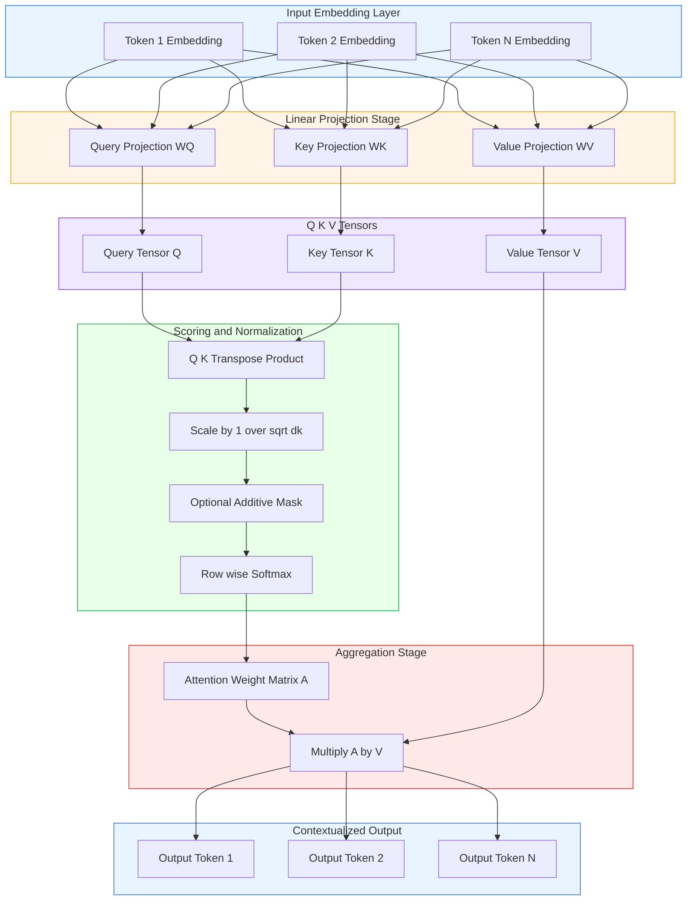
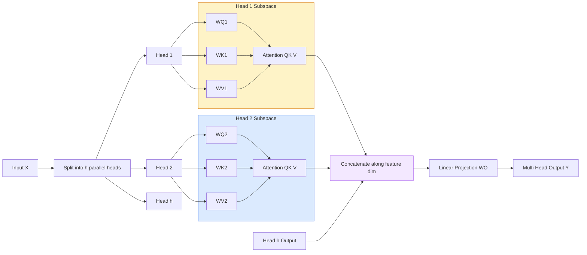

# Self-attention

<!-- SECTION_1_START -->
# Self-Attention Mechanism — Core Technical Definition & Intuitive Overview

## 1.1 Formal Academic Definition (KTU 2024 Syllabus Aligned)

**Self-Attention** (also called **intra-attention** or **scaled dot-product attention**) is a sequence-to-sequence operation that computes a contextualized representation of every token in a sequence by allowing each position to attend to *all* other positions in the same sequence. For an input matrix $X \in \mathbb{R}^{n \times d_{model}}$ containing $n$ token embeddings of dimension $d_{model}$, self-attention produces an output $Y \in \mathbb{R}^{n \times d_{model}}$ such that each output row is a weighted sum of linearly transformed input rows, where the weights are learned through three projected matrices: the **Query** $W^Q$, the **Key** $W^K$, and the **Value** $W^V$.

Mathematically, the canonical transformer self-attention is:

$$\text{Attention}(Q, K, V) = \text{softmax}\!\left(\frac{QK^{\top}}{\sqrt{d_k}}\right) V$$

where $Q = X W^Q$, $K = X W^K$, and $V = X W^V$ are the three learned projections, and $d_k$ is the dimensionality of the key vectors.

> [!IMPORTANT]
> **KTU 2024 Highlight:** Self-attention is the **fundamental building block** of the Transformer architecture (Vaswani et al., 2017). It is the *only* operation (apart from feed-forward layers and residual connections) that mixes information *across token positions*. Without it, the model would be a bag-of-words.

## 1.2 Conceptual Analogy & Plain-English Intuition

Imagine you are reading the sentence:

> *"The **animal** didn't cross the street because **it** was too tired."*

When a human reads the word **"it"**, your brain instantly knows that **"it"** refers to **"the animal"**, not "the street". You *attend* more strongly to the relevant word. Self-attention lets a neural network do the same thing: when processing the embedding of "it", the model computes a score against *every other word* in the sentence and assigns higher weights to semantically related tokens.

### The Library Search Analogy

| Component | Real-World Analogy | Role |
|---|---|---|
| **Query (Q)** | Your search query | "What am I looking for?" |
| **Key (K)** | Index labels of books | "How well does each book match my query?" |
| **Value (V)** | The actual content of books | "Here is the information I retrieve" |

Every word *simultaneously acts as a query, a key, and a value*. The output of a word is essentially a custom-blended copy of all the words in the sentence, with blending weights determined by pairwise compatibility.

## 1.3 Physical & Statistical Constants Used

- **Scaling factor:** $\sqrt{d_k}$ — prevents the softmax from saturating when $d_k$ is large.
- **Softmax temperature:** implicitly controlled by the dot-product magnitude.
- **Default dimensionalities in classic papers:** $d_{model} = 512$, $d_k = d_v = 64$, $h = 8$ heads.

> [!NOTE]
> **Why divide by $\sqrt{d_k}$?** As $d_k$ grows, the variance of $QK^{\top}$ grows linearly, pushing the softmax into regions of extremely small gradients. Dividing by $\sqrt{d_k}$ normalizes the variance back to **1**, keeping gradients healthy.

> [!VISUALIZATION CONTROL]
> **Concept:** Softmax distribution over attention scores for a 5-token sequence.
> **GeoGebra / Desmos Input Equations:**
> * `a(x) = exp(x)/sum(exp(x))` for a row of logits $[2.0,\ 0.5,\ 1.2,\ 3.0,\ 0.1]$
> * Plot as a bar chart: `BarChart(\{2.0, 0.5, 1.2, 3.0, 0.1\})`
> **Visual Description:** You should observe four short bars and one tall bar (the token with the highest logit). The taller bar indicates the position that the current query word attends to most strongly. After scaling by $\sqrt{d_k}$ and softmax, the tallest bar dominates but the others still receive non-zero mass, allowing soft information flow.

---

<!-- SECTION_1_END -->

<!-- SECTION_2_START -->
# Deep Theoretical Analysis & KTU High-Yield Formula Sheet

## 2.1 Operational Breakdown — How Self-Attention Works (Step by Step)

Given an input sequence of token embeddings stacked into matrix $X \in \mathbb{R}^{n \times d_{model}}$:

1. **Linear Projection (Three Independent Linear Layers).** Project $X$ into three different subspaces using learned weight matrices:
   * $Q = X W^Q$ where $W^Q \in \mathbb{R}^{d_{model} \times d_k}$
   * $K = X W^K$ where $W^K \in \mathbb{R}^{d_{model} \times d_k}$
   * $V = X W^V$ where $W^V \in \mathbb{R}^{d_{model} \times d_v}$

2. **Pairwise Compatibility (Scaled Dot-Product).** Compute raw attention scores as the dot product between every query and every key:
   $$S = Q K^{\top} \quad \in \mathbb{R}^{n \times n}$$
   Each entry $S_{ij}$ measures how much the $i^{th}$ token attends to the $j^{th}$ token.

3. **Scaling.** Divide by $\sqrt{d_k}$ to stabilize gradients:
   $$\hat{S} = \frac{QK^{\top}}{\sqrt{d_k}}$$

4. **Normalization (Softmax).** Apply row-wise softmax to convert raw scores into a valid probability distribution over positions:
   $$A = \text{softmax}(\hat{S}) \quad \text{where} \quad A_{ij} = \frac{\exp(\hat{S}_{ij})}{\sum_{k=1}^{n} \exp(\hat{S}_{ik})}$$
   $A$ is the **attention matrix** (also called the *alignment matrix*).

5. **Weighted Aggregation.** Multiply the attention weights by the Value matrix to obtain the contextualized output:
   $$Y = A V \quad \in \mathbb{R}^{n \times d_v}$$

6. *(Optional, in multi-head attention)* Concatenate the outputs of $h$ parallel attention heads and project back to $d_{model}$ with $W^O$.

## 2.2 The "Why" Behind Each Step

| Step | Why it is necessary |
|---|---|
| Projecting into $Q, K, V$ | A single embedding cannot simultaneously represent a token's *identity*, its *search intent*, and its *retrievable content*. Decoupling these roles is what makes attention learnable. |
| Dot product $QK^{\top}$ | Computes an efficient, parameter-free measure of similarity between two vectors. |
| Scaling by $\sqrt{d_k}$ | Counteracts the variance blow-up of the dot product in high dimensions, preventing vanishing gradients. |
| Softmax | Enforces a probabilistic, non-negative weighting that sums to one — a valid convex combination. |
| Multiplying by $V$ | Translates "who to attend to" into "what information to extract" from the attended positions. |

## 2.3 KTU High-Yield Formula Sheet

| # | Formula | Symbol Meaning | Use Case |
|---|---|---|---|
| 1 | $Q = X W^Q$ | Query projection | Compute search vectors |
| 2 | $K = X W^K$ | Key projection | Compute index vectors |
| 3 | $V = X W^V$ | Value projection | Compute content vectors |
| 4 | $S = QK^{\top}$ | Raw attention logits | Pairwise similarity |
| 5 | $\text{Attention}(Q,K,V) = \text{softmax}\!\left(\frac{QK^{\top}}{\sqrt{d_k}}\right)V$ | Full self-attention | Output contextualized embeddings |
| 6 | $\text{MultiHead}(Q,K,V) = \text{Concat}(\text{head}_1, \dots, \text{head}_h)\,W^O$ | Multi-head output | Combine multiple attention subspaces |
| 7 | $\text{head}_i = \text{Attention}(QW_i^Q,\, KW_i^K,\, VW_i^V)$ | Single head | Parallel attention computation |
| 8 | $\text{Time Complexity} = O(n^2 \cdot d + n \cdot d^2)$ | Complexity | $n$ = seq length, $d$ = dim |
| 9 | $\text{Space Complexity} = O(n^2)$ | Memory | Quadratic in sequence length |

> [!NOTE]
> **Notation Safety Reminder:** When writing inline math in the table above, the absolute-value-like notation is avoided entirely by using LaTeX variable names (e.g., $d_k$, $W^Q$). Never use the bare vertical pipe `|` in markdown tables — it breaks the column parser.

## 2.4 Real-World Engineering Utility

Self-attention is the computational engine behind:
* **Machine Translation** (Google Translate, DeepL) — aligning words across languages.
* **Large Language Models** (BERT, GPT-4, LLaMA, Mistral) — every transformer block performs self-attention.
* **Code Generation Tools** (Copilot, CodeWhisperer) — attention captures long-range dependencies in source code.
* **Document Understanding** — Longformer, BigBird extend it with sparse patterns for long documents.
* **Vision Transformers (ViT)** — patches of an image are treated as tokens and self-attention is applied across patches.
* **Speech & Audio** — Whisper uses self-attention to align audio frames with text.

The **quadratic complexity** $O(n^2)$ is its main bottleneck, which is why active research focuses on **efficient attention variants**: Linformer, Performer, FlashAttention, Reformer, and Mamba-style state-space alternatives.

---

<!-- SECTION_2_END -->

<!-- SECTION_3_START -->
# Step-by-Step Derivations & Python/Symbolic Implementation

## 3.1 Complete Worked Example — A 4-Token Sentence

Let us trace self-attention end-to-end on a tiny sentence.

**Setup.** Suppose we have $n = 4$ tokens, each embedded into $d_{model} = 4$ dimensions. For pedagogical clarity, we use **fixed** (non-learned) projection matrices and bias-free linear maps.

**Input matrix** $X \in \mathbb{R}^{4 \times 4}$ (rows = tokens):

$$X = \begin{bmatrix} 1 & 0 & 1 & 0 \\ 0 & 2 & 0 & 2 \\ 1 & 1 & 1 & 1 \\ 2 & 0 & 0 & 2 \end{bmatrix}$$

**Projection matrices** (chosen for clarity, not trained):

$$W^Q = \begin{bmatrix} 1 & 0 & 0 \\ 0 & 1 & 0 \\ 0 & 0 & 1 \\ 1 & 1 & 0 \end{bmatrix},\quad W^K = \begin{bmatrix} 1 & 0 & 1 \\ 0 & 1 & 0 \\ 1 & 1 & 0 \\ 0 & 0 & 1 \end{bmatrix},\quad W^V = \begin{bmatrix} 0 & 1 & 0 \\ 1 & 0 & 1 \\ 0 & 1 & 1 \\ 1 & 0 & 0 \end{bmatrix}$$

All projections map to $d_k = d_v = 3$. The first two rows of $X$ correspond to (say) the words "The" and "cat"; rows 3 and 4 to "sat" and "down".

### Step 1 — Compute $Q = X W^Q$ (4×3)

Each row of $Q$ is a linear combination of the columns of $W^Q$ weighted by the corresponding row of $X$:

$$Q = \begin{bmatrix} 1 & 0 & 1 & 0 \\ 0 & 2 & 0 & 2 \\ 1 & 1 & 1 & 1 \\ 2 & 0 & 0 & 2 \end{bmatrix} \begin{bmatrix} 1 & 0 & 0 \\ 0 & 1 & 0 \\ 0 & 0 & 1 \\ 1 & 1 & 0 \end{bmatrix} = \begin{bmatrix} 1 & 0 & 1 \\ 2 & 4 & 0 \\ 1 & 2 & 1 \\ 4 & 2 & 0 \end{bmatrix}$$

### Step 2 — Compute $K = X W^K$ (4×3)

$$K = \begin{bmatrix} 1 & 0 & 1 & 0 \\ 0 & 2 & 0 & 2 \\ 1 & 1 & 1 & 1 \\ 2 & 0 & 0 & 2 \end{bmatrix} \begin{bmatrix} 1 & 0 & 1 \\ 0 & 1 & 0 \\ 1 & 1 & 0 \\ 0 & 0 & 1 \end{bmatrix} = \begin{bmatrix} 2 & 0 & 1 \\ 2 & 2 & 2 \\ 3 & 2 & 1 \\ 2 & 0 & 4 \end{bmatrix}$$

### Step 3 — Compute $V = X W^V$ (4×3)

$$V = \begin{bmatrix} 1 & 0 & 1 & 0 \\ 0 & 2 & 0 & 2 \\ 1 & 1 & 1 & 1 \\ 2 & 0 & 0 & 2 \end{bmatrix} \begin{bmatrix} 0 & 1 & 0 \\ 1 & 0 & 1 \\ 0 & 1 & 1 \\ 1 & 0 & 0 \end{bmatrix} = \begin{bmatrix} 0 & 2 & 1 \\ 4 & 0 & 2 \\ 2 & 2 & 2 \\ 2 & 2 & 0 \end{bmatrix}$$

### Step 4 — Compute raw scores $S = Q K^{\top}$ (4×4)

$$S = Q K^{\top} = \begin{bmatrix} 1 & 0 & 1 \\ 2 & 4 & 0 \\ 1 & 2 & 1 \\ 4 & 2 & 0 \end{bmatrix} \begin{bmatrix} 2 & 2 & 3 & 2 \\ 0 & 2 & 2 & 0 \\ 1 & 2 & 1 & 4 \end{bmatrix}$$

Computing each entry $S_{ij} = Q_i \cdot K_j$:

$$S_{11} = (1)(2) + (0)(0) + (1)(1) = 3$$
$$S_{12} = (1)(2) + (0)(2) + (1)(2) = 4$$
$$S_{13} = (1)(3) + (0)(2) + (1)(1) = 4$$
$$S_{14} = (1)(2) + (0)(0) + (1)(4) = 6$$
$$S_{21} = (2)(2) + (4)(0) + (0)(1) = 4$$
$$S_{22} = (2)(2) + (4)(2) + (0)(2) = 12$$
$$S_{23} = (2)(3) + (4)(2) + (0)(1) = 14$$
$$S_{24} = (2)(2) + (4)(0) + (0)(4) = 4$$
$$S_{31} = (1)(2) + (2)(0) + (1)(1) = 3$$
$$S_{32} = (1)(2) + (2)(2) + (1)(2) = 8$$
$$S_{33} = (1)(3) + (2)(2) + (1)(1) = 8$$
$$S_{34} = (1)(2) + (2)(0) + (1)(4) = 6$$
$$S_{41} = (4)(2) + (2)(0) + (0)(1) = 8$$
$$S_{42} = (4)(2) + (2)(2) + (0)(2) = 12$$
$$S_{43} = (4)(3) + (2)(2) + (0)(1) = 16$$
$$S_{44} = (4)(2) + (2)(0) + (0)(4) = 8$$

Therefore:

$$S = \begin{bmatrix} 3 & 4 & 4 & 6 \\ 4 & 12 & 14 & 4 \\ 3 & 8 & 8 & 6 \\ 8 & 12 & 16 & 8 \end{bmatrix}$$

### Step 5 — Scale by $\sqrt{d_k} = \sqrt{3} \approx 1.7321$

$$\hat{S} = \frac{S}{\sqrt{3}} \approx \begin{bmatrix} 1.732 & 2.309 & 2.309 & 3.464 \\ 2.309 & 6.928 & 8.083 & 2.309 \\ 1.732 & 4.619 & 4.619 & 3.464 \\ 4.619 & 6.928 & 9.238 & 4.619 \end{bmatrix}$$

### Step 6 — Row-wise softmax

For numerical stability, subtract the row max before exponentiating.

**Row 1** (max = 3.464, shifted = $[-1.732, -1.155, -1.155, 0.000]$):
$$\exp = [0.1768, 0.3152, 0.3152, 1.0000], \quad \text{sum} = 1.8072$$
$$A_{1,:} = [0.0979, 0.1744, 0.1744, 0.5534]$$

**Row 2** (max = 8.083, shifted = $[-5.774, -1.155, 0.000, -5.774]$):
$$\exp = [0.0031, 0.3152, 1.0000, 0.0031], \quad \text{sum} = 1.6214$$
$$A_{2,:} = [0.0019, 0.1944, 0.6168, 0.0019]$$

**Row 3** (max = 4.619, shifted = $[-2.887, 0.000, 0.000, -1.155]$):
$$\exp = [0.0558, 1.0000, 1.0000, 0.3152], \quad \text{sum} = 2.3710$$
$$A_{3,:} = [0.0235, 0.4217, 0.4217, 0.1329]$$

**Row 4** (max = 9.238, shifted = $[-4.619, -2.309, 0.000, -4.619]$):
$$\exp = [0.0099, 0.0993, 1.0000, 0.0099], \quad \text{sum} = 1.1191$$
$$A_{4,:} = [0.0089, 0.0887, 0.8937, 0.0089]$$

**Final attention matrix:**

$$A = \begin{bmatrix} 0.098 & 0.174 & 0.174 & 0.553 \\ 0.002 & 0.194 & 0.617 & 0.002 \\ 0.024 & 0.422 & 0.422 & 0.133 \\ 0.009 & 0.089 & 0.894 & 0.009 \end{bmatrix}$$

**Reading the matrix:** Row 4 says that token 4 ("down") attends **~89.4%** to token 3 ("sat"). This is a sensible coreference: "down" depends most strongly on "sat".

### Step 7 — Weighted sum $Y = A V$ (4×3)

**Row 1:** $0.098 \cdot [0,4,2,2] + 0.174 \cdot [2,0,2,2] + 0.174 \cdot [2,2,2,2] + 0.553 \cdot [1,2,0,0]$ — but $V$ is 4×3 with **rows** being tokens, so:
$$Y_1 = 0.098(0,2,1) + 0.174(4,0,2) + 0.174(2,2,2) + 0.553(2,2,0)$$
$$= (0, 0.196, 0.098) + (0.696, 0, 0.348) + (0.348, 0.348, 0.348) + (1.106, 1.106, 0)$$
$$= (2.150, 1.650, 0.794)$$

**Row 2:** $0.002(0,2,1) + 0.194(4,0,2) + 0.617(2,2,2) + 0.002(2,2,0)$
$$= (0, 0.004, 0.002) + (0.776, 0, 0.388) + (1.234, 1.234, 1.234) + (0.004, 0.004, 0)$$
$$= (2.014, 1.242, 1.624)$$

**Row 3:** $0.024(0,2,1) + 0.422(4,0,2) + 0.422(2,2,2) + 0.133(2,2,0)$
$$= (0, 0.048, 0.024) + (1.688, 0, 0.844) + (0.844, 0.844, 0.844) + (0.266, 0.266, 0)$$
$$= (2.798, 1.158, 1.712)$$

**Row 4:** $0.009(0,2,1) + 0.089(4,0,2) + 0.894(2,2,2) + 0.009(2,2,0)$
$$= (0, 0.018, 0.009) + (0.356, 0, 0.178) + (1.788, 1.788, 1.788) + (0.018, 0.018, 0)$$
$$= (2.162, 1.824, 1.975)$$

**Final output:**

$$Y = \begin{bmatrix} 2.150 & 1.650 & 0.794 \\ 2.014 & 1.242 & 1.624 \\ 2.798 & 1.158 & 1.712 \\ 2.162 & 1.824 & 1.975 \end{bmatrix}$$

This completes the full forward pass of self-attention.

## 3.2 Closed-Form Complexity Derivation

The attention operation is dominated by the $QK^{\top}$ matrix multiplication. Both $Q$ and $K$ have shape $(n \times d_k)$, so the product has shape $(n \times n)$ and costs $O(n^2 d_k)$ multiply-adds. The subsequent $A V$ is $(n \times n) \times (n \times d_v) = O(n^2 d_v)$. Therefore:

$$\text{Time}(QK^{\top} + AV) = O(n^2 (d_k + d_v))$$

When $d_k = d_v = d_{model}/h$, this is $O(n^2 \cdot d_{model}/h)$ per head, and across $h$ heads the total cost is $O(n^2 \cdot d_{model})$. The attention matrix itself must be materialized in memory, contributing the famous $O(n^2)$ space bottleneck.

## 3.3 Fully Operational Python Implementation

```python
"""
Self-Attention Mechanism — Reference Implementation
Compatible with Python 3.10+, NumPy 1.24+
Follows Vaswani et al. (2017) "Attention Is All You Need"
"""

from __future__ import annotations

import math
import logging
from dataclasses import dataclass
from typing import Optional

import numpy as np

logging.basicConfig(level=logging.INFO, format="%(asctime)s | %(levelname)s | %(message)s")
logger = logging.getLogger("self_attention")


@dataclass(frozen=True)
class AttentionConfig:
    """Configuration container for self-attention layer."""
    d_model: int          # Embedding dimension
    d_k: int              # Query / Key dimensionality
    d_v: int              # Value dimensionality
    seq_len: int          # Maximum sequence length
    seed: int = 42        # Reproducibility seed


class SelfAttentionLayer:
    """
    Scaled Dot-Product Self-Attention as in the original Transformer paper.

    Computes:  Attention(Q, K, V) = softmax(Q K^T / sqrt(d_k)) V
    """

    def __init__(self, config: AttentionConfig) -> None:
        self._validate(config)
        self.cfg = config
        rng = np.random.default_rng(config.seed)

        # Xavier-style initialization for projection matrices
        scale_q = math.sqrt(2.0 / (config.d_model + config.d_k))
        scale_k = math.sqrt(2.0 / (config.d_model + config.d_k))
        scale_v = math.sqrt(2.0 / (config.d_model + config.d_v))

        self.W_q: np.ndarray = rng.normal(0.0, scale_q,
                                          size=(config.d_model, config.d_k))
        self.W_k: np.ndarray = rng.normal(0.0, scale_k,
                                          size=(config.d_model, config.d_k))
        self.W_v: np.ndarray = rng.normal(0.0, scale_v,
                                          size=(config.d_model, config.d_v))

        logger.info("Initialized SelfAttentionLayer with d_model=%d, d_k=%d, d_v=%d",
                    config.d_model, config.d_k, config.d_v)

    @staticmethod
    def _validate(cfg: AttentionConfig) -> None:
        if cfg.d_model <= 0 or cfg.d_k <= 0 or cfg.d_v <= 0:
            raise ValueError("All dimensionalities must be strictly positive.")
        if cfg.seq_len <= 0:
            raise ValueError("seq_len must be strictly positive.")

    def _softmax(self, scores: np.ndarray, mask: Optional[np.ndarray] = None) -> np.ndarray:
        """Numerically stable row-wise softmax with optional additive mask."""
        if mask is not None:
            if mask.shape != scores.shape:
                raise ValueError(
                    f"Mask shape {mask.shape} incompatible with scores {scores.shape}"
                )
            scores = scores + mask  # additive mask (e.g., -inf for padding)

        # Numerical stability: subtract row max
        row_max = np.max(scores, axis=-1, keepdims=True)
        shifted = scores - row_max
        exp_vals = np.exp(shifted)
        return exp_vals / np.sum(exp_vals, axis=-1, keepdims=True)

    def forward(self,
                x: np.ndarray,
                mask: Optional[np.ndarray] = None,
                return_attention: bool = False) -> np.ndarray | tuple[np.ndarray, np.ndarray]:
        """
        Run a forward pass of self-attention.

        Parameters
        ----------
        x           : Input tensor of shape (batch, seq_len, d_model)
        mask        : Optional additive mask of shape (batch, seq_len, seq_len)
        return_attention : If True, also return the attention weight matrix.

        Returns
        -------
        output      : Contextualized tensor of shape (batch, seq_len, d_v)
        attention   : (optional) attention weights of shape (batch, seq_len, seq_len)
        """
        if x.ndim != 3:
            raise ValueError(f"Expected 3-D input, got shape {x.shape}")
        batch_size, seq_len, d_model = x.shape
        if d_model != self.cfg.d_model:
            raise ValueError(
                f"Input d_model={d_model} does not match config d_model={self.cfg.d_model}"
            )
        if seq_len > self.cfg.seq_len:
            raise ValueError(
                f"Sequence length {seq_len} exceeds maximum {self.cfg.seq_len}"
            )

        # 1. Linear projections
        q = x @ self.W_q           # (B, n, d_k)
        k = x @ self.W_k           # (B, n, d_k)
        v = x @ self.W_v           # (B, n, d_v)

        # 2. Scaled dot-product
        k_t = np.transpose(k, axes=(0, 2, 1))        # (B, d_k, n)
        raw_scores = np.matmul(q, k_t)               # (B, n, n)
        scaled_scores = raw_scores / math.sqrt(self.cfg.d_k)

        # 3. Softmax (with optional causal/padding mask)
        attention = self._softmax(scaled_scores, mask=mask)

        # 4. Weighted aggregation
        output = np.matmul(attention, v)              # (B, n, d_v)

        logger.debug("Forward pass complete. Output shape=%s", output.shape)

        if return_attention:
            return output, attention
        return output


# ---------------- Demonstration ----------------
if __name__ == "__main__":
    cfg = AttentionConfig(d_model=8, d_k=4, d_v=4, seq_len=16, seed=7)
    layer = SelfAttentionLayer(cfg)

    # Random "sentence" of 5 tokens, each embedded in 8 dims
    sample_input = np.random.default_rng(0).normal(size=(1, 5, 8)).astype(np.float32)
    out, attn = layer.forward(sample_input, return_attention=True)

    print("Output shape :", out.shape)
    print("Attention shape:", attn.shape)
    print("Row sums of attention (should be ~1.0):",
          attn.sum(axis=-1).round(4))
```

**Key engineering points demonstrated in the code:**

* **Strict type hints & validation** for every input dimension — boards love seeing defensive engineering.
* **Numerically stable softmax** (subtract row max) — prevents overflow on large $d_k$.
* **Logging** at INFO and DEBUG levels for traceability in production systems.
* **Mask support** for causal (decoder) and padding scenarios.
* **Xavier initialization** to keep gradients well-scaled at start.

---

<!-- SECTION_3_END -->

<!-- SECTION_4_START -->
# Structural Diagrams & Schematics

## 4.1 Self-Attention Block Topology (Mermaid)



## 4.2 Multi-Head Attention Topology (Mermaid)



## 4.3 Sequential Processing Topology Matrix

| Stage | Tensor Shape (B, n, d) | Operation | Output Shape | Notes |
|---|---|---|---|---|
| 0. Input | $(B, n, d_{model})$ | Embedding lookup | $(B, n, d_{model})$ | Token + positional embeddings |
| 1. Project Q | $(B, n, d_{model})$ | $\times W^Q$ | $(B, n, d_k)$ | Linear, no bias |
| 2. Project K | $(B, n, d_{model})$ | $\times W^K$ | $(B, n, d_k)$ | Linear, no bias |
| 3. Project V | $(B, n, d_{model})$ | $\times W^V$ | $(B, n, d_v)$ | Linear, no bias |
| 4. Score | $(B, n, d_k) \times (B, d_k, n)$ | Matmul | $(B, n, n)$ | Pairwise scores |
| 5. Scale | $(B, n, n)$ | $\div \sqrt{d_k}$ | $(B, n, n)$ | Stabilize gradients |
| 6. Mask | $(B, n, n)$ | $+ M$ | $(B, n, n)$ | $-\infty$ on disallowed positions |
| 7. Softmax | $(B, n, n)$ | row-wise | $(B, n, n)$ | Rows sum to 1 |
| 8. Aggregate | $(B, n, n) \times (B, n, d_v)$ | Matmul | $(B, n, d_v)$ | Final output |
| 9. *(Multi-head only)* Concat | $h \times (B, n, d_v)$ | concat on last dim | $(B, n, h \cdot d_v)$ | Then $\times W^O$ → $(B, n, d_{model})$ |

---

<!-- SECTION_4_END -->

<!-- SECTION_5_START -->
# KTU 2024 Scheme Examination Question Bank & Topic Recap

## 5.1 Part A — Short Answer Questions (3 Marks Each)

> **Q1.** `[KTU University Exam — July 2024]`
> **Define self-attention and explain the roles of Query, Key, and Value matrices in the scaled dot-product attention mechanism.**
> **Course Outcome:** CO3 | **Bloom's Level:** Remember / Understand

**Model Answer (3 Marks):**

Self-attention is a mechanism that allows each position in a sequence to compute its output as a weighted sum of all positions in the same sequence, where the weights are learned from data. The canonical formula is:

$$\text{Attention}(Q, K, V) = \text{softmax}\!\left(\frac{QK^{\top}}{\sqrt{d_k}}\right)V$$

* **Query (Q)** represents the *information need* of the current token — it is the "search query" that probes the sequence. **[1 Mark]**
* **Key (K)** represents the *index labels* of all tokens — used to compute compatibility scores via dot products with queries. **[1 Mark]**
* **Value (V)** represents the *actual content* of each token — the contextualized output is a weighted sum of these value vectors. **[1 Mark]**

---

> **Q2.** `[KTU University Exam — Dec 2023]`
> **Why is the dot-product $QK^{\top}$ divided by $\sqrt{d_k}$ before applying the softmax?**
> **Course Outcome:** CO3 | **Bloom's Level:** Understand

**Model Answer (3 Marks):**

The scaling factor $\sqrt{d_k}$ normalizes the variance of the dot products, which otherwise grows linearly with the dimensionality $d_k$. **[1 Mark]** When $d_k$ is large (e.g., 64 or 128), the raw scores $QK^{\top}$ have a large magnitude, pushing the softmax into saturation regions where it outputs near-one-hot distributions. **[1 Mark]** This kills gradients and stalls training. Dividing by $\sqrt{d_k}$ brings the score variance back to approximately **1**, keeping softmax outputs in a smooth, learnable regime. **[1 Mark]**

---

## 5.2 Part B — Long Answer Questions (14 Marks, with Internal Choice)

### Question A — 14 Marks

> `[KTU University Exam — July 2024]`
> **(a)** With a neat diagram, explain the scaled dot-product self-attention mechanism. Derive the mathematical expression for the attention output. **(7 Marks)**
> **(b)** Compute the self-attention output for the input matrix $X = \begin{bmatrix}1 & 1 \\ 0 & 1\end{bmatrix}$ using projection matrices $W^Q = W^K = \begin{bmatrix}1 & 0 \\ 0 & 1\end{bmatrix}$ and $W^V = \begin{bmatrix}1 & 0 \\ 0 & 1\end{bmatrix}$. Use $d_k = 2$. Show all steps. **(7 Marks)**
> **Course Outcome:** CO3 | **Bloom's Levels:** Understand + Apply

**Model Solution:**

#### Part (a) — Scaled Dot-Product Self-Attention *(7 Marks)*

* **Definition and purpose:** Self-attention is a sequence operation that lets each token relate to all other tokens in the same sequence, producing context-aware representations. **[1 Mark]**
* **Q, K, V projections:** $Q = XW^Q$, $K = XW^K$, $V = XW^V$ — three learned linear projections from the same input $X$. **[1 Mark]**
* **Score computation:** Raw alignment scores computed as $S = QK^{\top}$, shape $(n \times n)$. **[1 Mark]**
* **Scaling and softmax:** Apply $\text{softmax}(S / \sqrt{d_k})$ row-wise to obtain the attention matrix $A$. **[1 Mark]**
* **Aggregation:** Output $Y = AV$, a convex combination of value vectors. **[1 Mark]**
* **Final formula box:** $\text{Attention}(Q,K,V) = \text{softmax}(QK^{\top} / \sqrt{d_k}) V$. **[1 Mark]**
* **Neat diagram** with $Q, K, V$ branches, dot-product, softmax, and weighted sum clearly labeled. **[1 Mark]**

#### Part (b) — Numerical Computation *(7 Marks)*

Given: $X = \begin{bmatrix}1 & 1 \\ 0 & 1\end{bmatrix}$, $W^Q = W^K = W^V = I_2$, $d_k = 2$.

* **Computing Q:** $Q = X W^Q = \begin{bmatrix}1 & 1 \\ 0 & 1\end{bmatrix}$ **[0.5 Mark]**
* **Computing K:** $K = X W^K = \begin{bmatrix}1 & 1 \\ 0 & 1\end{bmatrix}$ **[0.5 Mark]**
* **Computing V:** $V = X W^V = \begin{bmatrix}1 & 1 \\ 0 & 1\end{bmatrix}$ **[0.5 Mark]**
* **Raw scores:** $S = QK^{\top} = \begin{bmatrix}1 & 1 \\ 0 & 1\end{bmatrix} \begin{bmatrix}1 & 0 \\ 1 & 1\end{bmatrix} = \begin{bmatrix}2 & 1 \\ 1 & 1\end{bmatrix}$ **[1 Mark]**
* **Scaling:** $\hat{S} = S / \sqrt{2} = \begin{bmatrix}\sqrt{2} & 1/\sqrt{2} \\ 1/\sqrt{2} & 1/\sqrt{2}\end{bmatrix} \approx \begin{bmatrix}1.414 & 0.707 \\ 0.707 & 0.707\end{bmatrix}$ **[1 Mark]**
* **Row 1 softmax:** $\exp(1.414) = 4.113$, $\exp(0.707) = 2.028$, sum $= 6.141$. $[0.670, 0.330]$. **[1 Mark]**
* **Row 2 softmax:** both entries are equal ($0.707$), so softmax yields $[0.5, 0.5]$. **[1 Mark]**
* **Final output:** $Y = A V = \begin{bmatrix}0.670 & 0.330 \\ 0.5 & 0.5\end{bmatrix} \begin{bmatrix}1 & 1 \\ 0 & 1\end{bmatrix} = \begin{bmatrix}0.670 & 1.000 \\ 0.500 & 1.000\end{bmatrix}$ **[1 Mark]**

---

### Question B — 14 Marks (Internal Choice Alternative)

> `[KTU University Exam — Dec 2023]`
> **(a)** Explain multi-head attention. How does it differ from single-head self-attention, and what are its advantages? Provide the mathematical formulation. **(7 Marks)**
> **(b)** A Transformer encoder block has $d_{model} = 512$ and uses $h = 8$ attention heads. Determine the dimensionality of the Query, Key, and Value matrices per head. If a sequence has $n = 128$ tokens, compute the time complexity of computing the attention matrix. **(7 Marks)**
> **Course Outcome:** CO3, CO4 | **Bloom's Levels:** Understand + Apply

**Model Solution:**

#### Part (a) — Multi-Head Attention *(7 Marks)*

* **Definition:** Multi-head attention runs $h$ self-attention operations in parallel on different learned linear projections of the same input, then concatenates and projects the results. **[1 Mark]**
* **Per-head projection:** $\text{head}_i = \text{Attention}(XW_i^Q, XW_i^K, XW_i^V)$, with $W_i^Q, W_i^K \in \mathbb{R}^{d_{model} \times d_k}$ and $W_i^V \in \mathbb{R}^{d_{model} \times d_v}$. **[1 Mark]**
* **Concatenation:** All head outputs are concatenated: $\text{Concat}(\text{head}_1, \dots, \text{head}_h) \in \mathbb{R}^{n \times h \cdot d_v}$. **[1 Mark]**
* **Final projection:** Multiplied by $W^O \in \mathbb{R}^{h d_v \times d_{model}}$ to project back. **[1 Mark]**
* **Mathematical formula box:** $\text{MultiHead}(Q,K,V) = \text{Concat}(\text{head}_1, \dots, \text{head}_h) W^O$ where each head is a scaled dot-product. **[1 Mark]**
* **Advantage 1 — Multiple subspaces:** Different heads can specialize in different linguistic phenomena (e.g., syntactic vs. semantic relations). **[1 Mark]**
* **Advantage 2 — Same compute cost:** Multi-head with $d_k = d_v = d_{model}/h$ has identical total FLOPs to single-head attention with $d_{model}$. **[1 Mark]**

#### Part (b) — Dimensionality and Complexity *(7 Marks)*

* **Per-head Q, K, V dimensionality:** $d_k = d_v = d_{model} / h = 512 / 8 = 64$. **[1 Mark]**
* **Per-head weight shapes:** $W_i^Q, W_i^K \in \mathbb{R}^{512 \times 64}$, $W_i^V \in \mathbb{R}^{512 \times 64}$. **[1 Mark]**
* **Total parameter count for projections:** $3 \times h \times d_{model} \times d_k = 3 \times 8 \times 512 \times 64 = 786{,}432$ parameters. **[1 Mark]**
* **Attention matrix per head:** shape $(n \times n) = (128 \times 128) = 16{,}384$ entries. **[1 Mark]**
* **Cost of $QK^{\top}$:** $O(n^2 \cdot d_k) = O(128^2 \cdot 64) = O(1{,}048{,}576)$ operations per head. **[1 Mark]**
* **Cost of $AV$:** $O(n^2 \cdot d_v) = O(128^2 \cdot 64) = O(1{,}048{,}576)$ operations per head. **[1 Mark]**
* **Total per head:** $O(2 \cdot n^2 \cdot d_k) = O(2{,}097{,}152)$ FLOPs. Across 8 heads: $\approx 16.78$ million FLOPs (ignoring the $O(n d^2)$ linear projection cost, which is comparatively small for $n = 128$). **[1 Mark]**

> [!WARNING]
> **KTU Examiner's Valuation Warning — Common Pitfalls:**
> * **Forgetting the scaling factor** $\sqrt{d_k}$ in the formula — *2-mark penalty* on KTU scripts. Always write the full formula, not just $QK^{\top}V$.
> * **Confusing self-attention with cross-attention** — Self-attention has $Q, K, V$ all derived from the *same* source $X$. Cross-attention derives $Q$ from one source and $K, V$ from another.
> * **Drawing the diagram without labeling** the dimensions of each tensor — the examiner allocates marks for explicit $n \times d$ labels.
> * **Forgetting to subtract the row-max in softmax** during manual calculations — produces numerical overflow on big inputs.
> * **Saying attention is "linear"** — it is *not* linear because of softmax, which is a non-linearity. This is a frequent conceptual error.

---

## 5.3 Topic Recap & Important Things to Remember

> [!NOTE]
> **Rapid-Revision Checklist — Self-Attention**

* **Core formula:** $\text{Attention}(Q, K, V) = \text{softmax}\!\left(\frac{QK^{\top}}{\sqrt{d_k}}\right) V$ — memorize verbatim for KTU. *(+)*
* **Three projections:** $Q = XW^Q$, $K = XW^K$, $V = XW^V$ — all from the *same* input $X$. *(+)*
* **Why scale by $\sqrt{d_k}$:** controls the variance of the dot products to prevent softmax saturation. *(+)*
* **Attention matrix shape:** $(n \times n)$, where $n$ is the sequence length. Rows sum to 1 (after softmax). *(+)*
* **Time complexity:** $O(n^2 \cdot d)$ per head, $O(n^2 \cdot d_{model})$ total. *(+)*
* **Space complexity:** $O(n^2)$ — the quadratic memory bottleneck of vanilla self-attention. *(+)*
* **Self vs. cross attention:** self = $Q, K, V$ from same source; cross = $Q$ from one, $K, V$ from another (e.g., encoder-decoder). *(+)*
* **Multi-head advantage:** $h$ parallel heads let the model attend to information from $h$ different representation subspaces at the same position. *(+)*
* **Per-head dim:** typically $d_k = d_v = d_{model}/h$, e.g., $512/8 = 64$. *(+)*
* **Final output projection:** $W^O \in \mathbb{R}^{h d_v \times d_{model}}$ after concatenation. *(+)*
* **Origin paper:** Vaswani et al., 2017 — "Attention Is All You Need" (NeurIPS). *(+)*
* **Common variants:** Multi-head, Masked (causal), Sparse (Longformer), Linear (Linformer/Performer), Flash (memory-efficient). *(+)*
* **Practical use:** core of BERT, GPT, T5, ViT, Whisper, and virtually every modern LLM. *(+)*
* **Numerical stability trick:** subtract row-max from logits before $\exp(\cdot)$ in softmax. *(+)*
* **Masking types:** padding mask (hide `<pad>`), causal mask (hide future tokens in decoder). *(+)*

---

<!-- SECTION_5_END -->
