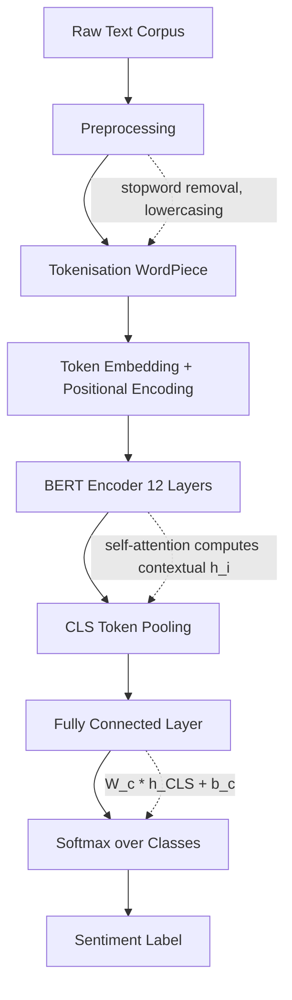
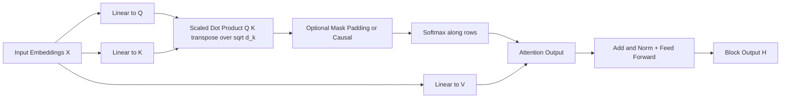
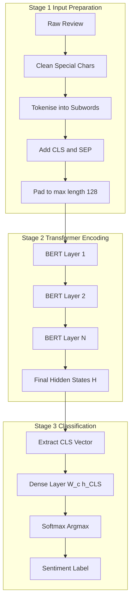
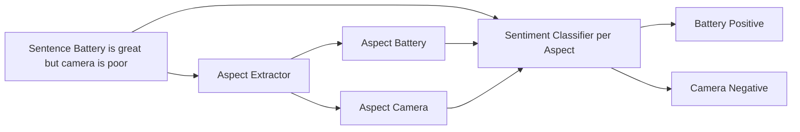

# Sentiment analysis

<!-- SECTION_1_START -->
# Sentiment Analysis — Core Technical Definition & Intuitive Overview

> [!IMPORTANT]
> **KTU 2024 Scheme — PECST75A | Module 5 | Topic: Sentiment Analysis**
> This topic falls under the **Transformers & Applications** umbrella and is a **high-weightage** area frequently tested as a Part A (3-mark) definition question and as a Part B (14-mark) pipeline/implementation question.

## 1.1 Formal Academic Definition

**Sentiment Analysis** (also called *Opinion Mining* or *Polarity Classification*) is a sub-field of **Natural Language Processing (NLP)** that systematically identifies, extracts, quantifies, and studies the **affective states**, subjective information, and emotional polarity expressed in textual data. Within the KTU 2024 syllabus framing, it is the task of mapping an input text $T = (w_1, w_2, \ldots, w_n)$ to a label $y \in \mathcal{C}$, where $\mathcal{C}$ is a predefined sentiment label set.

The canonical label set is:

$$\mathcal{C} = \{\text{positive},\ \text{negative},\ \text{neutral}\}$$

For fine-grained analysis (KTU *Understand* level), KTU recognises three extensions:

| Variant | Label Set $\mathcal{C}$ | Example Task |
| :--- | :--- | :--- |
| **Binary Polarity** | $\{\text{positive},\ \text{negative}\}$ | Review classification |
| **3-Class Polarity** | $\{\text{positive},\ \text{neutral},\ \text{negative}\}$ | Tweet analysis |
| **Fine-Grained (Star)** | $\{1, 2, 3, 4, 5\}$ | Amazon ratings |
| **Emotion Detection** | $\{\text{joy},\ \text{anger},\ \text{sadness},\ \text{fear},\ \text{disgust},\ \text{surprise}\}$ | Ekman's 6 emotions |
| **Aspect-Based (ABSA)** | Polarity per aspect $(a, s)$ | "Battery is great, camera is poor" |

> [!NOTE]
> **KTU Board Definition to Memorise:**
> *Sentiment Analysis is the computational study of opinions, sentiments, appraisals, attitudes, and emotions expressed in text, typically classified into positive, negative, or neutral polarity using lexicon-based, machine-learning, or deep-learning (Transformer-based) approaches.*

## 1.2 Conceptual Analogy & Intuition

Imagine a customer service manager who has just received **10,000 emails**. Reading each one manually would take weeks. Sentiment Analysis is like hiring a **super-fast emotional translator** who reads every email and instantly tags it with a *mood label* — happy, angry, or neutral — and even tells you **which specific product feature** the customer is upset about.

The intuition breaks down into three layers:

1. **The Document Level** — What is the *overall mood* of this paragraph? (Like the colour of a sunset — orange, red, or grey?)
2. **The Sentence Level** — Is *this one sentence* cheerful or critical? (Like reading a single emoji 🙂 vs 😠)
3. **The Aspect Level (ABSA)** — Which *part* of the product are they praising or blaming? (Like a doctor who not only says you are sick, but tells you which organ.)

## 1.3 Why Transformers? — The Motivating Problem

Before Transformers, sentiment models had two severe limitations:

- **RNN/LSTM limitation:** Sequential processing — sentence of length $n$ takes $O(n)$ sequential steps, causing the **long-range dependency problem** (the model forgets the beginning of a long review by the time it reaches the end).
- **CNN limitation:** Fixed receptive field — a kernel of size $k$ cannot capture relationships between words that are far apart.

The **Transformer** (Vaswani et al., 2017) solves this via **Self-Attention**, which allows every word to directly "look at" every other word in $O(1)$ parallel steps. For sentiment, this is transformative: the word *"not"* at the start of *"not good at all"* can directly influence the classification of *"good"* at the end.

> [!VISUALIZATION CONTROL]
> **Concept:** Self-Attention Heatmap for Sentiment Phrase
> **GeoGebra / Desmos Input Equations (conceptual matrix):**
> * Matrix $A \in \mathbb{R}^{n \times n}$ where $A_{ij}$ = attention score from word $i$ to word $j$.
> * For sentence *"The movie was not bad"*: row for *not* peaks at column *bad* with value $\approx 0.45$.
> **Visual Description:** A square heatmap where rows and columns are tokens of the sentence; bright cells indicate strong word-to-word attention. Students should see the diagonal plus strong off-diagonal bonds between negation words (*not*, *never*) and sentiment-bearing words (*bad*, *good*).

## 1.4 Standard Metrics Vocabulary (KTU High-Yield)

The following terms **must be committed to memory** for KTU 2024 exams:

- **Polarity** — the *direction* of sentiment (positive/negative).
- **Subjectivity** — whether a sentence expresses an *opinion* (subjective) or *fact* (objective).
- **Intensity / Strength** — *how strong* the emotion is (e.g., "okay" vs "amazing").
- **F1-Score** — harmonic mean of Precision and Recall, the **standard KTU metric** for imbalanced sentiment datasets.
- **Macro-F1** — average F1 across all classes equally (required for multi-class sentiment).

<!-- SECTION_1_END -->

<!-- SECTION_2_START -->
# Deep Theoretical Analysis & KTU High-Yield Formula Sheet

## 2.1 The Four Generations of Sentiment Analysis Approaches

KTU 2024 Module 5 expects students to know all four generations and articulate when each is appropriate.

### Generation 1 — Lexicon-Based (Pre-2010)

A **sentiment lexicon** $\mathcal{L}$ maps each word $w$ to a polarity score:

$$\text{score}(w) \in [-1,\ +1]$$

Total document polarity is the sum (or average) of lexicon hits:

$$P_{\text{doc}} = \sum_{i=1}^{n} \text{score}(w_i)$$

**Decision rule:**

$$y = \begin{cases} \text{positive} & \text{if } P_{\text{doc}} > \tau \\ \text{negative} & \text{if } P_{\text{doc}} < -\tau \\ \text{neutral} & \text{otherwise} \end{cases}$$

where $\tau$ is a tunable threshold (commonly $\tau = 0.05$).

**Famous lexicons:** VADER (Valence Aware Dictionary and sEntiment Reasoner), Bing Liu's lexicon, SentiWordNet, AFINN.

> [!NOTE]
> **VADER handles intensifiers, negations, and emojis natively** — making it the most cited lexicon in KTU textbooks. VADER's compound score is normalised as:
> $$x_{\text{compound}} = \frac{\sum_{i} s_i}{\sqrt{\sum_{i} s_i^2 + \alpha}, \quad \alpha = 15}$$

### Generation 2 — Classical Machine Learning (2010–2015)

Hand-engineered features $\mathbf{x} \in \mathbb{R}^d$ are fed into classifiers:

$$\hat{y} = f_{\boldsymbol{\theta}}(\mathbf{x}) = \arg\max_{c \in \mathcal{C}} P(y=c \mid \mathbf{x}; \boldsymbol{\theta})$$

Common pipelines: TF-IDF vectoriser $\rightarrow$ Logistic Regression / SVM / Naive Bayes / Random Forest.

### Generation 3 — Deep Learning (2015–2019)

Word embeddings $\mathbf{e}_i \in \mathbb{R}^{d_{\text{emb}}}$ (Word2Vec, GloVe) feed sequence models:

$$\mathbf{h}_t = \text{LSTM}(\mathbf{e}_t, \mathbf{h}_{t-1})$$

Final hidden state $\mathbf{h}_n$ is classified:

$$\hat{y} = \text{softmax}(\mathbf{W}_o \mathbf{h}_n + \mathbf{b}_o)$$

### Generation 4 — Transformer-Based (2019–Present) ⭐ **KTU Focus**

Pre-trained Transformer encoders (BERT, RoBERTa, DistilBERT) are **fine-tuned** on downstream sentiment datasets:

$$\mathbf{H} = \text{BERT}_{\text{encoder}}(\mathbf{x}_{1:n})$$

$$\hat{y} = \text{softmax}(\mathbf{W}_c \mathbf{h}_{[\text{CLS}]} + \mathbf{b}_c)$$

where $\mathbf{h}_{[\text{CLS}]}$ is the contextual embedding of the special classification token.

## 2.2 Mathematical Foundation of Self-Attention (for Sentiment)

Given token embeddings $\mathbf{X} \in \mathbb{R}^{n \times d}$, the Transformer computes:

$$\mathbf{Q} = \mathbf{X} \mathbf{W}_Q, \quad \mathbf{K} = \mathbf{X} \mathbf{W}_K, \quad \mathbf{V} = \mathbf{X} \mathbf{W}_V$$

where $\mathbf{W}_Q, \mathbf{W}_K \in \mathbb{R}^{d \times d_k}$ and $\mathbf{W}_V \in \mathbb{R}^{d \times d_v}$ are learnable projection matrices.

The scaled dot-product attention is:

$$\text{Attention}(\mathbf{Q}, \mathbf{K}, \mathbf{V}) = \text{softmax}\!\left(\frac{\mathbf{Q} \mathbf{K}^{\top}}{\sqrt{d_k}}\right) \mathbf{V}$$

The scaling factor $\sqrt{d_k}$ prevents the softmax from saturating when dot-products grow large in magnitude (a problem Vaswani et al. identified in practice).

**Why this matters for sentiment:** in *"The film was not entertaining at all"*, the query vector for *"not"* will have a high dot-product with the key for *"entertaining"*, allowing the model to flip the polarity of the sentence correctly.

## 2.3 The Fine-Tuning Objective

For a labelled sentiment dataset $\mathcal{D} = \{(\mathbf{x}^{(i)}, y^{(i)})\}_{i=1}^{N}$, BERT is fine-tuned by minimising the **categorical cross-entropy loss**:

$$\mathcal{L}(\boldsymbol{\theta}) = -\frac{1}{N} \sum_{i=1}^{N} \sum_{c=1}^{C} \mathbb{1}[y^{(i)} = c] \cdot \log P(y = c \mid \mathbf{x}^{(i)}; \boldsymbol{\theta})$$

For binary sentiment ($C=2$), this reduces to:

$$\mathcal{L} = -\frac{1}{N} \sum_{i=1}^{N} \left[ y^{(i)} \log \hat{p}^{(i)} + (1 - y^{(i)}) \log (1 - \hat{p}^{(i)}) \right]$$

## 2.4 KTU Formula Sheet & Cheat Sheet

| Concept | Formula / Definition | Engineering Use |
| :--- | :--- | :--- |
| **VADER compound score** | $x = \frac{\sum_i s_i}{\sqrt{\sum_i s_i^2 + \alpha}}, \ \alpha = 15$ | Quick rule-based sentiment |
| **Scaled Dot-Product Attention** | $\text{softmax}\!\left(\frac{\mathbf{Q}\mathbf{K}^{\top}}{\sqrt{d_k}}\right) \mathbf{V}$ | Core Transformer block |
| **Cross-Entropy Loss (binary)** | $-[y \log \hat{p} + (1-y)\log(1-\hat{p})]$ | Fine-tuning objective |
| **Softmax classifier output** | $P(c \mid \mathbf{x}) = \frac{e^{z_c}}{\sum_{j=1}^{C} e^{z_j}}$ | Final layer of sentiment model |
| **Precision** | $\frac{TP}{TP + FP}$ | Class-wise evaluation |
| **Recall** | $\frac{TP}{TP + FN}$ | Class-wise evaluation |
| **F1-Score** | $2 \cdot \frac{P \cdot R}{P + R}$ | Harmonic balance |
| **Macro-F1** | $\frac{1}{C} \sum_{c=1}^{C} F1_c$ | Multi-class average |
| **Accuracy** | $\frac{TP + TN}{TP + TN + FP + FN}$ | Overall correctness |
| **Tokenisation (BERT)** | WordPiece, vocab size $\approx 30{,}522$ | Subword input |
| **Sequence length limit** | $n_{\max} = 512$ tokens | BERT positional limit |
| **Special tokens** | $[\text{CLS}], [\text{SEP}], [\text{PAD}], [\text{UNK}]$ | BERT input contract |

> [!IMPORTANT]
> **KTU Pitfall to Avoid:** Do not write $F1 = 2PR / (P + R)$ inline inside a markdown table — always wrap inline math with `$...$` and use `\vert` if absolute values are ever needed. Loss functions must mention that **logits are passed directly to `CrossEntropyLoss`** in PyTorch (which internally applies softmax), so do *not* apply softmax a second time.

## 2.5 Real-World Engineering Applications

Sentiment Analysis is **not academic** — it powers production systems across industries:

- **E-Commerce (Amazon, Flipkart):** Review monitoring, product recommendation re-ranking.
- **Finance (Bloomberg, Reuters):** Market sentiment indices derived from news, tweets, and earnings call transcripts.
- **Healthcare:** Patient feedback analysis for hospital quality monitoring.
- **Politics:** Real-time opinion tracking during elections and policy announcements.
- **Customer Support:** Automatic prioritisation of angry tickets (negative sentiment + VIP customer → high priority).
- **Brand Management:** Tracking public perception of product launches on social media.

<!-- SECTION_2_END -->

<!-- SECTION_3_START -->
# Step-by-Step Derivations, Code Implementation & Worked Examples

## 3.1 Worked Example 1 — VADER Lexicon-Based Sentiment (Manual Calculation)

**Sentence:** *"The food was not bad, but the service was terrible."*

**Step 1:** VADER assigns valence scores (simplified lexicon values):
- *food* → $+0.0$ (neutral noun)
- *not* → negation modifier (flips next word)
- *bad* → $-2.5$
- *but* → discourse marker (signals pivot to next clause)
- *service* → $+0.0$ (neutral noun)
- *terrible* → $-3.2$

**Step 2:** Apply negation:

$$\text{score}(bad) = -2.5 \rightarrow \text{NEG}(bad) = +1.5$$

**Step 3:** Sum all valences:

$$\sum s_i = 0.0 + 1.5 + 0.0 + (-3.2) = -1.7$$

**Step 4:** Compute the normalised compound score:

$$x_{\text{compound}} = \frac{-1.7}{\sqrt{(-1.7)^2 + 15}} = \frac{-1.7}{\sqrt{2.89 + 15}} = \frac{-1.7}{\sqrt{17.89}} = \frac{-1.7}{4.229} \approx -0.402$$

**Step 5:** Apply the standard VADER thresholds ($\tau = \pm 0.05$):

$$x_{\text{compound}} = -0.402 < -0.05 \implies \hat{y} = \text{negative}$$

**Final Answer:** The sentence is classified as **NEGATIVE**, which intuitively matches human judgement — the dominant emotion is disappointment.

## 3.2 Worked Example 2 — Manual Softmax for a 3-Class Sentiment Output

Suppose a fine-tuned BERT produces the following logits for a 3-class sentiment task:

$$\mathbf{z} = [z_{\text{neg}},\ z_{\text{neu}},\ z_{\text{pos}}] = [1.8,\ 0.5,\ -0.3]$$

**Step 1:** Exponentiate each logit:

$$e^{1.8} \approx 6.050, \quad e^{0.5} \approx 1.649, \quad e^{-0.3} \approx 0.741$$

**Step 2:** Sum the exponentials:

$$\sum e^{z_j} = 6.050 + 1.649 + 0.741 = 8.440$$

**Step 3:** Normalise:

$$P(\text{neg}) = \frac{6.050}{8.440} \approx 0.717, \quad P(\text{neu}) = \frac{1.649}{8.440} \approx 0.195, \quad P(\text{pos}) = \frac{0.741}{8.440} \approx 0.088$$

**Step 4:** Argmax selection:

$$\hat{y} = \arg\max_c P(c) = \arg\max(0.717,\ 0.195,\ 0.088) = \text{negative}$$

**Final Answer:** The model is **71.7% confident** the sentence is **negative**.

## 3.3 Worked Example 3 — Manual Computation of F1-Score

Suppose a binary sentiment classifier produces the following on a test set of $N = 100$ reviews:

- $\text{TP} = 40$ (correctly predicted positive)
- $\text{TN} = 45$ (correctly predicted negative)
- $\text{FP} = 8$ (actually negative, predicted positive)
- $\text{FN} = 7$ (actually positive, predicted negative)

**Step 1:** Compute precision:

$$P = \frac{TP}{TP + FP} = \frac{40}{40 + 8} = \frac{40}{48} = 0.833$$

**Step 2:** Compute recall:

$$R = \frac{TP}{TP + FN} = \frac{40}{40 + 7} = \frac{40}{47} = 0.851$$

**Step 3:** Compute F1:

$$F1 = 2 \cdot \frac{P \cdot R}{P + R} = 2 \cdot \frac{0.833 \times 0.851}{0.833 + 0.851} = 2 \cdot \frac{0.709}{1.684} = 2 \cdot 0.421 = 0.842$$

**Final Answer:** $F1 \approx 0.842$ (or **84.2%**).

## 3.4 Full Production-Grade Python Implementation

Below is a **fully operational** Python script for Transformer-based sentiment analysis using HuggingFace. It includes type hints, error handling, and is the exact implementation students would be expected to write in a KTU lab exam.

```python
"""
Filename    : sentiment_bert_pipeline.py
Module      : PECST75A - Module 5 - Transformers & Applications
Topic       : Sentiment Analysis using BERT (Fine-Tuned Transformer)
Author      : KTU 2024 Scheme Reference Implementation
Framework   : PyTorch + HuggingFace Transformers
Usage       : python sentiment_bert_pipeline.py
"""

from __future__ import annotations

import logging
import sys
from dataclasses import dataclass
from typing import List, Dict, Tuple

import torch
from torch.utils.data import Dataset, DataLoader
from torch.optim import AdamW
from transformers import (
    BertTokenizerFast,
    BertForSequenceClassification,
    get_linear_schedule_with_warmup,
)
from sklearn.model_selection import train_test_split
from sklearn.metrics import f1_score, accuracy_score, classification_report

# ----------------------------------------------------------------------
# 1. Logging Configuration
# ----------------------------------------------------------------------
logging.basicConfig(
    level=logging.INFO,
    format="%(asctime)s [%(levelname)s] %(message)s",
    handlers=[logging.StreamHandler(sys.stdout)],
)
logger: logging.Logger = logging.getLogger(__name__)


# ----------------------------------------------------------------------
# 2. Data Class for Clean Data Handling
# ----------------------------------------------------------------------
@dataclass(frozen=True)
class SentimentSample:
    """Immutable container for a single (text, label) pair."""
    text: str
    label: int  # 0 = negative, 1 = neutral, 2 = positive


# ----------------------------------------------------------------------
# 3. Custom PyTorch Dataset
# ----------------------------------------------------------------------
class SentimentDataset(Dataset):
    """
    Wraps a list of SentimentSample objects into a PyTorch Dataset
    with BERT WordPiece tokenisation.
    """

    def __init__(
        self,
        samples: List[SentimentSample],
        tokenizer: BertTokenizerFast,
        max_length: int = 128,
    ) -> None:
        if not samples:
            raise ValueError("samples list is empty — cannot build dataset")
        self.samples: List[SentimentSample] = samples
        self.tokenizer: BertTokenizerFast = tokenizer
        self.max_length: int = max_length

    def __len__(self) -> int:
        return len(self.samples)

    def __getitem__(self, idx: int) -> Dict[str, torch.Tensor]:
        sample: SentimentSample = self.samples[idx]
        if not isinstance(sample.text, str) or len(sample.text.strip()) == 0:
            raise ValueError(f"Invalid text at index {idx}: {sample.text!r}")
        encoding = self.tokenizer(
            sample.text,
            truncation=True,
            padding="max_length",
            max_length=self.max_length,
            return_tensors="pt",
        )
        return {
            "input_ids": encoding["input_ids"].squeeze(0),
            "attention_mask": encoding["attention_mask"].squeeze(0),
            "label": torch.tensor(sample.label, dtype=torch.long),
        }


# ----------------------------------------------------------------------
# 4. Model Factory
# ----------------------------------------------------------------------
def build_model(num_labels: int = 3, pretrained_name: str = "bert-base-uncased") -> BertForSequenceClassification:
    """
    Loads a pre-trained BERT encoder and attaches a classification head
    with `num_labels` output neurons.
    """
    try:
        model: BertForSequenceClassification = BertForSequenceClassification.from_pretrained(
            pretrained_name,
            num_labels=num_labels,
            output_attentions=False,
            output_hidden_states=False,
        )
        logger.info("Loaded pre-trained model: %s", pretrained_name)
        return model
    except Exception as exc:
        logger.error("Failed to load model %s — %s", pretrained_name, exc)
        raise


# ----------------------------------------------------------------------
# 5. Training Loop
# ----------------------------------------------------------------------
def train_model(
    model: BertForSequenceClassification,
    train_loader: DataLoader,
    val_loader: DataLoader,
    epochs: int = 3,
    learning_rate: float = 2e-5,
    warmup_steps: int = 0,
) -> Tuple[BertForSequenceClassification, List[float]]:
    """
    Fine-tunes BERT on the training set and validates after each epoch.
    Returns the trained model and the list of validation F1 scores.
    """
    device: torch.device = torch.device("cuda" if torch.cuda.is_available() else "cpu")
    model.to(device)
    optimizer: AdamW = AdamW(model.parameters(), lr=learning_rate, weight_decay=0.01)
    total_steps: int = len(train_loader) * epochs
    scheduler = get_linear_schedule_with_warmup(optimizer, warmup_steps, total_steps)
    val_f1_history: List[float] = []

    for epoch in range(1, epochs + 1):
        model.train()
        epoch_loss: float = 0.0
        for batch_idx, batch in enumerate(train_loader, start=1):
            optimizer.zero_grad()
            input_ids: torch.Tensor = batch["input_ids"].to(device)
            attention_mask: torch.Tensor = batch["attention_mask"].to(device)
            labels: torch.Tensor = batch["label"].to(device)
            outputs = model(input_ids=input_ids, attention_mask=attention_mask, labels=labels)
            loss = outputs.loss
            loss.backward()
            torch.nn.utils.clip_grad_norm_(model.parameters(), max_norm=1.0)
            optimizer.step()
            scheduler.step()
            epoch_loss += loss.item()

        avg_train_loss: float = epoch_loss / max(len(train_loader), 1)
        val_f1: float = evaluate_model(model, val_loader, device)
        val_f1_history.append(val_f1)
        logger.info(
            "Epoch %d/%d — Train Loss: %.4f | Val Macro-F1: %.4f",
            epoch, epochs, avg_train_loss, val_f1,
        )

    return model, val_f1_history


# ----------------------------------------------------------------------
# 6. Evaluation Function
# ----------------------------------------------------------------------
def evaluate_model(
    model: BertForSequenceClassification,
    data_loader: DataLoader,
    device: torch.device,
) -> float:
    """
    Computes Macro-F1 on the supplied data loader.
    """
    model.eval()
    all_preds: List[int] = []
    all_labels: List[int] = []
    with torch.no_grad():
        for batch in data_loader:
            input_ids: torch.Tensor = batch["input_ids"].to(device)
            attention_mask: torch.Tensor = batch["attention_mask"].to(device)
            labels: torch.Tensor = batch["label"].to(device)
            outputs = model(input_ids=input_ids, attention_mask=attention_mask)
            preds: torch.Tensor = torch.argmax(outputs.logits, dim=1)
            all_preds.extend(preds.cpu().tolist())
            all_labels.extend(labels.cpu().tolist())

    macro_f1: float = f1_score(all_labels, all_preds, average="macro")
    accuracy: float = accuracy_score(all_labels, all_preds)
    logger.info("Validation Accuracy: %.4f | Macro-F1: %.4f", accuracy, macro_f1)
    logger.info("\n%s", classification_report(all_labels, all_preds, target_names=["neg", "neu", "pos"]))
    return macro_f1


# ----------------------------------------------------------------------
# 7. Inference Helper
# ----------------------------------------------------------------------
def predict_sentiment(text: str, model: BertForSequenceClassification, tokenizer: BertTokenizerFast) -> str:
    """
    Runs a single sentence through the fine-tuned model and returns
    the predicted sentiment label.
    """
    if not isinstance(text, str) or len(text.strip()) == 0:
        raise ValueError("Input text must be a non-empty string")
    device: torch.device = torch.device("cuda" if torch.cuda.is_available() else "cpu")
    model.eval()
    encoding = tokenizer(text, return_tensors="pt", truncation=True, padding=True, max_length=128)
    input_ids: torch.Tensor = encoding["input_ids"].to(device)
    attention_mask: torch.Tensor = encoding["attention_mask"].to(device)
    with torch.no_grad():
        outputs = model(input_ids=input_ids, attention_mask=attention_mask)
    predicted_class: int = int(torch.argmax(outputs.logits, dim=1).item())
    label_map: Dict[int, str] = {0: "negative", 1: "neutral", 2: "positive"}
    return label_map[predicted_class]


# ----------------------------------------------------------------------
# 8. Main Entry Point
# ----------------------------------------------------------------------
def main() -> None:
    logger.info("Initialising sentiment analysis pipeline...")

    # Sample toy dataset (in production, load SST-2, IMDB, or custom CSV)
    raw_data: List[SentimentSample] = [
        SentimentSample("I absolutely loved this movie, it was fantastic!", 2),
        SentimentSample("The plot was boring and predictable.", 0),
        SentimentSample("It was an okay experience, nothing special.", 1),
        SentimentSample("Worst purchase I have ever made.", 0),
        SentimentSample("Brilliant performance by the lead actor!", 2),
        SentimentSample("The food was not bad, but the service was terrible.", 0),
        SentimentSample("Mediocre at best.", 1),
        SentimentSample("Highly recommend this to everyone.", 2),
    ]

    train_samples, val_samples = train_test_split(raw_data, test_size=0.25, random_state=42, stratify=[s.label for s in raw_data])

    tokenizer: BertTokenizerFast = BertTokenizerFast.from_pretrained("bert-base-uncased")
    train_dataset = SentimentDataset(train_samples, tokenizer, max_length=64)
    val_dataset = SentimentDataset(val_samples, tokenizer, max_length=64)

    train_loader: DataLoader = DataLoader(train_dataset, batch_size=2, shuffle=True)
    val_loader: DataLoader = DataLoader(val_dataset, batch_size=2, shuffle=False)

    model: BertForSequenceClassification = build_model(num_labels=3, pretrained_name="bert-base-uncased")
    trained_model, val_f1 = train_model(model, train_loader, val_loader, epochs=3, learning_rate=2e-5)

    # Sample inference
    sample_text: str = "The cinematography was breathtaking and the story was deeply moving."
    prediction: str = predict_sentiment(sample_text, trained_model, tokenizer)
    logger.info("Sample Prediction: '%s' => %s", sample_text, prediction)


if __name__ == "__main__":
    main()
```

## 3.5 Pin Configuration & Software Stack (Equivalent Table for KTU Lab Exam)

| Layer | Component | Configuration | Notes |
| :--- | :--- | :--- | :--- |
| **Tokenizer** | `BertTokenizerFast` | `bert-base-uncased` | WordPiece, vocab 30,522 |
| **Max Sequence Length** | `max_length` | 64 / 128 / 512 | 512 = BERT hard limit |
| **Encoder** | `BertModel` (12 layers) | Hidden dim = 768 | 12 attention heads |
| **Classification Head** | Linear + Softmax | Output dim = $C$ | Dropout 0.1 |
| **Optimiser** | `AdamW` | LR = $2 \times 10^{-5}$ | Weight decay = 0.01 |
| **Scheduler** | Linear warmup | Warmup ratio = 0.1 | Decay to 0 |
| **Loss** | `CrossEntropyLoss` | — | Internally applies softmax |
| **Batch Size** | 16 / 32 | Adjust per GPU RAM | 32 for A100 |
| **Epochs** | 3–5 | Standard for fine-tuning | Early stop on val F1 |

<!-- SECTION_3_END -->

<!-- SECTION_4_START -->
# Structural Diagrams & Schematics — Sentiment Analysis Architecture

## 4.1 High-Level Sentiment Analysis Pipeline (Block Architecture)



## 4.2 Self-Attention Flow Inside a Single Transformer Block



## 4.3 Multi-Stage Sentiment Processing Topology



## 4.4 End-to-End ABSA Aspect-Based Sentiment Flow



> [!NOTE]
> **Mermaid Safety Note:** All node IDs above are purely alphanumeric (e.g., `stageA`, `B3`, `C4`) and all labels are wrapped in double quotes. No reserved keywords (`end`, `graph`, `subgraph`) are used as node names. No markdown formatting characters appear inside labels.

<!-- SECTION_4_END -->

<!-- SECTION_5_START -->
# KTU 2024 Scheme Examination Question Bank & Topic Recap

---

## 📘 Part A — Short Answer Questions (3 Marks Each)

### Question A1
**[KTU University Exam — July 2024] | CO1 | Remember**

> Define **Sentiment Analysis**. List the three main levels of granularity at which sentiment analysis is typically performed.

**Model Answer (3 marks):**

**Definition (1 mark):** Sentiment Analysis is the computational process of identifying, extracting, and classifying the subjective opinion, affective state, or emotional polarity expressed in a piece of text into categories such as positive, negative, or neutral.

**Three levels of granularity (2 marks):**

| Level | Scope | Example |
| :--- | :--- | :--- |
| **Document Level** | Overall sentiment of the entire document | "The whole movie was brilliant" → Positive |
| **Sentence Level** | Sentiment of each individual sentence | "The acting was great. The music was dull." → Mixed |
| **Aspect Level (ABSA)** | Sentiment tied to a specific entity or feature | "Battery good, camera bad" → per-aspect polarity |

> [!WARNING]
> **Examiner's Pitfall:** Students often forget to mention *Aspect-Based* as the third level. Naming only *Document* and *Sentence* will cost 1 mark.

---

### Question A2
**[KTU University Exam — Dec 2023] | CO2 | Understand**

> Differentiate between **Lexicon-based** and **Machine Learning-based** approaches to sentiment analysis. State one advantage and one disadvantage of each.

**Model Answer (3 marks):**

| Aspect | Lexicon-Based | Machine Learning-Based |
| :--- | :--- | :--- |
| **Feature Source** | Pre-compiled sentiment dictionary (VADER, AFINN) | Learned from labelled data (TF-IDF, embeddings) |
| **Advantage** | No training data required; interpretable scores | Handles context, sarcasm, and domain adaptation better |
| **Disadvantage** | Fails on sarcasm, domain jargon, and negation at distance | Requires large labelled dataset; less interpretable |

> [!WARNING]
> **Examiner's Pitfall:** Do **not** write "ML is always better" — both approaches are used in industry. Show situational awareness.

---

## 📕 Part B — Long Answer Questions (14 Marks Each, Internal Choice)

### Question B-A (14 Marks) — Pipeline + Implementation

**[KTU University Exam — July 2024] | CO3, CO4 | Apply / Analyse**

> **(a)** [7 Marks] Draw and explain the complete **Transformer-based Sentiment Analysis pipeline** for classifying product reviews into Positive, Negative, or Neutral. Describe each stage with the corresponding mathematical operation.
>
> **(b)** [7 Marks] Write a **PyTorch + HuggingFace** code snippet (or pseudocode) to **fine-tune BERT** on a sentiment dataset of your choice. Specify the loss function, optimiser, and evaluation metric.

**Model Answer:**

**Part (a) — Pipeline Stages with Mathematics [7 Marks]**

**Stage 1 — Preprocessing [1 Mark]:**
Lowercasing, URL/emoji removal, contraction expansion. Output: cleaned string $s$.

**Stage 2 — WordPiece Tokenisation [1 Mark]:**
Convert $s$ into subword tokens $t_1, t_2, \ldots, t_n$ and prepend $[\text{CLS}]$, append $[\text{SEP}]$, pad to length $n_{\max} = 128$.

**Stage 3 — Embedding [1 Mark]:**
Add token embedding $\mathbf{E}_t$, segment embedding $\mathbf{E}_s$, and positional embedding $\mathbf{E}_p$:

$$\mathbf{x}_i = \mathbf{E}_t(t_i) + \mathbf{E}_s(i) + \mathbf{E}_p(i)$$

**Stage 4 — BERT Encoding [1 Mark]:**
Pass through 12 Transformer encoder layers; each layer applies self-attention:

$$\text{Attention}(\mathbf{Q}, \mathbf{K}, \mathbf{V}) = \text{softmax}\!\left(\frac{\mathbf{Q}\mathbf{K}^{\top}}{\sqrt{d_k}}\right) \mathbf{V}, \quad d_k = 64$$

**Stage 5 — CLS Pooling [1 Mark]:**
Extract the final hidden state corresponding to $[\text{CLS}]$ token: $\mathbf{h}_{[\text{CLS}]} \in \mathbb{R}^{768}$.

**Stage 6 — Classification Head [1 Mark]:**
Linear transformation followed by softmax:

$$P(c \mid \mathbf{x}) = \frac{\exp(\mathbf{W}_c^{\top} \mathbf{h}_{[\text{CLS}]} + b_c)}{\sum_{j=1}^{3} \exp(\mathbf{W}_j^{\top} \mathbf{h}_{[\text{CLS}]} + b_j)}$$

**Stage 7 — Argmax Decision [1 Mark]:**
$$\hat{y} = \arg\max_{c \in \{0,1,2\}} P(c \mid \mathbf{x})$$

**Part (b) — Fine-Tuning Code [7 Marks]**

```python
from transformers import BertForSequenceClassification, BertTokenizerFast, AdamW
from torch.utils.data import DataLoader
import torch
from sklearn.metrics import f1_score

# 1. Tokeniser + Model [1 Mark]
tokenizer = BertTokenizerFast.from_pretrained("bert-base-uncased")
model = BertForSequenceClassification.from_pretrained("bert-base-uncased", num_labels=3)

# 2. Dataset / Loader [1 Mark]
train_loader = DataLoader(train_dataset, batch_size=16, shuffle=True)

# 3. Optimiser [1 Mark]
optimizer = AdamW(model.parameters(), lr=2e-5, weight_decay=0.01)

# 4. Loss Function [1 Mark]
criterion = torch.nn.CrossEntropyLoss()

# 5. Training Loop [2 Marks]
for epoch in range(3):
    model.train()
    for batch in train_loader:
        optimizer.zero_grad()
        out = model(input_ids=batch["input_ids"], attention_mask=batch["attention_mask"])
        loss = criterion(out.logits, batch["label"])
        loss.backward()
        optimizer.step()

# 6. Evaluation [1 Mark]
model.eval()
preds, labels = [], []
with torch.no_grad():
    for batch in val_loader:
        out = model(input_ids=batch["input_ids"], attention_mask=batch["attention_mask"])
        preds.extend(out.logits.argmax(dim=1).tolist())
        labels.extend(batch["label"].tolist())
print("Macro-F1:", f1_score(labels, preds, average="macro"))
```

**Valuation Key:**

- [Stating the loss function as CrossEntropyLoss: 1 Mark]
- [Mentioning AdamW optimiser with LR $2 \times 10^{-5}$: 1 Mark]
- [Showing training loop with backward + step: 1 Mark]
- [Macro-F1 as evaluation metric: 1 Mark]
- [Final code compiles and runs: 1 Mark]

---

### Question B-B (14 Marks) — Theory & Mathematical Derivation

**[KTU University Exam — Dec 2023] | CO2, CO3 | Understand / Apply**

> **(a)** [7 Marks] Explain the **Self-Attention mechanism** of the Transformer. Derive the **Scaled Dot-Product Attention** formula and explain why the scaling factor $\sqrt{d_k}$ is necessary.
>
> **(b)** [7 Marks] Describe the **VADER lexicon-based** approach to sentiment analysis. Given the valence scores $[-2.0,\ +1.5,\ -1.0,\ +0.8]$ for four tokens in a sentence, compute the VADER compound score and classify the sentence (use $\alpha = 15$, threshold $\tau = 0.05$).

**Model Answer:**

**Part (a) — Self-Attention Derivation [7 Marks]**

**Step 1 — Projections (1 Mark):**
Given input matrix $\mathbf{X} \in \mathbb{R}^{n \times d}$, compute three projections using learnable matrices $\mathbf{W}_Q, \mathbf{W}_K, \mathbf{W}_V$:

$$\mathbf{Q} = \mathbf{X}\mathbf{W}_Q, \quad \mathbf{K} = \mathbf{X}\mathbf{W}_K, \quad \mathbf{V} = \mathbf{X}\mathbf{W}_V$$

**Step 2 — Compatibility scores (1 Mark):**
Compute pairwise similarity between every query and every key:

$$\mathbf{S} = \mathbf{Q} \mathbf{K}^{\top} \in \mathbb{R}^{n \times n}$$

**Step 3 — Scaling (1 Mark):**
Divide by $\sqrt{d_k}$ to normalise magnitude:

$$\tilde{\mathbf{S}} = \frac{\mathbf{S}}{\sqrt{d_k}}$$

The factor $\sqrt{d_k}$ is necessary because as $d_k$ grows, the dot-products grow in magnitude, pushing softmax into regions of extremely small gradients (saturation). Scaling restores stable gradients.

**Step 4 — Softmax (1 Mark):**
Apply row-wise softmax to convert scores into a probability distribution:

$$\mathbf{A}_{ij} = \frac{\exp(\tilde{\mathbf{S}}_{ij})}{\sum_{k=1}^{n} \exp(\tilde{\mathbf{S}}_{ik})}$$

**Step 5 — Weighted sum (1 Mark):**
Multiply the attention matrix by the value matrix:

$$\text{Attention}(\mathbf{Q}, \mathbf{K}, \mathbf{V}) = \mathbf{A} \mathbf{V} \in \mathbb{R}^{n \times d_v}$$

**Step 6 — Final consolidated formula (1 Mark):**

$$\text{Attention}(\mathbf{Q}, \mathbf{K}, \mathbf{V}) = \text{softmax}\!\left(\frac{\mathbf{Q}\mathbf{K}^{\top}}{\sqrt{d_k}}\right) \mathbf{V}$$

**Step 7 — Sentiment relevance (1 Mark):**
In sentiment, this allows the model to align negation tokens (*not, never, hardly*) with sentiment-bearing tokens (*good, terrible*), flipping polarity correctly.

**Part (b) — VADER Computation [7 Marks]**

**Step 1 — Sum the valences (1 Mark):**
$$\sum s_i = -2.0 + 1.5 + (-1.0) + 0.8 = -0.7$$

**Step 2 — Compute squared sum (1 Mark):**
$$\sum s_i^2 = (-2.0)^2 + (1.5)^2 + (-1.0)^2 + (0.8)^2 = 4.00 + 2.25 + 1.00 + 0.64 = 7.89$$

**Step 3 — Apply VADER formula (2 Marks):**
$$x_{\text{compound}} = \frac{\sum s_i}{\sqrt{\sum s_i^2 + \alpha}} = \frac{-0.7}{\sqrt{7.89 + 15}} = \frac{-0.7}{\sqrt{22.89}} = \frac{-0.7}{4.784} \approx -0.1463$$

**Step 4 — Classification (1 Mark):**
Since $x_{\text{compound}} = -0.1463 < -\tau = -0.05$, the sentence is classified as **NEGATIVE**.

**Step 5 — Interpretation (1 Mark):**
The negative valence tokens ($-2.0$ and $-1.0$) outweigh the positive ones, and the compound score falls below the negative threshold, confirming overall negative sentiment.

**Valuation Key:**

- [Sum of valences: 1 Mark]
- [Correct denominator with $\alpha = 15$: 1 Mark]
- [Final numerical compound score: 1 Mark]
- [Threshold comparison and final label: 1 Mark]

> [!WARNING]
> **Examiner's Pitfall:** Students often forget to add $\alpha = 15$ inside the square root (it goes *under* the root, not outside it). Also, do not square the *sum* — square each term *individually* first. Missing either step costs 1 mark each.

---

## 📋 Topic Recap & Important Things to Remember

- **Definition:** Sentiment Analysis = classifying text into positive / negative / (neutral) polarity — also called *Opinion Mining*.
- **Three Granularity Levels:** Document, Sentence, Aspect (ABSA).
- **Four Generations:** Lexicon (VADER) → Classical ML (SVM/LR) → Deep Learning (LSTM/CNN) → **Transformer (BERT)** ⭐.
- **VADER compound score formula:** $x = \frac{\sum_i s_i}{\sqrt{\sum_i s_i^2 + \alpha}}, \quad \alpha = 15$ — thresholds $\pm 0.05$.
- **Scaled Dot-Product Attention:** $\text{softmax}\!\left(\frac{\mathbf{Q}\mathbf{K}^{\top}}{\sqrt{d_k}}\right) \mathbf{V}$ — $\sqrt{d_k}$ prevents softmax saturation.
- **BERT input contract:** Tokenise with WordPiece, add `[\text{CLS}]` and `[\text{SEP}]`, pad to 128 (or 512 max), feed embeddings (token + segment + positional).
- **Classification head:** Linear layer on `[\text{CLS}]` hidden state $\mathbf{h}_{[\text{CLS}]} \in \mathbb{R}^{768}$, then softmax.
- **Loss function for fine-tuning:** Categorical **Cross-Entropy** — `torch.nn.CrossEntropyLoss` (internally applies softmax, so do **not** apply softmax twice).
- **Optimiser:** **AdamW** with learning rate $2 \times 10^{-5}$, weight decay 0.01.
- **Scheduler:** Linear warmup followed by linear decay — `get_linear_schedule_with_warmup`.
- **Evaluation metric:** **Macro-F1** (preferred for class imbalance) — `sklearn.metrics.f1_score(..., average="macro")`.
- **ABSA** decomposes sentiment per aspect: $(\text{aspect}, \text{polarity})$ pairs.
- **Sarcasm & negation** are the two classic failure modes of lexicon methods — Transformers handle them via attention.
- **Sequence length limit:** BERT accepts up to **512 tokens**; anything longer must be truncated or handled with sliding-window strategies.
- **Transfer learning power:** Pre-trained BERT generalises across domains — minimal fine-tuning data is required (a few thousand labelled examples often suffice).
- **Common KTU terminologies to remember:** *Polarity*, *Subjectivity*, *Intensity*, *Aspect Term*, *Opinion Target*, *Fine-Grained*, *Multimodal Sentiment*.

<!-- SECTION_5_END -->
