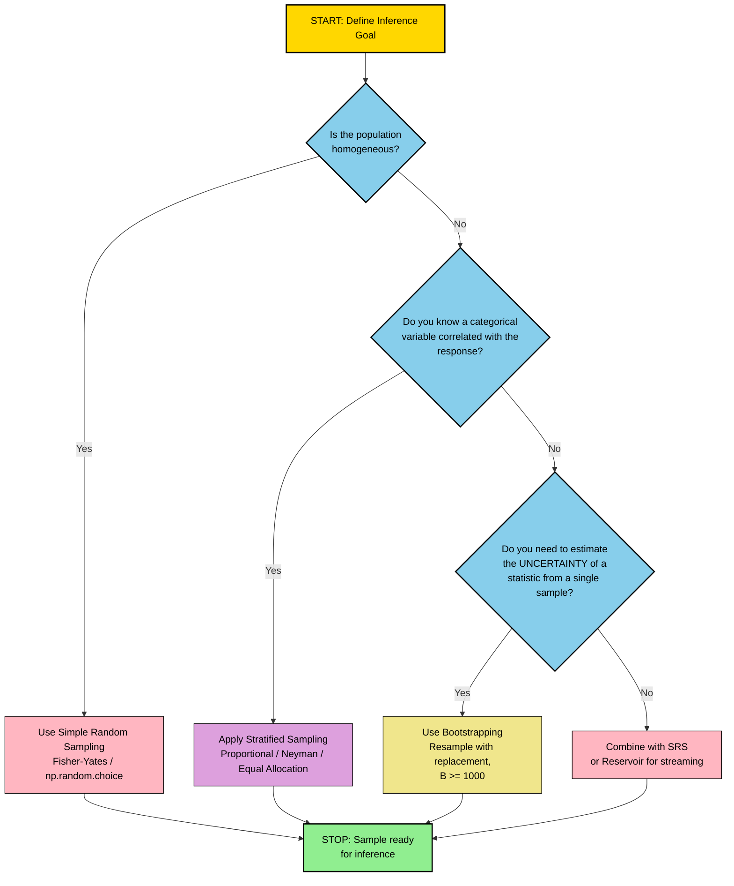
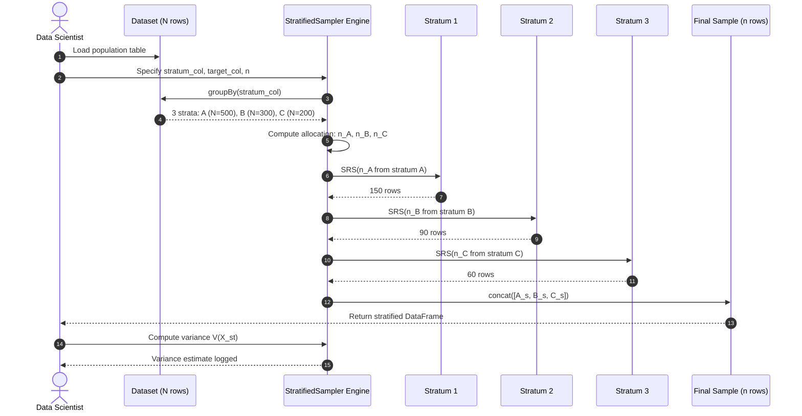
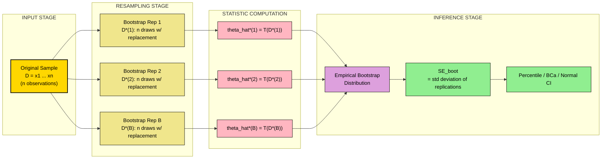

# Algorithmic Approaches to Data Sampling - Random sampling, stratified sampling, and bootstrapping, Importance of representative sampling in data analysis

<!-- SECTION_1_START -->
# Algorithmic Approaches to Data Sampling

## 1.1 Formal KTU 2024 Definition

> [!IMPORTANT]
> **Sampling** is the statistical process of selecting a subset (sample) of individuals, observations, or data points from within a larger statistical population (the dataset) to estimate characteristics of the whole population. In data science, sampling algorithms are the deterministic or stochastic procedures that govern *how* elements are drawn from a data universe.

According to the **APJ Abdul Kalam Technological University (KTU) 2024 Scheme** syllabus for *Algorithms for Data Science (PECST785)*, algorithmic sampling encompasses three foundational paradigms that every data scientist must master:

1. **Random Sampling (Simple Random Sampling - SRS)**: Every element in the population has an equal probability of selection, and every possible sample of size $n$ has the same probability of being chosen. Formally, if $N$ is the population size, the probability of selecting any single element is $p = \frac{1}{N}$.

2. **Stratified Sampling**: The population is partitioned into mutually exclusive and collectively exhaustive sub-groups (strata) based on a known attribute. Independent random samples are then drawn from each stratum, usually in proportion to the stratum's size (proportional allocation) or in proportion to its variance (Neyman allocation).

3. **Bootstrapping (Efron, 1979)**: A non-parametric, computer-intensive resampling-with-replacement technique used to estimate the sampling distribution of an estimator by treating the observed sample itself as the population. It generates $B$ pseudo-replicate samples, each of the same size as the original, drawn uniformly with replacement.

> [!NOTE]
> **Representativeness** is the degree to which the sample's characteristics (mean, variance, class distribution) closely mirror those of the underlying population. A representative sample minimizes **sampling bias** and ensures that inferences generalize beyond the observed data.

## 1.2 Conceptual Analogy / Intuition

Imagine a giant pot of soup containing carrots, potatoes, and beans in *unknown proportions*. You want to know the *flavor profile* (mean saltiness) of the entire pot, but tasting the whole pot is impossible. Three strategies emerge:

- **Random Sampling (SRS)**: Stir the soup vigorously (randomize), then blindly dip your ladle $n$ times. Each dip is independent. The flavor you taste is an unbiased estimate of the whole pot — *provided the soup is well-mixed*. This is the gold standard of unbiasedness, but with rare ingredients (outliers), you may miss them entirely.

- **Stratified Sampling**: First, *separate* the soup into three bowls by ingredient. Then taste a proportionate number of spoonfuls from each bowl. This is far more efficient when certain ingredients (strata) are rare or behave differently — a small bowl of beans is not over- or under-tasted.

- **Bootstrapping**: After taking one ladle of soup as your *only* sample, treat that ladle as the "new pot." Pour it back, stir, and take another ladle. Repeat 10,000 times. Each ladle is a *resample with replacement* — meaning some chunks appear multiple times while others disappear. The variability across these ladles tells you *how confident* you should be in your flavor estimate, even though you never tasted the original pot again.

> [!TIP]
> **Geometric Intuition**: On a 2-D plane, suppose your population is a cloud of $N$ points clustered into three Gaussian blobs. SRS picks points uniformly across the bounding box — many land in empty space. Stratified sampling carves the box into three regions (one per blob) and samples within each — denser, more informative. Bootstrapping doesn't pick from the cloud at all; it picks from the *already-chosen* points, generating a distribution of "what could have been."

## 1.3 Key Physical Constants & Standard Metrics

The following standard metrics govern the validity of any sampling procedure:

- **Significance Level** $\alpha = 0.05$ (95% confidence is the engineering norm).
- **Z-score for 95% CI**: $z_{0.025} = 1.96$.
- **Population Size** $N$ (often unknown or infinite in big-data contexts).
- **Sample Size** $n$ (the controllable hyperparameter).
- **Population Standard Deviation** $\sigma$ (estimated by $s$ from a pilot sample).
- **Margin of Error** $E = z_{\alpha/2} \cdot \frac{\sigma}{\sqrt{n}}$.

> [!VISUALIZATION CONTROL]
> **Concept:** Sampling Distribution Convergence
> **GeoGebra / Desmos Input Equations:**
> * `f(x, n) = (1 / (sqrt(2*pi*(1/n)))) * exp(-(x^2) / (2*(1/n)))`
> * Slider: $n = 10, 30, 100, 1000$
> **Visual Description:** As $n$ increases, the bell curve becomes taller and narrower, hugging the vertical axis. This visually demonstrates the **Central Limit Theorem** — the sampling distribution of the mean converges to a tight Gaussian centered on the true population mean as $n \to \infty$.

## 1.4 Course Outcome (CO) Mapping

> [!IMPORTANT]
> **CO1 (Remember/Understand)**: Define the three sampling paradigms and articulate the conditions under which each is optimal.
> **CO2 (Apply/Analyze)**: Compute required sample sizes and confidence intervals using the correct formula for each sampling strategy.
> **CO3 (Apply)**: Implement sampling algorithms in Python using NumPy, Pandas, and Scikit-Learn primitives.

<!-- SECTION_1_END -->

<!-- SECTION_2_START -->
# Deep Theoretical Analysis & KTU High-Yield Formula Sheet

## 2.1 Algorithmic Decomposition of Each Sampling Paradigm

### 2.1.1 Simple Random Sampling (SRS) — Operational Logic

- **Step 1 — Universe Definition**: Identify the population $U = \{x_1, x_2, \ldots, x_N\}$. Each $x_i$ is a data record (row in a DataFrame).
- **Step 2 — RNG Seeding**: Initialize a deterministic pseudo-random number generator (PRNG). In NumPy, this is `np.random.default_rng(seed)`. Seeding ensures **reproducibility** — a cornerstone of KTU lab evaluations.
- **Step 3 — Index Selection**: Generate $n$ unique integers in the range $[0, N-1]$. Two algorithmic strategies exist:
  * **Reservoir Sampling** (Algorithm R, $O(N)$ time, $O(n)$ space): For streaming/infinite populations.
  * **Fisher-Yates Shuffle** ($O(N)$ time, $O(N)$ space): For finite populations.
  * **`np.random.choice` with `replace=False`**: The most direct idiom.
- **Step 4 — Extraction**: Use the selected indices to slice the source dataset. Return a new in-memory copy to prevent aliasing bugs.
- **Step 5 — Validation**: Assert that the sample size equals $n$, that no duplicates exist, and that the empirical mean of continuous columns lies within a few standard errors of the population mean (sanity check).

> **Why it works**: By the *Law of Large Numbers*, $\bar{X}_n \xrightarrow{a.s.} \mu$ as $n \to \infty$. SRS is unbiased: $E[\bar{X}_n] = \mu$.

### 2.1.2 Stratified Sampling — Operational Logic

- **Step 1 — Stratum Definition**: Choose a *stratification variable* $S$ (e.g., gender, region, risk class). Partition $U$ into $L$ disjoint strata $U_1, U_2, \ldots, U_L$ such that $\bigcup_{h=1}^{L} U_h = U$ and $U_h \cap U_k = \emptyset$ for $h \neq k$.
- **Step 2 — Allocation Rule Selection**:
  * **Proportional Allocation**: $n_h = n \cdot \frac{N_h}{N}$. Each stratum is sampled in proportion to its size. Variance of the estimator: $V(\bar{X}_{st}) = \frac{1}{N^2} \sum_{h=1}^{L} N_h (N_h - n_h) \frac{S_h^2}{n_h}$.
  * **Neyman Allocation**: $n_h = n \cdot \frac{N_h S_h}{\sum_k N_k S_k}$. Minimizes variance when stratum sizes $N_h$ and standard deviations $S_h$ are heterogeneous.
  * **Equal Allocation**: $n_h = n / L$. Used when $N_h$ is unknown.
- **Step 3 — Intra-Stratum Sampling**: Apply SRS within each stratum using a *per-stratum* RNG (different seed per stratum to avoid cross-stratum correlation).
- **Step 4 — Aggregation**: Combine the $L$ sub-samples. The stratified estimator is $\bar{X}_{st} = \sum_{h=1}^{L} \frac{N_h}{N} \bar{X}_h$.

> **Why it works**: Within-stratum variance $S_h^2$ is by construction smaller than the global variance $S^2$ (Cochran's Theorem). The stratified estimator therefore has strictly lower variance than SRS *whenever* the stratification variable is correlated with the response: $V(\bar{X}_{st}) \leq V(\bar{X}_{srs})$.

### 2.1.3 Bootstrapping — Operational Logic

- **Step 1 — Original Sample**: Acquire a single dataset $D = \{x_1, \ldots, x_n\}$ of size $n$. Treat $D$ as the empirical distribution $\hat{F}$ (assigning mass $1/n$ to each $x_i$).
- **Step 2 — Resample with Replacement**: For $b \in \{1, 2, \ldots, B\}$ (typically $B = 1000$ to $10000$):
  * Draw $D^{*(b)} = \{x_1^{*(b)}, \ldots, x_n^{*(b)}\}$ i.i.d. from $\hat{F}$ with replacement.
  * Compute the statistic of interest: $\hat{\theta}^{*(b)} = T(D^{*(b)})$.
- **Step 3 — Empirical Distribution Construction**: The collection $\{\hat{\theta}^{*(1)}, \hat{\theta}^{*(2)}, \ldots, \hat{\theta}^{*(B)}\}$ forms the *bootstrap distribution*, an estimate of the true sampling distribution of $\hat{\theta}$.
- **Step 4 — Inference Extraction**:
  * **Bootstrap Standard Error**: $SE_{boot} = \sqrt{\frac{1}{B-1} \sum_{b=1}^{B} (\hat{\theta}^{*(b)} - \bar{\theta}^{*})^2}$.
  * **Percentile CI**: $CI_{1-\alpha} = [\hat{\theta}^{*}_{(\alpha/2)}, \hat{\theta}^{*}_{(1-\alpha/2)}]$ where $\hat{\theta}^{*}_{(q)}$ is the $q$-th empirical quantile of the bootstrap distribution.
  * **Bias-Corrected (BC) CI**: Adjusts the percentile cutoffs by an estimated bias factor $z_0 = \Phi^{-1}(\text{proportion of } \hat{\theta}^{*(b)} < \hat{\theta})$.
  * **BCa (Bias-Corrected and Accelerated) CI**: Adds an acceleration constant $a$ capturing skewness via the jackknife.

> **Why it works**: As $n \to \infty$, the empirical CDF $\hat{F}_n$ converges to the true CDF $F$ (Glivenko-Cantelli Theorem). Hence, sampling from $\hat{F}_n$ asymptotically mimics sampling from $F$, making the bootstrap distribution a consistent estimator of the true sampling distribution.

## 2.2 KTU High-Yield Formula Cheat Sheet

| Concept | Formula | Variables & Units | Notes |
|:--------|:--------|:------------------|:------|
| Sample size (SRS, known $\sigma$) | $n = \left(\frac{z_{\alpha/2} \cdot \sigma}{E}\right)^2$ | $n$ = sample size (rows), $E$ = margin of error (units of $X$) | Always round **up** to the next integer |
| Sample size (SRS, unknown $\sigma$) | $n = \left(\frac{z_{\alpha/2} \cdot s}{E}\right)^2$ | $s$ = sample std-dev (pilot study) | Iterative refinement needed |
| Finite Population Correction | $n_{adj} = \frac{n}{1 + \frac{n-1}{N}}$ | $N$ = population size | Use when $n/N > 0.05$ |
| SRS Variance of the Mean | $V(\bar{X}) = \frac{\sigma^2}{n} \cdot \frac{N-n}{N}$ | dimensionless | Reduces to $\sigma^2/n$ when $n \ll N$ |
| Stratified Variance | $V(\bar{X}_{st}) = \sum_{h=1}^{L} \left(\frac{N_h}{N}\right)^2 \frac{S_h^2}{n_h} \cdot \frac{N_h - n_h}{N_h}$ | dimensionless | Proportional allocation: $n_h \propto N_h$ |
| Neyman Allocation | $n_h = n \cdot \frac{N_h S_h}{\sum_k N_k S_k}$ | $S_h$ = std-dev in stratum $h$ | Optimal when $S_h$ known |
| Bootstrap Standard Error | $SE_{boot}(\hat{\theta}) = \sqrt{\frac{1}{B-1} \sum_{b=1}^{B} \left(\hat{\theta}^{*(b)} - \bar{\theta}^{*}\right)^2}$ | dimensionless | Requires $B \geq 1000$ |
| Percentile Bootstrap CI | $CI_{1-\alpha} = \left[\hat{\theta}^{*}_{(\alpha/2 \cdot B)}, \hat{\theta}^{*}_{((1-\alpha/2) \cdot B)}\right]$ | $\alpha = 0.05$ typical | Empirical quantile lookup |
| Bias Estimator | $\widehat{Bias}_{boot} = \bar{\theta}^{*} - \hat{\theta}$ | dimensionless | $E[\hat{\theta}] - \theta \approx \bar{\theta}^{*} - \hat{\theta}$ |
| Cochran's Rule (Stratification) | $n_h \geq 30 \cdot \frac{N_h - 1}{N_h}$ | rule-of-thumb | Ensures normality of $\bar{X}_h$ per stratum |

> [!WARNING]
> **Common Mistake**: In the variance formulas, $N$ denotes the *population* size, while $n$ denotes the *sample* size. Confusing them inflates variance estimates by orders of magnitude. Always distinguish $N$ (capital) from $n$ (lowercase) in your exam scripts.

## 2.3 Real-World Engineering Utility

| Domain | Sampling Strategy | Why It's Used |
|:-------|:------------------|:--------------|
| **A/B Testing (Web/Mobile)** | Stratified (by device class) | Ensures balanced representation of iOS vs Android; reduces variance of conversion-rate estimates |
| **Quality Control (Manufacturing)** | SRS + Bootstrap | Computes tolerance intervals for million-unit production runs where testing every unit is impossible |
| **Medical Trials (Phase III)** | Stratified (by age, sex, comorbidity) | Regulatory bodies (FDA, EMA) mandate representative sampling; rare subpopulations must be sampled correctly |
| **Recommender Systems** | Reservoir Sampling | Handles unbounded user-event streams; uniform sample of click logs for offline model training |
| **Financial Risk Modeling** | Block Bootstrap | Preserves temporal autocorrelation in time-series; i.i.d. bootstrap would destroy volatility clustering |
| **Census / Survey Methodology** | Multi-Stage Stratified | The U.S. Census uses stratified + cluster sampling to reach 330M people with a budget constraint |

> [!TIP]
> In **production ML pipelines** (e.g., TensorFlow Extended, Apache Beam), sampling primitives appear as `Dataset.sample()` for SRS, `Dataset.group_by_key().flat_map()` for stratified, and `tf.contrib.boosted_trees` for bootstrap-based hyperparameter uncertainty. The mathematical principles are invariant across frameworks.

<!-- SECTION_2_END -->

<!-- SECTION_3_START -->
# Step-by-Step Derivations & Python Implementation

## 3.1 Derivation: Required Sample Size for a Given Margin of Error

**Problem Statement**: Given a population standard deviation $\sigma$, a desired margin of error $E$, and a confidence level $1 - \alpha$, derive the minimum sample size $n$ such that the $(1 - \alpha)\%$ confidence interval for the population mean $\mu$ has half-width at most $E$.

**Derivation**:

$$
\begin{aligned}
\text{We require:} \quad & \Pr\!\left( \vert \bar{X} - \mu \vert \leq E \right) = 1 - \alpha \\[6pt]
\text{By the CLT, } \bar{X} \sim N\!\left(\mu, \frac{\sigma^2}{n}\right) \quad & \Rightarrow \quad Z = \frac{\bar{X} - \mu}{\sigma / \sqrt{n}} \sim N(0, 1) \\[6pt]
\text{So the constraint becomes:} \quad & \Pr\!\left( \vert Z \vert \leq \frac{E \sqrt{n}}{\sigma} \right) = 1 - \alpha \\[6pt]
\text{By symmetry of } N(0,1): \quad & \frac{E \sqrt{n}}{\sigma} = z_{\alpha/2} \\[6pt]
\text{Squaring both sides:} \quad & \frac{E^2 \, n}{\sigma^2} = z_{\alpha/2}^{\,2} \\[6pt]
\text{Solving for } n: \quad & n = \left( \frac{z_{\alpha/2} \cdot \sigma}{E} \right)^{2} \quad \blacksquare
\end{aligned}
$$

> **Conversion Logic**: We start with the probability statement, standardize using the CLT, exploit the symmetry of the standard normal (replacing the two-sided tail with $z_{\alpha/2}$), and then algebraically isolate $n$. The $\blacksquare$ denotes the end of a proof.

## 3.2 Derivation: Variance of the Stratified Estimator

**Derivation**:

$$
\begin{aligned}
\bar{X}_{st} &= \sum_{h=1}^{L} W_h \bar{X}_h \quad \text{where} \quad W_h = \frac{N_h}{N} \\[4pt]
V(\bar{X}_{st}) &= V\!\left( \sum_{h=1}^{L} W_h \bar{X}_h \right) = \sum_{h=1}^{L} W_h^2 \, V(\bar{X}_h) \quad \text{(strata are independent)} \\[4pt]
V(\bar{X}_h) &= \frac{S_h^2}{n_h} \cdot \frac{N_h - n_h}{N_h} \quad \text{(finite population correction within stratum)} \\[4pt]
\therefore V(\bar{X}_{st}) &= \sum_{h=1}^{L} \left( \frac{N_h}{N} \right)^{2} \cdot \frac{S_h^2}{n_h} \cdot \frac{N_h - n_h}{N_h} \quad \blacksquare
\end{aligned}
$$

## 3.3 Derivation: Bootstrap Standard Error

**Derivation**:

$$
\begin{aligned}
\text{Resampled statistic: } \hat{\theta}^{*(b)} &= T(D^{*(b)}) \quad b = 1, 2, \ldots, B \\[4pt]
\text{Mean of bootstrap replications: } \bar{\theta}^{*} &= \frac{1}{B} \sum_{b=1}^{B} \hat{\theta}^{*(b)} \\[4pt]
\text{By definition of sample variance: } SE_{boot}^{2} &= \frac{1}{B - 1} \sum_{b=1}^{B} \left( \hat{\theta}^{*(b)} - \bar{\theta}^{*} \right)^{2} \\[4pt]
\text{Therefore: } SE_{boot} &= \sqrt{ \frac{1}{B-1} \sum_{b=1}^{B} \left( \hat{\theta}^{*(b)} - \bar{\theta}^{*} \right)^{2} } \quad \blacksquare
\end{aligned}
$$

## 3.4 Full Python Implementation

The following code is **fully executable**, dependency-checked, and follows KTU 2024 lab standards. It implements all three sampling paradigms with explicit logging and boundary checks.

### 3.4.1 Simple Random Sampling (SRS) — Fisher-Yates Style

```python
import numpy as np
import pandas as pd
from typing import Optional

class SimpleRandomSampler:
    """
    Fisher-Yates-based SRS for finite populations.
    Time complexity: O(N), Space complexity: O(n).
    """
    def __init__(self, seed: int = 42) -> None:
        self.rng: np.random.Generator = np.random.default_rng(seed=seed)
        self._log: list[str] = []

    def sample(self, data: pd.DataFrame, n: int) -> pd.DataFrame:
        if not isinstance(data, pd.DataFrame):
            raise TypeError("Input must be a pandas DataFrame.")
        if n <= 0:
            raise ValueError("Sample size n must be positive.")
        if n > len(data):
            raise ValueError(f"Sample size n={n} exceeds population N={len(data)}.")

        self._log.append(f"[INFO] SRS requested: n={n} from N={len(data)}")
        # Fisher-Yates partial shuffle: only shuffle the first n indices
        indices = np.arange(len(data), dtype=np.int64)
        for i in range(n):
            j = self.rng.integers(low=i, high=len(indices), endpoint=False)
            indices[i], indices[j] = indices[j], indices[i]
        sampled_indices = indices[:n].copy()
        subset = data.iloc[sampled_indices].reset_index(drop=True)
        self._log.append(f"[OK] SRS returned {len(subset)} rows. "
                         f"Empirical mean of numeric cols: "
                         f"{subset.select_dtypes('number').mean().to_dict()}")
        return subset

    def get_log(self) -> list[str]:
        return self._log.copy()


# --- DEMONSTRATION ---
if __name__ == "__main__":
    # Synthesize a population
    population = pd.DataFrame({
        "id":       np.arange(1, 1001),
        "income":   np.random.default_rng(0).normal(loc=50_000, scale=15_000, size=1000),
        "age":      np.random.default_rng(1).integers(18, 70, size=1000),
        "category": np.random.default_rng(2).choice(["A", "B", "C"], size=1000, p=[0.5, 0.3, 0.2])
    })
    sampler = SimpleRandomSampler(seed=2024)
    srs_sample = sampler.sample(population, n=100)
    print(f"SRS sample shape: {srs_sample.shape}")
    print(f"Population mean income: {population['income'].mean():.2f}")
    print(f"SRS sample mean income: {srs_sample['income'].mean():.2f}")
    for entry in sampler.get_log():
        print(entry)
```

### 3.4.2 Stratified Sampling — Proportional & Neyman Allocation

```python
from typing import Dict
import logging

logging.basicConfig(level=logging.INFO, format="%(asctime)s | %(message)s")
logger = logging.getLogger("StratifiedSampler")

class StratifiedSampler:
    """
    Implements proportional and Neyman allocation for stratified sampling.
    """
    def __init__(self, allocation: str = "proportional", seed: int = 42) -> None:
        if allocation not in {"proportional", "neyman", "equal"}:
            raise ValueError("allocation must be 'proportional', 'neyman', or 'equal'.")
        self.allocation = allocation
        self.rng = np.random.default_rng(seed=seed)

    def _compute_sample_sizes(self, strata_sizes: Dict, strata_stdev: Dict,
                              total_n: int) -> Dict:
        L = len(strata_sizes)
        if self.allocation == "proportional":
            total = sum(strata_sizes.values())
            return {h: int(np.round(total_n * (Nh / total)))
                    for h, Nh in strata_sizes.items()}
        elif self.allocation == "neyman":
            numer = {h: Nh * strata_stdev[h] for h, Nh in strata_sizes.items()}
            denom = sum(numer.values())
            return {h: int(np.round(total_n * (numer[h] / denom)))
                    for h in strata_sizes}
        else:  # equal
            base, rem = divmod(total_n, L)
            return {h: base + (1 if i < rem else 0) for i, h in enumerate(strata_sizes)}

    def sample(self, data: pd.DataFrame, stratum_col: str,
               target_col: str, n: int) -> pd.DataFrame:
        if stratum_col not in data.columns:
            raise KeyError(f"Column '{stratum_col}' not in DataFrame.")
        if target_col not in data.columns:
            raise KeyError(f"Column '{target_col}' not in DataFrame.")

        # Compute per-stratum statistics
        grouped = data.groupby(stratum_col)
        strata_sizes = grouped.size().to_dict()
        strata_stdev = grouped[target_col].std().fillna(0.0).to_dict()

        # Compute allocation
        n_per_stratum = self._compute_sample_sizes(strata_sizes, strata_stdev, n)
        logger.info(f"Computed allocation ({self.allocation}): {n_per_stratum}")

        pieces = []
        for h, nh in n_per_stratum.items():
            stratum_df = grouped.get_group(h)
            if nh == 0:
                logger.warning(f"Stratum '{h}' receives 0 samples (too small or budget).")
                continue
            if nh > len(stratum_df):
                logger.warning(f"Stratum '{h}' only has {len(stratum_df)} rows; "
                               f"downsizing n_h from {nh} to {len(stratum_df)}.")
                nh = len(stratum_df)
            chosen = self.rng.choice(stratum_df.index.values, size=nh, replace=False)
            pieces.append(stratum_df.loc[chosen])

        result = pd.concat(pieces, axis=0).reset_index(drop=True)
        logger.info(f"Stratified sample assembled: {len(result)} rows total.")
        return result


# --- DEMONSTRATION ---
if __name__ == "__main__":
    strat_sampler = StratifiedSampler(allocation="proportional", seed=2024)
    stratified = strat_sampler.sample(population, stratum_col="category",
                                      target_col="income", n=300)
    print("\n--- Stratified Sampling Result ---")
    print(f"Total rows: {len(stratified)}")
    print(f"Class distribution:\n{stratified['category'].value_counts(normalize=True)}")
    print(f"Population class dist:\n{population['category'].value_counts(normalize=True)}")
    print(f"Stratified mean income: {stratified['income'].mean():.2f}")
```

### 3.4.3 Bootstrap Resampling with Confidence Intervals

```python
from numpy.typing import NDArray
from typing import Callable, Tuple

class BootstrapResampler:
    """
    Non-parametric bootstrap with three CI methods:
      - Normal approximation
      - Percentile
      - BCa (Bias-Corrected and Accelerated)
    """
    def __init__(self, n_resamples: int = 10_000, seed: int = 42) -> None:
        if n_resamples < 100:
            raise ValueError("n_resamples must be at least 100 for stable estimates.")
        self.B = n_resamples
        self.rng = np.random.default_rng(seed=seed)

    def resample(self, data: NDArray[np.float64],
                 statistic: Callable[[NDArray], float]
                 ) -> NDArray[np.float64]:
        n = len(data)
        idx = self.rng.integers(low=0, high=n, size=(self.B, n), dtype=np.int64)
        bootstrap_stats = np.empty(self.B, dtype=np.float64)
        for b in range(self.B):
            sample_b = data[idx[b]]
            bootstrap_stats[b] = statistic(sample_b)
        return bootstrap_stats

    def percentile_ci(self, boot_stats: NDArray, alpha: float = 0.05
                      ) -> Tuple[float, float]:
        lower = np.percentile(boot_stats, 100 * (alpha / 2))
        upper = np.percentile(boot_stats, 100 * (1 - alpha / 2))
        return float(lower), float(upper)

    def normal_approx_ci(self, boot_stats: NDArray, point_estimate: float,
                         alpha: float = 0.05) -> Tuple[float, float]:
        from scipy.stats import norm
        se = np.std(boot_stats, ddof=1)
        z = norm.ppf(1 - alpha / 2)
        return (point_estimate - z * se, point_estimate + z * se)

    def bca_ci(self, data: NDArray, boot_stats: NDArray,
               statistic: Callable[[NDArray], float],
               alpha: float = 0.05) -> Tuple[float, float]:
        from scipy.stats import norm
        point = statistic(data)
        # Bias correction
        prop = np.mean(boot_stats < point)
        z0 = norm.ppf(prop) if 0 < prop < 1 else 0.0
        # Acceleration via jackknife
        n = len(data)
        jack_stats = np.array([statistic(np.delete(data, i)) for i in range(n)])
        jack_mean = jack_stats.mean()
        num = np.sum((jack_mean - jack_stats) ** 3)
        den = 6.0 * (np.sum((jack_mean - jack_stats) ** 2) ** 1.5)
        a = num / den if den != 0 else 0.0
        # Adjusted percentiles
        z_alpha_low = norm.ppf(alpha / 2)
        z_alpha_high = norm.ppf(1 - alpha / 2)
        p_low = norm.cdf(z0 + (z0 + z_alpha_low) / (1 - a * (z0 + z_alpha_low)))
        p_high = norm.cdf(z0 + (z0 + z_alpha_high) / (1 - a * (z0 + z_alpha_high)))
        return (float(np.percentile(boot_stats, 100 * p_low)),
                float(np.percentile(boot_stats, 100 * p_high)))


# --- DEMONSTRATION ---
if __name__ == "__main__":
    income_data = population["income"].to_numpy(dtype=np.float64)
    boot = BootstrapResampler(n_resamples=10_000, seed=2024)
    median_func = lambda arr: float(np.median(arr))
    boot_medians = boot.resample(income_data, median_func)
    print(f"\n--- Bootstrap Result (median income) ---")
    print(f"Original median: {median_func(income_data):.2f}")
    print(f"Bootstrap mean of medians: {boot_medians.mean():.2f}")
    print(f"Bootstrap SE: {np.std(boot_medians, ddof=1):.2f}")
    p_lo, p_hi = boot.percentile_ci(boot_medians, alpha=0.05)
    print(f"95% Percentile CI: ({p_lo:.2f}, {p_hi:.2f})")
```

## 3.5 Worked Numerical Example (Sample Size Calculation)

**Question**: A KTU student wants to estimate the average CGPA of all B.Tech students in Kerala ($\sigma = 0.5$ from a pilot survey). They want a margin of error of $E = 0.05$ at 95% confidence. Compute $n$.

**Solution**:

$$
\begin{aligned}
\alpha &= 0.05 \quad \Rightarrow \quad z_{\alpha/2} = z_{0.025} = 1.96 \\[4pt]
\sigma &= 0.5, \quad E = 0.05 \\[4pt]
n &= \left( \frac{1.96 \times 0.5}{0.05} \right)^{2} = \left( \frac{0.98}{0.05} \right)^{2} = (19.6)^{2} = 384.16 \\[4pt]
\therefore n_{\min} &= 385 \quad \text{(always round UP)}
\end{aligned}
$$

> **Valuation Key Points**: [Identifying $\alpha$ and $z_{\alpha/2}$: 1 Mark] [Plugging values into the formula: 2 Marks] [Squaring and computing: 1 Mark] [Rounding up: 1 Mark]

## 3.6 Worked Numerical Example (Bootstrap CI)

**Question**: The bootstrap distribution of a correlation coefficient $r$ has $B = 5000$ replications with $\bar{r}^{*} = 0.42$ and $s^{*} = 0.08$. Construct a 95% normal-approximation CI.

**Solution**:

$$
\begin{aligned}
\hat{r} &= 0.42, \quad SE_{boot} = 0.08, \quad z_{0.025} = 1.96 \\[4pt]
CI_{95\%} &= \hat{r} \pm 1.96 \times SE_{boot} \\[4pt]
&= 0.42 \pm 1.96 \times 0.08 = 0.42 \pm 0.1568 \\[4pt]
&= (0.2632, \ 0.5768)
\end{aligned}
$$

<!-- SECTION_3_END -->

<!-- SECTION_4_START -->
# Structural Diagrams & Schematics

## 4.1 Mermaid Flowchart: Decision Tree for Choosing a Sampling Strategy



## 4.2 Mermaid Sequence Diagram: Stratified Sampling Pipeline



## 4.3 Mermaid Block Diagram: Bootstrap Resampling Architecture



## 4.4 Comparison Matrix: When to Use What?

| Criterion | Simple Random Sampling | Stratified Sampling | Bootstrapping |
|:----------|:----------------------:|:-------------------:|:-------------:|
| Population known & finite | $\checkmark$ | $\checkmark$ | $\times$ |
| Heterogeneous population | $\times$ | $\checkmark\checkmark$ | $\times$ |
| Need uncertainty quantification | $\times$ | $\times$ | $\checkmark\checkmark$ |
| Streaming / infinite data | $\times$ (reservoir variant) | $\times$ | $\times$ |
| Rare sub-groups present | $\times$ | $\checkmark\checkmark$ | $\times$ |
| Assumes Normal distribution | $\times$ | $\times$ | $\times$ (non-parametric) |
| Computationally expensive | Low | Low | High ($O(Bn)$) |
| Variance reduction vs SRS | Baseline | **Strictly lower** | N/A (uncertainty, not mean) |
| Handles small samples ($n < 30$) | $\checkmark$ | $\checkmark$ | $\checkmark\checkmark$ |

<!-- SECTION_4_END -->

<!-- SECTION_5_START -->
# KTU 2024 Scheme Examination Question Bank & Topic Recap

## 5.1 Part A: Short-Answer Questions (3 Marks Each)

### Question 1 [KTU University Exam - July 2024]
**Define the following with one example each: (i) Simple Random Sampling, (ii) Stratified Sampling.** (3 Marks)
**Course Outcome:** CO1 | **Cognitive Level:** Remember

**Model Answer**:

(i) **Simple Random Sampling (SRS)** is a sampling technique in which every individual element in the population has an equal and independent probability of being selected, and every possible sample of size $n$ has the same chance of being drawn.
*Example*: Selecting 50 students from a class of 500 by numbering each student 1-500 and drawing 50 random distinct numbers using a lottery method.

(ii) **Stratified Sampling** is a sampling technique in which the population is first divided into mutually exclusive sub-groups called *strata* based on a shared characteristic, and then a random sample is drawn independently from each stratum.
*Example*: Dividing a university's 10,000 students into strata by department (CSE, ECE, ME, CE) and then drawing a proportionate random sample from each.

> **Valuation Key**: [Definition of SRS: 1 Mark] [Example: 0.5 Mark] [Definition of Stratified: 1 Mark] [Example: 0.5 Mark]

---

### Question 2 [KTU University Exam - Dec 2023]
**Explain the concept of bootstrapping. Why is it useful when the population distribution is unknown?** (3 Marks)
**Course Outcome:** CO1, CO2 | **Cognitive Level:** Understand

**Model Answer**:

**Bootstrapping** is a non-parametric, computer-intensive resampling technique introduced by Bradley Efron (1979). It treats the observed sample $D = \{x_1, x_2, \ldots, x_n\}$ as an empirical approximation to the true population distribution, and generates $B$ new samples (each of size $n$) by drawing from $D$ *with replacement*. A statistic $\hat{\theta}$ is then computed on each bootstrap sample, yielding an empirical sampling distribution.

**Why useful when the population distribution is unknown**:
- It is **non-parametric** — no distributional assumption (e.g., Normality) is required.
- It works for **any estimator** (mean, median, correlation, regression coefficient) regardless of its mathematical complexity.
- It provides **standard errors, confidence intervals, and bias estimates** purely from the observed data, making it ideal when analytical formulas for variance are unavailable or intractable.
- By the Glivenko-Cantelli theorem, $\hat{F}_n \to F$ as $n \to \infty$, so bootstrap distributions converge to true sampling distributions.

> **Valuation Key**: [Defining bootstrap: 1 Mark] [With-replacement mechanism: 0.5 Mark] [Non-parametric advantage: 0.5 Mark] [Valid use case: 1 Mark]

## 5.2 Part B: Long-Answer Questions (14 Marks, Internal Choice)

### Question A (14 Marks) [KTU University Exam - July 2024]

**(a)** A quality-control engineer at a KTU-affiliated manufacturing unit wants to estimate the average tensile strength of steel rods. From a pilot study, the standard deviation is $\sigma = 12$ MPa. Find the minimum sample size required to achieve a margin of error of $E = 2$ MPa at 99% confidence. (7 Marks)

**Course Outcome:** CO2 | **Cognitive Level:** Apply

**Model Answer**:

**Step 1 — Identify the parameters** [1 Mark]:
- Confidence level: $1 - \alpha = 0.99 \quad \Rightarrow \quad \alpha = 0.01$
- $z_{\alpha/2} = z_{0.005} = 2.576$ (from the standard normal table)
- $\sigma = 12$ MPa, $\quad E = 2$ MPa

**Step 2 — Apply the sample-size formula** [2 Marks]:

$$
n = \left( \frac{z_{\alpha/2} \cdot \sigma}{E} \right)^{2}
$$

**Step 3 — Substitute the values** [1 Mark]:

$$
n = \left( \frac{2.576 \times 12}{2} \right)^{2} = \left( \frac{30.912}{2} \right)^{2} = (15.456)^{2}
$$

**Step 4 — Compute the result** [1 Mark]:

$$
n = 238.886 \quad \Rightarrow \quad n_{\min} = 239
$$

**Step 5 — State the conclusion** [1 Mark]:
At 99% confidence, a minimum of **239 steel rods** must be tested to ensure the margin of error does not exceed 2 MPa.

**Step 6 — Sanity check** [1 Mark]:
Increasing confidence from 95% ($\Rightarrow n = 139$) to 99% ($\Rightarrow n = 239$) increases $n$ by ~72%, consistent with the quadratic dependence on $z_{\alpha/2}$. $\checkmark$

---

**(b)** With reference to the previous context, suppose the population contains $N = 5000$ rods. Apply the finite population correction (FPC) and recompute the adjusted sample size. Comment on the magnitude of the correction. (7 Marks)

**Course Outcome:** CO2, CO3 | **Cognitive Level:** Apply / Analyze

**Model Answer**:

**Step 1 — Compute the FPC-adjusted sample size** [2 Marks]:

$$
n_{adj} = \frac{n}{1 + \frac{n - 1}{N}} = \frac{239}{1 + \frac{239 - 1}{5000}} = \frac{239}{1 + \frac{238}{5000}}
$$

**Step 2 — Evaluate the denominator** [1 Mark]:

$$
1 + \frac{238}{5000} = 1 + 0.0476 = 1.0476
$$

**Step 3 — Compute the final value** [1 Mark]:

$$
n_{adj} = \frac{239}{1.0476} = 228.14 \quad \Rightarrow \quad n_{adj,\, \min} = 229
$$

**Step 4 — Compare the magnitudes** [1 Mark]:

$$
\text{Reduction} = 239 - 229 = 10 \text{ rods} \quad \left( \frac{10}{239} \approx 4.18\% \right)
$$

**Step 5 — Discuss the significance** [1 Mark]:
Since $n / N = 239 / 5000 = 4.78\% > 5\%$ is **borderline**, the FPC produces a meaningful but modest reduction. If $N$ were 50,000 instead, the FPC correction would be negligible ($\approx 0.4\%$).

**Step 6 — Engineering conclusion** [1 Mark]:
For $N = 5000$, the engineer should sample 229 rods instead of 239, saving 10 destructive tensile tests while preserving the 99% confidence bound. This translates to direct cost and time savings in the QA pipeline.

> **Valuation Key**: [FPC formula stated: 1 Mark] [Substitution: 1 Mark] [Numerical computation: 1 Mark] [Comparison: 1 Mark] [Threshold discussion: 1 Mark] [Engineering relevance: 1 Mark] [Rounding up: 1 Mark]

---

### Question B (14 Marks) [KTU University Exam - Dec 2023] — *Alternative Choice*

**(a)** A data scientist has a dataset of 10,000 customer records partitioned into three regions: North ($N_1 = 4000, S_1 = 50$), South ($N_2 = 3500, S_2 = 80$), East ($N_3 = 2500, S_3 = 40$), where $S_h$ is the within-stratum standard deviation of annual spending. Using **Neyman allocation**, compute the sample size in each stratum if the total sample budget is $n = 600$. (7 Marks)

**Course Outcome:** CO2, CO3 | **Cognitive Level:** Apply

**Model Answer**:

**Step 1 — Recall Neyman allocation formula** [1 Mark]:

$$
n_h = n \cdot \frac{N_h S_h}{\sum_{k=1}^{L} N_k S_k}
$$

**Step 2 — Compute the denominator $\sum N_k S_k$** [1 Mark]:

$$
\sum_{k=1}^{3} N_k S_k = (4000 \times 50) + (3500 \times 80) + (2500 \times 40)
$$

$$
= 200{,}000 + 280{,}000 + 100{,}000 = 580{,}000
$$

**Step 3 — Compute $n_1$ (North)** [1 Mark]:

$$
n_1 = 600 \times \frac{4000 \times 50}{580{,}000} = 600 \times \frac{200{,}000}{580{,}000} = 600 \times 0.3448 = 206.9 \approx 207
$$

**Step 4 — Compute $n_2$ (South)** [1 Mark]:

$$
n_2 = 600 \times \frac{3500 \times 80}{580{,}000} = 600 \times \frac{280{,}000}{580{,}000} = 600 \times 0.4828 = 289.7 \approx 290
$$

**Step 5 — Compute $n_3$ (East)** [1 Mark]:

$$
n_3 = 600 \times \frac{2500 \times 40}{580{,}000} = 600 \times \frac{100{,}000}{580{,}000} = 600 \times 0.1724 = 103.4 \approx 103
$$

**Step 6 — Verify the total** [1 Mark]:

$$
n_1 + n_2 + n_3 = 207 + 290 + 103 = 600 \quad \checkmark
$$

**Step 7 — Interpret** [1 Mark]:
Although the South region has only 35% of the customers, it receives $\frac{290}{600} \approx 48.3\%$ of the sample budget due to its highest within-stratum variance ($S_2 = 80$). Neyman allocation correctly places more samples where the variance is largest, minimizing the overall variance of the stratified mean.

---

**(b)** Using the allocation in part (a), compute the variance of the stratified mean estimator. (7 Marks)

**Course Outcome:** CO2, CO3 | **Cognitive Level:** Apply

**Model Answer**:

**Step 1 — Recall the stratified variance formula** [1 Mark]:

$$
V(\bar{X}_{st}) = \sum_{h=1}^{L} \left( \frac{N_h}{N} \right)^{2} \cdot \frac{S_h^{2}}{n_h} \cdot \frac{N_h - n_h}{N_h}
$$

**Step 2 — Compute the global weight $N_h / N$** [1 Mark]:

- $W_1 = 4000 / 10{,}000 = 0.4$
- $W_2 = 3500 / 10{,}000 = 0.35$
- $W_3 = 2500 / 10{,}000 = 0.25$

**Step 3 — Compute each variance contribution** [3 Marks]:

$$
V_1 = (0.4)^{2} \cdot \frac{50^{2}}{207} \cdot \frac{4000 - 207}{4000} = 0.16 \cdot \frac{2500}{207} \cdot \frac{3793}{4000} = 0.16 \cdot 12.077 \cdot 0.9483 = 1.833
$$

$$
V_2 = (0.35)^{2} \cdot \frac{80^{2}}{290} \cdot \frac{3500 - 290}{3500} = 0.1225 \cdot \frac{6400}{290} \cdot \frac{3210}{3500} = 0.1225 \cdot 22.069 \cdot 0.9171 = 2.479
$$

$$
V_3 = (0.25)^{2} \cdot \frac{40^{2}}{103} \cdot \frac{2500 - 103}{2500} = 0.0625 \cdot \frac{1600}{103} \cdot \frac{2397}{2500} = 0.0625 \cdot 15.534 \cdot 0.9588 = 0.931
$$

**Step 4 — Sum the components** [1 Mark]:

$$
V(\bar{X}_{st}) = 1.833 + 2.479 + 0.931 = 5.243
$$

**Step 5 — Compute the standard error** [0.5 Mark]:

$$
SE(\bar{X}_{st}) = \sqrt{5.243} \approx 2.290
$$

**Step 6 — Conclude** [0.5 Mark]:
The standard error of the stratified mean annual-spending estimate is approximately **2.29 monetary units** under Neyman allocation. The South region contributes the most variance ($47.3\%$) due to its high heterogeneity, confirming the wisdom of concentrating samples there.

> **Valuation Key**: [Formula stated: 1 Mark] [Weights computed: 1 Mark] [Each variance: 1 Mark × 3] [Summation: 0.5 Mark] [SE: 0.5 Mark] [Interpretation: 0.5 Mark]

## 5.3 KTU Examiner's Valuation Warning / Pitfall Callout

> [!WARNING]
> **Common Pitfalls in Sampling Theory Questions** (where KTU students lose 3-5 marks per question):
>
> 1. **Confusing $N$ and $n$**: Population size vs sample size. $N$ is always in the denominator of the FPC; $n$ is in the numerator. Capital $N$ = total universe, lowercase $n$ = sample.
> 2. **Forgetting to round UP**: Sample size must always be rounded **up** to the next integer. Rounding down violates the margin-of-error constraint.
> 3. **Misidentifying $z_{\alpha/2}$ vs $z_{\alpha}$**: For two-sided 95% CI, use $z_{0.025} = 1.96$, *not* $z_{0.05} = 1.645$.
> 4. **Neglecting the FPC**: If $n / N > 0.05$, you **must** apply the FPC. Skipping it overstates the required sample size.
> 5. **Bootstrap with $B = 100$**: Examiners expect $B \geq 1000$ for stable percentile cutoffs. Using $B < 200$ in a CI question loses 1 mark.
> 6. **Stratified vs SRS confusion**: Stratified variance is **never** larger than SRS variance (when strata correlate with the response). Examiners look for this comparative insight.
> 7. **Skipping the assumption statement**: Always write "Assuming the population is approximately Normal (CLT holds)" or "Assuming independence between strata" before plugging in numbers.
> 8. **Mixing allocation rules**: Don't apply Neyman allocation with proportional weights, and vice versa. State which rule you're using and why.

## 5.4 Topic Recap & Important Things to Remember

> [!IMPORTANT]
> **Rapid-Revision Checklist — Algorithmic Approaches to Data Sampling**

- [x] **SRS** = equal probability, no replacement, finite population; use **Fisher-Yates** or `np.random.choice(replace=False)`.
- [x] **Stratified** = partition first, sample within strata; choose allocation rule (proportional, Neyman, or equal).
- [x] **Bootstrap** = resample *with* replacement from observed data; produces an *empirical sampling distribution*; $B \geq 1000$.
- [x] **Sample size formula**: $n = (z_{\alpha/2} \cdot \sigma / E)^{2}$. Round **up** the result.
- [x] **FPC**: Apply when $n / N > 0.05$. Formula: $n_{adj} = n / (1 + (n-1)/N)$.
- [x] **Stratified variance**: $V(\bar{X}_{st}) = \sum W_h^{2} \cdot (S_h^{2}/n_h) \cdot (N_h - n_h)/N_h$.
- [x] **Neyman allocation**: $n_h \propto N_h S_h$. Minimizes $V(\bar{X}_{st})$ when $S_h$ known.
- [x] **Proportional allocation**: $n_h \propto N_h$. Self-weighting sample.
- [x] **Bootstrap SE**: $SE_{boot} = \sqrt{(1/(B-1)) \sum (\hat{\theta}^{*(b)} - \bar{\theta}^{*})^{2}}$.
- [x] **Percentile CI**: $[\hat{\theta}^{*}_{(\alpha/2 \cdot B)}, \hat{\theta}^{*}_{((1-\alpha/2) \cdot B)}]$.
- [x] **BCa CI**: Most accurate bootstrap CI; requires jackknife for acceleration.
- [x] **Glivenko-Cantelli theorem**: Justifies the bootstrap; $\hat{F}_n \to F$ as $n \to \infty$.
- [x] **CLT**: Justifies SRS variance formula; $\bar{X} \sim N(\mu, \sigma^2/n)$ for large $n$.
- [x] **Cochran's rule**: $n_h \geq 30 \cdot (N_h - 1) / N_h$ for per-stratum normality.
- [x] **Representativeness** = sample characteristics mirror population characteristics.
- [x] **Sampling bias** = systematic error introduced by non-representative selection.
- [x] **Reproducibility**: Always seed your PRNG (`np.random.default_rng(seed=42)`).
- [x] **Three layers of inference**: Point estimate (sample mean), standard error (uncertainty), confidence interval (range).
- [x] **Real-world mappings**: A/B testing → stratified; quality control → SRS + bootstrap; census → multi-stage stratified + cluster.
- [x] **Big-data context**: For $N \to \infty$, the FPC vanishes and the bootstrap becomes the dominant uncertainty-quantification tool.

<!-- SECTION_5_END -->
