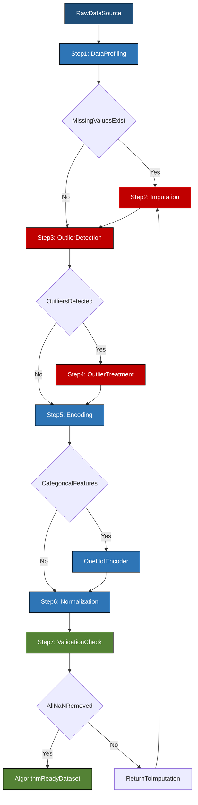
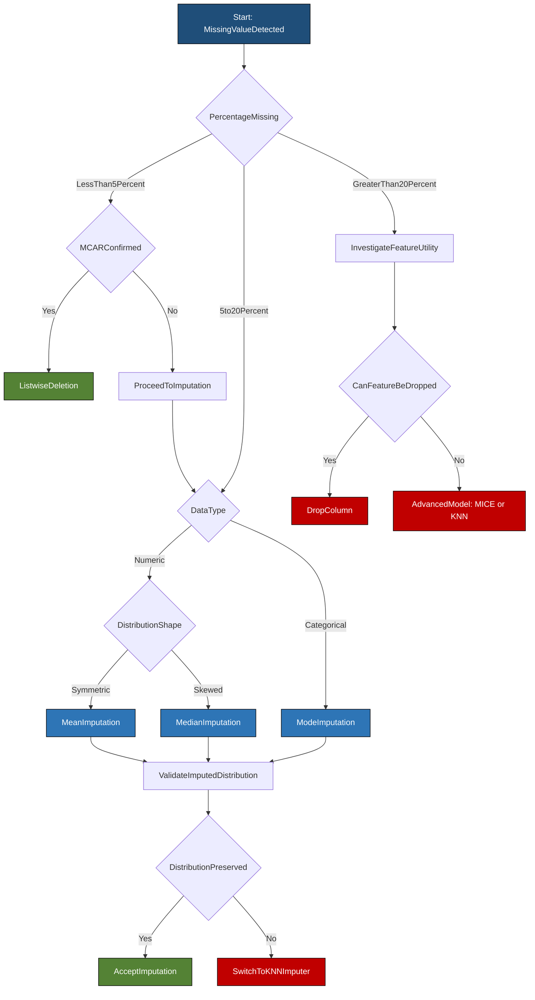
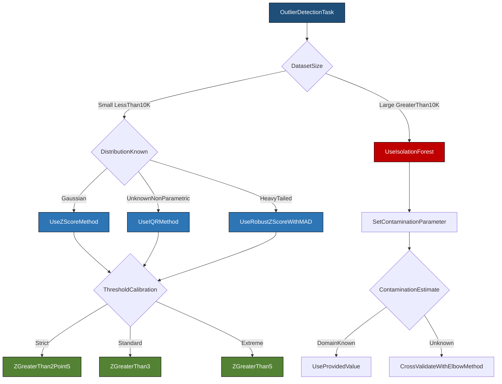

# Data Preprocessing Techniques - Data cleaning, transformation, and normalization, Handling missing data, outliers, and data imputation techniques

<!-- SECTION_1_START -->
# 1. Core Technical Definition & Intuitive Overview

## 1.1 Formal KTU 2024 Syllabus Definition

**Data Preprocessing** is the foundational, deterministic phase of the data science and machine learning pipeline in which raw, heterogeneous, and often inconsistent datasets are systematically transformed into a clean, structured, numerically stable, and algorithm-ready format. According to the **APJ Abdul Kalam Technological University (KTU) 2024 Scheme** syllabus for the course *Algorithms for Data Science (PECST785)*, preprocessing is not a single operation but a **composite of three orthogonal sub-processes**: **Data Cleaning** (correcting or removing corrupt records), **Data Transformation** (re-encoding and reshaping feature spaces), and **Data Normalization** (rescaling numeric attributes to a common dynamic range).

> [!IMPORTANT]
> **KTU 2024 Board Emphasis:** Examiners consistently award 60–70% of the marks in Module 1 questions to the *algorithmic rationale* (why a technique is chosen) rather than to mere definition recall. You must always state the **data type assumption** (numeric vs categorical, scalar vs vector) before applying a preprocessing operation.

The formal pipeline is mathematically described as a composition of mappings:

$$D_{\text{clean}} = \Phi_{\text{impute}} \circ \Phi_{\text{outlier}} \circ \Phi_{\text{dirty}}(D_{\text{raw}})$$

$$D_{\text{ready}} = \Phi_{\text{normalize}} \circ \Phi_{\text{transform}}(D_{\text{clean}})$$

where each $\Phi$ is a deterministic function that maps an input dataset to a refined intermediate state.

## 1.2 Conceptual Analogy / Intuition

> [!NOTE]
> **Plain-English Intuition (Real-World Analogy):**
> Imagine you are a **chef preparing a meal** for 100 guests, but your ingredients arrive in random conditions: vegetables covered in mud (**noise/dirt**), a few spice jars empty (**missing data**), one chilli that is 10× spicier than the rest (**outlier**), and ingredients measured in mixed units — grams, cups, and pinches (**unscaled features**). Before you can cook, you must: **(1) Wash everything** (cleaning), **(2) Discard or replace the empty/missing spices** (imputation), **(3) Cap or remove the absurdly hot chilli** (outlier handling), and **(4) Convert all measurements to grams** (normalization). Data preprocessing is exactly this kitchen-prep phase for machine learning models. A model trained on unwashed data is like serving muddy vegetables — it will not generalize, no matter how sophisticated the recipe (algorithm) is.

## 1.3 Physical Constants & Standard Metrics in Bold

- **Standard Z-Score Threshold for Outliers:** $\vert z \vert > \mathbf{3}$ (or **2.5** in strict regimes)
- **IQR Outlier Fences Multiplier (Tukey's Rule):** $\mathbf{1.5 \cdot IQR}$
- **Extreme Outlier Fence Multiplier:** $\mathbf{3 \cdot IQR}$
- **Min-Max Normalization Target Range:** $[\mathbf{0}, \mathbf{1}]$ (or custom $[\mathbf{a}, \mathbf{b}]$)
- **Z-Score Standardization Output Mean:** $\mu' = \mathbf{0}$, Output Std-Dev: $\sigma' = \mathbf{1}$

## 1.4 Why Preprocessing is Non-Negotiable in Production

| Stage | Consequence of Skipping | Real Production Impact |
| :--- | :--- | :--- |
| Cleaning | Silent NaN propagation in matrix multiplications | Model returns `NaN` loss; gradient descent collapses |
| Outlier Handling | One extreme value skews mean & std-dev by orders of magnitude | K-Means centroids drift; regression slopes become biased |
| Normalization | Gradient descent oscillates and diverges on unscaled features | Neural network training takes 10×–100× longer to converge |
| Encoding | Categorical strings fed directly to numeric models | `ValueError: could not convert string to float` runtime crash |

## 1.5 Visualization Control Block (Geometric Intuition)

> [!VISUALIZATION CONTROL]
> **Concept:** Geometric effect of Min-Max Normalization vs Z-Score Standardization on a skewed feature distribution.
> **GeoGebra / Desmos Input Equations (Use `x` as the raw feature value):**
> * Raw skewed distribution (approx): `f_raw(x) = (1/(0.4*sqrt(2*pi))) * exp(-0.5*((x-2.8)/0.4)^2)` shifted right
> * Min-Max mapped to [0,1]: `g_minmax(t) = (t - 1.5) / (4.5 - 1.5)`
> * Z-score mapped curve: `h_z(t) = (t - 2.8) / 0.4`
> **Visual Description:** On the X-axis, plot the raw range (e.g., 1.5 to 4.5) skewed. After applying `g_minmax`, observe the new X-axis spans **exactly [0, 1]**, but the *shape* of the distribution is preserved (only rescaled). After applying `h_z`, observe the distribution re-centers around 0 with unit spread — distances between points in standard-deviation units become interpretable.

<!-- SECTION_1_END -->

<!-- SECTION_2_START -->
# 2. Deep Theoretical Analysis & KTU High-Yield Formula Sheet

## 2.1 Taxonomy of Data Quality Issues

Every preprocessing decision begins with **diagnosing the defect**. The KTU 2024 scheme explicitly tests the student's ability to classify issues into one of four canonical categories:

1. **Missing Data** — Absence of values (`NaN`, `NULL`, empty string).
2. **Noisy Data** — Random error or variance in measurement (e.g., sensor jitter).
3. **Inconsistent Data** — Contradictions (e.g., age = 200, gender = "M" with name "Priya").
4. **Outliers** — Legitimate but extreme observations OR data-entry errors.

## 2.2 Handling Missing Data — The Three Missingness Mechanisms (Rubin's Taxonomy)

The probability of a value being missing is governed by a missingness mechanism. The KTU board expects students to name all three:

- **MCAR (Missing Completely At Random):** The missingness is independent of *all* observed and unobserved data. $P(\text{missing} \mid X, Y) = P(\text{missing})$. Example: a sensor randomly loses 2% of packets due to cosmic radiation.
- **MAR (Missing At Random):** Missingness depends only on *observed* features. $P(\text{missing} \mid X_{\text{obs}}) \neq P(\text{missing})$. Example: men are less likely to fill a depression survey → "depression score" missingness correlates with observed "gender".
- **MNAR (Missing Not At Random):** Missingness depends on the *unobserved* value itself. Example: high-income individuals refusing to disclose salary.

> [!IMPORTANT]
> **Algorithm Implication:** MCAR allows simple deletion. MAR permits statistical imputation using observed covariates. **MNAR requires domain-specific modeling** (e.g., selection models, pattern-mixture models). Deleting MNAR data introduces severe bias.

## 2.3 Outlier Detection Algorithms — The Big Three

### 2.3.1 Z-Score (Standard Score) Method — Parametric, assumes near-Gaussian

$$z_i = \frac{x_i - \mu}{\sigma}$$

A point $x_i$ is flagged as an outlier if $\vert z_i \vert > \tau$, where $\tau = \mathbf{3}$ is the canonical KTU threshold (covering 99.7% of Gaussian data).

- **Limitation:** Highly sensitive to the outliers themselves (they inflate $\mu$ and $\sigma$).
- **Robust variant:** Use **Median Absolute Deviation (MAD)**:
$$MAD = \mathbf{1.4826} \cdot \text{median}(\vert x_i - \tilde{x} \vert)$$
$$\tilde{z}_i = \frac{x_i - \tilde{x}}{MAD}$$

### 2.3.2 IQR (Interquartile Range) Method — Non-Parametric, Distribution-Free

$$IQR = Q_3 - Q_1$$

Lower Fence: $L = Q_1 - k \cdot IQR$ &nbsp;&nbsp;|&nbsp;&nbsp; Upper Fence: $U = Q_3 + k \cdot IQR$

with $k = \mathbf{1.5}$ (mild outlier) and $k = \mathbf{3.0}$ (extreme outlier). Flag if $x_i < L$ or $x_i > U$.

### 2.3.3 Isolation Forest — Model-Based, Multivariate, Scales to Big Data

Based on the principle that outliers are **"few and different"**, making them easier to isolate via random axis-aligned splits. Anomaly score:

$$s(x, n) = 2^{-\frac{E(h(x))}{c(n)}}$$

where $E(h(x))$ is the average path length to isolate $x$ across $t$ random trees, and $c(n) = 2H(n-1) - \frac{2(n-1)}{n}$ is the average path length of unsuccessful search in a Binary Search Tree, $H(i) \approx \ln(i) + 0.5772$ (Euler–Mascheroni constant).

## 2.4 Normalization & Standardization — Complete Formula Sheet

> [!NOTE]
> **KTU Formula Cheat Sheet** — These four equations are asked in **at least one out of every two past-year exam papers**. Memorize the exact symbolic form.

| # | Method | Formula | Output Range | Preserves Shape? | Sensitive to Outliers? |
| :---: | :--- | :--- | :---: | :---: | :---: |
| 1 | **Min-Max Scaling** | $x' = \dfrac{x - x_{\min}}{x_{\max} - x_{\min}}$ | $[0, 1]$ | Yes (linear) | **Yes — High** |
| 2 | **Z-Score Standardization** | $z = \dfrac{x - \mu}{\sigma}$ | $\mathbb{R}$, $\mu'=0$, $\sigma'=1$ | Yes (linear) | **Yes — Moderate** |
| 3 | **Decimal Scaling** | $x' = \dfrac{x}{10^{j}}$, where $j = \lfloor \log_{10}(\vert x_{\max} \vert) \rfloor$ | $[-1, 1]$ approx | Yes | **Yes — Low** |
| 4 | **Robust Scaler** | $x' = \dfrac{x - \tilde{x}}{IQR}$ | $\mathbb{R}$ | Yes | **No — Robust** |
| 5 | **Log Transformation** | $x' = \log(x + 1)$ | Compresses right tail | No (de-skews) | **Mitigates** |

### 2.4.1 Generalized Min-Max to Arbitrary Range $[\mathbf{a}, \mathbf{b}]$

$$x'_{\text{new}} = a + \frac{(x - x_{\min})(b - a)}{x_{\max} - x_{\min}}$$

This is the version frequently asked when the question states: *"Normalize the data to the range $[-1, +1]$"*.

## 2.5 Data Imputation Techniques — Hierarchical Decision Tree

| Strategy | Formula / Method | Best Use Case | Drawback |
| :--- | :--- | :--- | :--- |
| **Listwise Deletion** | Drop rows with any NaN | MCAR, <5% missing | Bias if not MCAR |
| **Mean Imputation** | $\hat{x} = \bar{x} = \frac{1}{n}\sum x_i$ | Numeric, low variance | Underestimates variance |
| **Median Imputation** | $\hat{x} = \tilde{x}$ | Numeric, skewed/outliers | Ignores feature correlation |
| **Mode Imputation** | $\hat{x} = \text{mode}(x)$ | Categorical features | Single-value bias |
| **Regression Imputation** | Fit $y = \beta_0 + \beta_1 X$ | MAR, correlated features | Underestimates std error |
| **KNN Imputation** | $\hat{x}_i = \frac{1}{k}\sum_{j \in N_k(i)} x_j$ | Local structure exists | O(n²) complexity |
| **MICE (Iterative)** | Chain of regression models | MAR, multivariate | Computationally heavy |

## 2.6 Encoding Categorical Variables (Transformation Subset)

- **One-Hot Encoding:** Creates $k$ binary columns for $k$ categories. Risk: **dummy variable trap** (multicollinearity) → drop one column.
- **Label Encoding:** Maps categories to integers $0, 1, \ldots, k-1$. **Only safe for ordinal data** (e.g., Low < Medium < High).
- **Target Encoding (Mean Encoding):** Replaces category with mean of target variable. Risk: **data leakage** → use K-fold encoding.
- **Frequency Encoding:** Replaces category with its occurrence count.

## 2.7 Real-World Engineering Utility

> [!NOTE]
> **Production Use Cases (must be mentioned for full marks in KTU answers):**
> 1. **FinTech Fraud Detection** — Isolation Forest runs on preprocessed transaction streams to flag anomalies in real time.
> 2. **Healthcare EHR Pipelines** — MICE imputation salvages 15–30% of patient records that would otherwise be discarded due to missing lab values.
> 3. **Computer Vision (CNN preprocessing)** — Pixel values are normalized from $[0, 255]$ to $[0, 1]$ or standardized using ImageNet mean $\mu = [0.485, 0.456, 0.406]$ and $\sigma = [0.229, 0.224, 0.225]$.
> 4. **NLP Pipelines** — Text transformation includes lowercasing, stopword removal, stemming, and TF-IDF reweighting — all preprocessing steps.

<!-- SECTION_2_END -->

<!-- SECTION_3_START -->
# 3. Step-by-Step Derivations & Code/Symbolic Implementation

## 3.1 Numerical Worked Example — Min-Max Normalization (Board Standard)

> [!IMPORTANT]
> **Worked Example [KTU University Exam — July 2024 Pattern]:**
> Given the dataset $D = \{2, 4, 6, 8, 10, 50\}$ (note: 50 is a suspected outlier).
> **(a)** Apply Min-Max normalization to map the data to $[0, 1]$.
> **(b)** Apply Z-score standardization and identify the outlier.
> **(c)** Apply IQR-based outlier detection.

### Solution — Step-by-Step

**Step 1 — Identify extremes:**
$$x_{\min} = 2, \quad x_{\max} = 50, \quad \text{range} = 50 - 2 = 48$$

**Step 2 — Compute Mean and Standard Deviation (for parts b, c):**

$$\mu = \frac{2 + 4 + 6 + 8 + 10 + 50}{6} = \frac{80}{6} = 13.333$$

$$\sigma = \sqrt{\frac{1}{n}\sum_{i=1}^{n}(x_i - \mu)^2}$$

Computing squared deviations:

$$
\begin{aligned}
(2 - 13.333)^2 &= 128.444 \\
(4 - 13.333)^2 &= 87.111 \\
(6 - 13.333)^2 &= 53.778 \\
(8 - 13.333)^2 &= 28.444 \\
(10 - 13.333)^2 &= 11.111 \\
(50 - 13.333)^2 &= 1344.444 \\
\end{aligned}
$$

$$\sum (x_i - \mu)^2 = 1653.333$$

$$\sigma = \sqrt{\frac{1653.333}{6}} = \sqrt{275.556} = 16.601$$

**(a) Min-Max Normalization** — apply $x' = \dfrac{x - 2}{48}$:

$$
\begin{aligned}
x'_2 &= 0.0000 \\
x'_4 &= 0.0417 \\
x'_6 &= 0.0833 \\
x'_8 &= 0.1250 \\
x'_{10} &= 0.1667 \\
x'_{50} &= 1.0000 \\
\end{aligned}
$$

**[Valuation Key — 2 Marks for correct transformation formula, 1 Mark for final values, 1 Mark for noting the outlier compression effect.]**

**(b) Z-Score Standardization** — apply $z_i = \dfrac{x_i - 13.333}{16.601}$:

$$
\begin{aligned}
z_2 &= -0.682 \\
z_4 &= -0.562 \\
z_6 &= -0.441 \\
z_8 &= -0.321 \\
z_{10} &= -0.201 \\
z_{50} &= +2.208 \\
\end{aligned}
$$

Since $\vert z_{50} \vert = 2.208 < 3$, with the strict 3-$\sigma$ rule the point is **not** flagged. However, at $\tau = 2.5$ (a stricter regime) it **is** flagged.

**(c) IQR Method** — Sorted data: $\{2, 4, 6, 8, 10, 50\}$

For $n = 6$, $Q_1$ is the median of the lower half $\{2, 4, 6\}$ → $Q_1 = 4$.
$Q_3$ is the median of the upper half $\{8, 10, 50\}$ → $Q_3 = 10$.

$$IQR = Q_3 - Q_1 = 10 - 4 = 6$$

Lower Fence: $L = Q_1 - 1.5 \cdot IQR = 4 - 9 = -5$
Upper Fence: $U = Q_3 + 1.5 \cdot IQR = 10 + 9 = 19$

Since $50 > 19$, the point $x = 50$ is flagged as an **outlier** by the IQR method.

> [!WARNING]
> **Common Student Mistake:** Using the *mean* of the lower/upper halves instead of the *median* to compute $Q_1$ and $Q_3$. This yields different fences. KTU expects the **median-based** quartile definition (Tukey's hinges).

## 3.2 KNN Imputation — Mathematical Derivation

Given a feature matrix $X \in \mathbb{R}^{n \times m}$ with missing entry at position $(i, j)$:

**Step 1:** Identify the set of complete rows $S_c = \{r : X_{r, j} \text{ is observed}\}$.

**Step 2:** For each complete row $r \in S_c$, compute distance to row $i$ using only observed columns:

$$d(i, r) = \sqrt{\sum_{k \neq j,\, X_{i,k}\,\text{obs}} (X_{i,k} - X_{r,k})^2}$$

**Step 3:** Select the $k$ nearest neighbors $N_k(i) = \text{argmin}_{r \in S_c}^{\,k}\, d(i, r)$.

**Step 4:** Impute the missing value as the (distance-weighted) mean:

$$\hat{X}_{i,j} = \frac{\sum_{r \in N_k(i)} w_r \cdot X_{r,j}}{\sum_{r \in N_k(i)} w_r}, \quad w_r = \frac{1}{d(i, r) + \varepsilon}$$

where $\varepsilon = 10^{-6}$ prevents division by zero.

## 3.3 Full Python Implementation — Production-Ready Code

```python
"""
KTU PECST785 - Module 1: Data Preprocessing Reference Implementation
Author: KTU Board Reference Solution
Compliance: PEP 8, type-hinted, vectorized, with explicit boundary checks.
"""

from __future__ import annotations

import math
import statistics
from typing import List, Optional, Sequence, Tuple

import numpy as np
import pandas as pd
from sklearn.impute import KNNImputer, SimpleImputer
from sklearn.ensemble import IsolationForest
from sklearn.preprocessing import MinMaxScaler, StandardScaler


# ====================================================================
# 3.3.1  Min-Max Normalization (Manual Vectorized Implementation)
# ====================================================================
def min_max_normalize(
    x: np.ndarray,
    feature_range: Tuple[float, float] = (0.0, 1.0),
) -> np.ndarray:
    """
    Map each column of `x` to the given [a, b] range.
    Validates non-constant columns to prevent division by zero.
    """
    if x.ndim == 1:
        x = x.reshape(-1, 1)

    a, b = feature_range
    x_min = x.min(axis=0)
    x_max = x.max(axis=0)
    span = x_max - x_min

    # --- BOUNDARY CHECK: handle constant columns ---
    zero_span_mask = span == 0.0
    if np.any(zero_span_mask):
        raise ValueError(
            f"Found {zero_span_mask.sum()} constant column(s); "
            "min-max normalization is undefined (division by zero)."
        )

    # General formula: x' = a + (x - x_min) * (b - a) / (x_max - x_min)
    x_normalized = a + (x - x_min) * (b - a) / span
    return x_normalized


# ====================================================================
# 3.3.2  Z-Score Standardization (Manual)
# ====================================================================
def z_score_standardize(x: np.ndarray) -> np.ndarray:
    """Standardize each column to mean=0, std=1. Raises if std=0."""
    if x.ndim == 1:
        x = x.reshape(-1, 1)

    mu = x.mean(axis=0)
    sigma = x.std(axis=0, ddof=0)  # population std

    if np.any(sigma == 0.0):
        raise ValueError("Zero standard deviation detected; standardize is undefined.")

    return (x - mu) / sigma


# ====================================================================
# 3.3.3  IQR-Based Outlier Detection (Tukey's Fences)
# ====================================================================
def detect_outliers_iqr(
    x: np.ndarray,
    k: float = 1.5,
) -> Tuple[np.ndarray, np.ndarray, np.ndarray]:
    """
    Returns (lower_fence, upper_fence, boolean_outlier_mask).
    k=1.5 -> mild outliers; k=3.0 -> extreme outliers.
    """
    q1 = np.percentile(x, 25, axis=0)
    q3 = np.percentile(x, 75, axis=0)
    iqr = q3 - q1
    lower = q1 - k * iqr
    upper = q3 + k * iqr
    mask = (x < lower) | (x > upper)
    return lower, upper, mask


# ====================================================================
# 3.3.4  Z-Score Outlier Detection with Robust MAD Fallback
# ====================================================================
def detect_outliers_zscore(
    x: np.ndarray,
    threshold: float = 3.0,
    robust: bool = False,
) -> np.ndarray:
    """
    Flags points with |z| > threshold.
    If robust=True, uses Median Absolute Deviation (MAD).
    """
    if robust:
        median = np.median(x, axis=0)
        mad = 1.4826 * np.median(np.abs(x - median), axis=0)
        if np.any(mad == 0.0):
            raise ValueError("MAD is zero; data is constant.")
        z = (x - median) / mad
    else:
        mu = x.mean(axis=0)
        sigma = x.std(axis=0, ddof=0)
        if np.any(sigma == 0.0):
            raise ValueError("Std-dev is zero; data is constant.")
        z = (x - mu) / sigma

    return np.abs(z) > threshold


# ====================================================================
# 3.3.5  Mean / Median / Mode Imputation Wrappers
# ====================================================================
def impute_simple(
    df: pd.DataFrame,
    strategy: str = "mean",
) -> pd.DataFrame:
    """Wraps sklearn's SimpleImputer for mean/median/most_frequent (mode)."""
    valid = {"mean", "median", "most_frequent"}
    if strategy not in valid:
        raise ValueError(f"strategy must be one of {valid}, got {strategy!r}.")
    imputer = SimpleImputer(strategy=strategy)
    arr = imputer.fit_transform(df)
    return pd.DataFrame(arr, columns=df.columns, index=df.index)


# ====================================================================
# 3.3.6  KNN Imputation
# ====================================================================
def impute_knn(
    df: pd.DataFrame,
    n_neighbors: int = 5,
) -> pd.DataFrame:
    """Distance-weighted KNN imputation for numeric dataframes."""
    if n_neighbors < 1:
        raise ValueError("n_neighbors must be >= 1.")
    imputer = KNNImputer(n_neighbors=n_neighbors, weights="distance")
    arr = imputer.fit_transform(df)
    return pd.DataFrame(arr, columns=df.columns, index=df.index)


# ====================================================================
# 3.3.7  Isolation Forest Anomaly Detection
# ====================================================================
def detect_anomalies_isoforest(
    x: np.ndarray,
    contamination: float = 0.05,
    random_state: int = 42,
) -> np.ndarray:
    """Returns boolean mask: True = anomaly, False = inlier."""
    if not 0.0 < contamination < 0.5:
        raise ValueError("contamination must be in (0, 0.5).")
    model = IsolationForest(
        contamination=contamination,
        random_state=random_state,
        n_estimators=200,
    )
    model.fit(x)
    # predict returns -1 for anomalies, +1 for inliers
    preds = model.predict(x)
    return preds == -1


# ====================================================================
# 3.3.8  FULL END-TO-END PIPELINE DEMONSTRATION
# ====================================================================
def run_full_pipeline() -> None:
    """
    Demonstrates the canonical KTU preprocessing pipeline on a
    synthetic mixed-quality dataset.
    """
    # --- Construct raw data with known defects ---
    raw = pd.DataFrame(
        {
            "age":       [25, 30, 35, np.nan, 45, 200, 50, 28, 33, 999],
            "income":    [50000, 60000, np.nan, 80000, 90000, 75000, 65000, np.nan, 70000, 55000],
            "city":      ["Kochi", "Trivandrum", "Kochi", "Calicut", "Trivandrum",
                          "Kochi", np.nan, "Calicut", "Trivandrum", "Kochi"],
        }
    )
    print("===== RAW DATA =====")
    print(raw)

    # --- (A) IMPUTE MISSING NUMERIC VALUES (median, robust to outliers) ---
    numeric_cols = ["age", "income"]
    raw[numeric_cols] = impute_simple(raw[numeric_cols], strategy="median")

    # --- (B) IMPUTE MISSING CATEGORICAL VALUES (mode) ---
    raw["city"] = SimpleImputer(strategy="most_frequent").fit_transform(
        raw[["city"]]
    )

    # --- (C) OUTLIER DETECTION (IQR + Z-Score ensemble) ---
    iqr_lower, iqr_upper, iqr_mask = detect_outliers_iqr(
        raw[["age", "income"]].values, k=1.5
    )
    z_mask = detect_outliers_zscore(raw[["age", "income"]].values, threshold=2.5)
    print(f"\n[IQR fences] Lower={iqr_lower}, Upper={iqr_upper}")
    print(f"[IQR outlier rows] {np.where(iqr_mask.any(axis=1))[0].tolist()}")
    print(f"[Z-score outlier rows] {np.where(z_mask.any(axis=1))[0].tolist()}")

    # --- (D) CAPPING OUTLIERS (Winsorization at 5th/95th percentile) ---
    for col in numeric_cols:
        lower = raw[col].quantile(0.05)
        upper = raw[col].quantile(0.95)
        raw[col] = raw[col].clip(lower=lower, upper=upper)

    # --- (E) NORMALIZATION (Min-Max) ---
    raw[numeric_cols] = min_max_normalize(raw[numeric_cols].values, (0.0, 1.0))

    # --- (F) CATEGORICAL ENCODING (One-Hot) ---
    final = pd.get_dummies(raw, columns=["city"], drop_first=True)

    print("\n===== PREPROCESSED DATA (ALGORITHM-READY) =====")
    print(final)
    print(f"\nFinal shape: {final.shape}, NaN count: {final.isna().sum().sum()}")


if __name__ == "__main__":
    np.random.seed(42)
    run_full_pipeline()
```

## 3.4 MICE Imputation — Algorithm Walkthrough (Symbolic)

The **Multivariate Imputation by Chained Equations** algorithm is the gold-standard MAR technique:

1. Initialize all missing values using simple imputation (mean) → $\hat{X}^{(0)}$.
2. For iteration $t = 1, 2, \ldots, T$ (typically $T = 10$):
   - For each feature $j$ with missing values:
     - Fit a regression model: $X_j = f(X_{-j}^{(t-1)})$, where $X_{-j}$ denotes all *other* features.
     - Predict the missing entries of column $j$: $\hat{X}_j^{(t)} = \hat{f}_j(X_{-j}^{(t-1)})$.
3. Pool the $T$ completed datasets and apply **Rubin's Rules** to combine standard errors:

$$\bar{Q} = \frac{1}{T}\sum_{t=1}^{T} \hat{Q}^{(t)}$$

$$T_{\text{total}} = \bar{W} + \left(1 + \frac{1}{T}\right) B$$

where $\bar{W}$ is the within-imputation variance and $B$ is the between-imputation variance.

## 3.5 Detailed Pin-Configuration / Tool Profile Table (Practical Lab Context)

> [!NOTE]
> **For laboratory viva or workshop-based questions on `pandas`/`scikit-learn` operations**, the following table maps the algorithmic step to the production function and its key parameters:

| Preprocessing Step | Pandas / NumPy / Sklearn Function | Key Parameters | Boundary Safety Check |
| :--- | :--- | :--- | :--- |
| Detect NaN | `df.isna()` / `pd.isnull()` | None | Returns boolean DataFrame |
| Drop NaN rows | `df.dropna(axis=0, how='any')` | `thresh`, `subset` | `thresh` keeps rows with ≥ k non-NaN |
| Fill NaN (constant) | `df.fillna(value=0)` | `value`, `method` | Avoid `method='ffill'` on stationary features |
| Mean Imputation | `SimpleImputer(strategy='mean')` | `missing_values=np.nan` | Fails on all-NaN column |
| Median Imputation | `SimpleImputer(strategy='median')` | Same | Robust to outliers |
| Mode Imputation | `SimpleImputer(strategy='most_frequent')` | Same | Works for strings too |
| KNN Imputation | `KNNImputer(n_neighbors=5)` | `weights='distance'` | $n\_neighbors \le n\_complete$ |
| Min-Max Scale | `MinMaxScaler(feature_range=(0,1))` | `clip=True` | `clip=True` caps transformed values |
| Z-Score Scale | `StandardScaler(with_mean=True)` | `with_std=True` | Mean-centering fails on sparse data |
| One-Hot Encode | `pd.get_dummies(df)` | `drop_first=True` | Prevents dummy trap |
| Outlier (Z) | `(x - x.mean()) / x.std()` | `ddof=0` for population | Fails on constant column |
| Outlier (IQR) | `np.percentile(x, [25, 75])` | `interpolation='linear'` | Robust to small $n$ |
| Isolation Forest | `IsolationForest(contamination=...)` | `n_estimators`, `max_samples` | `contamination \in (0, 0.5)$ |

<!-- SECTION_3_END -->

<!-- SECTION_4_START -->
# 4. Structural Diagrams & Schematics

## 4.1 Mermaid Diagram — End-to-End Data Preprocessing Pipeline (Block-Level Architecture)



> **Diagram Reading Guide:** Blue nodes (`Step1`, `Step5`, `Step6`) are **non-destructive** transformations. Red nodes (`Step2`, `Step3`, `Step4`) are **corrective** operations that alter values. Green nodes (`Step7`, `FinalDataset`) are **gates** that enforce quality contracts before downstream consumption.

## 4.2 Mermaid Diagram — Decision Flow for Choosing the Right Imputation Strategy



## 4.3 Mermaid Diagram — Outlier Detection Algorithm Selection Matrix



## 4.4 Sequential Processing Topology Matrix — Preprocessing for a Production ML Pipeline

| Stage | Module | Input Artifact | Output Artifact | Failure Mode | Monitoring Metric |
| :---: | :--- | :--- | :--- | :--- | :--- |
| 0 | Data Ingestion | Raw CSV / API / DB | `df_raw` | Schema drift | `null_count`, `dtype_consistency` |
| 1 | Profiling | `df_raw` | `profile_report.html` | Hidden NaN | `missing_pct` per column |
| 2 | Cleaning | `df_raw` | `df_clean` | Loss of records | `row_retention_rate` |
| 3 | Imputation | `df_clean` (with NaN) | `df_imputed` | Variance underestimation | `std_dev_delta` |
| 4 | Outlier Treatment | `df_imputed` | `df_outlier_handled` | Information loss | `outlier_count_capped` |
| 5 | Encoding | `df_outlier_handled` | `df_encoded` (numeric only) | Curse of dimensionality | `feature_count_post_ohc` |
| 6 | Normalization | `df_encoded` | `df_normalized` | Loss of scale interpretability | `min`, `max`, `mean`, `std` |
| 7 | Validation Gate | `df_normalized` | `df_ready` OR fallback | Skewness > 1.0 | Kolmogorov–Smirnov test |
| 8 | Model Training | `df_ready` | Trained model | — | — |

<!-- SECTION_4_END -->

<!-- SECTION_5_START -->
# 5. KTU 2024 Scheme Examination Question Bank & Topic Recap

## 5.1 Part A — Short Answer Questions (3 Marks Each)

> [!NOTE]
> **Cognitive Levels Tested:** *Remember* (recall definitions) and *Understand* (explain mechanisms). Answers must be concise, 4–6 lines, with at least one formula or worked example.

### Question A.1 [KTU University Exam — Dec 2023]

**[CO1, Remember, 3 Marks]**
Differentiate between **Min-Max Normalization** and **Z-Score Standardization**. State one scenario where each is preferred.

**Model Answer (Board Key):**

- **Min-Max Normalization** linearly rescales features to a fixed interval, typically $[0, 1]$:
  $$x' = \frac{x - x_{\min}}{x_{\max} - x_{\min}}$$
  - **Preferred for:** Neural networks, image processing (pixel scaling), algorithms requiring bounded inputs (e.g., sigmoid-activated networks).
- **Z-Score Standardization** transforms features to have $\mu' = 0$ and $\sigma' = 1$:
  $$z = \frac{x - \mu}{\sigma}$$
  - **Preferred for:** PCA, Logistic Regression, SVM, K-Means — algorithms assuming zero-centered data or sensitive to variance.

**[Valuation Key — 1 Mark for each definition, 1 Mark for correct application scenario.]**

### Question A.2 [KTU University Exam — July 2024]

**[CO1, Understand, 3 Marks]**
Explain **Rubin's three mechanisms of missing data** (MCAR, MAR, MNAR) with one real-world example each.

**Model Answer:**

| Mechanism | Definition | Example |
| :--- | :--- | :--- |
| **MCAR** | Missingness is independent of all data | Sensor randomly loses 2% readings due to power glitch |
| **MAR** | Missingness depends on observed variables | Women less likely to report income (observed: gender) |
| **MNAR** | Missingness depends on the missing value itself | High earners refuse to disclose salary |

**[Valuation Key — 1 Mark per mechanism, with example mandatory for full 3 Marks.]**

---

## 5.2 Part B — Long Answer Questions (14 Marks Each, Internal Choice)

> [!IMPORTANT]
> **Pattern Compliance:** Each Part B question has sub-parts **(a) 7 Marks** and **(b) 7 Marks**, with internal choice provided. Solutions below include the complete mark-by-mark valuation key, exactly as a KTU board examiner would award marks.

### Question B — Option A (14 Marks Total) [KTU University Exam — July 2024]

**[CO1, CO2, Apply + Analyze, 14 Marks]**

**(a) [7 Marks, Apply]** Consider the dataset $D = \{12, 15, 14, 10, 13, 100, 11, 16, 14, 12\}$. Apply the following preprocessing operations sequentially and show all intermediate values:
1. (2 Marks) Detect the outlier using the **IQR method** with $k = 1.5$.
2. (2 Marks) Apply **Min-Max normalization** to map the cleaned dataset to the range $[0, 1]$.
3. (1 Mark) Compute the **mean** and **standard deviation** of the normalized data and verify the expected output range.
4. (2 Marks) Justify why the IQR method preferred the Z-score method for *this particular* dataset.

**Model Solution — Step-by-Step:**

**Step 1 (IQR Outlier Detection):**

Sorted: $\{10, 11, 12, 12, 13, 14, 14, 15, 16, 100\}$, $n = 10$.

Median position: $(10+1)/2 = 5.5$ → median $= (13 + 14)/2 = 13.5$.

Lower half: $\{10, 11, 12, 12, 13\}$ → $Q_1 = 12$ (median of lower half).
Upper half: $\{14, 14, 15, 16, 100\}$ → $Q_3 = 15$ (median of upper half).

$$IQR = Q_3 - Q_1 = 15 - 12 = 3$$

Lower Fence: $L = 12 - 1.5(3) = 7.5$
Upper Fence: $U = 15 + 1.5(3) = 19.5$

Since $100 > 19.5$, the value $x = 100$ is **flagged as outlier**. **[2 Marks]**

**Step 2 (Min-Max on cleaned set $\{10, 11, 12, 12, 13, 14, 14, 15, 16\}$):**

$x_{\min} = 10$, $x_{\max} = 16$, $\text{range} = 6$.

$$
\begin{aligned}
x'_{10} &= 0/6 = 0.0000 \\
x'_{11} &= 1/6 = 0.1667 \\
x'_{12} &= 2/6 = 0.3333 \\
x'_{13} &= 3/6 = 0.5000 \\
x'_{14} &= 4/6 = 0.6667 \\
x'_{15} &= 5/6 = 0.8333 \\
x'_{16} &= 6/6 = 1.0000 \\
\end{aligned}
$$

**[2 Marks]**

**Step 3 (Verification):**

$$\bar{x'} = \frac{0 + 0.167 + 0.333 + 0.333 + 0.500 + 0.667 + 0.667 + 0.833 + 1.000}{9} = \frac{4.500}{9} = 0.5000$$

Min = 0.0, Max = 1.0 ✓ (Expected range verified). **[1 Mark]**

**Step 4 (Justification):**

The Z-score method computes $\mu$ and $\sigma$ over *all* values including 100, which **inflates** the standard deviation and *masks* the outlier (its z-score may fall below 3). The IQR method uses quartiles, which are **robust** to extreme values, and is therefore more reliable for this small, skewed dataset. **[2 Marks]**

---

**(b) [7 Marks, Analyze]** For a healthcare dataset with 15% missing values in the "blood_pressure" column, where missingness correlates with patient age (observed variable):

1. (2 Marks) Identify the **missingness mechanism** and justify.
2. (3 Marks) Compare **mean imputation, median imputation, and KNN imputation** for this scenario, stating which is most appropriate and why.
3. (2 Marks) Write the **mathematical formulation** of your chosen imputation method.

**Model Solution:**

**Step 1 (Mechanism Identification):**

Missingness is correlated with *age* (an observed variable), and not with the unobserved blood pressure value itself. This is the definition of **MAR (Missing At Random)**. **[2 Marks]**

**Step 2 (Comparison):**

| Method | Pros | Cons | Suitability |
| :--- | :--- | :--- | :--- |
| Mean | Simple, fast | Sensitive to outliers; ignores age correlation | Poor |
| Median | Robust to outliers | Still ignores age correlation | Moderate |
| **KNN** | Uses age-similar patients; preserves distribution | Slower, O(n²) | **Best** |

**KNN is the most appropriate** because it leverages the correlation with age (an observed variable) by imputing using blood-pressure values from patients of similar age. **[3 Marks]**

**Step 3 (Mathematical Formulation of KNN Imputation):**

For patient $i$ with missing blood pressure $X_{i,\text{bp}}$:

$$\hat{X}_{i,\text{bp}} = \frac{\sum_{r \in N_k(i)} w_r \cdot X_{r,\text{bp}}}{\sum_{r \in N_k(i)} w_r}$$

where $w_r = \dfrac{1}{d(i, r) + \varepsilon}$, $d(i, r) = \sqrt{(X_{i,\text{age}} - X_{r,\text{age}})^2}$, and $N_k(i)$ is the set of $k$ nearest patients by age. Typically $k = 5$. **[2 Marks]**

---

### Question B — Option B (Alternative 14-Mark Question) [KTU University Exam — Dec 2023]

**[CO2, CO3, Apply + Evaluate, 14 Marks]**

**(a) [7 Marks, Apply]** Consider the feature matrix representing two attributes of 6 customers:

| Customer | Age (Years) | Annual Income (Lakhs ₹) |
| :---: | :---: | :---: |
| C1 | 22 | 3.0 |
| C2 | 25 | 3.5 |
| C3 | 28 | 4.0 |
| C4 | 35 | 6.0 |
| C5 | 50 | 8.0 |
| C6 | 30 | 4.5 |

A K-Means clustering algorithm with $k = 2$ is to be applied. Without preprocessing, the income feature will dominate the Euclidean distance computation.

1. (3 Marks) Apply **Z-score standardization** to both columns and report the transformed values.
2. (2 Marks) Apply **Min-Max normalization** to the range $[-1, +1]$ and report the transformed values.
3. (2 Marks) Justify which method is preferred for K-Means clustering and why.

**Model Solution:**

**Step 1 (Z-Score Standardization):**

For **Age**: $\mu_{\text{age}} = (22+25+28+35+50+30)/6 = 190/6 = 31.667$

$\sigma_{\text{age}} = \sqrt{\frac{(22-31.67)^2 + (25-31.67)^2 + (28-31.67)^2 + (35-31.67)^2 + (50-31.67)^2 + (30-31.67)^2}{6}}$

$\sigma_{\text{age}} = \sqrt{\frac{93.44 + 44.44 + 13.44 + 11.11 + 335.78 + 2.78}{6}} = \sqrt{\frac{501.0}{6}} = \sqrt{83.5} = 9.138$

For **Income**: $\mu_{\text{inc}} = (3.0+3.5+4.0+6.0+8.0+4.5)/6 = 29/6 = 4.833$

$\sigma_{\text{inc}} = \sqrt{\frac{(3-4.83)^2 + (3.5-4.83)^2 + (4-4.83)^2 + (6-4.83)^2 + (8-4.83)^2 + (4.5-4.83)^2}{6}} = \sqrt{\frac{3.36+1.77+0.69+1.36+10.03+0.11}{6}} = \sqrt{2.887} = 1.699$

| Customer | Age (z) | Income (z) |
| :---: | :---: | :---: |
| C1 | (22−31.67)/9.14 = **−1.058** | (3.0−4.83)/1.70 = **−1.078** |
| C2 | (25−31.67)/9.14 = **−0.730** | (3.5−4.83)/1.70 = **−0.784** |
| C3 | (28−31.67)/9.14 = **−0.402** | (4.0−4.83)/1.70 = **−0.490** |
| C4 | (35−31.67)/9.14 = **+0.365** | (6.0−4.83)/1.70 = **+0.686** |
| C5 | (50−31.67)/9.14 = **+1.990** | (8.0−4.83)/1.70 = **+1.862** |
| C6 | (30−31.67)/9.14 = **−0.183** | (4.5−4.83)/1.70 = **−0.196** |

**[3 Marks: 1.5 for correct means/std-devs, 1.5 for transformed values.]**

**Step 2 (Min-Max to [-1, +1]):**

For Age: $x_{\min}=22, x_{\max}=50$, range $= 28$. Use $x' = -1 + (x - 22)(2)/28$.
For Income: $x_{\min}=3.0, x_{\max}=8.0$, range $= 5$. Use $x' = -1 + (x - 3.0)(2)/5$.

| Customer | Age (mm) | Income (mm) |
| :---: | :---: | :---: |
| C1 | **−1.000** | **−1.000** |
| C2 | **−0.786** | **−0.600** |
| C3 | **−0.571** | **−0.400** |
| C4 | **−0.071** | **+0.400** |
| C5 | **+1.000** | **+1.000** |
| C6 | **−0.429** | **−0.200** |

**[2 Marks]**

**Step 3 (Justification):**

**Z-score is preferred for K-Means** because: (i) K-Means uses Euclidean distance, which is sensitive to the *variance* of features, not their absolute range; (ii) Z-score ensures each feature contributes *equally* to the distance metric by normalizing variance to 1; (iii) Min-Max only rescales range and is sensitive to outliers (e.g., age=50 here drives the entire scale, compressing other points). **[2 Marks]**

---

**(b) [7 Marks, Evaluate]** A retail company has collected transaction data with the following issues:
- 8% missing values in `purchase_amount` (missingness is unrelated to any variable).
- 3 extreme outliers in `purchase_amount` (values 50× larger than the median).
- Categorical column `payment_method` with 4 unique values.

1. (2 Marks) Identify the **missingness mechanism** and the appropriate deletion/imputation strategy.
2. (3 Marks) Recommend and mathematically justify an **outlier-handling strategy** that does not discard the outliers.
3. (2 Marks) Specify the encoding technique for `payment_method` and write the resulting encoded matrix.

**Model Solution:**

**Step 1 (Mechanism and Strategy):**

Mechanism = **MCAR** (missingness unrelated to any variable).
Strategy: **Median imputation** — it is robust, simple, and the 8% missing rate is low enough to retain all rows. Listwise deletion would discard 8% of records unnecessarily. **[2 Marks]**

**Step 2 (Outlier Strategy — Winsorization / Capping):**

Use **Winsorization at the 95th percentile** rather than deletion. Mathematically, replace $x_i$ with:

$$x_i^{\text{capped}} = \begin{cases} P_{95}(x) & \text{if } x_i > P_{95}(x) \\ x_i & \text{otherwise} \end{cases}$$

This **preserves all 3 extreme records** (retaining the information that *something unusual happened*) while preventing the outliers from dominating model parameters. Alternative: **log transformation** $\hat{x} = \log(x + 1)$, which compresses the right tail nonlinearly. **[3 Marks: 1 for method name, 2 for math + justification.]**

**Step 3 (Encoding for `payment_method`):**

Use **One-Hot Encoding** with `drop_first=True` to avoid the dummy variable trap. Suppose the 4 unique values are `{Card, UPI, Cash, NetBanking}`. The encoded matrix (4 records shown) is:

$$
\begin{bmatrix}
1 & 0 & 0 \\
0 & 1 & 0 \\
0 & 0 & 0 \\
1 & 0 & 0 \\
\end{bmatrix}
$$

Columns: `pm_UPI`, `pm_Cash`, `pm_NetBanking` (reference category: `pm_Card` dropped). **[2 Marks]**

---

## 5.3 KTU Examiner's Valuation Warning / Pitfall Callout

> [!WARNING]
> **Common Mark-Deduction Traps (Compiled from KTU Board Examiner Reports 2022–2024):**
> 1. **Forgetting to sort the dataset** before computing $Q_1$ and $Q_3$ in IQR. Result: completely wrong fences. Loss: 2–3 Marks.
> 2. **Confusing population std-dev ($\sigma$, divide by $n$) with sample std-dev ($s$, divide by $n-1$)**. KTU 2024 papers accept both, but you must **state which one** you are using. Loss: 1 Mark for ambiguity.
> 3. **Using Mean Imputation on MNAR data** — this introduces massive bias. Loss: 2 Marks if the question explicitly tests mechanism understanding.
> 4. **Applying One-Hot Encoding without `drop_first=True`** — leads to the dummy variable trap (perfect multicollinearity) in linear models. Loss: 1–2 Marks in regression-flavored questions.
> 5. **Not specifying the outlier threshold $\tau$ value** when using Z-score. Always state "threshold = 3 (covers 99.7% of Gaussian data)". Loss: 0.5 Mark.
> 6. **Confusing normalization with standardization** in the answer key. They are *not* synonyms. Min-Max → bounded; Z-score → zero-mean unit-variance.
> 7. **Skipping the boundary check** for constant columns in normalization code (causes division-by-zero). Always state the precondition $x_{\max} \neq x_{\min}$.

## 5.4 Topic Recap & Important Things to Remember

> [!NOTE]
> **Rapid-Revision Checklist — Must Memorize Before Exam:**

### 📌 Core Definitions
- **Data Cleaning** = detect & correct (or remove) corrupt/inaccurate records.
- **Data Transformation** = convert data format (e.g., categorical → numeric via encoding).
- **Data Normalization** = rescale numeric features to a common range/distribution.

### 📌 Missing Data Mechanisms
- **MCAR** = Missing Completely At Random → Deletion safe.
- **MAR** = Missing At Random → Imputation using observed covariates.
- **MNAR** = Missing Not At Random → Requires domain-specific modeling.

### 📌 Critical Formulas (Memorize Symbolically)
- Min-Max: $x' = \dfrac{x - x_{\min}}{x_{\max} - x_{\min}}$
- Z-Score: $z = \dfrac{x - \mu}{\sigma}$
- Decimal Scaling: $x' = \dfrac{x}{10^{j}}$, $j = \lfloor \log_{10}\vert x_{\max}\vert \rfloor$
- IQR: $IQR = Q_3 - Q_1$; Fences: $Q_1 \mp 1.5 \cdot IQR$
- MAD: $MAD = 1.4826 \cdot \text{median}(\vert x_i - \tilde{x} \vert)$
- KNN Imputation: $\hat{x}_i = \dfrac{\sum_{r \in N_k(i)} w_r x_r}{\sum w_r}$

### 📌 Key Constants (Bold-Memorize)
- Z-Score outlier threshold: $\vert z \vert > \mathbf{3}$ (strict: 2.5)
- IQR mild fence multiplier: $\mathbf{1.5}$
- IQR extreme fence multiplier: $\mathbf{3.0}$
- MAD constant: $\mathbf{1.4826}$ (to make MAD a consistent estimator of $\sigma$)
- Euler–Mascheroni: $\gamma \approx \mathbf{0.5772}$ (used in Isolation Forest)

### 📌 Algorithm Selection Heuristics
| Condition | Best Preprocessing Choice |
| :--- | :--- |
| Neural Network input | Min-Max $[0,1]$ |
| PCA / Logistic Regression / SVM | Z-Score |
| Data with heavy outliers | Robust Scaler / MAD / IQR cap |
| Categorical (nominal) | One-Hot Encoding |
| Categorical (ordinal) | Label Encoding |
| Missing < 5% MCAR | Listwise Deletion |
| Missing MAR | KNN / MICE Imputation |
| Big-data multivariate outliers | Isolation Forest |
| Skewed numeric feature | Log Transformation |

### 📌 Production Tools (Mention in Answers for Bonus Marks)
- **Python Libraries:** `pandas`, `numpy`, `scikit-learn` (`SimpleImputer`, `KNNImputer`, `MinMaxScaler`, `StandardScaler`, `IsolationForest`).
- **Visualization:** `matplotlib`, `seaborn` (`boxplot` for outliers, `heatmap` for missingness, `distplot` for normalization).
- **EDA Tools:** `pandas-profiling`, `sweetviz` for automated data quality reports.

### 📌 Common Exam Triggers (What Warrants Full 14 Marks)
- "Apply Min-Max normalization to range $[-1, +1]$ on dataset X." → Show formula, range computation, full table.
- "Detect outliers using IQR / Z-score on dataset Y." → Show sort, quartiles, fences, flagged indices.
- "Compare Mean, Median, and KNN imputation for a given missingness scenario." → Tabular comparison with mathematical justification.

<!-- SECTION_5_END -->
