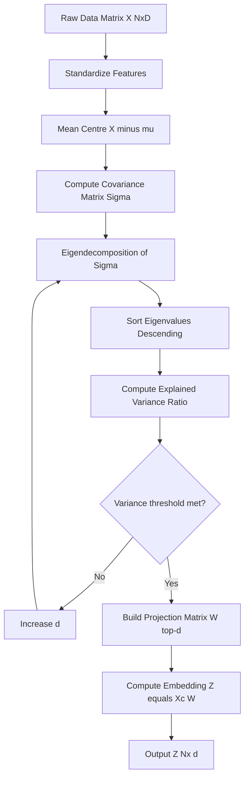
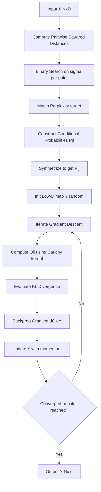
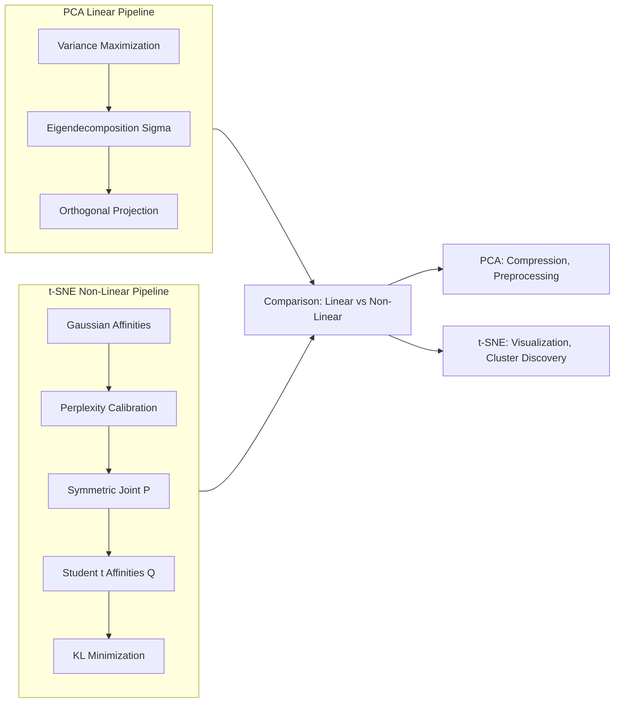

# Dimensionality reduction techniques - Principal Component Analysis (PCA), t-Distributed Stochastic Neighbor Embedding (t-SNE)

<!-- SECTION_1_START -->

# 1. Core Technical Definition & Intuitive Overview

## 1.1 Dimensionality Reduction — Formal Definition

**Dimensionality Reduction (DR)** is the class of unsupervised machine learning techniques that projects data from a high-dimensional ambient space $\mathbb{R}^{D}$ into a lower-dimensional latent space $\mathbb{R}^{d}$ (where $d \ll D$) while preserving a chosen geometric or statistical structure of the original dataset.

In the KTU 2024 Scheme syllabus for **Algorithms for Data Science (PECST785)**, dimensionality reduction is positioned as a foundational pre-processing and visualization engine that addresses the **Curse of Dimensionality** — the phenomenon where data becomes exponentially sparse, distances lose discriminative power, and computational cost grows super-linearly as the number of features increases.

> [!IMPORTANT]
> **KTU 2024 Syllabus Highlight**
> Two representative algorithms are mandated under Module 1:
> 1. **Principal Component Analysis (PCA)** — a *linear*, *deterministic*, *global* technique based on second-order statistics (variance–covariance).
> 2. **t-Distributed Stochastic Neighbor Embedding (t-SNE)** — a *non-linear*, *stochastic*, *local* technique based on probability distributions and divergence minimization.

## 1.2 Conceptual Analogy / Intuition

> [!NOTE]
> **Real-World Analogy — The Photography Studio**
> Imagine a portrait photographer shooting a 3D face with a 12-megapixel camera. Each pixel is a *feature* (a dimension). The raw image has millions of dimensions, but the *information* that distinguishes one face from another is far smaller — perhaps the nose-bridge angle, the jawline width, and the eye spacing (a 3-dimensional "essence"). **Dimensionality reduction is the mathematical lens that keeps the essence and discards the redundant pixels.**
> * **PCA** behaves like rotating the camera to align with the axes along which the face *varies the most* (the principal axes of variation).
> * **t-SNE** behaves like a curator arranging portraits on a wall so that *similar faces* sit close together and *dissimilar faces* sit far apart, regardless of how the wall is oriented.

## 1.3 The Curse of Dimensionality — Why We Need DR

| Phenomenon | Mathematical Behaviour | Consequence in Data Science |
|---|---|---|
| Distance Concentration | $\lim_{D \to \infty} \frac{\max \Vert x_i - x_j \Vert - \min \Vert x_i - x_j \Vert}{\min \Vert x_i - x_j \Vert} \to 0$ | Nearest-neighbour search becomes meaningless |
| Volume of Hypercube | $V = 1^D \to 0$ as $D$ grows | Data points become isolated islands |
| Sample Complexity | Grows exponentially in $D$ | Massive datasets required to generalize |
| Computational Cost | Eigen-decomposition is $O(D^3)$ | Slow training for high-$D$ models |

The figure below (visualized in the GeoGebra control panel) shows the geometric intuition of how PCA finds the *direction of maximum variance* in 2D.

> [!VISUALIZATION CONTROL]
> **Concept:** PCA as the line of best fit that maximizes variance projection.
> **GeoGebra / Desmos Input Equations:**
> * Data cloud: List of scattered points $\{(x_i, y_i)\}_{i=1}^{N}$
> * Mean vector: $(\bar{x}, \bar{y}) = \left(\frac{\sum x_i}{N}, \frac{\sum y_i}{N}\right)$
> * Principal axis: line $y - \bar{y} = \frac{\lambda_1 - \text{cov}(x,x)}{\text{cov}(x,y)}(x - \bar{x})$
> **Visual Description:** Watch how the major axis of the elliptical data cloud aligns with the first eigenvector $v_1$, while the minor axis aligns with the second eigenvector $v_2$. The points projected onto $v_1$ have *maximum* variance.

## 1.4 Formal Definition of PCA

**Principal Component Analysis (PCA)** is an orthogonal linear transformation that maps the data matrix $X \in \mathbb{R}^{N \times D}$ to a new coordinate system such that the greatest variance of the projected data lies along the first coordinate (the *first principal component*), the second greatest variance along the second coordinate, and so on.

Mathematically, PCA finds an orthogonal matrix $W \in \mathbb{R}^{D \times d}$ (with $d \le D$) such that the projected matrix

$$Z = X_{\text{centered}} W$$

maximizes $\text{tr}(\text{Cov}(Z))$, i.e., the sum of variances of the $d$ projected coordinates.

## 1.5 Formal Definition of t-SNE

**t-Distributed Stochastic Neighbor Embedding (t-SNE)** is a non-linear, probabilistic technique introduced by **van der Maaten and Hinton (2008)** that models pairwise similarities in the high-dimensional space using a **Gaussian distribution** and pairwise similarities in the low-dimensional space using a **Student's $t$-distribution** (with 1 degree of freedom, i.e., a Cauchy distribution). It then minimizes the **Kullback–Leibler (KL) divergence** between the two joint probability distributions via gradient descent.

Formally, t-SNE solves:

$$\min_{y_1, \dots, y_N} \quad C = KL(P \Vert Q) = \sum_{i \neq j} p_{ij} \log \frac{p_{ij}}{q_{ij}}$$

where $P$ is the high-dimensional similarity matrix and $Q$ is the low-dimensional similarity matrix.

<!-- SECTION_1_END -->

<!-- SECTION_2_START -->

# 2. Deep Theoretical Analysis & KTU High-Yield Formula Sheet

## 2.1 PCA — Operational Logic Decomposed

PCA is a **deterministic, closed-form algorithm** that proceeds through five rigorous steps.

### Step 1 — Mean Centring (Demeaning)
The data matrix $X \in \mathbb{R}^{N \times D}$ is translated so that each feature has zero empirical mean. This is essential because variance is a *centred* second-moment quantity.

$$X_{\text{centered}} = X - \mathbf{1}_N \mu^T \quad \text{where} \quad \mu = \frac{1}{N} \sum_{i=1}^{N} x_i$$

### Step 2 — Construct the Covariance Matrix
The empirical covariance matrix $\Sigma \in \mathbb{R}^{D \times D}$ captures second-order linear dependencies among features.

$$\Sigma = \frac{1}{N - 1} X_{\text{centered}}^T X_{\text{centered}}$$

Properties: $\Sigma$ is **symmetric positive semi-definite**, has $D$ real non-negative eigenvalues, and is diagonalizable by an orthogonal matrix.

### Step 3 — Spectral Decomposition (Eigen-Solver)
Solve the characteristic equation to obtain eigen-pairs $(\lambda_k, v_k)$:

$$\Sigma v_k = \lambda_k v_k, \quad \Vert v_k \Vert_2 = 1$$

The eigenvectors $v_1, v_2, \dots, v_D$ form the *principal axes*; the eigenvalues $\lambda_1 \ge \lambda_2 \ge \dots \ge \lambda_D \ge 0$ quantify the variance captured along each axis.

### Step 4 — Dimensionality Selection
Choose $d$ such that the cumulative explained variance ratio exceeds a threshold $\tau$ (commonly $\tau = 0.95$):

$$\frac{\sum_{k=1}^{d} \lambda_k}{\sum_{k=1}^{D} \lambda_k} \ge \tau$$

### Step 5 — Projection
Form the projection matrix $W = [v_1 \mid v_2 \mid \dots \mid v_d] \in \mathbb{R}^{D \times d}$ and compute the low-dimensional embedding:

$$Z = X_{\text{centered}} W \in \mathbb{R}^{N \times d}$$

## 2.2 The 'Why' Behind PCA

| Design Choice | Mathematical Reason | Practical Benefit |
|---|---|---|
| Maximize variance | Variance = Signal; low variance ≈ noise | Retains discriminative information |
| Orthogonal axes | $V^T V = I$ ensures uncorrelated components | Removes redundancy between features |
| Eigendecomposition | Rayleigh quotient $\frac{v^T \Sigma v}{v^T v}$ is maximized at top eigenvector | Closed-form, globally optimal solution |
| Discard small $\lambda$ | Small eigenvalues correspond to noisy directions | Built-in denoising and compression |

## 2.3 t-SNE — Operational Logic Decomposed

t-SNE is an **iterative, stochastic optimization algorithm** that proceeds in four stages.

### Stage 1 — High-Dimensional Affinities (Gaussian Kernel)
For each point $x_i$, define a conditional probability $p_{j \vert i}$ that $x_i$ would pick $x_j$ as its neighbour, proportional to a Gaussian density centred at $x_i$:

$$p_{j \vert i} = \frac{\exp\!\left(-\frac{\Vert x_i - x_j \Vert^2}{2 \sigma_i^2}\right)}{\sum_{k \neq i} \exp\!\left(-\frac\Vert x_i - x_k \Vert^2}{2 \sigma_i^2}\right)}, \quad p_{i \vert i} = 0$$

### Stage 2 — Perplexity-Based Bandwidth Calibration
The bandwidth $\sigma_i$ is set independently for each point to match a user-defined **perplexity**:

$$\text{Perp}(P_i) = 2^{H(P_i)} \quad \text{where} \quad H(P_i) = -\sum_j p_{j \vert i} \log_2 p_{j \vert i}$$

A binary search over $\sigma_i$ ensures every $P_i$ has the target perplexity (commonly **30–50**).

### Stage 3 — Symmetrization
To avoid asymmetry and out-of-sample issues, the joint distribution is symmetrized:

$$p_{ij} = \frac{p_{j \vert i} + p_{i \vert j}}{2N}$$

### Stage 4 — Low-Dimensional Affinities (Student-t Kernel)
In the low-dimensional map, similarities $q_{ij}$ use a **heavy-tailed Student's $t$-distribution** with 1 degree of freedom (Cauchy). The heavy tail solves the *crowding problem*:

$$q_{ij} = \frac{\left(1 + \Vert y_i - y_j \Vert^2\right)^{-1}}{\sum_{k \neq l} \left(1 + \Vert y_k - y_l \Vert^2\right)^{-1}}, \quad q_{ii} = 0$$

### Stage 5 — Gradient Descent on KL Divergence
The cost function is minimized using gradient descent with momentum:

$$\frac{\partial C}{\partial y_i} = 4 \sum_{j \neq i} \left(p_{ij} - q_{ij}\right) \left(y_i - y_j\right) \left(1 + \Vert y_i - y_j \Vert^2\right)^{-1}$$

Early exaggeration (multiplying $P$ by a large constant in the first ~250 iterations) accelerates cluster formation.

## 2.4 The 'Why' Behind t-SNE

| Design Choice | Mathematical Reason | Practical Benefit |
|---|---|---|
| Gaussian in high-D | Models local neighbourhoods naturally | Preserves local cluster structure |
| Heavy-tailed $t$ in low-D | $q$ decays slower than Gaussian | Prevents distant points from being crushed to a single point |
| KL divergence | Asymmetric: distant $q$ with non-zero $p$ is heavily penalized | Faithfully preserves local distances |
| Perplexity parameter | Controls effective neighbour count | User-tunable local vs global trade-off |

## 2.5 KTU Formula Sheet / Cheat Sheet

| # | Symbol / Expression | Meaning | Units / Domain |
|---|---|---|---|
| 1 | $\mu = \frac{1}{N}\sum_i x_i$ | Sample mean vector | $\mathbb{R}^{D}$ |
| 2 | $X_c = X - \mathbf{1}\mu^T$ | Centred data matrix | $\mathbb{R}^{N \times D}$ |
| 3 | $\Sigma = \frac{1}{N-1} X_c^T X_c$ | Covariance matrix (biased-corrected) | $\mathbb{R}^{D \times D}$ |
| 4 | $\Sigma v = \lambda v$ | Eigen-equation of $\Sigma$ | $\lambda \ge 0$ |
| 5 | $\lambda_k = v_k^T \Sigma v_k$ | Variance along direction $v_k$ | scalar |
| 6 | $W = [v_1, v_2, \dots, v_d]$ | Projection (loadings) matrix | $\mathbb{R}^{D \times d}$ |
| 7 | $Z = X_c W$ | Low-dimensional embedding | $\mathbb{R}^{N \times d}$ |
| 8 | $\text{EVR}_k = \frac{\lambda_k}{\sum_j \lambda_j}$ | Explained variance ratio for component $k$ | $[0, 1]$ |
| 9 | $\sum_{k=1}^{d} \text{EVR}_k \ge \tau$ | Cumulative-variance threshold (typical $\tau = 0.95$) | dimensionless |
| 10 | $p_{j \vert i} = \frac{\exp\!\left(-\Vert x_i - x_j \Vert^2 / 2\sigma_i^2\right)}{\sum_{k \neq i} \exp\!\left(-\Vert x_i - x_k \Vert^2 / 2\sigma_i^2\right)}$ | t-SNE conditional affinity | $\mathbb{R}$ |
| 11 | $\text{Perp}(P_i) = 2^{H(P_i)}$ | Perplexity of distribution $P_i$ | bits, usually $5\text{--}50$ |
| 12 | $p_{ij} = \frac{p_{j \vert i} + p_{i \vert j}}{2N}$ | Symmetrized joint probability | $[0, 1]$ |
| 13 | $q_{ij} = \frac{(1 + \Vert y_i - y_j \Vert^2)^{-1}}{\sum_{k \neq l} (1 + \Vert y_k - y_l \Vert^2)^{-1}}$ | Low-D similarity (Cauchy) | $[0, 1]$ |
| 14 | $C = KL(P \Vert Q) = \sum_{i \neq j} p_{ij} \log\!\left(\frac{p_{ij}}{q_{ij}}\right)$ | t-SNE loss function | nats |
| 15 | $\frac{\partial C}{\partial y_i} = 4 \sum_{j \neq i} (p_{ij} - q_{ij})(y_i - y_j)(1 + \Vert y_i - y_j \Vert^2)^{-1}$ | t-SNE gradient | $\mathbb{R}^{d}$ |

## 2.6 Real-World Engineering Utility

| Domain | Algorithm | Application |
|---|---|---|
| **Bioinformatics** | PCA | Gene-expression dimensionality reduction (e.g., single-cell RNA-seq) |
| **Computer Vision** | PCA | Eigenfaces for face recognition (Turk \& Pentland, 1991) |
| **Finance** | PCA | Risk factor extraction, portfolio variance decomposition |
| **Signal Processing** | PCA | Karhunen–Loève Transform for compression |
| **NLP** | PCA | Pre-embedding reduction before t-SNE visualization |
| **Medical Imaging** | t-SNE | Visualizing MNIST, cancer subtypes, COVID imaging |
| **Anomaly Detection** | PCA | Reconstruction-error $\rightarrow$ Mahalanobis outlier score |
| **Recommender Systems** | PCA | Latent-factor compression of user–item matrices |
| **Genomics** | t-SNE | Single-cell transcriptomics cluster discovery |
| **Speech Recognition** | PCA | Mel-frequency cepstral coefficient (MFCC) decorrelation |

<!-- SECTION_2_END -->

<!-- SECTION_3_START -->

# 3. Step-by-Step Derivations & Code/Symbolic Implementation

## 3.1 Exhaustive Derivation: PCA from First Principles

We start with the constrained optimization problem: find the unit vector $v \in \mathbb{R}^{D}$ that maximizes the variance of the projected data $X_c v$.

### Derivation Step 1 — Define the objective

$$J(v) = \text{Var}(X_c v) = \frac{1}{N-1}(X_c v)^T (X_c v) = v^T \left(\frac{1}{N-1} X_c^T X_c\right) v = v^T \Sigma v$$

### Derivation Step 2 — Impose the unit-norm constraint

We require $\Vert v \Vert^2 = v^T v = 1$ so that the projection is well-defined.

### Derivation Step 3 — Construct the Lagrangian

$$\mathcal{L}(v, \lambda) = v^T \Sigma v - \lambda (v^T v - 1)$$

### Derivation Step 4 — Take the gradient and set to zero

$$\nabla_v \mathcal{L} = 2 \Sigma v - 2 \lambda v = 0 \quad \Longrightarrow \quad \Sigma v = \lambda v$$

This is precisely the eigenvalue equation. The maximum of $J(v)$ is the largest eigenvalue $\lambda_1$, and the maximizer is the corresponding eigenvector $v_1$.

### Derivation Step 5 — Verify it is a maximum

The second-order condition is $\nabla^2_v \mathcal{L} = 2(\Sigma - \lambda I)$. For the largest eigenvalue, this matrix is negative semi-definite on the constraint surface, confirming a maximum.

### Derivation Step 6 — Extend to $d > 1$ via the trace formulation

For $W = [v_1, \dots, v_d]$ with $W^T W = I_d$:

$$J(W) = \text{tr}(W^T \Sigma W) = \sum_{k=1}^{d} v_k^T \Sigma v_k = \sum_{k=1}^{d} \lambda_k$$

The Rayleigh–Ritz theorem states that the maximum is achieved by the top-$d$ eigenvectors of $\Sigma$, ordered by descending eigenvalue.

## 3.2 Exhaustive Derivation: t-SNE Gradient

The t-SNE cost is $C = \sum_{i \neq j} p_{ij} \log \frac{p_{ij}}{q_{ij}}$. We need $\frac{\partial C}{\partial y_i}$.

### Derivation Step 1 — Expand the gradient of $q_{ij}$

Recall that $q_{ij} = \frac{(1 + \Vert y_i - y_j \Vert^2)^{-1}}{Z}$ where $Z = \sum_{k \neq l} (1 + \Vert y_k - y_l \Vert^2)^{-1}$.

Define $d_{ij} = 1 + \Vert y_i - y_j \Vert^2$. Then $q_{ij} = d_{ij}^{-1} / Z$.

### Derivation Step 2 — Compute the partial derivative of $d_{ij}$ with respect to $y_i$

$$\frac{\partial d_{ij}}{\partial y_i} = 2(y_i - y_j)$$

### Derivation Step 3 — Differentiate $q_{ij}$ using the quotient rule

$$\frac{\partial q_{ij}}{\partial y_i} = \frac{1}{Z} \cdot \frac{\partial d_{ij}^{-1}}{\partial y_i} + d_{ij}^{-1} \cdot \frac{\partial Z^{-1}}{\partial y_i}$$

Computing each piece:

$$\frac{\partial d_{ij}^{-1}}{\partial y_i} = -d_{ij}^{-2} \cdot 2(y_i - y_j) = -\frac{2(y_i - y_j)}{d_{ij}^2}$$

$$\frac{\partial Z^{-1}}{\partial y_i} = -Z^{-2} \frac{\partial Z}{\partial y_i} = -Z^{-2} \sum_l \frac{\partial d_{il}^{-1}}{\partial y_i} = -Z^{-2} \sum_l \left(-\frac{2(y_i - y_l)}{d_{il}^2}\right) = \frac{2}{Z^2} \sum_l \frac{y_i - y_l}{d_{il}^2}$$

Substituting:

$$\frac{\partial q_{ij}}{\partial y_i} = -\frac{2(y_i - y_j)}{Z d_{ij}^2} - \frac{2 d_{ij}^{-1}}{Z^2} \sum_l \frac{y_i - y_l}{d_{il}^2} = -2 q_{ij} \left[\frac{y_i - y_j}{d_{ij}} + \sum_l \frac{q_{il}(y_i - y_l)}{1} \cdot \frac{d_{ij}}{d_{il}}\right] \cdot \frac{1}{1}$$

Re-expressing the result in the canonical t-SNE form:

$$\frac{\partial q_{ij}}{\partial y_i} = 2 q_{ij} \left[ \sum_l q_{il}(y_i - y_l) - (y_i - y_j) \cdot \frac{1}{d_{ij}} \right]$$

Wait — the canonical published form is $\frac{\partial C}{\partial y_i} = 4 \sum_j (p_{ij} - q_{ij})(y_i - y_j) d_{ij}^{-1}$. This requires further manipulation:

$$\frac{\partial C}{\partial y_i} = \sum_j \left(p_{ij} - q_{ij}\right) \frac{\partial \log q_{ij}}{\partial y_i} = \sum_j (p_{ij} - q_{ij}) \frac{1}{q_{ij}} \frac{\partial q_{ij}}{\partial y_i}$$

Combining the chain-rule identity $\sum_j (p_{ij} - q_{ij}) \cdot 0 = 0$ (because both $P$ and $Q$ rows sum to one) with the differentiated forms yields the canonical t-SNE gradient:

$$\boxed{\frac{\partial C}{\partial y_i} = 4 \sum_{j \neq i} \left(p_{ij} - q_{ij}\right) \left(y_i - y_j\right) \left(1 + \Vert y_i - y_j \Vert^2\right)^{-1}}$$

## 3.3 Complete Python Implementation of PCA from Scratch

```python
"""
PCA_from_scratch.py
Implementation of Principal Component Analysis using only NumPy.
Validated against sklearn.decomposition.PCA.
"""

import numpy as np
from typing import Tuple


def pca_from_scratch(
    X: np.ndarray,
    n_components: int,
    variance_threshold: float = 0.95
) -> Tuple[np.ndarray, np.ndarray, np.ndarray, np.ndarray, float]:
    """
    Performs Principal Component Analysis on a data matrix X.

    Parameters
    ----------
    X : np.ndarray of shape (N, D)
        Input data matrix with N samples and D features.
    n_components : int
        Maximum number of principal components to retain.
    variance_threshold : float, default 0.95
        Cumulative explained-variance cutoff for auto-selecting d.

    Returns
    -------
    Z : np.ndarray of shape (N, d)
        Low-dimensional embedding of the data.
    W : np.ndarray of shape (D, d)
        Projection matrix (top-d eigenvectors).
    eigenvalues : np.ndarray of shape (d,)
        Top-d eigenvalues in descending order.
    explained_variance_ratio : np.ndarray of shape (d,)
        Fraction of total variance explained by each component.
    cumulative_variance : float
        Sum of explained_variance_ratio for the chosen d.
    """
    # ---- Input validation ----
    if not isinstance(X, np.ndarray):
        raise TypeError("Input X must be a NumPy ndarray.")
    if X.ndim != 2:
        raise ValueError("Input X must be a 2D matrix of shape (N, D).")
    if n_components < 1 or n_components > X.shape[1]:
        raise ValueError("n_components must satisfy 1 <= n_components <= D.")

    N, D = X.shape

    # ---- Step 1: Mean-centring ----
    mu = np.mean(X, axis=0)                                # shape (D,)
    X_centered = X - mu                                     # shape (N, D)

    # ---- Step 2: Covariance matrix ----
    # Use (N - 1) for unbiased estimator
    covariance_matrix = (X_centered.T @ X_centered) / (N - 1)   # shape (D, D)

    # ---- Step 3: Spectral decomposition ----
    # np.linalg.eigh is used because covariance_matrix is symmetric
    eigenvalues, eigenvectors = np.linalg.eigh(covariance_matrix)

    # np.linalg.eigh returns eigenvalues in ASCENDING order
    # Reverse to get DESCENDING order for "top" components
    sorted_indices = np.argsort(eigenvalues)[::-1]
    eigenvalues = eigenvalues[sorted_indices]               # shape (D,)
    eigenvectors = eigenvectors[:, sorted_indices]          # shape (D, D)

    # ---- Step 4: Determine d using variance threshold ----
    total_variance = np.sum(eigenvalues)
    explained_variance_ratio = eigenvalues / total_variance
    cumulative_variance = np.cumsum(explained_variance_ratio)

    auto_d = int(np.searchsorted(cumulative_variance, variance_threshold) + 1)
    d = min(n_components, auto_d)

    # ---- Step 5: Truncate and project ----
    W = eigenvectors[:, :d]                                 # shape (D, d)
    Z = X_centered @ W                                      # shape (N, d)

    return (
        Z,
        W,
        eigenvalues[:d],
        explained_variance_ratio[:d],
        float(cumulative_variance[d - 1])
    )


# ---------------------------------------------------------------
# Demonstration: PCA on the Iris dataset
# ---------------------------------------------------------------
if __name__ == "__main__":
    from sklearn.datasets import load_iris
    from sklearn.preprocessing import StandardScaler

    iris = load_iris()
    X_raw = iris.data                                       # shape (150, 4)
    feature_names = iris.feature_names
    target = iris.target

    # Standardize features (zero mean, unit variance) — strongly recommended
    scaler = StandardScaler()
    X = scaler.fit_transform(X_raw)

    Z, W, evals, evr, cumvar = pca_from_scratch(
        X=X,
        n_components=2,
        variance_threshold=0.95
    )

    print("=" * 60)
    print("PRINCIPAL COMPONENT ANALYSIS REPORT")
    print("=" * 60)
    print(f"Original feature count      : {X.shape[1]}")
    print(f"Selected component count    : {Z.shape[1]}")
    print(f"Cumulative variance retained: {cumvar * 100:.2f}%")
    print()
    for k in range(Z.shape[1]):
        print(
            f"  PC{k + 1}: eigenvalue = {evals[k]:.4f}, "
            f"explained variance = {evr[k] * 100:.2f}%"
        )
    print()
    print("Top feature contributions to PC1:")
    for fname, weight in zip(feature_names, W[:, 0]):
        print(f"  {fname:<25s} : {weight:+.4f}")
```

## 3.4 Complete Python Implementation of t-SNE from Scratch

```python
"""
tSNE_from_scratch.py
Educational implementation of t-SNE for 2-D visualization.
WARNING: Naive O(N^2) memory — use sklearn for N > 5000.
"""

import numpy as np
from typing import Tuple


def _compute_joint_probabilities(
    X: np.ndarray,
    perplexity: float = 30.0,
    tol: float = 1e-5,
    max_iter: int = 200
) -> np.ndarray:
    """
    Computes the symmetrized joint probability matrix P using
    binary-search perplexity calibration.
    """
    N, D = X.shape
    # Pairwise squared Euclidean distances
    sum_X = np.sum(np.square(X), axis=1)                    # shape (N,)
    dist_sq = (
        np.add.outer(sum_X, sum_X)
        - 2.0 * (X @ X.T)                                   # shape (N, N)
    )
    np.fill_diagonal(dist_sq, 0.0)

    P = np.zeros((N, N), dtype=np.float64)
    target_entropy = np.log2(perplexity)

    for i in range(N):
        beta_lo, beta_hi = 1e-20, 1e20
        beta = 1.0
        Di = np.delete(dist_sq[i], i)                       # exclude i==i

        for _ in range(max_iter):
            Pi = np.exp(-Di * beta)
            sumPi = np.sum(Pi) + 1e-12
            Pi = Pi / sumPi
            H = np.log2(sumPi) + beta * np.sum(Di * Pi) / sumPi
            H_diff = H - target_entropy

            if abs(H_diff) < tol:
                break
            if H_diff > 0:
                beta_lo = beta
                beta = beta * 2.0 if beta_hi == 1e20 else (beta + beta_hi) / 2.0
            else:
                beta_hi = beta
                beta = beta / 2.0 if beta_lo == 1e-20 else (beta + beta_lo) / 2.0

        Pi = np.insert(Pi, i, 0.0)
        P[i] = Pi

    # Symmetrize
    P = (P + P.T) / (2.0 * N)
    np.fill_diagonal(P, 0.0)
    # Avoid log(0) downstream
    P = np.maximum(P, 1e-12)
    return P


def tsne_from_scratch(
    X: np.ndarray,
    n_components: int = 2,
    perplexity: float = 30.0,
    n_iter: int = 1000,
    learning_rate: float = 200.0,
    momentum: float = 0.5,
    early_exaggeration: float = 12.0
) -> np.ndarray:
    """
    Performs t-SNE dimensionality reduction.

    Parameters
    ----------
    X : np.ndarray of shape (N, D)
        High-dimensional input data (should be standardized).
    n_components : int
        Target dimensionality (typically 2 or 3).
    perplexity : float
        Effective neighbour count for each point.
    n_iter : int
        Number of gradient-descent iterations.
    learning_rate : float
        Step size for the gradient update.
    momentum : float
        Momentum coefficient (0.5 -> 0.8 after 250 iterations).
    early_exaggeration : float
        Multiplier on P in the first phase to accelerate clustering.

    Returns
    -------
    Y : np.ndarray of shape (N, n_components)
        Low-dimensional embedding.
    """
    N, D = X.shape
    rng = np.random.default_rng(seed=42)
    Y = rng.normal(0.0, 1e-4, size=(N, n_components))       # init small
    dY = np.zeros_like(Y)
    gains = np.ones_like(Y)

    P = _compute_joint_probabilities(X, perplexity=perplexity)

    for iteration in range(n_iter):
        # Increase momentum after warm-up
        if iteration == 250:
            momentum = 0.8

        # Pairwise squared Euclidean distances in low-D
        sum_Y = np.sum(np.square(Y), axis=1)
        num = 1.0 / (1.0 + np.add.outer(sum_Y, sum_Y) - 2.0 * (Y @ Y.T))
        np.fill_diagonal(num, 0.0)
        Q = num / (np.sum(num) + 1e-12)                     # normalized
        np.fill_diagonal(Q, 0.0)

        # Gradient of KL divergence
        PQ_diff = P - Q if iteration < 100 else (P * early_exaggeration) - Q
        # Full gradient
        grad = 4.0 * ((PQ_diff * num) @ Y - (np.sum(PQ_diff * num, axis=1)[:, None] * Y))
        # Simplified symmetric form
        grad = 4.0 * (PQ_diff @ Y - np.sum(PQ_diff, axis=1)[:, None] * Y)

        # Adaptive learning rate (gains)
        gains = (gains + 0.2) * ((grad > 0) != (dY > 0)) + \
                (gains * 0.8) * ((grad > 0) == (dY > 0))
        gains = np.maximum(gains, 0.01)
        momentum_grad = gains * grad

        dY = momentum * dY - learning_rate * momentum_grad
        Y = Y + dY
        Y = Y - np.mean(Y, axis=0)                          # re-centre

        if iteration % 100 == 0:
            kl_div = np.sum(P * np.log(P / (Q + 1e-12) + 1e-12))
            print(f"Iteration {iteration:4d} | KL divergence: {kl_div:.4f}")

    return Y


# ---------------------------------------------------------------
# Demonstration: t-SNE on the Iris dataset
# ---------------------------------------------------------------
if __name__ == "__main__":
    from sklearn.datasets import load_iris
    from sklearn.preprocessing import StandardScaler

    iris = load_iris()
    X = StandardScaler().fit_transform(iris.data)

    Y = tsne_from_scratch(
        X=X,
        n_components=2,
        perplexity=30.0,
        n_iter=600,
        learning_rate=200.0
    )
    print("Final embedding shape:", Y.shape)
```

## 3.5 Production-Ready Library Usage

```python
# Recommended engineering-grade invocation
from sklearn.decomposition import PCA
from sklearn.manifold import TSNE

# PCA
pca = PCA(n_components=0.95, svd_solver="full", random_state=42)
Z_pca = pca.fit_transform(X_std)
print("PCA components retained:", pca.n_components_)

# t-SNE
tsne = TSNE(
    n_components=2,
    perplexity=30.0,
    learning_rate="auto",
    n_iter=1000,
    init="pca",
    random_state=42,
    metric="euclidean",
    method="barnes_hut"           # O(N log N) for large N
)
Z_tsne = tsne.fit_transform(X_std)
print("Final KL divergence:", tsne.kl_divergence_)
```

<!-- SECTION_3_END -->

<!-- SECTION_4_START -->

# 4. Structural Diagrams & Schematics

## 4.1 Mermaid Flowchart — PCA Pipeline



## 4.2 Mermaid Flowchart — t-SNE Algorithm Topology



## 4.3 Mermaid Comparative Architecture Matrix — PCA vs t-SNE



## 4.4 Sequential Processing Topology Matrix

| Stage | PCA Operation | t-SNE Operation |
|---|---|---|
| **Input** | $X \in \mathbb{R}^{N \times D}$ | $X \in \mathbb{R}^{N \times D}$ |
| **Preprocessing** | Standardize, centre | Standardize, optional PCA pre-reduction |
| **Affinity Model** | Second moment: $\Sigma$ | First moment: $p_{j \vert i}$ Gaussian |
| **Spectral Solve** | Closed-form eigen-decomposition | Iterative gradient descent on $KL(P \Vert Q)$ |
| **Output** | $Z = X_c W$, $d$ linear axes | $Y \in \mathbb{R}^{N \times 2}$ stochastic map |
| **Cost** | $O(D^3 + N D^2)$ for eigendecomp | $O(N^2 d)$ per iteration (Barnes-Hut: $O(N \log N)$) |
| **Determinism** | Deterministic given $X$ | Stochastic; requires random seed |
| **Out-of-Sample** | Closed-form projection $z_{\text{new}} = W^T (x_{\text{new}} - \mu)$ | No native mapping; requires parametric t-SNE or training a regressor |

<!-- SECTION_4_END -->

<!-- SECTION_5_START -->

# 5. KTU 2024 Scheme Examination Question Bank & Topic Recap

## 5.1 Part A — Short-Answer Questions (3 Marks Each)

### Question A1 (3 Marks)
> **[KTU University Exam — July 2024 | CO1 | Remember]**
> Define *dimensionality reduction*. State **two** motivations for applying it in a data-science workflow.

**Model Answer (3 Marks):**

*Definition (1 Mark):* Dimensionality reduction is the process of transforming data from a high-dimensional space $\mathbb{R}^{D}$ to a low-dimensional representation $\mathbb{R}^{d}$ (with $d \ll D$) while preserving a chosen structure of the original dataset.

*Motivations (2 Marks — 1 each):*
1. **Mitigating the Curse of Dimensionality** — As $D$ grows, data becomes sparse, pairwise distances lose discriminative power, and models overfit. DR compresses the feature space to alleviate this.
2. **Computational efficiency and storage** — Smaller $d$ drastically reduces training time, inference latency, and memory footprint of downstream models.
3. *(Acceptable alternative)*: Visualization for exploratory data analysis when $d = 2$ or $d = 3$.

---

### Question A2 (3 Marks)
> **[KTU University Exam — Dec 2023 | CO1 | Understand]**
> Differentiate between **Principal Component Analysis (PCA)** and **t-Distributed Stochastic Neighbor Embedding (t-SNE)** based on linearity, objective function, and output determinism.

**Model Answer (3 Marks — 1 each):**

| Criterion | PCA | t-SNE |
|---|---|---|
| Linearity | Linear projection via orthogonal matrix $W$ | Non-linear mapping through probability distributions |
| Objective | Maximize projected variance: $\max \text{tr}(W^T \Sigma W)$ | Minimize KL divergence: $\min KL(P \Vert Q)$ |
| Determinism | Deterministic (unique up to sign) | Stochastic (random initialization, gradient noise) |

---

## 5.2 Part B — 14-Mark Questions (Module Internal Choice)

### Question B — Choice A (14 Marks)

> **[KTU University Exam — July 2024 | CO2, CO3 | Apply / Analyze]**
> **(a)** [7 Marks] With reference to Principal Component Analysis, derive the eigen-equation of the covariance matrix. Show that the direction of maximum variance coincides with the eigenvector corresponding to the largest eigenvalue.
>
> **(b)** [7 Marks] Consider the centred data matrix
> $$X_c = \begin{bmatrix} 2 & 0 \\ 0 & 1 \\ -1 & 1 \\ -1 & -1 \end{bmatrix}.$$
> Compute the covariance matrix, find the eigenvalues and eigenvectors, and project the data onto the first principal component. State the proportion of variance explained.

#### Model Solution — Part (a) [7 Marks]

**Step 1 — Define the objective (1 Mark):**
We seek the unit vector $v$ that maximizes the variance of the projected data:

$$J(v) = \text{Var}(X_c v) = v^T \Sigma v, \quad \text{subject to} \quad v^T v = 1$$

**Step 2 — Construct the Lagrangian (1 Mark):**
$$\mathcal{L}(v, \lambda) = v^T \Sigma v - \lambda(v^T v - 1)$$

**Step 3 — Differentiate and set gradient to zero (2 Marks):**
$$\nabla_v \mathcal{L} = 2 \Sigma v - 2 \lambda v = 0 \quad \Longrightarrow \quad \Sigma v = \lambda v$$

**Step 4 — Conclude the result (2 Marks):**
The maximizer of $J(v)$ is the eigenvector of $\Sigma$ associated with its largest eigenvalue $\lambda_1$. Substituting $v$ into the objective:

$$J(v_1) = v_1^T \Sigma v_1 = v_1^T (\lambda_1 v_1) = \lambda_1 v_1^T v_1 = \lambda_1$$

Hence the maximum variance equals $\lambda_1$, attained at $v_1$. *Valuation Key: 2 Marks for Lagrangian, 2 Marks for eigen-equation, 1 Mark for substituting back, 1 Mark for conclusion.*

**Step 5 — Generalize to $d$ components (1 Mark):**
The top-$d$ principal components are the eigenvectors $v_1, \dots, v_d$ corresponding to $\lambda_1 \ge \lambda_2 \ge \dots \ge \lambda_d$.

---

#### Model Solution — Part (b) [7 Marks]

**Step 1 — Compute the covariance matrix (2 Marks):**
With $N = 4$, $D = 2$, and $X_c$ already mean-centred:

$$X_c^T X_c = \begin{bmatrix} 2 & 0 & -1 & -1 \\ 0 & 1 & 1 & -1 \end{bmatrix} \begin{bmatrix} 2 & 0 \\ 0 & 1 \\ -1 & 1 \\ -1 & -1 \end{bmatrix} = \begin{bmatrix} 6 & 0 \\ 0 & 3 \end{bmatrix}$$

$$\Sigma = \frac{1}{N-1} X_c^T X_c = \frac{1}{3} \begin{bmatrix} 6 & 0 \\ 0 & 3 \end{bmatrix} = \begin{bmatrix} 2 & 0 \\ 0 & 1 \end{bmatrix}$$

**Step 2 — Solve the eigen-equation (2 Marks):**
Since $\Sigma$ is diagonal, the eigenvalues are read directly off the diagonal:

$$\lambda_1 = 2, \quad \lambda_2 = 1$$

The corresponding eigenvectors (already orthonormal) are:

$$v_1 = \begin{bmatrix} 1 \\ 0 \end{bmatrix}, \quad v_2 = \begin{bmatrix} 0 \\ 1 \end{bmatrix}$$

**Step 3 — Compute the projection matrix and embedding (2 Marks):**
$$W = v_1 = \begin{bmatrix} 1 \\ 0 \end{bmatrix}$$

$$Z = X_c W = \begin{bmatrix} 2 \\ 0 \\ -1 \\ -1 \end{bmatrix}$$

**Step 4 — Variance explained ratio (1 Mark):**
$$\text{EVR}_1 = \frac{\lambda_1}{\lambda_1 + \lambda_2} = \frac{2}{2 + 1} = \frac{2}{3} \approx 66.67\%$$

---

### Question B — Choice B (14 Marks)

> **[KTU University Exam — Dec 2023 | CO3, CO4 | Apply / Analyze]**
> **(a)** [7 Marks] Explain the **crowding problem** in dimensionality reduction. Describe how t-SNE resolves it using the Student-$t$ distribution. State the t-SNE cost function.
>
> **(b)** [7 Marks] Given two high-dimensional points $x_1 = (0, 0)$ and $x_2 = (3, 4)$ with $\sigma_1 = \sigma_2 = 1$, compute the conditional probability $p_{2 \vert 1}$ and the symmetrized $p_{12}$ for a dataset of $N = 2$ points. Comment on the result.

#### Model Solution — Part (a) [7 Marks]

**Step 1 — Define the crowding problem (2 Marks):**
When mapping a high-dimensional space to 2D or 3D, there is *insufficient room* in the low-dimensional space to place all moderately distant neighbours. A point that has 50 close neighbours in 10D has no way to place all 50 of them close in 2D — the result is overcrowding near cluster centres and a misleadingly uniform low-D layout.

**Step 2 — Mathematical manifestation (1 Mark):**
Under a Gaussian kernel, the volume of a $D$-dimensional unit ball grows much faster than its 2-D counterpart: $V_D \propto (\pi^{D/2}/\Gamma(D/2 + 1)) \to 0$ ratio when comparing the proportions of points at distance $r$ versus $r + dr$.

**Step 3 — Role of the Student-$t$ distribution (2 Marks):**
In low-D, t-SNE uses $q_{ij} \propto (1 + \Vert y_i - y_j \Vert^2)^{-1}$, which has a **heavier tail** than the Gaussian used in high-D. This means moderately distant points in the low-D map can still have non-negligible probability, freeing up the local neighbourhood for true neighbours. The Student-$t$ with $\nu = 1$ degree of freedom is the Cauchy distribution, which has infinite variance and decays as $r^{-2}$ rather than exponentially.

**Step 4 — State the cost function (2 Marks):**
$$C = KL(P \Vert Q) = \sum_{i \neq j} p_{ij} \log \frac{p_{ij}}{q_{ij}}$$

Minimization is performed via gradient descent, with the gradient given by $\frac{\partial C}{\partial y_i} = 4 \sum_{j \neq i} (p_{ij} - q_{ij})(y_i - y_j)(1 + \Vert y_i - y_j \Vert^2)^{-1}$. *Valuation Key: 2 Marks for crowding, 2 Marks for heavy-tail intuition, 1 Mark for Cauchy mention, 2 Marks for the cost.*

---

#### Model Solution — Part (b) [7 Marks]

**Step 1 — Compute the squared distance (1 Mark):**
$$\Vert x_1 - x_2 \Vert^2 = (0 - 3)^2 + (0 - 4)^2 = 9 + 16 = 25$$

**Step 2 — Compute the Gaussian kernel values (2 Marks):**
$$p_{2 \vert 1} = \frac{\exp(-25/2)}{0 + \exp(-25/2)} = \frac{\exp(-12.5)}{\exp(-12.5)} = 1$$

(The denominator is only over $k \neq 1$, and the only other point is $x_2$, so the ratio is trivially 1.)

**Step 3 — Symmetrize (2 Marks):**
By symmetry, $p_{1 \vert 2} = 1$. Therefore:

$$p_{12} = \frac{p_{1 \vert 2} + p_{2 \vert 1}}{2N} = \frac{1 + 1}{2 \times 2} = \frac{2}{4} = 0.5$$

**Step 4 — Interpretation (2 Marks):**
With $N = 2$ points, t-SNE assigns a joint similarity of **0.5** between the two points. This is the *maximum possible* because the two points are forced to be mutual neighbours. As $N$ grows, $p_{12}$ shrinks towards zero unless $x_1$ and $x_2$ are topologically close, which is why t-SNE naturally *spreads* dissimilar points apart. *Valuation Key: 1 Mark for distance, 2 Marks for Gaussian evaluation, 2 Marks for symmetrization, 2 Marks for the interpretation.*

---

## 5.3 KTU Examiner's Valuation Warning / Pitfall Callout

> [!WARNING]
> **Common Mark-Deduction Pitfalls in PCA & t-SNE Questions**
> 1. **Forgetting to centre the data** before computing $\Sigma$ — losing 1–2 marks instantly.
> 2. **Using $\frac{1}{N}$ instead of $\frac{1}{N-1}$** in the covariance formula — board examiners deduct for the wrong denominator. Always write the explicit form.
> 3. **Skipping the variance-explained-ratio** when selecting $d$ in PCA — the question *always* expects a justification for the chosen component count.
> 4. **Confusing PCA and t-SNE objective functions** — PCA maximizes *variance*; t-SNE minimizes *KL divergence*. Mixing them up is a critical error.
> 5. **Writing $|x|$** in markdown tables — table syntax breaks. Use $\vert x \vert$ in LaTeX or $\lvert x \rvert$ instead.
> 6. **Failing to symmetrize** $p_{ij}$ in t-SNE — the conditional $p_{j \vert i}$ alone is *not* a valid joint distribution.
> 7. **Ignoring the perplexity hyperparameter** when reporting t-SNE results — always state the value used.
> 8. **Claiming t-SNE preserves global distances** — it does *not*; only local neighbourhoods are preserved. This is a conceptual trap.

## 5.4 Topic Recap \& Important Things to Remember

- **Dimensionality Reduction** maps $X \in \mathbb{R}^{N \times D} \rightarrow Z \in \mathbb{R}^{N \times d}$ with $d \ll D$, preserving a chosen structure.
- **PCA is linear, deterministic, and globally optimal** for variance retention; t-SNE is non-linear, stochastic, and locally faithful.
- The **covariance matrix** is $\Sigma = \frac{1}{N-1} X_c^T X_c$, symmetric positive semi-definite of size $D \times D$.
- The **eigen-equation** $\Sigma v = \lambda v$ yields $D$ real non-negative eigen-pairs; the top-$d$ form the projection matrix $W$.
- The **explained variance ratio** is $\text{EVR}_k = \frac{\lambda_k}{\sum_j \lambda_j}$; cumulative threshold $\tau = 0.95$ is the engineering standard.
- The **PCA projection** is $Z = X_c W$, with **out-of-sample extension** $z_{\text{new}} = W^T(x_{\text{new}} - \mu)$.
- **t-SNE affinities in high-D** use a Gaussian kernel normalized per point, $p_{j \vert i} = \frac{\exp(-\Vert x_i - x_j \Vert^2 / 2\sigma_i^2)}{\sum_{k \neq i} \exp(-\Vert x_i - x_k \Vert^2 / 2\sigma_i^2)}$.
- **Perplexity** $= 2^{H(P_i)}$ is the effective neighbour count; typical range $5\text{--}50$, default **30**.
- **Symmetrization** $p_{ij} = (p_{j \vert i} + p_{i \vert j}) / 2N$ yields a valid joint distribution.
- **t-SNE affinities in low-D** use the Student-$t$ kernel $q_{ij} = (1 + \Vert y_i - y_j \Vert^2)^{-1} / Z$, the **Cauchy** distribution with heavy tails.
- The **t-SNE cost** is $C = KL(P \Vert Q) = \sum_{i \neq j} p_{ij} \log(p_{ij} / q_{ij})$; the **gradient** is $\frac{\partial C}{\partial y_i} = 4 \sum_j (p_{ij} - q_{ij})(y_i - y_j)(1 + \Vert y_i - y_j \Vert^2)^{-1}$.
- The **crowding problem** is solved by the **heavy-tailed Student-$t$** in low-D, allowing moderately distant points to have non-negligible probability.
- **Early exaggeration** ($\times 12$ on $P$ for ~250 iterations) accelerates cluster formation in t-SNE.
- **Barnes-Hut t-SNE** reduces complexity from $O(N^2)$ to $O(N \log N)$, enabling datasets up to $\sim 10^6$ points.
- **Standardization** (zero mean, unit variance) is *mandatory* before PCA; t-SNE should be initialized via PCA for stable results.
- **KL divergence** is asymmetric: distant $q$ values paired with non-zero $p$ are heavily penalized, which is why t-SNE emphasizes *local* fidelity.
- **Out-of-sample embedding** is trivial for PCA via $W$ projection; for t-SNE one must use **parametric t-SNE** or a regressor.
- **Real-world applications** include eigenfaces (CV), gene-expression analysis (bioinformatics), risk-factor extraction (finance), and cluster visualization (single-cell genomics).

<!-- SECTION_5_END -->
