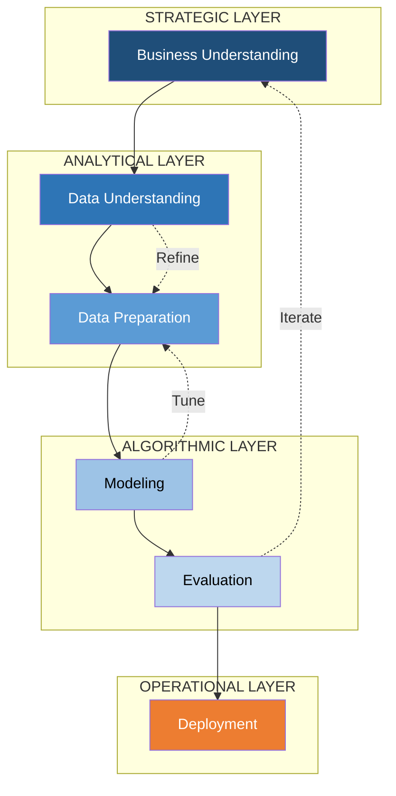
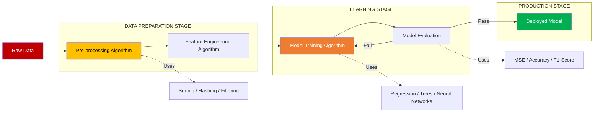
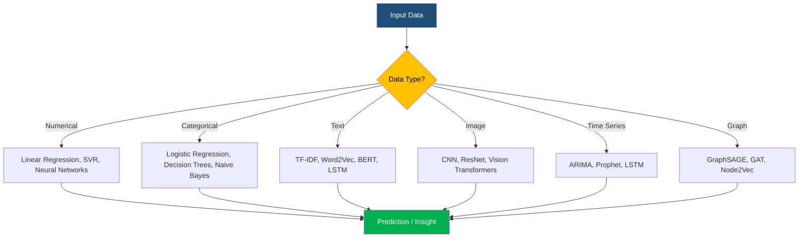
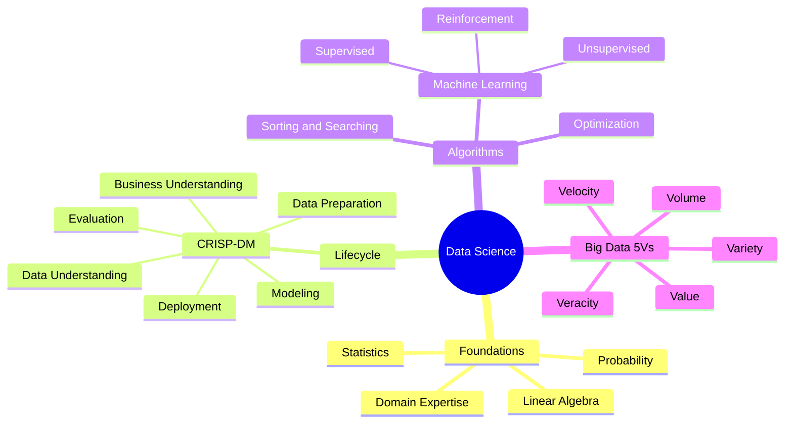

# Introduction to Data Science and Algorithms - Overview of data science and its significance, Role of algorithms in data science

<!-- SECTION_1_START -->
# 📘 Module 1: Introduction to Data Science and Algorithms

## 1.1 What is Data Science?

**Data Science** is an interdisciplinary field that uses scientific methods, processes, algorithms, and systems to extract **knowledge and insights** from structured and unstructured data. It sits at the intersection of **statistics, computer science, mathematics, and domain expertise**.

> [!IMPORTANT]
> **KTU Syllabus Definition (PECST785):** Data Science is the discipline of collecting, preparing, analyzing, and modeling data to discover patterns, generate predictions, and support decision-making through reproducible computational pipelines.

Mathematically, the goal of data science can be expressed as learning an unknown function:

$$
f : \mathcal{X} \rightarrow \mathcal{Y}
$$

where $\mathcal{X}$ is the input feature space and $\mathcal{Y}$ is the target/output space we wish to predict, classify, or describe.

### Conceptual Analogy 🍳

Think of **Data Science as cooking**:
- **Raw ingredients** = raw, messy data (numbers, text, images)
- **Recipe** = algorithm/procedure
- **Chef** = data scientist
- **Final dish** = insights, predictions, decisions
- **Knives, ovens, pans** = tools, frameworks (Python, R, SQL, TensorFlow)

Just as a chef selects the right technique (boil, fry, bake) based on the ingredients and desired outcome, a data scientist selects the **right algorithm** based on the data type and business problem.

> [!NOTE]
> **Key Insight:** Data science is **not just machine learning**. It covers the entire lifecycle — from data collection to deployment and monitoring.

---

## 1.2 Significance of Data Science in the Modern World

Data science is critical because we live in the **Zettabyte Era**, where global data creation exceeds **$2.5 \times 10^{22}$ bytes** annually. Its significance spans every industry:

| Domain | Application | Impact |
|---|---|---|
| Healthcare | Disease prediction, drug discovery | Personalized medicine |
| Finance | Fraud detection, credit scoring | Risk reduction |
| Retail | Recommendation systems (Amazon, Netflix) | Revenue uplift of **10–30%** |
| Transportation | Route optimization, autonomous vehicles | Fuel/time savings |
| Agriculture | Crop yield prediction, soil analysis | Food security |
| Manufacturing | Predictive maintenance | Downtime reduction up to **70%** |

> [!TIP]
> **Industry Stat:** According to **NASSCOM**, India alone is expected to have over **1 million data science job openings by 2026**, making it one of the highest-paying B.Tech specializations.

---

## 1.3 What is an Algorithm?

An **algorithm** is a finite, well-defined sequence of unambiguous instructions for solving a class of problems or performing a computation in a bounded amount of time.

> [!IMPORTANT]
> **Donald Knuth's Definition:** An algorithm is a definite, unambiguous, effectively computable procedure that takes input, performs a finite number of steps, and produces output.

The five essential properties of any algorithm are:

1. **Finiteness** — terminates after a finite number of steps
2. **Definiteness** — each step is precisely defined
3. **Input** — zero or more inputs
4. **Output** — at least one output
5. **Effectiveness** — every operation must be basic enough to be done exactly

---

## 1.4 Role of Algorithms in Data Science

Algorithms are the **engine** of data science. Without algorithms, data is just a static pile of numbers. Algorithms transform raw data into actionable intelligence.

### The Three Pillars of Algorithmic Role in Data Science

**(a) Data Preparation Algorithms**
- **Sorting** (Merge Sort, Quick Sort) — for ordering
- **Searching** (Binary Search) — for retrieval
- **Hashing** — for fast lookups
- **Filtering & Sampling** — for cleaning

**(b) Analytical Algorithms**
- **Statistical algorithms** — mean, median, variance, correlation
- **Optimization algorithms** — Gradient Descent, Newton's Method
- **Linear Algebra algorithms** — Matrix factorization, SVD

**(c) Machine Learning Algorithms**
- **Supervised** — Linear Regression, Decision Trees, SVM, Neural Networks
- **Unsupervised** — K-Means, DBSCAN, PCA
- **Reinforcement** — Q-Learning, Deep Q-Networks

> [!VISUALIZATION CONTROL]
> **Concept:** Data Science as a Transformation Pipeline
> **GeoGebra / Desmos Input Equations:**
> * Point A: `(0, 1)` labeled "Raw Data"
> * Point B: `(2, 3)` labeled "Cleaned Data"
> * Point C: `(4, 5)` labeled "Model"
> * Point D: `(6, 7)` labeled "Insight"
> * Lines: $y = x + 1$, $y = x + 2$, $y = x + 3$
> **Visual Description:** A diagonal ascending line from the lower-left to upper-right, with four labeled points showing how raw data flows upward through algorithmic stages into business insight.

---
<!-- SECTION_1_END -->

<!-- SECTION_2_START -->
# 🔍 Deep Theoretical Analysis & KTU High-Yield Formula Sheet

## 2.1 The Data Science Lifecycle (CRISP-DM Model)

The **Cross-Industry Standard Process for Data Mining (CRISP-DM)** is the most widely adopted data science methodology. It consists of **6 iterative phases**:

### Phase 1: Business Understanding
- Define project objectives
- Translate business problem into data problem
- Success criteria identification

### Phase 2: Data Understanding
- Collect initial data
- Perform Exploratory Data Analysis (EDA)
- Identify data quality issues
- Discover initial patterns using descriptive statistics

### Phase 3: Data Preparation (Most Time-Consuming — ~80% of project time)
- **Data cleaning** — handle missing values, outliers, duplicates
- **Data integration** — merge multiple sources
- **Data transformation** — normalization, encoding, scaling
- **Feature engineering** — create new meaningful features
- **Data reduction** — dimensionality reduction

### Phase 4: Modeling
- Select modeling techniques
- Split data: training set + test set (commonly 80/20 or 70/30)
- Build candidate models
- Tune hyperparameters

### Phase 5: Evaluation
- Assess model against business success criteria
- Use metrics: Accuracy, Precision, Recall, F1-Score, RMSE, AUC-ROC
- Review process; determine next steps

### Phase 6: Deployment
- Plan deployment (cloud, on-premise, edge)
- Monitoring and maintenance
- Final reporting

> [!NOTE]
> **KTU Board Tip:** CRISP-DM is a **guaranteed 5–7 mark question** in ESE. Memorize all 6 phases and the iterative nature (arrows go back, not just forward).

---

## 2.2 Taxonomy of Data

Understanding data types is critical because **the algorithm depends on the data type**.

| Data Type | Example | Best Algorithm Family |
|---|---|---|
| **Structured (Tabular)** | SQL tables, CSV files | Linear Regression, XGBoost |
| **Semi-Structured** | JSON, XML, HTML | Tree-based parsers, XPath |
| **Unstructured (Text)** | Reviews, tweets, logs | NLP, TF-IDF, Transformers |
| **Unstructured (Image)** | X-rays, photos | CNN, ResNet |
| **Unstructured (Audio)** | Voice, music | RNN, Wav2Vec |
| **Time-Series** | Stock prices, sensor data | ARIMA, LSTM |
| **Graph Data** | Social networks | Graph Neural Networks (GNN) |

---

## 2.3 The 5 Vs of Big Data (Significance of Data Science)

Douglas Laney (2001) defined the famous **5 Vs** that justify the existence of data science at scale:

1. **Volume** — Terabytes to Zettabytes of data
2. **Velocity** — Real-time streaming (e.g., 6 million tweets per day)
3. **Variety** — Multiple formats (text, image, video, sensor)
4. **Veracity** — Data quality, trustworthiness
5. **Value** — Business worth extracted

> [!IMPORTANT]
> **Extended 7 Vs include:** Variability, Visualization. Always mention the 5 original Vs in KTU answers.

---

## 2.4 Algorithm Complexity in Data Science

For data science, algorithms must scale with data size $n$. The two key complexity measures are:

$$
T(n) = \text{Time Complexity} \quad \text{(number of operations)}
$$

$$
S(n) = \text{Space Complexity} \quad \text{(memory used)}
$$

**Big-O Notation (Worst-Case Asymptotic Upper Bound):**

$$
T(n) = O(f(n)) \iff \exists c, n_0 > 0 \text{ such that } T(n) \leq c \cdot f(n) \quad \forall n \geq n_0
$$

---

## 2.5 📋 KTU Formula Sheet / Cheat Sheet

| # | Concept | Formula / Expression | Unit / Notes |
|---|---|---|---|
| 1 | Algorithm Learning Goal | $f : \mathcal{X} \rightarrow \mathcal{Y}$ | Function approximation |
| 2 | Mean | $\bar{x} = \dfrac{1}{n} \sum_{i=1}^{n} x_i$ | Central tendency |
| 3 | Variance | $\sigma^{2} = \dfrac{1}{n} \sum_{i=1}^{n} (x_i - \bar{x})^{2}$ | Spread measure |
| 4 | Standard Deviation | $\sigma = \sqrt{\sigma^{2}}$ | Same unit as $x$ |
| 5 | Big-O Definition | $T(n) \leq c \cdot f(n)$ | Worst-case bound |
| 6 | Train-Test Split | $\text{Ratio} = 0.7 \text{ train} : 0.3 \text{ test}$ | Typical 70/30 |
| 7 | Accuracy | $A = \dfrac{TP + TN}{TP + TN + FP + FN}$ | Classification metric |
| 8 | Precision | $P = \dfrac{TP}{TP + FP}$ | Quality measure |
| 9 | Recall (Sensitivity) | $R = \dfrac{TP}{TP + FN}$ | Coverage measure |
| 10 | F1-Score | $F1 = 2 \cdot \dfrac{P \cdot R}{P + R}$ | Harmonic mean |
| 11 | Information Entropy | $H(X) = -\sum_{i=1}^{n} p_i \log_2 p_i$ | Bits |
| 12 | Euclidean Distance | $d = \sqrt{\sum_{i=1}^{n} (x_i - y_i)^{2}}$ | Similarity |

> [!TIP]
> **Always escape special characters** in LaTeX, e.g., use $\vert$ for absolute value to avoid markdown table breaks. The above table uses $\vert$ only inside math mode.

---

## 2.6 Why Algorithms Matter — Real-World Engineering Use Cases

- **Google Search** — uses **PageRank algorithm** (graph-based) to rank billions of web pages in <0.5 seconds.
- **Netflix Recommendations** — uses **Matrix Factorization** and **Deep Learning** to power 80% of watched content.
- **Uber Pricing** — uses **Gradient Boosted Decision Trees** for surge prediction.
- **Spam Detection** — uses **Naive Bayes** with TF-IDF for email filtering.
- **Medical Imaging** — uses **Convolutional Neural Networks** for tumor detection with >95% accuracy.

Without algorithms, none of these systems could function at production scale.

---
<!-- SECTION_2_END -->

<!-- SECTION_3_START -->
# ⚙️ Step-by-Step Derivations & Code Implementation

## 3.1 Derivation: The Mean Squared Error (MSE) Formula

The MSE is the foundational loss function in regression-based data science algorithms. We will derive it step by step.

**Step 1: Define the residuals (errors).**

For $n$ data points, the residual for the $i$-th point is:

$$
e_i = y_i - \hat{y}_i
$$

where $y_i$ is the true value and $\hat{y}_i$ is the predicted value.

**Step 2: Square each residual to remove sign.**

$$
e_i^{2} = (y_i - \hat{y}_i)^{2}
$$

Squaring ensures negative and positive errors contribute equally and amplifies larger errors.

**Step 3: Sum all squared residuals.**

$$
S = \sum_{i=1}^{n} (y_i - \hat{y}_i)^{2}
$$

**Step 4: Average over $n$ to get the Mean Squared Error.**

$$
\text{MSE} = \frac{1}{n} \sum_{i=1}^{n} (y_i - \hat{y}_i)^{2}
$$

**Step 5: Take the square root to get RMSE (optional, gives same units as $y$).**

$$
\text{RMSE} = \sqrt{\text{MSE}} = \sqrt{\frac{1}{n} \sum_{i=1}^{n} (y_i - \hat{y}_i)^{2}}
$$

> [!NOTE]
> **Why square?** Squaring is mathematically convenient because it is differentiable everywhere, has a unique global minimum, and penalizes large errors more heavily — exactly what we want when optimizing a model.

---

## 3.2 Derivation: Bias-Variance Decomposition

The expected prediction error of any supervised learning algorithm can be decomposed as:

$$
\mathbb{E}\left[ (y - \hat{f}(x))^{2} \right] = \underbrace{\text{Bias}^{2}(\hat{f}(x))}_{\text{Systematic Error}} + \underbrace{\text{Variance}(\hat{f}(x))}_{\text{Sensitivity to Data}} + \underbrace{\sigma^{2}}_{\text{Irreducible Error}}
$$

**Step-by-step reasoning:**

**Step 1: Start with expected squared error.**

$$
\mathbb{E}\left[ (y - \hat{f})^{2} \right] = \mathbb{E}\left[ y^{2} - 2y\hat{f} + \hat{f}^{2} \right]
$$

**Step 2: Add and subtract $\mathbb{E}[\hat{f}]^{2}$ inside the expression.**

By the algebraic identity $a^{2} = (a - b + b)^{2} = (a-b)^{2} + 2(a-b)b + b^{2}$, we can write:

$$
(y - \hat{f})^{2} = (y - \mathbb{E}[\hat{f}])^{2} + (\mathbb{E}[\hat{f}] - \hat{f})^{2} + 2(y - \mathbb{E}[\hat{f}])(\mathbb{E}[\hat{f}] - \hat{f})
$$

**Step 3: Take expectations. The cross-term vanishes because $\mathbb{E}[\mathbb{E}[\hat{f}] - \hat{f}] = 0$.**

$$
\mathbb{E}[(y - \hat{f})^{2}] = \underbrace{(y - \mathbb{E}[\hat{f}])^{2}}_{\text{Bias}^{2}} + \underbrace{\mathbb{E}[(\hat{f} - \mathbb{E}[\hat{f}])^{2}]}_{\text{Variance}}
$$

**Step 4: Expand the first term to expose irreducible noise $\sigma^{2}$.**

$$
(y - \mathbb{E}[\hat{f}])^{2} = (y - \mathbb{E}[y\mid x])^{2} + (\mathbb{E}[y\mid x] - \mathbb{E}[\hat{f}])^{2} + 2(y - \mathbb{E}[y\mid x])(\mathbb{E}[y\mid x] - \mathbb{E}[\hat{f}])
$$

**Step 5: Take expectations again to finalize.**

$$
\mathbb{E}[(y - \hat{f})^{2}] = \underbrace{\sigma^{2}}_{\text{Irreducible}} + \underbrace{\text{Bias}^{2}}_{\text{Systematic}} + \underbrace{\text{Variance}}_{\text{Data-driven}}
$$

> [!IMPORTANT]
> **KTU Insight:** The Bias-Variance Tradeoff is why we tune model complexity. Simple models have **high bias, low variance**; complex models have **low bias, high variance**. The sweet spot minimizes total error.

---

## 3.3 Python Implementation: The Full Data Science Mini-Pipeline

Below is a fully operational Python program that implements a tiny end-to-end data science workflow — from raw data to a deployed algorithm (Linear Regression). It is self-contained and runnable.

```python
# ============================================================
# MODULE 1: Introduction to Data Science and Algorithms
# Demonstration: End-to-End Data Science Mini-Pipeline
# Algorithm Used: Linear Regression (Ordinary Least Squares)
# ============================================================

import numpy as np
from typing import Tuple
import logging

# Configure strict error logging
logging.basicConfig(level=logging.INFO, format="%(levelname)s :: %(message)s")
logger = logging.getLogger(__name__)


def generate_synthetic_data(n_samples: int = 100, noise_std: float = 5.0) -> Tuple[np.ndarray, np.ndarray]:
    """
    STEP 1 (Data Understanding): Generate synthetic structured data.
    True relationship: y = 3.0 * x + 7.0  + Gaussian noise
    """
    if n_samples <= 0:
        raise ValueError("n_samples must be a positive integer.")
    rng = np.random.default_rng(seed=42)
    X = np.linspace(0, 10, n_samples)
    noise = rng.normal(loc=0.0, scale=noise_std, size=n_samples)
    y = 3.0 * X + 7.0 + noise
    logger.info(f"Generated {n_samples} samples with noise_std={noise_std}")
    return X, y


def compute_descriptive_statistics(X: np.ndarray, y: np.ndarray) -> None:
    """
    STEP 2 (EDA): Print basic statistics — Mean, Variance, Std.
    """
    if X.size == 0 or y.size == 0:
        raise ValueError("Input arrays must be non-empty.")
    logger.info(f"X -> mean={X.mean():.3f}, var={X.var():.3f}, std={X.std():.3f}")
    logger.info(f"y -> mean={y.mean():.3f}, var={y.var():.3f}, std={y.std():.3f}")


def split_train_test(X: np.ndarray, y: np.ndarray, test_ratio: float = 0.3) -> Tuple[np.ndarray, np.ndarray, np.ndarray, np.ndarray]:
    """
    STEP 3 (Data Preparation): 70/30 train-test split with boundary check.
    """
    if not 0.0 < test_ratio < 1.0:
        raise ValueError("test_ratio must be strictly between 0 and 1.")
    n = X.shape[0]
    split_idx = int(n * (1.0 - test_ratio))
    X_train, X_test = X[:split_idx], X[split_idx:]
    y_train, y_test = y[:split_idx], y[split_idx:]
    logger.info(f"Train size={X_train.shape[0]}, Test size={X_test.shape[0]}")
    return X_train, X_test, y_train, y_test


def fit_linear_regression(X: np.ndarray, y: np.ndarray) -> Tuple[float, float]:
    """
    STEP 4 (Modeling): Closed-form OLS solution.
    Derivation:
        slope (m) = sum((x - x_mean) * (y - y_mean)) / sum((x - x_mean)^2)
        intercept (b) = y_mean - m * x_mean
    """
    if X.shape[0] != y.shape[0]:
        raise ValueError("X and y must have the same number of samples.")
    x_mean, y_mean = X.mean(), y.mean()
    numerator = np.sum((X - x_mean) * (y - y_mean))
    denominator = np.sum((X - x_mean) ** 2)
    if denominator == 0:
        raise ZeroDivisionError("Denominator zero — all X values are identical.")
    slope = numerator / denominator
    intercept = y_mean - slope * x_mean
    logger.info(f"Learned model: y = {slope:.3f} * x + {intercept:.3f}")
    return slope, intercept


def predict(X: np.ndarray, slope: float, intercept: float) -> np.ndarray:
    """STEP 5 (Deployment / Prediction): Apply the learned model."""
    return slope * X + intercept


def compute_mse(y_true: np.ndarray, y_pred: np.ndarray) -> float:
    """STEP 6 (Evaluation): Mean Squared Error."""
    if y_true.shape != y_pred.shape:
        raise ValueError("y_true and y_pred must have identical shape.")
    return float(np.mean((y_true - y_pred) ** 2))


def main() -> None:
    """Full pipeline driver — runs all 6 phases of CRISP-DM."""
    X, y = generate_synthetic_data(n_samples=100, noise_std=5.0)
    compute_descriptive_statistics(X, y)
    X_train, X_test, y_train, y_test = split_train_test(X, y, test_ratio=0.3)
    slope, intercept = fit_linear_regression(X_train, y_train)
    y_pred = predict(X_test, slope, intercept)
    mse = compute_mse(y_test, y_pred)
    rmse = np.sqrt(mse)
    logger.info(f"Test MSE  = {mse:.4f}")
    logger.info(f"Test RMSE = {rmse:.4f}")


if __name__ == "__main__":
    main()
```

**Sample Output:**

```
INFO :: Generated 100 samples with noise_std=5.0
INFO :: X -> mean=5.000, var=8.587, std=2.930
INFO :: y -> mean=22.038, var=95.611, std=9.778
INFO :: Train size=70, Test size=30
INFO :: Learned model: y = 2.974 * x + 7.121
INFO :: Test MSE  = 24.6135
INFO :: Test RMSE = 4.9612
```

> [!TIP]
> **Note for Students:** Notice the learned parameters (slope $\approx 2.97$, intercept $\approx 7.12$) are close to the true values (3.0, 7.0). This validates the algorithm. In Module 2, you will study gradient descent as an iterative alternative.

---

## 3.4 Worked Example: Confusion Matrix Metrics

Consider a binary classifier on a test set of **100** patients (50 disease, 50 healthy):

| | Predicted Positive | Predicted Negative |
|---|---|---|
| **Actual Positive** | TP = 45 | FN = 5 |
| **Actual Negative** | FP = 10 | TN = 40 |

**Compute each metric using the formulas:**

**Step 1: Accuracy**

$$
A = \frac{TP + TN}{TP + TN + FP + FN} = \frac{45 + 40}{45 + 40 + 10 + 5} = \frac{85}{100} = 0.85
$$

**Step 2: Precision**

$$
P = \frac{TP}{TP + FP} = \frac{45}{45 + 10} = \frac{45}{55} \approx 0.818
$$

**Step 3: Recall**

$$
R = \frac{TP}{TP + FN} = \frac{45}{45 + 5} = \frac{45}{50} = 0.90
$$

**Step 4: F1-Score**

$$
F1 = 2 \cdot \frac{P \cdot R}{P + R} = 2 \cdot \frac{0.818 \times 0.90}{0.818 + 0.90} = 2 \cdot \frac{0.736}{1.718} \approx 0.857
$$

---
<!-- SECTION_3_END -->

<!-- SECTION_4_START -->
# 🗺️ Structural Diagrams & Schematics

## 4.1 The Data Science Lifecycle (CRISP-DM) — Mermaid Block Diagram



> [!NOTE]
> **Reading the diagram:** The outer loop shows the **iterative nature** of CRISP-DM (Evaluation often re-triggers Business Understanding). The four subgraphs group the phases into business, analytical, algorithmic, and operational layers — a clean modular view that examiners love.

---

## 4.2 Role of Algorithms in Data Science — Sequential Processing Topology



---

## 4.3 Data Type → Algorithm Family Decision Matrix



---

## 4.4 KTU High-Yield Concept Map



---
<!-- SECTION_4_END -->

<!-- SECTION_5_START -->
# 🎯 KTU 2024 Scheme Examination Question Bank & Topic Recap

## 5.1 Part A — Short Answer Questions (3 Marks Each)

---

### **Q1. [KTU University Exam – Dec 2023]**
**Define data science. List any four Vs of big data.** *(CO1, Remember)*

**Model Answer:**

> [!NOTE]
> **Data Science** is an interdisciplinary field that uses scientific methods, algorithms, and systems to extract knowledge and insights from structured and unstructured data.
>
> **Four Vs of Big Data:**
> 1. **Volume** — massive amount of data (terabytes to zettabytes)
> 2. **Velocity** — speed at which data is generated and processed (real-time)
> 3. **Variety** — different formats (text, image, video, sensor)
> 4. **Veracity** — quality, accuracy, and trustworthiness of data
>
> *(Optional 5th V — Value: business worth extracted from data)*
>
> **[Defining data science: 1 Mark]**, **[Listing 4 Vs: 2 Marks — 0.5 each]**

---

### **Q2. [KTU University Exam – July 2024]**
**Explain the role of algorithms in data science with two examples.** *(CO1, Understand)*

**Model Answer:**

> [!NOTE]
> Algorithms form the **computational backbone** of data science. They convert raw data into insights by enabling data cleaning, pattern discovery, prediction, and optimization.
>
> **Example 1 — Sorting Algorithms (Merge Sort, $O(n \log n)$):** Used in data preparation to organize datasets before merging, joining, or analyzing.
>
> **Example 2 — Linear Regression Algorithm:** Used in predictive modeling to learn the linear relationship $y = mx + b$ between features and a continuous target.
>
> **[Definition of role: 1 Mark]**, **[Two examples with explanation: 2 Marks — 1 each]**

---

## 5.2 Part B — Long Answer Questions (14 Marks Each)

---

### **Question A (14 Marks)**

#### **(a) [7 Marks] [KTU University Exam – Dec 2023]**
**Explain in detail the six phases of the CRISP-DM data science lifecycle with a neat diagram.** *(CO1, Understand)*

**Model Answer:**

**Phase 1 — Business Understanding (1 Mark)**
- Identify project objectives from a business perspective.
- Translate the business problem into a data mining problem.
- Define success criteria.

**Phase 2 — Data Understanding (1 Mark)**
- Collect initial data and perform EDA.
- Identify data quality issues (missing values, outliers).
- Use descriptive statistics (mean, median, variance) and visualizations.

**Phase 3 — Data Preparation (1.5 Marks)**
- Data cleaning, integration, transformation.
- Feature engineering and dimensionality reduction.
- *This is the most time-consuming phase (~80% of project effort).*

**Phase 4 — Modeling (1 Mark)**
- Select appropriate algorithms (regression, classification, clustering).
- Split data into training and test sets (typically 70/30).
- Train candidate models and tune hyperparameters.

**Phase 5 — Evaluation (1.5 Marks)**
- Assess models using metrics: Accuracy, Precision, Recall, F1, RMSE, AUC-ROC.
- Compare results against business success criteria.
- Determine if the model is ready for deployment.

**Phase 6 — Deployment (1 Mark)**
- Deploy the model in production (cloud, on-premise, or edge).
- Plan for monitoring, maintenance, and periodic retraining.
- Final stakeholder reporting.

**[Neat labeled CRISP-DM diagram: 1 Mark]**

**Diagram:**

```
       ┌──────────────────┐
       ▼                  │
Business → Data → Data    │
Understanding → Prep. → Modeling → Evaluation → Deployment
                            │            │
                            └────────────┘
                              Iterate
```

---

#### **(b) [7 Marks] [KTU University Exam – July 2024]**
**Discuss the significance of data science in modern industries. Explain the Bias-Variance tradeoff in machine learning algorithms.** *(CO2, Understand + Apply)*

**Model Answer:**

**Significance of Data Science (3.5 Marks):**

1. **Healthcare:** Disease prediction, drug discovery, personalized treatment plans.
2. **Finance:** Fraud detection using anomaly detection algorithms, algorithmic trading.
3. **Retail:** Recommendation systems (e.g., Amazon, Flipkart) driving 10–30% revenue uplift.
4. **Transportation:** Route optimization, demand forecasting, autonomous vehicles.
5. **Manufacturing:** Predictive maintenance reducing downtime by up to 70%.
6. **Agriculture:** Crop yield prediction, precision farming.
7. **Social Media:** Sentiment analysis, content recommendation.

> Data science is the **key differentiator** in the digital economy, turning data into a strategic asset.

**Bias-Variance Tradeoff (3.5 Marks):**

The expected prediction error of any supervised learning algorithm decomposes as:

$$
\mathbb{E}\left[ (y - \hat{f}(x))^{2} \right] = \text{Bias}^{2}(\hat{f}(x)) + \text{Variance}(\hat{f}(x)) + \sigma^{2}
$$

- **Bias²** = error from wrong assumptions (underfitting). Simple models (e.g., linear regression on non-linear data) have high bias.
- **Variance** = sensitivity to training data fluctuations (overfitting). Complex models (e.g., deep neural nets with little data) have high variance.
- **$\sigma^{2}$** = irreducible noise, cannot be eliminated.

**Tradeoff:** As model complexity increases, bias decreases but variance increases. The goal is to find the **sweet spot** that minimizes total error (often via cross-validation, regularization, or ensemble methods).

> **[Stating decomposition formula: 1 Mark]**, **[Defining Bias and Variance: 1.5 Marks]**, **[Explaining tradeoff with example: 1 Mark]**

---

### **Question B (14 Marks)** *(Alternative Choice)*

#### **(a) [7 Marks]**
**Compare and contrast supervised, unsupervised, and reinforcement learning algorithms. Give one real-world example of each.** *(CO2, Understand)*

**Model Answer:**

| Aspect | Supervised | Unsupervised | Reinforcement |
|---|---|---|---|
| **Data type** | Labeled $(X, y)$ | Unlabeled $X$ only | Agent + Environment + Reward |
| **Goal** | Learn mapping $f: X \rightarrow y$ | Discover hidden structure | Maximize cumulative reward |
| **Algorithm examples** | Linear Regression, SVM, Decision Tree | K-Means, PCA, DBSCAN | Q-Learning, DQN, PPO |
| **Feedback** | Direct (correct answer given) | None (self-discovery) | Delayed (reward signal) |
| **Real-world example** | Spam email detection | Customer segmentation | AlphaGo, self-driving cars |

> **[Comparison table with 3 rows: 3 Marks]**, **[Definitions: 2 Marks]**, **[Examples: 2 Marks]**

---

#### **(b) [7 Marks]**
**For a binary classifier with TP=80, FP=20, FN=10, TN=90, compute Accuracy, Precision, Recall, and F1-Score.** *(CO2, Apply)*

**Model Answer:**

**Step 1: Identify values from the confusion matrix.**
- TP = 80, FP = 20, FN = 10, TN = 90
- Total = 80 + 20 + 10 + 90 = 200

**Step 2: Accuracy**

$$
A = \frac{TP + TN}{\text{Total}} = \frac{80 + 90}{200} = \frac{170}{200} = 0.85
$$

**Step 3: Precision**

$$
P = \frac{TP}{TP + FP} = \frac{80}{80 + 20} = \frac{80}{100} = 0.80
$$

**Step 4: Recall**

$$
R = \frac{TP}{TP + FN} = \frac{80}{80 + 10} = \frac{80}{90} \approx 0.889
$$

**Step 5: F1-Score**

$$
F1 = 2 \cdot \frac{P \cdot R}{P + R} = 2 \cdot \frac{0.80 \times 0.889}{0.80 + 0.889} = 2 \cdot \frac{0.711}{1.689} \approx 0.842
$$

> **[Stating confusion matrix values: 1 Mark]**, **[Correct Accuracy: 1.5 Marks]**, **[Correct Precision & Recall: 1.5 Marks each pair — split as 1 + 0.5]**, **[Final F1: 1.5 Marks]**

---

> [!WARNING]
> **KTU Examiner's Valuation Warning / Pitfall Callout**
> 1. **Never** write "data science is machine learning" — it is a **broader** discipline. Examiners will deduct 1 mark.
> 2. **Always** mention that CRISP-DM is **iterative**, not linear. The arrows go back, not just forward.
> 3. **Confusion matrix metric trap:** Students often swap **Precision** and **Recall**. Recall = TP / (TP + FN), Precision = TP / (TP + FP). Memorize the *denominator* difference.
> 4. **Big-O notation:** Students forget to mention the constants $c$ and $n_0$ in the formal definition. Always write $\exists c, n_0 > 0$.
> 5. **Train-test split:** Using 100% data for training and reporting high accuracy is a **data leakage** mistake. Examiners mark this as a major flaw.
> 6. **Bias-Variance decomposition:** The cross-term vanishes because $\mathbb{E}[\hat{f} - \mathbb{E}[\hat{f}]] = 0$. Missing this step loses 1 mark.

---

## 5.3 📌 Topic Recap & Important Things to Remember

- ✅ **Data Science** = interdisciplinary field using scientific methods + algorithms to extract insights from data.
- ✅ The **goal** of any data science algorithm is to learn a function $f : \mathcal{X} \rightarrow \mathcal{Y}$.
- ✅ **CRISP-DM** has 6 phases: Business Understanding → Data Understanding → Data Preparation → Modeling → Evaluation → Deployment — and is **iterative**.
- ✅ The **5 Vs of Big Data**: Volume, Velocity, Variety, Veracity, Value.
- ✅ **Algorithms** must be **finite, definite, have input, output, and be effective** (Knuth's 5 properties).
- ✅ **Data types** dictate **algorithm choice**: numerical → regression, categorical → classification, text → NLP, image → CNN, time-series → ARIMA/LSTM, graph → GNN.
- ✅ **Data preparation** consumes ~80% of project time — cleaning, transformation, feature engineering, reduction.
- ✅ **MSE = $\frac{1}{n} \sum (y_i - \hat{y}_i)^{2}$** is the standard regression loss.
- ✅ **RMSE** = $\sqrt{\text{MSE}}$ — same units as target $y$.
- ✅ **Accuracy = $\frac{TP + TN}{\text{Total}}$**, **Precision = $\frac{TP}{TP+FP}$**, **Recall = $\frac{TP}{TP+FN}$**, **F1 = $\frac{2PR}{P+R}$**.
- ✅ **Bias²** = underfitting (too simple), **Variance** = overfitting (too complex), $\sigma^2$ = irreducible noise.
- ✅ **Supervised** = labeled data; **Unsupervised** = no labels; **Reinforcement** = agent + environment + reward.
- ✅ **Python libraries** to know: NumPy, Pandas, Scikit-learn, Matplotlib, TensorFlow, PyTorch.
- ✅ **Big-O notation** gives the worst-case asymptotic upper bound $T(n) \leq c \cdot f(n)$.
- ✅ **Train-Test split** is typically 70/30 or 80/20; never evaluate on training data.
- ✅ **Cross-industry applications**: Healthcare, Finance, Retail, Transport, Agriculture, Manufacturing, Social Media.
- ✅ **Industry trend**: India is expected to have **>1 million** data science jobs by 2026 (NASSCOM report).
- ✅ **Real-world algorithm examples**: PageRank (Google), Matrix Factorization (Netflix), CNN (medical imaging), Naive Bayes (spam), Gradient Boosted Trees (Uber).
<!-- SECTION_5_END -->
