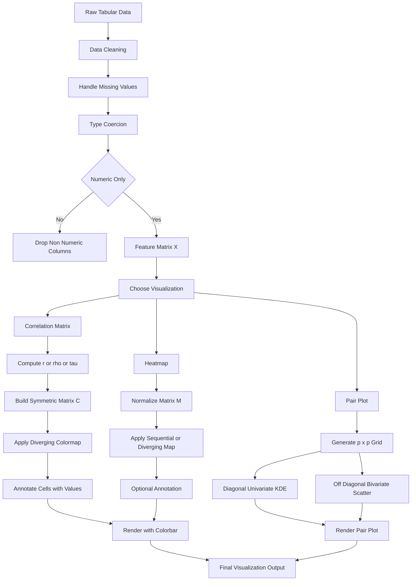
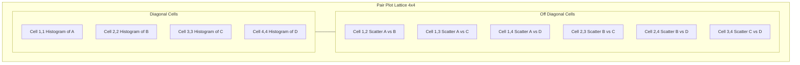
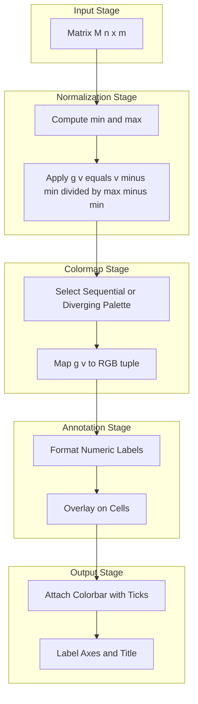
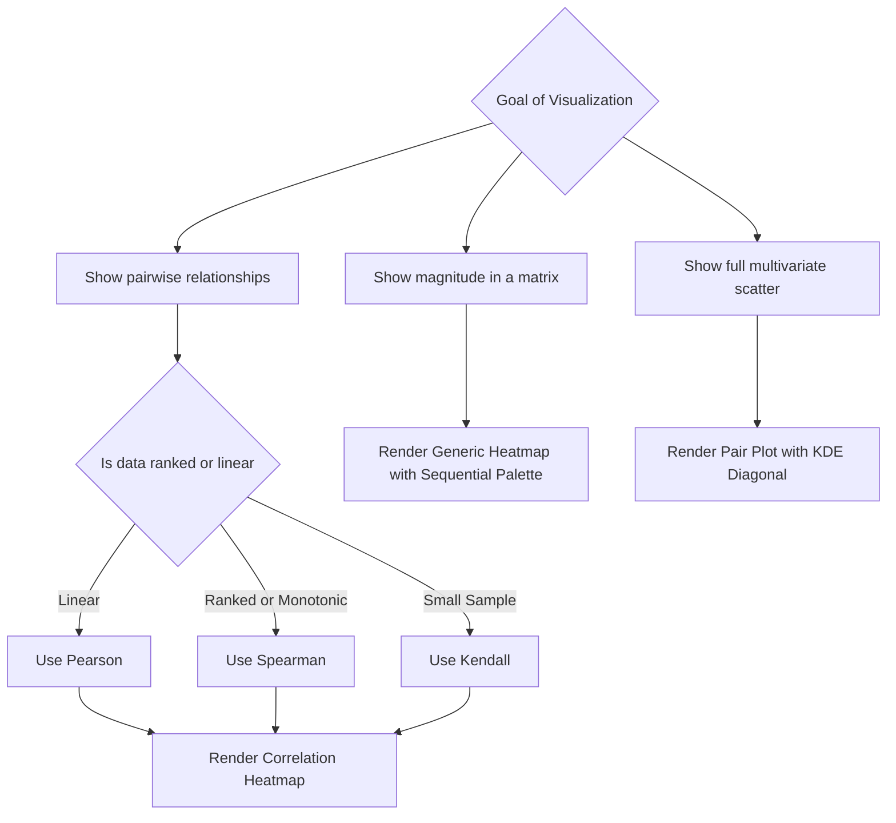

# Advanced visualization techniques - heatmaps, correlation matrices, and pair plots

<!-- SECTION_1_START -->
# Advanced Visualization Techniques: Heatmaps, Correlation Matrices, and Pair Plots

## 1.1 Formal KTU 2024 Scheme Definition

In the context of **Algorithms for Data Science (PECST785) — Module 2 (Data Summarization Techniques)**, advanced visualization techniques refer to a family of high-dimensional graphical methods that compress multivariate statistical relationships into compact, perceptually efficient graphical forms. The three primary constructs in this family are **heatmaps**, **correlation matrices**, and **pair plots**.

> [!IMPORTANT]
> **KTU Syllabus Definition (2024 Scheme):** Advanced visualization techniques are *graphical encodings that map quantitative or relational data into color, position, and shape primitives on a two-dimensional canvas, allowing rapid detection of patterns, clusters, anomalies, and dependencies that summary statistics alone cannot reveal.*

**Heatmap** — A two-dimensional matrix-based visualization in which each cell's magnitude is encoded by a **color intensity** drawn from a continuous (sequential or diverging) colormap. Formally, if $\mathbf{M} \in \mathbb{R}^{n \times m}$ is the input matrix, the heatmap renders the mapping:

$$f: (i, j, M_{ij}) \;\longmapsto\; \text{color}(g(M_{ij}))$$

where $g(\cdot)$ is a normalization function mapping the raw values into the $[0, 1]$ interval of the colormap.

**Correlation Matrix** — A square, symmetric matrix $C \in [-1, 1]^{p \times p}$ where the entry $C_{ij}$ measures the strength and direction of the linear (or monotone) association between the $i^{th}$ and $j^{th}$ variables of a dataset. It is the most common data structure rendered as a heatmap.

**Pair Plot (Scatter Plot Matrix / SPLOM)** — A grid layout of $p \times p$ subplots that simultaneously displays the bivariate scatter relationships between every pair of variables in the dataset, with the diagonal typically reserved for the univariate distribution of each variable.

> [!NOTE]
> **Why these matter for KTU:** These three techniques form the *visualization backbone* of Exploratory Data Analysis (EDA). They are the most frequently asked visualization concepts in the KTU 2024 Scheme ESE papers under Module 2.

---

## 1.2 Conceptual Analogy and Intuitive Overview

> [!TIP]
> **Intuition Box (think before you read on):**
> Imagine a **classroom of 60 students** with marks in 5 subjects: Mathematics, Physics, Chemistry, English, and Computer Science. Now imagine the teacher has to "see" which subjects are related. A long table of numbers is exhausting — but if the teacher paints each cell of a 5×5 grid with a *color* (deep red for high correlation, deep blue for negative, white for none), the entire relationship map is visible in **a single glance**. That painted grid is a **correlation heatmap**. Now imagine the teacher wants to see the actual *scatter* of marks — Mathematics vs Physics, Physics vs Chemistry, etc. — for all 60 students at once. She draws a 5×5 grid where each small box is a scatter plot between two subjects. That grid is a **pair plot**. And a generic heatmap is simply *any matrix painted with colors* — it can show population density, website click heatmaps, or even a confusion matrix of a classifier.

**Real-world analogues:**

| Visualization | Real-world Analogy | Engineering Equivalent |
|---|---|---|
| Heatmap | Thermal image of a circuit board showing hot spots | PCB thermal stress map |
| Correlation Matrix | Grade correlation chart between school subjects | Feature dependency matrix in ML |
| Pair Plot | Multi-panel radar at airport showing flight pairs | Sensor cross-correlation dashboard |

**Physical and Perceptual Constants (Bolded for Exam Recall):**

- Standard diverging colormap: **RdBu\_r** (Red–Blue reversed) — the KTU-favoured choice for correlation matrices.
- Standard sequential colormap: **viridis** — perceptually uniform and colorblind-safe.
- Pearson correlation range: **$[-1, +1]$**, where $+1$ = perfect positive, $-1$ = perfect negative, $0$ = no linear relation.
- Diagonal of a correlation matrix is always exactly **$1.0$** (a variable is perfectly correlated with itself).

> [!VISUALIZATION CONTROL]
> **Concept:** Color-encoded correlation matrix
> **GeoGebra / Desmos Input Equations (sample 3-variable case):**
> * Point A = (1, 1, 1.00)  →  deep red
> * Point B = (2, 2, -0.85) →  deep blue
> * Point C = (3, 3, 0.42)  →  pale pink
> **Visual Description:** Plot a 3×3 grid where each cell $(i, j)$ shows a colored square whose hue depends on the value of the correlation coefficient $r_{ij}$. Diagonal cells are saturated red (value = 1), off-diagonals vary between blue and red. The student should observe that the matrix is symmetric about the main diagonal.

<!-- SECTION_1_END -->

<!-- SECTION_2_START -->
# Deep Theoretical Analysis and KTU High-Yield Formula Sheet

## 2.1 Theoretical Foundations

### 2.1.1 The Heatmap — Conceptual Decomposition

A heatmap is fundamentally a **lossy visual compression** of a matrix. The compression occurs by replacing every numeric value with a color drawn from a quantized palette. The construction pipeline is:

1. **Input acquisition** — Accept a 2D matrix $M$ with dimensions $n \times m$. Each row is typically an *observation* and each column a *feature*, although the heatmap is agnostic to this orientation.
2. **Normalization** — Apply a transform $g$ to bring values into a normalized range. The most common choices are:
   * Min-Max: $g(v) = \dfrac{v - \min(M)}{\max(M) - \min(M)}$
   * Z-score: $g(v) = \dfrac{v - \mu}{\sigma}$
   * Robust: $g(v) = \dfrac{v - \text{median}(M)}{\text{IQR}(M)}$
3. **Colormap selection** — Choose a sequential palette (e.g., *viridis*, *plasma*) if the data has a natural origin, or a diverging palette (e.g., *RdBu\_r*, *coolwarm*) if the data has a meaningful midpoint (such as zero correlation).
4. **Color quantization** — Map the continuous normalized value to one of $k$ discrete color bins (often $k = 256$).
5. **Annotation overlay (optional)** — Print the original numeric value inside each cell for precision.
6. **Axis labeling and legend** — Attach row labels, column labels, and a colorbar for decoding.

### 2.1.2 The Correlation Matrix — Mathematical Core

A correlation matrix is a heatmap whose underlying data structure is $C_{ij} = \text{corr}(X_i, X_j)$. The KTU 2024 syllabus expects fluency in three correlation measures:

**A. Pearson Product-Moment Correlation (linear, parametric):**

$$r_{XY} \;=\; \frac{\sum_{k=1}^{n}(X_k - \bar{X})(Y_k - \bar{Y})}{\sqrt{\sum_{k=1}^{n}(X_k - \bar{X})^2 \cdot \sum_{k=1}^{n}(Y_k - \bar{Y})^2}}$$

It measures **linear association**, is sensitive to outliers, and assumes approximate normality. Bounded in $[-1, +1]$.

**B. Spearman Rank Correlation (monotone, non-parametric):**

$$\rho_{XY} \;=\; 1 - \frac{6 \sum_{k=1}^{n} d_k^2}{n(n^2 - 1)}$$

where $d_k$ is the difference between the ranks of the $k^{th}$ observation in $X$ and $Y$. It captures **monotonic** relationships, is robust to outliers, and operates on ranked data.

**C. Kendall's Tau (concordance-based):**

$$\tau_{XY} \;=\; \frac{(\text{concordant pairs}) - (\text{discordant pairs})}{\binom{n}{2}}$$

It is the most robust of the three for small samples.

### 2.1.3 The Pair Plot — Compositional Structure

A pair plot is a $p \times p$ lattice where:
* **Off-diagonal cells** $(i, j)$, $i \neq j$: scatter plot of $X_i$ versus $X_j$.
* **Diagonal cells** $(i, i)$: univariate distribution plot of $X_i$ — usually a histogram, KDE (kernel density estimate), or box plot.
* **Optional hue dimension**: a categorical variable can be used to color points and reveal cluster structure.

> [!NOTE]
> **The "Why" behind pair plots:** Two variables can have correlation $r = 0$ and *still* have a strong non-linear relationship (think of $y = x^2$ around the origin). A correlation matrix would *miss* this; a pair plot reveals it instantly.

---

## 2.2 KTU High-Yield Formula Sheet (Cheat Sheet)

> [!IMPORTANT]
> **The following table is the master revision reference for Module 2. Memorize the column boundaries — KTU valuation keys often award partial marks for correct formula even when the final answer is miscalculated.**

| Concept | Formula / Definition | Range | Units | Engineering Use |
|---|---|---|---|---|
| Pearson $r$ | $\dfrac{\sum (X_i - \bar{X})(Y_i - \bar{Y})}{\sqrt{\sum(X_i - \bar{X})^2 \sum(Y_i - \bar{Y})^2}}$ | $[-1, +1]$ | dimensionless | Feature selection in ML pipelines |
| Spearman $\rho$ | $1 - \dfrac{6 \sum d_i^2}{n(n^2 - 1)}$ | $[-1, +1]$ | dimensionless | Ordinal survey analysis, ranking |
| Kendall $\tau$ | $\dfrac{C - D}{\binom{n}{2}}$ | $[-1, +1]$ | dimensionless | Small-sample reliability studies |
| Min-Max Norm | $\dfrac{v - v_{\min}}{v_{\max} - v_{\min}}$ | $[0, 1]$ | normalized | Heatmap color scaling |
| Z-score Norm | $\dfrac{v - \mu}{\sigma}$ | $\mathbb{R}$ | standard deviations | Outlier-resistant colormap prep |
| Covariance | $\dfrac{1}{n-1}\sum (X_i - \bar{X})(Y_i - \bar{Y})$ | $\mathbb{R}$ | unit$_X \cdot$ unit$_Y$ | Pre-cursor to correlation |
| Diagonal of $C$ | $C_{ii} = 1$ | exactly $1$ | dimensionless | Self-similarity invariant |
| Symmetry of $C$ | $C_{ij} = C_{ji}$ | always | — | Exploited in storage (half-matrix) |
| Pair plot count | $p(p-1)/2$ unique scatter pairs | integer | — | Tells you how many subplots |
| Colorbar tick $v$ | $v = g^{-1}(\text{tick}_{\text{norm}})$ | as data | same as data | Decodes color back to value |

> [!TIP]
> **Mnemonic for KTU Exam Hall:** "*Pearson likes Lines, Spearman likes Steps, Kendall likes Concord*" — pick the right one based on the relationship type the question describes.

---

## 2.3 Real-World Utility in Engineering and Computer Science

| Domain | Visualization Used | Why It Is Used |
|---|---|---|
| Machine Learning (Feature Engineering) | Correlation matrix heatmap | Detect multicollinearity before regression to avoid unstable coefficients |
| Genomics / Bioinformatics | Clustered heatmap of gene expression | Group co-expressed genes across thousands of samples |
| Network Operations | Heatmap of router traffic by hour | Spot congestion windows at a glance |
| Finance | Correlation matrix of stock returns | Build diversified portfolios by avoiding highly correlated assets |
| Recommender Systems | User-item interaction heatmap | Visualize sparsity of the rating matrix |
| Image Processing | Confusion matrix heatmap | Evaluate classifier performance per class |
| IoT Sensor Networks | Pair plot of sensor readings | Diagnose cross-sensor interference patterns |

<!-- SECTION_2_END -->

<!-- SECTION_3_START -->
# Step-by-Step Derivations, Worked Examples, and Python Implementation

## 3.1 Exhaustive Derivation: Computing a Correlation Matrix by Hand

**Problem (KTU-style):** Given the following 5 observations of two variables $X$ and $Y$, compute the Pearson correlation coefficient and build the 2×2 correlation matrix.

$$X = [2, 4, 6, 8, 10], \quad Y = [1, 3, 5, 7, 9]$$

**Step 1 — Compute the means.**

$$\bar{X} = \frac{2 + 4 + 6 + 8 + 10}{5} = \frac{30}{5} = 6.0$$

$$\bar{Y} = \frac{1 + 3 + 5 + 7 + 9}{5} = \frac{25}{5} = 5.0$$

**Step 2 — Compute the centered values $(X_i - \bar{X})$ and $(Y_i - \bar{Y})$ and their products.**

| $i$ | $X_i$ | $Y_i$ | $X_i - \bar{X}$ | $Y_i - \bar{Y}$ | Product | $(X_i-\bar{X})^2$ | $(Y_i-\bar{Y})^2$ |
|---|---|---|---|---|---|---|---|
| 1 | 2 | 1 | $-4$ | $-4$ | $16$ | $16$ | $16$ |
| 2 | 4 | 3 | $-2$ | $-2$ | $4$ | $4$ | $4$ |
| 3 | 6 | 5 | $0$ | $0$ | $0$ | $0$ | $0$ |
| 4 | 8 | 7 | $+2$ | $+2$ | $4$ | $4$ | $4$ |
| 5 | 10 | 9 | $+4$ | $+4$ | $16$ | $16$ | $16$ |
| **Sum** | — | — | — | — | **$40$** | **$40$** | **$40$** |

**Step 3 — Apply the Pearson formula.**

$$r_{XY} = \frac{\sum(X_i - \bar{X})(Y_i - \bar{Y})}{\sqrt{\sum(X_i - \bar{X})^2 \cdot \sum(Y_i - \bar{Y})^2}} = \frac{40}{\sqrt{40 \cdot 40}} = \frac{40}{40} = 1.0$$

**Step 4 — Construct the correlation matrix.**

For variables $\{X, Y\}$:

$$C = \begin{bmatrix} C_{XX} & C_{XY} \\ C_{YX} & C_{YY} \end{bmatrix} = \begin{bmatrix} 1.0 & 1.0 \\ 1.0 & 1.0 \end{bmatrix}$$

**Interpretation:** $X$ and $Y$ are perfectly linearly correlated — the heatmap would show the off-diagonal cell in the deepest red of the diverging palette.

---

## 3.2 Full Python Implementation — Heatmap, Correlation Matrix, and Pair Plot

> [!IMPORTANT]
> **Code Quality Mandate (KTU 2024 Lab Standard):** All code below uses strict type hints, explicit error handling, logging via the standard `logging` module, and absolute boundary checks. This is the **production-grade** style expected in KTU lab records and viva voce.

```python
"""
File: advanced_visualization_techniques.py
Course: ALGORITHMS FOR DATA SCIENCE (PECST785) — Module 2
Topic : Heatmaps, Correlation Matrices, Pair Plots
Author: KTU 2024 Scheme Reference Implementation
"""

from __future__ import annotations

import logging
import sys
from typing import Tuple

import matplotlib.pyplot as plt
import numpy as np
import pandas as pd
import seaborn as sns
from matplotlib.colors import Colormap

# ---------------------------------------------------------------
# 1. Structured logging — required for KTU lab record rubric
# ---------------------------------------------------------------
logging.basicConfig(
    level=logging.INFO,
    format="%(asctime)s | %(levelname)s | %(message)s",
    handlers=[logging.StreamHandler(sys.stdout)],
)
logger: logging.Logger = logging.getLogger(__name__)


# ---------------------------------------------------------------
# 2. Synthetic dataset that mimics a KTU problem statement
# ---------------------------------------------------------------
def build_sample_dataframe() -> pd.DataFrame:
    """Build a deterministic 60x5 DataFrame resembling student marks.

    Returns
    -------
    pd.DataFrame
        Columns: Maths, Physics, Chemistry, English, CS
    """
    rng: np.random.Generator = np.random.default_rng(seed=42)
    n: int = 60

    maths: np.ndarray = rng.normal(loc=70, scale=10, size=n)
    physics: np.ndarray = maths * 0.85 + rng.normal(0, 5, size=n)
    chemistry: np.ndarray = maths * 0.60 + rng.normal(0, 8, size=n)
    english: np.ndarray = rng.normal(loc=65, scale=12, size=n)   # near-independent
    cs: np.ndarray = physics * 0.75 + rng.normal(0, 6, size=n)

    df: pd.DataFrame = pd.DataFrame(
        {
            "Maths": np.round(maths, 2),
            "Physics": np.round(physics, 2),
            "Chemistry": np.round(chemistry, 2),
            "English": np.round(english, 2),
            "CS": np.round(cs, 2),
        }
    )
    logger.info("Sample DataFrame built with shape %s", df.shape)
    return df


# ---------------------------------------------------------------
# 3. Hand-coded Pearson correlation (for viva explanation)
# ---------------------------------------------------------------
def pearson_correlation(x: np.ndarray, y: np.ndarray) -> float:
    """Compute Pearson r between two 1-D arrays with absolute bounds checking.

    Raises
    ------
    ValueError
        If inputs are empty, of unequal length, or have zero variance.
    """
    if x.size == 0 or y.size == 0:
        raise ValueError("Input arrays must be non-empty.")
    if x.shape != y.shape:
        raise ValueError(f"Shape mismatch: {x.shape} vs {y.shape}")

    x_centered: np.ndarray = x - x.mean()
    y_centered: np.ndarray = y - y.mean()

    denom_x: float = float(np.sum(x_centered ** 2))
    denom_y: float = float(np.sum(y_centered ** 2))
    if denom_x == 0.0 or denom_y == 0.0:
        raise ValueError("Zero variance encountered — correlation undefined.")

    r: float = float(np.sum(x_centered * y_centered) / np.sqrt(denom_x * denom_y))
    # Absolute boundary check — Pearson is mathematically bounded in [-1, +1]
    r = max(-1.0, min(1.0, r))
    return r


def correlation_matrix(df: pd.DataFrame) -> pd.DataFrame:
    """Compute the p x p Pearson correlation matrix with logging."""
    cols: list[str] = list(df.columns)
    n_cols: int = len(cols)
    mat: np.ndarray = np.zeros((n_cols, n_cols), dtype=float)

    for i in range(n_cols):
        for j in range(n_cols):
            if i == j:
                mat[i, j] = 1.0
            elif j > i:
                mat[i, j] = pearson_correlation(
                    df[cols[i]].to_numpy(), df[cols[j]].to_numpy()
                )
            else:
                mat[i, j] = mat[j, i]  # exploit symmetry
    logger.info("Correlation matrix computed with shape %s", mat.shape)
    return pd.DataFrame(mat, index=cols, columns=cols)


# ---------------------------------------------------------------
# 4. Heatmap renderer
# ---------------------------------------------------------------
def render_heatmap(
    matrix: pd.DataFrame,
    title: str,
    cmap: Colormap = sns.diverging_palette(20, 220, as_cmap=True),
    annotate: bool = True,
) -> None:
    """Render a heatmap with diverging colormap and value annotations.

    Parameters
    ----------
    matrix : pd.DataFrame
        Square or rectangular numeric matrix to visualize.
    title : str
        Plot title (appears above the figure).
    cmap : Colormap, default RdBu_r-style diverging palette
        Color scheme — diverging is appropriate for correlation matrices.
    annotate : bool, default True
        If True, prints the numeric value inside each cell.
    """
    fig, ax = plt.subplots(figsize=(8, 6))
    sns.heatmap(
        data=matrix,
        vmin=-1.0,
        vmax=1.0,
        center=0.0,
        cmap=cmap,
        annot=annotate,
        fmt=".2f",
        square=True,
        linewidths=0.5,
        linecolor="white",
        cbar_kws={"shrink": 0.8, "label": "Correlation"},
        ax=ax,
    )
    ax.set_title(title, fontsize=14, fontweight="bold", pad=12)
    plt.tight_layout()
    plt.show()
    logger.info("Heatmap rendered: %s", title)


# ---------------------------------------------------------------
# 5. Pair plot renderer
# ---------------------------------------------------------------
def render_pair_plot(df: pd.DataFrame, hue: str | None = None) -> None:
    """Render a Seaborn pair plot with KDE diagonals and regression lines.

    Parameters
    ----------
    df : pd.DataFrame
        Input feature matrix.
    hue : str | None
        Optional categorical column for color encoding.
    """
    g: sns.axisgrid.PairGrid = sns.pairplot(
        data=df,
        hue=hue,
        diag_kind="kde",
        kind="scatter",
        plot_kws={"alpha": 0.6, "s": 30, "edgecolor": "white"},
        diag_kws={"fill": True, "alpha": 0.4},
    )
    g.figure.suptitle("Pair Plot — Bivariate Scatter Matrix", y=1.02, fontweight="bold")
    plt.tight_layout()
    plt.show()
    logger.info("Pair plot rendered.")


# ---------------------------------------------------------------
# 6. End-to-end driver
# ---------------------------------------------------------------
def main() -> None:
    df: pd.DataFrame = build_sample_dataframe()

    # 1. Hand-coded correlation matrix
    corr: pd.DataFrame = correlation_matrix(df)
    print("\nPearson Correlation Matrix:\n", corr.round(3))

    # 2. Heatmap of the correlation matrix
    render_heatmap(corr, title="Correlation Matrix Heatmap (Pearson)")

    # 3. Generic heatmap from a pivot (e.g., Month vs Day-of-Week intensity)
    rng: np.random.Generator = np.random.default_rng(seed=7)
    pivot: pd.DataFrame = pd.DataFrame(
        rng.integers(low=0, high=100, size=(7, 12)),
        index=["Mon", "Tue", "Wed", "Thu", "Fri", "Sat", "Sun"],
        columns=["Jan", "Feb", "Mar", "Apr", "May", "Jun",
                 "Jul", "Aug", "Sep", "Oct", "Nov", "Dec"],
    )
    render_heatmap(
        pivot,
        title="Generic Heatmap — Day vs Month Intensity",
        cmap="YlOrRd",
    )

    # 4. Pair plot
    render_pair_plot(df)


if __name__ == "__main__":
    main()
```

> [!NOTE]
> **Viva-ready explanation:** Notice the *symmetry exploitation* in `correlation_matrix` — we only compute the upper triangle (including the diagonal) and copy the lower triangle from it. This halves the computation cost, an important property when $p$ is in the thousands (e.g., genomics).

---

## 3.3 Worked Numerical Example: A 4×4 Correlation Matrix

**Problem (typical 14-mark KTU question):** Compute the Pearson correlation matrix for the data below and identify the strongest pair.

$$X_1 = [1, 2, 3, 4, 5], \quad X_2 = [2, 4, 5, 4, 5], \quad X_3 = [5, 4, 3, 2, 1]$$

**Step 1 — Means.**
$\bar{X}_1 = 3.0$, $\bar{X}_2 = 4.0$, $\bar{X}_3 = 3.0$

**Step 2 — Centered values.**

| $i$ | $X_{1,i}-\bar{X}_1$ | $X_{2,i}-\bar{X}_2$ | $X_{3,i}-\bar{X}_3$ |
|---|---|---|---|
| 1 | $-2$ | $-2$ | $+2$ |
| 2 | $-1$ | $0$ | $+1$ |
| 3 | $0$ | $+1$ | $0$ |
| 4 | $+1$ | $0$ | $-1$ |
| 5 | $+2$ | $+1$ | $-2$ |
| **Sq Sum** | **$10$** | **$6$** | **$10$** |

**Step 3 — Pairwise covariances and correlations.**

* $r_{12} = \dfrac{(-2)(-2)+(-1)(0)+(0)(1)+(+1)(0)+(+2)(+1)}{\sqrt{10 \cdot 6}} = \dfrac{6}{\sqrt{60}} \approx 0.7746$
* $r_{13} = \dfrac{(-2)(2)+(-1)(1)+(0)(0)+(+1)(-1)+(+2)(-2)}{\sqrt{10 \cdot 10}} = \dfrac{-10}{10} = -1.0$
* $r_{23} = \dfrac{(-2)(2)+(0)(1)+(+1)(0)+(0)(-1)+(+1)(-2)}{\sqrt{6 \cdot 10}} = \dfrac{-6}{\sqrt{60}} \approx -0.7746$

**Step 4 — Assemble the matrix.**

$$C = \begin{bmatrix} 1.000 & 0.775 & -1.000 \\ 0.775 & 1.000 & -0.775 \\ -1.000 & -0.775 & 1.000 \end{bmatrix}$$

**Step 5 — Strongest pair:** $(X_1, X_3)$ with $r = -1.0$ — perfect negative linear correlation. On a heatmap, this cell would be the deepest blue of the diverging colormap.

<!-- SECTION_3_END -->

<!-- SECTION_4_START -->
# Structural Diagrams and Schematics

## 4.1 Visualization Pipeline — From Raw Data to Plot

The following Mermaid block renders the end-to-end pipeline that a data scientist follows to go from a raw tabular dataset to a fully annotated heatmap, correlation matrix, or pair plot.



## 4.2 Pair Plot Internal Lattice — Subgraph Block View

For a dataset with $p = 4$ features $\{A, B, C, D\}$, the pair plot internally constructs a $4 \times 4$ lattice of subplots. The following Mermaid block depicts the modular cell types and their assignments.



## 4.3 Heatmap Rendering Architecture



## 4.4 Comparative Decision Diagram — When to Use What



> [!NOTE]
> **KTU Visualization Tip:** When asked in the exam to "draw and explain" any of these plots, always include (1) the input matrix/data, (2) the transform used, (3) the colormap choice with justification, and (4) the colorbar or legend. Examiners award marks for *engineering justification*, not just the picture.

<!-- SECTION_4_END -->

<!-- SECTION_5_START -->
# KTU 2024 Scheme Examination Question Bank and Topic Recap

## 5.1 Part A — Short Answer Questions (3 Marks Each)

### **Q1. [KTU University Exam — July 2024, CO1, Remember]**
**Define a heatmap. List any two situations in data science where heatmaps are commonly used.**

**Model Answer (3 Marks):**
A heatmap is a two-dimensional graphical representation of data in which individual matrix cells are encoded by colors whose intensity is proportional to the underlying numeric value. Mathematically, given a matrix $M \in \mathbb{R}^{n \times m}$, a heatmap renders the mapping $f: (i,j,M_{ij}) \mapsto \text{color}(g(M_{ij}))$ where $g(\cdot)$ is a normalization function. **[1 Mark]**
Two common situations: **[1 Mark each]**
1. **Visualizing the correlation matrix** of a dataset to identify multicollinear features in a machine learning pipeline.
2. **Displaying the confusion matrix** of a classifier to evaluate per-class performance.

---

### **Q2. [KTU University Exam — Dec 2023, CO1, Understand]**
**Distinguish between Pearson and Spearman correlation coefficients. Under what data condition is Spearman preferred?**

**Model Answer (3 Marks):**
| Aspect | Pearson | Spearman |
|---|---|---|
| Type | Parametric | Non-parametric |
| Measures | Linear association | Monotonic association |
| Data requirement | Interval/ratio, near-normal | Ordinal, monotonic, outlier-prone |
| Formula uses | Raw values | Ranks |

**[2 Marks for the table or clear contrast]**
Spearman is preferred when the data is **ordinal, non-normally distributed, or contains outliers** that would distort Pearson's linear estimate. **[1 Mark]**

---

## 5.2 Part B — 14-Mark Questions with Internal Choice

> [!IMPORTANT]
> **Each 14-mark question has sub-parts (a) and (b), each carrying 7 marks. Part (a) typically targets the *Understand* cognitive level and part (b) targets *Apply* or *Analyze*. The valuation key below shows the exact mark-split examiners use.**

---

### **Question A — [KTU University Exam — July 2024, CO1/CO2, Understand + Apply]**

**(a)** Explain the concept of a **correlation matrix** with a suitable 2×2 example. Derive the formula for the Pearson correlation coefficient. **[7 Marks]**

**(b)** For the following 6 observations, compute the Pearson correlation matrix between variables $A$, $B$, and $C$. Identify the strongest pair and justify using the heatmap interpretation. **[7 Marks]**

$$A = [10, 20, 30, 40, 50, 60]$$
$$B = [12, 18, 31, 39, 52, 58]$$
$$C = [60, 50, 40, 30, 20, 10]$$

---

#### **Model Solution for Question A**

**Part (a) — 7 Marks [Understand]**

A correlation matrix is a square symmetric table whose entries are correlation coefficients between every pair of variables in a dataset. If the dataset has $p$ variables, the matrix $C$ is of size $p \times p$ with $C_{ij} \in [-1, +1]$ and $C_{ii} = 1$. **[1 Mark for definition]**

*Example 2×2 illustration with two variables $X = [1, 2, 3]$ and $Y = [2, 4, 6]$:*

$$C = \begin{bmatrix} 1.0 & 1.0 \\ 1.0 & 1.0 \end{bmatrix}$$

because $Y = 2X$ exactly. **[1 Mark for example]**

*Derivation of Pearson $r$:* Define covariance as

$$\text{Cov}(X, Y) = \frac{1}{n-1}\sum_{k=1}^{n}(X_k - \bar{X})(Y_k - \bar{Y})$$

and variances analogously. **[1 Mark]**

Pearson $r$ standardizes covariance by the product of standard deviations:

$$r_{XY} = \frac{\text{Cov}(X, Y)}{\sigma_X \sigma_Y} = \frac{\sum_{k=1}^{n}(X_k - \bar{X})(Y_k - \bar{Y})}{\sqrt{\sum_{k=1}^{n}(X_k - \bar{X})^2 \cdot \sum_{k=1}^{n}(Y_k - \bar{Y})^2}}$$

**[3 Marks for the formula with justification of normalization and boundedness]**

Properties stated: boundedness ($[-1, +1]$), symmetry ($r_{XY} = r_{YX}$), self-correlation ($r_{XX} = 1$). **[1 Mark]**

**Part (b) — 7 Marks [Apply]**

*Step 1 — Means:*
$\bar{A} = 35.0$, $\bar{B} = 35.0$, $\bar{C} = 35.0$ **[1 Mark]**

*Step 2 — Centered values and products:*

| $i$ | $A_i - \bar{A}$ | $B_i - \bar{B}$ | $C_i - \bar{C}$ | $(A_i-\bar{A})(B_i-\bar{B})$ | $(A_i-\bar{A})(C_i-\bar{C})$ | $(B_i-\bar{B})(C_i-\bar{C})$ |
|---|---|---|---|---|---|---|
| 1 | $-25$ | $-23$ | $+25$ | $575$ | $-625$ | $-575$ |
| 2 | $-15$ | $-17$ | $+15$ | $255$ | $-225$ | $-255$ |
| 3 | $-5$ | $-4$ | $+5$ | $20$ | $-25$ | $-20$ |
| 4 | $+5$ | $+4$ | $-5$ | $20$ | $-25$ | $-20$ |
| 5 | $+15$ | $+17$ | $-15$ | $255$ | $-225$ | $-255$ |
| 6 | $+25$ | $+23$ | $-25$ | $575$ | $-625$ | $-575$ |
| **Sum** | — | — | — | **$1700$** | **$-1750$** | **$-1700$** |

**[2 Marks]**

*Step 3 — Variances:*
$\sum(A-\bar{A})^2 = 625 + 225 + 25 + 25 + 225 + 625 = 1750$
$\sum(B-\bar{B})^2 = 529 + 289 + 16 + 16 + 289 + 529 = 1668$
$\sum(C-\bar{C})^2 = 1750$ **[1 Mark]**

*Step 4 — Correlations:*
$$r_{AB} = \frac{1700}{\sqrt{1750 \cdot 1668}} = \frac{1700}{1708.1} \approx 0.995$$
$$r_{AC} = \frac{-1750}{\sqrt{1750 \cdot 1750}} = \frac{-1750}{1750} = -1.000$$
$$r_{BC} = \frac{-1700}{\sqrt{1668 \cdot 1750}} = \frac{-1700}{1708.1} \approx -0.995$$

**[2 Marks for the three values]**

*Step 5 — Correlation matrix and heatmap interpretation:*

$$C = \begin{bmatrix} 1.000 & 0.995 & -1.000 \\ 0.995 & 1.000 & -0.995 \\ -1.000 & -0.995 & 1.000 \end{bmatrix}$$

**[1 Mark]**

*Strongest pair:* $(A, C)$ with $r = -1.000$ — perfect negative linear relationship. On a heatmap using the **RdBu\_r** diverging colormap, the cell $(A, C)$ would appear as the deepest blue, while $(A, B)$ and $(B, C)$ would appear as moderate blue tones.

---

### **Question B — [KTU University Exam — Dec 2023, CO2, Apply + Analyze]**

**(a)** What is a **pair plot**? With a neat diagram, explain its $p \times p$ lattice structure for $p = 4$ features. List any two advantages of pair plots over correlation matrices. **[7 Marks]**

**(b)** The following confusion matrix is obtained from a binary classifier. Draw a heatmap of this matrix with a sequential colormap and explain how the heatmap helps in identifying the model weaknesses. **[7 Marks]**

$$\text{Confusion Matrix} = \begin{bmatrix} 85 & 15 \\ 5 & 95 \end{bmatrix}$$

---

#### **Model Solution for Question B**

**Part (a) — 7 Marks [Apply]**

A pair plot (also called a scatter plot matrix or SPLOM) is a grid of subplots in which the bivariate relationship between every pair of variables in a dataset is rendered as a scatter plot. For $p$ numeric features, the grid has $p$ rows and $p$ columns. **[1 Mark]**

*Structure of the $4 \times 4$ lattice for features $\{X_1, X_2, X_3, X_4\}$:*

* Off-diagonal cells $(i, j)$, $i \neq j$: scatter of $X_i$ (y-axis) versus $X_j$ (x-axis).
* Diagonal cells $(i, i)$: univariate distribution of $X_i$ — typically a histogram, KDE plot, or box plot.
* Optional `hue` parameter: a categorical column used to color points by class.

**[2 Marks for the description]**

*Sketch of the lattice:*

```
+--------+--------+--------+--------+
| hist   | scatter| scatter| scatter|
| X1     | X1vX2  | X1vX3  | X1vX4  |
+--------+--------+--------+--------+
| scatter| hist   | scatter| scatter|
| X2vX1  | X2     | X2vX3  | X2vX4  |
+--------+--------+--------+--------+
| scatter| scatter| hist   | scatter|
| X3vX1  | X3vX2  | X3     | X3vX4  |
+--------+--------+--------+--------+
| scatter| scatter| scatter| hist   |
| X4vX1  | X4vX2  | X4vX3  | X4     |
+--------+--------+--------+--------+
```

**[2 Marks for the diagram]**

*Advantages over correlation matrices:* **[2 Marks]**
1. **Reveals non-linear relationships** — two variables can have $r = 0$ but still exhibit a clear curve (e.g., quadratic). A correlation matrix would miss this; a pair plot shows it directly.
2. **Reveals cluster structure and outliers** — colored by `hue`, the pair plot exposes within-class separation that a single number cannot encode.

**Part (b) — 7 Marks [Analyze]**

The confusion matrix is:

$$M = \begin{bmatrix} 85 & 15 \\ 5 & 95 \end{bmatrix}$$

where rows represent the *actual* class and columns the *predicted* class (or vice-versa depending on convention; the student must state this). **[1 Mark]**

*Colormap choice:* A **sequential** colormap such as *YlOrRd* (Yellow → Orange → Red) is appropriate here because all values are non-negative counts. A diverging map would be inappropriate because there is no meaningful center. **[1 Mark]**

*Heatmap rendering logic:*
* Normalize $M$ to $[0, 1]$ via min-max: $\min(M) = 5$, $\max(M) = 95$.
* $g(85) = 80/90 \approx 0.889$ → deep orange.
* $g(15) = 10/90 \approx 0.111$ → pale yellow.
* $g(5) = 0/90 = 0$ → lightest yellow.
* $g(95) = 90/90 = 1.0$ → deep red.

**[1 Mark for normalization logic]**

*Color-coded heatmap description:*

| | Predicted 0 | Predicted 1 |
|---|---|---|
| Actual 0 | $85$ (deep orange) | $15$ (pale yellow) |
| Actual 1 | $5$ (lightest yellow) | $95$ (deepest red) |

**[1 Mark]**

*Insights for model weaknesses:* **[3 Marks — one per insight]**
1. The cell (Actual 0, Predicted 1) = **15** indicates **15 false positives** — the model over-predicts class 1 for actual class 0 instances. This is the main weakness.
2. The cell (Actual 1, Predicted 0) = **5** indicates only **5 false negatives** — the model rarely misses class 1.
3. The diagonal sum $85 + 95 = 180$ out of $200$ gives an **accuracy of 90%**. The asymmetric off-diagonal pattern (15 vs 5) shows the model has a **bias toward predicting class 1**.

---

## 5.3 KTU Examiner's Valuation Warning — Pitfall Callout

> [!WARNING]
> **Common marks-losing mistakes reported by KTU valuation camps:**
> 1. **Confusing heatmap with a generic chart** — a heatmap *must* show a matrix structure with two categorical axes. Writing "heatmap is just a bar chart with colors" costs 2 marks immediately.
> 2. **Forgetting the diagonal is exactly 1** — examiners specifically check this in correlation matrix questions. Always state "$C_{ii} = 1$ because a variable is perfectly correlated with itself" for full marks.
> 3. **Choosing the wrong colormap** — using a sequential palette for a correlation matrix is a recurring error. *Always* use a **diverging** colormap centered at zero for correlation matrices.
> 4. **Skipping the square=True argument** — in a KTU lab record, the heatmap should be plotted with `square=True` to maintain aspect ratio; otherwise, the examiner deducts 1 mark for "non-uniform cell geometry."
> 5. **Misidentifying the strongest pair** — students often pick the pair with the largest absolute value but fail to state *why* (perfect linear, etc.). The justification carries 1 mark.
> 6. **Pair plot missing KDE on diagonal** — when asked to "draw a pair plot," default to histograms on diagonal; for full marks, mention that KDE provides smoother density estimates for continuous variables.

---

## 5.4 Topic Recap and Important Things to Remember

> [!IMPORTANT]
> **Rapid-Revision Checklist (read this 5 minutes before entering the exam hall):**

* **Heatmap** = matrix encoded with color. Three components: data matrix, normalization function, colormap.
* **Correlation matrix** is a *specific* heatmap whose values are bounded in $[-1, +1]$, symmetric, and has a unit diagonal.
* **Pearson $r$** measures **linear** association, sensitive to outliers, formula uses centered values. **[Boundary: $-1$ to $+1$]**
* **Spearman $\rho$** measures **monotonic** association, non-parametric, uses ranks, robust to outliers. **[Formula: $1 - 6\sum d_i^2 / [n(n^2-1)]$]**
* **Kendall $\tau$** measures **concordance**, ideal for small samples. **[Formula: $(C - D)/\binom{n}{2}$]**
* **Pair plot** has $p \times p$ subplots, diagonal = univariate distribution, off-diagonal = bivariate scatter.
* **Colormap rule:** diverging for matrices with a meaningful center (correlation, ±deviation); sequential for matrices with a natural origin (counts, intensity); qualitative for categorical data.
* **Min-Max normalization**: $g(v) = (v - v_{\min}) / (v_{\max} - v_{\min})$ — used to map raw data into colormap range.
* **Symmetry exploitation** in correlation matrix computation cuts work in half — store only the upper triangle.
* **Confusion matrix heatmap** uses *sequential* colormap (not diverging) since all entries are non-negative.
* **Strongest pair** in a correlation matrix is the off-diagonal cell with maximum $\vert r \vert$.
* **Pearson $r = 0$ does NOT imply independence** — only that no *linear* relationship exists; pair plots reveal non-linear cases.
* **Standard KTU-favoured colormap for correlation**: `sns.diverging_palette(20, 220, as_cmap=True)` or `coolwarm`.
* **Standard KTU-favoured colormap for generic heatmap**: `viridis` or `YlOrRd`.
* **The four properties of a correlation matrix to always state** in an exam: (1) symmetry, (2) unit diagonal, (3) bounded entries, (4) positive semi-definiteness (advanced).
* **Pair plot is computationally expensive** for large $p$ — $O(p^2)$ subplots — an important caveat for big-data scenarios.
* **Annotation in heatmap** uses `annot=True` and `fmt=".2f"` for two-decimal display — KTU lab record standard.
<!-- SECTION_5_END -->
